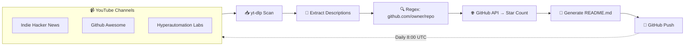

  
  
  
  

  

 

  <h1>🚀 Must-Have Projects</h1>
  <h3><em>The Ultimate Open-Source Discovery Feed</em></h3>

  
<strong>Automatically curated from the best YouTube channels.</strong> 
  Every GitHub project mentioned in video descriptions — extracted, ranked by stars, and always up to date.

 
| | | | |
|---|---|---|---|
| 🗂️ **4294** Projects Tracked | ⭐ **20,771,154** GitHub Stars | 📡 **3** Channels Scanned | 🔄 **Daily** Auto-Update |
| 🏆 **10** Starred Projects | 🌟 **2,267,953** Combined Top-3 Stars | 🎯 **100%** From Descriptions | 📅 **Every 8:00 AM** Refresh |

## ✨ Why Must-Have Projects?

<table>
  <tr>
    <td width="50%">

      ### 🎯 Zero Noise
      No AI-generated filler. No random repos. Every project here was **hand-picked by expert curators** on YouTube — then extracted, verified, and ranked by live star count.

    </td>
    <td width="50%">

      ### ⚡ Fresh Daily
      Our bot scans **3 channels** every morning at 8:00 UTC. New videos → new projects → updated README. No stale data, no manual work.

    </td>
  </tr>
  <tr>
    <td width="50%">

      ### 🔍 Smart Discovery
      Find projects by star count, source channel, or browse the full table. Every entry links back to the YouTube video that featured it — context matters.

    </td>
    <td width="50%">

      ### 📊 Live Stats
      Star counts refresh on every scan via the GitHub API. See exactly how popular each project is — right now, not last month.

    </td>
  </tr>
</table>

 
## 🏆 Top 10 Projects

<table>
  <tr>
    <th>#</th>
    <th>Project</th>
    <th>Stars</th>
    <th>Source</th>
  </tr>
  <tr>
    <td><b>#1</b></td>
    <td><a href="https://github.com/openclaw/openclaw"><b>openclaw/openclaw</b></a></td>
    <td></td>
    <td>🎙️ <a href="https://www.youtube.com/@indiehackernews">Indie Hacker News</a></td>
  </tr>
  <tr>
    <td><b>#2</b></td>
    <td><a href="https://github.com/obra/superpowers"><b>obra/superpowers</b></a></td>
    <td></td>
    <td>🎙️ <a href="https://www.youtube.com/@indiehackernews">Indie Hacker News</a></td>
  </tr>
  <tr>
    <td><b>#3</b></td>
    <td><a href="https://github.com/affaan-m/ecc"><b>affaan-m/ecc</b></a></td>
    <td></td>
    <td>🎙️ <a href="https://www.youtube.com/@indiehackernews">Indie Hacker News</a></td>
  </tr>
  <tr>
    <td><b>#4</b></td>
    <td><a href="https://github.com/nousresearch/hermes-agent"><b>nousresearch/hermes-agent</b></a></td>
    <td></td>
    <td>🎙️ <a href="https://www.youtube.com/@indiehackernews">Indie Hacker News</a></td>
  </tr>
  <tr>
    <td><b>#5</b></td>
    <td><a href="https://github.com/deepseek-ai/deepseek-harness"><b>deepseek-ai/deepseek-harness</b></a></td>
    <td></td>
    <td>🎙️ <a href="https://www.youtube.com/@indiehackernews">Indie Hacker News</a></td>
  </tr>
  <tr>
    <td><b>#6</b></td>
    <td><a href="https://github.com/n8n-io/n8n"><b>n8n-io/n8n</b></a></td>
    <td></td>
    <td>🤖 <a href="https://www.youtube.com/@hyperautomationlabs1045">Hyperautomation Labs</a></td>
  </tr>
  <tr>
    <td><b>#7</b></td>
    <td><a href="https://github.com/anomalyco/opencode"><b>anomalyco/opencode</b></a></td>
    <td></td>
    <td>🤖 <a href="https://www.youtube.com/@hyperautomationlabs1045">Hyperautomation Labs</a></td>
  </tr>
  <tr>
    <td><b>#8</b></td>
    <td><a href="https://github.com/mattpocock/skills"><b>mattpocock/skills</b></a></td>
    <td></td>
    <td>🎙️ <a href="https://www.youtube.com/@indiehackernews">Indie Hacker News</a></td>
  </tr>
  <tr>
    <td><b>#9</b></td>
    <td><a href="https://github.com/ollama/ollama"><b>ollama/ollama</b></a></td>
    <td></td>
    <td>🤖 <a href="https://www.youtube.com/@hyperautomationlabs1045">Hyperautomation Labs</a></td>
  </tr>
  <tr>
    <td><b>#10</b></td>
    <td><a href="https://github.com/microsoft/markitdown"><b>microsoft/markitdown</b></a></td>
    <td></td>
    <td>🤖 <a href="https://www.youtube.com/@hyperautomationlabs1045">Hyperautomation Labs</a></td>
  </tr>
</table>

 
## 🔄 How It Works

 
## 📡 Source Channels

| Channel | Description | Projects Found |
|---------|-------------|---------------|
| [🎙️ Indie Hacker News](https://www.youtube.com/@indiehackernews) | Daily news digest for indie hackers, bootstrappers, and solo founders | 82 projects · 4,194,125 ⭐ |
| [🌟 Github Awesome](https://www.youtube.com/@GithubAwesome) | Latest trending GitHub repositories — fresh, daily, packed with inspiration | 4064 projects · 10,667,032 ⭐ |
| [🤖 Hyperautomation Labs](https://www.youtube.com/@hyperautomationlabs1045) | AI coding tools, agentic workflows, and developer automation | 148 projects · 5,909,997 ⭐ |

 
## 📋 All Projects by Channel

  
<strong>🎙️ Indie Hacker News</strong> — 82 projects · 4,194,125 ⭐

  <table>
    <thead>
      <tr>
        <th>#</th>
        <th>Project</th>
        <th>Stars</th>
        <th>Video</th>
      </tr>
    </thead>
    <tbody>
      <tr>
        <td>1</td>
        <td><a href="https://github.com/openclaw/openclaw"><b>openclaw/openclaw</b></a></td>
        <td></td>
        <td><a href="https://www.youtube.com/watch?v=1f47uxieM8U">Anthropic charges $200 if &#x27;OpenClaw&#x27; shows...</a></td>
      </tr>
      <tr>
        <td>2</td>
        <td><a href="https://github.com/obra/superpowers"><b>obra/superpowers</b></a></td>
        <td></td>
        <td><a href="https://www.youtube.com/watch?v=utRYkiqGuZI">One dev&#x27;s Claude workflow hit 174k stars i...</a></td>
      </tr>
      <tr>
        <td>3</td>
        <td><a href="https://github.com/affaan-m/ecc"><b>affaan-m/ecc</b></a></td>
        <td></td>
        <td><a href="https://www.youtube.com/watch?v=3yEBr11GnjU">He open-sourced his Claude Code setup (255...</a></td>
      </tr>
      <tr>
        <td>4</td>
        <td><a href="https://github.com/nousresearch/hermes-agent"><b>nousresearch/hermes-agent</b></a></td>
        <td></td>
        <td><a href="https://www.youtube.com/watch?v=a90aMHFWMlA">Discord Nerds Built the Agent Everyone&#x27;s S...</a></td>
      </tr>
      <tr>
        <td>5</td>
        <td><a href="https://github.com/deepseek-ai/deepseek-harness"><b>deepseek-ai/deepseek-harness</b></a></td>
        <td></td>
        <td><a href="https://www.youtube.com/watch?v=Yrwmja_cZds">DeepSeek open-sourced Claude Code (210k st...</a></td>
      </tr>
      <tr>
        <td>6</td>
        <td><a href="https://github.com/mattpocock/skills"><b>mattpocock/skills</b></a></td>
        <td></td>
        <td><a href="https://www.youtube.com/watch?v=m8U0dPfuoN8">The 36K-star Claude Code folder Matt Pococ...</a></td>
      </tr>
      <tr>
        <td>7</td>
        <td><a href="https://github.com/google-gemini/gemini-cli"><b>google-gemini/gemini-cli</b></a></td>
        <td></td>
        <td><a href="https://www.youtube.com/watch?v=sOrz2uUKBK0">Still says free: The Gemini CLI README, Se...</a></td>
      </tr>
      <tr>
        <td>8</td>
        <td><a href="https://github.com/openai/codex"><b>openai/codex</b></a></td>
        <td></td>
        <td><a href="https://www.youtube.com/watch?v=I0haauvBPPs">OpenAI turned Codex into a desktop agent t...</a></td>
      </tr>
      <tr>
        <td>9</td>
        <td><a href="https://github.com/tauricresearch/tradingagents"><b>tauricresearch/tradingagents</b></a></td>
        <td></td>
        <td><a href="https://www.youtube.com/watch?v=9FoEsXNGLwI">Someone open-sourced a hedge fund (53k sta...</a></td>
      </tr>
      <tr>
        <td>10</td>
        <td><a href="https://github.com/karpathy/autoresearch"><b>karpathy/autoresearch</b></a></td>
        <td></td>
        <td><a href="https://www.youtube.com/watch?v=dxQYt9QnNeQ">This AI improves while you sleep!</a></td>
      </tr>
      <tr>
        <td>11</td>
        <td><a href="https://github.com/louislam/uptime-kuma"><b>louislam/uptime-kuma</b></a></td>
        <td></td>
        <td><a href="https://www.youtube.com/watch?v=RzJQrfZE2P8">Someone open-sourced Pingdom to learn Vue ...</a></td>
      </tr>
      <tr>
        <td>12</td>
        <td><a href="https://github.com/dietrichgebert/ponytail"><b>dietrichgebert/ponytail</b></a></td>
        <td></td>
        <td><a href="https://www.youtube.com/watch?v=ZC94dd7e_vA">Someone open-sourced a lazy senior dev (80...</a></td>
      </tr>
      <tr>
        <td>13</td>
        <td><a href="https://github.com/stirling-tools/stirling-pdf"><b>stirling-tools/stirling-pdf</b></a></td>
        <td></td>
        <td><a href="https://www.youtube.com/watch?v=666Rat-pT7U">He open-sourced Adobe Acrobat (85,000 stars)</a></td>
      </tr>
      <tr>
        <td>14</td>
        <td><a href="https://github.com/ruvnet/ruview"><b>ruvnet/ruview</b></a></td>
        <td></td>
        <td><a href="https://www.youtube.com/watch?v=wCH63grKOtA">The $9 chip that sees through walls (47K s...</a></td>
      </tr>
      <tr>
        <td>15</td>
        <td><a href="https://github.com/nexu-io/open-design"><b>nexu-io/open-design</b></a></td>
        <td></td>
        <td><a href="https://www.youtube.com/watch?v=X3_mVpXF5wA">Someone open-sourced Claude Design (78k st...</a></td>
      </tr>
      <tr>
        <td>16</td>
        <td><a href="https://github.com/opencut-app/opencut"><b>opencut-app/opencut</b></a></td>
        <td></td>
        <td><a href="https://www.youtube.com/watch?v=96i9yhp8cjg">CapCut claimed your face. So he built Open...</a></td>
      </tr>
      <tr>
        <td>17</td>
        <td><a href="https://github.com/bytedance/deer-flow"><b>bytedance/deer-flow</b></a></td>
        <td></td>
        <td><a href="https://www.youtube.com/watch?v=l__5ssiHl4E">ByteDance&#x27;s DeerFlow hits #1 on GitHub Tre...</a></td>
      </tr>
      <tr>
        <td>18</td>
        <td><a href="https://github.com/dani-garcia/vaultwarden"><b>dani-garcia/vaultwarden</b></a></td>
        <td></td>
        <td><a href="https://www.youtube.com/watch?v=oYY-2nWeKYA">Someone open-sourced Bitwarden&#x27;s paid tier...</a></td>
      </tr>
      <tr>
        <td>19</td>
        <td><a href="https://github.com/zhulinsen/daily_stock_analysis"><b>zhulinsen/daily_stock_analysis</b></a></td>
        <td></td>
        <td><a href="https://www.youtube.com/watch?v=4nEpYAJsgRw">Is this free GitHub AI stock analyst actua...</a></td>
      </tr>
      <tr>
        <td>20</td>
        <td><a href="https://github.com/ghostty-org/ghostty"><b>ghostty-org/ghostty</b></a></td>
        <td></td>
        <td><a href="https://www.youtube.com/watch?v=LlC5fAaCBes">Why GitHub&#x27;s biggest creator just left aft...</a></td>
      </tr>
      <tr>
        <td>21</td>
        <td><a href="https://github.com/penpot/penpot"><b>penpot/penpot</b></a></td>
        <td></td>
        <td><a href="https://www.youtube.com/watch?v=i2rlDRlVkTE">The 49k-star open-source Figma you can sel...</a></td>
      </tr>
      <tr>
        <td>22</td>
        <td><a href="https://github.com/karpathy/nanochat"><b>karpathy/nanochat</b></a></td>
        <td></td>
        <td><a href="https://www.youtube.com/watch?v=dxQYt9QnNeQ">This AI improves while you sleep!</a></td>
      </tr>
      <tr>
        <td>23</td>
        <td><a href="https://github.com/makeplane/plane"><b>makeplane/plane</b></a></td>
        <td></td>
        <td><a href="https://www.youtube.com/watch?v=tTqfwNG2EYU">Someone open-sourced Jira (and it imports ...</a></td>
      </tr>
      <tr>
        <td>24</td>
        <td><a href="https://github.com/twentyhq/twenty"><b>twentyhq/twenty</b></a></td>
        <td></td>
        <td><a href="https://www.youtube.com/watch?v=jJi3cR_D6oA">Someone basically open-sourced Salesforce</a></td>
      </tr>
      <tr>
        <td>25</td>
        <td><a href="https://github.com/microsoft/vibevoice"><b>microsoft/vibevoice</b></a></td>
        <td></td>
        <td><a href="https://www.youtube.com/watch?v=qaVpKM5H6cg">They deleted Microsoft&#x27;s frontier voice AI...</a></td>
      </tr>
      <tr>
        <td>26</td>
        <td><a href="https://github.com/calcom/cal.diy"><b>calcom/cal.diy</b></a></td>
        <td></td>
        <td><a href="https://www.youtube.com/watch?v=iotbskmQ6DI">Someone open-sourced Calendly, then delete...</a></td>
      </tr>
      <tr>
        <td>27</td>
        <td><a href="https://github.com/jamiepine/voicebox"><b>jamiepine/voicebox</b></a></td>
        <td></td>
        <td><a href="https://www.youtube.com/watch?v=6php8icEtKk">The open-source ElevenLabs just hit 18K st...</a></td>
      </tr>
      <tr>
        <td>28</td>
        <td><a href="https://github.com/microsoft/qlib"><b>microsoft/qlib</b></a></td>
        <td></td>
        <td><a href="https://www.youtube.com/watch?v=3pJnBTcLTUM">Microsoft open-sourced a hedge fund&#x27;s AI (...</a></td>
      </tr>
      <tr>
        <td>29</td>
        <td><a href="https://github.com/keygraphhq/shannon"><b>keygraphhq/shannon</b></a></td>
        <td></td>
        <td><a href="https://www.youtube.com/watch?v=XCb6qweCsMc">This $50 AI hacker is terrifying</a></td>
      </tr>
      <tr>
        <td>30</td>
        <td><a href="https://github.com/abhigyanpatwari/gitnexus"><b>abhigyanpatwari/gitnexus</b></a></td>
        <td></td>
        <td><a href="https://www.youtube.com/watch?v=O6t94PrYimI">GitNexus: the 30k-star knowledge graph you...</a></td>
      </tr>
      <tr>
        <td>31</td>
        <td><a href="https://github.com/usestrix/strix"><b>usestrix/strix</b></a></td>
        <td></td>
        <td><a href="https://www.youtube.com/watch?v=PZsvR_jfGls">Someone open-sourced a $270M AI hacker (26...</a></td>
      </tr>
      <tr>
        <td>32</td>
        <td><a href="https://github.com/vnpy/vnpy"><b>vnpy/vnpy</b></a></td>
        <td></td>
        <td><a href="https://www.youtube.com/watch?v=WEJ_hDmSF1g">A Chinese quant open-sourced his trading f...</a></td>
      </tr>
      <tr>
        <td>33</td>
        <td><a href="https://github.com/juspay/hyperswitch"><b>juspay/hyperswitch</b></a></td>
        <td></td>
        <td><a href="https://www.youtube.com/watch?v=9e86er4RTmk">Why big tech is terrified of this open-sou...</a></td>
      </tr>
      <tr>
        <td>34</td>
        <td><a href="https://github.com/calesthio/openmontage"><b>calesthio/openmontage</b></a></td>
        <td></td>
        <td><a href="https://www.youtube.com/watch?v=ANlP8l3AdKU">Your coding agent can now make a movie for...</a></td>
      </tr>
      <tr>
        <td>35</td>
        <td><a href="https://github.com/multica-ai/multica"><b>multica-ai/multica</b></a></td>
        <td></td>
        <td><a href="https://www.youtube.com/watch?v=TSPPWbTrZHw">Multica turns coding agents into real team...</a></td>
      </tr>
      <tr>
        <td>36</td>
        <td><a href="https://github.com/hmbown/deepseek-tui"><b>hmbown/deepseek-tui</b></a></td>
        <td></td>
        <td><a href="https://www.youtube.com/watch?v=VqeVkLgyeso">Claude Code at 1/100th the price (3.8k-sta...</a></td>
      </tr>
      <tr>
        <td>37</td>
        <td><a href="https://github.com/siddharthvaddem/openscreen"><b>siddharthvaddem/openscreen</b></a></td>
        <td></td>
        <td><a href="https://www.youtube.com/watch?v=W37gvmJXpbY">This free app replaced Screen Studio for m...</a></td>
      </tr>
      <tr>
        <td>38</td>
        <td><a href="https://github.com/heygen-com/hyperframes"><b>heygen-com/hyperframes</b></a></td>
        <td></td>
        <td><a href="https://www.youtube.com/watch?v=SKxLauv_gCk">HeyGen quietly shipped HyperFrames...</a></td>
      </tr>
      <tr>
        <td>39</td>
        <td><a href="https://github.com/tinyhumansai/openhuman"><b>tinyhumansai/openhuman</b></a></td>
        <td></td>
        <td><a href="https://www.youtube.com/watch?v=6YuaP7saRy0">Someone open-sourced Clippy (and made him ...</a></td>
      </tr>
      <tr>
        <td>40</td>
        <td><a href="https://github.com/deusdata/codebase-memory-mcp"><b>deusdata/codebase-memory-mcp</b></a></td>
        <td></td>
        <td><a href="https://www.youtube.com/watch?v=l4RmK6_xNrA">The knowledge graph that cuts AI agent tok...</a></td>
      </tr>
      <tr>
        <td>41</td>
        <td><a href="https://github.com/chatwoot/chatwoot"><b>chatwoot/chatwoot</b></a></td>
        <td></td>
        <td><a href="https://www.youtube.com/watch?v=V-EhOmdJLos">Someone open-sourced Intercom (30k stars)</a></td>
      </tr>
      <tr>
        <td>42</td>
        <td><a href="https://github.com/shiyu-coder/kronos"><b>shiyu-coder/kronos</b></a></td>
        <td></td>
        <td><a href="https://www.youtube.com/watch?v=NyH63NFxa78">Kronos: the open-source model that reads c...</a></td>
      </tr>
      <tr>
        <td>43</td>
        <td><a href="https://github.com/anthropics/financial-services"><b>anthropics/financial-services</b></a></td>
        <td></td>
        <td><a href="https://www.youtube.com/watch?v=E4GNZxJQqfM">Anthropic just open-sourced Wall Street (1...</a></td>
      </tr>
      <tr>
        <td>44</td>
        <td><a href="https://github.com/block/buzz"><b>block/buzz</b></a></td>
        <td></td>
        <td><a href="https://www.youtube.com/watch?v=RdT-qB1z80c">Block open-sourced Buzz!</a></td>
      </tr>
      <tr>
        <td>45</td>
        <td><a href="https://github.com/topoteretes/cognee"><b>topoteretes/cognee</b></a></td>
        <td></td>
        <td><a href="https://www.youtube.com/watch?v=hptLfB4RVA0">This open-source engine gives AI agents re...</a></td>
      </tr>
      <tr>
        <td>46</td>
        <td><a href="https://github.com/cloakhq/cloakbrowser"><b>cloakhq/cloakbrowser</b></a></td>
        <td></td>
        <td><a href="https://www.youtube.com/watch?v=6dzh2_M-xmc">CloakBrowser: when open-source destroys Sa...</a></td>
      </tr>
      <tr>
        <td>47</td>
        <td><a href="https://github.com/fincept-corporation/finceptterminal"><b>fincept-corporation/finceptterminal</b></a></td>
        <td></td>
        <td><a href="https://www.youtube.com/watch?v=w92O9Vg5dxg">An Indian solo dev open-sourced the $24K B...</a></td>
      </tr>
      <tr>
        <td>48</td>
        <td><a href="https://github.com/hkuds/vibe-trading"><b>hkuds/vibe-trading</b></a></td>
        <td></td>
        <td><a href="https://www.youtube.com/watch?v=IRjEILhtmW8">The open-source trading agent that broke t...</a></td>
      </tr>
      <tr>
        <td>49</td>
        <td><a href="https://github.com/virattt/dexter"><b>virattt/dexter</b></a></td>
        <td></td>
        <td><a href="https://www.youtube.com/watch?v=jPeHDD1feP4">He open-sourced a hedge fund. Now he&#x27;s com...</a></td>
      </tr>
      <tr>
        <td>50</td>
        <td><a href="https://github.com/google-ai-edge/gallery"><b>google-ai-edge/gallery</b></a></td>
        <td></td>
        <td><a href="https://www.youtube.com/watch?v=IUg5v9oZ3pQ">Google quietly shipped Gemma 4 on your pho...</a></td>
      </tr>
      <tr>
        <td>51</td>
        <td><a href="https://github.com/knadh/listmonk"><b>knadh/listmonk</b></a></td>
        <td></td>
        <td><a href="https://www.youtube.com/watch?v=MfCFiniCJv0">This lets you send millions of emails for ...</a></td>
      </tr>
      <tr>
        <td>52</td>
        <td><a href="https://github.com/hkuds/ai-trader"><b>hkuds/ai-trader</b></a></td>
        <td></td>
        <td><a href="https://www.youtube.com/watch?v=2hwS_r-ZAN0">Someone open-sourced a copy-trading agent</a></td>
      </tr>
      <tr>
        <td>53</td>
        <td><a href="https://github.com/ai4finance-foundation/fingpt"><b>ai4finance-foundation/fingpt</b></a></td>
        <td></td>
        <td><a href="https://www.youtube.com/watch?v=gYA77dgqezQ">The $300 open-source AI beating Bloomberg ...</a></td>
      </tr>
      <tr>
        <td>54</td>
        <td><a href="https://github.com/mksglu/context-mode"><b>mksglu/context-mode</b></a></td>
        <td></td>
        <td><a href="https://www.youtube.com/watch?v=Lj6GAVmqkOo">This single MCP server saves $1000s on tok...</a></td>
      </tr>
      <tr>
        <td>55</td>
        <td><a href="https://github.com/antirez/ds4"><b>antirez/ds4</b></a></td>
        <td></td>
        <td><a href="https://www.youtube.com/watch?v=ATo-t1HAd0M">The Redis creator wrote his own AI engine ...</a></td>
      </tr>
      <tr>
        <td>56</td>
        <td><a href="https://github.com/wasp-lang/wasp"><b>wasp-lang/wasp</b></a></td>
        <td></td>
        <td><a href="https://www.youtube.com/watch?v=K8JZg3P6254">They spent $5M on a new language. It was a...</a></td>
      </tr>
      <tr>
        <td>57</td>
        <td><a href="https://github.com/jundot/omlx"><b>jundot/omlx</b></a></td>
        <td></td>
        <td><a href="https://www.youtube.com/watch?v=GyNI23j_z_k">He made local Claude Code 30x faster on Mac</a></td>
      </tr>
      <tr>
        <td>58</td>
        <td><a href="https://github.com/midday-ai/midday"><b>midday-ai/midday</b></a></td>
        <td></td>
        <td><a href="https://www.youtube.com/watch?v=LW5oEwiwvkI">Someone open-sourced QuickBooks just for R...</a></td>
      </tr>
      <tr>
        <td>59</td>
        <td><a href="https://github.com/microsoft/rd-agent"><b>microsoft/rd-agent</b></a></td>
        <td></td>
        <td><a href="https://www.youtube.com/watch?v=3pJnBTcLTUM">Microsoft open-sourced a hedge fund&#x27;s AI (...</a></td>
      </tr>
      <tr>
        <td>60</td>
        <td><a href="https://github.com/basedhardware/omi"><b>basedhardware/omi</b></a></td>
        <td></td>
        <td><a href="https://www.youtube.com/watch?v=J7gmaMVHt3Q">This $89 necklace records your entire life...</a></td>
      </tr>
      <tr>
        <td>61</td>
        <td><a href="https://github.com/n0-computer/iroh"><b>n0-computer/iroh</b></a></td>
        <td></td>
        <td><a href="https://www.youtube.com/watch?v=NqelM_VSZw0">iroh 1.0: dial keys, not IPs (skip the ser...</a></td>
      </tr>
      <tr>
        <td>62</td>
        <td><a href="https://github.com/cactus-compute/needle"><b>cactus-compute/needle</b></a></td>
        <td></td>
        <td><a href="https://www.youtube.com/watch?v=SEkucuapa48">This 14MB model refuses to answer you in w...</a></td>
      </tr>
      <tr>
        <td>63</td>
        <td><a href="https://github.com/rustdesk/rustdesk-server"><b>rustdesk/rustdesk-server</b></a></td>
        <td></td>
        <td><a href="https://www.youtube.com/watch?v=d0eRUBrJi_k">Someone open-sourced TeamViewer (122,000 s...</a></td>
      </tr>
      <tr>
        <td>64</td>
        <td><a href="https://github.com/getlago/lago"><b>getlago/lago</b></a></td>
        <td></td>
        <td><a href="https://www.youtube.com/watch?v=0inlY0nVoGk">Someone open-sourced Stripe Billing (9.8k ...</a></td>
      </tr>
      <tr>
        <td>65</td>
        <td><a href="https://github.com/mautic/mautic"><b>mautic/mautic</b></a></td>
        <td></td>
        <td><a href="https://www.youtube.com/watch?v=YeiFn-IFU40">Someone open-sourced HubSpot (40,000 compa...</a></td>
      </tr>
      <tr>
        <td>66</td>
        <td><a href="https://github.com/epicgames/lore"><b>epicgames/lore</b></a></td>
        <td></td>
        <td><a href="https://www.youtube.com/watch?v=kWII7GwGbW4">Epic Games open-sourced the tool every stu...</a></td>
      </tr>
      <tr>
        <td>67</td>
        <td><a href="https://github.com/zai-org/glm-5"><b>zai-org/glm-5</b></a></td>
        <td></td>
        <td><a href="https://www.youtube.com/watch?v=X2dDyhoNTTE">Zhipu&#x27;s 754B open model just beat GPT-5.4 ...</a></td>
      </tr>
      <tr>
        <td>68</td>
        <td><a href="https://github.com/zakirullin/files.md"><b>zakirullin/files.md</b></a></td>
        <td></td>
        <td><a href="https://www.youtube.com/watch?v=ZF7Rgm7vyHo">A solo dev just hit HN #1 with the anti-Ob...</a></td>
      </tr>
      <tr>
        <td>69</td>
        <td><a href="https://github.com/willchen96/mike"><b>willchen96/mike</b></a></td>
        <td></td>
        <td><a href="https://www.youtube.com/watch?v=WO4jj_wg_dI">One developer just killed the $11B legal A...</a></td>
      </tr>
      <tr>
        <td>70</td>
        <td><a href="https://github.com/unclebob/swarm-forge"><b>unclebob/swarm-forge</b></a></td>
        <td></td>
        <td><a href="https://www.youtube.com/watch?v=944V1AuB7s4">Uncle Bob no longer reads his code</a></td>
      </tr>
      <tr>
        <td>71</td>
        <td><a href="https://github.com/qwenlm/qwen3.6"><b>qwenlm/qwen3.6</b></a></td>
        <td></td>
        <td><a href="https://www.youtube.com/watch?v=kWrZhIKmRJs">Qwen 3.6 ties Opus on Anthropic&#x27;s own benc...</a></td>
      </tr>
      <tr>
        <td>72</td>
        <td><a href="https://github.com/orhun/ratty"><b>orhun/ratty</b></a></td>
        <td></td>
        <td><a href="https://www.youtube.com/watch?v=I4DVjgOd8OI">A terminal you can tilt: Ratty hit 877 sta...</a></td>
      </tr>
      <tr>
        <td>73</td>
        <td><a href="https://github.com/medplum/medplum"><b>medplum/medplum</b></a></td>
        <td></td>
        <td><a href="https://www.youtube.com/watch?v=DVme3NiuwQ0">Half of US hospitals run on 1966. The open...</a></td>
      </tr>
      <tr>
        <td>74</td>
        <td><a href="https://github.com/google-antigravity/antigravity-cli"><b>google-antigravity/antigravity-cli</b></a></td>
        <td></td>
        <td><a href="https://www.youtube.com/watch?v=sOrz2uUKBK0">Still says free: The Gemini CLI README, Se...</a></td>
      </tr>
      <tr>
        <td>75</td>
        <td><a href="https://github.com/ginlix-ai/langalpha"><b>ginlix-ai/langalpha</b></a></td>
        <td></td>
        <td><a href="https://www.youtube.com/watch?v=Afxkeg6krNk">Someone open-sourced Claude Code for hedge...</a></td>
      </tr>
      <tr>
        <td>76</td>
        <td><a href="https://github.com/affaan-m/agentshield"><b>affaan-m/agentshield</b></a></td>
        <td></td>
        <td><a href="https://www.youtube.com/watch?v=3yEBr11GnjU">He open-sourced his Claude Code setup (255...</a></td>
      </tr>
      <tr>
        <td>77</td>
        <td><a href="https://github.com/videojs/v10"><b>videojs/v10</b></a></td>
        <td></td>
        <td><a href="https://www.youtube.com/watch?v=R9_33r1coZ8">4 rivals.
1 player.: The biggest open-sour...</a></td>
      </tr>
      <tr>
        <td>78</td>
        <td><a href="https://github.com/clawkwork/clawk"><b>clawkwork/clawk</b></a></td>
        <td></td>
        <td><a href="https://www.youtube.com/watch?v=xevpC_k1CTM">Give your AI agent a laptop to wreck (not ...</a></td>
      </tr>
      <tr>
        <td>79</td>
        <td><a href="https://github.com/topoteretes/cognee-integrations"><b>topoteretes/cognee-integrations</b></a></td>
        <td></td>
        <td><a href="https://www.youtube.com/watch?v=hptLfB4RVA0">This open-source engine gives AI agents re...</a></td>
      </tr>
      <tr>
        <td>80</td>
        <td><a href="https://github.com/vidluther/pardonned"><b>vidluther/pardonned</b></a></td>
        <td></td>
        <td><a href="https://www.youtube.com/watch?v=S_F8_-ajCTI">Someone open-sourced every U.S. presidenti...</a></td>
      </tr>
      <tr>
        <td>81</td>
        <td><a href="https://github.com/pewdiepie-archdaemon/odysseus"><b>pewdiepie-archdaemon/odysseus</b></a></td>
        <td></td>
        <td><a href="https://www.youtube.com/watch?v=Vho3C0xHpA0">PewDiePie open-sourced his AI workspace</a></td>
      </tr>
      <tr>
        <td>82</td>
        <td><a href="https://github.com/sandroandric/agenthandover"><b>sandroandric/agenthandover</b></a></td>
        <td></td>
        <td><a href="https://www.youtube.com/watch?v=OwlsGX3tnoM">Anthropic caught its own model sneaking pa...</a></td>
      </tr>
    </tbody>
  </table>

  
<strong>🌟 Github Awesome</strong> — 4064 projects · 10,667,032 ⭐

  <table>
    <thead>
      <tr>
        <th>#</th>
        <th>Project</th>
        <th>Stars</th>
        <th>Video</th>
      </tr>
    </thead>
    <tbody>
      <tr>
        <td>1</td>
        <td><a href="https://github.com/msitarzewski/agency-agents"><b>msitarzewski/agency-agents</b></a></td>
        <td></td>
        <td><a href="https://www.youtube.com/watch?v=jfis6fiLEMs">GitHub Trending Weekly #8: NOFX, oxdraw, T...</a></td>
      </tr>
      <tr>
        <td>2</td>
        <td><a href="https://github.com/garrytan/gstack"><b>garrytan/gstack</b></a></td>
        <td></td>
        <td><a href="https://www.youtube.com/watch?v=E7C2msOl2gQ">GitHub Trending Weekly #27: Remodex, chrom...</a></td>
      </tr>
      <tr>
        <td>3</td>
        <td><a href="https://github.com/github/spec-kit"><b>github/spec-kit</b></a></td>
        <td></td>
        <td><a href="https://www.youtube.com/watch?v=46wm00MNp-A">Top 10 Trending GitHub Repositories You Sh...</a></td>
      </tr>
      <tr>
        <td>4</td>
        <td><a href="https://github.com/nextlevelbuilder/ui-ux-pro-max-skill"><b>nextlevelbuilder/ui-ux-pro-max-skill</b></a></td>
        <td></td>
        <td><a href="https://www.youtube.com/watch?v=fOU0lDCeNwo">GitHub Trending Weekly #13: Gitmal, rep+, ...</a></td>
      </tr>
      <tr>
        <td>5</td>
        <td><a href="https://github.com/voltagent/awesome-design-md"><b>voltagent/awesome-design-md</b></a></td>
        <td></td>
        <td><a href="https://www.youtube.com/watch?v=2cdpYJzPXWE">GitHub Trending monthly #6（2026.04）</a></td>
      </tr>
      <tr>
        <td>6</td>
        <td><a href="https://github.com/juliusbrussee/caveman"><b>juliusbrussee/caveman</b></a></td>
        <td></td>
        <td><a href="https://www.youtube.com/watch?v=lTh0Zcu3EaM">GitHub Trending Weekly #29: Waza, GitRever...</a></td>
      </tr>
      <tr>
        <td>7</td>
        <td><a href="https://github.com/thedotmack/claude-mem"><b>thedotmack/claude-mem</b></a></td>
        <td></td>
        <td><a href="https://www.youtube.com/watch?v=-TT-sHAuljs">25 AI agent projects: Julep, Big-AGI, AnyT...</a></td>
      </tr>
      <tr>
        <td>8</td>
        <td><a href="https://github.com/paddlepaddle/paddleocr"><b>paddlepaddle/paddleocr</b></a></td>
        <td></td>
        <td><a href="https://www.youtube.com/watch?v=6KV5ts9zvsE">23 Trending AI Projects on GitHub: Aitoear...</a></td>
      </tr>
      <tr>
        <td>9</td>
        <td><a href="https://github.com/coder/code-server"><b>coder/code-server</b></a></td>
        <td></td>
        <td><a href="https://www.youtube.com/watch?v=z6QVBXljJwk">35 Self-hosted Projects on Github: TaskVie...</a></td>
      </tr>
      <tr>
        <td>10</td>
        <td><a href="https://github.com/opendatalab/mineru"><b>opendatalab/mineru</b></a></td>
        <td></td>
        <td><a href="https://www.youtube.com/watch?v=cQGUJSbpzDg">25 Self-Hosted Projects on GitHub: RefRef,...</a></td>
      </tr>
      <tr>
        <td>11</td>
        <td><a href="https://github.com/paperclipai/paperclip"><b>paperclipai/paperclip</b></a></td>
        <td></td>
        <td><a href="https://www.youtube.com/watch?v=m4rfac4neJY">GitHub Trending Weekly #26: OpenReview, SS...</a></td>
      </tr>
      <tr>
        <td>12</td>
        <td><a href="https://github.com/rtk-ai/rtk"><b>rtk-ai/rtk</b></a></td>
        <td></td>
        <td><a href="https://www.youtube.com/watch?v=NcaLUVfzN2Q">GitHub Trending Weekly #24: SuperCmd, reac...</a></td>
      </tr>
      <tr>
        <td>13</td>
        <td><a href="https://github.com/shareai-lab/learn-claude-code"><b>shareai-lab/learn-claude-code</b></a></td>
        <td></td>
        <td><a href="https://www.youtube.com/watch?v=v-6nm3gnh6g">Trending AI Projects #3: NVIDIA NemoClaw, ...</a></td>
      </tr>
      <tr>
        <td>14</td>
        <td><a href="https://github.com/composiohq/awesome-claude-skills"><b>composiohq/awesome-claude-skills</b></a></td>
        <td></td>
        <td><a href="https://www.youtube.com/watch?v=Wyvo2NQMcRE">22 Trending AI Projects on GitHub: Hopx, N...</a></td>
      </tr>
      <tr>
        <td>15</td>
        <td><a href="https://github.com/unslothai/unsloth"><b>unslothai/unsloth</b></a></td>
        <td></td>
        <td><a href="https://www.youtube.com/watch?v=a-6VY0i9C3Q">34 Trending Self-Hosted Projects on Github</a></td>
      </tr>
      <tr>
        <td>16</td>
        <td><a href="https://github.com/leonxlnx/taste-skill"><b>leonxlnx/taste-skill</b></a></td>
        <td></td>
        <td><a href="https://www.youtube.com/watch?v=NKlhwG9MshA">GitHub Trending Weekly #25: droidclaw, mic...</a></td>
      </tr>
      <tr>
        <td>17</td>
        <td><a href="https://github.com/fission-ai/openspec"><b>fission-ai/openspec</b></a></td>
        <td></td>
        <td><a href="https://www.youtube.com/watch?v=JwFaVNzVgPg">17 Trending AI Projects on GitHub: nanocha...</a></td>
      </tr>
      <tr>
        <td>18</td>
        <td><a href="https://github.com/colbymchenry/codegraph"><b>colbymchenry/codegraph</b></a></td>
        <td></td>
        <td><a href="https://www.youtube.com/watch?v=ZPwv5Ipqyzc">GitHub Trending Weekly #34: workshop, fork...</a></td>
      </tr>
      <tr>
        <td>19</td>
        <td><a href="https://github.com/virattt/ai-hedge-fund"><b>virattt/ai-hedge-fund</b></a></td>
        <td></td>
        <td><a href="https://www.youtube.com/watch?v=JwFaVNzVgPg">17 Trending AI Projects on GitHub: nanocha...</a></td>
      </tr>
      <tr>
        <td>20</td>
        <td><a href="https://github.com/usememos/memos"><b>usememos/memos</b></a></td>
        <td></td>
        <td><a href="https://www.youtube.com/watch?v=bJGOxx0azas">22 Self-Hosted Projects on GitHub: Kurrier...</a></td>
      </tr>
      <tr>
        <td>21</td>
        <td><a href="https://github.com/santifer/career-ops"><b>santifer/career-ops</b></a></td>
        <td></td>
        <td><a href="https://www.youtube.com/watch?v=lTh0Zcu3EaM">GitHub Trending Weekly #29: Waza, GitRever...</a></td>
      </tr>
      <tr>
        <td>22</td>
        <td><a href="https://github.com/foundationagents/openmanus"><b>foundationagents/openmanus</b></a></td>
        <td></td>
        <td><a href="https://www.youtube.com/watch?v=6KV5ts9zvsE">23 Trending AI Projects on GitHub: Aitoear...</a></td>
      </tr>
      <tr>
        <td>23</td>
        <td><a href="https://github.com/crewaiinc/crewai"><b>crewaiinc/crewai</b></a></td>
        <td></td>
        <td><a href="https://www.youtube.com/watch?v=366lsOXiHAU">16 Trending AI Agent Projects on GitHub: s...</a></td>
      </tr>
      <tr>
        <td>24</td>
        <td><a href="https://github.com/mvanhorn/last30days-skill"><b>mvanhorn/last30days-skill</b></a></td>
        <td></td>
        <td><a href="https://www.youtube.com/watch?v=xc3Bsex15fc">GitHub Trending Today #20: launchpad, post...</a></td>
      </tr>
      <tr>
        <td>25</td>
        <td><a href="https://github.com/voltagent/awesome-openclaw-skills"><b>voltagent/awesome-openclaw-skills</b></a></td>
        <td></td>
        <td><a href="https://www.youtube.com/watch?v=cOyi0sjTZkA">GitHub Trending Weekly #21: awesome-opencl...</a></td>
      </tr>
      <tr>
        <td>26</td>
        <td><a href="https://github.com/pbakaus/impeccable"><b>pbakaus/impeccable</b></a></td>
        <td></td>
        <td><a href="https://www.youtube.com/watch?v=19AUlTi-Ki8">GitHub Trending Today #27: Ichinichi, Reco...</a></td>
      </tr>
      <tr>
        <td>27</td>
        <td><a href="https://github.com/chenglou/pretext"><b>chenglou/pretext</b></a></td>
        <td></td>
        <td><a href="https://www.youtube.com/watch?v=ZWE-3QsH17w">GitHub Trending Today #29: Coasts, Agent, ...</a></td>
      </tr>
      <tr>
        <td>28</td>
        <td><a href="https://github.com/hkuds/nanobot"><b>hkuds/nanobot</b></a></td>
        <td></td>
        <td><a href="https://www.youtube.com/watch?v=tbTdKDUK8PQ">GitHub Trending Today #21: msgvault, ClawH...</a></td>
      </tr>
      <tr>
        <td>29</td>
        <td><a href="https://github.com/hkuds/cli-anything"><b>hkuds/cli-anything</b></a></td>
        <td></td>
        <td><a href="https://www.youtube.com/watch?v=E7C2msOl2gQ">GitHub Trending Weekly #27: Remodex, chrom...</a></td>
      </tr>
      <tr>
        <td>30</td>
        <td><a href="https://github.com/rohitg00/ai-engineering-from-scratch"><b>rohitg00/ai-engineering-from-scratch</b></a></td>
        <td></td>
        <td><a href="https://www.youtube.com/watch?v=ZndbgtdcbOI">Hacker News Show #2: ddphotos, threadprocs...</a></td>
      </tr>
      <tr>
        <td>31</td>
        <td><a href="https://github.com/paperless-ngx/paperless-ngx"><b>paperless-ngx/paperless-ngx</b></a></td>
        <td></td>
        <td><a href="https://www.youtube.com/watch?v=z6QVBXljJwk">35 Self-hosted Projects on Github: TaskVie...</a></td>
      </tr>
      <tr>
        <td>32</td>
        <td><a href="https://github.com/kepano/obsidian-skills"><b>kepano/obsidian-skills</b></a></td>
        <td></td>
        <td><a href="https://www.youtube.com/watch?v=Rb2tV-JNClA">Trending AI Projects #2: Ralph, LTX-2, obs...</a></td>
      </tr>
      <tr>
        <td>33</td>
        <td><a href="https://github.com/moeru-ai/airi"><b>moeru-ai/airi</b></a></td>
        <td></td>
        <td><a href="https://www.youtube.com/watch?v=9yb4o2IwkqM">16 Self-Hosted Projects on GitHub: Bytebot...</a></td>
      </tr>
      <tr>
        <td>34</td>
        <td><a href="https://github.com/heyputer/puter"><b>heyputer/puter</b></a></td>
        <td></td>
        <td><a href="https://www.youtube.com/watch?v=DYRDAJD0-8Q">35 Self-hosted Projects on Github: nao, Ai...</a></td>
      </tr>
      <tr>
        <td>35</td>
        <td><a href="https://github.com/ayghri/i-have-adhd"><b>ayghri/i-have-adhd</b></a></td>
        <td></td>
        <td><a href="https://www.youtube.com/watch?v=uAocwDKfDuQ">GitHub Trending Weekly #48: pr-lens, bankm...</a></td>
      </tr>
      <tr>
        <td>36</td>
        <td><a href="https://github.com/coreyhaines31/marketingskills"><b>coreyhaines31/marketingskills</b></a></td>
        <td></td>
        <td><a href="https://www.youtube.com/watch?v=Mo5NmLqArFk">GitHub Trending Weekly #20: FineTune, Anti...</a></td>
      </tr>
      <tr>
        <td>37</td>
        <td><a href="https://github.com/agno-agi/agno"><b>agno-agi/agno</b></a></td>
        <td></td>
        <td><a href="https://www.youtube.com/watch?v=-TT-sHAuljs">25 AI agent projects: Julep, Big-AGI, AnyT...</a></td>
      </tr>
      <tr>
        <td>38</td>
        <td><a href="https://github.com/hugohe3/ppt-master"><b>hugohe3/ppt-master</b></a></td>
        <td></td>
        <td><a href="https://www.youtube.com/watch?v=CTs30iVcaEQ">GitHub Trending Weekly #36: ghostty-blackh...</a></td>
      </tr>
      <tr>
        <td>39</td>
        <td><a href="https://github.com/hmbown/codewhale"><b>hmbown/codewhale</b></a></td>
        <td></td>
        <td><a href="https://www.youtube.com/watch?v=BT4ywlPr6Pk">GitHub Trending Weekly #47: utopia, neo, s...</a></td>
      </tr>
      <tr>
        <td>40</td>
        <td><a href="https://github.com/luongnv89/claude-howto"><b>luongnv89/claude-howto</b></a></td>
        <td></td>
        <td><a href="https://www.youtube.com/watch?v=lTh0Zcu3EaM">GitHub Trending Weekly #29: Waza, GitRever...</a></td>
      </tr>
      <tr>
        <td>41</td>
        <td><a href="https://github.com/outline/outline"><b>outline/outline</b></a></td>
        <td></td>
        <td><a href="https://www.youtube.com/watch?v=IS9PcrqLvIQ">30 trending self-hosted projects on GitHub</a></td>
      </tr>
      <tr>
        <td>42</td>
        <td><a href="https://github.com/vercel-labs/agent-browser"><b>vercel-labs/agent-browser</b></a></td>
        <td></td>
        <td><a href="https://www.youtube.com/watch?v=pnoAAB9L4OE">GitHub Trending Today #18: PDFCraft, Engra...</a></td>
      </tr>
      <tr>
        <td>43</td>
        <td><a href="https://github.com/wshobson/agents"><b>wshobson/agents</b></a></td>
        <td></td>
        <td><a href="https://www.youtube.com/watch?v=yrqyYO0XIp4">18 Trending AI Projects on GitHub: Second-...</a></td>
      </tr>
      <tr>
        <td>44</td>
        <td><a href="https://github.com/umami-software/umami"><b>umami-software/umami</b></a></td>
        <td></td>
        <td><a href="https://www.youtube.com/watch?v=mSvME1vpa10">10 Self-Hosted Google Analytics Alternativ...</a></td>
      </tr>
      <tr>
        <td>45</td>
        <td><a href="https://github.com/google/langextract"><b>google/langextract</b></a></td>
        <td></td>
        <td><a href="https://www.youtube.com/watch?v=yrqyYO0XIp4">18 Trending AI Projects on GitHub: Second-...</a></td>
      </tr>
      <tr>
        <td>46</td>
        <td><a href="https://github.com/herdrdev/herdr"><b>herdrdev/herdr</b></a></td>
        <td></td>
        <td><a href="https://www.youtube.com/watch?v=1-GCC81GtCE">GitHub Trending Weekly #45: comet, blobata...</a></td>
      </tr>
      <tr>
        <td>47</td>
        <td><a href="https://github.com/emilkowalski/skills"><b>emilkowalski/skills</b></a></td>
        <td></td>
        <td><a href="https://www.youtube.com/watch?v=8bbAkVBIRnY">GitHub Trending Today #45: claudish-to-eng...</a></td>
      </tr>
      <tr>
        <td>48</td>
        <td><a href="https://github.com/lfnovo/open-notebook"><b>lfnovo/open-notebook</b></a></td>
        <td></td>
        <td><a href="https://www.youtube.com/watch?v=lPZrLtM3JBI">35 Self-hosted Projects on Github: tududi,...</a></td>
      </tr>
      <tr>
        <td>49</td>
        <td><a href="https://github.com/glanceapp/glance"><b>glanceapp/glance</b></a></td>
        <td></td>
        <td><a href="https://www.youtube.com/watch?v=cQGUJSbpzDg">25 Self-Hosted Projects on GitHub: RefRef,...</a></td>
      </tr>
      <tr>
        <td>50</td>
        <td><a href="https://github.com/microsoft/playwright-mcp"><b>microsoft/playwright-mcp</b></a></td>
        <td></td>
        <td><a href="https://www.youtube.com/watch?v=366lsOXiHAU">16 Trending AI Agent Projects on GitHub: s...</a></td>
      </tr>
      <tr>
        <td>51</td>
        <td><a href="https://github.com/crosstalk-solutions/project-nomad"><b>crosstalk-solutions/project-nomad</b></a></td>
        <td></td>
        <td><a href="https://www.youtube.com/watch?v=TpWlE0HCZwM">GitHub Trending Weekly #28: NOMAD, Expect,...</a></td>
      </tr>
      <tr>
        <td>52</td>
        <td><a href="https://github.com/dayuanjiang/next-ai-draw-io"><b>dayuanjiang/next-ai-draw-io</b></a></td>
        <td></td>
        <td><a href="https://www.youtube.com/watch?v=3uRu1_Shv1g">GitHub Trending Weekly #11: gitlogue, Wind...</a></td>
      </tr>
      <tr>
        <td>53</td>
        <td><a href="https://github.com/gitroomhq/postiz-app"><b>gitroomhq/postiz-app</b></a></td>
        <td></td>
        <td><a href="https://www.youtube.com/watch?v=a-6VY0i9C3Q">34 Trending Self-Hosted Projects on Github</a></td>
      </tr>
      <tr>
        <td>54</td>
        <td><a href="https://github.com/linshenkx/prompt-optimizer"><b>linshenkx/prompt-optimizer</b></a></td>
        <td></td>
        <td><a href="https://www.youtube.com/watch?v=yrqyYO0XIp4">18 Trending AI Projects on GitHub: Second-...</a></td>
      </tr>
      <tr>
        <td>55</td>
        <td><a href="https://github.com/zeroclaw-labs/zeroclaw"><b>zeroclaw-labs/zeroclaw</b></a></td>
        <td></td>
        <td><a href="https://www.youtube.com/watch?v=k4i5i-h859I">February&#x27;s 33 Hottest GitHub Repos: Claw i...</a></td>
      </tr>
      <tr>
        <td>56</td>
        <td><a href="https://github.com/github/github-mcp-server"><b>github/github-mcp-server</b></a></td>
        <td></td>
        <td><a href="https://www.youtube.com/watch?v=6KV5ts9zvsE">23 Trending AI Projects on GitHub: Aitoear...</a></td>
      </tr>
      <tr>
        <td>57</td>
        <td><a href="https://github.com/hesamsheikh/awesome-openclaw-usecases"><b>hesamsheikh/awesome-openclaw-usecases</b></a></td>
        <td></td>
        <td><a href="https://www.youtube.com/watch?v=ikV9D3YNUHQ">GitHub Trending Weekly #23: happy, PicoCla...</a></td>
      </tr>
      <tr>
        <td>58</td>
        <td><a href="https://github.com/blader/humanizer"><b>blader/humanizer</b></a></td>
        <td></td>
        <td><a href="https://www.youtube.com/watch?v=otecqTX8kdg">GitHub Trending Today #19: flux2.c, STFU, ...</a></td>
      </tr>
      <tr>
        <td>59</td>
        <td><a href="https://github.com/iofficeai/aionui"><b>iofficeai/aionui</b></a></td>
        <td></td>
        <td><a href="https://www.youtube.com/watch?v=46wm00MNp-A">Top 10 Trending GitHub Repositories You Sh...</a></td>
      </tr>
      <tr>
        <td>60</td>
        <td><a href="https://github.com/alexsjones/llmfit"><b>alexsjones/llmfit</b></a></td>
        <td></td>
        <td><a href="https://www.youtube.com/watch?v=wk-ca2MPYWw">GitHub Trending Today #23: portless, weath...</a></td>
      </tr>
      <tr>
        <td>61</td>
        <td><a href="https://github.com/gitlawb/openclaude"><b>gitlawb/openclaude</b></a></td>
        <td></td>
        <td><a href="https://www.youtube.com/watch?v=2cdpYJzPXWE">GitHub Trending monthly #6（2026.04）</a></td>
      </tr>
      <tr>
        <td>62</td>
        <td><a href="https://github.com/jcodesmore/ai-website-cloner-template"><b>jcodesmore/ai-website-cloner-template</b></a></td>
        <td></td>
        <td><a href="https://www.youtube.com/watch?v=ZWE-3QsH17w">GitHub Trending Today #29: Coasts, Agent, ...</a></td>
      </tr>
      <tr>
        <td>63</td>
        <td><a href="https://github.com/googleworkspace/cli"><b>googleworkspace/cli</b></a></td>
        <td></td>
        <td><a href="https://www.youtube.com/watch?v=m4rfac4neJY">GitHub Trending Weekly #26: OpenReview, SS...</a></td>
      </tr>
      <tr>
        <td>64</td>
        <td><a href="https://github.com/openai/codex-plugin-cc"><b>openai/codex-plugin-cc</b></a></td>
        <td></td>
        <td><a href="https://www.youtube.com/watch?v=ZWE-3QsH17w">GitHub Trending Today #29: Coasts, Agent, ...</a></td>
      </tr>
      <tr>
        <td>65</td>
        <td><a href="https://github.com/hkuds/deeptutor"><b>hkuds/deeptutor</b></a></td>
        <td></td>
        <td><a href="https://www.youtube.com/watch?v=TEFl-vVbHrE">GitHub Trending Today #16: NodeCast TV, ma...</a></td>
      </tr>
      <tr>
        <td>66</td>
        <td><a href="https://github.com/sipeed/picoclaw"><b>sipeed/picoclaw</b></a></td>
        <td></td>
        <td><a href="https://www.youtube.com/watch?v=ikV9D3YNUHQ">GitHub Trending Weekly #23: happy, PicoCla...</a></td>
      </tr>
      <tr>
        <td>67</td>
        <td><a href="https://github.com/stablyai/orca"><b>stablyai/orca</b></a></td>
        <td></td>
        <td><a href="https://www.youtube.com/watch?v=zMKQjeBY69U">Hacker News Show #3: turbolite, QuickBEAM,...</a></td>
      </tr>
      <tr>
        <td>68</td>
        <td><a href="https://github.com/simstudioai/sim"><b>simstudioai/sim</b></a></td>
        <td></td>
        <td><a href="https://www.youtube.com/watch?v=366lsOXiHAU">16 Trending AI Agent Projects on GitHub: s...</a></td>
      </tr>
      <tr>
        <td>69</td>
        <td><a href="https://github.com/huggingface/smolagents"><b>huggingface/smolagents</b></a></td>
        <td></td>
        <td><a href="https://www.youtube.com/watch?v=366lsOXiHAU">16 Trending AI Agent Projects on GitHub: s...</a></td>
      </tr>
      <tr>
        <td>70</td>
        <td><a href="https://github.com/tobi/qmd"><b>tobi/qmd</b></a></td>
        <td></td>
        <td><a href="https://www.youtube.com/watch?v=mXJlJhHe6OA">GitHub Trending Today #13: react2shell-sca...</a></td>
      </tr>
      <tr>
        <td>71</td>
        <td><a href="https://github.com/tanstack/table"><b>tanstack/table</b></a></td>
        <td></td>
        <td><a href="https://www.youtube.com/watch?v=vBluIoYqTXk">20 Best React Table Components and Libraries</a></td>
      </tr>
      <tr>
        <td>72</td>
        <td><a href="https://github.com/plausible/analytics"><b>plausible/analytics</b></a></td>
        <td></td>
        <td><a href="https://www.youtube.com/watch?v=mSvME1vpa10">10 Self-Hosted Google Analytics Alternativ...</a></td>
      </tr>
      <tr>
        <td>73</td>
        <td><a href="https://github.com/karakeep-app/karakeep"><b>karakeep-app/karakeep</b></a></td>
        <td></td>
        <td><a href="https://www.youtube.com/watch?v=5m9A3mBd4wA">27 Trending Self-Hosted Projects on GitHub...</a></td>
      </tr>
      <tr>
        <td>74</td>
        <td><a href="https://github.com/bloopai/vibe-kanban"><b>bloopai/vibe-kanban</b></a></td>
        <td></td>
        <td><a href="https://www.youtube.com/watch?v=-TT-sHAuljs">25 AI agent projects: Julep, Big-AGI, AnyT...</a></td>
      </tr>
      <tr>
        <td>75</td>
        <td><a href="https://github.com/volcengine/openviking"><b>volcengine/openviking</b></a></td>
        <td></td>
        <td><a href="https://www.youtube.com/watch?v=fRzCTvIwA2A">GitHub Trending Weekly #22: Edit Banana, a...</a></td>
      </tr>
      <tr>
        <td>76</td>
        <td><a href="https://github.com/jackwener/opencli"><b>jackwener/opencli</b></a></td>
        <td></td>
        <td><a href="https://www.youtube.com/watch?v=19AUlTi-Ki8">GitHub Trending Today #27: Ichinichi, Reco...</a></td>
      </tr>
      <tr>
        <td>77</td>
        <td><a href="https://github.com/vercel-labs/skills"><b>vercel-labs/skills</b></a></td>
        <td></td>
        <td><a href="https://www.youtube.com/watch?v=FAzQa4C0AYk">Top 33 GitHub Projects of January 2026 (Mo...</a></td>
      </tr>
      <tr>
        <td>78</td>
        <td><a href="https://github.com/garrytan/gbrain"><b>garrytan/gbrain</b></a></td>
        <td></td>
        <td><a href="https://www.youtube.com/watch?v=obniDiLAuog">GitHub Trending Weekly #30: 3dsvg, Markdow...</a></td>
      </tr>
      <tr>
        <td>79</td>
        <td><a href="https://github.com/bvaughn/react-virtualized"><b>bvaughn/react-virtualized</b></a></td>
        <td></td>
        <td><a href="https://www.youtube.com/watch?v=vBluIoYqTXk">20 Best React Table Components and Libraries</a></td>
      </tr>
      <tr>
        <td>80</td>
        <td><a href="https://github.com/oraios/serena"><b>oraios/serena</b></a></td>
        <td></td>
        <td><a href="https://www.youtube.com/watch?v=6KV5ts9zvsE">23 Trending AI Projects on GitHub: Aitoear...</a></td>
      </tr>
      <tr>
        <td>81</td>
        <td><a href="https://github.com/charmbracelet/crush"><b>charmbracelet/crush</b></a></td>
        <td></td>
        <td><a href="https://www.youtube.com/watch?v=6KV5ts9zvsE">23 Trending AI Projects on GitHub: Aitoear...</a></td>
      </tr>
      <tr>
        <td>82</td>
        <td><a href="https://github.com/xai-org/x-algorithm"><b>xai-org/x-algorithm</b></a></td>
        <td></td>
        <td><a href="https://www.youtube.com/watch?v=Mo5NmLqArFk">GitHub Trending Weekly #20: FineTune, Anti...</a></td>
      </tr>
      <tr>
        <td>83</td>
        <td><a href="https://github.com/jarrodwatts/claude-hud"><b>jarrodwatts/claude-hud</b></a></td>
        <td></td>
        <td><a href="https://www.youtube.com/watch?v=rxPzZKCjIRA">GitHub Trending Today #17: Claude HUD, Hac...</a></td>
      </tr>
      <tr>
        <td>84</td>
        <td><a href="https://github.com/fosowl/agenticseek"><b>fosowl/agenticseek</b></a></td>
        <td></td>
        <td><a href="https://www.youtube.com/watch?v=366lsOXiHAU">16 Trending AI Agent Projects on GitHub: s...</a></td>
      </tr>
      <tr>
        <td>85</td>
        <td><a href="https://github.com/kilo-org/kilocode"><b>kilo-org/kilocode</b></a></td>
        <td></td>
        <td><a href="https://www.youtube.com/watch?v=6KV5ts9zvsE">23 Trending AI Projects on GitHub: Aitoear...</a></td>
      </tr>
      <tr>
        <td>86</td>
        <td><a href="https://github.com/tirth8205/code-review-graph"><b>tirth8205/code-review-graph</b></a></td>
        <td></td>
        <td><a href="https://www.youtube.com/watch?v=v-6nm3gnh6g">Trending AI Projects #3: NVIDIA NemoClaw, ...</a></td>
      </tr>
      <tr>
        <td>87</td>
        <td><a href="https://github.com/google-labs-code/design.md"><b>google-labs-code/design.md</b></a></td>
        <td></td>
        <td><a href="https://www.youtube.com/watch?v=2cdpYJzPXWE">GitHub Trending monthly #6（2026.04）</a></td>
      </tr>
      <tr>
        <td>88</td>
        <td><a href="https://github.com/zarazhangrui/frontend-slides"><b>zarazhangrui/frontend-slides</b></a></td>
        <td></td>
        <td><a href="https://www.youtube.com/watch?v=cOyi0sjTZkA">GitHub Trending Weekly #21: awesome-opencl...</a></td>
      </tr>
      <tr>
        <td>89</td>
        <td><a href="https://github.com/openai/symphony"><b>openai/symphony</b></a></td>
        <td></td>
        <td><a href="https://www.youtube.com/watch?v=m4rfac4neJY">GitHub Trending Weekly #26: OpenReview, SS...</a></td>
      </tr>
      <tr>
        <td>90</td>
        <td><a href="https://github.com/hagezi/dns-blocklists"><b>hagezi/dns-blocklists</b></a></td>
        <td></td>
        <td><a href="https://www.youtube.com/watch?v=o1DsUPdSj1s">35 Self-hosted Github Projects That Will K...</a></td>
      </tr>
      <tr>
        <td>91</td>
        <td><a href="https://github.com/othmanadi/planning-with-files"><b>othmanadi/planning-with-files</b></a></td>
        <td></td>
        <td><a href="https://www.youtube.com/watch?v=aBIqbGVLKws">GitHub Trending Weekly #17: Localflare, op...</a></td>
      </tr>
      <tr>
        <td>92</td>
        <td><a href="https://github.com/a2aproject/a2a"><b>a2aproject/a2a</b></a></td>
        <td></td>
        <td><a href="https://www.youtube.com/watch?v=yrqyYO0XIp4">18 Trending AI Projects on GitHub: Second-...</a></td>
      </tr>
      <tr>
        <td>93</td>
        <td><a href="https://github.com/ahujasid/blender-mcp"><b>ahujasid/blender-mcp</b></a></td>
        <td></td>
        <td><a href="https://www.youtube.com/watch?v=yrqyYO0XIp4">18 Trending AI Projects on GitHub: Second-...</a></td>
      </tr>
      <tr>
        <td>94</td>
        <td><a href="https://github.com/humanlayer/12-factor-agents"><b>humanlayer/12-factor-agents</b></a></td>
        <td></td>
        <td><a href="https://www.youtube.com/watch?v=yrqyYO0XIp4">18 Trending AI Projects on GitHub: Second-...</a></td>
      </tr>
      <tr>
        <td>95</td>
        <td><a href="https://github.com/phuryn/pm-skills"><b>phuryn/pm-skills</b></a></td>
        <td></td>
        <td><a href="https://www.youtube.com/watch?v=m4rfac4neJY">GitHub Trending Weekly #26: OpenReview, SS...</a></td>
      </tr>
      <tr>
        <td>96</td>
        <td><a href="https://github.com/louislam/dockge"><b>louislam/dockge</b></a></td>
        <td></td>
        <td><a href="https://www.youtube.com/watch?v=o1DsUPdSj1s">35 Self-hosted Github Projects That Will K...</a></td>
      </tr>
      <tr>
        <td>97</td>
        <td><a href="https://github.com/yikart/aitoearn"><b>yikart/aitoearn</b></a></td>
        <td></td>
        <td><a href="https://www.youtube.com/watch?v=6KV5ts9zvsE">23 Trending AI Projects on GitHub: Aitoear...</a></td>
      </tr>
      <tr>
        <td>98</td>
        <td><a href="https://github.com/henrygd/beszel"><b>henrygd/beszel</b></a></td>
        <td></td>
        <td><a href="https://www.youtube.com/watch?v=QE4oonS2Gs4">26 Trending Self-Hosted Projects on GitHub...</a></td>
      </tr>
      <tr>
        <td>99</td>
        <td><a href="https://github.com/deepseek-ai/deepseek-ocr"><b>deepseek-ai/deepseek-ocr</b></a></td>
        <td></td>
        <td><a href="https://www.youtube.com/watch?v=xlrwDo-nacU">GitHub Trending Today: 18 Open Source Proj...</a></td>
      </tr>
      <tr>
        <td>100</td>
        <td><a href="https://github.com/superclaude-org/superclaude_framework"><b>superclaude-org/superclaude_framework</b></a></td>
        <td></td>
        <td><a href="https://www.youtube.com/watch?v=yrqyYO0XIp4">18 Trending AI Projects on GitHub: Second-...</a></td>
      </tr>
      <tr>
        <td>101</td>
        <td><a href="https://github.com/agentskills/agentskills"><b>agentskills/agentskills</b></a></td>
        <td></td>
        <td><a href="https://www.youtube.com/watch?v=f1p3ngJ400M">December 2025 GitHub Trends: Top 30 GitHub...</a></td>
      </tr>
      <tr>
        <td>102</td>
        <td><a href="https://github.com/karpathy/llm-council"><b>karpathy/llm-council</b></a></td>
        <td></td>
        <td><a href="https://www.youtube.com/watch?v=m7ZuxZhgncA">GitHub Trending Today #10: moss, LLM Counc...</a></td>
      </tr>
      <tr>
        <td>103</td>
        <td><a href="https://github.com/coleam00/archon"><b>coleam00/archon</b></a></td>
        <td></td>
        <td><a href="https://www.youtube.com/watch?v=6KV5ts9zvsE">23 Trending AI Projects on GitHub: Aitoear...</a></td>
      </tr>
      <tr>
        <td>104</td>
        <td><a href="https://github.com/slopus/happy"><b>slopus/happy</b></a></td>
        <td></td>
        <td><a href="https://www.youtube.com/watch?v=ikV9D3YNUHQ">GitHub Trending Weekly #23: happy, PicoCla...</a></td>
      </tr>
      <tr>
        <td>105</td>
        <td><a href="https://github.com/xai-org/grok-build"><b>xai-org/grok-build</b></a></td>
        <td></td>
        <td><a href="https://www.youtube.com/watch?v=-miMdT-oL8A">GitHub Trending Weekly #40: clawk, clodex-...</a></td>
      </tr>
      <tr>
        <td>106</td>
        <td><a href="https://github.com/hkuds/rag-anything"><b>hkuds/rag-anything</b></a></td>
        <td></td>
        <td><a href="https://www.youtube.com/watch?v=6KV5ts9zvsE">23 Trending AI Projects on GitHub: Aitoear...</a></td>
      </tr>
      <tr>
        <td>107</td>
        <td><a href="https://github.com/czlonkowski/n8n-mcp"><b>czlonkowski/n8n-mcp</b></a></td>
        <td></td>
        <td><a href="https://www.youtube.com/watch?v=jfis6fiLEMs">GitHub Trending Weekly #8: NOFX, oxdraw, T...</a></td>
      </tr>
      <tr>
        <td>108</td>
        <td><a href="https://github.com/iofficeai/officecli"><b>iofficeai/officecli</b></a></td>
        <td></td>
        <td><a href="https://www.youtube.com/watch?v=ZWE-3QsH17w">GitHub Trending Today #29: Coasts, Agent, ...</a></td>
      </tr>
      <tr>
        <td>109</td>
        <td><a href="https://github.com/winfunc/opcode"><b>winfunc/opcode</b></a></td>
        <td></td>
        <td><a href="https://www.youtube.com/watch?v=j-9pUkBAvIE">15 Trending AI Projects on GitHub: opcode,...</a></td>
      </tr>
      <tr>
        <td>110</td>
        <td><a href="https://github.com/chaitin/safeline"><b>chaitin/safeline</b></a></td>
        <td></td>
        <td><a href="https://www.youtube.com/watch?v=0Qc1EkemyHo">31 Trending Self-Hosted Projects on GitHub</a></td>
      </tr>
      <tr>
        <td>111</td>
        <td><a href="https://github.com/nvidia/nemoclaw"><b>nvidia/nemoclaw</b></a></td>
        <td></td>
        <td><a href="https://www.youtube.com/watch?v=v-6nm3gnh6g">Trending AI Projects #3: NVIDIA NemoClaw, ...</a></td>
      </tr>
      <tr>
        <td>112</td>
        <td><a href="https://github.com/fosrl/pangolin"><b>fosrl/pangolin</b></a></td>
        <td></td>
        <td><a href="https://www.youtube.com/watch?v=QE4oonS2Gs4">26 Trending Self-Hosted Projects on GitHub...</a></td>
      </tr>
      <tr>
        <td>113</td>
        <td><a href="https://github.com/openobserve/openobserve"><b>openobserve/openobserve</b></a></td>
        <td></td>
        <td><a href="https://www.youtube.com/watch?v=o1DsUPdSj1s">35 Self-hosted Github Projects That Will K...</a></td>
      </tr>
      <tr>
        <td>114</td>
        <td><a href="https://github.com/matomo-org/matomo"><b>matomo-org/matomo</b></a></td>
        <td></td>
        <td><a href="https://www.youtube.com/watch?v=mSvME1vpa10">10 Self-Hosted Google Analytics Alternativ...</a></td>
      </tr>
      <tr>
        <td>115</td>
        <td><a href="https://github.com/snarktank/ralph"><b>snarktank/ralph</b></a></td>
        <td></td>
        <td><a href="https://www.youtube.com/watch?v=Rb2tV-JNClA">Trending AI Projects #2: Ralph, LTX-2, obs...</a></td>
      </tr>
      <tr>
        <td>116</td>
        <td><a href="https://github.com/docmost/docmost"><b>docmost/docmost</b></a></td>
        <td></td>
        <td><a href="https://www.youtube.com/watch?v=a-6VY0i9C3Q">34 Trending Self-Hosted Projects on Github</a></td>
      </tr>
      <tr>
        <td>117</td>
        <td><a href="https://github.com/firecrawl/anydoc"><b>firecrawl/anydoc</b></a></td>
        <td></td>
        <td><a href="https://www.youtube.com/watch?v=z2bBycujTmw">GitHub Trending Weekly #43: Cloudflare Com...</a></td>
      </tr>
      <tr>
        <td>118</td>
        <td><a href="https://github.com/dyad-sh/dyad"><b>dyad-sh/dyad</b></a></td>
        <td></td>
        <td><a href="https://www.youtube.com/watch?v=j-9pUkBAvIE">15 Trending AI Projects on GitHub: opcode,...</a></td>
      </tr>
      <tr>
        <td>119</td>
        <td><a href="https://github.com/google/adk-python"><b>google/adk-python</b></a></td>
        <td></td>
        <td><a href="https://www.youtube.com/watch?v=6KV5ts9zvsE">23 Trending AI Projects on GitHub: Aitoear...</a></td>
      </tr>
      <tr>
        <td>120</td>
        <td><a href="https://github.com/super-productivity/super-productivity"><b>super-productivity/super-productivity</b></a></td>
        <td></td>
        <td><a href="https://www.youtube.com/watch?v=a-6VY0i9C3Q">34 Trending Self-Hosted Projects on Github</a></td>
      </tr>
      <tr>
        <td>121</td>
        <td><a href="https://github.com/trycua/cua"><b>trycua/cua</b></a></td>
        <td></td>
        <td><a href="https://www.youtube.com/watch?v=j-9pUkBAvIE">15 Trending AI Projects on GitHub: opcode,...</a></td>
      </tr>
      <tr>
        <td>122</td>
        <td><a href="https://github.com/thu-maic/openmaic"><b>thu-maic/openmaic</b></a></td>
        <td></td>
        <td><a href="https://www.youtube.com/watch?v=E7C2msOl2gQ">GitHub Trending Weekly #27: Remodex, chrom...</a></td>
      </tr>
      <tr>
        <td>123</td>
        <td><a href="https://github.com/camel-ai/owl"><b>camel-ai/owl</b></a></td>
        <td></td>
        <td><a href="https://www.youtube.com/watch?v=6KV5ts9zvsE">23 Trending AI Projects on GitHub: Aitoear...</a></td>
      </tr>
      <tr>
        <td>124</td>
        <td><a href="https://github.com/kortix-ai/suna"><b>kortix-ai/suna</b></a></td>
        <td></td>
        <td><a href="https://www.youtube.com/watch?v=-TT-sHAuljs">25 AI agent projects: Julep, Big-AGI, AnyT...</a></td>
      </tr>
      <tr>
        <td>125</td>
        <td><a href="https://github.com/alibaba-nlp/deepresearch"><b>alibaba-nlp/deepresearch</b></a></td>
        <td></td>
        <td><a href="https://www.youtube.com/watch?v=366lsOXiHAU">16 Trending AI Agent Projects on GitHub: s...</a></td>
      </tr>
      <tr>
        <td>126</td>
        <td><a href="https://github.com/h4ckf0r0day/obscura"><b>h4ckf0r0day/obscura</b></a></td>
        <td></td>
        <td><a href="https://www.youtube.com/watch?v=3DvmnCKlxdQ">GitHub Trending Today #31: wterm, openduck...</a></td>
      </tr>
      <tr>
        <td>127</td>
        <td><a href="https://github.com/justvugg/colibri"><b>justvugg/colibri</b></a></td>
        <td></td>
        <td><a href="https://www.youtube.com/watch?v=sA2uZm0-W-g">GitHub Trending Weekly #39: tau, shepherd,...</a></td>
      </tr>
      <tr>
        <td>128</td>
        <td><a href="https://github.com/baidu/unlimited-ocr"><b>baidu/unlimited-ocr</b></a></td>
        <td></td>
        <td><a href="https://www.youtube.com/watch?v=fKRWVWn0QJ4">GitHub Trending Today #38: Accordion, rift...</a></td>
      </tr>
      <tr>
        <td>129</td>
        <td><a href="https://github.com/linkwarden/linkwarden"><b>linkwarden/linkwarden</b></a></td>
        <td></td>
        <td><a href="https://www.youtube.com/watch?v=0Qc1EkemyHo">31 Trending Self-Hosted Projects on GitHub</a></td>
      </tr>
      <tr>
        <td>130</td>
        <td><a href="https://github.com/steipete/codexbar"><b>steipete/codexbar</b></a></td>
        <td></td>
        <td><a href="https://www.youtube.com/watch?v=qEJAUw1INl8">GitHub Trending Today #9: 23 Open Source P...</a></td>
      </tr>
      <tr>
        <td>131</td>
        <td><a href="https://github.com/refactoringhq/tolaria"><b>refactoringhq/tolaria</b></a></td>
        <td></td>
        <td><a href="https://www.youtube.com/watch?v=hGthy2e1Yn8">Hacker News Show #5: wuphf, libretto, GOMo...</a></td>
      </tr>
      <tr>
        <td>132</td>
        <td><a href="https://github.com/pranshuparmar/witr"><b>pranshuparmar/witr</b></a></td>
        <td></td>
        <td><a href="https://www.youtube.com/watch?v=TEFl-vVbHrE">GitHub Trending Today #16: NodeCast TV, ma...</a></td>
      </tr>
      <tr>
        <td>133</td>
        <td><a href="https://github.com/rightnow-ai/openfang"><b>rightnow-ai/openfang</b></a></td>
        <td></td>
        <td><a href="https://www.youtube.com/watch?v=BTo_pfe8gSc">GitHub Trending Today #25: 34 Open Source ...</a></td>
      </tr>
      <tr>
        <td>134</td>
        <td><a href="https://github.com/c4illin/convertx"><b>c4illin/convertx</b></a></td>
        <td></td>
        <td><a href="https://www.youtube.com/watch?v=z6QVBXljJwk">35 Self-hosted Projects on Github: TaskVie...</a></td>
      </tr>
      <tr>
        <td>135</td>
        <td><a href="https://github.com/nutlope/hallmark"><b>nutlope/hallmark</b></a></td>
        <td></td>
        <td><a href="https://www.youtube.com/watch?v=dmrMH3FaQDo">35 Claude Code skills on GitHub: 9arm-skil...</a></td>
      </tr>
      <tr>
        <td>136</td>
        <td><a href="https://github.com/browser-use/video-use"><b>browser-use/video-use</b></a></td>
        <td></td>
        <td><a href="https://www.youtube.com/watch?v=3DvmnCKlxdQ">GitHub Trending Today #31: wterm, openduck...</a></td>
      </tr>
      <tr>
        <td>137</td>
        <td><a href="https://github.com/rowboatlabs/rowboat"><b>rowboatlabs/rowboat</b></a></td>
        <td></td>
        <td><a href="https://www.youtube.com/watch?v=DCCkBPcIVAo">Hacker News Show #10: mindwalk, spaceproje...</a></td>
      </tr>
      <tr>
        <td>138</td>
        <td><a href="https://github.com/muratcankoylan/agent-skills-for-context-engineering"><b>muratcankoylan/agent-skills-for-context-engineering</b></a></td>
        <td></td>
        <td><a href="https://www.youtube.com/watch?v=JG3jV9731e4">Trending AI Projects #1: Auto Claude, Tall...</a></td>
      </tr>
      <tr>
        <td>139</td>
        <td><a href="https://github.com/asyncfuncai/deepwiki-open"><b>asyncfuncai/deepwiki-open</b></a></td>
        <td></td>
        <td><a href="https://www.youtube.com/watch?v=6KV5ts9zvsE">23 Trending AI Projects on GitHub: Aitoear...</a></td>
      </tr>
      <tr>
        <td>140</td>
        <td><a href="https://github.com/microsoft/agent-lightning"><b>microsoft/agent-lightning</b></a></td>
        <td></td>
        <td><a href="https://www.youtube.com/watch?v=Wyvo2NQMcRE">22 Trending AI Projects on GitHub: Hopx, N...</a></td>
      </tr>
      <tr>
        <td>141</td>
        <td><a href="https://github.com/different-ai/openwork"><b>different-ai/openwork</b></a></td>
        <td></td>
        <td><a href="https://www.youtube.com/watch?v=otecqTX8kdg">GitHub Trending Today #19: flux2.c, STFU, ...</a></td>
      </tr>
      <tr>
        <td>142</td>
        <td><a href="https://github.com/lllyasviel/framepack"><b>lllyasviel/framepack</b></a></td>
        <td></td>
        <td><a href="https://www.youtube.com/watch?v=yrqyYO0XIp4">18 Trending AI Projects on GitHub: Second-...</a></td>
      </tr>
      <tr>
        <td>143</td>
        <td><a href="https://github.com/tashfeenahmed/freellmapi"><b>tashfeenahmed/freellmapi</b></a></td>
        <td></td>
        <td><a href="https://www.youtube.com/watch?v=BL_fTJc98U8">GitHub Trending Weekly #32: text-to-cad, c...</a></td>
      </tr>
      <tr>
        <td>144</td>
        <td><a href="https://github.com/caronc/apprise"><b>caronc/apprise</b></a></td>
        <td></td>
        <td><a href="https://www.youtube.com/watch?v=_j_GisoWXVk">32 Trending Self-Hosted GitHub Projects</a></td>
      </tr>
      <tr>
        <td>145</td>
        <td><a href="https://github.com/microsoft/mcp-for-beginners"><b>microsoft/mcp-for-beginners</b></a></td>
        <td></td>
        <td><a href="https://www.youtube.com/watch?v=j-9pUkBAvIE">15 Trending AI Projects on GitHub: opcode,...</a></td>
      </tr>
      <tr>
        <td>146</td>
        <td><a href="https://github.com/nesquena/hermes-webui"><b>nesquena/hermes-webui</b></a></td>
        <td></td>
        <td><a href="https://www.youtube.com/watch?v=lTh0Zcu3EaM">GitHub Trending Weekly #29: Waza, GitRever...</a></td>
      </tr>
      <tr>
        <td>147</td>
        <td><a href="https://github.com/snapchat/valdi"><b>snapchat/valdi</b></a></td>
        <td></td>
        <td><a href="https://www.youtube.com/watch?v=fdzNYhey0M8">GitHub Trending Weekly #9: alt-sendme, Val...</a></td>
      </tr>
      <tr>
        <td>148</td>
        <td><a href="https://github.com/browser-use/browser-harness"><b>browser-use/browser-harness</b></a></td>
        <td></td>
        <td><a href="https://www.youtube.com/watch?v=JGBcwuPCR4c">GitHub Trending Weekly #31: trellis-mac, O...</a></td>
      </tr>
      <tr>
        <td>149</td>
        <td><a href="https://github.com/browser-use/web-ui"><b>browser-use/web-ui</b></a></td>
        <td></td>
        <td><a href="https://www.youtube.com/watch?v=366lsOXiHAU">16 Trending AI Agent Projects on GitHub: s...</a></td>
      </tr>
      <tr>
        <td>150</td>
        <td><a href="https://github.com/hkuds/deepcode"><b>hkuds/deepcode</b></a></td>
        <td></td>
        <td><a href="https://www.youtube.com/watch?v=6KV5ts9zvsE">23 Trending AI Projects on GitHub: Aitoear...</a></td>
      </tr>
      <tr>
        <td>151</td>
        <td><a href="https://github.com/larksuite/cli"><b>larksuite/cli</b></a></td>
        <td></td>
        <td><a href="https://www.youtube.com/watch?v=ZWE-3QsH17w">GitHub Trending Today #29: Coasts, Agent, ...</a></td>
      </tr>
      <tr>
        <td>152</td>
        <td><a href="https://github.com/img2threejs/img2threejs"><b>img2threejs/img2threejs</b></a></td>
        <td></td>
        <td><a href="https://www.youtube.com/watch?v=tns5IUs-Um4">GitHub Trending Monthly #9（2026.07）</a></td>
      </tr>
      <tr>
        <td>153</td>
        <td><a href="https://github.com/vercel-labs/json-render"><b>vercel-labs/json-render</b></a></td>
        <td></td>
        <td><a href="https://www.youtube.com/watch?v=OPJWOxKiTyk">GitHub Trending Weekly #19: Ferrite, Ralph...</a></td>
      </tr>
      <tr>
        <td>154</td>
        <td><a href="https://github.com/mindverse/second-me"><b>mindverse/second-me</b></a></td>
        <td></td>
        <td><a href="https://www.youtube.com/watch?v=yrqyYO0XIp4">18 Trending AI Projects on GitHub: Second-...</a></td>
      </tr>
      <tr>
        <td>155</td>
        <td><a href="https://github.com/glips/figma-context-mcp"><b>glips/figma-context-mcp</b></a></td>
        <td></td>
        <td><a href="https://www.youtube.com/watch?v=yrqyYO0XIp4">18 Trending AI Projects on GitHub: Second-...</a></td>
      </tr>
      <tr>
        <td>156</td>
        <td><a href="https://github.com/ag-grid/ag-grid"><b>ag-grid/ag-grid</b></a></td>
        <td></td>
        <td><a href="https://www.youtube.com/watch?v=vBluIoYqTXk">20 Best React Table Components and Libraries</a></td>
      </tr>
      <tr>
        <td>157</td>
        <td><a href="https://github.com/modsetter/surfsense"><b>modsetter/surfsense</b></a></td>
        <td></td>
        <td><a href="https://www.youtube.com/watch?v=9yb4o2IwkqM">16 Self-Hosted Projects on GitHub: Bytebot...</a></td>
      </tr>
      <tr>
        <td>158</td>
        <td><a href="https://github.com/robbyant/lingbot-map"><b>robbyant/lingbot-map</b></a></td>
        <td></td>
        <td><a href="https://www.youtube.com/watch?v=JGBcwuPCR4c">GitHub Trending Weekly #31: trellis-mac, O...</a></td>
      </tr>
      <tr>
        <td>159</td>
        <td><a href="https://github.com/nashsu/llm_wiki"><b>nashsu/llm_wiki</b></a></td>
        <td></td>
        <td><a href="https://www.youtube.com/watch?v=2cdpYJzPXWE">GitHub Trending monthly #6（2026.04）</a></td>
      </tr>
      <tr>
        <td>160</td>
        <td><a href="https://github.com/vert-sh/vert"><b>vert-sh/vert</b></a></td>
        <td></td>
        <td><a href="https://www.youtube.com/watch?v=IHu9otO9qAs">GitHub Trending Weekly #7: Deta Surf, Netw...</a></td>
      </tr>
      <tr>
        <td>161</td>
        <td><a href="https://github.com/automattic/harper"><b>automattic/harper</b></a></td>
        <td></td>
        <td><a href="https://www.youtube.com/watch?v=o1DsUPdSj1s">35 Self-hosted Github Projects That Will K...</a></td>
      </tr>
      <tr>
        <td>162</td>
        <td><a href="https://github.com/google/skills"><b>google/skills</b></a></td>
        <td></td>
        <td><a href="https://www.youtube.com/watch?v=2cdpYJzPXWE">GitHub Trending monthly #6（2026.04）</a></td>
      </tr>
      <tr>
        <td>163</td>
        <td><a href="https://github.com/coderamp-labs/gitingest"><b>coderamp-labs/gitingest</b></a></td>
        <td></td>
        <td><a href="https://www.youtube.com/watch?v=JwFaVNzVgPg">17 Trending AI Projects on GitHub: nanocha...</a></td>
      </tr>
      <tr>
        <td>164</td>
        <td><a href="https://github.com/cachethq/cachet"><b>cachethq/cachet</b></a></td>
        <td></td>
        <td><a href="https://www.youtube.com/watch?v=0Qc1EkemyHo">31 Trending Self-Hosted Projects on GitHub</a></td>
      </tr>
      <tr>
        <td>165</td>
        <td><a href="https://github.com/n8n-io/self-hosted-ai-starter-kit"><b>n8n-io/self-hosted-ai-starter-kit</b></a></td>
        <td></td>
        <td><a href="https://www.youtube.com/watch?v=-TT-sHAuljs">25 AI agent projects: Julep, Big-AGI, AnyT...</a></td>
      </tr>
      <tr>
        <td>166</td>
        <td><a href="https://github.com/microsoft/skillopt"><b>microsoft/skillopt</b></a></td>
        <td></td>
        <td><a href="https://www.youtube.com/watch?v=afCTOG-aEt4">GitHub Trending monthly #7（2026.05）</a></td>
      </tr>
      <tr>
        <td>167</td>
        <td><a href="https://github.com/hkuds/openharness"><b>hkuds/openharness</b></a></td>
        <td></td>
        <td><a href="https://www.youtube.com/watch?v=lTh0Zcu3EaM">GitHub Trending Weekly #29: Waza, GitRever...</a></td>
      </tr>
      <tr>
        <td>168</td>
        <td><a href="https://github.com/passteque/gluetun"><b>passteque/gluetun</b></a></td>
        <td></td>
        <td><a href="https://www.youtube.com/watch?v=DYRDAJD0-8Q">35 Self-hosted Projects on Github: nao, Ai...</a></td>
      </tr>
      <tr>
        <td>169</td>
        <td><a href="https://github.com/ag-ui-protocol/ag-ui"><b>ag-ui-protocol/ag-ui</b></a></td>
        <td></td>
        <td><a href="https://www.youtube.com/watch?v=j-9pUkBAvIE">15 Trending AI Projects on GitHub: opcode,...</a></td>
      </tr>
      <tr>
        <td>170</td>
        <td><a href="https://github.com/yc-software/qm"><b>yc-software/qm</b></a></td>
        <td></td>
        <td><a href="https://www.youtube.com/watch?v=e6hcbgyuZAw">GitHub Trending Today #43: Kakehashi, qm, ...</a></td>
      </tr>
      <tr>
        <td>171</td>
        <td><a href="https://github.com/kyegomez/openmythos"><b>kyegomez/openmythos</b></a></td>
        <td></td>
        <td><a href="https://www.youtube.com/watch?v=JGBcwuPCR4c">GitHub Trending Weekly #31: trellis-mac, O...</a></td>
      </tr>
      <tr>
        <td>172</td>
        <td><a href="https://github.com/conardli/easy-dataset"><b>conardli/easy-dataset</b></a></td>
        <td></td>
        <td><a href="https://www.youtube.com/watch?v=yrqyYO0XIp4">18 Trending AI Projects on GitHub: Second-...</a></td>
      </tr>
      <tr>
        <td>173</td>
        <td><a href="https://github.com/geeeekexplorer/nano-vllm"><b>geeeekexplorer/nano-vllm</b></a></td>
        <td></td>
        <td><a href="https://www.youtube.com/watch?v=Wyvo2NQMcRE">22 Trending AI Projects on GitHub: Hopx, N...</a></td>
      </tr>
      <tr>
        <td>174</td>
        <td><a href="https://github.com/yusufkaraaslan/skill_seekers"><b>yusufkaraaslan/skill_seekers</b></a></td>
        <td></td>
        <td><a href="https://www.youtube.com/watch?v=BCmw283mxBY">GitHub Trending Weekly #6: 20 New Open Sou...</a></td>
      </tr>
      <tr>
        <td>175</td>
        <td><a href="https://github.com/nikopueringer/corridorkey"><b>nikopueringer/corridorkey</b></a></td>
        <td></td>
        <td><a href="https://www.youtube.com/watch?v=BTo_pfe8gSc">GitHub Trending Today #25: 34 Open Source ...</a></td>
      </tr>
      <tr>
        <td>176</td>
        <td><a href="https://github.com/hardikpandya/stop-slop"><b>hardikpandya/stop-slop</b></a></td>
        <td></td>
        <td><a href="https://www.youtube.com/watch?v=pnoAAB9L4OE">GitHub Trending Today #18: PDFCraft, Engra...</a></td>
      </tr>
      <tr>
        <td>177</td>
        <td><a href="https://github.com/alam00000/bentopdf"><b>alam00000/bentopdf</b></a></td>
        <td></td>
        <td><a href="https://www.youtube.com/watch?v=peJr-6BRQ3M">GitHub Trending Weekly #5: 19 Projects You...</a></td>
      </tr>
      <tr>
        <td>178</td>
        <td><a href="https://github.com/xpipe-io/xpipe"><b>xpipe-io/xpipe</b></a></td>
        <td></td>
        <td><a href="https://www.youtube.com/watch?v=0Qc1EkemyHo">31 Trending Self-Hosted Projects on GitHub</a></td>
      </tr>
      <tr>
        <td>179</td>
        <td><a href="https://github.com/ryancodrai/turbovec"><b>ryancodrai/turbovec</b></a></td>
        <td></td>
        <td><a href="https://www.youtube.com/watch?v=mYU9vcvL-yk">Hacker News Show #4: hippo-memory, react-r...</a></td>
      </tr>
      <tr>
        <td>180</td>
        <td><a href="https://github.com/termix-ssh/termix"><b>termix-ssh/termix</b></a></td>
        <td></td>
        <td><a href="https://www.youtube.com/watch?v=bJGOxx0azas">22 Self-Hosted Projects on GitHub: Kurrier...</a></td>
      </tr>
      <tr>
        <td>181</td>
        <td><a href="https://github.com/millionco/react-doctor"><b>millionco/react-doctor</b></a></td>
        <td></td>
        <td><a href="https://www.youtube.com/watch?v=NcaLUVfzN2Q">GitHub Trending Weekly #24: SuperCmd, reac...</a></td>
      </tr>
      <tr>
        <td>182</td>
        <td><a href="https://github.com/open-dev-society/openstock"><b>open-dev-society/openstock</b></a></td>
        <td></td>
        <td><a href="https://www.youtube.com/watch?v=sxd9sYbc05A">GitHub Trending Repos Weekly #4: FleetCode...</a></td>
      </tr>
      <tr>
        <td>183</td>
        <td><a href="https://github.com/aiming-lab/autoresearchclaw"><b>aiming-lab/autoresearchclaw</b></a></td>
        <td></td>
        <td><a href="https://www.youtube.com/watch?v=E7C2msOl2gQ">GitHub Trending Weekly #27: Remodex, chrom...</a></td>
      </tr>
      <tr>
        <td>184</td>
        <td><a href="https://github.com/wanshuiyin/auto-claude-code-research-in-sleep"><b>wanshuiyin/auto-claude-code-research-in-sleep</b></a></td>
        <td></td>
        <td><a href="https://www.youtube.com/watch?v=E7C2msOl2gQ">GitHub Trending Weekly #27: Remodex, chrom...</a></td>
      </tr>
      <tr>
        <td>185</td>
        <td><a href="https://github.com/originalankur/maptoposter"><b>originalankur/maptoposter</b></a></td>
        <td></td>
        <td><a href="https://www.youtube.com/watch?v=otecqTX8kdg">GitHub Trending Today #19: flux2.c, STFU, ...</a></td>
      </tr>
      <tr>
        <td>186</td>
        <td><a href="https://github.com/amir20/dozzle"><b>amir20/dozzle</b></a></td>
        <td></td>
        <td><a href="https://www.youtube.com/watch?v=0Qc1EkemyHo">31 Trending Self-Hosted Projects on GitHub</a></td>
      </tr>
      <tr>
        <td>187</td>
        <td><a href="https://github.com/supertone-inc/supertonic"><b>supertone-inc/supertonic</b></a></td>
        <td></td>
        <td><a href="https://www.youtube.com/watch?v=3uRu1_Shv1g">GitHub Trending Weekly #11: gitlogue, Wind...</a></td>
      </tr>
      <tr>
        <td>188</td>
        <td><a href="https://github.com/nanobrowser/nanobrowser"><b>nanobrowser/nanobrowser</b></a></td>
        <td></td>
        <td><a href="https://www.youtube.com/watch?v=JwFaVNzVgPg">17 Trending AI Projects on GitHub: nanocha...</a></td>
      </tr>
      <tr>
        <td>189</td>
        <td><a href="https://github.com/langchain-ai/openwiki"><b>langchain-ai/openwiki</b></a></td>
        <td></td>
        <td><a href="https://www.youtube.com/watch?v=-kEOSut9oMI">GitHub Trending Weekly #38: tabfm, lift, f...</a></td>
      </tr>
      <tr>
        <td>190</td>
        <td><a href="https://github.com/jiayi-pan/tinyzero"><b>jiayi-pan/tinyzero</b></a></td>
        <td></td>
        <td><a href="https://www.youtube.com/watch?v=yrqyYO0XIp4">18 Trending AI Projects on GitHub: Second-...</a></td>
      </tr>
      <tr>
        <td>191</td>
        <td><a href="https://github.com/minimax-ai/skills"><b>minimax-ai/skills</b></a></td>
        <td></td>
        <td><a href="https://www.youtube.com/watch?v=I41WFsHIlak">35 Claude Code skills on GitHub</a></td>
      </tr>
      <tr>
        <td>192</td>
        <td><a href="https://github.com/mindfold-ai/trellis"><b>mindfold-ai/trellis</b></a></td>
        <td></td>
        <td><a href="https://www.youtube.com/watch?v=cOyi0sjTZkA">GitHub Trending Weekly #21: awesome-opencl...</a></td>
      </tr>
      <tr>
        <td>193</td>
        <td><a href="https://github.com/youmind-openlab/awesome-nano-banana-pro-prompts"><b>youmind-openlab/awesome-nano-banana-pro-prompts</b></a></td>
        <td></td>
        <td><a href="https://www.youtube.com/watch?v=2Kh8_NT44m4">GitHub Trending Today #12: data-peek, Nano...</a></td>
      </tr>
      <tr>
        <td>194</td>
        <td><a href="https://github.com/nofxaios/nofx"><b>nofxaios/nofx</b></a></td>
        <td></td>
        <td><a href="https://www.youtube.com/watch?v=uZUQ0tpAvO8">GitHub Trending monthly #1: nanochat, Deep...</a></td>
      </tr>
      <tr>
        <td>195</td>
        <td><a href="https://github.com/qwenlm/qwen3-tts"><b>qwenlm/qwen3-tts</b></a></td>
        <td></td>
        <td><a href="https://www.youtube.com/watch?v=Mo5NmLqArFk">GitHub Trending Weekly #20: FineTune, Anti...</a></td>
      </tr>
      <tr>
        <td>196</td>
        <td><a href="https://github.com/nearai/ironclaw"><b>nearai/ironclaw</b></a></td>
        <td></td>
        <td><a href="https://www.youtube.com/watch?v=wk-ca2MPYWw">GitHub Trending Today #23: portless, weath...</a></td>
      </tr>
      <tr>
        <td>197</td>
        <td><a href="https://github.com/the-pocket/pocketflow-tutorial-codebase-knowledge"><b>the-pocket/pocketflow-tutorial-codebase-knowledge</b></a></td>
        <td></td>
        <td><a href="https://www.youtube.com/watch?v=6KV5ts9zvsE">23 Trending AI Projects on GitHub: Aitoear...</a></td>
      </tr>
      <tr>
        <td>198</td>
        <td><a href="https://github.com/rybbit-io/rybbit"><b>rybbit-io/rybbit</b></a></td>
        <td></td>
        <td><a href="https://www.youtube.com/watch?v=9yb4o2IwkqM">16 Self-Hosted Projects on GitHub: Bytebot...</a></td>
      </tr>
      <tr>
        <td>199</td>
        <td><a href="https://github.com/cloudwego/eino"><b>cloudwego/eino</b></a></td>
        <td></td>
        <td><a href="https://www.youtube.com/watch?v=Wyvo2NQMcRE">22 Trending AI Projects on GitHub: Hopx, N...</a></td>
      </tr>
      <tr>
        <td>200</td>
        <td><a href="https://github.com/insforge/insforge"><b>insforge/insforge</b></a></td>
        <td></td>
        <td><a href="https://www.youtube.com/watch?v=-TT-sHAuljs">25 AI agent projects: Julep, Big-AGI, AnyT...</a></td>
      </tr>
      <tr>
        <td>201</td>
        <td><a href="https://github.com/xiaomimimo/mimo-code"><b>xiaomimimo/mimo-code</b></a></td>
        <td></td>
        <td><a href="https://www.youtube.com/watch?v=CTs30iVcaEQ">GitHub Trending Weekly #36: ghostty-blackh...</a></td>
      </tr>
      <tr>
        <td>202</td>
        <td><a href="https://github.com/greensock/gsap-skills"><b>greensock/gsap-skills</b></a></td>
        <td></td>
        <td><a href="https://www.youtube.com/watch?v=HI3IuextGpc">GitHub Trending Today #28: zeroboot, Folio...</a></td>
      </tr>
      <tr>
        <td>203</td>
        <td><a href="https://github.com/agricidaniel/claude-seo"><b>agricidaniel/claude-seo</b></a></td>
        <td></td>
        <td><a href="https://www.youtube.com/watch?v=wk-ca2MPYWw">GitHub Trending Today #23: portless, weath...</a></td>
      </tr>
      <tr>
        <td>204</td>
        <td><a href="https://github.com/oblien/openship"><b>oblien/openship</b></a></td>
        <td></td>
        <td><a href="https://www.youtube.com/watch?v=o1DsUPdSj1s">35 Self-hosted Github Projects That Will K...</a></td>
      </tr>
      <tr>
        <td>205</td>
        <td><a href="https://github.com/hangwin/mcp-chrome"><b>hangwin/mcp-chrome</b></a></td>
        <td></td>
        <td><a href="https://www.youtube.com/watch?v=j-9pUkBAvIE">15 Trending AI Projects on GitHub: opcode,...</a></td>
      </tr>
      <tr>
        <td>206</td>
        <td><a href="https://github.com/simular-ai/agent-s"><b>simular-ai/agent-s</b></a></td>
        <td></td>
        <td><a href="https://www.youtube.com/watch?v=-TT-sHAuljs">25 AI agent projects: Julep, Big-AGI, AnyT...</a></td>
      </tr>
      <tr>
        <td>207</td>
        <td><a href="https://github.com/tadata-org/fastapi_mcp"><b>tadata-org/fastapi_mcp</b></a></td>
        <td></td>
        <td><a href="https://www.youtube.com/watch?v=JwFaVNzVgPg">17 Trending AI Projects on GitHub: nanocha...</a></td>
      </tr>
      <tr>
        <td>208</td>
        <td><a href="https://github.com/bytedance/trae-agent"><b>bytedance/trae-agent</b></a></td>
        <td></td>
        <td><a href="https://www.youtube.com/watch?v=366lsOXiHAU">16 Trending AI Agent Projects on GitHub: s...</a></td>
      </tr>
      <tr>
        <td>209</td>
        <td><a href="https://github.com/tongyi-mai/z-image"><b>tongyi-mai/z-image</b></a></td>
        <td></td>
        <td><a href="https://www.youtube.com/watch?v=M1edEhABidg">GitHub Trending Weekly #12: AlohaMini, ZAP...</a></td>
      </tr>
      <tr>
        <td>210</td>
        <td><a href="https://github.com/run-llama/liteparse"><b>run-llama/liteparse</b></a></td>
        <td></td>
        <td><a href="https://www.youtube.com/watch?v=TFRXkUECTcM">Hacker News Show #8: gentleos32, liteparse...</a></td>
      </tr>
      <tr>
        <td>211</td>
        <td><a href="https://github.com/datalab-to/chandra"><b>datalab-to/chandra</b></a></td>
        <td></td>
        <td><a href="https://www.youtube.com/watch?v=fdzNYhey0M8">GitHub Trending Weekly #9: alt-sendme, Val...</a></td>
      </tr>
      <tr>
        <td>212</td>
        <td><a href="https://github.com/moghtech/komodo"><b>moghtech/komodo</b></a></td>
        <td></td>
        <td><a href="https://www.youtube.com/watch?v=DYRDAJD0-8Q">35 Self-hosted Projects on Github: nao, Ai...</a></td>
      </tr>
      <tr>
        <td>213</td>
        <td><a href="https://github.com/t8y2/dbx"><b>t8y2/dbx</b></a></td>
        <td></td>
        <td><a href="https://www.youtube.com/watch?v=4D6bAf9BSIo">GitHub Trending Today #33: chromex, whatca...</a></td>
      </tr>
      <tr>
        <td>214</td>
        <td><a href="https://github.com/beehiveinnovations/pal-mcp-server"><b>beehiveinnovations/pal-mcp-server</b></a></td>
        <td></td>
        <td><a href="https://www.youtube.com/watch?v=6KV5ts9zvsE">23 Trending AI Projects on GitHub: Aitoear...</a></td>
      </tr>
      <tr>
        <td>215</td>
        <td><a href="https://github.com/emdash-cms/emdash"><b>emdash-cms/emdash</b></a></td>
        <td></td>
        <td><a href="https://www.youtube.com/watch?v=lTh0Zcu3EaM">GitHub Trending Weekly #29: Waza, GitRever...</a></td>
      </tr>
      <tr>
        <td>216</td>
        <td><a href="https://github.com/getpaseo/paseo"><b>getpaseo/paseo</b></a></td>
        <td></td>
        <td><a href="https://www.youtube.com/watch?v=zMKQjeBY69U">Hacker News Show #3: turbolite, QuickBEAM,...</a></td>
      </tr>
      <tr>
        <td>217</td>
        <td><a href="https://github.com/rommapp/romm"><b>rommapp/romm</b></a></td>
        <td></td>
        <td><a href="https://www.youtube.com/watch?v=5m9A3mBd4wA">27 Trending Self-Hosted Projects on GitHub...</a></td>
      </tr>
      <tr>
        <td>218</td>
        <td><a href="https://github.com/pathwaycom/arc-task-gen"><b>pathwaycom/arc-task-gen</b></a></td>
        <td></td>
        <td><a href="https://www.youtube.com/watch?v=P_gT4ED3B1Q">GitHub Trending Weekly #44: git-knife, ant...</a></td>
      </tr>
      <tr>
        <td>219</td>
        <td><a href="https://github.com/bytebot-ai/bytebot"><b>bytebot-ai/bytebot</b></a></td>
        <td></td>
        <td><a href="https://www.youtube.com/watch?v=9yb4o2IwkqM">16 Self-Hosted Projects on GitHub: Bytebot...</a></td>
      </tr>
      <tr>
        <td>220</td>
        <td><a href="https://github.com/the-pocket/pocketflow"><b>the-pocket/pocketflow</b></a></td>
        <td></td>
        <td><a href="https://www.youtube.com/watch?v=366lsOXiHAU">16 Trending AI Agent Projects on GitHub: s...</a></td>
      </tr>
      <tr>
        <td>221</td>
        <td><a href="https://github.com/sparkaudio/spark-tts"><b>sparkaudio/spark-tts</b></a></td>
        <td></td>
        <td><a href="https://www.youtube.com/watch?v=6KV5ts9zvsE">23 Trending AI Projects on GitHub: Aitoear...</a></td>
      </tr>
      <tr>
        <td>222</td>
        <td><a href="https://github.com/anmolsaini16/mapcn"><b>anmolsaini16/mapcn</b></a></td>
        <td></td>
        <td><a href="https://www.youtube.com/watch?v=TEFl-vVbHrE">GitHub Trending Today #16: NodeCast TV, ma...</a></td>
      </tr>
      <tr>
        <td>223</td>
        <td><a href="https://github.com/moonshotai/kimi-cli"><b>moonshotai/kimi-cli</b></a></td>
        <td></td>
        <td><a href="https://www.youtube.com/watch?v=hRYfx26lpKI">GitHub Trending Today #4: OpenMemory, AI-T...</a></td>
      </tr>
      <tr>
        <td>224</td>
        <td><a href="https://github.com/blinkospace/blinko"><b>blinkospace/blinko</b></a></td>
        <td></td>
        <td><a href="https://www.youtube.com/watch?v=bJGOxx0azas">22 Self-Hosted Projects on GitHub: Kurrier...</a></td>
      </tr>
      <tr>
        <td>225</td>
        <td><a href="https://github.com/lightricks/ltx-video"><b>lightricks/ltx-video</b></a></td>
        <td></td>
        <td><a href="https://www.youtube.com/watch?v=IHu9otO9qAs">GitHub Trending Weekly #7: Deta Surf, Netw...</a></td>
      </tr>
      <tr>
        <td>226</td>
        <td><a href="https://github.com/mail-0/zero"><b>mail-0/zero</b></a></td>
        <td></td>
        <td><a href="https://www.youtube.com/watch?v=cQGUJSbpzDg">25 Self-Hosted Projects on GitHub: RefRef,...</a></td>
      </tr>
      <tr>
        <td>227</td>
        <td><a href="https://github.com/nidhinjs/prompt-master"><b>nidhinjs/prompt-master</b></a></td>
        <td></td>
        <td><a href="https://www.youtube.com/watch?v=v-6nm3gnh6g">Trending AI Projects #3: NVIDIA NemoClaw, ...</a></td>
      </tr>
      <tr>
        <td>228</td>
        <td><a href="https://github.com/lukilabs/beautiful-mermaid"><b>lukilabs/beautiful-mermaid</b></a></td>
        <td></td>
        <td><a href="https://www.youtube.com/watch?v=cOyi0sjTZkA">GitHub Trending Weekly #21: awesome-opencl...</a></td>
      </tr>
      <tr>
        <td>229</td>
        <td><a href="https://github.com/tencentcloud/cubesandbox"><b>tencentcloud/cubesandbox</b></a></td>
        <td></td>
        <td><a href="https://www.youtube.com/watch?v=fPrSypBoWuA">GitHub Trending Today #32: PPT-Design-Prom...</a></td>
      </tr>
      <tr>
        <td>230</td>
        <td><a href="https://github.com/numman-ali/openskills"><b>numman-ali/openskills</b></a></td>
        <td></td>
        <td><a href="https://www.youtube.com/watch?v=jfis6fiLEMs">GitHub Trending Weekly #8: NOFX, oxdraw, T...</a></td>
      </tr>
      <tr>
        <td>231</td>
        <td><a href="https://github.com/openai/codex-security"><b>openai/codex-security</b></a></td>
        <td></td>
        <td><a href="https://www.youtube.com/watch?v=CHsKSt4B_Uc">GitHub Trending Today #42: open-science, A...</a></td>
      </tr>
      <tr>
        <td>232</td>
        <td><a href="https://github.com/krillinai/krillinai"><b>krillinai/krillinai</b></a></td>
        <td></td>
        <td><a href="https://www.youtube.com/watch?v=yrqyYO0XIp4">18 Trending AI Projects on GitHub: Second-...</a></td>
      </tr>
      <tr>
        <td>233</td>
        <td><a href="https://github.com/openpipe/art"><b>openpipe/art</b></a></td>
        <td></td>
        <td><a href="https://www.youtube.com/watch?v=366lsOXiHAU">16 Trending AI Agent Projects on GitHub: s...</a></td>
      </tr>
      <tr>
        <td>234</td>
        <td><a href="https://github.com/earthtojake/text-to-cad"><b>earthtojake/text-to-cad</b></a></td>
        <td></td>
        <td><a href="https://www.youtube.com/watch?v=BL_fTJc98U8">GitHub Trending Weekly #32: text-to-cad, c...</a></td>
      </tr>
      <tr>
        <td>235</td>
        <td><a href="https://github.com/bluewave-labs/checkmate"><b>bluewave-labs/checkmate</b></a></td>
        <td></td>
        <td><a href="https://www.youtube.com/watch?v=IS9PcrqLvIQ">30 trending self-hosted projects on GitHub</a></td>
      </tr>
      <tr>
        <td>236</td>
        <td><a href="https://github.com/mcp-use/mcp-use"><b>mcp-use/mcp-use</b></a></td>
        <td></td>
        <td><a href="https://www.youtube.com/watch?v=366lsOXiHAU">16 Trending AI Agent Projects on GitHub: s...</a></td>
      </tr>
      <tr>
        <td>237</td>
        <td><a href="https://github.com/nvidia/personaplex"><b>nvidia/personaplex</b></a></td>
        <td></td>
        <td><a href="https://www.youtube.com/watch?v=xc3Bsex15fc">GitHub Trending Today #20: launchpad, post...</a></td>
      </tr>
      <tr>
        <td>238</td>
        <td><a href="https://github.com/vercel-labs/portless"><b>vercel-labs/portless</b></a></td>
        <td></td>
        <td><a href="https://www.youtube.com/watch?v=wk-ca2MPYWw">GitHub Trending Today #23: portless, weath...</a></td>
      </tr>
      <tr>
        <td>239</td>
        <td><a href="https://github.com/trycompai/crm"><b>trycompai/crm</b></a></td>
        <td></td>
        <td><a href="https://www.youtube.com/watch?v=e6hcbgyuZAw">GitHub Trending Today #43: Kakehashi, qm, ...</a></td>
      </tr>
      <tr>
        <td>240</td>
        <td><a href="https://github.com/bradautomates/claude-video"><b>bradautomates/claude-video</b></a></td>
        <td></td>
        <td><a href="https://www.youtube.com/watch?v=48-lCMO4sQY">35 Claude Code skills on GitHub: claude-vi...</a></td>
      </tr>
      <tr>
        <td>241</td>
        <td><a href="https://github.com/tw93/kami"><b>tw93/kami</b></a></td>
        <td></td>
        <td><a href="https://www.youtube.com/watch?v=2cdpYJzPXWE">GitHub Trending monthly #6（2026.04）</a></td>
      </tr>
      <tr>
        <td>242</td>
        <td><a href="https://github.com/github/copilot-sdk"><b>github/copilot-sdk</b></a></td>
        <td></td>
        <td><a href="https://www.youtube.com/watch?v=cOyi0sjTZkA">GitHub Trending Weekly #21: awesome-opencl...</a></td>
      </tr>
      <tr>
        <td>243</td>
        <td><a href="https://github.com/microsoft/magentic-ui"><b>microsoft/magentic-ui</b></a></td>
        <td></td>
        <td><a href="https://www.youtube.com/watch?v=366lsOXiHAU">16 Trending AI Agent Projects on GitHub: s...</a></td>
      </tr>
      <tr>
        <td>244</td>
        <td><a href="https://github.com/diet103/claude-code-infrastructure-showcase"><b>diet103/claude-code-infrastructure-showcase</b></a></td>
        <td></td>
        <td><a href="https://www.youtube.com/watch?v=v0DqrkkW13w">GitHub Trending Today #5: Pipedash, spoile...</a></td>
      </tr>
      <tr>
        <td>245</td>
        <td><a href="https://github.com/git-bug/git-bug"><b>git-bug/git-bug</b></a></td>
        <td></td>
        <td><a href="https://www.youtube.com/watch?v=DYRDAJD0-8Q">35 Self-hosted Projects on Github: nao, Ai...</a></td>
      </tr>
      <tr>
        <td>246</td>
        <td><a href="https://github.com/agricidaniel/claude-obsidian"><b>agricidaniel/claude-obsidian</b></a></td>
        <td></td>
        <td><a href="https://www.youtube.com/watch?v=obniDiLAuog">GitHub Trending Weekly #30: 3dsvg, Markdow...</a></td>
      </tr>
      <tr>
        <td>247</td>
        <td><a href="https://github.com/cloudflare/moltworker"><b>cloudflare/moltworker</b></a></td>
        <td></td>
        <td><a href="https://www.youtube.com/watch?v=cOyi0sjTZkA">GitHub Trending Weekly #21: awesome-opencl...</a></td>
      </tr>
      <tr>
        <td>248</td>
        <td><a href="https://github.com/virgiliojr94/book-to-skill"><b>virgiliojr94/book-to-skill</b></a></td>
        <td></td>
        <td><a href="https://www.youtube.com/watch?v=dmrMH3FaQDo">35 Claude Code skills on GitHub: 9arm-skil...</a></td>
      </tr>
      <tr>
        <td>249</td>
        <td><a href="https://github.com/iib0011/omni-tools"><b>iib0011/omni-tools</b></a></td>
        <td></td>
        <td><a href="https://www.youtube.com/watch?v=9yb4o2IwkqM">16 Self-Hosted Projects on GitHub: Bytebot...</a></td>
      </tr>
      <tr>
        <td>250</td>
        <td><a href="https://github.com/freika/dawarich"><b>freika/dawarich</b></a></td>
        <td></td>
        <td><a href="https://www.youtube.com/watch?v=0Qc1EkemyHo">31 Trending Self-Hosted Projects on GitHub</a></td>
      </tr>
      <tr>
        <td>251</td>
        <td><a href="https://github.com/cloudflare/cloudflare-os"><b>cloudflare/cloudflare-os</b></a></td>
        <td></td>
        <td><a href="https://www.youtube.com/watch?v=3WpuTNQY5-A">GitHub Trending Today #44: paritok, KiroCr...</a></td>
      </tr>
      <tr>
        <td>252</td>
        <td><a href="https://github.com/conardli/garden-skills"><b>conardli/garden-skills</b></a></td>
        <td></td>
        <td><a href="https://www.youtube.com/watch?v=48-lCMO4sQY">35 Claude Code skills on GitHub: claude-vi...</a></td>
      </tr>
      <tr>
        <td>253</td>
        <td><a href="https://github.com/slavingia/skills"><b>slavingia/skills</b></a></td>
        <td></td>
        <td><a href="https://www.youtube.com/watch?v=TpWlE0HCZwM">GitHub Trending Weekly #28: NOMAD, Expect,...</a></td>
      </tr>
      <tr>
        <td>254</td>
        <td><a href="https://github.com/bartoszjarocki/cv"><b>bartoszjarocki/cv</b></a></td>
        <td></td>
        <td><a href="https://www.youtube.com/watch?v=Whz5_Hf6fGA">React Component library | Minimalist CV: A...</a></td>
      </tr>
      <tr>
        <td>255</td>
        <td><a href="https://github.com/runtipi/runtipi"><b>runtipi/runtipi</b></a></td>
        <td></td>
        <td><a href="https://www.youtube.com/watch?v=0Qc1EkemyHo">31 Trending Self-Hosted Projects on GitHub</a></td>
      </tr>
      <tr>
        <td>256</td>
        <td><a href="https://github.com/hkuds/autoagent"><b>hkuds/autoagent</b></a></td>
        <td></td>
        <td><a href="https://www.youtube.com/watch?v=366lsOXiHAU">16 Trending AI Agent Projects on GitHub: s...</a></td>
      </tr>
      <tr>
        <td>257</td>
        <td><a href="https://github.com/pinchtab/pinchtab"><b>pinchtab/pinchtab</b></a></td>
        <td></td>
        <td><a href="https://www.youtube.com/watch?v=ppC9a5-Cle0">GitHub Trending Today #24: pinchtab, OpenP...</a></td>
      </tr>
      <tr>
        <td>258</td>
        <td><a href="https://github.com/ykdojo/claude-code-tips"><b>ykdojo/claude-code-tips</b></a></td>
        <td></td>
        <td><a href="https://www.youtube.com/watch?v=BTo_pfe8gSc">GitHub Trending Today #25: 34 Open Source ...</a></td>
      </tr>
      <tr>
        <td>259</td>
        <td><a href="https://github.com/cobusgreyling/loop-engineering"><b>cobusgreyling/loop-engineering</b></a></td>
        <td></td>
        <td><a href="https://www.youtube.com/watch?v=CTs30iVcaEQ">GitHub Trending Weekly #36: ghostty-blackh...</a></td>
      </tr>
      <tr>
        <td>260</td>
        <td><a href="https://github.com/yizhiyanhua-ai/fireworks-tech-graph"><b>yizhiyanhua-ai/fireworks-tech-graph</b></a></td>
        <td></td>
        <td><a href="https://www.youtube.com/watch?v=obniDiLAuog">GitHub Trending Weekly #30: 3dsvg, Markdow...</a></td>
      </tr>
      <tr>
        <td>261</td>
        <td><a href="https://github.com/iflytek/astron-agent"><b>iflytek/astron-agent</b></a></td>
        <td></td>
        <td><a href="https://www.youtube.com/watch?v=366lsOXiHAU">16 Trending AI Agent Projects on GitHub: s...</a></td>
      </tr>
      <tr>
        <td>262</td>
        <td><a href="https://github.com/nicobailon/visual-explainer"><b>nicobailon/visual-explainer</b></a></td>
        <td></td>
        <td><a href="https://www.youtube.com/watch?v=wk-ca2MPYWw">GitHub Trending Today #23: portless, weath...</a></td>
      </tr>
      <tr>
        <td>263</td>
        <td><a href="https://github.com/langchain-ai/local-deep-researcher"><b>langchain-ai/local-deep-researcher</b></a></td>
        <td></td>
        <td><a href="https://www.youtube.com/watch?v=IHu9otO9qAs">GitHub Trending Weekly #7: Deta Surf, Netw...</a></td>
      </tr>
      <tr>
        <td>264</td>
        <td><a href="https://github.com/jeffvli/feishin"><b>jeffvli/feishin</b></a></td>
        <td></td>
        <td><a href="https://www.youtube.com/watch?v=5m9A3mBd4wA">27 Trending Self-Hosted Projects on GitHub...</a></td>
      </tr>
      <tr>
        <td>265</td>
        <td><a href="https://github.com/openclaw/clawhub"><b>openclaw/clawhub</b></a></td>
        <td></td>
        <td><a href="https://www.youtube.com/watch?v=tbTdKDUK8PQ">GitHub Trending Today #21: msgvault, ClawH...</a></td>
      </tr>
      <tr>
        <td>266</td>
        <td><a href="https://github.com/cloudflare/computer"><b>cloudflare/computer</b></a></td>
        <td></td>
        <td><a href="https://www.youtube.com/watch?v=z2bBycujTmw">GitHub Trending Weekly #43: Cloudflare Com...</a></td>
      </tr>
      <tr>
        <td>267</td>
        <td><a href="https://github.com/debpalash/omnivoice-studio"><b>debpalash/omnivoice-studio</b></a></td>
        <td></td>
        <td><a href="https://www.youtube.com/watch?v=3DvmnCKlxdQ">GitHub Trending Today #31: wterm, openduck...</a></td>
      </tr>
      <tr>
        <td>268</td>
        <td><a href="https://github.com/bytedance/dolphin"><b>bytedance/dolphin</b></a></td>
        <td></td>
        <td><a href="https://www.youtube.com/watch?v=6KV5ts9zvsE">23 Trending AI Projects on GitHub: Aitoear...</a></td>
      </tr>
      <tr>
        <td>269</td>
        <td><a href="https://github.com/stonerl/thaw"><b>stonerl/thaw</b></a></td>
        <td></td>
        <td><a href="https://www.youtube.com/watch?v=tbTdKDUK8PQ">GitHub Trending Today #21: msgvault, ClawH...</a></td>
      </tr>
      <tr>
        <td>270</td>
        <td><a href="https://github.com/aninsomniacy/motrix-next"><b>aninsomniacy/motrix-next</b></a></td>
        <td></td>
        <td><a href="https://www.youtube.com/watch?v=Fq7YnzT13sA">GitHub Trending Today #26: TerraInk, engra...</a></td>
      </tr>
      <tr>
        <td>271</td>
        <td><a href="https://github.com/microsoft/trellis.2"><b>microsoft/trellis.2</b></a></td>
        <td></td>
        <td><a href="https://www.youtube.com/watch?v=JG3jV9731e4">Trending AI Projects #1: Auto Claude, Tall...</a></td>
      </tr>
      <tr>
        <td>272</td>
        <td><a href="https://github.com/getagentseal/codeburn"><b>getagentseal/codeburn</b></a></td>
        <td></td>
        <td><a href="https://www.youtube.com/watch?v=2cdpYJzPXWE">GitHub Trending monthly #6（2026.04）</a></td>
      </tr>
      <tr>
        <td>273</td>
        <td><a href="https://github.com/francescopace/espectre"><b>francescopace/espectre</b></a></td>
        <td></td>
        <td><a href="https://www.youtube.com/watch?v=QKJL691qsEs">GitHub Trending Today #7: ESPectre, Myna, ...</a></td>
      </tr>
      <tr>
        <td>274</td>
        <td><a href="https://github.com/solidtime-io/solidtime"><b>solidtime-io/solidtime</b></a></td>
        <td></td>
        <td><a href="https://www.youtube.com/watch?v=0Qc1EkemyHo">31 Trending Self-Hosted Projects on GitHub</a></td>
      </tr>
      <tr>
        <td>275</td>
        <td><a href="https://github.com/apple/ml-sharp"><b>apple/ml-sharp</b></a></td>
        <td></td>
        <td><a href="https://www.youtube.com/watch?v=LqLk2TBeAmA">GitHub Trending Weekly #15: Hys, RSC Explo...</a></td>
      </tr>
      <tr>
        <td>276</td>
        <td><a href="https://github.com/crynta/terax-ai"><b>crynta/terax-ai</b></a></td>
        <td></td>
        <td><a href="https://www.youtube.com/watch?v=DlwsYrtZFas">GitHub Trending Today #34: aipointer, rmux...</a></td>
      </tr>
      <tr>
        <td>277</td>
        <td><a href="https://github.com/shadcn/improve"><b>shadcn/improve</b></a></td>
        <td></td>
        <td><a href="https://www.youtube.com/watch?v=CTs30iVcaEQ">GitHub Trending Weekly #36: ghostty-blackh...</a></td>
      </tr>
      <tr>
        <td>278</td>
        <td><a href="https://github.com/bwya77/vscode-dark-islands"><b>bwya77/vscode-dark-islands</b></a></td>
        <td></td>
        <td><a href="https://www.youtube.com/watch?v=wk-ca2MPYWw">GitHub Trending Today #23: portless, weath...</a></td>
      </tr>
      <tr>
        <td>279</td>
        <td><a href="https://github.com/pocket-id/pocket-id"><b>pocket-id/pocket-id</b></a></td>
        <td></td>
        <td><a href="https://www.youtube.com/watch?v=QE4oonS2Gs4">26 Trending Self-Hosted Projects on GitHub...</a></td>
      </tr>
      <tr>
        <td>280</td>
        <td><a href="https://github.com/mervinpraison/praisonai"><b>mervinpraison/praisonai</b></a></td>
        <td></td>
        <td><a href="https://www.youtube.com/watch?v=-TT-sHAuljs">25 AI agent projects: Julep, Big-AGI, AnyT...</a></td>
      </tr>
      <tr>
        <td>281</td>
        <td><a href="https://github.com/revfactory/harness"><b>revfactory/harness</b></a></td>
        <td></td>
        <td><a href="https://www.youtube.com/watch?v=ZWE-3QsH17w">GitHub Trending Today #29: Coasts, Agent, ...</a></td>
      </tr>
      <tr>
        <td>282</td>
        <td><a href="https://github.com/cloudflare/vinext"><b>cloudflare/vinext</b></a></td>
        <td></td>
        <td><a href="https://www.youtube.com/watch?v=NKlhwG9MshA">GitHub Trending Weekly #25: droidclaw, mic...</a></td>
      </tr>
      <tr>
        <td>283</td>
        <td><a href="https://github.com/k2-fsa/omnivoice"><b>k2-fsa/omnivoice</b></a></td>
        <td></td>
        <td><a href="https://www.youtube.com/watch?v=lTh0Zcu3EaM">GitHub Trending Weekly #29: Waza, GitRever...</a></td>
      </tr>
      <tr>
        <td>284</td>
        <td><a href="https://github.com/tandoorrecipes/recipes"><b>tandoorrecipes/recipes</b></a></td>
        <td></td>
        <td><a href="https://www.youtube.com/watch?v=IncUYEqMZ_A">35 Self-hosted Projects on Github</a></td>
      </tr>
      <tr>
        <td>285</td>
        <td><a href="https://github.com/lastmile-ai/mcp-agent"><b>lastmile-ai/mcp-agent</b></a></td>
        <td></td>
        <td><a href="https://www.youtube.com/watch?v=JwFaVNzVgPg">17 Trending AI Projects on GitHub: nanocha...</a></td>
      </tr>
      <tr>
        <td>286</td>
        <td><a href="https://github.com/minimax-ai/minimax-h3"><b>minimax-ai/minimax-h3</b></a></td>
        <td></td>
        <td><a href="https://www.youtube.com/watch?v=3WpuTNQY5-A">GitHub Trending Today #44: paritok, KiroCr...</a></td>
      </tr>
      <tr>
        <td>287</td>
        <td><a href="https://github.com/lightricks/ltx-2"><b>lightricks/ltx-2</b></a></td>
        <td></td>
        <td><a href="https://www.youtube.com/watch?v=Rb2tV-JNClA">Trending AI Projects #2: Ralph, LTX-2, obs...</a></td>
      </tr>
      <tr>
        <td>288</td>
        <td><a href="https://github.com/automazeio/ccpm"><b>automazeio/ccpm</b></a></td>
        <td></td>
        <td><a href="https://www.youtube.com/watch?v=-TT-sHAuljs">25 AI agent projects: Julep, Big-AGI, AnyT...</a></td>
      </tr>
      <tr>
        <td>289</td>
        <td><a href="https://github.com/ellite/wallos"><b>ellite/wallos</b></a></td>
        <td></td>
        <td><a href="https://www.youtube.com/watch?v=0Qc1EkemyHo">31 Trending Self-Hosted Projects on GitHub</a></td>
      </tr>
      <tr>
        <td>290</td>
        <td><a href="https://github.com/hkuds/clawwork"><b>hkuds/clawwork</b></a></td>
        <td></td>
        <td><a href="https://www.youtube.com/watch?v=NcaLUVfzN2Q">GitHub Trending Weekly #24: SuperCmd, reac...</a></td>
      </tr>
      <tr>
        <td>291</td>
        <td><a href="https://github.com/ronitsingh10/finetune"><b>ronitsingh10/finetune</b></a></td>
        <td></td>
        <td><a href="https://www.youtube.com/watch?v=Mo5NmLqArFk">GitHub Trending Weekly #20: FineTune, Anti...</a></td>
      </tr>
      <tr>
        <td>292</td>
        <td><a href="https://github.com/j178/prek"><b>j178/prek</b></a></td>
        <td></td>
        <td><a href="https://www.youtube.com/watch?v=fRzCTvIwA2A">GitHub Trending Weekly #22: Edit Banana, a...</a></td>
      </tr>
      <tr>
        <td>293</td>
        <td><a href="https://github.com/pollen-robotics/microduck"><b>pollen-robotics/microduck</b></a></td>
        <td></td>
        <td><a href="https://www.youtube.com/watch?v=46drTvGQ4rU">GitHub Trending Today #47: 4DAnyone, micro...</a></td>
      </tr>
      <tr>
        <td>294</td>
        <td><a href="https://github.com/mmulet/term.everything"><b>mmulet/term.everything</b></a></td>
        <td></td>
        <td><a href="https://www.youtube.com/watch?v=_LJcRvdvWcI">Term.Everything: Run any GUI app in your t...</a></td>
      </tr>
      <tr>
        <td>295</td>
        <td><a href="https://github.com/every-app/open-seo"><b>every-app/open-seo</b></a></td>
        <td></td>
        <td><a href="https://www.youtube.com/watch?v=m4rfac4neJY">GitHub Trending Weekly #26: OpenReview, SS...</a></td>
      </tr>
      <tr>
        <td>296</td>
        <td><a href="https://github.com/pdfcrafttool/pdfcraft"><b>pdfcrafttool/pdfcraft</b></a></td>
        <td></td>
        <td><a href="https://www.youtube.com/watch?v=pnoAAB9L4OE">GitHub Trending Today #18: PDFCraft, Engra...</a></td>
      </tr>
      <tr>
        <td>297</td>
        <td><a href="https://github.com/vincentwei1021/video-shotcraft"><b>vincentwei1021/video-shotcraft</b></a></td>
        <td></td>
        <td><a href="https://www.youtube.com/watch?v=tns5IUs-Um4">GitHub Trending Monthly #9（2026.07）</a></td>
      </tr>
      <tr>
        <td>298</td>
        <td><a href="https://github.com/open-jarvis/openjarvis"><b>open-jarvis/openjarvis</b></a></td>
        <td></td>
        <td><a href="https://www.youtube.com/watch?v=E7C2msOl2gQ">GitHub Trending Weekly #27: Remodex, chrom...</a></td>
      </tr>
      <tr>
        <td>299</td>
        <td><a href="https://github.com/nexu-io/html-anything"><b>nexu-io/html-anything</b></a></td>
        <td></td>
        <td><a href="https://www.youtube.com/watch?v=afCTOG-aEt4">GitHub Trending monthly #7（2026.05）</a></td>
      </tr>
      <tr>
        <td>300</td>
        <td><a href="https://github.com/darrylmorley/whatcable"><b>darrylmorley/whatcable</b></a></td>
        <td></td>
        <td><a href="https://www.youtube.com/watch?v=4D6bAf9BSIo">GitHub Trending Today #33: chromex, whatca...</a></td>
      </tr>
      <tr>
        <td>301</td>
        <td><a href="https://github.com/kyutai-labs/pocket-tts"><b>kyutai-labs/pocket-tts</b></a></td>
        <td></td>
        <td><a href="https://www.youtube.com/watch?v=OPJWOxKiTyk">GitHub Trending Weekly #19: Ferrite, Ralph...</a></td>
      </tr>
      <tr>
        <td>302</td>
        <td><a href="https://github.com/warp-tech/warpgate"><b>warp-tech/warpgate</b></a></td>
        <td></td>
        <td><a href="https://www.youtube.com/watch?v=KH_B-elfONE">30 Self-Hosted Projects on GitHub: wacrm, ...</a></td>
      </tr>
      <tr>
        <td>303</td>
        <td><a href="https://github.com/nullclaw/nullclaw"><b>nullclaw/nullclaw</b></a></td>
        <td></td>
        <td><a href="https://www.youtube.com/watch?v=NKlhwG9MshA">GitHub Trending Weekly #25: droidclaw, mic...</a></td>
      </tr>
      <tr>
        <td>304</td>
        <td><a href="https://github.com/nvidia/openshell"><b>nvidia/openshell</b></a></td>
        <td></td>
        <td><a href="https://www.youtube.com/watch?v=19AUlTi-Ki8">GitHub Trending Today #27: Ichinichi, Reco...</a></td>
      </tr>
      <tr>
        <td>305</td>
        <td><a href="https://github.com/databasus/databasus"><b>databasus/databasus</b></a></td>
        <td></td>
        <td><a href="https://www.youtube.com/watch?v=lPZrLtM3JBI">35 Self-hosted Projects on Github: tududi,...</a></td>
      </tr>
      <tr>
        <td>306</td>
        <td><a href="https://github.com/omnigent-ai/omnigent"><b>omnigent-ai/omnigent</b></a></td>
        <td></td>
        <td><a href="https://www.youtube.com/watch?v=JKQwLV3MBMM">GitHub Trending Today #37: xalen, headroom...</a></td>
      </tr>
      <tr>
        <td>307</td>
        <td><a href="https://github.com/gsd-build/gsd-2"><b>gsd-build/gsd-2</b></a></td>
        <td></td>
        <td><a href="https://www.youtube.com/watch?v=E7C2msOl2gQ">GitHub Trending Weekly #27: Remodex, chrom...</a></td>
      </tr>
      <tr>
        <td>308</td>
        <td><a href="https://github.com/aprilnea/openlogi"><b>aprilnea/openlogi</b></a></td>
        <td></td>
        <td><a href="https://www.youtube.com/watch?v=35A-g-Cs-cg">GitHub Trending Today #35: odysseus, kimi-...</a></td>
      </tr>
      <tr>
        <td>309</td>
        <td><a href="https://github.com/fareedkhan-dev/kimi-k3-in-c"><b>fareedkhan-dev/kimi-k3-in-c</b></a></td>
        <td></td>
        <td><a href="https://www.youtube.com/watch?v=e6hcbgyuZAw">GitHub Trending Today #43: Kakehashi, qm, ...</a></td>
      </tr>
      <tr>
        <td>310</td>
        <td><a href="https://github.com/meigen-ai/infinitetalk"><b>meigen-ai/infinitetalk</b></a></td>
        <td></td>
        <td><a href="https://www.youtube.com/watch?v=46wm00MNp-A">Top 10 Trending GitHub Repositories You Sh...</a></td>
      </tr>
      <tr>
        <td>311</td>
        <td><a href="https://github.com/opencoworkai/open-codesign"><b>opencoworkai/open-codesign</b></a></td>
        <td></td>
        <td><a href="https://www.youtube.com/watch?v=fPrSypBoWuA">GitHub Trending Today #32: PPT-Design-Prom...</a></td>
      </tr>
      <tr>
        <td>312</td>
        <td><a href="https://github.com/lucasgelfond/zerobrew"><b>lucasgelfond/zerobrew</b></a></td>
        <td></td>
        <td><a href="https://www.youtube.com/watch?v=cOyi0sjTZkA">GitHub Trending Weekly #21: awesome-opencl...</a></td>
      </tr>
      <tr>
        <td>313</td>
        <td><a href="https://github.com/pleaseprompto/notebooklm-skill"><b>pleaseprompto/notebooklm-skill</b></a></td>
        <td></td>
        <td><a href="https://www.youtube.com/watch?v=BCmw283mxBY">GitHub Trending Weekly #6: 20 New Open Sou...</a></td>
      </tr>
      <tr>
        <td>314</td>
        <td><a href="https://github.com/agricidaniel/claude-ads"><b>agricidaniel/claude-ads</b></a></td>
        <td></td>
        <td><a href="https://www.youtube.com/watch?v=NcaLUVfzN2Q">GitHub Trending Weekly #24: SuperCmd, reac...</a></td>
      </tr>
      <tr>
        <td>315</td>
        <td><a href="https://github.com/mightymoud/sidekick"><b>mightymoud/sidekick</b></a></td>
        <td></td>
        <td><a href="https://www.youtube.com/watch?v=5m9A3mBd4wA">27 Trending Self-Hosted Projects on GitHub...</a></td>
      </tr>
      <tr>
        <td>316</td>
        <td><a href="https://github.com/aidenybai/react-grab"><b>aidenybai/react-grab</b></a></td>
        <td></td>
        <td><a href="https://www.youtube.com/watch?v=hRYfx26lpKI">GitHub Trending Today #4: OpenMemory, AI-T...</a></td>
      </tr>
      <tr>
        <td>317</td>
        <td><a href="https://github.com/lewislulu/html-ppt-skill"><b>lewislulu/html-ppt-skill</b></a></td>
        <td></td>
        <td><a href="https://www.youtube.com/watch?v=I41WFsHIlak">35 Claude Code skills on GitHub</a></td>
      </tr>
      <tr>
        <td>318</td>
        <td><a href="https://github.com/open-pencil/open-pencil"><b>open-pencil/open-pencil</b></a></td>
        <td></td>
        <td><a href="https://www.youtube.com/watch?v=m4rfac4neJY">GitHub Trending Weekly #26: OpenReview, SS...</a></td>
      </tr>
      <tr>
        <td>319</td>
        <td><a href="https://github.com/backnotprop/plannotator"><b>backnotprop/plannotator</b></a></td>
        <td></td>
        <td><a href="https://www.youtube.com/watch?v=Rb2tV-JNClA">Trending AI Projects #2: Ralph, LTX-2, obs...</a></td>
      </tr>
      <tr>
        <td>320</td>
        <td><a href="https://github.com/davebcn87/pi-autoresearch"><b>davebcn87/pi-autoresearch</b></a></td>
        <td></td>
        <td><a href="https://www.youtube.com/watch?v=E7C2msOl2gQ">GitHub Trending Weekly #27: Remodex, chrom...</a></td>
      </tr>
      <tr>
        <td>321</td>
        <td><a href="https://github.com/farzaa/clicky"><b>farzaa/clicky</b></a></td>
        <td></td>
        <td><a href="https://www.youtube.com/watch?v=PEhOF4vGZas">GitHub Trending Today #30: clicky, Locker,...</a></td>
      </tr>
      <tr>
        <td>322</td>
        <td><a href="https://github.com/startrail-org/pixelrag"><b>startrail-org/pixelrag</b></a></td>
        <td></td>
        <td><a href="https://www.youtube.com/watch?v=6fZ5TgW3u40">GitHub Trending Weekly #37: ORG2, agent-ap...</a></td>
      </tr>
      <tr>
        <td>323</td>
        <td><a href="https://github.com/zai-org/glm-ocr"><b>zai-org/glm-ocr</b></a></td>
        <td></td>
        <td><a href="https://www.youtube.com/watch?v=tbTdKDUK8PQ">GitHub Trending Today #21: msgvault, ClawH...</a></td>
      </tr>
      <tr>
        <td>324</td>
        <td><a href="https://github.com/simeji/jid"><b>simeji/jid</b></a></td>
        <td></td>
        <td><a href="https://www.youtube.com/watch?v=zMKQjeBY69U">Hacker News Show #3: turbolite, QuickBEAM,...</a></td>
      </tr>
      <tr>
        <td>325</td>
        <td><a href="https://github.com/roundcube/roundcubemail"><b>roundcube/roundcubemail</b></a></td>
        <td></td>
        <td><a href="https://www.youtube.com/watch?v=lPZrLtM3JBI">35 Self-hosted Projects on Github: tududi,...</a></td>
      </tr>
      <tr>
        <td>326</td>
        <td><a href="https://github.com/kunchenguid/no-mistakes"><b>kunchenguid/no-mistakes</b></a></td>
        <td></td>
        <td><a href="https://www.youtube.com/watch?v=hGthy2e1Yn8">Hacker News Show #5: wuphf, libretto, GOMo...</a></td>
      </tr>
      <tr>
        <td>327</td>
        <td><a href="https://github.com/enricoros/big-agi"><b>enricoros/big-agi</b></a></td>
        <td></td>
        <td><a href="https://www.youtube.com/watch?v=-TT-sHAuljs">25 AI agent projects: Julep, Big-AGI, AnyT...</a></td>
      </tr>
      <tr>
        <td>328</td>
        <td><a href="https://github.com/thetom/turboquant_plus"><b>thetom/turboquant_plus</b></a></td>
        <td></td>
        <td><a href="https://www.youtube.com/watch?v=TpWlE0HCZwM">GitHub Trending Weekly #28: NOMAD, Expect,...</a></td>
      </tr>
      <tr>
        <td>329</td>
        <td><a href="https://github.com/hkuds/openspace"><b>hkuds/openspace</b></a></td>
        <td></td>
        <td><a href="https://www.youtube.com/watch?v=TpWlE0HCZwM">GitHub Trending Weekly #28: NOMAD, Expect,...</a></td>
      </tr>
      <tr>
        <td>330</td>
        <td><a href="https://github.com/wger-project/wger"><b>wger-project/wger</b></a></td>
        <td></td>
        <td><a href="https://www.youtube.com/watch?v=KH_B-elfONE">30 Self-Hosted Projects on GitHub: wacrm, ...</a></td>
      </tr>
      <tr>
        <td>331</td>
        <td><a href="https://github.com/0xerr0r/blocky"><b>0xerr0r/blocky</b></a></td>
        <td></td>
        <td><a href="https://www.youtube.com/watch?v=0Qc1EkemyHo">31 Trending Self-Hosted Projects on GitHub</a></td>
      </tr>
      <tr>
        <td>332</td>
        <td><a href="https://github.com/arvids-unavailable/opengym"><b>arvids-unavailable/opengym</b></a></td>
        <td></td>
        <td><a href="https://www.youtube.com/watch?v=NcR3AU8GSrQ">GitHub Trending Monthly #10（2026.08）</a></td>
      </tr>
      <tr>
        <td>333</td>
        <td><a href="https://github.com/netalertx/netalertx"><b>netalertx/netalertx</b></a></td>
        <td></td>
        <td><a href="https://www.youtube.com/watch?v=IncUYEqMZ_A">35 Self-hosted Projects on Github</a></td>
      </tr>
      <tr>
        <td>334</td>
        <td><a href="https://github.com/deeplethe/utopia"><b>deeplethe/utopia</b></a></td>
        <td></td>
        <td><a href="https://www.youtube.com/watch?v=BT4ywlPr6Pk">GitHub Trending Weekly #47: utopia, neo, s...</a></td>
      </tr>
      <tr>
        <td>335</td>
        <td><a href="https://github.com/jerryzliu/dayflow"><b>jerryzliu/dayflow</b></a></td>
        <td></td>
        <td><a href="https://www.youtube.com/watch?v=T6dRLr7ayhg">GitHub Trending Repos Weekly #2: Dayflow, ...</a></td>
      </tr>
      <tr>
        <td>336</td>
        <td><a href="https://github.com/deepseek-ai/deepspec"><b>deepseek-ai/deepspec</b></a></td>
        <td></td>
        <td><a href="https://www.youtube.com/watch?v=fKRWVWn0QJ4">GitHub Trending Today #38: Accordion, rift...</a></td>
      </tr>
      <tr>
        <td>337</td>
        <td><a href="https://github.com/anthropics/defending-code-reference-harness"><b>anthropics/defending-code-reference-harness</b></a></td>
        <td></td>
        <td><a href="https://www.youtube.com/watch?v=AVWk63cfMgg">GitHub Trending Today #36: hyperframes, su...</a></td>
      </tr>
      <tr>
        <td>338</td>
        <td><a href="https://github.com/nicotsx/zerobyte"><b>nicotsx/zerobyte</b></a></td>
        <td></td>
        <td><a href="https://www.youtube.com/watch?v=QE4oonS2Gs4">26 Trending Self-Hosted Projects on GitHub...</a></td>
      </tr>
      <tr>
        <td>339</td>
        <td><a href="https://github.com/bashalarmistalt/decimen-optical-transfer"><b>bashalarmistalt/decimen-optical-transfer</b></a></td>
        <td></td>
        <td><a href="https://www.youtube.com/watch?v=Xre9cIkhob8">GitHub Trending Weekly #42: nimbus, xy, pe...</a></td>
      </tr>
      <tr>
        <td>340</td>
        <td><a href="https://github.com/0xgf/boneyard"><b>0xgf/boneyard</b></a></td>
        <td></td>
        <td><a href="https://www.youtube.com/watch?v=lTh0Zcu3EaM">GitHub Trending Weekly #29: Waza, GitRever...</a></td>
      </tr>
      <tr>
        <td>341</td>
        <td><a href="https://github.com/vas3k/taxhacker"><b>vas3k/taxhacker</b></a></td>
        <td></td>
        <td><a href="https://www.youtube.com/watch?v=KH_B-elfONE">30 Self-Hosted Projects on GitHub: wacrm, ...</a></td>
      </tr>
      <tr>
        <td>342</td>
        <td><a href="https://github.com/blockrunai/clawrouter"><b>blockrunai/clawrouter</b></a></td>
        <td></td>
        <td><a href="https://www.youtube.com/watch?v=fRzCTvIwA2A">GitHub Trending Weekly #22: Edit Banana, a...</a></td>
      </tr>
      <tr>
        <td>343</td>
        <td><a href="https://github.com/tw93/waza"><b>tw93/waza</b></a></td>
        <td></td>
        <td><a href="https://www.youtube.com/watch?v=lTh0Zcu3EaM">GitHub Trending Weekly #29: Waza, GitRever...</a></td>
      </tr>
      <tr>
        <td>344</td>
        <td><a href="https://github.com/getarcaneapp/arcane"><b>getarcaneapp/arcane</b></a></td>
        <td></td>
        <td><a href="https://www.youtube.com/watch?v=QE4oonS2Gs4">26 Trending Self-Hosted Projects on GitHub...</a></td>
      </tr>
      <tr>
        <td>345</td>
        <td><a href="https://github.com/julep-ai/julep"><b>julep-ai/julep</b></a></td>
        <td></td>
        <td><a href="https://www.youtube.com/watch?v=-TT-sHAuljs">25 AI agent projects: Julep, Big-AGI, AnyT...</a></td>
      </tr>
      <tr>
        <td>346</td>
        <td><a href="https://github.com/sysadminsmedia/homebox"><b>sysadminsmedia/homebox</b></a></td>
        <td></td>
        <td><a href="https://www.youtube.com/watch?v=5m9A3mBd4wA">27 Trending Self-Hosted Projects on GitHub...</a></td>
      </tr>
      <tr>
        <td>347</td>
        <td><a href="https://github.com/midudev/autoskills"><b>midudev/autoskills</b></a></td>
        <td></td>
        <td><a href="https://www.youtube.com/watch?v=lTh0Zcu3EaM">GitHub Trending Weekly #29: Waza, GitRever...</a></td>
      </tr>
      <tr>
        <td>348</td>
        <td><a href="https://github.com/samsungsailmontreal/tinyrecursivemodels"><b>samsungsailmontreal/tinyrecursivemodels</b></a></td>
        <td></td>
        <td><a href="https://www.youtube.com/watch?v=peJr-6BRQ3M">GitHub Trending Weekly #5: 19 Projects You...</a></td>
      </tr>
      <tr>
        <td>349</td>
        <td><a href="https://github.com/cloudflare/agentic-inbox"><b>cloudflare/agentic-inbox</b></a></td>
        <td></td>
        <td><a href="https://www.youtube.com/watch?v=a-6VY0i9C3Q">34 Trending Self-Hosted Projects on Github</a></td>
      </tr>
      <tr>
        <td>350</td>
        <td><a href="https://github.com/sapientinc/praxist"><b>sapientinc/praxist</b></a></td>
        <td></td>
        <td><a href="https://www.youtube.com/watch?v=46drTvGQ4rU">GitHub Trending Today #47: 4DAnyone, micro...</a></td>
      </tr>
      <tr>
        <td>351</td>
        <td><a href="https://github.com/ibelick/ui-skills"><b>ibelick/ui-skills</b></a></td>
        <td></td>
        <td><a href="https://www.youtube.com/watch?v=OPJWOxKiTyk">GitHub Trending Weekly #19: Ferrite, Ralph...</a></td>
      </tr>
      <tr>
        <td>352</td>
        <td><a href="https://github.com/steipete/summarize"><b>steipete/summarize</b></a></td>
        <td></td>
        <td><a href="https://www.youtube.com/watch?v=cnrbKwpOiCk">GitHub Trending Weekly #16: IsoCity, Trafe...</a></td>
      </tr>
      <tr>
        <td>353</td>
        <td><a href="https://github.com/sawyerhood/dev-browser"><b>sawyerhood/dev-browser</b></a></td>
        <td></td>
        <td><a href="https://www.youtube.com/watch?v=JG3jV9731e4">Trending AI Projects #1: Auto Claude, Tall...</a></td>
      </tr>
      <tr>
        <td>354</td>
        <td><a href="https://github.com/flagsmith/flagsmith"><b>flagsmith/flagsmith</b></a></td>
        <td></td>
        <td><a href="https://www.youtube.com/watch?v=cQGUJSbpzDg">25 Self-Hosted Projects on GitHub: RefRef,...</a></td>
      </tr>
      <tr>
        <td>355</td>
        <td><a href="https://github.com/makerspet/oomwoo"><b>makerspet/oomwoo</b></a></td>
        <td></td>
        <td><a href="https://www.youtube.com/watch?v=G7Y5ruEVp8A">GitHub Trending Monthly #8（2026.06）</a></td>
      </tr>
      <tr>
        <td>356</td>
        <td><a href="https://github.com/genspark-ai/genoffice"><b>genspark-ai/genoffice</b></a></td>
        <td></td>
        <td><a href="https://www.youtube.com/watch?v=z2bBycujTmw">GitHub Trending Weekly #43: Cloudflare Com...</a></td>
      </tr>
      <tr>
        <td>357</td>
        <td><a href="https://github.com/soumyajit4419/portfolio"><b>soumyajit4419/portfolio</b></a></td>
        <td></td>
        <td><a href="https://www.youtube.com/watch?v=n-FAWW0VMxE">24 Best Free, Open Source React Portfolio ...</a></td>
      </tr>
      <tr>
        <td>358</td>
        <td><a href="https://github.com/rcourtman/pulse"><b>rcourtman/pulse</b></a></td>
        <td></td>
        <td><a href="https://www.youtube.com/watch?v=QE4oonS2Gs4">26 Trending Self-Hosted Projects on GitHub...</a></td>
      </tr>
      <tr>
        <td>359</td>
        <td><a href="https://github.com/facepunch/sbox-public"><b>facepunch/sbox-public</b></a></td>
        <td></td>
        <td><a href="https://www.youtube.com/watch?v=M1edEhABidg">GitHub Trending Weekly #12: AlohaMini, ZAP...</a></td>
      </tr>
      <tr>
        <td>360</td>
        <td><a href="https://github.com/vercel-labs/deepsec"><b>vercel-labs/deepsec</b></a></td>
        <td></td>
        <td><a href="https://www.youtube.com/watch?v=6Tcg8MjnBi0">GitHub Trending Weekly #33: mirage, deepse...</a></td>
      </tr>
      <tr>
        <td>361</td>
        <td><a href="https://github.com/opensquilla/opensquilla"><b>opensquilla/opensquilla</b></a></td>
        <td></td>
        <td><a href="https://www.youtube.com/watch?v=DlwsYrtZFas">GitHub Trending Today #34: aipointer, rmux...</a></td>
      </tr>
      <tr>
        <td>362</td>
        <td><a href="https://github.com/traderalice/openalice"><b>traderalice/openalice</b></a></td>
        <td></td>
        <td><a href="https://www.youtube.com/watch?v=ppC9a5-Cle0">GitHub Trending Today #24: pinchtab, OpenP...</a></td>
      </tr>
      <tr>
        <td>363</td>
        <td><a href="https://github.com/openpanel-dev/openpanel"><b>openpanel-dev/openpanel</b></a></td>
        <td></td>
        <td><a href="https://www.youtube.com/watch?v=mSvME1vpa10">10 Self-Hosted Google Analytics Alternativ...</a></td>
      </tr>
      <tr>
        <td>364</td>
        <td><a href="https://github.com/pshenok/server-survival"><b>pshenok/server-survival</b></a></td>
        <td></td>
        <td><a href="https://www.youtube.com/watch?v=m7ZuxZhgncA">GitHub Trending Today #10: moss, LLM Counc...</a></td>
      </tr>
      <tr>
        <td>365</td>
        <td><a href="https://github.com/arthur-ficial/apfel"><b>arthur-ficial/apfel</b></a></td>
        <td></td>
        <td><a href="https://www.youtube.com/watch?v=lTh0Zcu3EaM">GitHub Trending Weekly #29: Waza, GitRever...</a></td>
      </tr>
      <tr>
        <td>366</td>
        <td><a href="https://github.com/op7418/codepilot"><b>op7418/codepilot</b></a></td>
        <td></td>
        <td><a href="https://www.youtube.com/watch?v=a1dVtpA9ES8">GitHub Trending Today #22: Vouch, VisionCl...</a></td>
      </tr>
      <tr>
        <td>367</td>
        <td><a href="https://github.com/iamtomshaw/f1-race-replay"><b>iamtomshaw/f1-race-replay</b></a></td>
        <td></td>
        <td><a href="https://www.youtube.com/watch?v=M1edEhABidg">GitHub Trending Weekly #12: AlohaMini, ZAP...</a></td>
      </tr>
      <tr>
        <td>368</td>
        <td><a href="https://github.com/parthjadhav/app-store-screenshots"><b>parthjadhav/app-store-screenshots</b></a></td>
        <td></td>
        <td><a href="https://www.youtube.com/watch?v=E7C2msOl2gQ">GitHub Trending Weekly #27: Remodex, chrom...</a></td>
      </tr>
      <tr>
        <td>369</td>
        <td><a href="https://github.com/makazhanalpamys/soup"><b>makazhanalpamys/soup</b></a></td>
        <td></td>
        <td><a href="https://www.youtube.com/watch?v=z2bBycujTmw">GitHub Trending Weekly #43: Cloudflare Com...</a></td>
      </tr>
      <tr>
        <td>370</td>
        <td><a href="https://github.com/bellard/mquickjs"><b>bellard/mquickjs</b></a></td>
        <td></td>
        <td><a href="https://www.youtube.com/watch?v=cnrbKwpOiCk">GitHub Trending Weekly #16: IsoCity, Trafe...</a></td>
      </tr>
      <tr>
        <td>371</td>
        <td><a href="https://github.com/microsoft/fara"><b>microsoft/fara</b></a></td>
        <td></td>
        <td><a href="https://www.youtube.com/watch?v=2Kh8_NT44m4">GitHub Trending Today #12: data-peek, Nano...</a></td>
      </tr>
      <tr>
        <td>372</td>
        <td><a href="https://github.com/chriswiles/claude-code-showcase"><b>chriswiles/claude-code-showcase</b></a></td>
        <td></td>
        <td><a href="https://www.youtube.com/watch?v=Rb2tV-JNClA">Trending AI Projects #2: Ralph, LTX-2, obs...</a></td>
      </tr>
      <tr>
        <td>373</td>
        <td><a href="https://github.com/andyyyy64/whichllm"><b>andyyyy64/whichllm</b></a></td>
        <td></td>
        <td><a href="https://www.youtube.com/watch?v=2m8dHR0Kw1I">Hacker News Show #7: forge, adam, phosphen...</a></td>
      </tr>
      <tr>
        <td>374</td>
        <td><a href="https://github.com/1weiho/open-slide"><b>1weiho/open-slide</b></a></td>
        <td></td>
        <td><a href="https://www.youtube.com/watch?v=4D6bAf9BSIo">GitHub Trending Today #33: chromex, whatca...</a></td>
      </tr>
      <tr>
        <td>375</td>
        <td><a href="https://github.com/zarazhangrui/follow-builders"><b>zarazhangrui/follow-builders</b></a></td>
        <td></td>
        <td><a href="https://www.youtube.com/watch?v=TpWlE0HCZwM">GitHub Trending Weekly #28: NOMAD, Expect,...</a></td>
      </tr>
      <tr>
        <td>376</td>
        <td><a href="https://github.com/crocodilestick/calibre-web-automated"><b>crocodilestick/calibre-web-automated</b></a></td>
        <td></td>
        <td><a href="https://www.youtube.com/watch?v=bJGOxx0azas">22 Self-Hosted Projects on GitHub: Kurrier...</a></td>
      </tr>
      <tr>
        <td>377</td>
        <td><a href="https://github.com/bytedance-seed/depth-anything-3"><b>bytedance-seed/depth-anything-3</b></a></td>
        <td></td>
        <td><a href="https://www.youtube.com/watch?v=3uRu1_Shv1g">GitHub Trending Weekly #11: gitlogue, Wind...</a></td>
      </tr>
      <tr>
        <td>378</td>
        <td><a href="https://github.com/lnkiai/m3e-canvas"><b>lnkiai/m3e-canvas</b></a></td>
        <td></td>
        <td><a href="https://www.youtube.com/watch?v=FNxwvVnLFp8">GitHub Trending Today #48: reverify, keslr...</a></td>
      </tr>
      <tr>
        <td>379</td>
        <td><a href="https://github.com/drona23/claude-token-efficient"><b>drona23/claude-token-efficient</b></a></td>
        <td></td>
        <td><a href="https://www.youtube.com/watch?v=ZWE-3QsH17w">GitHub Trending Today #29: Coasts, Agent, ...</a></td>
      </tr>
      <tr>
        <td>380</td>
        <td><a href="https://github.com/arp242/goatcounter"><b>arp242/goatcounter</b></a></td>
        <td></td>
        <td><a href="https://www.youtube.com/watch?v=mSvME1vpa10">10 Self-Hosted Google Analytics Alternativ...</a></td>
      </tr>
      <tr>
        <td>381</td>
        <td><a href="https://github.com/klavis-ai/klavis"><b>klavis-ai/klavis</b></a></td>
        <td></td>
        <td><a href="https://www.youtube.com/watch?v=-TT-sHAuljs">25 AI agent projects: Julep, Big-AGI, AnyT...</a></td>
      </tr>
      <tr>
        <td>382</td>
        <td><a href="https://github.com/srizzon/git-city"><b>srizzon/git-city</b></a></td>
        <td></td>
        <td><a href="https://www.youtube.com/watch?v=BTo_pfe8gSc">GitHub Trending Today #25: 34 Open Source ...</a></td>
      </tr>
      <tr>
        <td>383</td>
        <td><a href="https://github.com/andrewyng/openworker"><b>andrewyng/openworker</b></a></td>
        <td></td>
        <td><a href="https://www.youtube.com/watch?v=KqL-2KEGqxc">GitHub Trending Weekly #41: canvas-ui, ope...</a></td>
      </tr>
      <tr>
        <td>384</td>
        <td><a href="https://github.com/michael-a-kuykendall/shimmy"><b>michael-a-kuykendall/shimmy</b></a></td>
        <td></td>
        <td><a href="https://www.youtube.com/watch?v=j-9pUkBAvIE">15 Trending AI Projects on GitHub: opcode,...</a></td>
      </tr>
      <tr>
        <td>385</td>
        <td><a href="https://github.com/gentleman-programming/engram"><b>gentleman-programming/engram</b></a></td>
        <td></td>
        <td><a href="https://www.youtube.com/watch?v=NcaLUVfzN2Q">GitHub Trending Weekly #24: SuperCmd, reac...</a></td>
      </tr>
      <tr>
        <td>386</td>
        <td><a href="https://github.com/netease-youdao/lobsterai"><b>netease-youdao/lobsterai</b></a></td>
        <td></td>
        <td><a href="https://www.youtube.com/watch?v=k4i5i-h859I">February&#x27;s 33 Hottest GitHub Repos: Claw i...</a></td>
      </tr>
      <tr>
        <td>387</td>
        <td><a href="https://github.com/helixdb/helix-db"><b>helixdb/helix-db</b></a></td>
        <td></td>
        <td><a href="https://www.youtube.com/watch?v=CTs30iVcaEQ">GitHub Trending Weekly #36: ghostty-blackh...</a></td>
      </tr>
      <tr>
        <td>388</td>
        <td><a href="https://github.com/tw93/kaku"><b>tw93/kaku</b></a></td>
        <td></td>
        <td><a href="https://www.youtube.com/watch?v=ikV9D3YNUHQ">GitHub Trending Weekly #23: happy, PicoCla...</a></td>
      </tr>
      <tr>
        <td>389</td>
        <td><a href="https://github.com/21st-dev/1code"><b>21st-dev/1code</b></a></td>
        <td></td>
        <td><a href="https://www.youtube.com/watch?v=otecqTX8kdg">GitHub Trending Today #19: flux2.c, STFU, ...</a></td>
      </tr>
      <tr>
        <td>390</td>
        <td><a href="https://github.com/gen-verse/openclaw-rl"><b>gen-verse/openclaw-rl</b></a></td>
        <td></td>
        <td><a href="https://www.youtube.com/watch?v=BTo_pfe8gSc">GitHub Trending Today #25: 34 Open Source ...</a></td>
      </tr>
      <tr>
        <td>391</td>
        <td><a href="https://github.com/memovai/mimiclaw"><b>memovai/mimiclaw</b></a></td>
        <td></td>
        <td><a href="https://www.youtube.com/watch?v=a1dVtpA9ES8">GitHub Trending Today #22: Vouch, VisionCl...</a></td>
      </tr>
      <tr>
        <td>392</td>
        <td><a href="https://github.com/interceptsuite/proxybridge"><b>interceptsuite/proxybridge</b></a></td>
        <td></td>
        <td><a href="https://www.youtube.com/watch?v=4xTRijqfi5w">GitHub Trending Weekly #10: xleak, toktop,...</a></td>
      </tr>
      <tr>
        <td>393</td>
        <td><a href="https://github.com/mengto/threeui"><b>mengto/threeui</b></a></td>
        <td></td>
        <td><a href="https://www.youtube.com/watch?v=fwDyOvUOmy8">GitHub Trending Today #46: iris, Wake, Mak...</a></td>
      </tr>
      <tr>
        <td>394</td>
        <td><a href="https://github.com/lilimozi/openhanako"><b>lilimozi/openhanako</b></a></td>
        <td></td>
        <td><a href="https://www.youtube.com/watch?v=v-6nm3gnh6g">Trending AI Projects #3: NVIDIA NemoClaw, ...</a></td>
      </tr>
      <tr>
        <td>395</td>
        <td><a href="https://github.com/z-lab/dflash"><b>z-lab/dflash</b></a></td>
        <td></td>
        <td><a href="https://www.youtube.com/watch?v=ms5ls5wWwMg">GitHub Trending Weekly #18: ffmpreg, WebGL...</a></td>
      </tr>
      <tr>
        <td>396</td>
        <td><a href="https://github.com/potpie-ai/potpie"><b>potpie-ai/potpie</b></a></td>
        <td></td>
        <td><a href="https://www.youtube.com/watch?v=-TT-sHAuljs">25 AI agent projects: Julep, Big-AGI, AnyT...</a></td>
      </tr>
      <tr>
        <td>397</td>
        <td><a href="https://github.com/google/artemis"><b>google/artemis</b></a></td>
        <td></td>
        <td><a href="https://www.youtube.com/watch?v=rjqz_whc2PQ">GitHub Trending Today #49: SoL-Pi, viserys...</a></td>
      </tr>
      <tr>
        <td>398</td>
        <td><a href="https://github.com/quipnetwork/quip-node-manager"><b>quipnetwork/quip-node-manager</b></a></td>
        <td></td>
        <td><a href="https://www.youtube.com/watch?v=obniDiLAuog">GitHub Trending Weekly #30: 3dsvg, Markdow...</a></td>
      </tr>
      <tr>
        <td>399</td>
        <td><a href="https://github.com/komari-monitor/komari"><b>komari-monitor/komari</b></a></td>
        <td></td>
        <td><a href="https://www.youtube.com/watch?v=9yb4o2IwkqM">16 Self-Hosted Projects on GitHub: Bytebot...</a></td>
      </tr>
      <tr>
        <td>400</td>
        <td><a href="https://github.com/donlon/cloudflare-error-page"><b>donlon/cloudflare-error-page</b></a></td>
        <td></td>
        <td><a href="https://www.youtube.com/watch?v=3uRu1_Shv1g">GitHub Trending Weekly #11: gitlogue, Wind...</a></td>
      </tr>
      <tr>
        <td>401</td>
        <td><a href="https://github.com/bit-datalab/edit-banana"><b>bit-datalab/edit-banana</b></a></td>
        <td></td>
        <td><a href="https://www.youtube.com/watch?v=fRzCTvIwA2A">GitHub Trending Weekly #22: Edit Banana, a...</a></td>
      </tr>
      <tr>
        <td>402</td>
        <td><a href="https://github.com/vercel/streamdown"><b>vercel/streamdown</b></a></td>
        <td></td>
        <td><a href="https://www.youtube.com/watch?v=y49LLJ1xFjU">Streamdown: The Streaming-Optimized Markdo...</a></td>
      </tr>
      <tr>
        <td>403</td>
        <td><a href="https://github.com/hkuds/clawteam"><b>hkuds/clawteam</b></a></td>
        <td></td>
        <td><a href="https://www.youtube.com/watch?v=v-6nm3gnh6g">Trending AI Projects #3: NVIDIA NemoClaw, ...</a></td>
      </tr>
      <tr>
        <td>404</td>
        <td><a href="https://github.com/momenbasel/puremac"><b>momenbasel/puremac</b></a></td>
        <td></td>
        <td><a href="https://www.youtube.com/watch?v=obniDiLAuog">GitHub Trending Weekly #30: 3dsvg, Markdow...</a></td>
      </tr>
      <tr>
        <td>405</td>
        <td><a href="https://github.com/knadh/oat"><b>knadh/oat</b></a></td>
        <td></td>
        <td><a href="https://www.youtube.com/watch?v=wk-ca2MPYWw">GitHub Trending Today #23: portless, weath...</a></td>
      </tr>
      <tr>
        <td>406</td>
        <td><a href="https://github.com/trailbaseio/trailbase"><b>trailbaseio/trailbase</b></a></td>
        <td></td>
        <td><a href="https://www.youtube.com/watch?v=IncUYEqMZ_A">35 Self-hosted Projects on Github</a></td>
      </tr>
      <tr>
        <td>407</td>
        <td><a href="https://github.com/psviderski/uncloud"><b>psviderski/uncloud</b></a></td>
        <td></td>
        <td><a href="https://www.youtube.com/watch?v=cQGUJSbpzDg">25 Self-Hosted Projects on GitHub: RefRef,...</a></td>
      </tr>
      <tr>
        <td>408</td>
        <td><a href="https://github.com/uditgoenka/autoresearch"><b>uditgoenka/autoresearch</b></a></td>
        <td></td>
        <td><a href="https://www.youtube.com/watch?v=E7C2msOl2gQ">GitHub Trending Weekly #27: Remodex, chrom...</a></td>
      </tr>
      <tr>
        <td>409</td>
        <td><a href="https://github.com/truefoundry/trueforge"><b>truefoundry/trueforge</b></a></td>
        <td></td>
        <td><a href="https://www.youtube.com/watch?v=1-GCC81GtCE">GitHub Trending Weekly #45: comet, blobata...</a></td>
      </tr>
      <tr>
        <td>410</td>
        <td><a href="https://github.com/google/agents-cli"><b>google/agents-cli</b></a></td>
        <td></td>
        <td><a href="https://www.youtube.com/watch?v=4D6bAf9BSIo">GitHub Trending Today #33: chromex, whatca...</a></td>
      </tr>
      <tr>
        <td>411</td>
        <td><a href="https://github.com/emily2040/seedance-2.0"><b>emily2040/seedance-2.0</b></a></td>
        <td></td>
        <td><a href="https://www.youtube.com/watch?v=NKlhwG9MshA">GitHub Trending Weekly #25: droidclaw, mic...</a></td>
      </tr>
      <tr>
        <td>412</td>
        <td><a href="https://github.com/alexzhang13/rlm"><b>alexzhang13/rlm</b></a></td>
        <td></td>
        <td><a href="https://www.youtube.com/watch?v=OPJWOxKiTyk">GitHub Trending Weekly #19: Ferrite, Ralph...</a></td>
      </tr>
      <tr>
        <td>413</td>
        <td><a href="https://github.com/finsys/dockhand"><b>finsys/dockhand</b></a></td>
        <td></td>
        <td><a href="https://www.youtube.com/watch?v=TEFl-vVbHrE">GitHub Trending Today #16: NodeCast TV, ma...</a></td>
      </tr>
      <tr>
        <td>414</td>
        <td><a href="https://github.com/meituan-longcat/longcat-video"><b>meituan-longcat/longcat-video</b></a></td>
        <td></td>
        <td><a href="https://www.youtube.com/watch?v=hRYfx26lpKI">GitHub Trending Today #4: OpenMemory, AI-T...</a></td>
      </tr>
      <tr>
        <td>415</td>
        <td><a href="https://github.com/conway-research/automaton"><b>conway-research/automaton</b></a></td>
        <td></td>
        <td><a href="https://www.youtube.com/watch?v=NcaLUVfzN2Q">GitHub Trending Weekly #24: SuperCmd, reac...</a></td>
      </tr>
      <tr>
        <td>416</td>
        <td><a href="https://github.com/ed1s0nz/cyberstrikeai"><b>ed1s0nz/cyberstrikeai</b></a></td>
        <td></td>
        <td><a href="https://www.youtube.com/watch?v=6KV5ts9zvsE">23 Trending AI Projects on GitHub: Aitoear...</a></td>
      </tr>
      <tr>
        <td>417</td>
        <td><a href="https://github.com/mayswind/ezbookkeeping"><b>mayswind/ezbookkeeping</b></a></td>
        <td></td>
        <td><a href="https://www.youtube.com/watch?v=5m9A3mBd4wA">27 Trending Self-Hosted Projects on GitHub...</a></td>
      </tr>
      <tr>
        <td>418</td>
        <td><a href="https://github.com/zarazhangrui/codebase-to-course"><b>zarazhangrui/codebase-to-course</b></a></td>
        <td></td>
        <td><a href="https://www.youtube.com/watch?v=TpWlE0HCZwM">GitHub Trending Weekly #28: NOMAD, Expect,...</a></td>
      </tr>
      <tr>
        <td>419</td>
        <td><a href="https://github.com/glideapps/glide-data-grid"><b>glideapps/glide-data-grid</b></a></td>
        <td></td>
        <td><a href="https://www.youtube.com/watch?v=vBluIoYqTXk">20 Best React Table Components and Libraries</a></td>
      </tr>
      <tr>
        <td>420</td>
        <td><a href="https://github.com/oso95/scroll-world"><b>oso95/scroll-world</b></a></td>
        <td></td>
        <td><a href="https://www.youtube.com/watch?v=sA2uZm0-W-g">GitHub Trending Weekly #39: tau, shepherd,...</a></td>
      </tr>
      <tr>
        <td>421</td>
        <td><a href="https://github.com/remsky/kokoro-fastapi"><b>remsky/kokoro-fastapi</b></a></td>
        <td></td>
        <td><a href="https://www.youtube.com/watch?v=lPZrLtM3JBI">35 Self-hosted Projects on Github: tududi,...</a></td>
      </tr>
      <tr>
        <td>422</td>
        <td><a href="https://github.com/vercel-labs/zerolang"><b>vercel-labs/zerolang</b></a></td>
        <td></td>
        <td><a href="https://www.youtube.com/watch?v=DlwsYrtZFas">GitHub Trending Today #34: aipointer, rmux...</a></td>
      </tr>
      <tr>
        <td>423</td>
        <td><a href="https://github.com/scanopy/scanopy"><b>scanopy/scanopy</b></a></td>
        <td></td>
        <td><a href="https://www.youtube.com/watch?v=z6QVBXljJwk">35 Self-hosted Projects on Github: TaskVie...</a></td>
      </tr>
      <tr>
        <td>424</td>
        <td><a href="https://github.com/apache/maka"><b>apache/maka</b></a></td>
        <td></td>
        <td><a href="https://www.youtube.com/watch?v=fwDyOvUOmy8">GitHub Trending Today #46: iris, Wake, Mak...</a></td>
      </tr>
      <tr>
        <td>425</td>
        <td><a href="https://github.com/s1dashu/ip-as-logo-skill"><b>s1dashu/ip-as-logo-skill</b></a></td>
        <td></td>
        <td><a href="https://www.youtube.com/watch?v=1-GCC81GtCE">GitHub Trending Weekly #45: comet, blobata...</a></td>
      </tr>
      <tr>
        <td>426</td>
        <td><a href="https://github.com/moonshotai/kimi-code"><b>moonshotai/kimi-code</b></a></td>
        <td></td>
        <td><a href="https://www.youtube.com/watch?v=35A-g-Cs-cg">GitHub Trending Today #35: odysseus, kimi-...</a></td>
      </tr>
      <tr>
        <td>427</td>
        <td><a href="https://github.com/sentient-agi/roma"><b>sentient-agi/roma</b></a></td>
        <td></td>
        <td><a href="https://www.youtube.com/watch?v=6qfO8YS3WJ0">ROMA: The Open-Source Meta-Agent That Outp...</a></td>
      </tr>
      <tr>
        <td>428</td>
        <td><a href="https://github.com/beclab/olares"><b>beclab/olares</b></a></td>
        <td></td>
        <td><a href="https://www.youtube.com/watch?v=bJGOxx0azas">22 Self-Hosted Projects on GitHub: Kurrier...</a></td>
      </tr>
      <tr>
        <td>429</td>
        <td><a href="https://github.com/papra-hq/papra"><b>papra-hq/papra</b></a></td>
        <td></td>
        <td><a href="https://www.youtube.com/watch?v=QE4oonS2Gs4">26 Trending Self-Hosted Projects on GitHub...</a></td>
      </tr>
      <tr>
        <td>430</td>
        <td><a href="https://github.com/gommzystudio/device-activity-tracker"><b>gommzystudio/device-activity-tracker</b></a></td>
        <td></td>
        <td><a href="https://www.youtube.com/watch?v=oB9Ou7k-24Q">GitHub Trending Weekly #14: NetVisor, sv-e...</a></td>
      </tr>
      <tr>
        <td>431</td>
        <td><a href="https://github.com/htdt/godogen"><b>htdt/godogen</b></a></td>
        <td></td>
        <td><a href="https://www.youtube.com/watch?v=v-6nm3gnh6g">Trending AI Projects #3: NVIDIA NemoClaw, ...</a></td>
      </tr>
      <tr>
        <td>432</td>
        <td><a href="https://github.com/mitchellh/vouch"><b>mitchellh/vouch</b></a></td>
        <td></td>
        <td><a href="https://www.youtube.com/watch?v=a1dVtpA9ES8">GitHub Trending Today #22: Vouch, VisionCl...</a></td>
      </tr>
      <tr>
        <td>433</td>
        <td><a href="https://github.com/excalidraw/excalidraw-mcp"><b>excalidraw/excalidraw-mcp</b></a></td>
        <td></td>
        <td><a href="https://www.youtube.com/watch?v=k4i5i-h859I">February&#x27;s 33 Hottest GitHub Repos: Claw i...</a></td>
      </tr>
      <tr>
        <td>434</td>
        <td><a href="https://github.com/productdevbook/port-killer"><b>productdevbook/port-killer</b></a></td>
        <td></td>
        <td><a href="https://www.youtube.com/watch?v=LqLk2TBeAmA">GitHub Trending Weekly #15: Hys, RSC Explo...</a></td>
      </tr>
      <tr>
        <td>435</td>
        <td><a href="https://github.com/tombadash/mouser"><b>tombadash/mouser</b></a></td>
        <td></td>
        <td><a href="https://www.youtube.com/watch?v=E7C2msOl2gQ">GitHub Trending Weekly #27: Remodex, chrom...</a></td>
      </tr>
      <tr>
        <td>436</td>
        <td><a href="https://github.com/diffusionstudio/lottie"><b>diffusionstudio/lottie</b></a></td>
        <td></td>
        <td><a href="https://www.youtube.com/watch?v=AVWk63cfMgg">GitHub Trending Today #36: hyperframes, su...</a></td>
      </tr>
      <tr>
        <td>437</td>
        <td><a href="https://github.com/codewithcj/sparkyfitness"><b>codewithcj/sparkyfitness</b></a></td>
        <td></td>
        <td><a href="https://www.youtube.com/watch?v=bJGOxx0azas">22 Self-Hosted Projects on GitHub: Kurrier...</a></td>
      </tr>
      <tr>
        <td>438</td>
        <td><a href="https://github.com/taigrr/spank"><b>taigrr/spank</b></a></td>
        <td></td>
        <td><a href="https://www.youtube.com/watch?v=BTo_pfe8gSc">GitHub Trending Today #25: 34 Open Source ...</a></td>
      </tr>
      <tr>
        <td>439</td>
        <td><a href="https://github.com/iflytek/skillhub"><b>iflytek/skillhub</b></a></td>
        <td></td>
        <td><a href="https://www.youtube.com/watch?v=_j_GisoWXVk">32 Trending Self-Hosted GitHub Projects</a></td>
      </tr>
      <tr>
        <td>440</td>
        <td><a href="https://github.com/martian-engineering/lossless-claw"><b>martian-engineering/lossless-claw</b></a></td>
        <td></td>
        <td><a href="https://www.youtube.com/watch?v=E7C2msOl2gQ">GitHub Trending Weekly #27: Remodex, chrom...</a></td>
      </tr>
      <tr>
        <td>441</td>
        <td><a href="https://github.com/go-vikunja/vikunja"><b>go-vikunja/vikunja</b></a></td>
        <td></td>
        <td><a href="https://www.youtube.com/watch?v=cQGUJSbpzDg">25 Self-Hosted Projects on GitHub: RefRef,...</a></td>
      </tr>
      <tr>
        <td>442</td>
        <td><a href="https://github.com/unhappychoice/gitlogue"><b>unhappychoice/gitlogue</b></a></td>
        <td></td>
        <td><a href="https://www.youtube.com/watch?v=3uRu1_Shv1g">GitHub Trending Weekly #11: gitlogue, Wind...</a></td>
      </tr>
      <tr>
        <td>443</td>
        <td><a href="https://github.com/ysharma3501/luxtts"><b>ysharma3501/luxtts</b></a></td>
        <td></td>
        <td><a href="https://www.youtube.com/watch?v=xc3Bsex15fc">GitHub Trending Today #20: launchpad, post...</a></td>
      </tr>
      <tr>
        <td>444</td>
        <td><a href="https://github.com/perplexityai/bumblebee"><b>perplexityai/bumblebee</b></a></td>
        <td></td>
        <td><a href="https://www.youtube.com/watch?v=afCTOG-aEt4">GitHub Trending monthly #7（2026.05）</a></td>
      </tr>
      <tr>
        <td>445</td>
        <td><a href="https://github.com/vercel-labs/scriptc"><b>vercel-labs/scriptc</b></a></td>
        <td></td>
        <td><a href="https://www.youtube.com/watch?v=CHsKSt4B_Uc">GitHub Trending Today #42: open-science, A...</a></td>
      </tr>
      <tr>
        <td>446</td>
        <td><a href="https://github.com/github/gh-aw"><b>github/gh-aw</b></a></td>
        <td></td>
        <td><a href="https://www.youtube.com/watch?v=wk-ca2MPYWw">GitHub Trending Today #23: portless, weath...</a></td>
      </tr>
      <tr>
        <td>447</td>
        <td><a href="https://github.com/anysearch-ai/anysearch-skill"><b>anysearch-ai/anysearch-skill</b></a></td>
        <td></td>
        <td><a href="https://www.youtube.com/watch?v=dmrMH3FaQDo">35 Claude Code skills on GitHub: 9arm-skil...</a></td>
      </tr>
      <tr>
        <td>448</td>
        <td><a href="https://github.com/anthropic-experimental/sandbox-runtime"><b>anthropic-experimental/sandbox-runtime</b></a></td>
        <td></td>
        <td><a href="https://www.youtube.com/watch?v=GHUyr2UGTh8">Github Trending Today #2: 18 Fresh Open So...</a></td>
      </tr>
      <tr>
        <td>449</td>
        <td><a href="https://github.com/mistralai/mistral-vibe"><b>mistralai/mistral-vibe</b></a></td>
        <td></td>
        <td><a href="https://www.youtube.com/watch?v=JG3jV9731e4">Trending AI Projects #1: Auto Claude, Tall...</a></td>
      </tr>
      <tr>
        <td>450</td>
        <td><a href="https://github.com/electerious/ackee"><b>electerious/ackee</b></a></td>
        <td></td>
        <td><a href="https://www.youtube.com/watch?v=mSvME1vpa10">10 Self-Hosted Google Analytics Alternativ...</a></td>
      </tr>
      <tr>
        <td>451</td>
        <td><a href="https://github.com/cruip/open-react-template"><b>cruip/open-react-template</b></a></td>
        <td></td>
        <td><a href="https://www.youtube.com/watch?v=n-FAWW0VMxE">24 Best Free, Open Source React Portfolio ...</a></td>
      </tr>
      <tr>
        <td>452</td>
        <td><a href="https://github.com/liveblocks/liveblocks"><b>liveblocks/liveblocks</b></a></td>
        <td></td>
        <td><a href="https://www.youtube.com/watch?v=-TT-sHAuljs">25 AI agent projects: Julep, Big-AGI, AnyT...</a></td>
      </tr>
      <tr>
        <td>453</td>
        <td><a href="https://github.com/pixlcore/xyops"><b>pixlcore/xyops</b></a></td>
        <td></td>
        <td><a href="https://www.youtube.com/watch?v=OPJWOxKiTyk">GitHub Trending Weekly #19: Ferrite, Ralph...</a></td>
      </tr>
      <tr>
        <td>454</td>
        <td><a href="https://github.com/tiann/hapi"><b>tiann/hapi</b></a></td>
        <td></td>
        <td><a href="https://www.youtube.com/watch?v=OPJWOxKiTyk">GitHub Trending Weekly #19: Ferrite, Ralph...</a></td>
      </tr>
      <tr>
        <td>455</td>
        <td><a href="https://github.com/copilotkit/openbot"><b>copilotkit/openbot</b></a></td>
        <td></td>
        <td><a href="https://www.youtube.com/watch?v=fwDyOvUOmy8">GitHub Trending Today #46: iris, Wake, Mak...</a></td>
      </tr>
      <tr>
        <td>456</td>
        <td><a href="https://github.com/lightningpixel/modly"><b>lightningpixel/modly</b></a></td>
        <td></td>
        <td><a href="https://www.youtube.com/watch?v=HI3IuextGpc">GitHub Trending Today #28: zeroboot, Folio...</a></td>
      </tr>
      <tr>
        <td>457</td>
        <td><a href="https://github.com/nguyenphutrong/quotio"><b>nguyenphutrong/quotio</b></a></td>
        <td></td>
        <td><a href="https://www.youtube.com/watch?v=TEFl-vVbHrE">GitHub Trending Today #16: NodeCast TV, ma...</a></td>
      </tr>
      <tr>
        <td>458</td>
        <td><a href="https://github.com/tencentcloudadp/youtu-agent"><b>tencentcloudadp/youtu-agent</b></a></td>
        <td></td>
        <td><a href="https://www.youtube.com/watch?v=46wm00MNp-A">Top 10 Trending GitHub Repositories You Sh...</a></td>
      </tr>
      <tr>
        <td>459</td>
        <td><a href="https://github.com/deepseek-ai/engram"><b>deepseek-ai/engram</b></a></td>
        <td></td>
        <td><a href="https://www.youtube.com/watch?v=pnoAAB9L4OE">GitHub Trending Today #18: PDFCraft, Engra...</a></td>
      </tr>
      <tr>
        <td>460</td>
        <td><a href="https://github.com/kevinrgu/autoagent"><b>kevinrgu/autoagent</b></a></td>
        <td></td>
        <td><a href="https://www.youtube.com/watch?v=lTh0Zcu3EaM">GitHub Trending Weekly #29: Waza, GitRever...</a></td>
      </tr>
      <tr>
        <td>461</td>
        <td><a href="https://github.com/augani/openreel-video"><b>augani/openreel-video</b></a></td>
        <td></td>
        <td><a href="https://www.youtube.com/watch?v=Mo5NmLqArFk">GitHub Trending Weekly #20: FineTune, Anti...</a></td>
      </tr>
      <tr>
        <td>462</td>
        <td><a href="https://github.com/hotheadhacker/seedbox-lite"><b>hotheadhacker/seedbox-lite</b></a></td>
        <td></td>
        <td><a href="https://www.youtube.com/watch?v=46wm00MNp-A">Top 10 Trending GitHub Repositories You Sh...</a></td>
      </tr>
      <tr>
        <td>463</td>
        <td><a href="https://github.com/maxteabag/sqlit"><b>maxteabag/sqlit</b></a></td>
        <td></td>
        <td><a href="https://www.youtube.com/watch?v=BdR4STPI2ns">GitHub Trending Today #14: Tock, CLAWDIS, ...</a></td>
      </tr>
      <tr>
        <td>464</td>
        <td><a href="https://github.com/yooooomi/your_spotify"><b>yooooomi/your_spotify</b></a></td>
        <td></td>
        <td><a href="https://www.youtube.com/watch?v=0Qc1EkemyHo">31 Trending Self-Hosted Projects on GitHub</a></td>
      </tr>
      <tr>
        <td>465</td>
        <td><a href="https://github.com/smol-machines/smolvm"><b>smol-machines/smolvm</b></a></td>
        <td></td>
        <td><a href="https://www.youtube.com/watch?v=hGthy2e1Yn8">Hacker News Show #5: wuphf, libretto, GOMo...</a></td>
      </tr>
      <tr>
        <td>466</td>
        <td><a href="https://github.com/fspecii/ace-step-ui"><b>fspecii/ace-step-ui</b></a></td>
        <td></td>
        <td><a href="https://www.youtube.com/watch?v=fRzCTvIwA2A">GitHub Trending Weekly #22: Edit Banana, a...</a></td>
      </tr>
      <tr>
        <td>467</td>
        <td><a href="https://github.com/pguso/ai-agents-from-scratch"><b>pguso/ai-agents-from-scratch</b></a></td>
        <td></td>
        <td><a href="https://www.youtube.com/watch?v=hRYfx26lpKI">GitHub Trending Today #4: OpenMemory, AI-T...</a></td>
      </tr>
      <tr>
        <td>468</td>
        <td><a href="https://github.com/ruc-datalab/deepanalyze"><b>ruc-datalab/deepanalyze</b></a></td>
        <td></td>
        <td><a href="https://www.youtube.com/watch?v=jfis6fiLEMs">GitHub Trending Weekly #8: NOFX, oxdraw, T...</a></td>
      </tr>
      <tr>
        <td>469</td>
        <td><a href="https://github.com/primeintellect-ai/verifiers"><b>primeintellect-ai/verifiers</b></a></td>
        <td></td>
        <td><a href="https://www.youtube.com/watch?v=zMKQjeBY69U">Hacker News Show #3: turbolite, QuickBEAM,...</a></td>
      </tr>
      <tr>
        <td>470</td>
        <td><a href="https://github.com/duoan/torchcode"><b>duoan/torchcode</b></a></td>
        <td></td>
        <td><a href="https://www.youtube.com/watch?v=m4rfac4neJY">GitHub Trending Weekly #26: OpenReview, SS...</a></td>
      </tr>
      <tr>
        <td>471</td>
        <td><a href="https://github.com/homarr-labs/homarr"><b>homarr-labs/homarr</b></a></td>
        <td></td>
        <td><a href="https://www.youtube.com/watch?v=lPZrLtM3JBI">35 Self-hosted Projects on Github: tududi,...</a></td>
      </tr>
      <tr>
        <td>472</td>
        <td><a href="https://github.com/saladday/cc-switch-cli"><b>saladday/cc-switch-cli</b></a></td>
        <td></td>
        <td><a href="https://www.youtube.com/watch?v=M1edEhABidg">GitHub Trending Weekly #12: AlohaMini, ZAP...</a></td>
      </tr>
      <tr>
        <td>473</td>
        <td><a href="https://github.com/caviraoss/openmemory"><b>caviraoss/openmemory</b></a></td>
        <td></td>
        <td><a href="https://www.youtube.com/watch?v=hRYfx26lpKI">GitHub Trending Today #4: OpenMemory, AI-T...</a></td>
      </tr>
      <tr>
        <td>474</td>
        <td><a href="https://github.com/twostraws/swiftui-agent-skill"><b>twostraws/swiftui-agent-skill</b></a></td>
        <td></td>
        <td><a href="https://www.youtube.com/watch?v=Fq7YnzT13sA">GitHub Trending Today #26: TerraInk, engra...</a></td>
      </tr>
      <tr>
        <td>475</td>
        <td><a href="https://github.com/wubing2023/paperspine"><b>wubing2023/paperspine</b></a></td>
        <td></td>
        <td><a href="https://www.youtube.com/watch?v=dmrMH3FaQDo">35 Claude Code skills on GitHub: 9arm-skil...</a></td>
      </tr>
      <tr>
        <td>476</td>
        <td><a href="https://github.com/dmmulroy/anti-slop"><b>dmmulroy/anti-slop</b></a></td>
        <td></td>
        <td><a href="https://www.youtube.com/watch?v=8bbAkVBIRnY">GitHub Trending Today #45: claudish-to-eng...</a></td>
      </tr>
      <tr>
        <td>477</td>
        <td><a href="https://github.com/experientiallabs/experiential"><b>experientiallabs/experiential</b></a></td>
        <td></td>
        <td><a href="https://www.youtube.com/watch?v=46drTvGQ4rU">GitHub Trending Today #47: 4DAnyone, micro...</a></td>
      </tr>
      <tr>
        <td>478</td>
        <td><a href="https://github.com/mixedbread-ai/mgrep"><b>mixedbread-ai/mgrep</b></a></td>
        <td></td>
        <td><a href="https://www.youtube.com/watch?v=m7ZuxZhgncA">GitHub Trending Today #10: moss, LLM Counc...</a></td>
      </tr>
      <tr>
        <td>479</td>
        <td><a href="https://github.com/robbyant/lingbot-world"><b>robbyant/lingbot-world</b></a></td>
        <td></td>
        <td><a href="https://www.youtube.com/watch?v=cOyi0sjTZkA">GitHub Trending Weekly #21: awesome-opencl...</a></td>
      </tr>
      <tr>
        <td>480</td>
        <td><a href="https://github.com/pimzino/spec-workflow-mcp"><b>pimzino/spec-workflow-mcp</b></a></td>
        <td></td>
        <td><a href="https://www.youtube.com/watch?v=46wm00MNp-A">Top 10 Trending GitHub Repositories You Sh...</a></td>
      </tr>
      <tr>
        <td>481</td>
        <td><a href="https://github.com/natebjones-projects/ob1"><b>natebjones-projects/ob1</b></a></td>
        <td></td>
        <td><a href="https://www.youtube.com/watch?v=v-6nm3gnh6g">Trending AI Projects #3: NVIDIA NemoClaw, ...</a></td>
      </tr>
      <tr>
        <td>482</td>
        <td><a href="https://github.com/repowise-dev/repowise"><b>repowise-dev/repowise</b></a></td>
        <td></td>
        <td><a href="https://www.youtube.com/watch?v=lPZrLtM3JBI">35 Self-hosted Projects on Github: tududi,...</a></td>
      </tr>
      <tr>
        <td>483</td>
        <td><a href="https://github.com/benjitaylor/agentation"><b>benjitaylor/agentation</b></a></td>
        <td></td>
        <td><a href="https://www.youtube.com/watch?v=Mo5NmLqArFk">GitHub Trending Weekly #20: FineTune, Anti...</a></td>
      </tr>
      <tr>
        <td>484</td>
        <td><a href="https://github.com/coleam00/excalidraw-diagram-skill"><b>coleam00/excalidraw-diagram-skill</b></a></td>
        <td></td>
        <td><a href="https://www.youtube.com/watch?v=m4rfac4neJY">GitHub Trending Weekly #26: OpenReview, SS...</a></td>
      </tr>
      <tr>
        <td>485</td>
        <td><a href="https://github.com/lucas-maes/le-wm"><b>lucas-maes/le-wm</b></a></td>
        <td></td>
        <td><a href="https://www.youtube.com/watch?v=ZWE-3QsH17w">GitHub Trending Today #29: Coasts, Agent, ...</a></td>
      </tr>
      <tr>
        <td>486</td>
        <td><a href="https://github.com/dimillian/codexmonitor"><b>dimillian/codexmonitor</b></a></td>
        <td></td>
        <td><a href="https://www.youtube.com/watch?v=pnoAAB9L4OE">GitHub Trending Today #18: PDFCraft, Engra...</a></td>
      </tr>
      <tr>
        <td>487</td>
        <td><a href="https://github.com/nexu-io/html-video"><b>nexu-io/html-video</b></a></td>
        <td></td>
        <td><a href="https://www.youtube.com/watch?v=AVWk63cfMgg">GitHub Trending Today #36: hyperframes, su...</a></td>
      </tr>
      <tr>
        <td>488</td>
        <td><a href="https://github.com/hipcityreg/situation-monitor"><b>hipcityreg/situation-monitor</b></a></td>
        <td></td>
        <td><a href="https://www.youtube.com/watch?v=pnoAAB9L4OE">GitHub Trending Today #18: PDFCraft, Engra...</a></td>
      </tr>
      <tr>
        <td>489</td>
        <td><a href="https://github.com/paullarionov/claude-certified-architect"><b>paullarionov/claude-certified-architect</b></a></td>
        <td></td>
        <td><a href="https://www.youtube.com/watch?v=v-6nm3gnh6g">Trending AI Projects #3: NVIDIA NemoClaw, ...</a></td>
      </tr>
      <tr>
        <td>490</td>
        <td><a href="https://github.com/volmarg/personal-management-system"><b>volmarg/personal-management-system</b></a></td>
        <td></td>
        <td><a href="https://www.youtube.com/watch?v=5m9A3mBd4wA">27 Trending Self-Hosted Projects on GitHub...</a></td>
      </tr>
      <tr>
        <td>491</td>
        <td><a href="https://github.com/anthropics/original_performance_takehome"><b>anthropics/original_performance_takehome</b></a></td>
        <td></td>
        <td><a href="https://www.youtube.com/watch?v=Mo5NmLqArFk">GitHub Trending Weekly #20: FineTune, Anti...</a></td>
      </tr>
      <tr>
        <td>492</td>
        <td><a href="https://github.com/vercel/eve"><b>vercel/eve</b></a></td>
        <td></td>
        <td><a href="https://www.youtube.com/watch?v=6fZ5TgW3u40">GitHub Trending Weekly #37: ORG2, agent-ap...</a></td>
      </tr>
      <tr>
        <td>493</td>
        <td><a href="https://github.com/aipoch/open-science"><b>aipoch/open-science</b></a></td>
        <td></td>
        <td><a href="https://www.youtube.com/watch?v=CHsKSt4B_Uc">GitHub Trending Today #42: open-science, A...</a></td>
      </tr>
      <tr>
        <td>494</td>
        <td><a href="https://github.com/opactorai/claudable"><b>opactorai/claudable</b></a></td>
        <td></td>
        <td><a href="https://www.youtube.com/watch?v=46wm00MNp-A">Top 10 Trending GitHub Repositories You Sh...</a></td>
      </tr>
      <tr>
        <td>495</td>
        <td><a href="https://github.com/researai/autofigure-edit"><b>researai/autofigure-edit</b></a></td>
        <td></td>
        <td><a href="https://www.youtube.com/watch?v=fRzCTvIwA2A">GitHub Trending Weekly #22: Edit Banana, a...</a></td>
      </tr>
      <tr>
        <td>496</td>
        <td><a href="https://github.com/ironcalc/ironcalc"><b>ironcalc/ironcalc</b></a></td>
        <td></td>
        <td><a href="https://www.youtube.com/watch?v=QE4oonS2Gs4">26 Trending Self-Hosted Projects on GitHub...</a></td>
      </tr>
      <tr>
        <td>497</td>
        <td><a href="https://github.com/danveloper/flash-moe"><b>danveloper/flash-moe</b></a></td>
        <td></td>
        <td><a href="https://www.youtube.com/watch?v=HI3IuextGpc">GitHub Trending Today #28: zeroboot, Folio...</a></td>
      </tr>
      <tr>
        <td>498</td>
        <td><a href="https://github.com/opentrinity/mycontext"><b>opentrinity/mycontext</b></a></td>
        <td></td>
        <td><a href="https://www.youtube.com/watch?v=NcR3AU8GSrQ">GitHub Trending Monthly #10（2026.08）</a></td>
      </tr>
      <tr>
        <td>499</td>
        <td><a href="https://github.com/octelium/octelium"><b>octelium/octelium</b></a></td>
        <td></td>
        <td><a href="https://www.youtube.com/watch?v=IS9PcrqLvIQ">30 trending self-hosted projects on GitHub</a></td>
      </tr>
      <tr>
        <td>500</td>
        <td><a href="https://github.com/hieventsdev/hi.events"><b>hieventsdev/hi.events</b></a></td>
        <td></td>
        <td><a href="https://www.youtube.com/watch?v=cQGUJSbpzDg">25 Self-Hosted Projects on GitHub: RefRef,...</a></td>
      </tr>
      <tr>
        <td>501</td>
        <td><a href="https://github.com/microsoft/skill-recorder"><b>microsoft/skill-recorder</b></a></td>
        <td></td>
        <td><a href="https://www.youtube.com/watch?v=e6hcbgyuZAw">GitHub Trending Today #43: Kakehashi, qm, ...</a></td>
      </tr>
      <tr>
        <td>502</td>
        <td><a href="https://github.com/qwenlm/qwen3-omni"><b>qwenlm/qwen3-omni</b></a></td>
        <td></td>
        <td><a href="https://www.youtube.com/watch?v=j-9pUkBAvIE">15 Trending AI Projects on GitHub: opcode,...</a></td>
      </tr>
      <tr>
        <td>503</td>
        <td><a href="https://github.com/digimata/quill"><b>digimata/quill</b></a></td>
        <td></td>
        <td><a href="https://www.youtube.com/watch?v=CHsKSt4B_Uc">GitHub Trending Today #42: open-science, A...</a></td>
      </tr>
      <tr>
        <td>504</td>
        <td><a href="https://github.com/citrolabs/ego-lite"><b>citrolabs/ego-lite</b></a></td>
        <td></td>
        <td><a href="https://www.youtube.com/watch?v=TFRXkUECTcM">Hacker News Show #8: gentleos32, liteparse...</a></td>
      </tr>
      <tr>
        <td>505</td>
        <td><a href="https://github.com/zarazhangrui/beautiful-html-templates"><b>zarazhangrui/beautiful-html-templates</b></a></td>
        <td></td>
        <td><a href="https://www.youtube.com/watch?v=6Tcg8MjnBi0">GitHub Trending Weekly #33: mirage, deepse...</a></td>
      </tr>
      <tr>
        <td>506</td>
        <td><a href="https://github.com/openbmb/pilotdeck"><b>openbmb/pilotdeck</b></a></td>
        <td></td>
        <td><a href="https://www.youtube.com/watch?v=ZPwv5Ipqyzc">GitHub Trending Weekly #34: workshop, fork...</a></td>
      </tr>
      <tr>
        <td>507</td>
        <td><a href="https://github.com/nyldn/claude-octopus"><b>nyldn/claude-octopus</b></a></td>
        <td></td>
        <td><a href="https://www.youtube.com/watch?v=Mo5NmLqArFk">GitHub Trending Weekly #20: FineTune, Anti...</a></td>
      </tr>
      <tr>
        <td>508</td>
        <td><a href="https://github.com/timescale/pg_textsearch"><b>timescale/pg_textsearch</b></a></td>
        <td></td>
        <td><a href="https://www.youtube.com/watch?v=mYU9vcvL-yk">Hacker News Show #4: hippo-memory, react-r...</a></td>
      </tr>
      <tr>
        <td>509</td>
        <td><a href="https://github.com/badrisnarayanan/antigravity-claude-proxy"><b>badrisnarayanan/antigravity-claude-proxy</b></a></td>
        <td></td>
        <td><a href="https://www.youtube.com/watch?v=otecqTX8kdg">GitHub Trending Today #19: flux2.c, STFU, ...</a></td>
      </tr>
      <tr>
        <td>510</td>
        <td><a href="https://github.com/lakr233/assppweb"><b>lakr233/assppweb</b></a></td>
        <td></td>
        <td><a href="https://www.youtube.com/watch?v=NKlhwG9MshA">GitHub Trending Weekly #25: droidclaw, mic...</a></td>
      </tr>
      <tr>
        <td>511</td>
        <td><a href="https://github.com/kirodotdev/kirocrew"><b>kirodotdev/kirocrew</b></a></td>
        <td></td>
        <td><a href="https://www.youtube.com/watch?v=3WpuTNQY5-A">GitHub Trending Today #44: paritok, KiroCr...</a></td>
      </tr>
      <tr>
        <td>512</td>
        <td><a href="https://github.com/xiaobright/dsh-anchored-standard"><b>xiaobright/dsh-anchored-standard</b></a></td>
        <td></td>
        <td><a href="https://www.youtube.com/watch?v=8bbAkVBIRnY">GitHub Trending Today #45: claudish-to-eng...</a></td>
      </tr>
      <tr>
        <td>513</td>
        <td><a href="https://github.com/heartmula/heartlib"><b>heartmula/heartlib</b></a></td>
        <td></td>
        <td><a href="https://www.youtube.com/watch?v=otecqTX8kdg">GitHub Trending Today #19: flux2.c, STFU, ...</a></td>
      </tr>
      <tr>
        <td>514</td>
        <td><a href="https://github.com/karpathy/reader3"><b>karpathy/reader3</b></a></td>
        <td></td>
        <td><a href="https://www.youtube.com/watch?v=qEJAUw1INl8">GitHub Trending Today #9: 23 Open Source P...</a></td>
      </tr>
      <tr>
        <td>515</td>
        <td><a href="https://github.com/hkuds/paper2slides"><b>hkuds/paper2slides</b></a></td>
        <td></td>
        <td><a href="https://www.youtube.com/watch?v=mXJlJhHe6OA">GitHub Trending Today #13: react2shell-sca...</a></td>
      </tr>
      <tr>
        <td>516</td>
        <td><a href="https://github.com/grimmory-tools/grimmory"><b>grimmory-tools/grimmory</b></a></td>
        <td></td>
        <td><a href="https://www.youtube.com/watch?v=_j_GisoWXVk">32 Trending Self-Hosted GitHub Projects</a></td>
      </tr>
      <tr>
        <td>517</td>
        <td><a href="https://github.com/builderio/skills"><b>builderio/skills</b></a></td>
        <td></td>
        <td><a href="https://www.youtube.com/watch?v=CTs30iVcaEQ">GitHub Trending Weekly #36: ghostty-blackh...</a></td>
      </tr>
      <tr>
        <td>518</td>
        <td><a href="https://github.com/dakheera47/job-ops"><b>dakheera47/job-ops</b></a></td>
        <td></td>
        <td><a href="https://www.youtube.com/watch?v=0Qc1EkemyHo">31 Trending Self-Hosted Projects on GitHub</a></td>
      </tr>
      <tr>
        <td>519</td>
        <td><a href="https://github.com/matt1398/claude-devtools"><b>matt1398/claude-devtools</b></a></td>
        <td></td>
        <td><a href="https://www.youtube.com/watch?v=m4rfac4neJY">GitHub Trending Weekly #26: OpenReview, SS...</a></td>
      </tr>
      <tr>
        <td>520</td>
        <td><a href="https://github.com/dispatcharr/dispatcharr"><b>dispatcharr/dispatcharr</b></a></td>
        <td></td>
        <td><a href="https://www.youtube.com/watch?v=9yb4o2IwkqM">16 Self-Hosted Projects on GitHub: Bytebot...</a></td>
      </tr>
      <tr>
        <td>521</td>
        <td><a href="https://github.com/hunyuan-promptenhancer/promptenhancer"><b>hunyuan-promptenhancer/promptenhancer</b></a></td>
        <td></td>
        <td><a href="https://www.youtube.com/watch?v=j-9pUkBAvIE">15 Trending AI Projects on GitHub: opcode,...</a></td>
      </tr>
      <tr>
        <td>522</td>
        <td><a href="https://github.com/bgreenwell/doxx"><b>bgreenwell/doxx</b></a></td>
        <td></td>
        <td><a href="https://www.youtube.com/watch?v=46wm00MNp-A">Top 10 Trending GitHub Repositories You Sh...</a></td>
      </tr>
      <tr>
        <td>523</td>
        <td><a href="https://github.com/remorses/playwriter"><b>remorses/playwriter</b></a></td>
        <td></td>
        <td><a href="https://www.youtube.com/watch?v=-TT-sHAuljs">25 AI agent projects: Julep, Big-AGI, AnyT...</a></td>
      </tr>
      <tr>
        <td>524</td>
        <td><a href="https://github.com/seanmorley15/adventurelog"><b>seanmorley15/adventurelog</b></a></td>
        <td></td>
        <td><a href="https://www.youtube.com/watch?v=KH_B-elfONE">30 Self-Hosted Projects on GitHub: wacrm, ...</a></td>
      </tr>
      <tr>
        <td>525</td>
        <td><a href="https://github.com/yousifamanuel/terraink"><b>yousifamanuel/terraink</b></a></td>
        <td></td>
        <td><a href="https://www.youtube.com/watch?v=Fq7YnzT13sA">GitHub Trending Today #26: TerraInk, engra...</a></td>
      </tr>
      <tr>
        <td>526</td>
        <td><a href="https://github.com/amagine-ai/amagine3d"><b>amagine-ai/amagine3d</b></a></td>
        <td></td>
        <td><a href="https://www.youtube.com/watch?v=fwDyOvUOmy8">GitHub Trending Today #46: iris, Wake, Mak...</a></td>
      </tr>
      <tr>
        <td>527</td>
        <td><a href="https://github.com/facebookresearch/vggt-omega"><b>facebookresearch/vggt-omega</b></a></td>
        <td></td>
        <td><a href="https://www.youtube.com/watch?v=afCTOG-aEt4">GitHub Trending monthly #7（2026.05）</a></td>
      </tr>
      <tr>
        <td>528</td>
        <td><a href="https://github.com/withmarbleapp/os-taxonomy"><b>withmarbleapp/os-taxonomy</b></a></td>
        <td></td>
        <td><a href="https://www.youtube.com/watch?v=keillCm88ZY">GitHub Trending Today #40: Agent Skills, a...</a></td>
      </tr>
      <tr>
        <td>529</td>
        <td><a href="https://github.com/gemini-cli-extensions/conductor"><b>gemini-cli-extensions/conductor</b></a></td>
        <td></td>
        <td><a href="https://www.youtube.com/watch?v=-aUHVOcsnRQ">GitHub Trending Today #15: tinypdf, Conduc...</a></td>
      </tr>
      <tr>
        <td>530</td>
        <td><a href="https://github.com/aiming-lab/simplemem"><b>aiming-lab/simplemem</b></a></td>
        <td></td>
        <td><a href="https://www.youtube.com/watch?v=pnoAAB9L4OE">GitHub Trending Today #18: PDFCraft, Engra...</a></td>
      </tr>
      <tr>
        <td>531</td>
        <td><a href="https://github.com/slskd/slskd"><b>slskd/slskd</b></a></td>
        <td></td>
        <td><a href="https://www.youtube.com/watch?v=z6QVBXljJwk">35 Self-hosted Projects on Github: TaskVie...</a></td>
      </tr>
      <tr>
        <td>532</td>
        <td><a href="https://github.com/timelinize/timelinize"><b>timelinize/timelinize</b></a></td>
        <td></td>
        <td><a href="https://www.youtube.com/watch?v=0Qc1EkemyHo">31 Trending Self-Hosted Projects on GitHub</a></td>
      </tr>
      <tr>
        <td>533</td>
        <td><a href="https://github.com/keychron/keychron-keyboards-hardware-design"><b>keychron/keychron-keyboards-hardware-design</b></a></td>
        <td></td>
        <td><a href="https://www.youtube.com/watch?v=2cdpYJzPXWE">GitHub Trending monthly #6（2026.04）</a></td>
      </tr>
      <tr>
        <td>534</td>
        <td><a href="https://github.com/crafter-station/petdex"><b>crafter-station/petdex</b></a></td>
        <td></td>
        <td><a href="https://www.youtube.com/watch?v=4D6bAf9BSIo">GitHub Trending Today #33: chromex, whatca...</a></td>
      </tr>
      <tr>
        <td>535</td>
        <td><a href="https://github.com/thu-ml/turbodiffusion"><b>thu-ml/turbodiffusion</b></a></td>
        <td></td>
        <td><a href="https://www.youtube.com/watch?v=JG3jV9731e4">Trending AI Projects #1: Auto Claude, Tall...</a></td>
      </tr>
      <tr>
        <td>536</td>
        <td><a href="https://github.com/b-nnett/codex-plusplus"><b>b-nnett/codex-plusplus</b></a></td>
        <td></td>
        <td><a href="https://www.youtube.com/watch?v=4D6bAf9BSIo">GitHub Trending Today #33: chromex, whatca...</a></td>
      </tr>
      <tr>
        <td>537</td>
        <td><a href="https://github.com/athou/commafeed"><b>athou/commafeed</b></a></td>
        <td></td>
        <td><a href="https://www.youtube.com/watch?v=5m9A3mBd4wA">27 Trending Self-Hosted Projects on GitHub...</a></td>
      </tr>
      <tr>
        <td>538</td>
        <td><a href="https://github.com/calibrain/shelfmark"><b>calibrain/shelfmark</b></a></td>
        <td></td>
        <td><a href="https://www.youtube.com/watch?v=IS9PcrqLvIQ">30 trending self-hosted projects on GitHub</a></td>
      </tr>
      <tr>
        <td>539</td>
        <td><a href="https://github.com/yetone/cumora"><b>yetone/cumora</b></a></td>
        <td></td>
        <td><a href="https://www.youtube.com/watch?v=1-GCC81GtCE">GitHub Trending Weekly #45: comet, blobata...</a></td>
      </tr>
      <tr>
        <td>540</td>
        <td><a href="https://github.com/millionco/expect"><b>millionco/expect</b></a></td>
        <td></td>
        <td><a href="https://www.youtube.com/watch?v=TpWlE0HCZwM">GitHub Trending Weekly #28: NOMAD, Expect,...</a></td>
      </tr>
      <tr>
        <td>541</td>
        <td><a href="https://github.com/murtaza-nasir/speakr"><b>murtaza-nasir/speakr</b></a></td>
        <td></td>
        <td><a href="https://www.youtube.com/watch?v=bJGOxx0azas">22 Self-Hosted Projects on GitHub: Kurrier...</a></td>
      </tr>
      <tr>
        <td>542</td>
        <td><a href="https://github.com/yusing/godoxy"><b>yusing/godoxy</b></a></td>
        <td></td>
        <td><a href="https://www.youtube.com/watch?v=QE4oonS2Gs4">26 Trending Self-Hosted Projects on GitHub...</a></td>
      </tr>
      <tr>
        <td>543</td>
        <td><a href="https://github.com/robinebers/openusage"><b>robinebers/openusage</b></a></td>
        <td></td>
        <td><a href="https://www.youtube.com/watch?v=fRzCTvIwA2A">GitHub Trending Weekly #22: Edit Banana, a...</a></td>
      </tr>
      <tr>
        <td>544</td>
        <td><a href="https://github.com/deta/surf"><b>deta/surf</b></a></td>
        <td></td>
        <td><a href="https://www.youtube.com/watch?v=IHu9otO9qAs">GitHub Trending Weekly #7: Deta Surf, Netw...</a></td>
      </tr>
      <tr>
        <td>545</td>
        <td><a href="https://github.com/renovamen/playground-macos"><b>renovamen/playground-macos</b></a></td>
        <td></td>
        <td><a href="https://www.youtube.com/watch?v=n-FAWW0VMxE">24 Best Free, Open Source React Portfolio ...</a></td>
      </tr>
      <tr>
        <td>546</td>
        <td><a href="https://github.com/liujuntao123/smart-excalidraw-next"><b>liujuntao123/smart-excalidraw-next</b></a></td>
        <td></td>
        <td><a href="https://www.youtube.com/watch?v=FEalEoDoYMc">GitHub Trending Today #6: pg_lake, Lightni...</a></td>
      </tr>
      <tr>
        <td>547</td>
        <td><a href="https://github.com/aiming-lab/metaclaw"><b>aiming-lab/metaclaw</b></a></td>
        <td></td>
        <td><a href="https://www.youtube.com/watch?v=E7C2msOl2gQ">GitHub Trending Weekly #27: Remodex, chrom...</a></td>
      </tr>
      <tr>
        <td>548</td>
        <td><a href="https://github.com/0x0funky/agent-sprite-forge"><b>0x0funky/agent-sprite-forge</b></a></td>
        <td></td>
        <td><a href="https://www.youtube.com/watch?v=48-lCMO4sQY">35 Claude Code skills on GitHub: claude-vi...</a></td>
      </tr>
      <tr>
        <td>549</td>
        <td><a href="https://github.com/f/textream"><b>f/textream</b></a></td>
        <td></td>
        <td><a href="https://www.youtube.com/watch?v=a1dVtpA9ES8">GitHub Trending Today #22: Vouch, VisionCl...</a></td>
      </tr>
      <tr>
        <td>550</td>
        <td><a href="https://github.com/agenticnotetaking/arscontexta"><b>agenticnotetaking/arscontexta</b></a></td>
        <td></td>
        <td><a href="https://www.youtube.com/watch?v=NcaLUVfzN2Q">GitHub Trending Weekly #24: SuperCmd, reac...</a></td>
      </tr>
      <tr>
        <td>551</td>
        <td><a href="https://github.com/kvcache-ai/agentenv"><b>kvcache-ai/agentenv</b></a></td>
        <td></td>
        <td><a href="https://www.youtube.com/watch?v=CHsKSt4B_Uc">GitHub Trending Today #42: open-science, A...</a></td>
      </tr>
      <tr>
        <td>552</td>
        <td><a href="https://github.com/gvclab/personalive"><b>gvclab/personalive</b></a></td>
        <td></td>
        <td><a href="https://www.youtube.com/watch?v=JG3jV9731e4">Trending AI Projects #1: Auto Claude, Tall...</a></td>
      </tr>
      <tr>
        <td>553</td>
        <td><a href="https://github.com/microsoft/ai-engineering-coach"><b>microsoft/ai-engineering-coach</b></a></td>
        <td></td>
        <td><a href="https://www.youtube.com/watch?v=DlwsYrtZFas">GitHub Trending Today #34: aipointer, rmux...</a></td>
      </tr>
      <tr>
        <td>554</td>
        <td><a href="https://github.com/yvgude/lean-ctx"><b>yvgude/lean-ctx</b></a></td>
        <td></td>
        <td><a href="https://www.youtube.com/watch?v=TpWlE0HCZwM">GitHub Trending Weekly #28: NOMAD, Expect,...</a></td>
      </tr>
      <tr>
        <td>555</td>
        <td><a href="https://github.com/mshumer/claude-of-duty"><b>mshumer/claude-of-duty</b></a></td>
        <td></td>
        <td><a href="https://www.youtube.com/watch?v=CHsKSt4B_Uc">GitHub Trending Today #42: open-science, A...</a></td>
      </tr>
      <tr>
        <td>556</td>
        <td><a href="https://github.com/kunchenguid/gnhf"><b>kunchenguid/gnhf</b></a></td>
        <td></td>
        <td><a href="https://www.youtube.com/watch?v=PEhOF4vGZas">GitHub Trending Today #30: clicky, Locker,...</a></td>
      </tr>
      <tr>
        <td>557</td>
        <td><a href="https://github.com/fuxicodex/fuxi"><b>fuxicodex/fuxi</b></a></td>
        <td></td>
        <td><a href="https://www.youtube.com/watch?v=NcR3AU8GSrQ">GitHub Trending Monthly #10（2026.08）</a></td>
      </tr>
      <tr>
        <td>558</td>
        <td><a href="https://github.com/moonshotai/attention-residuals"><b>moonshotai/attention-residuals</b></a></td>
        <td></td>
        <td><a href="https://www.youtube.com/watch?v=v-6nm3gnh6g">Trending AI Projects #3: NVIDIA NemoClaw, ...</a></td>
      </tr>
      <tr>
        <td>559</td>
        <td><a href="https://github.com/waishnav/devspace"><b>waishnav/devspace</b></a></td>
        <td></td>
        <td><a href="https://www.youtube.com/watch?v=G7Y5ruEVp8A">GitHub Trending Monthly #8（2026.06）</a></td>
      </tr>
      <tr>
        <td>560</td>
        <td><a href="https://github.com/strukto-ai/mirage"><b>strukto-ai/mirage</b></a></td>
        <td></td>
        <td><a href="https://www.youtube.com/watch?v=6Tcg8MjnBi0">GitHub Trending Weekly #33: mirage, deepse...</a></td>
      </tr>
      <tr>
        <td>561</td>
        <td><a href="https://github.com/memmachine/memmachine"><b>memmachine/memmachine</b></a></td>
        <td></td>
        <td><a href="https://www.youtube.com/watch?v=-TT-sHAuljs">25 AI agent projects: Julep, Big-AGI, AnyT...</a></td>
      </tr>
      <tr>
        <td>562</td>
        <td><a href="https://github.com/vercel-labs/wterm"><b>vercel-labs/wterm</b></a></td>
        <td></td>
        <td><a href="https://www.youtube.com/watch?v=3DvmnCKlxdQ">GitHub Trending Today #31: wterm, openduck...</a></td>
      </tr>
      <tr>
        <td>563</td>
        <td><a href="https://github.com/oomol-lab/open-connector"><b>oomol-lab/open-connector</b></a></td>
        <td></td>
        <td><a href="https://www.youtube.com/watch?v=z6QVBXljJwk">35 Self-hosted Projects on Github: TaskVie...</a></td>
      </tr>
      <tr>
        <td>564</td>
        <td><a href="https://github.com/steipete/oracle"><b>steipete/oracle</b></a></td>
        <td></td>
        <td><a href="https://www.youtube.com/watch?v=qEJAUw1INl8">GitHub Trending Today #9: 23 Open Source P...</a></td>
      </tr>
      <tr>
        <td>565</td>
        <td><a href="https://github.com/aminblg/simpleenglish"><b>aminblg/simpleenglish</b></a></td>
        <td></td>
        <td><a href="https://www.youtube.com/watch?v=e6hcbgyuZAw">GitHub Trending Today #43: Kakehashi, qm, ...</a></td>
      </tr>
      <tr>
        <td>566</td>
        <td><a href="https://github.com/arman-bd/guppylm"><b>arman-bd/guppylm</b></a></td>
        <td></td>
        <td><a href="https://www.youtube.com/watch?v=PEhOF4vGZas">GitHub Trending Today #30: clicky, Locker,...</a></td>
      </tr>
      <tr>
        <td>567</td>
        <td><a href="https://github.com/shitagaki-lab/see-through"><b>shitagaki-lab/see-through</b></a></td>
        <td></td>
        <td><a href="https://www.youtube.com/watch?v=lTh0Zcu3EaM">GitHub Trending Weekly #29: Waza, GitRever...</a></td>
      </tr>
      <tr>
        <td>568</td>
        <td><a href="https://github.com/roflcoopter/viseron"><b>roflcoopter/viseron</b></a></td>
        <td></td>
        <td><a href="https://www.youtube.com/watch?v=a-6VY0i9C3Q">34 Trending Self-Hosted Projects on Github</a></td>
      </tr>
      <tr>
        <td>569</td>
        <td><a href="https://github.com/vorssaint/vorssaint-utils"><b>vorssaint/vorssaint-utils</b></a></td>
        <td></td>
        <td><a href="https://www.youtube.com/watch?v=JKQwLV3MBMM">GitHub Trending Today #37: xalen, headroom...</a></td>
      </tr>
      <tr>
        <td>570</td>
        <td><a href="https://github.com/emanuele-web04/remodex"><b>emanuele-web04/remodex</b></a></td>
        <td></td>
        <td><a href="https://www.youtube.com/watch?v=E7C2msOl2gQ">GitHub Trending Weekly #27: Remodex, chrom...</a></td>
      </tr>
      <tr>
        <td>571</td>
        <td><a href="https://github.com/axtonliu/axton-obsidian-visual-skills"><b>axtonliu/axton-obsidian-visual-skills</b></a></td>
        <td></td>
        <td><a href="https://www.youtube.com/watch?v=OPJWOxKiTyk">GitHub Trending Weekly #19: Ferrite, Ralph...</a></td>
      </tr>
      <tr>
        <td>572</td>
        <td><a href="https://github.com/gnekt/my-brain-is-full-crew"><b>gnekt/my-brain-is-full-crew</b></a></td>
        <td></td>
        <td><a href="https://www.youtube.com/watch?v=HI3IuextGpc">GitHub Trending Today #28: zeroboot, Folio...</a></td>
      </tr>
      <tr>
        <td>573</td>
        <td><a href="https://github.com/neomjs/neo"><b>neomjs/neo</b></a></td>
        <td></td>
        <td><a href="https://www.youtube.com/watch?v=-TT-sHAuljs">25 AI agent projects: Julep, Big-AGI, AnyT...</a></td>
      </tr>
      <tr>
        <td>574</td>
        <td><a href="https://github.com/thebuggeddev/anatomy"><b>thebuggeddev/anatomy</b></a></td>
        <td></td>
        <td><a href="https://www.youtube.com/watch?v=e6hcbgyuZAw">GitHub Trending Today #43: Kakehashi, qm, ...</a></td>
      </tr>
      <tr>
        <td>575</td>
        <td><a href="https://github.com/maxdorninger/mediamanager"><b>maxdorninger/mediamanager</b></a></td>
        <td></td>
        <td><a href="https://www.youtube.com/watch?v=QE4oonS2Gs4">26 Trending Self-Hosted Projects on GitHub...</a></td>
      </tr>
      <tr>
        <td>576</td>
        <td><a href="https://github.com/universal-commerce-protocol/ucp"><b>universal-commerce-protocol/ucp</b></a></td>
        <td></td>
        <td><a href="https://www.youtube.com/watch?v=OPJWOxKiTyk">GitHub Trending Weekly #19: Ferrite, Ralph...</a></td>
      </tr>
      <tr>
        <td>577</td>
        <td><a href="https://github.com/leonxlnx/unlazy"><b>leonxlnx/unlazy</b></a></td>
        <td></td>
        <td><a href="https://www.youtube.com/watch?v=1-GCC81GtCE">GitHub Trending Weekly #45: comet, blobata...</a></td>
      </tr>
      <tr>
        <td>578</td>
        <td><a href="https://github.com/qwenlm/qwen3-asr"><b>qwenlm/qwen3-asr</b></a></td>
        <td></td>
        <td><a href="https://www.youtube.com/watch?v=cOyi0sjTZkA">GitHub Trending Weekly #21: awesome-opencl...</a></td>
      </tr>
      <tr>
        <td>579</td>
        <td><a href="https://github.com/gitfrog1111/openwhip"><b>gitfrog1111/openwhip</b></a></td>
        <td></td>
        <td><a href="https://www.youtube.com/watch?v=2cdpYJzPXWE">GitHub Trending monthly #6（2026.04）</a></td>
      </tr>
      <tr>
        <td>580</td>
        <td><a href="https://github.com/automaker-org/automaker"><b>automaker-org/automaker</b></a></td>
        <td></td>
        <td><a href="https://www.youtube.com/watch?v=JG3jV9731e4">Trending AI Projects #1: Auto Claude, Tall...</a></td>
      </tr>
      <tr>
        <td>581</td>
        <td><a href="https://github.com/mengto/skills"><b>mengto/skills</b></a></td>
        <td></td>
        <td><a href="https://www.youtube.com/watch?v=keillCm88ZY">GitHub Trending Today #40: Agent Skills, a...</a></td>
      </tr>
      <tr>
        <td>582</td>
        <td><a href="https://github.com/tencent-hunyuan/hunyuanimage-3.0"><b>tencent-hunyuan/hunyuanimage-3.0</b></a></td>
        <td></td>
        <td><a href="https://www.youtube.com/watch?v=ikYxLPn47so">GitHub Trending Repos Weekly #3: sidekick....</a></td>
      </tr>
      <tr>
        <td>583</td>
        <td><a href="https://github.com/pasky/chrome-cdp-skill"><b>pasky/chrome-cdp-skill</b></a></td>
        <td></td>
        <td><a href="https://www.youtube.com/watch?v=E7C2msOl2gQ">GitHub Trending Weekly #27: Remodex, chrom...</a></td>
      </tr>
      <tr>
        <td>584</td>
        <td><a href="https://github.com/deepseek-ai/deepseek-ocr-2"><b>deepseek-ai/deepseek-ocr-2</b></a></td>
        <td></td>
        <td><a href="https://www.youtube.com/watch?v=cOyi0sjTZkA">GitHub Trending Weekly #21: awesome-opencl...</a></td>
      </tr>
      <tr>
        <td>585</td>
        <td><a href="https://github.com/shuaiplus/nodewarden"><b>shuaiplus/nodewarden</b></a></td>
        <td></td>
        <td><a href="https://www.youtube.com/watch?v=fRzCTvIwA2A">GitHub Trending Weekly #22: Edit Banana, a...</a></td>
      </tr>
      <tr>
        <td>586</td>
        <td><a href="https://github.com/vectifyai/openkb"><b>vectifyai/openkb</b></a></td>
        <td></td>
        <td><a href="https://www.youtube.com/watch?v=4D6bAf9BSIo">GitHub Trending Today #33: chromex, whatca...</a></td>
      </tr>
      <tr>
        <td>587</td>
        <td><a href="https://github.com/vitodeploy/vito"><b>vitodeploy/vito</b></a></td>
        <td></td>
        <td><a href="https://www.youtube.com/watch?v=0Qc1EkemyHo">31 Trending Self-Hosted Projects on GitHub</a></td>
      </tr>
      <tr>
        <td>588</td>
        <td><a href="https://github.com/duolahypercho/codex-router"><b>duolahypercho/codex-router</b></a></td>
        <td></td>
        <td><a href="https://www.youtube.com/watch?v=3WpuTNQY5-A">GitHub Trending Today #44: paritok, KiroCr...</a></td>
      </tr>
      <tr>
        <td>589</td>
        <td><a href="https://github.com/chartgpu/chartgpu"><b>chartgpu/chartgpu</b></a></td>
        <td></td>
        <td><a href="https://www.youtube.com/watch?v=Mo5NmLqArFk">GitHub Trending Weekly #20: FineTune, Anti...</a></td>
      </tr>
      <tr>
        <td>590</td>
        <td><a href="https://github.com/misolabsai/misotts"><b>misolabsai/misotts</b></a></td>
        <td></td>
        <td><a href="https://www.youtube.com/watch?v=wBMLiN-fclo">GitHub Trending Weekly #35: bigset, MisoTT...</a></td>
      </tr>
      <tr>
        <td>591</td>
        <td><a href="https://github.com/mattpocock/dictionary-of-ai-coding"><b>mattpocock/dictionary-of-ai-coding</b></a></td>
        <td></td>
        <td><a href="https://www.youtube.com/watch?v=4D6bAf9BSIo">GitHub Trending Today #33: chromex, whatca...</a></td>
      </tr>
      <tr>
        <td>592</td>
        <td><a href="https://github.com/patchmon/patchmon"><b>patchmon/patchmon</b></a></td>
        <td></td>
        <td><a href="https://www.youtube.com/watch?v=QE4oonS2Gs4">26 Trending Self-Hosted Projects on GitHub...</a></td>
      </tr>
      <tr>
        <td>593</td>
        <td><a href="https://github.com/chrisvel/tududi"><b>chrisvel/tududi</b></a></td>
        <td></td>
        <td><a href="https://www.youtube.com/watch?v=IncUYEqMZ_A">35 Self-hosted Projects on Github</a></td>
      </tr>
      <tr>
        <td>594</td>
        <td><a href="https://github.com/stevethekiller/killerpdf"><b>stevethekiller/killerpdf</b></a></td>
        <td></td>
        <td><a href="https://www.youtube.com/watch?v=JGBcwuPCR4c">GitHub Trending Weekly #31: trellis-mac, O...</a></td>
      </tr>
      <tr>
        <td>595</td>
        <td><a href="https://github.com/tekaratzas/rustgpt"><b>tekaratzas/rustgpt</b></a></td>
        <td></td>
        <td><a href="https://www.youtube.com/watch?v=j-9pUkBAvIE">15 Trending AI Projects on GitHub: opcode,...</a></td>
      </tr>
      <tr>
        <td>596</td>
        <td><a href="https://github.com/wizarrrr/wizarr"><b>wizarrrr/wizarr</b></a></td>
        <td></td>
        <td><a href="https://www.youtube.com/watch?v=5m9A3mBd4wA">27 Trending Self-Hosted Projects on GitHub...</a></td>
      </tr>
      <tr>
        <td>597</td>
        <td><a href="https://github.com/inkeep/open-knowledge"><b>inkeep/open-knowledge</b></a></td>
        <td></td>
        <td><a href="https://www.youtube.com/watch?v=BcNxIQ_P3ZI">Hacker News Show #9: paca, talos, ember-ha...</a></td>
      </tr>
      <tr>
        <td>598</td>
        <td><a href="https://github.com/ashemag/human-atlas"><b>ashemag/human-atlas</b></a></td>
        <td></td>
        <td><a href="https://www.youtube.com/watch?v=FNxwvVnLFp8">GitHub Trending Today #48: reverify, keslr...</a></td>
      </tr>
      <tr>
        <td>599</td>
        <td><a href="https://github.com/nubjs/nub"><b>nubjs/nub</b></a></td>
        <td></td>
        <td><a href="https://www.youtube.com/watch?v=6fZ5TgW3u40">GitHub Trending Weekly #37: ORG2, agent-ap...</a></td>
      </tr>
      <tr>
        <td>600</td>
        <td><a href="https://github.com/markdown-viewer/skills"><b>markdown-viewer/skills</b></a></td>
        <td></td>
        <td><a href="https://www.youtube.com/watch?v=obniDiLAuog">GitHub Trending Weekly #30: 3dsvg, Markdow...</a></td>
      </tr>
      <tr>
        <td>601</td>
        <td><a href="https://github.com/facebookresearch/tribev2"><b>facebookresearch/tribev2</b></a></td>
        <td></td>
        <td><a href="https://www.youtube.com/watch?v=TpWlE0HCZwM">GitHub Trending Weekly #28: NOMAD, Expect,...</a></td>
      </tr>
      <tr>
        <td>602</td>
        <td><a href="https://github.com/himself65/finance-skills"><b>himself65/finance-skills</b></a></td>
        <td></td>
        <td><a href="https://www.youtube.com/watch?v=v-6nm3gnh6g">Trending AI Projects #3: NVIDIA NemoClaw, ...</a></td>
      </tr>
      <tr>
        <td>603</td>
        <td><a href="https://github.com/thananon/9arm-skills"><b>thananon/9arm-skills</b></a></td>
        <td></td>
        <td><a href="https://www.youtube.com/watch?v=dmrMH3FaQDo">35 Claude Code skills on GitHub: 9arm-skil...</a></td>
      </tr>
      <tr>
        <td>604</td>
        <td><a href="https://github.com/sethcottle/littlelink"><b>sethcottle/littlelink</b></a></td>
        <td></td>
        <td><a href="https://www.youtube.com/watch?v=QE4oonS2Gs4">26 Trending Self-Hosted Projects on GitHub...</a></td>
      </tr>
      <tr>
        <td>605</td>
        <td><a href="https://github.com/nv-tlabs/kimodo"><b>nv-tlabs/kimodo</b></a></td>
        <td></td>
        <td><a href="https://www.youtube.com/watch?v=HI3IuextGpc">GitHub Trending Today #28: zeroboot, Folio...</a></td>
      </tr>
      <tr>
        <td>606</td>
        <td><a href="https://github.com/supercmdlabs/supercmd"><b>supercmdlabs/supercmd</b></a></td>
        <td></td>
        <td><a href="https://www.youtube.com/watch?v=NcaLUVfzN2Q">GitHub Trending Weekly #24: SuperCmd, reac...</a></td>
      </tr>
      <tr>
        <td>607</td>
        <td><a href="https://github.com/yanliudesign/mono-color-skill"><b>yanliudesign/mono-color-skill</b></a></td>
        <td></td>
        <td><a href="https://www.youtube.com/watch?v=BT4ywlPr6Pk">GitHub Trending Weekly #47: utopia, neo, s...</a></td>
      </tr>
      <tr>
        <td>608</td>
        <td><a href="https://github.com/tutti-os/tutti"><b>tutti-os/tutti</b></a></td>
        <td></td>
        <td><a href="https://www.youtube.com/watch?v=sA2uZm0-W-g">GitHub Trending Weekly #39: tau, shepherd,...</a></td>
      </tr>
      <tr>
        <td>609</td>
        <td><a href="https://github.com/peteromallet/desloppify"><b>peteromallet/desloppify</b></a></td>
        <td></td>
        <td><a href="https://www.youtube.com/watch?v=wk-ca2MPYWw">GitHub Trending Today #23: portless, weath...</a></td>
      </tr>
      <tr>
        <td>610</td>
        <td><a href="https://github.com/motiful/cc-gateway"><b>motiful/cc-gateway</b></a></td>
        <td></td>
        <td><a href="https://www.youtube.com/watch?v=2cdpYJzPXWE">GitHub Trending monthly #6（2026.04）</a></td>
      </tr>
      <tr>
        <td>611</td>
        <td><a href="https://github.com/edde746/plezy"><b>edde746/plezy</b></a></td>
        <td></td>
        <td><a href="https://www.youtube.com/watch?v=FEalEoDoYMc">GitHub Trending Today #6: pg_lake, Lightni...</a></td>
      </tr>
      <tr>
        <td>612</td>
        <td><a href="https://github.com/cosmicstack-labs/mercury-agent"><b>cosmicstack-labs/mercury-agent</b></a></td>
        <td></td>
        <td><a href="https://www.youtube.com/watch?v=fPrSypBoWuA">GitHub Trending Today #32: PPT-Design-Prom...</a></td>
      </tr>
      <tr>
        <td>613</td>
        <td><a href="https://github.com/code-yeongyu/lazycodex"><b>code-yeongyu/lazycodex</b></a></td>
        <td></td>
        <td><a href="https://www.youtube.com/watch?v=35A-g-Cs-cg">GitHub Trending Today #35: odysseus, kimi-...</a></td>
      </tr>
      <tr>
        <td>614</td>
        <td><a href="https://github.com/russellromney/honker"><b>russellromney/honker</b></a></td>
        <td></td>
        <td><a href="https://www.youtube.com/watch?v=BL_fTJc98U8">GitHub Trending Weekly #32: text-to-cad, c...</a></td>
      </tr>
      <tr>
        <td>615</td>
        <td><a href="https://github.com/matthartman/ghost-pepper"><b>matthartman/ghost-pepper</b></a></td>
        <td></td>
        <td><a href="https://www.youtube.com/watch?v=PEhOF4vGZas">GitHub Trending Today #30: clicky, Locker,...</a></td>
      </tr>
      <tr>
        <td>616</td>
        <td><a href="https://github.com/veirt/weathr"><b>veirt/weathr</b></a></td>
        <td></td>
        <td><a href="https://www.youtube.com/watch?v=wk-ca2MPYWw">GitHub Trending Today #23: portless, weath...</a></td>
      </tr>
      <tr>
        <td>617</td>
        <td><a href="https://github.com/lackeyjb/playwright-skill"><b>lackeyjb/playwright-skill</b></a></td>
        <td></td>
        <td><a href="https://www.youtube.com/watch?v=GHUyr2UGTh8">Github Trending Today #2: 18 Fresh Open So...</a></td>
      </tr>
      <tr>
        <td>618</td>
        <td><a href="https://github.com/cloudflare/kumo"><b>cloudflare/kumo</b></a></td>
        <td></td>
        <td><a href="https://www.youtube.com/watch?v=fRzCTvIwA2A">GitHub Trending Weekly #22: Edit Banana, a...</a></td>
      </tr>
      <tr>
        <td>619</td>
        <td><a href="https://github.com/magnum6actual/flipoff"><b>magnum6actual/flipoff</b></a></td>
        <td></td>
        <td><a href="https://www.youtube.com/watch?v=TpWlE0HCZwM">GitHub Trending Weekly #28: NOMAD, Expect,...</a></td>
      </tr>
      <tr>
        <td>620</td>
        <td><a href="https://github.com/open-webui/open-terminal"><b>open-webui/open-terminal</b></a></td>
        <td></td>
        <td><a href="https://www.youtube.com/watch?v=Fq7YnzT13sA">GitHub Trending Today #26: TerraInk, engra...</a></td>
      </tr>
      <tr>
        <td>621</td>
        <td><a href="https://github.com/rookieenough/orion-store"><b>rookieenough/orion-store</b></a></td>
        <td></td>
        <td><a href="https://www.youtube.com/watch?v=fOU0lDCeNwo">GitHub Trending Weekly #13: Gitmal, rep+, ...</a></td>
      </tr>
      <tr>
        <td>622</td>
        <td><a href="https://github.com/roversx/launchnext"><b>roversx/launchnext</b></a></td>
        <td></td>
        <td><a href="https://www.youtube.com/watch?v=t3_Aw4blMhY">Swift Trending Repos Weekly #1: LaunchNext...</a></td>
      </tr>
      <tr>
        <td>623</td>
        <td><a href="https://github.com/letta-ai/letta-code"><b>letta-ai/letta-code</b></a></td>
        <td></td>
        <td><a href="https://www.youtube.com/watch?v=v0DqrkkW13w">GitHub Trending Today #5: Pipedash, spoile...</a></td>
      </tr>
      <tr>
        <td>624</td>
        <td><a href="https://github.com/cathrynlavery/diagram-design"><b>cathrynlavery/diagram-design</b></a></td>
        <td></td>
        <td><a href="https://www.youtube.com/watch?v=JGBcwuPCR4c">GitHub Trending Weekly #31: trellis-mac, O...</a></td>
      </tr>
      <tr>
        <td>625</td>
        <td><a href="https://github.com/vercel-labs/opensrc"><b>vercel-labs/opensrc</b></a></td>
        <td></td>
        <td><a href="https://www.youtube.com/watch?v=Rb2tV-JNClA">Trending AI Projects #2: Ralph, LTX-2, obs...</a></td>
      </tr>
      <tr>
        <td>626</td>
        <td><a href="https://github.com/forward-future/loopy"><b>forward-future/loopy</b></a></td>
        <td></td>
        <td><a href="https://www.youtube.com/watch?v=G7Y5ruEVp8A">GitHub Trending Monthly #8（2026.06）</a></td>
      </tr>
      <tr>
        <td>627</td>
        <td><a href="https://github.com/corbindavenport/just-the-browser"><b>corbindavenport/just-the-browser</b></a></td>
        <td></td>
        <td><a href="https://www.youtube.com/watch?v=xc3Bsex15fc">GitHub Trending Today #20: launchpad, post...</a></td>
      </tr>
      <tr>
        <td>628</td>
        <td><a href="https://github.com/vibiumdev/vibium"><b>vibiumdev/vibium</b></a></td>
        <td></td>
        <td><a href="https://www.youtube.com/watch?v=JG3jV9731e4">Trending AI Projects #1: Auto Claude, Tall...</a></td>
      </tr>
      <tr>
        <td>629</td>
        <td><a href="https://github.com/facebookresearch/omnilingual-asr"><b>facebookresearch/omnilingual-asr</b></a></td>
        <td></td>
        <td><a href="https://www.youtube.com/watch?v=QKJL691qsEs">GitHub Trending Today #7: ESPectre, Myna, ...</a></td>
      </tr>
      <tr>
        <td>630</td>
        <td><a href="https://github.com/vercel-labs/fx"><b>vercel-labs/fx</b></a></td>
        <td></td>
        <td><a href="https://www.youtube.com/watch?v=fwDyOvUOmy8">GitHub Trending Today #46: iris, Wake, Mak...</a></td>
      </tr>
      <tr>
        <td>631</td>
        <td><a href="https://github.com/jimliu/baoyu-design"><b>jimliu/baoyu-design</b></a></td>
        <td></td>
        <td><a href="https://www.youtube.com/watch?v=AVWk63cfMgg">GitHub Trending Today #36: hyperframes, su...</a></td>
      </tr>
      <tr>
        <td>632</td>
        <td><a href="https://github.com/onecli/onecli"><b>onecli/onecli</b></a></td>
        <td></td>
        <td><a href="https://www.youtube.com/watch?v=E7C2msOl2gQ">GitHub Trending Weekly #27: Remodex, chrom...</a></td>
      </tr>
      <tr>
        <td>633</td>
        <td><a href="https://github.com/polymarket/polymarket-cli"><b>polymarket/polymarket-cli</b></a></td>
        <td></td>
        <td><a href="https://www.youtube.com/watch?v=NKlhwG9MshA">GitHub Trending Weekly #25: droidclaw, mic...</a></td>
      </tr>
      <tr>
        <td>634</td>
        <td><a href="https://github.com/vrsen/openswarm"><b>vrsen/openswarm</b></a></td>
        <td></td>
        <td><a href="https://www.youtube.com/watch?v=6Tcg8MjnBi0">GitHub Trending Weekly #33: mirage, deepse...</a></td>
      </tr>
      <tr>
        <td>635</td>
        <td><a href="https://github.com/tamnd/kage"><b>tamnd/kage</b></a></td>
        <td></td>
        <td><a href="https://www.youtube.com/watch?v=JKQwLV3MBMM">GitHub Trending Today #37: xalen, headroom...</a></td>
      </tr>
      <tr>
        <td>636</td>
        <td><a href="https://github.com/butterbase-ai/butterbase"><b>butterbase-ai/butterbase</b></a></td>
        <td></td>
        <td><a href="https://www.youtube.com/watch?v=wBMLiN-fclo">GitHub Trending Weekly #35: bigset, MisoTT...</a></td>
      </tr>
      <tr>
        <td>637</td>
        <td><a href="https://github.com/synthetic-sciences/openscience"><b>synthetic-sciences/openscience</b></a></td>
        <td></td>
        <td><a href="https://www.youtube.com/watch?v=sA2uZm0-W-g">GitHub Trending Weekly #39: tau, shepherd,...</a></td>
      </tr>
      <tr>
        <td>638</td>
        <td><a href="https://github.com/einsia/openchronicle"><b>einsia/openchronicle</b></a></td>
        <td></td>
        <td><a href="https://www.youtube.com/watch?v=fPrSypBoWuA">GitHub Trending Today #32: PPT-Design-Prom...</a></td>
      </tr>
      <tr>
        <td>639</td>
        <td><a href="https://github.com/operacle/checkcle"><b>operacle/checkcle</b></a></td>
        <td></td>
        <td><a href="https://www.youtube.com/watch?v=0Qc1EkemyHo">31 Trending Self-Hosted Projects on GitHub</a></td>
      </tr>
      <tr>
        <td>640</td>
        <td><a href="https://github.com/moltis-org/moltis"><b>moltis-org/moltis</b></a></td>
        <td></td>
        <td><a href="https://www.youtube.com/watch?v=NcaLUVfzN2Q">GitHub Trending Weekly #24: SuperCmd, reac...</a></td>
      </tr>
      <tr>
        <td>641</td>
        <td><a href="https://github.com/lauriewired/tailslayer"><b>lauriewired/tailslayer</b></a></td>
        <td></td>
        <td><a href="https://www.youtube.com/watch?v=PEhOF4vGZas">GitHub Trending Today #30: clicky, Locker,...</a></td>
      </tr>
      <tr>
        <td>642</td>
        <td><a href="https://github.com/gobackup/gobackup"><b>gobackup/gobackup</b></a></td>
        <td></td>
        <td><a href="https://www.youtube.com/watch?v=0Qc1EkemyHo">31 Trending Self-Hosted Projects on GitHub</a></td>
      </tr>
      <tr>
        <td>643</td>
        <td><a href="https://github.com/cloudai-x/threejs-skills"><b>cloudai-x/threejs-skills</b></a></td>
        <td></td>
        <td><a href="https://www.youtube.com/watch?v=xc3Bsex15fc">GitHub Trending Today #20: launchpad, post...</a></td>
      </tr>
      <tr>
        <td>644</td>
        <td><a href="https://github.com/leigest519/opengame"><b>leigest519/opengame</b></a></td>
        <td></td>
        <td><a href="https://www.youtube.com/watch?v=fPrSypBoWuA">GitHub Trending Today #32: PPT-Design-Prom...</a></td>
      </tr>
      <tr>
        <td>645</td>
        <td><a href="https://github.com/anthropics/claudes-c-compiler"><b>anthropics/claudes-c-compiler</b></a></td>
        <td></td>
        <td><a href="https://www.youtube.com/watch?v=fRzCTvIwA2A">GitHub Trending Weekly #22: Edit Banana, a...</a></td>
      </tr>
      <tr>
        <td>646</td>
        <td><a href="https://github.com/samber/cc-skills-golang"><b>samber/cc-skills-golang</b></a></td>
        <td></td>
        <td><a href="https://www.youtube.com/watch?v=TpWlE0HCZwM">GitHub Trending Weekly #28: NOMAD, Expect,...</a></td>
      </tr>
      <tr>
        <td>647</td>
        <td><a href="https://github.com/shawnpana/phone-harness"><b>shawnpana/phone-harness</b></a></td>
        <td></td>
        <td><a href="https://www.youtube.com/watch?v=3WpuTNQY5-A">GitHub Trending Today #44: paritok, KiroCr...</a></td>
      </tr>
      <tr>
        <td>648</td>
        <td><a href="https://github.com/alejandrobalderas/claude-code-from-source"><b>alejandrobalderas/claude-code-from-source</b></a></td>
        <td></td>
        <td><a href="https://www.youtube.com/watch?v=4D6bAf9BSIo">GitHub Trending Today #33: chromex, whatca...</a></td>
      </tr>
      <tr>
        <td>649</td>
        <td><a href="https://github.com/control-theory/gonzo"><b>control-theory/gonzo</b></a></td>
        <td></td>
        <td><a href="https://www.youtube.com/watch?v=46wm00MNp-A">Top 10 Trending GitHub Repositories You Sh...</a></td>
      </tr>
      <tr>
        <td>650</td>
        <td><a href="https://github.com/orailnoor/droiddesk"><b>orailnoor/droiddesk</b></a></td>
        <td></td>
        <td><a href="https://www.youtube.com/watch?v=DlwsYrtZFas">GitHub Trending Today #34: aipointer, rmux...</a></td>
      </tr>
      <tr>
        <td>651</td>
        <td><a href="https://github.com/bjarneo/cliamp"><b>bjarneo/cliamp</b></a></td>
        <td></td>
        <td><a href="https://www.youtube.com/watch?v=NKlhwG9MshA">GitHub Trending Weekly #25: droidclaw, mic...</a></td>
      </tr>
      <tr>
        <td>652</td>
        <td><a href="https://github.com/deeplethe/forkd"><b>deeplethe/forkd</b></a></td>
        <td></td>
        <td><a href="https://www.youtube.com/watch?v=ZPwv5Ipqyzc">GitHub Trending Weekly #34: workshop, fork...</a></td>
      </tr>
      <tr>
        <td>653</td>
        <td><a href="https://github.com/gaurav-gosain/tuios"><b>gaurav-gosain/tuios</b></a></td>
        <td></td>
        <td><a href="https://www.youtube.com/watch?v=fdzNYhey0M8">GitHub Trending Weekly #9: alt-sendme, Val...</a></td>
      </tr>
      <tr>
        <td>654</td>
        <td><a href="https://github.com/anthropics/commerce-agents"><b>anthropics/commerce-agents</b></a></td>
        <td></td>
        <td><a href="https://www.youtube.com/watch?v=FNxwvVnLFp8">GitHub Trending Today #48: reverify, keslr...</a></td>
      </tr>
      <tr>
        <td>655</td>
        <td><a href="https://github.com/folke/sidekick.nvim"><b>folke/sidekick.nvim</b></a></td>
        <td></td>
        <td><a href="https://www.youtube.com/watch?v=ikYxLPn47so">GitHub Trending Repos Weekly #3: sidekick....</a></td>
      </tr>
      <tr>
        <td>656</td>
        <td><a href="https://github.com/hugo-dz/spritefusion-pixel-snapper"><b>hugo-dz/spritefusion-pixel-snapper</b></a></td>
        <td></td>
        <td><a href="https://www.youtube.com/watch?v=2Kh8_NT44m4">GitHub Trending Today #12: data-peek, Nano...</a></td>
      </tr>
      <tr>
        <td>657</td>
        <td><a href="https://github.com/lochie/web-haptics"><b>lochie/web-haptics</b></a></td>
        <td></td>
        <td><a href="https://www.youtube.com/watch?v=m4rfac4neJY">GitHub Trending Weekly #26: OpenReview, SS...</a></td>
      </tr>
      <tr>
        <td>658</td>
        <td><a href="https://github.com/minitap-ai/mobile-use"><b>minitap-ai/mobile-use</b></a></td>
        <td></td>
        <td><a href="https://www.youtube.com/watch?v=_LLZYlI5x5o">10 Trending Python Repos on GitHub: mobile...</a></td>
      </tr>
      <tr>
        <td>659</td>
        <td><a href="https://github.com/davidondrej/skills"><b>davidondrej/skills</b></a></td>
        <td></td>
        <td><a href="https://www.youtube.com/watch?v=ZotwULorjwI">GitHub Trending Today #39: car-diagnosis, ...</a></td>
      </tr>
      <tr>
        <td>660</td>
        <td><a href="https://github.com/gamosoft/notediscovery"><b>gamosoft/notediscovery</b></a></td>
        <td></td>
        <td><a href="https://www.youtube.com/watch?v=fdzNYhey0M8">GitHub Trending Weekly #9: alt-sendme, Val...</a></td>
      </tr>
      <tr>
        <td>661</td>
        <td><a href="https://github.com/petergyang/no-ai-slop"><b>petergyang/no-ai-slop</b></a></td>
        <td></td>
        <td><a href="https://www.youtube.com/watch?v=KqL-2KEGqxc">GitHub Trending Weekly #41: canvas-ui, ope...</a></td>
      </tr>
      <tr>
        <td>662</td>
        <td><a href="https://github.com/skyhook-io/radar"><b>skyhook-io/radar</b></a></td>
        <td></td>
        <td><a href="https://www.youtube.com/watch?v=tbTdKDUK8PQ">GitHub Trending Today #21: msgvault, ClawH...</a></td>
      </tr>
      <tr>
        <td>663</td>
        <td><a href="https://github.com/abhinavxd/libredesk"><b>abhinavxd/libredesk</b></a></td>
        <td></td>
        <td><a href="https://www.youtube.com/watch?v=sxd9sYbc05A">GitHub Trending Repos Weekly #4: FleetCode...</a></td>
      </tr>
      <tr>
        <td>664</td>
        <td><a href="https://github.com/dominikmartn/nothing-design-skill"><b>dominikmartn/nothing-design-skill</b></a></td>
        <td></td>
        <td><a href="https://www.youtube.com/watch?v=lTh0Zcu3EaM">GitHub Trending Weekly #29: Waza, GitRever...</a></td>
      </tr>
      <tr>
        <td>665</td>
        <td><a href="https://github.com/borndotcom/react-native-godot"><b>borndotcom/react-native-godot</b></a></td>
        <td></td>
        <td><a href="https://www.youtube.com/watch?v=v0DqrkkW13w">GitHub Trending Today #5: Pipedash, spoile...</a></td>
      </tr>
      <tr>
        <td>666</td>
        <td><a href="https://github.com/facebookresearch/hyperagents"><b>facebookresearch/hyperagents</b></a></td>
        <td></td>
        <td><a href="https://www.youtube.com/watch?v=TpWlE0HCZwM">GitHub Trending Weekly #28: NOMAD, Expect,...</a></td>
      </tr>
      <tr>
        <td>667</td>
        <td><a href="https://github.com/cloudflare/security-audit-skill"><b>cloudflare/security-audit-skill</b></a></td>
        <td></td>
        <td><a href="https://www.youtube.com/watch?v=6fZ5TgW3u40">GitHub Trending Weekly #37: ORG2, agent-ap...</a></td>
      </tr>
      <tr>
        <td>668</td>
        <td><a href="https://github.com/rohitg00/pro-workflow"><b>rohitg00/pro-workflow</b></a></td>
        <td></td>
        <td><a href="https://www.youtube.com/watch?v=fRzCTvIwA2A">GitHub Trending Weekly #22: Edit Banana, a...</a></td>
      </tr>
      <tr>
        <td>669</td>
        <td><a href="https://github.com/viperrcrypto/siftly"><b>viperrcrypto/siftly</b></a></td>
        <td></td>
        <td><a href="https://www.youtube.com/watch?v=Fq7YnzT13sA">GitHub Trending Today #26: TerraInk, engra...</a></td>
      </tr>
      <tr>
        <td>670</td>
        <td><a href="https://github.com/zeframlou/call-me"><b>zeframlou/call-me</b></a></td>
        <td></td>
        <td><a href="https://www.youtube.com/watch?v=ms5ls5wWwMg">GitHub Trending Weekly #18: ffmpreg, WebGL...</a></td>
      </tr>
      <tr>
        <td>671</td>
        <td><a href="https://github.com/pouzor/homelable"><b>pouzor/homelable</b></a></td>
        <td></td>
        <td><a href="https://www.youtube.com/watch?v=a-6VY0i9C3Q">34 Trending Self-Hosted Projects on Github</a></td>
      </tr>
      <tr>
        <td>672</td>
        <td><a href="https://github.com/sentrux/sentrux"><b>sentrux/sentrux</b></a></td>
        <td></td>
        <td><a href="https://www.youtube.com/watch?v=ZWE-3QsH17w">GitHub Trending Today #29: Coasts, Agent, ...</a></td>
      </tr>
      <tr>
        <td>673</td>
        <td><a href="https://github.com/antirez/h3.c"><b>antirez/h3.c</b></a></td>
        <td></td>
        <td><a href="https://www.youtube.com/watch?v=P_gT4ED3B1Q">GitHub Trending Weekly #44: git-knife, ant...</a></td>
      </tr>
      <tr>
        <td>674</td>
        <td><a href="https://github.com/sheeki03/tirith"><b>sheeki03/tirith</b></a></td>
        <td></td>
        <td><a href="https://www.youtube.com/watch?v=tbTdKDUK8PQ">GitHub Trending Today #21: msgvault, ClawH...</a></td>
      </tr>
      <tr>
        <td>675</td>
        <td><a href="https://github.com/lissy93/networking-toolbox"><b>lissy93/networking-toolbox</b></a></td>
        <td></td>
        <td><a href="https://www.youtube.com/watch?v=IHu9otO9qAs">GitHub Trending Weekly #7: Deta Surf, Netw...</a></td>
      </tr>
      <tr>
        <td>676</td>
        <td><a href="https://github.com/cyxzdev/uncodixfy"><b>cyxzdev/uncodixfy</b></a></td>
        <td></td>
        <td><a href="https://www.youtube.com/watch?v=Fq7YnzT13sA">GitHub Trending Today #26: TerraInk, engra...</a></td>
      </tr>
      <tr>
        <td>677</td>
        <td><a href="https://github.com/minimax-ai/minimax-m2"><b>minimax-ai/minimax-m2</b></a></td>
        <td></td>
        <td><a href="https://www.youtube.com/watch?v=hRYfx26lpKI">GitHub Trending Today #4: OpenMemory, AI-T...</a></td>
      </tr>
      <tr>
        <td>678</td>
        <td><a href="https://github.com/ideogram-oss/ideogram4"><b>ideogram-oss/ideogram4</b></a></td>
        <td></td>
        <td><a href="https://www.youtube.com/watch?v=wBMLiN-fclo">GitHub Trending Weekly #35: bigset, MisoTT...</a></td>
      </tr>
      <tr>
        <td>679</td>
        <td><a href="https://github.com/evanbacon/serve-sim"><b>evanbacon/serve-sim</b></a></td>
        <td></td>
        <td><a href="https://www.youtube.com/watch?v=4D6bAf9BSIo">GitHub Trending Today #33: chromex, whatca...</a></td>
      </tr>
      <tr>
        <td>680</td>
        <td><a href="https://github.com/openai/privacy-filter"><b>openai/privacy-filter</b></a></td>
        <td></td>
        <td><a href="https://www.youtube.com/watch?v=fPrSypBoWuA">GitHub Trending Today #32: PPT-Design-Prom...</a></td>
      </tr>
      <tr>
        <td>681</td>
        <td><a href="https://github.com/dannymac180/sol-advisor"><b>dannymac180/sol-advisor</b></a></td>
        <td></td>
        <td><a href="https://www.youtube.com/watch?v=e6hcbgyuZAw">GitHub Trending Today #43: Kakehashi, qm, ...</a></td>
      </tr>
      <tr>
        <td>682</td>
        <td><a href="https://github.com/huangserva/3dcellforge"><b>huangserva/3dcellforge</b></a></td>
        <td></td>
        <td><a href="https://www.youtube.com/watch?v=afCTOG-aEt4">GitHub Trending monthly #7（2026.05）</a></td>
      </tr>
      <tr>
        <td>683</td>
        <td><a href="https://github.com/itshover/itshover"><b>itshover/itshover</b></a></td>
        <td></td>
        <td><a href="https://www.youtube.com/watch?v=aBIqbGVLKws">GitHub Trending Weekly #17: Localflare, op...</a></td>
      </tr>
      <tr>
        <td>684</td>
        <td><a href="https://github.com/gvzdv/claudish-to-english"><b>gvzdv/claudish-to-english</b></a></td>
        <td></td>
        <td><a href="https://www.youtube.com/watch?v=8bbAkVBIRnY">GitHub Trending Today #45: claudish-to-eng...</a></td>
      </tr>
      <tr>
        <td>685</td>
        <td><a href="https://github.com/onedoclabs/react-print-pdf"><b>onedoclabs/react-print-pdf</b></a></td>
        <td></td>
        <td><a href="https://www.youtube.com/watch?v=KCW3jgxOEBs">React Print PDF: Build and generate PDF us...</a></td>
      </tr>
      <tr>
        <td>686</td>
        <td><a href="https://github.com/black-forest-labs/flux2"><b>black-forest-labs/flux2</b></a></td>
        <td></td>
        <td><a href="https://www.youtube.com/watch?v=M1edEhABidg">GitHub Trending Weekly #12: AlohaMini, ZAP...</a></td>
      </tr>
      <tr>
        <td>687</td>
        <td><a href="https://github.com/haleclipse/codexdesktop-rebuild"><b>haleclipse/codexdesktop-rebuild</b></a></td>
        <td></td>
        <td><a href="https://www.youtube.com/watch?v=fRzCTvIwA2A">GitHub Trending Weekly #22: Edit Banana, a...</a></td>
      </tr>
      <tr>
        <td>688</td>
        <td><a href="https://github.com/testsprite/testsprite-cli"><b>testsprite/testsprite-cli</b></a></td>
        <td></td>
        <td><a href="https://www.youtube.com/watch?v=G7Y5ruEVp8A">GitHub Trending Monthly #8（2026.06）</a></td>
      </tr>
      <tr>
        <td>689</td>
        <td><a href="https://github.com/firecrawl/open-agent-builder"><b>firecrawl/open-agent-builder</b></a></td>
        <td></td>
        <td><a href="https://www.youtube.com/watch?v=BCmw283mxBY">GitHub Trending Weekly #6: 20 New Open Sou...</a></td>
      </tr>
      <tr>
        <td>690</td>
        <td><a href="https://github.com/colemurray/background-agents"><b>colemurray/background-agents</b></a></td>
        <td></td>
        <td><a href="https://www.youtube.com/watch?v=cOyi0sjTZkA">GitHub Trending Weekly #21: awesome-opencl...</a></td>
      </tr>
      <tr>
        <td>691</td>
        <td><a href="https://github.com/kayba-ai/agentic-context-engine"><b>kayba-ai/agentic-context-engine</b></a></td>
        <td></td>
        <td><a href="https://www.youtube.com/watch?v=GHUyr2UGTh8">Github Trending Today #2: 18 Fresh Open So...</a></td>
      </tr>
      <tr>
        <td>692</td>
        <td><a href="https://github.com/apodexai/frontieragent"><b>apodexai/frontieragent</b></a></td>
        <td></td>
        <td><a href="https://www.youtube.com/watch?v=3tC3zQX1X3I">GitHub Trending Weekly #46: latticedb, Gra...</a></td>
      </tr>
      <tr>
        <td>693</td>
        <td><a href="https://github.com/vita-epfl/stable-video-infinity"><b>vita-epfl/stable-video-infinity</b></a></td>
        <td></td>
        <td><a href="https://www.youtube.com/watch?v=peJr-6BRQ3M">GitHub Trending Weekly #5: 19 Projects You...</a></td>
      </tr>
      <tr>
        <td>694</td>
        <td><a href="https://github.com/nanako0129/sepia"><b>nanako0129/sepia</b></a></td>
        <td></td>
        <td><a href="https://www.youtube.com/watch?v=46drTvGQ4rU">GitHub Trending Today #47: 4DAnyone, micro...</a></td>
      </tr>
      <tr>
        <td>695</td>
        <td><a href="https://github.com/google-deepmind/science-skills"><b>google-deepmind/science-skills</b></a></td>
        <td></td>
        <td><a href="https://www.youtube.com/watch?v=dmrMH3FaQDo">35 Claude Code skills on GitHub: 9arm-skil...</a></td>
      </tr>
      <tr>
        <td>696</td>
        <td><a href="https://github.com/1rgs/nanocode"><b>1rgs/nanocode</b></a></td>
        <td></td>
        <td><a href="https://www.youtube.com/watch?v=pnoAAB9L4OE">GitHub Trending Today #18: PDFCraft, Engra...</a></td>
      </tr>
      <tr>
        <td>697</td>
        <td><a href="https://github.com/moazbuilds/codemachine-cli"><b>moazbuilds/codemachine-cli</b></a></td>
        <td></td>
        <td><a href="https://www.youtube.com/watch?v=xlrwDo-nacU">GitHub Trending Today: 18 Open Source Proj...</a></td>
      </tr>
      <tr>
        <td>698</td>
        <td><a href="https://github.com/bergside/design-md-chrome"><b>bergside/design-md-chrome</b></a></td>
        <td></td>
        <td><a href="https://www.youtube.com/watch?v=JGBcwuPCR4c">GitHub Trending Weekly #31: trellis-mac, O...</a></td>
      </tr>
      <tr>
        <td>699</td>
        <td><a href="https://github.com/antonmedv/textarea"><b>antonmedv/textarea</b></a></td>
        <td></td>
        <td><a href="https://www.youtube.com/watch?v=cnrbKwpOiCk">GitHub Trending Weekly #16: IsoCity, Trafe...</a></td>
      </tr>
      <tr>
        <td>700</td>
        <td><a href="https://github.com/yazinsai/openoats"><b>yazinsai/openoats</b></a></td>
        <td></td>
        <td><a href="https://www.youtube.com/watch?v=19AUlTi-Ki8">GitHub Trending Today #27: Ichinichi, Reco...</a></td>
      </tr>
      <tr>
        <td>701</td>
        <td><a href="https://github.com/milind-soni/openmausbot"><b>milind-soni/openmausbot</b></a></td>
        <td></td>
        <td><a href="https://www.youtube.com/watch?v=P_gT4ED3B1Q">GitHub Trending Weekly #44: git-knife, ant...</a></td>
      </tr>
      <tr>
        <td>702</td>
        <td><a href="https://github.com/snarktank/antfarm"><b>snarktank/antfarm</b></a></td>
        <td></td>
        <td><a href="https://www.youtube.com/watch?v=ikV9D3YNUHQ">GitHub Trending Weekly #23: happy, PicoCla...</a></td>
      </tr>
      <tr>
        <td>703</td>
        <td><a href="https://github.com/helvesec/rmux"><b>helvesec/rmux</b></a></td>
        <td></td>
        <td><a href="https://www.youtube.com/watch?v=DlwsYrtZFas">GitHub Trending Today #34: aipointer, rmux...</a></td>
      </tr>
      <tr>
        <td>704</td>
        <td><a href="https://github.com/nvlabs/longlive"><b>nvlabs/longlive</b></a></td>
        <td></td>
        <td><a href="https://www.youtube.com/watch?v=sxd9sYbc05A">GitHub Trending Repos Weekly #4: FleetCode...</a></td>
      </tr>
      <tr>
        <td>705</td>
        <td><a href="https://github.com/griddlegriddle/griddle"><b>griddlegriddle/griddle</b></a></td>
        <td></td>
        <td><a href="https://www.youtube.com/watch?v=vBluIoYqTXk">20 Best React Table Components and Libraries</a></td>
      </tr>
      <tr>
        <td>706</td>
        <td><a href="https://github.com/cloudflare/skills"><b>cloudflare/skills</b></a></td>
        <td></td>
        <td><a href="https://www.youtube.com/watch?v=48-lCMO4sQY">35 Claude Code skills on GitHub: claude-vi...</a></td>
      </tr>
      <tr>
        <td>707</td>
        <td><a href="https://github.com/zoriya/kyoo"><b>zoriya/kyoo</b></a></td>
        <td></td>
        <td><a href="https://www.youtube.com/watch?v=IncUYEqMZ_A">35 Self-hosted Projects on Github</a></td>
      </tr>
      <tr>
        <td>708</td>
        <td><a href="https://github.com/google-coral/coralnpu"><b>google-coral/coralnpu</b></a></td>
        <td></td>
        <td><a href="https://www.youtube.com/watch?v=IHu9otO9qAs">GitHub Trending Weekly #7: Deta Surf, Netw...</a></td>
      </tr>
      <tr>
        <td>709</td>
        <td><a href="https://github.com/tobi/walgit"><b>tobi/walgit</b></a></td>
        <td></td>
        <td><a href="https://www.youtube.com/watch?v=3tC3zQX1X3I">GitHub Trending Weekly #46: latticedb, Gra...</a></td>
      </tr>
      <tr>
        <td>710</td>
        <td><a href="https://github.com/tencent-hunyuan/hy-motion-1.0"><b>tencent-hunyuan/hy-motion-1.0</b></a></td>
        <td></td>
        <td><a href="https://www.youtube.com/watch?v=Rb2tV-JNClA">Trending AI Projects #2: Ralph, LTX-2, obs...</a></td>
      </tr>
      <tr>
        <td>711</td>
        <td><a href="https://github.com/lth14/jit"><b>lth14/jit</b></a></td>
        <td></td>
        <td><a href="https://www.youtube.com/watch?v=m7ZuxZhgncA">GitHub Trending Today #10: moss, LLM Counc...</a></td>
      </tr>
      <tr>
        <td>712</td>
        <td><a href="https://github.com/guillermolg00/morphicons"><b>guillermolg00/morphicons</b></a></td>
        <td></td>
        <td><a href="https://www.youtube.com/watch?v=z2bBycujTmw">GitHub Trending Weekly #43: Cloudflare Com...</a></td>
      </tr>
      <tr>
        <td>713</td>
        <td><a href="https://github.com/coderluii/holyclaude"><b>coderluii/holyclaude</b></a></td>
        <td></td>
        <td><a href="https://www.youtube.com/watch?v=ZWE-3QsH17w">GitHub Trending Today #29: Coasts, Agent, ...</a></td>
      </tr>
      <tr>
        <td>714</td>
        <td><a href="https://github.com/harry0703/mangodisk"><b>harry0703/mangodisk</b></a></td>
        <td></td>
        <td><a href="https://www.youtube.com/watch?v=fwDyOvUOmy8">GitHub Trending Today #46: iris, Wake, Mak...</a></td>
      </tr>
      <tr>
        <td>715</td>
        <td><a href="https://github.com/nikmcfly/mirofish-offline"><b>nikmcfly/mirofish-offline</b></a></td>
        <td></td>
        <td><a href="https://www.youtube.com/watch?v=19AUlTi-Ki8">GitHub Trending Today #27: Ichinichi, Reco...</a></td>
      </tr>
      <tr>
        <td>716</td>
        <td><a href="https://github.com/assetnote/react2shell-scanner"><b>assetnote/react2shell-scanner</b></a></td>
        <td></td>
        <td><a href="https://www.youtube.com/watch?v=mXJlJhHe6OA">GitHub Trending Today #13: react2shell-sca...</a></td>
      </tr>
      <tr>
        <td>717</td>
        <td><a href="https://github.com/talivia-group/talivia"><b>talivia-group/talivia</b></a></td>
        <td></td>
        <td><a href="https://www.youtube.com/watch?v=Xre9cIkhob8">GitHub Trending Weekly #42: nimbus, xy, pe...</a></td>
      </tr>
      <tr>
        <td>718</td>
        <td><a href="https://github.com/zerobootdev/zeroboot"><b>zerobootdev/zeroboot</b></a></td>
        <td></td>
        <td><a href="https://www.youtube.com/watch?v=HI3IuextGpc">GitHub Trending Today #28: zeroboot, Folio...</a></td>
      </tr>
      <tr>
        <td>719</td>
        <td><a href="https://github.com/subsy/ralph-tui"><b>subsy/ralph-tui</b></a></td>
        <td></td>
        <td><a href="https://www.youtube.com/watch?v=OPJWOxKiTyk">GitHub Trending Weekly #19: Ferrite, Ralph...</a></td>
      </tr>
      <tr>
        <td>720</td>
        <td><a href="https://github.com/jherrodthomas/automotive-skills-suite"><b>jherrodthomas/automotive-skills-suite</b></a></td>
        <td></td>
        <td><a href="https://www.youtube.com/watch?v=dmrMH3FaQDo">35 Claude Code skills on GitHub: 9arm-skil...</a></td>
      </tr>
      <tr>
        <td>721</td>
        <td><a href="https://github.com/compozy/compozy"><b>compozy/compozy</b></a></td>
        <td></td>
        <td><a href="https://www.youtube.com/watch?v=lTh0Zcu3EaM">GitHub Trending Weekly #29: Waza, GitRever...</a></td>
      </tr>
      <tr>
        <td>722</td>
        <td><a href="https://github.com/the-vibe-company/companion"><b>the-vibe-company/companion</b></a></td>
        <td></td>
        <td><a href="https://www.youtube.com/watch?v=ikV9D3YNUHQ">GitHub Trending Weekly #23: happy, PicoCla...</a></td>
      </tr>
      <tr>
        <td>723</td>
        <td><a href="https://github.com/zilliztech/memsearch"><b>zilliztech/memsearch</b></a></td>
        <td></td>
        <td><a href="https://www.youtube.com/watch?v=wk-ca2MPYWw">GitHub Trending Today #23: portless, weath...</a></td>
      </tr>
      <tr>
        <td>724</td>
        <td><a href="https://github.com/cisco-ai-defense/skill-scanner"><b>cisco-ai-defense/skill-scanner</b></a></td>
        <td></td>
        <td><a href="https://www.youtube.com/watch?v=fRzCTvIwA2A">GitHub Trending Weekly #22: Edit Banana, a...</a></td>
      </tr>
      <tr>
        <td>725</td>
        <td><a href="https://github.com/opennswm-lab/faros"><b>opennswm-lab/faros</b></a></td>
        <td></td>
        <td><a href="https://www.youtube.com/watch?v=35A-g-Cs-cg">GitHub Trending Today #35: odysseus, kimi-...</a></td>
      </tr>
      <tr>
        <td>726</td>
        <td><a href="https://github.com/gammalabtechnologies/harmonist"><b>gammalabtechnologies/harmonist</b></a></td>
        <td></td>
        <td><a href="https://www.youtube.com/watch?v=BL_fTJc98U8">GitHub Trending Weekly #32: text-to-cad, c...</a></td>
      </tr>
      <tr>
        <td>727</td>
        <td><a href="https://github.com/observal/observal"><b>observal/observal</b></a></td>
        <td></td>
        <td><a href="https://www.youtube.com/watch?v=DCCkBPcIVAo">Hacker News Show #10: mindwalk, spaceproje...</a></td>
      </tr>
      <tr>
        <td>728</td>
        <td><a href="https://github.com/medunes/go-kata"><b>medunes/go-kata</b></a></td>
        <td></td>
        <td><a href="https://www.youtube.com/watch?v=pnoAAB9L4OE">GitHub Trending Today #18: PDFCraft, Engra...</a></td>
      </tr>
      <tr>
        <td>729</td>
        <td><a href="https://github.com/lopopolo/harness-engineering"><b>lopopolo/harness-engineering</b></a></td>
        <td></td>
        <td><a href="https://www.youtube.com/watch?v=96YqNsoqxpY">GitHub Trending Today #41: bolt-slides, lo...</a></td>
      </tr>
      <tr>
        <td>730</td>
        <td><a href="https://github.com/lupinemachines/lupine"><b>lupinemachines/lupine</b></a></td>
        <td></td>
        <td><a href="https://www.youtube.com/watch?v=lPZrLtM3JBI">35 Self-hosted Projects on Github: tududi,...</a></td>
      </tr>
      <tr>
        <td>731</td>
        <td><a href="https://github.com/albert-weasker/niubigeo"><b>albert-weasker/niubigeo</b></a></td>
        <td></td>
        <td><a href="https://www.youtube.com/watch?v=uAocwDKfDuQ">GitHub Trending Weekly #48: pr-lens, bankm...</a></td>
      </tr>
      <tr>
        <td>732</td>
        <td><a href="https://github.com/voidauth/voidauth"><b>voidauth/voidauth</b></a></td>
        <td></td>
        <td><a href="https://www.youtube.com/watch?v=5m9A3mBd4wA">27 Trending Self-Hosted Projects on GitHub...</a></td>
      </tr>
      <tr>
        <td>733</td>
        <td><a href="https://github.com/sumelabs/clawra"><b>sumelabs/clawra</b></a></td>
        <td></td>
        <td><a href="https://www.youtube.com/watch?v=ikV9D3YNUHQ">GitHub Trending Weekly #23: happy, PicoCla...</a></td>
      </tr>
      <tr>
        <td>734</td>
        <td><a href="https://github.com/revylai/greenlight"><b>revylai/greenlight</b></a></td>
        <td></td>
        <td><a href="https://www.youtube.com/watch?v=ikV9D3YNUHQ">GitHub Trending Weekly #23: happy, PicoCla...</a></td>
      </tr>
      <tr>
        <td>735</td>
        <td><a href="https://github.com/spacedriveapp/spacebot"><b>spacedriveapp/spacebot</b></a></td>
        <td></td>
        <td><a href="https://www.youtube.com/watch?v=NcaLUVfzN2Q">GitHub Trending Weekly #24: SuperCmd, reac...</a></td>
      </tr>
      <tr>
        <td>736</td>
        <td><a href="https://github.com/mostafa-wahied/portracker"><b>mostafa-wahied/portracker</b></a></td>
        <td></td>
        <td><a href="https://www.youtube.com/watch?v=IS9PcrqLvIQ">30 trending self-hosted projects on GitHub</a></td>
      </tr>
      <tr>
        <td>737</td>
        <td><a href="https://github.com/showlab/paper2video"><b>showlab/paper2video</b></a></td>
        <td></td>
        <td><a href="https://www.youtube.com/watch?v=sxd9sYbc05A">GitHub Trending Repos Weekly #4: FleetCode...</a></td>
      </tr>
      <tr>
        <td>738</td>
        <td><a href="https://github.com/penecho/penecho"><b>penecho/penecho</b></a></td>
        <td></td>
        <td><a href="https://www.youtube.com/watch?v=tns5IUs-Um4">GitHub Trending Monthly #9（2026.07）</a></td>
      </tr>
      <tr>
        <td>739</td>
        <td><a href="https://github.com/jakubantalik/transitions.dev"><b>jakubantalik/transitions.dev</b></a></td>
        <td></td>
        <td><a href="https://www.youtube.com/watch?v=BL_fTJc98U8">GitHub Trending Weekly #32: text-to-cad, c...</a></td>
      </tr>
      <tr>
        <td>740</td>
        <td><a href="https://github.com/uditakhourii/adhd"><b>uditakhourii/adhd</b></a></td>
        <td></td>
        <td><a href="https://www.youtube.com/watch?v=ZPwv5Ipqyzc">GitHub Trending Weekly #34: workshop, fork...</a></td>
      </tr>
      <tr>
        <td>741</td>
        <td><a href="https://github.com/datopian/portaljs"><b>datopian/portaljs</b></a></td>
        <td></td>
        <td><a href="https://www.youtube.com/watch?v=COte4lzHcdI">35 Self Hosted Projects on GitHub: Usertou...</a></td>
      </tr>
      <tr>
        <td>742</td>
        <td><a href="https://github.com/rohanadwankar/oxdraw"><b>rohanadwankar/oxdraw</b></a></td>
        <td></td>
        <td><a href="https://www.youtube.com/watch?v=jfis6fiLEMs">GitHub Trending Weekly #8: NOFX, oxdraw, T...</a></td>
      </tr>
      <tr>
        <td>743</td>
        <td><a href="https://github.com/elevenlabs/ui"><b>elevenlabs/ui</b></a></td>
        <td></td>
        <td><a href="https://www.youtube.com/watch?v=peJr-6BRQ3M">GitHub Trending Weekly #5: 19 Projects You...</a></td>
      </tr>
      <tr>
        <td>744</td>
        <td><a href="https://github.com/kevinho/clawfeed"><b>kevinho/clawfeed</b></a></td>
        <td></td>
        <td><a href="https://www.youtube.com/watch?v=NKlhwG9MshA">GitHub Trending Weekly #25: droidclaw, mic...</a></td>
      </tr>
      <tr>
        <td>745</td>
        <td><a href="https://github.com/lyqht/mini-qr"><b>lyqht/mini-qr</b></a></td>
        <td></td>
        <td><a href="https://www.youtube.com/watch?v=0Qc1EkemyHo">31 Trending Self-Hosted Projects on GitHub</a></td>
      </tr>
      <tr>
        <td>746</td>
        <td><a href="https://github.com/knowsuchagency/mcp2cli"><b>knowsuchagency/mcp2cli</b></a></td>
        <td></td>
        <td><a href="https://www.youtube.com/watch?v=E7C2msOl2gQ">GitHub Trending Weekly #27: Remodex, chrom...</a></td>
      </tr>
      <tr>
        <td>747</td>
        <td><a href="https://github.com/younesfdj/gitfut"><b>younesfdj/gitfut</b></a></td>
        <td></td>
        <td><a href="https://www.youtube.com/watch?v=-kEOSut9oMI">GitHub Trending Weekly #38: tabfm, lift, f...</a></td>
      </tr>
      <tr>
        <td>748</td>
        <td><a href="https://github.com/neptunehub/audiomuse-ai"><b>neptunehub/audiomuse-ai</b></a></td>
        <td></td>
        <td><a href="https://www.youtube.com/watch?v=z6QVBXljJwk">35 Self-hosted Projects on Github: TaskVie...</a></td>
      </tr>
      <tr>
        <td>749</td>
        <td><a href="https://github.com/nateherkai/scroll-craft"><b>nateherkai/scroll-craft</b></a></td>
        <td></td>
        <td><a href="https://www.youtube.com/watch?v=fwDyOvUOmy8">GitHub Trending Today #46: iris, Wake, Mak...</a></td>
      </tr>
      <tr>
        <td>750</td>
        <td><a href="https://github.com/jmiao24/paper2agent"><b>jmiao24/paper2agent</b></a></td>
        <td></td>
        <td><a href="https://www.youtube.com/watch?v=j-9pUkBAvIE">15 Trending AI Projects on GitHub: opcode,...</a></td>
      </tr>
      <tr>
        <td>751</td>
        <td><a href="https://github.com/agentsmesh/agentsmesh"><b>agentsmesh/agentsmesh</b></a></td>
        <td></td>
        <td><a href="https://www.youtube.com/watch?v=a-6VY0i9C3Q">34 Trending Self-Hosted Projects on Github</a></td>
      </tr>
      <tr>
        <td>752</td>
        <td><a href="https://github.com/arnasdon/wacrm"><b>arnasdon/wacrm</b></a></td>
        <td></td>
        <td><a href="https://www.youtube.com/watch?v=KH_B-elfONE">30 Self-Hosted Projects on GitHub: wacrm, ...</a></td>
      </tr>
      <tr>
        <td>753</td>
        <td><a href="https://github.com/zachlatta/freeflow"><b>zachlatta/freeflow</b></a></td>
        <td></td>
        <td><a href="https://www.youtube.com/watch?v=wk-ca2MPYWw">GitHub Trending Today #23: portless, weath...</a></td>
      </tr>
      <tr>
        <td>754</td>
        <td><a href="https://github.com/ciembor/agent-rules-books"><b>ciembor/agent-rules-books</b></a></td>
        <td></td>
        <td><a href="https://www.youtube.com/watch?v=6Tcg8MjnBi0">GitHub Trending Weekly #33: mirage, deepse...</a></td>
      </tr>
      <tr>
        <td>755</td>
        <td><a href="https://github.com/maaslalani/sheets"><b>maaslalani/sheets</b></a></td>
        <td></td>
        <td><a href="https://www.youtube.com/watch?v=lTh0Zcu3EaM">GitHub Trending Weekly #29: Waza, GitRever...</a></td>
      </tr>
      <tr>
        <td>756</td>
        <td><a href="https://github.com/arifszn/gitprofile"><b>arifszn/gitprofile</b></a></td>
        <td></td>
        <td><a href="https://www.youtube.com/watch?v=n-FAWW0VMxE">24 Best Free, Open Source React Portfolio ...</a></td>
      </tr>
      <tr>
        <td>757</td>
        <td><a href="https://github.com/earendil-works/absurd"><b>earendil-works/absurd</b></a></td>
        <td></td>
        <td><a href="https://www.youtube.com/watch?v=FEalEoDoYMc">GitHub Trending Today #6: pg_lake, Lightni...</a></td>
      </tr>
      <tr>
        <td>758</td>
        <td><a href="https://github.com/alibaba-quark/liveavatar"><b>alibaba-quark/liveavatar</b></a></td>
        <td></td>
        <td><a href="https://www.youtube.com/watch?v=JG3jV9731e4">Trending AI Projects #1: Auto Claude, Tall...</a></td>
      </tr>
      <tr>
        <td>759</td>
        <td><a href="https://github.com/hkuds/fastcode"><b>hkuds/fastcode</b></a></td>
        <td></td>
        <td><a href="https://www.youtube.com/watch?v=wk-ca2MPYWw">GitHub Trending Today #23: portless, weath...</a></td>
      </tr>
      <tr>
        <td>760</td>
        <td><a href="https://github.com/moonshotai/kimi-k2.5"><b>moonshotai/kimi-k2.5</b></a></td>
        <td></td>
        <td><a href="https://www.youtube.com/watch?v=cOyi0sjTZkA">GitHub Trending Weekly #21: awesome-opencl...</a></td>
      </tr>
      <tr>
        <td>761</td>
        <td><a href="https://github.com/openhelix-team/vla-adapter"><b>openhelix-team/vla-adapter</b></a></td>
        <td></td>
        <td><a href="https://www.youtube.com/watch?v=T6dRLr7ayhg">GitHub Trending Repos Weekly #2: Dayflow, ...</a></td>
      </tr>
      <tr>
        <td>762</td>
        <td><a href="https://github.com/qoderai/better-harness"><b>qoderai/better-harness</b></a></td>
        <td></td>
        <td><a href="https://www.youtube.com/watch?v=CHsKSt4B_Uc">GitHub Trending Today #42: open-science, A...</a></td>
      </tr>
      <tr>
        <td>763</td>
        <td><a href="https://github.com/numman-ali/cc-mirror"><b>numman-ali/cc-mirror</b></a></td>
        <td></td>
        <td><a href="https://www.youtube.com/watch?v=rxPzZKCjIRA">GitHub Trending Today #17: Claude HUD, Hac...</a></td>
      </tr>
      <tr>
        <td>764</td>
        <td><a href="https://github.com/vercel/workflow"><b>vercel/workflow</b></a></td>
        <td></td>
        <td><a href="https://www.youtube.com/watch?v=IHu9otO9qAs">GitHub Trending Weekly #7: Deta Surf, Netw...</a></td>
      </tr>
      <tr>
        <td>765</td>
        <td><a href="https://github.com/elie222/rakazo"><b>elie222/rakazo</b></a></td>
        <td></td>
        <td><a href="https://www.youtube.com/watch?v=8bbAkVBIRnY">GitHub Trending Today #45: claudish-to-eng...</a></td>
      </tr>
      <tr>
        <td>766</td>
        <td><a href="https://github.com/huseyinbabal/taws"><b>huseyinbabal/taws</b></a></td>
        <td></td>
        <td><a href="https://www.youtube.com/watch?v=rxPzZKCjIRA">GitHub Trending Today #17: Claude HUD, Hac...</a></td>
      </tr>
      <tr>
        <td>767</td>
        <td><a href="https://github.com/ps5-linux/ps5-linux-loader"><b>ps5-linux/ps5-linux-loader</b></a></td>
        <td></td>
        <td><a href="https://www.youtube.com/watch?v=6Tcg8MjnBi0">GitHub Trending Weekly #33: mirage, deepse...</a></td>
      </tr>
      <tr>
        <td>768</td>
        <td><a href="https://github.com/yeachan-heo/gajae-code"><b>yeachan-heo/gajae-code</b></a></td>
        <td></td>
        <td><a href="https://www.youtube.com/watch?v=JKQwLV3MBMM">GitHub Trending Today #37: xalen, headroom...</a></td>
      </tr>
      <tr>
        <td>769</td>
        <td><a href="https://github.com/amap-ml/skillclaw"><b>amap-ml/skillclaw</b></a></td>
        <td></td>
        <td><a href="https://www.youtube.com/watch?v=I41WFsHIlak">35 Claude Code skills on GitHub</a></td>
      </tr>
      <tr>
        <td>770</td>
        <td><a href="https://github.com/aattaran/deepclaude"><b>aattaran/deepclaude</b></a></td>
        <td></td>
        <td><a href="https://www.youtube.com/watch?v=4D6bAf9BSIo">GitHub Trending Today #33: chromex, whatca...</a></td>
      </tr>
      <tr>
        <td>771</td>
        <td><a href="https://github.com/jbetancur/react-data-table-component"><b>jbetancur/react-data-table-component</b></a></td>
        <td></td>
        <td><a href="https://www.youtube.com/watch?v=vBluIoYqTXk">20 Best React Table Components and Libraries</a></td>
      </tr>
      <tr>
        <td>772</td>
        <td><a href="https://github.com/the-momentum/open-wearables"><b>the-momentum/open-wearables</b></a></td>
        <td></td>
        <td><a href="https://www.youtube.com/watch?v=cQGUJSbpzDg">25 Self-Hosted Projects on GitHub: RefRef,...</a></td>
      </tr>
      <tr>
        <td>773</td>
        <td><a href="https://github.com/jgravelle/jcodemunch-mcp"><b>jgravelle/jcodemunch-mcp</b></a></td>
        <td></td>
        <td><a href="https://www.youtube.com/watch?v=Fq7YnzT13sA">GitHub Trending Today #26: TerraInk, engra...</a></td>
      </tr>
      <tr>
        <td>774</td>
        <td><a href="https://github.com/wxtsky/codeisland"><b>wxtsky/codeisland</b></a></td>
        <td></td>
        <td><a href="https://www.youtube.com/watch?v=PEhOF4vGZas">GitHub Trending Today #30: clicky, Locker,...</a></td>
      </tr>
      <tr>
        <td>775</td>
        <td><a href="https://github.com/antoinezambelli/forge"><b>antoinezambelli/forge</b></a></td>
        <td></td>
        <td><a href="https://www.youtube.com/watch?v=2m8dHR0Kw1I">Hacker News Show #7: forge, adam, phosphen...</a></td>
      </tr>
      <tr>
        <td>776</td>
        <td><a href="https://github.com/avinash201199/founders-kit"><b>avinash201199/founders-kit</b></a></td>
        <td></td>
        <td><a href="https://www.youtube.com/watch?v=E7C2msOl2gQ">GitHub Trending Weekly #27: Remodex, chrom...</a></td>
      </tr>
      <tr>
        <td>777</td>
        <td><a href="https://github.com/codejunkie99/agentic-stack"><b>codejunkie99/agentic-stack</b></a></td>
        <td></td>
        <td><a href="https://www.youtube.com/watch?v=JGBcwuPCR4c">GitHub Trending Weekly #31: trellis-mac, O...</a></td>
      </tr>
      <tr>
        <td>778</td>
        <td><a href="https://github.com/tnm/zclaw"><b>tnm/zclaw</b></a></td>
        <td></td>
        <td><a href="https://www.youtube.com/watch?v=ppC9a5-Cle0">GitHub Trending Today #24: pinchtab, OpenP...</a></td>
      </tr>
      <tr>
        <td>779</td>
        <td><a href="https://github.com/llmsresearch/paperbanana"><b>llmsresearch/paperbanana</b></a></td>
        <td></td>
        <td><a href="https://www.youtube.com/watch?v=a1dVtpA9ES8">GitHub Trending Today #22: Vouch, VisionCl...</a></td>
      </tr>
      <tr>
        <td>780</td>
        <td><a href="https://github.com/vava-nessa/free-coding-models"><b>vava-nessa/free-coding-models</b></a></td>
        <td></td>
        <td><a href="https://www.youtube.com/watch?v=ppC9a5-Cle0">GitHub Trending Today #24: pinchtab, OpenP...</a></td>
      </tr>
      <tr>
        <td>781</td>
        <td><a href="https://github.com/amilich/isometric-city"><b>amilich/isometric-city</b></a></td>
        <td></td>
        <td><a href="https://www.youtube.com/watch?v=cnrbKwpOiCk">GitHub Trending Weekly #16: IsoCity, Trafe...</a></td>
      </tr>
      <tr>
        <td>782</td>
        <td><a href="https://github.com/xbpeng/mimickit"><b>xbpeng/mimickit</b></a></td>
        <td></td>
        <td><a href="https://www.youtube.com/watch?v=sxd9sYbc05A">GitHub Trending Repos Weekly #4: FleetCode...</a></td>
      </tr>
      <tr>
        <td>783</td>
        <td><a href="https://github.com/mrgoonie/claudekit-skills"><b>mrgoonie/claudekit-skills</b></a></td>
        <td></td>
        <td><a href="https://www.youtube.com/watch?v=Wyvo2NQMcRE">22 Trending AI Projects on GitHub: Hopx, N...</a></td>
      </tr>
      <tr>
        <td>784</td>
        <td><a href="https://github.com/louislva/claude-peers-mcp"><b>louislva/claude-peers-mcp</b></a></td>
        <td></td>
        <td><a href="https://www.youtube.com/watch?v=HI3IuextGpc">GitHub Trending Today #28: zeroboot, Folio...</a></td>
      </tr>
      <tr>
        <td>785</td>
        <td><a href="https://github.com/diwenne/openreply"><b>diwenne/openreply</b></a></td>
        <td></td>
        <td><a href="https://www.youtube.com/watch?v=o1DsUPdSj1s">35 Self-hosted Github Projects That Will K...</a></td>
      </tr>
      <tr>
        <td>786</td>
        <td><a href="https://github.com/kunchenguid/lavish-axi"><b>kunchenguid/lavish-axi</b></a></td>
        <td></td>
        <td><a href="https://www.youtube.com/watch?v=35A-g-Cs-cg">GitHub Trending Today #35: odysseus, kimi-...</a></td>
      </tr>
      <tr>
        <td>787</td>
        <td><a href="https://github.com/agno-agi/dash"><b>agno-agi/dash</b></a></td>
        <td></td>
        <td><a href="https://www.youtube.com/watch?v=tbTdKDUK8PQ">GitHub Trending Today #21: msgvault, ClawH...</a></td>
      </tr>
      <tr>
        <td>788</td>
        <td><a href="https://github.com/timmyovo/deepseek-ocr.rs"><b>timmyovo/deepseek-ocr.rs</b></a></td>
        <td></td>
        <td><a href="https://www.youtube.com/watch?v=QKJL691qsEs">GitHub Trending Today #7: ESPectre, Myna, ...</a></td>
      </tr>
      <tr>
        <td>789</td>
        <td><a href="https://github.com/zennotes/zennotes"><b>zennotes/zennotes</b></a></td>
        <td></td>
        <td><a href="https://www.youtube.com/watch?v=JGBcwuPCR4c">GitHub Trending Weekly #31: trellis-mac, O...</a></td>
      </tr>
      <tr>
        <td>790</td>
        <td><a href="https://github.com/denissergeevitch/agents-best-practices"><b>denissergeevitch/agents-best-practices</b></a></td>
        <td></td>
        <td><a href="https://www.youtube.com/watch?v=DlwsYrtZFas">GitHub Trending Today #34: aipointer, rmux...</a></td>
      </tr>
      <tr>
        <td>791</td>
        <td><a href="https://github.com/logiclabs-ou/openarchiver"><b>logiclabs-ou/openarchiver</b></a></td>
        <td></td>
        <td><a href="https://www.youtube.com/watch?v=QE4oonS2Gs4">26 Trending Self-Hosted Projects on GitHub...</a></td>
      </tr>
      <tr>
        <td>792</td>
        <td><a href="https://github.com/minedojo/nitrogen"><b>minedojo/nitrogen</b></a></td>
        <td></td>
        <td><a href="https://www.youtube.com/watch?v=-aUHVOcsnRQ">GitHub Trending Today #15: tinypdf, Conduc...</a></td>
      </tr>
      <tr>
        <td>793</td>
        <td><a href="https://github.com/smittix/intercept"><b>smittix/intercept</b></a></td>
        <td></td>
        <td><a href="https://www.youtube.com/watch?v=OPJWOxKiTyk">GitHub Trending Weekly #19: Ferrite, Ralph...</a></td>
      </tr>
      <tr>
        <td>794</td>
        <td><a href="https://github.com/kartiklabhshetwar/better-shot"><b>kartiklabhshetwar/better-shot</b></a></td>
        <td></td>
        <td><a href="https://www.youtube.com/watch?v=pnoAAB9L4OE">GitHub Trending Today #18: PDFCraft, Engra...</a></td>
      </tr>
      <tr>
        <td>795</td>
        <td><a href="https://github.com/mgechev/skills-best-practices"><b>mgechev/skills-best-practices</b></a></td>
        <td></td>
        <td><a href="https://www.youtube.com/watch?v=m4rfac4neJY">GitHub Trending Weekly #26: OpenReview, SS...</a></td>
      </tr>
      <tr>
        <td>796</td>
        <td><a href="https://github.com/maintainerr/maintainerr"><b>maintainerr/maintainerr</b></a></td>
        <td></td>
        <td><a href="https://www.youtube.com/watch?v=IncUYEqMZ_A">35 Self-hosted Projects on Github</a></td>
      </tr>
      <tr>
        <td>797</td>
        <td><a href="https://github.com/iamzhihuix/skills-manage"><b>iamzhihuix/skills-manage</b></a></td>
        <td></td>
        <td><a href="https://www.youtube.com/watch?v=48-lCMO4sQY">35 Claude Code skills on GitHub: claude-vi...</a></td>
      </tr>
      <tr>
        <td>798</td>
        <td><a href="https://github.com/iamlukethedev/claw3d"><b>iamlukethedev/claw3d</b></a></td>
        <td></td>
        <td><a href="https://www.youtube.com/watch?v=19AUlTi-Ki8">GitHub Trending Today #27: Ichinichi, Reco...</a></td>
      </tr>
      <tr>
        <td>799</td>
        <td><a href="https://github.com/crshdn/mission-control"><b>crshdn/mission-control</b></a></td>
        <td></td>
        <td><a href="https://www.youtube.com/watch?v=fRzCTvIwA2A">GitHub Trending Weekly #22: Edit Banana, a...</a></td>
      </tr>
      <tr>
        <td>800</td>
        <td><a href="https://github.com/usertour/usertour"><b>usertour/usertour</b></a></td>
        <td></td>
        <td><a href="https://www.youtube.com/watch?v=COte4lzHcdI">35 Self Hosted Projects on GitHub: Usertou...</a></td>
      </tr>
      <tr>
        <td>801</td>
        <td><a href="https://github.com/peteromallet/dataclaw"><b>peteromallet/dataclaw</b></a></td>
        <td></td>
        <td><a href="https://www.youtube.com/watch?v=NKlhwG9MshA">GitHub Trending Weekly #25: droidclaw, mic...</a></td>
      </tr>
      <tr>
        <td>802</td>
        <td><a href="https://github.com/leoyeai/openclaw-master-skills"><b>leoyeai/openclaw-master-skills</b></a></td>
        <td></td>
        <td><a href="https://www.youtube.com/watch?v=m4rfac4neJY">GitHub Trending Weekly #26: OpenReview, SS...</a></td>
      </tr>
      <tr>
        <td>803</td>
        <td><a href="https://github.com/shinmegamiboson/openplanter"><b>shinmegamiboson/openplanter</b></a></td>
        <td></td>
        <td><a href="https://www.youtube.com/watch?v=ppC9a5-Cle0">GitHub Trending Today #24: pinchtab, OpenP...</a></td>
      </tr>
      <tr>
        <td>804</td>
        <td><a href="https://github.com/gair-nlp/davinci-magihuman"><b>gair-nlp/davinci-magihuman</b></a></td>
        <td></td>
        <td><a href="https://www.youtube.com/watch?v=TpWlE0HCZwM">GitHub Trending Weekly #28: NOMAD, Expect,...</a></td>
      </tr>
      <tr>
        <td>805</td>
        <td><a href="https://github.com/google-research/tabfm"><b>google-research/tabfm</b></a></td>
        <td></td>
        <td><a href="https://www.youtube.com/watch?v=-kEOSut9oMI">GitHub Trending Weekly #38: tabfm, lift, f...</a></td>
      </tr>
      <tr>
        <td>806</td>
        <td><a href="https://github.com/stepfun-ai/step-3.5-flash"><b>stepfun-ai/step-3.5-flash</b></a></td>
        <td></td>
        <td><a href="https://www.youtube.com/watch?v=fRzCTvIwA2A">GitHub Trending Weekly #22: Edit Banana, a...</a></td>
      </tr>
      <tr>
        <td>807</td>
        <td><a href="https://github.com/connorgallopo/tracearr"><b>connorgallopo/tracearr</b></a></td>
        <td></td>
        <td><a href="https://www.youtube.com/watch?v=5m9A3mBd4wA">27 Trending Self-Hosted Projects on GitHub...</a></td>
      </tr>
      <tr>
        <td>808</td>
        <td><a href="https://github.com/manyfold3d/manyfold"><b>manyfold3d/manyfold</b></a></td>
        <td></td>
        <td><a href="https://www.youtube.com/watch?v=cQGUJSbpzDg">25 Self-Hosted Projects on GitHub: RefRef,...</a></td>
      </tr>
      <tr>
        <td>809</td>
        <td><a href="https://github.com/miqdadbadjuber/anti-slop"><b>miqdadbadjuber/anti-slop</b></a></td>
        <td></td>
        <td><a href="https://www.youtube.com/watch?v=P_gT4ED3B1Q">GitHub Trending Weekly #44: git-knife, ant...</a></td>
      </tr>
      <tr>
        <td>810</td>
        <td><a href="https://github.com/nezreka/soulsync"><b>nezreka/soulsync</b></a></td>
        <td></td>
        <td><a href="https://www.youtube.com/watch?v=IS9PcrqLvIQ">30 trending self-hosted projects on GitHub</a></td>
      </tr>
      <tr>
        <td>811</td>
        <td><a href="https://github.com/saifyxpro/headlessx"><b>saifyxpro/headlessx</b></a></td>
        <td></td>
        <td><a href="https://www.youtube.com/watch?v=9yb4o2IwkqM">16 Self-Hosted Projects on GitHub: Bytebot...</a></td>
      </tr>
      <tr>
        <td>812</td>
        <td><a href="https://github.com/midday-ai/ai-sdk-tools"><b>midday-ai/ai-sdk-tools</b></a></td>
        <td></td>
        <td><a href="https://www.youtube.com/watch?v=j-9pUkBAvIE">15 Trending AI Projects on GitHub: opcode,...</a></td>
      </tr>
      <tr>
        <td>813</td>
        <td><a href="https://github.com/brightbeanxyz/brightbean-studio"><b>brightbeanxyz/brightbean-studio</b></a></td>
        <td></td>
        <td><a href="https://www.youtube.com/watch?v=mYU9vcvL-yk">Hacker News Show #4: hippo-memory, react-r...</a></td>
      </tr>
      <tr>
        <td>814</td>
        <td><a href="https://github.com/elayadesign/ai-design-skills"><b>elayadesign/ai-design-skills</b></a></td>
        <td></td>
        <td><a href="https://www.youtube.com/watch?v=1-GCC81GtCE">GitHub Trending Weekly #45: comet, blobata...</a></td>
      </tr>
      <tr>
        <td>815</td>
        <td><a href="https://github.com/raphaelmansuy/edgequake"><b>raphaelmansuy/edgequake</b></a></td>
        <td></td>
        <td><a href="https://www.youtube.com/watch?v=BTo_pfe8gSc">GitHub Trending Today #25: 34 Open Source ...</a></td>
      </tr>
      <tr>
        <td>816</td>
        <td><a href="https://github.com/nv-tlabs/vipe"><b>nv-tlabs/vipe</b></a></td>
        <td></td>
        <td><a href="https://www.youtube.com/watch?v=_LLZYlI5x5o">10 Trending Python Repos on GitHub: mobile...</a></td>
      </tr>
      <tr>
        <td>817</td>
        <td><a href="https://github.com/dicklesworthstone/mcp_agent_mail"><b>dicklesworthstone/mcp_agent_mail</b></a></td>
        <td></td>
        <td><a href="https://www.youtube.com/watch?v=jfis6fiLEMs">GitHub Trending Weekly #8: NOFX, oxdraw, T...</a></td>
      </tr>
      <tr>
        <td>818</td>
        <td><a href="https://github.com/lenucksi/aur-malware-check"><b>lenucksi/aur-malware-check</b></a></td>
        <td></td>
        <td><a href="https://www.youtube.com/watch?v=G7Y5ruEVp8A">GitHub Trending Monthly #8（2026.06）</a></td>
      </tr>
      <tr>
        <td>819</td>
        <td><a href="https://github.com/nvidia-nemo/labs-oo-agents"><b>nvidia-nemo/labs-oo-agents</b></a></td>
        <td></td>
        <td><a href="https://www.youtube.com/watch?v=CHsKSt4B_Uc">GitHub Trending Today #42: open-science, A...</a></td>
      </tr>
      <tr>
        <td>820</td>
        <td><a href="https://github.com/gururagavendra/gmail-cleaner"><b>gururagavendra/gmail-cleaner</b></a></td>
        <td></td>
        <td><a href="https://www.youtube.com/watch?v=2Kh8_NT44m4">GitHub Trending Today #12: data-peek, Nano...</a></td>
      </tr>
      <tr>
        <td>821</td>
        <td><a href="https://github.com/notifuse/notifuse"><b>notifuse/notifuse</b></a></td>
        <td></td>
        <td><a href="https://www.youtube.com/watch?v=5m9A3mBd4wA">27 Trending Self-Hosted Projects on GitHub...</a></td>
      </tr>
      <tr>
        <td>822</td>
        <td><a href="https://github.com/aagentah/nw_wrld"><b>aagentah/nw_wrld</b></a></td>
        <td></td>
        <td><a href="https://www.youtube.com/watch?v=otecqTX8kdg">GitHub Trending Today #19: flux2.c, STFU, ...</a></td>
      </tr>
      <tr>
        <td>823</td>
        <td><a href="https://github.com/tencentarc/pixal3d"><b>tencentarc/pixal3d</b></a></td>
        <td></td>
        <td><a href="https://www.youtube.com/watch?v=afCTOG-aEt4">GitHub Trending monthly #7（2026.05）</a></td>
      </tr>
      <tr>
        <td>824</td>
        <td><a href="https://github.com/qwenlm/qwen-image-layered"><b>qwenlm/qwen-image-layered</b></a></td>
        <td></td>
        <td><a href="https://www.youtube.com/watch?v=-aUHVOcsnRQ">GitHub Trending Today #15: tinypdf, Conduc...</a></td>
      </tr>
      <tr>
        <td>825</td>
        <td><a href="https://github.com/chrisworsey55/atlas-gic"><b>chrisworsey55/atlas-gic</b></a></td>
        <td></td>
        <td><a href="https://www.youtube.com/watch?v=E7C2msOl2gQ">GitHub Trending Weekly #27: Remodex, chrom...</a></td>
      </tr>
      <tr>
        <td>826</td>
        <td><a href="https://github.com/memohai/memoh"><b>memohai/memoh</b></a></td>
        <td></td>
        <td><a href="https://www.youtube.com/watch?v=NcaLUVfzN2Q">GitHub Trending Weekly #24: SuperCmd, reac...</a></td>
      </tr>
      <tr>
        <td>827</td>
        <td><a href="https://github.com/davidhdev/canvas-ui"><b>davidhdev/canvas-ui</b></a></td>
        <td></td>
        <td><a href="https://www.youtube.com/watch?v=KqL-2KEGqxc">GitHub Trending Weekly #41: canvas-ui, ope...</a></td>
      </tr>
      <tr>
        <td>828</td>
        <td><a href="https://github.com/huggingface/tau"><b>huggingface/tau</b></a></td>
        <td></td>
        <td><a href="https://www.youtube.com/watch?v=sA2uZm0-W-g">GitHub Trending Weekly #39: tau, shepherd,...</a></td>
      </tr>
      <tr>
        <td>829</td>
        <td><a href="https://github.com/swingmx/swingmusic"><b>swingmx/swingmusic</b></a></td>
        <td></td>
        <td><a href="https://www.youtube.com/watch?v=cQGUJSbpzDg">25 Self-Hosted Projects on GitHub: RefRef,...</a></td>
      </tr>
      <tr>
        <td>830</td>
        <td><a href="https://github.com/ontos-ai/knowhere"><b>ontos-ai/knowhere</b></a></td>
        <td></td>
        <td><a href="https://www.youtube.com/watch?v=35A-g-Cs-cg">GitHub Trending Today #35: odysseus, kimi-...</a></td>
      </tr>
      <tr>
        <td>831</td>
        <td><a href="https://github.com/smaug6739/alexandrie"><b>smaug6739/alexandrie</b></a></td>
        <td></td>
        <td><a href="https://www.youtube.com/watch?v=5m9A3mBd4wA">27 Trending Self-Hosted Projects on GitHub...</a></td>
      </tr>
      <tr>
        <td>832</td>
        <td><a href="https://github.com/hyperspaceai/agi"><b>hyperspaceai/agi</b></a></td>
        <td></td>
        <td><a href="https://www.youtube.com/watch?v=TpWlE0HCZwM">GitHub Trending Weekly #28: NOMAD, Expect,...</a></td>
      </tr>
      <tr>
        <td>833</td>
        <td><a href="https://github.com/kruszoneq/macusb"><b>kruszoneq/macusb</b></a></td>
        <td></td>
        <td><a href="https://www.youtube.com/watch?v=BdR4STPI2ns">GitHub Trending Today #14: Tock, CLAWDIS, ...</a></td>
      </tr>
      <tr>
        <td>834</td>
        <td><a href="https://github.com/leo-lilinxiao/codex-autoresearch"><b>leo-lilinxiao/codex-autoresearch</b></a></td>
        <td></td>
        <td><a href="https://www.youtube.com/watch?v=v-6nm3gnh6g">Trending AI Projects #3: NVIDIA NemoClaw, ...</a></td>
      </tr>
      <tr>
        <td>835</td>
        <td><a href="https://github.com/kacperkapusciak/goldie"><b>kacperkapusciak/goldie</b></a></td>
        <td></td>
        <td><a href="https://www.youtube.com/watch?v=46drTvGQ4rU">GitHub Trending Today #47: 4DAnyone, micro...</a></td>
      </tr>
      <tr>
        <td>836</td>
        <td><a href="https://github.com/dongdongbh/mindwtr"><b>dongdongbh/mindwtr</b></a></td>
        <td></td>
        <td><a href="https://www.youtube.com/watch?v=o1DsUPdSj1s">35 Self-hosted Github Projects That Will K...</a></td>
      </tr>
      <tr>
        <td>837</td>
        <td><a href="https://github.com/doorman11991/smallcode"><b>doorman11991/smallcode</b></a></td>
        <td></td>
        <td><a href="https://www.youtube.com/watch?v=DlwsYrtZFas">GitHub Trending Today #34: aipointer, rmux...</a></td>
      </tr>
      <tr>
        <td>838</td>
        <td><a href="https://github.com/jdx/fnox"><b>jdx/fnox</b></a></td>
        <td></td>
        <td><a href="https://www.youtube.com/watch?v=2tgqzZvmbak">GitHub Trending Today #3: KATAKATE, supers...</a></td>
      </tr>
      <tr>
        <td>839</td>
        <td><a href="https://github.com/dockpeek/dockpeek"><b>dockpeek/dockpeek</b></a></td>
        <td></td>
        <td><a href="https://www.youtube.com/watch?v=9yb4o2IwkqM">16 Self-Hosted Projects on GitHub: Bytebot...</a></td>
      </tr>
      <tr>
        <td>840</td>
        <td><a href="https://github.com/opengeos/geolibre"><b>opengeos/geolibre</b></a></td>
        <td></td>
        <td><a href="https://www.youtube.com/watch?v=35A-g-Cs-cg">GitHub Trending Today #35: odysseus, kimi-...</a></td>
      </tr>
      <tr>
        <td>841</td>
        <td><a href="https://github.com/dodo-reach/hermes-desktop"><b>dodo-reach/hermes-desktop</b></a></td>
        <td></td>
        <td><a href="https://www.youtube.com/watch?v=6Tcg8MjnBi0">GitHub Trending Weekly #33: mirage, deepse...</a></td>
      </tr>
      <tr>
        <td>842</td>
        <td><a href="https://github.com/afar1/fieldtheory-cli"><b>afar1/fieldtheory-cli</b></a></td>
        <td></td>
        <td><a href="https://www.youtube.com/watch?v=PEhOF4vGZas">GitHub Trending Today #30: clicky, Locker,...</a></td>
      </tr>
      <tr>
        <td>843</td>
        <td><a href="https://github.com/lupantech/agentflow"><b>lupantech/agentflow</b></a></td>
        <td></td>
        <td><a href="https://www.youtube.com/watch?v=JwFaVNzVgPg">17 Trending AI Projects on GitHub: nanocha...</a></td>
      </tr>
      <tr>
        <td>844</td>
        <td><a href="https://github.com/charlie947/social-media-skills"><b>charlie947/social-media-skills</b></a></td>
        <td></td>
        <td><a href="https://www.youtube.com/watch?v=48-lCMO4sQY">35 Claude Code skills on GitHub: claude-vi...</a></td>
      </tr>
      <tr>
        <td>845</td>
        <td><a href="https://github.com/shpigford/knockoff"><b>shpigford/knockoff</b></a></td>
        <td></td>
        <td><a href="https://www.youtube.com/watch?v=sA2uZm0-W-g">GitHub Trending Weekly #39: tau, shepherd,...</a></td>
      </tr>
      <tr>
        <td>846</td>
        <td><a href="https://github.com/forloopcodes/contextplus"><b>forloopcodes/contextplus</b></a></td>
        <td></td>
        <td><a href="https://www.youtube.com/watch?v=BTo_pfe8gSc">GitHub Trending Today #25: 34 Open Source ...</a></td>
      </tr>
      <tr>
        <td>847</td>
        <td><a href="https://github.com/danyuchn/asd-ste100-skill"><b>danyuchn/asd-ste100-skill</b></a></td>
        <td></td>
        <td><a href="https://www.youtube.com/watch?v=8bbAkVBIRnY">GitHub Trending Today #45: claudish-to-eng...</a></td>
      </tr>
      <tr>
        <td>848</td>
        <td><a href="https://github.com/infisical/agent-vault"><b>infisical/agent-vault</b></a></td>
        <td></td>
        <td><a href="https://www.youtube.com/watch?v=hGthy2e1Yn8">Hacker News Show #5: wuphf, libretto, GOMo...</a></td>
      </tr>
      <tr>
        <td>849</td>
        <td><a href="https://github.com/bcg-x-official/agentkit"><b>bcg-x-official/agentkit</b></a></td>
        <td></td>
        <td><a href="https://www.youtube.com/watch?v=oznUsR7JIKg">AgentKit: Empowering Rapid Development of ...</a></td>
      </tr>
      <tr>
        <td>850</td>
        <td><a href="https://github.com/intellindust-ai-lab/deimv2"><b>intellindust-ai-lab/deimv2</b></a></td>
        <td></td>
        <td><a href="https://www.youtube.com/watch?v=T6dRLr7ayhg">GitHub Trending Repos Weekly #2: Dayflow, ...</a></td>
      </tr>
      <tr>
        <td>851</td>
        <td><a href="https://github.com/antigmalabs/ante"><b>antigmalabs/ante</b></a></td>
        <td></td>
        <td><a href="https://www.youtube.com/watch?v=P_gT4ED3B1Q">GitHub Trending Weekly #44: git-knife, ant...</a></td>
      </tr>
      <tr>
        <td>852</td>
        <td><a href="https://github.com/zenbu-labs/terminal-code"><b>zenbu-labs/terminal-code</b></a></td>
        <td></td>
        <td><a href="https://www.youtube.com/watch?v=fwDyOvUOmy8">GitHub Trending Today #46: iris, Wake, Mak...</a></td>
      </tr>
      <tr>
        <td>853</td>
        <td><a href="https://github.com/leomirandaa/shadcn-landing-page"><b>leomirandaa/shadcn-landing-page</b></a></td>
        <td></td>
        <td><a href="https://www.youtube.com/watch?v=84EdMNASMl4">Elevate Your Project with Shadcn/UI Landin...</a></td>
      </tr>
      <tr>
        <td>854</td>
        <td><a href="https://github.com/nvlabs/sol-pi"><b>nvlabs/sol-pi</b></a></td>
        <td></td>
        <td><a href="https://www.youtube.com/watch?v=rjqz_whc2PQ">GitHub Trending Today #49: SoL-Pi, viserys...</a></td>
      </tr>
      <tr>
        <td>855</td>
        <td><a href="https://github.com/nyblnet/bento"><b>nyblnet/bento</b></a></td>
        <td></td>
        <td><a href="https://www.youtube.com/watch?v=KqL-2KEGqxc">GitHub Trending Weekly #41: canvas-ui, ope...</a></td>
      </tr>
      <tr>
        <td>856</td>
        <td><a href="https://github.com/openclaw/clawsweeper"><b>openclaw/clawsweeper</b></a></td>
        <td></td>
        <td><a href="https://www.youtube.com/watch?v=BL_fTJc98U8">GitHub Trending Weekly #32: text-to-cad, c...</a></td>
      </tr>
      <tr>
        <td>857</td>
        <td><a href="https://github.com/eugene1g/agent-safehouse"><b>eugene1g/agent-safehouse</b></a></td>
        <td></td>
        <td><a href="https://www.youtube.com/watch?v=E7C2msOl2gQ">GitHub Trending Weekly #27: Remodex, chrom...</a></td>
      </tr>
      <tr>
        <td>858</td>
        <td><a href="https://github.com/techjarves/usb-uncensored-llm"><b>techjarves/usb-uncensored-llm</b></a></td>
        <td></td>
        <td><a href="https://www.youtube.com/watch?v=JGBcwuPCR4c">GitHub Trending Weekly #31: trellis-mac, O...</a></td>
      </tr>
      <tr>
        <td>859</td>
        <td><a href="https://github.com/levy-street/world-of-claudecraft"><b>levy-street/world-of-claudecraft</b></a></td>
        <td></td>
        <td><a href="https://www.youtube.com/watch?v=CTs30iVcaEQ">GitHub Trending Weekly #36: ghostty-blackh...</a></td>
      </tr>
      <tr>
        <td>860</td>
        <td><a href="https://github.com/hermannbjorgvin/clawdmeter"><b>hermannbjorgvin/clawdmeter</b></a></td>
        <td></td>
        <td><a href="https://www.youtube.com/watch?v=afCTOG-aEt4">GitHub Trending monthly #7（2026.05）</a></td>
      </tr>
      <tr>
        <td>861</td>
        <td><a href="https://github.com/sahir619/fable-method"><b>sahir619/fable-method</b></a></td>
        <td></td>
        <td><a href="https://www.youtube.com/watch?v=keillCm88ZY">GitHub Trending Today #40: Agent Skills, a...</a></td>
      </tr>
      <tr>
        <td>862</td>
        <td><a href="https://github.com/runnin4ik/dpi-detector"><b>runnin4ik/dpi-detector</b></a></td>
        <td></td>
        <td><a href="https://www.youtube.com/watch?v=NcaLUVfzN2Q">GitHub Trending Weekly #24: SuperCmd, reac...</a></td>
      </tr>
      <tr>
        <td>863</td>
        <td><a href="https://github.com/fikrikarim/parlor"><b>fikrikarim/parlor</b></a></td>
        <td></td>
        <td><a href="https://www.youtube.com/watch?v=PEhOF4vGZas">GitHub Trending Today #30: clicky, Locker,...</a></td>
      </tr>
      <tr>
        <td>864</td>
        <td><a href="https://github.com/paidax01/math-curve-loaders"><b>paidax01/math-curve-loaders</b></a></td>
        <td></td>
        <td><a href="https://www.youtube.com/watch?v=lTh0Zcu3EaM">GitHub Trending Weekly #29: Waza, GitRever...</a></td>
      </tr>
      <tr>
        <td>865</td>
        <td><a href="https://github.com/lexmount/moli"><b>lexmount/moli</b></a></td>
        <td></td>
        <td><a href="https://www.youtube.com/watch?v=P_gT4ED3B1Q">GitHub Trending Weekly #44: git-knife, ant...</a></td>
      </tr>
      <tr>
        <td>866</td>
        <td><a href="https://github.com/guhcostan/mac-cleaner-cli"><b>guhcostan/mac-cleaner-cli</b></a></td>
        <td></td>
        <td><a href="https://www.youtube.com/watch?v=fOU0lDCeNwo">GitHub Trending Weekly #13: Gitmal, rep+, ...</a></td>
      </tr>
      <tr>
        <td>867</td>
        <td><a href="https://github.com/tencent-hunyuan/hunyuanocr"><b>tencent-hunyuan/hunyuanocr</b></a></td>
        <td></td>
        <td><a href="https://www.youtube.com/watch?v=fOU0lDCeNwo">GitHub Trending Weekly #13: Gitmal, rep+, ...</a></td>
      </tr>
      <tr>
        <td>868</td>
        <td><a href="https://github.com/yuzu-hub/appscreen"><b>yuzu-hub/appscreen</b></a></td>
        <td></td>
        <td><a href="https://www.youtube.com/watch?v=mXJlJhHe6OA">GitHub Trending Today #13: react2shell-sca...</a></td>
      </tr>
      <tr>
        <td>869</td>
        <td><a href="https://github.com/showlab/code2video"><b>showlab/code2video</b></a></td>
        <td></td>
        <td><a href="https://www.youtube.com/watch?v=366lsOXiHAU">16 Trending AI Agent Projects on GitHub: s...</a></td>
      </tr>
      <tr>
        <td>870</td>
        <td><a href="https://github.com/lulzx/tinypdf"><b>lulzx/tinypdf</b></a></td>
        <td></td>
        <td><a href="https://www.youtube.com/watch?v=-aUHVOcsnRQ">GitHub Trending Today #15: tinypdf, Conduc...</a></td>
      </tr>
      <tr>
        <td>871</td>
        <td><a href="https://github.com/kunchenguid/firstmate"><b>kunchenguid/firstmate</b></a></td>
        <td></td>
        <td><a href="https://www.youtube.com/watch?v=-kEOSut9oMI">GitHub Trending Weekly #38: tabfm, lift, f...</a></td>
      </tr>
      <tr>
        <td>872</td>
        <td><a href="https://github.com/rdumasia303/deepseek_ocr_app"><b>rdumasia303/deepseek_ocr_app</b></a></td>
        <td></td>
        <td><a href="https://www.youtube.com/watch?v=2tgqzZvmbak">GitHub Trending Today #3: KATAKATE, supers...</a></td>
      </tr>
      <tr>
        <td>873</td>
        <td><a href="https://github.com/yetone/native-feel-skill"><b>yetone/native-feel-skill</b></a></td>
        <td></td>
        <td><a href="https://www.youtube.com/watch?v=dmrMH3FaQDo">35 Claude Code skills on GitHub: 9arm-skil...</a></td>
      </tr>
      <tr>
        <td>874</td>
        <td><a href="https://github.com/th0rgal/open-ralph-wiggum"><b>th0rgal/open-ralph-wiggum</b></a></td>
        <td></td>
        <td><a href="https://www.youtube.com/watch?v=tbTdKDUK8PQ">GitHub Trending Today #21: msgvault, ClawH...</a></td>
      </tr>
      <tr>
        <td>875</td>
        <td><a href="https://github.com/huangchihhungleo/claude-real-video"><b>huangchihhungleo/claude-real-video</b></a></td>
        <td></td>
        <td><a href="https://www.youtube.com/watch?v=ZotwULorjwI">GitHub Trending Today #39: car-diagnosis, ...</a></td>
      </tr>
      <tr>
        <td>876</td>
        <td><a href="https://github.com/stephengpope/thepopebot"><b>stephengpope/thepopebot</b></a></td>
        <td></td>
        <td><a href="https://www.youtube.com/watch?v=NKlhwG9MshA">GitHub Trending Weekly #25: droidclaw, mic...</a></td>
      </tr>
      <tr>
        <td>877</td>
        <td><a href="https://github.com/akdeb/elatoai"><b>akdeb/elatoai</b></a></td>
        <td></td>
        <td><a href="https://www.youtube.com/watch?v=Mo5NmLqArFk">GitHub Trending Weekly #20: FineTune, Anti...</a></td>
      </tr>
      <tr>
        <td>878</td>
        <td><a href="https://github.com/yologdev/yoyo-evolve"><b>yologdev/yoyo-evolve</b></a></td>
        <td></td>
        <td><a href="https://www.youtube.com/watch?v=m4rfac4neJY">GitHub Trending Weekly #26: OpenReview, SS...</a></td>
      </tr>
      <tr>
        <td>879</td>
        <td><a href="https://github.com/rustmailer/bichon"><b>rustmailer/bichon</b></a></td>
        <td></td>
        <td><a href="https://www.youtube.com/watch?v=3uRu1_Shv1g">GitHub Trending Weekly #11: gitlogue, Wind...</a></td>
      </tr>
      <tr>
        <td>880</td>
        <td><a href="https://github.com/apple/pico-banana-400k"><b>apple/pico-banana-400k</b></a></td>
        <td></td>
        <td><a href="https://www.youtube.com/watch?v=hRYfx26lpKI">GitHub Trending Today #4: OpenMemory, AI-T...</a></td>
      </tr>
      <tr>
        <td>881</td>
        <td><a href="https://github.com/peetzweg/opendisplay"><b>peetzweg/opendisplay</b></a></td>
        <td></td>
        <td><a href="https://www.youtube.com/watch?v=keillCm88ZY">GitHub Trending Today #40: Agent Skills, a...</a></td>
      </tr>
      <tr>
        <td>882</td>
        <td><a href="https://github.com/microsoft/windowsdeveloperconfig"><b>microsoft/windowsdeveloperconfig</b></a></td>
        <td></td>
        <td><a href="https://www.youtube.com/watch?v=CTs30iVcaEQ">GitHub Trending Weekly #36: ghostty-blackh...</a></td>
      </tr>
      <tr>
        <td>883</td>
        <td><a href="https://github.com/jd-opensource/joyai-video-edit"><b>jd-opensource/joyai-video-edit</b></a></td>
        <td></td>
        <td><a href="https://www.youtube.com/watch?v=NcR3AU8GSrQ">GitHub Trending Monthly #10（2026.08）</a></td>
      </tr>
      <tr>
        <td>884</td>
        <td><a href="https://github.com/reflex-dev/xy"><b>reflex-dev/xy</b></a></td>
        <td></td>
        <td><a href="https://www.youtube.com/watch?v=Xre9cIkhob8">GitHub Trending Weekly #42: nimbus, xy, pe...</a></td>
      </tr>
      <tr>
        <td>885</td>
        <td><a href="https://github.com/jd-opensource/joyai-echo"><b>jd-opensource/joyai-echo</b></a></td>
        <td></td>
        <td><a href="https://www.youtube.com/watch?v=wBMLiN-fclo">GitHub Trending Weekly #35: bigset, MisoTT...</a></td>
      </tr>
      <tr>
        <td>886</td>
        <td><a href="https://github.com/cogwheel0/conduit"><b>cogwheel0/conduit</b></a></td>
        <td></td>
        <td><a href="https://www.youtube.com/watch?v=a-6VY0i9C3Q">34 Trending Self-Hosted Projects on Github</a></td>
      </tr>
      <tr>
        <td>887</td>
        <td><a href="https://github.com/abusoww/tuxmate"><b>abusoww/tuxmate</b></a></td>
        <td></td>
        <td><a href="https://www.youtube.com/watch?v=TEFl-vVbHrE">GitHub Trending Today #16: NodeCast TV, ma...</a></td>
      </tr>
      <tr>
        <td>888</td>
        <td><a href="https://github.com/buildermethods/design-os"><b>buildermethods/design-os</b></a></td>
        <td></td>
        <td><a href="https://www.youtube.com/watch?v=-aUHVOcsnRQ">GitHub Trending Today #15: tinypdf, Conduc...</a></td>
      </tr>
      <tr>
        <td>889</td>
        <td><a href="https://github.com/tongyi-mai/mai-ui"><b>tongyi-mai/mai-ui</b></a></td>
        <td></td>
        <td><a href="https://www.youtube.com/watch?v=JG3jV9731e4">Trending AI Projects #1: Auto Claude, Tall...</a></td>
      </tr>
      <tr>
        <td>890</td>
        <td><a href="https://github.com/dyneteq/reconya"><b>dyneteq/reconya</b></a></td>
        <td></td>
        <td><a href="https://www.youtube.com/watch?v=KH_B-elfONE">30 Self-Hosted Projects on GitHub: wacrm, ...</a></td>
      </tr>
      <tr>
        <td>891</td>
        <td><a href="https://github.com/unkn0wn-root/resterm"><b>unkn0wn-root/resterm</b></a></td>
        <td></td>
        <td><a href="https://www.youtube.com/watch?v=ikYxLPn47so">GitHub Trending Repos Weekly #3: sidekick....</a></td>
      </tr>
      <tr>
        <td>892</td>
        <td><a href="https://github.com/hexiecs/talk-normal"><b>hexiecs/talk-normal</b></a></td>
        <td></td>
        <td><a href="https://www.youtube.com/watch?v=I41WFsHIlak">35 Claude Code skills on GitHub</a></td>
      </tr>
      <tr>
        <td>893</td>
        <td><a href="https://github.com/severity1/claude-code-prompt-improver"><b>severity1/claude-code-prompt-improver</b></a></td>
        <td></td>
        <td><a href="https://www.youtube.com/watch?v=jfis6fiLEMs">GitHub Trending Weekly #8: NOFX, oxdraw, T...</a></td>
      </tr>
      <tr>
        <td>894</td>
        <td><a href="https://github.com/66hex/frame"><b>66hex/frame</b></a></td>
        <td></td>
        <td><a href="https://www.youtube.com/watch?v=xc3Bsex15fc">GitHub Trending Today #20: launchpad, post...</a></td>
      </tr>
      <tr>
        <td>895</td>
        <td><a href="https://github.com/codykociemba/nolongerevil-thermostat"><b>codykociemba/nolongerevil-thermostat</b></a></td>
        <td></td>
        <td><a href="https://www.youtube.com/watch?v=4xTRijqfi5w">GitHub Trending Weekly #10: xleak, toktop,...</a></td>
      </tr>
      <tr>
        <td>896</td>
        <td><a href="https://github.com/earendil-works/gondolin"><b>earendil-works/gondolin</b></a></td>
        <td></td>
        <td><a href="https://www.youtube.com/watch?v=a1dVtpA9ES8">GitHub Trending Today #22: Vouch, VisionCl...</a></td>
      </tr>
      <tr>
        <td>897</td>
        <td><a href="https://github.com/lightricks/ltx-desktop"><b>lightricks/ltx-desktop</b></a></td>
        <td></td>
        <td><a href="https://www.youtube.com/watch?v=m4rfac4neJY">GitHub Trending Weekly #26: OpenReview, SS...</a></td>
      </tr>
      <tr>
        <td>898</td>
        <td><a href="https://github.com/kevinvandy/material-react-table"><b>kevinvandy/material-react-table</b></a></td>
        <td></td>
        <td><a href="https://www.youtube.com/watch?v=vBluIoYqTXk">20 Best React Table Components and Libraries</a></td>
      </tr>
      <tr>
        <td>899</td>
        <td><a href="https://github.com/noonghunna/club-3090"><b>noonghunna/club-3090</b></a></td>
        <td></td>
        <td><a href="https://www.youtube.com/watch?v=4D6bAf9BSIo">GitHub Trending Today #33: chromex, whatca...</a></td>
      </tr>
      <tr>
        <td>900</td>
        <td><a href="https://github.com/yoanbernabeu/grepai"><b>yoanbernabeu/grepai</b></a></td>
        <td></td>
        <td><a href="https://www.youtube.com/watch?v=OPJWOxKiTyk">GitHub Trending Weekly #19: Ferrite, Ralph...</a></td>
      </tr>
      <tr>
        <td>901</td>
        <td><a href="https://github.com/petergpt/bullshit-benchmark"><b>petergpt/bullshit-benchmark</b></a></td>
        <td></td>
        <td><a href="https://www.youtube.com/watch?v=BTo_pfe8gSc">GitHub Trending Today #25: 34 Open Source ...</a></td>
      </tr>
      <tr>
        <td>902</td>
        <td><a href="https://github.com/dgoettlich/history-llms"><b>dgoettlich/history-llms</b></a></td>
        <td></td>
        <td><a href="https://www.youtube.com/watch?v=-aUHVOcsnRQ">GitHub Trending Today #15: tinypdf, Conduc...</a></td>
      </tr>
      <tr>
        <td>903</td>
        <td><a href="https://github.com/openai/navierstokesandeuler"><b>openai/navierstokesandeuler</b></a></td>
        <td></td>
        <td><a href="https://www.youtube.com/watch?v=uAocwDKfDuQ">GitHub Trending Weekly #48: pr-lens, bankm...</a></td>
      </tr>
      <tr>
        <td>904</td>
        <td><a href="https://github.com/joeynyc/hermes-hudui"><b>joeynyc/hermes-hudui</b></a></td>
        <td></td>
        <td><a href="https://www.youtube.com/watch?v=obniDiLAuog">GitHub Trending Weekly #30: 3dsvg, Markdow...</a></td>
      </tr>
      <tr>
        <td>905</td>
        <td><a href="https://github.com/libpdf-js/core"><b>libpdf-js/core</b></a></td>
        <td></td>
        <td><a href="https://www.youtube.com/watch?v=tbTdKDUK8PQ">GitHub Trending Today #21: msgvault, ClawH...</a></td>
      </tr>
      <tr>
        <td>906</td>
        <td><a href="https://github.com/clemcer/loggifly"><b>clemcer/loggifly</b></a></td>
        <td></td>
        <td><a href="https://www.youtube.com/watch?v=QE4oonS2Gs4">26 Trending Self-Hosted Projects on GitHub...</a></td>
      </tr>
      <tr>
        <td>907</td>
        <td><a href="https://github.com/iliashad/edit-mind"><b>iliashad/edit-mind</b></a></td>
        <td></td>
        <td><a href="https://www.youtube.com/watch?v=jfis6fiLEMs">GitHub Trending Weekly #8: NOFX, oxdraw, T...</a></td>
      </tr>
      <tr>
        <td>908</td>
        <td><a href="https://github.com/trevin-creator/autoresearch-mlx"><b>trevin-creator/autoresearch-mlx</b></a></td>
        <td></td>
        <td><a href="https://www.youtube.com/watch?v=Fq7YnzT13sA">GitHub Trending Today #26: TerraInk, engra...</a></td>
      </tr>
      <tr>
        <td>909</td>
        <td><a href="https://github.com/nolangz/pixel2motion"><b>nolangz/pixel2motion</b></a></td>
        <td></td>
        <td><a href="https://www.youtube.com/watch?v=JKQwLV3MBMM">GitHub Trending Today #37: xalen, headroom...</a></td>
      </tr>
      <tr>
        <td>910</td>
        <td><a href="https://github.com/rivolink/leaf"><b>rivolink/leaf</b></a></td>
        <td></td>
        <td><a href="https://www.youtube.com/watch?v=hGthy2e1Yn8">Hacker News Show #5: wuphf, libretto, GOMo...</a></td>
      </tr>
      <tr>
        <td>911</td>
        <td><a href="https://github.com/vercel-labs/coding-agent-template"><b>vercel-labs/coding-agent-template</b></a></td>
        <td></td>
        <td><a href="https://www.youtube.com/watch?v=j-9pUkBAvIE">15 Trending AI Projects on GitHub: opcode,...</a></td>
      </tr>
      <tr>
        <td>912</td>
        <td><a href="https://github.com/amosblomqvist/learn"><b>amosblomqvist/learn</b></a></td>
        <td></td>
        <td><a href="https://www.youtube.com/watch?v=3tC3zQX1X3I">GitHub Trending Weekly #46: latticedb, Gra...</a></td>
      </tr>
      <tr>
        <td>913</td>
        <td><a href="https://github.com/litlyx/litlyx"><b>litlyx/litlyx</b></a></td>
        <td></td>
        <td><a href="https://www.youtube.com/watch?v=mSvME1vpa10">10 Self-Hosted Google Analytics Alternativ...</a></td>
      </tr>
      <tr>
        <td>914</td>
        <td><a href="https://github.com/nikolays/pgque"><b>nikolays/pgque</b></a></td>
        <td></td>
        <td><a href="https://www.youtube.com/watch?v=JGBcwuPCR4c">GitHub Trending Weekly #31: trellis-mac, O...</a></td>
      </tr>
      <tr>
        <td>915</td>
        <td><a href="https://github.com/sapientinc/hrm-text"><b>sapientinc/hrm-text</b></a></td>
        <td></td>
        <td><a href="https://www.youtube.com/watch?v=ZPwv5Ipqyzc">GitHub Trending Weekly #34: workshop, fork...</a></td>
      </tr>
      <tr>
        <td>916</td>
        <td><a href="https://github.com/maximerivest/riddle"><b>maximerivest/riddle</b></a></td>
        <td></td>
        <td><a href="https://www.youtube.com/watch?v=sA2uZm0-W-g">GitHub Trending Weekly #39: tau, shepherd,...</a></td>
      </tr>
      <tr>
        <td>917</td>
        <td><a href="https://github.com/rberg27/doom-coding"><b>rberg27/doom-coding</b></a></td>
        <td></td>
        <td><a href="https://www.youtube.com/watch?v=pnoAAB9L4OE">GitHub Trending Today #18: PDFCraft, Engra...</a></td>
      </tr>
      <tr>
        <td>918</td>
        <td><a href="https://github.com/buyukakyuz/corroded"><b>buyukakyuz/corroded</b></a></td>
        <td></td>
        <td><a href="https://www.youtube.com/watch?v=aBIqbGVLKws">GitHub Trending Weekly #17: Localflare, op...</a></td>
      </tr>
      <tr>
        <td>919</td>
        <td><a href="https://github.com/edge0-ai/edge0"><b>edge0-ai/edge0</b></a></td>
        <td></td>
        <td><a href="https://www.youtube.com/watch?v=rjqz_whc2PQ">GitHub Trending Today #49: SoL-Pi, viserys...</a></td>
      </tr>
      <tr>
        <td>920</td>
        <td><a href="https://github.com/usewaypoint/email-builder-js"><b>usewaypoint/email-builder-js</b></a></td>
        <td></td>
        <td><a href="https://www.youtube.com/watch?v=c3vqHECErP4">EmailBuilder.js: The Developer-Friendly Em...</a></td>
      </tr>
      <tr>
        <td>921</td>
        <td><a href="https://github.com/antirez/voxtral.c"><b>antirez/voxtral.c</b></a></td>
        <td></td>
        <td><a href="https://www.youtube.com/watch?v=fRzCTvIwA2A">GitHub Trending Weekly #22: Edit Banana, a...</a></td>
      </tr>
      <tr>
        <td>922</td>
        <td><a href="https://github.com/akalikong/minionerec"><b>akalikong/minionerec</b></a></td>
        <td></td>
        <td><a href="https://www.youtube.com/watch?v=Wyvo2NQMcRE">22 Trending AI Projects on GitHub: Hopx, N...</a></td>
      </tr>
      <tr>
        <td>923</td>
        <td><a href="https://github.com/i12bp8/tagtinker"><b>i12bp8/tagtinker</b></a></td>
        <td></td>
        <td><a href="https://www.youtube.com/watch?v=4D6bAf9BSIo">GitHub Trending Today #33: chromex, whatca...</a></td>
      </tr>
      <tr>
        <td>924</td>
        <td><a href="https://github.com/olaproeis/ferrite"><b>olaproeis/ferrite</b></a></td>
        <td></td>
        <td><a href="https://www.youtube.com/watch?v=OPJWOxKiTyk">GitHub Trending Weekly #19: Ferrite, Ralph...</a></td>
      </tr>
      <tr>
        <td>925</td>
        <td><a href="https://github.com/theamusing/perfectpixel"><b>theamusing/perfectpixel</b></a></td>
        <td></td>
        <td><a href="https://www.youtube.com/watch?v=OPJWOxKiTyk">GitHub Trending Weekly #19: Ferrite, Ralph...</a></td>
      </tr>
      <tr>
        <td>926</td>
        <td><a href="https://github.com/renzorlive/vimmaster"><b>renzorlive/vimmaster</b></a></td>
        <td></td>
        <td><a href="https://www.youtube.com/watch?v=8Veu165rFek">VIM Master: A Game That Teaches You to Edi...</a></td>
      </tr>
      <tr>
        <td>927</td>
        <td><a href="https://github.com/evroon/bracket"><b>evroon/bracket</b></a></td>
        <td></td>
        <td><a href="https://www.youtube.com/watch?v=5m9A3mBd4wA">27 Trending Self-Hosted Projects on GitHub...</a></td>
      </tr>
      <tr>
        <td>928</td>
        <td><a href="https://github.com/itskovacs/trip"><b>itskovacs/trip</b></a></td>
        <td></td>
        <td><a href="https://www.youtube.com/watch?v=0Qc1EkemyHo">31 Trending Self-Hosted Projects on GitHub</a></td>
      </tr>
      <tr>
        <td>929</td>
        <td><a href="https://github.com/deepreinforce-ai/ornith-1"><b>deepreinforce-ai/ornith-1</b></a></td>
        <td></td>
        <td><a href="https://www.youtube.com/watch?v=-kEOSut9oMI">GitHub Trending Weekly #38: tabfm, lift, f...</a></td>
      </tr>
      <tr>
        <td>930</td>
        <td><a href="https://github.com/chetanverma16/react-portfolio-template"><b>chetanverma16/react-portfolio-template</b></a></td>
        <td></td>
        <td><a href="https://www.youtube.com/watch?v=n-FAWW0VMxE">24 Best Free, Open Source React Portfolio ...</a></td>
      </tr>
      <tr>
        <td>931</td>
        <td><a href="https://github.com/delibae/claude-prism"><b>delibae/claude-prism</b></a></td>
        <td></td>
        <td><a href="https://www.youtube.com/watch?v=v-6nm3gnh6g">Trending AI Projects #3: NVIDIA NemoClaw, ...</a></td>
      </tr>
      <tr>
        <td>932</td>
        <td><a href="https://github.com/x011/smtp-tunnel-proxy"><b>x011/smtp-tunnel-proxy</b></a></td>
        <td></td>
        <td><a href="https://www.youtube.com/watch?v=ms5ls5wWwMg">GitHub Trending Weekly #18: ffmpreg, WebGL...</a></td>
      </tr>
      <tr>
        <td>933</td>
        <td><a href="https://github.com/startuphakk/openmonoagent.ai"><b>startuphakk/openmonoagent.ai</b></a></td>
        <td></td>
        <td><a href="https://www.youtube.com/watch?v=afCTOG-aEt4">GitHub Trending monthly #7（2026.05）</a></td>
      </tr>
      <tr>
        <td>934</td>
        <td><a href="https://github.com/eronred/aso-skills"><b>eronred/aso-skills</b></a></td>
        <td></td>
        <td><a href="https://www.youtube.com/watch?v=BTo_pfe8gSc">GitHub Trending Today #25: 34 Open Source ...</a></td>
      </tr>
      <tr>
        <td>935</td>
        <td><a href="https://github.com/tinyfish-io/bigset"><b>tinyfish-io/bigset</b></a></td>
        <td></td>
        <td><a href="https://www.youtube.com/watch?v=wBMLiN-fclo">GitHub Trending Weekly #35: bigset, MisoTT...</a></td>
      </tr>
      <tr>
        <td>936</td>
        <td><a href="https://github.com/asciimoo/hister"><b>asciimoo/hister</b></a></td>
        <td></td>
        <td><a href="https://www.youtube.com/watch?v=IncUYEqMZ_A">35 Self-hosted Projects on Github</a></td>
      </tr>
      <tr>
        <td>937</td>
        <td><a href="https://github.com/weavemindai/weft"><b>weavemindai/weft</b></a></td>
        <td></td>
        <td><a href="https://www.youtube.com/watch?v=3DvmnCKlxdQ">GitHub Trending Today #31: wterm, openduck...</a></td>
      </tr>
      <tr>
        <td>938</td>
        <td><a href="https://github.com/deepseek-ai/tilekernels"><b>deepseek-ai/tilekernels</b></a></td>
        <td></td>
        <td><a href="https://www.youtube.com/watch?v=BL_fTJc98U8">GitHub Trending Weekly #32: text-to-cad, c...</a></td>
      </tr>
      <tr>
        <td>939</td>
        <td><a href="https://github.com/robbyant/lingbot-vla"><b>robbyant/lingbot-vla</b></a></td>
        <td></td>
        <td><a href="https://www.youtube.com/watch?v=tbTdKDUK8PQ">GitHub Trending Today #21: msgvault, ClawH...</a></td>
      </tr>
      <tr>
        <td>940</td>
        <td><a href="https://github.com/zsvirt/zsvirt"><b>zsvirt/zsvirt</b></a></td>
        <td></td>
        <td><a href="https://www.youtube.com/watch?v=8bbAkVBIRnY">GitHub Trending Today #45: claudish-to-eng...</a></td>
      </tr>
      <tr>
        <td>941</td>
        <td><a href="https://github.com/lightseekorg/tokenspeed"><b>lightseekorg/tokenspeed</b></a></td>
        <td></td>
        <td><a href="https://www.youtube.com/watch?v=6Tcg8MjnBi0">GitHub Trending Weekly #33: mirage, deepse...</a></td>
      </tr>
      <tr>
        <td>942</td>
        <td><a href="https://github.com/davialabs/davia"><b>davialabs/davia</b></a></td>
        <td></td>
        <td><a href="https://www.youtube.com/watch?v=QKJL691qsEs">GitHub Trending Today #7: ESPectre, Myna, ...</a></td>
      </tr>
      <tr>
        <td>943</td>
        <td><a href="https://github.com/brandawg93/peanut"><b>brandawg93/peanut</b></a></td>
        <td></td>
        <td><a href="https://www.youtube.com/watch?v=o1DsUPdSj1s">35 Self-hosted Github Projects That Will K...</a></td>
      </tr>
      <tr>
        <td>944</td>
        <td><a href="https://github.com/fossbilling/fossbilling"><b>fossbilling/fossbilling</b></a></td>
        <td></td>
        <td><a href="https://www.youtube.com/watch?v=5m9A3mBd4wA">27 Trending Self-Hosted Projects on GitHub...</a></td>
      </tr>
      <tr>
        <td>945</td>
        <td><a href="https://github.com/didriksg/crisp"><b>didriksg/crisp</b></a></td>
        <td></td>
        <td><a href="https://www.youtube.com/watch?v=CHsKSt4B_Uc">GitHub Trending Today #42: open-science, A...</a></td>
      </tr>
      <tr>
        <td>946</td>
        <td><a href="https://github.com/paca-ai/paca"><b>paca-ai/paca</b></a></td>
        <td></td>
        <td><a href="https://www.youtube.com/watch?v=BcNxIQ_P3ZI">Hacker News Show #9: paca, talos, ember-ha...</a></td>
      </tr>
      <tr>
        <td>947</td>
        <td><a href="https://github.com/openprose/prose"><b>openprose/prose</b></a></td>
        <td></td>
        <td><a href="https://www.youtube.com/watch?v=rxPzZKCjIRA">GitHub Trending Today #17: Claude HUD, Hac...</a></td>
      </tr>
      <tr>
        <td>948</td>
        <td><a href="https://github.com/plummerssoftwarellc/tinyretropad"><b>plummerssoftwarellc/tinyretropad</b></a></td>
        <td></td>
        <td><a href="https://www.youtube.com/watch?v=AVWk63cfMgg">GitHub Trending Today #36: hyperframes, su...</a></td>
      </tr>
      <tr>
        <td>949</td>
        <td><a href="https://github.com/durable-streams/durable-streams"><b>durable-streams/durable-streams</b></a></td>
        <td></td>
        <td><a href="https://www.youtube.com/watch?v=f1p3ngJ400M">December 2025 GitHub Trends: Top 30 GitHub...</a></td>
      </tr>
      <tr>
        <td>950</td>
        <td><a href="https://github.com/sozercan/kaset"><b>sozercan/kaset</b></a></td>
        <td></td>
        <td><a href="https://www.youtube.com/watch?v=cnrbKwpOiCk">GitHub Trending Weekly #16: IsoCity, Trafe...</a></td>
      </tr>
      <tr>
        <td>951</td>
        <td><a href="https://github.com/kernalix7/winpodx"><b>kernalix7/winpodx</b></a></td>
        <td></td>
        <td><a href="https://www.youtube.com/watch?v=IUYUBlhEAqo">Hacker News Show #6: re_gent, dirac, ml-sh...</a></td>
      </tr>
      <tr>
        <td>952</td>
        <td><a href="https://github.com/secluso/core"><b>secluso/core</b></a></td>
        <td></td>
        <td><a href="https://www.youtube.com/watch?v=TFRXkUECTcM">Hacker News Show #8: gentleos32, liteparse...</a></td>
      </tr>
      <tr>
        <td>953</td>
        <td><a href="https://github.com/simonw/claude-code-transcripts"><b>simonw/claude-code-transcripts</b></a></td>
        <td></td>
        <td><a href="https://www.youtube.com/watch?v=JG3jV9731e4">Trending AI Projects #1: Auto Claude, Tall...</a></td>
      </tr>
      <tr>
        <td>954</td>
        <td><a href="https://github.com/wm94i/work-review"><b>wm94i/work-review</b></a></td>
        <td></td>
        <td><a href="https://www.youtube.com/watch?v=z6QVBXljJwk">35 Self-hosted Projects on Github: TaskVie...</a></td>
      </tr>
      <tr>
        <td>955</td>
        <td><a href="https://github.com/sayyadirfanali/myna"><b>sayyadirfanali/myna</b></a></td>
        <td></td>
        <td><a href="https://www.youtube.com/watch?v=QKJL691qsEs">GitHub Trending Today #7: ESPectre, Myna, ...</a></td>
      </tr>
      <tr>
        <td>956</td>
        <td><a href="https://github.com/dicklesworthstone/beads_viewer"><b>dicklesworthstone/beads_viewer</b></a></td>
        <td></td>
        <td><a href="https://www.youtube.com/watch?v=wu3522-is9w">GitHub Trending Today #11: SyncKit, RepoMi...</a></td>
      </tr>
      <tr>
        <td>957</td>
        <td><a href="https://github.com/jakobhoeg/shadcn-chat"><b>jakobhoeg/shadcn-chat</b></a></td>
        <td></td>
        <td><a href="https://www.youtube.com/watch?v=ropHD3t3YSs">React Component library | shadcn-chat: Ele...</a></td>
      </tr>
      <tr>
        <td>958</td>
        <td><a href="https://github.com/fezvrasta/cafe-hass"><b>fezvrasta/cafe-hass</b></a></td>
        <td></td>
        <td><a href="https://www.youtube.com/watch?v=ms5ls5wWwMg">GitHub Trending Weekly #18: ffmpreg, WebGL...</a></td>
      </tr>
      <tr>
        <td>959</td>
        <td><a href="https://github.com/hiaaryan/sileo"><b>hiaaryan/sileo</b></a></td>
        <td></td>
        <td><a href="https://www.youtube.com/watch?v=NcaLUVfzN2Q">GitHub Trending Weekly #24: SuperCmd, reac...</a></td>
      </tr>
      <tr>
        <td>960</td>
        <td><a href="https://github.com/kenforthewin/atomic"><b>kenforthewin/atomic</b></a></td>
        <td></td>
        <td><a href="https://www.youtube.com/watch?v=_j_GisoWXVk">32 Trending Self-Hosted GitHub Projects</a></td>
      </tr>
      <tr>
        <td>961</td>
        <td><a href="https://github.com/microsoft/intelligent-terminal"><b>microsoft/intelligent-terminal</b></a></td>
        <td></td>
        <td><a href="https://www.youtube.com/watch?v=AVWk63cfMgg">GitHub Trending Today #36: hyperframes, su...</a></td>
      </tr>
      <tr>
        <td>962</td>
        <td><a href="https://github.com/ghostwright/ghost-os"><b>ghostwright/ghost-os</b></a></td>
        <td></td>
        <td><a href="https://www.youtube.com/watch?v=E7C2msOl2gQ">GitHub Trending Weekly #27: Remodex, chrom...</a></td>
      </tr>
      <tr>
        <td>963</td>
        <td><a href="https://github.com/rackulalives/rackula"><b>rackulalives/rackula</b></a></td>
        <td></td>
        <td><a href="https://www.youtube.com/watch?v=TEFl-vVbHrE">GitHub Trending Today #16: NodeCast TV, ma...</a></td>
      </tr>
      <tr>
        <td>964</td>
        <td><a href="https://github.com/rohithgilla12/data-peek"><b>rohithgilla12/data-peek</b></a></td>
        <td></td>
        <td><a href="https://www.youtube.com/watch?v=2Kh8_NT44m4">GitHub Trending Today #12: data-peek, Nano...</a></td>
      </tr>
      <tr>
        <td>965</td>
        <td><a href="https://github.com/sync-in/server"><b>sync-in/server</b></a></td>
        <td></td>
        <td><a href="https://www.youtube.com/watch?v=QE4oonS2Gs4">26 Trending Self-Hosted Projects on GitHub...</a></td>
      </tr>
      <tr>
        <td>966</td>
        <td><a href="https://github.com/devenjarvis/lathe"><b>devenjarvis/lathe</b></a></td>
        <td></td>
        <td><a href="https://www.youtube.com/watch?v=TFRXkUECTcM">Hacker News Show #8: gentleos32, liteparse...</a></td>
      </tr>
      <tr>
        <td>967</td>
        <td><a href="https://github.com/mengto/kage"><b>mengto/kage</b></a></td>
        <td></td>
        <td><a href="https://www.youtube.com/watch?v=3WpuTNQY5-A">GitHub Trending Today #44: paritok, KiroCr...</a></td>
      </tr>
      <tr>
        <td>968</td>
        <td><a href="https://github.com/hugorcd/evlog"><b>hugorcd/evlog</b></a></td>
        <td></td>
        <td><a href="https://www.youtube.com/watch?v=cOyi0sjTZkA">GitHub Trending Weekly #21: awesome-opencl...</a></td>
      </tr>
      <tr>
        <td>969</td>
        <td><a href="https://github.com/jamesob/local-llm"><b>jamesob/local-llm</b></a></td>
        <td></td>
        <td><a href="https://www.youtube.com/watch?v=ZotwULorjwI">GitHub Trending Today #39: car-diagnosis, ...</a></td>
      </tr>
      <tr>
        <td>970</td>
        <td><a href="https://github.com/injaneity/pi-computer-use"><b>injaneity/pi-computer-use</b></a></td>
        <td></td>
        <td><a href="https://www.youtube.com/watch?v=fPrSypBoWuA">GitHub Trending Today #32: PPT-Design-Prom...</a></td>
      </tr>
      <tr>
        <td>971</td>
        <td><a href="https://github.com/snowflake-labs/pg_lake"><b>snowflake-labs/pg_lake</b></a></td>
        <td></td>
        <td><a href="https://www.youtube.com/watch?v=FEalEoDoYMc">GitHub Trending Today #6: pg_lake, Lightni...</a></td>
      </tr>
      <tr>
        <td>972</td>
        <td><a href="https://github.com/n4darae/anti-mage"><b>n4darae/anti-mage</b></a></td>
        <td></td>
        <td><a href="https://www.youtube.com/watch?v=46drTvGQ4rU">GitHub Trending Today #47: 4DAnyone, micro...</a></td>
      </tr>
      <tr>
        <td>973</td>
        <td><a href="https://github.com/gaoxiang12/lightning-lm"><b>gaoxiang12/lightning-lm</b></a></td>
        <td></td>
        <td><a href="https://www.youtube.com/watch?v=FEalEoDoYMc">GitHub Trending Today #6: pg_lake, Lightni...</a></td>
      </tr>
      <tr>
        <td>974</td>
        <td><a href="https://github.com/psalias2006/gpu-hot"><b>psalias2006/gpu-hot</b></a></td>
        <td></td>
        <td><a href="https://www.youtube.com/watch?v=sxd9sYbc05A">GitHub Trending Repos Weekly #4: FleetCode...</a></td>
      </tr>
      <tr>
        <td>975</td>
        <td><a href="https://github.com/danielbrendel/hortusfox-web"><b>danielbrendel/hortusfox-web</b></a></td>
        <td></td>
        <td><a href="https://www.youtube.com/watch?v=IncUYEqMZ_A">35 Self-hosted Projects on Github</a></td>
      </tr>
      <tr>
        <td>976</td>
        <td><a href="https://github.com/mayersscott/rkn-block-checker"><b>mayersscott/rkn-block-checker</b></a></td>
        <td></td>
        <td><a href="https://www.youtube.com/watch?v=6Tcg8MjnBi0">GitHub Trending Weekly #33: mirage, deepse...</a></td>
      </tr>
      <tr>
        <td>977</td>
        <td><a href="https://github.com/mickamy/sql-tap"><b>mickamy/sql-tap</b></a></td>
        <td></td>
        <td><a href="https://www.youtube.com/watch?v=wk-ca2MPYWw">GitHub Trending Today #23: portless, weath...</a></td>
      </tr>
      <tr>
        <td>978</td>
        <td><a href="https://github.com/op7418/logo-generator-skill"><b>op7418/logo-generator-skill</b></a></td>
        <td></td>
        <td><a href="https://www.youtube.com/watch?v=I41WFsHIlak">35 Claude Code skills on GitHub</a></td>
      </tr>
      <tr>
        <td>979</td>
        <td><a href="https://github.com/tencent-hunyuan/hunyuanworld-voyager"><b>tencent-hunyuan/hunyuanworld-voyager</b></a></td>
        <td></td>
        <td><a href="https://www.youtube.com/watch?v=_LLZYlI5x5o">10 Trending Python Repos on GitHub: mobile...</a></td>
      </tr>
      <tr>
        <td>980</td>
        <td><a href="https://github.com/andrii-kryvoviaz/slink"><b>andrii-kryvoviaz/slink</b></a></td>
        <td></td>
        <td><a href="https://www.youtube.com/watch?v=5m9A3mBd4wA">27 Trending Self-Hosted Projects on GitHub...</a></td>
      </tr>
      <tr>
        <td>981</td>
        <td><a href="https://github.com/tddworks/baguette"><b>tddworks/baguette</b></a></td>
        <td></td>
        <td><a href="https://www.youtube.com/watch?v=4D6bAf9BSIo">GitHub Trending Today #33: chromex, whatca...</a></td>
      </tr>
      <tr>
        <td>982</td>
        <td><a href="https://github.com/shepherd-agents/shepherd"><b>shepherd-agents/shepherd</b></a></td>
        <td></td>
        <td><a href="https://www.youtube.com/watch?v=sA2uZm0-W-g">GitHub Trending Weekly #39: tau, shepherd,...</a></td>
      </tr>
      <tr>
        <td>983</td>
        <td><a href="https://github.com/tencent-hunyuan/hy-worldplay"><b>tencent-hunyuan/hy-worldplay</b></a></td>
        <td></td>
        <td><a href="https://www.youtube.com/watch?v=JG3jV9731e4">Trending AI Projects #1: Auto Claude, Tall...</a></td>
      </tr>
      <tr>
        <td>984</td>
        <td><a href="https://github.com/dicklesworthstone/agentic_coding_flywheel_setup"><b>dicklesworthstone/agentic_coding_flywheel_setup</b></a></td>
        <td></td>
        <td><a href="https://www.youtube.com/watch?v=JG3jV9731e4">Trending AI Projects #1: Auto Claude, Tall...</a></td>
      </tr>
      <tr>
        <td>985</td>
        <td><a href="https://github.com/karanhudia/borg-ui"><b>karanhudia/borg-ui</b></a></td>
        <td></td>
        <td><a href="https://www.youtube.com/watch?v=IncUYEqMZ_A">35 Self-hosted Projects on Github</a></td>
      </tr>
      <tr>
        <td>986</td>
        <td><a href="https://github.com/ominousindustries/phonedriver"><b>ominousindustries/phonedriver</b></a></td>
        <td></td>
        <td><a href="https://www.youtube.com/watch?v=BCmw283mxBY">GitHub Trending Weekly #6: 20 New Open Sou...</a></td>
      </tr>
      <tr>
        <td>987</td>
        <td><a href="https://github.com/tencentcloud/octop"><b>tencentcloud/octop</b></a></td>
        <td></td>
        <td><a href="https://www.youtube.com/watch?v=3WpuTNQY5-A">GitHub Trending Today #44: paritok, KiroCr...</a></td>
      </tr>
      <tr>
        <td>988</td>
        <td><a href="https://github.com/unitedbyai/droidclaw"><b>unitedbyai/droidclaw</b></a></td>
        <td></td>
        <td><a href="https://www.youtube.com/watch?v=NKlhwG9MshA">GitHub Trending Weekly #25: droidclaw, mic...</a></td>
      </tr>
      <tr>
        <td>989</td>
        <td><a href="https://github.com/rohanprasadofficial/localflare"><b>rohanprasadofficial/localflare</b></a></td>
        <td></td>
        <td><a href="https://www.youtube.com/watch?v=aBIqbGVLKws">GitHub Trending Weekly #17: Localflare, op...</a></td>
      </tr>
      <tr>
        <td>990</td>
        <td><a href="https://github.com/s0xdk/ghostty-blackhole"><b>s0xdk/ghostty-blackhole</b></a></td>
        <td></td>
        <td><a href="https://www.youtube.com/watch?v=CTs30iVcaEQ">GitHub Trending Weekly #36: ghostty-blackh...</a></td>
      </tr>
      <tr>
        <td>991</td>
        <td><a href="https://github.com/shadcn-labs/pdfcn"><b>shadcn-labs/pdfcn</b></a></td>
        <td></td>
        <td><a href="https://www.youtube.com/watch?v=8bbAkVBIRnY">GitHub Trending Today #45: claudish-to-eng...</a></td>
      </tr>
      <tr>
        <td>992</td>
        <td><a href="https://github.com/baaivision/emu3.5"><b>baaivision/emu3.5</b></a></td>
        <td></td>
        <td><a href="https://www.youtube.com/watch?v=jfis6fiLEMs">GitHub Trending Weekly #8: NOFX, oxdraw, T...</a></td>
      </tr>
      <tr>
        <td>993</td>
        <td><a href="https://github.com/vercel-labs/emulate"><b>vercel-labs/emulate</b></a></td>
        <td></td>
        <td><a href="https://www.youtube.com/watch?v=HI3IuextGpc">GitHub Trending Today #28: zeroboot, Folio...</a></td>
      </tr>
      <tr>
        <td>994</td>
        <td><a href="https://github.com/robbyant/lingbot-depth"><b>robbyant/lingbot-depth</b></a></td>
        <td></td>
        <td><a href="https://www.youtube.com/watch?v=cOyi0sjTZkA">GitHub Trending Weekly #21: awesome-opencl...</a></td>
      </tr>
      <tr>
        <td>995</td>
        <td><a href="https://github.com/1jehuang/mermaid-rs-renderer"><b>1jehuang/mermaid-rs-renderer</b></a></td>
        <td></td>
        <td><a href="https://www.youtube.com/watch?v=xc3Bsex15fc">GitHub Trending Today #20: launchpad, post...</a></td>
      </tr>
      <tr>
        <td>996</td>
        <td><a href="https://github.com/gi-dellav/zerostack"><b>gi-dellav/zerostack</b></a></td>
        <td></td>
        <td><a href="https://www.youtube.com/watch?v=DlwsYrtZFas">GitHub Trending Today #34: aipointer, rmux...</a></td>
      </tr>
      <tr>
        <td>997</td>
        <td><a href="https://github.com/ammaarreshi/generals-mac-ios-ipad"><b>ammaarreshi/generals-mac-ios-ipad</b></a></td>
        <td></td>
        <td><a href="https://www.youtube.com/watch?v=ZotwULorjwI">GitHub Trending Today #39: car-diagnosis, ...</a></td>
      </tr>
      <tr>
        <td>998</td>
        <td><a href="https://github.com/universal-tool-calling-protocol/code-mode"><b>universal-tool-calling-protocol/code-mode</b></a></td>
        <td></td>
        <td><a href="https://www.youtube.com/watch?v=qEJAUw1INl8">GitHub Trending Today #9: 23 Open Source P...</a></td>
      </tr>
      <tr>
        <td>999</td>
        <td><a href="https://github.com/erictli/scratch"><b>erictli/scratch</b></a></td>
        <td></td>
        <td><a href="https://www.youtube.com/watch?v=lPZrLtM3JBI">35 Self-hosted Projects on Github: tududi,...</a></td>
      </tr>
      <tr>
        <td>1000</td>
        <td><a href="https://github.com/victortaelin/optmem"><b>victortaelin/optmem</b></a></td>
        <td></td>
        <td><a href="https://www.youtube.com/watch?v=CHsKSt4B_Uc">GitHub Trending Today #42: open-science, A...</a></td>
      </tr>
      <tr>
        <td>1001</td>
        <td><a href="https://github.com/idea-research/rex-omni"><b>idea-research/rex-omni</b></a></td>
        <td></td>
        <td><a href="https://www.youtube.com/watch?v=IHu9otO9qAs">GitHub Trending Weekly #7: Deta Surf, Netw...</a></td>
      </tr>
      <tr>
        <td>1002</td>
        <td><a href="https://github.com/jsattler/bettercapture"><b>jsattler/bettercapture</b></a></td>
        <td></td>
        <td><a href="https://www.youtube.com/watch?v=NcaLUVfzN2Q">GitHub Trending Weekly #24: SuperCmd, reac...</a></td>
      </tr>
      <tr>
        <td>1003</td>
        <td><a href="https://github.com/portabase/portabase"><b>portabase/portabase</b></a></td>
        <td></td>
        <td><a href="https://www.youtube.com/watch?v=a-6VY0i9C3Q">34 Trending Self-Hosted Projects on Github</a></td>
      </tr>
      <tr>
        <td>1004</td>
        <td><a href="https://github.com/k-dense-ai/karpathy"><b>k-dense-ai/karpathy</b></a></td>
        <td></td>
        <td><a href="https://www.youtube.com/watch?v=3uRu1_Shv1g">GitHub Trending Weekly #11: gitlogue, Wind...</a></td>
      </tr>
      <tr>
        <td>1005</td>
        <td><a href="https://github.com/kaelio/ktx"><b>kaelio/ktx</b></a></td>
        <td></td>
        <td><a href="https://www.youtube.com/watch?v=2m8dHR0Kw1I">Hacker News Show #7: forge, adam, phosphen...</a></td>
      </tr>
      <tr>
        <td>1006</td>
        <td><a href="https://github.com/nfzerox/virtualmaconipad"><b>nfzerox/virtualmaconipad</b></a></td>
        <td></td>
        <td><a href="https://www.youtube.com/watch?v=z2bBycujTmw">GitHub Trending Weekly #43: Cloudflare Com...</a></td>
      </tr>
      <tr>
        <td>1007</td>
        <td><a href="https://github.com/dvdsgl/claude-canvas"><b>dvdsgl/claude-canvas</b></a></td>
        <td></td>
        <td><a href="https://www.youtube.com/watch?v=Rb2tV-JNClA">Trending AI Projects #2: Ralph, LTX-2, obs...</a></td>
      </tr>
      <tr>
        <td>1008</td>
        <td><a href="https://github.com/tphakala/birdnet-go"><b>tphakala/birdnet-go</b></a></td>
        <td></td>
        <td><a href="https://www.youtube.com/watch?v=z6QVBXljJwk">35 Self-hosted Projects on Github: TaskVie...</a></td>
      </tr>
      <tr>
        <td>1009</td>
        <td><a href="https://github.com/rindig/icm-architect"><b>rindig/icm-architect</b></a></td>
        <td></td>
        <td><a href="https://www.youtube.com/watch?v=1-GCC81GtCE">GitHub Trending Weekly #45: comet, blobata...</a></td>
      </tr>
      <tr>
        <td>1010</td>
        <td><a href="https://github.com/modelscope/agentevolver"><b>modelscope/agentevolver</b></a></td>
        <td></td>
        <td><a href="https://www.youtube.com/watch?v=RcMECaHflCY">GitHub Trending Today #8: TONL, tiny-diffu...</a></td>
      </tr>
      <tr>
        <td>1011</td>
        <td><a href="https://github.com/marceloprado/flash-calendar"><b>marceloprado/flash-calendar</b></a></td>
        <td></td>
        <td><a href="https://www.youtube.com/watch?v=SASjQ8pArW4">Effortless Calendar Building with React Na...</a></td>
      </tr>
      <tr>
        <td>1012</td>
        <td><a href="https://github.com/workany-ai/workany"><b>workany-ai/workany</b></a></td>
        <td></td>
        <td><a href="https://www.youtube.com/watch?v=xc3Bsex15fc">GitHub Trending Today #20: launchpad, post...</a></td>
      </tr>
      <tr>
        <td>1013</td>
        <td><a href="https://github.com/moonshotai/kimi-linear"><b>moonshotai/kimi-linear</b></a></td>
        <td></td>
        <td><a href="https://www.youtube.com/watch?v=v0DqrkkW13w">GitHub Trending Today #5: Pipedash, spoile...</a></td>
      </tr>
      <tr>
        <td>1014</td>
        <td><a href="https://github.com/weiboai/vibethinker"><b>weiboai/vibethinker</b></a></td>
        <td></td>
        <td><a href="https://www.youtube.com/watch?v=qEJAUw1INl8">GitHub Trending Today #9: 23 Open Source P...</a></td>
      </tr>
      <tr>
        <td>1015</td>
        <td><a href="https://github.com/quenary/tugtainer"><b>quenary/tugtainer</b></a></td>
        <td></td>
        <td><a href="https://www.youtube.com/watch?v=sxd9sYbc05A">GitHub Trending Repos Weekly #4: FleetCode...</a></td>
      </tr>
      <tr>
        <td>1016</td>
        <td><a href="https://github.com/mattmireles/gemma-tuner-multimodal"><b>mattmireles/gemma-tuner-multimodal</b></a></td>
        <td></td>
        <td><a href="https://www.youtube.com/watch?v=PEhOF4vGZas">GitHub Trending Today #30: clicky, Locker,...</a></td>
      </tr>
      <tr>
        <td>1017</td>
        <td><a href="https://github.com/jalonsogo/tui-studio"><b>jalonsogo/tui-studio</b></a></td>
        <td></td>
        <td><a href="https://www.youtube.com/watch?v=19AUlTi-Ki8">GitHub Trending Today #27: Ichinichi, Reco...</a></td>
      </tr>
      <tr>
        <td>1018</td>
        <td><a href="https://github.com/vibeforge1111/keep-codex-fast"><b>vibeforge1111/keep-codex-fast</b></a></td>
        <td></td>
        <td><a href="https://www.youtube.com/watch?v=afCTOG-aEt4">GitHub Trending monthly #7（2026.05）</a></td>
      </tr>
      <tr>
        <td>1019</td>
        <td><a href="https://github.com/mysk-research/loupe"><b>mysk-research/loupe</b></a></td>
        <td></td>
        <td><a href="https://www.youtube.com/watch?v=AVWk63cfMgg">GitHub Trending Today #36: hyperframes, su...</a></td>
      </tr>
      <tr>
        <td>1020</td>
        <td><a href="https://github.com/ericlengyel/slug"><b>ericlengyel/slug</b></a></td>
        <td></td>
        <td><a href="https://www.youtube.com/watch?v=19AUlTi-Ki8">GitHub Trending Today #27: Ichinichi, Reco...</a></td>
      </tr>
      <tr>
        <td>1021</td>
        <td><a href="https://github.com/rightnow-ai/autokernel"><b>rightnow-ai/autokernel</b></a></td>
        <td></td>
        <td><a href="https://www.youtube.com/watch?v=E7C2msOl2gQ">GitHub Trending Weekly #27: Remodex, chrom...</a></td>
      </tr>
      <tr>
        <td>1022</td>
        <td><a href="https://github.com/haydenbleasel/files-sdk"><b>haydenbleasel/files-sdk</b></a></td>
        <td></td>
        <td><a href="https://www.youtube.com/watch?v=DlwsYrtZFas">GitHub Trending Today #34: aipointer, rmux...</a></td>
      </tr>
      <tr>
        <td>1023</td>
        <td><a href="https://github.com/google-gemma/gemma-translator"><b>google-gemma/gemma-translator</b></a></td>
        <td></td>
        <td><a href="https://www.youtube.com/watch?v=3WpuTNQY5-A">GitHub Trending Today #44: paritok, KiroCr...</a></td>
      </tr>
      <tr>
        <td>1024</td>
        <td><a href="https://github.com/vercel-labs/openreview"><b>vercel-labs/openreview</b></a></td>
        <td></td>
        <td><a href="https://www.youtube.com/watch?v=m4rfac4neJY">GitHub Trending Weekly #26: OpenReview, SS...</a></td>
      </tr>
      <tr>
        <td>1025</td>
        <td><a href="https://github.com/vinhhien112/three.js-object-sculptor-codex-plugin"><b>vinhhien112/three.js-object-sculptor-codex-plugin</b></a></td>
        <td></td>
        <td><a href="https://www.youtube.com/watch?v=keillCm88ZY">GitHub Trending Today #40: Agent Skills, a...</a></td>
      </tr>
      <tr>
        <td>1026</td>
        <td><a href="https://github.com/copilotkit/opengenerativeui"><b>copilotkit/opengenerativeui</b></a></td>
        <td></td>
        <td><a href="https://www.youtube.com/watch?v=v-6nm3gnh6g">Trending AI Projects #3: NVIDIA NemoClaw, ...</a></td>
      </tr>
      <tr>
        <td>1027</td>
        <td><a href="https://github.com/relaticle/relaticle"><b>relaticle/relaticle</b></a></td>
        <td></td>
        <td><a href="https://www.youtube.com/watch?v=bJGOxx0azas">22 Self-Hosted Projects on GitHub: Kurrier...</a></td>
      </tr>
      <tr>
        <td>1028</td>
        <td><a href="https://github.com/amicalhq/amical"><b>amicalhq/amical</b></a></td>
        <td></td>
        <td><a href="https://www.youtube.com/watch?v=cQGUJSbpzDg">25 Self-Hosted Projects on GitHub: RefRef,...</a></td>
      </tr>
      <tr>
        <td>1029</td>
        <td><a href="https://github.com/sassanix/warracker"><b>sassanix/warracker</b></a></td>
        <td></td>
        <td><a href="https://www.youtube.com/watch?v=QE4oonS2Gs4">26 Trending Self-Hosted Projects on GitHub...</a></td>
      </tr>
      <tr>
        <td>1030</td>
        <td><a href="https://github.com/shpigford/chops"><b>shpigford/chops</b></a></td>
        <td></td>
        <td><a href="https://www.youtube.com/watch?v=HI3IuextGpc">GitHub Trending Today #28: zeroboot, Folio...</a></td>
      </tr>
      <tr>
        <td>1031</td>
        <td><a href="https://github.com/prathamlearnstocode/paper2code"><b>prathamlearnstocode/paper2code</b></a></td>
        <td></td>
        <td><a href="https://www.youtube.com/watch?v=48-lCMO4sQY">35 Claude Code skills on GitHub: claude-vi...</a></td>
      </tr>
      <tr>
        <td>1032</td>
        <td><a href="https://github.com/tandpfun/wardrobe"><b>tandpfun/wardrobe</b></a></td>
        <td></td>
        <td><a href="https://www.youtube.com/watch?v=96YqNsoqxpY">GitHub Trending Today #41: bolt-slides, lo...</a></td>
      </tr>
      <tr>
        <td>1033</td>
        <td><a href="https://github.com/ghostwright/phantom"><b>ghostwright/phantom</b></a></td>
        <td></td>
        <td><a href="https://www.youtube.com/watch?v=ZWE-3QsH17w">GitHub Trending Today #29: Coasts, Agent, ...</a></td>
      </tr>
      <tr>
        <td>1034</td>
        <td><a href="https://github.com/productdevbook/hucre"><b>productdevbook/hucre</b></a></td>
        <td></td>
        <td><a href="https://www.youtube.com/watch?v=ZWE-3QsH17w">GitHub Trending Today #29: Coasts, Agent, ...</a></td>
      </tr>
      <tr>
        <td>1035</td>
        <td><a href="https://github.com/getnao/nao"><b>getnao/nao</b></a></td>
        <td></td>
        <td><a href="https://www.youtube.com/watch?v=DYRDAJD0-8Q">35 Self-hosted Projects on Github: nao, Ai...</a></td>
      </tr>
      <tr>
        <td>1036</td>
        <td><a href="https://github.com/paritok-official/paritok-4b-v1"><b>paritok-official/paritok-4b-v1</b></a></td>
        <td></td>
        <td><a href="https://www.youtube.com/watch?v=3WpuTNQY5-A">GitHub Trending Today #44: paritok, KiroCr...</a></td>
      </tr>
      <tr>
        <td>1037</td>
        <td><a href="https://github.com/fabro-sh/fabro"><b>fabro-sh/fabro</b></a></td>
        <td></td>
        <td><a href="https://www.youtube.com/watch?v=19AUlTi-Ki8">GitHub Trending Today #27: Ichinichi, Reco...</a></td>
      </tr>
      <tr>
        <td>1038</td>
        <td><a href="https://github.com/apple/coreai-models"><b>apple/coreai-models</b></a></td>
        <td></td>
        <td><a href="https://www.youtube.com/watch?v=AVWk63cfMgg">GitHub Trending Today #36: hyperframes, su...</a></td>
      </tr>
      <tr>
        <td>1039</td>
        <td><a href="https://github.com/egoist/waku"><b>egoist/waku</b></a></td>
        <td></td>
        <td><a href="https://www.youtube.com/watch?v=P_gT4ED3B1Q">GitHub Trending Weekly #44: git-knife, ant...</a></td>
      </tr>
      <tr>
        <td>1040</td>
        <td><a href="https://github.com/bcurts/agentchattr"><b>bcurts/agentchattr</b></a></td>
        <td></td>
        <td><a href="https://www.youtube.com/watch?v=BTo_pfe8gSc">GitHub Trending Today #25: 34 Open Source ...</a></td>
      </tr>
      <tr>
        <td>1041</td>
        <td><a href="https://github.com/technomancer702/nodecast-tv"><b>technomancer702/nodecast-tv</b></a></td>
        <td></td>
        <td><a href="https://www.youtube.com/watch?v=TEFl-vVbHrE">GitHub Trending Today #16: NodeCast TV, ma...</a></td>
      </tr>
      <tr>
        <td>1042</td>
        <td><a href="https://github.com/bgreenwell/xleak"><b>bgreenwell/xleak</b></a></td>
        <td></td>
        <td><a href="https://www.youtube.com/watch?v=4xTRijqfi5w">GitHub Trending Weekly #10: xleak, toktop,...</a></td>
      </tr>
      <tr>
        <td>1043</td>
        <td><a href="https://github.com/ryanstephen/lil-agents"><b>ryanstephen/lil-agents</b></a></td>
        <td></td>
        <td><a href="https://www.youtube.com/watch?v=TpWlE0HCZwM">GitHub Trending Weekly #28: NOMAD, Expect,...</a></td>
      </tr>
      <tr>
        <td>1044</td>
        <td><a href="https://github.com/win4r/clawteam-openclaw"><b>win4r/clawteam-openclaw</b></a></td>
        <td></td>
        <td><a href="https://www.youtube.com/watch?v=HI3IuextGpc">GitHub Trending Today #28: zeroboot, Folio...</a></td>
      </tr>
      <tr>
        <td>1045</td>
        <td><a href="https://github.com/nearcyan/vibecraft"><b>nearcyan/vibecraft</b></a></td>
        <td></td>
        <td><a href="https://www.youtube.com/watch?v=otecqTX8kdg">GitHub Trending Today #19: flux2.c, STFU, ...</a></td>
      </tr>
      <tr>
        <td>1046</td>
        <td><a href="https://github.com/dirac-run/dirac"><b>dirac-run/dirac</b></a></td>
        <td></td>
        <td><a href="https://www.youtube.com/watch?v=IUYUBlhEAqo">Hacker News Show #6: re_gent, dirac, ml-sh...</a></td>
      </tr>
      <tr>
        <td>1047</td>
        <td><a href="https://github.com/ammaarreshi/gemma-chat"><b>ammaarreshi/gemma-chat</b></a></td>
        <td></td>
        <td><a href="https://www.youtube.com/watch?v=6Tcg8MjnBi0">GitHub Trending Weekly #33: mirage, deepse...</a></td>
      </tr>
      <tr>
        <td>1048</td>
        <td><a href="https://github.com/lucasastorian/llmwiki"><b>lucasastorian/llmwiki</b></a></td>
        <td></td>
        <td><a href="https://www.youtube.com/watch?v=obniDiLAuog">GitHub Trending Weekly #30: 3dsvg, Markdow...</a></td>
      </tr>
      <tr>
        <td>1049</td>
        <td><a href="https://github.com/kianmhz/gooserelayvpn"><b>kianmhz/gooserelayvpn</b></a></td>
        <td></td>
        <td><a href="https://www.youtube.com/watch?v=4D6bAf9BSIo">GitHub Trending Today #33: chromex, whatca...</a></td>
      </tr>
      <tr>
        <td>1050</td>
        <td><a href="https://github.com/simjanos-dev/linguacafe"><b>simjanos-dev/linguacafe</b></a></td>
        <td></td>
        <td><a href="https://www.youtube.com/watch?v=lPZrLtM3JBI">35 Self-hosted Projects on Github: tududi,...</a></td>
      </tr>
      <tr>
        <td>1051</td>
        <td><a href="https://github.com/prismer-ai/prismercloud"><b>prismer-ai/prismercloud</b></a></td>
        <td></td>
        <td><a href="https://www.youtube.com/watch?v=ZWE-3QsH17w">GitHub Trending Today #29: Coasts, Agent, ...</a></td>
      </tr>
      <tr>
        <td>1052</td>
        <td><a href="https://github.com/f/git-rewrite-commits"><b>f/git-rewrite-commits</b></a></td>
        <td></td>
        <td><a href="https://www.youtube.com/watch?v=QKJL691qsEs">GitHub Trending Today #7: ESPectre, Myna, ...</a></td>
      </tr>
      <tr>
        <td>1053</td>
        <td><a href="https://github.com/antoniorodr/cronboard"><b>antoniorodr/cronboard</b></a></td>
        <td></td>
        <td><a href="https://www.youtube.com/watch?v=peJr-6BRQ3M">GitHub Trending Weekly #5: 19 Projects You...</a></td>
      </tr>
      <tr>
        <td>1054</td>
        <td><a href="https://github.com/danau5tin/multi-agent-coding-system"><b>danau5tin/multi-agent-coding-system</b></a></td>
        <td></td>
        <td><a href="https://www.youtube.com/watch?v=_LLZYlI5x5o">10 Trending Python Repos on GitHub: mobile...</a></td>
      </tr>
      <tr>
        <td>1055</td>
        <td><a href="https://github.com/eljojo/rememory"><b>eljojo/rememory</b></a></td>
        <td></td>
        <td><a href="https://www.youtube.com/watch?v=a1dVtpA9ES8">GitHub Trending Today #22: Vouch, VisionCl...</a></td>
      </tr>
      <tr>
        <td>1056</td>
        <td><a href="https://github.com/nasa/spacewasm"><b>nasa/spacewasm</b></a></td>
        <td></td>
        <td><a href="https://www.youtube.com/watch?v=keillCm88ZY">GitHub Trending Today #40: Agent Skills, a...</a></td>
      </tr>
      <tr>
        <td>1057</td>
        <td><a href="https://github.com/plannotator/effective-html"><b>plannotator/effective-html</b></a></td>
        <td></td>
        <td><a href="https://www.youtube.com/watch?v=CTs30iVcaEQ">GitHub Trending Weekly #36: ghostty-blackh...</a></td>
      </tr>
      <tr>
        <td>1058</td>
        <td><a href="https://github.com/rebel0789/codexpro"><b>rebel0789/codexpro</b></a></td>
        <td></td>
        <td><a href="https://www.youtube.com/watch?v=G7Y5ruEVp8A">GitHub Trending Monthly #8（2026.06）</a></td>
      </tr>
      <tr>
        <td>1059</td>
        <td><a href="https://github.com/sandeco/reversa"><b>sandeco/reversa</b></a></td>
        <td></td>
        <td><a href="https://www.youtube.com/watch?v=4D6bAf9BSIo">GitHub Trending Today #33: chromex, whatca...</a></td>
      </tr>
      <tr>
        <td>1060</td>
        <td><a href="https://github.com/yohey-w/multi-agent-shogun"><b>yohey-w/multi-agent-shogun</b></a></td>
        <td></td>
        <td><a href="https://www.youtube.com/watch?v=cOyi0sjTZkA">GitHub Trending Weekly #21: awesome-opencl...</a></td>
      </tr>
      <tr>
        <td>1061</td>
        <td><a href="https://github.com/shadcn-ui/cn"><b>shadcn-ui/cn</b></a></td>
        <td></td>
        <td><a href="https://www.youtube.com/watch?v=FNxwvVnLFp8">GitHub Trending Today #48: reverify, keslr...</a></td>
      </tr>
      <tr>
        <td>1062</td>
        <td><a href="https://github.com/vinzdg/codenotch"><b>vinzdg/codenotch</b></a></td>
        <td></td>
        <td><a href="https://www.youtube.com/watch?v=FNxwvVnLFp8">GitHub Trending Today #48: reverify, keslr...</a></td>
      </tr>
      <tr>
        <td>1063</td>
        <td><a href="https://github.com/alibaba/logics-parsing"><b>alibaba/logics-parsing</b></a></td>
        <td></td>
        <td><a href="https://www.youtube.com/watch?v=sxd9sYbc05A">GitHub Trending Repos Weekly #4: FleetCode...</a></td>
      </tr>
      <tr>
        <td>1064</td>
        <td><a href="https://github.com/iquestlab/iquest-coder-v1"><b>iquestlab/iquest-coder-v1</b></a></td>
        <td></td>
        <td><a href="https://www.youtube.com/watch?v=Rb2tV-JNClA">Trending AI Projects #2: Ralph, LTX-2, obs...</a></td>
      </tr>
      <tr>
        <td>1065</td>
        <td><a href="https://github.com/silverstein/minutes"><b>silverstein/minutes</b></a></td>
        <td></td>
        <td><a href="https://www.youtube.com/watch?v=HI3IuextGpc">GitHub Trending Today #28: zeroboot, Folio...</a></td>
      </tr>
      <tr>
        <td>1066</td>
        <td><a href="https://github.com/robbyant/lingbot-world-v2"><b>robbyant/lingbot-world-v2</b></a></td>
        <td></td>
        <td><a href="https://www.youtube.com/watch?v=keillCm88ZY">GitHub Trending Today #40: Agent Skills, a...</a></td>
      </tr>
      <tr>
        <td>1067</td>
        <td><a href="https://github.com/tigicion/dao-code"><b>tigicion/dao-code</b></a></td>
        <td></td>
        <td><a href="https://www.youtube.com/watch?v=-kEOSut9oMI">GitHub Trending Weekly #38: tabfm, lift, f...</a></td>
      </tr>
      <tr>
        <td>1068</td>
        <td><a href="https://github.com/amplifthq/opentag"><b>amplifthq/opentag</b></a></td>
        <td></td>
        <td><a href="https://www.youtube.com/watch?v=fKRWVWn0QJ4">GitHub Trending Today #38: Accordion, rift...</a></td>
      </tr>
      <tr>
        <td>1069</td>
        <td><a href="https://github.com/react-component/table"><b>react-component/table</b></a></td>
        <td></td>
        <td><a href="https://www.youtube.com/watch?v=vBluIoYqTXk">20 Best React Table Components and Libraries</a></td>
      </tr>
      <tr>
        <td>1070</td>
        <td><a href="https://github.com/patoles/agent-flow"><b>patoles/agent-flow</b></a></td>
        <td></td>
        <td><a href="https://www.youtube.com/watch?v=ZWE-3QsH17w">GitHub Trending Today #29: Coasts, Agent, ...</a></td>
      </tr>
      <tr>
        <td>1071</td>
        <td><a href="https://github.com/razvandimescu/numa"><b>razvandimescu/numa</b></a></td>
        <td></td>
        <td><a href="https://www.youtube.com/watch?v=mYU9vcvL-yk">Hacker News Show #4: hippo-memory, react-r...</a></td>
      </tr>
      <tr>
        <td>1072</td>
        <td><a href="https://github.com/latentcat/uvcanvas"><b>latentcat/uvcanvas</b></a></td>
        <td></td>
        <td><a href="https://www.youtube.com/watch?v=pKbXu9HuNUY">UVCanvas: Elevate Your Canvas Experience w...</a></td>
      </tr>
      <tr>
        <td>1073</td>
        <td><a href="https://github.com/zimengxiong/excalidash"><b>zimengxiong/excalidash</b></a></td>
        <td></td>
        <td><a href="https://www.youtube.com/watch?v=m7ZuxZhgncA">GitHub Trending Today #10: moss, LLM Counc...</a></td>
      </tr>
      <tr>
        <td>1074</td>
        <td><a href="https://github.com/anandchowdhary/continuous-claude"><b>anandchowdhary/continuous-claude</b></a></td>
        <td></td>
        <td><a href="https://www.youtube.com/watch?v=3uRu1_Shv1g">GitHub Trending Weekly #11: gitlogue, Wind...</a></td>
      </tr>
      <tr>
        <td>1075</td>
        <td><a href="https://github.com/cbrock84/headcount"><b>cbrock84/headcount</b></a></td>
        <td></td>
        <td><a href="https://www.youtube.com/watch?v=46drTvGQ4rU">GitHub Trending Today #47: 4DAnyone, micro...</a></td>
      </tr>
      <tr>
        <td>1076</td>
        <td><a href="https://github.com/dimillian/codexskillmanager"><b>dimillian/codexskillmanager</b></a></td>
        <td></td>
        <td><a href="https://www.youtube.com/watch?v=Rb2tV-JNClA">Trending AI Projects #2: Ralph, LTX-2, obs...</a></td>
      </tr>
      <tr>
        <td>1077</td>
        <td><a href="https://github.com/tddworks/claudebar"><b>tddworks/claudebar</b></a></td>
        <td></td>
        <td><a href="https://www.youtube.com/watch?v=-aUHVOcsnRQ">GitHub Trending Today #15: tinypdf, Conduc...</a></td>
      </tr>
      <tr>
        <td>1078</td>
        <td><a href="https://github.com/lance0/ttl"><b>lance0/ttl</b></a></td>
        <td></td>
        <td><a href="https://www.youtube.com/watch?v=otecqTX8kdg">GitHub Trending Today #19: flux2.c, STFU, ...</a></td>
      </tr>
      <tr>
        <td>1079</td>
        <td><a href="https://github.com/nousresearch/autonovel"><b>nousresearch/autonovel</b></a></td>
        <td></td>
        <td><a href="https://www.youtube.com/watch?v=HI3IuextGpc">GitHub Trending Today #28: zeroboot, Folio...</a></td>
      </tr>
      <tr>
        <td>1080</td>
        <td><a href="https://github.com/sql-hkr/tiny8"><b>sql-hkr/tiny8</b></a></td>
        <td></td>
        <td><a href="https://www.youtube.com/watch?v=hRYfx26lpKI">GitHub Trending Today #4: OpenMemory, AI-T...</a></td>
      </tr>
      <tr>
        <td>1081</td>
        <td><a href="https://github.com/agent0ai/dox"><b>agent0ai/dox</b></a></td>
        <td></td>
        <td><a href="https://www.youtube.com/watch?v=G7Y5ruEVp8A">GitHub Trending Monthly #8（2026.06）</a></td>
      </tr>
      <tr>
        <td>1082</td>
        <td><a href="https://github.com/rzru/nightingale"><b>rzru/nightingale</b></a></td>
        <td></td>
        <td><a href="https://www.youtube.com/watch?v=v-6nm3gnh6g">Trending AI Projects #3: NVIDIA NemoClaw, ...</a></td>
      </tr>
      <tr>
        <td>1083</td>
        <td><a href="https://github.com/zmrlft/greenwall"><b>zmrlft/greenwall</b></a></td>
        <td></td>
        <td><a href="https://www.youtube.com/watch?v=hRYfx26lpKI">GitHub Trending Today #4: OpenMemory, AI-T...</a></td>
      </tr>
      <tr>
        <td>1084</td>
        <td><a href="https://github.com/firecrawl/open-scouts"><b>firecrawl/open-scouts</b></a></td>
        <td></td>
        <td><a href="https://www.youtube.com/watch?v=oB9Ou7k-24Q">GitHub Trending Weekly #14: NetVisor, sv-e...</a></td>
      </tr>
      <tr>
        <td>1085</td>
        <td><a href="https://github.com/biclab/spikingbrain-7b"><b>biclab/spikingbrain-7b</b></a></td>
        <td></td>
        <td><a href="https://www.youtube.com/watch?v=_LLZYlI5x5o">10 Trending Python Repos on GitHub: mobile...</a></td>
      </tr>
      <tr>
        <td>1086</td>
        <td><a href="https://github.com/pickle-pixel/applypilot"><b>pickle-pixel/applypilot</b></a></td>
        <td></td>
        <td><a href="https://www.youtube.com/watch?v=ppC9a5-Cle0">GitHub Trending Today #24: pinchtab, OpenP...</a></td>
      </tr>
      <tr>
        <td>1087</td>
        <td><a href="https://github.com/qwenlm/qwen3-vl-embedding"><b>qwenlm/qwen3-vl-embedding</b></a></td>
        <td></td>
        <td><a href="https://www.youtube.com/watch?v=ms5ls5wWwMg">GitHub Trending Weekly #18: ffmpreg, WebGL...</a></td>
      </tr>
      <tr>
        <td>1088</td>
        <td><a href="https://github.com/antonmedv/gitmal"><b>antonmedv/gitmal</b></a></td>
        <td></td>
        <td><a href="https://www.youtube.com/watch?v=fOU0lDCeNwo">GitHub Trending Weekly #13: Gitmal, rep+, ...</a></td>
      </tr>
      <tr>
        <td>1089</td>
        <td><a href="https://github.com/ray-r-ren/agent-apprenticeship"><b>ray-r-ren/agent-apprenticeship</b></a></td>
        <td></td>
        <td><a href="https://www.youtube.com/watch?v=96YqNsoqxpY">GitHub Trending Today #41: bolt-slides, lo...</a></td>
      </tr>
      <tr>
        <td>1090</td>
        <td><a href="https://github.com/amitshekhariitbhu/llm-internals"><b>amitshekhariitbhu/llm-internals</b></a></td>
        <td></td>
        <td><a href="https://www.youtube.com/watch?v=3DvmnCKlxdQ">GitHub Trending Today #31: wterm, openduck...</a></td>
      </tr>
      <tr>
        <td>1091</td>
        <td><a href="https://github.com/ben-z/findphone"><b>ben-z/findphone</b></a></td>
        <td></td>
        <td><a href="https://www.youtube.com/watch?v=z2bBycujTmw">GitHub Trending Weekly #43: Cloudflare Com...</a></td>
      </tr>
      <tr>
        <td>1092</td>
        <td><a href="https://github.com/ai-fange/openaiglasses_for_navigation"><b>ai-fange/openaiglasses_for_navigation</b></a></td>
        <td></td>
        <td><a href="https://www.youtube.com/watch?v=Wyvo2NQMcRE">22 Trending AI Projects on GitHub: Hopx, N...</a></td>
      </tr>
      <tr>
        <td>1093</td>
        <td><a href="https://github.com/jayminwest/overstory"><b>jayminwest/overstory</b></a></td>
        <td></td>
        <td><a href="https://www.youtube.com/watch?v=Fq7YnzT13sA">GitHub Trending Today #26: TerraInk, engra...</a></td>
      </tr>
      <tr>
        <td>1094</td>
        <td><a href="https://github.com/donvito/codex-astra-luna-orchestrator"><b>donvito/codex-astra-luna-orchestrator</b></a></td>
        <td></td>
        <td><a href="https://www.youtube.com/watch?v=rjqz_whc2PQ">GitHub Trending Today #49: SoL-Pi, viserys...</a></td>
      </tr>
      <tr>
        <td>1095</td>
        <td><a href="https://github.com/unslop-xyz/noodles"><b>unslop-xyz/noodles</b></a></td>
        <td></td>
        <td><a href="https://www.youtube.com/watch?v=cOyi0sjTZkA">GitHub Trending Weekly #21: awesome-opencl...</a></td>
      </tr>
      <tr>
        <td>1096</td>
        <td><a href="https://github.com/pthom/imgui_bundle"><b>pthom/imgui_bundle</b></a></td>
        <td></td>
        <td><a href="https://www.youtube.com/watch?v=IUYUBlhEAqo">Hacker News Show #6: re_gent, dirac, ml-sh...</a></td>
      </tr>
      <tr>
        <td>1097</td>
        <td><a href="https://github.com/gavrielc/nano-pdf"><b>gavrielc/nano-pdf</b></a></td>
        <td></td>
        <td><a href="https://www.youtube.com/watch?v=2Kh8_NT44m4">GitHub Trending Today #12: data-peek, Nano...</a></td>
      </tr>
      <tr>
        <td>1098</td>
        <td><a href="https://github.com/jakubantalik/border-beam"><b>jakubantalik/border-beam</b></a></td>
        <td></td>
        <td><a href="https://www.youtube.com/watch?v=3DvmnCKlxdQ">GitHub Trending Today #31: wterm, openduck...</a></td>
      </tr>
      <tr>
        <td>1099</td>
        <td><a href="https://github.com/tess1o/geopulse"><b>tess1o/geopulse</b></a></td>
        <td></td>
        <td><a href="https://www.youtube.com/watch?v=IHu9otO9qAs">GitHub Trending Weekly #7: Deta Surf, Netw...</a></td>
      </tr>
      <tr>
        <td>1100</td>
        <td><a href="https://github.com/truongduy2611/app-store-preflight-skills"><b>truongduy2611/app-store-preflight-skills</b></a></td>
        <td></td>
        <td><a href="https://www.youtube.com/watch?v=19AUlTi-Ki8">GitHub Trending Today #27: Ichinichi, Reco...</a></td>
      </tr>
      <tr>
        <td>1101</td>
        <td><a href="https://github.com/albert-weasker/niubi_guard"><b>albert-weasker/niubi_guard</b></a></td>
        <td></td>
        <td><a href="https://www.youtube.com/watch?v=G7Y5ruEVp8A">GitHub Trending Monthly #8（2026.06）</a></td>
      </tr>
      <tr>
        <td>1102</td>
        <td><a href="https://github.com/dbreunig/whenwords"><b>dbreunig/whenwords</b></a></td>
        <td></td>
        <td><a href="https://www.youtube.com/watch?v=pnoAAB9L4OE">GitHub Trending Today #18: PDFCraft, Engra...</a></td>
      </tr>
      <tr>
        <td>1103</td>
        <td><a href="https://github.com/mmarinovic/tailwindsql"><b>mmarinovic/tailwindsql</b></a></td>
        <td></td>
        <td><a href="https://www.youtube.com/watch?v=-aUHVOcsnRQ">GitHub Trending Today #15: tinypdf, Conduc...</a></td>
      </tr>
      <tr>
        <td>1104</td>
        <td><a href="https://github.com/pixel-point/aval"><b>pixel-point/aval</b></a></td>
        <td></td>
        <td><a href="https://www.youtube.com/watch?v=-miMdT-oL8A">GitHub Trending Weekly #40: clawk, clodex-...</a></td>
      </tr>
      <tr>
        <td>1105</td>
        <td><a href="https://github.com/schrodinger/fixed-data-table-2"><b>schrodinger/fixed-data-table-2</b></a></td>
        <td></td>
        <td><a href="https://www.youtube.com/watch?v=vBluIoYqTXk">20 Best React Table Components and Libraries</a></td>
      </tr>
      <tr>
        <td>1106</td>
        <td><a href="https://github.com/sebbbi/nographicsapi"><b>sebbbi/nographicsapi</b></a></td>
        <td></td>
        <td><a href="https://www.youtube.com/watch?v=FNxwvVnLFp8">GitHub Trending Today #48: reverify, keslr...</a></td>
      </tr>
      <tr>
        <td>1107</td>
        <td><a href="https://github.com/louisho5/picobot"><b>louisho5/picobot</b></a></td>
        <td></td>
        <td><a href="https://www.youtube.com/watch?v=a1dVtpA9ES8">GitHub Trending Today #22: Vouch, VisionCl...</a></td>
      </tr>
      <tr>
        <td>1108</td>
        <td><a href="https://github.com/claudiodrews/memory-os"><b>claudiodrews/memory-os</b></a></td>
        <td></td>
        <td><a href="https://www.youtube.com/watch?v=wBMLiN-fclo">GitHub Trending Weekly #35: bigset, MisoTT...</a></td>
      </tr>
      <tr>
        <td>1109</td>
        <td><a href="https://github.com/jln13x/ui.jln.dev"><b>jln13x/ui.jln.dev</b></a></td>
        <td></td>
        <td><a href="https://www.youtube.com/watch?v=qlwfWITCSqw">React Component library | Explore, Create,...</a></td>
      </tr>
      <tr>
        <td>1110</td>
        <td><a href="https://github.com/bytedance/lance"><b>bytedance/lance</b></a></td>
        <td></td>
        <td><a href="https://www.youtube.com/watch?v=DlwsYrtZFas">GitHub Trending Today #34: aipointer, rmux...</a></td>
      </tr>
      <tr>
        <td>1111</td>
        <td><a href="https://github.com/michaelliv/markit"><b>michaelliv/markit</b></a></td>
        <td></td>
        <td><a href="https://www.youtube.com/watch?v=TpWlE0HCZwM">GitHub Trending Weekly #28: NOMAD, Expect,...</a></td>
      </tr>
      <tr>
        <td>1112</td>
        <td><a href="https://github.com/orangecoding/fredy"><b>orangecoding/fredy</b></a></td>
        <td></td>
        <td><a href="https://www.youtube.com/watch?v=lPZrLtM3JBI">35 Self-hosted Projects on Github: tududi,...</a></td>
      </tr>
      <tr>
        <td>1113</td>
        <td><a href="https://github.com/openworkflowdev/openworkflow"><b>openworkflowdev/openworkflow</b></a></td>
        <td></td>
        <td><a href="https://www.youtube.com/watch?v=Wyvo2NQMcRE">22 Trending AI Projects on GitHub: Hopx, N...</a></td>
      </tr>
      <tr>
        <td>1114</td>
        <td><a href="https://github.com/kuafuai/aipexbase"><b>kuafuai/aipexbase</b></a></td>
        <td></td>
        <td><a href="https://www.youtube.com/watch?v=Wyvo2NQMcRE">22 Trending AI Projects on GitHub: Hopx, N...</a></td>
      </tr>
      <tr>
        <td>1115</td>
        <td><a href="https://github.com/bayramannakov/claude-reflect"><b>bayramannakov/claude-reflect</b></a></td>
        <td></td>
        <td><a href="https://www.youtube.com/watch?v=rxPzZKCjIRA">GitHub Trending Today #17: Claude HUD, Hac...</a></td>
      </tr>
      <tr>
        <td>1116</td>
        <td><a href="https://github.com/buyukakyuz/install-nothing"><b>buyukakyuz/install-nothing</b></a></td>
        <td></td>
        <td><a href="https://www.youtube.com/watch?v=qEJAUw1INl8">GitHub Trending Today #9: 23 Open Source P...</a></td>
      </tr>
      <tr>
        <td>1117</td>
        <td><a href="https://github.com/syv-ai/qwen38-27b-rtx3090"><b>syv-ai/qwen38-27b-rtx3090</b></a></td>
        <td></td>
        <td><a href="https://www.youtube.com/watch?v=BT4ywlPr6Pk">GitHub Trending Weekly #47: utopia, neo, s...</a></td>
      </tr>
      <tr>
        <td>1118</td>
        <td><a href="https://github.com/ant-research/4danyone"><b>ant-research/4danyone</b></a></td>
        <td></td>
        <td><a href="https://www.youtube.com/watch?v=46drTvGQ4rU">GitHub Trending Today #47: 4DAnyone, micro...</a></td>
      </tr>
      <tr>
        <td>1119</td>
        <td><a href="https://github.com/abhixdd/ghgrab"><b>abhixdd/ghgrab</b></a></td>
        <td></td>
        <td><a href="https://www.youtube.com/watch?v=_j_GisoWXVk">32 Trending Self-Hosted GitHub Projects</a></td>
      </tr>
      <tr>
        <td>1120</td>
        <td><a href="https://github.com/1lck/lithe-idea"><b>1lck/lithe-idea</b></a></td>
        <td></td>
        <td><a href="https://www.youtube.com/watch?v=3WpuTNQY5-A">GitHub Trending Today #44: paritok, KiroCr...</a></td>
      </tr>
      <tr>
        <td>1121</td>
        <td><a href="https://github.com/dexmal/dexbotic"><b>dexmal/dexbotic</b></a></td>
        <td></td>
        <td><a href="https://www.youtube.com/watch?v=hRYfx26lpKI">GitHub Trending Today #4: OpenMemory, AI-T...</a></td>
      </tr>
      <tr>
        <td>1122</td>
        <td><a href="https://github.com/denislupookov/altersend"><b>denislupookov/altersend</b></a></td>
        <td></td>
        <td><a href="https://www.youtube.com/watch?v=TFRXkUECTcM">Hacker News Show #8: gentleos32, liteparse...</a></td>
      </tr>
      <tr>
        <td>1123</td>
        <td><a href="https://github.com/filiksyos/gitreverse"><b>filiksyos/gitreverse</b></a></td>
        <td></td>
        <td><a href="https://www.youtube.com/watch?v=lTh0Zcu3EaM">GitHub Trending Weekly #29: Waza, GitRever...</a></td>
      </tr>
      <tr>
        <td>1124</td>
        <td><a href="https://github.com/withoutbg/withoutbg-python"><b>withoutbg/withoutbg-python</b></a></td>
        <td></td>
        <td><a href="https://www.youtube.com/watch?v=o1DsUPdSj1s">35 Self-hosted Github Projects That Will K...</a></td>
      </tr>
      <tr>
        <td>1125</td>
        <td><a href="https://github.com/memorax-ai/memorax-code"><b>memorax-ai/memorax-code</b></a></td>
        <td></td>
        <td><a href="https://www.youtube.com/watch?v=46drTvGQ4rU">GitHub Trending Today #47: 4DAnyone, micro...</a></td>
      </tr>
      <tr>
        <td>1126</td>
        <td><a href="https://github.com/deer-flow/llm-space"><b>deer-flow/llm-space</b></a></td>
        <td></td>
        <td><a href="https://www.youtube.com/watch?v=96YqNsoqxpY">GitHub Trending Today #41: bolt-slides, lo...</a></td>
      </tr>
      <tr>
        <td>1127</td>
        <td><a href="https://github.com/strongdm/attractor"><b>strongdm/attractor</b></a></td>
        <td></td>
        <td><a href="https://www.youtube.com/watch?v=a1dVtpA9ES8">GitHub Trending Today #22: Vouch, VisionCl...</a></td>
      </tr>
      <tr>
        <td>1128</td>
        <td><a href="https://github.com/better-auth/better-hub"><b>better-auth/better-hub</b></a></td>
        <td></td>
        <td><a href="https://www.youtube.com/watch?v=NKlhwG9MshA">GitHub Trending Weekly #25: droidclaw, mic...</a></td>
      </tr>
      <tr>
        <td>1129</td>
        <td><a href="https://github.com/carlosazaustre/tenacitos"><b>carlosazaustre/tenacitos</b></a></td>
        <td></td>
        <td><a href="https://www.youtube.com/watch?v=ppC9a5-Cle0">GitHub Trending Today #24: pinchtab, OpenP...</a></td>
      </tr>
      <tr>
        <td>1130</td>
        <td><a href="https://github.com/petergyang/human-review"><b>petergyang/human-review</b></a></td>
        <td></td>
        <td><a href="https://www.youtube.com/watch?v=8bbAkVBIRnY">GitHub Trending Today #45: claudish-to-eng...</a></td>
      </tr>
      <tr>
        <td>1131</td>
        <td><a href="https://github.com/c0m4r/kula"><b>c0m4r/kula</b></a></td>
        <td></td>
        <td><a href="https://www.youtube.com/watch?v=Fq7YnzT13sA">GitHub Trending Today #26: TerraInk, engra...</a></td>
      </tr>
      <tr>
        <td>1132</td>
        <td><a href="https://github.com/mpiorowski/late-sh"><b>mpiorowski/late-sh</b></a></td>
        <td></td>
        <td><a href="https://www.youtube.com/watch?v=3DvmnCKlxdQ">GitHub Trending Today #31: wterm, openduck...</a></td>
      </tr>
      <tr>
        <td>1133</td>
        <td><a href="https://github.com/berbicanes/apiark"><b>berbicanes/apiark</b></a></td>
        <td></td>
        <td><a href="https://www.youtube.com/watch?v=19AUlTi-Ki8">GitHub Trending Today #27: Ichinichi, Reco...</a></td>
      </tr>
      <tr>
        <td>1134</td>
        <td><a href="https://github.com/machinepulse-ai/world2agent"><b>machinepulse-ai/world2agent</b></a></td>
        <td></td>
        <td><a href="https://www.youtube.com/watch?v=BL_fTJc98U8">GitHub Trending Weekly #32: text-to-cad, c...</a></td>
      </tr>
      <tr>
        <td>1135</td>
        <td><a href="https://github.com/nrslib/takt"><b>nrslib/takt</b></a></td>
        <td></td>
        <td><a href="https://www.youtube.com/watch?v=tbTdKDUK8PQ">GitHub Trending Today #21: msgvault, ClawH...</a></td>
      </tr>
      <tr>
        <td>1136</td>
        <td><a href="https://github.com/icflorescu/mantine-datatable"><b>icflorescu/mantine-datatable</b></a></td>
        <td></td>
        <td><a href="https://www.youtube.com/watch?v=vBluIoYqTXk">20 Best React Table Components and Libraries</a></td>
      </tr>
      <tr>
        <td>1137</td>
        <td><a href="https://github.com/minimax-ai/openroom"><b>minimax-ai/openroom</b></a></td>
        <td></td>
        <td><a href="https://www.youtube.com/watch?v=v-6nm3gnh6g">Trending AI Projects #3: NVIDIA NemoClaw, ...</a></td>
      </tr>
      <tr>
        <td>1138</td>
        <td><a href="https://github.com/akitaonrails/ai-memory"><b>akitaonrails/ai-memory</b></a></td>
        <td></td>
        <td><a href="https://www.youtube.com/watch?v=DlwsYrtZFas">GitHub Trending Today #34: aipointer, rmux...</a></td>
      </tr>
      <tr>
        <td>1139</td>
        <td><a href="https://github.com/itsnitinr/vscode-portfolio"><b>itsnitinr/vscode-portfolio</b></a></td>
        <td></td>
        <td><a href="https://www.youtube.com/watch?v=n-FAWW0VMxE">24 Best Free, Open Source React Portfolio ...</a></td>
      </tr>
      <tr>
        <td>1140</td>
        <td><a href="https://github.com/remorses/critique"><b>remorses/critique</b></a></td>
        <td></td>
        <td><a href="https://www.youtube.com/watch?v=xc3Bsex15fc">GitHub Trending Today #20: launchpad, post...</a></td>
      </tr>
      <tr>
        <td>1141</td>
        <td><a href="https://github.com/philschmid/mcp-cli"><b>philschmid/mcp-cli</b></a></td>
        <td></td>
        <td><a href="https://www.youtube.com/watch?v=pnoAAB9L4OE">GitHub Trending Today #18: PDFCraft, Engra...</a></td>
      </tr>
      <tr>
        <td>1142</td>
        <td><a href="https://github.com/mubaraknumann/unifideck"><b>mubaraknumann/unifideck</b></a></td>
        <td></td>
        <td><a href="https://www.youtube.com/watch?v=ms5ls5wWwMg">GitHub Trending Weekly #18: ffmpreg, WebGL...</a></td>
      </tr>
      <tr>
        <td>1143</td>
        <td><a href="https://github.com/retlehs/quien"><b>retlehs/quien</b></a></td>
        <td></td>
        <td><a href="https://www.youtube.com/watch?v=obniDiLAuog">GitHub Trending Weekly #30: 3dsvg, Markdow...</a></td>
      </tr>
      <tr>
        <td>1144</td>
        <td><a href="https://github.com/zhouxiyu1997/friendmaker"><b>zhouxiyu1997/friendmaker</b></a></td>
        <td></td>
        <td><a href="https://www.youtube.com/watch?v=4D6bAf9BSIo">GitHub Trending Today #33: chromex, whatca...</a></td>
      </tr>
      <tr>
        <td>1145</td>
        <td><a href="https://github.com/bryllim/workout-guide"><b>bryllim/workout-guide</b></a></td>
        <td></td>
        <td><a href="https://www.youtube.com/watch?v=3tC3zQX1X3I">GitHub Trending Weekly #46: latticedb, Gra...</a></td>
      </tr>
      <tr>
        <td>1146</td>
        <td><a href="https://github.com/oil-oil/beautify-github-readme"><b>oil-oil/beautify-github-readme</b></a></td>
        <td></td>
        <td><a href="https://www.youtube.com/watch?v=-miMdT-oL8A">GitHub Trending Weekly #40: clawk, clodex-...</a></td>
      </tr>
      <tr>
        <td>1147</td>
        <td><a href="https://github.com/bytedance/uso"><b>bytedance/uso</b></a></td>
        <td></td>
        <td><a href="https://www.youtube.com/watch?v=46wm00MNp-A">Top 10 Trending GitHub Repositories You Sh...</a></td>
      </tr>
      <tr>
        <td>1148</td>
        <td><a href="https://github.com/hemmeligorg/hemmelig.app"><b>hemmeligorg/hemmelig.app</b></a></td>
        <td></td>
        <td><a href="https://www.youtube.com/watch?v=cQGUJSbpzDg">25 Self-Hosted Projects on GitHub: RefRef,...</a></td>
      </tr>
      <tr>
        <td>1149</td>
        <td><a href="https://github.com/nex-crm/wuphf"><b>nex-crm/wuphf</b></a></td>
        <td></td>
        <td><a href="https://www.youtube.com/watch?v=hGthy2e1Yn8">Hacker News Show #5: wuphf, libretto, GOMo...</a></td>
      </tr>
      <tr>
        <td>1150</td>
        <td><a href="https://github.com/skalesapp/skales"><b>skalesapp/skales</b></a></td>
        <td></td>
        <td><a href="https://www.youtube.com/watch?v=E7C2msOl2gQ">GitHub Trending Weekly #27: Remodex, chrom...</a></td>
      </tr>
      <tr>
        <td>1151</td>
        <td><a href="https://github.com/dashersw/gea"><b>dashersw/gea</b></a></td>
        <td></td>
        <td><a href="https://www.youtube.com/watch?v=TpWlE0HCZwM">GitHub Trending Weekly #28: NOMAD, Expect,...</a></td>
      </tr>
      <tr>
        <td>1152</td>
        <td><a href="https://github.com/lcoutodemos/clui-cc"><b>lcoutodemos/clui-cc</b></a></td>
        <td></td>
        <td><a href="https://www.youtube.com/watch?v=v-6nm3gnh6g">Trending AI Projects #3: NVIDIA NemoClaw, ...</a></td>
      </tr>
      <tr>
        <td>1153</td>
        <td><a href="https://github.com/phuc-nt/my-translator"><b>phuc-nt/my-translator</b></a></td>
        <td></td>
        <td><a href="https://www.youtube.com/watch?v=19AUlTi-Ki8">GitHub Trending Today #27: Ichinichi, Reco...</a></td>
      </tr>
      <tr>
        <td>1154</td>
        <td><a href="https://github.com/ridafkih/keeper.sh"><b>ridafkih/keeper.sh</b></a></td>
        <td></td>
        <td><a href="https://www.youtube.com/watch?v=TEFl-vVbHrE">GitHub Trending Today #16: NodeCast TV, ma...</a></td>
      </tr>
      <tr>
        <td>1155</td>
        <td><a href="https://github.com/stabldev/torrra"><b>stabldev/torrra</b></a></td>
        <td></td>
        <td><a href="https://www.youtube.com/watch?v=bJGOxx0azas">22 Self-Hosted Projects on GitHub: Kurrier...</a></td>
      </tr>
      <tr>
        <td>1156</td>
        <td><a href="https://github.com/nkzw-tech/codiff"><b>nkzw-tech/codiff</b></a></td>
        <td></td>
        <td><a href="https://www.youtube.com/watch?v=DlwsYrtZFas">GitHub Trending Today #34: aipointer, rmux...</a></td>
      </tr>
      <tr>
        <td>1157</td>
        <td><a href="https://github.com/olalie/tapmap"><b>olalie/tapmap</b></a></td>
        <td></td>
        <td><a href="https://www.youtube.com/watch?v=a-6VY0i9C3Q">34 Trending Self-Hosted Projects on Github</a></td>
      </tr>
      <tr>
        <td>1158</td>
        <td><a href="https://github.com/joelseverin/linux-wasm"><b>joelseverin/linux-wasm</b></a></td>
        <td></td>
        <td><a href="https://www.youtube.com/watch?v=v0DqrkkW13w">GitHub Trending Today #5: Pipedash, spoile...</a></td>
      </tr>
      <tr>
        <td>1159</td>
        <td><a href="https://github.com/rohunvora/x-research-skill"><b>rohunvora/x-research-skill</b></a></td>
        <td></td>
        <td><a href="https://www.youtube.com/watch?v=a1dVtpA9ES8">GitHub Trending Today #22: Vouch, VisionCl...</a></td>
      </tr>
      <tr>
        <td>1160</td>
        <td><a href="https://github.com/intuition-lab/personal-model"><b>intuition-lab/personal-model</b></a></td>
        <td></td>
        <td><a href="https://www.youtube.com/watch?v=-miMdT-oL8A">GitHub Trending Weekly #40: clawk, clodex-...</a></td>
      </tr>
      <tr>
        <td>1161</td>
        <td><a href="https://github.com/surajverma/homehub"><b>surajverma/homehub</b></a></td>
        <td></td>
        <td><a href="https://www.youtube.com/watch?v=9yb4o2IwkqM">16 Self-Hosted Projects on GitHub: Bytebot...</a></td>
      </tr>
      <tr>
        <td>1162</td>
        <td><a href="https://github.com/better-auth/better-icons"><b>better-auth/better-icons</b></a></td>
        <td></td>
        <td><a href="https://www.youtube.com/watch?v=Mo5NmLqArFk">GitHub Trending Weekly #20: FineTune, Anti...</a></td>
      </tr>
      <tr>
        <td>1163</td>
        <td><a href="https://github.com/limhyungtae/awesome-phd-cv"><b>limhyungtae/awesome-phd-cv</b></a></td>
        <td></td>
        <td><a href="https://www.youtube.com/watch?v=TpWlE0HCZwM">GitHub Trending Weekly #28: NOMAD, Expect,...</a></td>
      </tr>
      <tr>
        <td>1164</td>
        <td><a href="https://github.com/whwangovo/pyre-code"><b>whwangovo/pyre-code</b></a></td>
        <td></td>
        <td><a href="https://www.youtube.com/watch?v=a-6VY0i9C3Q">34 Trending Self-Hosted Projects on Github</a></td>
      </tr>
      <tr>
        <td>1165</td>
        <td><a href="https://github.com/olvvier/apple-silicon-accelerometer"><b>olvvier/apple-silicon-accelerometer</b></a></td>
        <td></td>
        <td><a href="https://www.youtube.com/watch?v=ppC9a5-Cle0">GitHub Trending Today #24: pinchtab, OpenP...</a></td>
      </tr>
      <tr>
        <td>1166</td>
        <td><a href="https://github.com/vansh-nagar/ascii-studio"><b>vansh-nagar/ascii-studio</b></a></td>
        <td></td>
        <td><a href="https://www.youtube.com/watch?v=HI3IuextGpc">GitHub Trending Today #28: zeroboot, Folio...</a></td>
      </tr>
      <tr>
        <td>1167</td>
        <td><a href="https://github.com/julien-cpsn/desktop-tui"><b>julien-cpsn/desktop-tui</b></a></td>
        <td></td>
        <td><a href="https://www.youtube.com/watch?v=LL5k_w_nPwE">Desktop-TU: Terminal-First Desktop Environ...</a></td>
      </tr>
      <tr>
        <td>1168</td>
        <td><a href="https://github.com/lklynet/aurral"><b>lklynet/aurral</b></a></td>
        <td></td>
        <td><a href="https://www.youtube.com/watch?v=0Qc1EkemyHo">31 Trending Self-Hosted Projects on GitHub</a></td>
      </tr>
      <tr>
        <td>1169</td>
        <td><a href="https://github.com/stoolap/stoolap"><b>stoolap/stoolap</b></a></td>
        <td></td>
        <td><a href="https://www.youtube.com/watch?v=oB9Ou7k-24Q">GitHub Trending Weekly #14: NetVisor, sv-e...</a></td>
      </tr>
      <tr>
        <td>1170</td>
        <td><a href="https://github.com/jbarrow/commonforms"><b>jbarrow/commonforms</b></a></td>
        <td></td>
        <td><a href="https://www.youtube.com/watch?v=peJr-6BRQ3M">GitHub Trending Weekly #5: 19 Projects You...</a></td>
      </tr>
      <tr>
        <td>1171</td>
        <td><a href="https://github.com/x-square-robot/wall-x"><b>x-square-robot/wall-x</b></a></td>
        <td></td>
        <td><a href="https://www.youtube.com/watch?v=_LLZYlI5x5o">10 Trending Python Repos on GitHub: mobile...</a></td>
      </tr>
      <tr>
        <td>1172</td>
        <td><a href="https://github.com/denho/faved"><b>denho/faved</b></a></td>
        <td></td>
        <td><a href="https://www.youtube.com/watch?v=bJGOxx0azas">22 Self-Hosted Projects on GitHub: Kurrier...</a></td>
      </tr>
      <tr>
        <td>1173</td>
        <td><a href="https://github.com/polterguy/magic"><b>polterguy/magic</b></a></td>
        <td></td>
        <td><a href="https://www.youtube.com/watch?v=KH_B-elfONE">30 Self-Hosted Projects on GitHub: wacrm, ...</a></td>
      </tr>
      <tr>
        <td>1174</td>
        <td><a href="https://github.com/dreddnafious/thereisnospoon"><b>dreddnafious/thereisnospoon</b></a></td>
        <td></td>
        <td><a href="https://www.youtube.com/watch?v=ZWE-3QsH17w">GitHub Trending Today #29: Coasts, Agent, ...</a></td>
      </tr>
      <tr>
        <td>1175</td>
        <td><a href="https://github.com/bytedance/bernini"><b>bytedance/bernini</b></a></td>
        <td></td>
        <td><a href="https://www.youtube.com/watch?v=CTs30iVcaEQ">GitHub Trending Weekly #36: ghostty-blackh...</a></td>
      </tr>
      <tr>
        <td>1176</td>
        <td><a href="https://github.com/wouterdebie/davit"><b>wouterdebie/davit</b></a></td>
        <td></td>
        <td><a href="https://www.youtube.com/watch?v=sA2uZm0-W-g">GitHub Trending Weekly #39: tau, shepherd,...</a></td>
      </tr>
      <tr>
        <td>1177</td>
        <td><a href="https://github.com/fastgs/fastgs"><b>fastgs/fastgs</b></a></td>
        <td></td>
        <td><a href="https://www.youtube.com/watch?v=3uRu1_Shv1g">GitHub Trending Weekly #11: gitlogue, Wind...</a></td>
      </tr>
      <tr>
        <td>1178</td>
        <td><a href="https://github.com/hamen/material-3-skill"><b>hamen/material-3-skill</b></a></td>
        <td></td>
        <td><a href="https://www.youtube.com/watch?v=I41WFsHIlak">35 Claude Code skills on GitHub</a></td>
      </tr>
      <tr>
        <td>1179</td>
        <td><a href="https://github.com/thclaws/thclaws"><b>thclaws/thclaws</b></a></td>
        <td></td>
        <td><a href="https://www.youtube.com/watch?v=BL_fTJc98U8">GitHub Trending Weekly #32: text-to-cad, c...</a></td>
      </tr>
      <tr>
        <td>1180</td>
        <td><a href="https://github.com/hanselime/paqet"><b>hanselime/paqet</b></a></td>
        <td></td>
        <td><a href="https://www.youtube.com/watch?v=fRzCTvIwA2A">GitHub Trending Weekly #22: Edit Banana, a...</a></td>
      </tr>
      <tr>
        <td>1181</td>
        <td><a href="https://github.com/heyhuynhgiabuu/proxypal"><b>heyhuynhgiabuu/proxypal</b></a></td>
        <td></td>
        <td><a href="https://www.youtube.com/watch?v=JG3jV9731e4">Trending AI Projects #1: Auto Claude, Tall...</a></td>
      </tr>
      <tr>
        <td>1182</td>
        <td><a href="https://github.com/mem9-ai/mem9"><b>mem9-ai/mem9</b></a></td>
        <td></td>
        <td><a href="https://www.youtube.com/watch?v=E7C2msOl2gQ">GitHub Trending Weekly #27: Remodex, chrom...</a></td>
      </tr>
      <tr>
        <td>1183</td>
        <td><a href="https://github.com/tencent-hunyuan/hunyuanworld-mirror"><b>tencent-hunyuan/hunyuanworld-mirror</b></a></td>
        <td></td>
        <td><a href="https://www.youtube.com/watch?v=Wyvo2NQMcRE">22 Trending AI Projects on GitHub: Hopx, N...</a></td>
      </tr>
      <tr>
        <td>1184</td>
        <td><a href="https://github.com/glommer/pgmicro"><b>glommer/pgmicro</b></a></td>
        <td></td>
        <td><a href="https://www.youtube.com/watch?v=TpWlE0HCZwM">GitHub Trending Weekly #28: NOMAD, Expect,...</a></td>
      </tr>
      <tr>
        <td>1185</td>
        <td><a href="https://github.com/no6kiko/gorest-2d-animation-spritesheet-generator"><b>no6kiko/gorest-2d-animation-spritesheet-generator</b></a></td>
        <td></td>
        <td><a href="https://www.youtube.com/watch?v=6fZ5TgW3u40">GitHub Trending Weekly #37: ORG2, agent-ap...</a></td>
      </tr>
      <tr>
        <td>1186</td>
        <td><a href="https://github.com/jenish-sojitra/jsanalyzer"><b>jenish-sojitra/jsanalyzer</b></a></td>
        <td></td>
        <td><a href="https://www.youtube.com/watch?v=ms5ls5wWwMg">GitHub Trending Weekly #18: ffmpreg, WebGL...</a></td>
      </tr>
      <tr>
        <td>1187</td>
        <td><a href="https://github.com/anl331/goey-toast"><b>anl331/goey-toast</b></a></td>
        <td></td>
        <td><a href="https://www.youtube.com/watch?v=wk-ca2MPYWw">GitHub Trending Today #23: portless, weath...</a></td>
      </tr>
      <tr>
        <td>1188</td>
        <td><a href="https://github.com/atomicbot-ai/atomic-chat"><b>atomicbot-ai/atomic-chat</b></a></td>
        <td></td>
        <td><a href="https://www.youtube.com/watch?v=ZWE-3QsH17w">GitHub Trending Today #29: Coasts, Agent, ...</a></td>
      </tr>
      <tr>
        <td>1189</td>
        <td><a href="https://github.com/agavra/tuicr"><b>agavra/tuicr</b></a></td>
        <td></td>
        <td><a href="https://www.youtube.com/watch?v=pnoAAB9L4OE">GitHub Trending Today #18: PDFCraft, Engra...</a></td>
      </tr>
      <tr>
        <td>1190</td>
        <td><a href="https://github.com/parcadei/llm-tldr"><b>parcadei/llm-tldr</b></a></td>
        <td></td>
        <td><a href="https://www.youtube.com/watch?v=OPJWOxKiTyk">GitHub Trending Weekly #19: Ferrite, Ralph...</a></td>
      </tr>
      <tr>
        <td>1191</td>
        <td><a href="https://github.com/ubaimutl/react-portfolio"><b>ubaimutl/react-portfolio</b></a></td>
        <td></td>
        <td><a href="https://www.youtube.com/watch?v=n-FAWW0VMxE">24 Best Free, Open Source React Portfolio ...</a></td>
      </tr>
      <tr>
        <td>1192</td>
        <td><a href="https://github.com/its-maestro-baby/maestro"><b>its-maestro-baby/maestro</b></a></td>
        <td></td>
        <td><a href="https://www.youtube.com/watch?v=fRzCTvIwA2A">GitHub Trending Weekly #22: Edit Banana, a...</a></td>
      </tr>
      <tr>
        <td>1193</td>
        <td><a href="https://github.com/journiv/journiv-app"><b>journiv/journiv-app</b></a></td>
        <td></td>
        <td><a href="https://www.youtube.com/watch?v=qEJAUw1INl8">GitHub Trending Today #9: 23 Open Source P...</a></td>
      </tr>
      <tr>
        <td>1194</td>
        <td><a href="https://github.com/zanwei/design-dna"><b>zanwei/design-dna</b></a></td>
        <td></td>
        <td><a href="https://www.youtube.com/watch?v=TpWlE0HCZwM">GitHub Trending Weekly #28: NOMAD, Expect,...</a></td>
      </tr>
      <tr>
        <td>1195</td>
        <td><a href="https://github.com/nari-labs/dia2"><b>nari-labs/dia2</b></a></td>
        <td></td>
        <td><a href="https://www.youtube.com/watch?v=m7ZuxZhgncA">GitHub Trending Today #10: moss, LLM Counc...</a></td>
      </tr>
      <tr>
        <td>1196</td>
        <td><a href="https://github.com/meteroid-oss/meteroid"><b>meteroid-oss/meteroid</b></a></td>
        <td></td>
        <td><a href="https://www.youtube.com/watch?v=cQGUJSbpzDg">25 Self-Hosted Projects on GitHub: RefRef,...</a></td>
      </tr>
      <tr>
        <td>1197</td>
        <td><a href="https://github.com/pika-labs/pika-skills"><b>pika-labs/pika-skills</b></a></td>
        <td></td>
        <td><a href="https://www.youtube.com/watch?v=lTh0Zcu3EaM">GitHub Trending Weekly #29: Waza, GitRever...</a></td>
      </tr>
      <tr>
        <td>1198</td>
        <td><a href="https://github.com/mattprusak/autoresearch-genealogy"><b>mattprusak/autoresearch-genealogy</b></a></td>
        <td></td>
        <td><a href="https://www.youtube.com/watch?v=v-6nm3gnh6g">Trending AI Projects #3: NVIDIA NemoClaw, ...</a></td>
      </tr>
      <tr>
        <td>1199</td>
        <td><a href="https://github.com/davidfowl/tally"><b>davidfowl/tally</b></a></td>
        <td></td>
        <td><a href="https://www.youtube.com/watch?v=JG3jV9731e4">Trending AI Projects #1: Auto Claude, Tall...</a></td>
      </tr>
      <tr>
        <td>1200</td>
        <td><a href="https://github.com/aizhimou/pigeon-pod"><b>aizhimou/pigeon-pod</b></a></td>
        <td></td>
        <td><a href="https://www.youtube.com/watch?v=9yb4o2IwkqM">16 Self-Hosted Projects on GitHub: Bytebot...</a></td>
      </tr>
      <tr>
        <td>1201</td>
        <td><a href="https://github.com/samr1/fittrackee"><b>samr1/fittrackee</b></a></td>
        <td></td>
        <td><a href="https://www.youtube.com/watch?v=cQGUJSbpzDg">25 Self-Hosted Projects on GitHub: RefRef,...</a></td>
      </tr>
      <tr>
        <td>1202</td>
        <td><a href="https://github.com/jstudner/jcorp-nomad"><b>jstudner/jcorp-nomad</b></a></td>
        <td></td>
        <td><a href="https://www.youtube.com/watch?v=IncUYEqMZ_A">35 Self-hosted Projects on Github</a></td>
      </tr>
      <tr>
        <td>1203</td>
        <td><a href="https://github.com/zhfahim/anchor"><b>zhfahim/anchor</b></a></td>
        <td></td>
        <td><a href="https://www.youtube.com/watch?v=0Qc1EkemyHo">31 Trending Self-Hosted Projects on GitHub</a></td>
      </tr>
      <tr>
        <td>1204</td>
        <td><a href="https://github.com/genexis-ai/chromex"><b>genexis-ai/chromex</b></a></td>
        <td></td>
        <td><a href="https://www.youtube.com/watch?v=4D6bAf9BSIo">GitHub Trending Today #33: chromex, whatca...</a></td>
      </tr>
      <tr>
        <td>1205</td>
        <td><a href="https://github.com/macaly/almostnode"><b>macaly/almostnode</b></a></td>
        <td></td>
        <td><a href="https://www.youtube.com/watch?v=NcaLUVfzN2Q">GitHub Trending Weekly #24: SuperCmd, reac...</a></td>
      </tr>
      <tr>
        <td>1206</td>
        <td><a href="https://github.com/ryandonofrio3/osgrep"><b>ryandonofrio3/osgrep</b></a></td>
        <td></td>
        <td><a href="https://www.youtube.com/watch?v=m7ZuxZhgncA">GitHub Trending Today #10: moss, LLM Counc...</a></td>
      </tr>
      <tr>
        <td>1207</td>
        <td><a href="https://github.com/adamlyttleapps/claude-skill-app-onboarding-questionnaire"><b>adamlyttleapps/claude-skill-app-onboarding-questionnaire</b></a></td>
        <td></td>
        <td><a href="https://www.youtube.com/watch?v=PEhOF4vGZas">GitHub Trending Today #30: clicky, Locker,...</a></td>
      </tr>
      <tr>
        <td>1208</td>
        <td><a href="https://github.com/aidenybai/cnfast"><b>aidenybai/cnfast</b></a></td>
        <td></td>
        <td><a href="https://www.youtube.com/watch?v=6fZ5TgW3u40">GitHub Trending Weekly #37: ORG2, agent-ap...</a></td>
      </tr>
      <tr>
        <td>1209</td>
        <td><a href="https://github.com/haleclipse/claudix"><b>haleclipse/claudix</b></a></td>
        <td></td>
        <td><a href="https://www.youtube.com/watch?v=qEJAUw1INl8">GitHub Trending Today #9: 23 Open Source P...</a></td>
      </tr>
      <tr>
        <td>1210</td>
        <td><a href="https://github.com/khairul169/garage-webui"><b>khairul169/garage-webui</b></a></td>
        <td></td>
        <td><a href="https://www.youtube.com/watch?v=DYRDAJD0-8Q">35 Self-hosted Projects on Github: nao, Ai...</a></td>
      </tr>
      <tr>
        <td>1211</td>
        <td><a href="https://github.com/michaelliv/pi-generative-ui"><b>michaelliv/pi-generative-ui</b></a></td>
        <td></td>
        <td><a href="https://www.youtube.com/watch?v=v-6nm3gnh6g">Trending AI Projects #3: NVIDIA NemoClaw, ...</a></td>
      </tr>
      <tr>
        <td>1212</td>
        <td><a href="https://github.com/thomas-mauran/chess-tui"><b>thomas-mauran/chess-tui</b></a></td>
        <td></td>
        <td><a href="https://www.youtube.com/watch?v=TEFl-vVbHrE">GitHub Trending Today #16: NodeCast TV, ma...</a></td>
      </tr>
      <tr>
        <td>1213</td>
        <td><a href="https://github.com/michaelliv/pi-dynamic-workflows"><b>michaelliv/pi-dynamic-workflows</b></a></td>
        <td></td>
        <td><a href="https://www.youtube.com/watch?v=35A-g-Cs-cg">GitHub Trending Today #35: odysseus, kimi-...</a></td>
      </tr>
      <tr>
        <td>1214</td>
        <td><a href="https://github.com/chojs23/concord"><b>chojs23/concord</b></a></td>
        <td></td>
        <td><a href="https://www.youtube.com/watch?v=DlwsYrtZFas">GitHub Trending Today #34: aipointer, rmux...</a></td>
      </tr>
      <tr>
        <td>1215</td>
        <td><a href="https://github.com/opengvlab/scalecua"><b>opengvlab/scalecua</b></a></td>
        <td></td>
        <td><a href="https://www.youtube.com/watch?v=ikYxLPn47so">GitHub Trending Repos Weekly #3: sidekick....</a></td>
      </tr>
      <tr>
        <td>1216</td>
        <td><a href="https://github.com/air-embodied-brain/zetta-embodiment"><b>air-embodied-brain/zetta-embodiment</b></a></td>
        <td></td>
        <td><a href="https://www.youtube.com/watch?v=rjqz_whc2PQ">GitHub Trending Today #49: SoL-Pi, viserys...</a></td>
      </tr>
      <tr>
        <td>1217</td>
        <td><a href="https://github.com/xevrion/breakscale"><b>xevrion/breakscale</b></a></td>
        <td></td>
        <td><a href="https://www.youtube.com/watch?v=46drTvGQ4rU">GitHub Trending Today #47: 4DAnyone, micro...</a></td>
      </tr>
      <tr>
        <td>1218</td>
        <td><a href="https://github.com/moonshotai/moonep"><b>moonshotai/moonep</b></a></td>
        <td></td>
        <td><a href="https://www.youtube.com/watch?v=CHsKSt4B_Uc">GitHub Trending Today #42: open-science, A...</a></td>
      </tr>
      <tr>
        <td>1219</td>
        <td><a href="https://github.com/pankajtanwarbanna/stfu"><b>pankajtanwarbanna/stfu</b></a></td>
        <td></td>
        <td><a href="https://www.youtube.com/watch?v=otecqTX8kdg">GitHub Trending Today #19: flux2.c, STFU, ...</a></td>
      </tr>
      <tr>
        <td>1220</td>
        <td><a href="https://github.com/nagisanzenin/engram"><b>nagisanzenin/engram</b></a></td>
        <td></td>
        <td><a href="https://www.youtube.com/watch?v=ZotwULorjwI">GitHub Trending Today #39: car-diagnosis, ...</a></td>
      </tr>
      <tr>
        <td>1221</td>
        <td><a href="https://github.com/magicrew/doc7"><b>magicrew/doc7</b></a></td>
        <td></td>
        <td><a href="https://www.youtube.com/watch?v=z2bBycujTmw">GitHub Trending Weekly #43: Cloudflare Com...</a></td>
      </tr>
      <tr>
        <td>1222</td>
        <td><a href="https://github.com/majidmanzarpour/threejs-game-skills"><b>majidmanzarpour/threejs-game-skills</b></a></td>
        <td></td>
        <td><a href="https://www.youtube.com/watch?v=JKQwLV3MBMM">GitHub Trending Today #37: xalen, headroom...</a></td>
      </tr>
      <tr>
        <td>1223</td>
        <td><a href="https://github.com/techjarves/openclaude-portable"><b>techjarves/openclaude-portable</b></a></td>
        <td></td>
        <td><a href="https://www.youtube.com/watch?v=4D6bAf9BSIo">GitHub Trending Today #33: chromex, whatca...</a></td>
      </tr>
      <tr>
        <td>1224</td>
        <td><a href="https://github.com/vercel-labs/eve-software-factory-template"><b>vercel-labs/eve-software-factory-template</b></a></td>
        <td></td>
        <td><a href="https://www.youtube.com/watch?v=8bbAkVBIRnY">GitHub Trending Today #45: claudish-to-eng...</a></td>
      </tr>
      <tr>
        <td>1225</td>
        <td><a href="https://github.com/harryr/z80ai"><b>harryr/z80ai</b></a></td>
        <td></td>
        <td><a href="https://www.youtube.com/watch?v=JG3jV9731e4">Trending AI Projects #1: Auto Claude, Tall...</a></td>
      </tr>
      <tr>
        <td>1226</td>
        <td><a href="https://github.com/databuddy-analytics/databuddy"><b>databuddy-analytics/databuddy</b></a></td>
        <td></td>
        <td><a href="https://www.youtube.com/watch?v=mSvME1vpa10">10 Self-Hosted Google Analytics Alternativ...</a></td>
      </tr>
      <tr>
        <td>1227</td>
        <td><a href="https://github.com/abundantbeing/hermes-browser-extension"><b>abundantbeing/hermes-browser-extension</b></a></td>
        <td></td>
        <td><a href="https://www.youtube.com/watch?v=fKRWVWn0QJ4">GitHub Trending Today #38: Accordion, rift...</a></td>
      </tr>
      <tr>
        <td>1228</td>
        <td><a href="https://github.com/brayonpi/hexstellar"><b>brayonpi/hexstellar</b></a></td>
        <td></td>
        <td><a href="https://www.youtube.com/watch?v=BT4ywlPr6Pk">GitHub Trending Weekly #47: utopia, neo, s...</a></td>
      </tr>
      <tr>
        <td>1229</td>
        <td><a href="https://github.com/2akouwu/reverify"><b>2akouwu/reverify</b></a></td>
        <td></td>
        <td><a href="https://www.youtube.com/watch?v=FNxwvVnLFp8">GitHub Trending Today #48: reverify, keslr...</a></td>
      </tr>
      <tr>
        <td>1230</td>
        <td><a href="https://github.com/andrewjiang/palantir-for-family-trips"><b>andrewjiang/palantir-for-family-trips</b></a></td>
        <td></td>
        <td><a href="https://www.youtube.com/watch?v=3DvmnCKlxdQ">GitHub Trending Today #31: wterm, openduck...</a></td>
      </tr>
      <tr>
        <td>1231</td>
        <td><a href="https://github.com/localgpt-app/localgpt"><b>localgpt-app/localgpt</b></a></td>
        <td></td>
        <td><a href="https://www.youtube.com/watch?v=a1dVtpA9ES8">GitHub Trending Today #22: Vouch, VisionCl...</a></td>
      </tr>
      <tr>
        <td>1232</td>
        <td><a href="https://github.com/adversis/tailsnitch"><b>adversis/tailsnitch</b></a></td>
        <td></td>
        <td><a href="https://www.youtube.com/watch?v=pnoAAB9L4OE">GitHub Trending Today #18: PDFCraft, Engra...</a></td>
      </tr>
      <tr>
        <td>1233</td>
        <td><a href="https://github.com/strands-agents/agent-sop"><b>strands-agents/agent-sop</b></a></td>
        <td></td>
        <td><a href="https://www.youtube.com/watch?v=M1edEhABidg">GitHub Trending Weekly #12: AlohaMini, ZAP...</a></td>
      </tr>
      <tr>
        <td>1234</td>
        <td><a href="https://github.com/amelnagdy/guard-skills"><b>amelnagdy/guard-skills</b></a></td>
        <td></td>
        <td><a href="https://www.youtube.com/watch?v=JKQwLV3MBMM">GitHub Trending Today #37: xalen, headroom...</a></td>
      </tr>
      <tr>
        <td>1235</td>
        <td><a href="https://github.com/gaearon/rscexplorer"><b>gaearon/rscexplorer</b></a></td>
        <td></td>
        <td><a href="https://www.youtube.com/watch?v=LqLk2TBeAmA">GitHub Trending Weekly #15: Hys, RSC Explo...</a></td>
      </tr>
      <tr>
        <td>1236</td>
        <td><a href="https://github.com/gentleman-programming/gentleman-guardian-angel"><b>gentleman-programming/gentleman-guardian-angel</b></a></td>
        <td></td>
        <td><a href="https://www.youtube.com/watch?v=LqLk2TBeAmA">GitHub Trending Weekly #15: Hys, RSC Explo...</a></td>
      </tr>
      <tr>
        <td>1237</td>
        <td><a href="https://github.com/norish-recipes/norish"><b>norish-recipes/norish</b></a></td>
        <td></td>
        <td><a href="https://www.youtube.com/watch?v=fOU0lDCeNwo">GitHub Trending Weekly #13: Gitmal, rep+, ...</a></td>
      </tr>
      <tr>
        <td>1238</td>
        <td><a href="https://github.com/yazaldefilimone/ffmpreg"><b>yazaldefilimone/ffmpreg</b></a></td>
        <td></td>
        <td><a href="https://www.youtube.com/watch?v=ms5ls5wWwMg">GitHub Trending Weekly #18: ffmpreg, WebGL...</a></td>
      </tr>
      <tr>
        <td>1239</td>
        <td><a href="https://github.com/swetrix/swetrix"><b>swetrix/swetrix</b></a></td>
        <td></td>
        <td><a href="https://www.youtube.com/watch?v=mSvME1vpa10">10 Self-Hosted Google Analytics Alternativ...</a></td>
      </tr>
      <tr>
        <td>1240</td>
        <td><a href="https://github.com/darula-hpp/shimmer-from-structure"><b>darula-hpp/shimmer-from-structure</b></a></td>
        <td></td>
        <td><a href="https://www.youtube.com/watch?v=Mo5NmLqArFk">GitHub Trending Weekly #20: FineTune, Anti...</a></td>
      </tr>
      <tr>
        <td>1241</td>
        <td><a href="https://github.com/digitalknk/openclaw-runbook"><b>digitalknk/openclaw-runbook</b></a></td>
        <td></td>
        <td><a href="https://www.youtube.com/watch?v=NcaLUVfzN2Q">GitHub Trending Weekly #24: SuperCmd, reac...</a></td>
      </tr>
      <tr>
        <td>1242</td>
        <td><a href="https://github.com/kevinvandy/mantine-react-table"><b>kevinvandy/mantine-react-table</b></a></td>
        <td></td>
        <td><a href="https://www.youtube.com/watch?v=vBluIoYqTXk">20 Best React Table Components and Libraries</a></td>
      </tr>
      <tr>
        <td>1243</td>
        <td><a href="https://github.com/youssofal/mtplx"><b>youssofal/mtplx</b></a></td>
        <td></td>
        <td><a href="https://www.youtube.com/watch?v=6Tcg8MjnBi0">GitHub Trending Weekly #33: mirage, deepse...</a></td>
      </tr>
      <tr>
        <td>1244</td>
        <td><a href="https://github.com/bubblelabai/bubblelab"><b>bubblelabai/bubblelab</b></a></td>
        <td></td>
        <td><a href="https://www.youtube.com/watch?v=-TT-sHAuljs">25 AI agent projects: Julep, Big-AGI, AnyT...</a></td>
      </tr>
      <tr>
        <td>1245</td>
        <td><a href="https://github.com/amaancoderx/npxskillui"><b>amaancoderx/npxskillui</b></a></td>
        <td></td>
        <td><a href="https://www.youtube.com/watch?v=I41WFsHIlak">35 Claude Code skills on GitHub</a></td>
      </tr>
      <tr>
        <td>1246</td>
        <td><a href="https://github.com/snarktank/clawchief"><b>snarktank/clawchief</b></a></td>
        <td></td>
        <td><a href="https://www.youtube.com/watch?v=PEhOF4vGZas">GitHub Trending Today #30: clicky, Locker,...</a></td>
      </tr>
      <tr>
        <td>1247</td>
        <td><a href="https://github.com/augani/dory"><b>augani/dory</b></a></td>
        <td></td>
        <td><a href="https://www.youtube.com/watch?v=ZotwULorjwI">GitHub Trending Today #39: car-diagnosis, ...</a></td>
      </tr>
      <tr>
        <td>1248</td>
        <td><a href="https://github.com/ademking/md-this-page"><b>ademking/md-this-page</b></a></td>
        <td></td>
        <td><a href="https://www.youtube.com/watch?v=JGBcwuPCR4c">GitHub Trending Weekly #31: trellis-mac, O...</a></td>
      </tr>
      <tr>
        <td>1249</td>
        <td><a href="https://github.com/bogdanovich77/deekseek-ocr---dockerized-api"><b>bogdanovich77/deekseek-ocr---dockerized-api</b></a></td>
        <td></td>
        <td><a href="https://www.youtube.com/watch?v=hRYfx26lpKI">GitHub Trending Today #4: OpenMemory, AI-T...</a></td>
      </tr>
      <tr>
        <td>1250</td>
        <td><a href="https://github.com/mrsibe/knownote"><b>mrsibe/knownote</b></a></td>
        <td></td>
        <td><a href="https://www.youtube.com/watch?v=JG3jV9731e4">Trending AI Projects #1: Auto Claude, Tall...</a></td>
      </tr>
      <tr>
        <td>1251</td>
        <td><a href="https://github.com/shuding/better-all"><b>shuding/better-all</b></a></td>
        <td></td>
        <td><a href="https://www.youtube.com/watch?v=ms5ls5wWwMg">GitHub Trending Weekly #18: ffmpreg, WebGL...</a></td>
      </tr>
      <tr>
        <td>1252</td>
        <td><a href="https://github.com/ctxrs/ctx"><b>ctxrs/ctx</b></a></td>
        <td></td>
        <td><a href="https://www.youtube.com/watch?v=DCCkBPcIVAo">Hacker News Show #10: mindwalk, spaceproje...</a></td>
      </tr>
      <tr>
        <td>1253</td>
        <td><a href="https://github.com/shpigford/clearly"><b>shpigford/clearly</b></a></td>
        <td></td>
        <td><a href="https://www.youtube.com/watch?v=HI3IuextGpc">GitHub Trending Today #28: zeroboot, Folio...</a></td>
      </tr>
      <tr>
        <td>1254</td>
        <td><a href="https://github.com/xzf-thu/mega-asr"><b>xzf-thu/mega-asr</b></a></td>
        <td></td>
        <td><a href="https://www.youtube.com/watch?v=afCTOG-aEt4">GitHub Trending monthly #7（2026.05）</a></td>
      </tr>
      <tr>
        <td>1255</td>
        <td><a href="https://github.com/ngrok/webernetes"><b>ngrok/webernetes</b></a></td>
        <td></td>
        <td><a href="https://www.youtube.com/watch?v=6fZ5TgW3u40">GitHub Trending Weekly #37: ORG2, agent-ap...</a></td>
      </tr>
      <tr>
        <td>1256</td>
        <td><a href="https://github.com/unitreerobotics/unifolm-world-model-action"><b>unitreerobotics/unifolm-world-model-action</b></a></td>
        <td></td>
        <td><a href="https://www.youtube.com/watch?v=JwFaVNzVgPg">17 Trending AI Projects on GitHub: nanocha...</a></td>
      </tr>
      <tr>
        <td>1257</td>
        <td><a href="https://github.com/openmoss/mova"><b>openmoss/mova</b></a></td>
        <td></td>
        <td><a href="https://www.youtube.com/watch?v=tbTdKDUK8PQ">GitHub Trending Today #21: msgvault, ClawH...</a></td>
      </tr>
      <tr>
        <td>1258</td>
        <td><a href="https://github.com/raskrebs/sonar"><b>raskrebs/sonar</b></a></td>
        <td></td>
        <td><a href="https://www.youtube.com/watch?v=HI3IuextGpc">GitHub Trending Today #28: zeroboot, Folio...</a></td>
      </tr>
      <tr>
        <td>1259</td>
        <td><a href="https://github.com/coldteadotai/pr-lens"><b>coldteadotai/pr-lens</b></a></td>
        <td></td>
        <td><a href="https://www.youtube.com/watch?v=uAocwDKfDuQ">GitHub Trending Weekly #48: pr-lens, bankm...</a></td>
      </tr>
      <tr>
        <td>1260</td>
        <td><a href="https://github.com/v-modal/vmodal_sdk_flutter"><b>v-modal/vmodal_sdk_flutter</b></a></td>
        <td></td>
        <td><a href="https://www.youtube.com/watch?v=96YqNsoqxpY">GitHub Trending Today #41: bolt-slides, lo...</a></td>
      </tr>
      <tr>
        <td>1261</td>
        <td><a href="https://github.com/caezium/burrow"><b>caezium/burrow</b></a></td>
        <td></td>
        <td><a href="https://www.youtube.com/watch?v=AVWk63cfMgg">GitHub Trending Today #36: hyperframes, su...</a></td>
      </tr>
      <tr>
        <td>1262</td>
        <td><a href="https://github.com/boona13/image-extender"><b>boona13/image-extender</b></a></td>
        <td></td>
        <td><a href="https://www.youtube.com/watch?v=wBMLiN-fclo">GitHub Trending Weekly #35: bigset, MisoTT...</a></td>
      </tr>
      <tr>
        <td>1263</td>
        <td><a href="https://github.com/lycorp-jp/sim-use"><b>lycorp-jp/sim-use</b></a></td>
        <td></td>
        <td><a href="https://www.youtube.com/watch?v=-kEOSut9oMI">GitHub Trending Weekly #38: tabfm, lift, f...</a></td>
      </tr>
      <tr>
        <td>1264</td>
        <td><a href="https://github.com/pokee-ai/pokeeresearchoss"><b>pokee-ai/pokeeresearchoss</b></a></td>
        <td></td>
        <td><a href="https://www.youtube.com/watch?v=IHu9otO9qAs">GitHub Trending Weekly #7: Deta Surf, Netw...</a></td>
      </tr>
      <tr>
        <td>1265</td>
        <td><a href="https://github.com/pgrundev/pgbot"><b>pgrundev/pgbot</b></a></td>
        <td></td>
        <td><a href="https://www.youtube.com/watch?v=8bbAkVBIRnY">GitHub Trending Today #45: claudish-to-eng...</a></td>
      </tr>
      <tr>
        <td>1266</td>
        <td><a href="https://github.com/ghostty-org/ghostling"><b>ghostty-org/ghostling</b></a></td>
        <td></td>
        <td><a href="https://www.youtube.com/watch?v=HI3IuextGpc">GitHub Trending Today #28: zeroboot, Folio...</a></td>
      </tr>
      <tr>
        <td>1267</td>
        <td><a href="https://github.com/prompt-security/clawsec"><b>prompt-security/clawsec</b></a></td>
        <td></td>
        <td><a href="https://www.youtube.com/watch?v=ikV9D3YNUHQ">GitHub Trending Weekly #23: happy, PicoCla...</a></td>
      </tr>
      <tr>
        <td>1268</td>
        <td><a href="https://github.com/gen-verse/latentmas"><b>gen-verse/latentmas</b></a></td>
        <td></td>
        <td><a href="https://www.youtube.com/watch?v=wu3522-is9w">GitHub Trending Today #11: SyncKit, RepoMi...</a></td>
      </tr>
      <tr>
        <td>1269</td>
        <td><a href="https://github.com/tencent/hpc-ops"><b>tencent/hpc-ops</b></a></td>
        <td></td>
        <td><a href="https://www.youtube.com/watch?v=Mo5NmLqArFk">GitHub Trending Weekly #20: FineTune, Anti...</a></td>
      </tr>
      <tr>
        <td>1270</td>
        <td><a href="https://github.com/alexmcdonnell-airtable/hyperagent-public-skills"><b>alexmcdonnell-airtable/hyperagent-public-skills</b></a></td>
        <td></td>
        <td><a href="https://www.youtube.com/watch?v=AEtqjE5dFaM">GitHub Trending Skill #4: self-learning-sk...</a></td>
      </tr>
      <tr>
        <td>1271</td>
        <td><a href="https://github.com/spielewoy/autoprompt-skill"><b>spielewoy/autoprompt-skill</b></a></td>
        <td></td>
        <td><a href="https://www.youtube.com/watch?v=fwDyOvUOmy8">GitHub Trending Today #46: iris, Wake, Mak...</a></td>
      </tr>
      <tr>
        <td>1272</td>
        <td><a href="https://github.com/anthropics/fermats-last-theorem"><b>anthropics/fermats-last-theorem</b></a></td>
        <td></td>
        <td><a href="https://www.youtube.com/watch?v=FNxwvVnLFp8">GitHub Trending Today #48: reverify, keslr...</a></td>
      </tr>
      <tr>
        <td>1273</td>
        <td><a href="https://github.com/jarrodwatts/claude-code-config"><b>jarrodwatts/claude-code-config</b></a></td>
        <td></td>
        <td><a href="https://www.youtube.com/watch?v=ms5ls5wWwMg">GitHub Trending Weekly #18: ffmpreg, WebGL...</a></td>
      </tr>
      <tr>
        <td>1274</td>
        <td><a href="https://github.com/sleep3r/mtproto.zig"><b>sleep3r/mtproto.zig</b></a></td>
        <td></td>
        <td><a href="https://www.youtube.com/watch?v=mYU9vcvL-yk">Hacker News Show #4: hippo-memory, react-r...</a></td>
      </tr>
      <tr>
        <td>1275</td>
        <td><a href="https://github.com/withkynam/vibecode-pro-max-kit"><b>withkynam/vibecode-pro-max-kit</b></a></td>
        <td></td>
        <td><a href="https://www.youtube.com/watch?v=35A-g-Cs-cg">GitHub Trending Today #35: odysseus, kimi-...</a></td>
      </tr>
      <tr>
        <td>1276</td>
        <td><a href="https://github.com/superloglabs/superlog"><b>superloglabs/superlog</b></a></td>
        <td></td>
        <td><a href="https://www.youtube.com/watch?v=AVWk63cfMgg">GitHub Trending Today #36: hyperframes, su...</a></td>
      </tr>
      <tr>
        <td>1277</td>
        <td><a href="https://github.com/medusalix/freemdu"><b>medusalix/freemdu</b></a></td>
        <td></td>
        <td><a href="https://www.youtube.com/watch?v=qEJAUw1INl8">GitHub Trending Today #9: 23 Open Source P...</a></td>
      </tr>
      <tr>
        <td>1278</td>
        <td><a href="https://github.com/ai-builder-club/skills"><b>ai-builder-club/skills</b></a></td>
        <td></td>
        <td><a href="https://www.youtube.com/watch?v=AEtqjE5dFaM">GitHub Trending Skill #4: self-learning-sk...</a></td>
      </tr>
      <tr>
        <td>1279</td>
        <td><a href="https://github.com/jakubantalik/thinking-orbs"><b>jakubantalik/thinking-orbs</b></a></td>
        <td></td>
        <td><a href="https://www.youtube.com/watch?v=KqL-2KEGqxc">GitHub Trending Weekly #41: canvas-ui, ope...</a></td>
      </tr>
      <tr>
        <td>1280</td>
        <td><a href="https://github.com/alexgreensh/attention-span"><b>alexgreensh/attention-span</b></a></td>
        <td></td>
        <td><a href="https://www.youtube.com/watch?v=P_gT4ED3B1Q">GitHub Trending Weekly #44: git-knife, ant...</a></td>
      </tr>
      <tr>
        <td>1281</td>
        <td><a href="https://github.com/nxcoreai/everroom"><b>nxcoreai/everroom</b></a></td>
        <td></td>
        <td><a href="https://www.youtube.com/watch?v=uAocwDKfDuQ">GitHub Trending Weekly #48: pr-lens, bankm...</a></td>
      </tr>
      <tr>
        <td>1282</td>
        <td><a href="https://github.com/arianrhodsandlot/retroassembly"><b>arianrhodsandlot/retroassembly</b></a></td>
        <td></td>
        <td><a href="https://www.youtube.com/watch?v=_j_GisoWXVk">32 Trending Self-Hosted GitHub Projects</a></td>
      </tr>
      <tr>
        <td>1283</td>
        <td><a href="https://github.com/mit-han-lab/streaming-vlm"><b>mit-han-lab/streaming-vlm</b></a></td>
        <td></td>
        <td><a href="https://www.youtube.com/watch?v=JwFaVNzVgPg">17 Trending AI Projects on GitHub: nanocha...</a></td>
      </tr>
      <tr>
        <td>1284</td>
        <td><a href="https://github.com/rasbt/mini-coding-agent"><b>rasbt/mini-coding-agent</b></a></td>
        <td></td>
        <td><a href="https://www.youtube.com/watch?v=PEhOF4vGZas">GitHub Trending Today #30: clicky, Locker,...</a></td>
      </tr>
      <tr>
        <td>1285</td>
        <td><a href="https://github.com/mikiarlo3/ai-copywriter"><b>mikiarlo3/ai-copywriter</b></a></td>
        <td></td>
        <td><a href="https://www.youtube.com/watch?v=CHsKSt4B_Uc">GitHub Trending Today #42: open-science, A...</a></td>
      </tr>
      <tr>
        <td>1286</td>
        <td><a href="https://github.com/dropseed/plain"><b>dropseed/plain</b></a></td>
        <td></td>
        <td><a href="https://www.youtube.com/watch?v=hGthy2e1Yn8">Hacker News Show #5: wuphf, libretto, GOMo...</a></td>
      </tr>
      <tr>
        <td>1287</td>
        <td><a href="https://github.com/slvdev/esp32-ai"><b>slvdev/esp32-ai</b></a></td>
        <td></td>
        <td><a href="https://www.youtube.com/watch?v=KqL-2KEGqxc">GitHub Trending Weekly #41: canvas-ui, ope...</a></td>
      </tr>
      <tr>
        <td>1288</td>
        <td><a href="https://github.com/drizzletime/foxel"><b>drizzletime/foxel</b></a></td>
        <td></td>
        <td><a href="https://www.youtube.com/watch?v=9yb4o2IwkqM">16 Self-Hosted Projects on GitHub: Bytebot...</a></td>
      </tr>
      <tr>
        <td>1289</td>
        <td><a href="https://github.com/danilaa1/cuelume"><b>danilaa1/cuelume</b></a></td>
        <td></td>
        <td><a href="https://www.youtube.com/watch?v=96YqNsoqxpY">GitHub Trending Today #41: bolt-slides, lo...</a></td>
      </tr>
      <tr>
        <td>1290</td>
        <td><a href="https://github.com/keslr/keslr_connect"><b>keslr/keslr_connect</b></a></td>
        <td></td>
        <td><a href="https://www.youtube.com/watch?v=FNxwvVnLFp8">GitHub Trending Today #48: reverify, keslr...</a></td>
      </tr>
      <tr>
        <td>1291</td>
        <td><a href="https://github.com/perplexityai/numbat"><b>perplexityai/numbat</b></a></td>
        <td></td>
        <td><a href="https://www.youtube.com/watch?v=Xre9cIkhob8">GitHub Trending Weekly #42: nimbus, xy, pe...</a></td>
      </tr>
      <tr>
        <td>1292</td>
        <td><a href="https://github.com/h9zdev/geosentinel"><b>h9zdev/geosentinel</b></a></td>
        <td></td>
        <td><a href="https://www.youtube.com/watch?v=Mo5NmLqArFk">GitHub Trending Weekly #20: FineTune, Anti...</a></td>
      </tr>
      <tr>
        <td>1293</td>
        <td><a href="https://github.com/wangziqi06/724-office"><b>wangziqi06/724-office</b></a></td>
        <td></td>
        <td><a href="https://www.youtube.com/watch?v=HI3IuextGpc">GitHub Trending Today #28: zeroboot, Folio...</a></td>
      </tr>
      <tr>
        <td>1294</td>
        <td><a href="https://github.com/brufdev/many-notes"><b>brufdev/many-notes</b></a></td>
        <td></td>
        <td><a href="https://www.youtube.com/watch?v=lPZrLtM3JBI">35 Self-hosted Projects on Github: tududi,...</a></td>
      </tr>
      <tr>
        <td>1295</td>
        <td><a href="https://github.com/numman-ali/n-skills"><b>numman-ali/n-skills</b></a></td>
        <td></td>
        <td><a href="https://www.youtube.com/watch?v=Rb2tV-JNClA">Trending AI Projects #2: Ralph, LTX-2, obs...</a></td>
      </tr>
      <tr>
        <td>1296</td>
        <td><a href="https://github.com/tracewayapp/traceway"><b>tracewayapp/traceway</b></a></td>
        <td></td>
        <td><a href="https://www.youtube.com/watch?v=DYRDAJD0-8Q">35 Self-hosted Projects on Github: nao, Ai...</a></td>
      </tr>
      <tr>
        <td>1297</td>
        <td><a href="https://github.com/zjui-ai4h/hulu-med"><b>zjui-ai4h/hulu-med</b></a></td>
        <td></td>
        <td><a href="https://www.youtube.com/watch?v=xlrwDo-nacU">GitHub Trending Today: 18 Open Source Proj...</a></td>
      </tr>
      <tr>
        <td>1298</td>
        <td><a href="https://github.com/vast-ai-research/triposplat"><b>vast-ai-research/triposplat</b></a></td>
        <td></td>
        <td><a href="https://www.youtube.com/watch?v=wBMLiN-fclo">GitHub Trending Weekly #35: bigset, MisoTT...</a></td>
      </tr>
      <tr>
        <td>1299</td>
        <td><a href="https://github.com/anomalyco/rift"><b>anomalyco/rift</b></a></td>
        <td></td>
        <td><a href="https://www.youtube.com/watch?v=wBMLiN-fclo">GitHub Trending Weekly #35: bigset, MisoTT...</a></td>
      </tr>
      <tr>
        <td>1300</td>
        <td><a href="https://github.com/tiger3807861189/glm-5.3-flash-j-space-capability-realization-report"><b>tiger3807861189/glm-5.3-flash-j-space-capability-realization-report</b></a></td>
        <td></td>
        <td><a href="https://www.youtube.com/watch?v=FNxwvVnLFp8">GitHub Trending Today #48: reverify, keslr...</a></td>
      </tr>
      <tr>
        <td>1301</td>
        <td><a href="https://github.com/jason-uxui/project-dashboard"><b>jason-uxui/project-dashboard</b></a></td>
        <td></td>
        <td><a href="https://www.youtube.com/watch?v=otecqTX8kdg">GitHub Trending Today #19: flux2.c, STFU, ...</a></td>
      </tr>
      <tr>
        <td>1302</td>
        <td><a href="https://github.com/zai-org/scail"><b>zai-org/scail</b></a></td>
        <td></td>
        <td><a href="https://www.youtube.com/watch?v=JG3jV9731e4">Trending AI Projects #1: Auto Claude, Tall...</a></td>
      </tr>
      <tr>
        <td>1303</td>
        <td><a href="https://github.com/walter-grace/mac-code"><b>walter-grace/mac-code</b></a></td>
        <td></td>
        <td><a href="https://www.youtube.com/watch?v=TpWlE0HCZwM">GitHub Trending Weekly #28: NOMAD, Expect,...</a></td>
      </tr>
      <tr>
        <td>1304</td>
        <td><a href="https://github.com/panonim/dynacat"><b>panonim/dynacat</b></a></td>
        <td></td>
        <td><a href="https://www.youtube.com/watch?v=lPZrLtM3JBI">35 Self-hosted Projects on Github: tududi,...</a></td>
      </tr>
      <tr>
        <td>1305</td>
        <td><a href="https://github.com/wecoai/awesome-autoresearch"><b>wecoai/awesome-autoresearch</b></a></td>
        <td></td>
        <td><a href="https://www.youtube.com/watch?v=zMKQjeBY69U">Hacker News Show #3: turbolite, QuickBEAM,...</a></td>
      </tr>
      <tr>
        <td>1306</td>
        <td><a href="https://github.com/enterpilot/gomodel"><b>enterpilot/gomodel</b></a></td>
        <td></td>
        <td><a href="https://www.youtube.com/watch?v=hGthy2e1Yn8">Hacker News Show #5: wuphf, libretto, GOMo...</a></td>
      </tr>
      <tr>
        <td>1307</td>
        <td><a href="https://github.com/agiwhitelist/auteur"><b>agiwhitelist/auteur</b></a></td>
        <td></td>
        <td><a href="https://www.youtube.com/watch?v=3WpuTNQY5-A">GitHub Trending Today #44: paritok, KiroCr...</a></td>
      </tr>
      <tr>
        <td>1308</td>
        <td><a href="https://github.com/hcavarsan/pipedash"><b>hcavarsan/pipedash</b></a></td>
        <td></td>
        <td><a href="https://www.youtube.com/watch?v=v0DqrkkW13w">GitHub Trending Today #5: Pipedash, spoile...</a></td>
      </tr>
      <tr>
        <td>1309</td>
        <td><a href="https://github.com/jonwiggins/optio"><b>jonwiggins/optio</b></a></td>
        <td></td>
        <td><a href="https://www.youtube.com/watch?v=TpWlE0HCZwM">GitHub Trending Weekly #28: NOMAD, Expect,...</a></td>
      </tr>
      <tr>
        <td>1310</td>
        <td><a href="https://github.com/smilelikeye/agent-chief"><b>smilelikeye/agent-chief</b></a></td>
        <td></td>
        <td><a href="https://www.youtube.com/watch?v=sA2uZm0-W-g">GitHub Trending Weekly #39: tau, shepherd,...</a></td>
      </tr>
      <tr>
        <td>1311</td>
        <td><a href="https://github.com/tejaswigowda/ffmpeg-webcli"><b>tejaswigowda/ffmpeg-webcli</b></a></td>
        <td></td>
        <td><a href="https://www.youtube.com/watch?v=JKQwLV3MBMM">GitHub Trending Today #37: xalen, headroom...</a></td>
      </tr>
      <tr>
        <td>1312</td>
        <td><a href="https://github.com/adithya-s-k/manim_skill"><b>adithya-s-k/manim_skill</b></a></td>
        <td></td>
        <td><a href="https://www.youtube.com/watch?v=xc3Bsex15fc">GitHub Trending Today #20: launchpad, post...</a></td>
      </tr>
      <tr>
        <td>1313</td>
        <td><a href="https://github.com/marvinvr/docktail"><b>marvinvr/docktail</b></a></td>
        <td></td>
        <td><a href="https://www.youtube.com/watch?v=m7ZuxZhgncA">GitHub Trending Today #10: moss, LLM Counc...</a></td>
      </tr>
      <tr>
        <td>1314</td>
        <td><a href="https://github.com/eval-exec/neomacs"><b>eval-exec/neomacs</b></a></td>
        <td></td>
        <td><a href="https://www.youtube.com/watch?v=a1dVtpA9ES8">GitHub Trending Today #22: Vouch, VisionCl...</a></td>
      </tr>
      <tr>
        <td>1315</td>
        <td><a href="https://github.com/humeai/tada"><b>humeai/tada</b></a></td>
        <td></td>
        <td><a href="https://www.youtube.com/watch?v=E7C2msOl2gQ">GitHub Trending Weekly #27: Remodex, chrom...</a></td>
      </tr>
      <tr>
        <td>1316</td>
        <td><a href="https://github.com/sterlingchin/marvin-template"><b>sterlingchin/marvin-template</b></a></td>
        <td></td>
        <td><a href="https://www.youtube.com/watch?v=tbTdKDUK8PQ">GitHub Trending Today #21: msgvault, ClawH...</a></td>
      </tr>
      <tr>
        <td>1317</td>
        <td><a href="https://github.com/zai-org/scail-2"><b>zai-org/scail-2</b></a></td>
        <td></td>
        <td><a href="https://www.youtube.com/watch?v=6fZ5TgW3u40">GitHub Trending Weekly #37: ORG2, agent-ap...</a></td>
      </tr>
      <tr>
        <td>1318</td>
        <td><a href="https://github.com/almanaccode/codealmanac"><b>almanaccode/codealmanac</b></a></td>
        <td></td>
        <td><a href="https://www.youtube.com/watch?v=DCCkBPcIVAo">Hacker News Show #10: mindwalk, spaceproje...</a></td>
      </tr>
      <tr>
        <td>1319</td>
        <td><a href="https://github.com/gausian-ai/gausian_native_editor"><b>gausian-ai/gausian_native_editor</b></a></td>
        <td></td>
        <td><a href="https://www.youtube.com/watch?v=m7ZuxZhgncA">GitHub Trending Today #10: moss, LLM Counc...</a></td>
      </tr>
      <tr>
        <td>1320</td>
        <td><a href="https://github.com/openclaw/agent-skills"><b>openclaw/agent-skills</b></a></td>
        <td></td>
        <td><a href="https://www.youtube.com/watch?v=AEtqjE5dFaM">GitHub Trending Skill #4: self-learning-sk...</a></td>
      </tr>
      <tr>
        <td>1321</td>
        <td><a href="https://github.com/kurrier-org/kurrier"><b>kurrier-org/kurrier</b></a></td>
        <td></td>
        <td><a href="https://www.youtube.com/watch?v=bJGOxx0azas">22 Self-Hosted Projects on GitHub: Kurrier...</a></td>
      </tr>
      <tr>
        <td>1322</td>
        <td><a href="https://github.com/claytonfarr/ralph-playbook"><b>claytonfarr/ralph-playbook</b></a></td>
        <td></td>
        <td><a href="https://www.youtube.com/watch?v=a1dVtpA9ES8">GitHub Trending Today #22: Vouch, VisionCl...</a></td>
      </tr>
      <tr>
        <td>1323</td>
        <td><a href="https://github.com/sophiamyang/finger-frame-effect-ai"><b>sophiamyang/finger-frame-effect-ai</b></a></td>
        <td></td>
        <td><a href="https://www.youtube.com/watch?v=z2bBycujTmw">GitHub Trending Weekly #43: Cloudflare Com...</a></td>
      </tr>
      <tr>
        <td>1324</td>
        <td><a href="https://github.com/vyfor/rattles"><b>vyfor/rattles</b></a></td>
        <td></td>
        <td><a href="https://www.youtube.com/watch?v=obniDiLAuog">GitHub Trending Weekly #30: 3dsvg, Markdow...</a></td>
      </tr>
      <tr>
        <td>1325</td>
        <td><a href="https://github.com/latent-spaces/brag"><b>latent-spaces/brag</b></a></td>
        <td></td>
        <td><a href="https://www.youtube.com/watch?v=fKRWVWn0QJ4">GitHub Trending Today #38: Accordion, rift...</a></td>
      </tr>
      <tr>
        <td>1326</td>
        <td><a href="https://github.com/nateherkai/ais-os"><b>nateherkai/ais-os</b></a></td>
        <td></td>
        <td><a href="https://www.youtube.com/watch?v=48-lCMO4sQY">35 Claude Code skills on GitHub: claude-vi...</a></td>
      </tr>
      <tr>
        <td>1327</td>
        <td><a href="https://github.com/nv-tlabs/pid"><b>nv-tlabs/pid</b></a></td>
        <td></td>
        <td><a href="https://www.youtube.com/watch?v=ZPwv5Ipqyzc">GitHub Trending Weekly #34: workshop, fork...</a></td>
      </tr>
      <tr>
        <td>1328</td>
        <td><a href="https://github.com/error311/filerise"><b>error311/filerise</b></a></td>
        <td></td>
        <td><a href="https://www.youtube.com/watch?v=bJGOxx0azas">22 Self-Hosted Projects on GitHub: Kurrier...</a></td>
      </tr>
      <tr>
        <td>1329</td>
        <td><a href="https://github.com/mikubaka88/ccfa-skills"><b>mikubaka88/ccfa-skills</b></a></td>
        <td></td>
        <td><a href="https://www.youtube.com/watch?v=AEtqjE5dFaM">GitHub Trending Skill #4: self-learning-sk...</a></td>
      </tr>
      <tr>
        <td>1330</td>
        <td><a href="https://github.com/liyiteng/alohamini"><b>liyiteng/alohamini</b></a></td>
        <td></td>
        <td><a href="https://www.youtube.com/watch?v=M1edEhABidg">GitHub Trending Weekly #12: AlohaMini, ZAP...</a></td>
      </tr>
      <tr>
        <td>1331</td>
        <td><a href="https://github.com/ashtonjamesd/lavandula"><b>ashtonjamesd/lavandula</b></a></td>
        <td></td>
        <td><a href="https://www.youtube.com/watch?v=IHu9otO9qAs">GitHub Trending Weekly #7: Deta Surf, Netw...</a></td>
      </tr>
      <tr>
        <td>1332</td>
        <td><a href="https://github.com/kaomei/stickman-video-director"><b>kaomei/stickman-video-director</b></a></td>
        <td></td>
        <td><a href="https://www.youtube.com/watch?v=z2bBycujTmw">GitHub Trending Weekly #43: Cloudflare Com...</a></td>
      </tr>
      <tr>
        <td>1333</td>
        <td><a href="https://github.com/apple/ml-simplefold"><b>apple/ml-simplefold</b></a></td>
        <td></td>
        <td><a href="https://www.youtube.com/watch?v=T6dRLr7ayhg">GitHub Trending Repos Weekly #2: Dayflow, ...</a></td>
      </tr>
      <tr>
        <td>1334</td>
        <td><a href="https://github.com/hkuds/openopc"><b>hkuds/openopc</b></a></td>
        <td></td>
        <td><a href="https://www.youtube.com/watch?v=ZotwULorjwI">GitHub Trending Today #39: car-diagnosis, ...</a></td>
      </tr>
      <tr>
        <td>1335</td>
        <td><a href="https://github.com/ai4s-research/open-science"><b>ai4s-research/open-science</b></a></td>
        <td></td>
        <td><a href="https://www.youtube.com/watch?v=ZotwULorjwI">GitHub Trending Today #39: car-diagnosis, ...</a></td>
      </tr>
      <tr>
        <td>1336</td>
        <td><a href="https://github.com/cloudamqp/lavinmq"><b>cloudamqp/lavinmq</b></a></td>
        <td></td>
        <td><a href="https://www.youtube.com/watch?v=IUYUBlhEAqo">Hacker News Show #6: re_gent, dirac, ml-sh...</a></td>
      </tr>
      <tr>
        <td>1337</td>
        <td><a href="https://github.com/kappaemme-git/codex-startup-pressure-test-skill"><b>kappaemme-git/codex-startup-pressure-test-skill</b></a></td>
        <td></td>
        <td><a href="https://www.youtube.com/watch?v=dmrMH3FaQDo">35 Claude Code skills on GitHub: 9arm-skil...</a></td>
      </tr>
      <tr>
        <td>1338</td>
        <td><a href="https://github.com/msitarzewski/brew-browser"><b>msitarzewski/brew-browser</b></a></td>
        <td></td>
        <td><a href="https://www.youtube.com/watch?v=35A-g-Cs-cg">GitHub Trending Today #35: odysseus, kimi-...</a></td>
      </tr>
      <tr>
        <td>1339</td>
        <td><a href="https://github.com/cloudflare/nimbus"><b>cloudflare/nimbus</b></a></td>
        <td></td>
        <td><a href="https://www.youtube.com/watch?v=Xre9cIkhob8">GitHub Trending Weekly #42: nimbus, xy, pe...</a></td>
      </tr>
      <tr>
        <td>1340</td>
        <td><a href="https://github.com/lancezpf/agent-as-a-router"><b>lancezpf/agent-as-a-router</b></a></td>
        <td></td>
        <td><a href="https://www.youtube.com/watch?v=96YqNsoqxpY">GitHub Trending Today #41: bolt-slides, lo...</a></td>
      </tr>
      <tr>
        <td>1341</td>
        <td><a href="https://github.com/brenpoly/be-more-agent"><b>brenpoly/be-more-agent</b></a></td>
        <td></td>
        <td><a href="https://www.youtube.com/watch?v=NcaLUVfzN2Q">GitHub Trending Weekly #24: SuperCmd, reac...</a></td>
      </tr>
      <tr>
        <td>1342</td>
        <td><a href="https://github.com/lahfir/agent-desktop"><b>lahfir/agent-desktop</b></a></td>
        <td></td>
        <td><a href="https://www.youtube.com/watch?v=IUYUBlhEAqo">Hacker News Show #6: re_gent, dirac, ml-sh...</a></td>
      </tr>
      <tr>
        <td>1343</td>
        <td><a href="https://github.com/ruc-nlpir/arbor"><b>ruc-nlpir/arbor</b></a></td>
        <td></td>
        <td><a href="https://www.youtube.com/watch?v=fKRWVWn0QJ4">GitHub Trending Today #38: Accordion, rift...</a></td>
      </tr>
      <tr>
        <td>1344</td>
        <td><a href="https://github.com/tanishqkumar/ssd"><b>tanishqkumar/ssd</b></a></td>
        <td></td>
        <td><a href="https://www.youtube.com/watch?v=m4rfac4neJY">GitHub Trending Weekly #26: OpenReview, SS...</a></td>
      </tr>
      <tr>
        <td>1345</td>
        <td><a href="https://github.com/sk-ruban/notchi"><b>sk-ruban/notchi</b></a></td>
        <td></td>
        <td><a href="https://www.youtube.com/watch?v=19AUlTi-Ki8">GitHub Trending Today #27: Ichinichi, Reco...</a></td>
      </tr>
      <tr>
        <td>1346</td>
        <td><a href="https://github.com/k06a/macpow"><b>k06a/macpow</b></a></td>
        <td></td>
        <td><a href="https://www.youtube.com/watch?v=PEhOF4vGZas">GitHub Trending Today #30: clicky, Locker,...</a></td>
      </tr>
      <tr>
        <td>1347</td>
        <td><a href="https://github.com/sechak-ag/capptivo"><b>sechak-ag/capptivo</b></a></td>
        <td></td>
        <td><a href="https://www.youtube.com/watch?v=z2bBycujTmw">GitHub Trending Weekly #43: Cloudflare Com...</a></td>
      </tr>
      <tr>
        <td>1348</td>
        <td><a href="https://github.com/alvinunreal/openpets"><b>alvinunreal/openpets</b></a></td>
        <td></td>
        <td><a href="https://www.youtube.com/watch?v=DlwsYrtZFas">GitHub Trending Today #34: aipointer, rmux...</a></td>
      </tr>
      <tr>
        <td>1349</td>
        <td><a href="https://github.com/dimartarmizi/map-to-poster"><b>dimartarmizi/map-to-poster</b></a></td>
        <td></td>
        <td><a href="https://www.youtube.com/watch?v=ppC9a5-Cle0">GitHub Trending Today #24: pinchtab, OpenP...</a></td>
      </tr>
      <tr>
        <td>1350</td>
        <td><a href="https://github.com/hanebox/ekphos"><b>hanebox/ekphos</b></a></td>
        <td></td>
        <td><a href="https://www.youtube.com/watch?v=LqLk2TBeAmA">GitHub Trending Weekly #15: Hys, RSC Explo...</a></td>
      </tr>
      <tr>
        <td>1351</td>
        <td><a href="https://github.com/vincentwei1021/anything2explainer"><b>vincentwei1021/anything2explainer</b></a></td>
        <td></td>
        <td><a href="https://www.youtube.com/watch?v=uAocwDKfDuQ">GitHub Trending Weekly #48: pr-lens, bankm...</a></td>
      </tr>
      <tr>
        <td>1352</td>
        <td><a href="https://github.com/russell-cell/ppt-design-prompt"><b>russell-cell/ppt-design-prompt</b></a></td>
        <td></td>
        <td><a href="https://www.youtube.com/watch?v=fPrSypBoWuA">GitHub Trending Today #32: PPT-Design-Prom...</a></td>
      </tr>
      <tr>
        <td>1353</td>
        <td><a href="https://github.com/omeralpi/shadcn-phone-input"><b>omeralpi/shadcn-phone-input</b></a></td>
        <td></td>
        <td><a href="https://www.youtube.com/watch?v=a5f4H7jGXCc">React Component library | Shadcn Phone Input</a></td>
      </tr>
      <tr>
        <td>1354</td>
        <td><a href="https://github.com/p2r3/ha.mr"><b>p2r3/ha.mr</b></a></td>
        <td></td>
        <td><a href="https://www.youtube.com/watch?v=8bbAkVBIRnY">GitHub Trending Today #45: claudish-to-eng...</a></td>
      </tr>
      <tr>
        <td>1355</td>
        <td><a href="https://github.com/haydenbleasel/blume"><b>haydenbleasel/blume</b></a></td>
        <td></td>
        <td><a href="https://www.youtube.com/watch?v=96YqNsoqxpY">GitHub Trending Today #41: bolt-slides, lo...</a></td>
      </tr>
      <tr>
        <td>1356</td>
        <td><a href="https://github.com/xataio/xata"><b>xataio/xata</b></a></td>
        <td></td>
        <td><a href="https://www.youtube.com/watch?v=3DvmnCKlxdQ">GitHub Trending Today #31: wterm, openduck...</a></td>
      </tr>
      <tr>
        <td>1357</td>
        <td><a href="https://github.com/open-gsd/gsd-pi"><b>open-gsd/gsd-pi</b></a></td>
        <td></td>
        <td><a href="https://www.youtube.com/watch?v=DlwsYrtZFas">GitHub Trending Today #34: aipointer, rmux...</a></td>
      </tr>
      <tr>
        <td>1358</td>
        <td><a href="https://github.com/kavehtehrani/cloudflare-speed-cli"><b>kavehtehrani/cloudflare-speed-cli</b></a></td>
        <td></td>
        <td><a href="https://www.youtube.com/watch?v=TEFl-vVbHrE">GitHub Trending Today #16: NodeCast TV, ma...</a></td>
      </tr>
      <tr>
        <td>1359</td>
        <td><a href="https://github.com/gabehf/koito"><b>gabehf/koito</b></a></td>
        <td></td>
        <td><a href="https://www.youtube.com/watch?v=0Qc1EkemyHo">31 Trending Self-Hosted Projects on GitHub</a></td>
      </tr>
      <tr>
        <td>1360</td>
        <td><a href="https://github.com/helicalinsight/helicalinsight"><b>helicalinsight/helicalinsight</b></a></td>
        <td></td>
        <td><a href="https://www.youtube.com/watch?v=o1DsUPdSj1s">35 Self-hosted Github Projects That Will K...</a></td>
      </tr>
      <tr>
        <td>1361</td>
        <td><a href="https://github.com/denoland/clawpatrol"><b>denoland/clawpatrol</b></a></td>
        <td></td>
        <td><a href="https://www.youtube.com/watch?v=TFRXkUECTcM">Hacker News Show #8: gentleos32, liteparse...</a></td>
      </tr>
      <tr>
        <td>1362</td>
        <td><a href="https://github.com/kessler/gemma-gem"><b>kessler/gemma-gem</b></a></td>
        <td></td>
        <td><a href="https://www.youtube.com/watch?v=PEhOF4vGZas">GitHub Trending Today #30: clicky, Locker,...</a></td>
      </tr>
      <tr>
        <td>1363</td>
        <td><a href="https://github.com/stepfun-ai/step-audio-editx"><b>stepfun-ai/step-audio-editx</b></a></td>
        <td></td>
        <td><a href="https://www.youtube.com/watch?v=Wyvo2NQMcRE">22 Trending AI Projects on GitHub: Hopx, N...</a></td>
      </tr>
      <tr>
        <td>1364</td>
        <td><a href="https://github.com/runesleo/x-reader"><b>runesleo/x-reader</b></a></td>
        <td></td>
        <td><a href="https://www.youtube.com/watch?v=NKlhwG9MshA">GitHub Trending Weekly #25: droidclaw, mic...</a></td>
      </tr>
      <tr>
        <td>1365</td>
        <td><a href="https://github.com/cioraneanu/firefly-pico"><b>cioraneanu/firefly-pico</b></a></td>
        <td></td>
        <td><a href="https://www.youtube.com/watch?v=DYRDAJD0-8Q">35 Self-hosted Projects on Github: nao, Ai...</a></td>
      </tr>
      <tr>
        <td>1366</td>
        <td><a href="https://github.com/ck-zhang/reddix"><b>ck-zhang/reddix</b></a></td>
        <td></td>
        <td><a href="https://www.youtube.com/watch?v=sxd9sYbc05A">GitHub Trending Repos Weekly #4: FleetCode...</a></td>
      </tr>
      <tr>
        <td>1367</td>
        <td><a href="https://github.com/jmaczan/tiny-vllm"><b>jmaczan/tiny-vllm</b></a></td>
        <td></td>
        <td><a href="https://www.youtube.com/watch?v=TFRXkUECTcM">Hacker News Show #8: gentleos32, liteparse...</a></td>
      </tr>
      <tr>
        <td>1368</td>
        <td><a href="https://github.com/s010s/prehistoric-animal-museum"><b>s010s/prehistoric-animal-museum</b></a></td>
        <td></td>
        <td><a href="https://www.youtube.com/watch?v=P_gT4ED3B1Q">GitHub Trending Weekly #44: git-knife, ant...</a></td>
      </tr>
      <tr>
        <td>1369</td>
        <td><a href="https://github.com/loredcast/filewizard"><b>loredcast/filewizard</b></a></td>
        <td></td>
        <td><a href="https://www.youtube.com/watch?v=sxd9sYbc05A">GitHub Trending Repos Weekly #4: FleetCode...</a></td>
      </tr>
      <tr>
        <td>1370</td>
        <td><a href="https://github.com/openpcc/openpcc"><b>openpcc/openpcc</b></a></td>
        <td></td>
        <td><a href="https://www.youtube.com/watch?v=fdzNYhey0M8">GitHub Trending Weekly #9: alt-sendme, Val...</a></td>
      </tr>
      <tr>
        <td>1371</td>
        <td><a href="https://github.com/kajisho5/ffmpeg-skill"><b>kajisho5/ffmpeg-skill</b></a></td>
        <td></td>
        <td><a href="https://www.youtube.com/watch?v=FNxwvVnLFp8">GitHub Trending Today #48: reverify, keslr...</a></td>
      </tr>
      <tr>
        <td>1372</td>
        <td><a href="https://github.com/0xsline/storygen-atelier"><b>0xsline/storygen-atelier</b></a></td>
        <td></td>
        <td><a href="https://www.youtube.com/watch?v=mXJlJhHe6OA">GitHub Trending Today #13: react2shell-sca...</a></td>
      </tr>
      <tr>
        <td>1373</td>
        <td><a href="https://github.com/danilaa1/slot-text"><b>danilaa1/slot-text</b></a></td>
        <td></td>
        <td><a href="https://www.youtube.com/watch?v=CTs30iVcaEQ">GitHub Trending Weekly #36: ghostty-blackh...</a></td>
      </tr>
      <tr>
        <td>1374</td>
        <td><a href="https://github.com/fluffypony/dothething"><b>fluffypony/dothething</b></a></td>
        <td></td>
        <td><a href="https://www.youtube.com/watch?v=6Tcg8MjnBi0">GitHub Trending Weekly #33: mirage, deepse...</a></td>
      </tr>
      <tr>
        <td>1375</td>
        <td><a href="https://github.com/kunchenguid/backpass"><b>kunchenguid/backpass</b></a></td>
        <td></td>
        <td><a href="https://www.youtube.com/watch?v=3tC3zQX1X3I">GitHub Trending Weekly #46: latticedb, Gra...</a></td>
      </tr>
      <tr>
        <td>1376</td>
        <td><a href="https://github.com/raindrop-ai/workshop"><b>raindrop-ai/workshop</b></a></td>
        <td></td>
        <td><a href="https://www.youtube.com/watch?v=ZPwv5Ipqyzc">GitHub Trending Weekly #34: workshop, fork...</a></td>
      </tr>
      <tr>
        <td>1377</td>
        <td><a href="https://github.com/lillian039/elf"><b>lillian039/elf</b></a></td>
        <td></td>
        <td><a href="https://www.youtube.com/watch?v=ZPwv5Ipqyzc">GitHub Trending Weekly #34: workshop, fork...</a></td>
      </tr>
      <tr>
        <td>1378</td>
        <td><a href="https://github.com/xtraceai/xtrace-sdk"><b>xtraceai/xtrace-sdk</b></a></td>
        <td></td>
        <td><a href="https://www.youtube.com/watch?v=hGthy2e1Yn8">Hacker News Show #5: wuphf, libretto, GOMo...</a></td>
      </tr>
      <tr>
        <td>1379</td>
        <td><a href="https://github.com/0xshug0/audio.cpp"><b>0xshug0/audio.cpp</b></a></td>
        <td></td>
        <td><a href="https://www.youtube.com/watch?v=fKRWVWn0QJ4">GitHub Trending Today #38: Accordion, rift...</a></td>
      </tr>
      <tr>
        <td>1380</td>
        <td><a href="https://github.com/lynaghk/vibe"><b>lynaghk/vibe</b></a></td>
        <td></td>
        <td><a href="https://www.youtube.com/watch?v=tbTdKDUK8PQ">GitHub Trending Today #21: msgvault, ClawH...</a></td>
      </tr>
      <tr>
        <td>1381</td>
        <td><a href="https://github.com/soirihiroka/shrimply"><b>soirihiroka/shrimply</b></a></td>
        <td></td>
        <td><a href="https://www.youtube.com/watch?v=BT4ywlPr6Pk">GitHub Trending Weekly #47: utopia, neo, s...</a></td>
      </tr>
      <tr>
        <td>1382</td>
        <td><a href="https://github.com/xikhar/persona"><b>xikhar/persona</b></a></td>
        <td></td>
        <td><a href="https://www.youtube.com/watch?v=Xre9cIkhob8">GitHub Trending Weekly #42: nimbus, xy, pe...</a></td>
      </tr>
      <tr>
        <td>1383</td>
        <td><a href="https://github.com/boona13/mykonos-island-voxels"><b>boona13/mykonos-island-voxels</b></a></td>
        <td></td>
        <td><a href="https://www.youtube.com/watch?v=ZPwv5Ipqyzc">GitHub Trending Weekly #34: workshop, fork...</a></td>
      </tr>
      <tr>
        <td>1384</td>
        <td><a href="https://github.com/shadcn-ui/chatbot-template"><b>shadcn-ui/chatbot-template</b></a></td>
        <td></td>
        <td><a href="https://www.youtube.com/watch?v=P_gT4ED3B1Q">GitHub Trending Weekly #44: git-knife, ant...</a></td>
      </tr>
      <tr>
        <td>1385</td>
        <td><a href="https://github.com/wesbos/json-alexander"><b>wesbos/json-alexander</b></a></td>
        <td></td>
        <td><a href="https://www.youtube.com/watch?v=lTh0Zcu3EaM">GitHub Trending Weekly #29: Waza, GitRever...</a></td>
      </tr>
      <tr>
        <td>1386</td>
        <td><a href="https://github.com/human-agent-society/reef"><b>human-agent-society/reef</b></a></td>
        <td></td>
        <td><a href="https://www.youtube.com/watch?v=FNxwvVnLFp8">GitHub Trending Today #48: reverify, keslr...</a></td>
      </tr>
      <tr>
        <td>1387</td>
        <td><a href="https://github.com/jayin92/skyfall-gs"><b>jayin92/skyfall-gs</b></a></td>
        <td></td>
        <td><a href="https://www.youtube.com/watch?v=GHUyr2UGTh8">Github Trending Today #2: 18 Fresh Open So...</a></td>
      </tr>
      <tr>
        <td>1388</td>
        <td><a href="https://github.com/esubaalew/run"><b>esubaalew/run</b></a></td>
        <td></td>
        <td><a href="https://www.youtube.com/watch?v=sxd9sYbc05A">GitHub Trending Repos Weekly #4: FleetCode...</a></td>
      </tr>
      <tr>
        <td>1389</td>
        <td><a href="https://github.com/jakobhoeg/enhanced-button"><b>jakobhoeg/enhanced-button</b></a></td>
        <td></td>
        <td><a href="https://www.youtube.com/watch?v=7ju79_Pbpoc">Enhanced Button: Elevate Your Shadcn Exper...</a></td>
      </tr>
      <tr>
        <td>1390</td>
        <td><a href="https://github.com/codeone45/vex-tui"><b>codeone45/vex-tui</b></a></td>
        <td></td>
        <td><a href="https://www.youtube.com/watch?v=wu3522-is9w">GitHub Trending Today #11: SyncKit, RepoMi...</a></td>
      </tr>
      <tr>
        <td>1391</td>
        <td><a href="https://github.com/jaredrhod/barehands"><b>jaredrhod/barehands</b></a></td>
        <td></td>
        <td><a href="https://www.youtube.com/watch?v=1-GCC81GtCE">GitHub Trending Weekly #45: comet, blobata...</a></td>
      </tr>
      <tr>
        <td>1392</td>
        <td><a href="https://github.com/kappaemme-git/codex-first-customer-finder-skill"><b>kappaemme-git/codex-first-customer-finder-skill</b></a></td>
        <td></td>
        <td><a href="https://www.youtube.com/watch?v=AEtqjE5dFaM">GitHub Trending Skill #4: self-learning-sk...</a></td>
      </tr>
      <tr>
        <td>1393</td>
        <td><a href="https://github.com/514-labs/dnsglobe"><b>514-labs/dnsglobe</b></a></td>
        <td></td>
        <td><a href="https://www.youtube.com/watch?v=ZotwULorjwI">GitHub Trending Today #39: car-diagnosis, ...</a></td>
      </tr>
      <tr>
        <td>1394</td>
        <td><a href="https://github.com/sintan1729/chhoto-url"><b>sintan1729/chhoto-url</b></a></td>
        <td></td>
        <td><a href="https://www.youtube.com/watch?v=9yb4o2IwkqM">16 Self-Hosted Projects on GitHub: Bytebot...</a></td>
      </tr>
      <tr>
        <td>1395</td>
        <td><a href="https://github.com/uzairansaruzi/hermex"><b>uzairansaruzi/hermex</b></a></td>
        <td></td>
        <td><a href="https://www.youtube.com/watch?v=-kEOSut9oMI">GitHub Trending Weekly #38: tabfm, lift, f...</a></td>
      </tr>
      <tr>
        <td>1396</td>
        <td><a href="https://github.com/fscorrupt/posterizarr"><b>fscorrupt/posterizarr</b></a></td>
        <td></td>
        <td><a href="https://www.youtube.com/watch?v=QE4oonS2Gs4">26 Trending Self-Hosted Projects on GitHub...</a></td>
      </tr>
      <tr>
        <td>1397</td>
        <td><a href="https://github.com/perber/leafwiki"><b>perber/leafwiki</b></a></td>
        <td></td>
        <td><a href="https://www.youtube.com/watch?v=lPZrLtM3JBI">35 Self-hosted Projects on Github: tududi,...</a></td>
      </tr>
      <tr>
        <td>1398</td>
        <td><a href="https://github.com/sakanaai/fugu"><b>sakanaai/fugu</b></a></td>
        <td></td>
        <td><a href="https://www.youtube.com/watch?v=fKRWVWn0QJ4">GitHub Trending Today #38: Accordion, rift...</a></td>
      </tr>
      <tr>
        <td>1399</td>
        <td><a href="https://github.com/kulaxyz/self-learning-skills"><b>kulaxyz/self-learning-skills</b></a></td>
        <td></td>
        <td><a href="https://www.youtube.com/watch?v=AEtqjE5dFaM">GitHub Trending Skill #4: self-learning-sk...</a></td>
      </tr>
      <tr>
        <td>1400</td>
        <td><a href="https://github.com/mokshablr/gander"><b>mokshablr/gander</b></a></td>
        <td></td>
        <td><a href="https://www.youtube.com/watch?v=e6hcbgyuZAw">GitHub Trending Today #43: Kakehashi, qm, ...</a></td>
      </tr>
      <tr>
        <td>1401</td>
        <td><a href="https://github.com/assai-id/nemesis"><b>assai-id/nemesis</b></a></td>
        <td></td>
        <td><a href="https://www.youtube.com/watch?v=JGBcwuPCR4c">GitHub Trending Weekly #31: trellis-mac, O...</a></td>
      </tr>
      <tr>
        <td>1402</td>
        <td><a href="https://github.com/cosmtrek/mindwalk"><b>cosmtrek/mindwalk</b></a></td>
        <td></td>
        <td><a href="https://www.youtube.com/watch?v=-miMdT-oL8A">GitHub Trending Weekly #40: clawk, clodex-...</a></td>
      </tr>
      <tr>
        <td>1403</td>
        <td><a href="https://github.com/lulzx/zpdf"><b>lulzx/zpdf</b></a></td>
        <td></td>
        <td><a href="https://www.youtube.com/watch?v=aBIqbGVLKws">GitHub Trending Weekly #17: Localflare, op...</a></td>
      </tr>
      <tr>
        <td>1404</td>
        <td><a href="https://github.com/kappaemme-git/codex-complexity-optimizer"><b>kappaemme-git/codex-complexity-optimizer</b></a></td>
        <td></td>
        <td><a href="https://www.youtube.com/watch?v=dmrMH3FaQDo">35 Claude Code skills on GitHub: 9arm-skil...</a></td>
      </tr>
      <tr>
        <td>1405</td>
        <td><a href="https://github.com/rykothedev/godothub"><b>rykothedev/godothub</b></a></td>
        <td></td>
        <td><a href="https://www.youtube.com/watch?v=CHsKSt4B_Uc">GitHub Trending Today #42: open-science, A...</a></td>
      </tr>
      <tr>
        <td>1406</td>
        <td><a href="https://github.com/samnet-dev/paqctl"><b>samnet-dev/paqctl</b></a></td>
        <td></td>
        <td><a href="https://www.youtube.com/watch?v=fRzCTvIwA2A">GitHub Trending Weekly #22: Edit Banana, a...</a></td>
      </tr>
      <tr>
        <td>1407</td>
        <td><a href="https://github.com/tigerless-labs/agent-memory"><b>tigerless-labs/agent-memory</b></a></td>
        <td></td>
        <td><a href="https://www.youtube.com/watch?v=FNxwvVnLFp8">GitHub Trending Today #48: reverify, keslr...</a></td>
      </tr>
      <tr>
        <td>1408</td>
        <td><a href="https://github.com/idawnlight/shichizip"><b>idawnlight/shichizip</b></a></td>
        <td></td>
        <td><a href="https://www.youtube.com/watch?v=obniDiLAuog">GitHub Trending Weekly #30: 3dsvg, Markdow...</a></td>
      </tr>
      <tr>
        <td>1409</td>
        <td><a href="https://github.com/modiqo/skillspec"><b>modiqo/skillspec</b></a></td>
        <td></td>
        <td><a href="https://www.youtube.com/watch?v=ZotwULorjwI">GitHub Trending Today #39: car-diagnosis, ...</a></td>
      </tr>
      <tr>
        <td>1410</td>
        <td><a href="https://github.com/marckohlbrugge/sessy"><b>marckohlbrugge/sessy</b></a></td>
        <td></td>
        <td><a href="https://www.youtube.com/watch?v=aBIqbGVLKws">GitHub Trending Weekly #17: Localflare, op...</a></td>
      </tr>
      <tr>
        <td>1411</td>
        <td><a href="https://github.com/pbakaus/radiant"><b>pbakaus/radiant</b></a></td>
        <td></td>
        <td><a href="https://www.youtube.com/watch?v=19AUlTi-Ki8">GitHub Trending Today #27: Ichinichi, Reco...</a></td>
      </tr>
      <tr>
        <td>1412</td>
        <td><a href="https://github.com/chadyi/aitradegame"><b>chadyi/aitradegame</b></a></td>
        <td></td>
        <td><a href="https://www.youtube.com/watch?v=Wyvo2NQMcRE">22 Trending AI Projects on GitHub: Hopx, N...</a></td>
      </tr>
      <tr>
        <td>1413</td>
        <td><a href="https://github.com/vercel-labs/webreel"><b>vercel-labs/webreel</b></a></td>
        <td></td>
        <td><a href="https://www.youtube.com/watch?v=m4rfac4neJY">GitHub Trending Weekly #26: OpenReview, SS...</a></td>
      </tr>
      <tr>
        <td>1414</td>
        <td><a href="https://github.com/chr0nzz/traefik-manager"><b>chr0nzz/traefik-manager</b></a></td>
        <td></td>
        <td><a href="https://www.youtube.com/watch?v=a-6VY0i9C3Q">34 Trending Self-Hosted Projects on Github</a></td>
      </tr>
      <tr>
        <td>1415</td>
        <td><a href="https://github.com/vercel-labs/visual-json"><b>vercel-labs/visual-json</b></a></td>
        <td></td>
        <td><a href="https://www.youtube.com/watch?v=ppC9a5-Cle0">GitHub Trending Today #24: pinchtab, OpenP...</a></td>
      </tr>
      <tr>
        <td>1416</td>
        <td><a href="https://github.com/nystik-gh/ignis"><b>nystik-gh/ignis</b></a></td>
        <td></td>
        <td><a href="https://www.youtube.com/watch?v=lPZrLtM3JBI">35 Self-hosted Projects on Github: tududi,...</a></td>
      </tr>
      <tr>
        <td>1417</td>
        <td><a href="https://github.com/vedika-io/xalen-ephemeris"><b>vedika-io/xalen-ephemeris</b></a></td>
        <td></td>
        <td><a href="https://www.youtube.com/watch?v=JKQwLV3MBMM">GitHub Trending Today #37: xalen, headroom...</a></td>
      </tr>
      <tr>
        <td>1418</td>
        <td><a href="https://github.com/jakubkrehel/skills"><b>jakubkrehel/skills</b></a></td>
        <td></td>
        <td><a href="https://www.youtube.com/watch?v=AEtqjE5dFaM">GitHub Trending Skill #4: self-learning-sk...</a></td>
      </tr>
      <tr>
        <td>1419</td>
        <td><a href="https://github.com/johnriceml/clawport-ui"><b>johnriceml/clawport-ui</b></a></td>
        <td></td>
        <td><a href="https://www.youtube.com/watch?v=Fq7YnzT13sA">GitHub Trending Today #26: TerraInk, engra...</a></td>
      </tr>
      <tr>
        <td>1420</td>
        <td><a href="https://github.com/furkan/dockerlings"><b>furkan/dockerlings</b></a></td>
        <td></td>
        <td><a href="https://www.youtube.com/watch?v=oB9Ou7k-24Q">GitHub Trending Weekly #14: NetVisor, sv-e...</a></td>
      </tr>
      <tr>
        <td>1421</td>
        <td><a href="https://github.com/achrefelouafi/linearabiltycastingthreejs"><b>achrefelouafi/linearabiltycastingthreejs</b></a></td>
        <td></td>
        <td><a href="https://www.youtube.com/watch?v=P_gT4ED3B1Q">GitHub Trending Weekly #44: git-knife, ant...</a></td>
      </tr>
      <tr>
        <td>1422</td>
        <td><a href="https://github.com/mosaico-labs/mosaico"><b>mosaico-labs/mosaico</b></a></td>
        <td></td>
        <td><a href="https://www.youtube.com/watch?v=LqLk2TBeAmA">GitHub Trending Weekly #15: Hys, RSC Explo...</a></td>
      </tr>
      <tr>
        <td>1423</td>
        <td><a href="https://github.com/r44vc0rp/pgrok"><b>r44vc0rp/pgrok</b></a></td>
        <td></td>
        <td><a href="https://www.youtube.com/watch?v=ikV9D3YNUHQ">GitHub Trending Weekly #23: happy, PicoCla...</a></td>
      </tr>
      <tr>
        <td>1424</td>
        <td><a href="https://github.com/johannesjo/parallel-code"><b>johannesjo/parallel-code</b></a></td>
        <td></td>
        <td><a href="https://www.youtube.com/watch?v=ppC9a5-Cle0">GitHub Trending Today #24: pinchtab, OpenP...</a></td>
      </tr>
      <tr>
        <td>1425</td>
        <td><a href="https://github.com/thestageai/thewhisper"><b>thestageai/thewhisper</b></a></td>
        <td></td>
        <td><a href="https://www.youtube.com/watch?v=FEalEoDoYMc">GitHub Trending Today #6: pg_lake, Lightni...</a></td>
      </tr>
      <tr>
        <td>1426</td>
        <td><a href="https://github.com/russellenvy/three-man-team"><b>russellenvy/three-man-team</b></a></td>
        <td></td>
        <td><a href="https://www.youtube.com/watch?v=PEhOF4vGZas">GitHub Trending Today #30: clicky, Locker,...</a></td>
      </tr>
      <tr>
        <td>1427</td>
        <td><a href="https://github.com/qwenlm/qwen-agentworld"><b>qwenlm/qwen-agentworld</b></a></td>
        <td></td>
        <td><a href="https://www.youtube.com/watch?v=fKRWVWn0QJ4">GitHub Trending Today #38: Accordion, rift...</a></td>
      </tr>
      <tr>
        <td>1428</td>
        <td><a href="https://github.com/eclaire-labs/eclaire"><b>eclaire-labs/eclaire</b></a></td>
        <td></td>
        <td><a href="https://www.youtube.com/watch?v=ikYxLPn47so">GitHub Trending Repos Weekly #3: sidekick....</a></td>
      </tr>
      <tr>
        <td>1429</td>
        <td><a href="https://github.com/blaizzy/nativ"><b>blaizzy/nativ</b></a></td>
        <td></td>
        <td><a href="https://www.youtube.com/watch?v=96YqNsoqxpY">GitHub Trending Today #41: bolt-slides, lo...</a></td>
      </tr>
      <tr>
        <td>1430</td>
        <td><a href="https://github.com/pat-jj/harness-1"><b>pat-jj/harness-1</b></a></td>
        <td></td>
        <td><a href="https://www.youtube.com/watch?v=JKQwLV3MBMM">GitHub Trending Today #37: xalen, headroom...</a></td>
      </tr>
      <tr>
        <td>1431</td>
        <td><a href="https://github.com/rebane2001/x86css"><b>rebane2001/x86css</b></a></td>
        <td></td>
        <td><a href="https://www.youtube.com/watch?v=NKlhwG9MshA">GitHub Trending Weekly #25: droidclaw, mic...</a></td>
      </tr>
      <tr>
        <td>1432</td>
        <td><a href="https://github.com/luke8086/gentleos32"><b>luke8086/gentleos32</b></a></td>
        <td></td>
        <td><a href="https://www.youtube.com/watch?v=TFRXkUECTcM">Hacker News Show #8: gentleos32, liteparse...</a></td>
      </tr>
      <tr>
        <td>1433</td>
        <td><a href="https://github.com/immanuwell/dockerfile-roast"><b>immanuwell/dockerfile-roast</b></a></td>
        <td></td>
        <td><a href="https://www.youtube.com/watch?v=3DvmnCKlxdQ">GitHub Trending Today #31: wterm, openduck...</a></td>
      </tr>
      <tr>
        <td>1434</td>
        <td><a href="https://github.com/cirx08/weddingshare"><b>cirx08/weddingshare</b></a></td>
        <td></td>
        <td><a href="https://www.youtube.com/watch?v=a-6VY0i9C3Q">34 Trending Self-Hosted Projects on Github</a></td>
      </tr>
      <tr>
        <td>1435</td>
        <td><a href="https://github.com/fivetaku/fablize"><b>fivetaku/fablize</b></a></td>
        <td></td>
        <td><a href="https://www.youtube.com/watch?v=JKQwLV3MBMM">GitHub Trending Today #37: xalen, headroom...</a></td>
      </tr>
      <tr>
        <td>1436</td>
        <td><a href="https://github.com/diinki/linux-antiquity"><b>diinki/linux-antiquity</b></a></td>
        <td></td>
        <td><a href="https://www.youtube.com/watch?v=-kEOSut9oMI">GitHub Trending Weekly #38: tabfm, lift, f...</a></td>
      </tr>
      <tr>
        <td>1437</td>
        <td><a href="https://github.com/gustavosett/windows-11-clipboard-history-for-linux"><b>gustavosett/windows-11-clipboard-history-for-linux</b></a></td>
        <td></td>
        <td><a href="https://www.youtube.com/watch?v=BdR4STPI2ns">GitHub Trending Today #14: Tock, CLAWDIS, ...</a></td>
      </tr>
      <tr>
        <td>1438</td>
        <td><a href="https://github.com/thu-ml/causal-forcing"><b>thu-ml/causal-forcing</b></a></td>
        <td></td>
        <td><a href="https://www.youtube.com/watch?v=fRzCTvIwA2A">GitHub Trending Weekly #22: Edit Banana, a...</a></td>
      </tr>
      <tr>
        <td>1439</td>
        <td><a href="https://github.com/datalab-to/lift"><b>datalab-to/lift</b></a></td>
        <td></td>
        <td><a href="https://www.youtube.com/watch?v=-kEOSut9oMI">GitHub Trending Weekly #38: tabfm, lift, f...</a></td>
      </tr>
      <tr>
        <td>1440</td>
        <td><a href="https://github.com/wassgha/rescript"><b>wassgha/rescript</b></a></td>
        <td></td>
        <td><a href="https://www.youtube.com/watch?v=CHsKSt4B_Uc">GitHub Trending Today #42: open-science, A...</a></td>
      </tr>
      <tr>
        <td>1441</td>
        <td><a href="https://github.com/jms1717/8mb.local"><b>jms1717/8mb.local</b></a></td>
        <td></td>
        <td><a href="https://www.youtube.com/watch?v=fdzNYhey0M8">GitHub Trending Weekly #9: alt-sendme, Val...</a></td>
      </tr>
      <tr>
        <td>1442</td>
        <td><a href="https://github.com/samuel-vitorino/sopro"><b>samuel-vitorino/sopro</b></a></td>
        <td></td>
        <td><a href="https://www.youtube.com/watch?v=pnoAAB9L4OE">GitHub Trending Today #18: PDFCraft, Engra...</a></td>
      </tr>
      <tr>
        <td>1443</td>
        <td><a href="https://github.com/sumimakito/mac-duo"><b>sumimakito/mac-duo</b></a></td>
        <td></td>
        <td><a href="https://www.youtube.com/watch?v=rjqz_whc2PQ">GitHub Trending Today #49: SoL-Pi, viserys...</a></td>
      </tr>
      <tr>
        <td>1444</td>
        <td><a href="https://github.com/muscriptor/muscriptor"><b>muscriptor/muscriptor</b></a></td>
        <td></td>
        <td><a href="https://www.youtube.com/watch?v=96YqNsoqxpY">GitHub Trending Today #41: bolt-slides, lo...</a></td>
      </tr>
      <tr>
        <td>1445</td>
        <td><a href="https://github.com/subhan-code/amicro--micro-transitions-"><b>subhan-code/amicro--micro-transitions-</b></a></td>
        <td></td>
        <td><a href="https://www.youtube.com/watch?v=-miMdT-oL8A">GitHub Trending Weekly #40: clawk, clodex-...</a></td>
      </tr>
      <tr>
        <td>1446</td>
        <td><a href="https://github.com/eitchtee/wygiwyh"><b>eitchtee/wygiwyh</b></a></td>
        <td></td>
        <td><a href="https://www.youtube.com/watch?v=cQGUJSbpzDg">25 Self-Hosted Projects on GitHub: RefRef,...</a></td>
      </tr>
      <tr>
        <td>1447</td>
        <td><a href="https://github.com/investbrainapp/investbrain"><b>investbrainapp/investbrain</b></a></td>
        <td></td>
        <td><a href="https://www.youtube.com/watch?v=5m9A3mBd4wA">27 Trending Self-Hosted Projects on GitHub...</a></td>
      </tr>
      <tr>
        <td>1448</td>
        <td><a href="https://github.com/alibaba-flyai/flyai-skill"><b>alibaba-flyai/flyai-skill</b></a></td>
        <td></td>
        <td><a href="https://www.youtube.com/watch?v=TpWlE0HCZwM">GitHub Trending Weekly #28: NOMAD, Expect,...</a></td>
      </tr>
      <tr>
        <td>1449</td>
        <td><a href="https://github.com/fosrl/newt"><b>fosrl/newt</b></a></td>
        <td></td>
        <td><a href="https://www.youtube.com/watch?v=IncUYEqMZ_A">35 Self-hosted Projects on Github</a></td>
      </tr>
      <tr>
        <td>1450</td>
        <td><a href="https://github.com/psi-oss/get-physics-done"><b>psi-oss/get-physics-done</b></a></td>
        <td></td>
        <td><a href="https://www.youtube.com/watch?v=v-6nm3gnh6g">Trending AI Projects #3: NVIDIA NemoClaw, ...</a></td>
      </tr>
      <tr>
        <td>1451</td>
        <td><a href="https://github.com/clucraft/priceghost"><b>clucraft/priceghost</b></a></td>
        <td></td>
        <td><a href="https://www.youtube.com/watch?v=xc3Bsex15fc">GitHub Trending Today #20: launchpad, post...</a></td>
      </tr>
      <tr>
        <td>1452</td>
        <td><a href="https://github.com/liamgvchi/gc-minimal-zine-poster"><b>liamgvchi/gc-minimal-zine-poster</b></a></td>
        <td></td>
        <td><a href="https://www.youtube.com/watch?v=96YqNsoqxpY">GitHub Trending Today #41: bolt-slides, lo...</a></td>
      </tr>
      <tr>
        <td>1453</td>
        <td><a href="https://github.com/robonuggets/gauntlet-loop"><b>robonuggets/gauntlet-loop</b></a></td>
        <td></td>
        <td><a href="https://www.youtube.com/watch?v=3WpuTNQY5-A">GitHub Trending Today #44: paritok, KiroCr...</a></td>
      </tr>
      <tr>
        <td>1454</td>
        <td><a href="https://github.com/anthropics/launch-your-agent"><b>anthropics/launch-your-agent</b></a></td>
        <td></td>
        <td><a href="https://www.youtube.com/watch?v=ZotwULorjwI">GitHub Trending Today #39: car-diagnosis, ...</a></td>
      </tr>
      <tr>
        <td>1455</td>
        <td><a href="https://github.com/facebookresearch/brain2qwerty"><b>facebookresearch/brain2qwerty</b></a></td>
        <td></td>
        <td><a href="https://www.youtube.com/watch?v=ZotwULorjwI">GitHub Trending Today #39: car-diagnosis, ...</a></td>
      </tr>
      <tr>
        <td>1456</td>
        <td><a href="https://github.com/iam-veeramalla/a-to-z-of-networking"><b>iam-veeramalla/a-to-z-of-networking</b></a></td>
        <td></td>
        <td><a href="https://www.youtube.com/watch?v=xc3Bsex15fc">GitHub Trending Today #20: launchpad, post...</a></td>
      </tr>
      <tr>
        <td>1457</td>
        <td><a href="https://github.com/larsencundric/port-whisperer"><b>larsencundric/port-whisperer</b></a></td>
        <td></td>
        <td><a href="https://www.youtube.com/watch?v=lTh0Zcu3EaM">GitHub Trending Weekly #29: Waza, GitRever...</a></td>
      </tr>
      <tr>
        <td>1458</td>
        <td><a href="https://github.com/robbyant/lingbot-vision"><b>robbyant/lingbot-vision</b></a></td>
        <td></td>
        <td><a href="https://www.youtube.com/watch?v=sA2uZm0-W-g">GitHub Trending Weekly #39: tau, shepherd,...</a></td>
      </tr>
      <tr>
        <td>1459</td>
        <td><a href="https://github.com/cocojojo5213/dev-janitor"><b>cocojojo5213/dev-janitor</b></a></td>
        <td></td>
        <td><a href="https://www.youtube.com/watch?v=otecqTX8kdg">GitHub Trending Today #19: flux2.c, STFU, ...</a></td>
      </tr>
      <tr>
        <td>1460</td>
        <td><a href="https://github.com/tastyeffectco/sandboxd"><b>tastyeffectco/sandboxd</b></a></td>
        <td></td>
        <td><a href="https://www.youtube.com/watch?v=AVWk63cfMgg">GitHub Trending Today #36: hyperframes, su...</a></td>
      </tr>
      <tr>
        <td>1461</td>
        <td><a href="https://github.com/telegrammessenger/cocoon"><b>telegrammessenger/cocoon</b></a></td>
        <td></td>
        <td><a href="https://www.youtube.com/watch?v=2Kh8_NT44m4">GitHub Trending Today #12: data-peek, Nano...</a></td>
      </tr>
      <tr>
        <td>1462</td>
        <td><a href="https://github.com/achimala/dream-loop"><b>achimala/dream-loop</b></a></td>
        <td></td>
        <td><a href="https://www.youtube.com/watch?v=uAocwDKfDuQ">GitHub Trending Weekly #48: pr-lens, bankm...</a></td>
      </tr>
      <tr>
        <td>1463</td>
        <td><a href="https://github.com/lightly-ai/lightly-studio"><b>lightly-ai/lightly-studio</b></a></td>
        <td></td>
        <td><a href="https://www.youtube.com/watch?v=2tgqzZvmbak">GitHub Trending Today #3: KATAKATE, supers...</a></td>
      </tr>
      <tr>
        <td>1464</td>
        <td><a href="https://github.com/ygwyg/mahoraga"><b>ygwyg/mahoraga</b></a></td>
        <td></td>
        <td><a href="https://www.youtube.com/watch?v=tbTdKDUK8PQ">GitHub Trending Today #21: msgvault, ClawH...</a></td>
      </tr>
      <tr>
        <td>1465</td>
        <td><a href="https://github.com/chuloo/mural"><b>chuloo/mural</b></a></td>
        <td></td>
        <td><a href="https://www.youtube.com/watch?v=rjqz_whc2PQ">GitHub Trending Today #49: SoL-Pi, viserys...</a></td>
      </tr>
      <tr>
        <td>1466</td>
        <td><a href="https://github.com/laramint/laravel-brain"><b>laramint/laravel-brain</b></a></td>
        <td></td>
        <td><a href="https://www.youtube.com/watch?v=4D6bAf9BSIo">GitHub Trending Today #33: chromex, whatca...</a></td>
      </tr>
      <tr>
        <td>1467</td>
        <td><a href="https://github.com/teelur/budget-board"><b>teelur/budget-board</b></a></td>
        <td></td>
        <td><a href="https://www.youtube.com/watch?v=lPZrLtM3JBI">35 Self-hosted Projects on Github: tududi,...</a></td>
      </tr>
      <tr>
        <td>1468</td>
        <td><a href="https://github.com/chaseai-yt/grill-me-codex"><b>chaseai-yt/grill-me-codex</b></a></td>
        <td></td>
        <td><a href="https://www.youtube.com/watch?v=AVWk63cfMgg">GitHub Trending Today #36: hyperframes, su...</a></td>
      </tr>
      <tr>
        <td>1469</td>
        <td><a href="https://github.com/tencent-hunyuan/unirl"><b>tencent-hunyuan/unirl</b></a></td>
        <td></td>
        <td><a href="https://www.youtube.com/watch?v=CTs30iVcaEQ">GitHub Trending Weekly #36: ghostty-blackh...</a></td>
      </tr>
      <tr>
        <td>1470</td>
        <td><a href="https://github.com/mereyabdenbekuly-ctrl/clodex-ide"><b>mereyabdenbekuly-ctrl/clodex-ide</b></a></td>
        <td></td>
        <td><a href="https://www.youtube.com/watch?v=-miMdT-oL8A">GitHub Trending Weekly #40: clawk, clodex-...</a></td>
      </tr>
      <tr>
        <td>1471</td>
        <td><a href="https://github.com/modiqo/waggle"><b>modiqo/waggle</b></a></td>
        <td></td>
        <td><a href="https://www.youtube.com/watch?v=-miMdT-oL8A">GitHub Trending Weekly #40: clawk, clodex-...</a></td>
      </tr>
      <tr>
        <td>1472</td>
        <td><a href="https://github.com/komarovalexander/ka-table"><b>komarovalexander/ka-table</b></a></td>
        <td></td>
        <td><a href="https://www.youtube.com/watch?v=vBluIoYqTXk">20 Best React Table Components and Libraries</a></td>
      </tr>
      <tr>
        <td>1473</td>
        <td><a href="https://github.com/hkuds/agentspace"><b>hkuds/agentspace</b></a></td>
        <td></td>
        <td><a href="https://www.youtube.com/watch?v=fKRWVWn0QJ4">GitHub Trending Today #38: Accordion, rift...</a></td>
      </tr>
      <tr>
        <td>1474</td>
        <td><a href="https://github.com/william-lu-stack/flawless"><b>william-lu-stack/flawless</b></a></td>
        <td></td>
        <td><a href="https://www.youtube.com/watch?v=-miMdT-oL8A">GitHub Trending Weekly #40: clawk, clodex-...</a></td>
      </tr>
      <tr>
        <td>1475</td>
        <td><a href="https://github.com/carmahhawwari/ui-design-brain"><b>carmahhawwari/ui-design-brain</b></a></td>
        <td></td>
        <td><a href="https://www.youtube.com/watch?v=m4rfac4neJY">GitHub Trending Weekly #26: OpenReview, SS...</a></td>
      </tr>
      <tr>
        <td>1476</td>
        <td><a href="https://github.com/wedow/ticket"><b>wedow/ticket</b></a></td>
        <td></td>
        <td><a href="https://www.youtube.com/watch?v=ms5ls5wWwMg">GitHub Trending Weekly #18: ffmpreg, WebGL...</a></td>
      </tr>
      <tr>
        <td>1477</td>
        <td><a href="https://github.com/minimax-ai/minimax-music3"><b>minimax-ai/minimax-music3</b></a></td>
        <td></td>
        <td><a href="https://www.youtube.com/watch?v=8bbAkVBIRnY">GitHub Trending Today #45: claudish-to-eng...</a></td>
      </tr>
      <tr>
        <td>1478</td>
        <td><a href="https://github.com/alexknowshtml/smaug"><b>alexknowshtml/smaug</b></a></td>
        <td></td>
        <td><a href="https://www.youtube.com/watch?v=aBIqbGVLKws">GitHub Trending Weekly #17: Localflare, op...</a></td>
      </tr>
      <tr>
        <td>1479</td>
        <td><a href="https://github.com/leslieleung/glean"><b>leslieleung/glean</b></a></td>
        <td></td>
        <td><a href="https://www.youtube.com/watch?v=fOU0lDCeNwo">GitHub Trending Weekly #13: Gitmal, rep+, ...</a></td>
      </tr>
      <tr>
        <td>1480</td>
        <td><a href="https://github.com/browser-use/macos-harness"><b>browser-use/macos-harness</b></a></td>
        <td></td>
        <td><a href="https://www.youtube.com/watch?v=1-GCC81GtCE">GitHub Trending Weekly #45: comet, blobata...</a></td>
      </tr>
      <tr>
        <td>1481</td>
        <td><a href="https://github.com/tonl-dev/tonl"><b>tonl-dev/tonl</b></a></td>
        <td></td>
        <td><a href="https://www.youtube.com/watch?v=RcMECaHflCY">GitHub Trending Today #8: TONL, tiny-diffu...</a></td>
      </tr>
      <tr>
        <td>1482</td>
        <td><a href="https://github.com/runcat-dev/runcatneo"><b>runcat-dev/runcatneo</b></a></td>
        <td></td>
        <td><a href="https://www.youtube.com/watch?v=3WpuTNQY5-A">GitHub Trending Today #44: paritok, KiroCr...</a></td>
      </tr>
      <tr>
        <td>1483</td>
        <td><a href="https://github.com/boogu-project/boogu-image"><b>boogu-project/boogu-image</b></a></td>
        <td></td>
        <td><a href="https://www.youtube.com/watch?v=ZotwULorjwI">GitHub Trending Today #39: car-diagnosis, ...</a></td>
      </tr>
      <tr>
        <td>1484</td>
        <td><a href="https://github.com/benjitaylor/liveline"><b>benjitaylor/liveline</b></a></td>
        <td></td>
        <td><a href="https://www.youtube.com/watch?v=NcaLUVfzN2Q">GitHub Trending Weekly #24: SuperCmd, reac...</a></td>
      </tr>
      <tr>
        <td>1485</td>
        <td><a href="https://github.com/bitjaru/styleseed"><b>bitjaru/styleseed</b></a></td>
        <td></td>
        <td><a href="https://www.youtube.com/watch?v=obniDiLAuog">GitHub Trending Weekly #30: 3dsvg, Markdow...</a></td>
      </tr>
      <tr>
        <td>1486</td>
        <td><a href="https://github.com/carlos7ags/folio"><b>carlos7ags/folio</b></a></td>
        <td></td>
        <td><a href="https://www.youtube.com/watch?v=HI3IuextGpc">GitHub Trending Today #28: zeroboot, Folio...</a></td>
      </tr>
      <tr>
        <td>1487</td>
        <td><a href="https://github.com/btseytlin/hr-breaker"><b>btseytlin/hr-breaker</b></a></td>
        <td></td>
        <td><a href="https://www.youtube.com/watch?v=tbTdKDUK8PQ">GitHub Trending Today #21: msgvault, ClawH...</a></td>
      </tr>
      <tr>
        <td>1488</td>
        <td><a href="https://github.com/saffron-health/libretto"><b>saffron-health/libretto</b></a></td>
        <td></td>
        <td><a href="https://www.youtube.com/watch?v=hGthy2e1Yn8">Hacker News Show #5: wuphf, libretto, GOMo...</a></td>
      </tr>
      <tr>
        <td>1489</td>
        <td><a href="https://github.com/halcyon-video/halcyon-video"><b>halcyon-video/halcyon-video</b></a></td>
        <td></td>
        <td><a href="https://www.youtube.com/watch?v=KH_B-elfONE">30 Self-Hosted Projects on GitHub: wacrm, ...</a></td>
      </tr>
      <tr>
        <td>1490</td>
        <td><a href="https://github.com/igorshadurin/app.yumcut.com"><b>igorshadurin/app.yumcut.com</b></a></td>
        <td></td>
        <td><a href="https://www.youtube.com/watch?v=ppC9a5-Cle0">GitHub Trending Today #24: pinchtab, OpenP...</a></td>
      </tr>
      <tr>
        <td>1491</td>
        <td><a href="https://github.com/lklynet/hypermind"><b>lklynet/hypermind</b></a></td>
        <td></td>
        <td><a href="https://www.youtube.com/watch?v=aBIqbGVLKws">GitHub Trending Weekly #17: Localflare, op...</a></td>
      </tr>
      <tr>
        <td>1492</td>
        <td><a href="https://github.com/hardbeat920/monocode"><b>hardbeat920/monocode</b></a></td>
        <td></td>
        <td><a href="https://www.youtube.com/watch?v=3tC3zQX1X3I">GitHub Trending Weekly #46: latticedb, Gra...</a></td>
      </tr>
      <tr>
        <td>1493</td>
        <td><a href="https://github.com/imlixinyang/flashworld"><b>imlixinyang/flashworld</b></a></td>
        <td></td>
        <td><a href="https://www.youtube.com/watch?v=BCmw283mxBY">GitHub Trending Weekly #6: 20 New Open Sou...</a></td>
      </tr>
      <tr>
        <td>1494</td>
        <td><a href="https://github.com/pocket-stack/pocketjs"><b>pocket-stack/pocketjs</b></a></td>
        <td></td>
        <td><a href="https://www.youtube.com/watch?v=sA2uZm0-W-g">GitHub Trending Weekly #39: tau, shepherd,...</a></td>
      </tr>
      <tr>
        <td>1495</td>
        <td><a href="https://github.com/stephenlthorn/auto-identity-remove"><b>stephenlthorn/auto-identity-remove</b></a></td>
        <td></td>
        <td><a href="https://www.youtube.com/watch?v=DlwsYrtZFas">GitHub Trending Today #34: aipointer, rmux...</a></td>
      </tr>
      <tr>
        <td>1496</td>
        <td><a href="https://github.com/context-machine-lab/sleepless-agent"><b>context-machine-lab/sleepless-agent</b></a></td>
        <td></td>
        <td><a href="https://www.youtube.com/watch?v=jfis6fiLEMs">GitHub Trending Weekly #8: NOFX, oxdraw, T...</a></td>
      </tr>
      <tr>
        <td>1497</td>
        <td><a href="https://github.com/ytnrvdf/wha-spell-simulator"><b>ytnrvdf/wha-spell-simulator</b></a></td>
        <td></td>
        <td><a href="https://www.youtube.com/watch?v=ZPwv5Ipqyzc">GitHub Trending Weekly #34: workshop, fork...</a></td>
      </tr>
      <tr>
        <td>1498</td>
        <td><a href="https://github.com/vorpus/performativeui"><b>vorpus/performativeui</b></a></td>
        <td></td>
        <td><a href="https://www.youtube.com/watch?v=AVWk63cfMgg">GitHub Trending Today #36: hyperframes, su...</a></td>
      </tr>
      <tr>
        <td>1499</td>
        <td><a href="https://github.com/42futures/firm"><b>42futures/firm</b></a></td>
        <td></td>
        <td><a href="https://www.youtube.com/watch?v=peJr-6BRQ3M">GitHub Trending Weekly #5: 19 Projects You...</a></td>
      </tr>
      <tr>
        <td>1500</td>
        <td><a href="https://github.com/vercel-labs/ralph-loop-agent"><b>vercel-labs/ralph-loop-agent</b></a></td>
        <td></td>
        <td><a href="https://www.youtube.com/watch?v=Rb2tV-JNClA">Trending AI Projects #2: Ralph, LTX-2, obs...</a></td>
      </tr>
      <tr>
        <td>1501</td>
        <td><a href="https://github.com/furkankly/zoetrope"><b>furkankly/zoetrope</b></a></td>
        <td></td>
        <td><a href="https://www.youtube.com/watch?v=fwDyOvUOmy8">GitHub Trending Today #46: iris, Wake, Mak...</a></td>
      </tr>
      <tr>
        <td>1502</td>
        <td><a href="https://github.com/denissergeevitch/desktop-fly"><b>denissergeevitch/desktop-fly</b></a></td>
        <td></td>
        <td><a href="https://www.youtube.com/watch?v=1-GCC81GtCE">GitHub Trending Weekly #45: comet, blobata...</a></td>
      </tr>
      <tr>
        <td>1503</td>
        <td><a href="https://github.com/lingarr-translate/lingarr"><b>lingarr-translate/lingarr</b></a></td>
        <td></td>
        <td><a href="https://www.youtube.com/watch?v=DYRDAJD0-8Q">35 Self-hosted Projects on Github: nao, Ai...</a></td>
      </tr>
      <tr>
        <td>1504</td>
        <td><a href="https://github.com/superhq-ai/shuru"><b>superhq-ai/shuru</b></a></td>
        <td></td>
        <td><a href="https://www.youtube.com/watch?v=ppC9a5-Cle0">GitHub Trending Today #24: pinchtab, OpenP...</a></td>
      </tr>
      <tr>
        <td>1505</td>
        <td><a href="https://github.com/yejy53/editable-design"><b>yejy53/editable-design</b></a></td>
        <td></td>
        <td><a href="https://www.youtube.com/watch?v=BT4ywlPr6Pk">GitHub Trending Weekly #47: utopia, neo, s...</a></td>
      </tr>
      <tr>
        <td>1506</td>
        <td><a href="https://github.com/davatron5000/microlighter"><b>davatron5000/microlighter</b></a></td>
        <td></td>
        <td><a href="https://www.youtube.com/watch?v=fwDyOvUOmy8">GitHub Trending Today #46: iris, Wake, Mak...</a></td>
      </tr>
      <tr>
        <td>1507</td>
        <td><a href="https://github.com/inspatio/worldfm"><b>inspatio/worldfm</b></a></td>
        <td></td>
        <td><a href="https://www.youtube.com/watch?v=Fq7YnzT13sA">GitHub Trending Today #26: TerraInk, engra...</a></td>
      </tr>
      <tr>
        <td>1508</td>
        <td><a href="https://github.com/alain00/blobatar"><b>alain00/blobatar</b></a></td>
        <td></td>
        <td><a href="https://www.youtube.com/watch?v=1-GCC81GtCE">GitHub Trending Weekly #45: comet, blobata...</a></td>
      </tr>
      <tr>
        <td>1509</td>
        <td><a href="https://github.com/iamcorey/wake"><b>iamcorey/wake</b></a></td>
        <td></td>
        <td><a href="https://www.youtube.com/watch?v=fwDyOvUOmy8">GitHub Trending Today #46: iris, Wake, Mak...</a></td>
      </tr>
      <tr>
        <td>1510</td>
        <td><a href="https://github.com/bansheetech/homedockos"><b>bansheetech/homedockos</b></a></td>
        <td></td>
        <td><a href="https://www.youtube.com/watch?v=IS9PcrqLvIQ">30 trending self-hosted projects on GitHub</a></td>
      </tr>
      <tr>
        <td>1511</td>
        <td><a href="https://github.com/zeroz-lab/cc-design"><b>zeroz-lab/cc-design</b></a></td>
        <td></td>
        <td><a href="https://www.youtube.com/watch?v=JGBcwuPCR4c">GitHub Trending Weekly #31: trellis-mac, O...</a></td>
      </tr>
      <tr>
        <td>1512</td>
        <td><a href="https://github.com/davidhariri/life-system"><b>davidhariri/life-system</b></a></td>
        <td></td>
        <td><a href="https://www.youtube.com/watch?v=NcaLUVfzN2Q">GitHub Trending Weekly #24: SuperCmd, reac...</a></td>
      </tr>
      <tr>
        <td>1513</td>
        <td><a href="https://github.com/pydantic/httpx2"><b>pydantic/httpx2</b></a></td>
        <td></td>
        <td><a href="https://www.youtube.com/watch?v=35A-g-Cs-cg">GitHub Trending Today #35: odysseus, kimi-...</a></td>
      </tr>
      <tr>
        <td>1514</td>
        <td><a href="https://github.com/shaochenze/calm"><b>shaochenze/calm</b></a></td>
        <td></td>
        <td><a href="https://www.youtube.com/watch?v=Wyvo2NQMcRE">22 Trending AI Projects on GitHub: Hopx, N...</a></td>
      </tr>
      <tr>
        <td>1515</td>
        <td><a href="https://github.com/gavamedia/deltafin"><b>gavamedia/deltafin</b></a></td>
        <td></td>
        <td><a href="https://www.youtube.com/watch?v=CHsKSt4B_Uc">GitHub Trending Today #42: open-science, A...</a></td>
      </tr>
      <tr>
        <td>1516</td>
        <td><a href="https://github.com/trevors/voxtral-mini-realtime-rs"><b>trevors/voxtral-mini-realtime-rs</b></a></td>
        <td></td>
        <td><a href="https://www.youtube.com/watch?v=ikV9D3YNUHQ">GitHub Trending Weekly #23: happy, PicoCla...</a></td>
      </tr>
      <tr>
        <td>1517</td>
        <td><a href="https://github.com/cclank/lanshu-animated-architecture-diagram"><b>cclank/lanshu-animated-architecture-diagram</b></a></td>
        <td></td>
        <td><a href="https://www.youtube.com/watch?v=-kEOSut9oMI">GitHub Trending Weekly #38: tabfm, lift, f...</a></td>
      </tr>
      <tr>
        <td>1518</td>
        <td><a href="https://github.com/gonzalezreal/textual"><b>gonzalezreal/textual</b></a></td>
        <td></td>
        <td><a href="https://www.youtube.com/watch?v=aBIqbGVLKws">GitHub Trending Weekly #17: Localflare, op...</a></td>
      </tr>
      <tr>
        <td>1519</td>
        <td><a href="https://github.com/tolibear/goalbuddy"><b>tolibear/goalbuddy</b></a></td>
        <td></td>
        <td><a href="https://www.youtube.com/watch?v=6Tcg8MjnBi0">GitHub Trending Weekly #33: mirage, deepse...</a></td>
      </tr>
      <tr>
        <td>1520</td>
        <td><a href="https://github.com/1hanzla100/developer-portfolio"><b>1hanzla100/developer-portfolio</b></a></td>
        <td></td>
        <td><a href="https://www.youtube.com/watch?v=n-FAWW0VMxE">24 Best Free, Open Source React Portfolio ...</a></td>
      </tr>
      <tr>
        <td>1521</td>
        <td><a href="https://github.com/gouryella/drip"><b>gouryella/drip</b></a></td>
        <td></td>
        <td><a href="https://www.youtube.com/watch?v=fOU0lDCeNwo">GitHub Trending Weekly #13: Gitmal, rep+, ...</a></td>
      </tr>
      <tr>
        <td>1522</td>
        <td><a href="https://github.com/xaspx/hermes-control-interface"><b>xaspx/hermes-control-interface</b></a></td>
        <td></td>
        <td><a href="https://www.youtube.com/watch?v=a-6VY0i9C3Q">34 Trending Self-Hosted Projects on Github</a></td>
      </tr>
      <tr>
        <td>1523</td>
        <td><a href="https://github.com/jaredrhod/fullstack-agent"><b>jaredrhod/fullstack-agent</b></a></td>
        <td></td>
        <td><a href="https://www.youtube.com/watch?v=fwDyOvUOmy8">GitHub Trending Today #46: iris, Wake, Mak...</a></td>
      </tr>
      <tr>
        <td>1524</td>
        <td><a href="https://github.com/go-kratos/blades"><b>go-kratos/blades</b></a></td>
        <td></td>
        <td><a href="https://www.youtube.com/watch?v=sxd9sYbc05A">GitHub Trending Repos Weekly #4: FleetCode...</a></td>
      </tr>
      <tr>
        <td>1525</td>
        <td><a href="https://github.com/mengmengcode/vocat"><b>mengmengcode/vocat</b></a></td>
        <td></td>
        <td><a href="https://www.youtube.com/watch?v=P_gT4ED3B1Q">GitHub Trending Weekly #44: git-knife, ant...</a></td>
      </tr>
      <tr>
        <td>1526</td>
        <td><a href="https://github.com/sethgammon/citadel"><b>sethgammon/citadel</b></a></td>
        <td></td>
        <td><a href="https://www.youtube.com/watch?v=TpWlE0HCZwM">GitHub Trending Weekly #28: NOMAD, Expect,...</a></td>
      </tr>
      <tr>
        <td>1527</td>
        <td><a href="https://github.com/apple/swift-configuration"><b>apple/swift-configuration</b></a></td>
        <td></td>
        <td><a href="https://www.youtube.com/watch?v=t3_Aw4blMhY">Swift Trending Repos Weekly #1: LaunchNext...</a></td>
      </tr>
      <tr>
        <td>1528</td>
        <td><a href="https://github.com/brownfinesecurity/iothackbot"><b>brownfinesecurity/iothackbot</b></a></td>
        <td></td>
        <td><a href="https://www.youtube.com/watch?v=m7ZuxZhgncA">GitHub Trending Today #10: moss, LLM Counc...</a></td>
      </tr>
      <tr>
        <td>1529</td>
        <td><a href="https://github.com/gaossr/best-claude-hud"><b>gaossr/best-claude-hud</b></a></td>
        <td></td>
        <td><a href="https://www.youtube.com/watch?v=CHsKSt4B_Uc">GitHub Trending Today #42: open-science, A...</a></td>
      </tr>
      <tr>
        <td>1530</td>
        <td><a href="https://github.com/cursor/agent-trace"><b>cursor/agent-trace</b></a></td>
        <td></td>
        <td><a href="https://www.youtube.com/watch?v=tbTdKDUK8PQ">GitHub Trending Today #21: msgvault, ClawH...</a></td>
      </tr>
      <tr>
        <td>1531</td>
        <td><a href="https://github.com/tripleyak/skillforge"><b>tripleyak/skillforge</b></a></td>
        <td></td>
        <td><a href="https://www.youtube.com/watch?v=JG3jV9731e4">Trending AI Projects #1: Auto Claude, Tall...</a></td>
      </tr>
      <tr>
        <td>1532</td>
        <td><a href="https://github.com/kennss/siliconscope"><b>kennss/siliconscope</b></a></td>
        <td></td>
        <td><a href="https://www.youtube.com/watch?v=ZotwULorjwI">GitHub Trending Today #39: car-diagnosis, ...</a></td>
      </tr>
      <tr>
        <td>1533</td>
        <td><a href="https://github.com/mrtooher/fable-mode"><b>mrtooher/fable-mode</b></a></td>
        <td></td>
        <td><a href="https://www.youtube.com/watch?v=JKQwLV3MBMM">GitHub Trending Today #37: xalen, headroom...</a></td>
      </tr>
      <tr>
        <td>1534</td>
        <td><a href="https://github.com/sockudo/sockudo"><b>sockudo/sockudo</b></a></td>
        <td></td>
        <td><a href="https://www.youtube.com/watch?v=o1DsUPdSj1s">35 Self-hosted Github Projects That Will K...</a></td>
      </tr>
      <tr>
        <td>1535</td>
        <td><a href="https://github.com/quoroom-ai/room"><b>quoroom-ai/room</b></a></td>
        <td></td>
        <td><a href="https://www.youtube.com/watch?v=ppC9a5-Cle0">GitHub Trending Today #24: pinchtab, OpenP...</a></td>
      </tr>
      <tr>
        <td>1536</td>
        <td><a href="https://github.com/mshumer/autonomous-researcher"><b>mshumer/autonomous-researcher</b></a></td>
        <td></td>
        <td><a href="https://www.youtube.com/watch?v=2Kh8_NT44m4">GitHub Trending Today #12: data-peek, Nano...</a></td>
      </tr>
      <tr>
        <td>1537</td>
        <td><a href="https://github.com/tencent-hunyuan/hy-mt"><b>tencent-hunyuan/hy-mt</b></a></td>
        <td></td>
        <td><a href="https://www.youtube.com/watch?v=Rb2tV-JNClA">Trending AI Projects #2: Ralph, LTX-2, obs...</a></td>
      </tr>
      <tr>
        <td>1538</td>
        <td><a href="https://github.com/aqlaboratory/openfold-3"><b>aqlaboratory/openfold-3</b></a></td>
        <td></td>
        <td><a href="https://www.youtube.com/watch?v=Wyvo2NQMcRE">22 Trending AI Projects on GitHub: Hopx, N...</a></td>
      </tr>
      <tr>
        <td>1539</td>
        <td><a href="https://github.com/joelbqz/writer-computer"><b>joelbqz/writer-computer</b></a></td>
        <td></td>
        <td><a href="https://www.youtube.com/watch?v=6Tcg8MjnBi0">GitHub Trending Weekly #33: mirage, deepse...</a></td>
      </tr>
      <tr>
        <td>1540</td>
        <td><a href="https://github.com/tt-rss/tt-rss"><b>tt-rss/tt-rss</b></a></td>
        <td></td>
        <td><a href="https://www.youtube.com/watch?v=2tgqzZvmbak">GitHub Trending Today #3: KATAKATE, supers...</a></td>
      </tr>
      <tr>
        <td>1541</td>
        <td><a href="https://github.com/ahujasid/camera-to-blender"><b>ahujasid/camera-to-blender</b></a></td>
        <td></td>
        <td><a href="https://www.youtube.com/watch?v=FNxwvVnLFp8">GitHub Trending Today #48: reverify, keslr...</a></td>
      </tr>
      <tr>
        <td>1542</td>
        <td><a href="https://github.com/garagesteve1155/powertrader_ai"><b>garagesteve1155/powertrader_ai</b></a></td>
        <td></td>
        <td><a href="https://www.youtube.com/watch?v=Rb2tV-JNClA">Trending AI Projects #2: Ralph, LTX-2, obs...</a></td>
      </tr>
      <tr>
        <td>1543</td>
        <td><a href="https://github.com/helixml/helix"><b>helixml/helix</b></a></td>
        <td></td>
        <td><a href="https://www.youtube.com/watch?v=cQGUJSbpzDg">25 Self-Hosted Projects on GitHub: RefRef,...</a></td>
      </tr>
      <tr>
        <td>1544</td>
        <td><a href="https://github.com/daoyuanli2816/can-i-finetune-this"><b>daoyuanli2816/can-i-finetune-this</b></a></td>
        <td></td>
        <td><a href="https://www.youtube.com/watch?v=ZPwv5Ipqyzc">GitHub Trending Weekly #34: workshop, fork...</a></td>
      </tr>
      <tr>
        <td>1545</td>
        <td><a href="https://github.com/alexandrosgounis/pdfx"><b>alexandrosgounis/pdfx</b></a></td>
        <td></td>
        <td><a href="https://www.youtube.com/watch?v=-kEOSut9oMI">GitHub Trending Weekly #38: tabfm, lift, f...</a></td>
      </tr>
      <tr>
        <td>1546</td>
        <td><a href="https://github.com/jmerelnyc/photo-agents"><b>jmerelnyc/photo-agents</b></a></td>
        <td></td>
        <td><a href="https://www.youtube.com/watch?v=6Tcg8MjnBi0">GitHub Trending Weekly #33: mirage, deepse...</a></td>
      </tr>
      <tr>
        <td>1547</td>
        <td><a href="https://github.com/altimateai/altimate-code"><b>altimateai/altimate-code</b></a></td>
        <td></td>
        <td><a href="https://www.youtube.com/watch?v=19AUlTi-Ki8">GitHub Trending Today #27: Ichinichi, Reco...</a></td>
      </tr>
      <tr>
        <td>1548</td>
        <td><a href="https://github.com/mrturvey/flareprox"><b>mrturvey/flareprox</b></a></td>
        <td></td>
        <td><a href="https://www.youtube.com/watch?v=ikYxLPn47so">GitHub Trending Repos Weekly #3: sidekick....</a></td>
      </tr>
      <tr>
        <td>1549</td>
        <td><a href="https://github.com/penso/arbor"><b>penso/arbor</b></a></td>
        <td></td>
        <td><a href="https://www.youtube.com/watch?v=Fq7YnzT13sA">GitHub Trending Today #26: TerraInk, engra...</a></td>
      </tr>
      <tr>
        <td>1550</td>
        <td><a href="https://github.com/sangrokjung/claude-forge"><b>sangrokjung/claude-forge</b></a></td>
        <td></td>
        <td><a href="https://www.youtube.com/watch?v=BTo_pfe8gSc">GitHub Trending Today #25: 34 Open Source ...</a></td>
      </tr>
      <tr>
        <td>1551</td>
        <td><a href="https://github.com/imxv/pretty-mermaid-skills"><b>imxv/pretty-mermaid-skills</b></a></td>
        <td></td>
        <td><a href="https://www.youtube.com/watch?v=tbTdKDUK8PQ">GitHub Trending Today #21: msgvault, ClawH...</a></td>
      </tr>
      <tr>
        <td>1552</td>
        <td><a href="https://github.com/moldytaint/cinephage"><b>moldytaint/cinephage</b></a></td>
        <td></td>
        <td><a href="https://www.youtube.com/watch?v=QE4oonS2Gs4">26 Trending Self-Hosted Projects on GitHub...</a></td>
      </tr>
      <tr>
        <td>1553</td>
        <td><a href="https://github.com/regent-vcs/re_gent"><b>regent-vcs/re_gent</b></a></td>
        <td></td>
        <td><a href="https://www.youtube.com/watch?v=IUYUBlhEAqo">Hacker News Show #6: re_gent, dirac, ml-sh...</a></td>
      </tr>
      <tr>
        <td>1554</td>
        <td><a href="https://github.com/yetone/kill-ai-slop"><b>yetone/kill-ai-slop</b></a></td>
        <td></td>
        <td><a href="https://www.youtube.com/watch?v=keillCm88ZY">GitHub Trending Today #40: Agent Skills, a...</a></td>
      </tr>
      <tr>
        <td>1555</td>
        <td><a href="https://github.com/katakate/k7"><b>katakate/k7</b></a></td>
        <td></td>
        <td><a href="https://www.youtube.com/watch?v=2tgqzZvmbak">GitHub Trending Today #3: KATAKATE, supers...</a></td>
      </tr>
      <tr>
        <td>1556</td>
        <td><a href="https://github.com/prismer-ai/prismer"><b>prismer-ai/prismer</b></a></td>
        <td></td>
        <td><a href="https://www.youtube.com/watch?v=cOyi0sjTZkA">GitHub Trending Weekly #21: awesome-opencl...</a></td>
      </tr>
      <tr>
        <td>1557</td>
        <td><a href="https://github.com/u7079256/paperjury"><b>u7079256/paperjury</b></a></td>
        <td></td>
        <td><a href="https://www.youtube.com/watch?v=CTs30iVcaEQ">GitHub Trending Weekly #36: ghostty-blackh...</a></td>
      </tr>
      <tr>
        <td>1558</td>
        <td><a href="https://github.com/dadbodgeoff/drift"><b>dadbodgeoff/drift</b></a></td>
        <td></td>
        <td><a href="https://www.youtube.com/watch?v=xc3Bsex15fc">GitHub Trending Today #20: launchpad, post...</a></td>
      </tr>
      <tr>
        <td>1559</td>
        <td><a href="https://github.com/gridex/gridex"><b>gridex/gridex</b></a></td>
        <td></td>
        <td><a href="https://www.youtube.com/watch?v=JGBcwuPCR4c">GitHub Trending Weekly #31: trellis-mac, O...</a></td>
      </tr>
      <tr>
        <td>1560</td>
        <td><a href="https://github.com/jdevalk/specification.website"><b>jdevalk/specification.website</b></a></td>
        <td></td>
        <td><a href="https://www.youtube.com/watch?v=35A-g-Cs-cg">GitHub Trending Today #35: odysseus, kimi-...</a></td>
      </tr>
      <tr>
        <td>1561</td>
        <td><a href="https://github.com/kageroumado/phosphene"><b>kageroumado/phosphene</b></a></td>
        <td></td>
        <td><a href="https://www.youtube.com/watch?v=2m8dHR0Kw1I">Hacker News Show #7: forge, adam, phosphen...</a></td>
      </tr>
      <tr>
        <td>1562</td>
        <td><a href="https://github.com/flaminis/dalaran"><b>flaminis/dalaran</b></a></td>
        <td></td>
        <td><a href="https://www.youtube.com/watch?v=P_gT4ED3B1Q">GitHub Trending Weekly #44: git-knife, ant...</a></td>
      </tr>
      <tr>
        <td>1563</td>
        <td><a href="https://github.com/labarba/sciwrite"><b>labarba/sciwrite</b></a></td>
        <td></td>
        <td><a href="https://www.youtube.com/watch?v=obniDiLAuog">GitHub Trending Weekly #30: 3dsvg, Markdow...</a></td>
      </tr>
      <tr>
        <td>1564</td>
        <td><a href="https://github.com/vinhnx/vtcode"><b>vinhnx/vtcode</b></a></td>
        <td></td>
        <td><a href="https://www.youtube.com/watch?v=hGthy2e1Yn8">Hacker News Show #5: wuphf, libretto, GOMo...</a></td>
      </tr>
      <tr>
        <td>1565</td>
        <td><a href="https://github.com/zmeyer44/locker"><b>zmeyer44/locker</b></a></td>
        <td></td>
        <td><a href="https://www.youtube.com/watch?v=PEhOF4vGZas">GitHub Trending Today #30: clicky, Locker,...</a></td>
      </tr>
      <tr>
        <td>1566</td>
        <td><a href="https://github.com/ddoemonn/interior"><b>ddoemonn/interior</b></a></td>
        <td></td>
        <td><a href="https://www.youtube.com/watch?v=Xre9cIkhob8">GitHub Trending Weekly #42: nimbus, xy, pe...</a></td>
      </tr>
      <tr>
        <td>1567</td>
        <td><a href="https://github.com/localai-org/kimodo.cpp"><b>localai-org/kimodo.cpp</b></a></td>
        <td></td>
        <td><a href="https://www.youtube.com/watch?v=3tC3zQX1X3I">GitHub Trending Weekly #46: latticedb, Gra...</a></td>
      </tr>
      <tr>
        <td>1568</td>
        <td><a href="https://github.com/shanselman/peekdesktop"><b>shanselman/peekdesktop</b></a></td>
        <td></td>
        <td><a href="https://www.youtube.com/watch?v=3DvmnCKlxdQ">GitHub Trending Today #31: wterm, openduck...</a></td>
      </tr>
      <tr>
        <td>1569</td>
        <td><a href="https://github.com/ysharma3501/novasr"><b>ysharma3501/novasr</b></a></td>
        <td></td>
        <td><a href="https://www.youtube.com/watch?v=OPJWOxKiTyk">GitHub Trending Weekly #19: Ferrite, Ralph...</a></td>
      </tr>
      <tr>
        <td>1570</td>
        <td><a href="https://github.com/decartai/lucy-edit-comfyui"><b>decartai/lucy-edit-comfyui</b></a></td>
        <td></td>
        <td><a href="https://www.youtube.com/watch?v=T6dRLr7ayhg">GitHub Trending Repos Weekly #2: Dayflow, ...</a></td>
      </tr>
      <tr>
        <td>1571</td>
        <td><a href="https://github.com/nvlabs/rcm"><b>nvlabs/rcm</b></a></td>
        <td></td>
        <td><a href="https://www.youtube.com/watch?v=JwFaVNzVgPg">17 Trending AI Projects on GitHub: nanocha...</a></td>
      </tr>
      <tr>
        <td>1572</td>
        <td><a href="https://github.com/asimovinc/asimov-v0"><b>asimovinc/asimov-v0</b></a></td>
        <td></td>
        <td><a href="https://www.youtube.com/watch?v=tbTdKDUK8PQ">GitHub Trending Today #21: msgvault, ClawH...</a></td>
      </tr>
      <tr>
        <td>1573</td>
        <td><a href="https://github.com/es617/claude-replay"><b>es617/claude-replay</b></a></td>
        <td></td>
        <td><a href="https://www.youtube.com/watch?v=Fq7YnzT13sA">GitHub Trending Today #26: TerraInk, engra...</a></td>
      </tr>
      <tr>
        <td>1574</td>
        <td><a href="https://github.com/eyeblech/cinecli"><b>eyeblech/cinecli</b></a></td>
        <td></td>
        <td><a href="https://www.youtube.com/watch?v=cnrbKwpOiCk">GitHub Trending Weekly #16: IsoCity, Trafe...</a></td>
      </tr>
      <tr>
        <td>1575</td>
        <td><a href="https://github.com/ihatecsv/deepseek-ocr-client"><b>ihatecsv/deepseek-ocr-client</b></a></td>
        <td></td>
        <td><a href="https://www.youtube.com/watch?v=IHu9otO9qAs">GitHub Trending Weekly #7: Deta Surf, Netw...</a></td>
      </tr>
      <tr>
        <td>1576</td>
        <td><a href="https://github.com/fullive-ai/anima"><b>fullive-ai/anima</b></a></td>
        <td></td>
        <td><a href="https://www.youtube.com/watch?v=wBMLiN-fclo">GitHub Trending Weekly #35: bigset, MisoTT...</a></td>
      </tr>
      <tr>
        <td>1577</td>
        <td><a href="https://github.com/meltylabs/chorus"><b>meltylabs/chorus</b></a></td>
        <td></td>
        <td><a href="https://www.youtube.com/watch?v=BdR4STPI2ns">GitHub Trending Today #14: Tock, CLAWDIS, ...</a></td>
      </tr>
      <tr>
        <td>1578</td>
        <td><a href="https://github.com/wy51ai/edulab"><b>wy51ai/edulab</b></a></td>
        <td></td>
        <td><a href="https://www.youtube.com/watch?v=AVWk63cfMgg">GitHub Trending Today #36: hyperframes, su...</a></td>
      </tr>
      <tr>
        <td>1579</td>
        <td><a href="https://github.com/zelestcarlyone/stacks"><b>zelestcarlyone/stacks</b></a></td>
        <td></td>
        <td><a href="https://www.youtube.com/watch?v=3uRu1_Shv1g">GitHub Trending Weekly #11: gitlogue, Wind...</a></td>
      </tr>
      <tr>
        <td>1580</td>
        <td><a href="https://github.com/bradgroux/veritas-kanban"><b>bradgroux/veritas-kanban</b></a></td>
        <td></td>
        <td><a href="https://www.youtube.com/watch?v=cOyi0sjTZkA">GitHub Trending Weekly #21: awesome-opencl...</a></td>
      </tr>
      <tr>
        <td>1581</td>
        <td><a href="https://github.com/getmydia/mydia"><b>getmydia/mydia</b></a></td>
        <td></td>
        <td><a href="https://www.youtube.com/watch?v=QKJL691qsEs">GitHub Trending Today #7: ESPectre, Myna, ...</a></td>
      </tr>
      <tr>
        <td>1582</td>
        <td><a href="https://github.com/dmcke5/hapticpad"><b>dmcke5/hapticpad</b></a></td>
        <td></td>
        <td><a href="https://www.youtube.com/watch?v=pnoAAB9L4OE">GitHub Trending Today #18: PDFCraft, Engra...</a></td>
      </tr>
      <tr>
        <td>1583</td>
        <td><a href="https://github.com/muratcankoylan/ralph-wiggum-marketer"><b>muratcankoylan/ralph-wiggum-marketer</b></a></td>
        <td></td>
        <td><a href="https://www.youtube.com/watch?v=Rb2tV-JNClA">Trending AI Projects #2: Ralph, LTX-2, obs...</a></td>
      </tr>
      <tr>
        <td>1584</td>
        <td><a href="https://github.com/dominikmartn/hue"><b>dominikmartn/hue</b></a></td>
        <td></td>
        <td><a href="https://www.youtube.com/watch?v=I41WFsHIlak">35 Claude Code skills on GitHub</a></td>
      </tr>
      <tr>
        <td>1585</td>
        <td><a href="https://github.com/ahmadawais/chartli"><b>ahmadawais/chartli</b></a></td>
        <td></td>
        <td><a href="https://www.youtube.com/watch?v=Fq7YnzT13sA">GitHub Trending Today #26: TerraInk, engra...</a></td>
      </tr>
      <tr>
        <td>1586</td>
        <td><a href="https://github.com/orange-3dv-team/mocha"><b>orange-3dv-team/mocha</b></a></td>
        <td></td>
        <td><a href="https://www.youtube.com/watch?v=GHUyr2UGTh8">Github Trending Today #2: 18 Fresh Open So...</a></td>
      </tr>
      <tr>
        <td>1587</td>
        <td><a href="https://github.com/kevin-thu/storymem"><b>kevin-thu/storymem</b></a></td>
        <td></td>
        <td><a href="https://www.youtube.com/watch?v=cnrbKwpOiCk">GitHub Trending Weekly #16: IsoCity, Trafe...</a></td>
      </tr>
      <tr>
        <td>1588</td>
        <td><a href="https://github.com/pireel/pireel"><b>pireel/pireel</b></a></td>
        <td></td>
        <td><a href="https://www.youtube.com/watch?v=KqL-2KEGqxc">GitHub Trending Weekly #41: canvas-ui, ope...</a></td>
      </tr>
      <tr>
        <td>1589</td>
        <td><a href="https://github.com/alash3al/stash"><b>alash3al/stash</b></a></td>
        <td></td>
        <td><a href="https://www.youtube.com/watch?v=BL_fTJc98U8">GitHub Trending Weekly #32: text-to-cad, c...</a></td>
      </tr>
      <tr>
        <td>1590</td>
        <td><a href="https://github.com/galaxygeneralrobotics/opentrack"><b>galaxygeneralrobotics/opentrack</b></a></td>
        <td></td>
        <td><a href="https://www.youtube.com/watch?v=T6dRLr7ayhg">GitHub Trending Repos Weekly #2: Dayflow, ...</a></td>
      </tr>
      <tr>
        <td>1591</td>
        <td><a href="https://github.com/enchant97/note-mark"><b>enchant97/note-mark</b></a></td>
        <td></td>
        <td><a href="https://www.youtube.com/watch?v=IncUYEqMZ_A">35 Self-hosted Projects on Github</a></td>
      </tr>
      <tr>
        <td>1592</td>
        <td><a href="https://github.com/gokapso/whatsapp-cloud-inbox"><b>gokapso/whatsapp-cloud-inbox</b></a></td>
        <td></td>
        <td><a href="https://www.youtube.com/watch?v=GHUyr2UGTh8">Github Trending Today #2: 18 Fresh Open So...</a></td>
      </tr>
      <tr>
        <td>1593</td>
        <td><a href="https://github.com/bstnxbt/dflash-mlx"><b>bstnxbt/dflash-mlx</b></a></td>
        <td></td>
        <td><a href="https://www.youtube.com/watch?v=3DvmnCKlxdQ">GitHub Trending Today #31: wterm, openduck...</a></td>
      </tr>
      <tr>
        <td>1594</td>
        <td><a href="https://github.com/ryze-ai-adgent/open-seo-mcp-skills"><b>ryze-ai-adgent/open-seo-mcp-skills</b></a></td>
        <td></td>
        <td><a href="https://www.youtube.com/watch?v=BT4ywlPr6Pk">GitHub Trending Weekly #47: utopia, neo, s...</a></td>
      </tr>
      <tr>
        <td>1595</td>
        <td><a href="https://github.com/evianis/travel-photo-abstraction"><b>evianis/travel-photo-abstraction</b></a></td>
        <td></td>
        <td><a href="https://www.youtube.com/watch?v=3WpuTNQY5-A">GitHub Trending Today #44: paritok, KiroCr...</a></td>
      </tr>
      <tr>
        <td>1596</td>
        <td><a href="https://github.com/mr-fatalyst/oxyde"><b>mr-fatalyst/oxyde</b></a></td>
        <td></td>
        <td><a href="https://www.youtube.com/watch?v=HI3IuextGpc">GitHub Trending Today #28: zeroboot, Folio...</a></td>
      </tr>
      <tr>
        <td>1597</td>
        <td><a href="https://github.com/ark0n/codeman"><b>ark0n/codeman</b></a></td>
        <td></td>
        <td><a href="https://www.youtube.com/watch?v=KH_B-elfONE">30 Self-Hosted Projects on GitHub: wacrm, ...</a></td>
      </tr>
      <tr>
        <td>1598</td>
        <td><a href="https://github.com/ad-si/coding-flashcards"><b>ad-si/coding-flashcards</b></a></td>
        <td></td>
        <td><a href="https://www.youtube.com/watch?v=IUYUBlhEAqo">Hacker News Show #6: re_gent, dirac, ml-sh...</a></td>
      </tr>
      <tr>
        <td>1599</td>
        <td><a href="https://github.com/chrisgreg/boop"><b>chrisgreg/boop</b></a></td>
        <td></td>
        <td><a href="https://www.youtube.com/watch?v=46drTvGQ4rU">GitHub Trending Today #47: 4DAnyone, micro...</a></td>
      </tr>
      <tr>
        <td>1600</td>
        <td><a href="https://github.com/nikolays/pgsimcity"><b>nikolays/pgsimcity</b></a></td>
        <td></td>
        <td><a href="https://www.youtube.com/watch?v=CHsKSt4B_Uc">GitHub Trending Today #42: open-science, A...</a></td>
      </tr>
      <tr>
        <td>1601</td>
        <td><a href="https://github.com/coder/boo"><b>coder/boo</b></a></td>
        <td></td>
        <td><a href="https://www.youtube.com/watch?v=CTs30iVcaEQ">GitHub Trending Weekly #36: ghostty-blackh...</a></td>
      </tr>
      <tr>
        <td>1602</td>
        <td><a href="https://github.com/simonw/rodney"><b>simonw/rodney</b></a></td>
        <td></td>
        <td><a href="https://www.youtube.com/watch?v=wk-ca2MPYWw">GitHub Trending Today #23: portless, weath...</a></td>
      </tr>
      <tr>
        <td>1603</td>
        <td><a href="https://github.com/kanwas-ai/kanwas"><b>kanwas-ai/kanwas</b></a></td>
        <td></td>
        <td><a href="https://www.youtube.com/watch?v=IUYUBlhEAqo">Hacker News Show #6: re_gent, dirac, ml-sh...</a></td>
      </tr>
      <tr>
        <td>1604</td>
        <td><a href="https://github.com/ladunjexa/reactjs18-3d-portfolio"><b>ladunjexa/reactjs18-3d-portfolio</b></a></td>
        <td></td>
        <td><a href="https://www.youtube.com/watch?v=n-FAWW0VMxE">24 Best Free, Open Source React Portfolio ...</a></td>
      </tr>
      <tr>
        <td>1605</td>
        <td><a href="https://github.com/shuaiplus/inkstone"><b>shuaiplus/inkstone</b></a></td>
        <td></td>
        <td><a href="https://www.youtube.com/watch?v=e6hcbgyuZAw">GitHub Trending Today #43: Kakehashi, qm, ...</a></td>
      </tr>
      <tr>
        <td>1606</td>
        <td><a href="https://github.com/tiiuae/falcon-perception"><b>tiiuae/falcon-perception</b></a></td>
        <td></td>
        <td><a href="https://www.youtube.com/watch?v=PEhOF4vGZas">GitHub Trending Today #30: clicky, Locker,...</a></td>
      </tr>
      <tr>
        <td>1607</td>
        <td><a href="https://github.com/agi-now/buffett-skills"><b>agi-now/buffett-skills</b></a></td>
        <td></td>
        <td><a href="https://www.youtube.com/watch?v=I41WFsHIlak">35 Claude Code skills on GitHub</a></td>
      </tr>
      <tr>
        <td>1608</td>
        <td><a href="https://github.com/indalok/rzweb"><b>indalok/rzweb</b></a></td>
        <td></td>
        <td><a href="https://www.youtube.com/watch?v=Mo5NmLqArFk">GitHub Trending Weekly #20: FineTune, Anti...</a></td>
      </tr>
      <tr>
        <td>1609</td>
        <td><a href="https://github.com/pansalut/koffan"><b>pansalut/koffan</b></a></td>
        <td></td>
        <td><a href="https://www.youtube.com/watch?v=LqLk2TBeAmA">GitHub Trending Weekly #15: Hys, RSC Explo...</a></td>
      </tr>
      <tr>
        <td>1610</td>
        <td><a href="https://github.com/tiangolo/library-skills"><b>tiangolo/library-skills</b></a></td>
        <td></td>
        <td><a href="https://www.youtube.com/watch?v=48-lCMO4sQY">35 Claude Code skills on GitHub: claude-vi...</a></td>
      </tr>
      <tr>
        <td>1611</td>
        <td><a href="https://github.com/timothepoznanski/poznote"><b>timothepoznanski/poznote</b></a></td>
        <td></td>
        <td><a href="https://www.youtube.com/watch?v=QE4oonS2Gs4">26 Trending Self-Hosted Projects on GitHub...</a></td>
      </tr>
      <tr>
        <td>1612</td>
        <td><a href="https://github.com/steipete/trimmy"><b>steipete/trimmy</b></a></td>
        <td></td>
        <td><a href="https://www.youtube.com/watch?v=RcMECaHflCY">GitHub Trending Today #8: TONL, tiny-diffu...</a></td>
      </tr>
      <tr>
        <td>1613</td>
        <td><a href="https://github.com/aws/context-ontology-accelerator"><b>aws/context-ontology-accelerator</b></a></td>
        <td></td>
        <td><a href="https://www.youtube.com/watch?v=e6hcbgyuZAw">GitHub Trending Today #43: Kakehashi, qm, ...</a></td>
      </tr>
      <tr>
        <td>1614</td>
        <td><a href="https://github.com/gazijarin/itsgiving"><b>gazijarin/itsgiving</b></a></td>
        <td></td>
        <td><a href="https://www.youtube.com/watch?v=uAocwDKfDuQ">GitHub Trending Weekly #48: pr-lens, bankm...</a></td>
      </tr>
      <tr>
        <td>1615</td>
        <td><a href="https://github.com/raiyanyahya/recall"><b>raiyanyahya/recall</b></a></td>
        <td></td>
        <td><a href="https://www.youtube.com/watch?v=BcNxIQ_P3ZI">Hacker News Show #9: paca, talos, ember-ha...</a></td>
      </tr>
      <tr>
        <td>1616</td>
        <td><a href="https://github.com/tanstack/charts"><b>tanstack/charts</b></a></td>
        <td></td>
        <td><a href="https://www.youtube.com/watch?v=Xre9cIkhob8">GitHub Trending Weekly #42: nimbus, xy, pe...</a></td>
      </tr>
      <tr>
        <td>1617</td>
        <td><a href="https://github.com/archit-p/editable-react-table"><b>archit-p/editable-react-table</b></a></td>
        <td></td>
        <td><a href="https://www.youtube.com/watch?v=vBluIoYqTXk">20 Best React Table Components and Libraries</a></td>
      </tr>
      <tr>
        <td>1618</td>
        <td><a href="https://github.com/archive228/loopkit"><b>archive228/loopkit</b></a></td>
        <td></td>
        <td><a href="https://www.youtube.com/watch?v=ZotwULorjwI">GitHub Trending Today #39: car-diagnosis, ...</a></td>
      </tr>
      <tr>
        <td>1619</td>
        <td><a href="https://github.com/soufianekhiat/imanim"><b>soufianekhiat/imanim</b></a></td>
        <td></td>
        <td><a href="https://www.youtube.com/watch?v=fOU0lDCeNwo">GitHub Trending Weekly #13: Gitmal, rep+, ...</a></td>
      </tr>
      <tr>
        <td>1620</td>
        <td><a href="https://github.com/wantongc/journal-adapt-writing-skill"><b>wantongc/journal-adapt-writing-skill</b></a></td>
        <td></td>
        <td><a href="https://www.youtube.com/watch?v=dmrMH3FaQDo">35 Claude Code skills on GitHub: 9arm-skil...</a></td>
      </tr>
      <tr>
        <td>1621</td>
        <td><a href="https://github.com/harshkedia177/axon"><b>harshkedia177/axon</b></a></td>
        <td></td>
        <td><a href="https://www.youtube.com/watch?v=NKlhwG9MshA">GitHub Trending Weekly #25: droidclaw, mic...</a></td>
      </tr>
      <tr>
        <td>1622</td>
        <td><a href="https://github.com/mudler/parakeet.cpp"><b>mudler/parakeet.cpp</b></a></td>
        <td></td>
        <td><a href="https://www.youtube.com/watch?v=wBMLiN-fclo">GitHub Trending Weekly #35: bigset, MisoTT...</a></td>
      </tr>
      <tr>
        <td>1623</td>
        <td><a href="https://github.com/safebucket/safebucket"><b>safebucket/safebucket</b></a></td>
        <td></td>
        <td><a href="https://www.youtube.com/watch?v=IS9PcrqLvIQ">30 trending self-hosted projects on GitHub</a></td>
      </tr>
      <tr>
        <td>1624</td>
        <td><a href="https://github.com/hadriansecurity/openhack"><b>hadriansecurity/openhack</b></a></td>
        <td></td>
        <td><a href="https://www.youtube.com/watch?v=JKQwLV3MBMM">GitHub Trending Today #37: xalen, headroom...</a></td>
      </tr>
      <tr>
        <td>1625</td>
        <td><a href="https://github.com/denissergeevitch/repo-task-proof-loop"><b>denissergeevitch/repo-task-proof-loop</b></a></td>
        <td></td>
        <td><a href="https://www.youtube.com/watch?v=TpWlE0HCZwM">GitHub Trending Weekly #28: NOMAD, Expect,...</a></td>
      </tr>
      <tr>
        <td>1626</td>
        <td><a href="https://github.com/sammyuri/craftgpt"><b>sammyuri/craftgpt</b></a></td>
        <td></td>
        <td><a href="https://www.youtube.com/watch?v=ikYxLPn47so">GitHub Trending Repos Weekly #3: sidekick....</a></td>
      </tr>
      <tr>
        <td>1627</td>
        <td><a href="https://github.com/kitfunso/hippo-memory"><b>kitfunso/hippo-memory</b></a></td>
        <td></td>
        <td><a href="https://www.youtube.com/watch?v=mYU9vcvL-yk">Hacker News Show #4: hippo-memory, react-r...</a></td>
      </tr>
      <tr>
        <td>1628</td>
        <td><a href="https://github.com/mikehasa/agentacct"><b>mikehasa/agentacct</b></a></td>
        <td></td>
        <td><a href="https://www.youtube.com/watch?v=CHsKSt4B_Uc">GitHub Trending Today #42: open-science, A...</a></td>
      </tr>
      <tr>
        <td>1629</td>
        <td><a href="https://github.com/realkimbarrett/advertising-skills"><b>realkimbarrett/advertising-skills</b></a></td>
        <td></td>
        <td><a href="https://www.youtube.com/watch?v=TpWlE0HCZwM">GitHub Trending Weekly #28: NOMAD, Expect,...</a></td>
      </tr>
      <tr>
        <td>1630</td>
        <td><a href="https://github.com/bruin-data/dac"><b>bruin-data/dac</b></a></td>
        <td></td>
        <td><a href="https://www.youtube.com/watch?v=IUYUBlhEAqo">Hacker News Show #6: re_gent, dirac, ml-sh...</a></td>
      </tr>
      <tr>
        <td>1631</td>
        <td><a href="https://github.com/brexhq/crabtrap"><b>brexhq/crabtrap</b></a></td>
        <td></td>
        <td><a href="https://www.youtube.com/watch?v=fPrSypBoWuA">GitHub Trending Today #32: PPT-Design-Prom...</a></td>
      </tr>
      <tr>
        <td>1632</td>
        <td><a href="https://github.com/copilotkit/opentag"><b>copilotkit/opentag</b></a></td>
        <td></td>
        <td><a href="https://www.youtube.com/watch?v=-kEOSut9oMI">GitHub Trending Weekly #38: tabfm, lift, f...</a></td>
      </tr>
      <tr>
        <td>1633</td>
        <td><a href="https://github.com/nvlabs/cutile-rs"><b>nvlabs/cutile-rs</b></a></td>
        <td></td>
        <td><a href="https://www.youtube.com/watch?v=BcNxIQ_P3ZI">Hacker News Show #9: paca, talos, ember-ha...</a></td>
      </tr>
      <tr>
        <td>1634</td>
        <td><a href="https://github.com/adamlyttleapps/notchy"><b>adamlyttleapps/notchy</b></a></td>
        <td></td>
        <td><a href="https://www.youtube.com/watch?v=ZWE-3QsH17w">GitHub Trending Today #29: Coasts, Agent, ...</a></td>
      </tr>
      <tr>
        <td>1635</td>
        <td><a href="https://github.com/aim-intelligence/video2robot"><b>aim-intelligence/video2robot</b></a></td>
        <td></td>
        <td><a href="https://www.youtube.com/watch?v=-aUHVOcsnRQ">GitHub Trending Today #15: tinypdf, Conduc...</a></td>
      </tr>
      <tr>
        <td>1636</td>
        <td><a href="https://github.com/bolna-ai/bolna"><b>bolna-ai/bolna</b></a></td>
        <td></td>
        <td><a href="https://www.youtube.com/watch?v=-TT-sHAuljs">25 AI agent projects: Julep, Big-AGI, AnyT...</a></td>
      </tr>
      <tr>
        <td>1637</td>
        <td><a href="https://github.com/meituan-longcat/longcat-image"><b>meituan-longcat/longcat-image</b></a></td>
        <td></td>
        <td><a href="https://www.youtube.com/watch?v=mXJlJhHe6OA">GitHub Trending Today #13: react2shell-sca...</a></td>
      </tr>
      <tr>
        <td>1638</td>
        <td><a href="https://github.com/sgasser/pasteguard"><b>sgasser/pasteguard</b></a></td>
        <td></td>
        <td><a href="https://www.youtube.com/watch?v=ms5ls5wWwMg">GitHub Trending Weekly #18: ffmpreg, WebGL...</a></td>
      </tr>
      <tr>
        <td>1639</td>
        <td><a href="https://github.com/renatoworks/3dsvg"><b>renatoworks/3dsvg</b></a></td>
        <td></td>
        <td><a href="https://www.youtube.com/watch?v=obniDiLAuog">GitHub Trending Weekly #30: 3dsvg, Markdow...</a></td>
      </tr>
      <tr>
        <td>1640</td>
        <td><a href="https://github.com/kapishdima/soundcn"><b>kapishdima/soundcn</b></a></td>
        <td></td>
        <td><a href="https://www.youtube.com/watch?v=wk-ca2MPYWw">GitHub Trending Today #23: portless, weath...</a></td>
      </tr>
      <tr>
        <td>1641</td>
        <td><a href="https://github.com/release-argus/argus"><b>release-argus/argus</b></a></td>
        <td></td>
        <td><a href="https://www.youtube.com/watch?v=z6QVBXljJwk">35 Self-hosted Projects on Github: TaskVie...</a></td>
      </tr>
      <tr>
        <td>1642</td>
        <td><a href="https://github.com/matthart1983/syswatch"><b>matthart1983/syswatch</b></a></td>
        <td></td>
        <td><a href="https://www.youtube.com/watch?v=4D6bAf9BSIo">GitHub Trending Today #33: chromex, whatca...</a></td>
      </tr>
      <tr>
        <td>1643</td>
        <td><a href="https://github.com/poteto/how"><b>poteto/how</b></a></td>
        <td></td>
        <td><a href="https://www.youtube.com/watch?v=I41WFsHIlak">35 Claude Code skills on GitHub</a></td>
      </tr>
      <tr>
        <td>1644</td>
        <td><a href="https://github.com/grashjs/cmms"><b>grashjs/cmms</b></a></td>
        <td></td>
        <td><a href="https://www.youtube.com/watch?v=z6QVBXljJwk">35 Self-hosted Projects on Github: TaskVie...</a></td>
      </tr>
      <tr>
        <td>1645</td>
        <td><a href="https://github.com/hehehai/voxt"><b>hehehai/voxt</b></a></td>
        <td></td>
        <td><a href="https://www.youtube.com/watch?v=BTo_pfe8gSc">GitHub Trending Today #25: 34 Open Source ...</a></td>
      </tr>
      <tr>
        <td>1646</td>
        <td><a href="https://github.com/saihgupr/homeassistanttimemachine"><b>saihgupr/homeassistanttimemachine</b></a></td>
        <td></td>
        <td><a href="https://www.youtube.com/watch?v=xlrwDo-nacU">GitHub Trending Today: 18 Open Source Proj...</a></td>
      </tr>
      <tr>
        <td>1647</td>
        <td><a href="https://github.com/umputun/revdiff"><b>umputun/revdiff</b></a></td>
        <td></td>
        <td><a href="https://www.youtube.com/watch?v=PEhOF4vGZas">GitHub Trending Today #30: clicky, Locker,...</a></td>
      </tr>
      <tr>
        <td>1648</td>
        <td><a href="https://github.com/gensyn-ai/codeassist"><b>gensyn-ai/codeassist</b></a></td>
        <td></td>
        <td><a href="https://www.youtube.com/watch?v=fdzNYhey0M8">GitHub Trending Weekly #9: alt-sendme, Val...</a></td>
      </tr>
      <tr>
        <td>1649</td>
        <td><a href="https://github.com/ximinng/hivg"><b>ximinng/hivg</b></a></td>
        <td></td>
        <td><a href="https://www.youtube.com/watch?v=obniDiLAuog">GitHub Trending Weekly #30: 3dsvg, Markdow...</a></td>
      </tr>
      <tr>
        <td>1650</td>
        <td><a href="https://github.com/coleam00/habit-tracker"><b>coleam00/habit-tracker</b></a></td>
        <td></td>
        <td><a href="https://www.youtube.com/watch?v=ms5ls5wWwMg">GitHub Trending Weekly #18: ffmpreg, WebGL...</a></td>
      </tr>
      <tr>
        <td>1651</td>
        <td><a href="https://github.com/andrehuang/research-companion"><b>andrehuang/research-companion</b></a></td>
        <td></td>
        <td><a href="https://www.youtube.com/watch?v=lTh0Zcu3EaM">GitHub Trending Weekly #29: Waza, GitRever...</a></td>
      </tr>
      <tr>
        <td>1652</td>
        <td><a href="https://github.com/cassandra/home-information"><b>cassandra/home-information</b></a></td>
        <td></td>
        <td><a href="https://www.youtube.com/watch?v=lPZrLtM3JBI">35 Self-hosted Projects on Github: tududi,...</a></td>
      </tr>
      <tr>
        <td>1653</td>
        <td><a href="https://github.com/ksimback/looper"><b>ksimback/looper</b></a></td>
        <td></td>
        <td><a href="https://www.youtube.com/watch?v=6fZ5TgW3u40">GitHub Trending Weekly #37: ORG2, agent-ap...</a></td>
      </tr>
      <tr>
        <td>1654</td>
        <td><a href="https://github.com/taco-group/sparkvsr"><b>taco-group/sparkvsr</b></a></td>
        <td></td>
        <td><a href="https://www.youtube.com/watch?v=HI3IuextGpc">GitHub Trending Today #28: zeroboot, Folio...</a></td>
      </tr>
      <tr>
        <td>1655</td>
        <td><a href="https://github.com/neo4j-labs/create-context-graph"><b>neo4j-labs/create-context-graph</b></a></td>
        <td></td>
        <td><a href="https://www.youtube.com/watch?v=ZWE-3QsH17w">GitHub Trending Today #29: Coasts, Agent, ...</a></td>
      </tr>
      <tr>
        <td>1656</td>
        <td><a href="https://github.com/penthertz/luksbox"><b>penthertz/luksbox</b></a></td>
        <td></td>
        <td><a href="https://www.youtube.com/watch?v=DlwsYrtZFas">GitHub Trending Today #34: aipointer, rmux...</a></td>
      </tr>
      <tr>
        <td>1657</td>
        <td><a href="https://github.com/yihao-meng/holocine"><b>yihao-meng/holocine</b></a></td>
        <td></td>
        <td><a href="https://www.youtube.com/watch?v=IHu9otO9qAs">GitHub Trending Weekly #7: Deta Surf, Netw...</a></td>
      </tr>
      <tr>
        <td>1658</td>
        <td><a href="https://github.com/afshinm/zerobox"><b>afshinm/zerobox</b></a></td>
        <td></td>
        <td><a href="https://www.youtube.com/watch?v=mYU9vcvL-yk">Hacker News Show #4: hippo-memory, react-r...</a></td>
      </tr>
      <tr>
        <td>1659</td>
        <td><a href="https://github.com/xiaotianfotos/homerail"><b>xiaotianfotos/homerail</b></a></td>
        <td></td>
        <td><a href="https://www.youtube.com/watch?v=keillCm88ZY">GitHub Trending Today #40: Agent Skills, a...</a></td>
      </tr>
      <tr>
        <td>1660</td>
        <td><a href="https://github.com/browser-use/agent-sdk"><b>browser-use/agent-sdk</b></a></td>
        <td></td>
        <td><a href="https://www.youtube.com/watch?v=Mo5NmLqArFk">GitHub Trending Weekly #20: FineTune, Anti...</a></td>
      </tr>
      <tr>
        <td>1661</td>
        <td><a href="https://github.com/mult1v4c/hestia-core"><b>mult1v4c/hestia-core</b></a></td>
        <td></td>
        <td><a href="https://www.youtube.com/watch?v=2Kh8_NT44m4">GitHub Trending Today #12: data-peek, Nano...</a></td>
      </tr>
      <tr>
        <td>1662</td>
        <td><a href="https://github.com/aigclink/geolook"><b>aigclink/geolook</b></a></td>
        <td></td>
        <td><a href="https://www.youtube.com/watch?v=Xre9cIkhob8">GitHub Trending Weekly #42: nimbus, xy, pe...</a></td>
      </tr>
      <tr>
        <td>1663</td>
        <td><a href="https://github.com/amery2010/peinture"><b>amery2010/peinture</b></a></td>
        <td></td>
        <td><a href="https://www.youtube.com/watch?v=mXJlJhHe6OA">GitHub Trending Today #13: react2shell-sca...</a></td>
      </tr>
      <tr>
        <td>1664</td>
        <td><a href="https://github.com/phlx0/drift"><b>phlx0/drift</b></a></td>
        <td></td>
        <td><a href="https://www.youtube.com/watch?v=HI3IuextGpc">GitHub Trending Today #28: zeroboot, Folio...</a></td>
      </tr>
      <tr>
        <td>1665</td>
        <td><a href="https://github.com/tobi/audioprioritybar"><b>tobi/audioprioritybar</b></a></td>
        <td></td>
        <td><a href="https://www.youtube.com/watch?v=TEFl-vVbHrE">GitHub Trending Today #16: NodeCast TV, ma...</a></td>
      </tr>
      <tr>
        <td>1666</td>
        <td><a href="https://github.com/railly/agentfiles"><b>railly/agentfiles</b></a></td>
        <td></td>
        <td><a href="https://www.youtube.com/watch?v=lTh0Zcu3EaM">GitHub Trending Weekly #29: Waza, GitRever...</a></td>
      </tr>
      <tr>
        <td>1667</td>
        <td><a href="https://github.com/rargames/4gaboards"><b>rargames/4gaboards</b></a></td>
        <td></td>
        <td><a href="https://www.youtube.com/watch?v=COte4lzHcdI">35 Self Hosted Projects on GitHub: Usertou...</a></td>
      </tr>
      <tr>
        <td>1668</td>
        <td><a href="https://github.com/gethopp/hopp"><b>gethopp/hopp</b></a></td>
        <td></td>
        <td><a href="https://www.youtube.com/watch?v=o1DsUPdSj1s">35 Self-hosted Github Projects That Will K...</a></td>
      </tr>
      <tr>
        <td>1669</td>
        <td><a href="https://github.com/0xnyn/airship"><b>0xnyn/airship</b></a></td>
        <td></td>
        <td><a href="https://www.youtube.com/watch?v=P_gT4ED3B1Q">GitHub Trending Weekly #44: git-knife, ant...</a></td>
      </tr>
      <tr>
        <td>1670</td>
        <td><a href="https://github.com/hkuds/anytool"><b>hkuds/anytool</b></a></td>
        <td></td>
        <td><a href="https://www.youtube.com/watch?v=-TT-sHAuljs">25 AI agent projects: Julep, Big-AGI, AnyT...</a></td>
      </tr>
      <tr>
        <td>1671</td>
        <td><a href="https://github.com/keyid-ai/agent-kit"><b>keyid-ai/agent-kit</b></a></td>
        <td></td>
        <td><a href="https://www.youtube.com/watch?v=E7C2msOl2gQ">GitHub Trending Weekly #27: Remodex, chrom...</a></td>
      </tr>
      <tr>
        <td>1672</td>
        <td><a href="https://github.com/tdeverx/contained-app"><b>tdeverx/contained-app</b></a></td>
        <td></td>
        <td><a href="https://www.youtube.com/watch?v=-kEOSut9oMI">GitHub Trending Weekly #38: tabfm, lift, f...</a></td>
      </tr>
      <tr>
        <td>1673</td>
        <td><a href="https://github.com/open-tinker/opentinker"><b>open-tinker/opentinker</b></a></td>
        <td></td>
        <td><a href="https://www.youtube.com/watch?v=JG3jV9731e4">Trending AI Projects #1: Auto Claude, Tall...</a></td>
      </tr>
      <tr>
        <td>1674</td>
        <td><a href="https://github.com/k-dense-ai/agentic-data-scientist"><b>k-dense-ai/agentic-data-scientist</b></a></td>
        <td></td>
        <td><a href="https://www.youtube.com/watch?v=2Kh8_NT44m4">GitHub Trending Today #12: data-peek, Nano...</a></td>
      </tr>
      <tr>
        <td>1675</td>
        <td><a href="https://github.com/peters/horizon"><b>peters/horizon</b></a></td>
        <td></td>
        <td><a href="https://www.youtube.com/watch?v=19AUlTi-Ki8">GitHub Trending Today #27: Ichinichi, Reco...</a></td>
      </tr>
      <tr>
        <td>1676</td>
        <td><a href="https://github.com/mengto/complete-shelf"><b>mengto/complete-shelf</b></a></td>
        <td></td>
        <td><a href="https://www.youtube.com/watch?v=e6hcbgyuZAw">GitHub Trending Today #43: Kakehashi, qm, ...</a></td>
      </tr>
      <tr>
        <td>1677</td>
        <td><a href="https://github.com/galaxygeneralrobotics/latent"><b>galaxygeneralrobotics/latent</b></a></td>
        <td></td>
        <td><a href="https://www.youtube.com/watch?v=19AUlTi-Ki8">GitHub Trending Today #27: Ichinichi, Reco...</a></td>
      </tr>
      <tr>
        <td>1678</td>
        <td><a href="https://github.com/avihaymenahem/velo"><b>avihaymenahem/velo</b></a></td>
        <td></td>
        <td><a href="https://www.youtube.com/watch?v=wk-ca2MPYWw">GitHub Trending Today #23: portless, weath...</a></td>
      </tr>
      <tr>
        <td>1679</td>
        <td><a href="https://github.com/chekusu/wanman"><b>chekusu/wanman</b></a></td>
        <td></td>
        <td><a href="https://www.youtube.com/watch?v=BL_fTJc98U8">GitHub Trending Weekly #32: text-to-cad, c...</a></td>
      </tr>
      <tr>
        <td>1680</td>
        <td><a href="https://github.com/chaitanyagiri/munder-difflin"><b>chaitanyagiri/munder-difflin</b></a></td>
        <td></td>
        <td><a href="https://www.youtube.com/watch?v=wBMLiN-fclo">GitHub Trending Weekly #35: bigset, MisoTT...</a></td>
      </tr>
      <tr>
        <td>1681</td>
        <td><a href="https://github.com/krea-ai/krea-2"><b>krea-ai/krea-2</b></a></td>
        <td></td>
        <td><a href="https://www.youtube.com/watch?v=fKRWVWn0QJ4">GitHub Trending Today #38: Accordion, rift...</a></td>
      </tr>
      <tr>
        <td>1682</td>
        <td><a href="https://github.com/xjtulyc/medgeclaw"><b>xjtulyc/medgeclaw</b></a></td>
        <td></td>
        <td><a href="https://www.youtube.com/watch?v=BTo_pfe8gSc">GitHub Trending Today #25: 34 Open Source ...</a></td>
      </tr>
      <tr>
        <td>1683</td>
        <td><a href="https://github.com/jeffhajewski/latticedb"><b>jeffhajewski/latticedb</b></a></td>
        <td></td>
        <td><a href="https://www.youtube.com/watch?v=3tC3zQX1X3I">GitHub Trending Weekly #46: latticedb, Gra...</a></td>
      </tr>
      <tr>
        <td>1684</td>
        <td><a href="https://github.com/epistates/treemd"><b>epistates/treemd</b></a></td>
        <td></td>
        <td><a href="https://www.youtube.com/watch?v=fdzNYhey0M8">GitHub Trending Weekly #9: alt-sendme, Val...</a></td>
      </tr>
      <tr>
        <td>1685</td>
        <td><a href="https://github.com/karpathy/hn-time-capsule"><b>karpathy/hn-time-capsule</b></a></td>
        <td></td>
        <td><a href="https://www.youtube.com/watch?v=oB9Ou7k-24Q">GitHub Trending Weekly #14: NetVisor, sv-e...</a></td>
      </tr>
      <tr>
        <td>1686</td>
        <td><a href="https://github.com/thellimist/clihub"><b>thellimist/clihub</b></a></td>
        <td></td>
        <td><a href="https://www.youtube.com/watch?v=BTo_pfe8gSc">GitHub Trending Today #25: 34 Open Source ...</a></td>
      </tr>
      <tr>
        <td>1687</td>
        <td><a href="https://github.com/haileyydev/maildrop"><b>haileyydev/maildrop</b></a></td>
        <td></td>
        <td><a href="https://www.youtube.com/watch?v=wWCj0W13kZE">Maildrop: Self-Hosted Disposable Email Mad...</a></td>
      </tr>
      <tr>
        <td>1688</td>
        <td><a href="https://github.com/letstri/druk"><b>letstri/druk</b></a></td>
        <td></td>
        <td><a href="https://www.youtube.com/watch?v=CHsKSt4B_Uc">GitHub Trending Today #42: open-science, A...</a></td>
      </tr>
      <tr>
        <td>1689</td>
        <td><a href="https://github.com/mohi-devhub/antivibe"><b>mohi-devhub/antivibe</b></a></td>
        <td></td>
        <td><a href="https://www.youtube.com/watch?v=I41WFsHIlak">35 Claude Code skills on GitHub</a></td>
      </tr>
      <tr>
        <td>1690</td>
        <td><a href="https://github.com/xyjoey/prism"><b>xyjoey/prism</b></a></td>
        <td></td>
        <td><a href="https://www.youtube.com/watch?v=3uRu1_Shv1g">GitHub Trending Weekly #11: gitlogue, Wind...</a></td>
      </tr>
      <tr>
        <td>1691</td>
        <td><a href="https://github.com/l1ad/claude-task-viewer"><b>l1ad/claude-task-viewer</b></a></td>
        <td></td>
        <td><a href="https://www.youtube.com/watch?v=xc3Bsex15fc">GitHub Trending Today #20: launchpad, post...</a></td>
      </tr>
      <tr>
        <td>1692</td>
        <td><a href="https://github.com/leoyeai/openclaw-backup"><b>leoyeai/openclaw-backup</b></a></td>
        <td></td>
        <td><a href="https://www.youtube.com/watch?v=m4rfac4neJY">GitHub Trending Weekly #26: OpenReview, SS...</a></td>
      </tr>
      <tr>
        <td>1693</td>
        <td><a href="https://github.com/dancode-188/synckit"><b>dancode-188/synckit</b></a></td>
        <td></td>
        <td><a href="https://www.youtube.com/watch?v=wu3522-is9w">GitHub Trending Today #11: SyncKit, RepoMi...</a></td>
      </tr>
      <tr>
        <td>1694</td>
        <td><a href="https://github.com/mizchi/actrun"><b>mizchi/actrun</b></a></td>
        <td></td>
        <td><a href="https://www.youtube.com/watch?v=19AUlTi-Ki8">GitHub Trending Today #27: Ichinichi, Reco...</a></td>
      </tr>
      <tr>
        <td>1695</td>
        <td><a href="https://github.com/sodiumsun/agenttrail"><b>sodiumsun/agenttrail</b></a></td>
        <td></td>
        <td><a href="https://www.youtube.com/watch?v=3tC3zQX1X3I">GitHub Trending Weekly #46: latticedb, Gra...</a></td>
      </tr>
      <tr>
        <td>1696</td>
        <td><a href="https://github.com/7ritn/vaultls"><b>7ritn/vaultls</b></a></td>
        <td></td>
        <td><a href="https://www.youtube.com/watch?v=IncUYEqMZ_A">35 Self-hosted Projects on Github</a></td>
      </tr>
      <tr>
        <td>1697</td>
        <td><a href="https://github.com/samuelfaj/distill"><b>samuelfaj/distill</b></a></td>
        <td></td>
        <td><a href="https://www.youtube.com/watch?v=Fq7YnzT13sA">GitHub Trending Today #26: TerraInk, engra...</a></td>
      </tr>
      <tr>
        <td>1698</td>
        <td><a href="https://github.com/liyown/marknative"><b>liyown/marknative</b></a></td>
        <td></td>
        <td><a href="https://www.youtube.com/watch?v=lTh0Zcu3EaM">GitHub Trending Weekly #29: Waza, GitRever...</a></td>
      </tr>
      <tr>
        <td>1699</td>
        <td><a href="https://github.com/cosmiciron/vmprint"><b>cosmiciron/vmprint</b></a></td>
        <td></td>
        <td><a href="https://www.youtube.com/watch?v=BTo_pfe8gSc">GitHub Trending Today #25: 34 Open Source ...</a></td>
      </tr>
      <tr>
        <td>1700</td>
        <td><a href="https://github.com/aarondfrancis/counselors"><b>aarondfrancis/counselors</b></a></td>
        <td></td>
        <td><a href="https://www.youtube.com/watch?v=wk-ca2MPYWw">GitHub Trending Today #23: portless, weath...</a></td>
      </tr>
      <tr>
        <td>1701</td>
        <td><a href="https://github.com/booklore-app/booklore"><b>booklore-app/booklore</b></a></td>
        <td></td>
        <td><a href="https://www.youtube.com/watch?v=cQGUJSbpzDg">25 Self-Hosted Projects on GitHub: RefRef,...</a></td>
      </tr>
      <tr>
        <td>1702</td>
        <td><a href="https://github.com/asciimoo/omnom"><b>asciimoo/omnom</b></a></td>
        <td></td>
        <td><a href="https://www.youtube.com/watch?v=bJGOxx0azas">22 Self-Hosted Projects on GitHub: Kurrier...</a></td>
      </tr>
      <tr>
        <td>1703</td>
        <td><a href="https://github.com/jarvis322/macos-sysdata"><b>jarvis322/macos-sysdata</b></a></td>
        <td></td>
        <td><a href="https://www.youtube.com/watch?v=uAocwDKfDuQ">GitHub Trending Weekly #48: pr-lens, bankm...</a></td>
      </tr>
      <tr>
        <td>1704</td>
        <td><a href="https://github.com/ducphamngoc08/codevisualizer"><b>ducphamngoc08/codevisualizer</b></a></td>
        <td></td>
        <td><a href="https://www.youtube.com/watch?v=QKJL691qsEs">GitHub Trending Today #7: ESPectre, Myna, ...</a></td>
      </tr>
      <tr>
        <td>1705</td>
        <td><a href="https://github.com/rizqinrr/viserys-agent"><b>rizqinrr/viserys-agent</b></a></td>
        <td></td>
        <td><a href="https://www.youtube.com/watch?v=rjqz_whc2PQ">GitHub Trending Today #49: SoL-Pi, viserys...</a></td>
      </tr>
      <tr>
        <td>1706</td>
        <td><a href="https://github.com/juliusbrussee/cavemem"><b>juliusbrussee/cavemem</b></a></td>
        <td></td>
        <td><a href="https://www.youtube.com/watch?v=fPrSypBoWuA">GitHub Trending Today #32: PPT-Design-Prom...</a></td>
      </tr>
      <tr>
        <td>1707</td>
        <td><a href="https://github.com/duartesantos8/opengym"><b>duartesantos8/opengym</b></a></td>
        <td></td>
        <td><a href="https://www.youtube.com/watch?v=o1DsUPdSj1s">35 Self-hosted Github Projects That Will K...</a></td>
      </tr>
      <tr>
        <td>1708</td>
        <td><a href="https://github.com/jordancoin/codemap"><b>jordancoin/codemap</b></a></td>
        <td></td>
        <td><a href="https://www.youtube.com/watch?v=fOU0lDCeNwo">GitHub Trending Weekly #13: Gitmal, rep+, ...</a></td>
      </tr>
      <tr>
        <td>1709</td>
        <td><a href="https://github.com/zfinix/another"><b>zfinix/another</b></a></td>
        <td></td>
        <td><a href="https://www.youtube.com/watch?v=ZWE-3QsH17w">GitHub Trending Today #29: Coasts, Agent, ...</a></td>
      </tr>
      <tr>
        <td>1710</td>
        <td><a href="https://github.com/parskatt/romav2"><b>parskatt/romav2</b></a></td>
        <td></td>
        <td><a href="https://www.youtube.com/watch?v=m7ZuxZhgncA">GitHub Trending Today #10: moss, LLM Counc...</a></td>
      </tr>
      <tr>
        <td>1711</td>
        <td><a href="https://github.com/ali-vilab/wan-move"><b>ali-vilab/wan-move</b></a></td>
        <td></td>
        <td><a href="https://www.youtube.com/watch?v=JG3jV9731e4">Trending AI Projects #1: Auto Claude, Tall...</a></td>
      </tr>
      <tr>
        <td>1712</td>
        <td><a href="https://github.com/kgoedecke/doop"><b>kgoedecke/doop</b></a></td>
        <td></td>
        <td><a href="https://www.youtube.com/watch?v=3tC3zQX1X3I">GitHub Trending Weekly #46: latticedb, Gra...</a></td>
      </tr>
      <tr>
        <td>1713</td>
        <td><a href="https://github.com/nateherkai/token-dashboard"><b>nateherkai/token-dashboard</b></a></td>
        <td></td>
        <td><a href="https://www.youtube.com/watch?v=fPrSypBoWuA">GitHub Trending Today #32: PPT-Design-Prom...</a></td>
      </tr>
      <tr>
        <td>1714</td>
        <td><a href="https://github.com/xmarre/comfyui-spectrum-minimax-h3"><b>xmarre/comfyui-spectrum-minimax-h3</b></a></td>
        <td></td>
        <td><a href="https://www.youtube.com/watch?v=z2bBycujTmw">GitHub Trending Weekly #43: Cloudflare Com...</a></td>
      </tr>
      <tr>
        <td>1715</td>
        <td><a href="https://github.com/tinyagi/fractals"><b>tinyagi/fractals</b></a></td>
        <td></td>
        <td><a href="https://www.youtube.com/watch?v=m4rfac4neJY">GitHub Trending Weekly #26: OpenReview, SS...</a></td>
      </tr>
      <tr>
        <td>1716</td>
        <td><a href="https://github.com/fendouai/codexsaver"><b>fendouai/codexsaver</b></a></td>
        <td></td>
        <td><a href="https://www.youtube.com/watch?v=6Tcg8MjnBi0">GitHub Trending Weekly #33: mirage, deepse...</a></td>
      </tr>
      <tr>
        <td>1717</td>
        <td><a href="https://github.com/stackblitz/bolt-slides"><b>stackblitz/bolt-slides</b></a></td>
        <td></td>
        <td><a href="https://www.youtube.com/watch?v=96YqNsoqxpY">GitHub Trending Today #41: bolt-slides, lo...</a></td>
      </tr>
      <tr>
        <td>1718</td>
        <td><a href="https://github.com/plaer1/junction"><b>plaer1/junction</b></a></td>
        <td></td>
        <td><a href="https://www.youtube.com/watch?v=6fZ5TgW3u40">GitHub Trending Weekly #37: ORG2, agent-ap...</a></td>
      </tr>
      <tr>
        <td>1719</td>
        <td><a href="https://github.com/budgetbee/budgetbee"><b>budgetbee/budgetbee</b></a></td>
        <td></td>
        <td><a href="https://www.youtube.com/watch?v=IncUYEqMZ_A">35 Self-hosted Projects on Github</a></td>
      </tr>
      <tr>
        <td>1720</td>
        <td><a href="https://github.com/mcg-nju/steadydancer"><b>mcg-nju/steadydancer</b></a></td>
        <td></td>
        <td><a href="https://www.youtube.com/watch?v=wu3522-is9w">GitHub Trending Today #11: SyncKit, RepoMi...</a></td>
      </tr>
      <tr>
        <td>1721</td>
        <td><a href="https://github.com/jianshuo/ccglass"><b>jianshuo/ccglass</b></a></td>
        <td></td>
        <td><a href="https://www.youtube.com/watch?v=35A-g-Cs-cg">GitHub Trending Today #35: odysseus, kimi-...</a></td>
      </tr>
      <tr>
        <td>1722</td>
        <td><a href="https://github.com/darkrishabh/agent-skills-eval"><b>darkrishabh/agent-skills-eval</b></a></td>
        <td></td>
        <td><a href="https://www.youtube.com/watch?v=dmrMH3FaQDo">35 Claude Code skills on GitHub: 9arm-skil...</a></td>
      </tr>
      <tr>
        <td>1723</td>
        <td><a href="https://github.com/frontman-ai/frontman"><b>frontman-ai/frontman</b></a></td>
        <td></td>
        <td><a href="https://www.youtube.com/watch?v=COte4lzHcdI">35 Self Hosted Projects on GitHub: Usertou...</a></td>
      </tr>
      <tr>
        <td>1724</td>
        <td><a href="https://github.com/klawsh/klaw.sh"><b>klawsh/klaw.sh</b></a></td>
        <td></td>
        <td><a href="https://www.youtube.com/watch?v=NcaLUVfzN2Q">GitHub Trending Weekly #24: SuperCmd, reac...</a></td>
      </tr>
      <tr>
        <td>1725</td>
        <td><a href="https://github.com/leonickson1/swiftlet"><b>leonickson1/swiftlet</b></a></td>
        <td></td>
        <td><a href="https://www.youtube.com/watch?v=z2bBycujTmw">GitHub Trending Weekly #43: Cloudflare Com...</a></td>
      </tr>
      <tr>
        <td>1726</td>
        <td><a href="https://github.com/modiqo/cliare"><b>modiqo/cliare</b></a></td>
        <td></td>
        <td><a href="https://www.youtube.com/watch?v=ZotwULorjwI">GitHub Trending Today #39: car-diagnosis, ...</a></td>
      </tr>
      <tr>
        <td>1727</td>
        <td><a href="https://github.com/0din-ai/ai-scanner"><b>0din-ai/ai-scanner</b></a></td>
        <td></td>
        <td><a href="https://www.youtube.com/watch?v=HI3IuextGpc">GitHub Trending Today #28: zeroboot, Folio...</a></td>
      </tr>
      <tr>
        <td>1728</td>
        <td><a href="https://github.com/facebookresearch/project_superdex"><b>facebookresearch/project_superdex</b></a></td>
        <td></td>
        <td><a href="https://www.youtube.com/watch?v=46drTvGQ4rU">GitHub Trending Today #47: 4DAnyone, micro...</a></td>
      </tr>
      <tr>
        <td>1729</td>
        <td><a href="https://github.com/orange2ai/claude-code-now"><b>orange2ai/claude-code-now</b></a></td>
        <td></td>
        <td><a href="https://www.youtube.com/watch?v=ikYxLPn47so">GitHub Trending Repos Weekly #3: sidekick....</a></td>
      </tr>
      <tr>
        <td>1730</td>
        <td><a href="https://github.com/m1ckc3s/claude-status-bar"><b>m1ckc3s/claude-status-bar</b></a></td>
        <td></td>
        <td><a href="https://www.youtube.com/watch?v=fKRWVWn0QJ4">GitHub Trending Today #38: Accordion, rift...</a></td>
      </tr>
      <tr>
        <td>1731</td>
        <td><a href="https://github.com/simple10/agents-observe"><b>simple10/agents-observe</b></a></td>
        <td></td>
        <td><a href="https://www.youtube.com/watch?v=mYU9vcvL-yk">Hacker News Show #4: hippo-memory, react-r...</a></td>
      </tr>
      <tr>
        <td>1732</td>
        <td><a href="https://github.com/stripe/link-cli"><b>stripe/link-cli</b></a></td>
        <td></td>
        <td><a href="https://www.youtube.com/watch?v=4D6bAf9BSIo">GitHub Trending Today #33: chromex, whatca...</a></td>
      </tr>
      <tr>
        <td>1733</td>
        <td><a href="https://github.com/compresr-ai/context-gateway"><b>compresr-ai/context-gateway</b></a></td>
        <td></td>
        <td><a href="https://www.youtube.com/watch?v=HI3IuextGpc">GitHub Trending Today #28: zeroboot, Folio...</a></td>
      </tr>
      <tr>
        <td>1734</td>
        <td><a href="https://github.com/dzhng/skills"><b>dzhng/skills</b></a></td>
        <td></td>
        <td><a href="https://www.youtube.com/watch?v=AEtqjE5dFaM">GitHub Trending Skill #4: self-learning-sk...</a></td>
      </tr>
      <tr>
        <td>1735</td>
        <td><a href="https://github.com/grishy/any-sync-bundle"><b>grishy/any-sync-bundle</b></a></td>
        <td></td>
        <td><a href="https://www.youtube.com/watch?v=0Qc1EkemyHo">31 Trending Self-Hosted Projects on GitHub</a></td>
      </tr>
      <tr>
        <td>1736</td>
        <td><a href="https://github.com/kiwifs/kiwifs"><b>kiwifs/kiwifs</b></a></td>
        <td></td>
        <td><a href="https://www.youtube.com/watch?v=BL_fTJc98U8">GitHub Trending Weekly #32: text-to-cad, c...</a></td>
      </tr>
      <tr>
        <td>1737</td>
        <td><a href="https://github.com/open-gitagent/gitagent"><b>open-gitagent/gitagent</b></a></td>
        <td></td>
        <td><a href="https://www.youtube.com/watch?v=19AUlTi-Ki8">GitHub Trending Today #27: Ichinichi, Reco...</a></td>
      </tr>
      <tr>
        <td>1738</td>
        <td><a href="https://github.com/fguzman82/gategpt"><b>fguzman82/gategpt</b></a></td>
        <td></td>
        <td><a href="https://www.youtube.com/watch?v=JKQwLV3MBMM">GitHub Trending Today #37: xalen, headroom...</a></td>
      </tr>
      <tr>
        <td>1739</td>
        <td><a href="https://github.com/ufira-ai/vibma"><b>ufira-ai/vibma</b></a></td>
        <td></td>
        <td><a href="https://www.youtube.com/watch?v=m4rfac4neJY">GitHub Trending Weekly #26: OpenReview, SS...</a></td>
      </tr>
      <tr>
        <td>1740</td>
        <td><a href="https://github.com/relaxed-system-lab/flash-sparse-attention"><b>relaxed-system-lab/flash-sparse-attention</b></a></td>
        <td></td>
        <td><a href="https://www.youtube.com/watch?v=_LLZYlI5x5o">10 Trending Python Repos on GitHub: mobile...</a></td>
      </tr>
      <tr>
        <td>1741</td>
        <td><a href="https://github.com/waynesutton/markdown-site"><b>waynesutton/markdown-site</b></a></td>
        <td></td>
        <td><a href="https://www.youtube.com/watch?v=BdR4STPI2ns">GitHub Trending Today #14: Tock, CLAWDIS, ...</a></td>
      </tr>
      <tr>
        <td>1742</td>
        <td><a href="https://github.com/whoisyurii/checkmygit"><b>whoisyurii/checkmygit</b></a></td>
        <td></td>
        <td><a href="https://www.youtube.com/watch?v=pnoAAB9L4OE">GitHub Trending Today #18: PDFCraft, Engra...</a></td>
      </tr>
      <tr>
        <td>1743</td>
        <td><a href="https://github.com/zqxwce/vphone-ws"><b>zqxwce/vphone-ws</b></a></td>
        <td></td>
        <td><a href="https://www.youtube.com/watch?v=z2bBycujTmw">GitHub Trending Weekly #43: Cloudflare Com...</a></td>
      </tr>
      <tr>
        <td>1744</td>
        <td><a href="https://github.com/veedstudio/open-edit"><b>veedstudio/open-edit</b></a></td>
        <td></td>
        <td><a href="https://www.youtube.com/watch?v=z2bBycujTmw">GitHub Trending Weekly #43: Cloudflare Com...</a></td>
      </tr>
      <tr>
        <td>1745</td>
        <td><a href="https://github.com/cpaczek/any-buddy"><b>cpaczek/any-buddy</b></a></td>
        <td></td>
        <td><a href="https://www.youtube.com/watch?v=lTh0Zcu3EaM">GitHub Trending Weekly #29: Waza, GitRever...</a></td>
      </tr>
      <tr>
        <td>1746</td>
        <td><a href="https://github.com/shobhit99/superisland"><b>shobhit99/superisland</b></a></td>
        <td></td>
        <td><a href="https://www.youtube.com/watch?v=3DvmnCKlxdQ">GitHub Trending Today #31: wterm, openduck...</a></td>
      </tr>
      <tr>
        <td>1747</td>
        <td><a href="https://github.com/spencerpauly/awesome-cursor-skills"><b>spencerpauly/awesome-cursor-skills</b></a></td>
        <td></td>
        <td><a href="https://www.youtube.com/watch?v=I41WFsHIlak">35 Claude Code skills on GitHub</a></td>
      </tr>
      <tr>
        <td>1748</td>
        <td><a href="https://github.com/danmcinerney/architect-loop"><b>danmcinerney/architect-loop</b></a></td>
        <td></td>
        <td><a href="https://www.youtube.com/watch?v=CTs30iVcaEQ">GitHub Trending Weekly #36: ghostty-blackh...</a></td>
      </tr>
      <tr>
        <td>1749</td>
        <td><a href="https://github.com/jagalite/superseedr"><b>jagalite/superseedr</b></a></td>
        <td></td>
        <td><a href="https://www.youtube.com/watch?v=2tgqzZvmbak">GitHub Trending Today #3: KATAKATE, supers...</a></td>
      </tr>
      <tr>
        <td>1750</td>
        <td><a href="https://github.com/ar9av/paperorchestra"><b>ar9av/paperorchestra</b></a></td>
        <td></td>
        <td><a href="https://www.youtube.com/watch?v=I41WFsHIlak">35 Claude Code skills on GitHub</a></td>
      </tr>
      <tr>
        <td>1751</td>
        <td><a href="https://github.com/ezioby/ditto"><b>ezioby/ditto</b></a></td>
        <td></td>
        <td><a href="https://www.youtube.com/watch?v=xlrwDo-nacU">GitHub Trending Today: 18 Open Source Proj...</a></td>
      </tr>
      <tr>
        <td>1752</td>
        <td><a href="https://github.com/yusukebe/ax"><b>yusukebe/ax</b></a></td>
        <td></td>
        <td><a href="https://www.youtube.com/watch?v=keillCm88ZY">GitHub Trending Today #40: Agent Skills, a...</a></td>
      </tr>
      <tr>
        <td>1753</td>
        <td><a href="https://github.com/fspecii/heartmula-studio"><b>fspecii/heartmula-studio</b></a></td>
        <td></td>
        <td><a href="https://www.youtube.com/watch?v=xc3Bsex15fc">GitHub Trending Today #20: launchpad, post...</a></td>
      </tr>
      <tr>
        <td>1754</td>
        <td><a href="https://github.com/magiccube/helixent"><b>magiccube/helixent</b></a></td>
        <td></td>
        <td><a href="https://www.youtube.com/watch?v=obniDiLAuog">GitHub Trending Weekly #30: 3dsvg, Markdow...</a></td>
      </tr>
      <tr>
        <td>1755</td>
        <td><a href="https://github.com/sigmanticai/apex-inference-chip"><b>sigmanticai/apex-inference-chip</b></a></td>
        <td></td>
        <td><a href="https://www.youtube.com/watch?v=1-GCC81GtCE">GitHub Trending Weekly #45: comet, blobata...</a></td>
      </tr>
      <tr>
        <td>1756</td>
        <td><a href="https://github.com/sii-research/tau-0-vla"><b>sii-research/tau-0-vla</b></a></td>
        <td></td>
        <td><a href="https://www.youtube.com/watch?v=CHsKSt4B_Uc">GitHub Trending Today #42: open-science, A...</a></td>
      </tr>
      <tr>
        <td>1757</td>
        <td><a href="https://github.com/arcadeai/blueprint-mcp"><b>arcadeai/blueprint-mcp</b></a></td>
        <td></td>
        <td><a href="https://www.youtube.com/watch?v=M1edEhABidg">GitHub Trending Weekly #12: AlohaMini, ZAP...</a></td>
      </tr>
      <tr>
        <td>1758</td>
        <td><a href="https://github.com/realrossmanngroup/no_ai_slop_writing_rules"><b>realrossmanngroup/no_ai_slop_writing_rules</b></a></td>
        <td></td>
        <td><a href="https://www.youtube.com/watch?v=dmrMH3FaQDo">35 Claude Code skills on GitHub: 9arm-skil...</a></td>
      </tr>
      <tr>
        <td>1759</td>
        <td><a href="https://github.com/avarok-cybersecurity/atlas"><b>avarok-cybersecurity/atlas</b></a></td>
        <td></td>
        <td><a href="https://www.youtube.com/watch?v=6Tcg8MjnBi0">GitHub Trending Weekly #33: mirage, deepse...</a></td>
      </tr>
      <tr>
        <td>1760</td>
        <td><a href="https://github.com/drytrix/timetracker"><b>drytrix/timetracker</b></a></td>
        <td></td>
        <td><a href="https://www.youtube.com/watch?v=QE4oonS2Gs4">26 Trending Self-Hosted Projects on GitHub...</a></td>
      </tr>
      <tr>
        <td>1761</td>
        <td><a href="https://github.com/inclusionai/choruz"><b>inclusionai/choruz</b></a></td>
        <td></td>
        <td><a href="https://www.youtube.com/watch?v=FNxwvVnLFp8">GitHub Trending Today #48: reverify, keslr...</a></td>
      </tr>
      <tr>
        <td>1762</td>
        <td><a href="https://github.com/mitkox/vllm-turboquant"><b>mitkox/vllm-turboquant</b></a></td>
        <td></td>
        <td><a href="https://www.youtube.com/watch?v=ZWE-3QsH17w">GitHub Trending Today #29: Coasts, Agent, ...</a></td>
      </tr>
      <tr>
        <td>1763</td>
        <td><a href="https://github.com/vasilytrofimchuk/domainsearcher-app"><b>vasilytrofimchuk/domainsearcher-app</b></a></td>
        <td></td>
        <td><a href="https://www.youtube.com/watch?v=E7C2msOl2gQ">GitHub Trending Weekly #27: Remodex, chrom...</a></td>
      </tr>
      <tr>
        <td>1764</td>
        <td><a href="https://github.com/rexa-developer/tiks"><b>rexa-developer/tiks</b></a></td>
        <td></td>
        <td><a href="https://www.youtube.com/watch?v=JGBcwuPCR4c">GitHub Trending Weekly #31: trellis-mac, O...</a></td>
      </tr>
      <tr>
        <td>1765</td>
        <td><a href="https://github.com/qwenlm/flashqla"><b>qwenlm/flashqla</b></a></td>
        <td></td>
        <td><a href="https://www.youtube.com/watch?v=4D6bAf9BSIo">GitHub Trending Today #33: chromex, whatca...</a></td>
      </tr>
      <tr>
        <td>1766</td>
        <td><a href="https://github.com/jingkaihe/matchlock"><b>jingkaihe/matchlock</b></a></td>
        <td></td>
        <td><a href="https://www.youtube.com/watch?v=a1dVtpA9ES8">GitHub Trending Today #22: Vouch, VisionCl...</a></td>
      </tr>
      <tr>
        <td>1767</td>
        <td><a href="https://github.com/meisnerdan/mission-control"><b>meisnerdan/mission-control</b></a></td>
        <td></td>
        <td><a href="https://www.youtube.com/watch?v=BTo_pfe8gSc">GitHub Trending Today #25: 34 Open Source ...</a></td>
      </tr>
      <tr>
        <td>1768</td>
        <td><a href="https://github.com/sandai-org/magi-2-preview"><b>sandai-org/magi-2-preview</b></a></td>
        <td></td>
        <td><a href="https://www.youtube.com/watch?v=z2bBycujTmw">GitHub Trending Weekly #43: Cloudflare Com...</a></td>
      </tr>
      <tr>
        <td>1769</td>
        <td><a href="https://github.com/alpindale/parsync"><b>alpindale/parsync</b></a></td>
        <td></td>
        <td><a href="https://www.youtube.com/watch?v=m4rfac4neJY">GitHub Trending Weekly #26: OpenReview, SS...</a></td>
      </tr>
      <tr>
        <td>1770</td>
        <td><a href="https://github.com/ganso/refugios"><b>ganso/refugios</b></a></td>
        <td></td>
        <td><a href="https://www.youtube.com/watch?v=lTh0Zcu3EaM">GitHub Trending Weekly #29: Waza, GitRever...</a></td>
      </tr>
      <tr>
        <td>1771</td>
        <td><a href="https://github.com/hanxiao/claudecode-telegram"><b>hanxiao/claudecode-telegram</b></a></td>
        <td></td>
        <td><a href="https://www.youtube.com/watch?v=cOyi0sjTZkA">GitHub Trending Weekly #21: awesome-opencl...</a></td>
      </tr>
      <tr>
        <td>1772</td>
        <td><a href="https://github.com/hasenj/go-shirei"><b>hasenj/go-shirei</b></a></td>
        <td></td>
        <td><a href="https://www.youtube.com/watch?v=DCCkBPcIVAo">Hacker News Show #10: mindwalk, spaceproje...</a></td>
      </tr>
      <tr>
        <td>1773</td>
        <td><a href="https://github.com/manojmallick/sigmap"><b>manojmallick/sigmap</b></a></td>
        <td></td>
        <td><a href="https://www.youtube.com/watch?v=IUYUBlhEAqo">Hacker News Show #6: re_gent, dirac, ml-sh...</a></td>
      </tr>
      <tr>
        <td>1774</td>
        <td><a href="https://github.com/dannymac180/fable-advisor"><b>dannymac180/fable-advisor</b></a></td>
        <td></td>
        <td><a href="https://www.youtube.com/watch?v=keillCm88ZY">GitHub Trending Today #40: Agent Skills, a...</a></td>
      </tr>
      <tr>
        <td>1775</td>
        <td><a href="https://github.com/hkuds/lightreasoner"><b>hkuds/lightreasoner</b></a></td>
        <td></td>
        <td><a href="https://www.youtube.com/watch?v=xlrwDo-nacU">GitHub Trending Today: 18 Open Source Proj...</a></td>
      </tr>
      <tr>
        <td>1776</td>
        <td><a href="https://github.com/nexu-io/motion-anything"><b>nexu-io/motion-anything</b></a></td>
        <td></td>
        <td><a href="https://www.youtube.com/watch?v=sA2uZm0-W-g">GitHub Trending Weekly #39: tau, shepherd,...</a></td>
      </tr>
      <tr>
        <td>1777</td>
        <td><a href="https://github.com/ammarkov/sam3dbody-cpp"><b>ammarkov/sam3dbody-cpp</b></a></td>
        <td></td>
        <td><a href="https://www.youtube.com/watch?v=ZPwv5Ipqyzc">GitHub Trending Weekly #34: workshop, fork...</a></td>
      </tr>
      <tr>
        <td>1778</td>
        <td><a href="https://github.com/terry90/soulbeet"><b>terry90/soulbeet</b></a></td>
        <td></td>
        <td><a href="https://www.youtube.com/watch?v=oB9Ou7k-24Q">GitHub Trending Weekly #14: NetVisor, sv-e...</a></td>
      </tr>
      <tr>
        <td>1779</td>
        <td><a href="https://github.com/asheshgoplani/agent-deck"><b>asheshgoplani/agent-deck</b></a></td>
        <td></td>
        <td><a href="https://www.youtube.com/watch?v=wk-ca2MPYWw">GitHub Trending Today #23: portless, weath...</a></td>
      </tr>
      <tr>
        <td>1780</td>
        <td><a href="https://github.com/rafaelswi/menubarusb"><b>rafaelswi/menubarusb</b></a></td>
        <td></td>
        <td><a href="https://www.youtube.com/watch?v=t3_Aw4blMhY">Swift Trending Repos Weekly #1: LaunchNext...</a></td>
      </tr>
      <tr>
        <td>1781</td>
        <td><a href="https://github.com/meodai/heerich"><b>meodai/heerich</b></a></td>
        <td></td>
        <td><a href="https://www.youtube.com/watch?v=ZWE-3QsH17w">GitHub Trending Today #29: Coasts, Agent, ...</a></td>
      </tr>
      <tr>
        <td>1782</td>
        <td><a href="https://github.com/nickustinov/itsytv-macos"><b>nickustinov/itsytv-macos</b></a></td>
        <td></td>
        <td><a href="https://www.youtube.com/watch?v=fRzCTvIwA2A">GitHub Trending Weekly #22: Edit Banana, a...</a></td>
      </tr>
      <tr>
        <td>1783</td>
        <td><a href="https://github.com/nikunjsingh93/react-glass-keep"><b>nikunjsingh93/react-glass-keep</b></a></td>
        <td></td>
        <td><a href="https://www.youtube.com/watch?v=9yb4o2IwkqM">16 Self-Hosted Projects on GitHub: Bytebot...</a></td>
      </tr>
      <tr>
        <td>1784</td>
        <td><a href="https://github.com/ivansobolev/neo3dengine"><b>ivansobolev/neo3dengine</b></a></td>
        <td></td>
        <td><a href="https://www.youtube.com/watch?v=AVWk63cfMgg">GitHub Trending Today #36: hyperframes, su...</a></td>
      </tr>
      <tr>
        <td>1785</td>
        <td><a href="https://github.com/jpomykala/notchprompter"><b>jpomykala/notchprompter</b></a></td>
        <td></td>
        <td><a href="https://www.youtube.com/watch?v=mXJlJhHe6OA">GitHub Trending Today #13: react2shell-sca...</a></td>
      </tr>
      <tr>
        <td>1786</td>
        <td><a href="https://github.com/akshayaggarwal99/jarvis-ai-assistant"><b>akshayaggarwal99/jarvis-ai-assistant</b></a></td>
        <td></td>
        <td><a href="https://www.youtube.com/watch?v=fOU0lDCeNwo">GitHub Trending Weekly #13: Gitmal, rep+, ...</a></td>
      </tr>
      <tr>
        <td>1787</td>
        <td><a href="https://github.com/codejunkie99/fable-orchestrator"><b>codejunkie99/fable-orchestrator</b></a></td>
        <td></td>
        <td><a href="https://www.youtube.com/watch?v=FNxwvVnLFp8">GitHub Trending Today #48: reverify, keslr...</a></td>
      </tr>
      <tr>
        <td>1788</td>
        <td><a href="https://github.com/mallahyari/system-design-visualizer"><b>mallahyari/system-design-visualizer</b></a></td>
        <td></td>
        <td><a href="https://www.youtube.com/watch?v=2Kh8_NT44m4">GitHub Trending Today #12: data-peek, Nano...</a></td>
      </tr>
      <tr>
        <td>1789</td>
        <td><a href="https://github.com/kubeezmedia/kubeez-scroll-world-video"><b>kubeezmedia/kubeez-scroll-world-video</b></a></td>
        <td></td>
        <td><a href="https://www.youtube.com/watch?v=-miMdT-oL8A">GitHub Trending Weekly #40: clawk, clodex-...</a></td>
      </tr>
      <tr>
        <td>1790</td>
        <td><a href="https://github.com/samvallad33/vestige"><b>samvallad33/vestige</b></a></td>
        <td></td>
        <td><a href="https://www.youtube.com/watch?v=cOyi0sjTZkA">GitHub Trending Weekly #21: awesome-opencl...</a></td>
      </tr>
      <tr>
        <td>1791</td>
        <td><a href="https://github.com/thu-coai/glyph"><b>thu-coai/glyph</b></a></td>
        <td></td>
        <td><a href="https://www.youtube.com/watch?v=v0DqrkkW13w">GitHub Trending Today #5: Pipedash, spoile...</a></td>
      </tr>
      <tr>
        <td>1792</td>
        <td><a href="https://github.com/maxgfeller/open-harness"><b>maxgfeller/open-harness</b></a></td>
        <td></td>
        <td><a href="https://www.youtube.com/watch?v=i9YpWp0hXgg">Hacker News Show #1: termcraft, Switchboar...</a></td>
      </tr>
      <tr>
        <td>1793</td>
        <td><a href="https://github.com/thewicklowwolf/lidify"><b>thewicklowwolf/lidify</b></a></td>
        <td></td>
        <td><a href="https://www.youtube.com/watch?v=IncUYEqMZ_A">35 Self-hosted Projects on Github</a></td>
      </tr>
      <tr>
        <td>1794</td>
        <td><a href="https://github.com/zengxiao-he/tessera"><b>zengxiao-he/tessera</b></a></td>
        <td></td>
        <td><a href="https://www.youtube.com/watch?v=CTs30iVcaEQ">GitHub Trending Weekly #36: ghostty-blackh...</a></td>
      </tr>
      <tr>
        <td>1795</td>
        <td><a href="https://github.com/arcanum-sec/sec-context"><b>arcanum-sec/sec-context</b></a></td>
        <td></td>
        <td><a href="https://www.youtube.com/watch?v=Mo5NmLqArFk">GitHub Trending Weekly #20: FineTune, Anti...</a></td>
      </tr>
      <tr>
        <td>1796</td>
        <td><a href="https://github.com/mshumer/sora-extend"><b>mshumer/sora-extend</b></a></td>
        <td></td>
        <td><a href="https://www.youtube.com/watch?v=JwFaVNzVgPg">17 Trending AI Projects on GitHub: nanocha...</a></td>
      </tr>
      <tr>
        <td>1797</td>
        <td><a href="https://github.com/yzhao062/agent-style"><b>yzhao062/agent-style</b></a></td>
        <td></td>
        <td><a href="https://www.youtube.com/watch?v=48-lCMO4sQY">35 Claude Code skills on GitHub: claude-vi...</a></td>
      </tr>
      <tr>
        <td>1798</td>
        <td><a href="https://github.com/dannote/figma-use"><b>dannote/figma-use</b></a></td>
        <td></td>
        <td><a href="https://www.youtube.com/watch?v=otecqTX8kdg">GitHub Trending Today #19: flux2.c, STFU, ...</a></td>
      </tr>
      <tr>
        <td>1799</td>
        <td><a href="https://github.com/nwave-ai/nwave"><b>nwave-ai/nwave</b></a></td>
        <td></td>
        <td><a href="https://www.youtube.com/watch?v=NcaLUVfzN2Q">GitHub Trending Weekly #24: SuperCmd, reac...</a></td>
      </tr>
      <tr>
        <td>1800</td>
        <td><a href="https://github.com/antirez/qwen-asr"><b>antirez/qwen-asr</b></a></td>
        <td></td>
        <td><a href="https://www.youtube.com/watch?v=NcaLUVfzN2Q">GitHub Trending Weekly #24: SuperCmd, reac...</a></td>
      </tr>
      <tr>
        <td>1801</td>
        <td><a href="https://github.com/ethanweber/posterskill"><b>ethanweber/posterskill</b></a></td>
        <td></td>
        <td><a href="https://www.youtube.com/watch?v=v-6nm3gnh6g">Trending AI Projects #3: NVIDIA NemoClaw, ...</a></td>
      </tr>
      <tr>
        <td>1802</td>
        <td><a href="https://github.com/flamestro/deff"><b>flamestro/deff</b></a></td>
        <td></td>
        <td><a href="https://www.youtube.com/watch?v=BTo_pfe8gSc">GitHub Trending Today #25: 34 Open Source ...</a></td>
      </tr>
      <tr>
        <td>1803</td>
        <td><a href="https://github.com/catsjuice/sticker-forge"><b>catsjuice/sticker-forge</b></a></td>
        <td></td>
        <td><a href="https://www.youtube.com/watch?v=KqL-2KEGqxc">GitHub Trending Weekly #41: canvas-ui, ope...</a></td>
      </tr>
      <tr>
        <td>1804</td>
        <td><a href="https://github.com/crawlseo/crawlseo"><b>crawlseo/crawlseo</b></a></td>
        <td></td>
        <td><a href="https://www.youtube.com/watch?v=o1DsUPdSj1s">35 Self-hosted Github Projects That Will K...</a></td>
      </tr>
      <tr>
        <td>1805</td>
        <td><a href="https://github.com/layrkits/sprite-pipeline"><b>layrkits/sprite-pipeline</b></a></td>
        <td></td>
        <td><a href="https://www.youtube.com/watch?v=48-lCMO4sQY">35 Claude Code skills on GitHub: claude-vi...</a></td>
      </tr>
      <tr>
        <td>1806</td>
        <td><a href="https://github.com/ltjed/freephdlabor"><b>ltjed/freephdlabor</b></a></td>
        <td></td>
        <td><a href="https://www.youtube.com/watch?v=xlrwDo-nacU">GitHub Trending Today: 18 Open Source Proj...</a></td>
      </tr>
      <tr>
        <td>1807</td>
        <td><a href="https://github.com/allenai/molmoweb"><b>allenai/molmoweb</b></a></td>
        <td></td>
        <td><a href="https://www.youtube.com/watch?v=ZWE-3QsH17w">GitHub Trending Today #29: Coasts, Agent, ...</a></td>
      </tr>
      <tr>
        <td>1808</td>
        <td><a href="https://github.com/doriandarko/kimi-writer"><b>doriandarko/kimi-writer</b></a></td>
        <td></td>
        <td><a href="https://www.youtube.com/watch?v=fdzNYhey0M8">GitHub Trending Weekly #9: alt-sendme, Val...</a></td>
      </tr>
      <tr>
        <td>1809</td>
        <td><a href="https://github.com/math-ai-org/mathcode"><b>math-ai-org/mathcode</b></a></td>
        <td></td>
        <td><a href="https://www.youtube.com/watch?v=PEhOF4vGZas">GitHub Trending Today #30: clicky, Locker,...</a></td>
      </tr>
      <tr>
        <td>1810</td>
        <td><a href="https://github.com/okf-memory/okf-agent-memory"><b>okf-memory/okf-agent-memory</b></a></td>
        <td></td>
        <td><a href="https://www.youtube.com/watch?v=uAocwDKfDuQ">GitHub Trending Weekly #48: pr-lens, bankm...</a></td>
      </tr>
      <tr>
        <td>1811</td>
        <td><a href="https://github.com/rokpiy/auto-commenter"><b>rokpiy/auto-commenter</b></a></td>
        <td></td>
        <td><a href="https://www.youtube.com/watch?v=tbTdKDUK8PQ">GitHub Trending Today #21: msgvault, ClawH...</a></td>
      </tr>
      <tr>
        <td>1812</td>
        <td><a href="https://github.com/agentic-in/elephant-agent"><b>agentic-in/elephant-agent</b></a></td>
        <td></td>
        <td><a href="https://www.youtube.com/watch?v=DlwsYrtZFas">GitHub Trending Today #34: aipointer, rmux...</a></td>
      </tr>
      <tr>
        <td>1813</td>
        <td><a href="https://github.com/blader/napkin"><b>blader/napkin</b></a></td>
        <td></td>
        <td><a href="https://www.youtube.com/watch?v=a1dVtpA9ES8">GitHub Trending Today #22: Vouch, VisionCl...</a></td>
      </tr>
      <tr>
        <td>1814</td>
        <td><a href="https://github.com/eul45/omni-search"><b>eul45/omni-search</b></a></td>
        <td></td>
        <td><a href="https://www.youtube.com/watch?v=NcaLUVfzN2Q">GitHub Trending Weekly #24: SuperCmd, reac...</a></td>
      </tr>
      <tr>
        <td>1815</td>
        <td><a href="https://github.com/imtomt/ymawky"><b>imtomt/ymawky</b></a></td>
        <td></td>
        <td><a href="https://www.youtube.com/watch?v=DlwsYrtZFas">GitHub Trending Today #34: aipointer, rmux...</a></td>
      </tr>
      <tr>
        <td>1816</td>
        <td><a href="https://github.com/royalbhati/sqltoerdiagram"><b>royalbhati/sqltoerdiagram</b></a></td>
        <td></td>
        <td><a href="https://www.youtube.com/watch?v=JKQwLV3MBMM">GitHub Trending Today #37: xalen, headroom...</a></td>
      </tr>
      <tr>
        <td>1817</td>
        <td><a href="https://github.com/shobhit99/claude-watch"><b>shobhit99/claude-watch</b></a></td>
        <td></td>
        <td><a href="https://www.youtube.com/watch?v=ZWE-3QsH17w">GitHub Trending Today #29: Coasts, Agent, ...</a></td>
      </tr>
      <tr>
        <td>1818</td>
        <td><a href="https://github.com/noniv/snowflow_demo"><b>noniv/snowflow_demo</b></a></td>
        <td></td>
        <td><a href="https://www.youtube.com/watch?v=Xre9cIkhob8">GitHub Trending Weekly #42: nimbus, xy, pe...</a></td>
      </tr>
      <tr>
        <td>1819</td>
        <td><a href="https://github.com/doby-xu/withanyone"><b>doby-xu/withanyone</b></a></td>
        <td></td>
        <td><a href="https://www.youtube.com/watch?v=BCmw283mxBY">GitHub Trending Weekly #6: 20 New Open Sou...</a></td>
      </tr>
      <tr>
        <td>1820</td>
        <td><a href="https://github.com/ksanjeev284/reddit-universal-scraper"><b>ksanjeev284/reddit-universal-scraper</b></a></td>
        <td></td>
        <td><a href="https://www.youtube.com/watch?v=BdR4STPI2ns">GitHub Trending Today #14: Tock, CLAWDIS, ...</a></td>
      </tr>
      <tr>
        <td>1821</td>
        <td><a href="https://github.com/overflowy/make-look-scanned"><b>overflowy/make-look-scanned</b></a></td>
        <td></td>
        <td><a href="https://www.youtube.com/watch?v=BcNxIQ_P3ZI">Hacker News Show #9: paca, talos, ember-ha...</a></td>
      </tr>
      <tr>
        <td>1822</td>
        <td><a href="https://github.com/lbr77/sideimpactor"><b>lbr77/sideimpactor</b></a></td>
        <td></td>
        <td><a href="https://www.youtube.com/watch?v=3DvmnCKlxdQ">GitHub Trending Today #31: wterm, openduck...</a></td>
      </tr>
      <tr>
        <td>1823</td>
        <td><a href="https://github.com/fufankeji/deepseek-ocr-web"><b>fufankeji/deepseek-ocr-web</b></a></td>
        <td></td>
        <td><a href="https://www.youtube.com/watch?v=jfis6fiLEMs">GitHub Trending Weekly #8: NOFX, oxdraw, T...</a></td>
      </tr>
      <tr>
        <td>1824</td>
        <td><a href="https://github.com/vignesh07/babyshark"><b>vignesh07/babyshark</b></a></td>
        <td></td>
        <td><a href="https://www.youtube.com/watch?v=NKlhwG9MshA">GitHub Trending Weekly #25: droidclaw, mic...</a></td>
      </tr>
      <tr>
        <td>1825</td>
        <td><a href="https://github.com/xoai/sage-wiki"><b>xoai/sage-wiki</b></a></td>
        <td></td>
        <td><a href="https://www.youtube.com/watch?v=PEhOF4vGZas">GitHub Trending Today #30: clicky, Locker,...</a></td>
      </tr>
      <tr>
        <td>1826</td>
        <td><a href="https://github.com/zdk/lowfat"><b>zdk/lowfat</b></a></td>
        <td></td>
        <td><a href="https://www.youtube.com/watch?v=TFRXkUECTcM">Hacker News Show #8: gentleos32, liteparse...</a></td>
      </tr>
      <tr>
        <td>1827</td>
        <td><a href="https://github.com/citguru/openduck"><b>citguru/openduck</b></a></td>
        <td></td>
        <td><a href="https://www.youtube.com/watch?v=3DvmnCKlxdQ">GitHub Trending Today #31: wterm, openduck...</a></td>
      </tr>
      <tr>
        <td>1828</td>
        <td><a href="https://github.com/hooosberg/witnote"><b>hooosberg/witnote</b></a></td>
        <td></td>
        <td><a href="https://www.youtube.com/watch?v=cnrbKwpOiCk">GitHub Trending Weekly #16: IsoCity, Trafe...</a></td>
      </tr>
      <tr>
        <td>1829</td>
        <td><a href="https://github.com/spiritov/ds.css"><b>spiritov/ds.css</b></a></td>
        <td></td>
        <td><a href="https://www.youtube.com/watch?v=-kEOSut9oMI">GitHub Trending Weekly #38: tabfm, lift, f...</a></td>
      </tr>
      <tr>
        <td>1830</td>
        <td><a href="https://github.com/amelnagdy/delegate-skills"><b>amelnagdy/delegate-skills</b></a></td>
        <td></td>
        <td><a href="https://www.youtube.com/watch?v=AEtqjE5dFaM">GitHub Trending Skill #4: self-learning-sk...</a></td>
      </tr>
      <tr>
        <td>1831</td>
        <td><a href="https://github.com/siinghd/yourinfo"><b>siinghd/yourinfo</b></a></td>
        <td></td>
        <td><a href="https://www.youtube.com/watch?v=cnrbKwpOiCk">GitHub Trending Weekly #16: IsoCity, Trafe...</a></td>
      </tr>
      <tr>
        <td>1832</td>
        <td><a href="https://github.com/evokoa/pggraph"><b>evokoa/pggraph</b></a></td>
        <td></td>
        <td><a href="https://www.youtube.com/watch?v=DlwsYrtZFas">GitHub Trending Today #34: aipointer, rmux...</a></td>
      </tr>
      <tr>
        <td>1833</td>
        <td><a href="https://github.com/audarai/audar-asr-v1"><b>audarai/audar-asr-v1</b></a></td>
        <td></td>
        <td><a href="https://www.youtube.com/watch?v=-miMdT-oL8A">GitHub Trending Weekly #40: clawk, clodex-...</a></td>
      </tr>
      <tr>
        <td>1834</td>
        <td><a href="https://github.com/foundationagents/recode"><b>foundationagents/recode</b></a></td>
        <td></td>
        <td><a href="https://www.youtube.com/watch?v=jfis6fiLEMs">GitHub Trending Weekly #8: NOFX, oxdraw, T...</a></td>
      </tr>
      <tr>
        <td>1835</td>
        <td><a href="https://github.com/itsssssjack/power-design"><b>itsssssjack/power-design</b></a></td>
        <td></td>
        <td><a href="https://www.youtube.com/watch?v=dmrMH3FaQDo">35 Claude Code skills on GitHub: 9arm-skil...</a></td>
      </tr>
      <tr>
        <td>1836</td>
        <td><a href="https://github.com/rookiestar28/comfyui-openclaw"><b>rookiestar28/comfyui-openclaw</b></a></td>
        <td></td>
        <td><a href="https://www.youtube.com/watch?v=wk-ca2MPYWw">GitHub Trending Today #23: portless, weath...</a></td>
      </tr>
      <tr>
        <td>1837</td>
        <td><a href="https://github.com/leedrake5/unredact"><b>leedrake5/unredact</b></a></td>
        <td></td>
        <td><a href="https://www.youtube.com/watch?v=cnrbKwpOiCk">GitHub Trending Weekly #16: IsoCity, Trafe...</a></td>
      </tr>
      <tr>
        <td>1838</td>
        <td><a href="https://github.com/planetscale/database-skills"><b>planetscale/database-skills</b></a></td>
        <td></td>
        <td><a href="https://www.youtube.com/watch?v=ppC9a5-Cle0">GitHub Trending Today #24: pinchtab, OpenP...</a></td>
      </tr>
      <tr>
        <td>1839</td>
        <td><a href="https://github.com/blessedrebus/krawl"><b>blessedrebus/krawl</b></a></td>
        <td></td>
        <td><a href="https://www.youtube.com/watch?v=cnrbKwpOiCk">GitHub Trending Weekly #16: IsoCity, Trafe...</a></td>
      </tr>
      <tr>
        <td>1840</td>
        <td><a href="https://github.com/marcoaapfortes/mantic.sh"><b>marcoaapfortes/mantic.sh</b></a></td>
        <td></td>
        <td><a href="https://www.youtube.com/watch?v=Rb2tV-JNClA">Trending AI Projects #2: Ralph, LTX-2, obs...</a></td>
      </tr>
      <tr>
        <td>1841</td>
        <td><a href="https://github.com/leoyeai/openclaw-auto-dream"><b>leoyeai/openclaw-auto-dream</b></a></td>
        <td></td>
        <td><a href="https://www.youtube.com/watch?v=ZWE-3QsH17w">GitHub Trending Today #29: Coasts, Agent, ...</a></td>
      </tr>
      <tr>
        <td>1842</td>
        <td><a href="https://github.com/f/agentlytics"><b>f/agentlytics</b></a></td>
        <td></td>
        <td><a href="https://www.youtube.com/watch?v=Fq7YnzT13sA">GitHub Trending Today #26: TerraInk, engra...</a></td>
      </tr>
      <tr>
        <td>1843</td>
        <td><a href="https://github.com/lnh-team/dspico-hardware"><b>lnh-team/dspico-hardware</b></a></td>
        <td></td>
        <td><a href="https://www.youtube.com/watch?v=wu3522-is9w">GitHub Trending Today #11: SyncKit, RepoMi...</a></td>
      </tr>
      <tr>
        <td>1844</td>
        <td><a href="https://github.com/workos/auth.md"><b>workos/auth.md</b></a></td>
        <td></td>
        <td><a href="https://www.youtube.com/watch?v=ZPwv5Ipqyzc">GitHub Trending Weekly #34: workshop, fork...</a></td>
      </tr>
      <tr>
        <td>1845</td>
        <td><a href="https://github.com/jangles-byte/pythia"><b>jangles-byte/pythia</b></a></td>
        <td></td>
        <td><a href="https://www.youtube.com/watch?v=ZotwULorjwI">GitHub Trending Today #39: car-diagnosis, ...</a></td>
      </tr>
      <tr>
        <td>1846</td>
        <td><a href="https://github.com/leron-x/leronx"><b>leron-x/leronx</b></a></td>
        <td></td>
        <td><a href="https://www.youtube.com/watch?v=-kEOSut9oMI">GitHub Trending Weekly #38: tabfm, lift, f...</a></td>
      </tr>
      <tr>
        <td>1847</td>
        <td><a href="https://github.com/bysiber/cleardisk"><b>bysiber/cleardisk</b></a></td>
        <td></td>
        <td><a href="https://www.youtube.com/watch?v=Fq7YnzT13sA">GitHub Trending Today #26: TerraInk, engra...</a></td>
      </tr>
      <tr>
        <td>1848</td>
        <td><a href="https://github.com/liixini/skwd-wall"><b>liixini/skwd-wall</b></a></td>
        <td></td>
        <td><a href="https://www.youtube.com/watch?v=PEhOF4vGZas">GitHub Trending Today #30: clicky, Locker,...</a></td>
      </tr>
      <tr>
        <td>1849</td>
        <td><a href="https://github.com/flashml-org/flashlib"><b>flashml-org/flashlib</b></a></td>
        <td></td>
        <td><a href="https://www.youtube.com/watch?v=ZPwv5Ipqyzc">GitHub Trending Weekly #34: workshop, fork...</a></td>
      </tr>
      <tr>
        <td>1850</td>
        <td><a href="https://github.com/k1low/git-wt"><b>k1low/git-wt</b></a></td>
        <td></td>
        <td><a href="https://www.youtube.com/watch?v=TEFl-vVbHrE">GitHub Trending Today #16: NodeCast TV, ma...</a></td>
      </tr>
      <tr>
        <td>1851</td>
        <td><a href="https://github.com/s0xdk/refactoring-ui-skill"><b>s0xdk/refactoring-ui-skill</b></a></td>
        <td></td>
        <td><a href="https://www.youtube.com/watch?v=46drTvGQ4rU">GitHub Trending Today #47: 4DAnyone, micro...</a></td>
      </tr>
      <tr>
        <td>1852</td>
        <td><a href="https://github.com/sayhi-bzb/agent-html"><b>sayhi-bzb/agent-html</b></a></td>
        <td></td>
        <td><a href="https://www.youtube.com/watch?v=ZPwv5Ipqyzc">GitHub Trending Weekly #34: workshop, fork...</a></td>
      </tr>
      <tr>
        <td>1853</td>
        <td><a href="https://github.com/bytedance-seed/traceanything"><b>bytedance-seed/traceanything</b></a></td>
        <td></td>
        <td><a href="https://www.youtube.com/watch?v=BCmw283mxBY">GitHub Trending Weekly #6: 20 New Open Sou...</a></td>
      </tr>
      <tr>
        <td>1854</td>
        <td><a href="https://github.com/dimartarmizi/web-flight-simulator"><b>dimartarmizi/web-flight-simulator</b></a></td>
        <td></td>
        <td><a href="https://www.youtube.com/watch?v=NKlhwG9MshA">GitHub Trending Weekly #25: droidclaw, mic...</a></td>
      </tr>
      <tr>
        <td>1855</td>
        <td><a href="https://github.com/gajus/zod-compiler"><b>gajus/zod-compiler</b></a></td>
        <td></td>
        <td><a href="https://www.youtube.com/watch?v=CTs30iVcaEQ">GitHub Trending Weekly #36: ghostty-blackh...</a></td>
      </tr>
      <tr>
        <td>1856</td>
        <td><a href="https://github.com/nanako0129/pilotfish"><b>nanako0129/pilotfish</b></a></td>
        <td></td>
        <td><a href="https://www.youtube.com/watch?v=keillCm88ZY">GitHub Trending Today #40: Agent Skills, a...</a></td>
      </tr>
      <tr>
        <td>1857</td>
        <td><a href="https://github.com/ksimback/tech-debt-skill"><b>ksimback/tech-debt-skill</b></a></td>
        <td></td>
        <td><a href="https://www.youtube.com/watch?v=48-lCMO4sQY">35 Claude Code skills on GitHub: claude-vi...</a></td>
      </tr>
      <tr>
        <td>1858</td>
        <td><a href="https://github.com/cjbuilds/codex-orchestration"><b>cjbuilds/codex-orchestration</b></a></td>
        <td></td>
        <td><a href="https://www.youtube.com/watch?v=-miMdT-oL8A">GitHub Trending Weekly #40: clawk, clodex-...</a></td>
      </tr>
      <tr>
        <td>1859</td>
        <td><a href="https://github.com/snarktank/compound-product"><b>snarktank/compound-product</b></a></td>
        <td></td>
        <td><a href="https://www.youtube.com/watch?v=Mo5NmLqArFk">GitHub Trending Weekly #20: FineTune, Anti...</a></td>
      </tr>
      <tr>
        <td>1860</td>
        <td><a href="https://github.com/fast-editor/lynkr"><b>fast-editor/lynkr</b></a></td>
        <td></td>
        <td><a href="https://www.youtube.com/watch?v=tbTdKDUK8PQ">GitHub Trending Today #21: msgvault, ClawH...</a></td>
      </tr>
      <tr>
        <td>1861</td>
        <td><a href="https://github.com/lightorigins/lightnav-0"><b>lightorigins/lightnav-0</b></a></td>
        <td></td>
        <td><a href="https://www.youtube.com/watch?v=BT4ywlPr6Pk">GitHub Trending Weekly #47: utopia, neo, s...</a></td>
      </tr>
      <tr>
        <td>1862</td>
        <td><a href="https://github.com/mrdoob/three.wasm"><b>mrdoob/three.wasm</b></a></td>
        <td></td>
        <td><a href="https://www.youtube.com/watch?v=lTh0Zcu3EaM">GitHub Trending Weekly #29: Waza, GitRever...</a></td>
      </tr>
      <tr>
        <td>1863</td>
        <td><a href="https://github.com/unstablebuild/rune"><b>unstablebuild/rune</b></a></td>
        <td></td>
        <td><a href="https://www.youtube.com/watch?v=rjqz_whc2PQ">GitHub Trending Today #49: SoL-Pi, viserys...</a></td>
      </tr>
      <tr>
        <td>1864</td>
        <td><a href="https://github.com/akitaonrails/frankmd"><b>akitaonrails/frankmd</b></a></td>
        <td></td>
        <td><a href="https://www.youtube.com/watch?v=IS9PcrqLvIQ">30 trending self-hosted projects on GitHub</a></td>
      </tr>
      <tr>
        <td>1865</td>
        <td><a href="https://github.com/fzakaria/selfdb"><b>fzakaria/selfdb</b></a></td>
        <td></td>
        <td><a href="https://www.youtube.com/watch?v=3tC3zQX1X3I">GitHub Trending Weekly #46: latticedb, Gra...</a></td>
      </tr>
      <tr>
        <td>1866</td>
        <td><a href="https://github.com/tommy-yw/runbookhermes"><b>tommy-yw/runbookhermes</b></a></td>
        <td></td>
        <td><a href="https://www.youtube.com/watch?v=4D6bAf9BSIo">GitHub Trending Today #33: chromex, whatca...</a></td>
      </tr>
      <tr>
        <td>1867</td>
        <td><a href="https://github.com/inclusionai/cula"><b>inclusionai/cula</b></a></td>
        <td></td>
        <td><a href="https://www.youtube.com/watch?v=lTh0Zcu3EaM">GitHub Trending Weekly #29: Waza, GitRever...</a></td>
      </tr>
      <tr>
        <td>1868</td>
        <td><a href="https://github.com/nicholasslattery/sony-head-tracker"><b>nicholasslattery/sony-head-tracker</b></a></td>
        <td></td>
        <td><a href="https://www.youtube.com/watch?v=sA2uZm0-W-g">GitHub Trending Weekly #39: tau, shepherd,...</a></td>
      </tr>
      <tr>
        <td>1869</td>
        <td><a href="https://github.com/duckbugio/flock"><b>duckbugio/flock</b></a></td>
        <td></td>
        <td><a href="https://www.youtube.com/watch?v=JKQwLV3MBMM">GitHub Trending Today #37: xalen, headroom...</a></td>
      </tr>
      <tr>
        <td>1870</td>
        <td><a href="https://github.com/marswaveai/colamd"><b>marswaveai/colamd</b></a></td>
        <td></td>
        <td><a href="https://www.youtube.com/watch?v=ZWE-3QsH17w">GitHub Trending Today #29: Coasts, Agent, ...</a></td>
      </tr>
      <tr>
        <td>1871</td>
        <td><a href="https://github.com/davidvivancos/neuraxon"><b>davidvivancos/neuraxon</b></a></td>
        <td></td>
        <td><a href="https://www.youtube.com/watch?v=fdzNYhey0M8">GitHub Trending Weekly #9: alt-sendme, Val...</a></td>
      </tr>
      <tr>
        <td>1872</td>
        <td><a href="https://github.com/decionis/agent-safe-pipeline"><b>decionis/agent-safe-pipeline</b></a></td>
        <td></td>
        <td><a href="https://www.youtube.com/watch?v=8bbAkVBIRnY">GitHub Trending Today #45: claudish-to-eng...</a></td>
      </tr>
      <tr>
        <td>1873</td>
        <td><a href="https://github.com/nooga/let-go"><b>nooga/let-go</b></a></td>
        <td></td>
        <td><a href="https://www.youtube.com/watch?v=IUYUBlhEAqo">Hacker News Show #6: re_gent, dirac, ml-sh...</a></td>
      </tr>
      <tr>
        <td>1874</td>
        <td><a href="https://github.com/can1357/pon"><b>can1357/pon</b></a></td>
        <td></td>
        <td><a href="https://www.youtube.com/watch?v=sA2uZm0-W-g">GitHub Trending Weekly #39: tau, shepherd,...</a></td>
      </tr>
      <tr>
        <td>1875</td>
        <td><a href="https://github.com/joshavant/clawbox"><b>joshavant/clawbox</b></a></td>
        <td></td>
        <td><a href="https://www.youtube.com/watch?v=wk-ca2MPYWw">GitHub Trending Today #23: portless, weath...</a></td>
      </tr>
      <tr>
        <td>1876</td>
        <td><a href="https://github.com/taskosaur/taskosaur"><b>taskosaur/taskosaur</b></a></td>
        <td></td>
        <td><a href="https://www.youtube.com/watch?v=5m9A3mBd4wA">27 Trending Self-Hosted Projects on GitHub...</a></td>
      </tr>
      <tr>
        <td>1877</td>
        <td><a href="https://github.com/gajesh2007/ai-trading-agent"><b>gajesh2007/ai-trading-agent</b></a></td>
        <td></td>
        <td><a href="https://www.youtube.com/watch?v=Wyvo2NQMcRE">22 Trending AI Projects on GitHub: Hopx, N...</a></td>
      </tr>
      <tr>
        <td>1878</td>
        <td><a href="https://github.com/elastic/supply-chain-monitor"><b>elastic/supply-chain-monitor</b></a></td>
        <td></td>
        <td><a href="https://www.youtube.com/watch?v=lTh0Zcu3EaM">GitHub Trending Weekly #29: Waza, GitRever...</a></td>
      </tr>
      <tr>
        <td>1879</td>
        <td><a href="https://github.com/ronak-create/fablecut"><b>ronak-create/fablecut</b></a></td>
        <td></td>
        <td><a href="https://www.youtube.com/watch?v=keillCm88ZY">GitHub Trending Today #40: Agent Skills, a...</a></td>
      </tr>
      <tr>
        <td>1880</td>
        <td><a href="https://github.com/telehuman/textop"><b>telehuman/textop</b></a></td>
        <td></td>
        <td><a href="https://www.youtube.com/watch?v=qEJAUw1INl8">GitHub Trending Today #9: 23 Open Source P...</a></td>
      </tr>
      <tr>
        <td>1881</td>
        <td><a href="https://github.com/evilrabbit/lifeline"><b>evilrabbit/lifeline</b></a></td>
        <td></td>
        <td><a href="https://www.youtube.com/watch?v=CHsKSt4B_Uc">GitHub Trending Today #42: open-science, A...</a></td>
      </tr>
      <tr>
        <td>1882</td>
        <td><a href="https://github.com/ahmadawais/terminui"><b>ahmadawais/terminui</b></a></td>
        <td></td>
        <td><a href="https://www.youtube.com/watch?v=BTo_pfe8gSc">GitHub Trending Today #25: 34 Open Source ...</a></td>
      </tr>
      <tr>
        <td>1883</td>
        <td><a href="https://github.com/chorus-codes/chorus"><b>chorus-codes/chorus</b></a></td>
        <td></td>
        <td><a href="https://www.youtube.com/watch?v=6Tcg8MjnBi0">GitHub Trending Weekly #33: mirage, deepse...</a></td>
      </tr>
      <tr>
        <td>1884</td>
        <td><a href="https://github.com/tianchangnorth/pocket-mocker"><b>tianchangnorth/pocket-mocker</b></a></td>
        <td></td>
        <td><a href="https://www.youtube.com/watch?v=TEFl-vVbHrE">GitHub Trending Today #16: NodeCast TV, ma...</a></td>
      </tr>
      <tr>
        <td>1885</td>
        <td><a href="https://github.com/artificialanalysis/stirrup"><b>artificialanalysis/stirrup</b></a></td>
        <td></td>
        <td><a href="https://www.youtube.com/watch?v=oB9Ou7k-24Q">GitHub Trending Weekly #14: NetVisor, sv-e...</a></td>
      </tr>
      <tr>
        <td>1886</td>
        <td><a href="https://github.com/bomwiki/partmode"><b>bomwiki/partmode</b></a></td>
        <td></td>
        <td><a href="https://www.youtube.com/watch?v=P_gT4ED3B1Q">GitHub Trending Weekly #44: git-knife, ant...</a></td>
      </tr>
      <tr>
        <td>1887</td>
        <td><a href="https://github.com/openlabs-so/openanalytics"><b>openlabs-so/openanalytics</b></a></td>
        <td></td>
        <td><a href="https://www.youtube.com/watch?v=8bbAkVBIRnY">GitHub Trending Today #45: claudish-to-eng...</a></td>
      </tr>
      <tr>
        <td>1888</td>
        <td><a href="https://github.com/chatbotxio/chatbotx"><b>chatbotxio/chatbotx</b></a></td>
        <td></td>
        <td><a href="https://www.youtube.com/watch?v=z6QVBXljJwk">35 Self-hosted Projects on Github: TaskVie...</a></td>
      </tr>
      <tr>
        <td>1889</td>
        <td><a href="https://github.com/s-sigdel/vimhjkl"><b>s-sigdel/vimhjkl</b></a></td>
        <td></td>
        <td><a href="https://www.youtube.com/watch?v=wBMLiN-fclo">GitHub Trending Weekly #35: bigset, MisoTT...</a></td>
      </tr>
      <tr>
        <td>1890</td>
        <td><a href="https://github.com/ioniks/markdowntaskmanager"><b>ioniks/markdowntaskmanager</b></a></td>
        <td></td>
        <td><a href="https://www.youtube.com/watch?v=QKJL691qsEs">GitHub Trending Today #7: ESPectre, Myna, ...</a></td>
      </tr>
      <tr>
        <td>1891</td>
        <td><a href="https://github.com/ironsh/iron-proxy"><b>ironsh/iron-proxy</b></a></td>
        <td></td>
        <td><a href="https://www.youtube.com/watch?v=lTh0Zcu3EaM">GitHub Trending Weekly #29: Waza, GitRever...</a></td>
      </tr>
      <tr>
        <td>1892</td>
        <td><a href="https://github.com/jerryjliu/liteparse_samples"><b>jerryjliu/liteparse_samples</b></a></td>
        <td></td>
        <td><a href="https://www.youtube.com/watch?v=obniDiLAuog">GitHub Trending Weekly #30: 3dsvg, Markdow...</a></td>
      </tr>
      <tr>
        <td>1893</td>
        <td><a href="https://github.com/bjarneo/ku"><b>bjarneo/ku</b></a></td>
        <td></td>
        <td><a href="https://www.youtube.com/watch?v=JKQwLV3MBMM">GitHub Trending Today #37: xalen, headroom...</a></td>
      </tr>
      <tr>
        <td>1894</td>
        <td><a href="https://github.com/handsontable/react-handsontable"><b>handsontable/react-handsontable</b></a></td>
        <td></td>
        <td><a href="https://www.youtube.com/watch?v=vBluIoYqTXk">20 Best React Table Components and Libraries</a></td>
      </tr>
      <tr>
        <td>1895</td>
        <td><a href="https://github.com/lance0/xfr"><b>lance0/xfr</b></a></td>
        <td></td>
        <td><a href="https://www.youtube.com/watch?v=fRzCTvIwA2A">GitHub Trending Weekly #22: Edit Banana, a...</a></td>
      </tr>
      <tr>
        <td>1896</td>
        <td><a href="https://github.com/mint-sjtu/roboclaw"><b>mint-sjtu/roboclaw</b></a></td>
        <td></td>
        <td><a href="https://www.youtube.com/watch?v=v-6nm3gnh6g">Trending AI Projects #3: NVIDIA NemoClaw, ...</a></td>
      </tr>
      <tr>
        <td>1897</td>
        <td><a href="https://github.com/deepseek-ai/lplb"><b>deepseek-ai/lplb</b></a></td>
        <td></td>
        <td><a href="https://www.youtube.com/watch?v=3uRu1_Shv1g">GitHub Trending Weekly #11: gitlogue, Wind...</a></td>
      </tr>
      <tr>
        <td>1898</td>
        <td><a href="https://github.com/lifo-sh/lifo"><b>lifo-sh/lifo</b></a></td>
        <td></td>
        <td><a href="https://www.youtube.com/watch?v=NKlhwG9MshA">GitHub Trending Weekly #25: droidclaw, mic...</a></td>
      </tr>
      <tr>
        <td>1899</td>
        <td><a href="https://github.com/r14dd/patent"><b>r14dd/patent</b></a></td>
        <td></td>
        <td><a href="https://www.youtube.com/watch?v=wBMLiN-fclo">GitHub Trending Weekly #35: bigset, MisoTT...</a></td>
      </tr>
      <tr>
        <td>1900</td>
        <td><a href="https://github.com/secops-7/mikrodash"><b>secops-7/mikrodash</b></a></td>
        <td></td>
        <td><a href="https://www.youtube.com/watch?v=_j_GisoWXVk">32 Trending Self-Hosted GitHub Projects</a></td>
      </tr>
      <tr>
        <td>1901</td>
        <td><a href="https://github.com/schellingb/dosbox-pure-unleashed"><b>schellingb/dosbox-pure-unleashed</b></a></td>
        <td></td>
        <td><a href="https://www.youtube.com/watch?v=xlrwDo-nacU">GitHub Trending Today: 18 Open Source Proj...</a></td>
      </tr>
      <tr>
        <td>1902</td>
        <td><a href="https://github.com/0xsline/openchatcut"><b>0xsline/openchatcut</b></a></td>
        <td></td>
        <td><a href="https://www.youtube.com/watch?v=96YqNsoqxpY">GitHub Trending Today #41: bolt-slides, lo...</a></td>
      </tr>
      <tr>
        <td>1903</td>
        <td><a href="https://github.com/aaromanov1985/audio-cassette-simulation"><b>aaromanov1985/audio-cassette-simulation</b></a></td>
        <td></td>
        <td><a href="https://www.youtube.com/watch?v=CHsKSt4B_Uc">GitHub Trending Today #42: open-science, A...</a></td>
      </tr>
      <tr>
        <td>1904</td>
        <td><a href="https://github.com/erdwin90/crypto-bar-mac"><b>erdwin90/crypto-bar-mac</b></a></td>
        <td></td>
        <td><a href="https://www.youtube.com/watch?v=fKRWVWn0QJ4">GitHub Trending Today #38: Accordion, rift...</a></td>
      </tr>
      <tr>
        <td>1905</td>
        <td><a href="https://github.com/c0dejedi/nbd-vram"><b>c0dejedi/nbd-vram</b></a></td>
        <td></td>
        <td><a href="https://www.youtube.com/watch?v=wBMLiN-fclo">GitHub Trending Weekly #35: bigset, MisoTT...</a></td>
      </tr>
      <tr>
        <td>1906</td>
        <td><a href="https://github.com/punkpeye/pipenet"><b>punkpeye/pipenet</b></a></td>
        <td></td>
        <td><a href="https://www.youtube.com/watch?v=Mo5NmLqArFk">GitHub Trending Weekly #20: FineTune, Anti...</a></td>
      </tr>
      <tr>
        <td>1907</td>
        <td><a href="https://github.com/scanaislop/aislop"><b>scanaislop/aislop</b></a></td>
        <td></td>
        <td><a href="https://www.youtube.com/watch?v=TFRXkUECTcM">Hacker News Show #8: gentleos32, liteparse...</a></td>
      </tr>
      <tr>
        <td>1908</td>
        <td><a href="https://github.com/wesbos/sticker-dream"><b>wesbos/sticker-dream</b></a></td>
        <td></td>
        <td><a href="https://www.youtube.com/watch?v=fdzNYhey0M8">GitHub Trending Weekly #9: alt-sendme, Val...</a></td>
      </tr>
      <tr>
        <td>1909</td>
        <td><a href="https://github.com/blader/taskmaster"><b>blader/taskmaster</b></a></td>
        <td></td>
        <td><a href="https://www.youtube.com/watch?v=ikV9D3YNUHQ">GitHub Trending Weekly #23: happy, PicoCla...</a></td>
      </tr>
      <tr>
        <td>1910</td>
        <td><a href="https://github.com/egoist/kero"><b>egoist/kero</b></a></td>
        <td></td>
        <td><a href="https://www.youtube.com/watch?v=KqL-2KEGqxc">GitHub Trending Weekly #41: canvas-ui, ope...</a></td>
      </tr>
      <tr>
        <td>1911</td>
        <td><a href="https://github.com/my-claude-utils/clsh"><b>my-claude-utils/clsh</b></a></td>
        <td></td>
        <td><a href="https://www.youtube.com/watch?v=v-6nm3gnh6g">Trending AI Projects #3: NVIDIA NemoClaw, ...</a></td>
      </tr>
      <tr>
        <td>1912</td>
        <td><a href="https://github.com/nanako0129/coralline"><b>nanako0129/coralline</b></a></td>
        <td></td>
        <td><a href="https://www.youtube.com/watch?v=CTs30iVcaEQ">GitHub Trending Weekly #36: ghostty-blackh...</a></td>
      </tr>
      <tr>
        <td>1913</td>
        <td><a href="https://github.com/nvlabs/qerl"><b>nvlabs/qerl</b></a></td>
        <td></td>
        <td><a href="https://www.youtube.com/watch?v=xlrwDo-nacU">GitHub Trending Today: 18 Open Source Proj...</a></td>
      </tr>
      <tr>
        <td>1914</td>
        <td><a href="https://github.com/ozeranskii/httptap"><b>ozeranskii/httptap</b></a></td>
        <td></td>
        <td><a href="https://www.youtube.com/watch?v=jfis6fiLEMs">GitHub Trending Weekly #8: NOFX, oxdraw, T...</a></td>
      </tr>
      <tr>
        <td>1915</td>
        <td><a href="https://github.com/achimala/thelongsilence"><b>achimala/thelongsilence</b></a></td>
        <td></td>
        <td><a href="https://www.youtube.com/watch?v=CHsKSt4B_Uc">GitHub Trending Today #42: open-science, A...</a></td>
      </tr>
      <tr>
        <td>1916</td>
        <td><a href="https://github.com/dannymac180/skills"><b>dannymac180/skills</b></a></td>
        <td></td>
        <td><a href="https://www.youtube.com/watch?v=AEtqjE5dFaM">GitHub Trending Skill #4: self-learning-sk...</a></td>
      </tr>
      <tr>
        <td>1917</td>
        <td><a href="https://github.com/dennisklappe/cloudmeet"><b>dennisklappe/cloudmeet</b></a></td>
        <td></td>
        <td><a href="https://www.youtube.com/watch?v=mXJlJhHe6OA">GitHub Trending Today #13: react2shell-sca...</a></td>
      </tr>
      <tr>
        <td>1918</td>
        <td><a href="https://github.com/foldergram/foldergram"><b>foldergram/foldergram</b></a></td>
        <td></td>
        <td><a href="https://www.youtube.com/watch?v=_j_GisoWXVk">32 Trending Self-Hosted GitHub Projects</a></td>
      </tr>
      <tr>
        <td>1919</td>
        <td><a href="https://github.com/gostonx/uninstally"><b>gostonx/uninstally</b></a></td>
        <td></td>
        <td><a href="https://www.youtube.com/watch?v=keillCm88ZY">GitHub Trending Today #40: Agent Skills, a...</a></td>
      </tr>
      <tr>
        <td>1920</td>
        <td><a href="https://github.com/kulaxyz/token-diet"><b>kulaxyz/token-diet</b></a></td>
        <td></td>
        <td><a href="https://www.youtube.com/watch?v=ZotwULorjwI">GitHub Trending Today #39: car-diagnosis, ...</a></td>
      </tr>
      <tr>
        <td>1921</td>
        <td><a href="https://github.com/meleantonio/chernycode"><b>meleantonio/chernycode</b></a></td>
        <td></td>
        <td><a href="https://www.youtube.com/watch?v=a1dVtpA9ES8">GitHub Trending Today #22: Vouch, VisionCl...</a></td>
      </tr>
      <tr>
        <td>1922</td>
        <td><a href="https://github.com/papermerge/papermerge-core"><b>papermerge/papermerge-core</b></a></td>
        <td></td>
        <td><a href="https://www.youtube.com/watch?v=IncUYEqMZ_A">35 Self-hosted Projects on Github</a></td>
      </tr>
      <tr>
        <td>1923</td>
        <td><a href="https://github.com/calagopus/panel"><b>calagopus/panel</b></a></td>
        <td></td>
        <td><a href="https://www.youtube.com/watch?v=IncUYEqMZ_A">35 Self-hosted Projects on Github</a></td>
      </tr>
      <tr>
        <td>1924</td>
        <td><a href="https://github.com/dabit3/openform"><b>dabit3/openform</b></a></td>
        <td></td>
        <td><a href="https://www.youtube.com/watch?v=aBIqbGVLKws">GitHub Trending Weekly #17: Localflare, op...</a></td>
      </tr>
      <tr>
        <td>1925</td>
        <td><a href="https://github.com/jvdillon/netv"><b>jvdillon/netv</b></a></td>
        <td></td>
        <td><a href="https://www.youtube.com/watch?v=TEFl-vVbHrE">GitHub Trending Today #16: NodeCast TV, ma...</a></td>
      </tr>
      <tr>
        <td>1926</td>
        <td><a href="https://github.com/kibitzsh/kibitz"><b>kibitzsh/kibitz</b></a></td>
        <td></td>
        <td><a href="https://www.youtube.com/watch?v=BTo_pfe8gSc">GitHub Trending Today #25: 34 Open Source ...</a></td>
      </tr>
      <tr>
        <td>1927</td>
        <td><a href="https://github.com/louislam/its-mytabs"><b>louislam/its-mytabs</b></a></td>
        <td></td>
        <td><a href="https://www.youtube.com/watch?v=ikYxLPn47so">GitHub Trending Repos Weekly #3: sidekick....</a></td>
      </tr>
      <tr>
        <td>1928</td>
        <td><a href="https://github.com/ryjoxtechnologies/octopoda-os"><b>ryjoxtechnologies/octopoda-os</b></a></td>
        <td></td>
        <td><a href="https://www.youtube.com/watch?v=IncUYEqMZ_A">35 Self-hosted Projects on Github</a></td>
      </tr>
      <tr>
        <td>1929</td>
        <td><a href="https://github.com/faiscadev/fakecloud"><b>faiscadev/fakecloud</b></a></td>
        <td></td>
        <td><a href="https://www.youtube.com/watch?v=hGthy2e1Yn8">Hacker News Show #5: wuphf, libretto, GOMo...</a></td>
      </tr>
      <tr>
        <td>1930</td>
        <td><a href="https://github.com/areofyl/fetch"><b>areofyl/fetch</b></a></td>
        <td></td>
        <td><a href="https://www.youtube.com/watch?v=JGBcwuPCR4c">GitHub Trending Weekly #31: trellis-mac, O...</a></td>
      </tr>
      <tr>
        <td>1931</td>
        <td><a href="https://github.com/facebookresearch/spider"><b>facebookresearch/spider</b></a></td>
        <td></td>
        <td><a href="https://www.youtube.com/watch?v=BdR4STPI2ns">GitHub Trending Today #14: Tock, CLAWDIS, ...</a></td>
      </tr>
      <tr>
        <td>1932</td>
        <td><a href="https://github.com/karpathy/rustbpe"><b>karpathy/rustbpe</b></a></td>
        <td></td>
        <td><a href="https://www.youtube.com/watch?v=rxPzZKCjIRA">GitHub Trending Today #17: Claude HUD, Hac...</a></td>
      </tr>
      <tr>
        <td>1933</td>
        <td><a href="https://github.com/schollz/e2ecp"><b>schollz/e2ecp</b></a></td>
        <td></td>
        <td><a href="https://www.youtube.com/watch?v=v0DqrkkW13w">GitHub Trending Today #5: Pipedash, spoile...</a></td>
      </tr>
      <tr>
        <td>1934</td>
        <td><a href="https://github.com/burakgon/stop-stutter"><b>burakgon/stop-stutter</b></a></td>
        <td></td>
        <td><a href="https://www.youtube.com/watch?v=FNxwvVnLFp8">GitHub Trending Today #48: reverify, keslr...</a></td>
      </tr>
      <tr>
        <td>1935</td>
        <td><a href="https://github.com/drasimwagan/mdv"><b>drasimwagan/mdv</b></a></td>
        <td></td>
        <td><a href="https://www.youtube.com/watch?v=JGBcwuPCR4c">GitHub Trending Weekly #31: trellis-mac, O...</a></td>
      </tr>
      <tr>
        <td>1936</td>
        <td><a href="https://github.com/jonesphillip/weft"><b>jonesphillip/weft</b></a></td>
        <td></td>
        <td><a href="https://www.youtube.com/watch?v=ms5ls5wWwMg">GitHub Trending Weekly #18: ffmpreg, WebGL...</a></td>
      </tr>
      <tr>
        <td>1937</td>
        <td><a href="https://github.com/phuryn/pm-brain"><b>phuryn/pm-brain</b></a></td>
        <td></td>
        <td><a href="https://www.youtube.com/watch?v=dmrMH3FaQDo">35 Claude Code skills on GitHub: 9arm-skil...</a></td>
      </tr>
      <tr>
        <td>1938</td>
        <td><a href="https://github.com/shenseanchen/waku-agent"><b>shenseanchen/waku-agent</b></a></td>
        <td></td>
        <td><a href="https://www.youtube.com/watch?v=-miMdT-oL8A">GitHub Trending Weekly #40: clawk, clodex-...</a></td>
      </tr>
      <tr>
        <td>1939</td>
        <td><a href="https://github.com/trycua/launchpad"><b>trycua/launchpad</b></a></td>
        <td></td>
        <td><a href="https://www.youtube.com/watch?v=xc3Bsex15fc">GitHub Trending Today #20: launchpad, post...</a></td>
      </tr>
      <tr>
        <td>1940</td>
        <td><a href="https://github.com/cranot/roam-code"><b>cranot/roam-code</b></a></td>
        <td></td>
        <td><a href="https://www.youtube.com/watch?v=wk-ca2MPYWw">GitHub Trending Today #23: portless, weath...</a></td>
      </tr>
      <tr>
        <td>1941</td>
        <td><a href="https://github.com/justingamer191/holo"><b>justingamer191/holo</b></a></td>
        <td></td>
        <td><a href="https://www.youtube.com/watch?v=96YqNsoqxpY">GitHub Trending Today #41: bolt-slides, lo...</a></td>
      </tr>
      <tr>
        <td>1942</td>
        <td><a href="https://github.com/dhravya/notty"><b>dhravya/notty</b></a></td>
        <td></td>
        <td><a href="https://www.youtube.com/watch?v=Ybtmt5KHu2w">Notty: AI-Powered Note Taking App and Mark...</a></td>
      </tr>
      <tr>
        <td>1943</td>
        <td><a href="https://github.com/rohunvora/just-fucking-cancel"><b>rohunvora/just-fucking-cancel</b></a></td>
        <td></td>
        <td><a href="https://www.youtube.com/watch?v=Rb2tV-JNClA">Trending AI Projects #2: Ralph, LTX-2, obs...</a></td>
      </tr>
      <tr>
        <td>1944</td>
        <td><a href="https://github.com/mshumer/unslop"><b>mshumer/unslop</b></a></td>
        <td></td>
        <td><a href="https://www.youtube.com/watch?v=HI3IuextGpc">GitHub Trending Today #28: zeroboot, Folio...</a></td>
      </tr>
      <tr>
        <td>1945</td>
        <td><a href="https://github.com/skydoves/compose-nav-graph"><b>skydoves/compose-nav-graph</b></a></td>
        <td></td>
        <td><a href="https://www.youtube.com/watch?v=CTs30iVcaEQ">GitHub Trending Weekly #36: ghostty-blackh...</a></td>
      </tr>
      <tr>
        <td>1946</td>
        <td><a href="https://github.com/vila-lab/figmirror"><b>vila-lab/figmirror</b></a></td>
        <td></td>
        <td><a href="https://www.youtube.com/watch?v=35A-g-Cs-cg">GitHub Trending Today #35: odysseus, kimi-...</a></td>
      </tr>
      <tr>
        <td>1947</td>
        <td><a href="https://github.com/cordum-io/cordum"><b>cordum-io/cordum</b></a></td>
        <td></td>
        <td><a href="https://www.youtube.com/watch?v=otecqTX8kdg">GitHub Trending Today #19: flux2.c, STFU, ...</a></td>
      </tr>
      <tr>
        <td>1948</td>
        <td><a href="https://github.com/vincentkoc/tokenjuice"><b>vincentkoc/tokenjuice</b></a></td>
        <td></td>
        <td><a href="https://www.youtube.com/watch?v=JGBcwuPCR4c">GitHub Trending Weekly #31: trellis-mac, O...</a></td>
      </tr>
      <tr>
        <td>1949</td>
        <td><a href="https://github.com/nicepkg/ctxport"><b>nicepkg/ctxport</b></a></td>
        <td></td>
        <td><a href="https://www.youtube.com/watch?v=ikV9D3YNUHQ">GitHub Trending Weekly #23: happy, PicoCla...</a></td>
      </tr>
      <tr>
        <td>1950</td>
        <td><a href="https://github.com/pringled/pyversity"><b>pringled/pyversity</b></a></td>
        <td></td>
        <td><a href="https://www.youtube.com/watch?v=peJr-6BRQ3M">GitHub Trending Weekly #5: 19 Projects You...</a></td>
      </tr>
      <tr>
        <td>1951</td>
        <td><a href="https://github.com/rampstackco/claude-skills"><b>rampstackco/claude-skills</b></a></td>
        <td></td>
        <td><a href="https://www.youtube.com/watch?v=48-lCMO4sQY">35 Claude Code skills on GitHub: claude-vi...</a></td>
      </tr>
      <tr>
        <td>1952</td>
        <td><a href="https://github.com/tantara/openbrief"><b>tantara/openbrief</b></a></td>
        <td></td>
        <td><a href="https://www.youtube.com/watch?v=ZPwv5Ipqyzc">GitHub Trending Weekly #34: workshop, fork...</a></td>
      </tr>
      <tr>
        <td>1953</td>
        <td><a href="https://github.com/anttwo/milo"><b>anttwo/milo</b></a></td>
        <td></td>
        <td><a href="https://www.youtube.com/watch?v=_LLZYlI5x5o">10 Trending Python Repos on GitHub: mobile...</a></td>
      </tr>
      <tr>
        <td>1954</td>
        <td><a href="https://github.com/glassflow/clickhouse-etl"><b>glassflow/clickhouse-etl</b></a></td>
        <td></td>
        <td><a href="https://www.youtube.com/watch?v=mYU9vcvL-yk">Hacker News Show #4: hippo-memory, react-r...</a></td>
      </tr>
      <tr>
        <td>1955</td>
        <td><a href="https://github.com/johnwarne/upvote-rss"><b>johnwarne/upvote-rss</b></a></td>
        <td></td>
        <td><a href="https://www.youtube.com/watch?v=QE4oonS2Gs4">26 Trending Self-Hosted Projects on GitHub...</a></td>
      </tr>
      <tr>
        <td>1956</td>
        <td><a href="https://github.com/buynao/aipath"><b>buynao/aipath</b></a></td>
        <td></td>
        <td><a href="https://www.youtube.com/watch?v=JKQwLV3MBMM">GitHub Trending Today #37: xalen, headroom...</a></td>
      </tr>
      <tr>
        <td>1957</td>
        <td><a href="https://github.com/cvlab-kaist/videomama"><b>cvlab-kaist/videomama</b></a></td>
        <td></td>
        <td><a href="https://www.youtube.com/watch?v=xc3Bsex15fc">GitHub Trending Today #20: launchpad, post...</a></td>
      </tr>
      <tr>
        <td>1958</td>
        <td><a href="https://github.com/devnomic/marquee"><b>devnomic/marquee</b></a></td>
        <td></td>
        <td><a href="https://www.youtube.com/watch?v=mdGbs4cwMuM">React Component Library | Marquee: Beautif...</a></td>
      </tr>
      <tr>
        <td>1959</td>
        <td><a href="https://github.com/kanavtwtgg/birds.cafe"><b>kanavtwtgg/birds.cafe</b></a></td>
        <td></td>
        <td><a href="https://www.youtube.com/watch?v=6fZ5TgW3u40">GitHub Trending Weekly #37: ORG2, agent-ap...</a></td>
      </tr>
      <tr>
        <td>1960</td>
        <td><a href="https://github.com/kdlbs/kandev"><b>kdlbs/kandev</b></a></td>
        <td></td>
        <td><a href="https://www.youtube.com/watch?v=COte4lzHcdI">35 Self Hosted Projects on GitHub: Usertou...</a></td>
      </tr>
      <tr>
        <td>1961</td>
        <td><a href="https://github.com/proliferate-ai/proliferate"><b>proliferate-ai/proliferate</b></a></td>
        <td></td>
        <td><a href="https://www.youtube.com/watch?v=3tC3zQX1X3I">GitHub Trending Weekly #46: latticedb, Gra...</a></td>
      </tr>
      <tr>
        <td>1962</td>
        <td><a href="https://github.com/manyougz/velotype"><b>manyougz/velotype</b></a></td>
        <td></td>
        <td><a href="https://www.youtube.com/watch?v=35A-g-Cs-cg">GitHub Trending Today #35: odysseus, kimi-...</a></td>
      </tr>
      <tr>
        <td>1963</td>
        <td><a href="https://github.com/oasaistudio/symphony-ts"><b>oasaistudio/symphony-ts</b></a></td>
        <td></td>
        <td><a href="https://www.youtube.com/watch?v=Fq7YnzT13sA">GitHub Trending Today #26: TerraInk, engra...</a></td>
      </tr>
      <tr>
        <td>1964</td>
        <td><a href="https://github.com/rome-os/rome"><b>rome-os/rome</b></a></td>
        <td></td>
        <td><a href="https://www.youtube.com/watch?v=3tC3zQX1X3I">GitHub Trending Weekly #46: latticedb, Gra...</a></td>
      </tr>
      <tr>
        <td>1965</td>
        <td><a href="https://github.com/yuzzyuk/marketing-os"><b>yuzzyuk/marketing-os</b></a></td>
        <td></td>
        <td><a href="https://www.youtube.com/watch?v=fwDyOvUOmy8">GitHub Trending Today #46: iris, Wake, Mak...</a></td>
      </tr>
      <tr>
        <td>1966</td>
        <td><a href="https://github.com/qwenlm/qwen3guard"><b>qwenlm/qwen3guard</b></a></td>
        <td></td>
        <td><a href="https://www.youtube.com/watch?v=xlrwDo-nacU">GitHub Trending Today: 18 Open Source Proj...</a></td>
      </tr>
      <tr>
        <td>1967</td>
        <td><a href="https://github.com/zolotukhin/zinc"><b>zolotukhin/zinc</b></a></td>
        <td></td>
        <td><a href="https://www.youtube.com/watch?v=ZWE-3QsH17w">GitHub Trending Today #29: Coasts, Agent, ...</a></td>
      </tr>
      <tr>
        <td>1968</td>
        <td><a href="https://github.com/agentic-in/inferoa"><b>agentic-in/inferoa</b></a></td>
        <td></td>
        <td><a href="https://www.youtube.com/watch?v=JKQwLV3MBMM">GitHub Trending Today #37: xalen, headroom...</a></td>
      </tr>
      <tr>
        <td>1969</td>
        <td><a href="https://github.com/kevinzakka/mjbatch"><b>kevinzakka/mjbatch</b></a></td>
        <td></td>
        <td><a href="https://www.youtube.com/watch?v=rjqz_whc2PQ">GitHub Trending Today #49: SoL-Pi, viserys...</a></td>
      </tr>
      <tr>
        <td>1970</td>
        <td><a href="https://github.com/h3nock/remux"><b>h3nock/remux</b></a></td>
        <td></td>
        <td><a href="https://www.youtube.com/watch?v=DCCkBPcIVAo">Hacker News Show #10: mindwalk, spaceproje...</a></td>
      </tr>
      <tr>
        <td>1971</td>
        <td><a href="https://github.com/louisedesadeleer/clipify"><b>louisedesadeleer/clipify</b></a></td>
        <td></td>
        <td><a href="https://www.youtube.com/watch?v=dmrMH3FaQDo">35 Claude Code skills on GitHub: 9arm-skil...</a></td>
      </tr>
      <tr>
        <td>1972</td>
        <td><a href="https://github.com/floodtide/dom-docx"><b>floodtide/dom-docx</b></a></td>
        <td></td>
        <td><a href="https://www.youtube.com/watch?v=DCCkBPcIVAo">Hacker News Show #10: mindwalk, spaceproje...</a></td>
      </tr>
      <tr>
        <td>1973</td>
        <td><a href="https://github.com/heyderekj/dinky"><b>heyderekj/dinky</b></a></td>
        <td></td>
        <td><a href="https://www.youtube.com/watch?v=JGBcwuPCR4c">GitHub Trending Weekly #31: trellis-mac, O...</a></td>
      </tr>
      <tr>
        <td>1974</td>
        <td><a href="https://github.com/oomol-lab/lockime"><b>oomol-lab/lockime</b></a></td>
        <td></td>
        <td><a href="https://www.youtube.com/watch?v=6fZ5TgW3u40">GitHub Trending Weekly #37: ORG2, agent-ap...</a></td>
      </tr>
      <tr>
        <td>1975</td>
        <td><a href="https://github.com/station-sciences/bot-crossing"><b>station-sciences/bot-crossing</b></a></td>
        <td></td>
        <td><a href="https://www.youtube.com/watch?v=uAocwDKfDuQ">GitHub Trending Weekly #48: pr-lens, bankm...</a></td>
      </tr>
      <tr>
        <td>1976</td>
        <td><a href="https://github.com/vriancao/uptimer"><b>vriancao/uptimer</b></a></td>
        <td></td>
        <td><a href="https://www.youtube.com/watch?v=NcaLUVfzN2Q">GitHub Trending Weekly #24: SuperCmd, reac...</a></td>
      </tr>
      <tr>
        <td>1977</td>
        <td><a href="https://github.com/geek-1001/arcmark"><b>geek-1001/arcmark</b></a></td>
        <td></td>
        <td><a href="https://www.youtube.com/watch?v=wk-ca2MPYWw">GitHub Trending Today #23: portless, weath...</a></td>
      </tr>
      <tr>
        <td>1978</td>
        <td><a href="https://github.com/h-embodvis/turbovla"><b>h-embodvis/turbovla</b></a></td>
        <td></td>
        <td><a href="https://www.youtube.com/watch?v=Xre9cIkhob8">GitHub Trending Weekly #42: nimbus, xy, pe...</a></td>
      </tr>
      <tr>
        <td>1979</td>
        <td><a href="https://github.com/philolabs/fable51-worlds"><b>philolabs/fable51-worlds</b></a></td>
        <td></td>
        <td><a href="https://www.youtube.com/watch?v=FNxwvVnLFp8">GitHub Trending Today #48: reverify, keslr...</a></td>
      </tr>
      <tr>
        <td>1980</td>
        <td><a href="https://github.com/yc-duan/fastctx"><b>yc-duan/fastctx</b></a></td>
        <td></td>
        <td><a href="https://www.youtube.com/watch?v=96YqNsoqxpY">GitHub Trending Today #41: bolt-slides, lo...</a></td>
      </tr>
      <tr>
        <td>1981</td>
        <td><a href="https://github.com/291-group/lan-orangutan"><b>291-group/lan-orangutan</b></a></td>
        <td></td>
        <td><a href="https://www.youtube.com/watch?v=COte4lzHcdI">35 Self Hosted Projects on GitHub: Usertou...</a></td>
      </tr>
      <tr>
        <td>1982</td>
        <td><a href="https://github.com/naklecha/simple-llm"><b>naklecha/simple-llm</b></a></td>
        <td></td>
        <td><a href="https://www.youtube.com/watch?v=ms5ls5wWwMg">GitHub Trending Weekly #18: ffmpreg, WebGL...</a></td>
      </tr>
      <tr>
        <td>1983</td>
        <td><a href="https://github.com/paraschopra/make-pages-interactive"><b>paraschopra/make-pages-interactive</b></a></td>
        <td></td>
        <td><a href="https://www.youtube.com/watch?v=ZPwv5Ipqyzc">GitHub Trending Weekly #34: workshop, fork...</a></td>
      </tr>
      <tr>
        <td>1984</td>
        <td><a href="https://github.com/blendi-remade/falcraft"><b>blendi-remade/falcraft</b></a></td>
        <td></td>
        <td><a href="https://www.youtube.com/watch?v=RcMECaHflCY">GitHub Trending Today #8: TONL, tiny-diffu...</a></td>
      </tr>
      <tr>
        <td>1985</td>
        <td><a href="https://github.com/l0ng-ai/papr"><b>l0ng-ai/papr</b></a></td>
        <td></td>
        <td><a href="https://www.youtube.com/watch?v=35A-g-Cs-cg">GitHub Trending Today #35: odysseus, kimi-...</a></td>
      </tr>
      <tr>
        <td>1986</td>
        <td><a href="https://github.com/privatenumber/mac-ocr"><b>privatenumber/mac-ocr</b></a></td>
        <td></td>
        <td><a href="https://www.youtube.com/watch?v=JKQwLV3MBMM">GitHub Trending Today #37: xalen, headroom...</a></td>
      </tr>
      <tr>
        <td>1987</td>
        <td><a href="https://github.com/vshulcz/deja-vu"><b>vshulcz/deja-vu</b></a></td>
        <td></td>
        <td><a href="https://www.youtube.com/watch?v=-miMdT-oL8A">GitHub Trending Weekly #40: clawk, clodex-...</a></td>
      </tr>
      <tr>
        <td>1988</td>
        <td><a href="https://github.com/zeropl/2fa"><b>zeropl/2fa</b></a></td>
        <td></td>
        <td><a href="https://www.youtube.com/watch?v=DYRDAJD0-8Q">35 Self-hosted Projects on Github: nao, Ai...</a></td>
      </tr>
      <tr>
        <td>1989</td>
        <td><a href="https://github.com/browser-use/browser-harness-js"><b>browser-use/browser-harness-js</b></a></td>
        <td></td>
        <td><a href="https://www.youtube.com/watch?v=fPrSypBoWuA">GitHub Trending Today #32: PPT-Design-Prom...</a></td>
      </tr>
      <tr>
        <td>1990</td>
        <td><a href="https://github.com/nuzair46/monarch"><b>nuzair46/monarch</b></a></td>
        <td></td>
        <td><a href="https://www.youtube.com/watch?v=BTo_pfe8gSc">GitHub Trending Today #25: 34 Open Source ...</a></td>
      </tr>
      <tr>
        <td>1991</td>
        <td><a href="https://github.com/fractalfir/crustc"><b>fractalfir/crustc</b></a></td>
        <td></td>
        <td><a href="https://www.youtube.com/watch?v=ZotwULorjwI">GitHub Trending Today #39: car-diagnosis, ...</a></td>
      </tr>
      <tr>
        <td>1992</td>
        <td><a href="https://github.com/russellromney/turbolite"><b>russellromney/turbolite</b></a></td>
        <td></td>
        <td><a href="https://www.youtube.com/watch?v=zMKQjeBY69U">Hacker News Show #3: turbolite, QuickBEAM,...</a></td>
      </tr>
      <tr>
        <td>1993</td>
        <td><a href="https://github.com/yousuf-developer/viscose-carousel"><b>yousuf-developer/viscose-carousel</b></a></td>
        <td></td>
        <td><a href="https://www.youtube.com/watch?v=1-GCC81GtCE">GitHub Trending Weekly #45: comet, blobata...</a></td>
      </tr>
      <tr>
        <td>1994</td>
        <td><a href="https://github.com/alibaba/rock"><b>alibaba/rock</b></a></td>
        <td></td>
        <td><a href="https://www.youtube.com/watch?v=4xTRijqfi5w">GitHub Trending Weekly #10: xleak, toktop,...</a></td>
      </tr>
      <tr>
        <td>1995</td>
        <td><a href="https://github.com/adoptai/zapi"><b>adoptai/zapi</b></a></td>
        <td></td>
        <td><a href="https://www.youtube.com/watch?v=M1edEhABidg">GitHub Trending Weekly #12: AlohaMini, ZAP...</a></td>
      </tr>
      <tr>
        <td>1996</td>
        <td><a href="https://github.com/junaid-mahmood/nlsh"><b>junaid-mahmood/nlsh</b></a></td>
        <td></td>
        <td><a href="https://www.youtube.com/watch?v=Mo5NmLqArFk">GitHub Trending Weekly #20: FineTune, Anti...</a></td>
      </tr>
      <tr>
        <td>1997</td>
        <td><a href="https://github.com/majidmanzarpour/threejs-procedural-dungeon"><b>majidmanzarpour/threejs-procedural-dungeon</b></a></td>
        <td></td>
        <td><a href="https://www.youtube.com/watch?v=sA2uZm0-W-g">GitHub Trending Weekly #39: tau, shepherd,...</a></td>
      </tr>
      <tr>
        <td>1998</td>
        <td><a href="https://github.com/clevercloud/mdr"><b>clevercloud/mdr</b></a></td>
        <td></td>
        <td><a href="https://www.youtube.com/watch?v=NKlhwG9MshA">GitHub Trending Weekly #25: droidclaw, mic...</a></td>
      </tr>
      <tr>
        <td>1999</td>
        <td><a href="https://github.com/freestyle-voice/freestyle"><b>freestyle-voice/freestyle</b></a></td>
        <td></td>
        <td><a href="https://www.youtube.com/watch?v=35A-g-Cs-cg">GitHub Trending Today #35: odysseus, kimi-...</a></td>
      </tr>
      <tr>
        <td>2000</td>
        <td><a href="https://github.com/modem-dev/sideshow"><b>modem-dev/sideshow</b></a></td>
        <td></td>
        <td><a href="https://www.youtube.com/watch?v=6fZ5TgW3u40">GitHub Trending Weekly #37: ORG2, agent-ap...</a></td>
      </tr>
      <tr>
        <td>2001</td>
        <td><a href="https://github.com/codebucks27/react-portfolio-final"><b>codebucks27/react-portfolio-final</b></a></td>
        <td></td>
        <td><a href="https://www.youtube.com/watch?v=n-FAWW0VMxE">24 Best Free, Open Source React Portfolio ...</a></td>
      </tr>
      <tr>
        <td>2002</td>
        <td><a href="https://github.com/shenmintao/raw-alchemy"><b>shenmintao/raw-alchemy</b></a></td>
        <td></td>
        <td><a href="https://www.youtube.com/watch?v=fOU0lDCeNwo">GitHub Trending Weekly #13: Gitmal, rep+, ...</a></td>
      </tr>
      <tr>
        <td>2003</td>
        <td><a href="https://github.com/bentossell/visualise"><b>bentossell/visualise</b></a></td>
        <td></td>
        <td><a href="https://www.youtube.com/watch?v=v-6nm3gnh6g">Trending AI Projects #3: NVIDIA NemoClaw, ...</a></td>
      </tr>
      <tr>
        <td>2004</td>
        <td><a href="https://github.com/garnix-io/garnix-ci"><b>garnix-io/garnix-ci</b></a></td>
        <td></td>
        <td><a href="https://www.youtube.com/watch?v=35A-g-Cs-cg">GitHub Trending Today #35: odysseus, kimi-...</a></td>
      </tr>
      <tr>
        <td>2005</td>
        <td><a href="https://github.com/iebb/mithka"><b>iebb/mithka</b></a></td>
        <td></td>
        <td><a href="https://www.youtube.com/watch?v=fKRWVWn0QJ4">GitHub Trending Today #38: Accordion, rift...</a></td>
      </tr>
      <tr>
        <td>2006</td>
        <td><a href="https://github.com/violit-dev/violit"><b>violit-dev/violit</b></a></td>
        <td></td>
        <td><a href="https://www.youtube.com/watch?v=Mo5NmLqArFk">GitHub Trending Weekly #20: FineTune, Anti...</a></td>
      </tr>
      <tr>
        <td>2007</td>
        <td><a href="https://github.com/cristianolivera1/aura"><b>cristianolivera1/aura</b></a></td>
        <td></td>
        <td><a href="https://www.youtube.com/watch?v=1-GCC81GtCE">GitHub Trending Weekly #45: comet, blobata...</a></td>
      </tr>
      <tr>
        <td>2008</td>
        <td><a href="https://github.com/cesarferreira/rip"><b>cesarferreira/rip</b></a></td>
        <td></td>
        <td><a href="https://www.youtube.com/watch?v=ms5ls5wWwMg">GitHub Trending Weekly #18: ffmpreg, WebGL...</a></td>
      </tr>
      <tr>
        <td>2009</td>
        <td><a href="https://github.com/gykim80/perfectpixel-studio"><b>gykim80/perfectpixel-studio</b></a></td>
        <td></td>
        <td><a href="https://www.youtube.com/watch?v=JKQwLV3MBMM">GitHub Trending Today #37: xalen, headroom...</a></td>
      </tr>
      <tr>
        <td>2010</td>
        <td><a href="https://github.com/poseljacob/agentic-video-editor"><b>poseljacob/agentic-video-editor</b></a></td>
        <td></td>
        <td><a href="https://www.youtube.com/watch?v=3DvmnCKlxdQ">GitHub Trending Today #31: wterm, openduck...</a></td>
      </tr>
      <tr>
        <td>2011</td>
        <td><a href="https://github.com/deedy/qr-data-transfer"><b>deedy/qr-data-transfer</b></a></td>
        <td></td>
        <td><a href="https://www.youtube.com/watch?v=e6hcbgyuZAw">GitHub Trending Today #43: Kakehashi, qm, ...</a></td>
      </tr>
      <tr>
        <td>2012</td>
        <td><a href="https://github.com/jasonkneen/openclicky"><b>jasonkneen/openclicky</b></a></td>
        <td></td>
        <td><a href="https://www.youtube.com/watch?v=BL_fTJc98U8">GitHub Trending Weekly #32: text-to-cad, c...</a></td>
      </tr>
      <tr>
        <td>2013</td>
        <td><a href="https://github.com/duolahypercho/fusion-fable"><b>duolahypercho/fusion-fable</b></a></td>
        <td></td>
        <td><a href="https://www.youtube.com/watch?v=JKQwLV3MBMM">GitHub Trending Today #37: xalen, headroom...</a></td>
      </tr>
      <tr>
        <td>2014</td>
        <td><a href="https://github.com/leerob/pixo"><b>leerob/pixo</b></a></td>
        <td></td>
        <td><a href="https://www.youtube.com/watch?v=cnrbKwpOiCk">GitHub Trending Weekly #16: IsoCity, Trafe...</a></td>
      </tr>
      <tr>
        <td>2015</td>
        <td><a href="https://github.com/vinimlo/galaxy-profile"><b>vinimlo/galaxy-profile</b></a></td>
        <td></td>
        <td><a href="https://www.youtube.com/watch?v=NKlhwG9MshA">GitHub Trending Weekly #25: droidclaw, mic...</a></td>
      </tr>
      <tr>
        <td>2016</td>
        <td><a href="https://github.com/chiennv2000/orthrus"><b>chiennv2000/orthrus</b></a></td>
        <td></td>
        <td><a href="https://www.youtube.com/watch?v=ZPwv5Ipqyzc">GitHub Trending Weekly #34: workshop, fork...</a></td>
      </tr>
      <tr>
        <td>2017</td>
        <td><a href="https://github.com/ericboy0224/learn-docker-and-k8s"><b>ericboy0224/learn-docker-and-k8s</b></a></td>
        <td></td>
        <td><a href="https://www.youtube.com/watch?v=ZWE-3QsH17w">GitHub Trending Today #29: Coasts, Agent, ...</a></td>
      </tr>
      <tr>
        <td>2018</td>
        <td><a href="https://github.com/scipenai/tylax"><b>scipenai/tylax</b></a></td>
        <td></td>
        <td><a href="https://www.youtube.com/watch?v=pnoAAB9L4OE">GitHub Trending Today #18: PDFCraft, Engra...</a></td>
      </tr>
      <tr>
        <td>2019</td>
        <td><a href="https://github.com/piratuks/invoice-builder"><b>piratuks/invoice-builder</b></a></td>
        <td></td>
        <td><a href="https://www.youtube.com/watch?v=IS9PcrqLvIQ">30 trending self-hosted projects on GitHub</a></td>
      </tr>
      <tr>
        <td>2020</td>
        <td><a href="https://github.com/samasante/liquid-glass"><b>samasante/liquid-glass</b></a></td>
        <td></td>
        <td><a href="https://www.youtube.com/watch?v=fKRWVWn0QJ4">GitHub Trending Today #38: Accordion, rift...</a></td>
      </tr>
      <tr>
        <td>2021</td>
        <td><a href="https://github.com/encodeous/nylon"><b>encodeous/nylon</b></a></td>
        <td></td>
        <td><a href="https://www.youtube.com/watch?v=DYRDAJD0-8Q">35 Self-hosted Projects on Github: nao, Ai...</a></td>
      </tr>
      <tr>
        <td>2022</td>
        <td><a href="https://github.com/therealyt/git-knife"><b>therealyt/git-knife</b></a></td>
        <td></td>
        <td><a href="https://www.youtube.com/watch?v=P_gT4ED3B1Q">GitHub Trending Weekly #44: git-knife, ant...</a></td>
      </tr>
      <tr>
        <td>2023</td>
        <td><a href="https://github.com/wojisama/skill-based-architecture"><b>wojisama/skill-based-architecture</b></a></td>
        <td></td>
        <td><a href="https://www.youtube.com/watch?v=I41WFsHIlak">35 Claude Code skills on GitHub</a></td>
      </tr>
      <tr>
        <td>2024</td>
        <td><a href="https://github.com/lwj2015/lightron"><b>lwj2015/lightron</b></a></td>
        <td></td>
        <td><a href="https://www.youtube.com/watch?v=-aUHVOcsnRQ">GitHub Trending Today #15: tinypdf, Conduc...</a></td>
      </tr>
      <tr>
        <td>2025</td>
        <td><a href="https://github.com/manuelschipper/nah"><b>manuelschipper/nah</b></a></td>
        <td></td>
        <td><a href="https://www.youtube.com/watch?v=E7C2msOl2gQ">GitHub Trending Weekly #27: Remodex, chrom...</a></td>
      </tr>
      <tr>
        <td>2026</td>
        <td><a href="https://github.com/mira-wm/mira"><b>mira-wm/mira</b></a></td>
        <td></td>
        <td><a href="https://www.youtube.com/watch?v=sA2uZm0-W-g">GitHub Trending Weekly #39: tau, shepherd,...</a></td>
      </tr>
      <tr>
        <td>2027</td>
        <td><a href="https://github.com/apple/foundation-models-utilities"><b>apple/foundation-models-utilities</b></a></td>
        <td></td>
        <td><a href="https://www.youtube.com/watch?v=CTs30iVcaEQ">GitHub Trending Weekly #36: ghostty-blackh...</a></td>
      </tr>
      <tr>
        <td>2028</td>
        <td><a href="https://github.com/skydoves/compose-performance-skills"><b>skydoves/compose-performance-skills</b></a></td>
        <td></td>
        <td><a href="https://www.youtube.com/watch?v=48-lCMO4sQY">35 Claude Code skills on GitHub: claude-vi...</a></td>
      </tr>
      <tr>
        <td>2029</td>
        <td><a href="https://github.com/dietrichmax/colota"><b>dietrichmax/colota</b></a></td>
        <td></td>
        <td><a href="https://www.youtube.com/watch?v=DYRDAJD0-8Q">35 Self-hosted Projects on Github: nao, Ai...</a></td>
      </tr>
      <tr>
        <td>2030</td>
        <td><a href="https://github.com/momenbasel/phosphor"><b>momenbasel/phosphor</b></a></td>
        <td></td>
        <td><a href="https://www.youtube.com/watch?v=JGBcwuPCR4c">GitHub Trending Weekly #31: trellis-mac, O...</a></td>
      </tr>
      <tr>
        <td>2031</td>
        <td><a href="https://github.com/hauntsaninja/git_bayesect"><b>hauntsaninja/git_bayesect</b></a></td>
        <td></td>
        <td><a href="https://www.youtube.com/watch?v=mYU9vcvL-yk">Hacker News Show #4: hippo-memory, react-r...</a></td>
      </tr>
      <tr>
        <td>2032</td>
        <td><a href="https://github.com/davidcarliez/trustmebro"><b>davidcarliez/trustmebro</b></a></td>
        <td></td>
        <td><a href="https://www.youtube.com/watch?v=BT4ywlPr6Pk">GitHub Trending Weekly #47: utopia, neo, s...</a></td>
      </tr>
      <tr>
        <td>2033</td>
        <td><a href="https://github.com/gman1911/claude-cognitive"><b>gman1911/claude-cognitive</b></a></td>
        <td></td>
        <td><a href="https://www.youtube.com/watch?v=Rb2tV-JNClA">Trending AI Projects #2: Ralph, LTX-2, obs...</a></td>
      </tr>
      <tr>
        <td>2034</td>
        <td><a href="https://github.com/quickdrawjs/quickdraw"><b>quickdrawjs/quickdraw</b></a></td>
        <td></td>
        <td><a href="https://www.youtube.com/watch?v=3WpuTNQY5-A">GitHub Trending Today #44: paritok, KiroCr...</a></td>
      </tr>
      <tr>
        <td>2035</td>
        <td><a href="https://github.com/gordonmurray/firnflow"><b>gordonmurray/firnflow</b></a></td>
        <td></td>
        <td><a href="https://www.youtube.com/watch?v=3DvmnCKlxdQ">GitHub Trending Today #31: wterm, openduck...</a></td>
      </tr>
      <tr>
        <td>2036</td>
        <td><a href="https://github.com/jgthms/picknplace.js"><b>jgthms/picknplace.js</b></a></td>
        <td></td>
        <td><a href="https://www.youtube.com/watch?v=LqLk2TBeAmA">GitHub Trending Weekly #15: Hys, RSC Explo...</a></td>
      </tr>
      <tr>
        <td>2037</td>
        <td><a href="https://github.com/mandel-macaque/memento"><b>mandel-macaque/memento</b></a></td>
        <td></td>
        <td><a href="https://www.youtube.com/watch?v=m4rfac4neJY">GitHub Trending Weekly #26: OpenReview, SS...</a></td>
      </tr>
      <tr>
        <td>2038</td>
        <td><a href="https://github.com/accius/openhamclock"><b>accius/openhamclock</b></a></td>
        <td></td>
        <td><a href="https://www.youtube.com/watch?v=fRzCTvIwA2A">GitHub Trending Weekly #22: Edit Banana, a...</a></td>
      </tr>
      <tr>
        <td>2039</td>
        <td><a href="https://github.com/shaqdeff/portfolio-template"><b>shaqdeff/portfolio-template</b></a></td>
        <td></td>
        <td><a href="https://www.youtube.com/watch?v=n-FAWW0VMxE">24 Best Free, Open Source React Portfolio ...</a></td>
      </tr>
      <tr>
        <td>2040</td>
        <td><a href="https://github.com/suitenumerique/drive"><b>suitenumerique/drive</b></a></td>
        <td></td>
        <td><a href="https://www.youtube.com/watch?v=cQGUJSbpzDg">25 Self-Hosted Projects on GitHub: RefRef,...</a></td>
      </tr>
      <tr>
        <td>2041</td>
        <td><a href="https://github.com/augani/adabraka-ui"><b>augani/adabraka-ui</b></a></td>
        <td></td>
        <td><a href="https://www.youtube.com/watch?v=2tgqzZvmbak">GitHub Trending Today #3: KATAKATE, supers...</a></td>
      </tr>
      <tr>
        <td>2042</td>
        <td><a href="https://github.com/dominikmartn/progressiveblurheader"><b>dominikmartn/progressiveblurheader</b></a></td>
        <td></td>
        <td><a href="https://www.youtube.com/watch?v=obniDiLAuog">GitHub Trending Weekly #30: 3dsvg, Markdow...</a></td>
      </tr>
      <tr>
        <td>2043</td>
        <td><a href="https://github.com/xuankuzcr/global-lvba"><b>xuankuzcr/global-lvba</b></a></td>
        <td></td>
        <td><a href="https://www.youtube.com/watch?v=OPJWOxKiTyk">GitHub Trending Weekly #19: Ferrite, Ralph...</a></td>
      </tr>
      <tr>
        <td>2044</td>
        <td><a href="https://github.com/kriuchkov/tock"><b>kriuchkov/tock</b></a></td>
        <td></td>
        <td><a href="https://www.youtube.com/watch?v=BdR4STPI2ns">GitHub Trending Today #14: Tock, CLAWDIS, ...</a></td>
      </tr>
      <tr>
        <td>2045</td>
        <td><a href="https://github.com/benmakeseverything/pocket-lab-power-supply"><b>benmakeseverything/pocket-lab-power-supply</b></a></td>
        <td></td>
        <td><a href="https://www.youtube.com/watch?v=ZotwULorjwI">GitHub Trending Today #39: car-diagnosis, ...</a></td>
      </tr>
      <tr>
        <td>2046</td>
        <td><a href="https://github.com/seanhowarthdev/roam-control"><b>seanhowarthdev/roam-control</b></a></td>
        <td></td>
        <td><a href="https://www.youtube.com/watch?v=rjqz_whc2PQ">GitHub Trending Today #49: SoL-Pi, viserys...</a></td>
      </tr>
      <tr>
        <td>2047</td>
        <td><a href="https://github.com/yoheinakajima/activegraph"><b>yoheinakajima/activegraph</b></a></td>
        <td></td>
        <td><a href="https://www.youtube.com/watch?v=35A-g-Cs-cg">GitHub Trending Today #35: odysseus, kimi-...</a></td>
      </tr>
      <tr>
        <td>2048</td>
        <td><a href="https://github.com/andrewmd5/dawn"><b>andrewmd5/dawn</b></a></td>
        <td></td>
        <td><a href="https://www.youtube.com/watch?v=oB9Ou7k-24Q">GitHub Trending Weekly #14: NetVisor, sv-e...</a></td>
      </tr>
      <tr>
        <td>2049</td>
        <td><a href="https://github.com/tomascupr/sandstorm"><b>tomascupr/sandstorm</b></a></td>
        <td></td>
        <td><a href="https://www.youtube.com/watch?v=wk-ca2MPYWw">GitHub Trending Today #23: portless, weath...</a></td>
      </tr>
      <tr>
        <td>2050</td>
        <td><a href="https://github.com/chr15m/runprompt"><b>chr15m/runprompt</b></a></td>
        <td></td>
        <td><a href="https://www.youtube.com/watch?v=wu3522-is9w">GitHub Trending Today #11: SyncKit, RepoMi...</a></td>
      </tr>
      <tr>
        <td>2051</td>
        <td><a href="https://github.com/gotoailab/modern_mermaid"><b>gotoailab/modern_mermaid</b></a></td>
        <td></td>
        <td><a href="https://www.youtube.com/watch?v=fOU0lDCeNwo">GitHub Trending Weekly #13: Gitmal, rep+, ...</a></td>
      </tr>
      <tr>
        <td>2052</td>
        <td><a href="https://github.com/aidenybai/element-source"><b>aidenybai/element-source</b></a></td>
        <td></td>
        <td><a href="https://www.youtube.com/watch?v=19AUlTi-Ki8">GitHub Trending Today #27: Ichinichi, Reco...</a></td>
      </tr>
      <tr>
        <td>2053</td>
        <td><a href="https://github.com/bytedance/video-as-prompt"><b>bytedance/video-as-prompt</b></a></td>
        <td></td>
        <td><a href="https://www.youtube.com/watch?v=jfis6fiLEMs">GitHub Trending Weekly #8: NOFX, oxdraw, T...</a></td>
      </tr>
      <tr>
        <td>2054</td>
        <td><a href="https://github.com/suvink/cut-it-out"><b>suvink/cut-it-out</b></a></td>
        <td></td>
        <td><a href="https://www.youtube.com/watch?v=BdR4STPI2ns">GitHub Trending Today #14: Tock, CLAWDIS, ...</a></td>
      </tr>
      <tr>
        <td>2055</td>
        <td><a href="https://github.com/kapishdima/fonttrio"><b>kapishdima/fonttrio</b></a></td>
        <td></td>
        <td><a href="https://www.youtube.com/watch?v=Fq7YnzT13sA">GitHub Trending Today #26: TerraInk, engra...</a></td>
      </tr>
      <tr>
        <td>2056</td>
        <td><a href="https://github.com/plummerssoftwarellc/retropad"><b>plummerssoftwarellc/retropad</b></a></td>
        <td></td>
        <td><a href="https://www.youtube.com/watch?v=mXJlJhHe6OA">GitHub Trending Today #13: react2shell-sca...</a></td>
      </tr>
      <tr>
        <td>2057</td>
        <td><a href="https://github.com/shivampkumar/trellis-mac"><b>shivampkumar/trellis-mac</b></a></td>
        <td></td>
        <td><a href="https://www.youtube.com/watch?v=JGBcwuPCR4c">GitHub Trending Weekly #31: trellis-mac, O...</a></td>
      </tr>
      <tr>
        <td>2058</td>
        <td><a href="https://github.com/2ykwang/mac-cleanup-go"><b>2ykwang/mac-cleanup-go</b></a></td>
        <td></td>
        <td><a href="https://www.youtube.com/watch?v=rxPzZKCjIRA">GitHub Trending Today #17: Claude HUD, Hac...</a></td>
      </tr>
      <tr>
        <td>2059</td>
        <td><a href="https://github.com/fcoury/tsql"><b>fcoury/tsql</b></a></td>
        <td></td>
        <td><a href="https://www.youtube.com/watch?v=LqLk2TBeAmA">GitHub Trending Weekly #15: Hys, RSC Explo...</a></td>
      </tr>
      <tr>
        <td>2060</td>
        <td><a href="https://github.com/paradigmxyz/evmbench"><b>paradigmxyz/evmbench</b></a></td>
        <td></td>
        <td><a href="https://www.youtube.com/watch?v=NcaLUVfzN2Q">GitHub Trending Weekly #24: SuperCmd, reac...</a></td>
      </tr>
      <tr>
        <td>2061</td>
        <td><a href="https://github.com/accio-lab/dressage"><b>accio-lab/dressage</b></a></td>
        <td></td>
        <td><a href="https://www.youtube.com/watch?v=fKRWVWn0QJ4">GitHub Trending Today #38: Accordion, rift...</a></td>
      </tr>
      <tr>
        <td>2062</td>
        <td><a href="https://github.com/bakelens/crust"><b>bakelens/crust</b></a></td>
        <td></td>
        <td><a href="https://www.youtube.com/watch?v=a1dVtpA9ES8">GitHub Trending Today #22: Vouch, VisionCl...</a></td>
      </tr>
      <tr>
        <td>2063</td>
        <td><a href="https://github.com/botiverse/agent-vault"><b>botiverse/agent-vault</b></a></td>
        <td></td>
        <td><a href="https://www.youtube.com/watch?v=ppC9a5-Cle0">GitHub Trending Today #24: pinchtab, OpenP...</a></td>
      </tr>
      <tr>
        <td>2064</td>
        <td><a href="https://github.com/moabukar/miniblue"><b>moabukar/miniblue</b></a></td>
        <td></td>
        <td><a href="https://www.youtube.com/watch?v=obniDiLAuog">GitHub Trending Weekly #30: 3dsvg, Markdow...</a></td>
      </tr>
      <tr>
        <td>2065</td>
        <td><a href="https://github.com/shanselman/winget-tui"><b>shanselman/winget-tui</b></a></td>
        <td></td>
        <td><a href="https://www.youtube.com/watch?v=ikV9D3YNUHQ">GitHub Trending Weekly #23: happy, PicoCla...</a></td>
      </tr>
      <tr>
        <td>2066</td>
        <td><a href="https://github.com/trypostit/trypost"><b>trypostit/trypost</b></a></td>
        <td></td>
        <td><a href="https://www.youtube.com/watch?v=DYRDAJD0-8Q">35 Self-hosted Projects on Github: nao, Ai...</a></td>
      </tr>
      <tr>
        <td>2067</td>
        <td><a href="https://github.com/vercel-labs/marketing-team-eve-template"><b>vercel-labs/marketing-team-eve-template</b></a></td>
        <td></td>
        <td><a href="https://www.youtube.com/watch?v=e6hcbgyuZAw">GitHub Trending Today #43: Kakehashi, qm, ...</a></td>
      </tr>
      <tr>
        <td>2068</td>
        <td><a href="https://github.com/leopard627/fire-your-seo-agency"><b>leopard627/fire-your-seo-agency</b></a></td>
        <td></td>
        <td><a href="https://www.youtube.com/watch?v=46drTvGQ4rU">GitHub Trending Today #47: 4DAnyone, micro...</a></td>
      </tr>
      <tr>
        <td>2069</td>
        <td><a href="https://github.com/mobiusquant/openmobius-skill"><b>mobiusquant/openmobius-skill</b></a></td>
        <td></td>
        <td><a href="https://www.youtube.com/watch?v=dmrMH3FaQDo">35 Claude Code skills on GitHub: 9arm-skil...</a></td>
      </tr>
      <tr>
        <td>2070</td>
        <td><a href="https://github.com/ratel-ai/ratel"><b>ratel-ai/ratel</b></a></td>
        <td></td>
        <td><a href="https://www.youtube.com/watch?v=Xre9cIkhob8">GitHub Trending Weekly #42: nimbus, xy, pe...</a></td>
      </tr>
      <tr>
        <td>2071</td>
        <td><a href="https://github.com/arnabbagxd/brand-building-skills"><b>arnabbagxd/brand-building-skills</b></a></td>
        <td></td>
        <td><a href="https://www.youtube.com/watch?v=AEtqjE5dFaM">GitHub Trending Skill #4: self-learning-sk...</a></td>
      </tr>
      <tr>
        <td>2072</td>
        <td><a href="https://github.com/beever-ai/beever-atlas"><b>beever-ai/beever-atlas</b></a></td>
        <td></td>
        <td><a href="https://www.youtube.com/watch?v=BL_fTJc98U8">GitHub Trending Weekly #32: text-to-cad, c...</a></td>
      </tr>
      <tr>
        <td>2073</td>
        <td><a href="https://github.com/einsia/browser-bc"><b>einsia/browser-bc</b></a></td>
        <td></td>
        <td><a href="https://www.youtube.com/watch?v=-kEOSut9oMI">GitHub Trending Weekly #38: tabfm, lift, f...</a></td>
      </tr>
      <tr>
        <td>2074</td>
        <td><a href="https://github.com/khalildh/garment-notation"><b>khalildh/garment-notation</b></a></td>
        <td></td>
        <td><a href="https://www.youtube.com/watch?v=ppC9a5-Cle0">GitHub Trending Today #24: pinchtab, OpenP...</a></td>
      </tr>
      <tr>
        <td>2075</td>
        <td><a href="https://github.com/leyten/shard"><b>leyten/shard</b></a></td>
        <td></td>
        <td><a href="https://www.youtube.com/watch?v=6fZ5TgW3u40">GitHub Trending Weekly #37: ORG2, agent-ap...</a></td>
      </tr>
      <tr>
        <td>2076</td>
        <td><a href="https://github.com/sentriz/wrtag"><b>sentriz/wrtag</b></a></td>
        <td></td>
        <td><a href="https://www.youtube.com/watch?v=KH_B-elfONE">30 Self-Hosted Projects on GitHub: wacrm, ...</a></td>
      </tr>
      <tr>
        <td>2077</td>
        <td><a href="https://github.com/andreasmolnardev/dashwise"><b>andreasmolnardev/dashwise</b></a></td>
        <td></td>
        <td><a href="https://www.youtube.com/watch?v=COte4lzHcdI">35 Self Hosted Projects on GitHub: Usertou...</a></td>
      </tr>
      <tr>
        <td>2078</td>
        <td><a href="https://github.com/micro/mu"><b>micro/mu</b></a></td>
        <td></td>
        <td><a href="https://www.youtube.com/watch?v=fwDyOvUOmy8">GitHub Trending Today #46: iris, Wake, Mak...</a></td>
      </tr>
      <tr>
        <td>2079</td>
        <td><a href="https://github.com/wie-project/kakehashi"><b>wie-project/kakehashi</b></a></td>
        <td></td>
        <td><a href="https://www.youtube.com/watch?v=e6hcbgyuZAw">GitHub Trending Today #43: Kakehashi, qm, ...</a></td>
      </tr>
      <tr>
        <td>2080</td>
        <td><a href="https://github.com/baskduf/fablecodex"><b>baskduf/fablecodex</b></a></td>
        <td></td>
        <td><a href="https://www.youtube.com/watch?v=JKQwLV3MBMM">GitHub Trending Today #37: xalen, headroom...</a></td>
      </tr>
      <tr>
        <td>2081</td>
        <td><a href="https://github.com/doriandarko/texts-to-transformer"><b>doriandarko/texts-to-transformer</b></a></td>
        <td></td>
        <td><a href="https://www.youtube.com/watch?v=keillCm88ZY">GitHub Trending Today #40: Agent Skills, a...</a></td>
      </tr>
      <tr>
        <td>2082</td>
        <td><a href="https://github.com/halfof8/patterngen-oss"><b>halfof8/patterngen-oss</b></a></td>
        <td></td>
        <td><a href="https://www.youtube.com/watch?v=6fZ5TgW3u40">GitHub Trending Weekly #37: ORG2, agent-ap...</a></td>
      </tr>
      <tr>
        <td>2083</td>
        <td><a href="https://github.com/raulcd/datanomy"><b>raulcd/datanomy</b></a></td>
        <td></td>
        <td><a href="https://www.youtube.com/watch?v=4xTRijqfi5w">GitHub Trending Weekly #10: xleak, toktop,...</a></td>
      </tr>
      <tr>
        <td>2084</td>
        <td><a href="https://github.com/google-gemini/jot-gemini-transcribe-macos"><b>google-gemini/jot-gemini-transcribe-macos</b></a></td>
        <td></td>
        <td><a href="https://www.youtube.com/watch?v=46drTvGQ4rU">GitHub Trending Today #47: 4DAnyone, micro...</a></td>
      </tr>
      <tr>
        <td>2085</td>
        <td><a href="https://github.com/shanselman/toasty"><b>shanselman/toasty</b></a></td>
        <td></td>
        <td><a href="https://www.youtube.com/watch?v=pnoAAB9L4OE">GitHub Trending Today #18: PDFCraft, Engra...</a></td>
      </tr>
      <tr>
        <td>2086</td>
        <td><a href="https://github.com/cvg/vidmap"><b>cvg/vidmap</b></a></td>
        <td></td>
        <td><a href="https://www.youtube.com/watch?v=e6hcbgyuZAw">GitHub Trending Today #43: Kakehashi, qm, ...</a></td>
      </tr>
      <tr>
        <td>2087</td>
        <td><a href="https://github.com/juyterman1000/entroly"><b>juyterman1000/entroly</b></a></td>
        <td></td>
        <td><a href="https://www.youtube.com/watch?v=i9YpWp0hXgg">Hacker News Show #1: termcraft, Switchboar...</a></td>
      </tr>
      <tr>
        <td>2088</td>
        <td><a href="https://github.com/usbridge-technologies/usbridge-remote"><b>usbridge-technologies/usbridge-remote</b></a></td>
        <td></td>
        <td><a href="https://www.youtube.com/watch?v=COte4lzHcdI">35 Self Hosted Projects on GitHub: Usertou...</a></td>
      </tr>
      <tr>
        <td>2089</td>
        <td><a href="https://github.com/huggingface/hf-agents"><b>huggingface/hf-agents</b></a></td>
        <td></td>
        <td><a href="https://www.youtube.com/watch?v=v-6nm3gnh6g">Trending AI Projects #3: NVIDIA NemoClaw, ...</a></td>
      </tr>
      <tr>
        <td>2090</td>
        <td><a href="https://github.com/paniclock/paniclock"><b>paniclock/paniclock</b></a></td>
        <td></td>
        <td><a href="https://www.youtube.com/watch?v=hGthy2e1Yn8">Hacker News Show #5: wuphf, libretto, GOMo...</a></td>
      </tr>
      <tr>
        <td>2091</td>
        <td><a href="https://github.com/halofyai/halofy"><b>halofyai/halofy</b></a></td>
        <td></td>
        <td><a href="https://www.youtube.com/watch?v=3tC3zQX1X3I">GitHub Trending Weekly #46: latticedb, Gra...</a></td>
      </tr>
      <tr>
        <td>2092</td>
        <td><a href="https://github.com/ironsidexxvi/hacker-news"><b>ironsidexxvi/hacker-news</b></a></td>
        <td></td>
        <td><a href="https://www.youtube.com/watch?v=ppC9a5-Cle0">GitHub Trending Today #24: pinchtab, OpenP...</a></td>
      </tr>
      <tr>
        <td>2093</td>
        <td><a href="https://github.com/eggricesoy/filmkit"><b>eggricesoy/filmkit</b></a></td>
        <td></td>
        <td><a href="https://www.youtube.com/watch?v=HI3IuextGpc">GitHub Trending Today #28: zeroboot, Folio...</a></td>
      </tr>
      <tr>
        <td>2094</td>
        <td><a href="https://github.com/hughhowey/neo"><b>hughhowey/neo</b></a></td>
        <td></td>
        <td><a href="https://www.youtube.com/watch?v=BT4ywlPr6Pk">GitHub Trending Weekly #47: utopia, neo, s...</a></td>
      </tr>
      <tr>
        <td>2095</td>
        <td><a href="https://github.com/kartiklabhshetwar/oneurl"><b>kartiklabhshetwar/oneurl</b></a></td>
        <td></td>
        <td><a href="https://www.youtube.com/watch?v=aBIqbGVLKws">GitHub Trending Weekly #17: Localflare, op...</a></td>
      </tr>
      <tr>
        <td>2096</td>
        <td><a href="https://github.com/pax-beehive/paxm"><b>pax-beehive/paxm</b></a></td>
        <td></td>
        <td><a href="https://www.youtube.com/watch?v=-miMdT-oL8A">GitHub Trending Weekly #40: clawk, clodex-...</a></td>
      </tr>
      <tr>
        <td>2097</td>
        <td><a href="https://github.com/xarbit/plasma6-applet-appgrid"><b>xarbit/plasma6-applet-appgrid</b></a></td>
        <td></td>
        <td><a href="https://www.youtube.com/watch?v=19AUlTi-Ki8">GitHub Trending Today #27: Ichinichi, Reco...</a></td>
      </tr>
      <tr>
        <td>2098</td>
        <td><a href="https://github.com/built-by-as/fleetcode"><b>built-by-as/fleetcode</b></a></td>
        <td></td>
        <td><a href="https://www.youtube.com/watch?v=sxd9sYbc05A">GitHub Trending Repos Weekly #4: FleetCode...</a></td>
      </tr>
      <tr>
        <td>2099</td>
        <td><a href="https://github.com/kangliao929/puffin"><b>kangliao929/puffin</b></a></td>
        <td></td>
        <td><a href="https://www.youtube.com/watch?v=peJr-6BRQ3M">GitHub Trending Weekly #5: 19 Projects You...</a></td>
      </tr>
      <tr>
        <td>2100</td>
        <td><a href="https://github.com/uditakhourii/neuroarxiv"><b>uditakhourii/neuroarxiv</b></a></td>
        <td></td>
        <td><a href="https://www.youtube.com/watch?v=3WpuTNQY5-A">GitHub Trending Today #44: paritok, KiroCr...</a></td>
      </tr>
      <tr>
        <td>2101</td>
        <td><a href="https://github.com/yoavf/absolutelyright"><b>yoavf/absolutelyright</b></a></td>
        <td></td>
        <td><a href="https://www.youtube.com/watch?v=_LLZYlI5x5o">10 Trending Python Repos on GitHub: mobile...</a></td>
      </tr>
      <tr>
        <td>2102</td>
        <td><a href="https://github.com/antflydb/antfly"><b>antflydb/antfly</b></a></td>
        <td></td>
        <td><a href="https://www.youtube.com/watch?v=19AUlTi-Ki8">GitHub Trending Today #27: Ichinichi, Reco...</a></td>
      </tr>
      <tr>
        <td>2103</td>
        <td><a href="https://github.com/coast-guard/coasts"><b>coast-guard/coasts</b></a></td>
        <td></td>
        <td><a href="https://www.youtube.com/watch?v=ZWE-3QsH17w">GitHub Trending Today #29: Coasts, Agent, ...</a></td>
      </tr>
      <tr>
        <td>2104</td>
        <td><a href="https://github.com/johnbean393/keytype"><b>johnbean393/keytype</b></a></td>
        <td></td>
        <td><a href="https://www.youtube.com/watch?v=wBMLiN-fclo">GitHub Trending Weekly #35: bigset, MisoTT...</a></td>
      </tr>
      <tr>
        <td>2105</td>
        <td><a href="https://github.com/yurunchen/repo-docs-skills"><b>yurunchen/repo-docs-skills</b></a></td>
        <td></td>
        <td><a href="https://www.youtube.com/watch?v=AEtqjE5dFaM">GitHub Trending Skill #4: self-learning-sk...</a></td>
      </tr>
      <tr>
        <td>2106</td>
        <td><a href="https://github.com/modaic-ai/gepa-viz"><b>modaic-ai/gepa-viz</b></a></td>
        <td></td>
        <td><a href="https://www.youtube.com/watch?v=DlwsYrtZFas">GitHub Trending Today #34: aipointer, rmux...</a></td>
      </tr>
      <tr>
        <td>2107</td>
        <td><a href="https://github.com/statewright/statewright"><b>statewright/statewright</b></a></td>
        <td></td>
        <td><a href="https://www.youtube.com/watch?v=2m8dHR0Kw1I">Hacker News Show #7: forge, adam, phosphen...</a></td>
      </tr>
      <tr>
        <td>2108</td>
        <td><a href="https://github.com/evanklem/evanflow"><b>evanklem/evanflow</b></a></td>
        <td></td>
        <td><a href="https://www.youtube.com/watch?v=BL_fTJc98U8">GitHub Trending Weekly #32: text-to-cad, c...</a></td>
      </tr>
      <tr>
        <td>2109</td>
        <td><a href="https://github.com/markrai/scrumboy"><b>markrai/scrumboy</b></a></td>
        <td></td>
        <td><a href="https://www.youtube.com/watch?v=a-6VY0i9C3Q">34 Trending Self-Hosted Projects on Github</a></td>
      </tr>
      <tr>
        <td>2110</td>
        <td><a href="https://github.com/aimen08/noty"><b>aimen08/noty</b></a></td>
        <td></td>
        <td><a href="https://www.youtube.com/watch?v=BT4ywlPr6Pk">GitHub Trending Weekly #47: utopia, neo, s...</a></td>
      </tr>
      <tr>
        <td>2111</td>
        <td><a href="https://github.com/rayasabari/joko-ui"><b>rayasabari/joko-ui</b></a></td>
        <td></td>
        <td><a href="https://www.youtube.com/watch?v=rxPzZKCjIRA">GitHub Trending Today #17: Claude HUD, Hac...</a></td>
      </tr>
      <tr>
        <td>2112</td>
        <td><a href="https://github.com/do-md/domd"><b>do-md/domd</b></a></td>
        <td></td>
        <td><a href="https://www.youtube.com/watch?v=35A-g-Cs-cg">GitHub Trending Today #35: odysseus, kimi-...</a></td>
      </tr>
      <tr>
        <td>2113</td>
        <td><a href="https://github.com/project-codeguard/rules"><b>project-codeguard/rules</b></a></td>
        <td></td>
        <td><a href="https://www.youtube.com/watch?v=xlrwDo-nacU">GitHub Trending Today: 18 Open Source Proj...</a></td>
      </tr>
      <tr>
        <td>2114</td>
        <td><a href="https://github.com/samrolken/nokode"><b>samrolken/nokode</b></a></td>
        <td></td>
        <td><a href="https://www.youtube.com/watch?v=v0DqrkkW13w">GitHub Trending Today #5: Pipedash, spoile...</a></td>
      </tr>
      <tr>
        <td>2115</td>
        <td><a href="https://github.com/jcarterjohnson/vibecoded-design-tells"><b>jcarterjohnson/vibecoded-design-tells</b></a></td>
        <td></td>
        <td><a href="https://www.youtube.com/watch?v=fKRWVWn0QJ4">GitHub Trending Today #38: Accordion, rift...</a></td>
      </tr>
      <tr>
        <td>2116</td>
        <td><a href="https://github.com/nicebucket-org/nicebucket"><b>nicebucket-org/nicebucket</b></a></td>
        <td></td>
        <td><a href="https://www.youtube.com/watch?v=hRYfx26lpKI">GitHub Trending Today #4: OpenMemory, AI-T...</a></td>
      </tr>
      <tr>
        <td>2117</td>
        <td><a href="https://github.com/onlyterp/ultracode-shim"><b>onlyterp/ultracode-shim</b></a></td>
        <td></td>
        <td><a href="https://www.youtube.com/watch?v=wBMLiN-fclo">GitHub Trending Weekly #35: bigset, MisoTT...</a></td>
      </tr>
      <tr>
        <td>2118</td>
        <td><a href="https://github.com/hiroppy/tmux-agent-sidebar"><b>hiroppy/tmux-agent-sidebar</b></a></td>
        <td></td>
        <td><a href="https://www.youtube.com/watch?v=obniDiLAuog">GitHub Trending Weekly #30: 3dsvg, Markdow...</a></td>
      </tr>
      <tr>
        <td>2119</td>
        <td><a href="https://github.com/jfernandez/mdserve"><b>jfernandez/mdserve</b></a></td>
        <td></td>
        <td><a href="https://www.youtube.com/watch?v=xlrwDo-nacU">GitHub Trending Today: 18 Open Source Proj...</a></td>
      </tr>
      <tr>
        <td>2120</td>
        <td><a href="https://github.com/browser-use/bux"><b>browser-use/bux</b></a></td>
        <td></td>
        <td><a href="https://www.youtube.com/watch?v=BL_fTJc98U8">GitHub Trending Weekly #32: text-to-cad, c...</a></td>
      </tr>
      <tr>
        <td>2121</td>
        <td><a href="https://github.com/cosinusalpha/webctl"><b>cosinusalpha/webctl</b></a></td>
        <td></td>
        <td><a href="https://www.youtube.com/watch?v=OPJWOxKiTyk">GitHub Trending Weekly #19: Ferrite, Ralph...</a></td>
      </tr>
      <tr>
        <td>2122</td>
        <td><a href="https://github.com/visualizevalue/jackbutcher.md"><b>visualizevalue/jackbutcher.md</b></a></td>
        <td></td>
        <td><a href="https://www.youtube.com/watch?v=Fq7YnzT13sA">GitHub Trending Today #26: TerraInk, engra...</a></td>
      </tr>
      <tr>
        <td>2123</td>
        <td><a href="https://github.com/0x0funky/audioghost-ai"><b>0x0funky/audioghost-ai</b></a></td>
        <td></td>
        <td><a href="https://www.youtube.com/watch?v=cnrbKwpOiCk">GitHub Trending Weekly #16: IsoCity, Trafe...</a></td>
      </tr>
      <tr>
        <td>2124</td>
        <td><a href="https://github.com/iyadhkhalfallah/clauditor"><b>iyadhkhalfallah/clauditor</b></a></td>
        <td></td>
        <td><a href="https://www.youtube.com/watch?v=PEhOF4vGZas">GitHub Trending Today #30: clicky, Locker,...</a></td>
      </tr>
      <tr>
        <td>2125</td>
        <td><a href="https://github.com/kunchenguid/autopreso"><b>kunchenguid/autopreso</b></a></td>
        <td></td>
        <td><a href="https://www.youtube.com/watch?v=DlwsYrtZFas">GitHub Trending Today #34: aipointer, rmux...</a></td>
      </tr>
      <tr>
        <td>2126</td>
        <td><a href="https://github.com/brendanhogan/loophole"><b>brendanhogan/loophole</b></a></td>
        <td></td>
        <td><a href="https://www.youtube.com/watch?v=PEhOF4vGZas">GitHub Trending Today #30: clicky, Locker,...</a></td>
      </tr>
      <tr>
        <td>2127</td>
        <td><a href="https://github.com/neighbor-z/swiftmtp"><b>neighbor-z/swiftmtp</b></a></td>
        <td></td>
        <td><a href="https://www.youtube.com/watch?v=obniDiLAuog">GitHub Trending Weekly #30: 3dsvg, Markdow...</a></td>
      </tr>
      <tr>
        <td>2128</td>
        <td><a href="https://github.com/nickustinov/itsypad-macos"><b>nickustinov/itsypad-macos</b></a></td>
        <td></td>
        <td><a href="https://www.youtube.com/watch?v=ikV9D3YNUHQ">GitHub Trending Weekly #23: happy, PicoCla...</a></td>
      </tr>
      <tr>
        <td>2129</td>
        <td><a href="https://github.com/inkboard/system-atlas"><b>inkboard/system-atlas</b></a></td>
        <td></td>
        <td><a href="https://www.youtube.com/watch?v=3tC3zQX1X3I">GitHub Trending Weekly #46: latticedb, Gra...</a></td>
      </tr>
      <tr>
        <td>2130</td>
        <td><a href="https://github.com/yui540/comimi"><b>yui540/comimi</b></a></td>
        <td></td>
        <td><a href="https://www.youtube.com/watch?v=DlwsYrtZFas">GitHub Trending Today #34: aipointer, rmux...</a></td>
      </tr>
      <tr>
        <td>2131</td>
        <td><a href="https://github.com/hyacinthe-primus/file_converter_pro"><b>hyacinthe-primus/file_converter_pro</b></a></td>
        <td></td>
        <td><a href="https://www.youtube.com/watch?v=obniDiLAuog">GitHub Trending Weekly #30: 3dsvg, Markdow...</a></td>
      </tr>
      <tr>
        <td>2132</td>
        <td><a href="https://github.com/matrixorigin/memoria"><b>matrixorigin/memoria</b></a></td>
        <td></td>
        <td><a href="https://www.youtube.com/watch?v=HI3IuextGpc">GitHub Trending Today #28: zeroboot, Folio...</a></td>
      </tr>
      <tr>
        <td>2133</td>
        <td><a href="https://github.com/subsy/skill-cabinet"><b>subsy/skill-cabinet</b></a></td>
        <td></td>
        <td><a href="https://www.youtube.com/watch?v=BT4ywlPr6Pk">GitHub Trending Weekly #47: utopia, neo, s...</a></td>
      </tr>
      <tr>
        <td>2134</td>
        <td><a href="https://github.com/flectar/mail"><b>flectar/mail</b></a></td>
        <td></td>
        <td><a href="https://www.youtube.com/watch?v=uAocwDKfDuQ">GitHub Trending Weekly #48: pr-lens, bankm...</a></td>
      </tr>
      <tr>
        <td>2135</td>
        <td><a href="https://github.com/haidang1810/md2html"><b>haidang1810/md2html</b></a></td>
        <td></td>
        <td><a href="https://www.youtube.com/watch?v=DlwsYrtZFas">GitHub Trending Today #34: aipointer, rmux...</a></td>
      </tr>
      <tr>
        <td>2136</td>
        <td><a href="https://github.com/indragiek/uniprof"><b>indragiek/uniprof</b></a></td>
        <td></td>
        <td><a href="https://www.youtube.com/watch?v=ivQWqk3Cvic">uniprof — CPU profiling made simple for hu...</a></td>
      </tr>
      <tr>
        <td>2137</td>
        <td><a href="https://github.com/millionco/cli-to-js"><b>millionco/cli-to-js</b></a></td>
        <td></td>
        <td><a href="https://www.youtube.com/watch?v=obniDiLAuog">GitHub Trending Weekly #30: 3dsvg, Markdow...</a></td>
      </tr>
      <tr>
        <td>2138</td>
        <td><a href="https://github.com/zarazhangrui/personalized-podcast"><b>zarazhangrui/personalized-podcast</b></a></td>
        <td></td>
        <td><a href="https://www.youtube.com/watch?v=obniDiLAuog">GitHub Trending Weekly #30: 3dsvg, Markdow...</a></td>
      </tr>
      <tr>
        <td>2139</td>
        <td><a href="https://github.com/orron/epicinfographics"><b>orron/epicinfographics</b></a></td>
        <td></td>
        <td><a href="https://www.youtube.com/watch?v=46drTvGQ4rU">GitHub Trending Today #47: 4DAnyone, micro...</a></td>
      </tr>
      <tr>
        <td>2140</td>
        <td><a href="https://github.com/mic92/strace-macos"><b>mic92/strace-macos</b></a></td>
        <td></td>
        <td><a href="https://www.youtube.com/watch?v=qEJAUw1INl8">GitHub Trending Today #9: 23 Open Source P...</a></td>
      </tr>
      <tr>
        <td>2141</td>
        <td><a href="https://github.com/barath19/boxer3d"><b>barath19/boxer3d</b></a></td>
        <td></td>
        <td><a href="https://www.youtube.com/watch?v=JGBcwuPCR4c">GitHub Trending Weekly #31: trellis-mac, O...</a></td>
      </tr>
      <tr>
        <td>2142</td>
        <td><a href="https://github.com/boardui/boardui"><b>boardui/boardui</b></a></td>
        <td></td>
        <td><a href="https://www.youtube.com/watch?v=FNxwvVnLFp8">GitHub Trending Today #48: reverify, keslr...</a></td>
      </tr>
      <tr>
        <td>2143</td>
        <td><a href="https://github.com/elixir-volt/quickbeam"><b>elixir-volt/quickbeam</b></a></td>
        <td></td>
        <td><a href="https://www.youtube.com/watch?v=zMKQjeBY69U">Hacker News Show #3: turbolite, QuickBEAM,...</a></td>
      </tr>
      <tr>
        <td>2144</td>
        <td><a href="https://github.com/varietyz/disciplined-ai-software-development"><b>varietyz/disciplined-ai-software-development</b></a></td>
        <td></td>
        <td><a href="https://www.youtube.com/watch?v=_LLZYlI5x5o">10 Trending Python Repos on GitHub: mobile...</a></td>
      </tr>
      <tr>
        <td>2145</td>
        <td><a href="https://github.com/xullexer/pydns-scanner"><b>xullexer/pydns-scanner</b></a></td>
        <td></td>
        <td><a href="https://www.youtube.com/watch?v=tbTdKDUK8PQ">GitHub Trending Today #21: msgvault, ClawH...</a></td>
      </tr>
      <tr>
        <td>2146</td>
        <td><a href="https://github.com/bddicken/tuitter"><b>bddicken/tuitter</b></a></td>
        <td></td>
        <td><a href="https://www.youtube.com/watch?v=lTh0Zcu3EaM">GitHub Trending Weekly #29: Waza, GitRever...</a></td>
      </tr>
      <tr>
        <td>2147</td>
        <td><a href="https://github.com/xt4d/gameblocks"><b>xt4d/gameblocks</b></a></td>
        <td></td>
        <td><a href="https://www.youtube.com/watch?v=ZotwULorjwI">GitHub Trending Today #39: car-diagnosis, ...</a></td>
      </tr>
      <tr>
        <td>2148</td>
        <td><a href="https://github.com/chenxin-yan/crust"><b>chenxin-yan/crust</b></a></td>
        <td></td>
        <td><a href="https://www.youtube.com/watch?v=HI3IuextGpc">GitHub Trending Today #28: zeroboot, Folio...</a></td>
      </tr>
      <tr>
        <td>2149</td>
        <td><a href="https://github.com/patonw/leaves"><b>patonw/leaves</b></a></td>
        <td></td>
        <td><a href="https://www.youtube.com/watch?v=DCCkBPcIVAo">Hacker News Show #10: mindwalk, spaceproje...</a></td>
      </tr>
      <tr>
        <td>2150</td>
        <td><a href="https://github.com/steelbrain/reims-vgpu"><b>steelbrain/reims-vgpu</b></a></td>
        <td></td>
        <td><a href="https://www.youtube.com/watch?v=CHsKSt4B_Uc">GitHub Trending Today #42: open-science, A...</a></td>
      </tr>
      <tr>
        <td>2151</td>
        <td><a href="https://github.com/edaywalid/undo"><b>edaywalid/undo</b></a></td>
        <td></td>
        <td><a href="https://www.youtube.com/watch?v=CHsKSt4B_Uc">GitHub Trending Today #42: open-science, A...</a></td>
      </tr>
      <tr>
        <td>2152</td>
        <td><a href="https://github.com/milanm/autograd-engine"><b>milanm/autograd-engine</b></a></td>
        <td></td>
        <td><a href="https://www.youtube.com/watch?v=NcaLUVfzN2Q">GitHub Trending Weekly #24: SuperCmd, reac...</a></td>
      </tr>
      <tr>
        <td>2153</td>
        <td><a href="https://github.com/neovertex1/nuggets"><b>neovertex1/nuggets</b></a></td>
        <td></td>
        <td><a href="https://www.youtube.com/watch?v=v-6nm3gnh6g">Trending AI Projects #3: NVIDIA NemoClaw, ...</a></td>
      </tr>
      <tr>
        <td>2154</td>
        <td><a href="https://github.com/activetheory/activeframe"><b>activetheory/activeframe</b></a></td>
        <td></td>
        <td><a href="https://www.youtube.com/watch?v=JGBcwuPCR4c">GitHub Trending Weekly #31: trellis-mac, O...</a></td>
      </tr>
      <tr>
        <td>2155</td>
        <td><a href="https://github.com/mafik/keyer"><b>mafik/keyer</b></a></td>
        <td></td>
        <td><a href="https://www.youtube.com/watch?v=peJr-6BRQ3M">GitHub Trending Weekly #5: 19 Projects You...</a></td>
      </tr>
      <tr>
        <td>2156</td>
        <td><a href="https://github.com/themartiano/luz"><b>themartiano/luz</b></a></td>
        <td></td>
        <td><a href="https://www.youtube.com/watch?v=BcNxIQ_P3ZI">Hacker News Show #9: paca, talos, ember-ha...</a></td>
      </tr>
      <tr>
        <td>2157</td>
        <td><a href="https://github.com/getkern/kern"><b>getkern/kern</b></a></td>
        <td></td>
        <td><a href="https://www.youtube.com/watch?v=3tC3zQX1X3I">GitHub Trending Weekly #46: latticedb, Gra...</a></td>
      </tr>
      <tr>
        <td>2158</td>
        <td><a href="https://github.com/hainrixz/open-carrusel"><b>hainrixz/open-carrusel</b></a></td>
        <td></td>
        <td><a href="https://www.youtube.com/watch?v=JGBcwuPCR4c">GitHub Trending Weekly #31: trellis-mac, O...</a></td>
      </tr>
      <tr>
        <td>2159</td>
        <td><a href="https://github.com/noumena-network/nmoe"><b>noumena-network/nmoe</b></a></td>
        <td></td>
        <td><a href="https://www.youtube.com/watch?v=LqLk2TBeAmA">GitHub Trending Weekly #15: Hys, RSC Explo...</a></td>
      </tr>
      <tr>
        <td>2160</td>
        <td><a href="https://github.com/thdxg/macterm"><b>thdxg/macterm</b></a></td>
        <td></td>
        <td><a href="https://www.youtube.com/watch?v=JGBcwuPCR4c">GitHub Trending Weekly #31: trellis-mac, O...</a></td>
      </tr>
      <tr>
        <td>2161</td>
        <td><a href="https://github.com/chadbyte/clay"><b>chadbyte/clay</b></a></td>
        <td></td>
        <td><a href="https://www.youtube.com/watch?v=KH_B-elfONE">30 Self-Hosted Projects on GitHub: wacrm, ...</a></td>
      </tr>
      <tr>
        <td>2162</td>
        <td><a href="https://github.com/hallucinogen/agent-viewer"><b>hallucinogen/agent-viewer</b></a></td>
        <td></td>
        <td><a href="https://www.youtube.com/watch?v=ikV9D3YNUHQ">GitHub Trending Weekly #23: happy, PicoCla...</a></td>
      </tr>
      <tr>
        <td>2163</td>
        <td><a href="https://github.com/luxury-yacht/app"><b>luxury-yacht/app</b></a></td>
        <td></td>
        <td><a href="https://www.youtube.com/watch?v=cnrbKwpOiCk">GitHub Trending Weekly #16: IsoCity, Trafe...</a></td>
      </tr>
      <tr>
        <td>2164</td>
        <td><a href="https://github.com/nvidia-bionemo/bionemo-agent-toolkit"><b>nvidia-bionemo/bionemo-agent-toolkit</b></a></td>
        <td></td>
        <td><a href="https://www.youtube.com/watch?v=fKRWVWn0QJ4">GitHub Trending Today #38: Accordion, rift...</a></td>
      </tr>
      <tr>
        <td>2165</td>
        <td><a href="https://github.com/power-pill/ascii-aquarium"><b>power-pill/ascii-aquarium</b></a></td>
        <td></td>
        <td><a href="https://www.youtube.com/watch?v=ZPwv5Ipqyzc">GitHub Trending Weekly #34: workshop, fork...</a></td>
      </tr>
      <tr>
        <td>2166</td>
        <td><a href="https://github.com/chen2he/orange-cloud"><b>chen2he/orange-cloud</b></a></td>
        <td></td>
        <td><a href="https://www.youtube.com/watch?v=JKQwLV3MBMM">GitHub Trending Today #37: xalen, headroom...</a></td>
      </tr>
      <tr>
        <td>2167</td>
        <td><a href="https://github.com/indragiek/ghfs"><b>indragiek/ghfs</b></a></td>
        <td></td>
        <td><a href="https://www.youtube.com/watch?v=3DvmnCKlxdQ">GitHub Trending Today #31: wterm, openduck...</a></td>
      </tr>
      <tr>
        <td>2168</td>
        <td><a href="https://github.com/wechatcv/wan-alpha"><b>wechatcv/wan-alpha</b></a></td>
        <td></td>
        <td><a href="https://www.youtube.com/watch?v=ikYxLPn47so">GitHub Trending Repos Weekly #3: sidekick....</a></td>
      </tr>
      <tr>
        <td>2169</td>
        <td><a href="https://github.com/thomaskolmans/rsvp-reading"><b>thomaskolmans/rsvp-reading</b></a></td>
        <td></td>
        <td><a href="https://www.youtube.com/watch?v=otecqTX8kdg">GitHub Trending Today #19: flux2.c, STFU, ...</a></td>
      </tr>
      <tr>
        <td>2170</td>
        <td><a href="https://github.com/dduldduck/pingora-proxy-manager"><b>dduldduck/pingora-proxy-manager</b></a></td>
        <td></td>
        <td><a href="https://www.youtube.com/watch?v=mXJlJhHe6OA">GitHub Trending Today #13: react2shell-sca...</a></td>
      </tr>
      <tr>
        <td>2171</td>
        <td><a href="https://github.com/eduwass/tmux-palette"><b>eduwass/tmux-palette</b></a></td>
        <td></td>
        <td><a href="https://www.youtube.com/watch?v=ZPwv5Ipqyzc">GitHub Trending Weekly #34: workshop, fork...</a></td>
      </tr>
      <tr>
        <td>2172</td>
        <td><a href="https://github.com/frigadehq/yap"><b>frigadehq/yap</b></a></td>
        <td></td>
        <td><a href="https://www.youtube.com/watch?v=CHsKSt4B_Uc">GitHub Trending Today #42: open-science, A...</a></td>
      </tr>
      <tr>
        <td>2173</td>
        <td><a href="https://github.com/gfodor/legal-skills"><b>gfodor/legal-skills</b></a></td>
        <td></td>
        <td><a href="https://www.youtube.com/watch?v=8bbAkVBIRnY">GitHub Trending Today #45: claudish-to-eng...</a></td>
      </tr>
      <tr>
        <td>2174</td>
        <td><a href="https://github.com/kylan02/face_looker"><b>kylan02/face_looker</b></a></td>
        <td></td>
        <td><a href="https://www.youtube.com/watch?v=QKJL691qsEs">GitHub Trending Today #7: ESPectre, Myna, ...</a></td>
      </tr>
      <tr>
        <td>2175</td>
        <td><a href="https://github.com/smithersai/claude-p"><b>smithersai/claude-p</b></a></td>
        <td></td>
        <td><a href="https://www.youtube.com/watch?v=DlwsYrtZFas">GitHub Trending Today #34: aipointer, rmux...</a></td>
      </tr>
      <tr>
        <td>2176</td>
        <td><a href="https://github.com/matars/gitfetch"><b>matars/gitfetch</b></a></td>
        <td></td>
        <td><a href="https://www.youtube.com/watch?v=xlrwDo-nacU">GitHub Trending Today: 18 Open Source Proj...</a></td>
      </tr>
      <tr>
        <td>2177</td>
        <td><a href="https://github.com/dangjin/pdf2video"><b>dangjin/pdf2video</b></a></td>
        <td></td>
        <td><a href="https://www.youtube.com/watch?v=xc3Bsex15fc">GitHub Trending Today #20: launchpad, post...</a></td>
      </tr>
      <tr>
        <td>2178</td>
        <td><a href="https://github.com/jnz/inslib"><b>jnz/inslib</b></a></td>
        <td></td>
        <td><a href="https://www.youtube.com/watch?v=uAocwDKfDuQ">GitHub Trending Weekly #48: pr-lens, bankm...</a></td>
      </tr>
      <tr>
        <td>2179</td>
        <td><a href="https://github.com/noobygains/claude-pulse"><b>noobygains/claude-pulse</b></a></td>
        <td></td>
        <td><a href="https://www.youtube.com/watch?v=a1dVtpA9ES8">GitHub Trending Today #22: Vouch, VisionCl...</a></td>
      </tr>
      <tr>
        <td>2180</td>
        <td><a href="https://github.com/shadcn-labs/agentcn"><b>shadcn-labs/agentcn</b></a></td>
        <td></td>
        <td><a href="https://www.youtube.com/watch?v=6fZ5TgW3u40">GitHub Trending Weekly #37: ORG2, agent-ap...</a></td>
      </tr>
      <tr>
        <td>2181</td>
        <td><a href="https://github.com/tgies/klattsch"><b>tgies/klattsch</b></a></td>
        <td></td>
        <td><a href="https://www.youtube.com/watch?v=4D6bAf9BSIo">GitHub Trending Today #33: chromex, whatca...</a></td>
      </tr>
      <tr>
        <td>2182</td>
        <td><a href="https://github.com/traderalice/auto-quant"><b>traderalice/auto-quant</b></a></td>
        <td></td>
        <td><a href="https://www.youtube.com/watch?v=fPrSypBoWuA">GitHub Trending Today #32: PPT-Design-Prom...</a></td>
      </tr>
      <tr>
        <td>2183</td>
        <td><a href="https://github.com/amap-ml/tree-grpo"><b>amap-ml/tree-grpo</b></a></td>
        <td></td>
        <td><a href="https://www.youtube.com/watch?v=T6dRLr7ayhg">GitHub Trending Repos Weekly #2: Dayflow, ...</a></td>
      </tr>
      <tr>
        <td>2184</td>
        <td><a href="https://github.com/chaitanyya/sales"><b>chaitanyya/sales</b></a></td>
        <td></td>
        <td><a href="https://www.youtube.com/watch?v=cOyi0sjTZkA">GitHub Trending Weekly #21: awesome-opencl...</a></td>
      </tr>
      <tr>
        <td>2185</td>
        <td><a href="https://github.com/igorlira/dirplayer-rs"><b>igorlira/dirplayer-rs</b></a></td>
        <td></td>
        <td><a href="https://www.youtube.com/watch?v=Fq7YnzT13sA">GitHub Trending Today #26: TerraInk, engra...</a></td>
      </tr>
      <tr>
        <td>2186</td>
        <td><a href="https://github.com/orchetron/storm"><b>orchetron/storm</b></a></td>
        <td></td>
        <td><a href="https://www.youtube.com/watch?v=PEhOF4vGZas">GitHub Trending Today #30: clicky, Locker,...</a></td>
      </tr>
      <tr>
        <td>2187</td>
        <td><a href="https://github.com/tonisives/ovim"><b>tonisives/ovim</b></a></td>
        <td></td>
        <td><a href="https://www.youtube.com/watch?v=-aUHVOcsnRQ">GitHub Trending Today #15: tinypdf, Conduc...</a></td>
      </tr>
      <tr>
        <td>2188</td>
        <td><a href="https://github.com/hoodinformatik/openthreat"><b>hoodinformatik/openthreat</b></a></td>
        <td></td>
        <td><a href="https://www.youtube.com/watch?v=2tgqzZvmbak">GitHub Trending Today #3: KATAKATE, supers...</a></td>
      </tr>
      <tr>
        <td>2189</td>
        <td><a href="https://github.com/maelgangloff/domain-watchdog"><b>maelgangloff/domain-watchdog</b></a></td>
        <td></td>
        <td><a href="https://www.youtube.com/watch?v=cQGUJSbpzDg">25 Self-Hosted Projects on GitHub: RefRef,...</a></td>
      </tr>
      <tr>
        <td>2190</td>
        <td><a href="https://github.com/yorkeccak/history"><b>yorkeccak/history</b></a></td>
        <td></td>
        <td><a href="https://www.youtube.com/watch?v=M1edEhABidg">GitHub Trending Weekly #12: AlohaMini, ZAP...</a></td>
      </tr>
      <tr>
        <td>2191</td>
        <td><a href="https://github.com/alibaba/smartresume"><b>alibaba/smartresume</b></a></td>
        <td></td>
        <td><a href="https://www.youtube.com/watch?v=FEalEoDoYMc">GitHub Trending Today #6: pg_lake, Lightni...</a></td>
      </tr>
      <tr>
        <td>2192</td>
        <td><a href="https://github.com/arnica/depsguard"><b>arnica/depsguard</b></a></td>
        <td></td>
        <td><a href="https://www.youtube.com/watch?v=TFRXkUECTcM">Hacker News Show #8: gentleos32, liteparse...</a></td>
      </tr>
      <tr>
        <td>2193</td>
        <td><a href="https://github.com/flythenimbus/bramble"><b>flythenimbus/bramble</b></a></td>
        <td></td>
        <td><a href="https://www.youtube.com/watch?v=DCCkBPcIVAo">Hacker News Show #10: mindwalk, spaceproje...</a></td>
      </tr>
      <tr>
        <td>2194</td>
        <td><a href="https://github.com/kwakseongjae/oh-my-design"><b>kwakseongjae/oh-my-design</b></a></td>
        <td></td>
        <td><a href="https://www.youtube.com/watch?v=48-lCMO4sQY">35 Claude Code skills on GitHub: claude-vi...</a></td>
      </tr>
      <tr>
        <td>2195</td>
        <td><a href="https://github.com/thiagotigaz/ocr-it"><b>thiagotigaz/ocr-it</b></a></td>
        <td></td>
        <td><a href="https://www.youtube.com/watch?v=3tC3zQX1X3I">GitHub Trending Weekly #46: latticedb, Gra...</a></td>
      </tr>
      <tr>
        <td>2196</td>
        <td><a href="https://github.com/dayflow-js/blossomcolorpicker"><b>dayflow-js/blossomcolorpicker</b></a></td>
        <td></td>
        <td><a href="https://www.youtube.com/watch?v=a1dVtpA9ES8">GitHub Trending Today #22: Vouch, VisionCl...</a></td>
      </tr>
      <tr>
        <td>2197</td>
        <td><a href="https://github.com/u-c4n/u-pool"><b>u-c4n/u-pool</b></a></td>
        <td></td>
        <td><a href="https://www.youtube.com/watch?v=e6hcbgyuZAw">GitHub Trending Today #43: Kakehashi, qm, ...</a></td>
      </tr>
      <tr>
        <td>2198</td>
        <td><a href="https://github.com/oskargroth/materialview"><b>oskargroth/materialview</b></a></td>
        <td></td>
        <td><a href="https://www.youtube.com/watch?v=LqLk2TBeAmA">GitHub Trending Weekly #15: Hys, RSC Explo...</a></td>
      </tr>
      <tr>
        <td>2199</td>
        <td><a href="https://github.com/thisisgm/flea"><b>thisisgm/flea</b></a></td>
        <td></td>
        <td><a href="https://www.youtube.com/watch?v=FNxwvVnLFp8">GitHub Trending Today #48: reverify, keslr...</a></td>
      </tr>
      <tr>
        <td>2200</td>
        <td><a href="https://github.com/creationix/rx"><b>creationix/rx</b></a></td>
        <td></td>
        <td><a href="https://www.youtube.com/watch?v=19AUlTi-Ki8">GitHub Trending Today #27: Ichinichi, Reco...</a></td>
      </tr>
      <tr>
        <td>2201</td>
        <td><a href="https://github.com/ericzakariasson/scandinavian-design"><b>ericzakariasson/scandinavian-design</b></a></td>
        <td></td>
        <td><a href="https://www.youtube.com/watch?v=fwDyOvUOmy8">GitHub Trending Today #46: iris, Wake, Mak...</a></td>
      </tr>
      <tr>
        <td>2202</td>
        <td><a href="https://github.com/minimax-ai/msa"><b>minimax-ai/msa</b></a></td>
        <td></td>
        <td><a href="https://www.youtube.com/watch?v=CTs30iVcaEQ">GitHub Trending Weekly #36: ghostty-blackh...</a></td>
      </tr>
      <tr>
        <td>2203</td>
        <td><a href="https://github.com/yuhangchen1/paper2all"><b>yuhangchen1/paper2all</b></a></td>
        <td></td>
        <td><a href="https://www.youtube.com/watch?v=IHu9otO9qAs">GitHub Trending Weekly #7: Deta Surf, Netw...</a></td>
      </tr>
      <tr>
        <td>2204</td>
        <td><a href="https://github.com/amanattar/caveman-claude-skill"><b>amanattar/caveman-claude-skill</b></a></td>
        <td></td>
        <td><a href="https://www.youtube.com/watch?v=I41WFsHIlak">35 Claude Code skills on GitHub</a></td>
      </tr>
      <tr>
        <td>2205</td>
        <td><a href="https://github.com/humanplane/homunculus"><b>humanplane/homunculus</b></a></td>
        <td></td>
        <td><a href="https://www.youtube.com/watch?v=Mo5NmLqArFk">GitHub Trending Weekly #20: FineTune, Anti...</a></td>
      </tr>
      <tr>
        <td>2206</td>
        <td><a href="https://github.com/missuo/koe"><b>missuo/koe</b></a></td>
        <td></td>
        <td><a href="https://www.youtube.com/watch?v=TpWlE0HCZwM">GitHub Trending Weekly #28: NOMAD, Expect,...</a></td>
      </tr>
      <tr>
        <td>2207</td>
        <td><a href="https://github.com/aryagm/dflash-mlx"><b>aryagm/dflash-mlx</b></a></td>
        <td></td>
        <td><a href="https://www.youtube.com/watch?v=3DvmnCKlxdQ">GitHub Trending Today #31: wterm, openduck...</a></td>
      </tr>
      <tr>
        <td>2208</td>
        <td><a href="https://github.com/tiendil/feeds.fun"><b>tiendil/feeds.fun</b></a></td>
        <td></td>
        <td><a href="https://www.youtube.com/watch?v=5m9A3mBd4wA">27 Trending Self-Hosted Projects on GitHub...</a></td>
      </tr>
      <tr>
        <td>2209</td>
        <td><a href="https://github.com/disler/agent-sandbox-skill"><b>disler/agent-sandbox-skill</b></a></td>
        <td></td>
        <td><a href="https://www.youtube.com/watch?v=M1edEhABidg">GitHub Trending Weekly #12: AlohaMini, ZAP...</a></td>
      </tr>
      <tr>
        <td>2210</td>
        <td><a href="https://github.com/abhinavkale-dev/fynt"><b>abhinavkale-dev/fynt</b></a></td>
        <td></td>
        <td><a href="https://www.youtube.com/watch?v=ppC9a5-Cle0">GitHub Trending Today #24: pinchtab, OpenP...</a></td>
      </tr>
      <tr>
        <td>2211</td>
        <td><a href="https://github.com/sambigeara/pollen"><b>sambigeara/pollen</b></a></td>
        <td></td>
        <td><a href="https://www.youtube.com/watch?v=IUYUBlhEAqo">Hacker News Show #6: re_gent, dirac, ml-sh...</a></td>
      </tr>
      <tr>
        <td>2212</td>
        <td><a href="https://github.com/lazovelko/neverclick"><b>lazovelko/neverclick</b></a></td>
        <td></td>
        <td><a href="https://www.youtube.com/watch?v=-miMdT-oL8A">GitHub Trending Weekly #40: clawk, clodex-...</a></td>
      </tr>
      <tr>
        <td>2213</td>
        <td><a href="https://github.com/defileoo/yoink"><b>defileoo/yoink</b></a></td>
        <td></td>
        <td><a href="https://www.youtube.com/watch?v=rjqz_whc2PQ">GitHub Trending Today #49: SoL-Pi, viserys...</a></td>
      </tr>
      <tr>
        <td>2214</td>
        <td><a href="https://github.com/imbue-ai/bouncer"><b>imbue-ai/bouncer</b></a></td>
        <td></td>
        <td><a href="https://www.youtube.com/watch?v=obniDiLAuog">GitHub Trending Weekly #30: 3dsvg, Markdow...</a></td>
      </tr>
      <tr>
        <td>2215</td>
        <td><a href="https://github.com/kstonekuan/tambourine-voice"><b>kstonekuan/tambourine-voice</b></a></td>
        <td></td>
        <td><a href="https://www.youtube.com/watch?v=cnrbKwpOiCk">GitHub Trending Weekly #16: IsoCity, Trafe...</a></td>
      </tr>
      <tr>
        <td>2216</td>
        <td><a href="https://github.com/javaevolved/javaevolved.github.io"><b>javaevolved/javaevolved.github.io</b></a></td>
        <td></td>
        <td><a href="https://www.youtube.com/watch?v=ppC9a5-Cle0">GitHub Trending Today #24: pinchtab, OpenP...</a></td>
      </tr>
      <tr>
        <td>2217</td>
        <td><a href="https://github.com/kronop/vibe-aso"><b>kronop/vibe-aso</b></a></td>
        <td></td>
        <td><a href="https://www.youtube.com/watch?v=1-GCC81GtCE">GitHub Trending Weekly #45: comet, blobata...</a></td>
      </tr>
      <tr>
        <td>2218</td>
        <td><a href="https://github.com/lyallcooper/justif"><b>lyallcooper/justif</b></a></td>
        <td></td>
        <td><a href="https://www.youtube.com/watch?v=KqL-2KEGqxc">GitHub Trending Weekly #41: canvas-ui, ope...</a></td>
      </tr>
      <tr>
        <td>2219</td>
        <td><a href="https://github.com/getagentseal/founder-playbook"><b>getagentseal/founder-playbook</b></a></td>
        <td></td>
        <td><a href="https://www.youtube.com/watch?v=48-lCMO4sQY">35 Claude Code skills on GitHub: claude-vi...</a></td>
      </tr>
      <tr>
        <td>2220</td>
        <td><a href="https://github.com/tomehq/tome"><b>tomehq/tome</b></a></td>
        <td></td>
        <td><a href="https://www.youtube.com/watch?v=E7C2msOl2gQ">GitHub Trending Weekly #27: Remodex, chrom...</a></td>
      </tr>
      <tr>
        <td>2221</td>
        <td><a href="https://github.com/wiedymi/restty"><b>wiedymi/restty</b></a></td>
        <td></td>
        <td><a href="https://www.youtube.com/watch?v=ikV9D3YNUHQ">GitHub Trending Weekly #23: happy, PicoCla...</a></td>
      </tr>
      <tr>
        <td>2222</td>
        <td><a href="https://github.com/nicklashansen/dreamer4"><b>nicklashansen/dreamer4</b></a></td>
        <td></td>
        <td><a href="https://www.youtube.com/watch?v=otecqTX8kdg">GitHub Trending Today #19: flux2.c, STFU, ...</a></td>
      </tr>
      <tr>
        <td>2223</td>
        <td><a href="https://github.com/systalyze/utilyze"><b>systalyze/utilyze</b></a></td>
        <td></td>
        <td><a href="https://www.youtube.com/watch?v=BL_fTJc98U8">GitHub Trending Weekly #32: text-to-cad, c...</a></td>
      </tr>
      <tr>
        <td>2224</td>
        <td><a href="https://github.com/akazwz/hostc"><b>akazwz/hostc</b></a></td>
        <td></td>
        <td><a href="https://www.youtube.com/watch?v=JGBcwuPCR4c">GitHub Trending Weekly #31: trellis-mac, O...</a></td>
      </tr>
      <tr>
        <td>2225</td>
        <td><a href="https://github.com/dcramer/dex"><b>dcramer/dex</b></a></td>
        <td></td>
        <td><a href="https://www.youtube.com/watch?v=cOyi0sjTZkA">GitHub Trending Weekly #21: awesome-opencl...</a></td>
      </tr>
      <tr>
        <td>2226</td>
        <td><a href="https://github.com/kenton-gmi/sakura-crossing"><b>kenton-gmi/sakura-crossing</b></a></td>
        <td></td>
        <td><a href="https://www.youtube.com/watch?v=Xre9cIkhob8">GitHub Trending Weekly #42: nimbus, xy, pe...</a></td>
      </tr>
      <tr>
        <td>2227</td>
        <td><a href="https://github.com/marimo-team/marimo-pair"><b>marimo-team/marimo-pair</b></a></td>
        <td></td>
        <td><a href="https://www.youtube.com/watch?v=mYU9vcvL-yk">Hacker News Show #4: hippo-memory, react-r...</a></td>
      </tr>
      <tr>
        <td>2228</td>
        <td><a href="https://github.com/moneat-io/moneat"><b>moneat-io/moneat</b></a></td>
        <td></td>
        <td><a href="https://www.youtube.com/watch?v=COte4lzHcdI">35 Self Hosted Projects on GitHub: Usertou...</a></td>
      </tr>
      <tr>
        <td>2229</td>
        <td><a href="https://github.com/notasithlord/peerd"><b>notasithlord/peerd</b></a></td>
        <td></td>
        <td><a href="https://www.youtube.com/watch?v=BcNxIQ_P3ZI">Hacker News Show #9: paca, talos, ember-ha...</a></td>
      </tr>
      <tr>
        <td>2230</td>
        <td><a href="https://github.com/elder-plinius/gl4ss"><b>elder-plinius/gl4ss</b></a></td>
        <td></td>
        <td><a href="https://www.youtube.com/watch?v=e6hcbgyuZAw">GitHub Trending Today #43: Kakehashi, qm, ...</a></td>
      </tr>
      <tr>
        <td>2231</td>
        <td><a href="https://github.com/thebigroomxxl/tinyfeed"><b>thebigroomxxl/tinyfeed</b></a></td>
        <td></td>
        <td><a href="https://www.youtube.com/watch?v=IncUYEqMZ_A">35 Self-hosted Projects on Github</a></td>
      </tr>
      <tr>
        <td>2232</td>
        <td><a href="https://github.com/hieunc229/mailflare"><b>hieunc229/mailflare</b></a></td>
        <td></td>
        <td><a href="https://www.youtube.com/watch?v=ZPwv5Ipqyzc">GitHub Trending Weekly #34: workshop, fork...</a></td>
      </tr>
      <tr>
        <td>2233</td>
        <td><a href="https://github.com/letsseal/letsseal"><b>letsseal/letsseal</b></a></td>
        <td></td>
        <td><a href="https://www.youtube.com/watch?v=Xre9cIkhob8">GitHub Trending Weekly #42: nimbus, xy, pe...</a></td>
      </tr>
      <tr>
        <td>2234</td>
        <td><a href="https://github.com/palamim/starboard"><b>palamim/starboard</b></a></td>
        <td></td>
        <td><a href="https://www.youtube.com/watch?v=3WpuTNQY5-A">GitHub Trending Today #44: paritok, KiroCr...</a></td>
      </tr>
      <tr>
        <td>2235</td>
        <td><a href="https://github.com/pawurb/channels-console"><b>pawurb/channels-console</b></a></td>
        <td></td>
        <td><a href="https://www.youtube.com/watch?v=qEJAUw1INl8">GitHub Trending Today #9: 23 Open Source P...</a></td>
      </tr>
      <tr>
        <td>2236</td>
        <td><a href="https://github.com/samnet-dev/conduit-manager"><b>samnet-dev/conduit-manager</b></a></td>
        <td></td>
        <td><a href="https://www.youtube.com/watch?v=cOyi0sjTZkA">GitHub Trending Weekly #21: awesome-opencl...</a></td>
      </tr>
      <tr>
        <td>2237</td>
        <td><a href="https://github.com/simoncirstoiu/alice"><b>simoncirstoiu/alice</b></a></td>
        <td></td>
        <td><a href="https://www.youtube.com/watch?v=fPrSypBoWuA">GitHub Trending Today #32: PPT-Design-Prom...</a></td>
      </tr>
      <tr>
        <td>2238</td>
        <td><a href="https://github.com/viitor-ai/viitor-voice-nar"><b>viitor-ai/viitor-voice-nar</b></a></td>
        <td></td>
        <td><a href="https://www.youtube.com/watch?v=CTs30iVcaEQ">GitHub Trending Weekly #36: ghostty-blackh...</a></td>
      </tr>
      <tr>
        <td>2239</td>
        <td><a href="https://github.com/apodexai/agentharness"><b>apodexai/agentharness</b></a></td>
        <td></td>
        <td><a href="https://www.youtube.com/watch?v=CTs30iVcaEQ">GitHub Trending Weekly #36: ghostty-blackh...</a></td>
      </tr>
      <tr>
        <td>2240</td>
        <td><a href="https://github.com/braydentw/braydentw.io"><b>braydentw/braydentw.io</b></a></td>
        <td></td>
        <td><a href="https://www.youtube.com/watch?v=n-FAWW0VMxE">24 Best Free, Open Source React Portfolio ...</a></td>
      </tr>
      <tr>
        <td>2241</td>
        <td><a href="https://github.com/openinary/openinary"><b>openinary/openinary</b></a></td>
        <td></td>
        <td><a href="https://www.youtube.com/watch?v=mXJlJhHe6OA">GitHub Trending Today #13: react2shell-sca...</a></td>
      </tr>
      <tr>
        <td>2242</td>
        <td><a href="https://github.com/simbastack-hq/framedex"><b>simbastack-hq/framedex</b></a></td>
        <td></td>
        <td><a href="https://www.youtube.com/watch?v=dmrMH3FaQDo">35 Claude Code skills on GitHub: 9arm-skil...</a></td>
      </tr>
      <tr>
        <td>2243</td>
        <td><a href="https://github.com/thinkany-ai/dscode"><b>thinkany-ai/dscode</b></a></td>
        <td></td>
        <td><a href="https://www.youtube.com/watch?v=e6hcbgyuZAw">GitHub Trending Today #43: Kakehashi, qm, ...</a></td>
      </tr>
      <tr>
        <td>2244</td>
        <td><a href="https://github.com/qaml-ai/camelai"><b>qaml-ai/camelai</b></a></td>
        <td></td>
        <td><a href="https://www.youtube.com/watch?v=Xre9cIkhob8">GitHub Trending Weekly #42: nimbus, xy, pe...</a></td>
      </tr>
      <tr>
        <td>2245</td>
        <td><a href="https://github.com/shanselman/windowsedgelight"><b>shanselman/windowsedgelight</b></a></td>
        <td></td>
        <td><a href="https://www.youtube.com/watch?v=3uRu1_Shv1g">GitHub Trending Weekly #11: gitlogue, Wind...</a></td>
      </tr>
      <tr>
        <td>2246</td>
        <td><a href="https://github.com/soltia48/suica-viewer"><b>soltia48/suica-viewer</b></a></td>
        <td></td>
        <td><a href="https://www.youtube.com/watch?v=v0DqrkkW13w">GitHub Trending Today #5: Pipedash, spoile...</a></td>
      </tr>
      <tr>
        <td>2247</td>
        <td><a href="https://github.com/aoyunyang/spider-king-skill"><b>aoyunyang/spider-king-skill</b></a></td>
        <td></td>
        <td><a href="https://www.youtube.com/watch?v=I41WFsHIlak">35 Claude Code skills on GitHub</a></td>
      </tr>
      <tr>
        <td>2248</td>
        <td><a href="https://github.com/aqstack/sentinel"><b>aqstack/sentinel</b></a></td>
        <td></td>
        <td><a href="https://www.youtube.com/watch?v=aBIqbGVLKws">GitHub Trending Weekly #17: Localflare, op...</a></td>
      </tr>
      <tr>
        <td>2249</td>
        <td><a href="https://github.com/frayo44/agent-view"><b>frayo44/agent-view</b></a></td>
        <td></td>
        <td><a href="https://www.youtube.com/watch?v=NKlhwG9MshA">GitHub Trending Weekly #25: droidclaw, mic...</a></td>
      </tr>
      <tr>
        <td>2250</td>
        <td><a href="https://github.com/dezgit2025/auto-memory"><b>dezgit2025/auto-memory</b></a></td>
        <td></td>
        <td><a href="https://www.youtube.com/watch?v=fPrSypBoWuA">GitHub Trending Today #32: PPT-Design-Prom...</a></td>
      </tr>
      <tr>
        <td>2251</td>
        <td><a href="https://github.com/chekusu/mails"><b>chekusu/mails</b></a></td>
        <td></td>
        <td><a href="https://www.youtube.com/watch?v=HI3IuextGpc">GitHub Trending Today #28: zeroboot, Folio...</a></td>
      </tr>
      <tr>
        <td>2252</td>
        <td><a href="https://github.com/himomohi/airtranslate"><b>himomohi/airtranslate</b></a></td>
        <td></td>
        <td><a href="https://www.youtube.com/watch?v=ZPwv5Ipqyzc">GitHub Trending Weekly #34: workshop, fork...</a></td>
      </tr>
      <tr>
        <td>2253</td>
        <td><a href="https://github.com/torvalds/scrollwheel"><b>torvalds/scrollwheel</b></a></td>
        <td></td>
        <td><a href="https://www.youtube.com/watch?v=AVWk63cfMgg">GitHub Trending Today #36: hyperframes, su...</a></td>
      </tr>
      <tr>
        <td>2254</td>
        <td><a href="https://github.com/cosmicstack-labs/mercury-agent-skills"><b>cosmicstack-labs/mercury-agent-skills</b></a></td>
        <td></td>
        <td><a href="https://www.youtube.com/watch?v=dmrMH3FaQDo">35 Claude Code skills on GitHub: 9arm-skil...</a></td>
      </tr>
      <tr>
        <td>2255</td>
        <td><a href="https://github.com/felix068/linuxgate"><b>felix068/linuxgate</b></a></td>
        <td></td>
        <td><a href="https://www.youtube.com/watch?v=aBIqbGVLKws">GitHub Trending Weekly #17: Localflare, op...</a></td>
      </tr>
      <tr>
        <td>2256</td>
        <td><a href="https://github.com/iximiuz/shellgym"><b>iximiuz/shellgym</b></a></td>
        <td></td>
        <td><a href="https://www.youtube.com/watch?v=CHsKSt4B_Uc">GitHub Trending Today #42: open-science, A...</a></td>
      </tr>
      <tr>
        <td>2257</td>
        <td><a href="https://github.com/jkool702/forkrun"><b>jkool702/forkrun</b></a></td>
        <td></td>
        <td><a href="https://www.youtube.com/watch?v=zMKQjeBY69U">Hacker News Show #3: turbolite, QuickBEAM,...</a></td>
      </tr>
      <tr>
        <td>2258</td>
        <td><a href="https://github.com/vercel-labs/mdxg"><b>vercel-labs/mdxg</b></a></td>
        <td></td>
        <td><a href="https://www.youtube.com/watch?v=ZPwv5Ipqyzc">GitHub Trending Weekly #34: workshop, fork...</a></td>
      </tr>
      <tr>
        <td>2259</td>
        <td><a href="https://github.com/2417467487-hub/worldcuproi"><b>2417467487-hub/worldcuproi</b></a></td>
        <td></td>
        <td><a href="https://www.youtube.com/watch?v=AVWk63cfMgg">GitHub Trending Today #36: hyperframes, su...</a></td>
      </tr>
      <tr>
        <td>2260</td>
        <td><a href="https://github.com/iamlukethedev/hermes3d"><b>iamlukethedev/hermes3d</b></a></td>
        <td></td>
        <td><a href="https://www.youtube.com/watch?v=fwDyOvUOmy8">GitHub Trending Today #46: iris, Wake, Mak...</a></td>
      </tr>
      <tr>
        <td>2261</td>
        <td><a href="https://github.com/cachebag/payme"><b>cachebag/payme</b></a></td>
        <td></td>
        <td><a href="https://www.youtube.com/watch?v=rxPzZKCjIRA">GitHub Trending Today #17: Claude HUD, Hac...</a></td>
      </tr>
      <tr>
        <td>2262</td>
        <td><a href="https://github.com/yifanzhang-pro/deep-delta-learning"><b>yifanzhang-pro/deep-delta-learning</b></a></td>
        <td></td>
        <td><a href="https://www.youtube.com/watch?v=rxPzZKCjIRA">GitHub Trending Today #17: Claude HUD, Hac...</a></td>
      </tr>
      <tr>
        <td>2263</td>
        <td><a href="https://github.com/mina-massoud/mina-rich-editor"><b>mina-massoud/mina-rich-editor</b></a></td>
        <td></td>
        <td><a href="https://www.youtube.com/watch?v=peJr-6BRQ3M">GitHub Trending Weekly #5: 19 Projects You...</a></td>
      </tr>
      <tr>
        <td>2264</td>
        <td><a href="https://github.com/torvalds/hunspellcolorize"><b>torvalds/hunspellcolorize</b></a></td>
        <td></td>
        <td><a href="https://www.youtube.com/watch?v=otecqTX8kdg">GitHub Trending Today #19: flux2.c, STFU, ...</a></td>
      </tr>
      <tr>
        <td>2265</td>
        <td><a href="https://github.com/datanoisetv/tinyice"><b>datanoisetv/tinyice</b></a></td>
        <td></td>
        <td><a href="https://www.youtube.com/watch?v=NcaLUVfzN2Q">GitHub Trending Weekly #24: SuperCmd, reac...</a></td>
      </tr>
      <tr>
        <td>2266</td>
        <td><a href="https://github.com/unprovable/shadowcat"><b>unprovable/shadowcat</b></a></td>
        <td></td>
        <td><a href="https://www.youtube.com/watch?v=ZPwv5Ipqyzc">GitHub Trending Weekly #34: workshop, fork...</a></td>
      </tr>
      <tr>
        <td>2267</td>
        <td><a href="https://github.com/gimanh/taskview-community"><b>gimanh/taskview-community</b></a></td>
        <td></td>
        <td><a href="https://www.youtube.com/watch?v=z6QVBXljJwk">35 Self-hosted Projects on Github: TaskVie...</a></td>
      </tr>
      <tr>
        <td>2268</td>
        <td><a href="https://github.com/inspatio/querysplat"><b>inspatio/querysplat</b></a></td>
        <td></td>
        <td><a href="https://www.youtube.com/watch?v=z2bBycujTmw">GitHub Trending Weekly #43: Cloudflare Com...</a></td>
      </tr>
      <tr>
        <td>2269</td>
        <td><a href="https://github.com/kimglee/cambium"><b>kimglee/cambium</b></a></td>
        <td></td>
        <td><a href="https://www.youtube.com/watch?v=3WpuTNQY5-A">GitHub Trending Today #44: paritok, KiroCr...</a></td>
      </tr>
      <tr>
        <td>2270</td>
        <td><a href="https://github.com/scrapegraphai/toonify"><b>scrapegraphai/toonify</b></a></td>
        <td></td>
        <td><a href="https://www.youtube.com/watch?v=4xTRijqfi5w">GitHub Trending Weekly #10: xleak, toktop,...</a></td>
      </tr>
      <tr>
        <td>2271</td>
        <td><a href="https://github.com/za1815/caniscrape"><b>za1815/caniscrape</b></a></td>
        <td></td>
        <td><a href="https://www.youtube.com/watch?v=GHUyr2UGTh8">Github Trending Today #2: 18 Fresh Open So...</a></td>
      </tr>
      <tr>
        <td>2272</td>
        <td><a href="https://github.com/johnkinyanjui/sprite-maker"><b>johnkinyanjui/sprite-maker</b></a></td>
        <td></td>
        <td><a href="https://www.youtube.com/watch?v=P_gT4ED3B1Q">GitHub Trending Weekly #44: git-knife, ant...</a></td>
      </tr>
      <tr>
        <td>2273</td>
        <td><a href="https://github.com/mariusdjen/vpskit"><b>mariusdjen/vpskit</b></a></td>
        <td></td>
        <td><a href="https://www.youtube.com/watch?v=19AUlTi-Ki8">GitHub Trending Today #27: Ichinichi, Reco...</a></td>
      </tr>
      <tr>
        <td>2274</td>
        <td><a href="https://github.com/hamen/compose_skill"><b>hamen/compose_skill</b></a></td>
        <td></td>
        <td><a href="https://www.youtube.com/watch?v=I41WFsHIlak">35 Claude Code skills on GitHub</a></td>
      </tr>
      <tr>
        <td>2275</td>
        <td><a href="https://github.com/kharmanskyi/open-steps"><b>kharmanskyi/open-steps</b></a></td>
        <td></td>
        <td><a href="https://www.youtube.com/watch?v=46drTvGQ4rU">GitHub Trending Today #47: 4DAnyone, micro...</a></td>
      </tr>
      <tr>
        <td>2276</td>
        <td><a href="https://github.com/studio-saelix/sencho"><b>studio-saelix/sencho</b></a></td>
        <td></td>
        <td><a href="https://www.youtube.com/watch?v=DYRDAJD0-8Q">35 Self-hosted Projects on Github: nao, Ai...</a></td>
      </tr>
      <tr>
        <td>2277</td>
        <td><a href="https://github.com/2dogsandanerd/knowledge-base-self-hosting-kit"><b>2dogsandanerd/knowledge-base-self-hosting-kit</b></a></td>
        <td></td>
        <td><a href="https://www.youtube.com/watch?v=2Kh8_NT44m4">GitHub Trending Today #12: data-peek, Nano...</a></td>
      </tr>
      <tr>
        <td>2278</td>
        <td><a href="https://github.com/d0rc/egg.c"><b>d0rc/egg.c</b></a></td>
        <td></td>
        <td><a href="https://www.youtube.com/watch?v=M1edEhABidg">GitHub Trending Weekly #12: AlohaMini, ZAP...</a></td>
      </tr>
      <tr>
        <td>2279</td>
        <td><a href="https://github.com/donghaxkim/react-rewrite"><b>donghaxkim/react-rewrite</b></a></td>
        <td></td>
        <td><a href="https://www.youtube.com/watch?v=mYU9vcvL-yk">Hacker News Show #4: hippo-memory, react-r...</a></td>
      </tr>
      <tr>
        <td>2280</td>
        <td><a href="https://github.com/hackingdave/btrpa-scan"><b>hackingdave/btrpa-scan</b></a></td>
        <td></td>
        <td><a href="https://www.youtube.com/watch?v=ppC9a5-Cle0">GitHub Trending Today #24: pinchtab, OpenP...</a></td>
      </tr>
      <tr>
        <td>2281</td>
        <td><a href="https://github.com/lukilabs/beautiful-mermaid-swift"><b>lukilabs/beautiful-mermaid-swift</b></a></td>
        <td></td>
        <td><a href="https://www.youtube.com/watch?v=ikV9D3YNUHQ">GitHub Trending Weekly #23: happy, PicoCla...</a></td>
      </tr>
      <tr>
        <td>2282</td>
        <td><a href="https://github.com/syabro/neat-annotations"><b>syabro/neat-annotations</b></a></td>
        <td></td>
        <td><a href="https://www.youtube.com/watch?v=KqL-2KEGqxc">GitHub Trending Weekly #41: canvas-ui, ope...</a></td>
      </tr>
      <tr>
        <td>2283</td>
        <td><a href="https://github.com/ygwyg/merchant"><b>ygwyg/merchant</b></a></td>
        <td></td>
        <td><a href="https://www.youtube.com/watch?v=aBIqbGVLKws">GitHub Trending Weekly #17: Localflare, op...</a></td>
      </tr>
      <tr>
        <td>2284</td>
        <td><a href="https://github.com/badlogic/jot"><b>badlogic/jot</b></a></td>
        <td></td>
        <td><a href="https://www.youtube.com/watch?v=lTh0Zcu3EaM">GitHub Trending Weekly #29: Waza, GitRever...</a></td>
      </tr>
      <tr>
        <td>2285</td>
        <td><a href="https://github.com/lemma-work/lemma-platform"><b>lemma-work/lemma-platform</b></a></td>
        <td></td>
        <td><a href="https://www.youtube.com/watch?v=fKRWVWn0QJ4">GitHub Trending Today #38: Accordion, rift...</a></td>
      </tr>
      <tr>
        <td>2286</td>
        <td><a href="https://github.com/lgse/strata"><b>lgse/strata</b></a></td>
        <td></td>
        <td><a href="https://www.youtube.com/watch?v=BT4ywlPr6Pk">GitHub Trending Weekly #47: utopia, neo, s...</a></td>
      </tr>
      <tr>
        <td>2287</td>
        <td><a href="https://github.com/mcgill-nlp/the-markovian-thinker"><b>mcgill-nlp/the-markovian-thinker</b></a></td>
        <td></td>
        <td><a href="https://www.youtube.com/watch?v=JwFaVNzVgPg">17 Trending AI Projects on GitHub: nanocha...</a></td>
      </tr>
      <tr>
        <td>2288</td>
        <td><a href="https://github.com/gamedev-skills/awesome-gamedev-agent-skills"><b>gamedev-skills/awesome-gamedev-agent-skills</b></a></td>
        <td></td>
        <td><a href="https://www.youtube.com/watch?v=AEtqjE5dFaM">GitHub Trending Skill #4: self-learning-sk...</a></td>
      </tr>
      <tr>
        <td>2289</td>
        <td><a href="https://github.com/ogulcancelik/herdr-browser"><b>ogulcancelik/herdr-browser</b></a></td>
        <td></td>
        <td><a href="https://www.youtube.com/watch?v=CHsKSt4B_Uc">GitHub Trending Today #42: open-science, A...</a></td>
      </tr>
      <tr>
        <td>2290</td>
        <td><a href="https://github.com/syxanash/maxheadbox"><b>syxanash/maxheadbox</b></a></td>
        <td></td>
        <td><a href="https://www.youtube.com/watch?v=T6dRLr7ayhg">GitHub Trending Repos Weekly #2: Dayflow, ...</a></td>
      </tr>
      <tr>
        <td>2291</td>
        <td><a href="https://github.com/zhixianio/clawpal"><b>zhixianio/clawpal</b></a></td>
        <td></td>
        <td><a href="https://www.youtube.com/watch?v=ppC9a5-Cle0">GitHub Trending Today #24: pinchtab, OpenP...</a></td>
      </tr>
      <tr>
        <td>2292</td>
        <td><a href="https://github.com/coleam00/remote-agentic-coding-system"><b>coleam00/remote-agentic-coding-system</b></a></td>
        <td></td>
        <td><a href="https://www.youtube.com/watch?v=2Kh8_NT44m4">GitHub Trending Today #12: data-peek, Nano...</a></td>
      </tr>
      <tr>
        <td>2293</td>
        <td><a href="https://github.com/vavallee/bindery"><b>vavallee/bindery</b></a></td>
        <td></td>
        <td><a href="https://www.youtube.com/watch?v=IncUYEqMZ_A">35 Self-hosted Projects on Github</a></td>
      </tr>
      <tr>
        <td>2294</td>
        <td><a href="https://github.com/yuri-nagasaki/cattopic"><b>yuri-nagasaki/cattopic</b></a></td>
        <td></td>
        <td><a href="https://www.youtube.com/watch?v=LqLk2TBeAmA">GitHub Trending Weekly #15: Hys, RSC Explo...</a></td>
      </tr>
      <tr>
        <td>2295</td>
        <td><a href="https://github.com/actuallyaridan/linux-devmgmt"><b>actuallyaridan/linux-devmgmt</b></a></td>
        <td></td>
        <td><a href="https://www.youtube.com/watch?v=ZPwv5Ipqyzc">GitHub Trending Weekly #34: workshop, fork...</a></td>
      </tr>
      <tr>
        <td>2296</td>
        <td><a href="https://github.com/wezzard/jlens-qwen36"><b>wezzard/jlens-qwen36</b></a></td>
        <td></td>
        <td><a href="https://www.youtube.com/watch?v=sA2uZm0-W-g">GitHub Trending Weekly #39: tau, shepherd,...</a></td>
      </tr>
      <tr>
        <td>2297</td>
        <td><a href="https://github.com/duriantaco/fyn"><b>duriantaco/fyn</b></a></td>
        <td></td>
        <td><a href="https://www.youtube.com/watch?v=TpWlE0HCZwM">GitHub Trending Weekly #28: NOMAD, Expect,...</a></td>
      </tr>
      <tr>
        <td>2298</td>
        <td><a href="https://github.com/infatoshi/netherite"><b>infatoshi/netherite</b></a></td>
        <td></td>
        <td><a href="https://www.youtube.com/watch?v=Xre9cIkhob8">GitHub Trending Weekly #42: nimbus, xy, pe...</a></td>
      </tr>
      <tr>
        <td>2299</td>
        <td><a href="https://github.com/bahdotsh/blogr"><b>bahdotsh/blogr</b></a></td>
        <td></td>
        <td><a href="https://www.youtube.com/watch?v=T6dRLr7ayhg">GitHub Trending Repos Weekly #2: Dayflow, ...</a></td>
      </tr>
      <tr>
        <td>2300</td>
        <td><a href="https://github.com/carloslfu/slotstream"><b>carloslfu/slotstream</b></a></td>
        <td></td>
        <td><a href="https://www.youtube.com/watch?v=BT4ywlPr6Pk">GitHub Trending Weekly #47: utopia, neo, s...</a></td>
      </tr>
      <tr>
        <td>2301</td>
        <td><a href="https://github.com/arcanenibble/awawausb"><b>arcanenibble/awawausb</b></a></td>
        <td></td>
        <td><a href="https://www.youtube.com/watch?v=fPrSypBoWuA">GitHub Trending Today #32: PPT-Design-Prom...</a></td>
      </tr>
      <tr>
        <td>2302</td>
        <td><a href="https://github.com/boratanrikulu/gobee"><b>boratanrikulu/gobee</b></a></td>
        <td></td>
        <td><a href="https://www.youtube.com/watch?v=2m8dHR0Kw1I">Hacker News Show #7: forge, adam, phosphen...</a></td>
      </tr>
      <tr>
        <td>2303</td>
        <td><a href="https://github.com/nateherkai/snagtime"><b>nateherkai/snagtime</b></a></td>
        <td></td>
        <td><a href="https://www.youtube.com/watch?v=46drTvGQ4rU">GitHub Trending Today #47: 4DAnyone, micro...</a></td>
      </tr>
      <tr>
        <td>2304</td>
        <td><a href="https://github.com/outworked/outworked"><b>outworked/outworked</b></a></td>
        <td></td>
        <td><a href="https://www.youtube.com/watch?v=zMKQjeBY69U">Hacker News Show #3: turbolite, QuickBEAM,...</a></td>
      </tr>
      <tr>
        <td>2305</td>
        <td><a href="https://github.com/agnetlabs/laddr"><b>agnetlabs/laddr</b></a></td>
        <td></td>
        <td><a href="https://www.youtube.com/watch?v=fdzNYhey0M8">GitHub Trending Weekly #9: alt-sendme, Val...</a></td>
      </tr>
      <tr>
        <td>2306</td>
        <td><a href="https://github.com/amrrs/fal-nanobanana-studio"><b>amrrs/fal-nanobanana-studio</b></a></td>
        <td></td>
        <td><a href="https://www.youtube.com/watch?v=m7ZuxZhgncA">GitHub Trending Today #10: moss, LLM Counc...</a></td>
      </tr>
      <tr>
        <td>2307</td>
        <td><a href="https://github.com/shajidhasan/spoilerjs"><b>shajidhasan/spoilerjs</b></a></td>
        <td></td>
        <td><a href="https://www.youtube.com/watch?v=v0DqrkkW13w">GitHub Trending Today #5: Pipedash, spoile...</a></td>
      </tr>
      <tr>
        <td>2308</td>
        <td><a href="https://github.com/jarodise/pdf2epub-paddle"><b>jarodise/pdf2epub-paddle</b></a></td>
        <td></td>
        <td><a href="https://www.youtube.com/watch?v=fRzCTvIwA2A">GitHub Trending Weekly #22: Edit Banana, a...</a></td>
      </tr>
      <tr>
        <td>2309</td>
        <td><a href="https://github.com/maaslalani/fast"><b>maaslalani/fast</b></a></td>
        <td></td>
        <td><a href="https://www.youtube.com/watch?v=-kEOSut9oMI">GitHub Trending Weekly #38: tabfm, lift, f...</a></td>
      </tr>
      <tr>
        <td>2310</td>
        <td><a href="https://github.com/hiteshchoudhary/gitbackup"><b>hiteshchoudhary/gitbackup</b></a></td>
        <td></td>
        <td><a href="https://www.youtube.com/watch?v=BL_fTJc98U8">GitHub Trending Weekly #32: text-to-cad, c...</a></td>
      </tr>
      <tr>
        <td>2311</td>
        <td><a href="https://github.com/jakubantalik/metal-fx"><b>jakubantalik/metal-fx</b></a></td>
        <td></td>
        <td><a href="https://www.youtube.com/watch?v=6Tcg8MjnBi0">GitHub Trending Weekly #33: mirage, deepse...</a></td>
      </tr>
      <tr>
        <td>2312</td>
        <td><a href="https://github.com/thesysdev/appless"><b>thesysdev/appless</b></a></td>
        <td></td>
        <td><a href="https://www.youtube.com/watch?v=96YqNsoqxpY">GitHub Trending Today #41: bolt-slides, lo...</a></td>
      </tr>
      <tr>
        <td>2313</td>
        <td><a href="https://github.com/elusznik/mcp-server-code-execution-mode"><b>elusznik/mcp-server-code-execution-mode</b></a></td>
        <td></td>
        <td><a href="https://www.youtube.com/watch?v=RcMECaHflCY">GitHub Trending Today #8: TONL, tiny-diffu...</a></td>
      </tr>
      <tr>
        <td>2314</td>
        <td><a href="https://github.com/oboroge0/hayamimi"><b>oboroge0/hayamimi</b></a></td>
        <td></td>
        <td><a href="https://www.youtube.com/watch?v=3tC3zQX1X3I">GitHub Trending Weekly #46: latticedb, Gra...</a></td>
      </tr>
      <tr>
        <td>2315</td>
        <td><a href="https://github.com/thebuggeddev/football-stadium"><b>thebuggeddev/football-stadium</b></a></td>
        <td></td>
        <td><a href="https://www.youtube.com/watch?v=96YqNsoqxpY">GitHub Trending Today #41: bolt-slides, lo...</a></td>
      </tr>
      <tr>
        <td>2316</td>
        <td><a href="https://github.com/ghjj123/brainrotguard"><b>ghjj123/brainrotguard</b></a></td>
        <td></td>
        <td><a href="https://www.youtube.com/watch?v=ppC9a5-Cle0">GitHub Trending Today #24: pinchtab, OpenP...</a></td>
      </tr>
      <tr>
        <td>2317</td>
        <td><a href="https://github.com/nv404/gova"><b>nv404/gova</b></a></td>
        <td></td>
        <td><a href="https://www.youtube.com/watch?v=hGthy2e1Yn8">Hacker News Show #5: wuphf, libretto, GOMo...</a></td>
      </tr>
      <tr>
        <td>2318</td>
        <td><a href="https://github.com/pipenetwork/kimi-k3-mlx"><b>pipenetwork/kimi-k3-mlx</b></a></td>
        <td></td>
        <td><a href="https://www.youtube.com/watch?v=Xre9cIkhob8">GitHub Trending Weekly #42: nimbus, xy, pe...</a></td>
      </tr>
      <tr>
        <td>2319</td>
        <td><a href="https://github.com/shipfastlabs/parsel"><b>shipfastlabs/parsel</b></a></td>
        <td></td>
        <td><a href="https://www.youtube.com/watch?v=35A-g-Cs-cg">GitHub Trending Today #35: odysseus, kimi-...</a></td>
      </tr>
      <tr>
        <td>2320</td>
        <td><a href="https://github.com/zonelessdev/zoneless"><b>zonelessdev/zoneless</b></a></td>
        <td></td>
        <td><a href="https://www.youtube.com/watch?v=mYU9vcvL-yk">Hacker News Show #4: hippo-memory, react-r...</a></td>
      </tr>
      <tr>
        <td>2321</td>
        <td><a href="https://github.com/heyderekj/binky"><b>heyderekj/binky</b></a></td>
        <td></td>
        <td><a href="https://www.youtube.com/watch?v=6Tcg8MjnBi0">GitHub Trending Weekly #33: mirage, deepse...</a></td>
      </tr>
      <tr>
        <td>2322</td>
        <td><a href="https://github.com/hopx-ai/hopx"><b>hopx-ai/hopx</b></a></td>
        <td></td>
        <td><a href="https://www.youtube.com/watch?v=Wyvo2NQMcRE">22 Trending AI Projects on GitHub: Hopx, N...</a></td>
      </tr>
      <tr>
        <td>2323</td>
        <td><a href="https://github.com/mengto/sylva"><b>mengto/sylva</b></a></td>
        <td></td>
        <td><a href="https://www.youtube.com/watch?v=1-GCC81GtCE">GitHub Trending Weekly #45: comet, blobata...</a></td>
      </tr>
      <tr>
        <td>2324</td>
        <td><a href="https://github.com/oguzbilgic/agent-kernel"><b>oguzbilgic/agent-kernel</b></a></td>
        <td></td>
        <td><a href="https://www.youtube.com/watch?v=ZndbgtdcbOI">Hacker News Show #2: ddphotos, threadprocs...</a></td>
      </tr>
      <tr>
        <td>2325</td>
        <td><a href="https://github.com/wzzheng/dvgt"><b>wzzheng/dvgt</b></a></td>
        <td></td>
        <td><a href="https://www.youtube.com/watch?v=-aUHVOcsnRQ">GitHub Trending Today #15: tinypdf, Conduc...</a></td>
      </tr>
      <tr>
        <td>2326</td>
        <td><a href="https://github.com/manoss96/onlymaps"><b>manoss96/onlymaps</b></a></td>
        <td></td>
        <td><a href="https://www.youtube.com/watch?v=m7ZuxZhgncA">GitHub Trending Today #10: moss, LLM Counc...</a></td>
      </tr>
      <tr>
        <td>2327</td>
        <td><a href="https://github.com/richhickson/claudecodeusage"><b>richhickson/claudecodeusage</b></a></td>
        <td></td>
        <td><a href="https://www.youtube.com/watch?v=ms5ls5wWwMg">GitHub Trending Weekly #18: ffmpreg, WebGL...</a></td>
      </tr>
      <tr>
        <td>2328</td>
        <td><a href="https://github.com/shadcnblocks/mainline-nextjs-template"><b>shadcnblocks/mainline-nextjs-template</b></a></td>
        <td></td>
        <td><a href="https://www.youtube.com/watch?v=BCmw283mxBY">GitHub Trending Weekly #6: 20 New Open Sou...</a></td>
      </tr>
      <tr>
        <td>2329</td>
        <td><a href="https://github.com/duy-phamduc68/trafficlab-3d"><b>duy-phamduc68/trafficlab-3d</b></a></td>
        <td></td>
        <td><a href="https://www.youtube.com/watch?v=rxPzZKCjIRA">GitHub Trending Today #17: Claude HUD, Hac...</a></td>
      </tr>
      <tr>
        <td>2330</td>
        <td><a href="https://github.com/opencoredev/domain-sdk"><b>opencoredev/domain-sdk</b></a></td>
        <td></td>
        <td><a href="https://www.youtube.com/watch?v=-miMdT-oL8A">GitHub Trending Weekly #40: clawk, clodex-...</a></td>
      </tr>
      <tr>
        <td>2331</td>
        <td><a href="https://github.com/deepseek-ai/deepseek-recipe"><b>deepseek-ai/deepseek-recipe</b></a></td>
        <td></td>
        <td><a href="https://www.youtube.com/watch?v=rjqz_whc2PQ">GitHub Trending Today #49: SoL-Pi, viserys...</a></td>
      </tr>
      <tr>
        <td>2332</td>
        <td><a href="https://github.com/joelhooks/pdf-brain"><b>joelhooks/pdf-brain</b></a></td>
        <td></td>
        <td><a href="https://www.youtube.com/watch?v=BdR4STPI2ns">GitHub Trending Today #14: Tock, CLAWDIS, ...</a></td>
      </tr>
      <tr>
        <td>2333</td>
        <td><a href="https://github.com/anbeeld/writing.md"><b>anbeeld/writing.md</b></a></td>
        <td></td>
        <td><a href="https://www.youtube.com/watch?v=48-lCMO4sQY">35 Claude Code skills on GitHub: claude-vi...</a></td>
      </tr>
      <tr>
        <td>2334</td>
        <td><a href="https://github.com/kewonit/aeris"><b>kewonit/aeris</b></a></td>
        <td></td>
        <td><a href="https://www.youtube.com/watch?v=NcaLUVfzN2Q">GitHub Trending Weekly #24: SuperCmd, reac...</a></td>
      </tr>
      <tr>
        <td>2335</td>
        <td><a href="https://github.com/bria-ai/fibo"><b>bria-ai/fibo</b></a></td>
        <td></td>
        <td><a href="https://www.youtube.com/watch?v=v0DqrkkW13w">GitHub Trending Today #5: Pipedash, spoile...</a></td>
      </tr>
      <tr>
        <td>2336</td>
        <td><a href="https://github.com/oak-and-sprout/sprout-track"><b>oak-and-sprout/sprout-track</b></a></td>
        <td></td>
        <td><a href="https://www.youtube.com/watch?v=bJGOxx0azas">22 Self-Hosted Projects on GitHub: Kurrier...</a></td>
      </tr>
      <tr>
        <td>2337</td>
        <td><a href="https://github.com/roshie548/proxmux"><b>roshie548/proxmux</b></a></td>
        <td></td>
        <td><a href="https://www.youtube.com/watch?v=aBIqbGVLKws">GitHub Trending Weekly #17: Localflare, op...</a></td>
      </tr>
      <tr>
        <td>2338</td>
        <td><a href="https://github.com/brendanhogan/hermitclaw"><b>brendanhogan/hermitclaw</b></a></td>
        <td></td>
        <td><a href="https://www.youtube.com/watch?v=NcaLUVfzN2Q">GitHub Trending Weekly #24: SuperCmd, reac...</a></td>
      </tr>
      <tr>
        <td>2339</td>
        <td><a href="https://github.com/matiasdesuu/thinkdashboard"><b>matiasdesuu/thinkdashboard</b></a></td>
        <td></td>
        <td><a href="https://www.youtube.com/watch?v=BCmw283mxBY">GitHub Trending Weekly #6: 20 New Open Sou...</a></td>
      </tr>
      <tr>
        <td>2340</td>
        <td><a href="https://github.com/popovicu/ultimate-linux"><b>popovicu/ultimate-linux</b></a></td>
        <td></td>
        <td><a href="https://www.youtube.com/watch?v=TEFl-vVbHrE">GitHub Trending Today #16: NodeCast TV, ma...</a></td>
      </tr>
      <tr>
        <td>2341</td>
        <td><a href="https://github.com/shorwood/slopc"><b>shorwood/slopc</b></a></td>
        <td></td>
        <td><a href="https://www.youtube.com/watch?v=PEhOF4vGZas">GitHub Trending Today #30: clicky, Locker,...</a></td>
      </tr>
      <tr>
        <td>2342</td>
        <td><a href="https://github.com/voxybuns/at-icons"><b>voxybuns/at-icons</b></a></td>
        <td></td>
        <td><a href="https://www.youtube.com/watch?v=35A-g-Cs-cg">GitHub Trending Today #35: odysseus, kimi-...</a></td>
      </tr>
      <tr>
        <td>2343</td>
        <td><a href="https://github.com/bedriyan/medkit-app"><b>bedriyan/medkit-app</b></a></td>
        <td></td>
        <td><a href="https://www.youtube.com/watch?v=4D6bAf9BSIo">GitHub Trending Today #33: chromex, whatca...</a></td>
      </tr>
      <tr>
        <td>2344</td>
        <td><a href="https://github.com/mrdoob/three-quake"><b>mrdoob/three-quake</b></a></td>
        <td></td>
        <td><a href="https://www.youtube.com/watch?v=tbTdKDUK8PQ">GitHub Trending Today #21: msgvault, ClawH...</a></td>
      </tr>
      <tr>
        <td>2345</td>
        <td><a href="https://github.com/craftzdog/tmux-claude-session-manager"><b>craftzdog/tmux-claude-session-manager</b></a></td>
        <td></td>
        <td><a href="https://www.youtube.com/watch?v=JKQwLV3MBMM">GitHub Trending Today #37: xalen, headroom...</a></td>
      </tr>
      <tr>
        <td>2346</td>
        <td><a href="https://github.com/amap-ml/code2world"><b>amap-ml/code2world</b></a></td>
        <td></td>
        <td><a href="https://www.youtube.com/watch?v=ikV9D3YNUHQ">GitHub Trending Weekly #23: happy, PicoCla...</a></td>
      </tr>
      <tr>
        <td>2347</td>
        <td><a href="https://github.com/backnotprop/rig"><b>backnotprop/rig</b></a></td>
        <td></td>
        <td><a href="https://www.youtube.com/watch?v=DlwsYrtZFas">GitHub Trending Today #34: aipointer, rmux...</a></td>
      </tr>
      <tr>
        <td>2348</td>
        <td><a href="https://github.com/devvvmn/activspot"><b>devvvmn/activspot</b></a></td>
        <td></td>
        <td><a href="https://www.youtube.com/watch?v=fPrSypBoWuA">GitHub Trending Today #32: PPT-Design-Prom...</a></td>
      </tr>
      <tr>
        <td>2349</td>
        <td><a href="https://github.com/xicilion/boxsh"><b>xicilion/boxsh</b></a></td>
        <td></td>
        <td><a href="https://www.youtube.com/watch?v=obniDiLAuog">GitHub Trending Weekly #30: 3dsvg, Markdow...</a></td>
      </tr>
      <tr>
        <td>2350</td>
        <td><a href="https://github.com/doctly/switchboard"><b>doctly/switchboard</b></a></td>
        <td></td>
        <td><a href="https://www.youtube.com/watch?v=i9YpWp0hXgg">Hacker News Show #1: termcraft, Switchboar...</a></td>
      </tr>
      <tr>
        <td>2351</td>
        <td><a href="https://github.com/emerysilb/immibridge"><b>emerysilb/immibridge</b></a></td>
        <td></td>
        <td><a href="https://www.youtube.com/watch?v=TEFl-vVbHrE">GitHub Trending Today #16: NodeCast TV, ma...</a></td>
      </tr>
      <tr>
        <td>2352</td>
        <td><a href="https://github.com/hqbase/hqbase"><b>hqbase/hqbase</b></a></td>
        <td></td>
        <td><a href="https://www.youtube.com/watch?v=KH_B-elfONE">30 Self-Hosted Projects on GitHub: wacrm, ...</a></td>
      </tr>
      <tr>
        <td>2353</td>
        <td><a href="https://github.com/marekkowalczyk/breathe-cli"><b>marekkowalczyk/breathe-cli</b></a></td>
        <td></td>
        <td><a href="https://www.youtube.com/watch?v=35A-g-Cs-cg">GitHub Trending Today #35: odysseus, kimi-...</a></td>
      </tr>
      <tr>
        <td>2354</td>
        <td><a href="https://github.com/xigua-wang/skill-doctor"><b>xigua-wang/skill-doctor</b></a></td>
        <td></td>
        <td><a href="https://www.youtube.com/watch?v=48-lCMO4sQY">35 Claude Code skills on GitHub: claude-vi...</a></td>
      </tr>
      <tr>
        <td>2355</td>
        <td><a href="https://github.com/lightfeed/extractor"><b>lightfeed/extractor</b></a></td>
        <td></td>
        <td><a href="https://www.youtube.com/watch?v=zMKQjeBY69U">Hacker News Show #3: turbolite, QuickBEAM,...</a></td>
      </tr>
      <tr>
        <td>2356</td>
        <td><a href="https://github.com/muhammadhananasghar/wormhole"><b>muhammadhananasghar/wormhole</b></a></td>
        <td></td>
        <td><a href="https://www.youtube.com/watch?v=Fq7YnzT13sA">GitHub Trending Today #26: TerraInk, engra...</a></td>
      </tr>
      <tr>
        <td>2357</td>
        <td><a href="https://github.com/showlab/showui-aloha"><b>showlab/showui-aloha</b></a></td>
        <td></td>
        <td><a href="https://www.youtube.com/watch?v=otecqTX8kdg">GitHub Trending Today #19: flux2.c, STFU, ...</a></td>
      </tr>
      <tr>
        <td>2358</td>
        <td><a href="https://github.com/dutchdiederik/amberconsole"><b>dutchdiederik/amberconsole</b></a></td>
        <td></td>
        <td><a href="https://www.youtube.com/watch?v=CHsKSt4B_Uc">GitHub Trending Today #42: open-science, A...</a></td>
      </tr>
      <tr>
        <td>2359</td>
        <td><a href="https://github.com/jetbrains/benjamin-plus-skill"><b>jetbrains/benjamin-plus-skill</b></a></td>
        <td></td>
        <td><a href="https://www.youtube.com/watch?v=fwDyOvUOmy8">GitHub Trending Today #46: iris, Wake, Mak...</a></td>
      </tr>
      <tr>
        <td>2360</td>
        <td><a href="https://github.com/canivibecodeit/canivibecodeit"><b>canivibecodeit/canivibecodeit</b></a></td>
        <td></td>
        <td><a href="https://www.youtube.com/watch?v=z2bBycujTmw">GitHub Trending Weekly #43: Cloudflare Com...</a></td>
      </tr>
      <tr>
        <td>2361</td>
        <td><a href="https://github.com/gainsec/autoprober"><b>gainsec/autoprober</b></a></td>
        <td></td>
        <td><a href="https://www.youtube.com/watch?v=JGBcwuPCR4c">GitHub Trending Weekly #31: trellis-mac, O...</a></td>
      </tr>
      <tr>
        <td>2362</td>
        <td><a href="https://github.com/grpcer/ownmem"><b>grpcer/ownmem</b></a></td>
        <td></td>
        <td><a href="https://www.youtube.com/watch?v=3tC3zQX1X3I">GitHub Trending Weekly #46: latticedb, Gra...</a></td>
      </tr>
      <tr>
        <td>2363</td>
        <td><a href="https://github.com/tongjingqi/thinking-with-video"><b>tongjingqi/thinking-with-video</b></a></td>
        <td></td>
        <td><a href="https://www.youtube.com/watch?v=QKJL691qsEs">GitHub Trending Today #7: ESPectre, Myna, ...</a></td>
      </tr>
      <tr>
        <td>2364</td>
        <td><a href="https://github.com/alex-gilbert/unredact"><b>alex-gilbert/unredact</b></a></td>
        <td></td>
        <td><a href="https://www.youtube.com/watch?v=Fq7YnzT13sA">GitHub Trending Today #26: TerraInk, engra...</a></td>
      </tr>
      <tr>
        <td>2365</td>
        <td><a href="https://github.com/giammarco-ferranti/deja"><b>giammarco-ferranti/deja</b></a></td>
        <td></td>
        <td><a href="https://www.youtube.com/watch?v=TFRXkUECTcM">Hacker News Show #8: gentleos32, liteparse...</a></td>
      </tr>
      <tr>
        <td>2366</td>
        <td><a href="https://github.com/leonxlnx/lumenshaders"><b>leonxlnx/lumenshaders</b></a></td>
        <td></td>
        <td><a href="https://www.youtube.com/watch?v=CTs30iVcaEQ">GitHub Trending Weekly #36: ghostty-blackh...</a></td>
      </tr>
      <tr>
        <td>2367</td>
        <td><a href="https://github.com/remorses/usecomputer"><b>remorses/usecomputer</b></a></td>
        <td></td>
        <td><a href="https://www.youtube.com/watch?v=ZWE-3QsH17w">GitHub Trending Today #29: Coasts, Agent, ...</a></td>
      </tr>
      <tr>
        <td>2368</td>
        <td><a href="https://github.com/anvie/evonic"><b>anvie/evonic</b></a></td>
        <td></td>
        <td><a href="https://www.youtube.com/watch?v=6Tcg8MjnBi0">GitHub Trending Weekly #33: mirage, deepse...</a></td>
      </tr>
      <tr>
        <td>2369</td>
        <td><a href="https://github.com/doriandarko/gemini-writer"><b>doriandarko/gemini-writer</b></a></td>
        <td></td>
        <td><a href="https://www.youtube.com/watch?v=cnrbKwpOiCk">GitHub Trending Weekly #16: IsoCity, Trafe...</a></td>
      </tr>
      <tr>
        <td>2370</td>
        <td><a href="https://github.com/mizchi/skills"><b>mizchi/skills</b></a></td>
        <td></td>
        <td><a href="https://www.youtube.com/watch?v=48-lCMO4sQY">35 Claude Code skills on GitHub: claude-vi...</a></td>
      </tr>
      <tr>
        <td>2371</td>
        <td><a href="https://github.com/nakagami/grdpwasm"><b>nakagami/grdpwasm</b></a></td>
        <td></td>
        <td><a href="https://www.youtube.com/watch?v=BL_fTJc98U8">GitHub Trending Weekly #32: text-to-cad, c...</a></td>
      </tr>
      <tr>
        <td>2372</td>
        <td><a href="https://github.com/garritfra/cell"><b>garritfra/cell</b></a></td>
        <td></td>
        <td><a href="https://www.youtube.com/watch?v=IUYUBlhEAqo">Hacker News Show #6: re_gent, dirac, ml-sh...</a></td>
      </tr>
      <tr>
        <td>2373</td>
        <td><a href="https://github.com/gepheum/skir"><b>gepheum/skir</b></a></td>
        <td></td>
        <td><a href="https://www.youtube.com/watch?v=E7C2msOl2gQ">GitHub Trending Weekly #27: Remodex, chrom...</a></td>
      </tr>
      <tr>
        <td>2374</td>
        <td><a href="https://github.com/getlago/inside-lago-voice-skill"><b>getlago/inside-lago-voice-skill</b></a></td>
        <td></td>
        <td><a href="https://www.youtube.com/watch?v=I41WFsHIlak">35 Claude Code skills on GitHub</a></td>
      </tr>
      <tr>
        <td>2375</td>
        <td><a href="https://github.com/intave/intave"><b>intave/intave</b></a></td>
        <td></td>
        <td><a href="https://www.youtube.com/watch?v=BL_fTJc98U8">GitHub Trending Weekly #32: text-to-cad, c...</a></td>
      </tr>
      <tr>
        <td>2376</td>
        <td><a href="https://github.com/mrmot9i/paper-aquarium"><b>mrmot9i/paper-aquarium</b></a></td>
        <td></td>
        <td><a href="https://www.youtube.com/watch?v=fwDyOvUOmy8">GitHub Trending Today #46: iris, Wake, Mak...</a></td>
      </tr>
      <tr>
        <td>2377</td>
        <td><a href="https://github.com/visionforge-ou/foreman"><b>visionforge-ou/foreman</b></a></td>
        <td></td>
        <td><a href="https://www.youtube.com/watch?v=fKRWVWn0QJ4">GitHub Trending Today #38: Accordion, rift...</a></td>
      </tr>
      <tr>
        <td>2378</td>
        <td><a href="https://github.com/cristicretu/diri"><b>cristicretu/diri</b></a></td>
        <td></td>
        <td><a href="https://www.youtube.com/watch?v=z2bBycujTmw">GitHub Trending Weekly #43: Cloudflare Com...</a></td>
      </tr>
      <tr>
        <td>2379</td>
        <td><a href="https://github.com/aigeeksgroup/anydepth"><b>aigeeksgroup/anydepth</b></a></td>
        <td></td>
        <td><a href="https://www.youtube.com/watch?v=OPJWOxKiTyk">GitHub Trending Weekly #19: Ferrite, Ralph...</a></td>
      </tr>
      <tr>
        <td>2380</td>
        <td><a href="https://github.com/deepseek-ai/deepjit"><b>deepseek-ai/deepjit</b></a></td>
        <td></td>
        <td><a href="https://www.youtube.com/watch?v=rjqz_whc2PQ">GitHub Trending Today #49: SoL-Pi, viserys...</a></td>
      </tr>
      <tr>
        <td>2381</td>
        <td><a href="https://github.com/ethanalgox/llm-tradebot"><b>ethanalgox/llm-tradebot</b></a></td>
        <td></td>
        <td><a href="https://www.youtube.com/watch?v=-aUHVOcsnRQ">GitHub Trending Today #15: tinypdf, Conduc...</a></td>
      </tr>
      <tr>
        <td>2382</td>
        <td><a href="https://github.com/gheat1/tuistore"><b>gheat1/tuistore</b></a></td>
        <td></td>
        <td><a href="https://www.youtube.com/watch?v=96YqNsoqxpY">GitHub Trending Today #41: bolt-slides, lo...</a></td>
      </tr>
      <tr>
        <td>2383</td>
        <td><a href="https://github.com/mrconter1/rustc-php"><b>mrconter1/rustc-php</b></a></td>
        <td></td>
        <td><a href="https://www.youtube.com/watch?v=Fq7YnzT13sA">GitHub Trending Today #26: TerraInk, engra...</a></td>
      </tr>
      <tr>
        <td>2384</td>
        <td><a href="https://github.com/p0dalirius/sharehound"><b>p0dalirius/sharehound</b></a></td>
        <td></td>
        <td><a href="https://www.youtube.com/watch?v=FEalEoDoYMc">GitHub Trending Today #6: pg_lake, Lightni...</a></td>
      </tr>
      <tr>
        <td>2385</td>
        <td><a href="https://github.com/paytonjjones/bsharp"><b>paytonjjones/bsharp</b></a></td>
        <td></td>
        <td><a href="https://www.youtube.com/watch?v=BcNxIQ_P3ZI">Hacker News Show #9: paca, talos, ember-ha...</a></td>
      </tr>
      <tr>
        <td>2386</td>
        <td><a href="https://github.com/phyzicalorg/phyzical_org"><b>phyzicalorg/phyzical_org</b></a></td>
        <td></td>
        <td><a href="https://www.youtube.com/watch?v=rjqz_whc2PQ">GitHub Trending Today #49: SoL-Pi, viserys...</a></td>
      </tr>
      <tr>
        <td>2387</td>
        <td><a href="https://github.com/snoglobe/helios"><b>snoglobe/helios</b></a></td>
        <td></td>
        <td><a href="https://www.youtube.com/watch?v=v-6nm3gnh6g">Trending AI Projects #3: NVIDIA NemoClaw, ...</a></td>
      </tr>
      <tr>
        <td>2388</td>
        <td><a href="https://github.com/thatmagicalcat/txm"><b>thatmagicalcat/txm</b></a></td>
        <td></td>
        <td><a href="https://www.youtube.com/watch?v=keillCm88ZY">GitHub Trending Today #40: Agent Skills, a...</a></td>
      </tr>
      <tr>
        <td>2389</td>
        <td><a href="https://github.com/thenoetrevino/haunt.nvim"><b>thenoetrevino/haunt.nvim</b></a></td>
        <td></td>
        <td><a href="https://www.youtube.com/watch?v=Mo5NmLqArFk">GitHub Trending Weekly #20: FineTune, Anti...</a></td>
      </tr>
      <tr>
        <td>2390</td>
        <td><a href="https://github.com/benjitaylor/drawesome"><b>benjitaylor/drawesome</b></a></td>
        <td></td>
        <td><a href="https://www.youtube.com/watch?v=Xre9cIkhob8">GitHub Trending Weekly #42: nimbus, xy, pe...</a></td>
      </tr>
      <tr>
        <td>2391</td>
        <td><a href="https://github.com/eronred/expo-agent-spinners"><b>eronred/expo-agent-spinners</b></a></td>
        <td></td>
        <td><a href="https://www.youtube.com/watch?v=fPrSypBoWuA">GitHub Trending Today #32: PPT-Design-Prom...</a></td>
      </tr>
      <tr>
        <td>2392</td>
        <td><a href="https://github.com/lajosdeme/mole"><b>lajosdeme/mole</b></a></td>
        <td></td>
        <td><a href="https://www.youtube.com/watch?v=8bbAkVBIRnY">GitHub Trending Today #45: claudish-to-eng...</a></td>
      </tr>
      <tr>
        <td>2393</td>
        <td><a href="https://github.com/merit-systems/openinstinct"><b>merit-systems/openinstinct</b></a></td>
        <td></td>
        <td><a href="https://www.youtube.com/watch?v=46drTvGQ4rU">GitHub Trending Today #47: 4DAnyone, micro...</a></td>
      </tr>
      <tr>
        <td>2394</td>
        <td><a href="https://github.com/pg83/shitty"><b>pg83/shitty</b></a></td>
        <td></td>
        <td><a href="https://www.youtube.com/watch?v=z2bBycujTmw">GitHub Trending Weekly #43: Cloudflare Com...</a></td>
      </tr>
      <tr>
        <td>2395</td>
        <td><a href="https://github.com/sanyam-g/airpipe"><b>sanyam-g/airpipe</b></a></td>
        <td></td>
        <td><a href="https://www.youtube.com/watch?v=DYRDAJD0-8Q">35 Self-hosted Projects on Github: nao, Ai...</a></td>
      </tr>
      <tr>
        <td>2396</td>
        <td><a href="https://github.com/symbolica-ai/arcgentica"><b>symbolica-ai/arcgentica</b></a></td>
        <td></td>
        <td><a href="https://www.youtube.com/watch?v=wk-ca2MPYWw">GitHub Trending Today #23: portless, weath...</a></td>
      </tr>
      <tr>
        <td>2397</td>
        <td><a href="https://github.com/travmiller/paper-console"><b>travmiller/paper-console</b></a></td>
        <td></td>
        <td><a href="https://www.youtube.com/watch?v=a-6VY0i9C3Q">34 Trending Self-Hosted Projects on Github</a></td>
      </tr>
      <tr>
        <td>2398</td>
        <td><a href="https://github.com/layercodedev/sled"><b>layercodedev/sled</b></a></td>
        <td></td>
        <td><a href="https://www.youtube.com/watch?v=otecqTX8kdg">GitHub Trending Today #19: flux2.c, STFU, ...</a></td>
      </tr>
      <tr>
        <td>2399</td>
        <td><a href="https://github.com/leereilly/gh-yule-log"><b>leereilly/gh-yule-log</b></a></td>
        <td></td>
        <td><a href="https://www.youtube.com/watch?v=-aUHVOcsnRQ">GitHub Trending Today #15: tinypdf, Conduc...</a></td>
      </tr>
      <tr>
        <td>2400</td>
        <td><a href="https://github.com/luo-yihao/faithc"><b>luo-yihao/faithc</b></a></td>
        <td></td>
        <td><a href="https://www.youtube.com/watch?v=QKJL691qsEs">GitHub Trending Today #7: ESPectre, Myna, ...</a></td>
      </tr>
      <tr>
        <td>2401</td>
        <td><a href="https://github.com/abakh/nbsdgames"><b>abakh/nbsdgames</b></a></td>
        <td></td>
        <td><a href="https://www.youtube.com/watch?v=BcNxIQ_P3ZI">Hacker News Show #9: paca, talos, ember-ha...</a></td>
      </tr>
      <tr>
        <td>2402</td>
        <td><a href="https://github.com/dhananjaybhosale/hilight-studio"><b>dhananjaybhosale/hilight-studio</b></a></td>
        <td></td>
        <td><a href="https://www.youtube.com/watch?v=fwDyOvUOmy8">GitHub Trending Today #46: iris, Wake, Mak...</a></td>
      </tr>
      <tr>
        <td>2403</td>
        <td><a href="https://github.com/nicobailon/pi-interview-tool"><b>nicobailon/pi-interview-tool</b></a></td>
        <td></td>
        <td><a href="https://www.youtube.com/watch?v=aBIqbGVLKws">GitHub Trending Weekly #17: Localflare, op...</a></td>
      </tr>
      <tr>
        <td>2404</td>
        <td><a href="https://github.com/wh0amitz/tailvnc"><b>wh0amitz/tailvnc</b></a></td>
        <td></td>
        <td><a href="https://www.youtube.com/watch?v=3DvmnCKlxdQ">GitHub Trending Today #31: wterm, openduck...</a></td>
      </tr>
      <tr>
        <td>2405</td>
        <td><a href="https://github.com/alrpal/tinyetl"><b>alrpal/tinyetl</b></a></td>
        <td></td>
        <td><a href="https://www.youtube.com/watch?v=4xTRijqfi5w">GitHub Trending Weekly #10: xleak, toktop,...</a></td>
      </tr>
      <tr>
        <td>2406</td>
        <td><a href="https://github.com/amansingh-afk/milli.nvim"><b>amansingh-afk/milli.nvim</b></a></td>
        <td></td>
        <td><a href="https://www.youtube.com/watch?v=BL_fTJc98U8">GitHub Trending Weekly #32: text-to-cad, c...</a></td>
      </tr>
      <tr>
        <td>2407</td>
        <td><a href="https://github.com/tmchow/illo-skill"><b>tmchow/illo-skill</b></a></td>
        <td></td>
        <td><a href="https://www.youtube.com/watch?v=CTs30iVcaEQ">GitHub Trending Weekly #36: ghostty-blackh...</a></td>
      </tr>
      <tr>
        <td>2408</td>
        <td><a href="https://github.com/mtlab/pe-field"><b>mtlab/pe-field</b></a></td>
        <td></td>
        <td><a href="https://www.youtube.com/watch?v=QKJL691qsEs">GitHub Trending Today #7: ESPectre, Myna, ...</a></td>
      </tr>
      <tr>
        <td>2409</td>
        <td><a href="https://github.com/rakheomar/markdrop"><b>rakheomar/markdrop</b></a></td>
        <td></td>
        <td><a href="https://www.youtube.com/watch?v=v0DqrkkW13w">GitHub Trending Today #5: Pipedash, spoile...</a></td>
      </tr>
      <tr>
        <td>2410</td>
        <td><a href="https://github.com/zorost/ai-engineering-lab"><b>zorost/ai-engineering-lab</b></a></td>
        <td></td>
        <td><a href="https://www.youtube.com/watch?v=3tC3zQX1X3I">GitHub Trending Weekly #46: latticedb, Gra...</a></td>
      </tr>
      <tr>
        <td>2411</td>
        <td><a href="https://github.com/asymptote-labs/agent-beacon"><b>asymptote-labs/agent-beacon</b></a></td>
        <td></td>
        <td><a href="https://www.youtube.com/watch?v=2m8dHR0Kw1I">Hacker News Show #7: forge, adam, phosphen...</a></td>
      </tr>
      <tr>
        <td>2412</td>
        <td><a href="https://github.com/duncatzat/vigils"><b>duncatzat/vigils</b></a></td>
        <td></td>
        <td><a href="https://www.youtube.com/watch?v=wBMLiN-fclo">GitHub Trending Weekly #35: bigset, MisoTT...</a></td>
      </tr>
      <tr>
        <td>2413</td>
        <td><a href="https://github.com/eversinc33/mogvmp"><b>eversinc33/mogvmp</b></a></td>
        <td></td>
        <td><a href="https://www.youtube.com/watch?v=wBMLiN-fclo">GitHub Trending Weekly #35: bigset, MisoTT...</a></td>
      </tr>
      <tr>
        <td>2414</td>
        <td><a href="https://github.com/jordyzomer/lemmalog"><b>jordyzomer/lemmalog</b></a></td>
        <td></td>
        <td><a href="https://www.youtube.com/watch?v=46drTvGQ4rU">GitHub Trending Today #47: 4DAnyone, micro...</a></td>
      </tr>
      <tr>
        <td>2415</td>
        <td><a href="https://github.com/tinbase/tinbase"><b>tinbase/tinbase</b></a></td>
        <td></td>
        <td><a href="https://www.youtube.com/watch?v=keillCm88ZY">GitHub Trending Today #40: Agent Skills, a...</a></td>
      </tr>
      <tr>
        <td>2416</td>
        <td><a href="https://github.com/viettranx/3dviz-pro-max"><b>viettranx/3dviz-pro-max</b></a></td>
        <td></td>
        <td><a href="https://www.youtube.com/watch?v=rjqz_whc2PQ">GitHub Trending Today #49: SoL-Pi, viserys...</a></td>
      </tr>
      <tr>
        <td>2417</td>
        <td><a href="https://github.com/wisher567/portpal"><b>wisher567/portpal</b></a></td>
        <td></td>
        <td><a href="https://www.youtube.com/watch?v=3DvmnCKlxdQ">GitHub Trending Today #31: wterm, openduck...</a></td>
      </tr>
      <tr>
        <td>2418</td>
        <td><a href="https://github.com/awizemann/harness"><b>awizemann/harness</b></a></td>
        <td></td>
        <td><a href="https://www.youtube.com/watch?v=6Tcg8MjnBi0">GitHub Trending Weekly #33: mirage, deepse...</a></td>
      </tr>
      <tr>
        <td>2419</td>
        <td><a href="https://github.com/polymathicai/walrus"><b>polymathicai/walrus</b></a></td>
        <td></td>
        <td><a href="https://www.youtube.com/watch?v=m7ZuxZhgncA">GitHub Trending Today #10: moss, LLM Counc...</a></td>
      </tr>
      <tr>
        <td>2420</td>
        <td><a href="https://github.com/smart-mcp-proxy/mcpproxy-go"><b>smart-mcp-proxy/mcpproxy-go</b></a></td>
        <td></td>
        <td><a href="https://www.youtube.com/watch?v=-TT-sHAuljs">25 AI agent projects: Julep, Big-AGI, AnyT...</a></td>
      </tr>
      <tr>
        <td>2421</td>
        <td><a href="https://github.com/aurorascharff/clicklight"><b>aurorascharff/clicklight</b></a></td>
        <td></td>
        <td><a href="https://www.youtube.com/watch?v=ZPwv5Ipqyzc">GitHub Trending Weekly #34: workshop, fork...</a></td>
      </tr>
      <tr>
        <td>2422</td>
        <td><a href="https://github.com/deepseek-ai/deepselect"><b>deepseek-ai/deepselect</b></a></td>
        <td></td>
        <td><a href="https://www.youtube.com/watch?v=uAocwDKfDuQ">GitHub Trending Weekly #48: pr-lens, bankm...</a></td>
      </tr>
      <tr>
        <td>2423</td>
        <td><a href="https://github.com/gisketch/triforce.nvim"><b>gisketch/triforce.nvim</b></a></td>
        <td></td>
        <td><a href="https://www.youtube.com/watch?v=QKJL691qsEs">GitHub Trending Today #7: ESPectre, Myna, ...</a></td>
      </tr>
      <tr>
        <td>2424</td>
        <td><a href="https://github.com/jchultarsky/mirador"><b>jchultarsky/mirador</b></a></td>
        <td></td>
        <td><a href="https://www.youtube.com/watch?v=Xre9cIkhob8">GitHub Trending Weekly #42: nimbus, xy, pe...</a></td>
      </tr>
      <tr>
        <td>2425</td>
        <td><a href="https://github.com/mertjsx/folderhost"><b>mertjsx/folderhost</b></a></td>
        <td></td>
        <td><a href="https://www.youtube.com/watch?v=z6QVBXljJwk">35 Self-hosted Projects on Github: TaskVie...</a></td>
      </tr>
      <tr>
        <td>2426</td>
        <td><a href="https://github.com/ctrlb-hq/ctrlb-decompose"><b>ctrlb-hq/ctrlb-decompose</b></a></td>
        <td></td>
        <td><a href="https://www.youtube.com/watch?v=Xre9cIkhob8">GitHub Trending Weekly #42: nimbus, xy, pe...</a></td>
      </tr>
      <tr>
        <td>2427</td>
        <td><a href="https://github.com/robodojo-benchmark/robodojo"><b>robodojo-benchmark/robodojo</b></a></td>
        <td></td>
        <td><a href="https://www.youtube.com/watch?v=keillCm88ZY">GitHub Trending Today #40: Agent Skills, a...</a></td>
      </tr>
      <tr>
        <td>2428</td>
        <td><a href="https://github.com/robzilla1738/harness-terminal"><b>robzilla1738/harness-terminal</b></a></td>
        <td></td>
        <td><a href="https://www.youtube.com/watch?v=wBMLiN-fclo">GitHub Trending Weekly #35: bigset, MisoTT...</a></td>
      </tr>
      <tr>
        <td>2429</td>
        <td><a href="https://github.com/stainlu/hermes-labyrinth"><b>stainlu/hermes-labyrinth</b></a></td>
        <td></td>
        <td><a href="https://www.youtube.com/watch?v=BL_fTJc98U8">GitHub Trending Weekly #32: text-to-cad, c...</a></td>
      </tr>
      <tr>
        <td>2430</td>
        <td><a href="https://github.com/visualmimic/visualmimic"><b>visualmimic/visualmimic</b></a></td>
        <td></td>
        <td><a href="https://www.youtube.com/watch?v=T6dRLr7ayhg">GitHub Trending Repos Weekly #2: Dayflow, ...</a></td>
      </tr>
      <tr>
        <td>2431</td>
        <td><a href="https://github.com/saiyam1814/kiac"><b>saiyam1814/kiac</b></a></td>
        <td></td>
        <td><a href="https://www.youtube.com/watch?v=6fZ5TgW3u40">GitHub Trending Weekly #37: ORG2, agent-ap...</a></td>
      </tr>
      <tr>
        <td>2432</td>
        <td><a href="https://github.com/t3-content/claude-blocker"><b>t3-content/claude-blocker</b></a></td>
        <td></td>
        <td><a href="https://www.youtube.com/watch?v=Rb2tV-JNClA">Trending AI Projects #2: Ralph, LTX-2, obs...</a></td>
      </tr>
      <tr>
        <td>2433</td>
        <td><a href="https://github.com/yetidevworks/drydock"><b>yetidevworks/drydock</b></a></td>
        <td></td>
        <td><a href="https://www.youtube.com/watch?v=3WpuTNQY5-A">GitHub Trending Today #44: paritok, KiroCr...</a></td>
      </tr>
      <tr>
        <td>2434</td>
        <td><a href="https://github.com/ygwyg/system"><b>ygwyg/system</b></a></td>
        <td></td>
        <td><a href="https://www.youtube.com/watch?v=rxPzZKCjIRA">GitHub Trending Today #17: Claude HUD, Hac...</a></td>
      </tr>
      <tr>
        <td>2435</td>
        <td><a href="https://github.com/skydoves/android-testing-skills"><b>skydoves/android-testing-skills</b></a></td>
        <td></td>
        <td><a href="https://www.youtube.com/watch?v=dmrMH3FaQDo">35 Claude Code skills on GitHub: 9arm-skil...</a></td>
      </tr>
      <tr>
        <td>2436</td>
        <td><a href="https://github.com/bowtiedswan/buildflow"><b>bowtiedswan/buildflow</b></a></td>
        <td></td>
        <td><a href="https://www.youtube.com/watch?v=Rb2tV-JNClA">Trending AI Projects #2: Ralph, LTX-2, obs...</a></td>
      </tr>
      <tr>
        <td>2437</td>
        <td><a href="https://github.com/dgr8akki/nano-ffmpeg"><b>dgr8akki/nano-ffmpeg</b></a></td>
        <td></td>
        <td><a href="https://www.youtube.com/watch?v=3DvmnCKlxdQ">GitHub Trending Today #31: wterm, openduck...</a></td>
      </tr>
      <tr>
        <td>2438</td>
        <td><a href="https://github.com/dmmulroy/skills"><b>dmmulroy/skills</b></a></td>
        <td></td>
        <td><a href="https://www.youtube.com/watch?v=AEtqjE5dFaM">GitHub Trending Skill #4: self-learning-sk...</a></td>
      </tr>
      <tr>
        <td>2439</td>
        <td><a href="https://github.com/hardrave/nightrun"><b>hardrave/nightrun</b></a></td>
        <td></td>
        <td><a href="https://www.youtube.com/watch?v=e6hcbgyuZAw">GitHub Trending Today #43: Kakehashi, qm, ...</a></td>
      </tr>
      <tr>
        <td>2440</td>
        <td><a href="https://github.com/ibelick/mesurer"><b>ibelick/mesurer</b></a></td>
        <td></td>
        <td><a href="https://www.youtube.com/watch?v=obniDiLAuog">GitHub Trending Weekly #30: 3dsvg, Markdow...</a></td>
      </tr>
      <tr>
        <td>2441</td>
        <td><a href="https://github.com/alexngdev99/rork-medieval-3d-chess"><b>alexngdev99/rork-medieval-3d-chess</b></a></td>
        <td></td>
        <td><a href="https://www.youtube.com/watch?v=z2bBycujTmw">GitHub Trending Weekly #43: Cloudflare Com...</a></td>
      </tr>
      <tr>
        <td>2442</td>
        <td><a href="https://github.com/atomflow-ai/molecode"><b>atomflow-ai/molecode</b></a></td>
        <td></td>
        <td><a href="https://www.youtube.com/watch?v=AVWk63cfMgg">GitHub Trending Today #36: hyperframes, su...</a></td>
      </tr>
      <tr>
        <td>2443</td>
        <td><a href="https://github.com/yappologistic/spun"><b>yappologistic/spun</b></a></td>
        <td></td>
        <td><a href="https://www.youtube.com/watch?v=uAocwDKfDuQ">GitHub Trending Weekly #48: pr-lens, bankm...</a></td>
      </tr>
      <tr>
        <td>2444</td>
        <td><a href="https://github.com/aashaexo/soundshuman"><b>aashaexo/soundshuman</b></a></td>
        <td></td>
        <td><a href="https://www.youtube.com/watch?v=3WpuTNQY5-A">GitHub Trending Today #44: paritok, KiroCr...</a></td>
      </tr>
      <tr>
        <td>2445</td>
        <td><a href="https://github.com/alexcding/gemini-desktop-mac"><b>alexcding/gemini-desktop-mac</b></a></td>
        <td></td>
        <td><a href="https://www.youtube.com/watch?v=BdR4STPI2ns">GitHub Trending Today #14: Tock, CLAWDIS, ...</a></td>
      </tr>
      <tr>
        <td>2446</td>
        <td><a href="https://github.com/almeidazs/better-drizzle"><b>almeidazs/better-drizzle</b></a></td>
        <td></td>
        <td><a href="https://www.youtube.com/watch?v=-kEOSut9oMI">GitHub Trending Weekly #38: tabfm, lift, f...</a></td>
      </tr>
      <tr>
        <td>2447</td>
        <td><a href="https://github.com/rcarmo/photosexport"><b>rcarmo/photosexport</b></a></td>
        <td></td>
        <td><a href="https://www.youtube.com/watch?v=TEFl-vVbHrE">GitHub Trending Today #16: NodeCast TV, ma...</a></td>
      </tr>
      <tr>
        <td>2448</td>
        <td><a href="https://github.com/sazardev/shiki"><b>sazardev/shiki</b></a></td>
        <td></td>
        <td><a href="https://www.youtube.com/watch?v=CHsKSt4B_Uc">GitHub Trending Today #42: open-science, A...</a></td>
      </tr>
      <tr>
        <td>2449</td>
        <td><a href="https://github.com/vaayne/mori"><b>vaayne/mori</b></a></td>
        <td></td>
        <td><a href="https://www.youtube.com/watch?v=19AUlTi-Ki8">GitHub Trending Today #27: Ichinichi, Reco...</a></td>
      </tr>
      <tr>
        <td>2450</td>
        <td><a href="https://github.com/starknightt/jungle-trail"><b>starknightt/jungle-trail</b></a></td>
        <td></td>
        <td><a href="https://www.youtube.com/watch?v=z2bBycujTmw">GitHub Trending Weekly #43: Cloudflare Com...</a></td>
      </tr>
      <tr>
        <td>2451</td>
        <td><a href="https://github.com/bring-shrubbery/ml-sharp-web"><b>bring-shrubbery/ml-sharp-web</b></a></td>
        <td></td>
        <td><a href="https://www.youtube.com/watch?v=IUYUBlhEAqo">Hacker News Show #6: re_gent, dirac, ml-sh...</a></td>
      </tr>
      <tr>
        <td>2452</td>
        <td><a href="https://github.com/kerlenton/mcpsnoop"><b>kerlenton/mcpsnoop</b></a></td>
        <td></td>
        <td><a href="https://www.youtube.com/watch?v=ZotwULorjwI">GitHub Trending Today #39: car-diagnosis, ...</a></td>
      </tr>
      <tr>
        <td>2453</td>
        <td><a href="https://github.com/millionco/debug-agent"><b>millionco/debug-agent</b></a></td>
        <td></td>
        <td><a href="https://www.youtube.com/watch?v=obniDiLAuog">GitHub Trending Weekly #30: 3dsvg, Markdow...</a></td>
      </tr>
      <tr>
        <td>2454</td>
        <td><a href="https://github.com/openai/planttalk"><b>openai/planttalk</b></a></td>
        <td></td>
        <td><a href="https://www.youtube.com/watch?v=fKRWVWn0QJ4">GitHub Trending Today #38: Accordion, rift...</a></td>
      </tr>
      <tr>
        <td>2455</td>
        <td><a href="https://github.com/rocky-data/rocky"><b>rocky-data/rocky</b></a></td>
        <td></td>
        <td><a href="https://www.youtube.com/watch?v=IUYUBlhEAqo">Hacker News Show #6: re_gent, dirac, ml-sh...</a></td>
      </tr>
      <tr>
        <td>2456</td>
        <td><a href="https://github.com/syncular/syncular"><b>syncular/syncular</b></a></td>
        <td></td>
        <td><a href="https://www.youtube.com/watch?v=e6hcbgyuZAw">GitHub Trending Today #43: Kakehashi, qm, ...</a></td>
      </tr>
      <tr>
        <td>2457</td>
        <td><a href="https://github.com/klaatai/klaatcode"><b>klaatai/klaatcode</b></a></td>
        <td></td>
        <td><a href="https://www.youtube.com/watch?v=96YqNsoqxpY">GitHub Trending Today #41: bolt-slides, lo...</a></td>
      </tr>
      <tr>
        <td>2458</td>
        <td><a href="https://github.com/lqs/retrotick"><b>lqs/retrotick</b></a></td>
        <td></td>
        <td><a href="https://www.youtube.com/watch?v=BTo_pfe8gSc">GitHub Trending Today #25: 34 Open Source ...</a></td>
      </tr>
      <tr>
        <td>2459</td>
        <td><a href="https://github.com/lyehe/porterminal"><b>lyehe/porterminal</b></a></td>
        <td></td>
        <td><a href="https://www.youtube.com/watch?v=rxPzZKCjIRA">GitHub Trending Today #17: Claude HUD, Hac...</a></td>
      </tr>
      <tr>
        <td>2460</td>
        <td><a href="https://github.com/richardhruby/login-machine"><b>richardhruby/login-machine</b></a></td>
        <td></td>
        <td><a href="https://www.youtube.com/watch?v=wk-ca2MPYWw">GitHub Trending Today #23: portless, weath...</a></td>
      </tr>
      <tr>
        <td>2461</td>
        <td><a href="https://github.com/michaelshimeles/boring-computers"><b>michaelshimeles/boring-computers</b></a></td>
        <td></td>
        <td><a href="https://www.youtube.com/watch?v=sA2uZm0-W-g">GitHub Trending Weekly #39: tau, shepherd,...</a></td>
      </tr>
      <tr>
        <td>2462</td>
        <td><a href="https://github.com/projectphysx/hw-smi"><b>projectphysx/hw-smi</b></a></td>
        <td></td>
        <td><a href="https://www.youtube.com/watch?v=obniDiLAuog">GitHub Trending Weekly #30: 3dsvg, Markdow...</a></td>
      </tr>
      <tr>
        <td>2463</td>
        <td><a href="https://github.com/realstoman/react-tailwindcss-portfolio"><b>realstoman/react-tailwindcss-portfolio</b></a></td>
        <td></td>
        <td><a href="https://www.youtube.com/watch?v=n-FAWW0VMxE">24 Best Free, Open Source React Portfolio ...</a></td>
      </tr>
      <tr>
        <td>2464</td>
        <td><a href="https://github.com/shlokkhemani/rabbithole"><b>shlokkhemani/rabbithole</b></a></td>
        <td></td>
        <td><a href="https://www.youtube.com/watch?v=sA2uZm0-W-g">GitHub Trending Weekly #39: tau, shepherd,...</a></td>
      </tr>
      <tr>
        <td>2465</td>
        <td><a href="https://github.com/tidwall/btype"><b>tidwall/btype</b></a></td>
        <td></td>
        <td><a href="https://www.youtube.com/watch?v=ZPwv5Ipqyzc">GitHub Trending Weekly #34: workshop, fork...</a></td>
      </tr>
      <tr>
        <td>2466</td>
        <td><a href="https://github.com/xiongqi123123/awesome-rebuttal"><b>xiongqi123123/awesome-rebuttal</b></a></td>
        <td></td>
        <td><a href="https://www.youtube.com/watch?v=AEtqjE5dFaM">GitHub Trending Skill #4: self-learning-sk...</a></td>
      </tr>
      <tr>
        <td>2467</td>
        <td><a href="https://github.com/channinglua/prax-agent"><b>channinglua/prax-agent</b></a></td>
        <td></td>
        <td><a href="https://www.youtube.com/watch?v=fPrSypBoWuA">GitHub Trending Today #32: PPT-Design-Prom...</a></td>
      </tr>
      <tr>
        <td>2468</td>
        <td><a href="https://github.com/dabit3/fabricate"><b>dabit3/fabricate</b></a></td>
        <td></td>
        <td><a href="https://www.youtube.com/watch?v=2Kh8_NT44m4">GitHub Trending Today #12: data-peek, Nano...</a></td>
      </tr>
      <tr>
        <td>2469</td>
        <td><a href="https://github.com/loyalpartner/selfsync"><b>loyalpartner/selfsync</b></a></td>
        <td></td>
        <td><a href="https://www.youtube.com/watch?v=IncUYEqMZ_A">35 Self-hosted Projects on Github</a></td>
      </tr>
      <tr>
        <td>2470</td>
        <td><a href="https://github.com/sleuth-io/sx"><b>sleuth-io/sx</b></a></td>
        <td></td>
        <td><a href="https://www.youtube.com/watch?v=2m8dHR0Kw1I">Hacker News Show #7: forge, adam, phosphen...</a></td>
      </tr>
      <tr>
        <td>2471</td>
        <td><a href="https://github.com/addyosmani/agentic-seo"><b>addyosmani/agentic-seo</b></a></td>
        <td></td>
        <td><a href="https://www.youtube.com/watch?v=I41WFsHIlak">35 Claude Code skills on GitHub</a></td>
      </tr>
      <tr>
        <td>2472</td>
        <td><a href="https://github.com/catsjuice/medal-forge"><b>catsjuice/medal-forge</b></a></td>
        <td></td>
        <td><a href="https://www.youtube.com/watch?v=4D6bAf9BSIo">GitHub Trending Today #33: chromex, whatca...</a></td>
      </tr>
      <tr>
        <td>2473</td>
        <td><a href="https://github.com/ntd4996/agentpet"><b>ntd4996/agentpet</b></a></td>
        <td></td>
        <td><a href="https://www.youtube.com/watch?v=AVWk63cfMgg">GitHub Trending Today #36: hyperframes, su...</a></td>
      </tr>
      <tr>
        <td>2474</td>
        <td><a href="https://github.com/bc-dunia/qwen3-tts-studio"><b>bc-dunia/qwen3-tts-studio</b></a></td>
        <td></td>
        <td><a href="https://www.youtube.com/watch?v=tbTdKDUK8PQ">GitHub Trending Today #21: msgvault, ClawH...</a></td>
      </tr>
      <tr>
        <td>2475</td>
        <td><a href="https://github.com/jeidoban/ironsmith"><b>jeidoban/ironsmith</b></a></td>
        <td></td>
        <td><a href="https://www.youtube.com/watch?v=JKQwLV3MBMM">GitHub Trending Today #37: xalen, headroom...</a></td>
      </tr>
      <tr>
        <td>2476</td>
        <td><a href="https://github.com/thinkoffapp/carwatch"><b>thinkoffapp/carwatch</b></a></td>
        <td></td>
        <td><a href="https://www.youtube.com/watch?v=3tC3zQX1X3I">GitHub Trending Weekly #46: latticedb, Gra...</a></td>
      </tr>
      <tr>
        <td>2477</td>
        <td><a href="https://github.com/aref-vc/tufte-claude-skill"><b>aref-vc/tufte-claude-skill</b></a></td>
        <td></td>
        <td><a href="https://www.youtube.com/watch?v=dmrMH3FaQDo">35 Claude Code skills on GitHub: 9arm-skil...</a></td>
      </tr>
      <tr>
        <td>2478</td>
        <td><a href="https://github.com/avifenesh/bw24"><b>avifenesh/bw24</b></a></td>
        <td></td>
        <td><a href="https://www.youtube.com/watch?v=sA2uZm0-W-g">GitHub Trending Weekly #39: tau, shepherd,...</a></td>
      </tr>
      <tr>
        <td>2479</td>
        <td><a href="https://github.com/besimple-oss/broccoli"><b>besimple-oss/broccoli</b></a></td>
        <td></td>
        <td><a href="https://www.youtube.com/watch?v=hGthy2e1Yn8">Hacker News Show #5: wuphf, libretto, GOMo...</a></td>
      </tr>
      <tr>
        <td>2480</td>
        <td><a href="https://github.com/grigio/network-monitor"><b>grigio/network-monitor</b></a></td>
        <td></td>
        <td><a href="https://www.youtube.com/watch?v=2Kh8_NT44m4">GitHub Trending Today #12: data-peek, Nano...</a></td>
      </tr>
      <tr>
        <td>2481</td>
        <td><a href="https://github.com/quinnaho/claudemap"><b>quinnaho/claudemap</b></a></td>
        <td></td>
        <td><a href="https://www.youtube.com/watch?v=JGBcwuPCR4c">GitHub Trending Weekly #31: trellis-mac, O...</a></td>
      </tr>
      <tr>
        <td>2482</td>
        <td><a href="https://github.com/soul-ailab/soulx-transcriber"><b>soul-ailab/soulx-transcriber</b></a></td>
        <td></td>
        <td><a href="https://www.youtube.com/watch?v=AVWk63cfMgg">GitHub Trending Today #36: hyperframes, su...</a></td>
      </tr>
      <tr>
        <td>2483</td>
        <td><a href="https://github.com/wlswo/xray"><b>wlswo/xray</b></a></td>
        <td></td>
        <td><a href="https://www.youtube.com/watch?v=otecqTX8kdg">GitHub Trending Today #19: flux2.c, STFU, ...</a></td>
      </tr>
      <tr>
        <td>2484</td>
        <td><a href="https://github.com/illarion/lockenv"><b>illarion/lockenv</b></a></td>
        <td></td>
        <td><a href="https://www.youtube.com/watch?v=oB9Ou7k-24Q">GitHub Trending Weekly #14: NetVisor, sv-e...</a></td>
      </tr>
      <tr>
        <td>2485</td>
        <td><a href="https://github.com/pinchtodebug/everythingquicksearch"><b>pinchtodebug/everythingquicksearch</b></a></td>
        <td></td>
        <td><a href="https://www.youtube.com/watch?v=NKlhwG9MshA">GitHub Trending Weekly #25: droidclaw, mic...</a></td>
      </tr>
      <tr>
        <td>2486</td>
        <td><a href="https://github.com/vistyy/nopus"><b>vistyy/nopus</b></a></td>
        <td></td>
        <td><a href="https://www.youtube.com/watch?v=fwDyOvUOmy8">GitHub Trending Today #46: iris, Wake, Mak...</a></td>
      </tr>
      <tr>
        <td>2487</td>
        <td><a href="https://github.com/fjrevoredo/mini-diarium"><b>fjrevoredo/mini-diarium</b></a></td>
        <td></td>
        <td><a href="https://www.youtube.com/watch?v=NcaLUVfzN2Q">GitHub Trending Weekly #24: SuperCmd, reac...</a></td>
      </tr>
      <tr>
        <td>2488</td>
        <td><a href="https://github.com/halfwhey/claudraband"><b>halfwhey/claudraband</b></a></td>
        <td></td>
        <td><a href="https://www.youtube.com/watch?v=mYU9vcvL-yk">Hacker News Show #4: hippo-memory, react-r...</a></td>
      </tr>
      <tr>
        <td>2489</td>
        <td><a href="https://github.com/mehdibha/palettify"><b>mehdibha/palettify</b></a></td>
        <td></td>
        <td><a href="https://www.youtube.com/watch?v=5HgHe6n4iMk">React Component library | Palettify: Redef...</a></td>
      </tr>
      <tr>
        <td>2490</td>
        <td><a href="https://github.com/mvfc/backvault"><b>mvfc/backvault</b></a></td>
        <td></td>
        <td><a href="https://www.youtube.com/watch?v=QE4oonS2Gs4">26 Trending Self-Hosted Projects on GitHub...</a></td>
      </tr>
      <tr>
        <td>2491</td>
        <td><a href="https://github.com/role1776/netmon"><b>role1776/netmon</b></a></td>
        <td></td>
        <td><a href="https://www.youtube.com/watch?v=o1DsUPdSj1s">35 Self-hosted Github Projects That Will K...</a></td>
      </tr>
      <tr>
        <td>2492</td>
        <td><a href="https://github.com/bikeshaving/termdom"><b>bikeshaving/termdom</b></a></td>
        <td></td>
        <td><a href="https://www.youtube.com/watch?v=8bbAkVBIRnY">GitHub Trending Today #45: claudish-to-eng...</a></td>
      </tr>
      <tr>
        <td>2493</td>
        <td><a href="https://github.com/localai-org/privacy-filter.cpp"><b>localai-org/privacy-filter.cpp</b></a></td>
        <td></td>
        <td><a href="https://www.youtube.com/watch?v=6fZ5TgW3u40">GitHub Trending Weekly #37: ORG2, agent-ap...</a></td>
      </tr>
      <tr>
        <td>2494</td>
        <td><a href="https://github.com/sharbelxyz/x-bookmarks"><b>sharbelxyz/x-bookmarks</b></a></td>
        <td></td>
        <td><a href="https://www.youtube.com/watch?v=ikV9D3YNUHQ">GitHub Trending Weekly #23: happy, PicoCla...</a></td>
      </tr>
      <tr>
        <td>2495</td>
        <td><a href="https://github.com/superhq-ai/superhq"><b>superhq-ai/superhq</b></a></td>
        <td></td>
        <td><a href="https://www.youtube.com/watch?v=hGthy2e1Yn8">Hacker News Show #5: wuphf, libretto, GOMo...</a></td>
      </tr>
      <tr>
        <td>2496</td>
        <td><a href="https://github.com/taf2/mdvi"><b>taf2/mdvi</b></a></td>
        <td></td>
        <td><a href="https://www.youtube.com/watch?v=ikV9D3YNUHQ">GitHub Trending Weekly #23: happy, PicoCla...</a></td>
      </tr>
      <tr>
        <td>2497</td>
        <td><a href="https://github.com/gnomeria/usbtree"><b>gnomeria/usbtree</b></a></td>
        <td></td>
        <td><a href="https://www.youtube.com/watch?v=keillCm88ZY">GitHub Trending Today #40: Agent Skills, a...</a></td>
      </tr>
      <tr>
        <td>2498</td>
        <td><a href="https://github.com/what1f/kitter"><b>what1f/kitter</b></a></td>
        <td></td>
        <td><a href="https://www.youtube.com/watch?v=FNxwvVnLFp8">GitHub Trending Today #48: reverify, keslr...</a></td>
      </tr>
      <tr>
        <td>2499</td>
        <td><a href="https://github.com/jay-sahnan/signal"><b>jay-sahnan/signal</b></a></td>
        <td></td>
        <td><a href="https://www.youtube.com/watch?v=BL_fTJc98U8">GitHub Trending Weekly #32: text-to-cad, c...</a></td>
      </tr>
      <tr>
        <td>2500</td>
        <td><a href="https://github.com/xingyu-zheng/mrflow"><b>xingyu-zheng/mrflow</b></a></td>
        <td></td>
        <td><a href="https://www.youtube.com/watch?v=ZotwULorjwI">GitHub Trending Today #39: car-diagnosis, ...</a></td>
      </tr>
      <tr>
        <td>2501</td>
        <td><a href="https://github.com/aeastr/settingskit"><b>aeastr/settingskit</b></a></td>
        <td></td>
        <td><a href="https://www.youtube.com/watch?v=qEJAUw1INl8">GitHub Trending Today #9: 23 Open Source P...</a></td>
      </tr>
      <tr>
        <td>2502</td>
        <td><a href="https://github.com/kristeltech/doomscrolling_blocker"><b>kristeltech/doomscrolling_blocker</b></a></td>
        <td></td>
        <td><a href="https://www.youtube.com/watch?v=OPJWOxKiTyk">GitHub Trending Weekly #19: Ferrite, Ralph...</a></td>
      </tr>
      <tr>
        <td>2503</td>
        <td><a href="https://github.com/adam-s/car-diagnosis"><b>adam-s/car-diagnosis</b></a></td>
        <td></td>
        <td><a href="https://www.youtube.com/watch?v=ZotwULorjwI">GitHub Trending Today #39: car-diagnosis, ...</a></td>
      </tr>
      <tr>
        <td>2504</td>
        <td><a href="https://github.com/divagr18/memlayer"><b>divagr18/memlayer</b></a></td>
        <td></td>
        <td><a href="https://www.youtube.com/watch?v=qEJAUw1INl8">GitHub Trending Today #9: 23 Open Source P...</a></td>
      </tr>
      <tr>
        <td>2505</td>
        <td><a href="https://github.com/elyosh/opentie"><b>elyosh/opentie</b></a></td>
        <td></td>
        <td><a href="https://www.youtube.com/watch?v=46drTvGQ4rU">GitHub Trending Today #47: 4DAnyone, micro...</a></td>
      </tr>
      <tr>
        <td>2506</td>
        <td><a href="https://github.com/opendatalab/mineru-html"><b>opendatalab/mineru-html</b></a></td>
        <td></td>
        <td><a href="https://www.youtube.com/watch?v=wu3522-is9w">GitHub Trending Today #11: SyncKit, RepoMi...</a></td>
      </tr>
      <tr>
        <td>2507</td>
        <td><a href="https://github.com/taruntomar122/better-voice"><b>taruntomar122/better-voice</b></a></td>
        <td></td>
        <td><a href="https://www.youtube.com/watch?v=3tC3zQX1X3I">GitHub Trending Weekly #46: latticedb, Gra...</a></td>
      </tr>
      <tr>
        <td>2508</td>
        <td><a href="https://github.com/xataio/deltax"><b>xataio/deltax</b></a></td>
        <td></td>
        <td><a href="https://www.youtube.com/watch?v=2m8dHR0Kw1I">Hacker News Show #7: forge, adam, phosphen...</a></td>
      </tr>
      <tr>
        <td>2509</td>
        <td><a href="https://github.com/facebookresearch/atlas-lean"><b>facebookresearch/atlas-lean</b></a></td>
        <td></td>
        <td><a href="https://www.youtube.com/watch?v=35A-g-Cs-cg">GitHub Trending Today #35: odysseus, kimi-...</a></td>
      </tr>
      <tr>
        <td>2510</td>
        <td><a href="https://github.com/krispuckett/swiftuishaders"><b>krispuckett/swiftuishaders</b></a></td>
        <td></td>
        <td><a href="https://www.youtube.com/watch?v=wBMLiN-fclo">GitHub Trending Weekly #35: bigset, MisoTT...</a></td>
      </tr>
      <tr>
        <td>2511</td>
        <td><a href="https://github.com/browser-use/browser-use-pi"><b>browser-use/browser-use-pi</b></a></td>
        <td></td>
        <td><a href="https://www.youtube.com/watch?v=uAocwDKfDuQ">GitHub Trending Weekly #48: pr-lens, bankm...</a></td>
      </tr>
      <tr>
        <td>2512</td>
        <td><a href="https://github.com/programmersd21/flow"><b>programmersd21/flow</b></a></td>
        <td></td>
        <td><a href="https://www.youtube.com/watch?v=sA2uZm0-W-g">GitHub Trending Weekly #39: tau, shepherd,...</a></td>
      </tr>
      <tr>
        <td>2513</td>
        <td><a href="https://github.com/brijr/iris"><b>brijr/iris</b></a></td>
        <td></td>
        <td><a href="https://www.youtube.com/watch?v=fwDyOvUOmy8">GitHub Trending Today #46: iris, Wake, Mak...</a></td>
      </tr>
      <tr>
        <td>2514</td>
        <td><a href="https://github.com/dotstartech/wall-panel"><b>dotstartech/wall-panel</b></a></td>
        <td></td>
        <td><a href="https://www.youtube.com/watch?v=pnoAAB9L4OE">GitHub Trending Today #18: PDFCraft, Engra...</a></td>
      </tr>
      <tr>
        <td>2515</td>
        <td><a href="https://github.com/ea1fuo/antennasim"><b>ea1fuo/antennasim</b></a></td>
        <td></td>
        <td><a href="https://www.youtube.com/watch?v=m4rfac4neJY">GitHub Trending Weekly #26: OpenReview, SS...</a></td>
      </tr>
      <tr>
        <td>2516</td>
        <td><a href="https://github.com/jake-stewart/tuie"><b>jake-stewart/tuie</b></a></td>
        <td></td>
        <td><a href="https://www.youtube.com/watch?v=ZPwv5Ipqyzc">GitHub Trending Weekly #34: workshop, fork...</a></td>
      </tr>
      <tr>
        <td>2517</td>
        <td><a href="https://github.com/olegsotnikov/sallyport"><b>olegsotnikov/sallyport</b></a></td>
        <td></td>
        <td><a href="https://www.youtube.com/watch?v=96YqNsoqxpY">GitHub Trending Today #41: bolt-slides, lo...</a></td>
      </tr>
      <tr>
        <td>2518</td>
        <td><a href="https://github.com/sigcli/sigcli"><b>sigcli/sigcli</b></a></td>
        <td></td>
        <td><a href="https://www.youtube.com/watch?v=BL_fTJc98U8">GitHub Trending Weekly #32: text-to-cad, c...</a></td>
      </tr>
      <tr>
        <td>2519</td>
        <td><a href="https://github.com/martinkoutecky/tine"><b>martinkoutecky/tine</b></a></td>
        <td></td>
        <td><a href="https://www.youtube.com/watch?v=-kEOSut9oMI">GitHub Trending Weekly #38: tabfm, lift, f...</a></td>
      </tr>
      <tr>
        <td>2520</td>
        <td><a href="https://github.com/medchaouch/puzld.ai"><b>medchaouch/puzld.ai</b></a></td>
        <td></td>
        <td><a href="https://www.youtube.com/watch?v=oB9Ou7k-24Q">GitHub Trending Weekly #14: NetVisor, sv-e...</a></td>
      </tr>
      <tr>
        <td>2521</td>
        <td><a href="https://github.com/nuskey8/unityagentclient"><b>nuskey8/unityagentclient</b></a></td>
        <td></td>
        <td><a href="https://www.youtube.com/watch?v=QKJL691qsEs">GitHub Trending Today #7: ESPectre, Myna, ...</a></td>
      </tr>
      <tr>
        <td>2522</td>
        <td><a href="https://github.com/scosman/cursed_browser"><b>scosman/cursed_browser</b></a></td>
        <td></td>
        <td><a href="https://www.youtube.com/watch?v=6Tcg8MjnBi0">GitHub Trending Weekly #33: mirage, deepse...</a></td>
      </tr>
      <tr>
        <td>2523</td>
        <td><a href="https://github.com/bitan-del/zap"><b>bitan-del/zap</b></a></td>
        <td></td>
        <td><a href="https://www.youtube.com/watch?v=35A-g-Cs-cg">GitHub Trending Today #35: odysseus, kimi-...</a></td>
      </tr>
      <tr>
        <td>2524</td>
        <td><a href="https://github.com/haichaolihc/create-photo-flipbook-ui"><b>haichaolihc/create-photo-flipbook-ui</b></a></td>
        <td></td>
        <td><a href="https://www.youtube.com/watch?v=46drTvGQ4rU">GitHub Trending Today #47: 4DAnyone, micro...</a></td>
      </tr>
      <tr>
        <td>2525</td>
        <td><a href="https://github.com/lux-db/lux"><b>lux-db/lux</b></a></td>
        <td></td>
        <td><a href="https://www.youtube.com/watch?v=19AUlTi-Ki8">GitHub Trending Today #27: Ichinichi, Reco...</a></td>
      </tr>
      <tr>
        <td>2526</td>
        <td><a href="https://github.com/maria-rcks/dinorip"><b>maria-rcks/dinorip</b></a></td>
        <td></td>
        <td><a href="https://www.youtube.com/watch?v=fKRWVWn0QJ4">GitHub Trending Today #38: Accordion, rift...</a></td>
      </tr>
      <tr>
        <td>2527</td>
        <td><a href="https://github.com/romancitodev/cargo-pretty"><b>romancitodev/cargo-pretty</b></a></td>
        <td></td>
        <td><a href="https://www.youtube.com/watch?v=rjqz_whc2PQ">GitHub Trending Today #49: SoL-Pi, viserys...</a></td>
      </tr>
      <tr>
        <td>2528</td>
        <td><a href="https://github.com/wangshy31/onerec-think"><b>wangshy31/onerec-think</b></a></td>
        <td></td>
        <td><a href="https://www.youtube.com/watch?v=GHUyr2UGTh8">Github Trending Today #2: 18 Fresh Open So...</a></td>
      </tr>
      <tr>
        <td>2529</td>
        <td><a href="https://github.com/abhixdd/uptimekit-cli"><b>abhixdd/uptimekit-cli</b></a></td>
        <td></td>
        <td><a href="https://www.youtube.com/watch?v=M1edEhABidg">GitHub Trending Weekly #12: AlohaMini, ZAP...</a></td>
      </tr>
      <tr>
        <td>2530</td>
        <td><a href="https://github.com/ericjypark/codex-island"><b>ericjypark/codex-island</b></a></td>
        <td></td>
        <td><a href="https://www.youtube.com/watch?v=6Tcg8MjnBi0">GitHub Trending Weekly #33: mirage, deepse...</a></td>
      </tr>
      <tr>
        <td>2531</td>
        <td><a href="https://github.com/i3t4an/kadath"><b>i3t4an/kadath</b></a></td>
        <td></td>
        <td><a href="https://www.youtube.com/watch?v=3WpuTNQY5-A">GitHub Trending Today #44: paritok, KiroCr...</a></td>
      </tr>
      <tr>
        <td>2532</td>
        <td><a href="https://github.com/jaskirat1616/mactap-app"><b>jaskirat1616/mactap-app</b></a></td>
        <td></td>
        <td><a href="https://www.youtube.com/watch?v=uAocwDKfDuQ">GitHub Trending Weekly #48: pr-lens, bankm...</a></td>
      </tr>
      <tr>
        <td>2533</td>
        <td><a href="https://github.com/tencentcloudadp/youtu-rag"><b>tencentcloudadp/youtu-rag</b></a></td>
        <td></td>
        <td><a href="https://www.youtube.com/watch?v=fRzCTvIwA2A">GitHub Trending Weekly #22: Edit Banana, a...</a></td>
      </tr>
      <tr>
        <td>2534</td>
        <td><a href="https://github.com/grvydev/marky"><b>grvydev/marky</b></a></td>
        <td></td>
        <td><a href="https://www.youtube.com/watch?v=hGthy2e1Yn8">Hacker News Show #5: wuphf, libretto, GOMo...</a></td>
      </tr>
      <tr>
        <td>2535</td>
        <td><a href="https://github.com/kosty-cloud/kosty"><b>kosty-cloud/kosty</b></a></td>
        <td></td>
        <td><a href="https://www.youtube.com/watch?v=jfis6fiLEMs">GitHub Trending Weekly #8: NOFX, oxdraw, T...</a></td>
      </tr>
      <tr>
        <td>2536</td>
        <td><a href="https://github.com/robonuggets/marp-slides"><b>robonuggets/marp-slides</b></a></td>
        <td></td>
        <td><a href="https://www.youtube.com/watch?v=I41WFsHIlak">35 Claude Code skills on GitHub</a></td>
      </tr>
      <tr>
        <td>2537</td>
        <td><a href="https://github.com/vivienhenz24/fuzzy-canary"><b>vivienhenz24/fuzzy-canary</b></a></td>
        <td></td>
        <td><a href="https://www.youtube.com/watch?v=-aUHVOcsnRQ">GitHub Trending Today #15: tinypdf, Conduc...</a></td>
      </tr>
      <tr>
        <td>2538</td>
        <td><a href="https://github.com/asekachov/markie"><b>asekachov/markie</b></a></td>
        <td></td>
        <td><a href="https://www.youtube.com/watch?v=BL_fTJc98U8">GitHub Trending Weekly #32: text-to-cad, c...</a></td>
      </tr>
      <tr>
        <td>2539</td>
        <td><a href="https://github.com/ysharma3501/linacodec"><b>ysharma3501/linacodec</b></a></td>
        <td></td>
        <td><a href="https://www.youtube.com/watch?v=aBIqbGVLKws">GitHub Trending Weekly #17: Localflare, op...</a></td>
      </tr>
      <tr>
        <td>2540</td>
        <td><a href="https://github.com/403errors/repomind"><b>403errors/repomind</b></a></td>
        <td></td>
        <td><a href="https://www.youtube.com/watch?v=wu3522-is9w">GitHub Trending Today #11: SyncKit, RepoMi...</a></td>
      </tr>
      <tr>
        <td>2541</td>
        <td><a href="https://github.com/akalikbergenov/cyclop"><b>akalikbergenov/cyclop</b></a></td>
        <td></td>
        <td><a href="https://www.youtube.com/watch?v=3WpuTNQY5-A">GitHub Trending Today #44: paritok, KiroCr...</a></td>
      </tr>
      <tr>
        <td>2542</td>
        <td><a href="https://github.com/haloydev/haloy"><b>haloydev/haloy</b></a></td>
        <td></td>
        <td><a href="https://www.youtube.com/watch?v=4xTRijqfi5w">GitHub Trending Weekly #10: xleak, toktop,...</a></td>
      </tr>
      <tr>
        <td>2543</td>
        <td><a href="https://github.com/onikan27/claude-code-monitor"><b>onikan27/claude-code-monitor</b></a></td>
        <td></td>
        <td><a href="https://www.youtube.com/watch?v=xc3Bsex15fc">GitHub Trending Today #20: launchpad, post...</a></td>
      </tr>
      <tr>
        <td>2544</td>
        <td><a href="https://github.com/pawandeep-prog/snapframe"><b>pawandeep-prog/snapframe</b></a></td>
        <td></td>
        <td><a href="https://www.youtube.com/watch?v=3DvmnCKlxdQ">GitHub Trending Today #31: wterm, openduck...</a></td>
      </tr>
      <tr>
        <td>2545</td>
        <td><a href="https://github.com/scheidydude/codeindex"><b>scheidydude/codeindex</b></a></td>
        <td></td>
        <td><a href="https://www.youtube.com/watch?v=DlwsYrtZFas">GitHub Trending Today #34: aipointer, rmux...</a></td>
      </tr>
      <tr>
        <td>2546</td>
        <td><a href="https://github.com/antiwork/chromeless"><b>antiwork/chromeless</b></a></td>
        <td></td>
        <td><a href="https://www.youtube.com/watch?v=ZotwULorjwI">GitHub Trending Today #39: car-diagnosis, ...</a></td>
      </tr>
      <tr>
        <td>2547</td>
        <td><a href="https://github.com/khr898/ntfsmac"><b>khr898/ntfsmac</b></a></td>
        <td></td>
        <td><a href="https://www.youtube.com/watch?v=-miMdT-oL8A">GitHub Trending Weekly #40: clawk, clodex-...</a></td>
      </tr>
      <tr>
        <td>2548</td>
        <td><a href="https://github.com/multigres/multigres-operator"><b>multigres/multigres-operator</b></a></td>
        <td></td>
        <td><a href="https://www.youtube.com/watch?v=mYU9vcvL-yk">Hacker News Show #4: hippo-memory, react-r...</a></td>
      </tr>
      <tr>
        <td>2549</td>
        <td><a href="https://github.com/agentica-org/pepper"><b>agentica-org/pepper</b></a></td>
        <td></td>
        <td><a href="https://www.youtube.com/watch?v=j-9pUkBAvIE">15 Trending AI Projects on GitHub: opcode,...</a></td>
      </tr>
      <tr>
        <td>2550</td>
        <td><a href="https://github.com/muratcankoylan/the-rosetta-prompt"><b>muratcankoylan/the-rosetta-prompt</b></a></td>
        <td></td>
        <td><a href="https://www.youtube.com/watch?v=mXJlJhHe6OA">GitHub Trending Today #13: react2shell-sca...</a></td>
      </tr>
      <tr>
        <td>2551</td>
        <td><a href="https://github.com/qiuner/birdview"><b>qiuner/birdview</b></a></td>
        <td></td>
        <td><a href="https://www.youtube.com/watch?v=rjqz_whc2PQ">GitHub Trending Today #49: SoL-Pi, viserys...</a></td>
      </tr>
      <tr>
        <td>2552</td>
        <td><a href="https://github.com/eylandoo/openvpn_webpanel_manager"><b>eylandoo/openvpn_webpanel_manager</b></a></td>
        <td></td>
        <td><a href="https://www.youtube.com/watch?v=cQGUJSbpzDg">25 Self-Hosted Projects on GitHub: RefRef,...</a></td>
      </tr>
      <tr>
        <td>2553</td>
        <td><a href="https://github.com/jaytel0/taste"><b>jaytel0/taste</b></a></td>
        <td></td>
        <td><a href="https://www.youtube.com/watch?v=ZPwv5Ipqyzc">GitHub Trending Weekly #34: workshop, fork...</a></td>
      </tr>
      <tr>
        <td>2554</td>
        <td><a href="https://github.com/nulightjens/humanizer-stack"><b>nulightjens/humanizer-stack</b></a></td>
        <td></td>
        <td><a href="https://www.youtube.com/watch?v=CHsKSt4B_Uc">GitHub Trending Today #42: open-science, A...</a></td>
      </tr>
      <tr>
        <td>2555</td>
        <td><a href="https://github.com/token-gremlin/natural-disasters"><b>token-gremlin/natural-disasters</b></a></td>
        <td></td>
        <td><a href="https://www.youtube.com/watch?v=BT4ywlPr6Pk">GitHub Trending Weekly #47: utopia, neo, s...</a></td>
      </tr>
      <tr>
        <td>2556</td>
        <td><a href="https://github.com/amal-david/keyleak-detector"><b>amal-david/keyleak-detector</b></a></td>
        <td></td>
        <td><a href="https://www.youtube.com/watch?v=FEalEoDoYMc">GitHub Trending Today #6: pg_lake, Lightni...</a></td>
      </tr>
      <tr>
        <td>2557</td>
        <td><a href="https://github.com/andreslavescu/mhc.cu"><b>andreslavescu/mhc.cu</b></a></td>
        <td></td>
        <td><a href="https://www.youtube.com/watch?v=ms5ls5wWwMg">GitHub Trending Weekly #18: ffmpreg, WebGL...</a></td>
      </tr>
      <tr>
        <td>2558</td>
        <td><a href="https://github.com/dinobasehq/dinobase"><b>dinobasehq/dinobase</b></a></td>
        <td></td>
        <td><a href="https://www.youtube.com/watch?v=mYU9vcvL-yk">Hacker News Show #4: hippo-memory, react-r...</a></td>
      </tr>
      <tr>
        <td>2559</td>
        <td><a href="https://github.com/gauthierpiarrette/highball"><b>gauthierpiarrette/highball</b></a></td>
        <td></td>
        <td><a href="https://www.youtube.com/watch?v=46drTvGQ4rU">GitHub Trending Today #47: 4DAnyone, micro...</a></td>
      </tr>
      <tr>
        <td>2560</td>
        <td><a href="https://github.com/gonemedia/aipointer"><b>gonemedia/aipointer</b></a></td>
        <td></td>
        <td><a href="https://www.youtube.com/watch?v=DlwsYrtZFas">GitHub Trending Today #34: aipointer, rmux...</a></td>
      </tr>
      <tr>
        <td>2561</td>
        <td><a href="https://github.com/intertwine/dspy-agent-skills"><b>intertwine/dspy-agent-skills</b></a></td>
        <td></td>
        <td><a href="https://www.youtube.com/watch?v=48-lCMO4sQY">35 Claude Code skills on GitHub: claude-vi...</a></td>
      </tr>
      <tr>
        <td>2562</td>
        <td><a href="https://github.com/kyutai-labs/hibiki-zero"><b>kyutai-labs/hibiki-zero</b></a></td>
        <td></td>
        <td><a href="https://www.youtube.com/watch?v=wk-ca2MPYWw">GitHub Trending Today #23: portless, weath...</a></td>
      </tr>
      <tr>
        <td>2563</td>
        <td><a href="https://github.com/lemonhx/xmas.js"><b>lemonhx/xmas.js</b></a></td>
        <td></td>
        <td><a href="https://www.youtube.com/watch?v=cnrbKwpOiCk">GitHub Trending Weekly #16: IsoCity, Trafe...</a></td>
      </tr>
      <tr>
        <td>2564</td>
        <td><a href="https://github.com/leopiney/linus-torvalds-skills"><b>leopiney/linus-torvalds-skills</b></a></td>
        <td></td>
        <td><a href="https://www.youtube.com/watch?v=48-lCMO4sQY">35 Claude Code skills on GitHub: claude-vi...</a></td>
      </tr>
      <tr>
        <td>2565</td>
        <td><a href="https://github.com/letieu/jira.nvim"><b>letieu/jira.nvim</b></a></td>
        <td></td>
        <td><a href="https://www.youtube.com/watch?v=TEFl-vVbHrE">GitHub Trending Today #16: NodeCast TV, ma...</a></td>
      </tr>
      <tr>
        <td>2566</td>
        <td><a href="https://github.com/mkthingshq/mkdirs"><b>mkthingshq/mkdirs</b></a></td>
        <td></td>
        <td><a href="https://www.youtube.com/watch?v=P_gT4ED3B1Q">GitHub Trending Weekly #44: git-knife, ant...</a></td>
      </tr>
      <tr>
        <td>2567</td>
        <td><a href="https://github.com/danilo-znamerovszkij/draw-your-font"><b>danilo-znamerovszkij/draw-your-font</b></a></td>
        <td></td>
        <td><a href="https://www.youtube.com/watch?v=KqL-2KEGqxc">GitHub Trending Weekly #41: canvas-ui, ope...</a></td>
      </tr>
      <tr>
        <td>2568</td>
        <td><a href="https://github.com/browser-use/life-recorder"><b>browser-use/life-recorder</b></a></td>
        <td></td>
        <td><a href="https://www.youtube.com/watch?v=rjqz_whc2PQ">GitHub Trending Today #49: SoL-Pi, viserys...</a></td>
      </tr>
      <tr>
        <td>2569</td>
        <td><a href="https://github.com/cactus-compute/cactus-hybrid"><b>cactus-compute/cactus-hybrid</b></a></td>
        <td></td>
        <td><a href="https://www.youtube.com/watch?v=DCCkBPcIVAo">Hacker News Show #10: mindwalk, spaceproje...</a></td>
      </tr>
      <tr>
        <td>2570</td>
        <td><a href="https://github.com/ccrprepo/robot_retargeter"><b>ccrprepo/robot_retargeter</b></a></td>
        <td></td>
        <td><a href="https://www.youtube.com/watch?v=fKRWVWn0QJ4">GitHub Trending Today #38: Accordion, rift...</a></td>
      </tr>
      <tr>
        <td>2571</td>
        <td><a href="https://github.com/facebookresearch/embody-3d"><b>facebookresearch/embody-3d</b></a></td>
        <td></td>
        <td><a href="https://www.youtube.com/watch?v=2tgqzZvmbak">GitHub Trending Today #3: KATAKATE, supers...</a></td>
      </tr>
      <tr>
        <td>2572</td>
        <td><a href="https://github.com/flavioadamo/openfit"><b>flavioadamo/openfit</b></a></td>
        <td></td>
        <td><a href="https://www.youtube.com/watch?v=fKRWVWn0QJ4">GitHub Trending Today #38: Accordion, rift...</a></td>
      </tr>
      <tr>
        <td>2573</td>
        <td><a href="https://github.com/gakonst/nanocodex"><b>gakonst/nanocodex</b></a></td>
        <td></td>
        <td><a href="https://www.youtube.com/watch?v=96YqNsoqxpY">GitHub Trending Today #41: bolt-slides, lo...</a></td>
      </tr>
      <tr>
        <td>2574</td>
        <td><a href="https://github.com/kristeltech/make_me_a_meme"><b>kristeltech/make_me_a_meme</b></a></td>
        <td></td>
        <td><a href="https://www.youtube.com/watch?v=xc3Bsex15fc">GitHub Trending Today #20: launchpad, post...</a></td>
      </tr>
      <tr>
        <td>2575</td>
        <td><a href="https://github.com/mdsaban/universal-app-opener"><b>mdsaban/universal-app-opener</b></a></td>
        <td></td>
        <td><a href="https://www.youtube.com/watch?v=LqLk2TBeAmA">GitHub Trending Weekly #15: Hys, RSC Explo...</a></td>
      </tr>
      <tr>
        <td>2576</td>
        <td><a href="https://github.com/michellzappa/headroom"><b>michellzappa/headroom</b></a></td>
        <td></td>
        <td><a href="https://www.youtube.com/watch?v=e6hcbgyuZAw">GitHub Trending Today #43: Kakehashi, qm, ...</a></td>
      </tr>
      <tr>
        <td>2577</td>
        <td><a href="https://github.com/hebbian-robotics/hflow"><b>hebbian-robotics/hflow</b></a></td>
        <td></td>
        <td><a href="https://www.youtube.com/watch?v=fwDyOvUOmy8">GitHub Trending Today #46: iris, Wake, Mak...</a></td>
      </tr>
      <tr>
        <td>2578</td>
        <td><a href="https://github.com/nycu-chung/cc-statusline"><b>nycu-chung/cc-statusline</b></a></td>
        <td></td>
        <td><a href="https://www.youtube.com/watch?v=fPrSypBoWuA">GitHub Trending Today #32: PPT-Design-Prom...</a></td>
      </tr>
      <tr>
        <td>2579</td>
        <td><a href="https://github.com/rimagination/good-question"><b>rimagination/good-question</b></a></td>
        <td></td>
        <td><a href="https://www.youtube.com/watch?v=AEtqjE5dFaM">GitHub Trending Skill #4: self-learning-sk...</a></td>
      </tr>
      <tr>
        <td>2580</td>
        <td><a href="https://github.com/viggy28/streambed"><b>viggy28/streambed</b></a></td>
        <td></td>
        <td><a href="https://www.youtube.com/watch?v=TFRXkUECTcM">Hacker News Show #8: gentleos32, liteparse...</a></td>
      </tr>
      <tr>
        <td>2581</td>
        <td><a href="https://github.com/1rhino2/go-memory-visualizer"><b>1rhino2/go-memory-visualizer</b></a></td>
        <td></td>
        <td><a href="https://www.youtube.com/watch?v=wu3522-is9w">GitHub Trending Today #11: SyncKit, RepoMi...</a></td>
      </tr>
      <tr>
        <td>2582</td>
        <td><a href="https://github.com/alecthomas/t"><b>alecthomas/t</b></a></td>
        <td></td>
        <td><a href="https://www.youtube.com/watch?v=cOyi0sjTZkA">GitHub Trending Weekly #21: awesome-opencl...</a></td>
      </tr>
      <tr>
        <td>2583</td>
        <td><a href="https://github.com/ikeda042/phenopixel"><b>ikeda042/phenopixel</b></a></td>
        <td></td>
        <td><a href="https://www.youtube.com/watch?v=ZPwv5Ipqyzc">GitHub Trending Weekly #34: workshop, fork...</a></td>
      </tr>
      <tr>
        <td>2584</td>
        <td><a href="https://github.com/kamyil/work-tuimer"><b>kamyil/work-tuimer</b></a></td>
        <td></td>
        <td><a href="https://www.youtube.com/watch?v=FEalEoDoYMc">GitHub Trending Today #6: pg_lake, Lightni...</a></td>
      </tr>
      <tr>
        <td>2585</td>
        <td><a href="https://github.com/kelviq/tare"><b>kelviq/tare</b></a></td>
        <td></td>
        <td><a href="https://www.youtube.com/watch?v=46drTvGQ4rU">GitHub Trending Today #47: 4DAnyone, micro...</a></td>
      </tr>
      <tr>
        <td>2586</td>
        <td><a href="https://github.com/pinperepette/macpersistencechecker"><b>pinperepette/macpersistencechecker</b></a></td>
        <td></td>
        <td><a href="https://www.youtube.com/watch?v=-aUHVOcsnRQ">GitHub Trending Today #15: tinypdf, Conduc...</a></td>
      </tr>
      <tr>
        <td>2587</td>
        <td><a href="https://github.com/sachitrafa/yourmemory"><b>sachitrafa/yourmemory</b></a></td>
        <td></td>
        <td><a href="https://www.youtube.com/watch?v=hGthy2e1Yn8">Hacker News Show #5: wuphf, libretto, GOMo...</a></td>
      </tr>
      <tr>
        <td>2588</td>
        <td><a href="https://github.com/samin100/codex-ios-assistant"><b>samin100/codex-ios-assistant</b></a></td>
        <td></td>
        <td><a href="https://www.youtube.com/watch?v=3WpuTNQY5-A">GitHub Trending Today #44: paritok, KiroCr...</a></td>
      </tr>
      <tr>
        <td>2589</td>
        <td><a href="https://github.com/sawyerhood/gitclaw"><b>sawyerhood/gitclaw</b></a></td>
        <td></td>
        <td><a href="https://www.youtube.com/watch?v=ikV9D3YNUHQ">GitHub Trending Weekly #23: happy, PicoCla...</a></td>
      </tr>
      <tr>
        <td>2590</td>
        <td><a href="https://github.com/ash80/diffusion-gpt"><b>ash80/diffusion-gpt</b></a></td>
        <td></td>
        <td><a href="https://www.youtube.com/watch?v=JwFaVNzVgPg">17 Trending AI Projects on GitHub: nanocha...</a></td>
      </tr>
      <tr>
        <td>2591</td>
        <td><a href="https://github.com/danielmiessler/ladder"><b>danielmiessler/ladder</b></a></td>
        <td></td>
        <td><a href="https://www.youtube.com/watch?v=TpWlE0HCZwM">GitHub Trending Weekly #28: NOMAD, Expect,...</a></td>
      </tr>
      <tr>
        <td>2592</td>
        <td><a href="https://github.com/gagarinyury/claude-config-editor"><b>gagarinyury/claude-config-editor</b></a></td>
        <td></td>
        <td><a href="https://www.youtube.com/watch?v=jfis6fiLEMs">GitHub Trending Weekly #8: NOFX, oxdraw, T...</a></td>
      </tr>
      <tr>
        <td>2593</td>
        <td><a href="https://github.com/lalalune/outreachr"><b>lalalune/outreachr</b></a></td>
        <td></td>
        <td><a href="https://www.youtube.com/watch?v=z2bBycujTmw">GitHub Trending Weekly #43: Cloudflare Com...</a></td>
      </tr>
      <tr>
        <td>2594</td>
        <td><a href="https://github.com/stong/gradscii-art"><b>stong/gradscii-art</b></a></td>
        <td></td>
        <td><a href="https://www.youtube.com/watch?v=xc3Bsex15fc">GitHub Trending Today #20: launchpad, post...</a></td>
      </tr>
      <tr>
        <td>2595</td>
        <td><a href="https://github.com/twalichiewicz/backchannel"><b>twalichiewicz/backchannel</b></a></td>
        <td></td>
        <td><a href="https://www.youtube.com/watch?v=z2bBycujTmw">GitHub Trending Weekly #43: Cloudflare Com...</a></td>
      </tr>
      <tr>
        <td>2596</td>
        <td><a href="https://github.com/adamveld12/ghost"><b>adamveld12/ghost</b></a></td>
        <td></td>
        <td><a href="https://www.youtube.com/watch?v=m4rfac4neJY">GitHub Trending Weekly #26: OpenReview, SS...</a></td>
      </tr>
      <tr>
        <td>2597</td>
        <td><a href="https://github.com/codmughees/envradar"><b>codmughees/envradar</b></a></td>
        <td></td>
        <td><a href="https://www.youtube.com/watch?v=PEhOF4vGZas">GitHub Trending Today #30: clicky, Locker,...</a></td>
      </tr>
      <tr>
        <td>2598</td>
        <td><a href="https://github.com/coffinxp/wayback-url-finder"><b>coffinxp/wayback-url-finder</b></a></td>
        <td></td>
        <td><a href="https://www.youtube.com/watch?v=BCmw283mxBY">GitHub Trending Weekly #6: 20 New Open Sou...</a></td>
      </tr>
      <tr>
        <td>2599</td>
        <td><a href="https://github.com/nasedkinpv/numr"><b>nasedkinpv/numr</b></a></td>
        <td></td>
        <td><a href="https://www.youtube.com/watch?v=2Kh8_NT44m4">GitHub Trending Today #12: data-peek, Nano...</a></td>
      </tr>
      <tr>
        <td>2600</td>
        <td><a href="https://github.com/quailyquaily/aqua"><b>quailyquaily/aqua</b></a></td>
        <td></td>
        <td><a href="https://www.youtube.com/watch?v=BTo_pfe8gSc">GitHub Trending Today #25: 34 Open Source ...</a></td>
      </tr>
      <tr>
        <td>2601</td>
        <td><a href="https://github.com/rejourneyco/rejourney"><b>rejourneyco/rejourney</b></a></td>
        <td></td>
        <td><a href="https://www.youtube.com/watch?v=lPZrLtM3JBI">35 Self-hosted Projects on Github: tududi,...</a></td>
      </tr>
      <tr>
        <td>2602</td>
        <td><a href="https://github.com/amcchord/m5tab-macintosh"><b>amcchord/m5tab-macintosh</b></a></td>
        <td></td>
        <td><a href="https://www.youtube.com/watch?v=OPJWOxKiTyk">GitHub Trending Weekly #19: Ferrite, Ralph...</a></td>
      </tr>
      <tr>
        <td>2603</td>
        <td><a href="https://github.com/anonymous-report-421/gpt-as-policy"><b>anonymous-report-421/gpt-as-policy</b></a></td>
        <td></td>
        <td><a href="https://www.youtube.com/watch?v=rjqz_whc2PQ">GitHub Trending Today #49: SoL-Pi, viserys...</a></td>
      </tr>
      <tr>
        <td>2604</td>
        <td><a href="https://github.com/lofcz/infidex"><b>lofcz/infidex</b></a></td>
        <td></td>
        <td><a href="https://www.youtube.com/watch?v=M1edEhABidg">GitHub Trending Weekly #12: AlohaMini, ZAP...</a></td>
      </tr>
      <tr>
        <td>2605</td>
        <td><a href="https://github.com/reviewstage/stage-cli"><b>reviewstage/stage-cli</b></a></td>
        <td></td>
        <td><a href="https://www.youtube.com/watch?v=IUYUBlhEAqo">Hacker News Show #6: re_gent, dirac, ml-sh...</a></td>
      </tr>
      <tr>
        <td>2606</td>
        <td><a href="https://github.com/xposemarket/smallclaw"><b>xposemarket/smallclaw</b></a></td>
        <td></td>
        <td><a href="https://www.youtube.com/watch?v=BTo_pfe8gSc">GitHub Trending Today #25: 34 Open Source ...</a></td>
      </tr>
      <tr>
        <td>2607</td>
        <td><a href="https://github.com/erikwb/blueferry"><b>erikwb/blueferry</b></a></td>
        <td></td>
        <td><a href="https://www.youtube.com/watch?v=8bbAkVBIRnY">GitHub Trending Today #45: claudish-to-eng...</a></td>
      </tr>
      <tr>
        <td>2608</td>
        <td><a href="https://github.com/jherrodthomas/robotics-skills-suite"><b>jherrodthomas/robotics-skills-suite</b></a></td>
        <td></td>
        <td><a href="https://www.youtube.com/watch?v=dmrMH3FaQDo">35 Claude Code skills on GitHub: 9arm-skil...</a></td>
      </tr>
      <tr>
        <td>2609</td>
        <td><a href="https://github.com/lcharvol/macsift"><b>lcharvol/macsift</b></a></td>
        <td></td>
        <td><a href="https://www.youtube.com/watch?v=3DvmnCKlxdQ">GitHub Trending Today #31: wterm, openduck...</a></td>
      </tr>
      <tr>
        <td>2610</td>
        <td><a href="https://github.com/lucid-softworks/lumen"><b>lucid-softworks/lumen</b></a></td>
        <td></td>
        <td><a href="https://www.youtube.com/watch?v=sA2uZm0-W-g">GitHub Trending Weekly #39: tau, shepherd,...</a></td>
      </tr>
      <tr>
        <td>2611</td>
        <td><a href="https://github.com/needle-tools/md-browse"><b>needle-tools/md-browse</b></a></td>
        <td></td>
        <td><a href="https://www.youtube.com/watch?v=a1dVtpA9ES8">GitHub Trending Today #22: Vouch, VisionCl...</a></td>
      </tr>
      <tr>
        <td>2612</td>
        <td><a href="https://github.com/reysu/ai-life-skills"><b>reysu/ai-life-skills</b></a></td>
        <td></td>
        <td><a href="https://www.youtube.com/watch?v=I41WFsHIlak">35 Claude Code skills on GitHub</a></td>
      </tr>
      <tr>
        <td>2613</td>
        <td><a href="https://github.com/strandnerd/tunn"><b>strandnerd/tunn</b></a></td>
        <td></td>
        <td><a href="https://www.youtube.com/watch?v=T6dRLr7ayhg">GitHub Trending Repos Weekly #2: Dayflow, ...</a></td>
      </tr>
      <tr>
        <td>2614</td>
        <td><a href="https://github.com/unhaya/vam-seek"><b>unhaya/vam-seek</b></a></td>
        <td></td>
        <td><a href="https://www.youtube.com/watch?v=OPJWOxKiTyk">GitHub Trending Weekly #19: Ferrite, Ralph...</a></td>
      </tr>
      <tr>
        <td>2615</td>
        <td><a href="https://github.com/iuliandita/digarr"><b>iuliandita/digarr</b></a></td>
        <td></td>
        <td><a href="https://www.youtube.com/watch?v=z6QVBXljJwk">35 Self-hosted Projects on Github: TaskVie...</a></td>
      </tr>
      <tr>
        <td>2616</td>
        <td><a href="https://github.com/clawvader-tech/hermes-telegram-miniapp"><b>clawvader-tech/hermes-telegram-miniapp</b></a></td>
        <td></td>
        <td><a href="https://www.youtube.com/watch?v=3DvmnCKlxdQ">GitHub Trending Today #31: wterm, openduck...</a></td>
      </tr>
      <tr>
        <td>2617</td>
        <td><a href="https://github.com/ericlitman/open-pstack"><b>ericlitman/open-pstack</b></a></td>
        <td></td>
        <td><a href="https://www.youtube.com/watch?v=46drTvGQ4rU">GitHub Trending Today #47: 4DAnyone, micro...</a></td>
      </tr>
      <tr>
        <td>2618</td>
        <td><a href="https://github.com/lucidakshay/kavach"><b>lucidakshay/kavach</b></a></td>
        <td></td>
        <td><a href="https://www.youtube.com/watch?v=v-6nm3gnh6g">Trending AI Projects #3: NVIDIA NemoClaw, ...</a></td>
      </tr>
      <tr>
        <td>2619</td>
        <td><a href="https://github.com/lukasmolnar/wb-mpc-locoman"><b>lukasmolnar/wb-mpc-locoman</b></a></td>
        <td></td>
        <td><a href="https://www.youtube.com/watch?v=M1edEhABidg">GitHub Trending Weekly #12: AlohaMini, ZAP...</a></td>
      </tr>
      <tr>
        <td>2620</td>
        <td><a href="https://github.com/maximerivest/mcp2py"><b>maximerivest/mcp2py</b></a></td>
        <td></td>
        <td><a href="https://www.youtube.com/watch?v=xlrwDo-nacU">GitHub Trending Today: 18 Open Source Proj...</a></td>
      </tr>
      <tr>
        <td>2621</td>
        <td><a href="https://github.com/parthjadhav/ios-marketing-capture"><b>parthjadhav/ios-marketing-capture</b></a></td>
        <td></td>
        <td><a href="https://www.youtube.com/watch?v=obniDiLAuog">GitHub Trending Weekly #30: 3dsvg, Markdow...</a></td>
      </tr>
      <tr>
        <td>2622</td>
        <td><a href="https://github.com/runxiyu/furgit"><b>runxiyu/furgit</b></a></td>
        <td></td>
        <td><a href="https://www.youtube.com/watch?v=qEJAUw1INl8">GitHub Trending Today #9: 23 Open Source P...</a></td>
      </tr>
      <tr>
        <td>2623</td>
        <td><a href="https://github.com/scottstevenson/superastra"><b>scottstevenson/superastra</b></a></td>
        <td></td>
        <td><a href="https://www.youtube.com/watch?v=uAocwDKfDuQ">GitHub Trending Weekly #48: pr-lens, bankm...</a></td>
      </tr>
      <tr>
        <td>2624</td>
        <td><a href="https://github.com/sweriko/ai4anim-webgpu"><b>sweriko/ai4anim-webgpu</b></a></td>
        <td></td>
        <td><a href="https://www.youtube.com/watch?v=BL_fTJc98U8">GitHub Trending Weekly #32: text-to-cad, c...</a></td>
      </tr>
      <tr>
        <td>2625</td>
        <td><a href="https://github.com/codeswhat/drydock"><b>codeswhat/drydock</b></a></td>
        <td></td>
        <td><a href="https://www.youtube.com/watch?v=KH_B-elfONE">30 Self-Hosted Projects on GitHub: wacrm, ...</a></td>
      </tr>
      <tr>
        <td>2626</td>
        <td><a href="https://github.com/grafana/ai-sdk"><b>grafana/ai-sdk</b></a></td>
        <td></td>
        <td><a href="https://www.youtube.com/watch?v=Xre9cIkhob8">GitHub Trending Weekly #42: nimbus, xy, pe...</a></td>
      </tr>
      <tr>
        <td>2627</td>
        <td><a href="https://github.com/yannick-cw/korb"><b>yannick-cw/korb</b></a></td>
        <td></td>
        <td><a href="https://www.youtube.com/watch?v=mYU9vcvL-yk">Hacker News Show #4: hippo-memory, react-r...</a></td>
      </tr>
      <tr>
        <td>2628</td>
        <td><a href="https://github.com/altic-dev/peekx"><b>altic-dev/peekx</b></a></td>
        <td></td>
        <td><a href="https://www.youtube.com/watch?v=m7ZuxZhgncA">GitHub Trending Today #10: moss, LLM Counc...</a></td>
      </tr>
      <tr>
        <td>2629</td>
        <td><a href="https://github.com/goekdeniz-guelmez/mlx-lora-studio"><b>goekdeniz-guelmez/mlx-lora-studio</b></a></td>
        <td></td>
        <td><a href="https://www.youtube.com/watch?v=6fZ5TgW3u40">GitHub Trending Weekly #37: ORG2, agent-ap...</a></td>
      </tr>
      <tr>
        <td>2630</td>
        <td><a href="https://github.com/omarh-creator/autonomous-forge"><b>omarh-creator/autonomous-forge</b></a></td>
        <td></td>
        <td><a href="https://www.youtube.com/watch?v=sA2uZm0-W-g">GitHub Trending Weekly #39: tau, shepherd,...</a></td>
      </tr>
      <tr>
        <td>2631</td>
        <td><a href="https://github.com/onesuper/tui-use"><b>onesuper/tui-use</b></a></td>
        <td></td>
        <td><a href="https://www.youtube.com/watch?v=mYU9vcvL-yk">Hacker News Show #4: hippo-memory, react-r...</a></td>
      </tr>
      <tr>
        <td>2632</td>
        <td><a href="https://github.com/3dcf-labs/safepilot"><b>3dcf-labs/safepilot</b></a></td>
        <td></td>
        <td><a href="https://www.youtube.com/watch?v=NKlhwG9MshA">GitHub Trending Weekly #25: droidclaw, mic...</a></td>
      </tr>
      <tr>
        <td>2633</td>
        <td><a href="https://github.com/tkattkat/open-claude"><b>tkattkat/open-claude</b></a></td>
        <td></td>
        <td><a href="https://www.youtube.com/watch?v=mXJlJhHe6OA">GitHub Trending Today #13: react2shell-sca...</a></td>
      </tr>
      <tr>
        <td>2634</td>
        <td><a href="https://github.com/andes90/collabmd"><b>andes90/collabmd</b></a></td>
        <td></td>
        <td><a href="https://www.youtube.com/watch?v=_j_GisoWXVk">32 Trending Self-Hosted GitHub Projects</a></td>
      </tr>
      <tr>
        <td>2635</td>
        <td><a href="https://github.com/health-yang/mineecho"><b>health-yang/mineecho</b></a></td>
        <td></td>
        <td><a href="https://www.youtube.com/watch?v=wBMLiN-fclo">GitHub Trending Weekly #35: bigset, MisoTT...</a></td>
      </tr>
      <tr>
        <td>2636</td>
        <td><a href="https://github.com/luke321/vault-graph"><b>luke321/vault-graph</b></a></td>
        <td></td>
        <td><a href="https://www.youtube.com/watch?v=3tC3zQX1X3I">GitHub Trending Weekly #46: latticedb, Gra...</a></td>
      </tr>
      <tr>
        <td>2637</td>
        <td><a href="https://github.com/minimaxir/miditui"><b>minimaxir/miditui</b></a></td>
        <td></td>
        <td><a href="https://www.youtube.com/watch?v=pnoAAB9L4OE">GitHub Trending Today #18: PDFCraft, Engra...</a></td>
      </tr>
      <tr>
        <td>2638</td>
        <td><a href="https://github.com/0pandadev/ziit"><b>0pandadev/ziit</b></a></td>
        <td></td>
        <td><a href="https://www.youtube.com/watch?v=_j_GisoWXVk">32 Trending Self-Hosted GitHub Projects</a></td>
      </tr>
      <tr>
        <td>2639</td>
        <td><a href="https://github.com/10x-app-builder/10x"><b>10x-app-builder/10x</b></a></td>
        <td></td>
        <td><a href="https://www.youtube.com/watch?v=fPrSypBoWuA">GitHub Trending Today #32: PPT-Design-Prom...</a></td>
      </tr>
      <tr>
        <td>2640</td>
        <td><a href="https://github.com/sunflower-of-parchman/codex-hygiene"><b>sunflower-of-parchman/codex-hygiene</b></a></td>
        <td></td>
        <td><a href="https://www.youtube.com/watch?v=keillCm88ZY">GitHub Trending Today #40: Agent Skills, a...</a></td>
      </tr>
      <tr>
        <td>2641</td>
        <td><a href="https://github.com/wyzer-lang/wyzer"><b>wyzer-lang/wyzer</b></a></td>
        <td></td>
        <td><a href="https://www.youtube.com/watch?v=3WpuTNQY5-A">GitHub Trending Today #44: paritok, KiroCr...</a></td>
      </tr>
      <tr>
        <td>2642</td>
        <td><a href="https://github.com/pagel-s/termcraft"><b>pagel-s/termcraft</b></a></td>
        <td></td>
        <td><a href="https://www.youtube.com/watch?v=i9YpWp0hXgg">Hacker News Show #1: termcraft, Switchboar...</a></td>
      </tr>
      <tr>
        <td>2643</td>
        <td><a href="https://github.com/profullstack/hqtui"><b>profullstack/hqtui</b></a></td>
        <td></td>
        <td><a href="https://www.youtube.com/watch?v=BT4ywlPr6Pk">GitHub Trending Weekly #47: utopia, neo, s...</a></td>
      </tr>
      <tr>
        <td>2644</td>
        <td><a href="https://github.com/randerson112/craft"><b>randerson112/craft</b></a></td>
        <td></td>
        <td><a href="https://www.youtube.com/watch?v=mYU9vcvL-yk">Hacker News Show #4: hippo-memory, react-r...</a></td>
      </tr>
      <tr>
        <td>2645</td>
        <td><a href="https://github.com/spacefarers/dropp"><b>spacefarers/dropp</b></a></td>
        <td></td>
        <td><a href="https://www.youtube.com/watch?v=hRYfx26lpKI">GitHub Trending Today #4: OpenMemory, AI-T...</a></td>
      </tr>
      <tr>
        <td>2646</td>
        <td><a href="https://github.com/wojtczyk/trust"><b>wojtczyk/trust</b></a></td>
        <td></td>
        <td><a href="https://www.youtube.com/watch?v=6Tcg8MjnBi0">GitHub Trending Weekly #33: mirage, deepse...</a></td>
      </tr>
      <tr>
        <td>2647</td>
        <td><a href="https://github.com/aaryanverma/graybox"><b>aaryanverma/graybox</b></a></td>
        <td></td>
        <td><a href="https://www.youtube.com/watch?v=e6hcbgyuZAw">GitHub Trending Today #43: Kakehashi, qm, ...</a></td>
      </tr>
      <tr>
        <td>2648</td>
        <td><a href="https://github.com/neeeophytee/finding-unknowns-skills"><b>neeeophytee/finding-unknowns-skills</b></a></td>
        <td></td>
        <td><a href="https://www.youtube.com/watch?v=sA2uZm0-W-g">GitHub Trending Weekly #39: tau, shepherd,...</a></td>
      </tr>
      <tr>
        <td>2649</td>
        <td><a href="https://github.com/vikasprogrammer/walkie"><b>vikasprogrammer/walkie</b></a></td>
        <td></td>
        <td><a href="https://www.youtube.com/watch?v=ppC9a5-Cle0">GitHub Trending Today #24: pinchtab, OpenP...</a></td>
      </tr>
      <tr>
        <td>2650</td>
        <td><a href="https://github.com/evangelosvlachos96-dotcom/booking-microservices"><b>evangelosvlachos96-dotcom/booking-microservices</b></a></td>
        <td></td>
        <td><a href="https://www.youtube.com/watch?v=uAocwDKfDuQ">GitHub Trending Weekly #48: pr-lens, bankm...</a></td>
      </tr>
      <tr>
        <td>2651</td>
        <td><a href="https://github.com/thecolliny/fableclaudemdforopus"><b>thecolliny/fableclaudemdforopus</b></a></td>
        <td></td>
        <td><a href="https://www.youtube.com/watch?v=ZotwULorjwI">GitHub Trending Today #39: car-diagnosis, ...</a></td>
      </tr>
      <tr>
        <td>2652</td>
        <td><a href="https://github.com/alainnothere/llm-circuit-finder"><b>alainnothere/llm-circuit-finder</b></a></td>
        <td></td>
        <td><a href="https://www.youtube.com/watch?v=HI3IuextGpc">GitHub Trending Today #28: zeroboot, Folio...</a></td>
      </tr>
      <tr>
        <td>2653</td>
        <td><a href="https://github.com/grayashh/buddy-reroll"><b>grayashh/buddy-reroll</b></a></td>
        <td></td>
        <td><a href="https://www.youtube.com/watch?v=PEhOF4vGZas">GitHub Trending Today #30: clicky, Locker,...</a></td>
      </tr>
      <tr>
        <td>2654</td>
        <td><a href="https://github.com/nadavshaar/react-grid-table"><b>nadavshaar/react-grid-table</b></a></td>
        <td></td>
        <td><a href="https://www.youtube.com/watch?v=vBluIoYqTXk">20 Best React Table Components and Libraries</a></td>
      </tr>
      <tr>
        <td>2655</td>
        <td><a href="https://github.com/ndrscalia/asciify-them"><b>ndrscalia/asciify-them</b></a></td>
        <td></td>
        <td><a href="https://www.youtube.com/watch?v=ms5ls5wWwMg">GitHub Trending Weekly #18: ffmpreg, WebGL...</a></td>
      </tr>
      <tr>
        <td>2656</td>
        <td><a href="https://github.com/adamjgmiller/adamsreview"><b>adamjgmiller/adamsreview</b></a></td>
        <td></td>
        <td><a href="https://www.youtube.com/watch?v=2m8dHR0Kw1I">Hacker News Show #7: forge, adam, phosphen...</a></td>
      </tr>
      <tr>
        <td>2657</td>
        <td><a href="https://github.com/drumih/turbo-fieldfare"><b>drumih/turbo-fieldfare</b></a></td>
        <td></td>
        <td><a href="https://www.youtube.com/watch?v=KqL-2KEGqxc">GitHub Trending Weekly #41: canvas-ui, ope...</a></td>
      </tr>
      <tr>
        <td>2658</td>
        <td><a href="https://github.com/lumen-labs/brainapi2"><b>lumen-labs/brainapi2</b></a></td>
        <td></td>
        <td><a href="https://www.youtube.com/watch?v=z6QVBXljJwk">35 Self-hosted Projects on Github: TaskVie...</a></td>
      </tr>
      <tr>
        <td>2659</td>
        <td><a href="https://github.com/xthebuilder/jrvs"><b>xthebuilder/jrvs</b></a></td>
        <td></td>
        <td><a href="https://www.youtube.com/watch?v=2Kh8_NT44m4">GitHub Trending Today #12: data-peek, Nano...</a></td>
      </tr>
      <tr>
        <td>2660</td>
        <td><a href="https://github.com/truespar/sentio"><b>truespar/sentio</b></a></td>
        <td></td>
        <td><a href="https://www.youtube.com/watch?v=3tC3zQX1X3I">GitHub Trending Weekly #46: latticedb, Gra...</a></td>
      </tr>
      <tr>
        <td>2661</td>
        <td><a href="https://github.com/xtditom/yourdynamicdashboard"><b>xtditom/yourdynamicdashboard</b></a></td>
        <td></td>
        <td><a href="https://www.youtube.com/watch?v=uAocwDKfDuQ">GitHub Trending Weekly #48: pr-lens, bankm...</a></td>
      </tr>
      <tr>
        <td>2662</td>
        <td><a href="https://github.com/actuallyepic/background-computer-use"><b>actuallyepic/background-computer-use</b></a></td>
        <td></td>
        <td><a href="https://www.youtube.com/watch?v=BL_fTJc98U8">GitHub Trending Weekly #32: text-to-cad, c...</a></td>
      </tr>
      <tr>
        <td>2663</td>
        <td><a href="https://github.com/assafelovic/skyll"><b>assafelovic/skyll</b></a></td>
        <td></td>
        <td><a href="https://www.youtube.com/watch?v=fRzCTvIwA2A">GitHub Trending Weekly #22: Edit Banana, a...</a></td>
      </tr>
      <tr>
        <td>2664</td>
        <td><a href="https://github.com/jgarzik/botmaker"><b>jgarzik/botmaker</b></a></td>
        <td></td>
        <td><a href="https://www.youtube.com/watch?v=fRzCTvIwA2A">GitHub Trending Weekly #22: Edit Banana, a...</a></td>
      </tr>
      <tr>
        <td>2665</td>
        <td><a href="https://github.com/xiaolai/insidebar-ai"><b>xiaolai/insidebar-ai</b></a></td>
        <td></td>
        <td><a href="https://www.youtube.com/watch?v=GHUyr2UGTh8">Github Trending Today #2: 18 Fresh Open So...</a></td>
      </tr>
      <tr>
        <td>2666</td>
        <td><a href="https://github.com/acryldev/acryl"><b>acryldev/acryl</b></a></td>
        <td></td>
        <td><a href="https://www.youtube.com/watch?v=46drTvGQ4rU">GitHub Trending Today #47: 4DAnyone, micro...</a></td>
      </tr>
      <tr>
        <td>2667</td>
        <td><a href="https://github.com/eli-labz/godcoder"><b>eli-labz/godcoder</b></a></td>
        <td></td>
        <td><a href="https://www.youtube.com/watch?v=-kEOSut9oMI">GitHub Trending Weekly #38: tabfm, lift, f...</a></td>
      </tr>
      <tr>
        <td>2668</td>
        <td><a href="https://github.com/friendlymatthew/gabagool"><b>friendlymatthew/gabagool</b></a></td>
        <td></td>
        <td><a href="https://www.youtube.com/watch?v=19AUlTi-Ki8">GitHub Trending Today #27: Ichinichi, Reco...</a></td>
      </tr>
      <tr>
        <td>2669</td>
        <td><a href="https://github.com/arpxspace/smartcommit"><b>arpxspace/smartcommit</b></a></td>
        <td></td>
        <td><a href="https://www.youtube.com/watch?v=M1edEhABidg">GitHub Trending Weekly #12: AlohaMini, ZAP...</a></td>
      </tr>
      <tr>
        <td>2670</td>
        <td><a href="https://github.com/loyal-studio/honami-animation-system"><b>loyal-studio/honami-animation-system</b></a></td>
        <td></td>
        <td><a href="https://www.youtube.com/watch?v=ZotwULorjwI">GitHub Trending Today #39: car-diagnosis, ...</a></td>
      </tr>
      <tr>
        <td>2671</td>
        <td><a href="https://github.com/rafal-qa/slopo"><b>rafal-qa/slopo</b></a></td>
        <td></td>
        <td><a href="https://www.youtube.com/watch?v=-kEOSut9oMI">GitHub Trending Weekly #38: tabfm, lift, f...</a></td>
      </tr>
      <tr>
        <td>2672</td>
        <td><a href="https://github.com/roberthein/kinetics"><b>roberthein/kinetics</b></a></td>
        <td></td>
        <td><a href="https://www.youtube.com/watch?v=t3_Aw4blMhY">Swift Trending Repos Weekly #1: LaunchNext...</a></td>
      </tr>
      <tr>
        <td>2673</td>
        <td><a href="https://github.com/99xagency/godmodeskill"><b>99xagency/godmodeskill</b></a></td>
        <td></td>
        <td><a href="https://www.youtube.com/watch?v=48-lCMO4sQY">35 Claude Code skills on GitHub: claude-vi...</a></td>
      </tr>
      <tr>
        <td>2674</td>
        <td><a href="https://github.com/dsebastien/obsidian-life-tracker-base-view"><b>dsebastien/obsidian-life-tracker-base-view</b></a></td>
        <td></td>
        <td><a href="https://www.youtube.com/watch?v=BdR4STPI2ns">GitHub Trending Today #14: Tock, CLAWDIS, ...</a></td>
      </tr>
      <tr>
        <td>2675</td>
        <td><a href="https://github.com/markrai/whatsthat"><b>markrai/whatsthat</b></a></td>
        <td></td>
        <td><a href="https://www.youtube.com/watch?v=peJr-6BRQ3M">GitHub Trending Weekly #5: 19 Projects You...</a></td>
      </tr>
      <tr>
        <td>2676</td>
        <td><a href="https://github.com/cmc-labo/tinyos-rtos"><b>cmc-labo/tinyos-rtos</b></a></td>
        <td></td>
        <td><a href="https://www.youtube.com/watch?v=mYU9vcvL-yk">Hacker News Show #4: hippo-memory, react-r...</a></td>
      </tr>
      <tr>
        <td>2677</td>
        <td><a href="https://github.com/senyo888/humidity-intelligence"><b>senyo888/humidity-intelligence</b></a></td>
        <td></td>
        <td><a href="https://www.youtube.com/watch?v=rxPzZKCjIRA">GitHub Trending Today #17: Claude HUD, Hac...</a></td>
      </tr>
      <tr>
        <td>2678</td>
        <td><a href="https://github.com/hacktivist123/agent-session-resume"><b>hacktivist123/agent-session-resume</b></a></td>
        <td></td>
        <td><a href="https://www.youtube.com/watch?v=48-lCMO4sQY">35 Claude Code skills on GitHub: claude-vi...</a></td>
      </tr>
      <tr>
        <td>2679</td>
        <td><a href="https://github.com/zaydmulani09/mnemo"><b>zaydmulani09/mnemo</b></a></td>
        <td></td>
        <td><a href="https://www.youtube.com/watch?v=TFRXkUECTcM">Hacker News Show #8: gentleos32, liteparse...</a></td>
      </tr>
      <tr>
        <td>2680</td>
        <td><a href="https://github.com/gorkem-bwl/animated-icons"><b>gorkem-bwl/animated-icons</b></a></td>
        <td></td>
        <td><a href="https://www.youtube.com/watch?v=E7C2msOl2gQ">GitHub Trending Weekly #27: Remodex, chrom...</a></td>
      </tr>
      <tr>
        <td>2681</td>
        <td><a href="https://github.com/traceapps/nutritrace"><b>traceapps/nutritrace</b></a></td>
        <td></td>
        <td><a href="https://www.youtube.com/watch?v=KH_B-elfONE">30 Self-Hosted Projects on GitHub: wacrm, ...</a></td>
      </tr>
      <tr>
        <td>2682</td>
        <td><a href="https://github.com/yusufkaraaslan/lazy-bird"><b>yusufkaraaslan/lazy-bird</b></a></td>
        <td></td>
        <td><a href="https://www.youtube.com/watch?v=FEalEoDoYMc">GitHub Trending Today #6: pg_lake, Lightni...</a></td>
      </tr>
      <tr>
        <td>2683</td>
        <td><a href="https://github.com/bchao1/paper-finder"><b>bchao1/paper-finder</b></a></td>
        <td></td>
        <td><a href="https://www.youtube.com/watch?v=I41WFsHIlak">35 Claude Code skills on GitHub</a></td>
      </tr>
      <tr>
        <td>2684</td>
        <td><a href="https://github.com/earendil-works/pi-transcribe"><b>earendil-works/pi-transcribe</b></a></td>
        <td></td>
        <td><a href="https://www.youtube.com/watch?v=8bbAkVBIRnY">GitHub Trending Today #45: claudish-to-eng...</a></td>
      </tr>
      <tr>
        <td>2685</td>
        <td><a href="https://github.com/jeantimex/webgpu-water"><b>jeantimex/webgpu-water</b></a></td>
        <td></td>
        <td><a href="https://www.youtube.com/watch?v=xc3Bsex15fc">GitHub Trending Today #20: launchpad, post...</a></td>
      </tr>
      <tr>
        <td>2686</td>
        <td><a href="https://github.com/maxhastings/llm-madness"><b>maxhastings/llm-madness</b></a></td>
        <td></td>
        <td><a href="https://www.youtube.com/watch?v=rxPzZKCjIRA">GitHub Trending Today #17: Claude HUD, Hac...</a></td>
      </tr>
      <tr>
        <td>2687</td>
        <td><a href="https://github.com/tasselx/keyden"><b>tasselx/keyden</b></a></td>
        <td></td>
        <td><a href="https://www.youtube.com/watch?v=-aUHVOcsnRQ">GitHub Trending Today #15: tinypdf, Conduc...</a></td>
      </tr>
      <tr>
        <td>2688</td>
        <td><a href="https://github.com/agaragou/lockscreen-calendar-shortcut"><b>agaragou/lockscreen-calendar-shortcut</b></a></td>
        <td></td>
        <td><a href="https://www.youtube.com/watch?v=otecqTX8kdg">GitHub Trending Today #19: flux2.c, STFU, ...</a></td>
      </tr>
      <tr>
        <td>2689</td>
        <td><a href="https://github.com/kunchenguid/dotfiles"><b>kunchenguid/dotfiles</b></a></td>
        <td></td>
        <td><a href="https://www.youtube.com/watch?v=keillCm88ZY">GitHub Trending Today #40: Agent Skills, a...</a></td>
      </tr>
      <tr>
        <td>2690</td>
        <td><a href="https://github.com/lichamnesia/lich-skills"><b>lichamnesia/lich-skills</b></a></td>
        <td></td>
        <td><a href="https://www.youtube.com/watch?v=I41WFsHIlak">35 Claude Code skills on GitHub</a></td>
      </tr>
      <tr>
        <td>2691</td>
        <td><a href="https://github.com/rjx18/codor"><b>rjx18/codor</b></a></td>
        <td></td>
        <td><a href="https://www.youtube.com/watch?v=96YqNsoqxpY">GitHub Trending Today #41: bolt-slides, lo...</a></td>
      </tr>
      <tr>
        <td>2692</td>
        <td><a href="https://github.com/shaom/svg-hand-drawn-skill"><b>shaom/svg-hand-drawn-skill</b></a></td>
        <td></td>
        <td><a href="https://www.youtube.com/watch?v=I41WFsHIlak">35 Claude Code skills on GitHub</a></td>
      </tr>
      <tr>
        <td>2693</td>
        <td><a href="https://github.com/thecsir/terminalstart"><b>thecsir/terminalstart</b></a></td>
        <td></td>
        <td><a href="https://www.youtube.com/watch?v=ppC9a5-Cle0">GitHub Trending Today #24: pinchtab, OpenP...</a></td>
      </tr>
      <tr>
        <td>2694</td>
        <td><a href="https://github.com/handfish/talos-pilot"><b>handfish/talos-pilot</b></a></td>
        <td></td>
        <td><a href="https://www.youtube.com/watch?v=pnoAAB9L4OE">GitHub Trending Today #18: PDFCraft, Engra...</a></td>
      </tr>
      <tr>
        <td>2695</td>
        <td><a href="https://github.com/l00sed/termixer"><b>l00sed/termixer</b></a></td>
        <td></td>
        <td><a href="https://www.youtube.com/watch?v=e6hcbgyuZAw">GitHub Trending Today #43: Kakehashi, qm, ...</a></td>
      </tr>
      <tr>
        <td>2696</td>
        <td><a href="https://github.com/oxbshw/watch-skill"><b>oxbshw/watch-skill</b></a></td>
        <td></td>
        <td><a href="https://www.youtube.com/watch?v=sA2uZm0-W-g">GitHub Trending Weekly #39: tau, shepherd,...</a></td>
      </tr>
      <tr>
        <td>2697</td>
        <td><a href="https://github.com/sylvianai/sv-excel-agent"><b>sylvianai/sv-excel-agent</b></a></td>
        <td></td>
        <td><a href="https://www.youtube.com/watch?v=oB9Ou7k-24Q">GitHub Trending Weekly #14: NetVisor, sv-e...</a></td>
      </tr>
      <tr>
        <td>2698</td>
        <td><a href="https://github.com/ferdinandobons/brand-docs"><b>ferdinandobons/brand-docs</b></a></td>
        <td></td>
        <td><a href="https://www.youtube.com/watch?v=AVWk63cfMgg">GitHub Trending Today #36: hyperframes, su...</a></td>
      </tr>
      <tr>
        <td>2699</td>
        <td><a href="https://github.com/hkuds/mochat"><b>hkuds/mochat</b></a></td>
        <td></td>
        <td><a href="https://www.youtube.com/watch?v=ikV9D3YNUHQ">GitHub Trending Weekly #23: happy, PicoCla...</a></td>
      </tr>
      <tr>
        <td>2700</td>
        <td><a href="https://github.com/husamql3/db-studio"><b>husamql3/db-studio</b></a></td>
        <td></td>
        <td><a href="https://www.youtube.com/watch?v=mXJlJhHe6OA">GitHub Trending Today #13: react2shell-sca...</a></td>
      </tr>
      <tr>
        <td>2701</td>
        <td><a href="https://github.com/tristanh/wikiwise"><b>tristanh/wikiwise</b></a></td>
        <td></td>
        <td><a href="https://www.youtube.com/watch?v=3DvmnCKlxdQ">GitHub Trending Today #31: wterm, openduck...</a></td>
      </tr>
      <tr>
        <td>2702</td>
        <td><a href="https://github.com/0xmassi/stik_app"><b>0xmassi/stik_app</b></a></td>
        <td></td>
        <td><a href="https://www.youtube.com/watch?v=a1dVtpA9ES8">GitHub Trending Today #22: Vouch, VisionCl...</a></td>
      </tr>
      <tr>
        <td>2703</td>
        <td><a href="https://github.com/agricidaniel/keywordpro"><b>agricidaniel/keywordpro</b></a></td>
        <td></td>
        <td><a href="https://www.youtube.com/watch?v=BT4ywlPr6Pk">GitHub Trending Weekly #47: utopia, neo, s...</a></td>
      </tr>
      <tr>
        <td>2704</td>
        <td><a href="https://github.com/huytranvan2010/ai-auto-generate-video"><b>huytranvan2010/ai-auto-generate-video</b></a></td>
        <td></td>
        <td><a href="https://www.youtube.com/watch?v=ZotwULorjwI">GitHub Trending Today #39: car-diagnosis, ...</a></td>
      </tr>
      <tr>
        <td>2705</td>
        <td><a href="https://github.com/stormkit-io/stormkit-io"><b>stormkit-io/stormkit-io</b></a></td>
        <td></td>
        <td><a href="https://www.youtube.com/watch?v=FEalEoDoYMc">GitHub Trending Today #6: pg_lake, Lightni...</a></td>
      </tr>
      <tr>
        <td>2706</td>
        <td><a href="https://github.com/marchliu/hypatia"><b>marchliu/hypatia</b></a></td>
        <td></td>
        <td><a href="https://www.youtube.com/watch?v=obniDiLAuog">GitHub Trending Weekly #30: 3dsvg, Markdow...</a></td>
      </tr>
      <tr>
        <td>2707</td>
        <td><a href="https://github.com/mitjafelicijan/xdgctl"><b>mitjafelicijan/xdgctl</b></a></td>
        <td></td>
        <td><a href="https://www.youtube.com/watch?v=xc3Bsex15fc">GitHub Trending Today #20: launchpad, post...</a></td>
      </tr>
      <tr>
        <td>2708</td>
        <td><a href="https://github.com/seanzhang414/openadserver"><b>seanzhang414/openadserver</b></a></td>
        <td></td>
        <td><a href="https://www.youtube.com/watch?v=2Kh8_NT44m4">GitHub Trending Today #12: data-peek, Nano...</a></td>
      </tr>
      <tr>
        <td>2709</td>
        <td><a href="https://github.com/yanggggjie/rising-repo"><b>yanggggjie/rising-repo</b></a></td>
        <td></td>
        <td><a href="https://www.youtube.com/watch?v=dQMim0D-754">React Component library | rising-repo - a ...</a></td>
      </tr>
      <tr>
        <td>2710</td>
        <td><a href="https://github.com/voidhashcom/effect-query"><b>voidhashcom/effect-query</b></a></td>
        <td></td>
        <td><a href="https://www.youtube.com/watch?v=jfis6fiLEMs">GitHub Trending Weekly #8: NOFX, oxdraw, T...</a></td>
      </tr>
      <tr>
        <td>2711</td>
        <td><a href="https://github.com/emgi96/trailprint3d"><b>emgi96/trailprint3d</b></a></td>
        <td></td>
        <td><a href="https://www.youtube.com/watch?v=BL_fTJc98U8">GitHub Trending Weekly #32: text-to-cad, c...</a></td>
      </tr>
      <tr>
        <td>2712</td>
        <td><a href="https://github.com/nahimnasser/pu"><b>nahimnasser/pu</b></a></td>
        <td></td>
        <td><a href="https://www.youtube.com/watch?v=4D6bAf9BSIo">GitHub Trending Today #33: chromex, whatca...</a></td>
      </tr>
      <tr>
        <td>2713</td>
        <td><a href="https://github.com/pgrundev/pgterm"><b>pgrundev/pgterm</b></a></td>
        <td></td>
        <td><a href="https://www.youtube.com/watch?v=46drTvGQ4rU">GitHub Trending Today #47: 4DAnyone, micro...</a></td>
      </tr>
      <tr>
        <td>2714</td>
        <td><a href="https://github.com/ryanntannn/zustand-sync"><b>ryanntannn/zustand-sync</b></a></td>
        <td></td>
        <td><a href="https://www.youtube.com/watch?v=ikYxLPn47so">GitHub Trending Repos Weekly #3: sidekick....</a></td>
      </tr>
      <tr>
        <td>2715</td>
        <td><a href="https://github.com/cws6206/ai-coding-starter-kit"><b>cws6206/ai-coding-starter-kit</b></a></td>
        <td></td>
        <td><a href="https://www.youtube.com/watch?v=AVWk63cfMgg">GitHub Trending Today #36: hyperframes, su...</a></td>
      </tr>
      <tr>
        <td>2716</td>
        <td><a href="https://github.com/iluvgirlswithglasses/linux-desktop-gremlin"><b>iluvgirlswithglasses/linux-desktop-gremlin</b></a></td>
        <td></td>
        <td><a href="https://www.youtube.com/watch?v=fdzNYhey0M8">GitHub Trending Weekly #9: alt-sendme, Val...</a></td>
      </tr>
      <tr>
        <td>2717</td>
        <td><a href="https://github.com/jayanaxhf/filessh"><b>jayanaxhf/filessh</b></a></td>
        <td></td>
        <td><a href="https://www.youtube.com/watch?v=4xTRijqfi5w">GitHub Trending Weekly #10: xleak, toktop,...</a></td>
      </tr>
      <tr>
        <td>2718</td>
        <td><a href="https://github.com/avijit07x/claude-db"><b>avijit07x/claude-db</b></a></td>
        <td></td>
        <td><a href="https://www.youtube.com/watch?v=fwDyOvUOmy8">GitHub Trending Today #46: iris, Wake, Mak...</a></td>
      </tr>
      <tr>
        <td>2719</td>
        <td><a href="https://github.com/shenli/distributed-system-testing"><b>shenli/distributed-system-testing</b></a></td>
        <td></td>
        <td><a href="https://www.youtube.com/watch?v=dmrMH3FaQDo">35 Claude Code skills on GitHub: 9arm-skil...</a></td>
      </tr>
      <tr>
        <td>2720</td>
        <td><a href="https://github.com/context-labs/whip"><b>context-labs/whip</b></a></td>
        <td></td>
        <td><a href="https://www.youtube.com/watch?v=46drTvGQ4rU">GitHub Trending Today #47: 4DAnyone, micro...</a></td>
      </tr>
      <tr>
        <td>2721</td>
        <td><a href="https://github.com/cursor/minisqlite"><b>cursor/minisqlite</b></a></td>
        <td></td>
        <td><a href="https://www.youtube.com/watch?v=KqL-2KEGqxc">GitHub Trending Weekly #41: canvas-ui, ope...</a></td>
      </tr>
      <tr>
        <td>2722</td>
        <td><a href="https://github.com/mobai-app/simslim"><b>mobai-app/simslim</b></a></td>
        <td></td>
        <td><a href="https://www.youtube.com/watch?v=KqL-2KEGqxc">GitHub Trending Weekly #41: canvas-ui, ope...</a></td>
      </tr>
      <tr>
        <td>2723</td>
        <td><a href="https://github.com/pithings/coderaft"><b>pithings/coderaft</b></a></td>
        <td></td>
        <td><a href="https://www.youtube.com/watch?v=obniDiLAuog">GitHub Trending Weekly #30: 3dsvg, Markdow...</a></td>
      </tr>
      <tr>
        <td>2724</td>
        <td><a href="https://github.com/saltpi/aria.x"><b>saltpi/aria.x</b></a></td>
        <td></td>
        <td><a href="https://www.youtube.com/watch?v=BL_fTJc98U8">GitHub Trending Weekly #32: text-to-cad, c...</a></td>
      </tr>
      <tr>
        <td>2725</td>
        <td><a href="https://github.com/std-microblock/fripack"><b>std-microblock/fripack</b></a></td>
        <td></td>
        <td><a href="https://www.youtube.com/watch?v=4xTRijqfi5w">GitHub Trending Weekly #10: xleak, toktop,...</a></td>
      </tr>
      <tr>
        <td>2726</td>
        <td><a href="https://github.com/toolwind/corner-shape"><b>toolwind/corner-shape</b></a></td>
        <td></td>
        <td><a href="https://www.youtube.com/watch?v=M1edEhABidg">GitHub Trending Weekly #12: AlohaMini, ZAP...</a></td>
      </tr>
      <tr>
        <td>2727</td>
        <td><a href="https://github.com/yeet-src/httpinspect"><b>yeet-src/httpinspect</b></a></td>
        <td></td>
        <td><a href="https://www.youtube.com/watch?v=6fZ5TgW3u40">GitHub Trending Weekly #37: ORG2, agent-ap...</a></td>
      </tr>
      <tr>
        <td>2728</td>
        <td><a href="https://github.com/danau5tin/ai-trains-ai"><b>danau5tin/ai-trains-ai</b></a></td>
        <td></td>
        <td><a href="https://www.youtube.com/watch?v=-miMdT-oL8A">GitHub Trending Weekly #40: clawk, clodex-...</a></td>
      </tr>
      <tr>
        <td>2729</td>
        <td><a href="https://github.com/jasionf/smart-home-button"><b>jasionf/smart-home-button</b></a></td>
        <td></td>
        <td><a href="https://www.youtube.com/watch?v=wBMLiN-fclo">GitHub Trending Weekly #35: bigset, MisoTT...</a></td>
      </tr>
      <tr>
        <td>2730</td>
        <td><a href="https://github.com/kwai-kolors/cotyle"><b>kwai-kolors/cotyle</b></a></td>
        <td></td>
        <td><a href="https://www.youtube.com/watch?v=3uRu1_Shv1g">GitHub Trending Weekly #11: gitlogue, Wind...</a></td>
      </tr>
      <tr>
        <td>2731</td>
        <td><a href="https://github.com/lenxism/dither"><b>lenxism/dither</b></a></td>
        <td></td>
        <td><a href="https://www.youtube.com/watch?v=ZWE-3QsH17w">GitHub Trending Today #29: Coasts, Agent, ...</a></td>
      </tr>
      <tr>
        <td>2732</td>
        <td><a href="https://github.com/answerdotai/clipmd"><b>answerdotai/clipmd</b></a></td>
        <td></td>
        <td><a href="https://www.youtube.com/watch?v=mXJlJhHe6OA">GitHub Trending Today #13: react2shell-sca...</a></td>
      </tr>
      <tr>
        <td>2733</td>
        <td><a href="https://github.com/gmrandazzo/cheapsecurity"><b>gmrandazzo/cheapsecurity</b></a></td>
        <td></td>
        <td><a href="https://www.youtube.com/watch?v=o1DsUPdSj1s">35 Self-hosted Github Projects That Will K...</a></td>
      </tr>
      <tr>
        <td>2734</td>
        <td><a href="https://github.com/richiemcilroy/chippytea"><b>richiemcilroy/chippytea</b></a></td>
        <td></td>
        <td><a href="https://www.youtube.com/watch?v=FNxwvVnLFp8">GitHub Trending Today #48: reverify, keslr...</a></td>
      </tr>
      <tr>
        <td>2735</td>
        <td><a href="https://github.com/shanselman/cert-inspector"><b>shanselman/cert-inspector</b></a></td>
        <td></td>
        <td><a href="https://www.youtube.com/watch?v=xc3Bsex15fc">GitHub Trending Today #20: launchpad, post...</a></td>
      </tr>
      <tr>
        <td>2736</td>
        <td><a href="https://github.com/continuum-ai-corp/orcareplay"><b>continuum-ai-corp/orcareplay</b></a></td>
        <td></td>
        <td><a href="https://www.youtube.com/watch?v=FNxwvVnLFp8">GitHub Trending Today #48: reverify, keslr...</a></td>
      </tr>
      <tr>
        <td>2737</td>
        <td><a href="https://github.com/davidmokos/expo-glass-tabs"><b>davidmokos/expo-glass-tabs</b></a></td>
        <td></td>
        <td><a href="https://www.youtube.com/watch?v=KqL-2KEGqxc">GitHub Trending Weekly #41: canvas-ui, ope...</a></td>
      </tr>
      <tr>
        <td>2738</td>
        <td><a href="https://github.com/dhravya/webpull"><b>dhravya/webpull</b></a></td>
        <td></td>
        <td><a href="https://www.youtube.com/watch?v=4D6bAf9BSIo">GitHub Trending Today #33: chromex, whatca...</a></td>
      </tr>
      <tr>
        <td>2739</td>
        <td><a href="https://github.com/serialdotai/car-counter"><b>serialdotai/car-counter</b></a></td>
        <td></td>
        <td><a href="https://www.youtube.com/watch?v=hRYfx26lpKI">GitHub Trending Today #4: OpenMemory, AI-T...</a></td>
      </tr>
      <tr>
        <td>2740</td>
        <td><a href="https://github.com/zscole/gru"><b>zscole/gru</b></a></td>
        <td></td>
        <td><a href="https://www.youtube.com/watch?v=0Qc1EkemyHo">31 Trending Self-Hosted Projects on GitHub</a></td>
      </tr>
      <tr>
        <td>2741</td>
        <td><a href="https://github.com/deepika-builds/liquid-glass"><b>deepika-builds/liquid-glass</b></a></td>
        <td></td>
        <td><a href="https://www.youtube.com/watch?v=keillCm88ZY">GitHub Trending Today #40: Agent Skills, a...</a></td>
      </tr>
      <tr>
        <td>2742</td>
        <td><a href="https://github.com/disler/fusion-harness"><b>disler/fusion-harness</b></a></td>
        <td></td>
        <td><a href="https://www.youtube.com/watch?v=KqL-2KEGqxc">GitHub Trending Weekly #41: canvas-ui, ope...</a></td>
      </tr>
      <tr>
        <td>2743</td>
        <td><a href="https://github.com/jianyintang/find-disk-killer"><b>jianyintang/find-disk-killer</b></a></td>
        <td></td>
        <td><a href="https://www.youtube.com/watch?v=Xre9cIkhob8">GitHub Trending Weekly #42: nimbus, xy, pe...</a></td>
      </tr>
      <tr>
        <td>2744</td>
        <td><a href="https://github.com/lyx3314844-03/superspider"><b>lyx3314844-03/superspider</b></a></td>
        <td></td>
        <td><a href="https://www.youtube.com/watch?v=JGBcwuPCR4c">GitHub Trending Weekly #31: trellis-mac, O...</a></td>
      </tr>
      <tr>
        <td>2745</td>
        <td><a href="https://github.com/m1ckc3s/nullframe"><b>m1ckc3s/nullframe</b></a></td>
        <td></td>
        <td><a href="https://www.youtube.com/watch?v=CTs30iVcaEQ">GitHub Trending Weekly #36: ghostty-blackh...</a></td>
      </tr>
      <tr>
        <td>2746</td>
        <td><a href="https://github.com/omachala/diction"><b>omachala/diction</b></a></td>
        <td></td>
        <td><a href="https://www.youtube.com/watch?v=COte4lzHcdI">35 Self Hosted Projects on GitHub: Usertou...</a></td>
      </tr>
      <tr>
        <td>2747</td>
        <td><a href="https://github.com/alvinunreal/lazyskills"><b>alvinunreal/lazyskills</b></a></td>
        <td></td>
        <td><a href="https://www.youtube.com/watch?v=AEtqjE5dFaM">GitHub Trending Skill #4: self-learning-sk...</a></td>
      </tr>
      <tr>
        <td>2748</td>
        <td><a href="https://github.com/antirez/tgterm"><b>antirez/tgterm</b></a></td>
        <td></td>
        <td><a href="https://www.youtube.com/watch?v=fRzCTvIwA2A">GitHub Trending Weekly #22: Edit Banana, a...</a></td>
      </tr>
      <tr>
        <td>2749</td>
        <td><a href="https://github.com/botchetdig/workout-gate"><b>botchetdig/workout-gate</b></a></td>
        <td></td>
        <td><a href="https://www.youtube.com/watch?v=6fZ5TgW3u40">GitHub Trending Weekly #37: ORG2, agent-ap...</a></td>
      </tr>
      <tr>
        <td>2750</td>
        <td><a href="https://github.com/retro-diffusion/pixel-art-fixer"><b>retro-diffusion/pixel-art-fixer</b></a></td>
        <td></td>
        <td><a href="https://www.youtube.com/watch?v=-miMdT-oL8A">GitHub Trending Weekly #40: clawk, clodex-...</a></td>
      </tr>
      <tr>
        <td>2751</td>
        <td><a href="https://github.com/christian-katzmann/app-it"><b>christian-katzmann/app-it</b></a></td>
        <td></td>
        <td><a href="https://www.youtube.com/watch?v=35A-g-Cs-cg">GitHub Trending Today #35: odysseus, kimi-...</a></td>
      </tr>
      <tr>
        <td>2752</td>
        <td><a href="https://github.com/miracodeai/mira"><b>miracodeai/mira</b></a></td>
        <td></td>
        <td><a href="https://www.youtube.com/watch?v=DYRDAJD0-8Q">35 Self-hosted Projects on Github: nao, Ai...</a></td>
      </tr>
      <tr>
        <td>2753</td>
        <td><a href="https://github.com/sahaj-b/brainrot.nvim"><b>sahaj-b/brainrot.nvim</b></a></td>
        <td></td>
        <td><a href="https://www.youtube.com/watch?v=hRYfx26lpKI">GitHub Trending Today #4: OpenMemory, AI-T...</a></td>
      </tr>
      <tr>
        <td>2754</td>
        <td><a href="https://github.com/xsawyerx/curl-doom"><b>xsawyerx/curl-doom</b></a></td>
        <td></td>
        <td><a href="https://www.youtube.com/watch?v=3DvmnCKlxdQ">GitHub Trending Today #31: wterm, openduck...</a></td>
      </tr>
      <tr>
        <td>2755</td>
        <td><a href="https://github.com/a-fig/accordion"><b>a-fig/accordion</b></a></td>
        <td></td>
        <td><a href="https://www.youtube.com/watch?v=fKRWVWn0QJ4">GitHub Trending Today #38: Accordion, rift...</a></td>
      </tr>
      <tr>
        <td>2756</td>
        <td><a href="https://github.com/btahir/react-kino"><b>btahir/react-kino</b></a></td>
        <td></td>
        <td><a href="https://www.youtube.com/watch?v=m4rfac4neJY">GitHub Trending Weekly #26: OpenReview, SS...</a></td>
      </tr>
      <tr>
        <td>2757</td>
        <td><a href="https://github.com/choyiny/saasmail"><b>choyiny/saasmail</b></a></td>
        <td></td>
        <td><a href="https://www.youtube.com/watch?v=IncUYEqMZ_A">35 Self-hosted Projects on Github</a></td>
      </tr>
      <tr>
        <td>2758</td>
        <td><a href="https://github.com/codewiththiha/openslides"><b>codewiththiha/openslides</b></a></td>
        <td></td>
        <td><a href="https://www.youtube.com/watch?v=Xre9cIkhob8">GitHub Trending Weekly #42: nimbus, xy, pe...</a></td>
      </tr>
      <tr>
        <td>2759</td>
        <td><a href="https://github.com/kvuong2711/fix-anything"><b>kvuong2711/fix-anything</b></a></td>
        <td></td>
        <td><a href="https://www.youtube.com/watch?v=BT4ywlPr6Pk">GitHub Trending Weekly #47: utopia, neo, s...</a></td>
      </tr>
      <tr>
        <td>2760</td>
        <td><a href="https://github.com/pierridotite/stonks-dashboard"><b>pierridotite/stonks-dashboard</b></a></td>
        <td></td>
        <td><a href="https://www.youtube.com/watch?v=5m9A3mBd4wA">27 Trending Self-Hosted Projects on GitHub...</a></td>
      </tr>
      <tr>
        <td>2761</td>
        <td><a href="https://github.com/iliya-developer/vortexl2"><b>iliya-developer/vortexl2</b></a></td>
        <td></td>
        <td><a href="https://www.youtube.com/watch?v=a1dVtpA9ES8">GitHub Trending Today #22: Vouch, VisionCl...</a></td>
      </tr>
      <tr>
        <td>2762</td>
        <td><a href="https://github.com/mreflow/control-center"><b>mreflow/control-center</b></a></td>
        <td></td>
        <td><a href="https://www.youtube.com/watch?v=46drTvGQ4rU">GitHub Trending Today #47: 4DAnyone, micro...</a></td>
      </tr>
      <tr>
        <td>2763</td>
        <td><a href="https://github.com/ninjahawk/subtext"><b>ninjahawk/subtext</b></a></td>
        <td></td>
        <td><a href="https://www.youtube.com/watch?v=sA2uZm0-W-g">GitHub Trending Weekly #39: tau, shepherd,...</a></td>
      </tr>
      <tr>
        <td>2764</td>
        <td><a href="https://github.com/yoanbernabeu/openbento"><b>yoanbernabeu/openbento</b></a></td>
        <td></td>
        <td><a href="https://www.youtube.com/watch?v=aBIqbGVLKws">GitHub Trending Weekly #17: Localflare, op...</a></td>
      </tr>
      <tr>
        <td>2765</td>
        <td><a href="https://github.com/dnakov/kittyfarm"><b>dnakov/kittyfarm</b></a></td>
        <td></td>
        <td><a href="https://www.youtube.com/watch?v=fPrSypBoWuA">GitHub Trending Today #32: PPT-Design-Prom...</a></td>
      </tr>
      <tr>
        <td>2766</td>
        <td><a href="https://github.com/freepeak/leankg"><b>freepeak/leankg</b></a></td>
        <td></td>
        <td><a href="https://www.youtube.com/watch?v=fPrSypBoWuA">GitHub Trending Today #32: PPT-Design-Prom...</a></td>
      </tr>
      <tr>
        <td>2767</td>
        <td><a href="https://github.com/livetennisapi/livetennisapi-mcp"><b>livetennisapi/livetennisapi-mcp</b></a></td>
        <td></td>
        <td><a href="https://www.youtube.com/watch?v=KqL-2KEGqxc">GitHub Trending Weekly #41: canvas-ui, ope...</a></td>
      </tr>
      <tr>
        <td>2768</td>
        <td><a href="https://github.com/skydoves/android-skills-mcp"><b>skydoves/android-skills-mcp</b></a></td>
        <td></td>
        <td><a href="https://www.youtube.com/watch?v=I41WFsHIlak">35 Claude Code skills on GitHub</a></td>
      </tr>
      <tr>
        <td>2769</td>
        <td><a href="https://github.com/voron69-bit/stepifi"><b>voron69-bit/stepifi</b></a></td>
        <td></td>
        <td><a href="https://www.youtube.com/watch?v=BdR4STPI2ns">GitHub Trending Today #14: Tock, CLAWDIS, ...</a></td>
      </tr>
      <tr>
        <td>2770</td>
        <td><a href="https://github.com/dosaygo-studio/hackerbook"><b>dosaygo-studio/hackerbook</b></a></td>
        <td></td>
        <td><a href="https://www.youtube.com/watch?v=rxPzZKCjIRA">GitHub Trending Today #17: Claude HUD, Hac...</a></td>
      </tr>
      <tr>
        <td>2771</td>
        <td><a href="https://github.com/fellowgeek/mcp-memory"><b>fellowgeek/mcp-memory</b></a></td>
        <td></td>
        <td><a href="https://www.youtube.com/watch?v=8bbAkVBIRnY">GitHub Trending Today #45: claudish-to-eng...</a></td>
      </tr>
      <tr>
        <td>2772</td>
        <td><a href="https://github.com/jh3y/lid-plane"><b>jh3y/lid-plane</b></a></td>
        <td></td>
        <td><a href="https://www.youtube.com/watch?v=rjqz_whc2PQ">GitHub Trending Today #49: SoL-Pi, viserys...</a></td>
      </tr>
      <tr>
        <td>2773</td>
        <td><a href="https://github.com/moayuisuda/two-moons"><b>moayuisuda/two-moons</b></a></td>
        <td></td>
        <td><a href="https://www.youtube.com/watch?v=TEFl-vVbHrE">GitHub Trending Today #16: NodeCast TV, ma...</a></td>
      </tr>
      <tr>
        <td>2774</td>
        <td><a href="https://github.com/owengretzinger/constellagent"><b>owengretzinger/constellagent</b></a></td>
        <td></td>
        <td><a href="https://www.youtube.com/watch?v=NcaLUVfzN2Q">GitHub Trending Weekly #24: SuperCmd, reac...</a></td>
      </tr>
      <tr>
        <td>2775</td>
        <td><a href="https://github.com/rodiun/frugon"><b>rodiun/frugon</b></a></td>
        <td></td>
        <td><a href="https://www.youtube.com/watch?v=DCCkBPcIVAo">Hacker News Show #10: mindwalk, spaceproje...</a></td>
      </tr>
      <tr>
        <td>2776</td>
        <td><a href="https://github.com/samwho/llmwalk"><b>samwho/llmwalk</b></a></td>
        <td></td>
        <td><a href="https://www.youtube.com/watch?v=BdR4STPI2ns">GitHub Trending Today #14: Tock, CLAWDIS, ...</a></td>
      </tr>
      <tr>
        <td>2777</td>
        <td><a href="https://github.com/sjc88661/multi-agent-discuss"><b>sjc88661/multi-agent-discuss</b></a></td>
        <td></td>
        <td><a href="https://www.youtube.com/watch?v=8bbAkVBIRnY">GitHub Trending Today #45: claudish-to-eng...</a></td>
      </tr>
      <tr>
        <td>2778</td>
        <td><a href="https://github.com/tihiera/raincast"><b>tihiera/raincast</b></a></td>
        <td></td>
        <td><a href="https://www.youtube.com/watch?v=mYU9vcvL-yk">Hacker News Show #4: hippo-memory, react-r...</a></td>
      </tr>
      <tr>
        <td>2779</td>
        <td><a href="https://github.com/typewriter03/desko"><b>typewriter03/desko</b></a></td>
        <td></td>
        <td><a href="https://www.youtube.com/watch?v=z2bBycujTmw">GitHub Trending Weekly #43: Cloudflare Com...</a></td>
      </tr>
      <tr>
        <td>2780</td>
        <td><a href="https://github.com/vanyoo/realtime-subtitle"><b>vanyoo/realtime-subtitle</b></a></td>
        <td></td>
        <td><a href="https://www.youtube.com/watch?v=oB9Ou7k-24Q">GitHub Trending Weekly #14: NetVisor, sv-e...</a></td>
      </tr>
      <tr>
        <td>2781</td>
        <td><a href="https://github.com/vladuzh/qwen-scribe"><b>vladuzh/qwen-scribe</b></a></td>
        <td></td>
        <td><a href="https://www.youtube.com/watch?v=Xre9cIkhob8">GitHub Trending Weekly #42: nimbus, xy, pe...</a></td>
      </tr>
      <tr>
        <td>2782</td>
        <td><a href="https://github.com/foadsf/vintage-latex"><b>foadsf/vintage-latex</b></a></td>
        <td></td>
        <td><a href="https://www.youtube.com/watch?v=uAocwDKfDuQ">GitHub Trending Weekly #48: pr-lens, bankm...</a></td>
      </tr>
      <tr>
        <td>2783</td>
        <td><a href="https://github.com/lauwed/tabula-docs"><b>lauwed/tabula-docs</b></a></td>
        <td></td>
        <td><a href="https://www.youtube.com/watch?v=fPrSypBoWuA">GitHub Trending Today #32: PPT-Design-Prom...</a></td>
      </tr>
      <tr>
        <td>2784</td>
        <td><a href="https://github.com/nico81/icontainer"><b>nico81/icontainer</b></a></td>
        <td></td>
        <td><a href="https://www.youtube.com/watch?v=6fZ5TgW3u40">GitHub Trending Weekly #37: ORG2, agent-ap...</a></td>
      </tr>
      <tr>
        <td>2785</td>
        <td><a href="https://github.com/r44vc0rp/superlocal"><b>r44vc0rp/superlocal</b></a></td>
        <td></td>
        <td><a href="https://www.youtube.com/watch?v=FNxwvVnLFp8">GitHub Trending Today #48: reverify, keslr...</a></td>
      </tr>
      <tr>
        <td>2786</td>
        <td><a href="https://github.com/sdogruyol/cryload"><b>sdogruyol/cryload</b></a></td>
        <td></td>
        <td><a href="https://www.youtube.com/watch?v=m4rfac4neJY">GitHub Trending Weekly #26: OpenReview, SS...</a></td>
      </tr>
      <tr>
        <td>2787</td>
        <td><a href="https://github.com/smart-lty/nano-pearl"><b>smart-lty/nano-pearl</b></a></td>
        <td></td>
        <td><a href="https://www.youtube.com/watch?v=FEalEoDoYMc">GitHub Trending Today #6: pg_lake, Lightni...</a></td>
      </tr>
      <tr>
        <td>2788</td>
        <td><a href="https://github.com/ailinone/collective-intelligence"><b>ailinone/collective-intelligence</b></a></td>
        <td></td>
        <td><a href="https://www.youtube.com/watch?v=o1DsUPdSj1s">35 Self-hosted Github Projects That Will K...</a></td>
      </tr>
      <tr>
        <td>2789</td>
        <td><a href="https://github.com/aws-samples/sample-specship"><b>aws-samples/sample-specship</b></a></td>
        <td></td>
        <td><a href="https://www.youtube.com/watch?v=-miMdT-oL8A">GitHub Trending Weekly #40: clawk, clodex-...</a></td>
      </tr>
      <tr>
        <td>2790</td>
        <td><a href="https://github.com/quaddepo/env.style"><b>quaddepo/env.style</b></a></td>
        <td></td>
        <td><a href="https://www.youtube.com/watch?v=sA2uZm0-W-g">GitHub Trending Weekly #39: tau, shepherd,...</a></td>
      </tr>
      <tr>
        <td>2791</td>
        <td><a href="https://github.com/seyedehsanhadi/sloptrim"><b>seyedehsanhadi/sloptrim</b></a></td>
        <td></td>
        <td><a href="https://www.youtube.com/watch?v=1-GCC81GtCE">GitHub Trending Weekly #45: comet, blobata...</a></td>
      </tr>
      <tr>
        <td>2792</td>
        <td><a href="https://github.com/zapyap-com/note67"><b>zapyap-com/note67</b></a></td>
        <td></td>
        <td><a href="https://www.youtube.com/watch?v=aBIqbGVLKws">GitHub Trending Weekly #17: Localflare, op...</a></td>
      </tr>
      <tr>
        <td>2793</td>
        <td><a href="https://github.com/codybontecou/health-md"><b>codybontecou/health-md</b></a></td>
        <td></td>
        <td><a href="https://www.youtube.com/watch?v=z6QVBXljJwk">35 Self-hosted Projects on Github: TaskVie...</a></td>
      </tr>
      <tr>
        <td>2794</td>
        <td><a href="https://github.com/djdevil/person-tracker-card"><b>djdevil/person-tracker-card</b></a></td>
        <td></td>
        <td><a href="https://www.youtube.com/watch?v=M1edEhABidg">GitHub Trending Weekly #12: AlohaMini, ZAP...</a></td>
      </tr>
      <tr>
        <td>2795</td>
        <td><a href="https://github.com/doriandarko/sora-mcp"><b>doriandarko/sora-mcp</b></a></td>
        <td></td>
        <td><a href="https://www.youtube.com/watch?v=peJr-6BRQ3M">GitHub Trending Weekly #5: 19 Projects You...</a></td>
      </tr>
      <tr>
        <td>2796</td>
        <td><a href="https://github.com/dpird-dma/smoothify"><b>dpird-dma/smoothify</b></a></td>
        <td></td>
        <td><a href="https://www.youtube.com/watch?v=wu3522-is9w">GitHub Trending Today #11: SyncKit, RepoMi...</a></td>
      </tr>
      <tr>
        <td>2797</td>
        <td><a href="https://github.com/hauxir/macos-live-screensaver"><b>hauxir/macos-live-screensaver</b></a></td>
        <td></td>
        <td><a href="https://www.youtube.com/watch?v=hRYfx26lpKI">GitHub Trending Today #4: OpenMemory, AI-T...</a></td>
      </tr>
      <tr>
        <td>2798</td>
        <td><a href="https://github.com/kunchenguid/whathappened"><b>kunchenguid/whathappened</b></a></td>
        <td></td>
        <td><a href="https://www.youtube.com/watch?v=96YqNsoqxpY">GitHub Trending Today #41: bolt-slides, lo...</a></td>
      </tr>
      <tr>
        <td>2799</td>
        <td><a href="https://github.com/malpern/voxclaw"><b>malpern/voxclaw</b></a></td>
        <td></td>
        <td><a href="https://www.youtube.com/watch?v=NKlhwG9MshA">GitHub Trending Weekly #25: droidclaw, mic...</a></td>
      </tr>
      <tr>
        <td>2800</td>
        <td><a href="https://github.com/roasbeef/obsidian-claude-code"><b>roasbeef/obsidian-claude-code</b></a></td>
        <td></td>
        <td><a href="https://www.youtube.com/watch?v=rxPzZKCjIRA">GitHub Trending Today #17: Claude HUD, Hac...</a></td>
      </tr>
      <tr>
        <td>2801</td>
        <td><a href="https://github.com/dennis960/backapp"><b>dennis960/backapp</b></a></td>
        <td></td>
        <td><a href="https://www.youtube.com/watch?v=TEFl-vVbHrE">GitHub Trending Today #16: NodeCast TV, ma...</a></td>
      </tr>
      <tr>
        <td>2802</td>
        <td><a href="https://github.com/pixel-point/toolcraft"><b>pixel-point/toolcraft</b></a></td>
        <td></td>
        <td><a href="https://www.youtube.com/watch?v=96YqNsoqxpY">GitHub Trending Today #41: bolt-slides, lo...</a></td>
      </tr>
      <tr>
        <td>2803</td>
        <td><a href="https://github.com/reinesana/meowcv"><b>reinesana/meowcv</b></a></td>
        <td></td>
        <td><a href="https://www.youtube.com/watch?v=OPJWOxKiTyk">GitHub Trending Weekly #19: Ferrite, Ralph...</a></td>
      </tr>
      <tr>
        <td>2804</td>
        <td><a href="https://github.com/spatiaos/procedura"><b>spatiaos/procedura</b></a></td>
        <td></td>
        <td><a href="https://www.youtube.com/watch?v=BT4ywlPr6Pk">GitHub Trending Weekly #47: utopia, neo, s...</a></td>
      </tr>
      <tr>
        <td>2805</td>
        <td><a href="https://github.com/dbos-inc/dbosify-py"><b>dbos-inc/dbosify-py</b></a></td>
        <td></td>
        <td><a href="https://www.youtube.com/watch?v=DCCkBPcIVAo">Hacker News Show #10: mindwalk, spaceproje...</a></td>
      </tr>
      <tr>
        <td>2806</td>
        <td><a href="https://github.com/finna/finn-loop"><b>finna/finn-loop</b></a></td>
        <td></td>
        <td><a href="https://www.youtube.com/watch?v=KqL-2KEGqxc">GitHub Trending Weekly #41: canvas-ui, ope...</a></td>
      </tr>
      <tr>
        <td>2807</td>
        <td><a href="https://github.com/golbin/agent-skills"><b>golbin/agent-skills</b></a></td>
        <td></td>
        <td><a href="https://www.youtube.com/watch?v=48-lCMO4sQY">35 Claude Code skills on GitHub: claude-vi...</a></td>
      </tr>
      <tr>
        <td>2808</td>
        <td><a href="https://github.com/haidarjbeily7/cargo-frisk"><b>haidarjbeily7/cargo-frisk</b></a></td>
        <td></td>
        <td><a href="https://www.youtube.com/watch?v=z2bBycujTmw">GitHub Trending Weekly #43: Cloudflare Com...</a></td>
      </tr>
      <tr>
        <td>2809</td>
        <td><a href="https://github.com/human-avatar/skills-for-humanity"><b>human-avatar/skills-for-humanity</b></a></td>
        <td></td>
        <td><a href="https://www.youtube.com/watch?v=2m8dHR0Kw1I">Hacker News Show #7: forge, adam, phosphen...</a></td>
      </tr>
      <tr>
        <td>2810</td>
        <td><a href="https://github.com/shreyanth-sureshkrishnaa/pyroclear"><b>shreyanth-sureshkrishnaa/pyroclear</b></a></td>
        <td></td>
        <td><a href="https://www.youtube.com/watch?v=P_gT4ED3B1Q">GitHub Trending Weekly #44: git-knife, ant...</a></td>
      </tr>
      <tr>
        <td>2811</td>
        <td><a href="https://github.com/skrun-dev/skrun"><b>skrun-dev/skrun</b></a></td>
        <td></td>
        <td><a href="https://www.youtube.com/watch?v=mYU9vcvL-yk">Hacker News Show #4: hippo-memory, react-r...</a></td>
      </tr>
      <tr>
        <td>2812</td>
        <td><a href="https://github.com/standardagents/ssh-clipboard"><b>standardagents/ssh-clipboard</b></a></td>
        <td></td>
        <td><a href="https://www.youtube.com/watch?v=fwDyOvUOmy8">GitHub Trending Today #46: iris, Wake, Mak...</a></td>
      </tr>
      <tr>
        <td>2813</td>
        <td><a href="https://github.com/thecodacus/understory"><b>thecodacus/understory</b></a></td>
        <td></td>
        <td><a href="https://www.youtube.com/watch?v=-miMdT-oL8A">GitHub Trending Weekly #40: clawk, clodex-...</a></td>
      </tr>
      <tr>
        <td>2814</td>
        <td><a href="https://github.com/craigmccaskill/posthorn"><b>craigmccaskill/posthorn</b></a></td>
        <td></td>
        <td><a href="https://www.youtube.com/watch?v=2m8dHR0Kw1I">Hacker News Show #7: forge, adam, phosphen...</a></td>
      </tr>
      <tr>
        <td>2815</td>
        <td><a href="https://github.com/krasun/howbrowserswork"><b>krasun/howbrowserswork</b></a></td>
        <td></td>
        <td><a href="https://www.youtube.com/watch?v=ms5ls5wWwMg">GitHub Trending Weekly #18: ffmpreg, WebGL...</a></td>
      </tr>
      <tr>
        <td>2816</td>
        <td><a href="https://github.com/littlepeachs/naturepanelforge"><b>littlepeachs/naturepanelforge</b></a></td>
        <td></td>
        <td><a href="https://www.youtube.com/watch?v=AVWk63cfMgg">GitHub Trending Today #36: hyperframes, su...</a></td>
      </tr>
      <tr>
        <td>2817</td>
        <td><a href="https://github.com/markrussinovich/polypost"><b>markrussinovich/polypost</b></a></td>
        <td></td>
        <td><a href="https://www.youtube.com/watch?v=JKQwLV3MBMM">GitHub Trending Today #37: xalen, headroom...</a></td>
      </tr>
      <tr>
        <td>2818</td>
        <td><a href="https://github.com/moonshotai/perceptionbench"><b>moonshotai/perceptionbench</b></a></td>
        <td></td>
        <td><a href="https://www.youtube.com/watch?v=Xre9cIkhob8">GitHub Trending Weekly #42: nimbus, xy, pe...</a></td>
      </tr>
      <tr>
        <td>2819</td>
        <td><a href="https://github.com/nook24/lagident"><b>nook24/lagident</b></a></td>
        <td></td>
        <td><a href="https://www.youtube.com/watch?v=5m9A3mBd4wA">27 Trending Self-Hosted Projects on GitHub...</a></td>
      </tr>
      <tr>
        <td>2820</td>
        <td><a href="https://github.com/zond80/familycall"><b>zond80/familycall</b></a></td>
        <td></td>
        <td><a href="https://www.youtube.com/watch?v=oB9Ou7k-24Q">GitHub Trending Weekly #14: NetVisor, sv-e...</a></td>
      </tr>
      <tr>
        <td>2821</td>
        <td><a href="https://github.com/alexzhang13/spec-ptc"><b>alexzhang13/spec-ptc</b></a></td>
        <td></td>
        <td><a href="https://www.youtube.com/watch?v=3tC3zQX1X3I">GitHub Trending Weekly #46: latticedb, Gra...</a></td>
      </tr>
      <tr>
        <td>2822</td>
        <td><a href="https://github.com/chrisdiana/tinycity"><b>chrisdiana/tinycity</b></a></td>
        <td></td>
        <td><a href="https://www.youtube.com/watch?v=OPJWOxKiTyk">GitHub Trending Weekly #19: Ferrite, Ralph...</a></td>
      </tr>
      <tr>
        <td>2823</td>
        <td><a href="https://github.com/emollick/concord"><b>emollick/concord</b></a></td>
        <td></td>
        <td><a href="https://www.youtube.com/watch?v=CTs30iVcaEQ">GitHub Trending Weekly #36: ghostty-blackh...</a></td>
      </tr>
      <tr>
        <td>2824</td>
        <td><a href="https://github.com/pheuter/claude-agent-desktop"><b>pheuter/claude-agent-desktop</b></a></td>
        <td></td>
        <td><a href="https://www.youtube.com/watch?v=m7ZuxZhgncA">GitHub Trending Today #10: moss, LLM Counc...</a></td>
      </tr>
      <tr>
        <td>2825</td>
        <td><a href="https://github.com/bernardohcrocha/persistia-for-claude-code"><b>bernardohcrocha/persistia-for-claude-code</b></a></td>
        <td></td>
        <td><a href="https://www.youtube.com/watch?v=wBMLiN-fclo">GitHub Trending Weekly #35: bigset, MisoTT...</a></td>
      </tr>
      <tr>
        <td>2826</td>
        <td><a href="https://github.com/aashishh15/lexicon"><b>aashishh15/lexicon</b></a></td>
        <td></td>
        <td><a href="https://www.youtube.com/watch?v=CHsKSt4B_Uc">GitHub Trending Today #42: open-science, A...</a></td>
      </tr>
      <tr>
        <td>2827</td>
        <td><a href="https://github.com/izadoesdev/keypal"><b>izadoesdev/keypal</b></a></td>
        <td></td>
        <td><a href="https://www.youtube.com/watch?v=hRYfx26lpKI">GitHub Trending Today #4: OpenMemory, AI-T...</a></td>
      </tr>
      <tr>
        <td>2828</td>
        <td><a href="https://github.com/yuri-xyz/chroma"><b>yuri-xyz/chroma</b></a></td>
        <td></td>
        <td><a href="https://www.youtube.com/watch?v=sxd9sYbc05A">GitHub Trending Repos Weekly #4: FleetCode...</a></td>
      </tr>
      <tr>
        <td>2829</td>
        <td><a href="https://github.com/azrtydxb/procoder"><b>azrtydxb/procoder</b></a></td>
        <td></td>
        <td><a href="https://www.youtube.com/watch?v=fwDyOvUOmy8">GitHub Trending Today #46: iris, Wake, Mak...</a></td>
      </tr>
      <tr>
        <td>2830</td>
        <td><a href="https://github.com/lugasia/3gpp-skill"><b>lugasia/3gpp-skill</b></a></td>
        <td></td>
        <td><a href="https://www.youtube.com/watch?v=I41WFsHIlak">35 Claude Code skills on GitHub</a></td>
      </tr>
      <tr>
        <td>2831</td>
        <td><a href="https://github.com/ozgurcd/gograph"><b>ozgurcd/gograph</b></a></td>
        <td></td>
        <td><a href="https://www.youtube.com/watch?v=35A-g-Cs-cg">GitHub Trending Today #35: odysseus, kimi-...</a></td>
      </tr>
      <tr>
        <td>2832</td>
        <td><a href="https://github.com/junevm/splathash"><b>junevm/splathash</b></a></td>
        <td></td>
        <td><a href="https://www.youtube.com/watch?v=m4rfac4neJY">GitHub Trending Weekly #26: OpenReview, SS...</a></td>
      </tr>
      <tr>
        <td>2833</td>
        <td><a href="https://github.com/keabase/kea-research"><b>keabase/kea-research</b></a></td>
        <td></td>
        <td><a href="https://www.youtube.com/watch?v=Mo5NmLqArFk">GitHub Trending Weekly #20: FineTune, Anti...</a></td>
      </tr>
      <tr>
        <td>2834</td>
        <td><a href="https://github.com/kklimuk/docx-cli"><b>kklimuk/docx-cli</b></a></td>
        <td></td>
        <td><a href="https://www.youtube.com/watch?v=DCCkBPcIVAo">Hacker News Show #10: mindwalk, spaceproje...</a></td>
      </tr>
      <tr>
        <td>2835</td>
        <td><a href="https://github.com/muratcankoylan/readwren"><b>muratcankoylan/readwren</b></a></td>
        <td></td>
        <td><a href="https://www.youtube.com/watch?v=QKJL691qsEs">GitHub Trending Today #7: ESPectre, Myna, ...</a></td>
      </tr>
      <tr>
        <td>2836</td>
        <td><a href="https://github.com/bartvantuijn/noton"><b>bartvantuijn/noton</b></a></td>
        <td></td>
        <td><a href="https://www.youtube.com/watch?v=IncUYEqMZ_A">35 Self-hosted Projects on Github</a></td>
      </tr>
      <tr>
        <td>2837</td>
        <td><a href="https://github.com/cynative/cynative"><b>cynative/cynative</b></a></td>
        <td></td>
        <td><a href="https://www.youtube.com/watch?v=Xre9cIkhob8">GitHub Trending Weekly #42: nimbus, xy, pe...</a></td>
      </tr>
      <tr>
        <td>2838</td>
        <td><a href="https://github.com/mortennordbye/homelab"><b>mortennordbye/homelab</b></a></td>
        <td></td>
        <td><a href="https://www.youtube.com/watch?v=DYRDAJD0-8Q">35 Self-hosted Projects on Github: nao, Ai...</a></td>
      </tr>
      <tr>
        <td>2839</td>
        <td><a href="https://github.com/realstrawhat/csakura"><b>realstrawhat/csakura</b></a></td>
        <td></td>
        <td><a href="https://www.youtube.com/watch?v=96YqNsoqxpY">GitHub Trending Today #41: bolt-slides, lo...</a></td>
      </tr>
      <tr>
        <td>2840</td>
        <td><a href="https://github.com/vpalos/krbn"><b>vpalos/krbn</b></a></td>
        <td></td>
        <td><a href="https://www.youtube.com/watch?v=-miMdT-oL8A">GitHub Trending Weekly #40: clawk, clodex-...</a></td>
      </tr>
      <tr>
        <td>2841</td>
        <td><a href="https://github.com/davegoldblatt/total-recall"><b>davegoldblatt/total-recall</b></a></td>
        <td></td>
        <td><a href="https://www.youtube.com/watch?v=ikV9D3YNUHQ">GitHub Trending Weekly #23: happy, PicoCla...</a></td>
      </tr>
      <tr>
        <td>2842</td>
        <td><a href="https://github.com/hypersocialinc/shots"><b>hypersocialinc/shots</b></a></td>
        <td></td>
        <td><a href="https://www.youtube.com/watch?v=48-lCMO4sQY">35 Claude Code skills on GitHub: claude-vi...</a></td>
      </tr>
      <tr>
        <td>2843</td>
        <td><a href="https://github.com/rit3zh/expo-apple-maps-sheet"><b>rit3zh/expo-apple-maps-sheet</b></a></td>
        <td></td>
        <td><a href="https://www.youtube.com/watch?v=QKJL691qsEs">GitHub Trending Today #7: ESPectre, Myna, ...</a></td>
      </tr>
      <tr>
        <td>2844</td>
        <td><a href="https://github.com/rufftruffles/spameater"><b>rufftruffles/spameater</b></a></td>
        <td></td>
        <td><a href="https://www.youtube.com/watch?v=5m9A3mBd4wA">27 Trending Self-Hosted Projects on GitHub...</a></td>
      </tr>
      <tr>
        <td>2845</td>
        <td><a href="https://github.com/sadreck/thermalmarky"><b>sadreck/thermalmarky</b></a></td>
        <td></td>
        <td><a href="https://www.youtube.com/watch?v=ZndbgtdcbOI">Hacker News Show #2: ddphotos, threadprocs...</a></td>
      </tr>
      <tr>
        <td>2846</td>
        <td><a href="https://github.com/aguiarsc/wireframe-ui"><b>aguiarsc/wireframe-ui</b></a></td>
        <td></td>
        <td><a href="https://www.youtube.com/watch?v=v0DqrkkW13w">GitHub Trending Today #5: Pipedash, spoile...</a></td>
      </tr>
      <tr>
        <td>2847</td>
        <td><a href="https://github.com/bschoepke/ableton-live-mcp"><b>bschoepke/ableton-live-mcp</b></a></td>
        <td></td>
        <td><a href="https://www.youtube.com/watch?v=IUYUBlhEAqo">Hacker News Show #6: re_gent, dirac, ml-sh...</a></td>
      </tr>
      <tr>
        <td>2848</td>
        <td><a href="https://github.com/eli-labz/agent-execution-partnership"><b>eli-labz/agent-execution-partnership</b></a></td>
        <td></td>
        <td><a href="https://www.youtube.com/watch?v=KqL-2KEGqxc">GitHub Trending Weekly #41: canvas-ui, ope...</a></td>
      </tr>
      <tr>
        <td>2849</td>
        <td><a href="https://github.com/jasonkneen/agent-simulator"><b>jasonkneen/agent-simulator</b></a></td>
        <td></td>
        <td><a href="https://www.youtube.com/watch?v=fPrSypBoWuA">GitHub Trending Today #32: PPT-Design-Prom...</a></td>
      </tr>
      <tr>
        <td>2850</td>
        <td><a href="https://github.com/jelly-org/ui"><b>jelly-org/ui</b></a></td>
        <td></td>
        <td><a href="https://www.youtube.com/watch?v=KqL-2KEGqxc">GitHub Trending Weekly #41: canvas-ui, ope...</a></td>
      </tr>
      <tr>
        <td>2851</td>
        <td><a href="https://github.com/keshav-exe/markdown-graphs"><b>keshav-exe/markdown-graphs</b></a></td>
        <td></td>
        <td><a href="https://www.youtube.com/watch?v=BT4ywlPr6Pk">GitHub Trending Weekly #47: utopia, neo, s...</a></td>
      </tr>
      <tr>
        <td>2852</td>
        <td><a href="https://github.com/asker-kurtelli/scroll"><b>asker-kurtelli/scroll</b></a></td>
        <td></td>
        <td><a href="https://www.youtube.com/watch?v=m7ZuxZhgncA">GitHub Trending Today #10: moss, LLM Counc...</a></td>
      </tr>
      <tr>
        <td>2853</td>
        <td><a href="https://github.com/seojoonkim/memkraft"><b>seojoonkim/memkraft</b></a></td>
        <td></td>
        <td><a href="https://www.youtube.com/watch?v=JGBcwuPCR4c">GitHub Trending Weekly #31: trellis-mac, O...</a></td>
      </tr>
      <tr>
        <td>2854</td>
        <td><a href="https://github.com/timj-code/bc7215_ac_matter"><b>timj-code/bc7215_ac_matter</b></a></td>
        <td></td>
        <td><a href="https://www.youtube.com/watch?v=e6hcbgyuZAw">GitHub Trending Today #43: Kakehashi, qm, ...</a></td>
      </tr>
      <tr>
        <td>2855</td>
        <td><a href="https://github.com/validatedev/brewservicesmanager"><b>validatedev/brewservicesmanager</b></a></td>
        <td></td>
        <td><a href="https://www.youtube.com/watch?v=cnrbKwpOiCk">GitHub Trending Weekly #16: IsoCity, Trafe...</a></td>
      </tr>
      <tr>
        <td>2856</td>
        <td><a href="https://github.com/aiscientists-dev/caliper"><b>aiscientists-dev/caliper</b></a></td>
        <td></td>
        <td><a href="https://www.youtube.com/watch?v=JKQwLV3MBMM">GitHub Trending Today #37: xalen, headroom...</a></td>
      </tr>
      <tr>
        <td>2857</td>
        <td><a href="https://github.com/kasturikhanke/generative-loaders"><b>kasturikhanke/generative-loaders</b></a></td>
        <td></td>
        <td><a href="https://www.youtube.com/watch?v=P_gT4ED3B1Q">GitHub Trending Weekly #44: git-knife, ant...</a></td>
      </tr>
      <tr>
        <td>2858</td>
        <td><a href="https://github.com/miguok/fable-harness"><b>miguok/fable-harness</b></a></td>
        <td></td>
        <td><a href="https://www.youtube.com/watch?v=ZotwULorjwI">GitHub Trending Today #39: car-diagnosis, ...</a></td>
      </tr>
      <tr>
        <td>2859</td>
        <td><a href="https://github.com/openshaders/openshaders"><b>openshaders/openshaders</b></a></td>
        <td></td>
        <td><a href="https://www.youtube.com/watch?v=uAocwDKfDuQ">GitHub Trending Weekly #48: pr-lens, bankm...</a></td>
      </tr>
      <tr>
        <td>2860</td>
        <td><a href="https://github.com/shumaione/shumai"><b>shumaione/shumai</b></a></td>
        <td></td>
        <td><a href="https://www.youtube.com/watch?v=DCCkBPcIVAo">Hacker News Show #10: mindwalk, spaceproje...</a></td>
      </tr>
      <tr>
        <td>2861</td>
        <td><a href="https://github.com/activeing123/mcptoon"><b>activeing123/mcptoon</b></a></td>
        <td></td>
        <td><a href="https://www.youtube.com/watch?v=8bbAkVBIRnY">GitHub Trending Today #45: claudish-to-eng...</a></td>
      </tr>
      <tr>
        <td>2862</td>
        <td><a href="https://github.com/gokulrajaram/productspec"><b>gokulrajaram/productspec</b></a></td>
        <td></td>
        <td><a href="https://www.youtube.com/watch?v=keillCm88ZY">GitHub Trending Today #40: Agent Skills, a...</a></td>
      </tr>
      <tr>
        <td>2863</td>
        <td><a href="https://github.com/prndcompany/swiftuihtml"><b>prndcompany/swiftuihtml</b></a></td>
        <td></td>
        <td><a href="https://www.youtube.com/watch?v=t3_Aw4blMhY">Swift Trending Repos Weekly #1: LaunchNext...</a></td>
      </tr>
      <tr>
        <td>2864</td>
        <td><a href="https://github.com/antfu/tsnapi"><b>antfu/tsnapi</b></a></td>
        <td></td>
        <td><a href="https://www.youtube.com/watch?v=obniDiLAuog">GitHub Trending Weekly #30: 3dsvg, Markdow...</a></td>
      </tr>
      <tr>
        <td>2865</td>
        <td><a href="https://github.com/farinchan/chatery_whatsapp"><b>farinchan/chatery_whatsapp</b></a></td>
        <td></td>
        <td><a href="https://www.youtube.com/watch?v=-aUHVOcsnRQ">GitHub Trending Today #15: tinypdf, Conduc...</a></td>
      </tr>
      <tr>
        <td>2866</td>
        <td><a href="https://github.com/mrdoob/draco.js"><b>mrdoob/draco.js</b></a></td>
        <td></td>
        <td><a href="https://www.youtube.com/watch?v=wBMLiN-fclo">GitHub Trending Weekly #35: bigset, MisoTT...</a></td>
      </tr>
      <tr>
        <td>2867</td>
        <td><a href="https://github.com/risa-labs-inc/bossconsole"><b>risa-labs-inc/bossconsole</b></a></td>
        <td></td>
        <td><a href="https://www.youtube.com/watch?v=KqL-2KEGqxc">GitHub Trending Weekly #41: canvas-ui, ope...</a></td>
      </tr>
      <tr>
        <td>2868</td>
        <td><a href="https://github.com/runtypelabs/persona"><b>runtypelabs/persona</b></a></td>
        <td></td>
        <td><a href="https://www.youtube.com/watch?v=BcNxIQ_P3ZI">Hacker News Show #9: paca, talos, ember-ha...</a></td>
      </tr>
      <tr>
        <td>2869</td>
        <td><a href="https://github.com/trentferguson/homescreen-hero"><b>trentferguson/homescreen-hero</b></a></td>
        <td></td>
        <td><a href="https://www.youtube.com/watch?v=IS9PcrqLvIQ">30 trending self-hosted projects on GitHub</a></td>
      </tr>
      <tr>
        <td>2870</td>
        <td><a href="https://github.com/vonholtencodes/slowbooks-pro-2026"><b>vonholtencodes/slowbooks-pro-2026</b></a></td>
        <td></td>
        <td><a href="https://www.youtube.com/watch?v=3DvmnCKlxdQ">GitHub Trending Today #31: wterm, openduck...</a></td>
      </tr>
      <tr>
        <td>2871</td>
        <td><a href="https://github.com/walkframe/gridsheet"><b>walkframe/gridsheet</b></a></td>
        <td></td>
        <td><a href="https://www.youtube.com/watch?v=vBluIoYqTXk">20 Best React Table Components and Libraries</a></td>
      </tr>
      <tr>
        <td>2872</td>
        <td><a href="https://github.com/yoloshii/clawmem"><b>yoloshii/clawmem</b></a></td>
        <td></td>
        <td><a href="https://www.youtube.com/watch?v=zMKQjeBY69U">Hacker News Show #3: turbolite, QuickBEAM,...</a></td>
      </tr>
      <tr>
        <td>2873</td>
        <td><a href="https://github.com/bensenescu/downy"><b>bensenescu/downy</b></a></td>
        <td></td>
        <td><a href="https://www.youtube.com/watch?v=6Tcg8MjnBi0">GitHub Trending Weekly #33: mirage, deepse...</a></td>
      </tr>
      <tr>
        <td>2874</td>
        <td><a href="https://github.com/f1shy-dev/distracted"><b>f1shy-dev/distracted</b></a></td>
        <td></td>
        <td><a href="https://www.youtube.com/watch?v=TEFl-vVbHrE">GitHub Trending Today #16: NodeCast TV, ma...</a></td>
      </tr>
      <tr>
        <td>2875</td>
        <td><a href="https://github.com/fictionarry/geosvr"><b>fictionarry/geosvr</b></a></td>
        <td></td>
        <td><a href="https://www.youtube.com/watch?v=T6dRLr7ayhg">GitHub Trending Repos Weekly #2: Dayflow, ...</a></td>
      </tr>
      <tr>
        <td>2876</td>
        <td><a href="https://github.com/niclasvestlund-yt/vibepulse"><b>niclasvestlund-yt/vibepulse</b></a></td>
        <td></td>
        <td><a href="https://www.youtube.com/watch?v=1-GCC81GtCE">GitHub Trending Weekly #45: comet, blobata...</a></td>
      </tr>
      <tr>
        <td>2877</td>
        <td><a href="https://github.com/zachahn/vomit"><b>zachahn/vomit</b></a></td>
        <td></td>
        <td><a href="https://www.youtube.com/watch?v=fwDyOvUOmy8">GitHub Trending Today #46: iris, Wake, Mak...</a></td>
      </tr>
      <tr>
        <td>2878</td>
        <td><a href="https://github.com/achrefelouafi/linearabilityextthreejs"><b>achrefelouafi/linearabilityextthreejs</b></a></td>
        <td></td>
        <td><a href="https://www.youtube.com/watch?v=3tC3zQX1X3I">GitHub Trending Weekly #46: latticedb, Gra...</a></td>
      </tr>
      <tr>
        <td>2879</td>
        <td><a href="https://github.com/ayushh0110/screenmind"><b>ayushh0110/screenmind</b></a></td>
        <td></td>
        <td><a href="https://www.youtube.com/watch?v=BcNxIQ_P3ZI">Hacker News Show #9: paca, talos, ember-ha...</a></td>
      </tr>
      <tr>
        <td>2880</td>
        <td><a href="https://github.com/batrachianai/textual-diff-view"><b>batrachianai/textual-diff-view</b></a></td>
        <td></td>
        <td><a href="https://www.youtube.com/watch?v=PEhOF4vGZas">GitHub Trending Today #30: clicky, Locker,...</a></td>
      </tr>
      <tr>
        <td>2881</td>
        <td><a href="https://github.com/kalcode/spaceprojectsim"><b>kalcode/spaceprojectsim</b></a></td>
        <td></td>
        <td><a href="https://www.youtube.com/watch?v=DCCkBPcIVAo">Hacker News Show #10: mindwalk, spaceproje...</a></td>
      </tr>
      <tr>
        <td>2882</td>
        <td><a href="https://github.com/machinarii/hypervibe"><b>machinarii/hypervibe</b></a></td>
        <td></td>
        <td><a href="https://www.youtube.com/watch?v=BL_fTJc98U8">GitHub Trending Weekly #32: text-to-cad, c...</a></td>
      </tr>
      <tr>
        <td>2883</td>
        <td><a href="https://github.com/memnixfs/memnixfs"><b>memnixfs/memnixfs</b></a></td>
        <td></td>
        <td><a href="https://www.youtube.com/watch?v=fKRWVWn0QJ4">GitHub Trending Today #38: Accordion, rift...</a></td>
      </tr>
      <tr>
        <td>2884</td>
        <td><a href="https://github.com/remotion-dev/html-in-canvas"><b>remotion-dev/html-in-canvas</b></a></td>
        <td></td>
        <td><a href="https://www.youtube.com/watch?v=dmrMH3FaQDo">35 Claude Code skills on GitHub: 9arm-skil...</a></td>
      </tr>
      <tr>
        <td>2885</td>
        <td><a href="https://github.com/sean-brydon/devl.dev"><b>sean-brydon/devl.dev</b></a></td>
        <td></td>
        <td><a href="https://www.youtube.com/watch?v=4D6bAf9BSIo">GitHub Trending Today #33: chromex, whatca...</a></td>
      </tr>
      <tr>
        <td>2886</td>
        <td><a href="https://github.com/thisisgm/omarchy-pods"><b>thisisgm/omarchy-pods</b></a></td>
        <td></td>
        <td><a href="https://www.youtube.com/watch?v=3tC3zQX1X3I">GitHub Trending Weekly #46: latticedb, Gra...</a></td>
      </tr>
      <tr>
        <td>2887</td>
        <td><a href="https://github.com/ucsandman/marketing-studio"><b>ucsandman/marketing-studio</b></a></td>
        <td></td>
        <td><a href="https://www.youtube.com/watch?v=-miMdT-oL8A">GitHub Trending Weekly #40: clawk, clodex-...</a></td>
      </tr>
      <tr>
        <td>2888</td>
        <td><a href="https://github.com/vyuh-tech/vyuh_node_flow"><b>vyuh-tech/vyuh_node_flow</b></a></td>
        <td></td>
        <td><a href="https://www.youtube.com/watch?v=v0DqrkkW13w">GitHub Trending Today #5: Pipedash, spoile...</a></td>
      </tr>
      <tr>
        <td>2889</td>
        <td><a href="https://github.com/anousss007/laravel-vigilance"><b>anousss007/laravel-vigilance</b></a></td>
        <td></td>
        <td><a href="https://www.youtube.com/watch?v=DYRDAJD0-8Q">35 Self-hosted Projects on Github: nao, Ai...</a></td>
      </tr>
      <tr>
        <td>2890</td>
        <td><a href="https://github.com/edoardolunardi/kugiri"><b>edoardolunardi/kugiri</b></a></td>
        <td></td>
        <td><a href="https://www.youtube.com/watch?v=FNxwvVnLFp8">GitHub Trending Today #48: reverify, keslr...</a></td>
      </tr>
      <tr>
        <td>2891</td>
        <td><a href="https://github.com/humation-labs/humation"><b>humation-labs/humation</b></a></td>
        <td></td>
        <td><a href="https://www.youtube.com/watch?v=fKRWVWn0QJ4">GitHub Trending Today #38: Accordion, rift...</a></td>
      </tr>
      <tr>
        <td>2892</td>
        <td><a href="https://github.com/noskillish/bankmcp"><b>noskillish/bankmcp</b></a></td>
        <td></td>
        <td><a href="https://www.youtube.com/watch?v=uAocwDKfDuQ">GitHub Trending Weekly #48: pr-lens, bankm...</a></td>
      </tr>
      <tr>
        <td>2893</td>
        <td><a href="https://github.com/sk-ruban/contour"><b>sk-ruban/contour</b></a></td>
        <td></td>
        <td><a href="https://www.youtube.com/watch?v=OPJWOxKiTyk">GitHub Trending Weekly #19: Ferrite, Ralph...</a></td>
      </tr>
      <tr>
        <td>2894</td>
        <td><a href="https://github.com/andiveli/wptui"><b>andiveli/wptui</b></a></td>
        <td></td>
        <td><a href="https://www.youtube.com/watch?v=3WpuTNQY5-A">GitHub Trending Today #44: paritok, KiroCr...</a></td>
      </tr>
      <tr>
        <td>2895</td>
        <td><a href="https://github.com/changchangidea-oss/skillradar"><b>changchangidea-oss/skillradar</b></a></td>
        <td></td>
        <td><a href="https://www.youtube.com/watch?v=BT4ywlPr6Pk">GitHub Trending Weekly #47: utopia, neo, s...</a></td>
      </tr>
      <tr>
        <td>2896</td>
        <td><a href="https://github.com/lardissone/ansi-saver"><b>lardissone/ansi-saver</b></a></td>
        <td></td>
        <td><a href="https://www.youtube.com/watch?v=Fq7YnzT13sA">GitHub Trending Today #26: TerraInk, engra...</a></td>
      </tr>
      <tr>
        <td>2897</td>
        <td><a href="https://github.com/maria-rcks/miri"><b>maria-rcks/miri</b></a></td>
        <td></td>
        <td><a href="https://www.youtube.com/watch?v=6Tcg8MjnBi0">GitHub Trending Weekly #33: mirage, deepse...</a></td>
      </tr>
      <tr>
        <td>2898</td>
        <td><a href="https://github.com/ronaldo-avalos/maya"><b>ronaldo-avalos/maya</b></a></td>
        <td></td>
        <td><a href="https://www.youtube.com/watch?v=DlwsYrtZFas">GitHub Trending Today #34: aipointer, rmux...</a></td>
      </tr>
      <tr>
        <td>2899</td>
        <td><a href="https://github.com/elixir-volt/volt"><b>elixir-volt/volt</b></a></td>
        <td></td>
        <td><a href="https://www.youtube.com/watch?v=2m8dHR0Kw1I">Hacker News Show #7: forge, adam, phosphen...</a></td>
      </tr>
      <tr>
        <td>2900</td>
        <td><a href="https://github.com/hemant6488/podcast-server"><b>hemant6488/podcast-server</b></a></td>
        <td></td>
        <td><a href="https://www.youtube.com/watch?v=wu3522-is9w">GitHub Trending Today #11: SyncKit, RepoMi...</a></td>
      </tr>
      <tr>
        <td>2901</td>
        <td><a href="https://github.com/ibrahimqureshae/mdflux"><b>ibrahimqureshae/mdflux</b></a></td>
        <td></td>
        <td><a href="https://www.youtube.com/watch?v=-kEOSut9oMI">GitHub Trending Weekly #38: tabfm, lift, f...</a></td>
      </tr>
      <tr>
        <td>2902</td>
        <td><a href="https://github.com/kr1sjfu/imontage"><b>kr1sjfu/imontage</b></a></td>
        <td></td>
        <td><a href="https://www.youtube.com/watch?v=wu3522-is9w">GitHub Trending Today #11: SyncKit, RepoMi...</a></td>
      </tr>
      <tr>
        <td>2903</td>
        <td><a href="https://github.com/nai0om/buddhist-method"><b>nai0om/buddhist-method</b></a></td>
        <td></td>
        <td><a href="https://www.youtube.com/watch?v=dmrMH3FaQDo">35 Claude Code skills on GitHub: 9arm-skil...</a></td>
      </tr>
      <tr>
        <td>2904</td>
        <td><a href="https://github.com/rokbenko/quackd"><b>rokbenko/quackd</b></a></td>
        <td></td>
        <td><a href="https://www.youtube.com/watch?v=BT4ywlPr6Pk">GitHub Trending Weekly #47: utopia, neo, s...</a></td>
      </tr>
      <tr>
        <td>2905</td>
        <td><a href="https://github.com/sphireinc/foundry"><b>sphireinc/foundry</b></a></td>
        <td></td>
        <td><a href="https://www.youtube.com/watch?v=zMKQjeBY69U">Hacker News Show #3: turbolite, QuickBEAM,...</a></td>
      </tr>
      <tr>
        <td>2906</td>
        <td><a href="https://github.com/dhananjaybhosale/macduo"><b>dhananjaybhosale/macduo</b></a></td>
        <td></td>
        <td><a href="https://www.youtube.com/watch?v=rjqz_whc2PQ">GitHub Trending Today #49: SoL-Pi, viserys...</a></td>
      </tr>
      <tr>
        <td>2907</td>
        <td><a href="https://github.com/eisenjimmy/quant"><b>eisenjimmy/quant</b></a></td>
        <td></td>
        <td><a href="https://www.youtube.com/watch?v=keillCm88ZY">GitHub Trending Today #40: Agent Skills, a...</a></td>
      </tr>
      <tr>
        <td>2908</td>
        <td><a href="https://github.com/endokelp/endoplexity"><b>endokelp/endoplexity</b></a></td>
        <td></td>
        <td><a href="https://www.youtube.com/watch?v=1-GCC81GtCE">GitHub Trending Weekly #45: comet, blobata...</a></td>
      </tr>
      <tr>
        <td>2909</td>
        <td><a href="https://github.com/huggingface/finepdfs"><b>huggingface/finepdfs</b></a></td>
        <td></td>
        <td><a href="https://www.youtube.com/watch?v=2tgqzZvmbak">GitHub Trending Today #3: KATAKATE, supers...</a></td>
      </tr>
      <tr>
        <td>2910</td>
        <td><a href="https://github.com/korroai/onklaud-5"><b>korroai/onklaud-5</b></a></td>
        <td></td>
        <td><a href="https://www.youtube.com/watch?v=ZotwULorjwI">GitHub Trending Today #39: car-diagnosis, ...</a></td>
      </tr>
      <tr>
        <td>2911</td>
        <td><a href="https://github.com/localai-org/skin-tokens.cpp"><b>localai-org/skin-tokens.cpp</b></a></td>
        <td></td>
        <td><a href="https://www.youtube.com/watch?v=BT4ywlPr6Pk">GitHub Trending Weekly #47: utopia, neo, s...</a></td>
      </tr>
      <tr>
        <td>2912</td>
        <td><a href="https://github.com/mohshomis/modo"><b>mohshomis/modo</b></a></td>
        <td></td>
        <td><a href="https://www.youtube.com/watch?v=mYU9vcvL-yk">Hacker News Show #4: hippo-memory, react-r...</a></td>
      </tr>
      <tr>
        <td>2913</td>
        <td><a href="https://github.com/pion/handoff"><b>pion/handoff</b></a></td>
        <td></td>
        <td><a href="https://www.youtube.com/watch?v=PEhOF4vGZas">GitHub Trending Today #30: clicky, Locker,...</a></td>
      </tr>
      <tr>
        <td>2914</td>
        <td><a href="https://github.com/shanselman/maximizetovirtualdesktop"><b>shanselman/maximizetovirtualdesktop</b></a></td>
        <td></td>
        <td><a href="https://www.youtube.com/watch?v=a1dVtpA9ES8">GitHub Trending Today #22: Vouch, VisionCl...</a></td>
      </tr>
      <tr>
        <td>2915</td>
        <td><a href="https://github.com/derekshreds/snacks"><b>derekshreds/snacks</b></a></td>
        <td></td>
        <td><a href="https://www.youtube.com/watch?v=IncUYEqMZ_A">35 Self-hosted Projects on Github</a></td>
      </tr>
      <tr>
        <td>2916</td>
        <td><a href="https://github.com/dubibubii/usage-limit-reducer"><b>dubibubii/usage-limit-reducer</b></a></td>
        <td></td>
        <td><a href="https://www.youtube.com/watch?v=48-lCMO4sQY">35 Claude Code skills on GitHub: claude-vi...</a></td>
      </tr>
      <tr>
        <td>2917</td>
        <td><a href="https://github.com/hanxiao/dataroom"><b>hanxiao/dataroom</b></a></td>
        <td></td>
        <td><a href="https://www.youtube.com/watch?v=AVWk63cfMgg">GitHub Trending Today #36: hyperframes, su...</a></td>
      </tr>
      <tr>
        <td>2918</td>
        <td><a href="https://github.com/itsssssjack/slopmonster"><b>itsssssjack/slopmonster</b></a></td>
        <td></td>
        <td><a href="https://www.youtube.com/watch?v=FNxwvVnLFp8">GitHub Trending Today #48: reverify, keslr...</a></td>
      </tr>
      <tr>
        <td>2919</td>
        <td><a href="https://github.com/m1ckc3s/procedural-sounds"><b>m1ckc3s/procedural-sounds</b></a></td>
        <td></td>
        <td><a href="https://www.youtube.com/watch?v=1-GCC81GtCE">GitHub Trending Weekly #45: comet, blobata...</a></td>
      </tr>
      <tr>
        <td>2920</td>
        <td><a href="https://github.com/mprajyothreddy/brainkernel"><b>mprajyothreddy/brainkernel</b></a></td>
        <td></td>
        <td><a href="https://www.youtube.com/watch?v=rxPzZKCjIRA">GitHub Trending Today #17: Claude HUD, Hac...</a></td>
      </tr>
      <tr>
        <td>2921</td>
        <td><a href="https://github.com/ory/talos"><b>ory/talos</b></a></td>
        <td></td>
        <td><a href="https://www.youtube.com/watch?v=BcNxIQ_P3ZI">Hacker News Show #9: paca, talos, ember-ha...</a></td>
      </tr>
      <tr>
        <td>2922</td>
        <td><a href="https://github.com/xodn348/han"><b>xodn348/han</b></a></td>
        <td></td>
        <td><a href="https://www.youtube.com/watch?v=HI3IuextGpc">GitHub Trending Today #28: zeroboot, Folio...</a></td>
      </tr>
      <tr>
        <td>2923</td>
        <td><a href="https://github.com/amal-david/pagecast"><b>amal-david/pagecast</b></a></td>
        <td></td>
        <td><a href="https://www.youtube.com/watch?v=BcNxIQ_P3ZI">Hacker News Show #9: paca, talos, ember-ha...</a></td>
      </tr>
      <tr>
        <td>2924</td>
        <td><a href="https://github.com/frontier-harness-eval/eval"><b>frontier-harness-eval/eval</b></a></td>
        <td></td>
        <td><a href="https://www.youtube.com/watch?v=FNxwvVnLFp8">GitHub Trending Today #48: reverify, keslr...</a></td>
      </tr>
      <tr>
        <td>2925</td>
        <td><a href="https://github.com/lordarcadius/portfolio"><b>lordarcadius/portfolio</b></a></td>
        <td></td>
        <td><a href="https://www.youtube.com/watch?v=n-FAWW0VMxE">24 Best Free, Open Source React Portfolio ...</a></td>
      </tr>
      <tr>
        <td>2926</td>
        <td><a href="https://github.com/serhez/bento.nvim"><b>serhez/bento.nvim</b></a></td>
        <td></td>
        <td><a href="https://www.youtube.com/watch?v=ms5ls5wWwMg">GitHub Trending Weekly #18: ffmpreg, WebGL...</a></td>
      </tr>
      <tr>
        <td>2927</td>
        <td><a href="https://github.com/alicankiraz1/codexqb"><b>alicankiraz1/codexqb</b></a></td>
        <td></td>
        <td><a href="https://www.youtube.com/watch?v=6fZ5TgW3u40">GitHub Trending Weekly #37: ORG2, agent-ap...</a></td>
      </tr>
      <tr>
        <td>2928</td>
        <td><a href="https://github.com/coffinxp/crtmon"><b>coffinxp/crtmon</b></a></td>
        <td></td>
        <td><a href="https://www.youtube.com/watch?v=aBIqbGVLKws">GitHub Trending Weekly #17: Localflare, op...</a></td>
      </tr>
      <tr>
        <td>2929</td>
        <td><a href="https://github.com/cristibaluta/imagin-raw"><b>cristibaluta/imagin-raw</b></a></td>
        <td></td>
        <td><a href="https://www.youtube.com/watch?v=DCCkBPcIVAo">Hacker News Show #10: mindwalk, spaceproje...</a></td>
      </tr>
      <tr>
        <td>2930</td>
        <td><a href="https://github.com/edrickleong/obsidian-feed-bases"><b>edrickleong/obsidian-feed-bases</b></a></td>
        <td></td>
        <td><a href="https://www.youtube.com/watch?v=xlrwDo-nacU">GitHub Trending Today: 18 Open Source Proj...</a></td>
      </tr>
      <tr>
        <td>2931</td>
        <td><a href="https://github.com/int64ago/vistep"><b>int64ago/vistep</b></a></td>
        <td></td>
        <td><a href="https://www.youtube.com/watch?v=uAocwDKfDuQ">GitHub Trending Weekly #48: pr-lens, bankm...</a></td>
      </tr>
      <tr>
        <td>2932</td>
        <td><a href="https://github.com/offchainthoughts/amber"><b>offchainthoughts/amber</b></a></td>
        <td></td>
        <td><a href="https://www.youtube.com/watch?v=-kEOSut9oMI">GitHub Trending Weekly #38: tabfm, lift, f...</a></td>
      </tr>
      <tr>
        <td>2933</td>
        <td><a href="https://github.com/rustedbytes/rsloop"><b>rustedbytes/rsloop</b></a></td>
        <td></td>
        <td><a href="https://www.youtube.com/watch?v=i9YpWp0hXgg">Hacker News Show #1: termcraft, Switchboar...</a></td>
      </tr>
      <tr>
        <td>2934</td>
        <td><a href="https://github.com/vyom-26/wave-racer"><b>vyom-26/wave-racer</b></a></td>
        <td></td>
        <td><a href="https://www.youtube.com/watch?v=e6hcbgyuZAw">GitHub Trending Today #43: Kakehashi, qm, ...</a></td>
      </tr>
      <tr>
        <td>2935</td>
        <td><a href="https://github.com/aikhe/wrapped.nvim"><b>aikhe/wrapped.nvim</b></a></td>
        <td></td>
        <td><a href="https://www.youtube.com/watch?v=NcaLUVfzN2Q">GitHub Trending Weekly #24: SuperCmd, reac...</a></td>
      </tr>
      <tr>
        <td>2936</td>
        <td><a href="https://github.com/marine-rl/marinegym"><b>marine-rl/marinegym</b></a></td>
        <td></td>
        <td><a href="https://www.youtube.com/watch?v=GHUyr2UGTh8">Github Trending Today #2: 18 Fresh Open So...</a></td>
      </tr>
      <tr>
        <td>2937</td>
        <td><a href="https://github.com/mmcdole/kino"><b>mmcdole/kino</b></a></td>
        <td></td>
        <td><a href="https://www.youtube.com/watch?v=IS9PcrqLvIQ">30 trending self-hosted projects on GitHub</a></td>
      </tr>
      <tr>
        <td>2938</td>
        <td><a href="https://github.com/standardagents/sip"><b>standardagents/sip</b></a></td>
        <td></td>
        <td><a href="https://www.youtube.com/watch?v=obniDiLAuog">GitHub Trending Weekly #30: 3dsvg, Markdow...</a></td>
      </tr>
      <tr>
        <td>2939</td>
        <td><a href="https://github.com/tensor2023/openpixel-rpg"><b>tensor2023/openpixel-rpg</b></a></td>
        <td></td>
        <td><a href="https://www.youtube.com/watch?v=ZPwv5Ipqyzc">GitHub Trending Weekly #34: workshop, fork...</a></td>
      </tr>
      <tr>
        <td>2940</td>
        <td><a href="https://github.com/1146345502/aural-oss"><b>1146345502/aural-oss</b></a></td>
        <td></td>
        <td><a href="https://www.youtube.com/watch?v=z6QVBXljJwk">35 Self-hosted Projects on Github: TaskVie...</a></td>
      </tr>
      <tr>
        <td>2941</td>
        <td><a href="https://github.com/brisk4t/toothpaste"><b>brisk4t/toothpaste</b></a></td>
        <td></td>
        <td><a href="https://www.youtube.com/watch?v=ppC9a5-Cle0">GitHub Trending Today #24: pinchtab, OpenP...</a></td>
      </tr>
      <tr>
        <td>2942</td>
        <td><a href="https://github.com/daijinhai/termclean"><b>daijinhai/termclean</b></a></td>
        <td></td>
        <td><a href="https://www.youtube.com/watch?v=tbTdKDUK8PQ">GitHub Trending Today #21: msgvault, ClawH...</a></td>
      </tr>
      <tr>
        <td>2943</td>
        <td><a href="https://github.com/danking6/veltoc"><b>danking6/veltoc</b></a></td>
        <td></td>
        <td><a href="https://www.youtube.com/watch?v=CTs30iVcaEQ">GitHub Trending Weekly #36: ghostty-blackh...</a></td>
      </tr>
      <tr>
        <td>2944</td>
        <td><a href="https://github.com/mentebinaria/dz6"><b>mentebinaria/dz6</b></a></td>
        <td></td>
        <td><a href="https://www.youtube.com/watch?v=m7ZuxZhgncA">GitHub Trending Today #10: moss, LLM Counc...</a></td>
      </tr>
      <tr>
        <td>2945</td>
        <td><a href="https://github.com/pantelx/bettershift"><b>pantelx/bettershift</b></a></td>
        <td></td>
        <td><a href="https://www.youtube.com/watch?v=bJGOxx0azas">22 Self-Hosted Projects on GitHub: Kurrier...</a></td>
      </tr>
      <tr>
        <td>2946</td>
        <td><a href="https://github.com/sameerk27/vigil365"><b>sameerk27/vigil365</b></a></td>
        <td></td>
        <td><a href="https://www.youtube.com/watch?v=DYRDAJD0-8Q">35 Self-hosted Projects on Github: nao, Ai...</a></td>
      </tr>
      <tr>
        <td>2947</td>
        <td><a href="https://github.com/stocist/tailtab"><b>stocist/tailtab</b></a></td>
        <td></td>
        <td><a href="https://www.youtube.com/watch?v=uAocwDKfDuQ">GitHub Trending Weekly #48: pr-lens, bankm...</a></td>
      </tr>
      <tr>
        <td>2948</td>
        <td><a href="https://github.com/tobi/try-cli"><b>tobi/try-cli</b></a></td>
        <td></td>
        <td><a href="https://www.youtube.com/watch?v=mXJlJhHe6OA">GitHub Trending Today #13: react2shell-sca...</a></td>
      </tr>
      <tr>
        <td>2949</td>
        <td><a href="https://github.com/markmdev/meridian"><b>markmdev/meridian</b></a></td>
        <td></td>
        <td><a href="https://www.youtube.com/watch?v=RcMECaHflCY">GitHub Trending Today #8: TONL, tiny-diffu...</a></td>
      </tr>
      <tr>
        <td>2950</td>
        <td><a href="https://github.com/addyosmani/factory"><b>addyosmani/factory</b></a></td>
        <td></td>
        <td><a href="https://www.youtube.com/watch?v=3tC3zQX1X3I">GitHub Trending Weekly #46: latticedb, Gra...</a></td>
      </tr>
      <tr>
        <td>2951</td>
        <td><a href="https://github.com/hexrayssa/ida-cyberchef"><b>hexrayssa/ida-cyberchef</b></a></td>
        <td></td>
        <td><a href="https://www.youtube.com/watch?v=GHUyr2UGTh8">Github Trending Today #2: 18 Fresh Open So...</a></td>
      </tr>
      <tr>
        <td>2952</td>
        <td><a href="https://github.com/ikuv/deident-wasm"><b>ikuv/deident-wasm</b></a></td>
        <td></td>
        <td><a href="https://www.youtube.com/watch?v=3WpuTNQY5-A">GitHub Trending Today #44: paritok, KiroCr...</a></td>
      </tr>
      <tr>
        <td>2953</td>
        <td><a href="https://github.com/memtly/memtly.community"><b>memtly/memtly.community</b></a></td>
        <td></td>
        <td><a href="https://www.youtube.com/watch?v=DYRDAJD0-8Q">35 Self-hosted Projects on Github: nao, Ai...</a></td>
      </tr>
      <tr>
        <td>2954</td>
        <td><a href="https://github.com/r44vc0rp/hark"><b>r44vc0rp/hark</b></a></td>
        <td></td>
        <td><a href="https://www.youtube.com/watch?v=CHsKSt4B_Uc">GitHub Trending Today #42: open-science, A...</a></td>
      </tr>
      <tr>
        <td>2955</td>
        <td><a href="https://github.com/videlalvaro/inference-school"><b>videlalvaro/inference-school</b></a></td>
        <td></td>
        <td><a href="https://www.youtube.com/watch?v=-miMdT-oL8A">GitHub Trending Weekly #40: clawk, clodex-...</a></td>
      </tr>
      <tr>
        <td>2956</td>
        <td><a href="https://github.com/danja/dogalog"><b>danja/dogalog</b></a></td>
        <td></td>
        <td><a href="https://www.youtube.com/watch?v=LqLk2TBeAmA">GitHub Trending Weekly #15: Hys, RSC Explo...</a></td>
      </tr>
      <tr>
        <td>2957</td>
        <td><a href="https://github.com/kouhxp/textsnap"><b>kouhxp/textsnap</b></a></td>
        <td></td>
        <td><a href="https://www.youtube.com/watch?v=TFRXkUECTcM">Hacker News Show #8: gentleos32, liteparse...</a></td>
      </tr>
      <tr>
        <td>2958</td>
        <td><a href="https://github.com/marionlepert/openderm"><b>marionlepert/openderm</b></a></td>
        <td></td>
        <td><a href="https://www.youtube.com/watch?v=e6hcbgyuZAw">GitHub Trending Today #43: Kakehashi, qm, ...</a></td>
      </tr>
      <tr>
        <td>2959</td>
        <td><a href="https://github.com/maxktz/hitch"><b>maxktz/hitch</b></a></td>
        <td></td>
        <td><a href="https://www.youtube.com/watch?v=35A-g-Cs-cg">GitHub Trending Today #35: odysseus, kimi-...</a></td>
      </tr>
      <tr>
        <td>2960</td>
        <td><a href="https://github.com/sam1am/backlogia"><b>sam1am/backlogia</b></a></td>
        <td></td>
        <td><a href="https://www.youtube.com/watch?v=IS9PcrqLvIQ">30 trending self-hosted projects on GitHub</a></td>
      </tr>
      <tr>
        <td>2961</td>
        <td><a href="https://github.com/hashino/minimal.nvim"><b>hashino/minimal.nvim</b></a></td>
        <td></td>
        <td><a href="https://www.youtube.com/watch?v=FEalEoDoYMc">GitHub Trending Today #6: pg_lake, Lightni...</a></td>
      </tr>
      <tr>
        <td>2962</td>
        <td><a href="https://github.com/openai/ten-proofs"><b>openai/ten-proofs</b></a></td>
        <td></td>
        <td><a href="https://www.youtube.com/watch?v=e6hcbgyuZAw">GitHub Trending Today #43: Kakehashi, qm, ...</a></td>
      </tr>
      <tr>
        <td>2963</td>
        <td><a href="https://github.com/prism-shadow/penguin-harness"><b>prism-shadow/penguin-harness</b></a></td>
        <td></td>
        <td><a href="https://www.youtube.com/watch?v=KqL-2KEGqxc">GitHub Trending Weekly #41: canvas-ui, ope...</a></td>
      </tr>
      <tr>
        <td>2964</td>
        <td><a href="https://github.com/we-math/v-thinker"><b>we-math/v-thinker</b></a></td>
        <td></td>
        <td><a href="https://www.youtube.com/watch?v=QKJL691qsEs">GitHub Trending Today #7: ESPectre, Myna, ...</a></td>
      </tr>
      <tr>
        <td>2965</td>
        <td><a href="https://github.com/daffainfo/vol-rs"><b>daffainfo/vol-rs</b></a></td>
        <td></td>
        <td><a href="https://www.youtube.com/watch?v=BT4ywlPr6Pk">GitHub Trending Weekly #47: utopia, neo, s...</a></td>
      </tr>
      <tr>
        <td>2966</td>
        <td><a href="https://github.com/dcrebbin/cursor-unchained"><b>dcrebbin/cursor-unchained</b></a></td>
        <td></td>
        <td><a href="https://www.youtube.com/watch?v=LqLk2TBeAmA">GitHub Trending Weekly #15: Hys, RSC Explo...</a></td>
      </tr>
      <tr>
        <td>2967</td>
        <td><a href="https://github.com/drclcomputers/gosheet"><b>drclcomputers/gosheet</b></a></td>
        <td></td>
        <td><a href="https://www.youtube.com/watch?v=fOU0lDCeNwo">GitHub Trending Weekly #13: Gitmal, rep+, ...</a></td>
      </tr>
      <tr>
        <td>2968</td>
        <td><a href="https://github.com/lukeed/comptime"><b>lukeed/comptime</b></a></td>
        <td></td>
        <td><a href="https://www.youtube.com/watch?v=DlwsYrtZFas">GitHub Trending Today #34: aipointer, rmux...</a></td>
      </tr>
      <tr>
        <td>2969</td>
        <td><a href="https://github.com/momciloo/fun-with-clip-path"><b>momciloo/fun-with-clip-path</b></a></td>
        <td></td>
        <td><a href="https://www.youtube.com/watch?v=a1dVtpA9ES8">GitHub Trending Today #22: Vouch, VisionCl...</a></td>
      </tr>
      <tr>
        <td>2970</td>
        <td><a href="https://github.com/olemeyer/rocketplaneio"><b>olemeyer/rocketplaneio</b></a></td>
        <td></td>
        <td><a href="https://www.youtube.com/watch?v=sA2uZm0-W-g">GitHub Trending Weekly #39: tau, shepherd,...</a></td>
      </tr>
      <tr>
        <td>2971</td>
        <td><a href="https://github.com/qaml-ai/pi-worker"><b>qaml-ai/pi-worker</b></a></td>
        <td></td>
        <td><a href="https://www.youtube.com/watch?v=i9YpWp0hXgg">Hacker News Show #1: termcraft, Switchboar...</a></td>
      </tr>
      <tr>
        <td>2972</td>
        <td><a href="https://github.com/stukennedy/irgo"><b>stukennedy/irgo</b></a></td>
        <td></td>
        <td><a href="https://www.youtube.com/watch?v=xc3Bsex15fc">GitHub Trending Today #20: launchpad, post...</a></td>
      </tr>
      <tr>
        <td>2973</td>
        <td><a href="https://github.com/u-ichi/compact-plus"><b>u-ichi/compact-plus</b></a></td>
        <td></td>
        <td><a href="https://www.youtube.com/watch?v=sA2uZm0-W-g">GitHub Trending Weekly #39: tau, shepherd,...</a></td>
      </tr>
      <tr>
        <td>2974</td>
        <td><a href="https://github.com/ufuknode/noustiny"><b>ufuknode/noustiny</b></a></td>
        <td></td>
        <td><a href="https://www.youtube.com/watch?v=6Tcg8MjnBi0">GitHub Trending Weekly #33: mirage, deepse...</a></td>
      </tr>
      <tr>
        <td>2975</td>
        <td><a href="https://github.com/zen7-labs/zen7-payment-agent"><b>zen7-labs/zen7-payment-agent</b></a></td>
        <td></td>
        <td><a href="https://www.youtube.com/watch?v=IHu9otO9qAs">GitHub Trending Weekly #7: Deta Surf, Netw...</a></td>
      </tr>
      <tr>
        <td>2976</td>
        <td><a href="https://github.com/cws6206/easylastskill"><b>cws6206/easylastskill</b></a></td>
        <td></td>
        <td><a href="https://www.youtube.com/watch?v=keillCm88ZY">GitHub Trending Today #40: Agent Skills, a...</a></td>
      </tr>
      <tr>
        <td>2977</td>
        <td><a href="https://github.com/texel-org/windfoil"><b>texel-org/windfoil</b></a></td>
        <td></td>
        <td><a href="https://www.youtube.com/watch?v=ZotwULorjwI">GitHub Trending Today #39: car-diagnosis, ...</a></td>
      </tr>
      <tr>
        <td>2978</td>
        <td><a href="https://github.com/vmi-rs/ephemera"><b>vmi-rs/ephemera</b></a></td>
        <td></td>
        <td><a href="https://www.youtube.com/watch?v=fPrSypBoWuA">GitHub Trending Today #32: PPT-Design-Prom...</a></td>
      </tr>
      <tr>
        <td>2979</td>
        <td><a href="https://github.com/ami3466/tomcp"><b>ami3466/tomcp</b></a></td>
        <td></td>
        <td><a href="https://www.youtube.com/watch?v=BdR4STPI2ns">GitHub Trending Today #14: Tock, CLAWDIS, ...</a></td>
      </tr>
      <tr>
        <td>2980</td>
        <td><a href="https://github.com/dannymac180/astra-advisor"><b>dannymac180/astra-advisor</b></a></td>
        <td></td>
        <td><a href="https://www.youtube.com/watch?v=uAocwDKfDuQ">GitHub Trending Weekly #48: pr-lens, bankm...</a></td>
      </tr>
      <tr>
        <td>2981</td>
        <td><a href="https://github.com/k-telux/opticalmodeler"><b>k-telux/opticalmodeler</b></a></td>
        <td></td>
        <td><a href="https://www.youtube.com/watch?v=KqL-2KEGqxc">GitHub Trending Weekly #41: canvas-ui, ope...</a></td>
      </tr>
      <tr>
        <td>2982</td>
        <td><a href="https://github.com/khromov/gpuix-svelte"><b>khromov/gpuix-svelte</b></a></td>
        <td></td>
        <td><a href="https://www.youtube.com/watch?v=FNxwvVnLFp8">GitHub Trending Today #48: reverify, keslr...</a></td>
      </tr>
      <tr>
        <td>2983</td>
        <td><a href="https://github.com/korroai/drunk-claude"><b>korroai/drunk-claude</b></a></td>
        <td></td>
        <td><a href="https://www.youtube.com/watch?v=6fZ5TgW3u40">GitHub Trending Weekly #37: ORG2, agent-ap...</a></td>
      </tr>
      <tr>
        <td>2984</td>
        <td><a href="https://github.com/likeablob/cydintosh"><b>likeablob/cydintosh</b></a></td>
        <td></td>
        <td><a href="https://www.youtube.com/watch?v=JGBcwuPCR4c">GitHub Trending Weekly #31: trellis-mac, O...</a></td>
      </tr>
      <tr>
        <td>2985</td>
        <td><a href="https://github.com/mit-han-lab/fastrl"><b>mit-han-lab/fastrl</b></a></td>
        <td></td>
        <td><a href="https://www.youtube.com/watch?v=wu3522-is9w">GitHub Trending Today #11: SyncKit, RepoMi...</a></td>
      </tr>
      <tr>
        <td>2986</td>
        <td><a href="https://github.com/redreamality/paper-comicizer"><b>redreamality/paper-comicizer</b></a></td>
        <td></td>
        <td><a href="https://www.youtube.com/watch?v=wu3522-is9w">GitHub Trending Today #11: SyncKit, RepoMi...</a></td>
      </tr>
      <tr>
        <td>2987</td>
        <td><a href="https://github.com/alanma23/tinytinytpu-co"><b>alanma23/tinytinytpu-co</b></a></td>
        <td></td>
        <td><a href="https://www.youtube.com/watch?v=aBIqbGVLKws">GitHub Trending Weekly #17: Localflare, op...</a></td>
      </tr>
      <tr>
        <td>2988</td>
        <td><a href="https://github.com/buzzplay/infinite-world"><b>buzzplay/infinite-world</b></a></td>
        <td></td>
        <td><a href="https://www.youtube.com/watch?v=rjqz_whc2PQ">GitHub Trending Today #49: SoL-Pi, viserys...</a></td>
      </tr>
      <tr>
        <td>2989</td>
        <td><a href="https://github.com/dodoapps/dodotidy"><b>dodoapps/dodotidy</b></a></td>
        <td></td>
        <td><a href="https://www.youtube.com/watch?v=tbTdKDUK8PQ">GitHub Trending Today #21: msgvault, ClawH...</a></td>
      </tr>
      <tr>
        <td>2990</td>
        <td><a href="https://github.com/ektogamat/fake-glow-material-r3f"><b>ektogamat/fake-glow-material-r3f</b></a></td>
        <td></td>
        <td><a href="https://www.youtube.com/watch?v=h63NR0i_Q1o">React Component library | Fake Glow Materi...</a></td>
      </tr>
      <tr>
        <td>2991</td>
        <td><a href="https://github.com/gingerbeardman/webgl-crt-shader"><b>gingerbeardman/webgl-crt-shader</b></a></td>
        <td></td>
        <td><a href="https://www.youtube.com/watch?v=ms5ls5wWwMg">GitHub Trending Weekly #18: ffmpreg, WebGL...</a></td>
      </tr>
      <tr>
        <td>2992</td>
        <td><a href="https://github.com/megootronic/blink"><b>megootronic/blink</b></a></td>
        <td></td>
        <td><a href="https://www.youtube.com/watch?v=BT4ywlPr6Pk">GitHub Trending Weekly #47: utopia, neo, s...</a></td>
      </tr>
      <tr>
        <td>2993</td>
        <td><a href="https://github.com/simonw/justjshtml"><b>simonw/justjshtml</b></a></td>
        <td></td>
        <td><a href="https://www.youtube.com/watch?v=-aUHVOcsnRQ">GitHub Trending Today #15: tinypdf, Conduc...</a></td>
      </tr>
      <tr>
        <td>2994</td>
        <td><a href="https://github.com/wtxwns/repocheck"><b>wtxwns/repocheck</b></a></td>
        <td></td>
        <td><a href="https://www.youtube.com/watch?v=Fq7YnzT13sA">GitHub Trending Today #26: TerraInk, engra...</a></td>
      </tr>
      <tr>
        <td>2995</td>
        <td><a href="https://github.com/blakeshao/kool-brushez"><b>blakeshao/kool-brushez</b></a></td>
        <td></td>
        <td><a href="https://www.youtube.com/watch?v=uAocwDKfDuQ">GitHub Trending Weekly #48: pr-lens, bankm...</a></td>
      </tr>
      <tr>
        <td>2996</td>
        <td><a href="https://github.com/sjsyrek/design-council"><b>sjsyrek/design-council</b></a></td>
        <td></td>
        <td><a href="https://www.youtube.com/watch?v=48-lCMO4sQY">35 Claude Code skills on GitHub: claude-vi...</a></td>
      </tr>
      <tr>
        <td>2997</td>
        <td><a href="https://github.com/0xgf/avatar-3d"><b>0xgf/avatar-3d</b></a></td>
        <td></td>
        <td><a href="https://www.youtube.com/watch?v=Mo5NmLqArFk">GitHub Trending Weekly #20: FineTune, Anti...</a></td>
      </tr>
      <tr>
        <td>2998</td>
        <td><a href="https://github.com/htin1/toktop"><b>htin1/toktop</b></a></td>
        <td></td>
        <td><a href="https://www.youtube.com/watch?v=4xTRijqfi5w">GitHub Trending Weekly #10: xleak, toktop,...</a></td>
      </tr>
      <tr>
        <td>2999</td>
        <td><a href="https://github.com/marcusxavierr/cata-centavo"><b>marcusxavierr/cata-centavo</b></a></td>
        <td></td>
        <td><a href="https://www.youtube.com/watch?v=e6hcbgyuZAw">GitHub Trending Today #43: Kakehashi, qm, ...</a></td>
      </tr>
      <tr>
        <td>3000</td>
        <td><a href="https://github.com/taniyow/react-portfolio"><b>taniyow/react-portfolio</b></a></td>
        <td></td>
        <td><a href="https://www.youtube.com/watch?v=n-FAWW0VMxE">24 Best Free, Open Source React Portfolio ...</a></td>
      </tr>
      <tr>
        <td>3001</td>
        <td><a href="https://github.com/jsubroto/flow"><b>jsubroto/flow</b></a></td>
        <td></td>
        <td><a href="https://www.youtube.com/watch?v=ms5ls5wWwMg">GitHub Trending Weekly #18: ffmpreg, WebGL...</a></td>
      </tr>
      <tr>
        <td>3002</td>
        <td><a href="https://github.com/patdolitse/piia-engram"><b>patdolitse/piia-engram</b></a></td>
        <td></td>
        <td><a href="https://www.youtube.com/watch?v=ZPwv5Ipqyzc">GitHub Trending Weekly #34: workshop, fork...</a></td>
      </tr>
      <tr>
        <td>3003</td>
        <td><a href="https://github.com/rhevorn/confetti"><b>rhevorn/confetti</b></a></td>
        <td></td>
        <td><a href="https://www.youtube.com/watch?v=46drTvGQ4rU">GitHub Trending Today #47: 4DAnyone, micro...</a></td>
      </tr>
      <tr>
        <td>3004</td>
        <td><a href="https://github.com/yaroslav/kino"><b>yaroslav/kino</b></a></td>
        <td></td>
        <td><a href="https://www.youtube.com/watch?v=6fZ5TgW3u40">GitHub Trending Weekly #37: ORG2, agent-ap...</a></td>
      </tr>
      <tr>
        <td>3005</td>
        <td><a href="https://github.com/40rty-ai/shopify-admin-skills"><b>40rty-ai/shopify-admin-skills</b></a></td>
        <td></td>
        <td><a href="https://www.youtube.com/watch?v=I41WFsHIlak">35 Claude Code skills on GitHub</a></td>
      </tr>
      <tr>
        <td>3006</td>
        <td><a href="https://github.com/gauss314/skills"><b>gauss314/skills</b></a></td>
        <td></td>
        <td><a href="https://www.youtube.com/watch?v=AEtqjE5dFaM">GitHub Trending Skill #4: self-learning-sk...</a></td>
      </tr>
      <tr>
        <td>3007</td>
        <td><a href="https://github.com/isoform/yansu-skill"><b>isoform/yansu-skill</b></a></td>
        <td></td>
        <td><a href="https://www.youtube.com/watch?v=dmrMH3FaQDo">35 Claude Code skills on GitHub: 9arm-skil...</a></td>
      </tr>
      <tr>
        <td>3008</td>
        <td><a href="https://github.com/tencent-ailab/songprep"><b>tencent-ailab/songprep</b></a></td>
        <td></td>
        <td><a href="https://www.youtube.com/watch?v=T6dRLr7ayhg">GitHub Trending Repos Weekly #2: Dayflow, ...</a></td>
      </tr>
      <tr>
        <td>3009</td>
        <td><a href="https://github.com/corebunch/core-framework"><b>corebunch/core-framework</b></a></td>
        <td></td>
        <td><a href="https://www.youtube.com/watch?v=1-GCC81GtCE">GitHub Trending Weekly #45: comet, blobata...</a></td>
      </tr>
      <tr>
        <td>3010</td>
        <td><a href="https://github.com/evo-design/proto-language"><b>evo-design/proto-language</b></a></td>
        <td></td>
        <td><a href="https://www.youtube.com/watch?v=fKRWVWn0QJ4">GitHub Trending Today #38: Accordion, rift...</a></td>
      </tr>
      <tr>
        <td>3011</td>
        <td><a href="https://github.com/geneticisthere/ggplot2-20-journal-cases"><b>geneticisthere/ggplot2-20-journal-cases</b></a></td>
        <td></td>
        <td><a href="https://www.youtube.com/watch?v=KqL-2KEGqxc">GitHub Trending Weekly #41: canvas-ui, ope...</a></td>
      </tr>
      <tr>
        <td>3012</td>
        <td><a href="https://github.com/senhorh/tab-labeler"><b>senhorh/tab-labeler</b></a></td>
        <td></td>
        <td><a href="https://www.youtube.com/watch?v=wBMLiN-fclo">GitHub Trending Weekly #35: bigset, MisoTT...</a></td>
      </tr>
      <tr>
        <td>3013</td>
        <td><a href="https://github.com/welcome-to-the-sunny-side/misa77"><b>welcome-to-the-sunny-side/misa77</b></a></td>
        <td></td>
        <td><a href="https://www.youtube.com/watch?v=DCCkBPcIVAo">Hacker News Show #10: mindwalk, spaceproje...</a></td>
      </tr>
      <tr>
        <td>3014</td>
        <td><a href="https://github.com/yantrikos/yantrikdb-server"><b>yantrikos/yantrikdb-server</b></a></td>
        <td></td>
        <td><a href="https://www.youtube.com/watch?v=hGthy2e1Yn8">Hacker News Show #5: wuphf, libretto, GOMo...</a></td>
      </tr>
      <tr>
        <td>3015</td>
        <td><a href="https://github.com/abracadabra50/claude-code-voice-skill"><b>abracadabra50/claude-code-voice-skill</b></a></td>
        <td></td>
        <td><a href="https://www.youtube.com/watch?v=Rb2tV-JNClA">Trending AI Projects #2: Ralph, LTX-2, obs...</a></td>
      </tr>
      <tr>
        <td>3016</td>
        <td><a href="https://github.com/autolab-sai-sjtu/autopage"><b>autolab-sai-sjtu/autopage</b></a></td>
        <td></td>
        <td><a href="https://www.youtube.com/watch?v=2tgqzZvmbak">GitHub Trending Today #3: KATAKATE, supers...</a></td>
      </tr>
      <tr>
        <td>3017</td>
        <td><a href="https://github.com/dragthelake/ambient-context"><b>dragthelake/ambient-context</b></a></td>
        <td></td>
        <td><a href="https://www.youtube.com/watch?v=3tC3zQX1X3I">GitHub Trending Weekly #46: latticedb, Gra...</a></td>
      </tr>
      <tr>
        <td>3018</td>
        <td><a href="https://github.com/korayteacher/fintech-advisor"><b>korayteacher/fintech-advisor</b></a></td>
        <td></td>
        <td><a href="https://www.youtube.com/watch?v=keillCm88ZY">GitHub Trending Today #40: Agent Skills, a...</a></td>
      </tr>
      <tr>
        <td>3019</td>
        <td><a href="https://github.com/saleh2001k/react-native-nitro-theme-transition"><b>saleh2001k/react-native-nitro-theme-transition</b></a></td>
        <td></td>
        <td><a href="https://www.youtube.com/watch?v=3WpuTNQY5-A">GitHub Trending Today #44: paritok, KiroCr...</a></td>
      </tr>
      <tr>
        <td>3020</td>
        <td><a href="https://github.com/simonmakzon/gitdeepsearch"><b>simonmakzon/gitdeepsearch</b></a></td>
        <td></td>
        <td><a href="https://www.youtube.com/watch?v=-kEOSut9oMI">GitHub Trending Weekly #38: tabfm, lift, f...</a></td>
      </tr>
      <tr>
        <td>3021</td>
        <td><a href="https://github.com/stallion77repoofficial/metalgoose"><b>stallion77repoofficial/metalgoose</b></a></td>
        <td></td>
        <td><a href="https://www.youtube.com/watch?v=BdR4STPI2ns">GitHub Trending Today #14: Tock, CLAWDIS, ...</a></td>
      </tr>
      <tr>
        <td>3022</td>
        <td><a href="https://github.com/vii-cae/hyalite--liquid-glass"><b>vii-cae/hyalite--liquid-glass</b></a></td>
        <td></td>
        <td><a href="https://www.youtube.com/watch?v=uAocwDKfDuQ">GitHub Trending Weekly #48: pr-lens, bankm...</a></td>
      </tr>
      <tr>
        <td>3023</td>
        <td><a href="https://github.com/arikchakma/gpu-time"><b>arikchakma/gpu-time</b></a></td>
        <td></td>
        <td><a href="https://www.youtube.com/watch?v=rjqz_whc2PQ">GitHub Trending Today #49: SoL-Pi, viserys...</a></td>
      </tr>
      <tr>
        <td>3024</td>
        <td><a href="https://github.com/cuimao777/eterna-image2image-skill"><b>cuimao777/eterna-image2image-skill</b></a></td>
        <td></td>
        <td><a href="https://www.youtube.com/watch?v=AEtqjE5dFaM">GitHub Trending Skill #4: self-learning-sk...</a></td>
      </tr>
      <tr>
        <td>3025</td>
        <td><a href="https://github.com/dougdonohoe/ddphotos"><b>dougdonohoe/ddphotos</b></a></td>
        <td></td>
        <td><a href="https://www.youtube.com/watch?v=ZndbgtdcbOI">Hacker News Show #2: ddphotos, threadprocs...</a></td>
      </tr>
      <tr>
        <td>3026</td>
        <td><a href="https://github.com/frankchiu-dev/claude-codex-usage-dashboard"><b>frankchiu-dev/claude-codex-usage-dashboard</b></a></td>
        <td></td>
        <td><a href="https://www.youtube.com/watch?v=-kEOSut9oMI">GitHub Trending Weekly #38: tabfm, lift, f...</a></td>
      </tr>
      <tr>
        <td>3027</td>
        <td><a href="https://github.com/garyqlin/gbase"><b>garyqlin/gbase</b></a></td>
        <td></td>
        <td><a href="https://www.youtube.com/watch?v=wBMLiN-fclo">GitHub Trending Weekly #35: bigset, MisoTT...</a></td>
      </tr>
      <tr>
        <td>3028</td>
        <td><a href="https://github.com/kicknext/morphnext"><b>kicknext/morphnext</b></a></td>
        <td></td>
        <td><a href="https://www.youtube.com/watch?v=1-GCC81GtCE">GitHub Trending Weekly #45: comet, blobata...</a></td>
      </tr>
      <tr>
        <td>3029</td>
        <td><a href="https://github.com/mendrik-private/sqv"><b>mendrik-private/sqv</b></a></td>
        <td></td>
        <td><a href="https://www.youtube.com/watch?v=BL_fTJc98U8">GitHub Trending Weekly #32: text-to-cad, c...</a></td>
      </tr>
      <tr>
        <td>3030</td>
        <td><a href="https://github.com/mikker/steve"><b>mikker/steve</b></a></td>
        <td></td>
        <td><a href="https://www.youtube.com/watch?v=otecqTX8kdg">GitHub Trending Today #19: flux2.c, STFU, ...</a></td>
      </tr>
      <tr>
        <td>3031</td>
        <td><a href="https://github.com/nerd-lang/nerd-lang-core"><b>nerd-lang/nerd-lang-core</b></a></td>
        <td></td>
        <td><a href="https://www.youtube.com/watch?v=rxPzZKCjIRA">GitHub Trending Today #17: Claude HUD, Hac...</a></td>
      </tr>
      <tr>
        <td>3032</td>
        <td><a href="https://github.com/tombcato/smart-ticker"><b>tombcato/smart-ticker</b></a></td>
        <td></td>
        <td><a href="https://www.youtube.com/watch?v=rxPzZKCjIRA">GitHub Trending Today #17: Claude HUD, Hac...</a></td>
      </tr>
      <tr>
        <td>3033</td>
        <td><a href="https://github.com/ademking/skillprompts"><b>ademking/skillprompts</b></a></td>
        <td></td>
        <td><a href="https://www.youtube.com/watch?v=35A-g-Cs-cg">GitHub Trending Today #35: odysseus, kimi-...</a></td>
      </tr>
      <tr>
        <td>3034</td>
        <td><a href="https://github.com/itzender5820/mousiki"><b>itzender5820/mousiki</b></a></td>
        <td></td>
        <td><a href="https://www.youtube.com/watch?v=rjqz_whc2PQ">GitHub Trending Today #49: SoL-Pi, viserys...</a></td>
      </tr>
      <tr>
        <td>3035</td>
        <td><a href="https://github.com/boona13/glb-shrink"><b>boona13/glb-shrink</b></a></td>
        <td></td>
        <td><a href="https://www.youtube.com/watch?v=wBMLiN-fclo">GitHub Trending Weekly #35: bigset, MisoTT...</a></td>
      </tr>
      <tr>
        <td>3036</td>
        <td><a href="https://github.com/jeantimex/threejs-water"><b>jeantimex/threejs-water</b></a></td>
        <td></td>
        <td><a href="https://www.youtube.com/watch?v=-kEOSut9oMI">GitHub Trending Weekly #38: tabfm, lift, f...</a></td>
      </tr>
      <tr>
        <td>3037</td>
        <td><a href="https://github.com/mo-tunn/openguider"><b>mo-tunn/openguider</b></a></td>
        <td></td>
        <td><a href="https://www.youtube.com/watch?v=fPrSypBoWuA">GitHub Trending Today #32: PPT-Design-Prom...</a></td>
      </tr>
      <tr>
        <td>3038</td>
        <td><a href="https://github.com/shuxueshuxue/spexflow"><b>shuxueshuxue/spexflow</b></a></td>
        <td></td>
        <td><a href="https://www.youtube.com/watch?v=LqLk2TBeAmA">GitHub Trending Weekly #15: Hys, RSC Explo...</a></td>
      </tr>
      <tr>
        <td>3039</td>
        <td><a href="https://github.com/soorajts2001/gazetteer"><b>soorajts2001/gazetteer</b></a></td>
        <td></td>
        <td><a href="https://www.youtube.com/watch?v=-aUHVOcsnRQ">GitHub Trending Today #15: tinypdf, Conduc...</a></td>
      </tr>
      <tr>
        <td>3040</td>
        <td><a href="https://github.com/albertobeiz/kindergrimm"><b>albertobeiz/kindergrimm</b></a></td>
        <td></td>
        <td><a href="https://www.youtube.com/watch?v=fwDyOvUOmy8">GitHub Trending Today #46: iris, Wake, Mak...</a></td>
      </tr>
      <tr>
        <td>3041</td>
        <td><a href="https://github.com/mitsuhiko/pi-ds4"><b>mitsuhiko/pi-ds4</b></a></td>
        <td></td>
        <td><a href="https://www.youtube.com/watch?v=DlwsYrtZFas">GitHub Trending Today #34: aipointer, rmux...</a></td>
      </tr>
      <tr>
        <td>3042</td>
        <td><a href="https://github.com/moumen-soliman/lab"><b>moumen-soliman/lab</b></a></td>
        <td></td>
        <td><a href="https://www.youtube.com/watch?v=CHsKSt4B_Uc">GitHub Trending Today #42: open-science, A...</a></td>
      </tr>
      <tr>
        <td>3043</td>
        <td><a href="https://github.com/enoch85/bazarr-jellyfin"><b>enoch85/bazarr-jellyfin</b></a></td>
        <td></td>
        <td><a href="https://www.youtube.com/watch?v=-aUHVOcsnRQ">GitHub Trending Today #15: tinypdf, Conduc...</a></td>
      </tr>
      <tr>
        <td>3044</td>
        <td><a href="https://github.com/foxemsx/riptide"><b>foxemsx/riptide</b></a></td>
        <td></td>
        <td><a href="https://www.youtube.com/watch?v=-miMdT-oL8A">GitHub Trending Weekly #40: clawk, clodex-...</a></td>
      </tr>
      <tr>
        <td>3045</td>
        <td><a href="https://github.com/loretta1982/xenia"><b>loretta1982/xenia</b></a></td>
        <td></td>
        <td><a href="https://www.youtube.com/watch?v=Mo5NmLqArFk">GitHub Trending Weekly #20: FineTune, Anti...</a></td>
      </tr>
      <tr>
        <td>3046</td>
        <td><a href="https://github.com/pikoci/pikoci"><b>pikoci/pikoci</b></a></td>
        <td></td>
        <td><a href="https://www.youtube.com/watch?v=lPZrLtM3JBI">35 Self-hosted Projects on Github: tududi,...</a></td>
      </tr>
      <tr>
        <td>3047</td>
        <td><a href="https://github.com/wiretap-retro/mini-rack-1u-pi-nas"><b>wiretap-retro/mini-rack-1u-pi-nas</b></a></td>
        <td></td>
        <td><a href="https://www.youtube.com/watch?v=4xTRijqfi5w">GitHub Trending Weekly #10: xleak, toktop,...</a></td>
      </tr>
      <tr>
        <td>3048</td>
        <td><a href="https://github.com/drio/unixmagic"><b>drio/unixmagic</b></a></td>
        <td></td>
        <td><a href="https://www.youtube.com/watch?v=IUYUBlhEAqo">Hacker News Show #6: re_gent, dirac, ml-sh...</a></td>
      </tr>
      <tr>
        <td>3049</td>
        <td><a href="https://github.com/malerba118/tailwindcss-fade"><b>malerba118/tailwindcss-fade</b></a></td>
        <td></td>
        <td><a href="https://www.youtube.com/watch?v=FEalEoDoYMc">GitHub Trending Today #6: pg_lake, Lightni...</a></td>
      </tr>
      <tr>
        <td>3050</td>
        <td><a href="https://github.com/masihsultani/whiteboard-animator"><b>masihsultani/whiteboard-animator</b></a></td>
        <td></td>
        <td><a href="https://www.youtube.com/watch?v=uAocwDKfDuQ">GitHub Trending Weekly #48: pr-lens, bankm...</a></td>
      </tr>
      <tr>
        <td>3051</td>
        <td><a href="https://github.com/mirza-rizvi/resolvehq"><b>mirza-rizvi/resolvehq</b></a></td>
        <td></td>
        <td><a href="https://www.youtube.com/watch?v=rjqz_whc2PQ">GitHub Trending Today #49: SoL-Pi, viserys...</a></td>
      </tr>
      <tr>
        <td>3052</td>
        <td><a href="https://github.com/nekocode/filetree-skill"><b>nekocode/filetree-skill</b></a></td>
        <td></td>
        <td><a href="https://www.youtube.com/watch?v=AEtqjE5dFaM">GitHub Trending Skill #4: self-learning-sk...</a></td>
      </tr>
      <tr>
        <td>3053</td>
        <td><a href="https://github.com/ruiningli/particulate"><b>ruiningli/particulate</b></a></td>
        <td></td>
        <td><a href="https://www.youtube.com/watch?v=-aUHVOcsnRQ">GitHub Trending Today #15: tinypdf, Conduc...</a></td>
      </tr>
      <tr>
        <td>3054</td>
        <td><a href="https://github.com/shawnpana/aurl"><b>shawnpana/aurl</b></a></td>
        <td></td>
        <td><a href="https://www.youtube.com/watch?v=19AUlTi-Ki8">GitHub Trending Today #27: Ichinichi, Reco...</a></td>
      </tr>
      <tr>
        <td>3055</td>
        <td><a href="https://github.com/elliotttate/coverflowfinder"><b>elliotttate/coverflowfinder</b></a></td>
        <td></td>
        <td><a href="https://www.youtube.com/watch?v=-aUHVOcsnRQ">GitHub Trending Today #15: tinypdf, Conduc...</a></td>
      </tr>
      <tr>
        <td>3056</td>
        <td><a href="https://github.com/jitpass/jit"><b>jitpass/jit</b></a></td>
        <td></td>
        <td><a href="https://www.youtube.com/watch?v=1-GCC81GtCE">GitHub Trending Weekly #45: comet, blobata...</a></td>
      </tr>
      <tr>
        <td>3057</td>
        <td><a href="https://github.com/katspaugh/ichinichi"><b>katspaugh/ichinichi</b></a></td>
        <td></td>
        <td><a href="https://www.youtube.com/watch?v=19AUlTi-Ki8">GitHub Trending Today #27: Ichinichi, Reco...</a></td>
      </tr>
      <tr>
        <td>3058</td>
        <td><a href="https://github.com/naticha/bunwv"><b>naticha/bunwv</b></a></td>
        <td></td>
        <td><a href="https://www.youtube.com/watch?v=3DvmnCKlxdQ">GitHub Trending Today #31: wterm, openduck...</a></td>
      </tr>
      <tr>
        <td>3059</td>
        <td><a href="https://github.com/oxidizelabs/cachekit"><b>oxidizelabs/cachekit</b></a></td>
        <td></td>
        <td><a href="https://www.youtube.com/watch?v=OPJWOxKiTyk">GitHub Trending Weekly #19: Ferrite, Ralph...</a></td>
      </tr>
      <tr>
        <td>3060</td>
        <td><a href="https://github.com/phileiny/h3-storyboard-skill"><b>phileiny/h3-storyboard-skill</b></a></td>
        <td></td>
        <td><a href="https://www.youtube.com/watch?v=BT4ywlPr6Pk">GitHub Trending Weekly #47: utopia, neo, s...</a></td>
      </tr>
      <tr>
        <td>3061</td>
        <td><a href="https://github.com/pi0/rangi"><b>pi0/rangi</b></a></td>
        <td></td>
        <td><a href="https://www.youtube.com/watch?v=3WpuTNQY5-A">GitHub Trending Today #44: paritok, KiroCr...</a></td>
      </tr>
      <tr>
        <td>3062</td>
        <td><a href="https://github.com/4ev-link/4ev.link"><b>4ev-link/4ev.link</b></a></td>
        <td></td>
        <td><a href="https://www.youtube.com/watch?v=ikYxLPn47so">GitHub Trending Repos Weekly #3: sidekick....</a></td>
      </tr>
      <tr>
        <td>3063</td>
        <td><a href="https://github.com/agamrossen/volanti"><b>agamrossen/volanti</b></a></td>
        <td></td>
        <td><a href="https://www.youtube.com/watch?v=uAocwDKfDuQ">GitHub Trending Weekly #48: pr-lens, bankm...</a></td>
      </tr>
      <tr>
        <td>3064</td>
        <td><a href="https://github.com/mitsuhiko/gh-issue-sync"><b>mitsuhiko/gh-issue-sync</b></a></td>
        <td></td>
        <td><a href="https://www.youtube.com/watch?v=rxPzZKCjIRA">GitHub Trending Today #17: Claude HUD, Hac...</a></td>
      </tr>
      <tr>
        <td>3065</td>
        <td><a href="https://github.com/surya-koritala/loomfeed"><b>surya-koritala/loomfeed</b></a></td>
        <td></td>
        <td><a href="https://www.youtube.com/watch?v=P_gT4ED3B1Q">GitHub Trending Weekly #44: git-knife, ant...</a></td>
      </tr>
      <tr>
        <td>3066</td>
        <td><a href="https://github.com/tamnd/ascii-gif"><b>tamnd/ascii-gif</b></a></td>
        <td></td>
        <td><a href="https://www.youtube.com/watch?v=JKQwLV3MBMM">GitHub Trending Today #37: xalen, headroom...</a></td>
      </tr>
      <tr>
        <td>3067</td>
        <td><a href="https://github.com/arietan/lite-edit"><b>arietan/lite-edit</b></a></td>
        <td></td>
        <td><a href="https://www.youtube.com/watch?v=3DvmnCKlxdQ">GitHub Trending Today #31: wterm, openduck...</a></td>
      </tr>
      <tr>
        <td>3068</td>
        <td><a href="https://github.com/dk8827/ra-port"><b>dk8827/ra-port</b></a></td>
        <td></td>
        <td><a href="https://www.youtube.com/watch?v=keillCm88ZY">GitHub Trending Today #40: Agent Skills, a...</a></td>
      </tr>
      <tr>
        <td>3069</td>
        <td><a href="https://github.com/furkankly/rataflow"><b>furkankly/rataflow</b></a></td>
        <td></td>
        <td><a href="https://www.youtube.com/watch?v=3tC3zQX1X3I">GitHub Trending Weekly #46: latticedb, Gra...</a></td>
      </tr>
      <tr>
        <td>3070</td>
        <td><a href="https://github.com/rochus-keller/oberonsystem3native"><b>rochus-keller/oberonsystem3native</b></a></td>
        <td></td>
        <td><a href="https://www.youtube.com/watch?v=mYU9vcvL-yk">Hacker News Show #4: hippo-memory, react-r...</a></td>
      </tr>
      <tr>
        <td>3071</td>
        <td><a href="https://github.com/sermuns/ratatuefi"><b>sermuns/ratatuefi</b></a></td>
        <td></td>
        <td><a href="https://www.youtube.com/watch?v=ZotwULorjwI">GitHub Trending Today #39: car-diagnosis, ...</a></td>
      </tr>
      <tr>
        <td>3072</td>
        <td><a href="https://github.com/adel-ayoub/rabbet"><b>adel-ayoub/rabbet</b></a></td>
        <td></td>
        <td><a href="https://www.youtube.com/watch?v=e6hcbgyuZAw">GitHub Trending Today #43: Kakehashi, qm, ...</a></td>
      </tr>
      <tr>
        <td>3073</td>
        <td><a href="https://github.com/ademking/how"><b>ademking/how</b></a></td>
        <td></td>
        <td><a href="https://www.youtube.com/watch?v=jfis6fiLEMs">GitHub Trending Weekly #8: NOFX, oxdraw, T...</a></td>
      </tr>
      <tr>
        <td>3074</td>
        <td><a href="https://github.com/anthnykr/codex-voice"><b>anthnykr/codex-voice</b></a></td>
        <td></td>
        <td><a href="https://www.youtube.com/watch?v=fPrSypBoWuA">GitHub Trending Today #32: PPT-Design-Prom...</a></td>
      </tr>
      <tr>
        <td>3075</td>
        <td><a href="https://github.com/dorsaroh/audial"><b>dorsaroh/audial</b></a></td>
        <td></td>
        <td><a href="https://www.youtube.com/watch?v=Rb2tV-JNClA">Trending AI Projects #2: Ralph, LTX-2, obs...</a></td>
      </tr>
      <tr>
        <td>3076</td>
        <td><a href="https://github.com/samyeyo/clx"><b>samyeyo/clx</b></a></td>
        <td></td>
        <td><a href="https://www.youtube.com/watch?v=DCCkBPcIVAo">Hacker News Show #10: mindwalk, spaceproje...</a></td>
      </tr>
      <tr>
        <td>3077</td>
        <td><a href="https://github.com/tymeslot/tymeslot"><b>tymeslot/tymeslot</b></a></td>
        <td></td>
        <td><a href="https://www.youtube.com/watch?v=COte4lzHcdI">35 Self Hosted Projects on GitHub: Usertou...</a></td>
      </tr>
      <tr>
        <td>3078</td>
        <td><a href="https://github.com/lingyichen-ai/boris-prompts"><b>lingyichen-ai/boris-prompts</b></a></td>
        <td></td>
        <td><a href="https://www.youtube.com/watch?v=dmrMH3FaQDo">35 Claude Code skills on GitHub: 9arm-skil...</a></td>
      </tr>
      <tr>
        <td>3079</td>
        <td><a href="https://github.com/marcj/papernews"><b>marcj/papernews</b></a></td>
        <td></td>
        <td><a href="https://www.youtube.com/watch?v=AVWk63cfMgg">GitHub Trending Today #36: hyperframes, su...</a></td>
      </tr>
      <tr>
        <td>3080</td>
        <td><a href="https://github.com/pluk-inc/himekuri"><b>pluk-inc/himekuri</b></a></td>
        <td></td>
        <td><a href="https://www.youtube.com/watch?v=3WpuTNQY5-A">GitHub Trending Today #44: paritok, KiroCr...</a></td>
      </tr>
      <tr>
        <td>3081</td>
        <td><a href="https://github.com/aimino-tech/opendocswork-mcp"><b>aimino-tech/opendocswork-mcp</b></a></td>
        <td></td>
        <td><a href="https://www.youtube.com/watch?v=35A-g-Cs-cg">GitHub Trending Today #35: odysseus, kimi-...</a></td>
      </tr>
      <tr>
        <td>3082</td>
        <td><a href="https://github.com/alpindale/ssh-dashboard"><b>alpindale/ssh-dashboard</b></a></td>
        <td></td>
        <td><a href="https://www.youtube.com/watch?v=BCmw283mxBY">GitHub Trending Weekly #6: 20 New Open Sou...</a></td>
      </tr>
      <tr>
        <td>3083</td>
        <td><a href="https://github.com/hopx-ai/mcp"><b>hopx-ai/mcp</b></a></td>
        <td></td>
        <td><a href="https://www.youtube.com/watch?v=RcMECaHflCY">GitHub Trending Today #8: TONL, tiny-diffu...</a></td>
      </tr>
      <tr>
        <td>3084</td>
        <td><a href="https://github.com/rbrown101010/rilable"><b>rbrown101010/rilable</b></a></td>
        <td></td>
        <td><a href="https://www.youtube.com/watch?v=JKQwLV3MBMM">GitHub Trending Today #37: xalen, headroom...</a></td>
      </tr>
      <tr>
        <td>3085</td>
        <td><a href="https://github.com/cajal-technologies/talos"><b>cajal-technologies/talos</b></a></td>
        <td></td>
        <td><a href="https://www.youtube.com/watch?v=BcNxIQ_P3ZI">Hacker News Show #9: paca, talos, ember-ha...</a></td>
      </tr>
      <tr>
        <td>3086</td>
        <td><a href="https://github.com/gin-systems/vigil-tui"><b>gin-systems/vigil-tui</b></a></td>
        <td></td>
        <td><a href="https://www.youtube.com/watch?v=fPrSypBoWuA">GitHub Trending Today #32: PPT-Design-Prom...</a></td>
      </tr>
      <tr>
        <td>3087</td>
        <td><a href="https://github.com/groverburger/grobpaint"><b>groverburger/grobpaint</b></a></td>
        <td></td>
        <td><a href="https://www.youtube.com/watch?v=ZndbgtdcbOI">Hacker News Show #2: ddphotos, threadprocs...</a></td>
      </tr>
      <tr>
        <td>3088</td>
        <td><a href="https://github.com/irinabuht12-oss/email-campaigns-claude"><b>irinabuht12-oss/email-campaigns-claude</b></a></td>
        <td></td>
        <td><a href="https://www.youtube.com/watch?v=I41WFsHIlak">35 Claude Code skills on GitHub</a></td>
      </tr>
      <tr>
        <td>3089</td>
        <td><a href="https://github.com/izeigerman/claude-thermos"><b>izeigerman/claude-thermos</b></a></td>
        <td></td>
        <td><a href="https://www.youtube.com/watch?v=KqL-2KEGqxc">GitHub Trending Weekly #41: canvas-ui, ope...</a></td>
      </tr>
      <tr>
        <td>3090</td>
        <td><a href="https://github.com/lutschippi/dehub"><b>lutschippi/dehub</b></a></td>
        <td></td>
        <td><a href="https://www.youtube.com/watch?v=-kEOSut9oMI">GitHub Trending Weekly #38: tabfm, lift, f...</a></td>
      </tr>
      <tr>
        <td>3091</td>
        <td><a href="https://github.com/ryanzhou/deepseek-v4-flash-mi300x"><b>ryanzhou/deepseek-v4-flash-mi300x</b></a></td>
        <td></td>
        <td><a href="https://www.youtube.com/watch?v=z2bBycujTmw">GitHub Trending Weekly #43: Cloudflare Com...</a></td>
      </tr>
      <tr>
        <td>3092</td>
        <td><a href="https://github.com/samarailly51-pixel/opencode-harness"><b>samarailly51-pixel/opencode-harness</b></a></td>
        <td></td>
        <td><a href="https://www.youtube.com/watch?v=CTs30iVcaEQ">GitHub Trending Weekly #36: ghostty-blackh...</a></td>
      </tr>
      <tr>
        <td>3093</td>
        <td><a href="https://github.com/signiaindex/signia"><b>signiaindex/signia</b></a></td>
        <td></td>
        <td><a href="https://www.youtube.com/watch?v=Mo5NmLqArFk">GitHub Trending Weekly #20: FineTune, Anti...</a></td>
      </tr>
      <tr>
        <td>3094</td>
        <td><a href="https://github.com/yeet-src/sigwire"><b>yeet-src/sigwire</b></a></td>
        <td></td>
        <td><a href="https://www.youtube.com/watch?v=-miMdT-oL8A">GitHub Trending Weekly #40: clawk, clodex-...</a></td>
      </tr>
      <tr>
        <td>3095</td>
        <td><a href="https://github.com/dreamers-laboratory/timeseries-atlas"><b>dreamers-laboratory/timeseries-atlas</b></a></td>
        <td></td>
        <td><a href="https://www.youtube.com/watch?v=FNxwvVnLFp8">GitHub Trending Today #48: reverify, keslr...</a></td>
      </tr>
      <tr>
        <td>3096</td>
        <td><a href="https://github.com/invaro/opentax-engine"><b>invaro/opentax-engine</b></a></td>
        <td></td>
        <td><a href="https://www.youtube.com/watch?v=CHsKSt4B_Uc">GitHub Trending Today #42: open-science, A...</a></td>
      </tr>
      <tr>
        <td>3097</td>
        <td><a href="https://github.com/jcranokc/app-monitor"><b>jcranokc/app-monitor</b></a></td>
        <td></td>
        <td><a href="https://www.youtube.com/watch?v=-miMdT-oL8A">GitHub Trending Weekly #40: clawk, clodex-...</a></td>
      </tr>
      <tr>
        <td>3098</td>
        <td><a href="https://github.com/nationaldesignstudio/rampart"><b>nationaldesignstudio/rampart</b></a></td>
        <td></td>
        <td><a href="https://www.youtube.com/watch?v=-kEOSut9oMI">GitHub Trending Weekly #38: tabfm, lift, f...</a></td>
      </tr>
      <tr>
        <td>3099</td>
        <td><a href="https://github.com/rit3zh/expo-dynamic-tray"><b>rit3zh/expo-dynamic-tray</b></a></td>
        <td></td>
        <td><a href="https://www.youtube.com/watch?v=-kEOSut9oMI">GitHub Trending Weekly #38: tabfm, lift, f...</a></td>
      </tr>
      <tr>
        <td>3100</td>
        <td><a href="https://github.com/teamwarp/effect-mq"><b>teamwarp/effect-mq</b></a></td>
        <td></td>
        <td><a href="https://www.youtube.com/watch?v=46drTvGQ4rU">GitHub Trending Today #47: 4DAnyone, micro...</a></td>
      </tr>
      <tr>
        <td>3101</td>
        <td><a href="https://github.com/carpdiem/ember"><b>carpdiem/ember</b></a></td>
        <td></td>
        <td><a href="https://www.youtube.com/watch?v=8bbAkVBIRnY">GitHub Trending Today #45: claudish-to-eng...</a></td>
      </tr>
      <tr>
        <td>3102</td>
        <td><a href="https://github.com/faradworks/pinscope"><b>faradworks/pinscope</b></a></td>
        <td></td>
        <td><a href="https://www.youtube.com/watch?v=96YqNsoqxpY">GitHub Trending Today #41: bolt-slides, lo...</a></td>
      </tr>
      <tr>
        <td>3103</td>
        <td><a href="https://github.com/haochenglu/contextvc"><b>haochenglu/contextvc</b></a></td>
        <td></td>
        <td><a href="https://www.youtube.com/watch?v=keillCm88ZY">GitHub Trending Today #40: Agent Skills, a...</a></td>
      </tr>
      <tr>
        <td>3104</td>
        <td><a href="https://github.com/jmilinovich/goal-md"><b>jmilinovich/goal-md</b></a></td>
        <td></td>
        <td><a href="https://www.youtube.com/watch?v=ZndbgtdcbOI">Hacker News Show #2: ddphotos, threadprocs...</a></td>
      </tr>
      <tr>
        <td>3105</td>
        <td><a href="https://github.com/kiyo-e/pairlane"><b>kiyo-e/pairlane</b></a></td>
        <td></td>
        <td><a href="https://www.youtube.com/watch?v=OPJWOxKiTyk">GitHub Trending Weekly #19: Ferrite, Ralph...</a></td>
      </tr>
      <tr>
        <td>3106</td>
        <td><a href="https://github.com/mnapoli/vibephp"><b>mnapoli/vibephp</b></a></td>
        <td></td>
        <td><a href="https://www.youtube.com/watch?v=fKRWVWn0QJ4">GitHub Trending Today #38: Accordion, rift...</a></td>
      </tr>
      <tr>
        <td>3107</td>
        <td><a href="https://github.com/rocketgraph/rocketgraph"><b>rocketgraph/rocketgraph</b></a></td>
        <td></td>
        <td><a href="https://www.youtube.com/watch?v=BcNxIQ_P3ZI">Hacker News Show #9: paca, talos, ember-ha...</a></td>
      </tr>
      <tr>
        <td>3108</td>
        <td><a href="https://github.com/sqrew/tunes"><b>sqrew/tunes</b></a></td>
        <td></td>
        <td><a href="https://www.youtube.com/watch?v=FEalEoDoYMc">GitHub Trending Today #6: pg_lake, Lightni...</a></td>
      </tr>
      <tr>
        <td>3109</td>
        <td><a href="https://github.com/vasanthsreeram/alvarmethod"><b>vasanthsreeram/alvarmethod</b></a></td>
        <td></td>
        <td><a href="https://www.youtube.com/watch?v=fwDyOvUOmy8">GitHub Trending Today #46: iris, Wake, Mak...</a></td>
      </tr>
      <tr>
        <td>3110</td>
        <td><a href="https://github.com/vncsmnl/rwx"><b>vncsmnl/rwx</b></a></td>
        <td></td>
        <td><a href="https://www.youtube.com/watch?v=KqL-2KEGqxc">GitHub Trending Weekly #41: canvas-ui, ope...</a></td>
      </tr>
      <tr>
        <td>3111</td>
        <td><a href="https://github.com/kyonew/dvinyl"><b>kyonew/dvinyl</b></a></td>
        <td></td>
        <td><a href="https://www.youtube.com/watch?v=IS9PcrqLvIQ">30 trending self-hosted projects on GitHub</a></td>
      </tr>
      <tr>
        <td>3112</td>
        <td><a href="https://github.com/pacifio/ui"><b>pacifio/ui</b></a></td>
        <td></td>
        <td><a href="https://www.youtube.com/watch?v=fPrSypBoWuA">GitHub Trending Today #32: PPT-Design-Prom...</a></td>
      </tr>
      <tr>
        <td>3113</td>
        <td><a href="https://github.com/shiehn/sas-audio-processor"><b>shiehn/sas-audio-processor</b></a></td>
        <td></td>
        <td><a href="https://www.youtube.com/watch?v=BTo_pfe8gSc">GitHub Trending Today #25: 34 Open Source ...</a></td>
      </tr>
      <tr>
        <td>3114</td>
        <td><a href="https://github.com/lifuyue/issue-finder"><b>lifuyue/issue-finder</b></a></td>
        <td></td>
        <td><a href="https://www.youtube.com/watch?v=AVWk63cfMgg">GitHub Trending Today #36: hyperframes, su...</a></td>
      </tr>
      <tr>
        <td>3115</td>
        <td><a href="https://github.com/makio64/threejs-cinematic-world-zoom"><b>makio64/threejs-cinematic-world-zoom</b></a></td>
        <td></td>
        <td><a href="https://www.youtube.com/watch?v=8bbAkVBIRnY">GitHub Trending Today #45: claudish-to-eng...</a></td>
      </tr>
      <tr>
        <td>3116</td>
        <td><a href="https://github.com/megatroll222/vox-collage-broll"><b>megatroll222/vox-collage-broll</b></a></td>
        <td></td>
        <td><a href="https://www.youtube.com/watch?v=KqL-2KEGqxc">GitHub Trending Weekly #41: canvas-ui, ope...</a></td>
      </tr>
      <tr>
        <td>3117</td>
        <td><a href="https://github.com/sidinsearch/superbrain"><b>sidinsearch/superbrain</b></a></td>
        <td></td>
        <td><a href="https://www.youtube.com/watch?v=BTo_pfe8gSc">GitHub Trending Today #25: 34 Open Source ...</a></td>
      </tr>
      <tr>
        <td>3118</td>
        <td><a href="https://github.com/terminator-ssh/terminator-desktop"><b>terminator-ssh/terminator-desktop</b></a></td>
        <td></td>
        <td><a href="https://www.youtube.com/watch?v=DYRDAJD0-8Q">35 Self-hosted Projects on Github: nao, Ai...</a></td>
      </tr>
      <tr>
        <td>3119</td>
        <td><a href="https://github.com/veteranbv/inky-bird-frame"><b>veteranbv/inky-bird-frame</b></a></td>
        <td></td>
        <td><a href="https://www.youtube.com/watch?v=-miMdT-oL8A">GitHub Trending Weekly #40: clawk, clodex-...</a></td>
      </tr>
      <tr>
        <td>3120</td>
        <td><a href="https://github.com/cesarferreira/needle"><b>cesarferreira/needle</b></a></td>
        <td></td>
        <td><a href="https://www.youtube.com/watch?v=LqLk2TBeAmA">GitHub Trending Weekly #15: Hys, RSC Explo...</a></td>
      </tr>
      <tr>
        <td>3121</td>
        <td><a href="https://github.com/imetomi/retro-futuristic-ui-design"><b>imetomi/retro-futuristic-ui-design</b></a></td>
        <td></td>
        <td><a href="https://www.youtube.com/watch?v=cnrbKwpOiCk">GitHub Trending Weekly #16: IsoCity, Trafe...</a></td>
      </tr>
      <tr>
        <td>3122</td>
        <td><a href="https://github.com/nitrorcr/nyaai"><b>nitrorcr/nyaai</b></a></td>
        <td></td>
        <td><a href="https://www.youtube.com/watch?v=i9YpWp0hXgg">Hacker News Show #1: termcraft, Switchboar...</a></td>
      </tr>
      <tr>
        <td>3123</td>
        <td><a href="https://github.com/bangtutorial/bang-motion"><b>bangtutorial/bang-motion</b></a></td>
        <td></td>
        <td><a href="https://www.youtube.com/watch?v=uAocwDKfDuQ">GitHub Trending Weekly #48: pr-lens, bankm...</a></td>
      </tr>
      <tr>
        <td>3124</td>
        <td><a href="https://github.com/dovvnloading/graphite"><b>dovvnloading/graphite</b></a></td>
        <td></td>
        <td><a href="https://www.youtube.com/watch?v=GHUyr2UGTh8">Github Trending Today #2: 18 Fresh Open So...</a></td>
      </tr>
      <tr>
        <td>3125</td>
        <td><a href="https://github.com/kebo-ai/kebo"><b>kebo-ai/kebo</b></a></td>
        <td></td>
        <td><a href="https://www.youtube.com/watch?v=cnrbKwpOiCk">GitHub Trending Weekly #16: IsoCity, Trafe...</a></td>
      </tr>
      <tr>
        <td>3126</td>
        <td><a href="https://github.com/lsferreira42/nfsdiag"><b>lsferreira42/nfsdiag</b></a></td>
        <td></td>
        <td><a href="https://www.youtube.com/watch?v=IUYUBlhEAqo">Hacker News Show #6: re_gent, dirac, ml-sh...</a></td>
      </tr>
      <tr>
        <td>3127</td>
        <td><a href="https://github.com/mana-am/matrix-swift"><b>mana-am/matrix-swift</b></a></td>
        <td></td>
        <td><a href="https://www.youtube.com/watch?v=sA2uZm0-W-g">GitHub Trending Weekly #39: tau, shepherd,...</a></td>
      </tr>
      <tr>
        <td>3128</td>
        <td><a href="https://github.com/meodai/dittotones"><b>meodai/dittotones</b></a></td>
        <td></td>
        <td><a href="https://www.youtube.com/watch?v=TEFl-vVbHrE">GitHub Trending Today #16: NodeCast TV, ma...</a></td>
      </tr>
      <tr>
        <td>3129</td>
        <td><a href="https://github.com/midudev/disable-cloudflare-cli"><b>midudev/disable-cloudflare-cli</b></a></td>
        <td></td>
        <td><a href="https://www.youtube.com/watch?v=3uRu1_Shv1g">GitHub Trending Weekly #11: gitlogue, Wind...</a></td>
      </tr>
      <tr>
        <td>3130</td>
        <td><a href="https://github.com/szymdzum/browser-debugger-cli"><b>szymdzum/browser-debugger-cli</b></a></td>
        <td></td>
        <td><a href="https://www.youtube.com/watch?v=-TT-sHAuljs">25 AI agent projects: Julep, Big-AGI, AnyT...</a></td>
      </tr>
      <tr>
        <td>3131</td>
        <td><a href="https://github.com/tanishq-dubey/macos-laguna-s2.1"><b>tanishq-dubey/macos-laguna-s2.1</b></a></td>
        <td></td>
        <td><a href="https://www.youtube.com/watch?v=KqL-2KEGqxc">GitHub Trending Weekly #41: canvas-ui, ope...</a></td>
      </tr>
      <tr>
        <td>3132</td>
        <td><a href="https://github.com/vanalmsick/workout_challenge"><b>vanalmsick/workout_challenge</b></a></td>
        <td></td>
        <td><a href="https://www.youtube.com/watch?v=ikYxLPn47so">GitHub Trending Repos Weekly #3: sidekick....</a></td>
      </tr>
      <tr>
        <td>3133</td>
        <td><a href="https://github.com/agent-launch/agent-launcher"><b>agent-launch/agent-launcher</b></a></td>
        <td></td>
        <td><a href="https://www.youtube.com/watch?v=rjqz_whc2PQ">GitHub Trending Today #49: SoL-Pi, viserys...</a></td>
      </tr>
      <tr>
        <td>3134</td>
        <td><a href="https://github.com/bhavnicksm/pbnj"><b>bhavnicksm/pbnj</b></a></td>
        <td></td>
        <td><a href="https://www.youtube.com/watch?v=mXJlJhHe6OA">GitHub Trending Today #13: react2shell-sca...</a></td>
      </tr>
      <tr>
        <td>3135</td>
        <td><a href="https://github.com/dboudreau00/conformiti"><b>dboudreau00/conformiti</b></a></td>
        <td></td>
        <td><a href="https://www.youtube.com/watch?v=KqL-2KEGqxc">GitHub Trending Weekly #41: canvas-ui, ope...</a></td>
      </tr>
      <tr>
        <td>3136</td>
        <td><a href="https://github.com/frozenpepper/deepseek-and-destroy"><b>frozenpepper/deepseek-and-destroy</b></a></td>
        <td></td>
        <td><a href="https://www.youtube.com/watch?v=3WpuTNQY5-A">GitHub Trending Today #44: paritok, KiroCr...</a></td>
      </tr>
      <tr>
        <td>3137</td>
        <td><a href="https://github.com/jlabon2/psui"><b>jlabon2/psui</b></a></td>
        <td></td>
        <td><a href="https://www.youtube.com/watch?v=JGBcwuPCR4c">GitHub Trending Weekly #31: trellis-mac, O...</a></td>
      </tr>
      <tr>
        <td>3138</td>
        <td><a href="https://github.com/letstri/motion-panels"><b>letstri/motion-panels</b></a></td>
        <td></td>
        <td><a href="https://www.youtube.com/watch?v=rjqz_whc2PQ">GitHub Trending Today #49: SoL-Pi, viserys...</a></td>
      </tr>
      <tr>
        <td>3139</td>
        <td><a href="https://github.com/mjcrepeau/retirement-planner"><b>mjcrepeau/retirement-planner</b></a></td>
        <td></td>
        <td><a href="https://www.youtube.com/watch?v=aBIqbGVLKws">GitHub Trending Weekly #17: Localflare, op...</a></td>
      </tr>
      <tr>
        <td>3140</td>
        <td><a href="https://github.com/pictaria-ai/pictaria-server"><b>pictaria-ai/pictaria-server</b></a></td>
        <td></td>
        <td><a href="https://www.youtube.com/watch?v=FNxwvVnLFp8">GitHub Trending Today #48: reverify, keslr...</a></td>
      </tr>
      <tr>
        <td>3141</td>
        <td><a href="https://github.com/ti-03/remainders"><b>ti-03/remainders</b></a></td>
        <td></td>
        <td><a href="https://www.youtube.com/watch?v=rxPzZKCjIRA">GitHub Trending Today #17: Claude HUD, Hac...</a></td>
      </tr>
      <tr>
        <td>3142</td>
        <td><a href="https://github.com/chaosprint/hindsight"><b>chaosprint/hindsight</b></a></td>
        <td></td>
        <td><a href="https://www.youtube.com/watch?v=rxPzZKCjIRA">GitHub Trending Today #17: Claude HUD, Hac...</a></td>
      </tr>
      <tr>
        <td>3143</td>
        <td><a href="https://github.com/gomaink/your_lastfm"><b>gomaink/your_lastfm</b></a></td>
        <td></td>
        <td><a href="https://www.youtube.com/watch?v=0Qc1EkemyHo">31 Trending Self-Hosted Projects on GitHub</a></td>
      </tr>
      <tr>
        <td>3144</td>
        <td><a href="https://github.com/ppetrichor/worldcanvas"><b>ppetrichor/worldcanvas</b></a></td>
        <td></td>
        <td><a href="https://www.youtube.com/watch?v=-aUHVOcsnRQ">GitHub Trending Today #15: tinypdf, Conduc...</a></td>
      </tr>
      <tr>
        <td>3145</td>
        <td><a href="https://github.com/smolfiddle/sentinelnav"><b>smolfiddle/sentinelnav</b></a></td>
        <td></td>
        <td><a href="https://www.youtube.com/watch?v=2Kh8_NT44m4">GitHub Trending Today #12: data-peek, Nano...</a></td>
      </tr>
      <tr>
        <td>3146</td>
        <td><a href="https://github.com/gsnoopy/react-old-icons"><b>gsnoopy/react-old-icons</b></a></td>
        <td></td>
        <td><a href="https://www.youtube.com/watch?v=T6dRLr7ayhg">GitHub Trending Repos Weekly #2: Dayflow, ...</a></td>
      </tr>
      <tr>
        <td>3147</td>
        <td><a href="https://github.com/rmfatemi/nutalert"><b>rmfatemi/nutalert</b></a></td>
        <td></td>
        <td><a href="https://www.youtube.com/watch?v=IS9PcrqLvIQ">30 trending self-hosted projects on GitHub</a></td>
      </tr>
      <tr>
        <td>3148</td>
        <td><a href="https://github.com/cvg/zipsplat"><b>cvg/zipsplat</b></a></td>
        <td></td>
        <td><a href="https://www.youtube.com/watch?v=AVWk63cfMgg">GitHub Trending Today #36: hyperframes, su...</a></td>
      </tr>
      <tr>
        <td>3149</td>
        <td><a href="https://github.com/jxlarrea/kiosk-satellite"><b>jxlarrea/kiosk-satellite</b></a></td>
        <td></td>
        <td><a href="https://www.youtube.com/watch?v=KqL-2KEGqxc">GitHub Trending Weekly #41: canvas-ui, ope...</a></td>
      </tr>
      <tr>
        <td>3150</td>
        <td><a href="https://github.com/krishagarwal314/codejury"><b>krishagarwal314/codejury</b></a></td>
        <td></td>
        <td><a href="https://www.youtube.com/watch?v=Xre9cIkhob8">GitHub Trending Weekly #42: nimbus, xy, pe...</a></td>
      </tr>
      <tr>
        <td>3151</td>
        <td><a href="https://github.com/kszenes/moltui"><b>kszenes/moltui</b></a></td>
        <td></td>
        <td><a href="https://www.youtube.com/watch?v=fPrSypBoWuA">GitHub Trending Today #32: PPT-Design-Prom...</a></td>
      </tr>
      <tr>
        <td>3152</td>
        <td><a href="https://github.com/letmutex/gitas"><b>letmutex/gitas</b></a></td>
        <td></td>
        <td><a href="https://www.youtube.com/watch?v=ppC9a5-Cle0">GitHub Trending Today #24: pinchtab, OpenP...</a></td>
      </tr>
      <tr>
        <td>3153</td>
        <td><a href="https://github.com/michaelmagan/cheatsheet"><b>michaelmagan/cheatsheet</b></a></td>
        <td></td>
        <td><a href="https://www.youtube.com/watch?v=v0DqrkkW13w">GitHub Trending Today #5: Pipedash, spoile...</a></td>
      </tr>
      <tr>
        <td>3154</td>
        <td><a href="https://github.com/saivineeth147/lora-speedrun"><b>saivineeth147/lora-speedrun</b></a></td>
        <td></td>
        <td><a href="https://www.youtube.com/watch?v=96YqNsoqxpY">GitHub Trending Today #41: bolt-slides, lo...</a></td>
      </tr>
      <tr>
        <td>3155</td>
        <td><a href="https://github.com/zeroecco/holos"><b>zeroecco/holos</b></a></td>
        <td></td>
        <td><a href="https://www.youtube.com/watch?v=hGthy2e1Yn8">Hacker News Show #5: wuphf, libretto, GOMo...</a></td>
      </tr>
      <tr>
        <td>3156</td>
        <td><a href="https://github.com/blendi-remade/unreel"><b>blendi-remade/unreel</b></a></td>
        <td></td>
        <td><a href="https://www.youtube.com/watch?v=FNxwvVnLFp8">GitHub Trending Today #48: reverify, keslr...</a></td>
      </tr>
      <tr>
        <td>3157</td>
        <td><a href="https://github.com/jal-co/holosticker"><b>jal-co/holosticker</b></a></td>
        <td></td>
        <td><a href="https://www.youtube.com/watch?v=3WpuTNQY5-A">GitHub Trending Today #44: paritok, KiroCr...</a></td>
      </tr>
      <tr>
        <td>3158</td>
        <td><a href="https://github.com/johnathanchiu/roomform"><b>johnathanchiu/roomform</b></a></td>
        <td></td>
        <td><a href="https://www.youtube.com/watch?v=P_gT4ED3B1Q">GitHub Trending Weekly #44: git-knife, ant...</a></td>
      </tr>
      <tr>
        <td>3159</td>
        <td><a href="https://github.com/kbroose/stash"><b>kbroose/stash</b></a></td>
        <td></td>
        <td><a href="https://www.youtube.com/watch?v=0Qc1EkemyHo">31 Trending Self-Hosted Projects on GitHub</a></td>
      </tr>
      <tr>
        <td>3160</td>
        <td><a href="https://github.com/loop-js/loop.js"><b>loop-js/loop.js</b></a></td>
        <td></td>
        <td><a href="https://www.youtube.com/watch?v=-miMdT-oL8A">GitHub Trending Weekly #40: clawk, clodex-...</a></td>
      </tr>
      <tr>
        <td>3161</td>
        <td><a href="https://github.com/lumberjacque/loadersz-core"><b>lumberjacque/loadersz-core</b></a></td>
        <td></td>
        <td><a href="https://www.youtube.com/watch?v=BT4ywlPr6Pk">GitHub Trending Weekly #47: utopia, neo, s...</a></td>
      </tr>
      <tr>
        <td>3162</td>
        <td><a href="https://github.com/nooscraft/tokuin"><b>nooscraft/tokuin</b></a></td>
        <td></td>
        <td><a href="https://www.youtube.com/watch?v=4xTRijqfi5w">GitHub Trending Weekly #10: xleak, toktop,...</a></td>
      </tr>
      <tr>
        <td>3163</td>
        <td><a href="https://github.com/rohanadwankar/cgpu"><b>rohanadwankar/cgpu</b></a></td>
        <td></td>
        <td><a href="https://www.youtube.com/watch?v=M1edEhABidg">GitHub Trending Weekly #12: AlohaMini, ZAP...</a></td>
      </tr>
      <tr>
        <td>3164</td>
        <td><a href="https://github.com/dtolnay/chapter-tgz"><b>dtolnay/chapter-tgz</b></a></td>
        <td></td>
        <td><a href="https://www.youtube.com/watch?v=z2bBycujTmw">GitHub Trending Weekly #43: Cloudflare Com...</a></td>
      </tr>
      <tr>
        <td>3165</td>
        <td><a href="https://github.com/fredantb/spec-driven-development"><b>fredantb/spec-driven-development</b></a></td>
        <td></td>
        <td><a href="https://www.youtube.com/watch?v=2m8dHR0Kw1I">Hacker News Show #7: forge, adam, phosphen...</a></td>
      </tr>
      <tr>
        <td>3166</td>
        <td><a href="https://github.com/goroman/vibewatch"><b>goroman/vibewatch</b></a></td>
        <td></td>
        <td><a href="https://www.youtube.com/watch?v=3WpuTNQY5-A">GitHub Trending Today #44: paritok, KiroCr...</a></td>
      </tr>
      <tr>
        <td>3167</td>
        <td><a href="https://github.com/justvugg/lumabri"><b>justvugg/lumabri</b></a></td>
        <td></td>
        <td><a href="https://www.youtube.com/watch?v=8bbAkVBIRnY">GitHub Trending Today #45: claudish-to-eng...</a></td>
      </tr>
      <tr>
        <td>3168</td>
        <td><a href="https://github.com/macton/differentiable-collisions-optc"><b>macton/differentiable-collisions-optc</b></a></td>
        <td></td>
        <td><a href="https://www.youtube.com/watch?v=6fZ5TgW3u40">GitHub Trending Weekly #37: ORG2, agent-ap...</a></td>
      </tr>
      <tr>
        <td>3169</td>
        <td><a href="https://github.com/polarityinc/zenith"><b>polarityinc/zenith</b></a></td>
        <td></td>
        <td><a href="https://www.youtube.com/watch?v=35A-g-Cs-cg">GitHub Trending Today #35: odysseus, kimi-...</a></td>
      </tr>
      <tr>
        <td>3170</td>
        <td><a href="https://github.com/pzr2508/rl_for_game"><b>pzr2508/rl_for_game</b></a></td>
        <td></td>
        <td><a href="https://www.youtube.com/watch?v=6fZ5TgW3u40">GitHub Trending Weekly #37: ORG2, agent-ap...</a></td>
      </tr>
      <tr>
        <td>3171</td>
        <td><a href="https://github.com/raine/git-surgeon"><b>raine/git-surgeon</b></a></td>
        <td></td>
        <td><a href="https://www.youtube.com/watch?v=ZndbgtdcbOI">Hacker News Show #2: ddphotos, threadprocs...</a></td>
      </tr>
      <tr>
        <td>3172</td>
        <td><a href="https://github.com/tsrx-org/tsrx"><b>tsrx-org/tsrx</b></a></td>
        <td></td>
        <td><a href="https://www.youtube.com/watch?v=46drTvGQ4rU">GitHub Trending Today #47: 4DAnyone, micro...</a></td>
      </tr>
      <tr>
        <td>3173</td>
        <td><a href="https://github.com/yashwanthkkn/spector"><b>yashwanthkkn/spector</b></a></td>
        <td></td>
        <td><a href="https://www.youtube.com/watch?v=LqLk2TBeAmA">GitHub Trending Weekly #15: Hys, RSC Explo...</a></td>
      </tr>
      <tr>
        <td>3174</td>
        <td><a href="https://github.com/gabyslaw/isobridge"><b>gabyslaw/isobridge</b></a></td>
        <td></td>
        <td><a href="https://www.youtube.com/watch?v=RcMECaHflCY">GitHub Trending Today #8: TONL, tiny-diffu...</a></td>
      </tr>
      <tr>
        <td>3175</td>
        <td><a href="https://github.com/hsusul/lore"><b>hsusul/lore</b></a></td>
        <td></td>
        <td><a href="https://www.youtube.com/watch?v=8bbAkVBIRnY">GitHub Trending Today #45: claudish-to-eng...</a></td>
      </tr>
      <tr>
        <td>3176</td>
        <td><a href="https://github.com/jamilshaikh07/talos-proxmox-gitops"><b>jamilshaikh07/talos-proxmox-gitops</b></a></td>
        <td></td>
        <td><a href="https://www.youtube.com/watch?v=qEJAUw1INl8">GitHub Trending Today #9: 23 Open Source P...</a></td>
      </tr>
      <tr>
        <td>3177</td>
        <td><a href="https://github.com/lakshay1509/neatmail"><b>lakshay1509/neatmail</b></a></td>
        <td></td>
        <td><a href="https://www.youtube.com/watch?v=IS9PcrqLvIQ">30 trending self-hosted projects on GitHub</a></td>
      </tr>
      <tr>
        <td>3178</td>
        <td><a href="https://github.com/zymazza/mazzap"><b>zymazza/mazzap</b></a></td>
        <td></td>
        <td><a href="https://www.youtube.com/watch?v=z6QVBXljJwk">35 Self-hosted Projects on Github: TaskVie...</a></td>
      </tr>
      <tr>
        <td>3179</td>
        <td><a href="https://github.com/ahepi/deepreason"><b>ahepi/deepreason</b></a></td>
        <td></td>
        <td><a href="https://www.youtube.com/watch?v=keillCm88ZY">GitHub Trending Today #40: Agent Skills, a...</a></td>
      </tr>
      <tr>
        <td>3180</td>
        <td><a href="https://github.com/camilleroux/genart-skill"><b>camilleroux/genart-skill</b></a></td>
        <td></td>
        <td><a href="https://www.youtube.com/watch?v=BT4ywlPr6Pk">GitHub Trending Weekly #47: utopia, neo, s...</a></td>
      </tr>
      <tr>
        <td>3181</td>
        <td><a href="https://github.com/henrylom/cliwaifutamagotchi"><b>henrylom/cliwaifutamagotchi</b></a></td>
        <td></td>
        <td><a href="https://www.youtube.com/watch?v=RcMECaHflCY">GitHub Trending Today #8: TONL, tiny-diffu...</a></td>
      </tr>
      <tr>
        <td>3182</td>
        <td><a href="https://github.com/ravvioli/browsertabs-talking"><b>ravvioli/browsertabs-talking</b></a></td>
        <td></td>
        <td><a href="https://www.youtube.com/watch?v=keillCm88ZY">GitHub Trending Today #40: Agent Skills, a...</a></td>
      </tr>
      <tr>
        <td>3183</td>
        <td><a href="https://github.com/sorkila/lockpaw"><b>sorkila/lockpaw</b></a></td>
        <td></td>
        <td><a href="https://www.youtube.com/watch?v=zMKQjeBY69U">Hacker News Show #3: turbolite, QuickBEAM,...</a></td>
      </tr>
      <tr>
        <td>3184</td>
        <td><a href="https://github.com/chuprinadaria/vibecode-cleaner-fartrun"><b>chuprinadaria/vibecode-cleaner-fartrun</b></a></td>
        <td></td>
        <td><a href="https://www.youtube.com/watch?v=fPrSypBoWuA">GitHub Trending Today #32: PPT-Design-Prom...</a></td>
      </tr>
      <tr>
        <td>3185</td>
        <td><a href="https://github.com/fzakaria/trynix"><b>fzakaria/trynix</b></a></td>
        <td></td>
        <td><a href="https://www.youtube.com/watch?v=rjqz_whc2PQ">GitHub Trending Today #49: SoL-Pi, viserys...</a></td>
      </tr>
      <tr>
        <td>3186</td>
        <td><a href="https://github.com/jerber/arc-code"><b>jerber/arc-code</b></a></td>
        <td></td>
        <td><a href="https://www.youtube.com/watch?v=1-GCC81GtCE">GitHub Trending Weekly #45: comet, blobata...</a></td>
      </tr>
      <tr>
        <td>3187</td>
        <td><a href="https://github.com/kartiklabhshetwar/foliox"><b>kartiklabhshetwar/foliox</b></a></td>
        <td></td>
        <td><a href="https://www.youtube.com/watch?v=M1edEhABidg">GitHub Trending Weekly #12: AlohaMini, ZAP...</a></td>
      </tr>
      <tr>
        <td>3188</td>
        <td><a href="https://github.com/maiobarbero/my-ai-workflow"><b>maiobarbero/my-ai-workflow</b></a></td>
        <td></td>
        <td><a href="https://www.youtube.com/watch?v=I41WFsHIlak">35 Claude Code skills on GitHub</a></td>
      </tr>
      <tr>
        <td>3189</td>
        <td><a href="https://github.com/nixfred/blip"><b>nixfred/blip</b></a></td>
        <td></td>
        <td><a href="https://www.youtube.com/watch?v=FNxwvVnLFp8">GitHub Trending Today #48: reverify, keslr...</a></td>
      </tr>
      <tr>
        <td>3190</td>
        <td><a href="https://github.com/techiebutler/freeframe"><b>techiebutler/freeframe</b></a></td>
        <td></td>
        <td><a href="https://www.youtube.com/watch?v=COte4lzHcdI">35 Self Hosted Projects on GitHub: Usertou...</a></td>
      </tr>
      <tr>
        <td>3191</td>
        <td><a href="https://github.com/toinbox/simplerelay"><b>toinbox/simplerelay</b></a></td>
        <td></td>
        <td><a href="https://www.youtube.com/watch?v=DYRDAJD0-8Q">35 Self-hosted Projects on Github: nao, Ai...</a></td>
      </tr>
      <tr>
        <td>3192</td>
        <td><a href="https://github.com/blitzdotdev/blitzos"><b>blitzdotdev/blitzos</b></a></td>
        <td></td>
        <td><a href="https://www.youtube.com/watch?v=-miMdT-oL8A">GitHub Trending Weekly #40: clawk, clodex-...</a></td>
      </tr>
      <tr>
        <td>3193</td>
        <td><a href="https://github.com/higangssh/gitcredits"><b>higangssh/gitcredits</b></a></td>
        <td></td>
        <td><a href="https://www.youtube.com/watch?v=BTo_pfe8gSc">GitHub Trending Today #25: 34 Open Source ...</a></td>
      </tr>
      <tr>
        <td>3194</td>
        <td><a href="https://github.com/jxroot/zeropulse"><b>jxroot/zeropulse</b></a></td>
        <td></td>
        <td><a href="https://www.youtube.com/watch?v=aBIqbGVLKws">GitHub Trending Weekly #17: Localflare, op...</a></td>
      </tr>
      <tr>
        <td>3195</td>
        <td><a href="https://github.com/leox255/loopsy"><b>leox255/loopsy</b></a></td>
        <td></td>
        <td><a href="https://www.youtube.com/watch?v=IUYUBlhEAqo">Hacker News Show #6: re_gent, dirac, ml-sh...</a></td>
      </tr>
      <tr>
        <td>3196</td>
        <td><a href="https://github.com/aikitoria/nanotrace"><b>aikitoria/nanotrace</b></a></td>
        <td></td>
        <td><a href="https://www.youtube.com/watch?v=QKJL691qsEs">GitHub Trending Today #7: ESPectre, Myna, ...</a></td>
      </tr>
      <tr>
        <td>3197</td>
        <td><a href="https://github.com/flornkm/stickerimage"><b>flornkm/stickerimage</b></a></td>
        <td></td>
        <td><a href="https://www.youtube.com/watch?v=bdrQOzGTbtk">React Component library | Open Source Lapt...</a></td>
      </tr>
      <tr>
        <td>3198</td>
        <td><a href="https://github.com/itzcrazykns/epoch"><b>itzcrazykns/epoch</b></a></td>
        <td></td>
        <td><a href="https://www.youtube.com/watch?v=QKJL691qsEs">GitHub Trending Today #7: ESPectre, Myna, ...</a></td>
      </tr>
      <tr>
        <td>3199</td>
        <td><a href="https://github.com/warp-net/warpnet"><b>warp-net/warpnet</b></a></td>
        <td></td>
        <td><a href="https://www.youtube.com/watch?v=DYRDAJD0-8Q">35 Self-hosted Projects on Github: nao, Ai...</a></td>
      </tr>
      <tr>
        <td>3200</td>
        <td><a href="https://github.com/kingbootoshi/directional-prompting"><b>kingbootoshi/directional-prompting</b></a></td>
        <td></td>
        <td><a href="https://www.youtube.com/watch?v=AEtqjE5dFaM">GitHub Trending Skill #4: self-learning-sk...</a></td>
      </tr>
      <tr>
        <td>3201</td>
        <td><a href="https://github.com/olivier-ls/php-fts"><b>olivier-ls/php-fts</b></a></td>
        <td></td>
        <td><a href="https://www.youtube.com/watch?v=IUYUBlhEAqo">Hacker News Show #6: re_gent, dirac, ml-sh...</a></td>
      </tr>
      <tr>
        <td>3202</td>
        <td><a href="https://github.com/sunsetsacoustic/stemlab"><b>sunsetsacoustic/stemlab</b></a></td>
        <td></td>
        <td><a href="https://www.youtube.com/watch?v=fOU0lDCeNwo">GitHub Trending Weekly #13: Gitmal, rep+, ...</a></td>
      </tr>
      <tr>
        <td>3203</td>
        <td><a href="https://github.com/aaryan-kapoor/z-image-turbo"><b>aaryan-kapoor/z-image-turbo</b></a></td>
        <td></td>
        <td><a href="https://www.youtube.com/watch?v=2Kh8_NT44m4">GitHub Trending Today #12: data-peek, Nano...</a></td>
      </tr>
      <tr>
        <td>3204</td>
        <td><a href="https://github.com/infrost/raptorqr"><b>infrost/raptorqr</b></a></td>
        <td></td>
        <td><a href="https://www.youtube.com/watch?v=-miMdT-oL8A">GitHub Trending Weekly #40: clawk, clodex-...</a></td>
      </tr>
      <tr>
        <td>3205</td>
        <td><a href="https://github.com/m4r1k/eneru"><b>m4r1k/eneru</b></a></td>
        <td></td>
        <td><a href="https://www.youtube.com/watch?v=lPZrLtM3JBI">35 Self-hosted Projects on Github: tududi,...</a></td>
      </tr>
      <tr>
        <td>3206</td>
        <td><a href="https://github.com/pillar-labs/sail-skill"><b>pillar-labs/sail-skill</b></a></td>
        <td></td>
        <td><a href="https://www.youtube.com/watch?v=sA2uZm0-W-g">GitHub Trending Weekly #39: tau, shepherd,...</a></td>
      </tr>
      <tr>
        <td>3207</td>
        <td><a href="https://github.com/atomburstofficial/geiger"><b>atomburstofficial/geiger</b></a></td>
        <td></td>
        <td><a href="https://www.youtube.com/watch?v=rjqz_whc2PQ">GitHub Trending Today #49: SoL-Pi, viserys...</a></td>
      </tr>
      <tr>
        <td>3208</td>
        <td><a href="https://github.com/coollabsio/coolpack"><b>coollabsio/coolpack</b></a></td>
        <td></td>
        <td><a href="https://www.youtube.com/watch?v=oB9Ou7k-24Q">GitHub Trending Weekly #14: NetVisor, sv-e...</a></td>
      </tr>
      <tr>
        <td>3209</td>
        <td><a href="https://github.com/open-bias/open-bias"><b>open-bias/open-bias</b></a></td>
        <td></td>
        <td><a href="https://www.youtube.com/watch?v=IUYUBlhEAqo">Hacker News Show #6: re_gent, dirac, ml-sh...</a></td>
      </tr>
      <tr>
        <td>3210</td>
        <td><a href="https://github.com/xqlsystems/xarray-sql"><b>xqlsystems/xarray-sql</b></a></td>
        <td></td>
        <td><a href="https://www.youtube.com/watch?v=DCCkBPcIVAo">Hacker News Show #10: mindwalk, spaceproje...</a></td>
      </tr>
      <tr>
        <td>3211</td>
        <td><a href="https://github.com/benja/ask"><b>benja/ask</b></a></td>
        <td></td>
        <td><a href="https://www.youtube.com/watch?v=46drTvGQ4rU">GitHub Trending Today #47: 4DAnyone, micro...</a></td>
      </tr>
      <tr>
        <td>3212</td>
        <td><a href="https://github.com/cogitatortech/infera"><b>cogitatortech/infera</b></a></td>
        <td></td>
        <td><a href="https://www.youtube.com/watch?v=GHUyr2UGTh8">Github Trending Today #2: 18 Fresh Open So...</a></td>
      </tr>
      <tr>
        <td>3213</td>
        <td><a href="https://github.com/davidguva/openvidreview"><b>davidguva/openvidreview</b></a></td>
        <td></td>
        <td><a href="https://www.youtube.com/watch?v=IncUYEqMZ_A">35 Self-hosted Projects on Github</a></td>
      </tr>
      <tr>
        <td>3214</td>
        <td><a href="https://github.com/dsadd4/agentfiguregallery"><b>dsadd4/agentfiguregallery</b></a></td>
        <td></td>
        <td><a href="https://www.youtube.com/watch?v=dmrMH3FaQDo">35 Claude Code skills on GitHub: 9arm-skil...</a></td>
      </tr>
      <tr>
        <td>3215</td>
        <td><a href="https://github.com/ralliesai/tenk"><b>ralliesai/tenk</b></a></td>
        <td></td>
        <td><a href="https://www.youtube.com/watch?v=BdR4STPI2ns">GitHub Trending Today #14: Tock, CLAWDIS, ...</a></td>
      </tr>
      <tr>
        <td>3216</td>
        <td><a href="https://github.com/whisperre/careerhelper"><b>whisperre/careerhelper</b></a></td>
        <td></td>
        <td><a href="https://www.youtube.com/watch?v=96YqNsoqxpY">GitHub Trending Today #41: bolt-slides, lo...</a></td>
      </tr>
      <tr>
        <td>3217</td>
        <td><a href="https://github.com/chipmates/agoracosmica"><b>chipmates/agoracosmica</b></a></td>
        <td></td>
        <td><a href="https://www.youtube.com/watch?v=TFRXkUECTcM">Hacker News Show #8: gentleos32, liteparse...</a></td>
      </tr>
      <tr>
        <td>3218</td>
        <td><a href="https://github.com/evan-steinhilb/md2hd"><b>evan-steinhilb/md2hd</b></a></td>
        <td></td>
        <td><a href="https://www.youtube.com/watch?v=1-GCC81GtCE">GitHub Trending Weekly #45: comet, blobata...</a></td>
      </tr>
      <tr>
        <td>3219</td>
        <td><a href="https://github.com/fesens/auto-arch-tournament"><b>fesens/auto-arch-tournament</b></a></td>
        <td></td>
        <td><a href="https://www.youtube.com/watch?v=IUYUBlhEAqo">Hacker News Show #6: re_gent, dirac, ml-sh...</a></td>
      </tr>
      <tr>
        <td>3220</td>
        <td><a href="https://github.com/pedramnavid/petit"><b>pedramnavid/petit</b></a></td>
        <td></td>
        <td><a href="https://www.youtube.com/watch?v=ms5ls5wWwMg">GitHub Trending Weekly #18: ffmpreg, WebGL...</a></td>
      </tr>
      <tr>
        <td>3221</td>
        <td><a href="https://github.com/pokled/nodyx"><b>pokled/nodyx</b></a></td>
        <td></td>
        <td><a href="https://www.youtube.com/watch?v=KH_B-elfONE">30 Self-Hosted Projects on GitHub: wacrm, ...</a></td>
      </tr>
      <tr>
        <td>3222</td>
        <td><a href="https://github.com/r44vc0rp/opensend"><b>r44vc0rp/opensend</b></a></td>
        <td></td>
        <td><a href="https://www.youtube.com/watch?v=rjqz_whc2PQ">GitHub Trending Today #49: SoL-Pi, viserys...</a></td>
      </tr>
      <tr>
        <td>3223</td>
        <td><a href="https://github.com/0xovo/litedoc"><b>0xovo/litedoc</b></a></td>
        <td></td>
        <td><a href="https://www.youtube.com/watch?v=CTs30iVcaEQ">GitHub Trending Weekly #36: ghostty-blackh...</a></td>
      </tr>
      <tr>
        <td>3224</td>
        <td><a href="https://github.com/datanoisetv/ember-hackernews"><b>datanoisetv/ember-hackernews</b></a></td>
        <td></td>
        <td><a href="https://www.youtube.com/watch?v=BcNxIQ_P3ZI">Hacker News Show #9: paca, talos, ember-ha...</a></td>
      </tr>
      <tr>
        <td>3225</td>
        <td><a href="https://github.com/deepakness/google-ai-search-optimization"><b>deepakness/google-ai-search-optimization</b></a></td>
        <td></td>
        <td><a href="https://www.youtube.com/watch?v=dmrMH3FaQDo">35 Claude Code skills on GitHub: 9arm-skil...</a></td>
      </tr>
      <tr>
        <td>3226</td>
        <td><a href="https://github.com/dtonon/ch"><b>dtonon/ch</b></a></td>
        <td></td>
        <td><a href="https://www.youtube.com/watch?v=BCmw283mxBY">GitHub Trending Weekly #6: 20 New Open Sou...</a></td>
      </tr>
      <tr>
        <td>3227</td>
        <td><a href="https://github.com/elkimek/get-based"><b>elkimek/get-based</b></a></td>
        <td></td>
        <td><a href="https://www.youtube.com/watch?v=o1DsUPdSj1s">35 Self-hosted Github Projects That Will K...</a></td>
      </tr>
      <tr>
        <td>3228</td>
        <td><a href="https://github.com/ftonneau/tangere-terminal"><b>ftonneau/tangere-terminal</b></a></td>
        <td></td>
        <td><a href="https://www.youtube.com/watch?v=BCmw283mxBY">GitHub Trending Weekly #6: 20 New Open Sou...</a></td>
      </tr>
      <tr>
        <td>3229</td>
        <td><a href="https://github.com/ikwerre-dev/emojidb"><b>ikwerre-dev/emojidb</b></a></td>
        <td></td>
        <td><a href="https://www.youtube.com/watch?v=TEFl-vVbHrE">GitHub Trending Today #16: NodeCast TV, ma...</a></td>
      </tr>
      <tr>
        <td>3230</td>
        <td><a href="https://github.com/nuiipointerexception/www.seekvisualartist.com"><b>nuiipointerexception/www.seekvisualartist.com</b></a></td>
        <td></td>
        <td><a href="https://www.youtube.com/watch?v=n-FAWW0VMxE">24 Best Free, Open Source React Portfolio ...</a></td>
      </tr>
      <tr>
        <td>3231</td>
        <td><a href="https://github.com/theo-kirby/tmax"><b>theo-kirby/tmax</b></a></td>
        <td></td>
        <td><a href="https://www.youtube.com/watch?v=uAocwDKfDuQ">GitHub Trending Weekly #48: pr-lens, bankm...</a></td>
      </tr>
      <tr>
        <td>3232</td>
        <td><a href="https://github.com/arpitpatel25/unmute-dictation"><b>arpitpatel25/unmute-dictation</b></a></td>
        <td></td>
        <td><a href="https://www.youtube.com/watch?v=wBMLiN-fclo">GitHub Trending Weekly #35: bigset, MisoTT...</a></td>
      </tr>
      <tr>
        <td>3233</td>
        <td><a href="https://github.com/codersgyan/camp"><b>codersgyan/camp</b></a></td>
        <td></td>
        <td><a href="https://www.youtube.com/watch?v=RcMECaHflCY">GitHub Trending Today #8: TONL, tiny-diffu...</a></td>
      </tr>
      <tr>
        <td>3234</td>
        <td><a href="https://github.com/evokoa/pgcontext"><b>evokoa/pgcontext</b></a></td>
        <td></td>
        <td><a href="https://www.youtube.com/watch?v=KqL-2KEGqxc">GitHub Trending Weekly #41: canvas-ui, ope...</a></td>
      </tr>
      <tr>
        <td>3235</td>
        <td><a href="https://github.com/livsy90/intelligenceglow"><b>livsy90/intelligenceglow</b></a></td>
        <td></td>
        <td><a href="https://www.youtube.com/watch?v=t3_Aw4blMhY">Swift Trending Repos Weekly #1: LaunchNext...</a></td>
      </tr>
      <tr>
        <td>3236</td>
        <td><a href="https://github.com/rbadillap/pastecn"><b>rbadillap/pastecn</b></a></td>
        <td></td>
        <td><a href="https://www.youtube.com/watch?v=xc3Bsex15fc">GitHub Trending Today #20: launchpad, post...</a></td>
      </tr>
      <tr>
        <td>3237</td>
        <td><a href="https://github.com/barutsrb/ghosttyfetch"><b>barutsrb/ghosttyfetch</b></a></td>
        <td></td>
        <td><a href="https://www.youtube.com/watch?v=fOU0lDCeNwo">GitHub Trending Weekly #13: Gitmal, rep+, ...</a></td>
      </tr>
      <tr>
        <td>3238</td>
        <td><a href="https://github.com/dreamers-laboratory/ai-evaluation-framework"><b>dreamers-laboratory/ai-evaluation-framework</b></a></td>
        <td></td>
        <td><a href="https://www.youtube.com/watch?v=FNxwvVnLFp8">GitHub Trending Today #48: reverify, keslr...</a></td>
      </tr>
      <tr>
        <td>3239</td>
        <td><a href="https://github.com/gosprinto/compliance-skills"><b>gosprinto/compliance-skills</b></a></td>
        <td></td>
        <td><a href="https://www.youtube.com/watch?v=dmrMH3FaQDo">35 Claude Code skills on GitHub: 9arm-skil...</a></td>
      </tr>
      <tr>
        <td>3240</td>
        <td><a href="https://github.com/hunter-read/grimoire"><b>hunter-read/grimoire</b></a></td>
        <td></td>
        <td><a href="https://www.youtube.com/watch?v=COte4lzHcdI">35 Self Hosted Projects on GitHub: Usertou...</a></td>
      </tr>
      <tr>
        <td>3241</td>
        <td><a href="https://github.com/lallapallooza/c_ascii_render"><b>lallapallooza/c_ascii_render</b></a></td>
        <td></td>
        <td><a href="https://www.youtube.com/watch?v=3uRu1_Shv1g">GitHub Trending Weekly #11: gitlogue, Wind...</a></td>
      </tr>
      <tr>
        <td>3242</td>
        <td><a href="https://github.com/luuna-jd/dockrtui"><b>luuna-jd/dockrtui</b></a></td>
        <td></td>
        <td><a href="https://www.youtube.com/watch?v=qEJAUw1INl8">GitHub Trending Today #9: 23 Open Source P...</a></td>
      </tr>
      <tr>
        <td>3243</td>
        <td><a href="https://github.com/resistanceto/miniwatts"><b>resistanceto/miniwatts</b></a></td>
        <td></td>
        <td><a href="https://www.youtube.com/watch?v=rjqz_whc2PQ">GitHub Trending Today #49: SoL-Pi, viserys...</a></td>
      </tr>
      <tr>
        <td>3244</td>
        <td><a href="https://github.com/rgcsekaraa/brows3"><b>rgcsekaraa/brows3</b></a></td>
        <td></td>
        <td><a href="https://www.youtube.com/watch?v=DYRDAJD0-8Q">35 Self-hosted Projects on Github: nao, Ai...</a></td>
      </tr>
      <tr>
        <td>3245</td>
        <td><a href="https://github.com/vicioussquid/fio"><b>vicioussquid/fio</b></a></td>
        <td></td>
        <td><a href="https://www.youtube.com/watch?v=zMKQjeBY69U">Hacker News Show #3: turbolite, QuickBEAM,...</a></td>
      </tr>
      <tr>
        <td>3246</td>
        <td><a href="https://github.com/wxtsky/byob"><b>wxtsky/byob</b></a></td>
        <td></td>
        <td><a href="https://www.youtube.com/watch?v=BL_fTJc98U8">GitHub Trending Weekly #32: text-to-cad, c...</a></td>
      </tr>
      <tr>
        <td>3247</td>
        <td><a href="https://github.com/0xeb/fastmcpp"><b>0xeb/fastmcpp</b></a></td>
        <td></td>
        <td><a href="https://www.youtube.com/watch?v=qEJAUw1INl8">GitHub Trending Today #9: 23 Open Source P...</a></td>
      </tr>
      <tr>
        <td>3248</td>
        <td><a href="https://github.com/marktechpost/token-saver"><b>marktechpost/token-saver</b></a></td>
        <td></td>
        <td><a href="https://www.youtube.com/watch?v=z2bBycujTmw">GitHub Trending Weekly #43: Cloudflare Com...</a></td>
      </tr>
      <tr>
        <td>3249</td>
        <td><a href="https://github.com/outcomeops/context-engineering"><b>outcomeops/context-engineering</b></a></td>
        <td></td>
        <td><a href="https://www.youtube.com/watch?v=hGthy2e1Yn8">Hacker News Show #5: wuphf, libretto, GOMo...</a></td>
      </tr>
      <tr>
        <td>3250</td>
        <td><a href="https://github.com/zengxiao-he/triton-llm-kernel-lab"><b>zengxiao-he/triton-llm-kernel-lab</b></a></td>
        <td></td>
        <td><a href="https://www.youtube.com/watch?v=ZPwv5Ipqyzc">GitHub Trending Weekly #34: workshop, fork...</a></td>
      </tr>
      <tr>
        <td>3251</td>
        <td><a href="https://github.com/apicodev/example-react-todo-google-sheets"><b>apicodev/example-react-todo-google-sheets</b></a></td>
        <td></td>
        <td><a href="https://www.youtube.com/watch?v=8oH4Qa460co">A simple Todo application with Google shee...</a></td>
      </tr>
      <tr>
        <td>3252</td>
        <td><a href="https://github.com/archastro/scopey"><b>archastro/scopey</b></a></td>
        <td></td>
        <td><a href="https://www.youtube.com/watch?v=e6hcbgyuZAw">GitHub Trending Today #43: Kakehashi, qm, ...</a></td>
      </tr>
      <tr>
        <td>3253</td>
        <td><a href="https://github.com/cloudgeni-ai/opengeni"><b>cloudgeni-ai/opengeni</b></a></td>
        <td></td>
        <td><a href="https://www.youtube.com/watch?v=KH_B-elfONE">30 Self-Hosted Projects on GitHub: wacrm, ...</a></td>
      </tr>
      <tr>
        <td>3254</td>
        <td><a href="https://github.com/dchu917/ctx"><b>dchu917/ctx</b></a></td>
        <td></td>
        <td><a href="https://www.youtube.com/watch?v=hGthy2e1Yn8">Hacker News Show #5: wuphf, libretto, GOMo...</a></td>
      </tr>
      <tr>
        <td>3255</td>
        <td><a href="https://github.com/hvardhan878/ghostwork"><b>hvardhan878/ghostwork</b></a></td>
        <td></td>
        <td><a href="https://www.youtube.com/watch?v=JKQwLV3MBMM">GitHub Trending Today #37: xalen, headroom...</a></td>
      </tr>
      <tr>
        <td>3256</td>
        <td><a href="https://github.com/borhen68/tokentamer"><b>borhen68/tokentamer</b></a></td>
        <td></td>
        <td><a href="https://www.youtube.com/watch?v=CTs30iVcaEQ">GitHub Trending Weekly #36: ghostty-blackh...</a></td>
      </tr>
      <tr>
        <td>3257</td>
        <td><a href="https://github.com/chuspeeism/iphone-duo"><b>chuspeeism/iphone-duo</b></a></td>
        <td></td>
        <td><a href="https://www.youtube.com/watch?v=rjqz_whc2PQ">GitHub Trending Today #49: SoL-Pi, viserys...</a></td>
      </tr>
      <tr>
        <td>3258</td>
        <td><a href="https://github.com/duane1024/l123"><b>duane1024/l123</b></a></td>
        <td></td>
        <td><a href="https://www.youtube.com/watch?v=4D6bAf9BSIo">GitHub Trending Today #33: chromex, whatca...</a></td>
      </tr>
      <tr>
        <td>3259</td>
        <td><a href="https://github.com/maorsabag/impacket-jump"><b>maorsabag/impacket-jump</b></a></td>
        <td></td>
        <td><a href="https://www.youtube.com/watch?v=3uRu1_Shv1g">GitHub Trending Weekly #11: gitlogue, Wind...</a></td>
      </tr>
      <tr>
        <td>3260</td>
        <td><a href="https://github.com/primitive-bench/primitive-bench"><b>primitive-bench/primitive-bench</b></a></td>
        <td></td>
        <td><a href="https://www.youtube.com/watch?v=6fZ5TgW3u40">GitHub Trending Weekly #37: ORG2, agent-ap...</a></td>
      </tr>
      <tr>
        <td>3261</td>
        <td><a href="https://github.com/sridhar-c-25/react_portfolio_2"><b>sridhar-c-25/react_portfolio_2</b></a></td>
        <td></td>
        <td><a href="https://www.youtube.com/watch?v=n-FAWW0VMxE">24 Best Free, Open Source React Portfolio ...</a></td>
      </tr>
      <tr>
        <td>3262</td>
        <td><a href="https://github.com/ashfn/islechat"><b>ashfn/islechat</b></a></td>
        <td></td>
        <td><a href="https://www.youtube.com/watch?v=aBIqbGVLKws">GitHub Trending Weekly #17: Localflare, op...</a></td>
      </tr>
      <tr>
        <td>3263</td>
        <td><a href="https://github.com/dhravya/burrow"><b>dhravya/burrow</b></a></td>
        <td></td>
        <td><a href="https://www.youtube.com/watch?v=96YqNsoqxpY">GitHub Trending Today #41: bolt-slides, lo...</a></td>
      </tr>
      <tr>
        <td>3264</td>
        <td><a href="https://github.com/hpennington/agentswift"><b>hpennington/agentswift</b></a></td>
        <td></td>
        <td><a href="https://www.youtube.com/watch?v=IUYUBlhEAqo">Hacker News Show #6: re_gent, dirac, ml-sh...</a></td>
      </tr>
      <tr>
        <td>3265</td>
        <td><a href="https://github.com/oliverrr2424/webgl-apple-liquid-glass"><b>oliverrr2424/webgl-apple-liquid-glass</b></a></td>
        <td></td>
        <td><a href="https://www.youtube.com/watch?v=8bbAkVBIRnY">GitHub Trending Today #45: claudish-to-eng...</a></td>
      </tr>
      <tr>
        <td>3266</td>
        <td><a href="https://github.com/xprivo/ai-chat"><b>xprivo/ai-chat</b></a></td>
        <td></td>
        <td><a href="https://www.youtube.com/watch?v=IS9PcrqLvIQ">30 trending self-hosted projects on GitHub</a></td>
      </tr>
      <tr>
        <td>3267</td>
        <td><a href="https://github.com/blwasp/phantomtask"><b>blwasp/phantomtask</b></a></td>
        <td></td>
        <td><a href="https://www.youtube.com/watch?v=v0DqrkkW13w">GitHub Trending Today #5: Pipedash, spoile...</a></td>
      </tr>
      <tr>
        <td>3268</td>
        <td><a href="https://github.com/lianghsun/open-sheet"><b>lianghsun/open-sheet</b></a></td>
        <td></td>
        <td><a href="https://www.youtube.com/watch?v=3tC3zQX1X3I">GitHub Trending Weekly #46: latticedb, Gra...</a></td>
      </tr>
      <tr>
        <td>3269</td>
        <td><a href="https://github.com/shift-labs-ai/pi-peer"><b>shift-labs-ai/pi-peer</b></a></td>
        <td></td>
        <td><a href="https://www.youtube.com/watch?v=P_gT4ED3B1Q">GitHub Trending Weekly #44: git-knife, ant...</a></td>
      </tr>
      <tr>
        <td>3270</td>
        <td><a href="https://github.com/voidmind-io/voidllm"><b>voidmind-io/voidllm</b></a></td>
        <td></td>
        <td><a href="https://www.youtube.com/watch?v=a-6VY0i9C3Q">34 Trending Self-Hosted Projects on Github</a></td>
      </tr>
      <tr>
        <td>3271</td>
        <td><a href="https://github.com/eihabkhan/reddojs"><b>eihabkhan/reddojs</b></a></td>
        <td></td>
        <td><a href="https://www.youtube.com/watch?v=aBIqbGVLKws">GitHub Trending Weekly #17: Localflare, op...</a></td>
      </tr>
      <tr>
        <td>3272</td>
        <td><a href="https://github.com/red-ead/flowblock"><b>red-ead/flowblock</b></a></td>
        <td></td>
        <td><a href="https://www.youtube.com/watch?v=KqL-2KEGqxc">GitHub Trending Weekly #41: canvas-ui, ope...</a></td>
      </tr>
      <tr>
        <td>3273</td>
        <td><a href="https://github.com/aeastr/conditionals"><b>aeastr/conditionals</b></a></td>
        <td></td>
        <td><a href="https://www.youtube.com/watch?v=v0DqrkkW13w">GitHub Trending Today #5: Pipedash, spoile...</a></td>
      </tr>
      <tr>
        <td>3274</td>
        <td><a href="https://github.com/agberohq/keeper"><b>agberohq/keeper</b></a></td>
        <td></td>
        <td><a href="https://www.youtube.com/watch?v=mYU9vcvL-yk">Hacker News Show #4: hippo-memory, react-r...</a></td>
      </tr>
      <tr>
        <td>3275</td>
        <td><a href="https://github.com/anvia-hq/lexa"><b>anvia-hq/lexa</b></a></td>
        <td></td>
        <td><a href="https://www.youtube.com/watch?v=AVWk63cfMgg">GitHub Trending Today #36: hyperframes, su...</a></td>
      </tr>
      <tr>
        <td>3276</td>
        <td><a href="https://github.com/avsm/httpz"><b>avsm/httpz</b></a></td>
        <td></td>
        <td><a href="https://www.youtube.com/watch?v=ms5ls5wWwMg">GitHub Trending Weekly #18: ffmpreg, WebGL...</a></td>
      </tr>
      <tr>
        <td>3277</td>
        <td><a href="https://github.com/colebemis/notion-workers"><b>colebemis/notion-workers</b></a></td>
        <td></td>
        <td><a href="https://www.youtube.com/watch?v=keillCm88ZY">GitHub Trending Today #40: Agent Skills, a...</a></td>
      </tr>
      <tr>
        <td>3278</td>
        <td><a href="https://github.com/danish296/codevibes"><b>danish296/codevibes</b></a></td>
        <td></td>
        <td><a href="https://www.youtube.com/watch?v=ms5ls5wWwMg">GitHub Trending Weekly #18: ffmpreg, WebGL...</a></td>
      </tr>
      <tr>
        <td>3279</td>
        <td><a href="https://github.com/eldoraboo/portable-portfolio"><b>eldoraboo/portable-portfolio</b></a></td>
        <td></td>
        <td><a href="https://www.youtube.com/watch?v=n-FAWW0VMxE">24 Best Free, Open Source React Portfolio ...</a></td>
      </tr>
      <tr>
        <td>3280</td>
        <td><a href="https://github.com/grregis/muckscraper"><b>grregis/muckscraper</b></a></td>
        <td></td>
        <td><a href="https://www.youtube.com/watch?v=DYRDAJD0-8Q">35 Self-hosted Projects on Github: nao, Ai...</a></td>
      </tr>
      <tr>
        <td>3281</td>
        <td><a href="https://github.com/lightbearco/tupper"><b>lightbearco/tupper</b></a></td>
        <td></td>
        <td><a href="https://www.youtube.com/watch?v=fKRWVWn0QJ4">GitHub Trending Today #38: Accordion, rift...</a></td>
      </tr>
      <tr>
        <td>3282</td>
        <td><a href="https://github.com/notstark/portfolio"><b>notstark/portfolio</b></a></td>
        <td></td>
        <td><a href="https://www.youtube.com/watch?v=BCmw283mxBY">GitHub Trending Weekly #6: 20 New Open Sou...</a></td>
      </tr>
      <tr>
        <td>3283</td>
        <td><a href="https://github.com/circle-group/hktex"><b>circle-group/hktex</b></a></td>
        <td></td>
        <td><a href="https://www.youtube.com/watch?v=rjqz_whc2PQ">GitHub Trending Today #49: SoL-Pi, viserys...</a></td>
      </tr>
      <tr>
        <td>3284</td>
        <td><a href="https://github.com/jfoboston/email-to-print"><b>jfoboston/email-to-print</b></a></td>
        <td></td>
        <td><a href="https://www.youtube.com/watch?v=sA2uZm0-W-g">GitHub Trending Weekly #39: tau, shepherd,...</a></td>
      </tr>
      <tr>
        <td>3285</td>
        <td><a href="https://github.com/sequilade/tokentab"><b>sequilade/tokentab</b></a></td>
        <td></td>
        <td><a href="https://www.youtube.com/watch?v=KqL-2KEGqxc">GitHub Trending Weekly #41: canvas-ui, ope...</a></td>
      </tr>
      <tr>
        <td>3286</td>
        <td><a href="https://github.com/jbwinters/jacquard-lang"><b>jbwinters/jacquard-lang</b></a></td>
        <td></td>
        <td><a href="https://www.youtube.com/watch?v=DCCkBPcIVAo">Hacker News Show #10: mindwalk, spaceproje...</a></td>
      </tr>
      <tr>
        <td>3287</td>
        <td><a href="https://github.com/pangon/ai-sdlc-scaffold"><b>pangon/ai-sdlc-scaffold</b></a></td>
        <td></td>
        <td><a href="https://www.youtube.com/watch?v=i9YpWp0hXgg">Hacker News Show #1: termcraft, Switchboar...</a></td>
      </tr>
      <tr>
        <td>3288</td>
        <td><a href="https://github.com/rajaniraiyn/jzon-rs"><b>rajaniraiyn/jzon-rs</b></a></td>
        <td></td>
        <td><a href="https://www.youtube.com/watch?v=JKQwLV3MBMM">GitHub Trending Today #37: xalen, headroom...</a></td>
      </tr>
      <tr>
        <td>3289</td>
        <td><a href="https://github.com/cws6206/easyssdtester"><b>cws6206/easyssdtester</b></a></td>
        <td></td>
        <td><a href="https://www.youtube.com/watch?v=6fZ5TgW3u40">GitHub Trending Weekly #37: ORG2, agent-ap...</a></td>
      </tr>
      <tr>
        <td>3290</td>
        <td><a href="https://github.com/davepl/blinkendisk"><b>davepl/blinkendisk</b></a></td>
        <td></td>
        <td><a href="https://www.youtube.com/watch?v=35A-g-Cs-cg">GitHub Trending Today #35: odysseus, kimi-...</a></td>
      </tr>
      <tr>
        <td>3291</td>
        <td><a href="https://github.com/hoantrbl/seetrek"><b>hoantrbl/seetrek</b></a></td>
        <td></td>
        <td><a href="https://www.youtube.com/watch?v=BdR4STPI2ns">GitHub Trending Today #14: Tock, CLAWDIS, ...</a></td>
      </tr>
      <tr>
        <td>3292</td>
        <td><a href="https://github.com/kitlangton/rolling-number"><b>kitlangton/rolling-number</b></a></td>
        <td></td>
        <td><a href="https://www.youtube.com/watch?v=uAocwDKfDuQ">GitHub Trending Weekly #48: pr-lens, bankm...</a></td>
      </tr>
      <tr>
        <td>3293</td>
        <td><a href="https://github.com/panishandsome/ai-rules-sync"><b>panishandsome/ai-rules-sync</b></a></td>
        <td></td>
        <td><a href="https://www.youtube.com/watch?v=wBMLiN-fclo">GitHub Trending Weekly #35: bigset, MisoTT...</a></td>
      </tr>
      <tr>
        <td>3294</td>
        <td><a href="https://github.com/reidoboss/tttui"><b>reidoboss/tttui</b></a></td>
        <td></td>
        <td><a href="https://www.youtube.com/watch?v=IHu9otO9qAs">GitHub Trending Weekly #7: Deta Surf, Netw...</a></td>
      </tr>
      <tr>
        <td>3295</td>
        <td><a href="https://github.com/reinauer/xsysinfo"><b>reinauer/xsysinfo</b></a></td>
        <td></td>
        <td><a href="https://www.youtube.com/watch?v=oB9Ou7k-24Q">GitHub Trending Weekly #14: NetVisor, sv-e...</a></td>
      </tr>
      <tr>
        <td>3296</td>
        <td><a href="https://github.com/tum-vision/flowfeat"><b>tum-vision/flowfeat</b></a></td>
        <td></td>
        <td><a href="https://www.youtube.com/watch?v=qEJAUw1INl8">GitHub Trending Today #9: 23 Open Source P...</a></td>
      </tr>
      <tr>
        <td>3297</td>
        <td><a href="https://github.com/unclecode/modelprint"><b>unclecode/modelprint</b></a></td>
        <td></td>
        <td><a href="https://www.youtube.com/watch?v=46drTvGQ4rU">GitHub Trending Today #47: 4DAnyone, micro...</a></td>
      </tr>
      <tr>
        <td>3298</td>
        <td><a href="https://github.com/adomi-io/listing-lab"><b>adomi-io/listing-lab</b></a></td>
        <td></td>
        <td><a href="https://www.youtube.com/watch?v=QE4oonS2Gs4">26 Trending Self-Hosted Projects on GitHub...</a></td>
      </tr>
      <tr>
        <td>3299</td>
        <td><a href="https://github.com/iannuttall/tab-stash"><b>iannuttall/tab-stash</b></a></td>
        <td></td>
        <td><a href="https://www.youtube.com/watch?v=IHu9otO9qAs">GitHub Trending Weekly #7: Deta Surf, Netw...</a></td>
      </tr>
      <tr>
        <td>3300</td>
        <td><a href="https://github.com/lordaizen1/git-newspaper"><b>lordaizen1/git-newspaper</b></a></td>
        <td></td>
        <td><a href="https://www.youtube.com/watch?v=fPrSypBoWuA">GitHub Trending Today #32: PPT-Design-Prom...</a></td>
      </tr>
      <tr>
        <td>3301</td>
        <td><a href="https://github.com/marsbos/mador"><b>marsbos/mador</b></a></td>
        <td></td>
        <td><a href="https://www.youtube.com/watch?v=uAocwDKfDuQ">GitHub Trending Weekly #48: pr-lens, bankm...</a></td>
      </tr>
      <tr>
        <td>3302</td>
        <td><a href="https://github.com/pradipta/wallfacer"><b>pradipta/wallfacer</b></a></td>
        <td></td>
        <td><a href="https://www.youtube.com/watch?v=3WpuTNQY5-A">GitHub Trending Today #44: paritok, KiroCr...</a></td>
      </tr>
      <tr>
        <td>3303</td>
        <td><a href="https://github.com/rit3zh/expo-morphing-menu"><b>rit3zh/expo-morphing-menu</b></a></td>
        <td></td>
        <td><a href="https://www.youtube.com/watch?v=-miMdT-oL8A">GitHub Trending Weekly #40: clawk, clodex-...</a></td>
      </tr>
      <tr>
        <td>3304</td>
        <td><a href="https://github.com/sa4hnd/vibra-code"><b>sa4hnd/vibra-code</b></a></td>
        <td></td>
        <td><a href="https://www.youtube.com/watch?v=Fq7YnzT13sA">GitHub Trending Today #26: TerraInk, engra...</a></td>
      </tr>
      <tr>
        <td>3305</td>
        <td><a href="https://github.com/uditakhourii/cdaf"><b>uditakhourii/cdaf</b></a></td>
        <td></td>
        <td><a href="https://www.youtube.com/watch?v=BT4ywlPr6Pk">GitHub Trending Weekly #47: utopia, neo, s...</a></td>
      </tr>
      <tr>
        <td>3306</td>
        <td><a href="https://github.com/alihaskar/pycharting"><b>alihaskar/pycharting</b></a></td>
        <td></td>
        <td><a href="https://www.youtube.com/watch?v=mXJlJhHe6OA">GitHub Trending Today #13: react2shell-sca...</a></td>
      </tr>
      <tr>
        <td>3307</td>
        <td><a href="https://github.com/arcaege/capacitor-alarm-clock"><b>arcaege/capacitor-alarm-clock</b></a></td>
        <td></td>
        <td><a href="https://www.youtube.com/watch?v=BcNxIQ_P3ZI">Hacker News Show #9: paca, talos, ember-ha...</a></td>
      </tr>
      <tr>
        <td>3308</td>
        <td><a href="https://github.com/justvugg/nanoeuler"><b>justvugg/nanoeuler</b></a></td>
        <td></td>
        <td><a href="https://www.youtube.com/watch?v=DCCkBPcIVAo">Hacker News Show #10: mindwalk, spaceproje...</a></td>
      </tr>
      <tr>
        <td>3309</td>
        <td><a href="https://github.com/masorange/claudeusagetracker"><b>masorange/claudeusagetracker</b></a></td>
        <td></td>
        <td><a href="https://www.youtube.com/watch?v=wu3522-is9w">GitHub Trending Today #11: SyncKit, RepoMi...</a></td>
      </tr>
      <tr>
        <td>3310</td>
        <td><a href="https://github.com/sharp-ml/sharp-ml"><b>sharp-ml/sharp-ml</b></a></td>
        <td></td>
        <td><a href="https://www.youtube.com/watch?v=TEFl-vVbHrE">GitHub Trending Today #16: NodeCast TV, ma...</a></td>
      </tr>
      <tr>
        <td>3311</td>
        <td><a href="https://github.com/doors-dev/doors"><b>doors-dev/doors</b></a></td>
        <td></td>
        <td><a href="https://www.youtube.com/watch?v=hGthy2e1Yn8">Hacker News Show #5: wuphf, libretto, GOMo...</a></td>
      </tr>
      <tr>
        <td>3312</td>
        <td><a href="https://github.com/messkan/rag-chunk"><b>messkan/rag-chunk</b></a></td>
        <td></td>
        <td><a href="https://www.youtube.com/watch?v=RcMECaHflCY">GitHub Trending Today #8: TONL, tiny-diffu...</a></td>
      </tr>
      <tr>
        <td>3313</td>
        <td><a href="https://github.com/vvrnv/argo9s"><b>vvrnv/argo9s</b></a></td>
        <td></td>
        <td><a href="https://www.youtube.com/watch?v=rjqz_whc2PQ">GitHub Trending Today #49: SoL-Pi, viserys...</a></td>
      </tr>
      <tr>
        <td>3314</td>
        <td><a href="https://github.com/jasonhonkl/openbrowser"><b>jasonhonkl/openbrowser</b></a></td>
        <td></td>
        <td><a href="https://www.youtube.com/watch?v=mYU9vcvL-yk">Hacker News Show #4: hippo-memory, react-r...</a></td>
      </tr>
      <tr>
        <td>3315</td>
        <td><a href="https://github.com/juxhinr/bindwidth"><b>juxhinr/bindwidth</b></a></td>
        <td></td>
        <td><a href="https://www.youtube.com/watch?v=e6hcbgyuZAw">GitHub Trending Today #43: Kakehashi, qm, ...</a></td>
      </tr>
      <tr>
        <td>3316</td>
        <td><a href="https://github.com/loganflaherty/banish"><b>loganflaherty/banish</b></a></td>
        <td></td>
        <td><a href="https://www.youtube.com/watch?v=i9YpWp0hXgg">Hacker News Show #1: termcraft, Switchboar...</a></td>
      </tr>
      <tr>
        <td>3317</td>
        <td><a href="https://github.com/missingus3r/friday-showcase"><b>missingus3r/friday-showcase</b></a></td>
        <td></td>
        <td><a href="https://www.youtube.com/watch?v=I41WFsHIlak">35 Claude Code skills on GitHub</a></td>
      </tr>
      <tr>
        <td>3318</td>
        <td><a href="https://github.com/vuphongle/oss-pr-reviewer"><b>vuphongle/oss-pr-reviewer</b></a></td>
        <td></td>
        <td><a href="https://www.youtube.com/watch?v=8bbAkVBIRnY">GitHub Trending Today #45: claudish-to-eng...</a></td>
      </tr>
      <tr>
        <td>3319</td>
        <td><a href="https://github.com/marshallbear1/react-native-system-thumbnails"><b>marshallbear1/react-native-system-thumbnails</b></a></td>
        <td></td>
        <td><a href="https://www.youtube.com/watch?v=-miMdT-oL8A">GitHub Trending Weekly #40: clawk, clodex-...</a></td>
      </tr>
      <tr>
        <td>3320</td>
        <td><a href="https://github.com/phricardo/git-identity-manager"><b>phricardo/git-identity-manager</b></a></td>
        <td></td>
        <td><a href="https://www.youtube.com/watch?v=AVWk63cfMgg">GitHub Trending Today #36: hyperframes, su...</a></td>
      </tr>
      <tr>
        <td>3321</td>
        <td><a href="https://github.com/swellweb/reame"><b>swellweb/reame</b></a></td>
        <td></td>
        <td><a href="https://www.youtube.com/watch?v=DCCkBPcIVAo">Hacker News Show #10: mindwalk, spaceproje...</a></td>
      </tr>
      <tr>
        <td>3322</td>
        <td><a href="https://github.com/0xwilliamortiz/agents-council"><b>0xwilliamortiz/agents-council</b></a></td>
        <td></td>
        <td><a href="https://www.youtube.com/watch?v=KqL-2KEGqxc">GitHub Trending Weekly #41: canvas-ui, ope...</a></td>
      </tr>
      <tr>
        <td>3323</td>
        <td><a href="https://github.com/alvinunreal/claude-pets"><b>alvinunreal/claude-pets</b></a></td>
        <td></td>
        <td><a href="https://www.youtube.com/watch?v=6Tcg8MjnBi0">GitHub Trending Weekly #33: mirage, deepse...</a></td>
      </tr>
      <tr>
        <td>3324</td>
        <td><a href="https://github.com/broady/claude2stream"><b>broady/claude2stream</b></a></td>
        <td></td>
        <td><a href="https://www.youtube.com/watch?v=Rb2tV-JNClA">Trending AI Projects #2: Ralph, LTX-2, obs...</a></td>
      </tr>
      <tr>
        <td>3325</td>
        <td><a href="https://github.com/drpshtiwan/livewire-async-select"><b>drpshtiwan/livewire-async-select</b></a></td>
        <td></td>
        <td><a href="https://www.youtube.com/watch?v=QKJL691qsEs">GitHub Trending Today #7: ESPectre, Myna, ...</a></td>
      </tr>
      <tr>
        <td>3326</td>
        <td><a href="https://github.com/orlojhq/orloj"><b>orlojhq/orloj</b></a></td>
        <td></td>
        <td><a href="https://www.youtube.com/watch?v=zMKQjeBY69U">Hacker News Show #3: turbolite, QuickBEAM,...</a></td>
      </tr>
      <tr>
        <td>3327</td>
        <td><a href="https://github.com/quinnypig/imagemage"><b>quinnypig/imagemage</b></a></td>
        <td></td>
        <td><a href="https://www.youtube.com/watch?v=m7ZuxZhgncA">GitHub Trending Today #10: moss, LLM Counc...</a></td>
      </tr>
      <tr>
        <td>3328</td>
        <td><a href="https://github.com/declare-lab/nora-1.5"><b>declare-lab/nora-1.5</b></a></td>
        <td></td>
        <td><a href="https://www.youtube.com/watch?v=3uRu1_Shv1g">GitHub Trending Weekly #11: gitlogue, Wind...</a></td>
      </tr>
      <tr>
        <td>3329</td>
        <td><a href="https://github.com/easychen/ask4me"><b>easychen/ask4me</b></a></td>
        <td></td>
        <td><a href="https://www.youtube.com/watch?v=IS9PcrqLvIQ">30 trending self-hosted projects on GitHub</a></td>
      </tr>
      <tr>
        <td>3330</td>
        <td><a href="https://github.com/itanishqshelar/smartrag"><b>itanishqshelar/smartrag</b></a></td>
        <td></td>
        <td><a href="https://www.youtube.com/watch?v=xlrwDo-nacU">GitHub Trending Today: 18 Open Source Proj...</a></td>
      </tr>
      <tr>
        <td>3331</td>
        <td><a href="https://github.com/wieslawsoltes/gridline"><b>wieslawsoltes/gridline</b></a></td>
        <td></td>
        <td><a href="https://www.youtube.com/watch?v=uAocwDKfDuQ">GitHub Trending Weekly #48: pr-lens, bankm...</a></td>
      </tr>
      <tr>
        <td>3332</td>
        <td><a href="https://github.com/allfro/traefikr"><b>allfro/traefikr</b></a></td>
        <td></td>
        <td><a href="https://www.youtube.com/watch?v=RcMECaHflCY">GitHub Trending Today #8: TONL, tiny-diffu...</a></td>
      </tr>
      <tr>
        <td>3333</td>
        <td><a href="https://github.com/glouw/nibble"><b>glouw/nibble</b></a></td>
        <td></td>
        <td><a href="https://www.youtube.com/watch?v=2m8dHR0Kw1I">Hacker News Show #7: forge, adam, phosphen...</a></td>
      </tr>
      <tr>
        <td>3334</td>
        <td><a href="https://github.com/qihanzhao/cc-prune"><b>qihanzhao/cc-prune</b></a></td>
        <td></td>
        <td><a href="https://www.youtube.com/watch?v=BT4ywlPr6Pk">GitHub Trending Weekly #47: utopia, neo, s...</a></td>
      </tr>
      <tr>
        <td>3335</td>
        <td><a href="https://github.com/rohanprasadofficial/cloudflare-analytics-explorer"><b>rohanprasadofficial/cloudflare-analytics-explorer</b></a></td>
        <td></td>
        <td><a href="https://www.youtube.com/watch?v=aBIqbGVLKws">GitHub Trending Weekly #17: Localflare, op...</a></td>
      </tr>
      <tr>
        <td>3336</td>
        <td><a href="https://github.com/soldatov-ss/thanos"><b>soldatov-ss/thanos</b></a></td>
        <td></td>
        <td><a href="https://www.youtube.com/watch?v=RcMECaHflCY">GitHub Trending Today #8: TONL, tiny-diffu...</a></td>
      </tr>
      <tr>
        <td>3337</td>
        <td><a href="https://github.com/100yenadmin/fable-token-saving-skills-orchestrator"><b>100yenadmin/fable-token-saving-skills-orchestrator</b></a></td>
        <td></td>
        <td><a href="https://www.youtube.com/watch?v=ZotwULorjwI">GitHub Trending Today #39: car-diagnosis, ...</a></td>
      </tr>
      <tr>
        <td>3338</td>
        <td><a href="https://github.com/flamehaven01/flamehaven-filesearch"><b>flamehaven01/flamehaven-filesearch</b></a></td>
        <td></td>
        <td><a href="https://www.youtube.com/watch?v=RcMECaHflCY">GitHub Trending Today #8: TONL, tiny-diffu...</a></td>
      </tr>
      <tr>
        <td>3339</td>
        <td><a href="https://github.com/jeremyaboyd/jerm-cad"><b>jeremyaboyd/jerm-cad</b></a></td>
        <td></td>
        <td><a href="https://www.youtube.com/watch?v=fdzNYhey0M8">GitHub Trending Weekly #9: alt-sendme, Val...</a></td>
      </tr>
      <tr>
        <td>3340</td>
        <td><a href="https://github.com/magicmark/spacelist"><b>magicmark/spacelist</b></a></td>
        <td></td>
        <td><a href="https://www.youtube.com/watch?v=aBIqbGVLKws">GitHub Trending Weekly #17: Localflare, op...</a></td>
      </tr>
      <tr>
        <td>3341</td>
        <td><a href="https://github.com/robxyz/viofosync"><b>robxyz/viofosync</b></a></td>
        <td></td>
        <td><a href="https://www.youtube.com/watch?v=KH_B-elfONE">30 Self-Hosted Projects on GitHub: wacrm, ...</a></td>
      </tr>
      <tr>
        <td>3342</td>
        <td><a href="https://github.com/seanfdz/macmind"><b>seanfdz/macmind</b></a></td>
        <td></td>
        <td><a href="https://www.youtube.com/watch?v=hGthy2e1Yn8">Hacker News Show #5: wuphf, libretto, GOMo...</a></td>
      </tr>
      <tr>
        <td>3343</td>
        <td><a href="https://github.com/andygmassey/telephone-and-conversation-transcriber"><b>andygmassey/telephone-and-conversation-transcriber</b></a></td>
        <td></td>
        <td><a href="https://www.youtube.com/watch?v=ikV9D3YNUHQ">GitHub Trending Weekly #23: happy, PicoCla...</a></td>
      </tr>
      <tr>
        <td>3344</td>
        <td><a href="https://github.com/clarilayer/clarilayer"><b>clarilayer/clarilayer</b></a></td>
        <td></td>
        <td><a href="https://www.youtube.com/watch?v=JKQwLV3MBMM">GitHub Trending Today #37: xalen, headroom...</a></td>
      </tr>
      <tr>
        <td>3345</td>
        <td><a href="https://github.com/josiah-nelson/eidos"><b>josiah-nelson/eidos</b></a></td>
        <td></td>
        <td><a href="https://www.youtube.com/watch?v=3tC3zQX1X3I">GitHub Trending Weekly #46: latticedb, Gra...</a></td>
      </tr>
      <tr>
        <td>3346</td>
        <td><a href="https://github.com/maaazhuang/colite"><b>maaazhuang/colite</b></a></td>
        <td></td>
        <td><a href="https://www.youtube.com/watch?v=8bbAkVBIRnY">GitHub Trending Today #45: claudish-to-eng...</a></td>
      </tr>
      <tr>
        <td>3347</td>
        <td><a href="https://github.com/neozmmv/blockgate"><b>neozmmv/blockgate</b></a></td>
        <td></td>
        <td><a href="https://www.youtube.com/watch?v=xlrwDo-nacU">GitHub Trending Today: 18 Open Source Proj...</a></td>
      </tr>
      <tr>
        <td>3348</td>
        <td><a href="https://github.com/schildep/verified-3d-mesh-intersection"><b>schildep/verified-3d-mesh-intersection</b></a></td>
        <td></td>
        <td><a href="https://www.youtube.com/watch?v=Xre9cIkhob8">GitHub Trending Weekly #42: nimbus, xy, pe...</a></td>
      </tr>
      <tr>
        <td>3349</td>
        <td><a href="https://github.com/onfable/onfable"><b>onfable/onfable</b></a></td>
        <td></td>
        <td><a href="https://www.youtube.com/watch?v=CTs30iVcaEQ">GitHub Trending Weekly #36: ghostty-blackh...</a></td>
      </tr>
      <tr>
        <td>3350</td>
        <td><a href="https://github.com/ranvirrox/ekakey-autocorrect-globally"><b>ranvirrox/ekakey-autocorrect-globally</b></a></td>
        <td></td>
        <td><a href="https://www.youtube.com/watch?v=TEFl-vVbHrE">GitHub Trending Today #16: NodeCast TV, ma...</a></td>
      </tr>
      <tr>
        <td>3351</td>
        <td><a href="https://github.com/vietanhdev/thinkutils"><b>vietanhdev/thinkutils</b></a></td>
        <td></td>
        <td><a href="https://www.youtube.com/watch?v=fdzNYhey0M8">GitHub Trending Weekly #9: alt-sendme, Val...</a></td>
      </tr>
      <tr>
        <td>3352</td>
        <td><a href="https://github.com/adiiverma40/tunelog"><b>adiiverma40/tunelog</b></a></td>
        <td></td>
        <td><a href="https://www.youtube.com/watch?v=_j_GisoWXVk">32 Trending Self-Hosted GitHub Projects</a></td>
      </tr>
      <tr>
        <td>3353</td>
        <td><a href="https://github.com/dengo07/textual-sticky-notes-tui"><b>dengo07/textual-sticky-notes-tui</b></a></td>
        <td></td>
        <td><a href="https://www.youtube.com/watch?v=pnoAAB9L4OE">GitHub Trending Today #18: PDFCraft, Engra...</a></td>
      </tr>
      <tr>
        <td>3354</td>
        <td><a href="https://github.com/ilbertt/bun-sqlgen"><b>ilbertt/bun-sqlgen</b></a></td>
        <td></td>
        <td><a href="https://www.youtube.com/watch?v=DCCkBPcIVAo">Hacker News Show #10: mindwalk, spaceproje...</a></td>
      </tr>
      <tr>
        <td>3355</td>
        <td><a href="https://github.com/ronikobrosly/rigorloop"><b>ronikobrosly/rigorloop</b></a></td>
        <td></td>
        <td><a href="https://www.youtube.com/watch?v=keillCm88ZY">GitHub Trending Today #40: Agent Skills, a...</a></td>
      </tr>
      <tr>
        <td>3356</td>
        <td><a href="https://github.com/sammwyy/nrelay"><b>sammwyy/nrelay</b></a></td>
        <td></td>
        <td><a href="https://www.youtube.com/watch?v=cnrbKwpOiCk">GitHub Trending Weekly #16: IsoCity, Trafe...</a></td>
      </tr>
      <tr>
        <td>3357</td>
        <td><a href="https://github.com/sig-id/nucleus"><b>sig-id/nucleus</b></a></td>
        <td></td>
        <td><a href="https://www.youtube.com/watch?v=TFRXkUECTcM">Hacker News Show #8: gentleos32, liteparse...</a></td>
      </tr>
      <tr>
        <td>3358</td>
        <td><a href="https://github.com/sinistermage/julide"><b>sinistermage/julide</b></a></td>
        <td></td>
        <td><a href="https://www.youtube.com/watch?v=zMKQjeBY69U">Hacker News Show #3: turbolite, QuickBEAM,...</a></td>
      </tr>
      <tr>
        <td>3359</td>
        <td><a href="https://github.com/francium-tech/scanify"><b>francium-tech/scanify</b></a></td>
        <td></td>
        <td><a href="https://www.youtube.com/watch?v=mXJlJhHe6OA">GitHub Trending Today #13: react2shell-sca...</a></td>
      </tr>
      <tr>
        <td>3360</td>
        <td><a href="https://github.com/hoodini/yuv-ai-trends"><b>hoodini/yuv-ai-trends</b></a></td>
        <td></td>
        <td><a href="https://www.youtube.com/watch?v=3uRu1_Shv1g">GitHub Trending Weekly #11: gitlogue, Wind...</a></td>
      </tr>
      <tr>
        <td>3361</td>
        <td><a href="https://github.com/sijuec/eridani-speak"><b>sijuec/eridani-speak</b></a></td>
        <td></td>
        <td><a href="https://www.youtube.com/watch?v=48-lCMO4sQY">35 Claude Code skills on GitHub: claude-vi...</a></td>
      </tr>
      <tr>
        <td>3362</td>
        <td><a href="https://github.com/tomfunk/fungible"><b>tomfunk/fungible</b></a></td>
        <td></td>
        <td><a href="https://www.youtube.com/watch?v=2m8dHR0Kw1I">Hacker News Show #7: forge, adam, phosphen...</a></td>
      </tr>
      <tr>
        <td>3363</td>
        <td><a href="https://github.com/albertofettucini/council"><b>albertofettucini/council</b></a></td>
        <td></td>
        <td><a href="https://www.youtube.com/watch?v=CTs30iVcaEQ">GitHub Trending Weekly #36: ghostty-blackh...</a></td>
      </tr>
      <tr>
        <td>3364</td>
        <td><a href="https://github.com/karib0u/kernagent"><b>karib0u/kernagent</b></a></td>
        <td></td>
        <td><a href="https://www.youtube.com/watch?v=RcMECaHflCY">GitHub Trending Today #8: TONL, tiny-diffu...</a></td>
      </tr>
      <tr>
        <td>3365</td>
        <td><a href="https://github.com/sqliteai/adam"><b>sqliteai/adam</b></a></td>
        <td></td>
        <td><a href="https://www.youtube.com/watch?v=IUYUBlhEAqo">Hacker News Show #6: re_gent, dirac, ml-sh...</a></td>
      </tr>
      <tr>
        <td>3366</td>
        <td><a href="https://github.com/turisc/diapasonix"><b>turisc/diapasonix</b></a></td>
        <td></td>
        <td><a href="https://www.youtube.com/watch?v=mXJlJhHe6OA">GitHub Trending Today #13: react2shell-sca...</a></td>
      </tr>
      <tr>
        <td>3367</td>
        <td><a href="https://github.com/awakening-ai/reactmotion"><b>awakening-ai/reactmotion</b></a></td>
        <td></td>
        <td><a href="https://www.youtube.com/watch?v=HI3IuextGpc">GitHub Trending Today #28: zeroboot, Folio...</a></td>
      </tr>
      <tr>
        <td>3368</td>
        <td><a href="https://github.com/golbin/gw"><b>golbin/gw</b></a></td>
        <td></td>
        <td><a href="https://www.youtube.com/watch?v=aBIqbGVLKws">GitHub Trending Weekly #17: Localflare, op...</a></td>
      </tr>
      <tr>
        <td>3369</td>
        <td><a href="https://github.com/joe960913/jixu"><b>joe960913/jixu</b></a></td>
        <td></td>
        <td><a href="https://www.youtube.com/watch?v=fwDyOvUOmy8">GitHub Trending Today #46: iris, Wake, Mak...</a></td>
      </tr>
      <tr>
        <td>3370</td>
        <td><a href="https://github.com/meribold/btry"><b>meribold/btry</b></a></td>
        <td></td>
        <td><a href="https://www.youtube.com/watch?v=IUYUBlhEAqo">Hacker News Show #6: re_gent, dirac, ml-sh...</a></td>
      </tr>
      <tr>
        <td>3371</td>
        <td><a href="https://github.com/rvitorper/go-bt"><b>rvitorper/go-bt</b></a></td>
        <td></td>
        <td><a href="https://www.youtube.com/watch?v=mYU9vcvL-yk">Hacker News Show #4: hippo-memory, react-r...</a></td>
      </tr>
      <tr>
        <td>3372</td>
        <td><a href="https://github.com/stevysmith/og-image-skill"><b>stevysmith/og-image-skill</b></a></td>
        <td></td>
        <td><a href="https://www.youtube.com/watch?v=48-lCMO4sQY">35 Claude Code skills on GitHub: claude-vi...</a></td>
      </tr>
      <tr>
        <td>3373</td>
        <td><a href="https://github.com/belphemur/obsidian-headless-sync-docker"><b>belphemur/obsidian-headless-sync-docker</b></a></td>
        <td></td>
        <td><a href="https://www.youtube.com/watch?v=_j_GisoWXVk">32 Trending Self-Hosted GitHub Projects</a></td>
      </tr>
      <tr>
        <td>3374</td>
        <td><a href="https://github.com/ibidi/schengen-visa"><b>ibidi/schengen-visa</b></a></td>
        <td></td>
        <td><a href="https://www.youtube.com/watch?v=RcMECaHflCY">GitHub Trending Today #8: TONL, tiny-diffu...</a></td>
      </tr>
      <tr>
        <td>3375</td>
        <td><a href="https://github.com/minimaxir/ballin"><b>minimaxir/ballin</b></a></td>
        <td></td>
        <td><a href="https://www.youtube.com/watch?v=xc3Bsex15fc">GitHub Trending Today #20: launchpad, post...</a></td>
      </tr>
      <tr>
        <td>3376</td>
        <td><a href="https://github.com/tg12/dns-honeypot"><b>tg12/dns-honeypot</b></a></td>
        <td></td>
        <td><a href="https://www.youtube.com/watch?v=wu3522-is9w">GitHub Trending Today #11: SyncKit, RepoMi...</a></td>
      </tr>
      <tr>
        <td>3377</td>
        <td><a href="https://github.com/theonlyhennygod/zeroclaw"><b>theonlyhennygod/zeroclaw</b></a></td>
        <td></td>
        <td><a href="https://www.youtube.com/watch?v=wk-ca2MPYWw">GitHub Trending Today #23: portless, weath...</a></td>
      </tr>
      <tr>
        <td>3378</td>
        <td><a href="https://github.com/vulcanwm/saasheaven"><b>vulcanwm/saasheaven</b></a></td>
        <td></td>
        <td><a href="https://www.youtube.com/watch?v=pnoAAB9L4OE">GitHub Trending Today #18: PDFCraft, Engra...</a></td>
      </tr>
      <tr>
        <td>3379</td>
        <td><a href="https://github.com/awrped/ferrite-json"><b>awrped/ferrite-json</b></a></td>
        <td></td>
        <td><a href="https://www.youtube.com/watch?v=otecqTX8kdg">GitHub Trending Today #19: flux2.c, STFU, ...</a></td>
      </tr>
      <tr>
        <td>3380</td>
        <td><a href="https://github.com/utibeabasi6/mercek"><b>utibeabasi6/mercek</b></a></td>
        <td></td>
        <td><a href="https://www.youtube.com/watch?v=AVWk63cfMgg">GitHub Trending Today #36: hyperframes, su...</a></td>
      </tr>
      <tr>
        <td>3381</td>
        <td><a href="https://github.com/jameesy/foundry-vault"><b>jameesy/foundry-vault</b></a></td>
        <td></td>
        <td><a href="https://www.youtube.com/watch?v=BL_fTJc98U8">GitHub Trending Weekly #32: text-to-cad, c...</a></td>
      </tr>
      <tr>
        <td>3382</td>
        <td><a href="https://github.com/nvelox/nvelox"><b>nvelox/nvelox</b></a></td>
        <td></td>
        <td><a href="https://www.youtube.com/watch?v=aBIqbGVLKws">GitHub Trending Weekly #17: Localflare, op...</a></td>
      </tr>
      <tr>
        <td>3383</td>
        <td><a href="https://github.com/abhisekjha/pith"><b>abhisekjha/pith</b></a></td>
        <td></td>
        <td><a href="https://www.youtube.com/watch?v=fPrSypBoWuA">GitHub Trending Today #32: PPT-Design-Prom...</a></td>
      </tr>
      <tr>
        <td>3384</td>
        <td><a href="https://github.com/productdevbook/ceviz"><b>productdevbook/ceviz</b></a></td>
        <td></td>
        <td><a href="https://www.youtube.com/watch?v=fdzNYhey0M8">GitHub Trending Weekly #9: alt-sendme, Val...</a></td>
      </tr>
      <tr>
        <td>3385</td>
        <td><a href="https://github.com/yusufceng1z/svelte-bash"><b>yusufceng1z/svelte-bash</b></a></td>
        <td></td>
        <td><a href="https://www.youtube.com/watch?v=oB9Ou7k-24Q">GitHub Trending Weekly #14: NetVisor, sv-e...</a></td>
      </tr>
      <tr>
        <td>3386</td>
        <td><a href="https://github.com/kdsuomi/cc-simplerouter"><b>kdsuomi/cc-simplerouter</b></a></td>
        <td></td>
        <td><a href="https://www.youtube.com/watch?v=-kEOSut9oMI">GitHub Trending Weekly #38: tabfm, lift, f...</a></td>
      </tr>
      <tr>
        <td>3387</td>
        <td><a href="https://github.com/rahulvijay81/portfolio"><b>rahulvijay81/portfolio</b></a></td>
        <td></td>
        <td><a href="https://www.youtube.com/watch?v=n-FAWW0VMxE">24 Best Free, Open Source React Portfolio ...</a></td>
      </tr>
      <tr>
        <td>3388</td>
        <td><a href="https://github.com/spronta/crawlie"><b>spronta/crawlie</b></a></td>
        <td></td>
        <td><a href="https://www.youtube.com/watch?v=BcNxIQ_P3ZI">Hacker News Show #9: paca, talos, ember-ha...</a></td>
      </tr>
      <tr>
        <td>3389</td>
        <td><a href="https://github.com/vannyben7/edict-agent"><b>vannyben7/edict-agent</b></a></td>
        <td></td>
        <td><a href="https://www.youtube.com/watch?v=AEtqjE5dFaM">GitHub Trending Skill #4: self-learning-sk...</a></td>
      </tr>
      <tr>
        <td>3390</td>
        <td><a href="https://github.com/vyfor/animate"><b>vyfor/animate</b></a></td>
        <td></td>
        <td><a href="https://www.youtube.com/watch?v=JGBcwuPCR4c">GitHub Trending Weekly #31: trellis-mac, O...</a></td>
      </tr>
      <tr>
        <td>3391</td>
        <td><a href="https://github.com/gptguy/silentkeys"><b>gptguy/silentkeys</b></a></td>
        <td></td>
        <td><a href="https://www.youtube.com/watch?v=oB9Ou7k-24Q">GitHub Trending Weekly #14: NetVisor, sv-e...</a></td>
      </tr>
      <tr>
        <td>3392</td>
        <td><a href="https://github.com/pinkfuwa/llumen"><b>pinkfuwa/llumen</b></a></td>
        <td></td>
        <td><a href="https://www.youtube.com/watch?v=cQGUJSbpzDg">25 Self-Hosted Projects on GitHub: RefRef,...</a></td>
      </tr>
      <tr>
        <td>3393</td>
        <td><a href="https://github.com/simplephotogallery/core"><b>simplephotogallery/core</b></a></td>
        <td></td>
        <td><a href="https://www.youtube.com/watch?v=5m9A3mBd4wA">27 Trending Self-Hosted Projects on GitHub...</a></td>
      </tr>
      <tr>
        <td>3394</td>
        <td><a href="https://github.com/xafloc/noteflow"><b>xafloc/noteflow</b></a></td>
        <td></td>
        <td><a href="https://www.youtube.com/watch?v=DYRDAJD0-8Q">35 Self-hosted Projects on Github: nao, Ai...</a></td>
      </tr>
      <tr>
        <td>3395</td>
        <td><a href="https://github.com/zsun79/conferencewatch"><b>zsun79/conferencewatch</b></a></td>
        <td></td>
        <td><a href="https://www.youtube.com/watch?v=-kEOSut9oMI">GitHub Trending Weekly #38: tabfm, lift, f...</a></td>
      </tr>
      <tr>
        <td>3396</td>
        <td><a href="https://github.com/ehmo/code-overhaul-skill"><b>ehmo/code-overhaul-skill</b></a></td>
        <td></td>
        <td><a href="https://www.youtube.com/watch?v=48-lCMO4sQY">35 Claude Code skills on GitHub: claude-vi...</a></td>
      </tr>
      <tr>
        <td>3397</td>
        <td><a href="https://github.com/robonuggets/seedance-skill"><b>robonuggets/seedance-skill</b></a></td>
        <td></td>
        <td><a href="https://www.youtube.com/watch?v=I41WFsHIlak">35 Claude Code skills on GitHub</a></td>
      </tr>
      <tr>
        <td>3398</td>
        <td><a href="https://github.com/sreerag-rajan/developer-portfolio"><b>sreerag-rajan/developer-portfolio</b></a></td>
        <td></td>
        <td><a href="https://www.youtube.com/watch?v=n-FAWW0VMxE">24 Best Free, Open Source React Portfolio ...</a></td>
      </tr>
      <tr>
        <td>3399</td>
        <td><a href="https://github.com/uptimekit/uptimekit"><b>uptimekit/uptimekit</b></a></td>
        <td></td>
        <td><a href="https://www.youtube.com/watch?v=COte4lzHcdI">35 Self Hosted Projects on GitHub: Usertou...</a></td>
      </tr>
      <tr>
        <td>3400</td>
        <td><a href="https://github.com/calebwin/gitgres"><b>calebwin/gitgres</b></a></td>
        <td></td>
        <td><a href="https://www.youtube.com/watch?v=IUYUBlhEAqo">Hacker News Show #6: re_gent, dirac, ml-sh...</a></td>
      </tr>
      <tr>
        <td>3401</td>
        <td><a href="https://github.com/cch1999/pocketeer"><b>cch1999/pocketeer</b></a></td>
        <td></td>
        <td><a href="https://www.youtube.com/watch?v=qEJAUw1INl8">GitHub Trending Today #9: 23 Open Source P...</a></td>
      </tr>
      <tr>
        <td>3402</td>
        <td><a href="https://github.com/entgriff/ezra"><b>entgriff/ezra</b></a></td>
        <td></td>
        <td><a href="https://www.youtube.com/watch?v=BcNxIQ_P3ZI">Hacker News Show #9: paca, talos, ember-ha...</a></td>
      </tr>
      <tr>
        <td>3403</td>
        <td><a href="https://github.com/rudyaa-sd/screendiffusion"><b>rudyaa-sd/screendiffusion</b></a></td>
        <td></td>
        <td><a href="https://www.youtube.com/watch?v=xlrwDo-nacU">GitHub Trending Today: 18 Open Source Proj...</a></td>
      </tr>
      <tr>
        <td>3404</td>
        <td><a href="https://github.com/seventeenlabs/relay"><b>seventeenlabs/relay</b></a></td>
        <td></td>
        <td><a href="https://www.youtube.com/watch?v=zMKQjeBY69U">Hacker News Show #3: turbolite, QuickBEAM,...</a></td>
      </tr>
      <tr>
        <td>3405</td>
        <td><a href="https://github.com/agentic-commerce-lab/pawl"><b>agentic-commerce-lab/pawl</b></a></td>
        <td></td>
        <td><a href="https://www.youtube.com/watch?v=96YqNsoqxpY">GitHub Trending Today #41: bolt-slides, lo...</a></td>
      </tr>
      <tr>
        <td>3406</td>
        <td><a href="https://github.com/darula-hpp/uigen"><b>darula-hpp/uigen</b></a></td>
        <td></td>
        <td><a href="https://www.youtube.com/watch?v=2m8dHR0Kw1I">Hacker News Show #7: forge, adam, phosphen...</a></td>
      </tr>
      <tr>
        <td>3407</td>
        <td><a href="https://github.com/chrisgreg/fyi"><b>chrisgreg/fyi</b></a></td>
        <td></td>
        <td><a href="https://www.youtube.com/watch?v=TEFl-vVbHrE">GitHub Trending Today #16: NodeCast TV, ma...</a></td>
      </tr>
      <tr>
        <td>3408</td>
        <td><a href="https://github.com/heyadam/claudedesign-to-swiftui"><b>heyadam/claudedesign-to-swiftui</b></a></td>
        <td></td>
        <td><a href="https://www.youtube.com/watch?v=48-lCMO4sQY">35 Claude Code skills on GitHub: claude-vi...</a></td>
      </tr>
      <tr>
        <td>3409</td>
        <td><a href="https://github.com/rich-harris/toofer"><b>rich-harris/toofer</b></a></td>
        <td></td>
        <td><a href="https://www.youtube.com/watch?v=OPJWOxKiTyk">GitHub Trending Weekly #19: Ferrite, Ralph...</a></td>
      </tr>
      <tr>
        <td>3410</td>
        <td><a href="https://github.com/wastelandsys/systempi"><b>wastelandsys/systempi</b></a></td>
        <td></td>
        <td><a href="https://www.youtube.com/watch?v=lPZrLtM3JBI">35 Self-hosted Projects on Github: tududi,...</a></td>
      </tr>
      <tr>
        <td>3411</td>
        <td><a href="https://github.com/adolfousier/ratifact"><b>adolfousier/ratifact</b></a></td>
        <td></td>
        <td><a href="https://www.youtube.com/watch?v=v0DqrkkW13w">GitHub Trending Today #5: Pipedash, spoile...</a></td>
      </tr>
      <tr>
        <td>3412</td>
        <td><a href="https://github.com/shukiv/jabali-panel"><b>shukiv/jabali-panel</b></a></td>
        <td></td>
        <td><a href="https://www.youtube.com/watch?v=z6QVBXljJwk">35 Self-hosted Projects on Github: TaskVie...</a></td>
      </tr>
      <tr>
        <td>3413</td>
        <td><a href="https://github.com/hajimi-kun/latex-to-word-workflow"><b>hajimi-kun/latex-to-word-workflow</b></a></td>
        <td></td>
        <td><a href="https://www.youtube.com/watch?v=AEtqjE5dFaM">GitHub Trending Skill #4: self-learning-sk...</a></td>
      </tr>
      <tr>
        <td>3414</td>
        <td><a href="https://github.com/privatenumber/poof"><b>privatenumber/poof</b></a></td>
        <td></td>
        <td><a href="https://www.youtube.com/watch?v=-aUHVOcsnRQ">GitHub Trending Today #15: tinypdf, Conduc...</a></td>
      </tr>
      <tr>
        <td>3415</td>
        <td><a href="https://github.com/s2-streamstore/replaya"><b>s2-streamstore/replaya</b></a></td>
        <td></td>
        <td><a href="https://www.youtube.com/watch?v=TFRXkUECTcM">Hacker News Show #8: gentleos32, liteparse...</a></td>
      </tr>
      <tr>
        <td>3416</td>
        <td><a href="https://github.com/zdenham/anvil"><b>zdenham/anvil</b></a></td>
        <td></td>
        <td><a href="https://www.youtube.com/watch?v=zMKQjeBY69U">Hacker News Show #3: turbolite, QuickBEAM,...</a></td>
      </tr>
      <tr>
        <td>3417</td>
        <td><a href="https://github.com/aha-hyeong/kumiho"><b>aha-hyeong/kumiho</b></a></td>
        <td></td>
        <td><a href="https://www.youtube.com/watch?v=_j_GisoWXVk">32 Trending Self-Hosted GitHub Projects</a></td>
      </tr>
      <tr>
        <td>3418</td>
        <td><a href="https://github.com/eqtylab/agent-console"><b>eqtylab/agent-console</b></a></td>
        <td></td>
        <td><a href="https://www.youtube.com/watch?v=LqLk2TBeAmA">GitHub Trending Weekly #15: Hys, RSC Explo...</a></td>
      </tr>
      <tr>
        <td>3419</td>
        <td><a href="https://github.com/ethereal-squirrel/devourer-reader-server"><b>ethereal-squirrel/devourer-reader-server</b></a></td>
        <td></td>
        <td><a href="https://www.youtube.com/watch?v=a-6VY0i9C3Q">34 Trending Self-Hosted Projects on Github</a></td>
      </tr>
      <tr>
        <td>3420</td>
        <td><a href="https://github.com/iiiiqiiii/dramabench"><b>iiiiqiiii/dramabench</b></a></td>
        <td></td>
        <td><a href="https://www.youtube.com/watch?v=cnrbKwpOiCk">GitHub Trending Weekly #16: IsoCity, Trafe...</a></td>
      </tr>
      <tr>
        <td>3421</td>
        <td><a href="https://github.com/otsobear/chrome2moz"><b>otsobear/chrome2moz</b></a></td>
        <td></td>
        <td><a href="https://www.youtube.com/watch?v=GHUyr2UGTh8">Github Trending Today #2: 18 Fresh Open So...</a></td>
      </tr>
      <tr>
        <td>3422</td>
        <td><a href="https://github.com/parsifal1986/tokensburned"><b>parsifal1986/tokensburned</b></a></td>
        <td></td>
        <td><a href="https://www.youtube.com/watch?v=BT4ywlPr6Pk">GitHub Trending Weekly #47: utopia, neo, s...</a></td>
      </tr>
      <tr>
        <td>3423</td>
        <td><a href="https://github.com/sunburnco/sunburn"><b>sunburnco/sunburn</b></a></td>
        <td></td>
        <td><a href="https://www.youtube.com/watch?v=lPZrLtM3JBI">35 Self-hosted Projects on Github: tududi,...</a></td>
      </tr>
      <tr>
        <td>3424</td>
        <td><a href="https://github.com/symbolicsoft/folder.zone"><b>symbolicsoft/folder.zone</b></a></td>
        <td></td>
        <td><a href="https://www.youtube.com/watch?v=cnrbKwpOiCk">GitHub Trending Weekly #16: IsoCity, Trafe...</a></td>
      </tr>
      <tr>
        <td>3425</td>
        <td><a href="https://github.com/alexlinov/entramfacheck"><b>alexlinov/entramfacheck</b></a></td>
        <td></td>
        <td><a href="https://www.youtube.com/watch?v=RcMECaHflCY">GitHub Trending Today #8: TONL, tiny-diffu...</a></td>
      </tr>
      <tr>
        <td>3426</td>
        <td><a href="https://github.com/lzjever/routilux"><b>lzjever/routilux</b></a></td>
        <td></td>
        <td><a href="https://www.youtube.com/watch?v=rxPzZKCjIRA">GitHub Trending Today #17: Claude HUD, Hac...</a></td>
      </tr>
      <tr>
        <td>3427</td>
        <td><a href="https://github.com/matt-virgo/baremail"><b>matt-virgo/baremail</b></a></td>
        <td></td>
        <td><a href="https://www.youtube.com/watch?v=mYU9vcvL-yk">Hacker News Show #4: hippo-memory, react-r...</a></td>
      </tr>
      <tr>
        <td>3428</td>
        <td><a href="https://github.com/metal-oopa/personal-portfolio"><b>metal-oopa/personal-portfolio</b></a></td>
        <td></td>
        <td><a href="https://www.youtube.com/watch?v=n-FAWW0VMxE">24 Best Free, Open Source React Portfolio ...</a></td>
      </tr>
      <tr>
        <td>3429</td>
        <td><a href="https://github.com/tjnull/ludus-fastmcp"><b>tjnull/ludus-fastmcp</b></a></td>
        <td></td>
        <td><a href="https://www.youtube.com/watch?v=-aUHVOcsnRQ">GitHub Trending Today #15: tinypdf, Conduc...</a></td>
      </tr>
      <tr>
        <td>3430</td>
        <td><a href="https://github.com/harmont-dev/hsrs"><b>harmont-dev/hsrs</b></a></td>
        <td></td>
        <td><a href="https://www.youtube.com/watch?v=2m8dHR0Kw1I">Hacker News Show #7: forge, adam, phosphen...</a></td>
      </tr>
      <tr>
        <td>3431</td>
        <td><a href="https://github.com/maxgfr/csv-ai-analyzer"><b>maxgfr/csv-ai-analyzer</b></a></td>
        <td></td>
        <td><a href="https://www.youtube.com/watch?v=oB9Ou7k-24Q">GitHub Trending Weekly #14: NetVisor, sv-e...</a></td>
      </tr>
      <tr>
        <td>3432</td>
        <td><a href="https://github.com/buyukakyuz/parlance"><b>buyukakyuz/parlance</b></a></td>
        <td></td>
        <td><a href="https://www.youtube.com/watch?v=fdzNYhey0M8">GitHub Trending Weekly #9: alt-sendme, Val...</a></td>
      </tr>
      <tr>
        <td>3433</td>
        <td><a href="https://github.com/jonwiggins/xmloxide"><b>jonwiggins/xmloxide</b></a></td>
        <td></td>
        <td><a href="https://www.youtube.com/watch?v=zMKQjeBY69U">Hacker News Show #3: turbolite, QuickBEAM,...</a></td>
      </tr>
      <tr>
        <td>3434</td>
        <td><a href="https://github.com/lovromazgon/grafana-tui"><b>lovromazgon/grafana-tui</b></a></td>
        <td></td>
        <td><a href="https://www.youtube.com/watch?v=zMKQjeBY69U">Hacker News Show #3: turbolite, QuickBEAM,...</a></td>
      </tr>
      <tr>
        <td>3435</td>
        <td><a href="https://github.com/morganwilliscloud/billai-bass"><b>morganwilliscloud/billai-bass</b></a></td>
        <td></td>
        <td><a href="https://www.youtube.com/watch?v=DCCkBPcIVAo">Hacker News Show #10: mindwalk, spaceproje...</a></td>
      </tr>
      <tr>
        <td>3436</td>
        <td><a href="https://github.com/openziti/llm-gateway"><b>openziti/llm-gateway</b></a></td>
        <td></td>
        <td><a href="https://www.youtube.com/watch?v=zMKQjeBY69U">Hacker News Show #3: turbolite, QuickBEAM,...</a></td>
      </tr>
      <tr>
        <td>3437</td>
        <td><a href="https://github.com/ozankasikci/agent-sessions"><b>ozankasikci/agent-sessions</b></a></td>
        <td></td>
        <td><a href="https://www.youtube.com/watch?v=fOU0lDCeNwo">GitHub Trending Weekly #13: Gitmal, rep+, ...</a></td>
      </tr>
      <tr>
        <td>3438</td>
        <td><a href="https://github.com/swping999/scene-card-studio"><b>swping999/scene-card-studio</b></a></td>
        <td></td>
        <td><a href="https://www.youtube.com/watch?v=P_gT4ED3B1Q">GitHub Trending Weekly #44: git-knife, ant...</a></td>
      </tr>
      <tr>
        <td>3439</td>
        <td><a href="https://github.com/abgeo/mezz"><b>abgeo/mezz</b></a></td>
        <td></td>
        <td><a href="https://www.youtube.com/watch?v=TFRXkUECTcM">Hacker News Show #8: gentleos32, liteparse...</a></td>
      </tr>
      <tr>
        <td>3440</td>
        <td><a href="https://github.com/fabiodalez-dev/pinakes"><b>fabiodalez-dev/pinakes</b></a></td>
        <td></td>
        <td><a href="https://www.youtube.com/watch?v=bJGOxx0azas">22 Self-Hosted Projects on GitHub: Kurrier...</a></td>
      </tr>
      <tr>
        <td>3441</td>
        <td><a href="https://github.com/rebane2001/tweetsagainsthumanity"><b>rebane2001/tweetsagainsthumanity</b></a></td>
        <td></td>
        <td><a href="https://www.youtube.com/watch?v=4xTRijqfi5w">GitHub Trending Weekly #10: xleak, toktop,...</a></td>
      </tr>
      <tr>
        <td>3442</td>
        <td><a href="https://github.com/wutishummus/truedeck"><b>wutishummus/truedeck</b></a></td>
        <td></td>
        <td><a href="https://www.youtube.com/watch?v=Xre9cIkhob8">GitHub Trending Weekly #42: nimbus, xy, pe...</a></td>
      </tr>
      <tr>
        <td>3443</td>
        <td><a href="https://github.com/decisionnode/decisionnode"><b>decisionnode/decisionnode</b></a></td>
        <td></td>
        <td><a href="https://www.youtube.com/watch?v=mYU9vcvL-yk">Hacker News Show #4: hippo-memory, react-r...</a></td>
      </tr>
      <tr>
        <td>3444</td>
        <td><a href="https://github.com/hongnoul/hwatu"><b>hongnoul/hwatu</b></a></td>
        <td></td>
        <td><a href="https://www.youtube.com/watch?v=Xre9cIkhob8">GitHub Trending Weekly #42: nimbus, xy, pe...</a></td>
      </tr>
      <tr>
        <td>3445</td>
        <td><a href="https://github.com/morgankryze/cairn"><b>morgankryze/cairn</b></a></td>
        <td></td>
        <td><a href="https://www.youtube.com/watch?v=o1DsUPdSj1s">35 Self-hosted Github Projects That Will K...</a></td>
      </tr>
      <tr>
        <td>3446</td>
        <td><a href="https://github.com/carlovalenti/trip"><b>carlovalenti/trip</b></a></td>
        <td></td>
        <td><a href="https://www.youtube.com/watch?v=IUYUBlhEAqo">Hacker News Show #6: re_gent, dirac, ml-sh...</a></td>
      </tr>
      <tr>
        <td>3447</td>
        <td><a href="https://github.com/dgeloe4-yb/market-pilot"><b>dgeloe4-yb/market-pilot</b></a></td>
        <td></td>
        <td><a href="https://www.youtube.com/watch?v=96YqNsoqxpY">GitHub Trending Today #41: bolt-slides, lo...</a></td>
      </tr>
      <tr>
        <td>3448</td>
        <td><a href="https://github.com/lx2026/relaybar"><b>lx2026/relaybar</b></a></td>
        <td></td>
        <td><a href="https://www.youtube.com/watch?v=DCCkBPcIVAo">Hacker News Show #10: mindwalk, spaceproje...</a></td>
      </tr>
      <tr>
        <td>3449</td>
        <td><a href="https://github.com/vostride/id-agent"><b>vostride/id-agent</b></a></td>
        <td></td>
        <td><a href="https://www.youtube.com/watch?v=2m8dHR0Kw1I">Hacker News Show #7: forge, adam, phosphen...</a></td>
      </tr>
      <tr>
        <td>3450</td>
        <td><a href="https://github.com/c0rrupt9/stepla-1"><b>c0rrupt9/stepla-1</b></a></td>
        <td></td>
        <td><a href="https://www.youtube.com/watch?v=BcNxIQ_P3ZI">Hacker News Show #9: paca, talos, ember-ha...</a></td>
      </tr>
      <tr>
        <td>3451</td>
        <td><a href="https://github.com/dom0/qs-hyprview"><b>dom0/qs-hyprview</b></a></td>
        <td></td>
        <td><a href="https://www.youtube.com/watch?v=mXJlJhHe6OA">GitHub Trending Today #13: react2shell-sca...</a></td>
      </tr>
      <tr>
        <td>3452</td>
        <td><a href="https://github.com/amirrezasalimi/comfyez"><b>amirrezasalimi/comfyez</b></a></td>
        <td></td>
        <td><a href="https://www.youtube.com/watch?v=oB9Ou7k-24Q">GitHub Trending Weekly #14: NetVisor, sv-e...</a></td>
      </tr>
      <tr>
        <td>3453</td>
        <td><a href="https://github.com/famstack-dev/famstack"><b>famstack-dev/famstack</b></a></td>
        <td></td>
        <td><a href="https://www.youtube.com/watch?v=z6QVBXljJwk">35 Self-hosted Projects on Github: TaskVie...</a></td>
      </tr>
      <tr>
        <td>3454</td>
        <td><a href="https://github.com/jamietso/tabular_review"><b>jamietso/tabular_review</b></a></td>
        <td></td>
        <td><a href="https://www.youtube.com/watch?v=M1edEhABidg">GitHub Trending Weekly #12: AlohaMini, ZAP...</a></td>
      </tr>
      <tr>
        <td>3455</td>
        <td><a href="https://github.com/sktkkoo/yorishiro"><b>sktkkoo/yorishiro</b></a></td>
        <td></td>
        <td><a href="https://www.youtube.com/watch?v=DCCkBPcIVAo">Hacker News Show #10: mindwalk, spaceproje...</a></td>
      </tr>
      <tr>
        <td>3456</td>
        <td><a href="https://github.com/rootprint/rootprint"><b>rootprint/rootprint</b></a></td>
        <td></td>
        <td><a href="https://www.youtube.com/watch?v=COte4lzHcdI">35 Self Hosted Projects on GitHub: Usertou...</a></td>
      </tr>
      <tr>
        <td>3457</td>
        <td><a href="https://github.com/ryo-manba/data-anim"><b>ryo-manba/data-anim</b></a></td>
        <td></td>
        <td><a href="https://www.youtube.com/watch?v=19AUlTi-Ki8">GitHub Trending Today #27: Ichinichi, Reco...</a></td>
      </tr>
      <tr>
        <td>3458</td>
        <td><a href="https://github.com/aayush9029/ringlight"><b>aayush9029/ringlight</b></a></td>
        <td></td>
        <td><a href="https://www.youtube.com/watch?v=3uRu1_Shv1g">GitHub Trending Weekly #11: gitlogue, Wind...</a></td>
      </tr>
      <tr>
        <td>3459</td>
        <td><a href="https://github.com/drewthomasson/sound-monitor"><b>drewthomasson/sound-monitor</b></a></td>
        <td></td>
        <td><a href="https://www.youtube.com/watch?v=RcMECaHflCY">GitHub Trending Today #8: TONL, tiny-diffu...</a></td>
      </tr>
      <tr>
        <td>3460</td>
        <td><a href="https://github.com/cclank/nlm2img"><b>cclank/nlm2img</b></a></td>
        <td></td>
        <td><a href="https://www.youtube.com/watch?v=M1edEhABidg">GitHub Trending Weekly #12: AlohaMini, ZAP...</a></td>
      </tr>
      <tr>
        <td>3461</td>
        <td><a href="https://github.com/karanshukla/openresto"><b>karanshukla/openresto</b></a></td>
        <td></td>
        <td><a href="https://www.youtube.com/watch?v=lPZrLtM3JBI">35 Self-hosted Projects on Github: tududi,...</a></td>
      </tr>
      <tr>
        <td>3462</td>
        <td><a href="https://github.com/kyle-ssg/kyde"><b>kyle-ssg/kyde</b></a></td>
        <td></td>
        <td><a href="https://www.youtube.com/watch?v=BcNxIQ_P3ZI">Hacker News Show #9: paca, talos, ember-ha...</a></td>
      </tr>
      <tr>
        <td>3463</td>
        <td><a href="https://github.com/kylehowells/swift-justhtml"><b>kylehowells/swift-justhtml</b></a></td>
        <td></td>
        <td><a href="https://www.youtube.com/watch?v=cnrbKwpOiCk">GitHub Trending Weekly #16: IsoCity, Trafe...</a></td>
      </tr>
      <tr>
        <td>3464</td>
        <td><a href="https://github.com/sethpyle376/hiraeth"><b>sethpyle376/hiraeth</b></a></td>
        <td></td>
        <td><a href="https://www.youtube.com/watch?v=hGthy2e1Yn8">Hacker News Show #5: wuphf, libretto, GOMo...</a></td>
      </tr>
      <tr>
        <td>3465</td>
        <td><a href="https://github.com/sindresorhus/chunk-data"><b>sindresorhus/chunk-data</b></a></td>
        <td></td>
        <td><a href="https://www.youtube.com/watch?v=2tgqzZvmbak">GitHub Trending Today #3: KATAKATE, supers...</a></td>
      </tr>
      <tr>
        <td>3466</td>
        <td><a href="https://github.com/0x77dev/pdf-sign"><b>0x77dev/pdf-sign</b></a></td>
        <td></td>
        <td><a href="https://www.youtube.com/watch?v=BdR4STPI2ns">GitHub Trending Today #14: Tock, CLAWDIS, ...</a></td>
      </tr>
      <tr>
        <td>3467</td>
        <td><a href="https://github.com/atoolz/htmx-vscode-toolkit"><b>atoolz/htmx-vscode-toolkit</b></a></td>
        <td></td>
        <td><a href="https://www.youtube.com/watch?v=HI3IuextGpc">GitHub Trending Today #28: zeroboot, Folio...</a></td>
      </tr>
      <tr>
        <td>3468</td>
        <td><a href="https://github.com/olegsotnikov/jc-rs"><b>olegsotnikov/jc-rs</b></a></td>
        <td></td>
        <td><a href="https://www.youtube.com/watch?v=3WpuTNQY5-A">GitHub Trending Today #44: paritok, KiroCr...</a></td>
      </tr>
      <tr>
        <td>3469</td>
        <td><a href="https://github.com/orch8-io/engine"><b>orch8-io/engine</b></a></td>
        <td></td>
        <td><a href="https://www.youtube.com/watch?v=2m8dHR0Kw1I">Hacker News Show #7: forge, adam, phosphen...</a></td>
      </tr>
      <tr>
        <td>3470</td>
        <td><a href="https://github.com/willmeyers/window-art"><b>willmeyers/window-art</b></a></td>
        <td></td>
        <td><a href="https://www.youtube.com/watch?v=Mo5NmLqArFk">GitHub Trending Weekly #20: FineTune, Anti...</a></td>
      </tr>
      <tr>
        <td>3471</td>
        <td><a href="https://github.com/compdf/compdf-self-hosted"><b>compdf/compdf-self-hosted</b></a></td>
        <td></td>
        <td><a href="https://www.youtube.com/watch?v=COte4lzHcdI">35 Self Hosted Projects on GitHub: Usertou...</a></td>
      </tr>
      <tr>
        <td>3472</td>
        <td><a href="https://github.com/djayatillake/studybible-mcp"><b>djayatillake/studybible-mcp</b></a></td>
        <td></td>
        <td><a href="https://www.youtube.com/watch?v=IUYUBlhEAqo">Hacker News Show #6: re_gent, dirac, ml-sh...</a></td>
      </tr>
      <tr>
        <td>3473</td>
        <td><a href="https://github.com/grzegorz-raczek-unit8/claude-quota"><b>grzegorz-raczek-unit8/claude-quota</b></a></td>
        <td></td>
        <td><a href="https://www.youtube.com/watch?v=TFRXkUECTcM">Hacker News Show #8: gentleos32, liteparse...</a></td>
      </tr>
      <tr>
        <td>3474</td>
        <td><a href="https://github.com/jellypod-inc/cartoon-studio"><b>jellypod-inc/cartoon-studio</b></a></td>
        <td></td>
        <td><a href="https://www.youtube.com/watch?v=hGthy2e1Yn8">Hacker News Show #5: wuphf, libretto, GOMo...</a></td>
      </tr>
      <tr>
        <td>3475</td>
        <td><a href="https://github.com/skorotkiewicz/earth-game"><b>skorotkiewicz/earth-game</b></a></td>
        <td></td>
        <td><a href="https://www.youtube.com/watch?v=DCCkBPcIVAo">Hacker News Show #10: mindwalk, spaceproje...</a></td>
      </tr>
      <tr>
        <td>3476</td>
        <td><a href="https://github.com/wolfoo2931/linkedrecords"><b>wolfoo2931/linkedrecords</b></a></td>
        <td></td>
        <td><a href="https://www.youtube.com/watch?v=BcNxIQ_P3ZI">Hacker News Show #9: paca, talos, ember-ha...</a></td>
      </tr>
      <tr>
        <td>3477</td>
        <td><a href="https://github.com/yapstudios/sfsym"><b>yapstudios/sfsym</b></a></td>
        <td></td>
        <td><a href="https://www.youtube.com/watch?v=hGthy2e1Yn8">Hacker News Show #5: wuphf, libretto, GOMo...</a></td>
      </tr>
      <tr>
        <td>3478</td>
        <td><a href="https://github.com/andrianllmm/renux"><b>andrianllmm/renux</b></a></td>
        <td></td>
        <td><a href="https://www.youtube.com/watch?v=fwDyOvUOmy8">GitHub Trending Today #46: iris, Wake, Mak...</a></td>
      </tr>
      <tr>
        <td>3479</td>
        <td><a href="https://github.com/intuned/selector-forge"><b>intuned/selector-forge</b></a></td>
        <td></td>
        <td><a href="https://www.youtube.com/watch?v=BcNxIQ_P3ZI">Hacker News Show #9: paca, talos, ember-ha...</a></td>
      </tr>
      <tr>
        <td>3480</td>
        <td><a href="https://github.com/madalinpopa/gocost-web"><b>madalinpopa/gocost-web</b></a></td>
        <td></td>
        <td><a href="https://www.youtube.com/watch?v=0Qc1EkemyHo">31 Trending Self-Hosted Projects on GitHub</a></td>
      </tr>
      <tr>
        <td>3481</td>
        <td><a href="https://github.com/mrmodest/reisenotiz"><b>mrmodest/reisenotiz</b></a></td>
        <td></td>
        <td><a href="https://www.youtube.com/watch?v=IncUYEqMZ_A">35 Self-hosted Projects on Github</a></td>
      </tr>
      <tr>
        <td>3482</td>
        <td><a href="https://github.com/myfear/open-pace"><b>myfear/open-pace</b></a></td>
        <td></td>
        <td><a href="https://www.youtube.com/watch?v=0Qc1EkemyHo">31 Trending Self-Hosted Projects on GitHub</a></td>
      </tr>
      <tr>
        <td>3483</td>
        <td><a href="https://github.com/sorinirimies/tui-piechart"><b>sorinirimies/tui-piechart</b></a></td>
        <td></td>
        <td><a href="https://www.youtube.com/watch?v=4xTRijqfi5w">GitHub Trending Weekly #10: xleak, toktop,...</a></td>
      </tr>
      <tr>
        <td>3484</td>
        <td><a href="https://github.com/tiehfood/xpferd"><b>tiehfood/xpferd</b></a></td>
        <td></td>
        <td><a href="https://www.youtube.com/watch?v=_j_GisoWXVk">32 Trending Self-Hosted GitHub Projects</a></td>
      </tr>
      <tr>
        <td>3485</td>
        <td><a href="https://github.com/nostrband/servicegraph"><b>nostrband/servicegraph</b></a></td>
        <td></td>
        <td><a href="https://www.youtube.com/watch?v=dmrMH3FaQDo">35 Claude Code skills on GitHub: 9arm-skil...</a></td>
      </tr>
      <tr>
        <td>3486</td>
        <td><a href="https://github.com/robzolkos/shout"><b>robzolkos/shout</b></a></td>
        <td></td>
        <td><a href="https://www.youtube.com/watch?v=BdR4STPI2ns">GitHub Trending Today #14: Tock, CLAWDIS, ...</a></td>
      </tr>
      <tr>
        <td>3487</td>
        <td><a href="https://github.com/supunlakmal/hash-calendar"><b>supunlakmal/hash-calendar</b></a></td>
        <td></td>
        <td><a href="https://www.youtube.com/watch?v=IS9PcrqLvIQ">30 trending self-hosted projects on GitHub</a></td>
      </tr>
      <tr>
        <td>3488</td>
        <td><a href="https://github.com/virpo/pegboard"><b>virpo/pegboard</b></a></td>
        <td></td>
        <td><a href="https://www.youtube.com/watch?v=mYU9vcvL-yk">Hacker News Show #4: hippo-memory, react-r...</a></td>
      </tr>
      <tr>
        <td>3489</td>
        <td><a href="https://github.com/notch-ai/autosteer"><b>notch-ai/autosteer</b></a></td>
        <td></td>
        <td><a href="https://www.youtube.com/watch?v=2tgqzZvmbak">GitHub Trending Today #3: KATAKATE, supers...</a></td>
      </tr>
      <tr>
        <td>3490</td>
        <td><a href="https://github.com/xodn348/destiny"><b>xodn348/destiny</b></a></td>
        <td></td>
        <td><a href="https://www.youtube.com/watch?v=IUYUBlhEAqo">Hacker News Show #6: re_gent, dirac, ml-sh...</a></td>
      </tr>
      <tr>
        <td>3491</td>
        <td><a href="https://github.com/eigenpal/docx-editor"><b>eigenpal/docx-editor</b></a></td>
        <td></td>
        <td><a href="https://www.youtube.com/watch?v=2m8dHR0Kw1I">Hacker News Show #7: forge, adam, phosphen...</a></td>
      </tr>
      <tr>
        <td>3492</td>
        <td><a href="https://github.com/harderlemonade/ddwrap"><b>harderlemonade/ddwrap</b></a></td>
        <td></td>
        <td><a href="https://www.youtube.com/watch?v=IS9PcrqLvIQ">30 trending self-hosted projects on GitHub</a></td>
      </tr>
      <tr>
        <td>3493</td>
        <td><a href="https://github.com/rahulautade2288/real-time-payment-architecture-orchestration"><b>rahulautade2288/real-time-payment-architecture-orchestration</b></a></td>
        <td></td>
        <td><a href="https://www.youtube.com/watch?v=2Kh8_NT44m4">GitHub Trending Today #12: data-peek, Nano...</a></td>
      </tr>
      <tr>
        <td>3494</td>
        <td><a href="https://github.com/seceq/hpcrypt"><b>seceq/hpcrypt</b></a></td>
        <td></td>
        <td><a href="https://www.youtube.com/watch?v=qEJAUw1INl8">GitHub Trending Today #9: 23 Open Source P...</a></td>
      </tr>
      <tr>
        <td>3495</td>
        <td><a href="https://github.com/squarewavesystems/squarebox"><b>squarewavesystems/squarebox</b></a></td>
        <td></td>
        <td><a href="https://www.youtube.com/watch?v=IncUYEqMZ_A">35 Self-hosted Projects on Github</a></td>
      </tr>
      <tr>
        <td>3496</td>
        <td><a href="https://github.com/thesophiaxu/contextd"><b>thesophiaxu/contextd</b></a></td>
        <td></td>
        <td><a href="https://www.youtube.com/watch?v=ZndbgtdcbOI">Hacker News Show #2: ddphotos, threadprocs...</a></td>
      </tr>
      <tr>
        <td>3497</td>
        <td><a href="https://github.com/uczltw6/trace-file-lineage"><b>uczltw6/trace-file-lineage</b></a></td>
        <td></td>
        <td><a href="https://www.youtube.com/watch?v=e6hcbgyuZAw">GitHub Trending Today #43: Kakehashi, qm, ...</a></td>
      </tr>
      <tr>
        <td>3498</td>
        <td><a href="https://github.com/bert-mccutchen/oak"><b>bert-mccutchen/oak</b></a></td>
        <td></td>
        <td><a href="https://www.youtube.com/watch?v=5m9A3mBd4wA">27 Trending Self-Hosted Projects on GitHub...</a></td>
      </tr>
      <tr>
        <td>3499</td>
        <td><a href="https://github.com/hudsongri/mdarena"><b>hudsongri/mdarena</b></a></td>
        <td></td>
        <td><a href="https://www.youtube.com/watch?v=mYU9vcvL-yk">Hacker News Show #4: hippo-memory, react-r...</a></td>
      </tr>
      <tr>
        <td>3500</td>
        <td><a href="https://github.com/kellyclaudeai/openclaw-deck"><b>kellyclaudeai/openclaw-deck</b></a></td>
        <td></td>
        <td><a href="https://www.youtube.com/watch?v=ppC9a5-Cle0">GitHub Trending Today #24: pinchtab, OpenP...</a></td>
      </tr>
      <tr>
        <td>3501</td>
        <td><a href="https://github.com/melodee-project/melodee"><b>melodee-project/melodee</b></a></td>
        <td></td>
        <td><a href="https://www.youtube.com/watch?v=5m9A3mBd4wA">27 Trending Self-Hosted Projects on GitHub...</a></td>
      </tr>
      <tr>
        <td>3502</td>
        <td><a href="https://github.com/vladignatyev/brain-map-skill"><b>vladignatyev/brain-map-skill</b></a></td>
        <td></td>
        <td><a href="https://www.youtube.com/watch?v=BcNxIQ_P3ZI">Hacker News Show #9: paca, talos, ember-ha...</a></td>
      </tr>
      <tr>
        <td>3503</td>
        <td><a href="https://github.com/4rh1t3ct0r7/ttf-doom"><b>4rh1t3ct0r7/ttf-doom</b></a></td>
        <td></td>
        <td><a href="https://www.youtube.com/watch?v=mYU9vcvL-yk">Hacker News Show #4: hippo-memory, react-r...</a></td>
      </tr>
      <tr>
        <td>3504</td>
        <td><a href="https://github.com/agzam/remoto.el"><b>agzam/remoto.el</b></a></td>
        <td></td>
        <td><a href="https://www.youtube.com/watch?v=hGthy2e1Yn8">Hacker News Show #5: wuphf, libretto, GOMo...</a></td>
      </tr>
      <tr>
        <td>3505</td>
        <td><a href="https://github.com/arc53/fast-ebook"><b>arc53/fast-ebook</b></a></td>
        <td></td>
        <td><a href="https://www.youtube.com/watch?v=mYU9vcvL-yk">Hacker News Show #4: hippo-memory, react-r...</a></td>
      </tr>
      <tr>
        <td>3506</td>
        <td><a href="https://github.com/cigrainger/duckdb-hnsw-acorn"><b>cigrainger/duckdb-hnsw-acorn</b></a></td>
        <td></td>
        <td><a href="https://www.youtube.com/watch?v=zMKQjeBY69U">Hacker News Show #3: turbolite, QuickBEAM,...</a></td>
      </tr>
      <tr>
        <td>3507</td>
        <td><a href="https://github.com/kamaludu/bash4llm"><b>kamaludu/bash4llm</b></a></td>
        <td></td>
        <td><a href="https://www.youtube.com/watch?v=DCCkBPcIVAo">Hacker News Show #10: mindwalk, spaceproje...</a></td>
      </tr>
      <tr>
        <td>3508</td>
        <td><a href="https://github.com/oraziorillo/microcrad"><b>oraziorillo/microcrad</b></a></td>
        <td></td>
        <td><a href="https://www.youtube.com/watch?v=BcNxIQ_P3ZI">Hacker News Show #9: paca, talos, ember-ha...</a></td>
      </tr>
      <tr>
        <td>3509</td>
        <td><a href="https://github.com/searlsco/straight-to-video"><b>searlsco/straight-to-video</b></a></td>
        <td></td>
        <td><a href="https://www.youtube.com/watch?v=4xTRijqfi5w">GitHub Trending Weekly #10: xleak, toktop,...</a></td>
      </tr>
      <tr>
        <td>3510</td>
        <td><a href="https://github.com/seceq/hptls"><b>seceq/hptls</b></a></td>
        <td></td>
        <td><a href="https://www.youtube.com/watch?v=m7ZuxZhgncA">GitHub Trending Today #10: moss, LLM Counc...</a></td>
      </tr>
      <tr>
        <td>3511</td>
        <td><a href="https://github.com/ndroo/freeciv.andrewmcgrath.info"><b>ndroo/freeciv.andrewmcgrath.info</b></a></td>
        <td></td>
        <td><a href="https://www.youtube.com/watch?v=_j_GisoWXVk">32 Trending Self-Hosted GitHub Projects</a></td>
      </tr>
      <tr>
        <td>3512</td>
        <td><a href="https://github.com/rainmanjam/social-flood"><b>rainmanjam/social-flood</b></a></td>
        <td></td>
        <td><a href="https://www.youtube.com/watch?v=aBIqbGVLKws">GitHub Trending Weekly #17: Localflare, op...</a></td>
      </tr>
      <tr>
        <td>3513</td>
        <td><a href="https://github.com/rtennety/voxel4d"><b>rtennety/voxel4d</b></a></td>
        <td></td>
        <td><a href="https://www.youtube.com/watch?v=wu3522-is9w">GitHub Trending Today #11: SyncKit, RepoMi...</a></td>
      </tr>
      <tr>
        <td>3514</td>
        <td><a href="https://github.com/shuding/image-magnifier"><b>shuding/image-magnifier</b></a></td>
        <td></td>
        <td><a href="https://www.youtube.com/watch?v=fOU0lDCeNwo">GitHub Trending Weekly #13: Gitmal, rep+, ...</a></td>
      </tr>
      <tr>
        <td>3515</td>
        <td><a href="https://github.com/bilalimamoglu/sift"><b>bilalimamoglu/sift</b></a></td>
        <td></td>
        <td><a href="https://www.youtube.com/watch?v=i9YpWp0hXgg">Hacker News Show #1: termcraft, Switchboar...</a></td>
      </tr>
      <tr>
        <td>3516</td>
        <td><a href="https://github.com/capsulerun/vpod"><b>capsulerun/vpod</b></a></td>
        <td></td>
        <td><a href="https://www.youtube.com/watch?v=BcNxIQ_P3ZI">Hacker News Show #9: paca, talos, ember-ha...</a></td>
      </tr>
      <tr>
        <td>3517</td>
        <td><a href="https://github.com/dhanababum/supermcp"><b>dhanababum/supermcp</b></a></td>
        <td></td>
        <td><a href="https://www.youtube.com/watch?v=-TT-sHAuljs">25 AI agent projects: Julep, Big-AGI, AnyT...</a></td>
      </tr>
      <tr>
        <td>3518</td>
        <td><a href="https://github.com/pixperk/porthat"><b>pixperk/porthat</b></a></td>
        <td></td>
        <td><a href="https://www.youtube.com/watch?v=pnoAAB9L4OE">GitHub Trending Today #18: PDFCraft, Engra...</a></td>
      </tr>
      <tr>
        <td>3519</td>
        <td><a href="https://github.com/dannycandle/bookbag"><b>dannycandle/bookbag</b></a></td>
        <td></td>
        <td><a href="https://www.youtube.com/watch?v=a-6VY0i9C3Q">34 Trending Self-Hosted Projects on Github</a></td>
      </tr>
      <tr>
        <td>3520</td>
        <td><a href="https://github.com/firish/claude_code_vs"><b>firish/claude_code_vs</b></a></td>
        <td></td>
        <td><a href="https://www.youtube.com/watch?v=BcNxIQ_P3ZI">Hacker News Show #9: paca, talos, ember-ha...</a></td>
      </tr>
      <tr>
        <td>3521</td>
        <td><a href="https://github.com/ruizelyu/paper-dl"><b>ruizelyu/paper-dl</b></a></td>
        <td></td>
        <td><a href="https://www.youtube.com/watch?v=19AUlTi-Ki8">GitHub Trending Today #27: Ichinichi, Reco...</a></td>
      </tr>
      <tr>
        <td>3522</td>
        <td><a href="https://github.com/videozero/skills"><b>videozero/skills</b></a></td>
        <td></td>
        <td><a href="https://www.youtube.com/watch?v=i9YpWp0hXgg">Hacker News Show #1: termcraft, Switchboar...</a></td>
      </tr>
      <tr>
        <td>3523</td>
        <td><a href="https://github.com/martinhoeller/nswindowplayground"><b>martinhoeller/nswindowplayground</b></a></td>
        <td></td>
        <td><a href="https://www.youtube.com/watch?v=t3_Aw4blMhY">Swift Trending Repos Weekly #1: LaunchNext...</a></td>
      </tr>
      <tr>
        <td>3524</td>
        <td><a href="https://github.com/rifkyputra/postlab"><b>rifkyputra/postlab</b></a></td>
        <td></td>
        <td><a href="https://www.youtube.com/watch?v=z6QVBXljJwk">35 Self-hosted Projects on Github: TaskVie...</a></td>
      </tr>
      <tr>
        <td>3525</td>
        <td><a href="https://github.com/dicroce/wyrm_math"><b>dicroce/wyrm_math</b></a></td>
        <td></td>
        <td><a href="https://www.youtube.com/watch?v=DCCkBPcIVAo">Hacker News Show #10: mindwalk, spaceproje...</a></td>
      </tr>
      <tr>
        <td>3526</td>
        <td><a href="https://github.com/fractera/agent-engineering-infrastructure"><b>fractera/agent-engineering-infrastructure</b></a></td>
        <td></td>
        <td><a href="https://www.youtube.com/watch?v=o1DsUPdSj1s">35 Self-hosted Github Projects That Will K...</a></td>
      </tr>
      <tr>
        <td>3527</td>
        <td><a href="https://github.com/mad0x20wizard/desomnia"><b>mad0x20wizard/desomnia</b></a></td>
        <td></td>
        <td><a href="https://www.youtube.com/watch?v=lPZrLtM3JBI">35 Self-hosted Projects on Github: tududi,...</a></td>
      </tr>
      <tr>
        <td>3528</td>
        <td><a href="https://github.com/shubhampp04/izzy"><b>shubhampp04/izzy</b></a></td>
        <td></td>
        <td><a href="https://www.youtube.com/watch?v=t3_Aw4blMhY">Swift Trending Repos Weekly #1: LaunchNext...</a></td>
      </tr>
      <tr>
        <td>3529</td>
        <td><a href="https://github.com/confh/tiny"><b>confh/tiny</b></a></td>
        <td></td>
        <td><a href="https://www.youtube.com/watch?v=BcNxIQ_P3ZI">Hacker News Show #9: paca, talos, ember-ha...</a></td>
      </tr>
      <tr>
        <td>3530</td>
        <td><a href="https://github.com/gbin/defragger"><b>gbin/defragger</b></a></td>
        <td></td>
        <td><a href="https://www.youtube.com/watch?v=BT4ywlPr6Pk">GitHub Trending Weekly #47: utopia, neo, s...</a></td>
      </tr>
      <tr>
        <td>3531</td>
        <td><a href="https://github.com/ikemo-io/chatting-agent"><b>ikemo-io/chatting-agent</b></a></td>
        <td></td>
        <td><a href="https://www.youtube.com/watch?v=2tgqzZvmbak">GitHub Trending Today #3: KATAKATE, supers...</a></td>
      </tr>
      <tr>
        <td>3532</td>
        <td><a href="https://github.com/charonviz/text2geo"><b>charonviz/text2geo</b></a></td>
        <td></td>
        <td><a href="https://www.youtube.com/watch?v=BTo_pfe8gSc">GitHub Trending Today #25: 34 Open Source ...</a></td>
      </tr>
      <tr>
        <td>3533</td>
        <td><a href="https://github.com/parker-server/parker"><b>parker-server/parker</b></a></td>
        <td></td>
        <td><a href="https://www.youtube.com/watch?v=o1DsUPdSj1s">35 Self-hosted Github Projects That Will K...</a></td>
      </tr>
      <tr>
        <td>3534</td>
        <td><a href="https://github.com/ruzhila/devstrip"><b>ruzhila/devstrip</b></a></td>
        <td></td>
        <td><a href="https://www.youtube.com/watch?v=2tgqzZvmbak">GitHub Trending Today #3: KATAKATE, supers...</a></td>
      </tr>
      <tr>
        <td>3535</td>
        <td><a href="https://github.com/tmatens/compose-lint"><b>tmatens/compose-lint</b></a></td>
        <td></td>
        <td><a href="https://www.youtube.com/watch?v=o1DsUPdSj1s">35 Self-hosted Github Projects That Will K...</a></td>
      </tr>
      <tr>
        <td>3536</td>
        <td><a href="https://github.com/8ddiehu0314/skill-lab"><b>8ddiehu0314/skill-lab</b></a></td>
        <td></td>
        <td><a href="https://www.youtube.com/watch?v=i9YpWp0hXgg">Hacker News Show #1: termcraft, Switchboar...</a></td>
      </tr>
      <tr>
        <td>3537</td>
        <td><a href="https://github.com/ahmetb/iris"><b>ahmetb/iris</b></a></td>
        <td></td>
        <td><a href="https://www.youtube.com/watch?v=cnrbKwpOiCk">GitHub Trending Weekly #16: IsoCity, Trafe...</a></td>
      </tr>
      <tr>
        <td>3538</td>
        <td><a href="https://github.com/apresta/max-studio-tools"><b>apresta/max-studio-tools</b></a></td>
        <td></td>
        <td><a href="https://www.youtube.com/watch?v=DCCkBPcIVAo">Hacker News Show #10: mindwalk, spaceproje...</a></td>
      </tr>
      <tr>
        <td>3539</td>
        <td><a href="https://github.com/arcaege/creakwork12"><b>arcaege/creakwork12</b></a></td>
        <td></td>
        <td><a href="https://www.youtube.com/watch?v=z2bBycujTmw">GitHub Trending Weekly #43: Cloudflare Com...</a></td>
      </tr>
      <tr>
        <td>3540</td>
        <td><a href="https://github.com/armanjr/claudebox"><b>armanjr/claudebox</b></a></td>
        <td></td>
        <td><a href="https://www.youtube.com/watch?v=ZndbgtdcbOI">Hacker News Show #2: ddphotos, threadprocs...</a></td>
      </tr>
      <tr>
        <td>3541</td>
        <td><a href="https://github.com/jgerton/brand-toolkit"><b>jgerton/brand-toolkit</b></a></td>
        <td></td>
        <td><a href="https://www.youtube.com/watch?v=ZndbgtdcbOI">Hacker News Show #2: ddphotos, threadprocs...</a></td>
      </tr>
      <tr>
        <td>3542</td>
        <td><a href="https://github.com/bouzidanas/react-list-player"><b>bouzidanas/react-list-player</b></a></td>
        <td></td>
        <td><a href="https://www.youtube.com/watch?v=d5F5ixrtYFs">React Component library | Movies Demo: A s...</a></td>
      </tr>
      <tr>
        <td>3543</td>
        <td><a href="https://github.com/realman78/kiyeovo"><b>realman78/kiyeovo</b></a></td>
        <td></td>
        <td><a href="https://www.youtube.com/watch?v=mYU9vcvL-yk">Hacker News Show #4: hippo-memory, react-r...</a></td>
      </tr>
      <tr>
        <td>3544</td>
        <td><a href="https://github.com/stefanpejcic/emailfilter"><b>stefanpejcic/emailfilter</b></a></td>
        <td></td>
        <td><a href="https://www.youtube.com/watch?v=cQGUJSbpzDg">25 Self-Hosted Projects on GitHub: RefRef,...</a></td>
      </tr>
      <tr>
        <td>3545</td>
        <td><a href="https://github.com/blaiti/developer-portfolio"><b>blaiti/developer-portfolio</b></a></td>
        <td></td>
        <td><a href="https://www.youtube.com/watch?v=n-FAWW0VMxE">24 Best Free, Open Source React Portfolio ...</a></td>
      </tr>
      <tr>
        <td>3546</td>
        <td><a href="https://github.com/ddecoene/webbaseiii"><b>ddecoene/webbaseiii</b></a></td>
        <td></td>
        <td><a href="https://www.youtube.com/watch?v=DCCkBPcIVAo">Hacker News Show #10: mindwalk, spaceproje...</a></td>
      </tr>
      <tr>
        <td>3547</td>
        <td><a href="https://github.com/puzzylpiece/reftek"><b>puzzylpiece/reftek</b></a></td>
        <td></td>
        <td><a href="https://www.youtube.com/watch?v=4xTRijqfi5w">GitHub Trending Weekly #10: xleak, toktop,...</a></td>
      </tr>
      <tr>
        <td>3548</td>
        <td><a href="https://github.com/100nandoo/shelfdroid"><b>100nandoo/shelfdroid</b></a></td>
        <td></td>
        <td><a href="https://www.youtube.com/watch?v=o1DsUPdSj1s">35 Self-hosted Github Projects That Will K...</a></td>
      </tr>
      <tr>
        <td>3549</td>
        <td><a href="https://github.com/dfin/palaeograph"><b>dfin/palaeograph</b></a></td>
        <td></td>
        <td><a href="https://www.youtube.com/watch?v=BCmw283mxBY">GitHub Trending Weekly #6: 20 New Open Sou...</a></td>
      </tr>
      <tr>
        <td>3550</td>
        <td><a href="https://github.com/lidr-academy/manual-sdd"><b>lidr-academy/manual-sdd</b></a></td>
        <td></td>
        <td><a href="https://www.youtube.com/watch?v=I41WFsHIlak">35 Claude Code skills on GitHub</a></td>
      </tr>
      <tr>
        <td>3551</td>
        <td><a href="https://github.com/mahdidavoodi7/draggable-video-control"><b>mahdidavoodi7/draggable-video-control</b></a></td>
        <td></td>
        <td><a href="https://www.youtube.com/watch?v=RcMECaHflCY">GitHub Trending Today #8: TONL, tiny-diffu...</a></td>
      </tr>
      <tr>
        <td>3552</td>
        <td><a href="https://github.com/abhishekgahlot2/codex-claude-bridge"><b>abhishekgahlot2/codex-claude-bridge</b></a></td>
        <td></td>
        <td><a href="https://www.youtube.com/watch?v=ZndbgtdcbOI">Hacker News Show #2: ddphotos, threadprocs...</a></td>
      </tr>
      <tr>
        <td>3553</td>
        <td><a href="https://github.com/alexberardi/jarvis"><b>alexberardi/jarvis</b></a></td>
        <td></td>
        <td><a href="https://www.youtube.com/watch?v=COte4lzHcdI">35 Self Hosted Projects on GitHub: Usertou...</a></td>
      </tr>
      <tr>
        <td>3554</td>
        <td><a href="https://github.com/algirdasc/expensave"><b>algirdasc/expensave</b></a></td>
        <td></td>
        <td><a href="https://www.youtube.com/watch?v=KH_B-elfONE">30 Self-Hosted Projects on GitHub: wacrm, ...</a></td>
      </tr>
      <tr>
        <td>3555</td>
        <td><a href="https://github.com/brian-armstrong/fec"><b>brian-armstrong/fec</b></a></td>
        <td></td>
        <td><a href="https://www.youtube.com/watch?v=3WpuTNQY5-A">GitHub Trending Today #44: paritok, KiroCr...</a></td>
      </tr>
      <tr>
        <td>3556</td>
        <td><a href="https://github.com/gauravvij/autoprompter"><b>gauravvij/autoprompter</b></a></td>
        <td></td>
        <td><a href="https://www.youtube.com/watch?v=ZndbgtdcbOI">Hacker News Show #2: ddphotos, threadprocs...</a></td>
      </tr>
      <tr>
        <td>3557</td>
        <td><a href="https://github.com/pinchen147/pageflow"><b>pinchen147/pageflow</b></a></td>
        <td></td>
        <td><a href="https://www.youtube.com/watch?v=BdR4STPI2ns">GitHub Trending Today #14: Tock, CLAWDIS, ...</a></td>
      </tr>
      <tr>
        <td>3558</td>
        <td><a href="https://github.com/axelwickm/or-tools-wasm"><b>axelwickm/or-tools-wasm</b></a></td>
        <td></td>
        <td><a href="https://www.youtube.com/watch?v=TFRXkUECTcM">Hacker News Show #8: gentleos32, liteparse...</a></td>
      </tr>
      <tr>
        <td>3559</td>
        <td><a href="https://github.com/jer-irl/threadprocs"><b>jer-irl/threadprocs</b></a></td>
        <td></td>
        <td><a href="https://www.youtube.com/watch?v=ZndbgtdcbOI">Hacker News Show #2: ddphotos, threadprocs...</a></td>
      </tr>
      <tr>
        <td>3560</td>
        <td><a href="https://github.com/varmabudharaju/pgsemantic"><b>varmabudharaju/pgsemantic</b></a></td>
        <td></td>
        <td><a href="https://www.youtube.com/watch?v=zMKQjeBY69U">Hacker News Show #3: turbolite, QuickBEAM,...</a></td>
      </tr>
      <tr>
        <td>3561</td>
        <td><a href="https://github.com/mli55/pdfdelta"><b>mli55/pdfdelta</b></a></td>
        <td></td>
        <td><a href="https://www.youtube.com/watch?v=Fq7YnzT13sA">GitHub Trending Today #26: TerraInk, engra...</a></td>
      </tr>
      <tr>
        <td>3562</td>
        <td><a href="https://github.com/openwit-oss/openwit"><b>openwit-oss/openwit</b></a></td>
        <td></td>
        <td><a href="https://www.youtube.com/watch?v=4xTRijqfi5w">GitHub Trending Weekly #10: xleak, toktop,...</a></td>
      </tr>
      <tr>
        <td>3563</td>
        <td><a href="https://github.com/srpakura/aerko_pwa"><b>srpakura/aerko_pwa</b></a></td>
        <td></td>
        <td><a href="https://www.youtube.com/watch?v=zMKQjeBY69U">Hacker News Show #3: turbolite, QuickBEAM,...</a></td>
      </tr>
      <tr>
        <td>3564</td>
        <td><a href="https://github.com/aeastr/adaptivedimensions"><b>aeastr/adaptivedimensions</b></a></td>
        <td></td>
        <td><a href="https://www.youtube.com/watch?v=m7ZuxZhgncA">GitHub Trending Today #10: moss, LLM Counc...</a></td>
      </tr>
      <tr>
        <td>3565</td>
        <td><a href="https://github.com/alokdhir/spinwin"><b>alokdhir/spinwin</b></a></td>
        <td></td>
        <td><a href="https://www.youtube.com/watch?v=Xre9cIkhob8">GitHub Trending Weekly #42: nimbus, xy, pe...</a></td>
      </tr>
      <tr>
        <td>3566</td>
        <td><a href="https://github.com/ironicbadger/linkme"><b>ironicbadger/linkme</b></a></td>
        <td></td>
        <td><a href="https://www.youtube.com/watch?v=fOU0lDCeNwo">GitHub Trending Weekly #13: Gitmal, rep+, ...</a></td>
      </tr>
      <tr>
        <td>3567</td>
        <td><a href="https://github.com/isola-run/isola"><b>isola-run/isola</b></a></td>
        <td></td>
        <td><a href="https://www.youtube.com/watch?v=COte4lzHcdI">35 Self Hosted Projects on GitHub: Usertou...</a></td>
      </tr>
      <tr>
        <td>3568</td>
        <td><a href="https://github.com/rom1504/tokenizer-ui"><b>rom1504/tokenizer-ui</b></a></td>
        <td></td>
        <td><a href="https://www.youtube.com/watch?v=QKJL691qsEs">GitHub Trending Today #7: ESPectre, Myna, ...</a></td>
      </tr>
      <tr>
        <td>3569</td>
        <td><a href="https://github.com/ashkanyarmoradi/go-invoice-ninja"><b>ashkanyarmoradi/go-invoice-ninja</b></a></td>
        <td></td>
        <td><a href="https://www.youtube.com/watch?v=LqLk2TBeAmA">GitHub Trending Weekly #15: Hys, RSC Explo...</a></td>
      </tr>
      <tr>
        <td>3570</td>
        <td><a href="https://github.com/formerlab/fortransky"><b>formerlab/fortransky</b></a></td>
        <td></td>
        <td><a href="https://www.youtube.com/watch?v=i9YpWp0hXgg">Hacker News Show #1: termcraft, Switchboar...</a></td>
      </tr>
      <tr>
        <td>3571</td>
        <td><a href="https://github.com/hdwaiiet-io/python-hdwallet"><b>hdwaiiet-io/python-hdwallet</b></a></td>
        <td></td>
        <td><a href="https://www.youtube.com/watch?v=fOU0lDCeNwo">GitHub Trending Weekly #13: Gitmal, rep+, ...</a></td>
      </tr>
      <tr>
        <td>3572</td>
        <td><a href="https://github.com/kalamdb/kalamdb"><b>kalamdb/kalamdb</b></a></td>
        <td></td>
        <td><a href="https://www.youtube.com/watch?v=z6QVBXljJwk">35 Self-hosted Projects on Github: TaskVie...</a></td>
      </tr>
      <tr>
        <td>3573</td>
        <td><a href="https://github.com/open-and-async/mcp"><b>open-and-async/mcp</b></a></td>
        <td></td>
        <td><a href="https://www.youtube.com/watch?v=DCCkBPcIVAo">Hacker News Show #10: mindwalk, spaceproje...</a></td>
      </tr>
      <tr>
        <td>3574</td>
        <td><a href="https://github.com/spinualexandru/hyprsnow"><b>spinualexandru/hyprsnow</b></a></td>
        <td></td>
        <td><a href="https://www.youtube.com/watch?v=mXJlJhHe6OA">GitHub Trending Today #13: react2shell-sca...</a></td>
      </tr>
      <tr>
        <td>3575</td>
        <td><a href="https://github.com/emiliioaguirre/youtube-live-tts"><b>emiliioaguirre/youtube-live-tts</b></a></td>
        <td></td>
        <td><a href="https://www.youtube.com/watch?v=TEFl-vVbHrE">GitHub Trending Today #16: NodeCast TV, ma...</a></td>
      </tr>
      <tr>
        <td>3576</td>
        <td><a href="https://github.com/keibisoft/keibidrop"><b>keibisoft/keibidrop</b></a></td>
        <td></td>
        <td><a href="https://www.youtube.com/watch?v=COte4lzHcdI">35 Self Hosted Projects on GitHub: Usertou...</a></td>
      </tr>
      <tr>
        <td>3577</td>
        <td><a href="https://github.com/okhr/reclaimarr"><b>okhr/reclaimarr</b></a></td>
        <td></td>
        <td><a href="https://www.youtube.com/watch?v=3uRu1_Shv1g">GitHub Trending Weekly #11: gitlogue, Wind...</a></td>
      </tr>
      <tr>
        <td>3578</td>
        <td><a href="https://github.com/amaar-mc/wit"><b>amaar-mc/wit</b></a></td>
        <td></td>
        <td><a href="https://www.youtube.com/watch?v=zMKQjeBY69U">Hacker News Show #3: turbolite, QuickBEAM,...</a></td>
      </tr>
      <tr>
        <td>3579</td>
        <td><a href="https://github.com/diegoguidaf/pulseweaver"><b>diegoguidaf/pulseweaver</b></a></td>
        <td></td>
        <td><a href="https://www.youtube.com/watch?v=z6QVBXljJwk">35 Self-hosted Projects on Github: TaskVie...</a></td>
      </tr>
      <tr>
        <td>3580</td>
        <td><a href="https://github.com/schildep/verified-polygon-intersection"><b>schildep/verified-polygon-intersection</b></a></td>
        <td></td>
        <td><a href="https://www.youtube.com/watch?v=TFRXkUECTcM">Hacker News Show #8: gentleos32, liteparse...</a></td>
      </tr>
      <tr>
        <td>3581</td>
        <td><a href="https://github.com/sslboard/throwaway"><b>sslboard/throwaway</b></a></td>
        <td></td>
        <td><a href="https://www.youtube.com/watch?v=IUYUBlhEAqo">Hacker News Show #6: re_gent, dirac, ml-sh...</a></td>
      </tr>
      <tr>
        <td>3582</td>
        <td><a href="https://github.com/exaroth/liveboat-github-runner"><b>exaroth/liveboat-github-runner</b></a></td>
        <td></td>
        <td><a href="https://www.youtube.com/watch?v=lPZrLtM3JBI">35 Self-hosted Projects on Github: tududi,...</a></td>
      </tr>
      <tr>
        <td>3583</td>
        <td><a href="https://github.com/hunvreus/pi-hosts"><b>hunvreus/pi-hosts</b></a></td>
        <td></td>
        <td><a href="https://www.youtube.com/watch?v=IUYUBlhEAqo">Hacker News Show #6: re_gent, dirac, ml-sh...</a></td>
      </tr>
      <tr>
        <td>3584</td>
        <td><a href="https://github.com/moussaabbadla/code-screenshot-mcp"><b>moussaabbadla/code-screenshot-mcp</b></a></td>
        <td></td>
        <td><a href="https://www.youtube.com/watch?v=BCmw283mxBY">GitHub Trending Weekly #6: 20 New Open Sou...</a></td>
      </tr>
      <tr>
        <td>3585</td>
        <td><a href="https://github.com/shiihaa-app/shiihaa-breath-detection"><b>shiihaa-app/shiihaa-breath-detection</b></a></td>
        <td></td>
        <td><a href="https://www.youtube.com/watch?v=TFRXkUECTcM">Hacker News Show #8: gentleos32, liteparse...</a></td>
      </tr>
      <tr>
        <td>3586</td>
        <td><a href="https://github.com/tanin47/backdoor"><b>tanin47/backdoor</b></a></td>
        <td></td>
        <td><a href="https://www.youtube.com/watch?v=GHUyr2UGTh8">Github Trending Today #2: 18 Fresh Open So...</a></td>
      </tr>
      <tr>
        <td>3587</td>
        <td><a href="https://github.com/xaskasdf/ps2-llm"><b>xaskasdf/ps2-llm</b></a></td>
        <td></td>
        <td><a href="https://www.youtube.com/watch?v=i9YpWp0hXgg">Hacker News Show #1: termcraft, Switchboar...</a></td>
      </tr>
      <tr>
        <td>3588</td>
        <td><a href="https://github.com/jaypopat/rewindos"><b>jaypopat/rewindos</b></a></td>
        <td></td>
        <td><a href="https://www.youtube.com/watch?v=DYRDAJD0-8Q">35 Self-hosted Projects on Github: nao, Ai...</a></td>
      </tr>
      <tr>
        <td>3589</td>
        <td><a href="https://github.com/kartiklabhshetwar/quotick"><b>kartiklabhshetwar/quotick</b></a></td>
        <td></td>
        <td><a href="https://www.youtube.com/watch?v=GHUyr2UGTh8">Github Trending Today #2: 18 Fresh Open So...</a></td>
      </tr>
      <tr>
        <td>3590</td>
        <td><a href="https://github.com/sophia486/pii-gui"><b>sophia486/pii-gui</b></a></td>
        <td></td>
        <td><a href="https://www.youtube.com/watch?v=BcNxIQ_P3ZI">Hacker News Show #9: paca, talos, ember-ha...</a></td>
      </tr>
      <tr>
        <td>3591</td>
        <td><a href="https://github.com/0x0xgen/react-day-picker-trial"><b>0x0xgen/react-day-picker-trial</b></a></td>
        <td></td>
        <td><a href="https://www.youtube.com/watch?v=-FF-MsnKVW4">React DayPicker: The Versatile and Accessi...</a></td>
      </tr>
      <tr>
        <td>3592</td>
        <td><a href="https://github.com/brumbelow/layerleak"><b>brumbelow/layerleak</b></a></td>
        <td></td>
        <td><a href="https://www.youtube.com/watch?v=zMKQjeBY69U">Hacker News Show #3: turbolite, QuickBEAM,...</a></td>
      </tr>
      <tr>
        <td>3593</td>
        <td><a href="https://github.com/openphotos-ca/openphotos"><b>openphotos-ca/openphotos</b></a></td>
        <td></td>
        <td><a href="https://www.youtube.com/watch?v=_j_GisoWXVk">32 Trending Self-Hosted GitHub Projects</a></td>
      </tr>
      <tr>
        <td>3594</td>
        <td><a href="https://github.com/archlinter/archlint"><b>archlinter/archlint</b></a></td>
        <td></td>
        <td><a href="https://www.youtube.com/watch?v=ms5ls5wWwMg">GitHub Trending Weekly #18: ffmpreg, WebGL...</a></td>
      </tr>
      <tr>
        <td>3595</td>
        <td><a href="https://github.com/loopydev/middlequit"><b>loopydev/middlequit</b></a></td>
        <td></td>
        <td><a href="https://www.youtube.com/watch?v=oB9Ou7k-24Q">GitHub Trending Weekly #14: NetVisor, sv-e...</a></td>
      </tr>
      <tr>
        <td>3596</td>
        <td><a href="https://github.com/notanyoneme/proxychecker"><b>notanyoneme/proxychecker</b></a></td>
        <td></td>
        <td><a href="https://www.youtube.com/watch?v=BdR4STPI2ns">GitHub Trending Today #14: Tock, CLAWDIS, ...</a></td>
      </tr>
      <tr>
        <td>3597</td>
        <td><a href="https://github.com/andrew0613/picabench"><b>andrew0613/picabench</b></a></td>
        <td></td>
        <td><a href="https://www.youtube.com/watch?v=2tgqzZvmbak">GitHub Trending Today #3: KATAKATE, supers...</a></td>
      </tr>
      <tr>
        <td>3598</td>
        <td><a href="https://github.com/buildoak/wet"><b>buildoak/wet</b></a></td>
        <td></td>
        <td><a href="https://www.youtube.com/watch?v=ZndbgtdcbOI">Hacker News Show #2: ddphotos, threadprocs...</a></td>
      </tr>
      <tr>
        <td>3599</td>
        <td><a href="https://github.com/danmindru/shadcn-pricing-page-generator"><b>danmindru/shadcn-pricing-page-generator</b></a></td>
        <td></td>
        <td><a href="https://www.youtube.com/watch?v=NHZcpY9DkOE">Pricing Page Generator: Effortless Creatio...</a></td>
      </tr>
      <tr>
        <td>3600</td>
        <td><a href="https://github.com/poxk/falco"><b>poxk/falco</b></a></td>
        <td></td>
        <td><a href="https://www.youtube.com/watch?v=z2bBycujTmw">GitHub Trending Weekly #43: Cloudflare Com...</a></td>
      </tr>
      <tr>
        <td>3601</td>
        <td><a href="https://github.com/yaodub/cast"><b>yaodub/cast</b></a></td>
        <td></td>
        <td><a href="https://www.youtube.com/watch?v=TFRXkUECTcM">Hacker News Show #8: gentleos32, liteparse...</a></td>
      </tr>
      <tr>
        <td>3602</td>
        <td><a href="https://github.com/aemi-studio/aemisdr"><b>aemi-studio/aemisdr</b></a></td>
        <td></td>
        <td><a href="https://www.youtube.com/watch?v=t3_Aw4blMhY">Swift Trending Repos Weekly #1: LaunchNext...</a></td>
      </tr>
      <tr>
        <td>3603</td>
        <td><a href="https://github.com/anthony-chaudhary/fak"><b>anthony-chaudhary/fak</b></a></td>
        <td></td>
        <td><a href="https://www.youtube.com/watch?v=o1DsUPdSj1s">35 Self-hosted Github Projects That Will K...</a></td>
      </tr>
      <tr>
        <td>3604</td>
        <td><a href="https://github.com/ebongard/renfield"><b>ebongard/renfield</b></a></td>
        <td></td>
        <td><a href="https://www.youtube.com/watch?v=o1DsUPdSj1s">35 Self-hosted Github Projects That Will K...</a></td>
      </tr>
      <tr>
        <td>3605</td>
        <td><a href="https://github.com/opusdelta/opusdelta"><b>opusdelta/opusdelta</b></a></td>
        <td></td>
        <td><a href="https://www.youtube.com/watch?v=Fq7YnzT13sA">GitHub Trending Today #26: TerraInk, engra...</a></td>
      </tr>
      <tr>
        <td>3606</td>
        <td><a href="https://github.com/alez007/modelship"><b>alez007/modelship</b></a></td>
        <td></td>
        <td><a href="https://www.youtube.com/watch?v=IncUYEqMZ_A">35 Self-hosted Projects on Github</a></td>
      </tr>
      <tr>
        <td>3607</td>
        <td><a href="https://github.com/steamedbread2333/markx"><b>steamedbread2333/markx</b></a></td>
        <td></td>
        <td><a href="https://www.youtube.com/watch?v=fOU0lDCeNwo">GitHub Trending Weekly #13: Gitmal, rep+, ...</a></td>
      </tr>
      <tr>
        <td>3608</td>
        <td><a href="https://github.com/amrit260/react-selection-highlighter"><b>amrit260/react-selection-highlighter</b></a></td>
        <td></td>
        <td><a href="https://www.youtube.com/watch?v=hLBvd_ikKZo">Enhance Text Selection with React Selectio...</a></td>
      </tr>
      <tr>
        <td>3609</td>
        <td><a href="https://github.com/danielinux/m33mu"><b>danielinux/m33mu</b></a></td>
        <td></td>
        <td><a href="https://www.youtube.com/watch?v=ZndbgtdcbOI">Hacker News Show #2: ddphotos, threadprocs...</a></td>
      </tr>
      <tr>
        <td>3610</td>
        <td><a href="https://github.com/j-ncel/word-doodle"><b>j-ncel/word-doodle</b></a></td>
        <td></td>
        <td><a href="https://www.youtube.com/watch?v=m4rfac4neJY">GitHub Trending Weekly #26: OpenReview, SS...</a></td>
      </tr>
      <tr>
        <td>3611</td>
        <td><a href="https://github.com/loadingalias/rscrypto"><b>loadingalias/rscrypto</b></a></td>
        <td></td>
        <td><a href="https://www.youtube.com/watch?v=TFRXkUECTcM">Hacker News Show #8: gentleos32, liteparse...</a></td>
      </tr>
      <tr>
        <td>3612</td>
        <td><a href="https://github.com/nhanluongoe/react-stacked-toast"><b>nhanluongoe/react-stacked-toast</b></a></td>
        <td></td>
        <td><a href="https://www.youtube.com/watch?v=XVajkoakFpY">5 Popular React Libraries in Week 5, 2024 ...</a></td>
      </tr>
      <tr>
        <td>3613</td>
        <td><a href="https://github.com/samzi123/react-image-particles"><b>samzi123/react-image-particles</b></a></td>
        <td></td>
        <td><a href="https://www.youtube.com/watch?v=XVajkoakFpY">5 Popular React Libraries in Week 5, 2024 ...</a></td>
      </tr>
      <tr>
        <td>3614</td>
        <td><a href="https://github.com/seethroughlab/familiar"><b>seethroughlab/familiar</b></a></td>
        <td></td>
        <td><a href="https://www.youtube.com/watch?v=IncUYEqMZ_A">35 Self-hosted Projects on Github</a></td>
      </tr>
      <tr>
        <td>3615</td>
        <td><a href="https://github.com/xiongsiheng/deepverify"><b>xiongsiheng/deepverify</b></a></td>
        <td></td>
        <td><a href="https://www.youtube.com/watch?v=GHUyr2UGTh8">Github Trending Today #2: 18 Fresh Open So...</a></td>
      </tr>
      <tr>
        <td>3616</td>
        <td><a href="https://github.com/hoangsonww/urlvy-url-shortener-app"><b>hoangsonww/urlvy-url-shortener-app</b></a></td>
        <td></td>
        <td><a href="https://www.youtube.com/watch?v=wu3522-is9w">GitHub Trending Today #11: SyncKit, RepoMi...</a></td>
      </tr>
      <tr>
        <td>3617</td>
        <td><a href="https://github.com/mhumayunsaeed/corvus"><b>mhumayunsaeed/corvus</b></a></td>
        <td></td>
        <td><a href="https://www.youtube.com/watch?v=z6QVBXljJwk">35 Self-hosted Projects on Github: TaskVie...</a></td>
      </tr>
      <tr>
        <td>3618</td>
        <td><a href="https://github.com/gh123man/opensnek"><b>gh123man/opensnek</b></a></td>
        <td></td>
        <td><a href="https://www.youtube.com/watch?v=zMKQjeBY69U">Hacker News Show #3: turbolite, QuickBEAM,...</a></td>
      </tr>
      <tr>
        <td>3619</td>
        <td><a href="https://github.com/linklyai/agent-im"><b>linklyai/agent-im</b></a></td>
        <td></td>
        <td><a href="https://www.youtube.com/watch?v=ZndbgtdcbOI">Hacker News Show #2: ddphotos, threadprocs...</a></td>
      </tr>
      <tr>
        <td>3620</td>
        <td><a href="https://github.com/5ocworkshop/bgraph"><b>5ocworkshop/bgraph</b></a></td>
        <td></td>
        <td><a href="https://www.youtube.com/watch?v=TEFl-vVbHrE">GitHub Trending Today #16: NodeCast TV, ma...</a></td>
      </tr>
      <tr>
        <td>3621</td>
        <td><a href="https://github.com/enrique-paulino/workout-tracker"><b>enrique-paulino/workout-tracker</b></a></td>
        <td></td>
        <td><a href="https://www.youtube.com/watch?v=_j_GisoWXVk">32 Trending Self-Hosted GitHub Projects</a></td>
      </tr>
      <tr>
        <td>3622</td>
        <td><a href="https://github.com/lihor-hub/news-dashboard"><b>lihor-hub/news-dashboard</b></a></td>
        <td></td>
        <td><a href="https://www.youtube.com/watch?v=o1DsUPdSj1s">35 Self-hosted Github Projects That Will K...</a></td>
      </tr>
      <tr>
        <td>3623</td>
        <td><a href="https://github.com/stban1983/notesme"><b>stban1983/notesme</b></a></td>
        <td></td>
        <td><a href="https://www.youtube.com/watch?v=COte4lzHcdI">35 Self Hosted Projects on GitHub: Usertou...</a></td>
      </tr>
      <tr>
        <td>3624</td>
        <td><a href="https://github.com/tutanka01/makhalreader"><b>tutanka01/makhalreader</b></a></td>
        <td></td>
        <td><a href="https://www.youtube.com/watch?v=i9YpWp0hXgg">Hacker News Show #1: termcraft, Switchboar...</a></td>
      </tr>
      <tr>
        <td>3625</td>
        <td><a href="https://github.com/yeshey/export-google-maps-saved-places"><b>yeshey/export-google-maps-saved-places</b></a></td>
        <td></td>
        <td><a href="https://www.youtube.com/watch?v=DYRDAJD0-8Q">35 Self-hosted Projects on Github: nao, Ai...</a></td>
      </tr>
      <tr>
        <td>3626</td>
        <td><a href="https://github.com/danmindru/react-responsive-iframe-viewer"><b>danmindru/react-responsive-iframe-viewer</b></a></td>
        <td></td>
        <td><a href="https://www.youtube.com/watch?v=ZUPL69dox-4">React Responsive Iframe Viewer</a></td>
      </tr>
      <tr>
        <td>3627</td>
        <td><a href="https://github.com/dedicatedcode/paikka"><b>dedicatedcode/paikka</b></a></td>
        <td></td>
        <td><a href="https://www.youtube.com/watch?v=IncUYEqMZ_A">35 Self-hosted Projects on Github</a></td>
      </tr>
      <tr>
        <td>3628</td>
        <td><a href="https://github.com/vitosicz/heorot"><b>vitosicz/heorot</b></a></td>
        <td></td>
        <td><a href="https://www.youtube.com/watch?v=_j_GisoWXVk">32 Trending Self-Hosted GitHub Projects</a></td>
      </tr>
      <tr>
        <td>3629</td>
        <td><a href="https://github.com/tartavull/agent-password"><b>tartavull/agent-password</b></a></td>
        <td></td>
        <td><a href="https://www.youtube.com/watch?v=i9YpWp0hXgg">Hacker News Show #1: termcraft, Switchboar...</a></td>
      </tr>
      <tr>
        <td>3630</td>
        <td><a href="https://github.com/banastas/comics.banast.as"><b>banastas/comics.banast.as</b></a></td>
        <td></td>
        <td><a href="https://www.youtube.com/watch?v=cQGUJSbpzDg">25 Self-Hosted Projects on GitHub: RefRef,...</a></td>
      </tr>
      <tr>
        <td>3631</td>
        <td><a href="https://github.com/deep-div/cold-email-automation"><b>deep-div/cold-email-automation</b></a></td>
        <td></td>
        <td><a href="https://www.youtube.com/watch?v=oB9Ou7k-24Q">GitHub Trending Weekly #14: NetVisor, sv-e...</a></td>
      </tr>
      <tr>
        <td>3632</td>
        <td><a href="https://github.com/kirill-markin/expense-budget-tracker"><b>kirill-markin/expense-budget-tracker</b></a></td>
        <td></td>
        <td><a href="https://www.youtube.com/watch?v=o1DsUPdSj1s">35 Self-hosted Github Projects That Will K...</a></td>
      </tr>
      <tr>
        <td>3633</td>
        <td><a href="https://github.com/leproide/saynomore"><b>leproide/saynomore</b></a></td>
        <td></td>
        <td><a href="https://www.youtube.com/watch?v=DYRDAJD0-8Q">35 Self-hosted Projects on Github: nao, Ai...</a></td>
      </tr>
      <tr>
        <td>3634</td>
        <td><a href="https://github.com/louisnelza/stayview"><b>louisnelza/stayview</b></a></td>
        <td></td>
        <td><a href="https://www.youtube.com/watch?v=_j_GisoWXVk">32 Trending Self-Hosted GitHub Projects</a></td>
      </tr>
      <tr>
        <td>3635</td>
        <td><a href="https://github.com/nz366/zero_browser"><b>nz366/zero_browser</b></a></td>
        <td></td>
        <td><a href="https://www.youtube.com/watch?v=BcNxIQ_P3ZI">Hacker News Show #9: paca, talos, ember-ha...</a></td>
      </tr>
      <tr>
        <td>3636</td>
        <td><a href="https://github.com/bkbilly/routario"><b>bkbilly/routario</b></a></td>
        <td></td>
        <td><a href="https://www.youtube.com/watch?v=COte4lzHcdI">35 Self Hosted Projects on GitHub: Usertou...</a></td>
      </tr>
      <tr>
        <td>3637</td>
        <td><a href="https://github.com/matchaonmuffins/orchestrator"><b>matchaonmuffins/orchestrator</b></a></td>
        <td></td>
        <td><a href="https://www.youtube.com/watch?v=i9YpWp0hXgg">Hacker News Show #1: termcraft, Switchboar...</a></td>
      </tr>
      <tr>
        <td>3638</td>
        <td><a href="https://github.com/mmaaz-git/sostactic"><b>mmaaz-git/sostactic</b></a></td>
        <td></td>
        <td><a href="https://www.youtube.com/watch?v=hGthy2e1Yn8">Hacker News Show #5: wuphf, libretto, GOMo...</a></td>
      </tr>
      <tr>
        <td>3639</td>
        <td><a href="https://github.com/futuresolutiondev/deploy-center-server"><b>futuresolutiondev/deploy-center-server</b></a></td>
        <td></td>
        <td><a href="https://www.youtube.com/watch?v=DYRDAJD0-8Q">35 Self-hosted Projects on Github: nao, Ai...</a></td>
      </tr>
      <tr>
        <td>3640</td>
        <td><a href="https://github.com/jmsz1996/linse-app"><b>jmsz1996/linse-app</b></a></td>
        <td></td>
        <td><a href="https://www.youtube.com/watch?v=COte4lzHcdI">35 Self Hosted Projects on GitHub: Usertou...</a></td>
      </tr>
      <tr>
        <td>3641</td>
        <td><a href="https://github.com/mike-dev-stuff/hashmylinks"><b>mike-dev-stuff/hashmylinks</b></a></td>
        <td></td>
        <td><a href="https://www.youtube.com/watch?v=ikV9D3YNUHQ">GitHub Trending Weekly #23: happy, PicoCla...</a></td>
      </tr>
      <tr>
        <td>3642</td>
        <td><a href="https://github.com/rastaweb/domoscope"><b>rastaweb/domoscope</b></a></td>
        <td></td>
        <td><a href="https://www.youtube.com/watch?v=2tgqzZvmbak">GitHub Trending Today #3: KATAKATE, supers...</a></td>
      </tr>
      <tr>
        <td>3643</td>
        <td><a href="https://github.com/unitagain/tidescope"><b>unitagain/tidescope</b></a></td>
        <td></td>
        <td><a href="https://www.youtube.com/watch?v=3uRu1_Shv1g">GitHub Trending Weekly #11: gitlogue, Wind...</a></td>
      </tr>
      <tr>
        <td>3644</td>
        <td><a href="https://github.com/yihong0618/rogvibe"><b>yihong0618/rogvibe</b></a></td>
        <td></td>
        <td><a href="https://www.youtube.com/watch?v=FEalEoDoYMc">GitHub Trending Today #6: pg_lake, Lightni...</a></td>
      </tr>
      <tr>
        <td>3645</td>
        <td><a href="https://github.com/aleris/woti"><b>aleris/woti</b></a></td>
        <td></td>
        <td><a href="https://www.youtube.com/watch?v=i9YpWp0hXgg">Hacker News Show #1: termcraft, Switchboar...</a></td>
      </tr>
      <tr>
        <td>3646</td>
        <td><a href="https://github.com/farukalpay/neurocore"><b>farukalpay/neurocore</b></a></td>
        <td></td>
        <td><a href="https://www.youtube.com/watch?v=rxPzZKCjIRA">GitHub Trending Today #17: Claude HUD, Hac...</a></td>
      </tr>
      <tr>
        <td>3647</td>
        <td><a href="https://github.com/itsmeadarsh2008/backlit-kbd"><b>itsmeadarsh2008/backlit-kbd</b></a></td>
        <td></td>
        <td><a href="https://www.youtube.com/watch?v=hGthy2e1Yn8">Hacker News Show #5: wuphf, libretto, GOMo...</a></td>
      </tr>
      <tr>
        <td>3648</td>
        <td><a href="https://github.com/j-ncel/spacemoji"><b>j-ncel/spacemoji</b></a></td>
        <td></td>
        <td><a href="https://www.youtube.com/watch?v=NKlhwG9MshA">GitHub Trending Weekly #25: droidclaw, mic...</a></td>
      </tr>
      <tr>
        <td>3649</td>
        <td><a href="https://github.com/logiccrafter56/notyx"><b>logiccrafter56/notyx</b></a></td>
        <td></td>
        <td><a href="https://www.youtube.com/watch?v=DYRDAJD0-8Q">35 Self-hosted Projects on Github: nao, Ai...</a></td>
      </tr>
      <tr>
        <td>3650</td>
        <td><a href="https://github.com/madmonk13/modal-16"><b>madmonk13/modal-16</b></a></td>
        <td></td>
        <td><a href="https://www.youtube.com/watch?v=2m8dHR0Kw1I">Hacker News Show #7: forge, adam, phosphen...</a></td>
      </tr>
      <tr>
        <td>3651</td>
        <td><a href="https://github.com/abhishekgahlot2/meow-ssh"><b>abhishekgahlot2/meow-ssh</b></a></td>
        <td></td>
        <td><a href="https://www.youtube.com/watch?v=ZndbgtdcbOI">Hacker News Show #2: ddphotos, threadprocs...</a></td>
      </tr>
      <tr>
        <td>3652</td>
        <td><a href="https://github.com/immortalp0ny/poolviz"><b>immortalp0ny/poolviz</b></a></td>
        <td></td>
        <td><a href="https://www.youtube.com/watch?v=3uRu1_Shv1g">GitHub Trending Weekly #11: gitlogue, Wind...</a></td>
      </tr>
      <tr>
        <td>3653</td>
        <td><a href="https://github.com/kasznar/geometric-constraint-solver"><b>kasznar/geometric-constraint-solver</b></a></td>
        <td></td>
        <td><a href="https://www.youtube.com/watch?v=mXJlJhHe6OA">GitHub Trending Today #13: react2shell-sca...</a></td>
      </tr>
      <tr>
        <td>3654</td>
        <td><a href="https://github.com/saint-angels/cycle"><b>saint-angels/cycle</b></a></td>
        <td></td>
        <td><a href="https://www.youtube.com/watch?v=i9YpWp0hXgg">Hacker News Show #1: termcraft, Switchboar...</a></td>
      </tr>
      <tr>
        <td>3655</td>
        <td><a href="https://github.com/azialle/oclock"><b>azialle/oclock</b></a></td>
        <td></td>
        <td><a href="https://www.youtube.com/watch?v=BTo_pfe8gSc">GitHub Trending Today #25: 34 Open Source ...</a></td>
      </tr>
      <tr>
        <td>3656</td>
        <td><a href="https://github.com/cigoria/simpleshare"><b>cigoria/simpleshare</b></a></td>
        <td></td>
        <td><a href="https://www.youtube.com/watch?v=IncUYEqMZ_A">35 Self-hosted Projects on Github</a></td>
      </tr>
      <tr>
        <td>3657</td>
        <td><a href="https://github.com/classicshi/web3-decoder"><b>classicshi/web3-decoder</b></a></td>
        <td></td>
        <td><a href="https://www.youtube.com/watch?v=wu3522-is9w">GitHub Trending Today #11: SyncKit, RepoMi...</a></td>
      </tr>
      <tr>
        <td>3658</td>
        <td><a href="https://github.com/majcheradam/ocrbase"><b>majcheradam/ocrbase</b></a></td>
        <td></td>
        <td><a href="https://www.youtube.com/watch?v=0Qc1EkemyHo">31 Trending Self-Hosted Projects on GitHub</a></td>
      </tr>
      <tr>
        <td>3659</td>
        <td><a href="https://github.com/nathan-cannon/cellstate"><b>nathan-cannon/cellstate</b></a></td>
        <td></td>
        <td><a href="https://www.youtube.com/watch?v=ZndbgtdcbOI">Hacker News Show #2: ddphotos, threadprocs...</a></td>
      </tr>
      <tr>
        <td>3660</td>
        <td><a href="https://github.com/plusai-solutions/ai-scrum-master-template"><b>plusai-solutions/ai-scrum-master-template</b></a></td>
        <td></td>
        <td><a href="https://www.youtube.com/watch?v=i9YpWp0hXgg">Hacker News Show #1: termcraft, Switchboar...</a></td>
      </tr>
      <tr>
        <td>3661</td>
        <td><a href="https://github.com/prasad-chavan1/portfolio"><b>prasad-chavan1/portfolio</b></a></td>
        <td></td>
        <td><a href="https://www.youtube.com/watch?v=n-FAWW0VMxE">24 Best Free, Open Source React Portfolio ...</a></td>
      </tr>
      <tr>
        <td>3662</td>
        <td><a href="https://github.com/simonblancoe/discographic"><b>simonblancoe/discographic</b></a></td>
        <td></td>
        <td><a href="https://www.youtube.com/watch?v=a-6VY0i9C3Q">34 Trending Self-Hosted Projects on Github</a></td>
      </tr>
      <tr>
        <td>3663</td>
        <td><a href="https://github.com/toorandom/malhaus"><b>toorandom/malhaus</b></a></td>
        <td></td>
        <td><a href="https://www.youtube.com/watch?v=_j_GisoWXVk">32 Trending Self-Hosted GitHub Projects</a></td>
      </tr>
      <tr>
        <td>3664</td>
        <td><a href="https://github.com/bella3202019/promptloop"><b>bella3202019/promptloop</b></a></td>
        <td></td>
        <td><a href="https://www.youtube.com/watch?v=TFRXkUECTcM">Hacker News Show #8: gentleos32, liteparse...</a></td>
      </tr>
      <tr>
        <td>3665</td>
        <td><a href="https://github.com/kenm47/jensenify-mcp"><b>kenm47/jensenify-mcp</b></a></td>
        <td></td>
        <td><a href="https://www.youtube.com/watch?v=ZndbgtdcbOI">Hacker News Show #2: ddphotos, threadprocs...</a></td>
      </tr>
      <tr>
        <td>3666</td>
        <td><a href="https://github.com/tpgllc-us/create-real-simple-roadmap"><b>tpgllc-us/create-real-simple-roadmap</b></a></td>
        <td></td>
        <td><a href="https://www.youtube.com/watch?v=LqLk2TBeAmA">GitHub Trending Weekly #15: Hys, RSC Explo...</a></td>
      </tr>
      <tr>
        <td>3667</td>
        <td><a href="https://github.com/andatoshiki/telecast"><b>andatoshiki/telecast</b></a></td>
        <td></td>
        <td><a href="https://www.youtube.com/watch?v=KH_B-elfONE">30 Self-Hosted Projects on GitHub: wacrm, ...</a></td>
      </tr>
      <tr>
        <td>3668</td>
        <td><a href="https://github.com/arsya371/apologyhub"><b>arsya371/apologyhub</b></a></td>
        <td></td>
        <td><a href="https://www.youtube.com/watch?v=FEalEoDoYMc">GitHub Trending Today #6: pg_lake, Lightni...</a></td>
      </tr>
      <tr>
        <td>3669</td>
        <td><a href="https://github.com/boranfurkan/react-3d-button"><b>boranfurkan/react-3d-button</b></a></td>
        <td></td>
        <td><a href="https://www.youtube.com/watch?v=fOU0lDCeNwo">GitHub Trending Weekly #13: Gitmal, rep+, ...</a></td>
      </tr>
      <tr>
        <td>3670</td>
        <td><a href="https://github.com/clawdlinux/agentic-operator-core"><b>clawdlinux/agentic-operator-core</b></a></td>
        <td></td>
        <td><a href="https://www.youtube.com/watch?v=z6QVBXljJwk">35 Self-hosted Projects on Github: TaskVie...</a></td>
      </tr>
      <tr>
        <td>3671</td>
        <td><a href="https://github.com/jaketothepast/codetutor"><b>jaketothepast/codetutor</b></a></td>
        <td></td>
        <td><a href="https://www.youtube.com/watch?v=BcNxIQ_P3ZI">Hacker News Show #9: paca, talos, ember-ha...</a></td>
      </tr>
      <tr>
        <td>3672</td>
        <td><a href="https://github.com/rohoswagger/ez-stack"><b>rohoswagger/ez-stack</b></a></td>
        <td></td>
        <td><a href="https://www.youtube.com/watch?v=ZndbgtdcbOI">Hacker News Show #2: ddphotos, threadprocs...</a></td>
      </tr>
      <tr>
        <td>3673</td>
        <td><a href="https://github.com/simplesuite/simplebudget"><b>simplesuite/simplebudget</b></a></td>
        <td></td>
        <td><a href="https://www.youtube.com/watch?v=z6QVBXljJwk">35 Self-hosted Projects on Github: TaskVie...</a></td>
      </tr>
      <tr>
        <td>3674</td>
        <td><a href="https://github.com/leotheaidev/altiverse"><b>leotheaidev/altiverse</b></a></td>
        <td></td>
        <td><a href="https://www.youtube.com/watch?v=BcNxIQ_P3ZI">Hacker News Show #9: paca, talos, ember-ha...</a></td>
      </tr>
      <tr>
        <td>3675</td>
        <td><a href="https://github.com/pewejekubam/contextengine"><b>pewejekubam/contextengine</b></a></td>
        <td></td>
        <td><a href="https://www.youtube.com/watch?v=mXJlJhHe6OA">GitHub Trending Today #13: react2shell-sca...</a></td>
      </tr>
      <tr>
        <td>3676</td>
        <td><a href="https://github.com/tkenaz/breathe-memory"><b>tkenaz/breathe-memory</b></a></td>
        <td></td>
        <td><a href="https://www.youtube.com/watch?v=zMKQjeBY69U">Hacker News Show #3: turbolite, QuickBEAM,...</a></td>
      </tr>
      <tr>
        <td>3677</td>
        <td><a href="https://github.com/value1338/selfhost-roi-calculator"><b>value1338/selfhost-roi-calculator</b></a></td>
        <td></td>
        <td><a href="https://www.youtube.com/watch?v=IS9PcrqLvIQ">30 trending self-hosted projects on GitHub</a></td>
      </tr>
      <tr>
        <td>3678</td>
        <td><a href="https://github.com/seyma44/flystar-saas-website"><b>seyma44/flystar-saas-website</b></a></td>
        <td></td>
        <td><a href="https://www.youtube.com/watch?v=itj-RteLFdg">Flystar SaaS: A modern SaaS website built ...</a></td>
      </tr>
      <tr>
        <td>3679</td>
        <td><a href="https://github.com/wardnet/wardnet"><b>wardnet/wardnet</b></a></td>
        <td></td>
        <td><a href="https://www.youtube.com/watch?v=COte4lzHcdI">35 Self Hosted Projects on GitHub: Usertou...</a></td>
      </tr>
      <tr>
        <td>3680</td>
        <td><a href="https://github.com/techfort/cronpulse-community"><b>techfort/cronpulse-community</b></a></td>
        <td></td>
        <td><a href="https://www.youtube.com/watch?v=IS9PcrqLvIQ">30 trending self-hosted projects on GitHub</a></td>
      </tr>
      <tr>
        <td>3681</td>
        <td><a href="https://github.com/yuminosukesato/bsts-causalimpact"><b>yuminosukesato/bsts-causalimpact</b></a></td>
        <td></td>
        <td><a href="https://www.youtube.com/watch?v=zMKQjeBY69U">Hacker News Show #3: turbolite, QuickBEAM,...</a></td>
      </tr>
      <tr>
        <td>3682</td>
        <td><a href="https://github.com/adubovskoy/dimandocs"><b>adubovskoy/dimandocs</b></a></td>
        <td></td>
        <td><a href="https://www.youtube.com/watch?v=BdR4STPI2ns">GitHub Trending Today #14: Tock, CLAWDIS, ...</a></td>
      </tr>
      <tr>
        <td>3683</td>
        <td><a href="https://github.com/alorak/csvx"><b>alorak/csvx</b></a></td>
        <td></td>
        <td><a href="https://www.youtube.com/watch?v=BdR4STPI2ns">GitHub Trending Today #14: Tock, CLAWDIS, ...</a></td>
      </tr>
      <tr>
        <td>3684</td>
        <td><a href="https://github.com/dialectforge/flowstatev1.1"><b>dialectforge/flowstatev1.1</b></a></td>
        <td></td>
        <td><a href="https://www.youtube.com/watch?v=ZndbgtdcbOI">Hacker News Show #2: ddphotos, threadprocs...</a></td>
      </tr>
      <tr>
        <td>3685</td>
        <td><a href="https://github.com/factory360org/f360-vision"><b>factory360org/f360-vision</b></a></td>
        <td></td>
        <td><a href="https://www.youtube.com/watch?v=COte4lzHcdI">35 Self Hosted Projects on GitHub: Usertou...</a></td>
      </tr>
      <tr>
        <td>3686</td>
        <td><a href="https://github.com/lucenor/mnesis"><b>lucenor/mnesis</b></a></td>
        <td></td>
        <td><a href="https://www.youtube.com/watch?v=ZndbgtdcbOI">Hacker News Show #2: ddphotos, threadprocs...</a></td>
      </tr>
      <tr>
        <td>3687</td>
        <td><a href="https://github.com/haaarshsingh/halftone-dots"><b>haaarshsingh/halftone-dots</b></a></td>
        <td></td>
        <td><a href="https://www.youtube.com/watch?v=35A-g-Cs-cg">GitHub Trending Today #35: odysseus, kimi-...</a></td>
      </tr>
      <tr>
        <td>3688</td>
        <td><a href="https://github.com/himanshudongre/smriti"><b>himanshudongre/smriti</b></a></td>
        <td></td>
        <td><a href="https://www.youtube.com/watch?v=ZndbgtdcbOI">Hacker News Show #2: ddphotos, threadprocs...</a></td>
      </tr>
      <tr>
        <td>3689</td>
        <td><a href="https://github.com/leandrobattochio/trackarr"><b>leandrobattochio/trackarr</b></a></td>
        <td></td>
        <td><a href="https://www.youtube.com/watch?v=IncUYEqMZ_A">35 Self-hosted Projects on Github</a></td>
      </tr>
      <tr>
        <td>3690</td>
        <td><a href="https://github.com/nshcr/dockautohide"><b>nshcr/dockautohide</b></a></td>
        <td></td>
        <td><a href="https://www.youtube.com/watch?v=ZndbgtdcbOI">Hacker News Show #2: ddphotos, threadprocs...</a></td>
      </tr>
      <tr>
        <td>3691</td>
        <td><a href="https://github.com/funador/claude-code-merge-queue"><b>funador/claude-code-merge-queue</b></a></td>
        <td></td>
        <td><a href="https://www.youtube.com/watch?v=sA2uZm0-W-g">GitHub Trending Weekly #39: tau, shepherd,...</a></td>
      </tr>
      <tr>
        <td>3692</td>
        <td><a href="https://github.com/kirodaki/btc-python-utils"><b>kirodaki/btc-python-utils</b></a></td>
        <td></td>
        <td><a href="https://www.youtube.com/watch?v=v0DqrkkW13w">GitHub Trending Today #5: Pipedash, spoile...</a></td>
      </tr>
      <tr>
        <td>3693</td>
        <td><a href="https://github.com/ronreiter/crack"><b>ronreiter/crack</b></a></td>
        <td></td>
        <td><a href="https://www.youtube.com/watch?v=ZndbgtdcbOI">Hacker News Show #2: ddphotos, threadprocs...</a></td>
      </tr>
      <tr>
        <td>3694</td>
        <td><a href="https://github.com/tranguyeenn/shelftxt"><b>tranguyeenn/shelftxt</b></a></td>
        <td></td>
        <td><a href="https://www.youtube.com/watch?v=COte4lzHcdI">35 Self Hosted Projects on GitHub: Usertou...</a></td>
      </tr>
      <tr>
        <td>3695</td>
        <td><a href="https://github.com/lywald/wireframed.js"><b>lywald/wireframed.js</b></a></td>
        <td></td>
        <td><a href="https://www.youtube.com/watch?v=ZndbgtdcbOI">Hacker News Show #2: ddphotos, threadprocs...</a></td>
      </tr>
      <tr>
        <td>3696</td>
        <td><a href="https://github.com/est4ever/acoulm"><b>est4ever/acoulm</b></a></td>
        <td></td>
        <td><a href="https://www.youtube.com/watch?v=DYRDAJD0-8Q">35 Self-hosted Projects on Github: nao, Ai...</a></td>
      </tr>
      <tr>
        <td>3697</td>
        <td><a href="https://github.com/liquidos-ai/odyssey"><b>liquidos-ai/odyssey</b></a></td>
        <td></td>
        <td><a href="https://www.youtube.com/watch?v=zMKQjeBY69U">Hacker News Show #3: turbolite, QuickBEAM,...</a></td>
      </tr>
      <tr>
        <td>3698</td>
        <td><a href="https://github.com/phil9922/backup-maker"><b>phil9922/backup-maker</b></a></td>
        <td></td>
        <td><a href="https://www.youtube.com/watch?v=o1DsUPdSj1s">35 Self-hosted Github Projects That Will K...</a></td>
      </tr>
      <tr>
        <td>3699</td>
        <td><a href="https://github.com/silvermpx/mamba-rs"><b>silvermpx/mamba-rs</b></a></td>
        <td></td>
        <td><a href="https://www.youtube.com/watch?v=ZndbgtdcbOI">Hacker News Show #2: ddphotos, threadprocs...</a></td>
      </tr>
      <tr>
        <td>3700</td>
        <td><a href="https://github.com/victorantos/nc"><b>victorantos/nc</b></a></td>
        <td></td>
        <td><a href="https://www.youtube.com/watch?v=i9YpWp0hXgg">Hacker News Show #1: termcraft, Switchboar...</a></td>
      </tr>
      <tr>
        <td>3701</td>
        <td><a href="https://github.com/deepexperience/mmskills"><b>deepexperience/mmskills</b></a></td>
        <td></td>
        <td><a href="https://www.youtube.com/watch?v=dmrMH3FaQDo">35 Claude Code skills on GitHub: 9arm-skil...</a></td>
      </tr>
      <tr>
        <td>3702</td>
        <td><a href="https://github.com/thomscoder/z1"><b>thomscoder/z1</b></a></td>
        <td></td>
        <td><a href="https://www.youtube.com/watch?v=ZndbgtdcbOI">Hacker News Show #2: ddphotos, threadprocs...</a></td>
      </tr>
      <tr>
        <td>3703</td>
        <td><a href="https://github.com/joshndala/mnemo-agent"><b>joshndala/mnemo-agent</b></a></td>
        <td></td>
        <td><a href="https://www.youtube.com/watch?v=ZndbgtdcbOI">Hacker News Show #2: ddphotos, threadprocs...</a></td>
      </tr>
      <tr>
        <td>3704</td>
        <td><a href="https://github.com/fz2000/da-cli"><b>fz2000/da-cli</b></a></td>
        <td></td>
        <td><a href="https://www.youtube.com/watch?v=z2bBycujTmw">GitHub Trending Weekly #43: Cloudflare Com...</a></td>
      </tr>
      <tr>
        <td>3705</td>
        <td><a href="https://github.com/sukov/pagedmediaviewer"><b>sukov/pagedmediaviewer</b></a></td>
        <td></td>
        <td><a href="https://www.youtube.com/watch?v=t3_Aw4blMhY">Swift Trending Repos Weekly #1: LaunchNext...</a></td>
      </tr>
      <tr>
        <td>3706</td>
        <td><a href="https://github.com/usamaqaisrani/filenotes.nvim"><b>usamaqaisrani/filenotes.nvim</b></a></td>
        <td></td>
        <td><a href="https://www.youtube.com/watch?v=i9YpWp0hXgg">Hacker News Show #1: termcraft, Switchboar...</a></td>
      </tr>
      <tr>
        <td>3707</td>
        <td><a href="https://github.com/xicilion/markdown-viewer-extension"><b>xicilion/markdown-viewer-extension</b></a></td>
        <td></td>
        <td><a href="https://www.youtube.com/watch?v=wu3522-is9w">GitHub Trending Today #11: SyncKit, RepoMi...</a></td>
      </tr>
      <tr>
        <td>3708</td>
        <td><a href="https://github.com/itsfarseen/cmdn"><b>itsfarseen/cmdn</b></a></td>
        <td></td>
        <td><a href="https://www.youtube.com/watch?v=t3_Aw4blMhY">Swift Trending Repos Weekly #1: LaunchNext...</a></td>
      </tr>
      <tr>
        <td>3709</td>
        <td><a href="https://github.com/barrosyan/pinneapple"><b>barrosyan/pinneapple</b></a></td>
        <td></td>
        <td><a href="https://www.youtube.com/watch?v=cOyi0sjTZkA">GitHub Trending Weekly #21: awesome-opencl...</a></td>
      </tr>
      <tr>
        <td>3710</td>
        <td><a href="https://github.com/cpcloud/micasa"><b>cpcloud/micasa</b></a></td>
        <td></td>
        <td><a href="https://www.youtube.com/watch?v=NKlhwG9MshA">GitHub Trending Weekly #25: droidclaw, mic...</a></td>
      </tr>
      <tr>
        <td>3711</td>
        <td><a href="https://github.com/harveyrandall/react-container-kit"><b>harveyrandall/react-container-kit</b></a></td>
        <td></td>
        <td><a href="https://www.youtube.com/watch?v=i9YpWp0hXgg">Hacker News Show #1: termcraft, Switchboar...</a></td>
      </tr>
      <tr>
        <td>3712</td>
        <td><a href="https://github.com/kwameopareasiedu/react-simple-table2"><b>kwameopareasiedu/react-simple-table2</b></a></td>
        <td></td>
        <td><a href="https://www.youtube.com/watch?v=vBluIoYqTXk">20 Best React Table Components and Libraries</a></td>
      </tr>
      <tr>
        <td>3713</td>
        <td><a href="https://github.com/kyome22/animationlimitbreaker"><b>kyome22/animationlimitbreaker</b></a></td>
        <td></td>
        <td><a href="https://www.youtube.com/watch?v=t3_Aw4blMhY">Swift Trending Repos Weekly #1: LaunchNext...</a></td>
      </tr>
      <tr>
        <td>3714</td>
        <td><a href="https://github.com/zephyr3311/tauri-deduper"><b>zephyr3311/tauri-deduper</b></a></td>
        <td></td>
        <td><a href="https://www.youtube.com/watch?v=LqLk2TBeAmA">GitHub Trending Weekly #15: Hys, RSC Explo...</a></td>
      </tr>
      <tr>
        <td>3715</td>
        <td><a href="https://github.com/natterum/react-table-scroll"><b>natterum/react-table-scroll</b></a></td>
        <td></td>
        <td><a href="https://www.youtube.com/watch?v=vBluIoYqTXk">20 Best React Table Components and Libraries</a></td>
      </tr>
      <tr>
        <td>3716</td>
        <td><a href="https://github.com/sheepbox8646/chattutor"><b>sheepbox8646/chattutor</b></a></td>
        <td></td>
        <td><a href="https://www.youtube.com/watch?v=fdzNYhey0M8">GitHub Trending Weekly #9: alt-sendme, Val...</a></td>
      </tr>
      <tr>
        <td>3717</td>
        <td><a href="https://github.com/fendouai/best-humanizer-handbook"><b>fendouai/best-humanizer-handbook</b></a></td>
        <td></td>
        <td><a href="https://www.youtube.com/watch?v=6fZ5TgW3u40">GitHub Trending Weekly #37: ORG2, agent-ap...</a></td>
      </tr>
      <tr>
        <td>3718</td>
        <td><a href="https://github.com/optim-agent/optim-plans"><b>optim-agent/optim-plans</b></a></td>
        <td></td>
        <td><a href="https://www.youtube.com/watch?v=Xre9cIkhob8">GitHub Trending Weekly #42: nimbus, xy, pe...</a></td>
      </tr>
      <tr>
        <td>3719</td>
        <td><a href="https://github.com/robiningelbrecht/statistics-for-strava"><b>robiningelbrecht/statistics-for-strava</b></a></td>
        <td></td>
        <td><a href="https://www.youtube.com/watch?v=lPZrLtM3JBI">35 Self-hosted Projects on Github: tududi,...</a></td>
      </tr>
      <tr>
        <td>3720</td>
        <td><a href="https://github.com/0xwilliamortiz/humanizer-cli"><b>0xwilliamortiz/humanizer-cli</b></a></td>
        <td></td>
        <td><a href="https://www.youtube.com/watch?v=e6hcbgyuZAw">GitHub Trending Today #43: Kakehashi, qm, ...</a></td>
      </tr>
      <tr>
        <td>3721</td>
        <td><a href="https://github.com/0xwilliamortiz/ratchet"><b>0xwilliamortiz/ratchet</b></a></td>
        <td></td>
        <td><a href="https://www.youtube.com/watch?v=e6hcbgyuZAw">GitHub Trending Today #43: Kakehashi, qm, ...</a></td>
      </tr>
      <tr>
        <td>3722</td>
        <td><a href="https://github.com/49agents/49agents"><b>49agents/49agents</b></a></td>
        <td></td>
        <td><a href="https://www.youtube.com/watch?v=IUYUBlhEAqo">Hacker News Show #6: re_gent, dirac, ml-sh...</a></td>
      </tr>
      <tr>
        <td>3723</td>
        <td><a href="https://github.com/aapanel/billionmail"><b>aapanel/billionmail</b></a></td>
        <td></td>
        <td><a href="https://www.youtube.com/watch?v=9yb4o2IwkqM">16 Self-Hosted Projects on GitHub: Bytebot...</a></td>
      </tr>
      <tr>
        <td>3724</td>
        <td><a href="https://github.com/aaronjmars/miroshark"><b>aaronjmars/miroshark</b></a></td>
        <td></td>
        <td><a href="https://www.youtube.com/watch?v=TpWlE0HCZwM">GitHub Trending Weekly #28: NOMAD, Expect,...</a></td>
      </tr>
      <tr>
        <td>3725</td>
        <td><a href="https://github.com/abdosorour7/git-commands-cheatsheet"><b>abdosorour7/git-commands-cheatsheet</b></a></td>
        <td></td>
        <td><a href="https://www.youtube.com/watch?v=4D6bAf9BSIo">GitHub Trending Today #33: chromex, whatca...</a></td>
      </tr>
      <tr>
        <td>3726</td>
        <td><a href="https://github.com/abhishekkrthakur/nyrag"><b>abhishekkrthakur/nyrag</b></a></td>
        <td></td>
        <td><a href="https://www.youtube.com/watch?v=cnrbKwpOiCk">GitHub Trending Weekly #16: IsoCity, Trafe...</a></td>
      </tr>
      <tr>
        <td>3727</td>
        <td><a href="https://github.com/abielzulio/jadwal-krl"><b>abielzulio/jadwal-krl</b></a></td>
        <td></td>
        <td><a href="https://www.youtube.com/watch?v=bqhnKYSvfEI">jadwal-krl: Your Commuting Companion for I...</a></td>
      </tr>
      <tr>
        <td>3728</td>
        <td><a href="https://github.com/accio-lab/realreplicabench"><b>accio-lab/realreplicabench</b></a></td>
        <td></td>
        <td><a href="https://www.youtube.com/watch?v=z2bBycujTmw">GitHub Trending Weekly #43: Cloudflare Com...</a></td>
      </tr>
      <tr>
        <td>3729</td>
        <td><a href="https://github.com/accomplish-ai/openwork"><b>accomplish-ai/openwork</b></a></td>
        <td></td>
        <td><a href="https://www.youtube.com/watch?v=OPJWOxKiTyk">GitHub Trending Weekly #19: Ferrite, Ralph...</a></td>
      </tr>
      <tr>
        <td>3730</td>
        <td><a href="https://github.com/acn6s/crypto-tax-calculator"><b>acn6s/crypto-tax-calculator</b></a></td>
        <td></td>
        <td><a href="https://www.youtube.com/watch?v=BCmw283mxBY">GitHub Trending Weekly #6: 20 New Open Sou...</a></td>
      </tr>
      <tr>
        <td>3731</td>
        <td><a href="https://github.com/adammiribyan/zeroboot"><b>adammiribyan/zeroboot</b></a></td>
        <td></td>
        <td><a href="https://www.youtube.com/watch?v=v-6nm3gnh6g">Trending AI Projects #3: NVIDIA NemoClaw, ...</a></td>
      </tr>
      <tr>
        <td>3732</td>
        <td><a href="https://github.com/adazzle/react-data-grid"><b>adazzle/react-data-grid</b></a></td>
        <td></td>
        <td><a href="https://www.youtube.com/watch?v=vBluIoYqTXk">20 Best React Table Components and Libraries</a></td>
      </tr>
      <tr>
        <td>3733</td>
        <td><a href="https://github.com/adenhq/hive"><b>adenhq/hive</b></a></td>
        <td></td>
        <td><a href="https://www.youtube.com/watch?v=FAzQa4C0AYk">Top 33 GitHub Projects of January 2026 (Mo...</a></td>
      </tr>
      <tr>
        <td>3734</td>
        <td><a href="https://github.com/adolfousier/neura-hustle-tracker"><b>adolfousier/neura-hustle-tracker</b></a></td>
        <td></td>
        <td><a href="https://www.youtube.com/watch?v=peJr-6BRQ3M">GitHub Trending Weekly #5: 19 Projects You...</a></td>
      </tr>
      <tr>
        <td>3735</td>
        <td><a href="https://github.com/aeromomo/claw-compactor"><b>aeromomo/claw-compactor</b></a></td>
        <td></td>
        <td><a href="https://www.youtube.com/watch?v=ikV9D3YNUHQ">GitHub Trending Weekly #23: happy, PicoCla...</a></td>
      </tr>
      <tr>
        <td>3736</td>
        <td><a href="https://github.com/affaan-m/everything-claude-code"><b>affaan-m/everything-claude-code</b></a></td>
        <td></td>
        <td><a href="https://www.youtube.com/watch?v=otecqTX8kdg">GitHub Trending Today #19: flux2.c, STFU, ...</a></td>
      </tr>
      <tr>
        <td>3737</td>
        <td><a href="https://github.com/afonsojramos/react-native-super-calendar"><b>afonsojramos/react-native-super-calendar</b></a></td>
        <td></td>
        <td><a href="https://www.youtube.com/watch?v=-kEOSut9oMI">GitHub Trending Weekly #38: tabfm, lift, f...</a></td>
      </tr>
      <tr>
        <td>3738</td>
        <td><a href="https://github.com/agentscope-ai/copaw"><b>agentscope-ai/copaw</b></a></td>
        <td></td>
        <td><a href="https://www.youtube.com/watch?v=BTo_pfe8gSc">GitHub Trending Today #25: 34 Open Source ...</a></td>
      </tr>
      <tr>
        <td>3739</td>
        <td><a href="https://github.com/agentseal/codeburn"><b>agentseal/codeburn</b></a></td>
        <td></td>
        <td><a href="https://www.youtube.com/watch?v=3DvmnCKlxdQ">GitHub Trending Today #31: wterm, openduck...</a></td>
      </tr>
      <tr>
        <td>3740</td>
        <td><a href="https://github.com/aira-security/mcp-checkpoint"><b>aira-security/mcp-checkpoint</b></a></td>
        <td></td>
        <td><a href="https://www.youtube.com/watch?v=4xTRijqfi5w">GitHub Trending Weekly #10: xleak, toktop,...</a></td>
      </tr>
      <tr>
        <td>3741</td>
        <td><a href="https://github.com/akdeb/elato-local"><b>akdeb/elato-local</b></a></td>
        <td></td>
        <td><a href="https://www.youtube.com/watch?v=zMKQjeBY69U">Hacker News Show #3: turbolite, QuickBEAM,...</a></td>
      </tr>
      <tr>
        <td>3742</td>
        <td><a href="https://github.com/akinloluwami/avnac"><b>akinloluwami/avnac</b></a></td>
        <td></td>
        <td><a href="https://www.youtube.com/watch?v=6Tcg8MjnBi0">GitHub Trending Weekly #33: mirage, deepse...</a></td>
      </tr>
      <tr>
        <td>3743</td>
        <td><a href="https://github.com/akinloluwami/domains-lookup"><b>akinloluwami/domains-lookup</b></a></td>
        <td></td>
        <td><a href="https://www.youtube.com/watch?v=fdzNYhey0M8">GitHub Trending Weekly #9: alt-sendme, Val...</a></td>
      </tr>
      <tr>
        <td>3744</td>
        <td><a href="https://github.com/akinloluwami/envii"><b>akinloluwami/envii</b></a></td>
        <td></td>
        <td><a href="https://www.youtube.com/watch?v=otecqTX8kdg">GitHub Trending Today #19: flux2.c, STFU, ...</a></td>
      </tr>
      <tr>
        <td>3745</td>
        <td><a href="https://github.com/alexcolls/kwami"><b>alexcolls/kwami</b></a></td>
        <td></td>
        <td><a href="https://www.youtube.com/watch?v=2tgqzZvmbak">GitHub Trending Today #3: KATAKATE, supers...</a></td>
      </tr>
      <tr>
        <td>3746</td>
        <td><a href="https://github.com/alexsjones/sympozium"><b>alexsjones/sympozium</b></a></td>
        <td></td>
        <td><a href="https://www.youtube.com/watch?v=m4rfac4neJY">GitHub Trending Weekly #26: OpenReview, SS...</a></td>
      </tr>
      <tr>
        <td>3747</td>
        <td><a href="https://github.com/altic-dev/fluid-oss"><b>altic-dev/fluid-oss</b></a></td>
        <td></td>
        <td><a href="https://www.youtube.com/watch?v=t3_Aw4blMhY">Swift Trending Repos Weekly #1: LaunchNext...</a></td>
      </tr>
      <tr>
        <td>3748</td>
        <td><a href="https://github.com/amruthpillai/reactive-resume"><b>amruthpillai/reactive-resume</b></a></td>
        <td></td>
        <td><a href="https://www.youtube.com/watch?v=KH_B-elfONE">30 Self-Hosted Projects on GitHub: wacrm, ...</a></td>
      </tr>
      <tr>
        <td>3749</td>
        <td><a href="https://github.com/andreasmolnardev/dashwise-next"><b>andreasmolnardev/dashwise-next</b></a></td>
        <td></td>
        <td><a href="https://www.youtube.com/watch?v=QKJL691qsEs">GitHub Trending Today #7: ESPectre, Myna, ...</a></td>
      </tr>
      <tr>
        <td>3750</td>
        <td><a href="https://github.com/andymik90/auto-claude"><b>andymik90/auto-claude</b></a></td>
        <td></td>
        <td><a href="https://www.youtube.com/watch?v=JG3jV9731e4">Trending AI Projects #1: Auto Claude, Tall...</a></td>
      </tr>
      <tr>
        <td>3751</td>
        <td><a href="https://github.com/anhostfr/compress.lol"><b>anhostfr/compress.lol</b></a></td>
        <td></td>
        <td><a href="https://www.youtube.com/watch?v=9KhllqeXK_Q">compress.lol: Compress Videos in Your Brow...</a></td>
      </tr>
      <tr>
        <td>3752</td>
        <td><a href="https://github.com/aniket-508/termcn"><b>aniket-508/termcn</b></a></td>
        <td></td>
        <td><a href="https://www.youtube.com/watch?v=3DvmnCKlxdQ">GitHub Trending Today #31: wterm, openduck...</a></td>
      </tr>
      <tr>
        <td>3753</td>
        <td><a href="https://github.com/ankitvgupta/mail-app"><b>ankitvgupta/mail-app</b></a></td>
        <td></td>
        <td><a href="https://www.youtube.com/watch?v=lTh0Zcu3EaM">GitHub Trending Weekly #29: Waza, GitRever...</a></td>
      </tr>
      <tr>
        <td>3754</td>
        <td><a href="https://github.com/anthropics/financial-services-plugins"><b>anthropics/financial-services-plugins</b></a></td>
        <td></td>
        <td><a href="https://www.youtube.com/watch?v=NKlhwG9MshA">GitHub Trending Weekly #25: droidclaw, mic...</a></td>
      </tr>
      <tr>
        <td>3755</td>
        <td><a href="https://github.com/antirez/flux2.c"><b>antirez/flux2.c</b></a></td>
        <td></td>
        <td><a href="https://www.youtube.com/watch?v=otecqTX8kdg">GitHub Trending Today #19: flux2.c, STFU, ...</a></td>
      </tr>
      <tr>
        <td>3756</td>
        <td><a href="https://github.com/antonpk1/excalidraw-mcp-app"><b>antonpk1/excalidraw-mcp-app</b></a></td>
        <td></td>
        <td><a href="https://www.youtube.com/watch?v=a1dVtpA9ES8">GitHub Trending Today #22: Vouch, VisionCl...</a></td>
      </tr>
      <tr>
        <td>3757</td>
        <td><a href="https://github.com/aragossa/pii-shield"><b>aragossa/pii-shield</b></a></td>
        <td></td>
        <td><a href="https://www.youtube.com/watch?v=2m8dHR0Kw1I">Hacker News Show #7: forge, adam, phosphen...</a></td>
      </tr>
      <tr>
        <td>3758</td>
        <td><a href="https://github.com/arahim3/unsloth-mlx"><b>arahim3/unsloth-mlx</b></a></td>
        <td></td>
        <td><a href="https://www.youtube.com/watch?v=ms5ls5wWwMg">GitHub Trending Weekly #18: ffmpreg, WebGL...</a></td>
      </tr>
      <tr>
        <td>3759</td>
        <td><a href="https://github.com/aree6/hevyanalytics"><b>aree6/hevyanalytics</b></a></td>
        <td></td>
        <td><a href="https://www.youtube.com/watch?v=oB9Ou7k-24Q">GitHub Trending Weekly #14: NetVisor, sv-e...</a></td>
      </tr>
      <tr>
        <td>3760</td>
        <td><a href="https://github.com/arpanghosh8453/dji-logbook"><b>arpanghosh8453/dji-logbook</b></a></td>
        <td></td>
        <td><a href="https://www.youtube.com/watch?v=ikV9D3YNUHQ">GitHub Trending Weekly #23: happy, PicoCla...</a></td>
      </tr>
      <tr>
        <td>3761</td>
        <td><a href="https://github.com/asdfghj1237890/chrome2nas-m3u8"><b>asdfghj1237890/chrome2nas-m3u8</b></a></td>
        <td></td>
        <td><a href="https://www.youtube.com/watch?v=BCmw283mxBY">GitHub Trending Weekly #6: 20 New Open Sou...</a></td>
      </tr>
      <tr>
        <td>3762</td>
        <td><a href="https://github.com/asklokesh/claudeskill-loki-mode"><b>asklokesh/claudeskill-loki-mode</b></a></td>
        <td></td>
        <td><a href="https://www.youtube.com/watch?v=JG3jV9731e4">Trending AI Projects #1: Auto Claude, Tall...</a></td>
      </tr>
      <tr>
        <td>3763</td>
        <td><a href="https://github.com/audio8-ai/audio8_tts"><b>audio8-ai/audio8_tts</b></a></td>
        <td></td>
        <td><a href="https://www.youtube.com/watch?v=Xre9cIkhob8">GitHub Trending Weekly #42: nimbus, xy, pe...</a></td>
      </tr>
      <tr>
        <td>3764</td>
        <td><a href="https://github.com/bawadou/ai-data-extractor"><b>bawadou/ai-data-extractor</b></a></td>
        <td></td>
        <td><a href="https://www.youtube.com/watch?v=1-GCC81GtCE">GitHub Trending Weekly #45: comet, blobata...</a></td>
      </tr>
      <tr>
        <td>3765</td>
        <td><a href="https://github.com/benzsevern/goldenmatch"><b>benzsevern/goldenmatch</b></a></td>
        <td></td>
        <td><a href="https://www.youtube.com/watch?v=i9YpWp0hXgg">Hacker News Show #1: termcraft, Switchboar...</a></td>
      </tr>
      <tr>
        <td>3766</td>
        <td><a href="https://github.com/bgibson72/start-page-v3"><b>bgibson72/start-page-v3</b></a></td>
        <td></td>
        <td><a href="https://www.youtube.com/watch?v=wu3522-is9w">GitHub Trending Today #11: SyncKit, RepoMi...</a></td>
      </tr>
      <tr>
        <td>3767</td>
        <td><a href="https://github.com/bitbonsai/mcp-obsidian"><b>bitbonsai/mcp-obsidian</b></a></td>
        <td></td>
        <td><a href="https://www.youtube.com/watch?v=T6dRLr7ayhg">GitHub Trending Repos Weekly #2: Dayflow, ...</a></td>
      </tr>
      <tr>
        <td>3768</td>
        <td><a href="https://github.com/blas0/severance"><b>blas0/severance</b></a></td>
        <td></td>
        <td><a href="https://www.youtube.com/watch?v=oB9Ou7k-24Q">GitHub Trending Weekly #14: NetVisor, sv-e...</a></td>
      </tr>
      <tr>
        <td>3769</td>
        <td><a href="https://github.com/bluewave-labs/systempulse"><b>bluewave-labs/systempulse</b></a></td>
        <td></td>
        <td><a href="https://www.youtube.com/watch?v=xc3Bsex15fc">GitHub Trending Today #20: launchpad, post...</a></td>
      </tr>
      <tr>
        <td>3770</td>
        <td><a href="https://github.com/boxximusprime/sc-binding-utility"><b>boxximusprime/sc-binding-utility</b></a></td>
        <td></td>
        <td><a href="https://www.youtube.com/watch?v=4xTRijqfi5w">GitHub Trending Weekly #10: xleak, toktop,...</a></td>
      </tr>
      <tr>
        <td>3771</td>
        <td><a href="https://github.com/brokermr810/quantdinger"><b>brokermr810/quantdinger</b></a></td>
        <td></td>
        <td><a href="https://www.youtube.com/watch?v=rxPzZKCjIRA">GitHub Trending Today #17: Claude HUD, Hac...</a></td>
      </tr>
      <tr>
        <td>3772</td>
        <td><a href="https://github.com/bscript/rep"><b>bscript/rep</b></a></td>
        <td></td>
        <td><a href="https://www.youtube.com/watch?v=fOU0lDCeNwo">GitHub Trending Weekly #13: Gitmal, rep+, ...</a></td>
      </tr>
      <tr>
        <td>3773</td>
        <td><a href="https://github.com/builtbybel/winslop"><b>builtbybel/winslop</b></a></td>
        <td></td>
        <td><a href="https://www.youtube.com/watch?v=pnoAAB9L4OE">GitHub Trending Today #18: PDFCraft, Engra...</a></td>
      </tr>
      <tr>
        <td>3774</td>
        <td><a href="https://github.com/butthtio/solidity-cot-auditor"><b>butthtio/solidity-cot-auditor</b></a></td>
        <td></td>
        <td><a href="https://www.youtube.com/watch?v=6Tcg8MjnBi0">GitHub Trending Weekly #33: mirage, deepse...</a></td>
      </tr>
      <tr>
        <td>3775</td>
        <td><a href="https://github.com/byrongamatos/slopsmith"><b>byrongamatos/slopsmith</b></a></td>
        <td></td>
        <td><a href="https://www.youtube.com/watch?v=a-6VY0i9C3Q">34 Trending Self-Hosted Projects on Github</a></td>
      </tr>
      <tr>
        <td>3776</td>
        <td><a href="https://github.com/callstackincubator/agent-device"><b>callstackincubator/agent-device</b></a></td>
        <td></td>
        <td><a href="https://www.youtube.com/watch?v=fRzCTvIwA2A">GitHub Trending Weekly #22: Edit Banana, a...</a></td>
      </tr>
      <tr>
        <td>3777</td>
        <td><a href="https://github.com/ccbikai/hink"><b>ccbikai/hink</b></a></td>
        <td></td>
        <td><a href="https://www.youtube.com/watch?v=sxd9sYbc05A">GitHub Trending Repos Weekly #4: FleetCode...</a></td>
      </tr>
      <tr>
        <td>3778</td>
        <td><a href="https://github.com/chefkannofriend-source/lcb-baker-agent"><b>chefkannofriend-source/lcb-baker-agent</b></a></td>
        <td></td>
        <td><a href="https://www.youtube.com/watch?v=dmrMH3FaQDo">35 Claude Code skills on GitHub: 9arm-skil...</a></td>
      </tr>
      <tr>
        <td>3779</td>
        <td><a href="https://github.com/chenglinpoly/infiagent"><b>chenglinpoly/infiagent</b></a></td>
        <td></td>
        <td><a href="https://www.youtube.com/watch?v=JG3jV9731e4">Trending AI Projects #1: Auto Claude, Tall...</a></td>
      </tr>
      <tr>
        <td>3780</td>
        <td><a href="https://github.com/chevron7locked/lidify"><b>chevron7locked/lidify</b></a></td>
        <td></td>
        <td><a href="https://www.youtube.com/watch?v=0Qc1EkemyHo">31 Trending Self-Hosted Projects on GitHub</a></td>
      </tr>
      <tr>
        <td>3781</td>
        <td><a href="https://github.com/chopratejas/headroom"><b>chopratejas/headroom</b></a></td>
        <td></td>
        <td><a href="https://www.youtube.com/watch?v=JKQwLV3MBMM">GitHub Trending Today #37: xalen, headroom...</a></td>
      </tr>
      <tr>
        <td>3782</td>
        <td><a href="https://github.com/clawdbot/clawdbot"><b>clawdbot/clawdbot</b></a></td>
        <td></td>
        <td><a href="https://www.youtube.com/watch?v=xc3Bsex15fc">GitHub Trending Today #20: launchpad, post...</a></td>
      </tr>
      <tr>
        <td>3783</td>
        <td><a href="https://github.com/cn-syndra/clawlink"><b>cn-syndra/clawlink</b></a></td>
        <td></td>
        <td><a href="https://www.youtube.com/watch?v=TpWlE0HCZwM">GitHub Trending Weekly #28: NOMAD, Expect,...</a></td>
      </tr>
      <tr>
        <td>3784</td>
        <td><a href="https://github.com/code-yeongyu/oh-my-opencode"><b>code-yeongyu/oh-my-opencode</b></a></td>
        <td></td>
        <td><a href="https://www.youtube.com/watch?v=-TT-sHAuljs">25 AI agent projects: Julep, Big-AGI, AnyT...</a></td>
      </tr>
      <tr>
        <td>3785</td>
        <td><a href="https://github.com/collaborator-ai/collab-public"><b>collaborator-ai/collab-public</b></a></td>
        <td></td>
        <td><a href="https://www.youtube.com/watch?v=19AUlTi-Ki8">GitHub Trending Today #27: Ichinichi, Reco...</a></td>
      </tr>
      <tr>
        <td>3786</td>
        <td><a href="https://github.com/composiohq/agent-orchestrator"><b>composiohq/agent-orchestrator</b></a></td>
        <td></td>
        <td><a href="https://www.youtube.com/watch?v=k4i5i-h859I">February&#x27;s 33 Hottest GitHub Repos: Claw i...</a></td>
      </tr>
      <tr>
        <td>3787</td>
        <td><a href="https://github.com/composiohq/open-chatgpt-atlas"><b>composiohq/open-chatgpt-atlas</b></a></td>
        <td></td>
        <td><a href="https://www.youtube.com/watch?v=jfis6fiLEMs">GitHub Trending Weekly #8: NOFX, oxdraw, T...</a></td>
      </tr>
      <tr>
        <td>3788</td>
        <td><a href="https://github.com/composiohq/secure-openclaw"><b>composiohq/secure-openclaw</b></a></td>
        <td></td>
        <td><a href="https://www.youtube.com/watch?v=ikV9D3YNUHQ">GitHub Trending Weekly #23: happy, PicoCla...</a></td>
      </tr>
      <tr>
        <td>3789</td>
        <td><a href="https://github.com/coscoai/luxy-aisre"><b>coscoai/luxy-aisre</b></a></td>
        <td></td>
        <td><a href="https://www.youtube.com/watch?v=keillCm88ZY">GitHub Trending Today #40: Agent Skills, a...</a></td>
      </tr>
      <tr>
        <td>3790</td>
        <td><a href="https://github.com/covibes/zeroshot"><b>covibes/zeroshot</b></a></td>
        <td></td>
        <td><a href="https://www.youtube.com/watch?v=OPJWOxKiTyk">GitHub Trending Weekly #19: Ferrite, Ralph...</a></td>
      </tr>
      <tr>
        <td>3791</td>
        <td><a href="https://github.com/crashpredictorss/aviator-predictor"><b>crashpredictorss/aviator-predictor</b></a></td>
        <td></td>
        <td><a href="https://www.youtube.com/watch?v=GHUyr2UGTh8">Github Trending Today #2: 18 Fresh Open So...</a></td>
      </tr>
      <tr>
        <td>3792</td>
        <td><a href="https://github.com/dammyjay93/claude-design-skill"><b>dammyjay93/claude-design-skill</b></a></td>
        <td></td>
        <td><a href="https://www.youtube.com/watch?v=Rb2tV-JNClA">Trending AI Projects #2: Ralph, LTX-2, obs...</a></td>
      </tr>
      <tr>
        <td>3793</td>
        <td><a href="https://github.com/danieldev23/trafexia"><b>danieldev23/trafexia</b></a></td>
        <td></td>
        <td><a href="https://www.youtube.com/watch?v=cnrbKwpOiCk">GitHub Trending Weekly #16: IsoCity, Trafe...</a></td>
      </tr>
      <tr>
        <td>3794</td>
        <td><a href="https://github.com/danielroe/npmx.dev"><b>danielroe/npmx.dev</b></a></td>
        <td></td>
        <td><a href="https://www.youtube.com/watch?v=xc3Bsex15fc">GitHub Trending Today #20: launchpad, post...</a></td>
      </tr>
      <tr>
        <td>3795</td>
        <td><a href="https://github.com/davidkimai/context-engineering"><b>davidkimai/context-engineering</b></a></td>
        <td></td>
        <td><a href="https://www.youtube.com/watch?v=6KV5ts9zvsE">23 Trending AI Projects on GitHub: Aitoear...</a></td>
      </tr>
      <tr>
        <td>3796</td>
        <td><a href="https://github.com/day50-dev/capit"><b>day50-dev/capit</b></a></td>
        <td></td>
        <td><a href="https://www.youtube.com/watch?v=i9YpWp0hXgg">Hacker News Show #1: termcraft, Switchboar...</a></td>
      </tr>
      <tr>
        <td>3797</td>
        <td><a href="https://github.com/db-121143/img2xml"><b>db-121143/img2xml</b></a></td>
        <td></td>
        <td><a href="https://www.youtube.com/watch?v=otecqTX8kdg">GitHub Trending Today #19: flux2.c, STFU, ...</a></td>
      </tr>
      <tr>
        <td>3798</td>
        <td><a href="https://github.com/dearva/everywhere"><b>dearva/everywhere</b></a></td>
        <td></td>
        <td><a href="https://www.youtube.com/watch?v=peJr-6BRQ3M">GitHub Trending Weekly #5: 19 Projects You...</a></td>
      </tr>
      <tr>
        <td>3799</td>
        <td><a href="https://github.com/debba/gh-dashboard"><b>debba/gh-dashboard</b></a></td>
        <td></td>
        <td><a href="https://www.youtube.com/watch?v=6Tcg8MjnBi0">GitHub Trending Weekly #33: mirage, deepse...</a></td>
      </tr>
      <tr>
        <td>3800</td>
        <td><a href="https://github.com/deborahikssv/antigravity-claw"><b>deborahikssv/antigravity-claw</b></a></td>
        <td></td>
        <td><a href="https://www.youtube.com/watch?v=Fq7YnzT13sA">GitHub Trending Today #26: TerraInk, engra...</a></td>
      </tr>
      <tr>
        <td>3801</td>
        <td><a href="https://github.com/devagentforge/claude-cowork"><b>devagentforge/claude-cowork</b></a></td>
        <td></td>
        <td><a href="https://www.youtube.com/watch?v=OPJWOxKiTyk">GitHub Trending Weekly #19: Ferrite, Ralph...</a></td>
      </tr>
      <tr>
        <td>3802</td>
        <td><a href="https://github.com/devops-interviews/devops-interviews"><b>devops-interviews/devops-interviews</b></a></td>
        <td></td>
        <td><a href="https://www.youtube.com/watch?v=wk-ca2MPYWw">GitHub Trending Today #23: portless, weath...</a></td>
      </tr>
      <tr>
        <td>3803</td>
        <td><a href="https://github.com/dnakov/litter"><b>dnakov/litter</b></a></td>
        <td></td>
        <td><a href="https://www.youtube.com/watch?v=ppC9a5-Cle0">GitHub Trending Today #24: pinchtab, OpenP...</a></td>
      </tr>
      <tr>
        <td>3804</td>
        <td><a href="https://github.com/dooilabs/fastapps"><b>dooilabs/fastapps</b></a></td>
        <td></td>
        <td><a href="https://www.youtube.com/watch?v=BCmw283mxBY">GitHub Trending Weekly #6: 20 New Open Sou...</a></td>
      </tr>
      <tr>
        <td>3805</td>
        <td><a href="https://github.com/ds-horizon/darwin"><b>ds-horizon/darwin</b></a></td>
        <td></td>
        <td><a href="https://www.youtube.com/watch?v=wu3522-is9w">GitHub Trending Today #11: SyncKit, RepoMi...</a></td>
      </tr>
      <tr>
        <td>3806</td>
        <td><a href="https://github.com/ds-horizon/odin"><b>ds-horizon/odin</b></a></td>
        <td></td>
        <td><a href="https://www.youtube.com/watch?v=2Kh8_NT44m4">GitHub Trending Today #12: data-peek, Nano...</a></td>
      </tr>
      <tr>
        <td>3807</td>
        <td><a href="https://github.com/ds-horizon/pulse"><b>ds-horizon/pulse</b></a></td>
        <td></td>
        <td><a href="https://www.youtube.com/watch?v=wu3522-is9w">GitHub Trending Today #11: SyncKit, RepoMi...</a></td>
      </tr>
      <tr>
        <td>3808</td>
        <td><a href="https://github.com/eduardofuncao/pam"><b>eduardofuncao/pam</b></a></td>
        <td></td>
        <td><a href="https://www.youtube.com/watch?v=IS9PcrqLvIQ">30 trending self-hosted projects on GitHub</a></td>
      </tr>
      <tr>
        <td>3809</td>
        <td><a href="https://github.com/egebese/seo-research-mcp"><b>egebese/seo-research-mcp</b></a></td>
        <td></td>
        <td><a href="https://www.youtube.com/watch?v=Rb2tV-JNClA">Trending AI Projects #2: Ralph, LTX-2, obs...</a></td>
      </tr>
      <tr>
        <td>3810</td>
        <td><a href="https://github.com/ehsanghaffar/einui"><b>ehsanghaffar/einui</b></a></td>
        <td></td>
        <td><a href="https://www.youtube.com/watch?v=BdR4STPI2ns">GitHub Trending Today #14: Tock, CLAWDIS, ...</a></td>
      </tr>
      <tr>
        <td>3811</td>
        <td><a href="https://github.com/emilkowalski/skill"><b>emilkowalski/skill</b></a></td>
        <td></td>
        <td><a href="https://www.youtube.com/watch?v=ZndbgtdcbOI">Hacker News Show #2: ddphotos, threadprocs...</a></td>
      </tr>
      <tr>
        <td>3812</td>
        <td><a href="https://github.com/endevco/aube"><b>endevco/aube</b></a></td>
        <td></td>
        <td><a href="https://www.youtube.com/watch?v=JGBcwuPCR4c">GitHub Trending Weekly #31: trellis-mac, O...</a></td>
      </tr>
      <tr>
        <td>3813</td>
        <td><a href="https://github.com/erickong/penecho"><b>erickong/penecho</b></a></td>
        <td></td>
        <td><a href="https://www.youtube.com/watch?v=96YqNsoqxpY">GitHub Trending Today #41: bolt-slides, lo...</a></td>
      </tr>
      <tr>
        <td>3814</td>
        <td><a href="https://github.com/ethanjyx/openbrand"><b>ethanjyx/openbrand</b></a></td>
        <td></td>
        <td><a href="https://www.youtube.com/watch?v=19AUlTi-Ki8">GitHub Trending Today #27: Ichinichi, Reco...</a></td>
      </tr>
      <tr>
        <td>3815</td>
        <td><a href="https://github.com/evermind-ai/evermemos"><b>evermind-ai/evermemos</b></a></td>
        <td></td>
        <td><a href="https://www.youtube.com/watch?v=3uRu1_Shv1g">GitHub Trending Weekly #11: gitlogue, Wind...</a></td>
      </tr>
      <tr>
        <td>3816</td>
        <td><a href="https://github.com/experientiallabs/world-model-optimizer"><b>experientiallabs/world-model-optimizer</b></a></td>
        <td></td>
        <td><a href="https://www.youtube.com/watch?v=Xre9cIkhob8">GitHub Trending Weekly #42: nimbus, xy, pe...</a></td>
      </tr>
      <tr>
        <td>3817</td>
        <td><a href="https://github.com/fancyai-official/skills"><b>fancyai-official/skills</b></a></td>
        <td></td>
        <td><a href="https://www.youtube.com/watch?v=48-lCMO4sQY">35 Claude Code skills on GitHub: claude-vi...</a></td>
      </tr>
      <tr>
        <td>3818</td>
        <td><a href="https://github.com/farhan-syah/splintr"><b>farhan-syah/splintr</b></a></td>
        <td></td>
        <td><a href="https://www.youtube.com/watch?v=M1edEhABidg">GitHub Trending Weekly #12: AlohaMini, ZAP...</a></td>
      </tr>
      <tr>
        <td>3819</td>
        <td><a href="https://github.com/farouqaldori/claude-island"><b>farouqaldori/claude-island</b></a></td>
        <td></td>
        <td><a href="https://www.youtube.com/watch?v=oB9Ou7k-24Q">GitHub Trending Weekly #14: NetVisor, sv-e...</a></td>
      </tr>
      <tr>
        <td>3820</td>
        <td><a href="https://github.com/final-run/finalrun-agent"><b>final-run/finalrun-agent</b></a></td>
        <td></td>
        <td><a href="https://www.youtube.com/watch?v=mYU9vcvL-yk">Hacker News Show #4: hippo-memory, react-r...</a></td>
      </tr>
      <tr>
        <td>3821</td>
        <td><a href="https://github.com/flodlol/pdf-slides-to-hand-outs"><b>flodlol/pdf-slides-to-hand-outs</b></a></td>
        <td></td>
        <td><a href="https://www.youtube.com/watch?v=BTo_pfe8gSc">GitHub Trending Today #25: 34 Open Source ...</a></td>
      </tr>
      <tr>
        <td>3822</td>
        <td><a href="https://github.com/forrestchang/andrej-karpathy-skills"><b>forrestchang/andrej-karpathy-skills</b></a></td>
        <td></td>
        <td><a href="https://www.youtube.com/watch?v=cOyi0sjTZkA">GitHub Trending Weekly #21: awesome-opencl...</a></td>
      </tr>
      <tr>
        <td>3823</td>
        <td><a href="https://github.com/forsy-ai/agent-apprenticeship"><b>forsy-ai/agent-apprenticeship</b></a></td>
        <td></td>
        <td><a href="https://www.youtube.com/watch?v=6fZ5TgW3u40">GitHub Trending Weekly #37: ORG2, agent-ap...</a></td>
      </tr>
      <tr>
        <td>3824</td>
        <td><a href="https://github.com/forsy-ai/forsy-trace-skill"><b>forsy-ai/forsy-trace-skill</b></a></td>
        <td></td>
        <td><a href="https://www.youtube.com/watch?v=AVWk63cfMgg">GitHub Trending Today #36: hyperframes, su...</a></td>
      </tr>
      <tr>
        <td>3825</td>
        <td><a href="https://github.com/forward-future/gpt-5-6-relay"><b>forward-future/gpt-5-6-relay</b></a></td>
        <td></td>
        <td><a href="https://www.youtube.com/watch?v=keillCm88ZY">GitHub Trending Today #40: Agent Skills, a...</a></td>
      </tr>
      <tr>
        <td>3826</td>
        <td><a href="https://github.com/forward-future/loop-library"><b>forward-future/loop-library</b></a></td>
        <td></td>
        <td><a href="https://www.youtube.com/watch?v=6fZ5TgW3u40">GitHub Trending Weekly #37: ORG2, agent-ap...</a></td>
      </tr>
      <tr>
        <td>3827</td>
        <td><a href="https://github.com/fulcrumresearch/druids"><b>fulcrumresearch/druids</b></a></td>
        <td></td>
        <td><a href="https://www.youtube.com/watch?v=zMKQjeBY69U">Hacker News Show #3: turbolite, QuickBEAM,...</a></td>
      </tr>
      <tr>
        <td>3828</td>
        <td><a href="https://github.com/fullstackagent/fullstackagent"><b>fullstackagent/fullstackagent</b></a></td>
        <td></td>
        <td><a href="https://www.youtube.com/watch?v=peJr-6BRQ3M">GitHub Trending Weekly #5: 19 Projects You...</a></td>
      </tr>
      <tr>
        <td>3829</td>
        <td><a href="https://github.com/funaudiollm/fun-audio-chat"><b>funaudiollm/fun-audio-chat</b></a></td>
        <td></td>
        <td><a href="https://www.youtube.com/watch?v=cnrbKwpOiCk">GitHub Trending Weekly #16: IsoCity, Trafe...</a></td>
      </tr>
      <tr>
        <td>3830</td>
        <td><a href="https://github.com/gavrielc/nanoclaw"><b>gavrielc/nanoclaw</b></a></td>
        <td></td>
        <td><a href="https://www.youtube.com/watch?v=tbTdKDUK8PQ">GitHub Trending Today #21: msgvault, ClawH...</a></td>
      </tr>
      <tr>
        <td>3831</td>
        <td><a href="https://github.com/genoshide/mention-network-bot"><b>genoshide/mention-network-bot</b></a></td>
        <td></td>
        <td><a href="https://www.youtube.com/watch?v=BdR4STPI2ns">GitHub Trending Today #14: Tock, CLAWDIS, ...</a></td>
      </tr>
      <tr>
        <td>3832</td>
        <td><a href="https://github.com/getcompanion-ai/feynman"><b>getcompanion-ai/feynman</b></a></td>
        <td></td>
        <td><a href="https://www.youtube.com/watch?v=TpWlE0HCZwM">GitHub Trending Weekly #28: NOMAD, Expect,...</a></td>
      </tr>
      <tr>
        <td>3833</td>
        <td><a href="https://github.com/gh05tcrew/ghostcrew"><b>gh05tcrew/ghostcrew</b></a></td>
        <td></td>
        <td><a href="https://www.youtube.com/watch?v=-TT-sHAuljs">25 AI agent projects: Julep, Big-AGI, AnyT...</a></td>
      </tr>
      <tr>
        <td>3834</td>
        <td><a href="https://github.com/gitfrog1111/badclaude"><b>gitfrog1111/badclaude</b></a></td>
        <td></td>
        <td><a href="https://www.youtube.com/watch?v=PEhOF4vGZas">GitHub Trending Today #30: clicky, Locker,...</a></td>
      </tr>
      <tr>
        <td>3835</td>
        <td><a href="https://github.com/glittercowboy/get-shit-done"><b>glittercowboy/get-shit-done</b></a></td>
        <td></td>
        <td><a href="https://www.youtube.com/watch?v=-aUHVOcsnRQ">GitHub Trending Today #15: tinypdf, Conduc...</a></td>
      </tr>
      <tr>
        <td>3836</td>
        <td><a href="https://github.com/gofsnotify/fsnotify"><b>gofsnotify/fsnotify</b></a></td>
        <td></td>
        <td><a href="https://www.youtube.com/watch?v=6Tcg8MjnBi0">GitHub Trending Weekly #33: mirage, deepse...</a></td>
      </tr>
      <tr>
        <td>3837</td>
        <td><a href="https://github.com/greatscott/enveil"><b>greatscott/enveil</b></a></td>
        <td></td>
        <td><a href="https://www.youtube.com/watch?v=NKlhwG9MshA">GitHub Trending Weekly #25: droidclaw, mic...</a></td>
      </tr>
      <tr>
        <td>3838</td>
        <td><a href="https://github.com/gregorydickson/memory-graph"><b>gregorydickson/memory-graph</b></a></td>
        <td></td>
        <td><a href="https://www.youtube.com/watch?v=fOU0lDCeNwo">GitHub Trending Weekly #13: Gitmal, rep+, ...</a></td>
      </tr>
      <tr>
        <td>3839</td>
        <td><a href="https://github.com/gremble-io/tome"><b>gremble-io/tome</b></a></td>
        <td></td>
        <td><a href="https://www.youtube.com/watch?v=ZWE-3QsH17w">GitHub Trending Today #29: Coasts, Agent, ...</a></td>
      </tr>
      <tr>
        <td>3840</td>
        <td><a href="https://github.com/guhrodriguess/luxe"><b>guhrodriguess/luxe</b></a></td>
        <td></td>
        <td><a href="https://www.youtube.com/watch?v=oDjTwhfPVLU">Luxe: Elevate Your Projects with Sophistic...</a></td>
      </tr>
      <tr>
        <td>3841</td>
        <td><a href="https://github.com/gumot0/spyder-osint"><b>gumot0/spyder-osint</b></a></td>
        <td></td>
        <td><a href="https://www.youtube.com/watch?v=ikYxLPn47so">GitHub Trending Repos Weekly #3: sidekick....</a></td>
      </tr>
      <tr>
        <td>3842</td>
        <td><a href="https://github.com/habirabbu/musicseerr"><b>habirabbu/musicseerr</b></a></td>
        <td></td>
        <td><a href="https://www.youtube.com/watch?v=a-6VY0i9C3Q">34 Trending Self-Hosted Projects on Github</a></td>
      </tr>
      <tr>
        <td>3843</td>
        <td><a href="https://github.com/harleycoops/kimik2manim"><b>harleycoops/kimik2manim</b></a></td>
        <td></td>
        <td><a href="https://www.youtube.com/watch?v=4xTRijqfi5w">GitHub Trending Weekly #10: xleak, toktop,...</a></td>
      </tr>
      <tr>
        <td>3844</td>
        <td><a href="https://github.com/hate0s/sora2-watermark-remover"><b>hate0s/sora2-watermark-remover</b></a></td>
        <td></td>
        <td><a href="https://www.youtube.com/watch?v=BCmw283mxBY">GitHub Trending Weekly #6: 20 New Open Sou...</a></td>
      </tr>
      <tr>
        <td>3845</td>
        <td><a href="https://github.com/henliveira/av-curator"><b>henliveira/av-curator</b></a></td>
        <td></td>
        <td><a href="https://www.youtube.com/watch?v=ZPwv5Ipqyzc">GitHub Trending Weekly #34: workshop, fork...</a></td>
      </tr>
      <tr>
        <td>3846</td>
        <td><a href="https://github.com/hexagonal-sun/moss"><b>hexagonal-sun/moss</b></a></td>
        <td></td>
        <td><a href="https://www.youtube.com/watch?v=m7ZuxZhgncA">GitHub Trending Today #10: moss, LLM Counc...</a></td>
      </tr>
      <tr>
        <td>3847</td>
        <td><a href="https://github.com/heyu-233/engineering-figure-banana"><b>heyu-233/engineering-figure-banana</b></a></td>
        <td></td>
        <td><a href="https://www.youtube.com/watch?v=I41WFsHIlak">35 Claude Code skills on GitHub</a></td>
      </tr>
      <tr>
        <td>3848</td>
        <td><a href="https://github.com/hilash/cabinet"><b>hilash/cabinet</b></a></td>
        <td></td>
        <td><a href="https://www.youtube.com/watch?v=lTh0Zcu3EaM">GitHub Trending Weekly #29: Waza, GitRever...</a></td>
      </tr>
      <tr>
        <td>3849</td>
        <td><a href="https://github.com/hoainho/img2threejs"><b>hoainho/img2threejs</b></a></td>
        <td></td>
        <td><a href="https://www.youtube.com/watch?v=96YqNsoqxpY">GitHub Trending Today #41: bolt-slides, lo...</a></td>
      </tr>
      <tr>
        <td>3850</td>
        <td><a href="https://github.com/horilla-opensource/horilla-crm"><b>horilla-opensource/horilla-crm</b></a></td>
        <td></td>
        <td><a href="https://www.youtube.com/watch?v=RcMECaHflCY">GitHub Trending Today #8: TONL, tiny-diffu...</a></td>
      </tr>
      <tr>
        <td>3851</td>
        <td><a href="https://github.com/iad1tya/net-bar"><b>iad1tya/net-bar</b></a></td>
        <td></td>
        <td><a href="https://www.youtube.com/watch?v=tbTdKDUK8PQ">GitHub Trending Today #21: msgvault, ClawH...</a></td>
      </tr>
      <tr>
        <td>3852</td>
        <td><a href="https://github.com/iampedii/whitedns"><b>iampedii/whitedns</b></a></td>
        <td></td>
        <td><a href="https://www.youtube.com/watch?v=DlwsYrtZFas">GitHub Trending Today #34: aipointer, rmux...</a></td>
      </tr>
      <tr>
        <td>3853</td>
        <td><a href="https://github.com/ibrahim-3d/conductor-orchestrator-superpowers"><b>ibrahim-3d/conductor-orchestrator-superpowers</b></a></td>
        <td></td>
        <td><a href="https://www.youtube.com/watch?v=ppC9a5-Cle0">GitHub Trending Today #24: pinchtab, OpenP...</a></td>
      </tr>
      <tr>
        <td>3854</td>
        <td><a href="https://github.com/ierror/synaps-cad"><b>ierror/synaps-cad</b></a></td>
        <td></td>
        <td><a href="https://www.youtube.com/watch?v=m4rfac4neJY">GitHub Trending Weekly #26: OpenReview, SS...</a></td>
      </tr>
      <tr>
        <td>3855</td>
        <td><a href="https://github.com/iliyami/macclean"><b>iliyami/macclean</b></a></td>
        <td></td>
        <td><a href="https://www.youtube.com/watch?v=wBMLiN-fclo">GitHub Trending Weekly #35: bigset, MisoTT...</a></td>
      </tr>
      <tr>
        <td>3856</td>
        <td><a href="https://github.com/infatoshi/opensquirrel"><b>infatoshi/opensquirrel</b></a></td>
        <td></td>
        <td><a href="https://www.youtube.com/watch?v=E7C2msOl2gQ">GitHub Trending Weekly #27: Remodex, chrom...</a></td>
      </tr>
      <tr>
        <td>3857</td>
        <td><a href="https://github.com/innerwarden/innerwarden"><b>innerwarden/innerwarden</b></a></td>
        <td></td>
        <td><a href="https://www.youtube.com/watch?v=i9YpWp0hXgg">Hacker News Show #1: termcraft, Switchboar...</a></td>
      </tr>
      <tr>
        <td>3858</td>
        <td><a href="https://github.com/inovua/reactdatagrid"><b>inovua/reactdatagrid</b></a></td>
        <td></td>
        <td><a href="https://www.youtube.com/watch?v=vBluIoYqTXk">20 Best React Table Components and Libraries</a></td>
      </tr>
      <tr>
        <td>3859</td>
        <td><a href="https://github.com/intelligencedev/promptforge"><b>intelligencedev/promptforge</b></a></td>
        <td></td>
        <td><a href="https://www.youtube.com/watch?v=mXJlJhHe6OA">GitHub Trending Today #13: react2shell-sca...</a></td>
      </tr>
      <tr>
        <td>3860</td>
        <td><a href="https://github.com/iordv/droppy"><b>iordv/droppy</b></a></td>
        <td></td>
        <td><a href="https://www.youtube.com/watch?v=ms5ls5wWwMg">GitHub Trending Weekly #18: ffmpreg, WebGL...</a></td>
      </tr>
      <tr>
        <td>3861</td>
        <td><a href="https://github.com/jackchen-me/open-multi-agent"><b>jackchen-me/open-multi-agent</b></a></td>
        <td></td>
        <td><a href="https://www.youtube.com/watch?v=2cdpYJzPXWE">GitHub Trending monthly #6（2026.04）</a></td>
      </tr>
      <tr>
        <td>3862</td>
        <td><a href="https://github.com/jdshfhds/northcinder"><b>jdshfhds/northcinder</b></a></td>
        <td></td>
        <td><a href="https://www.youtube.com/watch?v=1-GCC81GtCE">GitHub Trending Weekly #45: comet, blobata...</a></td>
      </tr>
      <tr>
        <td>3863</td>
        <td><a href="https://github.com/jlia0/tinyclaw"><b>jlia0/tinyclaw</b></a></td>
        <td></td>
        <td><a href="https://www.youtube.com/watch?v=a1dVtpA9ES8">GitHub Trending Today #22: Vouch, VisionCl...</a></td>
      </tr>
      <tr>
        <td>3864</td>
        <td><a href="https://github.com/jlowin/fastmcp"><b>jlowin/fastmcp</b></a></td>
        <td></td>
        <td><a href="https://www.youtube.com/watch?v=j-9pUkBAvIE">15 Trending AI Projects on GitHub: opcode,...</a></td>
      </tr>
      <tr>
        <td>3865</td>
        <td><a href="https://github.com/jmuncor/sherlock"><b>jmuncor/sherlock</b></a></td>
        <td></td>
        <td><a href="https://www.youtube.com/watch?v=cOyi0sjTZkA">GitHub Trending Weekly #21: awesome-opencl...</a></td>
      </tr>
      <tr>
        <td>3866</td>
        <td><a href="https://github.com/johannschopplich/toon"><b>johannschopplich/toon</b></a></td>
        <td></td>
        <td><a href="https://www.youtube.com/watch?v=hRYfx26lpKI">GitHub Trending Today #4: OpenMemory, AI-T...</a></td>
      </tr>
      <tr>
        <td>3867</td>
        <td><a href="https://github.com/jonathanmagambo/otterlang"><b>jonathanmagambo/otterlang</b></a></td>
        <td></td>
        <td><a href="https://www.youtube.com/watch?v=4xTRijqfi5w">GitHub Trending Weekly #10: xleak, toktop,...</a></td>
      </tr>
      <tr>
        <td>3868</td>
        <td><a href="https://github.com/jrmeyer/moonshineflow"><b>jrmeyer/moonshineflow</b></a></td>
        <td></td>
        <td><a href="https://www.youtube.com/watch?v=zMKQjeBY69U">Hacker News Show #3: turbolite, QuickBEAM,...</a></td>
      </tr>
      <tr>
        <td>3869</td>
        <td><a href="https://github.com/jub0t/wolfcut"><b>jub0t/wolfcut</b></a></td>
        <td></td>
        <td><a href="https://www.youtube.com/watch?v=46drTvGQ4rU">GitHub Trending Today #47: 4DAnyone, micro...</a></td>
      </tr>
      <tr>
        <td>3870</td>
        <td><a href="https://github.com/julianmemberstack/marko"><b>julianmemberstack/marko</b></a></td>
        <td></td>
        <td><a href="https://www.youtube.com/watch?v=BL_fTJc98U8">GitHub Trending Weekly #32: text-to-cad, c...</a></td>
      </tr>
      <tr>
        <td>3871</td>
        <td><a href="https://github.com/jun6ry/sora2-api"><b>jun6ry/sora2-api</b></a></td>
        <td></td>
        <td><a href="https://www.youtube.com/watch?v=jfis6fiLEMs">GitHub Trending Weekly #8: NOFX, oxdraw, T...</a></td>
      </tr>
      <tr>
        <td>3872</td>
        <td><a href="https://github.com/junyuw2289-svg/voicepaste"><b>junyuw2289-svg/voicepaste</b></a></td>
        <td></td>
        <td><a href="https://www.youtube.com/watch?v=BTo_pfe8gSc">GitHub Trending Today #25: 34 Open Source ...</a></td>
      </tr>
      <tr>
        <td>3873</td>
        <td><a href="https://github.com/jyoung105/frouter"><b>jyoung105/frouter</b></a></td>
        <td></td>
        <td><a href="https://www.youtube.com/watch?v=BTo_pfe8gSc">GitHub Trending Today #25: 34 Open Source ...</a></td>
      </tr>
      <tr>
        <td>3874</td>
        <td><a href="https://github.com/kai7win/animatedglasstabs"><b>kai7win/animatedglasstabs</b></a></td>
        <td></td>
        <td><a href="https://www.youtube.com/watch?v=2tgqzZvmbak">GitHub Trending Today #3: KATAKATE, supers...</a></td>
      </tr>
      <tr>
        <td>3875</td>
        <td><a href="https://github.com/kamranahmedse/claude-run"><b>kamranahmedse/claude-run</b></a></td>
        <td></td>
        <td><a href="https://www.youtube.com/watch?v=Rb2tV-JNClA">Trending AI Projects #2: Ralph, LTX-2, obs...</a></td>
      </tr>
      <tr>
        <td>3876</td>
        <td><a href="https://github.com/kamranahmedse/diffity"><b>kamranahmedse/diffity</b></a></td>
        <td></td>
        <td><a href="https://www.youtube.com/watch?v=HI3IuextGpc">GitHub Trending Today #28: zeroboot, Folio...</a></td>
      </tr>
      <tr>
        <td>3877</td>
        <td><a href="https://github.com/kamranahmedse/slim"><b>kamranahmedse/slim</b></a></td>
        <td></td>
        <td><a href="https://www.youtube.com/watch?v=19AUlTi-Ki8">GitHub Trending Today #27: Ichinichi, Reco...</a></td>
      </tr>
      <tr>
        <td>3878</td>
        <td><a href="https://github.com/kaopu-xiaopu/web-design"><b>kaopu-xiaopu/web-design</b></a></td>
        <td></td>
        <td><a href="https://www.youtube.com/watch?v=48-lCMO4sQY">35 Claude Code skills on GitHub: claude-vi...</a></td>
      </tr>
      <tr>
        <td>3879</td>
        <td><a href="https://github.com/kapishdima/remocn"><b>kapishdima/remocn</b></a></td>
        <td></td>
        <td><a href="https://www.youtube.com/watch?v=obniDiLAuog">GitHub Trending Weekly #30: 3dsvg, Markdow...</a></td>
      </tr>
      <tr>
        <td>3880</td>
        <td><a href="https://github.com/karpathy/karpathytalk"><b>karpathy/karpathytalk</b></a></td>
        <td></td>
        <td><a href="https://www.youtube.com/watch?v=PEhOF4vGZas">GitHub Trending Today #30: clicky, Locker,...</a></td>
      </tr>
      <tr>
        <td>3881</td>
        <td><a href="https://github.com/kartiklabhshetwar/stage"><b>kartiklabhshetwar/stage</b></a></td>
        <td></td>
        <td><a href="https://www.youtube.com/watch?v=fdzNYhey0M8">GitHub Trending Weekly #9: alt-sendme, Val...</a></td>
      </tr>
      <tr>
        <td>3882</td>
        <td><a href="https://github.com/kasperjunge/agent-resources-project"><b>kasperjunge/agent-resources-project</b></a></td>
        <td></td>
        <td><a href="https://www.youtube.com/watch?v=Rb2tV-JNClA">Trending AI Projects #2: Ralph, LTX-2, obs...</a></td>
      </tr>
      <tr>
        <td>3883</td>
        <td><a href="https://github.com/kenryu42/claude-code-safety-net"><b>kenryu42/claude-code-safety-net</b></a></td>
        <td></td>
        <td><a href="https://www.youtube.com/watch?v=otecqTX8kdg">GitHub Trending Today #19: flux2.c, STFU, ...</a></td>
      </tr>
      <tr>
        <td>3884</td>
        <td><a href="https://github.com/kitlangton/terminal-control"><b>kitlangton/terminal-control</b></a></td>
        <td></td>
        <td><a href="https://www.youtube.com/watch?v=wBMLiN-fclo">GitHub Trending Weekly #35: bigset, MisoTT...</a></td>
      </tr>
      <tr>
        <td>3885</td>
        <td><a href="https://github.com/kong/volcano-sdk"><b>kong/volcano-sdk</b></a></td>
        <td></td>
        <td><a href="https://www.youtube.com/watch?v=IHu9otO9qAs">GitHub Trending Weekly #7: Deta Surf, Netw...</a></td>
      </tr>
      <tr>
        <td>3886</td>
        <td><a href="https://github.com/kontext-dev/kontext-cli"><b>kontext-dev/kontext-cli</b></a></td>
        <td></td>
        <td><a href="https://www.youtube.com/watch?v=hGthy2e1Yn8">Hacker News Show #5: wuphf, libretto, GOMo...</a></td>
      </tr>
      <tr>
        <td>3887</td>
        <td><a href="https://github.com/kr4ude/onlyfans-scraper"><b>kr4ude/onlyfans-scraper</b></a></td>
        <td></td>
        <td><a href="https://www.youtube.com/watch?v=2Kh8_NT44m4">GitHub Trending Today #12: data-peek, Nano...</a></td>
      </tr>
      <tr>
        <td>3888</td>
        <td><a href="https://github.com/kreuzberg-dev/kreuzberg"><b>kreuzberg-dev/kreuzberg</b></a></td>
        <td></td>
        <td><a href="https://www.youtube.com/watch?v=cOyi0sjTZkA">GitHub Trending Weekly #21: awesome-opencl...</a></td>
      </tr>
      <tr>
        <td>3889</td>
        <td><a href="https://github.com/kubeden/clopus-watcher"><b>kubeden/clopus-watcher</b></a></td>
        <td></td>
        <td><a href="https://www.youtube.com/watch?v=TEFl-vVbHrE">GitHub Trending Today #16: NodeCast TV, ma...</a></td>
      </tr>
      <tr>
        <td>3890</td>
        <td><a href="https://github.com/kurtgokhan/tegaki"><b>kurtgokhan/tegaki</b></a></td>
        <td></td>
        <td><a href="https://www.youtube.com/watch?v=3DvmnCKlxdQ">GitHub Trending Today #31: wterm, openduck...</a></td>
      </tr>
      <tr>
        <td>3891</td>
        <td><a href="https://github.com/las7/takovm"><b>las7/takovm</b></a></td>
        <td></td>
        <td><a href="https://www.youtube.com/watch?v=TFRXkUECTcM">Hacker News Show #8: gentleos32, liteparse...</a></td>
      </tr>
      <tr>
        <td>3892</td>
        <td><a href="https://github.com/layoutitstudio/polycss"><b>layoutitstudio/polycss</b></a></td>
        <td></td>
        <td><a href="https://www.youtube.com/watch?v=TFRXkUECTcM">Hacker News Show #8: gentleos32, liteparse...</a></td>
      </tr>
      <tr>
        <td>3893</td>
        <td><a href="https://github.com/lekt9/openclaw-foundry"><b>lekt9/openclaw-foundry</b></a></td>
        <td></td>
        <td><a href="https://www.youtube.com/watch?v=fRzCTvIwA2A">GitHub Trending Weekly #22: Edit Banana, a...</a></td>
      </tr>
      <tr>
        <td>3894</td>
        <td><a href="https://github.com/leonvanzyl/autocoder"><b>leonvanzyl/autocoder</b></a></td>
        <td></td>
        <td><a href="https://www.youtube.com/watch?v=pnoAAB9L4OE">GitHub Trending Today #18: PDFCraft, Engra...</a></td>
      </tr>
      <tr>
        <td>3895</td>
        <td><a href="https://github.com/leutenegger/book-to-skill"><b>leutenegger/book-to-skill</b></a></td>
        <td></td>
        <td><a href="https://www.youtube.com/watch?v=8bbAkVBIRnY">GitHub Trending Today #45: claudish-to-eng...</a></td>
      </tr>
      <tr>
        <td>3896</td>
        <td><a href="https://github.com/lintsinghua/xcodereviewer"><b>lintsinghua/xcodereviewer</b></a></td>
        <td></td>
        <td><a href="https://www.youtube.com/watch?v=hRYfx26lpKI">GitHub Trending Today #4: OpenMemory, AI-T...</a></td>
      </tr>
      <tr>
        <td>3897</td>
        <td><a href="https://github.com/listyantidewi1/your-everyday-tools"><b>listyantidewi1/your-everyday-tools</b></a></td>
        <td></td>
        <td><a href="https://www.youtube.com/watch?v=JGBcwuPCR4c">GitHub Trending Weekly #31: trellis-mac, O...</a></td>
      </tr>
      <tr>
        <td>3898</td>
        <td><a href="https://github.com/littledivy/dgit"><b>littledivy/dgit</b></a></td>
        <td></td>
        <td><a href="https://www.youtube.com/watch?v=1-GCC81GtCE">GitHub Trending Weekly #45: comet, blobata...</a></td>
      </tr>
      <tr>
        <td>3899</td>
        <td><a href="https://github.com/llmhub-dev/open-computer-use"><b>llmhub-dev/open-computer-use</b></a></td>
        <td></td>
        <td><a href="https://www.youtube.com/watch?v=peJr-6BRQ3M">GitHub Trending Weekly #5: 19 Projects You...</a></td>
      </tr>
      <tr>
        <td>3900</td>
        <td><a href="https://github.com/lukegus/termix"><b>lukegus/termix</b></a></td>
        <td></td>
        <td><a href="https://www.youtube.com/watch?v=prVnfuiIL6M">Meet Termix: The Open-Source Control Cente...</a></td>
      </tr>
      <tr>
        <td>3901</td>
        <td><a href="https://github.com/lukehinds/nono"><b>lukehinds/nono</b></a></td>
        <td></td>
        <td><a href="https://www.youtube.com/watch?v=tbTdKDUK8PQ">GitHub Trending Today #21: msgvault, ClawH...</a></td>
      </tr>
      <tr>
        <td>3902</td>
        <td><a href="https://github.com/lukilabs/craft-agents-oss"><b>lukilabs/craft-agents-oss</b></a></td>
        <td></td>
        <td><a href="https://www.youtube.com/watch?v=Mo5NmLqArFk">GitHub Trending Weekly #20: FineTune, Anti...</a></td>
      </tr>
      <tr>
        <td>3903</td>
        <td><a href="https://github.com/lum1104/understand-anything"><b>lum1104/understand-anything</b></a></td>
        <td></td>
        <td><a href="https://www.youtube.com/watch?v=E7C2msOl2gQ">GitHub Trending Weekly #27: Remodex, chrom...</a></td>
      </tr>
      <tr>
        <td>3904</td>
        <td><a href="https://github.com/lynote-ai/ai-detector-skill"><b>lynote-ai/ai-detector-skill</b></a></td>
        <td></td>
        <td><a href="https://www.youtube.com/watch?v=35A-g-Cs-cg">GitHub Trending Today #35: odysseus, kimi-...</a></td>
      </tr>
      <tr>
        <td>3905</td>
        <td><a href="https://github.com/m0at/rvllm"><b>m0at/rvllm</b></a></td>
        <td></td>
        <td><a href="https://www.youtube.com/watch?v=lTh0Zcu3EaM">GitHub Trending Weekly #29: Waza, GitRever...</a></td>
      </tr>
      <tr>
        <td>3906</td>
        <td><a href="https://github.com/m0n0x41d/quint-code"><b>m0n0x41d/quint-code</b></a></td>
        <td></td>
        <td><a href="https://www.youtube.com/watch?v=JG3jV9731e4">Trending AI Projects #1: Auto Claude, Tall...</a></td>
      </tr>
      <tr>
        <td>3907</td>
        <td><a href="https://github.com/m1ck4/pdf_to_md"><b>m1ck4/pdf_to_md</b></a></td>
        <td></td>
        <td><a href="https://www.youtube.com/watch?v=FEalEoDoYMc">GitHub Trending Today #6: pg_lake, Lightni...</a></td>
      </tr>
      <tr>
        <td>3908</td>
        <td><a href="https://github.com/manavarya09/design-extract"><b>manavarya09/design-extract</b></a></td>
        <td></td>
        <td><a href="https://www.youtube.com/watch?v=3DvmnCKlxdQ">GitHub Trending Today #31: wterm, openduck...</a></td>
      </tr>
      <tr>
        <td>3909</td>
        <td><a href="https://github.com/mark393295827/third-brain-v5-skills"><b>mark393295827/third-brain-v5-skills</b></a></td>
        <td></td>
        <td><a href="https://www.youtube.com/watch?v=48-lCMO4sQY">35 Claude Code skills on GitHub: claude-vi...</a></td>
      </tr>
      <tr>
        <td>3910</td>
        <td><a href="https://github.com/mathews-tom/no-magic"><b>mathews-tom/no-magic</b></a></td>
        <td></td>
        <td><a href="https://www.youtube.com/watch?v=wk-ca2MPYWw">GitHub Trending Today #23: portless, weath...</a></td>
      </tr>
      <tr>
        <td>3911</td>
        <td><a href="https://github.com/mauriceboe/nomad"><b>mauriceboe/nomad</b></a></td>
        <td></td>
        <td><a href="https://www.youtube.com/watch?v=_j_GisoWXVk">32 Trending Self-Hosted GitHub Projects</a></td>
      </tr>
      <tr>
        <td>3912</td>
        <td><a href="https://github.com/mayanayza/netvisor"><b>mayanayza/netvisor</b></a></td>
        <td></td>
        <td><a href="https://www.youtube.com/watch?v=jfis6fiLEMs">GitHub Trending Weekly #8: NOFX, oxdraw, T...</a></td>
      </tr>
      <tr>
        <td>3913</td>
        <td><a href="https://github.com/meta-pytorch/openenv"><b>meta-pytorch/openenv</b></a></td>
        <td></td>
        <td><a href="https://www.youtube.com/watch?v=v0DqrkkW13w">GitHub Trending Today #5: Pipedash, spoile...</a></td>
      </tr>
      <tr>
        <td>3914</td>
        <td><a href="https://github.com/microsoft/fastcontext"><b>microsoft/fastcontext</b></a></td>
        <td></td>
        <td><a href="https://www.youtube.com/watch?v=6fZ5TgW3u40">GitHub Trending Weekly #37: ORG2, agent-ap...</a></td>
      </tr>
      <tr>
        <td>3915</td>
        <td><a href="https://github.com/mitsuhiko/agent-commands"><b>mitsuhiko/agent-commands</b></a></td>
        <td></td>
        <td><a href="https://www.youtube.com/watch?v=wu3522-is9w">GitHub Trending Today #11: SyncKit, RepoMi...</a></td>
      </tr>
      <tr>
        <td>3916</td>
        <td><a href="https://github.com/mksglu/claude-context-mode"><b>mksglu/claude-context-mode</b></a></td>
        <td></td>
        <td><a href="https://www.youtube.com/watch?v=BTo_pfe8gSc">GitHub Trending Today #25: 34 Open Source ...</a></td>
      </tr>
      <tr>
        <td>3917</td>
        <td><a href="https://github.com/mnemosyne-artificial-intelligence/doppelganger"><b>mnemosyne-artificial-intelligence/doppelganger</b></a></td>
        <td></td>
        <td><a href="https://www.youtube.com/watch?v=IS9PcrqLvIQ">30 trending self-hosted projects on GitHub</a></td>
      </tr>
      <tr>
        <td>3918</td>
        <td><a href="https://github.com/mnexa-ai/e2a"><b>mnexa-ai/e2a</b></a></td>
        <td></td>
        <td><a href="https://www.youtube.com/watch?v=2m8dHR0Kw1I">Hacker News Show #7: forge, adam, phosphen...</a></td>
      </tr>
      <tr>
        <td>3919</td>
        <td><a href="https://github.com/monstar-lab-oss/mlvisionrn"><b>monstar-lab-oss/mlvisionrn</b></a></td>
        <td></td>
        <td><a href="https://www.youtube.com/watch?v=tgnr5KvOWRw">MLVisionRN: Powering Universal Vision Apps...</a></td>
      </tr>
      <tr>
        <td>3920</td>
        <td><a href="https://github.com/moosegoose0701/skill-compose"><b>moosegoose0701/skill-compose</b></a></td>
        <td></td>
        <td><a href="https://www.youtube.com/watch?v=wk-ca2MPYWw">GitHub Trending Today #23: portless, weath...</a></td>
      </tr>
      <tr>
        <td>3921</td>
        <td><a href="https://github.com/motiadev/motia"><b>motiadev/motia</b></a></td>
        <td></td>
        <td><a href="https://www.youtube.com/watch?v=yrqyYO0XIp4">18 Trending AI Projects on GitHub: Second-...</a></td>
      </tr>
      <tr>
        <td>3922</td>
        <td><a href="https://github.com/muratcankoylan/butterpath"><b>muratcankoylan/butterpath</b></a></td>
        <td></td>
        <td><a href="https://www.youtube.com/watch?v=4xTRijqfi5w">GitHub Trending Weekly #10: xleak, toktop,...</a></td>
      </tr>
      <tr>
        <td>3923</td>
        <td><a href="https://github.com/nagisanzenin/temm1e"><b>nagisanzenin/temm1e</b></a></td>
        <td></td>
        <td><a href="https://www.youtube.com/watch?v=E7C2msOl2gQ">GitHub Trending Weekly #27: Remodex, chrom...</a></td>
      </tr>
      <tr>
        <td>3924</td>
        <td><a href="https://github.com/nahuel990/ministack"><b>nahuel990/ministack</b></a></td>
        <td></td>
        <td><a href="https://www.youtube.com/watch?v=_j_GisoWXVk">32 Trending Self-Hosted GitHub Projects</a></td>
      </tr>
      <tr>
        <td>3925</td>
        <td><a href="https://github.com/nanonets/graft"><b>nanonets/graft</b></a></td>
        <td></td>
        <td><a href="https://www.youtube.com/watch?v=8bbAkVBIRnY">GitHub Trending Today #45: claudish-to-eng...</a></td>
      </tr>
      <tr>
        <td>3926</td>
        <td><a href="https://github.com/naomisphere/macpaper"><b>naomisphere/macpaper</b></a></td>
        <td></td>
        <td><a href="https://www.youtube.com/watch?v=t3_Aw4blMhY">Swift Trending Repos Weekly #1: LaunchNext...</a></td>
      </tr>
      <tr>
        <td>3927</td>
        <td><a href="https://github.com/nathan-barry/tiny-diffusion"><b>nathan-barry/tiny-diffusion</b></a></td>
        <td></td>
        <td><a href="https://www.youtube.com/watch?v=RcMECaHflCY">GitHub Trending Today #8: TONL, tiny-diffu...</a></td>
      </tr>
      <tr>
        <td>3928</td>
        <td><a href="https://github.com/neuphonic/neutts-air"><b>neuphonic/neutts-air</b></a></td>
        <td></td>
        <td><a href="https://www.youtube.com/watch?v=ikYxLPn47so">GitHub Trending Repos Weekly #3: sidekick....</a></td>
      </tr>
      <tr>
        <td>3929</td>
        <td><a href="https://github.com/newfrgmnt/harmony"><b>newfrgmnt/harmony</b></a></td>
        <td></td>
        <td><a href="https://www.youtube.com/watch?v=XkXVBJZZaqA">React Component library | Harmony: Unleash...</a></td>
      </tr>
      <tr>
        <td>3930</td>
        <td><a href="https://github.com/ninoxai/nightwatch"><b>ninoxai/nightwatch</b></a></td>
        <td></td>
        <td><a href="https://www.youtube.com/watch?v=TFRXkUECTcM">Hacker News Show #8: gentleos32, liteparse...</a></td>
      </tr>
      <tr>
        <td>3931</td>
        <td><a href="https://github.com/nirabyte/todo"><b>nirabyte/todo</b></a></td>
        <td></td>
        <td><a href="https://www.youtube.com/watch?v=rxPzZKCjIRA">GitHub Trending Today #17: Claude HUD, Hac...</a></td>
      </tr>
      <tr>
        <td>3932</td>
        <td><a href="https://github.com/obsessiondb/rudel"><b>obsessiondb/rudel</b></a></td>
        <td></td>
        <td><a href="https://www.youtube.com/watch?v=_j_GisoWXVk">32 Trending Self-Hosted GitHub Projects</a></td>
      </tr>
      <tr>
        <td>3933</td>
        <td><a href="https://github.com/octalide/mach"><b>octalide/mach</b></a></td>
        <td></td>
        <td><a href="https://www.youtube.com/watch?v=TFRXkUECTcM">Hacker News Show #8: gentleos32, liteparse...</a></td>
      </tr>
      <tr>
        <td>3934</td>
        <td><a href="https://github.com/ohad6k/ditto"><b>ohad6k/ditto</b></a></td>
        <td></td>
        <td><a href="https://www.youtube.com/watch?v=keillCm88ZY">GitHub Trending Today #40: Agent Skills, a...</a></td>
      </tr>
      <tr>
        <td>3935</td>
        <td><a href="https://github.com/olow304/memvid"><b>olow304/memvid</b></a></td>
        <td></td>
        <td><a href="https://www.youtube.com/watch?v=JwFaVNzVgPg">17 Trending AI Projects on GitHub: nanocha...</a></td>
      </tr>
      <tr>
        <td>3936</td>
        <td><a href="https://github.com/omacom-io/ttfx"><b>omacom-io/ttfx</b></a></td>
        <td></td>
        <td><a href="https://www.youtube.com/watch?v=8bbAkVBIRnY">GitHub Trending Today #45: claudish-to-eng...</a></td>
      </tr>
      <tr>
        <td>3937</td>
        <td><a href="https://github.com/open-gsd/get-shit-done-redux"><b>open-gsd/get-shit-done-redux</b></a></td>
        <td></td>
        <td><a href="https://www.youtube.com/watch?v=afCTOG-aEt4">GitHub Trending monthly #7（2026.05）</a></td>
      </tr>
      <tr>
        <td>3938</td>
        <td><a href="https://github.com/openai/agents.md"><b>openai/agents.md</b></a></td>
        <td></td>
        <td><a href="https://www.youtube.com/watch?v=Wyvo2NQMcRE">22 Trending AI Projects on GitHub: Hopx, N...</a></td>
      </tr>
      <tr>
        <td>3939</td>
        <td><a href="https://github.com/openwalrus/walrus"><b>openwalrus/walrus</b></a></td>
        <td></td>
        <td><a href="https://www.youtube.com/watch?v=_j_GisoWXVk">32 Trending Self-Hosted GitHub Projects</a></td>
      </tr>
      <tr>
        <td>3940</td>
        <td><a href="https://github.com/orwellianepilogue/ephemera"><b>orwellianepilogue/ephemera</b></a></td>
        <td></td>
        <td><a href="https://www.youtube.com/watch?v=3uRu1_Shv1g">GitHub Trending Weekly #11: gitlogue, Wind...</a></td>
      </tr>
      <tr>
        <td>3941</td>
        <td><a href="https://github.com/oug-t/difi"><b>oug-t/difi</b></a></td>
        <td></td>
        <td><a href="https://www.youtube.com/watch?v=fRzCTvIwA2A">GitHub Trending Weekly #22: Edit Banana, a...</a></td>
      </tr>
      <tr>
        <td>3942</td>
        <td><a href="https://github.com/oug-t/zsweep"><b>oug-t/zsweep</b></a></td>
        <td></td>
        <td><a href="https://www.youtube.com/watch?v=ZndbgtdcbOI">Hacker News Show #2: ddphotos, threadprocs...</a></td>
      </tr>
      <tr>
        <td>3943</td>
        <td><a href="https://github.com/pablodelucca/pixel-agents"><b>pablodelucca/pixel-agents</b></a></td>
        <td></td>
        <td><a href="https://www.youtube.com/watch?v=k4i5i-h859I">February&#x27;s 33 Hottest GitHub Repos: Claw i...</a></td>
      </tr>
      <tr>
        <td>3944</td>
        <td><a href="https://github.com/pallavag/ios-clone-swiftui"><b>pallavag/ios-clone-swiftui</b></a></td>
        <td></td>
        <td><a href="https://www.youtube.com/watch?v=m7ZuxZhgncA">GitHub Trending Today #10: moss, LLM Counc...</a></td>
      </tr>
      <tr>
        <td>3945</td>
        <td><a href="https://github.com/paoloronco/lynx"><b>paoloronco/lynx</b></a></td>
        <td></td>
        <td><a href="https://www.youtube.com/watch?v=LqLk2TBeAmA">GitHub Trending Weekly #15: Hys, RSC Explo...</a></td>
      </tr>
      <tr>
        <td>3946</td>
        <td><a href="https://github.com/parcadei/continuous-claude-v2"><b>parcadei/continuous-claude-v2</b></a></td>
        <td></td>
        <td><a href="https://www.youtube.com/watch?v=JG3jV9731e4">Trending AI Projects #1: Auto Claude, Tall...</a></td>
      </tr>
      <tr>
        <td>3947</td>
        <td><a href="https://github.com/paulrayner/contextflow"><b>paulrayner/contextflow</b></a></td>
        <td></td>
        <td><a href="https://www.youtube.com/watch?v=FEalEoDoYMc">GitHub Trending Today #6: pg_lake, Lightni...</a></td>
      </tr>
      <tr>
        <td>3948</td>
        <td><a href="https://github.com/pedramamini/maestro"><b>pedramamini/maestro</b></a></td>
        <td></td>
        <td><a href="https://www.youtube.com/watch?v=rxPzZKCjIRA">GitHub Trending Today #17: Claude HUD, Hac...</a></td>
      </tr>
      <tr>
        <td>3949</td>
        <td><a href="https://github.com/penberg/agentfs"><b>penberg/agentfs</b></a></td>
        <td></td>
        <td><a href="https://www.youtube.com/watch?v=fdzNYhey0M8">GitHub Trending Weekly #9: alt-sendme, Val...</a></td>
      </tr>
      <tr>
        <td>3950</td>
        <td><a href="https://github.com/pierceboggan/primer"><b>pierceboggan/primer</b></a></td>
        <td></td>
        <td><a href="https://www.youtube.com/watch?v=cOyi0sjTZkA">GitHub Trending Weekly #21: awesome-opencl...</a></td>
      </tr>
      <tr>
        <td>3951</td>
        <td><a href="https://github.com/pkulium/deepocr"><b>pkulium/deepocr</b></a></td>
        <td></td>
        <td><a href="https://www.youtube.com/watch?v=fdzNYhey0M8">GitHub Trending Weekly #9: alt-sendme, Val...</a></td>
      </tr>
      <tr>
        <td>3952</td>
        <td><a href="https://github.com/pluk-inc/md-preview.app"><b>pluk-inc/md-preview.app</b></a></td>
        <td></td>
        <td><a href="https://www.youtube.com/watch?v=4D6bAf9BSIo">GitHub Trending Today #33: chromex, whatca...</a></td>
      </tr>
      <tr>
        <td>3953</td>
        <td><a href="https://github.com/ponzischeme89/faveswitch"><b>ponzischeme89/faveswitch</b></a></td>
        <td></td>
        <td><a href="https://www.youtube.com/watch?v=IS9PcrqLvIQ">30 trending self-hosted projects on GitHub</a></td>
      </tr>
      <tr>
        <td>3954</td>
        <td><a href="https://github.com/pretyflaco/meetscribe"><b>pretyflaco/meetscribe</b></a></td>
        <td></td>
        <td><a href="https://www.youtube.com/watch?v=19AUlTi-Ki8">GitHub Trending Today #27: Ichinichi, Reco...</a></td>
      </tr>
      <tr>
        <td>3955</td>
        <td><a href="https://github.com/qoery-com/pmxt"><b>qoery-com/pmxt</b></a></td>
        <td></td>
        <td><a href="https://www.youtube.com/watch?v=OPJWOxKiTyk">GitHub Trending Weekly #19: Ferrite, Ralph...</a></td>
      </tr>
      <tr>
        <td>3956</td>
        <td><a href="https://github.com/quarqlabs/agent-oss"><b>quarqlabs/agent-oss</b></a></td>
        <td></td>
        <td><a href="https://www.youtube.com/watch?v=ZPwv5Ipqyzc">GitHub Trending Weekly #34: workshop, fork...</a></td>
      </tr>
      <tr>
        <td>3957</td>
        <td><a href="https://github.com/quipnetwork/xq-rs"><b>quipnetwork/xq-rs</b></a></td>
        <td></td>
        <td><a href="https://www.youtube.com/watch?v=2cdpYJzPXWE">GitHub Trending monthly #6（2026.04）</a></td>
      </tr>
      <tr>
        <td>3958</td>
        <td><a href="https://github.com/rajshekhar26/cleanfolio"><b>rajshekhar26/cleanfolio</b></a></td>
        <td></td>
        <td><a href="https://www.youtube.com/watch?v=n-FAWW0VMxE">24 Best Free, Open Source React Portfolio ...</a></td>
      </tr>
      <tr>
        <td>3959</td>
        <td><a href="https://github.com/rangersui/elastik"><b>rangersui/elastik</b></a></td>
        <td></td>
        <td><a href="https://www.youtube.com/watch?v=i9YpWp0hXgg">Hacker News Show #1: termcraft, Switchboar...</a></td>
      </tr>
      <tr>
        <td>3960</td>
        <td><a href="https://github.com/ratava/lumina-energy-card"><b>ratava/lumina-energy-card</b></a></td>
        <td></td>
        <td><a href="https://www.youtube.com/watch?v=-aUHVOcsnRQ">GitHub Trending Today #15: tinypdf, Conduc...</a></td>
      </tr>
      <tr>
        <td>3961</td>
        <td><a href="https://github.com/razr001/align-dev"><b>razr001/align-dev</b></a></td>
        <td></td>
        <td><a href="https://www.youtube.com/watch?v=AVWk63cfMgg">GitHub Trending Today #36: hyperframes, su...</a></td>
      </tr>
      <tr>
        <td>3962</td>
        <td><a href="https://github.com/rebelice/lazypg"><b>rebelice/lazypg</b></a></td>
        <td></td>
        <td><a href="https://www.youtube.com/watch?v=fOU0lDCeNwo">GitHub Trending Weekly #13: Gitmal, rep+, ...</a></td>
      </tr>
      <tr>
        <td>3963</td>
        <td><a href="https://github.com/rednote-hilab/dots.tts"><b>rednote-hilab/dots.tts</b></a></td>
        <td></td>
        <td><a href="https://www.youtube.com/watch?v=AVWk63cfMgg">GitHub Trending Today #36: hyperframes, su...</a></td>
      </tr>
      <tr>
        <td>3964</td>
        <td><a href="https://github.com/refrefhq/refref"><b>refrefhq/refref</b></a></td>
        <td></td>
        <td><a href="https://www.youtube.com/watch?v=cQGUJSbpzDg">25 Self-Hosted Projects on GitHub: RefRef,...</a></td>
      </tr>
      <tr>
        <td>3965</td>
        <td><a href="https://github.com/ricccrd/dd"><b>ricccrd/dd</b></a></td>
        <td></td>
        <td><a href="https://www.youtube.com/watch?v=-kEOSut9oMI">GitHub Trending Weekly #38: tabfm, lift, f...</a></td>
      </tr>
      <tr>
        <td>3966</td>
        <td><a href="https://github.com/robertgolds1/gradient"><b>robertgolds1/gradient</b></a></td>
        <td></td>
        <td><a href="https://www.youtube.com/watch?v=3tC3zQX1X3I">GitHub Trending Weekly #46: latticedb, Gra...</a></td>
      </tr>
      <tr>
        <td>3967</td>
        <td><a href="https://github.com/rodolfboctor/mcp-scan"><b>rodolfboctor/mcp-scan</b></a></td>
        <td></td>
        <td><a href="https://www.youtube.com/watch?v=ZndbgtdcbOI">Hacker News Show #2: ddphotos, threadprocs...</a></td>
      </tr>
      <tr>
        <td>3968</td>
        <td><a href="https://github.com/rtrvr-ai/rover"><b>rtrvr-ai/rover</b></a></td>
        <td></td>
        <td><a href="https://www.youtube.com/watch?v=i9YpWp0hXgg">Hacker News Show #1: termcraft, Switchboar...</a></td>
      </tr>
      <tr>
        <td>3969</td>
        <td><a href="https://github.com/rudrankriyam/app-store-connect-cli"><b>rudrankriyam/app-store-connect-cli</b></a></td>
        <td></td>
        <td><a href="https://www.youtube.com/watch?v=cOyi0sjTZkA">GitHub Trending Weekly #21: awesome-opencl...</a></td>
      </tr>
      <tr>
        <td>3970</td>
        <td><a href="https://github.com/ruvnet/agent-harness-generator"><b>ruvnet/agent-harness-generator</b></a></td>
        <td></td>
        <td><a href="https://www.youtube.com/watch?v=JKQwLV3MBMM">GitHub Trending Today #37: xalen, headroom...</a></td>
      </tr>
      <tr>
        <td>3971</td>
        <td><a href="https://github.com/ruvnet/claude-flow"><b>ruvnet/claude-flow</b></a></td>
        <td></td>
        <td><a href="https://www.youtube.com/watch?v=yrqyYO0XIp4">18 Trending AI Projects on GitHub: Second-...</a></td>
      </tr>
      <tr>
        <td>3972</td>
        <td><a href="https://github.com/ruzin/stenoai"><b>ruzin/stenoai</b></a></td>
        <td></td>
        <td><a href="https://www.youtube.com/watch?v=o1DsUPdSj1s">35 Self-hosted Github Projects That Will K...</a></td>
      </tr>
      <tr>
        <td>3973</td>
        <td><a href="https://github.com/ryoppippi/ccusage"><b>ryoppippi/ccusage</b></a></td>
        <td></td>
        <td><a href="https://www.youtube.com/watch?v=IHu9otO9qAs">GitHub Trending Weekly #7: Deta Surf, Netw...</a></td>
      </tr>
      <tr>
        <td>3974</td>
        <td><a href="https://github.com/sachaa/openbrowserclaw"><b>sachaa/openbrowserclaw</b></a></td>
        <td></td>
        <td><a href="https://www.youtube.com/watch?v=NKlhwG9MshA">GitHub Trending Weekly #25: droidclaw, mic...</a></td>
      </tr>
      <tr>
        <td>3975</td>
        <td><a href="https://github.com/safishamsi/graphify"><b>safishamsi/graphify</b></a></td>
        <td></td>
        <td><a href="https://www.youtube.com/watch?v=PEhOF4vGZas">GitHub Trending Today #30: clicky, Locker,...</a></td>
      </tr>
      <tr>
        <td>3976</td>
        <td><a href="https://github.com/sambuild04/reading-ai-agent"><b>sambuild04/reading-ai-agent</b></a></td>
        <td></td>
        <td><a href="https://www.youtube.com/watch?v=ZndbgtdcbOI">Hacker News Show #2: ddphotos, threadprocs...</a></td>
      </tr>
      <tr>
        <td>3977</td>
        <td><a href="https://github.com/sammysltd/euromesh"><b>sammysltd/euromesh</b></a></td>
        <td></td>
        <td><a href="https://www.youtube.com/watch?v=BcNxIQ_P3ZI">Hacker News Show #9: paca, talos, ember-ha...</a></td>
      </tr>
      <tr>
        <td>3978</td>
        <td><a href="https://github.com/samuraigpt/open-weavy"><b>samuraigpt/open-weavy</b></a></td>
        <td></td>
        <td><a href="https://www.youtube.com/watch?v=Rb2tV-JNClA">Trending AI Projects #2: Ralph, LTX-2, obs...</a></td>
      </tr>
      <tr>
        <td>3979</td>
        <td><a href="https://github.com/santofer/obsync"><b>santofer/obsync</b></a></td>
        <td></td>
        <td><a href="https://www.youtube.com/watch?v=a1dVtpA9ES8">GitHub Trending Today #22: Vouch, VisionCl...</a></td>
      </tr>
      <tr>
        <td>3980</td>
        <td><a href="https://github.com/sapphosys/chiri"><b>sapphosys/chiri</b></a></td>
        <td></td>
        <td><a href="https://www.youtube.com/watch?v=a-6VY0i9C3Q">34 Trending Self-Hosted Projects on Github</a></td>
      </tr>
      <tr>
        <td>3981</td>
        <td><a href="https://github.com/schoblaska/jargon"><b>schoblaska/jargon</b></a></td>
        <td></td>
        <td><a href="https://www.youtube.com/watch?v=fOU0lDCeNwo">GitHub Trending Weekly #13: Gitmal, rep+, ...</a></td>
      </tr>
      <tr>
        <td>3982</td>
        <td><a href="https://github.com/secluso/secluso"><b>secluso/secluso</b></a></td>
        <td></td>
        <td><a href="https://www.youtube.com/watch?v=5m9A3mBd4wA">27 Trending Self-Hosted Projects on GitHub...</a></td>
      </tr>
      <tr>
        <td>3983</td>
        <td><a href="https://github.com/securitycrux/secrux"><b>securitycrux/secrux</b></a></td>
        <td></td>
        <td><a href="https://www.youtube.com/watch?v=0Qc1EkemyHo">31 Trending Self-Hosted Projects on GitHub</a></td>
      </tr>
      <tr>
        <td>3984</td>
        <td><a href="https://github.com/sentinel-gate/sentinelgate"><b>sentinel-gate/sentinelgate</b></a></td>
        <td></td>
        <td><a href="https://www.youtube.com/watch?v=zMKQjeBY69U">Hacker News Show #3: turbolite, QuickBEAM,...</a></td>
      </tr>
      <tr>
        <td>3985</td>
        <td><a href="https://github.com/seochecks-ai/slopless"><b>seochecks-ai/slopless</b></a></td>
        <td></td>
        <td><a href="https://www.youtube.com/watch?v=DlwsYrtZFas">GitHub Trending Today #34: aipointer, rmux...</a></td>
      </tr>
      <tr>
        <td>3986</td>
        <td><a href="https://github.com/setls/hacxgpt"><b>setls/hacxgpt</b></a></td>
        <td></td>
        <td><a href="https://www.youtube.com/watch?v=IHu9otO9qAs">GitHub Trending Weekly #7: Deta Surf, Netw...</a></td>
      </tr>
      <tr>
        <td>3987</td>
        <td><a href="https://github.com/shaankhosla/repeat"><b>shaankhosla/repeat</b></a></td>
        <td></td>
        <td><a href="https://www.youtube.com/watch?v=cnrbKwpOiCk">GitHub Trending Weekly #16: IsoCity, Trafe...</a></td>
      </tr>
      <tr>
        <td>3988</td>
        <td><a href="https://github.com/shopee-eng/functional-skill-creator"><b>shopee-eng/functional-skill-creator</b></a></td>
        <td></td>
        <td><a href="https://www.youtube.com/watch?v=AEtqjE5dFaM">GitHub Trending Skill #4: self-learning-sk...</a></td>
      </tr>
      <tr>
        <td>3989</td>
        <td><a href="https://github.com/shreyashankar/plain-writing-skill"><b>shreyashankar/plain-writing-skill</b></a></td>
        <td></td>
        <td><a href="https://www.youtube.com/watch?v=AEtqjE5dFaM">GitHub Trending Skill #4: self-learning-sk...</a></td>
      </tr>
      <tr>
        <td>3990</td>
        <td><a href="https://github.com/shshtwy/bare-browser"><b>shshtwy/bare-browser</b></a></td>
        <td></td>
        <td><a href="https://www.youtube.com/watch?v=fwDyOvUOmy8">GitHub Trending Today #46: iris, Wake, Mak...</a></td>
      </tr>
      <tr>
        <td>3991</td>
        <td><a href="https://github.com/shubhexists/react-maps"><b>shubhexists/react-maps</b></a></td>
        <td></td>
        <td><a href="https://www.youtube.com/watch?v=e8LeX8Hzc-k">A comprehensive collection of interactive ...</a></td>
      </tr>
      <tr>
        <td>3992</td>
        <td><a href="https://github.com/sickn33/antigravity-awesome-skills"><b>sickn33/antigravity-awesome-skills</b></a></td>
        <td></td>
        <td><a href="https://www.youtube.com/watch?v=cOyi0sjTZkA">GitHub Trending Weekly #21: awesome-opencl...</a></td>
      </tr>
      <tr>
        <td>3993</td>
        <td><a href="https://github.com/sigridjineth/agentjson"><b>sigridjineth/agentjson</b></a></td>
        <td></td>
        <td><a href="https://www.youtube.com/watch?v=LqLk2TBeAmA">GitHub Trending Weekly #15: Hys, RSC Explo...</a></td>
      </tr>
      <tr>
        <td>3994</td>
        <td><a href="https://github.com/sinanata/unity-ui-document-design-system"><b>sinanata/unity-ui-document-design-system</b></a></td>
        <td></td>
        <td><a href="https://www.youtube.com/watch?v=6Tcg8MjnBi0">GitHub Trending Weekly #33: mirage, deepse...</a></td>
      </tr>
      <tr>
        <td>3995</td>
        <td><a href="https://github.com/spool-lab/spool"><b>spool-lab/spool</b></a></td>
        <td></td>
        <td><a href="https://www.youtube.com/watch?v=ZWE-3QsH17w">GitHub Trending Today #29: Coasts, Agent, ...</a></td>
      </tr>
      <tr>
        <td>3996</td>
        <td><a href="https://github.com/sqliteai/waste"><b>sqliteai/waste</b></a></td>
        <td></td>
        <td><a href="https://www.youtube.com/watch?v=e6hcbgyuZAw">GitHub Trending Today #43: Kakehashi, qm, ...</a></td>
      </tr>
      <tr>
        <td>3997</td>
        <td><a href="https://github.com/sseanliu/visionclaw"><b>sseanliu/visionclaw</b></a></td>
        <td></td>
        <td><a href="https://www.youtube.com/watch?v=a1dVtpA9ES8">GitHub Trending Today #22: Vouch, VisionCl...</a></td>
      </tr>
      <tr>
        <td>3998</td>
        <td><a href="https://github.com/sst/opencode"><b>sst/opencode</b></a></td>
        <td></td>
        <td><a href="https://www.youtube.com/watch?v=yrqyYO0XIp4">18 Trending AI Projects on GitHub: Second-...</a></td>
      </tr>
      <tr>
        <td>3999</td>
        <td><a href="https://github.com/steipete/clawdis"><b>steipete/clawdis</b></a></td>
        <td></td>
        <td><a href="https://www.youtube.com/watch?v=BdR4STPI2ns">GitHub Trending Today #14: Tock, CLAWDIS, ...</a></td>
      </tr>
      <tr>
        <td>4000</td>
        <td><a href="https://github.com/steipete/discrawl"><b>steipete/discrawl</b></a></td>
        <td></td>
        <td><a href="https://www.youtube.com/watch?v=Fq7YnzT13sA">GitHub Trending Today #26: TerraInk, engra...</a></td>
      </tr>
      <tr>
        <td>4001</td>
        <td><a href="https://github.com/steipete/gogcli"><b>steipete/gogcli</b></a></td>
        <td></td>
        <td><a href="https://www.youtube.com/watch?v=LqLk2TBeAmA">GitHub Trending Weekly #15: Hys, RSC Explo...</a></td>
      </tr>
      <tr>
        <td>4002</td>
        <td><a href="https://github.com/steipete/imsg"><b>steipete/imsg</b></a></td>
        <td></td>
        <td><a href="https://www.youtube.com/watch?v=mXJlJhHe6OA">GitHub Trending Today #13: react2shell-sca...</a></td>
      </tr>
      <tr>
        <td>4003</td>
        <td><a href="https://github.com/steipete/mcporter"><b>steipete/mcporter</b></a></td>
        <td></td>
        <td><a href="https://www.youtube.com/watch?v=FEalEoDoYMc">GitHub Trending Today #6: pg_lake, Lightni...</a></td>
      </tr>
      <tr>
        <td>4004</td>
        <td><a href="https://github.com/steipete/warelay"><b>steipete/warelay</b></a></td>
        <td></td>
        <td><a href="https://www.youtube.com/watch?v=M1edEhABidg">GitHub Trending Weekly #12: AlohaMini, ZAP...</a></td>
      </tr>
      <tr>
        <td>4005</td>
        <td><a href="https://github.com/steveiliop56/tinyauth"><b>steveiliop56/tinyauth</b></a></td>
        <td></td>
        <td><a href="https://www.youtube.com/watch?v=QE4oonS2Gs4">26 Trending Self-Hosted Projects on GitHub...</a></td>
      </tr>
      <tr>
        <td>4006</td>
        <td><a href="https://github.com/steveyegge/beads"><b>steveyegge/beads</b></a></td>
        <td></td>
        <td><a href="https://www.youtube.com/watch?v=JwFaVNzVgPg">17 Trending AI Projects on GitHub: nanocha...</a></td>
      </tr>
      <tr>
        <td>4007</td>
        <td><a href="https://github.com/steveyegge/gastown"><b>steveyegge/gastown</b></a></td>
        <td></td>
        <td><a href="https://www.youtube.com/watch?v=Rb2tV-JNClA">Trending AI Projects #2: Ralph, LTX-2, obs...</a></td>
      </tr>
      <tr>
        <td>4008</td>
        <td><a href="https://github.com/stirling-image/stirling-image"><b>stirling-image/stirling-image</b></a></td>
        <td></td>
        <td><a href="https://www.youtube.com/watch?v=a-6VY0i9C3Q">34 Trending Self-Hosted Projects on Github</a></td>
      </tr>
      <tr>
        <td>4009</td>
        <td><a href="https://github.com/superstarryeyes/hys"><b>superstarryeyes/hys</b></a></td>
        <td></td>
        <td><a href="https://www.youtube.com/watch?v=LqLk2TBeAmA">GitHub Trending Weekly #15: Hys, RSC Explo...</a></td>
      </tr>
      <tr>
        <td>4010</td>
        <td><a href="https://github.com/surge-downloader/surge"><b>surge-downloader/surge</b></a></td>
        <td></td>
        <td><a href="https://www.youtube.com/watch?v=NKlhwG9MshA">GitHub Trending Weekly #25: droidclaw, mic...</a></td>
      </tr>
      <tr>
        <td>4011</td>
        <td><a href="https://github.com/tastyeffectco/sandboxes"><b>tastyeffectco/sandboxes</b></a></td>
        <td></td>
        <td><a href="https://www.youtube.com/watch?v=wBMLiN-fclo">GitHub Trending Weekly #35: bigset, MisoTT...</a></td>
      </tr>
      <tr>
        <td>4012</td>
        <td><a href="https://github.com/temorozov/claude-tutors"><b>temorozov/claude-tutors</b></a></td>
        <td></td>
        <td><a href="https://www.youtube.com/watch?v=AEtqjE5dFaM">GitHub Trending Skill #4: self-learning-sk...</a></td>
      </tr>
      <tr>
        <td>4013</td>
        <td><a href="https://github.com/tercumantanumut/seline"><b>tercumantanumut/seline</b></a></td>
        <td></td>
        <td><a href="https://www.youtube.com/watch?v=rxPzZKCjIRA">GitHub Trending Today #17: Claude HUD, Hac...</a></td>
      </tr>
      <tr>
        <td>4014</td>
        <td><a href="https://github.com/the-booklore/booklore"><b>the-booklore/booklore</b></a></td>
        <td></td>
        <td><a href="https://www.youtube.com/watch?v=IncUYEqMZ_A">35 Self-hosted Projects on Github</a></td>
      </tr>
      <tr>
        <td>4015</td>
        <td><a href="https://github.com/the-vibe-company/claude-code-controller"><b>the-vibe-company/claude-code-controller</b></a></td>
        <td></td>
        <td><a href="https://www.youtube.com/watch?v=a1dVtpA9ES8">GitHub Trending Today #22: Vouch, VisionCl...</a></td>
      </tr>
      <tr>
        <td>4016</td>
        <td><a href="https://github.com/theagentcontextlab/onecontext"><b>theagentcontextlab/onecontext</b></a></td>
        <td></td>
        <td><a href="https://www.youtube.com/watch?v=a1dVtpA9ES8">GitHub Trending Today #22: Vouch, VisionCl...</a></td>
      </tr>
      <tr>
        <td>4017</td>
        <td><a href="https://github.com/thedrmaker/drpasswords"><b>thedrmaker/drpasswords</b></a></td>
        <td></td>
        <td><a href="https://www.youtube.com/watch?v=BL_fTJc98U8">GitHub Trending Weekly #32: text-to-cad, c...</a></td>
      </tr>
      <tr>
        <td>4018</td>
        <td><a href="https://github.com/themartiano/try-omarchy"><b>themartiano/try-omarchy</b></a></td>
        <td></td>
        <td><a href="https://www.youtube.com/watch?v=3tC3zQX1X3I">GitHub Trending Weekly #46: latticedb, Gra...</a></td>
      </tr>
      <tr>
        <td>4019</td>
        <td><a href="https://github.com/thevangelist/dembrandt"><b>thevangelist/dembrandt</b></a></td>
        <td></td>
        <td><a href="https://www.youtube.com/watch?v=m7ZuxZhgncA">GitHub Trending Today #10: moss, LLM Counc...</a></td>
      </tr>
      <tr>
        <td>4020</td>
        <td><a href="https://github.com/tinkle-community/nofx"><b>tinkle-community/nofx</b></a></td>
        <td></td>
        <td><a href="https://www.youtube.com/watch?v=jfis6fiLEMs">GitHub Trending Weekly #8: NOFX, oxdraw, T...</a></td>
      </tr>
      <tr>
        <td>4021</td>
        <td><a href="https://github.com/tinyagi/tinyclaw"><b>tinyagi/tinyclaw</b></a></td>
        <td></td>
        <td><a href="https://www.youtube.com/watch?v=k4i5i-h859I">February&#x27;s 33 Hottest GitHub Repos: Claw i...</a></td>
      </tr>
      <tr>
        <td>4022</td>
        <td><a href="https://github.com/tldev/posturr"><b>tldev/posturr</b></a></td>
        <td></td>
        <td><a href="https://www.youtube.com/watch?v=xc3Bsex15fc">GitHub Trending Today #20: launchpad, post...</a></td>
      </tr>
      <tr>
        <td>4023</td>
        <td><a href="https://github.com/tm9657/flow-like"><b>tm9657/flow-like</b></a></td>
        <td></td>
        <td><a href="https://www.youtube.com/watch?v=cQGUJSbpzDg">25 Self-Hosted Projects on GitHub: RefRef,...</a></td>
      </tr>
      <tr>
        <td>4024</td>
        <td><a href="https://github.com/tn666/batear"><b>tn666/batear</b></a></td>
        <td></td>
        <td><a href="https://www.youtube.com/watch?v=i9YpWp0hXgg">Hacker News Show #1: termcraft, Switchboar...</a></td>
      </tr>
      <tr>
        <td>4025</td>
        <td><a href="https://github.com/tobi/omasnap"><b>tobi/omasnap</b></a></td>
        <td></td>
        <td><a href="https://www.youtube.com/watch?v=P_gT4ED3B1Q">GitHub Trending Weekly #44: git-knife, ant...</a></td>
      </tr>
      <tr>
        <td>4026</td>
        <td><a href="https://github.com/tonyantony300/alt-sendme"><b>tonyantony300/alt-sendme</b></a></td>
        <td></td>
        <td><a href="https://www.youtube.com/watch?v=fdzNYhey0M8">GitHub Trending Weekly #9: alt-sendme, Val...</a></td>
      </tr>
      <tr>
        <td>4027</td>
        <td><a href="https://github.com/tonyyont/peon-ping"><b>tonyyont/peon-ping</b></a></td>
        <td></td>
        <td><a href="https://www.youtube.com/watch?v=ikV9D3YNUHQ">GitHub Trending Weekly #23: happy, PicoCla...</a></td>
      </tr>
      <tr>
        <td>4028</td>
        <td><a href="https://github.com/tri2820/unblink"><b>tri2820/unblink</b></a></td>
        <td></td>
        <td><a href="https://www.youtube.com/watch?v=FEalEoDoYMc">GitHub Trending Today #6: pg_lake, Lightni...</a></td>
      </tr>
      <tr>
        <td>4029</td>
        <td><a href="https://github.com/true3dlabs/windowmode"><b>true3dlabs/windowmode</b></a></td>
        <td></td>
        <td><a href="https://www.youtube.com/watch?v=sxd9sYbc05A">GitHub Trending Repos Weekly #4: FleetCode...</a></td>
      </tr>
      <tr>
        <td>4030</td>
        <td><a href="https://github.com/trynullsec/nullsec-s1"><b>trynullsec/nullsec-s1</b></a></td>
        <td></td>
        <td><a href="https://www.youtube.com/watch?v=wBMLiN-fclo">GitHub Trending Weekly #35: bigset, MisoTT...</a></td>
      </tr>
      <tr>
        <td>4031</td>
        <td><a href="https://github.com/tsirysndr/rockbox-zig"><b>tsirysndr/rockbox-zig</b></a></td>
        <td></td>
        <td><a href="https://www.youtube.com/watch?v=5m9A3mBd4wA">27 Trending Self-Hosted Projects on GitHub...</a></td>
      </tr>
      <tr>
        <td>4032</td>
        <td><a href="https://github.com/tsouth89/omakade"><b>tsouth89/omakade</b></a></td>
        <td></td>
        <td><a href="https://www.youtube.com/watch?v=BT4ywlPr6Pk">GitHub Trending Weekly #47: utopia, neo, s...</a></td>
      </tr>
      <tr>
        <td>4033</td>
        <td><a href="https://github.com/tsouth89/try-omarchy-windows"><b>tsouth89/try-omarchy-windows</b></a></td>
        <td></td>
        <td><a href="https://www.youtube.com/watch?v=FNxwvVnLFp8">GitHub Trending Today #48: reverify, keslr...</a></td>
      </tr>
      <tr>
        <td>4034</td>
        <td><a href="https://github.com/tw93/claude-health"><b>tw93/claude-health</b></a></td>
        <td></td>
        <td><a href="https://www.youtube.com/watch?v=v-6nm3gnh6g">Trending AI Projects #3: NVIDIA NemoClaw, ...</a></td>
      </tr>
      <tr>
        <td>4035</td>
        <td><a href="https://github.com/twalichiewicz/hnewhere"><b>twalichiewicz/hnewhere</b></a></td>
        <td></td>
        <td><a href="https://www.youtube.com/watch?v=Xre9cIkhob8">GitHub Trending Weekly #42: nimbus, xy, pe...</a></td>
      </tr>
      <tr>
        <td>4036</td>
        <td><a href="https://github.com/tycoding/langchat-slides"><b>tycoding/langchat-slides</b></a></td>
        <td></td>
        <td><a href="https://www.youtube.com/watch?v=Rb2tV-JNClA">Trending AI Projects #2: Ralph, LTX-2, obs...</a></td>
      </tr>
      <tr>
        <td>4037</td>
        <td><a href="https://github.com/vercel-labs/add-skill"><b>vercel-labs/add-skill</b></a></td>
        <td></td>
        <td><a href="https://www.youtube.com/watch?v=otecqTX8kdg">GitHub Trending Today #19: flux2.c, STFU, ...</a></td>
      </tr>
      <tr>
        <td>4038</td>
        <td><a href="https://github.com/vercel-labs/zero-native"><b>vercel-labs/zero-native</b></a></td>
        <td></td>
        <td><a href="https://www.youtube.com/watch?v=afCTOG-aEt4">GitHub Trending monthly #7（2026.05）</a></td>
      </tr>
      <tr>
        <td>4039</td>
        <td><a href="https://github.com/vericontext/querypad"><b>vericontext/querypad</b></a></td>
        <td></td>
        <td><a href="https://www.youtube.com/watch?v=i9YpWp0hXgg">Hacker News Show #1: termcraft, Switchboar...</a></td>
      </tr>
      <tr>
        <td>4040</td>
        <td><a href="https://github.com/vishkx/gitstory"><b>vishkx/gitstory</b></a></td>
        <td></td>
        <td><a href="https://www.youtube.com/watch?v=-aUHVOcsnRQ">GitHub Trending Today #15: tinypdf, Conduc...</a></td>
      </tr>
      <tr>
        <td>4041</td>
        <td><a href="https://github.com/vkehfdl1/slides-grab"><b>vkehfdl1/slides-grab</b></a></td>
        <td></td>
        <td><a href="https://www.youtube.com/watch?v=E7C2msOl2gQ">GitHub Trending Weekly #27: Remodex, chrom...</a></td>
      </tr>
      <tr>
        <td>4042</td>
        <td><a href="https://github.com/vkhanhqui/figma-mcp-go"><b>vkhanhqui/figma-mcp-go</b></a></td>
        <td></td>
        <td><a href="https://www.youtube.com/watch?v=ZWE-3QsH17w">GitHub Trending Today #29: Coasts, Agent, ...</a></td>
      </tr>
      <tr>
        <td>4043</td>
        <td><a href="https://github.com/vthinkxie/claude-desktop-buddy-esp32-s3-touch-amoled-1.8"><b>vthinkxie/claude-desktop-buddy-esp32-s3-touch-amoled-1.8</b></a></td>
        <td></td>
        <td><a href="https://www.youtube.com/watch?v=fPrSypBoWuA">GitHub Trending Today #32: PPT-Design-Prom...</a></td>
      </tr>
      <tr>
        <td>4044</td>
        <td><a href="https://github.com/vudovn/antigravity-kit"><b>vudovn/antigravity-kit</b></a></td>
        <td></td>
        <td><a href="https://www.youtube.com/watch?v=Mo5NmLqArFk">GitHub Trending Weekly #20: FineTune, Anti...</a></td>
      </tr>
      <tr>
        <td>4045</td>
        <td><a href="https://github.com/webadderall/recordly"><b>webadderall/recordly</b></a></td>
        <td></td>
        <td><a href="https://www.youtube.com/watch?v=19AUlTi-Ki8">GitHub Trending Today #27: Ichinichi, Reco...</a></td>
      </tr>
      <tr>
        <td>4046</td>
        <td><a href="https://github.com/wesm/agentsview"><b>wesm/agentsview</b></a></td>
        <td></td>
        <td><a href="https://www.youtube.com/watch?v=NKlhwG9MshA">GitHub Trending Weekly #25: droidclaw, mic...</a></td>
      </tr>
      <tr>
        <td>4047</td>
        <td><a href="https://github.com/wesm/msgvault"><b>wesm/msgvault</b></a></td>
        <td></td>
        <td><a href="https://www.youtube.com/watch?v=tbTdKDUK8PQ">GitHub Trending Today #21: msgvault, ClawH...</a></td>
      </tr>
      <tr>
        <td>4048</td>
        <td><a href="https://github.com/whamp/chirp"><b>whamp/chirp</b></a></td>
        <td></td>
        <td><a href="https://www.youtube.com/watch?v=RcMECaHflCY">GitHub Trending Today #8: TONL, tiny-diffu...</a></td>
      </tr>
      <tr>
        <td>4049</td>
        <td><a href="https://github.com/williamofai/c-from-scratch"><b>williamofai/c-from-scratch</b></a></td>
        <td></td>
        <td><a href="https://www.youtube.com/watch?v=ms5ls5wWwMg">GitHub Trending Weekly #18: ffmpreg, WebGL...</a></td>
      </tr>
      <tr>
        <td>4050</td>
        <td><a href="https://github.com/wizenheimer/blaze"><b>wizenheimer/blaze</b></a></td>
        <td></td>
        <td><a href="https://www.youtube.com/watch?v=peJr-6BRQ3M">GitHub Trending Weekly #5: 19 Projects You...</a></td>
      </tr>
      <tr>
        <td>4051</td>
        <td><a href="https://github.com/wizenheimer/canary"><b>wizenheimer/canary</b></a></td>
        <td></td>
        <td><a href="https://www.youtube.com/watch?v=AVWk63cfMgg">GitHub Trending Today #36: hyperframes, su...</a></td>
      </tr>
      <tr>
        <td>4052</td>
        <td><a href="https://github.com/world-open-graph/br-acc"><b>world-open-graph/br-acc</b></a></td>
        <td></td>
        <td><a href="https://www.youtube.com/watch?v=m4rfac4neJY">GitHub Trending Weekly #26: OpenReview, SS...</a></td>
      </tr>
      <tr>
        <td>4053</td>
        <td><a href="https://github.com/wzchav/tokentab"><b>wzchav/tokentab</b></a></td>
        <td></td>
        <td><a href="https://www.youtube.com/watch?v=8bbAkVBIRnY">GitHub Trending Today #45: claudish-to-eng...</a></td>
      </tr>
      <tr>
        <td>4054</td>
        <td><a href="https://github.com/xpoury4/aitranslator-extension"><b>xpoury4/aitranslator-extension</b></a></td>
        <td></td>
        <td><a href="https://www.youtube.com/watch?v=2Kh8_NT44m4">GitHub Trending Today #12: data-peek, Nano...</a></td>
      </tr>
      <tr>
        <td>4055</td>
        <td><a href="https://github.com/yorgai/org2"><b>yorgai/org2</b></a></td>
        <td></td>
        <td><a href="https://www.youtube.com/watch?v=6fZ5TgW3u40">GitHub Trending Weekly #37: ORG2, agent-ap...</a></td>
      </tr>
      <tr>
        <td>4056</td>
        <td><a href="https://github.com/z-libs/zen-c"><b>z-libs/zen-c</b></a></td>
        <td></td>
        <td><a href="https://www.youtube.com/watch?v=pnoAAB9L4OE">GitHub Trending Today #18: PDFCraft, Engra...</a></td>
      </tr>
      <tr>
        <td>4057</td>
        <td><a href="https://github.com/zackriya-solutions/meeting-minutes"><b>zackriya-solutions/meeting-minutes</b></a></td>
        <td></td>
        <td><a href="https://www.youtube.com/watch?v=bJGOxx0azas">22 Self-Hosted Projects on GitHub: Kurrier...</a></td>
      </tr>
      <tr>
        <td>4058</td>
        <td><a href="https://github.com/zaneham/barracuda"><b>zaneham/barracuda</b></a></td>
        <td></td>
        <td><a href="https://www.youtube.com/watch?v=NKlhwG9MshA">GitHub Trending Weekly #25: droidclaw, mic...</a></td>
      </tr>
      <tr>
        <td>4059</td>
        <td><a href="https://github.com/zerolovesea/reclib"><b>zerolovesea/reclib</b></a></td>
        <td></td>
        <td><a href="https://www.youtube.com/watch?v=qEJAUw1INl8">GitHub Trending Today #9: 23 Open Source P...</a></td>
      </tr>
      <tr>
        <td>4060</td>
        <td><a href="https://github.com/zeronsh/comet"><b>zeronsh/comet</b></a></td>
        <td></td>
        <td><a href="https://www.youtube.com/watch?v=1-GCC81GtCE">GitHub Trending Weekly #45: comet, blobata...</a></td>
      </tr>
      <tr>
        <td>4061</td>
        <td><a href="https://github.com/zevorn/rt-claw"><b>zevorn/rt-claw</b></a></td>
        <td></td>
        <td><a href="https://www.youtube.com/watch?v=v-6nm3gnh6g">Trending AI Projects #3: NVIDIA NemoClaw, ...</a></td>
      </tr>
      <tr>
        <td>4062</td>
        <td><a href="https://github.com/zggf-zggf/openviktor"><b>zggf-zggf/openviktor</b></a></td>
        <td></td>
        <td><a href="https://www.youtube.com/watch?v=v-6nm3gnh6g">Trending AI Projects #3: NVIDIA NemoClaw, ...</a></td>
      </tr>
      <tr>
        <td>4063</td>
        <td><a href="https://github.com/zigbook/zigbook"><b>zigbook/zigbook</b></a></td>
        <td></td>
        <td><a href="https://www.youtube.com/watch?v=qEJAUw1INl8">GitHub Trending Today #9: 23 Open Source P...</a></td>
      </tr>
      <tr>
        <td>4064</td>
        <td><a href="https://github.com/zuckermanai/zuckerman"><b>zuckermanai/zuckerman</b></a></td>
        <td></td>
        <td><a href="https://www.youtube.com/watch?v=tbTdKDUK8PQ">GitHub Trending Today #21: msgvault, ClawH...</a></td>
      </tr>
    </tbody>
  </table>

  
<strong>🤖 Hyperautomation Labs</strong> — 148 projects · 5,909,997 ⭐

  <table>
    <thead>
      <tr>
        <th>#</th>
        <th>Project</th>
        <th>Stars</th>
        <th>Video</th>
      </tr>
    </thead>
    <tbody>
      <tr>
        <td>1</td>
        <td><a href="https://github.com/n8n-io/n8n"><b>n8n-io/n8n</b></a></td>
        <td></td>
        <td><a href="https://www.youtube.com/watch?v=2-4eI1mparA">I Tested 500,000 Claude Skills — Only 15 A...</a></td>
      </tr>
      <tr>
        <td>2</td>
        <td><a href="https://github.com/anomalyco/opencode"><b>anomalyco/opencode</b></a></td>
        <td></td>
        <td><a href="https://www.youtube.com/watch?v=-TsaqDnFO_k">OmniRoute + OpenCode: The $0 AI Coding Sta...</a></td>
      </tr>
      <tr>
        <td>3</td>
        <td><a href="https://github.com/ollama/ollama"><b>ollama/ollama</b></a></td>
        <td></td>
        <td><a href="https://www.youtube.com/watch?v=SvOlwP9-3yc">10 GitHub Repos So Good They Shouldn&#x27;t Be ...</a></td>
      </tr>
      <tr>
        <td>4</td>
        <td><a href="https://github.com/microsoft/markitdown"><b>microsoft/markitdown</b></a></td>
        <td></td>
        <td><a href="https://www.youtube.com/watch?v=kDKZU7XE4Es">I Ranked the Top 10 Trending GitHub Repos ...</a></td>
      </tr>
      <tr>
        <td>5</td>
        <td><a href="https://github.com/anthropics/skills"><b>anthropics/skills</b></a></td>
        <td></td>
        <td><a href="https://www.youtube.com/watch?v=2-4eI1mparA">I Tested 500,000 Claude Skills — Only 15 A...</a></td>
      </tr>
      <tr>
        <td>6</td>
        <td><a href="https://github.com/firecrawl/firecrawl"><b>firecrawl/firecrawl</b></a></td>
        <td></td>
        <td><a href="https://www.youtube.com/watch?v=ISS2QzqJekA">10 GitHub Repos So Good They Shouldn&#x27;t Be ...</a></td>
      </tr>
      <tr>
        <td>7</td>
        <td><a href="https://github.com/anthropics/claude-code"><b>anthropics/claude-code</b></a></td>
        <td></td>
        <td><a href="https://www.youtube.com/watch?v=NHVGMo5dV4o">Claude Code Full Setup Guide — Zero to Shi...</a></td>
      </tr>
      <tr>
        <td>8</td>
        <td><a href="https://github.com/iptv-org/iptv"><b>iptv-org/iptv</b></a></td>
        <td></td>
        <td><a href="https://www.youtube.com/watch?v=9_0TTQAaS8M">10 GitHub Repos Everyone Starred This Mont...</a></td>
      </tr>
      <tr>
        <td>9</td>
        <td><a href="https://github.com/excalidraw/excalidraw"><b>excalidraw/excalidraw</b></a></td>
        <td></td>
        <td><a href="https://www.youtube.com/watch?v=HbNs9DNvFG4">10 GitHub Repos That Kill Your Most Expens...</a></td>
      </tr>
      <tr>
        <td>10</td>
        <td><a href="https://github.com/shubhamsaboo/awesome-llm-apps"><b>shubhamsaboo/awesome-llm-apps</b></a></td>
        <td></td>
        <td><a href="https://www.youtube.com/watch?v=GOLgLU54b5s">The AI Skills Gold Rush: GitHub&#x27;s 10 Hotte...</a></td>
      </tr>
      <tr>
        <td>11</td>
        <td><a href="https://github.com/microsoft/generative-ai-for-beginners"><b>microsoft/generative-ai-for-beginners</b></a></td>
        <td></td>
        <td><a href="https://www.youtube.com/watch?v=xk3HgsTPOZM">The Free AI Engineering Degree Hiding on G...</a></td>
      </tr>
      <tr>
        <td>12</td>
        <td><a href="https://github.com/rustdesk/rustdesk"><b>rustdesk/rustdesk</b></a></td>
        <td></td>
        <td><a href="https://www.youtube.com/watch?v=0NpOcIa3qsk">10 GitHub Repos So Good They Shouldn&#x27;t Be ...</a></td>
      </tr>
      <tr>
        <td>13</td>
        <td><a href="https://github.com/immich-app/immich"><b>immich-app/immich</b></a></td>
        <td></td>
        <td><a href="https://www.youtube.com/watch?v=HbNs9DNvFG4">10 GitHub Repos That Kill Your Most Expens...</a></td>
      </tr>
      <tr>
        <td>14</td>
        <td><a href="https://github.com/supabase/supabase"><b>supabase/supabase</b></a></td>
        <td></td>
        <td><a href="https://www.youtube.com/watch?v=0NpOcIa3qsk">10 GitHub Repos So Good They Shouldn&#x27;t Be ...</a></td>
      </tr>
      <tr>
        <td>15</td>
        <td><a href="https://github.com/rasbt/llms-from-scratch"><b>rasbt/llms-from-scratch</b></a></td>
        <td></td>
        <td><a href="https://www.youtube.com/watch?v=xk3HgsTPOZM">The Free AI Engineering Degree Hiding on G...</a></td>
      </tr>
      <tr>
        <td>16</td>
        <td><a href="https://github.com/harry0703/moneyprinterturbo"><b>harry0703/moneyprinterturbo</b></a></td>
        <td></td>
        <td><a href="https://www.youtube.com/watch?v=kDKZU7XE4Es">I Ranked the Top 10 Trending GitHub Repos ...</a></td>
      </tr>
      <tr>
        <td>17</td>
        <td><a href="https://github.com/graphify-labs/graphify"><b>graphify-labs/graphify</b></a></td>
        <td></td>
        <td><a href="https://www.youtube.com/watch?v=rtutpoT4SYg">Graphify + Obsidian: Build an AI Second Br...</a></td>
      </tr>
      <tr>
        <td>18</td>
        <td><a href="https://github.com/home-assistant/core"><b>home-assistant/core</b></a></td>
        <td></td>
        <td><a href="https://www.youtube.com/watch?v=lsj9T5y5OP0">10 GitHub Repos That Kill Your Biggest Sub...</a></td>
      </tr>
      <tr>
        <td>19</td>
        <td><a href="https://github.com/openhands/openhands"><b>openhands/openhands</b></a></td>
        <td></td>
        <td><a href="https://www.youtube.com/watch?v=HbNs9DNvFG4">10 GitHub Repos That Kill Your Most Expens...</a></td>
      </tr>
      <tr>
        <td>20</td>
        <td><a href="https://github.com/addyosmani/agent-skills"><b>addyosmani/agent-skills</b></a></td>
        <td></td>
        <td><a href="https://www.youtube.com/watch?v=VeNWtD_eN2s">Top 10 Trending GitHub Repos This Week — 5...</a></td>
      </tr>
      <tr>
        <td>21</td>
        <td><a href="https://github.com/hoppscotch/hoppscotch"><b>hoppscotch/hoppscotch</b></a></td>
        <td></td>
        <td><a href="https://www.youtube.com/watch?v=1SZT6P7Yr0k">10 GitHub Repos So Good They Shouldn&#x27;t Be ...</a></td>
      </tr>
      <tr>
        <td>22</td>
        <td><a href="https://github.com/dair-ai/prompt-engineering-guide"><b>dair-ai/prompt-engineering-guide</b></a></td>
        <td></td>
        <td><a href="https://www.youtube.com/watch?v=xk3HgsTPOZM">The Free AI Engineering Degree Hiding on G...</a></td>
      </tr>
      <tr>
        <td>23</td>
        <td><a href="https://github.com/earendil-works/pi"><b>earendil-works/pi</b></a></td>
        <td></td>
        <td><a href="https://www.youtube.com/watch?v=GOLgLU54b5s">The AI Skills Gold Rush: GitHub&#x27;s 10 Hotte...</a></td>
      </tr>
      <tr>
        <td>24</td>
        <td><a href="https://github.com/egonex-ai/understand-anything"><b>egonex-ai/understand-anything</b></a></td>
        <td></td>
        <td><a href="https://www.youtube.com/watch?v=69-Cq8rDucE">Understand ANY Codebase in Minutes — This ...</a></td>
      </tr>
      <tr>
        <td>25</td>
        <td><a href="https://github.com/openai/openai-cookbook"><b>openai/openai-cookbook</b></a></td>
        <td></td>
        <td><a href="https://www.youtube.com/watch?v=xk3HgsTPOZM">The Free AI Engineering Degree Hiding on G...</a></td>
      </tr>
      <tr>
        <td>26</td>
        <td><a href="https://github.com/strapi/strapi"><b>strapi/strapi</b></a></td>
        <td></td>
        <td><a href="https://www.youtube.com/watch?v=0NpOcIa3qsk">10 GitHub Repos So Good They Shouldn&#x27;t Be ...</a></td>
      </tr>
      <tr>
        <td>27</td>
        <td><a href="https://github.com/toeverything/affine"><b>toeverything/affine</b></a></td>
        <td></td>
        <td><a href="https://www.youtube.com/watch?v=l9NCL6aiPEo">10 Free Repos That Replace the Subscriptio...</a></td>
      </tr>
      <tr>
        <td>28</td>
        <td><a href="https://github.com/cline/cline"><b>cline/cline</b></a></td>
        <td></td>
        <td><a href="https://www.youtube.com/watch?v=SvOlwP9-3yc">10 GitHub Repos So Good They Shouldn&#x27;t Be ...</a></td>
      </tr>
      <tr>
        <td>29</td>
        <td><a href="https://github.com/labmlai/annotated_deep_learning_paper_implementations"><b>labmlai/annotated_deep_learning_paper_implementations</b></a></td>
        <td></td>
        <td><a href="https://www.youtube.com/watch?v=xk3HgsTPOZM">The Free AI Engineering Degree Hiding on G...</a></td>
      </tr>
      <tr>
        <td>30</td>
        <td><a href="https://github.com/gsd-build/get-shit-done"><b>gsd-build/get-shit-done</b></a></td>
        <td></td>
        <td><a href="https://www.youtube.com/watch?v=aZOq3QxMC7E">I Analyzed Hundreds of Discussions — These...</a></td>
      </tr>
      <tr>
        <td>31</td>
        <td><a href="https://github.com/nocodb/nocodb"><b>nocodb/nocodb</b></a></td>
        <td></td>
        <td><a href="https://www.youtube.com/watch?v=1SZT6P7Yr0k">10 GitHub Repos So Good They Shouldn&#x27;t Be ...</a></td>
      </tr>
      <tr>
        <td>32</td>
        <td><a href="https://github.com/shanraisshan/claude-code-best-practice"><b>shanraisshan/claude-code-best-practice</b></a></td>
        <td></td>
        <td><a href="https://www.youtube.com/watch?v=izy8L9UEkNo">Claude Code Best Practices — The Ultimate ...</a></td>
      </tr>
      <tr>
        <td>33</td>
        <td><a href="https://github.com/pocketbase/pocketbase"><b>pocketbase/pocketbase</b></a></td>
        <td></td>
        <td><a href="https://www.youtube.com/watch?v=HbNs9DNvFG4">10 GitHub Repos That Kill Your Most Expens...</a></td>
      </tr>
      <tr>
        <td>34</td>
        <td><a href="https://github.com/panniantong/agent-reach"><b>panniantong/agent-reach</b></a></td>
        <td></td>
        <td><a href="https://www.youtube.com/watch?v=VeNWtD_eN2s">Top 10 Trending GitHub Repos This Week — 5...</a></td>
      </tr>
      <tr>
        <td>35</td>
        <td><a href="https://github.com/pi-hole/pi-hole"><b>pi-hole/pi-hole</b></a></td>
        <td></td>
        <td><a href="https://www.youtube.com/watch?v=lsj9T5y5OP0">10 GitHub Repos That Kill Your Biggest Sub...</a></td>
      </tr>
      <tr>
        <td>36</td>
        <td><a href="https://github.com/upstash/context7"><b>upstash/context7</b></a></td>
        <td></td>
        <td><a href="https://www.youtube.com/watch?v=2-4eI1mparA">I Tested 500,000 Claude Skills — Only 15 A...</a></td>
      </tr>
      <tr>
        <td>37</td>
        <td><a href="https://github.com/meilisearch/meilisearch"><b>meilisearch/meilisearch</b></a></td>
        <td></td>
        <td><a href="https://www.youtube.com/watch?v=1SZT6P7Yr0k">10 GitHub Repos So Good They Shouldn&#x27;t Be ...</a></td>
      </tr>
      <tr>
        <td>38</td>
        <td><a href="https://github.com/go-gitea/gitea"><b>go-gitea/gitea</b></a></td>
        <td></td>
        <td><a href="https://www.youtube.com/watch?v=0NpOcIa3qsk">10 GitHub Repos So Good They Shouldn&#x27;t Be ...</a></td>
      </tr>
      <tr>
        <td>39</td>
        <td><a href="https://github.com/typst/typst"><b>typst/typst</b></a></td>
        <td></td>
        <td><a href="https://www.youtube.com/watch?v=HbNs9DNvFG4">10 GitHub Repos That Kill Your Most Expens...</a></td>
      </tr>
      <tr>
        <td>40</td>
        <td><a href="https://github.com/berriai/litellm"><b>berriai/litellm</b></a></td>
        <td></td>
        <td><a href="https://www.youtube.com/watch?v=N3vP7eQMX5g">Your AI Bill Is a Trap — AI Token Costs Ex...</a></td>
      </tr>
      <tr>
        <td>41</td>
        <td><a href="https://github.com/tryghost/ghost"><b>tryghost/ghost</b></a></td>
        <td></td>
        <td><a href="https://www.youtube.com/watch?v=1SZT6P7Yr0k">10 GitHub Repos So Good They Shouldn&#x27;t Be ...</a></td>
      </tr>
      <tr>
        <td>42</td>
        <td><a href="https://github.com/remotion-dev/remotion"><b>remotion-dev/remotion</b></a></td>
        <td></td>
        <td><a href="https://www.youtube.com/watch?v=2-4eI1mparA">I Tested 500,000 Claude Skills — Only 15 A...</a></td>
      </tr>
      <tr>
        <td>43</td>
        <td><a href="https://github.com/ggml-org/whisper.cpp"><b>ggml-org/whisper.cpp</b></a></td>
        <td></td>
        <td><a href="https://www.youtube.com/watch?v=SvOlwP9-3yc">10 GitHub Repos So Good They Shouldn&#x27;t Be ...</a></td>
      </tr>
      <tr>
        <td>44</td>
        <td><a href="https://github.com/anthropics/claude-cookbooks"><b>anthropics/claude-cookbooks</b></a></td>
        <td></td>
        <td><a href="https://www.youtube.com/watch?v=xk3HgsTPOZM">The Free AI Engineering Degree Hiding on G...</a></td>
      </tr>
      <tr>
        <td>45</td>
        <td><a href="https://github.com/upscayl/upscayl"><b>upscayl/upscayl</b></a></td>
        <td></td>
        <td><a href="https://www.youtube.com/watch?v=SvOlwP9-3yc">10 GitHub Repos So Good They Shouldn&#x27;t Be ...</a></td>
      </tr>
      <tr>
        <td>46</td>
        <td><a href="https://github.com/apple/container"><b>apple/container</b></a></td>
        <td></td>
        <td><a href="https://www.youtube.com/watch?v=kDKZU7XE4Es">I Ranked the Top 10 Trending GitHub Repos ...</a></td>
      </tr>
      <tr>
        <td>47</td>
        <td><a href="https://github.com/discourse/discourse"><b>discourse/discourse</b></a></td>
        <td></td>
        <td><a href="https://www.youtube.com/watch?v=lsj9T5y5OP0">10 GitHub Repos That Kill Your Biggest Sub...</a></td>
      </tr>
      <tr>
        <td>48</td>
        <td><a href="https://github.com/exo-explore/exo"><b>exo-explore/exo</b></a></td>
        <td></td>
        <td><a href="https://www.youtube.com/watch?v=SvOlwP9-3yc">10 GitHub Repos So Good They Shouldn&#x27;t Be ...</a></td>
      </tr>
      <tr>
        <td>49</td>
        <td><a href="https://github.com/usebruno/bruno"><b>usebruno/bruno</b></a></td>
        <td></td>
        <td><a href="https://www.youtube.com/watch?v=l9NCL6aiPEo">10 Free Repos That Replace the Subscriptio...</a></td>
      </tr>
      <tr>
        <td>50</td>
        <td><a href="https://github.com/janhq/jan"><b>janhq/jan</b></a></td>
        <td></td>
        <td><a href="https://www.youtube.com/watch?v=SvOlwP9-3yc">10 GitHub Repos So Good They Shouldn&#x27;t Be ...</a></td>
      </tr>
      <tr>
        <td>51</td>
        <td><a href="https://github.com/alishahryar1/free-claude-code"><b>alishahryar1/free-claude-code</b></a></td>
        <td></td>
        <td><a href="https://www.youtube.com/watch?v=FIO8J21n3XU">30,000 Devs Use Claude Code Without Claude...</a></td>
      </tr>
      <tr>
        <td>52</td>
        <td><a href="https://github.com/mattermost/mattermost"><b>mattermost/mattermost</b></a></td>
        <td></td>
        <td><a href="https://www.youtube.com/watch?v=1SZT6P7Yr0k">10 GitHub Repos So Good They Shouldn&#x27;t Be ...</a></td>
      </tr>
      <tr>
        <td>53</td>
        <td><a href="https://github.com/posthog/posthog"><b>posthog/posthog</b></a></td>
        <td></td>
        <td><a href="https://www.youtube.com/watch?v=0NpOcIa3qsk">10 GitHub Repos So Good They Shouldn&#x27;t Be ...</a></td>
      </tr>
      <tr>
        <td>54</td>
        <td><a href="https://github.com/frappe/erpnext"><b>frappe/erpnext</b></a></td>
        <td></td>
        <td><a href="https://www.youtube.com/watch?v=0NpOcIa3qsk">10 GitHub Repos So Good They Shouldn&#x27;t Be ...</a></td>
      </tr>
      <tr>
        <td>55</td>
        <td><a href="https://github.com/itzcrazykns/vane"><b>itzcrazykns/vane</b></a></td>
        <td></td>
        <td><a href="https://www.youtube.com/watch?v=SvOlwP9-3yc">10 GitHub Repos So Good They Shouldn&#x27;t Be ...</a></td>
      </tr>
      <tr>
        <td>56</td>
        <td><a href="https://github.com/nextcloud/server"><b>nextcloud/server</b></a></td>
        <td></td>
        <td><a href="https://www.youtube.com/watch?v=0NpOcIa3qsk">10 GitHub Repos So Good They Shouldn&#x27;t Be ...</a></td>
      </tr>
      <tr>
        <td>57</td>
        <td><a href="https://github.com/continuedev/continue"><b>continuedev/continue</b></a></td>
        <td></td>
        <td><a href="https://www.youtube.com/watch?v=HbNs9DNvFG4">10 GitHub Repos That Kill Your Most Expens...</a></td>
      </tr>
      <tr>
        <td>58</td>
        <td><a href="https://github.com/keycloak/keycloak"><b>keycloak/keycloak</b></a></td>
        <td></td>
        <td><a href="https://www.youtube.com/watch?v=0NpOcIa3qsk">10 GitHub Repos So Good They Shouldn&#x27;t Be ...</a></td>
      </tr>
      <tr>
        <td>59</td>
        <td><a href="https://github.com/blakeblackshear/frigate"><b>blakeblackshear/frigate</b></a></td>
        <td></td>
        <td><a href="https://www.youtube.com/watch?v=HbNs9DNvFG4">10 GitHub Repos That Kill Your Most Expens...</a></td>
      </tr>
      <tr>
        <td>60</td>
        <td><a href="https://github.com/medusajs/medusa"><b>medusajs/medusa</b></a></td>
        <td></td>
        <td><a href="https://www.youtube.com/watch?v=0NpOcIa3qsk">10 GitHub Repos So Good They Shouldn&#x27;t Be ...</a></td>
      </tr>
      <tr>
        <td>61</td>
        <td><a href="https://github.com/anthropics/claude-plugins-official"><b>anthropics/claude-plugins-official</b></a></td>
        <td></td>
        <td><a href="https://www.youtube.com/watch?v=V7C1TmMQD-s">A Million Developers Installed the Same Cl...</a></td>
      </tr>
      <tr>
        <td>62</td>
        <td><a href="https://github.com/huggingface/agents-course"><b>huggingface/agents-course</b></a></td>
        <td></td>
        <td><a href="https://www.youtube.com/watch?v=xk3HgsTPOZM">The Free AI Engineering Degree Hiding on G...</a></td>
      </tr>
      <tr>
        <td>63</td>
        <td><a href="https://github.com/langfuse/langfuse"><b>langfuse/langfuse</b></a></td>
        <td></td>
        <td><a href="https://www.youtube.com/watch?v=N3vP7eQMX5g">Your AI Bill Is a Trap — AI Token Costs Ex...</a></td>
      </tr>
      <tr>
        <td>64</td>
        <td><a href="https://github.com/signoz/signoz"><b>signoz/signoz</b></a></td>
        <td></td>
        <td><a href="https://www.youtube.com/watch?v=1SZT6P7Yr0k">10 GitHub Repos So Good They Shouldn&#x27;t Be ...</a></td>
      </tr>
      <tr>
        <td>65</td>
        <td><a href="https://github.com/diegosouzapw/omniroute"><b>diegosouzapw/omniroute</b></a></td>
        <td></td>
        <td><a href="https://www.youtube.com/watch?v=-TsaqDnFO_k">OmniRoute + OpenCode: The $0 AI Coding Sta...</a></td>
      </tr>
      <tr>
        <td>66</td>
        <td><a href="https://github.com/stanford-oval/storm"><b>stanford-oval/storm</b></a></td>
        <td></td>
        <td><a href="https://www.youtube.com/watch?v=x8ZY71u88EY">Stanford&#x27;s Secret Research Method Makes Cl...</a></td>
      </tr>
      <tr>
        <td>67</td>
        <td><a href="https://github.com/jitsi/jitsi-meet"><b>jitsi/jitsi-meet</b></a></td>
        <td></td>
        <td><a href="https://www.youtube.com/watch?v=lsj9T5y5OP0">10 GitHub Repos That Kill Your Biggest Sub...</a></td>
      </tr>
      <tr>
        <td>68</td>
        <td><a href="https://github.com/voltagent/awesome-agent-skills"><b>voltagent/awesome-agent-skills</b></a></td>
        <td></td>
        <td><a href="https://www.youtube.com/watch?v=Grb8J5IHBXA">1,100 Superpowers for Your AI Agent — The ...</a></td>
      </tr>
      <tr>
        <td>69</td>
        <td><a href="https://github.com/supermemoryai/supermemory"><b>supermemoryai/supermemory</b></a></td>
        <td></td>
        <td><a href="https://www.youtube.com/watch?v=9_0TTQAaS8M">10 GitHub Repos Everyone Starred This Mont...</a></td>
      </tr>
      <tr>
        <td>70</td>
        <td><a href="https://github.com/invoke-ai/invokeai"><b>invoke-ai/invokeai</b></a></td>
        <td></td>
        <td><a href="https://www.youtube.com/watch?v=SvOlwP9-3yc">10 GitHub Repos So Good They Shouldn&#x27;t Be ...</a></td>
      </tr>
      <tr>
        <td>71</td>
        <td><a href="https://github.com/eyaltoledano/claude-task-master"><b>eyaltoledano/claude-task-master</b></a></td>
        <td></td>
        <td><a href="https://www.youtube.com/watch?v=2-4eI1mparA">I Tested 500,000 Claude Skills — Only 15 A...</a></td>
      </tr>
      <tr>
        <td>72</td>
        <td><a href="https://github.com/esengine/deepseek-reasonix"><b>esengine/deepseek-reasonix</b></a></td>
        <td></td>
        <td><a href="https://www.youtube.com/watch?v=kDKZU7XE4Es">I Ranked the Top 10 Trending GitHub Repos ...</a></td>
      </tr>
      <tr>
        <td>73</td>
        <td><a href="https://github.com/netbirdio/netbird"><b>netbirdio/netbird</b></a></td>
        <td></td>
        <td><a href="https://www.youtube.com/watch?v=ISS2QzqJekA">10 GitHub Repos So Good They Shouldn&#x27;t Be ...</a></td>
      </tr>
      <tr>
        <td>74</td>
        <td><a href="https://github.com/cjpais/handy"><b>cjpais/handy</b></a></td>
        <td></td>
        <td><a href="https://www.youtube.com/watch?v=9WiFMtlpOQQ">Never Pay for Dictation Again — FREE Open-...</a></td>
      </tr>
      <tr>
        <td>75</td>
        <td><a href="https://github.com/google-research/timesfm"><b>google-research/timesfm</b></a></td>
        <td></td>
        <td><a href="https://www.youtube.com/watch?v=VeNWtD_eN2s">Top 10 Trending GitHub Repos This Week — 5...</a></td>
      </tr>
      <tr>
        <td>76</td>
        <td><a href="https://github.com/hcengineering/platform"><b>hcengineering/platform</b></a></td>
        <td></td>
        <td><a href="https://www.youtube.com/watch?v=ISS2QzqJekA">10 GitHub Repos So Good They Shouldn&#x27;t Be ...</a></td>
      </tr>
      <tr>
        <td>77</td>
        <td><a href="https://github.com/langchain-ai/deepagents"><b>langchain-ai/deepagents</b></a></td>
        <td></td>
        <td><a href="https://www.youtube.com/watch?v=x6WyeI5yO9E">LangChain Open-Sourced Claude Code For ANY...</a></td>
      </tr>
      <tr>
        <td>78</td>
        <td><a href="https://github.com/mukul975/anthropic-cybersecurity-skills"><b>mukul975/anthropic-cybersecurity-skills</b></a></td>
        <td></td>
        <td><a href="https://www.youtube.com/watch?v=9_0TTQAaS8M">10 GitHub Repos Everyone Starred This Mont...</a></td>
      </tr>
      <tr>
        <td>79</td>
        <td><a href="https://github.com/resemble-ai/chatterbox"><b>resemble-ai/chatterbox</b></a></td>
        <td></td>
        <td><a href="https://www.youtube.com/watch?v=HbNs9DNvFG4">10 GitHub Repos That Kill Your Most Expens...</a></td>
      </tr>
      <tr>
        <td>80</td>
        <td><a href="https://github.com/activepieces/activepieces"><b>activepieces/activepieces</b></a></td>
        <td></td>
        <td><a href="https://www.youtube.com/watch?v=l9NCL6aiPEo">10 Free Repos That Replace the Subscriptio...</a></td>
      </tr>
      <tr>
        <td>81</td>
        <td><a href="https://github.com/nirdiamant/genai_agents"><b>nirdiamant/genai_agents</b></a></td>
        <td></td>
        <td><a href="https://www.youtube.com/watch?v=xk3HgsTPOZM">The Free AI Engineering Degree Hiding on G...</a></td>
      </tr>
      <tr>
        <td>82</td>
        <td><a href="https://github.com/promptfoo/promptfoo"><b>promptfoo/promptfoo</b></a></td>
        <td></td>
        <td><a href="https://www.youtube.com/watch?v=2-4eI1mparA">I Tested 500,000 Claude Skills — Only 15 A...</a></td>
      </tr>
      <tr>
        <td>83</td>
        <td><a href="https://github.com/wavetermdev/waveterm"><b>wavetermdev/waveterm</b></a></td>
        <td></td>
        <td><a href="https://www.youtube.com/watch?v=HbNs9DNvFG4">10 GitHub Repos That Kill Your Most Expens...</a></td>
      </tr>
      <tr>
        <td>84</td>
        <td><a href="https://github.com/capsoftware/cap"><b>capsoftware/cap</b></a></td>
        <td></td>
        <td><a href="https://www.youtube.com/watch?v=l9NCL6aiPEo">10 Free Repos That Replace the Subscriptio...</a></td>
      </tr>
      <tr>
        <td>85</td>
        <td><a href="https://github.com/ogulcancelik/herdr"><b>ogulcancelik/herdr</b></a></td>
        <td></td>
        <td><a href="https://www.youtube.com/watch?v=9_0TTQAaS8M">10 GitHub Repos Everyone Starred This Mont...</a></td>
      </tr>
      <tr>
        <td>86</td>
        <td><a href="https://github.com/can1357/oh-my-pi"><b>can1357/oh-my-pi</b></a></td>
        <td></td>
        <td><a href="https://www.youtube.com/watch?v=9_0TTQAaS8M">10 GitHub Repos Everyone Starred This Mont...</a></td>
      </tr>
      <tr>
        <td>87</td>
        <td><a href="https://github.com/teng-lin/notebooklm-py"><b>teng-lin/notebooklm-py</b></a></td>
        <td></td>
        <td><a href="https://www.youtube.com/watch?v=1bzsLWyYFB0">Claude Code + NotebookLM From Your Termina...</a></td>
      </tr>
      <tr>
        <td>88</td>
        <td><a href="https://github.com/ccusage/ccusage"><b>ccusage/ccusage</b></a></td>
        <td></td>
        <td><a href="https://www.youtube.com/watch?v=uqCIENbxBvg">Claude Code Is Quietly Burning Your Money ...</a></td>
      </tr>
      <tr>
        <td>89</td>
        <td><a href="https://github.com/wan-video/wan2.2"><b>wan-video/wan2.2</b></a></td>
        <td></td>
        <td><a href="https://www.youtube.com/watch?v=SvOlwP9-3yc">10 GitHub Repos So Good They Shouldn&#x27;t Be ...</a></td>
      </tr>
      <tr>
        <td>90</td>
        <td><a href="https://github.com/chiphuyen/aie-book"><b>chiphuyen/aie-book</b></a></td>
        <td></td>
        <td><a href="https://www.youtube.com/watch?v=NFIOs33-s24">I Read the #1 AI Book So You Don&#x27;t Have To...</a></td>
      </tr>
      <tr>
        <td>91</td>
        <td><a href="https://github.com/mml-book/mml-book.github.io"><b>mml-book/mml-book.github.io</b></a></td>
        <td></td>
        <td><a href="https://www.youtube.com/watch?v=xk3HgsTPOZM">The Free AI Engineering Degree Hiding on G...</a></td>
      </tr>
      <tr>
        <td>92</td>
        <td><a href="https://github.com/languagetool-org/languagetool"><b>languagetool-org/languagetool</b></a></td>
        <td></td>
        <td><a href="https://www.youtube.com/watch?v=ISS2QzqJekA">10 GitHub Repos So Good They Shouldn&#x27;t Be ...</a></td>
      </tr>
      <tr>
        <td>93</td>
        <td><a href="https://github.com/yishentu/claudian"><b>yishentu/claudian</b></a></td>
        <td></td>
        <td><a href="https://www.youtube.com/watch?v=-z6QZHQyJp4">I Gave AI a Brain That Never Forgets — Cla...</a></td>
      </tr>
      <tr>
        <td>94</td>
        <td><a href="https://github.com/travisvn/awesome-claude-skills"><b>travisvn/awesome-claude-skills</b></a></td>
        <td></td>
        <td><a href="https://www.youtube.com/watch?v=2-4eI1mparA">I Tested 500,000 Claude Skills — Only 15 A...</a></td>
      </tr>
      <tr>
        <td>95</td>
        <td><a href="https://github.com/stalwartlabs/stalwart"><b>stalwartlabs/stalwart</b></a></td>
        <td></td>
        <td><a href="https://www.youtube.com/watch?v=ISS2QzqJekA">10 GitHub Repos So Good They Shouldn&#x27;t Be ...</a></td>
      </tr>
      <tr>
        <td>96</td>
        <td><a href="https://github.com/nvidia/skillspector"><b>nvidia/skillspector</b></a></td>
        <td></td>
        <td><a href="https://www.youtube.com/watch?v=dlqc4wSDb5E">Your AI Skills Can Hack You — NVIDIA&#x27;s Fre...</a></td>
      </tr>
      <tr>
        <td>97</td>
        <td><a href="https://github.com/darktable-org/darktable"><b>darktable-org/darktable</b></a></td>
        <td></td>
        <td><a href="https://www.youtube.com/watch?v=lsj9T5y5OP0">10 GitHub Repos That Kill Your Biggest Sub...</a></td>
      </tr>
      <tr>
        <td>98</td>
        <td><a href="https://github.com/ace-step/ace-step-1.5"><b>ace-step/ace-step-1.5</b></a></td>
        <td></td>
        <td><a href="https://www.youtube.com/watch?v=SvOlwP9-3yc">10 GitHub Repos So Good They Shouldn&#x27;t Be ...</a></td>
      </tr>
      <tr>
        <td>99</td>
        <td><a href="https://github.com/piebald-ai/claude-code-system-prompts"><b>piebald-ai/claude-code-system-prompts</b></a></td>
        <td></td>
        <td><a href="https://www.youtube.com/watch?v=M22l38v_bPQ">Everything You Learned About CLAUDE.md Is ...</a></td>
      </tr>
      <tr>
        <td>100</td>
        <td><a href="https://github.com/portkey-ai/gateway"><b>portkey-ai/gateway</b></a></td>
        <td></td>
        <td><a href="https://www.youtube.com/watch?v=N3vP7eQMX5g">Your AI Bill Is a Trap — AI Token Costs Ex...</a></td>
      </tr>
      <tr>
        <td>101</td>
        <td><a href="https://github.com/abus-aikorea/voice-pro"><b>abus-aikorea/voice-pro</b></a></td>
        <td></td>
        <td><a href="https://www.youtube.com/watch?v=fMO_TJMF1BI">Voice-Pro: The Free ElevenLabs Killer Just...</a></td>
      </tr>
      <tr>
        <td>102</td>
        <td><a href="https://github.com/invoiceninja/invoiceninja"><b>invoiceninja/invoiceninja</b></a></td>
        <td></td>
        <td><a href="https://www.youtube.com/watch?v=lsj9T5y5OP0">10 GitHub Repos That Kill Your Biggest Sub...</a></td>
      </tr>
      <tr>
        <td>103</td>
        <td><a href="https://github.com/altic-dev/fluidvoice"><b>altic-dev/fluidvoice</b></a></td>
        <td></td>
        <td><a href="https://www.youtube.com/watch?v=9WiFMtlpOQQ">Never Pay for Dictation Again — FREE Open-...</a></td>
      </tr>
      <tr>
        <td>104</td>
        <td><a href="https://github.com/kepano/defuddle"><b>kepano/defuddle</b></a></td>
        <td></td>
        <td><a href="https://www.youtube.com/watch?v=rtutpoT4SYg">Graphify + Obsidian: Build an AI Second Br...</a></td>
      </tr>
      <tr>
        <td>105</td>
        <td><a href="https://github.com/frappe/hrms"><b>frappe/hrms</b></a></td>
        <td></td>
        <td><a href="https://www.youtube.com/watch?v=ISS2QzqJekA">10 GitHub Repos So Good They Shouldn&#x27;t Be ...</a></td>
      </tr>
      <tr>
        <td>106</td>
        <td><a href="https://github.com/smtg-ai/claude-squad"><b>smtg-ai/claude-squad</b></a></td>
        <td></td>
        <td><a href="https://www.youtube.com/watch?v=2-4eI1mparA">I Tested 500,000 Claude Skills — Only 15 A...</a></td>
      </tr>
      <tr>
        <td>107</td>
        <td><a href="https://github.com/zilliztech/gptcache"><b>zilliztech/gptcache</b></a></td>
        <td></td>
        <td><a href="https://www.youtube.com/watch?v=N3vP7eQMX5g">Your AI Bill Is a Trap — AI Token Costs Ex...</a></td>
      </tr>
      <tr>
        <td>108</td>
        <td><a href="https://github.com/growthbook/growthbook"><b>growthbook/growthbook</b></a></td>
        <td></td>
        <td><a href="https://www.youtube.com/watch?v=ISS2QzqJekA">10 GitHub Repos So Good They Shouldn&#x27;t Be ...</a></td>
      </tr>
      <tr>
        <td>109</td>
        <td><a href="https://github.com/jgraph/drawio"><b>jgraph/drawio</b></a></td>
        <td></td>
        <td><a href="https://www.youtube.com/watch?v=lsj9T5y5OP0">10 GitHub Repos That Kill Your Biggest Sub...</a></td>
      </tr>
      <tr>
        <td>110</td>
        <td><a href="https://github.com/thewh1teagle/vibe"><b>thewh1teagle/vibe</b></a></td>
        <td></td>
        <td><a href="https://www.youtube.com/watch?v=9WiFMtlpOQQ">Never Pay for Dictation Again — FREE Open-...</a></td>
      </tr>
      <tr>
        <td>111</td>
        <td><a href="https://github.com/onlyoffice/documentserver"><b>onlyoffice/documentserver</b></a></td>
        <td></td>
        <td><a href="https://www.youtube.com/watch?v=lsj9T5y5OP0">10 GitHub Repos That Kill Your Biggest Sub...</a></td>
      </tr>
      <tr>
        <td>112</td>
        <td><a href="https://github.com/microsoft/llmlingua"><b>microsoft/llmlingua</b></a></td>
        <td></td>
        <td><a href="https://www.youtube.com/watch?v=N3vP7eQMX5g">Your AI Bill Is a Trap — AI Token Costs Ex...</a></td>
      </tr>
      <tr>
        <td>113</td>
        <td><a href="https://github.com/trailofbits/skills"><b>trailofbits/skills</b></a></td>
        <td></td>
        <td><a href="https://www.youtube.com/watch?v=pfHuAeOzcb0">10 Free Claude Code Skills That Feel Like ...</a></td>
      </tr>
      <tr>
        <td>114</td>
        <td><a href="https://github.com/helicone/helicone"><b>helicone/helicone</b></a></td>
        <td></td>
        <td><a href="https://www.youtube.com/watch?v=N3vP7eQMX5g">Your AI Bill Is a Trap — AI Token Costs Ex...</a></td>
      </tr>
      <tr>
        <td>115</td>
        <td><a href="https://github.com/beingpax/voiceink"><b>beingpax/voiceink</b></a></td>
        <td></td>
        <td><a href="https://www.youtube.com/watch?v=9WiFMtlpOQQ">Never Pay for Dictation Again — FREE Open-...</a></td>
      </tr>
      <tr>
        <td>116</td>
        <td><a href="https://github.com/executeautomation/mcp-playwright"><b>executeautomation/mcp-playwright</b></a></td>
        <td></td>
        <td><a href="https://www.youtube.com/watch?v=2-4eI1mparA">I Tested 500,000 Claude Skills — Only 15 A...</a></td>
      </tr>
      <tr>
        <td>117</td>
        <td><a href="https://github.com/lm-sys/routellm"><b>lm-sys/routellm</b></a></td>
        <td></td>
        <td><a href="https://www.youtube.com/watch?v=N3vP7eQMX5g">Your AI Bill Is a Trap — AI Token Costs Ex...</a></td>
      </tr>
      <tr>
        <td>118</td>
        <td><a href="https://github.com/openwhispr/openwhispr"><b>openwhispr/openwhispr</b></a></td>
        <td></td>
        <td><a href="https://www.youtube.com/watch?v=9WiFMtlpOQQ">Never Pay for Dictation Again — FREE Open-...</a></td>
      </tr>
      <tr>
        <td>119</td>
        <td><a href="https://github.com/nousresearch/hermes-agent-self-evolution"><b>nousresearch/hermes-agent-self-evolution</b></a></td>
        <td></td>
        <td><a href="https://www.youtube.com/watch?v=0NtyI1rhl18">Hermes Agent: The AI Agent That Evolves Wi...</a></td>
      </tr>
      <tr>
        <td>120</td>
        <td><a href="https://github.com/openai/plugins"><b>openai/plugins</b></a></td>
        <td></td>
        <td><a href="https://www.youtube.com/watch?v=9_0TTQAaS8M">10 GitHub Repos Everyone Starred This Mont...</a></td>
      </tr>
      <tr>
        <td>121</td>
        <td><a href="https://github.com/epicenterhq/epicenter"><b>epicenterhq/epicenter</b></a></td>
        <td></td>
        <td><a href="https://www.youtube.com/watch?v=9WiFMtlpOQQ">Never Pay for Dictation Again — FREE Open-...</a></td>
      </tr>
      <tr>
        <td>122</td>
        <td><a href="https://github.com/markuspfundstein/mcp-obsidian"><b>markuspfundstein/mcp-obsidian</b></a></td>
        <td></td>
        <td><a href="https://www.youtube.com/watch?v=-z6QZHQyJp4">I Gave AI a Brain That Never Forgets — Cla...</a></td>
      </tr>
      <tr>
        <td>123</td>
        <td><a href="https://github.com/builderio/agent-native"><b>builderio/agent-native</b></a></td>
        <td></td>
        <td><a href="https://www.youtube.com/watch?v=IX6hCv5PGW0">The End of SaaS Just Got Open-Sourced — Bu...</a></td>
      </tr>
      <tr>
        <td>124</td>
        <td><a href="https://github.com/breferrari/obsidian-mind"><b>breferrari/obsidian-mind</b></a></td>
        <td></td>
        <td><a href="https://www.youtube.com/watch?v=-z6QZHQyJp4">I Gave AI a Brain That Never Forgets — Cla...</a></td>
      </tr>
      <tr>
        <td>125</td>
        <td><a href="https://github.com/taylorwilsdon/google_workspace_mcp"><b>taylorwilsdon/google_workspace_mcp</b></a></td>
        <td></td>
        <td><a href="https://www.youtube.com/watch?v=HuREI6lks4s">Build an AI Second Brain with Claude + Obs...</a></td>
      </tr>
      <tr>
        <td>126</td>
        <td><a href="https://github.com/coddingtonbear/obsidian-local-rest-api"><b>coddingtonbear/obsidian-local-rest-api</b></a></td>
        <td></td>
        <td><a href="https://www.youtube.com/watch?v=HuREI6lks4s">Build an AI Second Brain with Claude + Obs...</a></td>
      </tr>
      <tr>
        <td>127</td>
        <td><a href="https://github.com/kitlangton/hex"><b>kitlangton/hex</b></a></td>
        <td></td>
        <td><a href="https://www.youtube.com/watch?v=9WiFMtlpOQQ">Never Pay for Dictation Again — FREE Open-...</a></td>
      </tr>
      <tr>
        <td>128</td>
        <td><a href="https://github.com/tavily-ai/tavily-mcp"><b>tavily-ai/tavily-mcp</b></a></td>
        <td></td>
        <td><a href="https://www.youtube.com/watch?v=2-4eI1mparA">I Tested 500,000 Claude Skills — Only 15 A...</a></td>
      </tr>
      <tr>
        <td>129</td>
        <td><a href="https://github.com/bergside/awesome-design-skills"><b>bergside/awesome-design-skills</b></a></td>
        <td></td>
        <td><a href="https://www.youtube.com/watch?v=aZOq3QxMC7E">I Analyzed Hundreds of Discussions — These...</a></td>
      </tr>
      <tr>
        <td>130</td>
        <td><a href="https://github.com/agentops-ai/tokencost"><b>agentops-ai/tokencost</b></a></td>
        <td></td>
        <td><a href="https://www.youtube.com/watch?v=N3vP7eQMX5g">Your AI Bill Is a Trap — AI Token Costs Ex...</a></td>
      </tr>
      <tr>
        <td>131</td>
        <td><a href="https://github.com/ideasman42/nerd-dictation"><b>ideasman42/nerd-dictation</b></a></td>
        <td></td>
        <td><a href="https://www.youtube.com/watch?v=9WiFMtlpOQQ">Never Pay for Dictation Again — FREE Open-...</a></td>
      </tr>
      <tr>
        <td>132</td>
        <td><a href="https://github.com/anthropics/jacobian-lens"><b>anthropics/jacobian-lens</b></a></td>
        <td></td>
        <td><a href="https://www.youtube.com/watch?v=5h-N_ylRJXQ">They Found Where AI Thinks — Then Edited I...</a></td>
      </tr>
      <tr>
        <td>133</td>
        <td><a href="https://github.com/mkiol/dsnote"><b>mkiol/dsnote</b></a></td>
        <td></td>
        <td><a href="https://www.youtube.com/watch?v=9WiFMtlpOQQ">Never Pay for Dictation Again — FREE Open-...</a></td>
      </tr>
      <tr>
        <td>134</td>
        <td><a href="https://github.com/agentplugins/agent-plugins-spec"><b>agentplugins/agent-plugins-spec</b></a></td>
        <td></td>
        <td><a href="https://www.youtube.com/watch?v=bW5yiNF0hKU">Never Rebuild Your AI Setup Again — One Pl...</a></td>
      </tr>
      <tr>
        <td>135</td>
        <td><a href="https://github.com/rebelytics/one-skill-to-rule-them-all"><b>rebelytics/one-skill-to-rule-them-all</b></a></td>
        <td></td>
        <td><a href="https://www.youtube.com/watch?v=aZOq3QxMC7E">I Analyzed Hundreds of Discussions — These...</a></td>
      </tr>
      <tr>
        <td>136</td>
        <td><a href="https://github.com/goodroot/hyprwhspr"><b>goodroot/hyprwhspr</b></a></td>
        <td></td>
        <td><a href="https://www.youtube.com/watch?v=9WiFMtlpOQQ">Never Pay for Dictation Again — FREE Open-...</a></td>
      </tr>
      <tr>
        <td>137</td>
        <td><a href="https://github.com/peteonrails/voxtype"><b>peteonrails/voxtype</b></a></td>
        <td></td>
        <td><a href="https://www.youtube.com/watch?v=9WiFMtlpOQQ">Never Pay for Dictation Again — FREE Open-...</a></td>
      </tr>
      <tr>
        <td>138</td>
        <td><a href="https://github.com/199-biotechnologies/claude-deep-research-skill"><b>199-biotechnologies/claude-deep-research-skill</b></a></td>
        <td></td>
        <td><a href="https://www.youtube.com/watch?v=2-4eI1mparA">I Tested 500,000 Claude Skills — Only 15 A...</a></td>
      </tr>
      <tr>
        <td>139</td>
        <td><a href="https://github.com/lucasrosati/claude-code-memory-setup"><b>lucasrosati/claude-code-memory-setup</b></a></td>
        <td></td>
        <td><a href="https://www.youtube.com/watch?v=rtutpoT4SYg">Graphify + Obsidian: Build an AI Second Br...</a></td>
      </tr>
      <tr>
        <td>140</td>
        <td><a href="https://github.com/openclaudia/openclaudia-skills"><b>openclaudia/openclaudia-skills</b></a></td>
        <td></td>
        <td><a href="https://www.youtube.com/watch?v=31kQ2HaDvYU">This Free AI Stack Builds Your LinkedIn Br...</a></td>
      </tr>
      <tr>
        <td>141</td>
        <td><a href="https://github.com/opencut-app/opencut-classic"><b>opencut-app/opencut-classic</b></a></td>
        <td></td>
        <td><a href="https://www.youtube.com/watch?v=n2SPSqpx6gI">OpenCut: The FREE CapCut Alternative 67,00...</a></td>
      </tr>
      <tr>
        <td>142</td>
        <td><a href="https://github.com/adam-s/intercept"><b>adam-s/intercept</b></a></td>
        <td></td>
        <td><a href="https://www.youtube.com/watch?v=aZOq3QxMC7E">I Analyzed Hundreds of Discussions — These...</a></td>
      </tr>
      <tr>
        <td>143</td>
        <td><a href="https://github.com/dojocodinglabs/remotion-superpowers"><b>dojocodinglabs/remotion-superpowers</b></a></td>
        <td></td>
        <td><a href="https://www.youtube.com/watch?v=pfHuAeOzcb0">10 Free Claude Code Skills That Feel Like ...</a></td>
      </tr>
      <tr>
        <td>144</td>
        <td><a href="https://github.com/tonone-ai/tonone"><b>tonone-ai/tonone</b></a></td>
        <td></td>
        <td><a href="https://www.youtube.com/watch?v=aZOq3QxMC7E">I Analyzed Hundreds of Discussions — These...</a></td>
      </tr>
      <tr>
        <td>145</td>
        <td><a href="https://github.com/calcom/cal.com"><b>calcom/cal.com</b></a></td>
        <td></td>
        <td><a href="https://www.youtube.com/watch?v=0NpOcIa3qsk">10 GitHub Repos So Good They Shouldn&#x27;t Be ...</a></td>
      </tr>
      <tr>
        <td>146</td>
        <td><a href="https://github.com/containers/podman"><b>containers/podman</b></a></td>
        <td></td>
        <td><a href="https://www.youtube.com/watch?v=HbNs9DNvFG4">10 GitHub Repos That Kill Your Most Expens...</a></td>
      </tr>
      <tr>
        <td>147</td>
        <td><a href="https://github.com/farenhytee/supabase-sentinel"><b>farenhytee/supabase-sentinel</b></a></td>
        <td></td>
        <td><a href="https://www.youtube.com/watch?v=aZOq3QxMC7E">I Analyzed Hundreds of Discussions — These...</a></td>
      </tr>
      <tr>
        <td>148</td>
        <td><a href="https://github.com/mendableai/firecrawl"><b>mendableai/firecrawl</b></a></td>
        <td></td>
        <td><a href="https://www.youtube.com/watch?v=2-4eI1mparA">I Tested 500,000 Claude Skills — Only 15 A...</a></td>
      </tr>
    </tbody>
  </table>

## 📊 Complete Project Index

<table>
  <thead>
    <tr>
      <th>#</th>
      <th>Project</th>
      <th>Stars</th>
      <th>Channel</th>
      <th></th>
    </tr>
  </thead>
  <tbody>
    <tr>
      <td>1</td>
      <td><a href="https://github.com/openclaw/openclaw">openclaw/openclaw</a></td>
      <td></td>
      <td>Indie Hacker News</td>
      <td><a href="https://www.youtube.com/watch?v=1f47uxieM8U">▶</a></td>
    </tr>
    <tr>
      <td>2</td>
      <td><a href="https://github.com/obra/superpowers">obra/superpowers</a></td>
      <td></td>
      <td>Indie Hacker News</td>
      <td><a href="https://www.youtube.com/watch?v=utRYkiqGuZI">▶</a></td>
    </tr>
    <tr>
      <td>3</td>
      <td><a href="https://github.com/affaan-m/ecc">affaan-m/ecc</a></td>
      <td></td>
      <td>Indie Hacker News</td>
      <td><a href="https://www.youtube.com/watch?v=3yEBr11GnjU">▶</a></td>
    </tr>
    <tr>
      <td>4</td>
      <td><a href="https://github.com/nousresearch/hermes-agent">nousresearch/hermes-agent</a></td>
      <td></td>
      <td>Indie Hacker News</td>
      <td><a href="https://www.youtube.com/watch?v=a90aMHFWMlA">▶</a></td>
    </tr>
    <tr>
      <td>5</td>
      <td><a href="https://github.com/deepseek-ai/deepseek-harness">deepseek-ai/deepseek-harness</a></td>
      <td></td>
      <td>Indie Hacker News</td>
      <td><a href="https://www.youtube.com/watch?v=Yrwmja_cZds">▶</a></td>
    </tr>
    <tr>
      <td>6</td>
      <td><a href="https://github.com/n8n-io/n8n">n8n-io/n8n</a></td>
      <td></td>
      <td>Hyperautomation Labs</td>
      <td><a href="https://www.youtube.com/watch?v=2-4eI1mparA">▶</a></td>
    </tr>
    <tr>
      <td>7</td>
      <td><a href="https://github.com/anomalyco/opencode">anomalyco/opencode</a></td>
      <td></td>
      <td>Hyperautomation Labs</td>
      <td><a href="https://www.youtube.com/watch?v=-TsaqDnFO_k">▶</a></td>
    </tr>
    <tr>
      <td>8</td>
      <td><a href="https://github.com/mattpocock/skills">mattpocock/skills</a></td>
      <td></td>
      <td>Indie Hacker News</td>
      <td><a href="https://www.youtube.com/watch?v=m8U0dPfuoN8">▶</a></td>
    </tr>
    <tr>
      <td>9</td>
      <td><a href="https://github.com/ollama/ollama">ollama/ollama</a></td>
      <td></td>
      <td>Hyperautomation Labs</td>
      <td><a href="https://www.youtube.com/watch?v=SvOlwP9-3yc">▶</a></td>
    </tr>
    <tr>
      <td>10</td>
      <td><a href="https://github.com/microsoft/markitdown">microsoft/markitdown</a></td>
      <td></td>
      <td>Hyperautomation Labs</td>
      <td><a href="https://www.youtube.com/watch?v=kDKZU7XE4Es">▶</a></td>
    </tr>
    <tr>
      <td>11</td>
      <td><a href="https://github.com/anthropics/skills">anthropics/skills</a></td>
      <td></td>
      <td>Hyperautomation Labs</td>
      <td><a href="https://www.youtube.com/watch?v=2-4eI1mparA">▶</a></td>
    </tr>
    <tr>
      <td>12</td>
      <td><a href="https://github.com/firecrawl/firecrawl">firecrawl/firecrawl</a></td>
      <td></td>
      <td>Hyperautomation Labs</td>
      <td><a href="https://www.youtube.com/watch?v=ISS2QzqJekA">▶</a></td>
    </tr>
    <tr>
      <td>13</td>
      <td><a href="https://github.com/anthropics/claude-code">anthropics/claude-code</a></td>
      <td></td>
      <td>Hyperautomation Labs</td>
      <td><a href="https://www.youtube.com/watch?v=NHVGMo5dV4o">▶</a></td>
    </tr>
    <tr>
      <td>14</td>
      <td><a href="https://github.com/msitarzewski/agency-agents">msitarzewski/agency-agents</a></td>
      <td></td>
      <td>Github Awesome</td>
      <td><a href="https://www.youtube.com/watch?v=jfis6fiLEMs">▶</a></td>
    </tr>
    <tr>
      <td>15</td>
      <td><a href="https://github.com/iptv-org/iptv">iptv-org/iptv</a></td>
      <td></td>
      <td>Hyperautomation Labs</td>
      <td><a href="https://www.youtube.com/watch?v=9_0TTQAaS8M">▶</a></td>
    </tr>
    <tr>
      <td>16</td>
      <td><a href="https://github.com/excalidraw/excalidraw">excalidraw/excalidraw</a></td>
      <td></td>
      <td>Hyperautomation Labs</td>
      <td><a href="https://www.youtube.com/watch?v=HbNs9DNvFG4">▶</a></td>
    </tr>
    <tr>
      <td>17</td>
      <td><a href="https://github.com/shubhamsaboo/awesome-llm-apps">shubhamsaboo/awesome-llm-apps</a></td>
      <td></td>
      <td>Hyperautomation Labs</td>
      <td><a href="https://www.youtube.com/watch?v=GOLgLU54b5s">▶</a></td>
    </tr>
    <tr>
      <td>18</td>
      <td><a href="https://github.com/garrytan/gstack">garrytan/gstack</a></td>
      <td></td>
      <td>Github Awesome</td>
      <td><a href="https://www.youtube.com/watch?v=E7C2msOl2gQ">▶</a></td>
    </tr>
    <tr>
      <td>19</td>
      <td><a href="https://github.com/github/spec-kit">github/spec-kit</a></td>
      <td></td>
      <td>Github Awesome</td>
      <td><a href="https://www.youtube.com/watch?v=46wm00MNp-A">▶</a></td>
    </tr>
    <tr>
      <td>20</td>
      <td><a href="https://github.com/microsoft/generative-ai-for-beginners">microsoft/generative-ai-for-beginners</a></td>
      <td></td>
      <td>Hyperautomation Labs</td>
      <td><a href="https://www.youtube.com/watch?v=xk3HgsTPOZM">▶</a></td>
    </tr>
    <tr>
      <td>21</td>
      <td><a href="https://github.com/rustdesk/rustdesk">rustdesk/rustdesk</a></td>
      <td></td>
      <td>Hyperautomation Labs</td>
      <td><a href="https://www.youtube.com/watch?v=0NpOcIa3qsk">▶</a></td>
    </tr>
    <tr>
      <td>22</td>
      <td><a href="https://github.com/immich-app/immich">immich-app/immich</a></td>
      <td></td>
      <td>Hyperautomation Labs</td>
      <td><a href="https://www.youtube.com/watch?v=HbNs9DNvFG4">▶</a></td>
    </tr>
    <tr>
      <td>23</td>
      <td><a href="https://github.com/nextlevelbuilder/ui-ux-pro-max-skill">nextlevelbuilder/ui-ux-pro-max-skill</a></td>
      <td></td>
      <td>Github Awesome</td>
      <td><a href="https://www.youtube.com/watch?v=fOU0lDCeNwo">▶</a></td>
    </tr>
    <tr>
      <td>24</td>
      <td><a href="https://github.com/supabase/supabase">supabase/supabase</a></td>
      <td></td>
      <td>Hyperautomation Labs</td>
      <td><a href="https://www.youtube.com/watch?v=0NpOcIa3qsk">▶</a></td>
    </tr>
    <tr>
      <td>25</td>
      <td><a href="https://github.com/google-gemini/gemini-cli">google-gemini/gemini-cli</a></td>
      <td></td>
      <td>Indie Hacker News</td>
      <td><a href="https://www.youtube.com/watch?v=sOrz2uUKBK0">▶</a></td>
    </tr>
    <tr>
      <td>26</td>
      <td><a href="https://github.com/rasbt/llms-from-scratch">rasbt/llms-from-scratch</a></td>
      <td></td>
      <td>Hyperautomation Labs</td>
      <td><a href="https://www.youtube.com/watch?v=xk3HgsTPOZM">▶</a></td>
    </tr>
    <tr>
      <td>27</td>
      <td><a href="https://github.com/voltagent/awesome-design-md">voltagent/awesome-design-md</a></td>
      <td></td>
      <td>Github Awesome</td>
      <td><a href="https://www.youtube.com/watch?v=2cdpYJzPXWE">▶</a></td>
    </tr>
    <tr>
      <td>28</td>
      <td><a href="https://github.com/openai/codex">openai/codex</a></td>
      <td></td>
      <td>Indie Hacker News</td>
      <td><a href="https://www.youtube.com/watch?v=I0haauvBPPs">▶</a></td>
    </tr>
    <tr>
      <td>29</td>
      <td><a href="https://github.com/harry0703/moneyprinterturbo">harry0703/moneyprinterturbo</a></td>
      <td></td>
      <td>Hyperautomation Labs</td>
      <td><a href="https://www.youtube.com/watch?v=kDKZU7XE4Es">▶</a></td>
    </tr>
    <tr>
      <td>30</td>
      <td><a href="https://github.com/graphify-labs/graphify">graphify-labs/graphify</a></td>
      <td></td>
      <td>Hyperautomation Labs</td>
      <td><a href="https://www.youtube.com/watch?v=rtutpoT4SYg">▶</a></td>
    </tr>
    <tr>
      <td>31</td>
      <td><a href="https://github.com/tauricresearch/tradingagents">tauricresearch/tradingagents</a></td>
      <td></td>
      <td>Indie Hacker News</td>
      <td><a href="https://www.youtube.com/watch?v=9FoEsXNGLwI">▶</a></td>
    </tr>
    <tr>
      <td>32</td>
      <td><a href="https://github.com/juliusbrussee/caveman">juliusbrussee/caveman</a></td>
      <td></td>
      <td>Github Awesome</td>
      <td><a href="https://www.youtube.com/watch?v=lTh0Zcu3EaM">▶</a></td>
    </tr>
    <tr>
      <td>33</td>
      <td><a href="https://github.com/karpathy/autoresearch">karpathy/autoresearch</a></td>
      <td></td>
      <td>Indie Hacker News</td>
      <td><a href="https://www.youtube.com/watch?v=dxQYt9QnNeQ">▶</a></td>
    </tr>
    <tr>
      <td>34</td>
      <td><a href="https://github.com/louislam/uptime-kuma">louislam/uptime-kuma</a></td>
      <td></td>
      <td>Indie Hacker News</td>
      <td><a href="https://www.youtube.com/watch?v=RzJQrfZE2P8">▶</a></td>
    </tr>
    <tr>
      <td>35</td>
      <td><a href="https://github.com/home-assistant/core">home-assistant/core</a></td>
      <td></td>
      <td>Hyperautomation Labs</td>
      <td><a href="https://www.youtube.com/watch?v=lsj9T5y5OP0">▶</a></td>
    </tr>
    <tr>
      <td>36</td>
      <td><a href="https://github.com/dietrichgebert/ponytail">dietrichgebert/ponytail</a></td>
      <td></td>
      <td>Indie Hacker News</td>
      <td><a href="https://www.youtube.com/watch?v=ZC94dd7e_vA">▶</a></td>
    </tr>
    <tr>
      <td>37</td>
      <td><a href="https://github.com/thedotmack/claude-mem">thedotmack/claude-mem</a></td>
      <td></td>
      <td>Github Awesome</td>
      <td><a href="https://www.youtube.com/watch?v=-TT-sHAuljs">▶</a></td>
    </tr>
    <tr>
      <td>38</td>
      <td><a href="https://github.com/stirling-tools/stirling-pdf">stirling-tools/stirling-pdf</a></td>
      <td></td>
      <td>Indie Hacker News</td>
      <td><a href="https://www.youtube.com/watch?v=666Rat-pT7U">▶</a></td>
    </tr>
    <tr>
      <td>39</td>
      <td><a href="https://github.com/openhands/openhands">openhands/openhands</a></td>
      <td></td>
      <td>Hyperautomation Labs</td>
      <td><a href="https://www.youtube.com/watch?v=HbNs9DNvFG4">▶</a></td>
    </tr>
    <tr>
      <td>40</td>
      <td><a href="https://github.com/ruvnet/ruview">ruvnet/ruview</a></td>
      <td></td>
      <td>Indie Hacker News</td>
      <td><a href="https://www.youtube.com/watch?v=wCH63grKOtA">▶</a></td>
    </tr>
    <tr>
      <td>41</td>
      <td><a href="https://github.com/paddlepaddle/paddleocr">paddlepaddle/paddleocr</a></td>
      <td></td>
      <td>Github Awesome</td>
      <td><a href="https://www.youtube.com/watch?v=6KV5ts9zvsE">▶</a></td>
    </tr>
    <tr>
      <td>42</td>
      <td><a href="https://github.com/nexu-io/open-design">nexu-io/open-design</a></td>
      <td></td>
      <td>Indie Hacker News</td>
      <td><a href="https://www.youtube.com/watch?v=X3_mVpXF5wA">▶</a></td>
    </tr>
    <tr>
      <td>43</td>
      <td><a href="https://github.com/addyosmani/agent-skills">addyosmani/agent-skills</a></td>
      <td></td>
      <td>Hyperautomation Labs</td>
      <td><a href="https://www.youtube.com/watch?v=VeNWtD_eN2s">▶</a></td>
    </tr>
    <tr>
      <td>44</td>
      <td><a href="https://github.com/hoppscotch/hoppscotch">hoppscotch/hoppscotch</a></td>
      <td></td>
      <td>Hyperautomation Labs</td>
      <td><a href="https://www.youtube.com/watch?v=1SZT6P7Yr0k">▶</a></td>
    </tr>
    <tr>
      <td>45</td>
      <td><a href="https://github.com/opencut-app/opencut">opencut-app/opencut</a></td>
      <td></td>
      <td>Indie Hacker News</td>
      <td><a href="https://www.youtube.com/watch?v=96i9yhp8cjg">▶</a></td>
    </tr>
    <tr>
      <td>46</td>
      <td><a href="https://github.com/coder/code-server">coder/code-server</a></td>
      <td></td>
      <td>Github Awesome</td>
      <td><a href="https://www.youtube.com/watch?v=z6QVBXljJwk">▶</a></td>
    </tr>
    <tr>
      <td>47</td>
      <td><a href="https://github.com/dair-ai/prompt-engineering-guide">dair-ai/prompt-engineering-guide</a></td>
      <td></td>
      <td>Hyperautomation Labs</td>
      <td><a href="https://www.youtube.com/watch?v=xk3HgsTPOZM">▶</a></td>
    </tr>
    <tr>
      <td>48</td>
      <td><a href="https://github.com/bytedance/deer-flow">bytedance/deer-flow</a></td>
      <td></td>
      <td>Indie Hacker News</td>
      <td><a href="https://www.youtube.com/watch?v=l__5ssiHl4E">▶</a></td>
    </tr>
    <tr>
      <td>49</td>
      <td><a href="https://github.com/earendil-works/pi">earendil-works/pi</a></td>
      <td></td>
      <td>Hyperautomation Labs</td>
      <td><a href="https://www.youtube.com/watch?v=GOLgLU54b5s">▶</a></td>
    </tr>
    <tr>
      <td>50</td>
      <td><a href="https://github.com/egonex-ai/understand-anything">egonex-ai/understand-anything</a></td>
      <td></td>
      <td>Hyperautomation Labs</td>
      <td><a href="https://www.youtube.com/watch?v=69-Cq8rDucE">▶</a></td>
    </tr>
    <tr>
      <td>51</td>
      <td><a href="https://github.com/openai/openai-cookbook">openai/openai-cookbook</a></td>
      <td></td>
      <td>Hyperautomation Labs</td>
      <td><a href="https://www.youtube.com/watch?v=xk3HgsTPOZM">▶</a></td>
    </tr>
    <tr>
      <td>52</td>
      <td><a href="https://github.com/opendatalab/mineru">opendatalab/mineru</a></td>
      <td></td>
      <td>Github Awesome</td>
      <td><a href="https://www.youtube.com/watch?v=cQGUJSbpzDg">▶</a></td>
    </tr>
    <tr>
      <td>53</td>
      <td><a href="https://github.com/paperclipai/paperclip">paperclipai/paperclip</a></td>
      <td></td>
      <td>Github Awesome</td>
      <td><a href="https://www.youtube.com/watch?v=m4rfac4neJY">▶</a></td>
    </tr>
    <tr>
      <td>54</td>
      <td><a href="https://github.com/rtk-ai/rtk">rtk-ai/rtk</a></td>
      <td></td>
      <td>Github Awesome</td>
      <td><a href="https://www.youtube.com/watch?v=NcaLUVfzN2Q">▶</a></td>
    </tr>
    <tr>
      <td>55</td>
      <td><a href="https://github.com/strapi/strapi">strapi/strapi</a></td>
      <td></td>
      <td>Hyperautomation Labs</td>
      <td><a href="https://www.youtube.com/watch?v=0NpOcIa3qsk">▶</a></td>
    </tr>
    <tr>
      <td>56</td>
      <td><a href="https://github.com/toeverything/affine">toeverything/affine</a></td>
      <td></td>
      <td>Hyperautomation Labs</td>
      <td><a href="https://www.youtube.com/watch?v=l9NCL6aiPEo">▶</a></td>
    </tr>
    <tr>
      <td>57</td>
      <td><a href="https://github.com/shareai-lab/learn-claude-code">shareai-lab/learn-claude-code</a></td>
      <td></td>
      <td>Github Awesome</td>
      <td><a href="https://www.youtube.com/watch?v=v-6nm3gnh6g">▶</a></td>
    </tr>
    <tr>
      <td>58</td>
      <td><a href="https://github.com/composiohq/awesome-claude-skills">composiohq/awesome-claude-skills</a></td>
      <td></td>
      <td>Github Awesome</td>
      <td><a href="https://www.youtube.com/watch?v=Wyvo2NQMcRE">▶</a></td>
    </tr>
    <tr>
      <td>59</td>
      <td><a href="https://github.com/unslothai/unsloth">unslothai/unsloth</a></td>
      <td></td>
      <td>Github Awesome</td>
      <td><a href="https://www.youtube.com/watch?v=a-6VY0i9C3Q">▶</a></td>
    </tr>
    <tr>
      <td>60</td>
      <td><a href="https://github.com/cline/cline">cline/cline</a></td>
      <td></td>
      <td>Hyperautomation Labs</td>
      <td><a href="https://www.youtube.com/watch?v=SvOlwP9-3yc">▶</a></td>
    </tr>
    <tr>
      <td>61</td>
      <td><a href="https://github.com/leonxlnx/taste-skill">leonxlnx/taste-skill</a></td>
      <td></td>
      <td>Github Awesome</td>
      <td><a href="https://www.youtube.com/watch?v=NKlhwG9MshA">▶</a></td>
    </tr>
    <tr>
      <td>62</td>
      <td><a href="https://github.com/labmlai/annotated_deep_learning_paper_implementations">labmlai/annotated_deep_learning_paper_implementations</a></td>
      <td></td>
      <td>Hyperautomation Labs</td>
      <td><a href="https://www.youtube.com/watch?v=xk3HgsTPOZM">▶</a></td>
    </tr>
    <tr>
      <td>63</td>
      <td><a href="https://github.com/dani-garcia/vaultwarden">dani-garcia/vaultwarden</a></td>
      <td></td>
      <td>Indie Hacker News</td>
      <td><a href="https://www.youtube.com/watch?v=oYY-2nWeKYA">▶</a></td>
    </tr>
    <tr>
      <td>64</td>
      <td><a href="https://github.com/gsd-build/get-shit-done">gsd-build/get-shit-done</a></td>
      <td></td>
      <td>Hyperautomation Labs</td>
      <td><a href="https://www.youtube.com/watch?v=aZOq3QxMC7E">▶</a></td>
    </tr>
    <tr>
      <td>65</td>
      <td><a href="https://github.com/nocodb/nocodb">nocodb/nocodb</a></td>
      <td></td>
      <td>Hyperautomation Labs</td>
      <td><a href="https://www.youtube.com/watch?v=1SZT6P7Yr0k">▶</a></td>
    </tr>
    <tr>
      <td>66</td>
      <td><a href="https://github.com/shanraisshan/claude-code-best-practice">shanraisshan/claude-code-best-practice</a></td>
      <td></td>
      <td>Hyperautomation Labs</td>
      <td><a href="https://www.youtube.com/watch?v=izy8L9UEkNo">▶</a></td>
    </tr>
    <tr>
      <td>67</td>
      <td><a href="https://github.com/fission-ai/openspec">fission-ai/openspec</a></td>
      <td></td>
      <td>Github Awesome</td>
      <td><a href="https://www.youtube.com/watch?v=JwFaVNzVgPg">▶</a></td>
    </tr>
    <tr>
      <td>68</td>
      <td><a href="https://github.com/colbymchenry/codegraph">colbymchenry/codegraph</a></td>
      <td></td>
      <td>Github Awesome</td>
      <td><a href="https://www.youtube.com/watch?v=ZPwv5Ipqyzc">▶</a></td>
    </tr>
    <tr>
      <td>69</td>
      <td><a href="https://github.com/virattt/ai-hedge-fund">virattt/ai-hedge-fund</a></td>
      <td></td>
      <td>Github Awesome</td>
      <td><a href="https://www.youtube.com/watch?v=JwFaVNzVgPg">▶</a></td>
    </tr>
    <tr>
      <td>70</td>
      <td><a href="https://github.com/usememos/memos">usememos/memos</a></td>
      <td></td>
      <td>Github Awesome</td>
      <td><a href="https://www.youtube.com/watch?v=bJGOxx0azas">▶</a></td>
    </tr>
    <tr>
      <td>71</td>
      <td><a href="https://github.com/santifer/career-ops">santifer/career-ops</a></td>
      <td></td>
      <td>Github Awesome</td>
      <td><a href="https://www.youtube.com/watch?v=lTh0Zcu3EaM">▶</a></td>
    </tr>
    <tr>
      <td>72</td>
      <td><a href="https://github.com/pocketbase/pocketbase">pocketbase/pocketbase</a></td>
      <td></td>
      <td>Hyperautomation Labs</td>
      <td><a href="https://www.youtube.com/watch?v=HbNs9DNvFG4">▶</a></td>
    </tr>
    <tr>
      <td>73</td>
      <td><a href="https://github.com/panniantong/agent-reach">panniantong/agent-reach</a></td>
      <td></td>
      <td>Hyperautomation Labs</td>
      <td><a href="https://www.youtube.com/watch?v=VeNWtD_eN2s">▶</a></td>
    </tr>
    <tr>
      <td>74</td>
      <td><a href="https://github.com/pi-hole/pi-hole">pi-hole/pi-hole</a></td>
      <td></td>
      <td>Hyperautomation Labs</td>
      <td><a href="https://www.youtube.com/watch?v=lsj9T5y5OP0">▶</a></td>
    </tr>
    <tr>
      <td>75</td>
      <td><a href="https://github.com/upstash/context7">upstash/context7</a></td>
      <td></td>
      <td>Hyperautomation Labs</td>
      <td><a href="https://www.youtube.com/watch?v=2-4eI1mparA">▶</a></td>
    </tr>
    <tr>
      <td>76</td>
      <td><a href="https://github.com/zhulinsen/daily_stock_analysis">zhulinsen/daily_stock_analysis</a></td>
      <td></td>
      <td>Indie Hacker News</td>
      <td><a href="https://www.youtube.com/watch?v=4nEpYAJsgRw">▶</a></td>
    </tr>
    <tr>
      <td>77</td>
      <td><a href="https://github.com/meilisearch/meilisearch">meilisearch/meilisearch</a></td>
      <td></td>
      <td>Hyperautomation Labs</td>
      <td><a href="https://www.youtube.com/watch?v=1SZT6P7Yr0k">▶</a></td>
    </tr>
    <tr>
      <td>78</td>
      <td><a href="https://github.com/ghostty-org/ghostty">ghostty-org/ghostty</a></td>
      <td></td>
      <td>Indie Hacker News</td>
      <td><a href="https://www.youtube.com/watch?v=LlC5fAaCBes">▶</a></td>
    </tr>
    <tr>
      <td>79</td>
      <td><a href="https://github.com/foundationagents/openmanus">foundationagents/openmanus</a></td>
      <td></td>
      <td>Github Awesome</td>
      <td><a href="https://www.youtube.com/watch?v=6KV5ts9zvsE">▶</a></td>
    </tr>
    <tr>
      <td>80</td>
      <td><a href="https://github.com/penpot/penpot">penpot/penpot</a></td>
      <td></td>
      <td>Indie Hacker News</td>
      <td><a href="https://www.youtube.com/watch?v=i2rlDRlVkTE">▶</a></td>
    </tr>
    <tr>
      <td>81</td>
      <td><a href="https://github.com/go-gitea/gitea">go-gitea/gitea</a></td>
      <td></td>
      <td>Hyperautomation Labs</td>
      <td><a href="https://www.youtube.com/watch?v=0NpOcIa3qsk">▶</a></td>
    </tr>
    <tr>
      <td>82</td>
      <td><a href="https://github.com/karpathy/nanochat">karpathy/nanochat</a></td>
      <td></td>
      <td>Indie Hacker News</td>
      <td><a href="https://www.youtube.com/watch?v=dxQYt9QnNeQ">▶</a></td>
    </tr>
    <tr>
      <td>83</td>
      <td><a href="https://github.com/crewaiinc/crewai">crewaiinc/crewai</a></td>
      <td></td>
      <td>Github Awesome</td>
      <td><a href="https://www.youtube.com/watch?v=366lsOXiHAU">▶</a></td>
    </tr>
    <tr>
      <td>84</td>
      <td><a href="https://github.com/typst/typst">typst/typst</a></td>
      <td></td>
      <td>Hyperautomation Labs</td>
      <td><a href="https://www.youtube.com/watch?v=HbNs9DNvFG4">▶</a></td>
    </tr>
    <tr>
      <td>85</td>
      <td><a href="https://github.com/makeplane/plane">makeplane/plane</a></td>
      <td></td>
      <td>Indie Hacker News</td>
      <td><a href="https://www.youtube.com/watch?v=tTqfwNG2EYU">▶</a></td>
    </tr>
    <tr>
      <td>86</td>
      <td><a href="https://github.com/berriai/litellm">berriai/litellm</a></td>
      <td></td>
      <td>Hyperautomation Labs</td>
      <td><a href="https://www.youtube.com/watch?v=N3vP7eQMX5g">▶</a></td>
    </tr>
    <tr>
      <td>87</td>
      <td><a href="https://github.com/tryghost/ghost">tryghost/ghost</a></td>
      <td></td>
      <td>Hyperautomation Labs</td>
      <td><a href="https://www.youtube.com/watch?v=1SZT6P7Yr0k">▶</a></td>
    </tr>
    <tr>
      <td>88</td>
      <td><a href="https://github.com/remotion-dev/remotion">remotion-dev/remotion</a></td>
      <td></td>
      <td>Hyperautomation Labs</td>
      <td><a href="https://www.youtube.com/watch?v=2-4eI1mparA">▶</a></td>
    </tr>
    <tr>
      <td>89</td>
      <td><a href="https://github.com/mvanhorn/last30days-skill">mvanhorn/last30days-skill</a></td>
      <td></td>
      <td>Github Awesome</td>
      <td><a href="https://www.youtube.com/watch?v=xc3Bsex15fc">▶</a></td>
    </tr>
    <tr>
      <td>90</td>
      <td><a href="https://github.com/twentyhq/twenty">twentyhq/twenty</a></td>
      <td></td>
      <td>Indie Hacker News</td>
      <td><a href="https://www.youtube.com/watch?v=jJi3cR_D6oA">▶</a></td>
    </tr>
    <tr>
      <td>91</td>
      <td><a href="https://github.com/ggml-org/whisper.cpp">ggml-org/whisper.cpp</a></td>
      <td></td>
      <td>Hyperautomation Labs</td>
      <td><a href="https://www.youtube.com/watch?v=SvOlwP9-3yc">▶</a></td>
    </tr>
    <tr>
      <td>92</td>
      <td><a href="https://github.com/anthropics/claude-cookbooks">anthropics/claude-cookbooks</a></td>
      <td></td>
      <td>Hyperautomation Labs</td>
      <td><a href="https://www.youtube.com/watch?v=xk3HgsTPOZM">▶</a></td>
    </tr>
    <tr>
      <td>93</td>
      <td><a href="https://github.com/voltagent/awesome-openclaw-skills">voltagent/awesome-openclaw-skills</a></td>
      <td></td>
      <td>Github Awesome</td>
      <td><a href="https://www.youtube.com/watch?v=cOyi0sjTZkA">▶</a></td>
    </tr>
    <tr>
      <td>94</td>
      <td><a href="https://github.com/microsoft/vibevoice">microsoft/vibevoice</a></td>
      <td></td>
      <td>Indie Hacker News</td>
      <td><a href="https://www.youtube.com/watch?v=qaVpKM5H6cg">▶</a></td>
    </tr>
    <tr>
      <td>95</td>
      <td><a href="https://github.com/pbakaus/impeccable">pbakaus/impeccable</a></td>
      <td></td>
      <td>Github Awesome</td>
      <td><a href="https://www.youtube.com/watch?v=19AUlTi-Ki8">▶</a></td>
    </tr>
    <tr>
      <td>96</td>
      <td><a href="https://github.com/chenglou/pretext">chenglou/pretext</a></td>
      <td></td>
      <td>Github Awesome</td>
      <td><a href="https://www.youtube.com/watch?v=ZWE-3QsH17w">▶</a></td>
    </tr>
    <tr>
      <td>97</td>
      <td><a href="https://github.com/upscayl/upscayl">upscayl/upscayl</a></td>
      <td></td>
      <td>Hyperautomation Labs</td>
      <td><a href="https://www.youtube.com/watch?v=SvOlwP9-3yc">▶</a></td>
    </tr>
    <tr>
      <td>98</td>
      <td><a href="https://github.com/calcom/cal.diy">calcom/cal.diy</a></td>
      <td></td>
      <td>Indie Hacker News</td>
      <td><a href="https://www.youtube.com/watch?v=iotbskmQ6DI">▶</a></td>
    </tr>
    <tr>
      <td>99</td>
      <td><a href="https://github.com/apple/container">apple/container</a></td>
      <td></td>
      <td>Hyperautomation Labs</td>
      <td><a href="https://www.youtube.com/watch?v=kDKZU7XE4Es">▶</a></td>
    </tr>
    <tr>
      <td>100</td>
      <td><a href="https://github.com/discourse/discourse">discourse/discourse</a></td>
      <td></td>
      <td>Hyperautomation Labs</td>
      <td><a href="https://www.youtube.com/watch?v=lsj9T5y5OP0">▶</a></td>
    </tr>
    <tr>
      <td>101</td>
      <td><a href="https://github.com/exo-explore/exo">exo-explore/exo</a></td>
      <td></td>
      <td>Hyperautomation Labs</td>
      <td><a href="https://www.youtube.com/watch?v=SvOlwP9-3yc">▶</a></td>
    </tr>
    <tr>
      <td>102</td>
      <td><a href="https://github.com/usebruno/bruno">usebruno/bruno</a></td>
      <td></td>
      <td>Hyperautomation Labs</td>
      <td><a href="https://www.youtube.com/watch?v=l9NCL6aiPEo">▶</a></td>
    </tr>
    <tr>
      <td>103</td>
      <td><a href="https://github.com/jamiepine/voicebox">jamiepine/voicebox</a></td>
      <td></td>
      <td>Indie Hacker News</td>
      <td><a href="https://www.youtube.com/watch?v=6php8icEtKk">▶</a></td>
    </tr>
    <tr>
      <td>104</td>
      <td><a href="https://github.com/microsoft/qlib">microsoft/qlib</a></td>
      <td></td>
      <td>Indie Hacker News</td>
      <td><a href="https://www.youtube.com/watch?v=3pJnBTcLTUM">▶</a></td>
    </tr>
    <tr>
      <td>105</td>
      <td><a href="https://github.com/hkuds/nanobot">hkuds/nanobot</a></td>
      <td></td>
      <td>Github Awesome</td>
      <td><a href="https://www.youtube.com/watch?v=tbTdKDUK8PQ">▶</a></td>
    </tr>
    <tr>
      <td>106</td>
      <td><a href="https://github.com/keygraphhq/shannon">keygraphhq/shannon</a></td>
      <td></td>
      <td>Indie Hacker News</td>
      <td><a href="https://www.youtube.com/watch?v=XCb6qweCsMc">▶</a></td>
    </tr>
    <tr>
      <td>107</td>
      <td><a href="https://github.com/hkuds/cli-anything">hkuds/cli-anything</a></td>
      <td></td>
      <td>Github Awesome</td>
      <td><a href="https://www.youtube.com/watch?v=E7C2msOl2gQ">▶</a></td>
    </tr>
    <tr>
      <td>108</td>
      <td><a href="https://github.com/abhigyanpatwari/gitnexus">abhigyanpatwari/gitnexus</a></td>
      <td></td>
      <td>Indie Hacker News</td>
      <td><a href="https://www.youtube.com/watch?v=O6t94PrYimI">▶</a></td>
    </tr>
    <tr>
      <td>109</td>
      <td><a href="https://github.com/janhq/jan">janhq/jan</a></td>
      <td></td>
      <td>Hyperautomation Labs</td>
      <td><a href="https://www.youtube.com/watch?v=SvOlwP9-3yc">▶</a></td>
    </tr>
    <tr>
      <td>110</td>
      <td><a href="https://github.com/usestrix/strix">usestrix/strix</a></td>
      <td></td>
      <td>Indie Hacker News</td>
      <td><a href="https://www.youtube.com/watch?v=PZsvR_jfGls">▶</a></td>
    </tr>
    <tr>
      <td>111</td>
      <td><a href="https://github.com/vnpy/vnpy">vnpy/vnpy</a></td>
      <td></td>
      <td>Indie Hacker News</td>
      <td><a href="https://www.youtube.com/watch?v=WEJ_hDmSF1g">▶</a></td>
    </tr>
    <tr>
      <td>112</td>
      <td><a href="https://github.com/rohitg00/ai-engineering-from-scratch">rohitg00/ai-engineering-from-scratch</a></td>
      <td></td>
      <td>Github Awesome</td>
      <td><a href="https://www.youtube.com/watch?v=ZndbgtdcbOI">▶</a></td>
    </tr>
    <tr>
      <td>113</td>
      <td><a href="https://github.com/paperless-ngx/paperless-ngx">paperless-ngx/paperless-ngx</a></td>
      <td></td>
      <td>Github Awesome</td>
      <td><a href="https://www.youtube.com/watch?v=z6QVBXljJwk">▶</a></td>
    </tr>
    <tr>
      <td>114</td>
      <td><a href="https://github.com/juspay/hyperswitch">juspay/hyperswitch</a></td>
      <td></td>
      <td>Indie Hacker News</td>
      <td><a href="https://www.youtube.com/watch?v=9e86er4RTmk">▶</a></td>
    </tr>
    <tr>
      <td>115</td>
      <td><a href="https://github.com/kepano/obsidian-skills">kepano/obsidian-skills</a></td>
      <td></td>
      <td>Github Awesome</td>
      <td><a href="https://www.youtube.com/watch?v=Rb2tV-JNClA">▶</a></td>
    </tr>
    <tr>
      <td>116</td>
      <td><a href="https://github.com/moeru-ai/airi">moeru-ai/airi</a></td>
      <td></td>
      <td>Github Awesome</td>
      <td><a href="https://www.youtube.com/watch?v=9yb4o2IwkqM">▶</a></td>
    </tr>
    <tr>
      <td>117</td>
      <td><a href="https://github.com/heyputer/puter">heyputer/puter</a></td>
      <td></td>
      <td>Github Awesome</td>
      <td><a href="https://www.youtube.com/watch?v=DYRDAJD0-8Q">▶</a></td>
    </tr>
    <tr>
      <td>118</td>
      <td><a href="https://github.com/calesthio/openmontage">calesthio/openmontage</a></td>
      <td></td>
      <td>Indie Hacker News</td>
      <td><a href="https://www.youtube.com/watch?v=ANlP8l3AdKU">▶</a></td>
    </tr>
    <tr>
      <td>119</td>
      <td><a href="https://github.com/alishahryar1/free-claude-code">alishahryar1/free-claude-code</a></td>
      <td></td>
      <td>Hyperautomation Labs</td>
      <td><a href="https://www.youtube.com/watch?v=FIO8J21n3XU">▶</a></td>
    </tr>
    <tr>
      <td>120</td>
      <td><a href="https://github.com/ayghri/i-have-adhd">ayghri/i-have-adhd</a></td>
      <td></td>
      <td>Github Awesome</td>
      <td><a href="https://www.youtube.com/watch?v=uAocwDKfDuQ">▶</a></td>
    </tr>
    <tr>
      <td>121</td>
      <td><a href="https://github.com/multica-ai/multica">multica-ai/multica</a></td>
      <td></td>
      <td>Indie Hacker News</td>
      <td><a href="https://www.youtube.com/watch?v=TSPPWbTrZHw">▶</a></td>
    </tr>
    <tr>
      <td>122</td>
      <td><a href="https://github.com/coreyhaines31/marketingskills">coreyhaines31/marketingskills</a></td>
      <td></td>
      <td>Github Awesome</td>
      <td><a href="https://www.youtube.com/watch?v=Mo5NmLqArFk">▶</a></td>
    </tr>
    <tr>
      <td>123</td>
      <td><a href="https://github.com/agno-agi/agno">agno-agi/agno</a></td>
      <td></td>
      <td>Github Awesome</td>
      <td><a href="https://www.youtube.com/watch?v=-TT-sHAuljs">▶</a></td>
    </tr>
    <tr>
      <td>124</td>
      <td><a href="https://github.com/hugohe3/ppt-master">hugohe3/ppt-master</a></td>
      <td></td>
      <td>Github Awesome</td>
      <td><a href="https://www.youtube.com/watch?v=CTs30iVcaEQ">▶</a></td>
    </tr>
    <tr>
      <td>125</td>
      <td><a href="https://github.com/hmbown/codewhale">hmbown/codewhale</a></td>
      <td></td>
      <td>Github Awesome</td>
      <td><a href="https://www.youtube.com/watch?v=BT4ywlPr6Pk">▶</a></td>
    </tr>
    <tr>
      <td>126</td>
      <td><a href="https://github.com/luongnv89/claude-howto">luongnv89/claude-howto</a></td>
      <td></td>
      <td>Github Awesome</td>
      <td><a href="https://www.youtube.com/watch?v=lTh0Zcu3EaM">▶</a></td>
    </tr>
    <tr>
      <td>127</td>
      <td><a href="https://github.com/hmbown/deepseek-tui">hmbown/deepseek-tui</a></td>
      <td></td>
      <td>Indie Hacker News</td>
      <td><a href="https://www.youtube.com/watch?v=VqeVkLgyeso">▶</a></td>
    </tr>
    <tr>
      <td>128</td>
      <td><a href="https://github.com/outline/outline">outline/outline</a></td>
      <td></td>
      <td>Github Awesome</td>
      <td><a href="https://www.youtube.com/watch?v=IS9PcrqLvIQ">▶</a></td>
    </tr>
    <tr>
      <td>129</td>
      <td><a href="https://github.com/siddharthvaddem/openscreen">siddharthvaddem/openscreen</a></td>
      <td></td>
      <td>Indie Hacker News</td>
      <td><a href="https://www.youtube.com/watch?v=W37gvmJXpbY">▶</a></td>
    </tr>
    <tr>
      <td>130</td>
      <td><a href="https://github.com/vercel-labs/agent-browser">vercel-labs/agent-browser</a></td>
      <td></td>
      <td>Github Awesome</td>
      <td><a href="https://www.youtube.com/watch?v=pnoAAB9L4OE">▶</a></td>
    </tr>
    <tr>
      <td>131</td>
      <td><a href="https://github.com/mattermost/mattermost">mattermost/mattermost</a></td>
      <td></td>
      <td>Hyperautomation Labs</td>
      <td><a href="https://www.youtube.com/watch?v=1SZT6P7Yr0k">▶</a></td>
    </tr>
    <tr>
      <td>132</td>
      <td><a href="https://github.com/wshobson/agents">wshobson/agents</a></td>
      <td></td>
      <td>Github Awesome</td>
      <td><a href="https://www.youtube.com/watch?v=yrqyYO0XIp4">▶</a></td>
    </tr>
    <tr>
      <td>133</td>
      <td><a href="https://github.com/umami-software/umami">umami-software/umami</a></td>
      <td></td>
      <td>Github Awesome</td>
      <td><a href="https://www.youtube.com/watch?v=mSvME1vpa10">▶</a></td>
    </tr>
    <tr>
      <td>134</td>
      <td><a href="https://github.com/google/langextract">google/langextract</a></td>
      <td></td>
      <td>Github Awesome</td>
      <td><a href="https://www.youtube.com/watch?v=yrqyYO0XIp4">▶</a></td>
    </tr>
    <tr>
      <td>135</td>
      <td><a href="https://github.com/heygen-com/hyperframes">heygen-com/hyperframes</a></td>
      <td></td>
      <td>Indie Hacker News</td>
      <td><a href="https://www.youtube.com/watch?v=SKxLauv_gCk">▶</a></td>
    </tr>
    <tr>
      <td>136</td>
      <td><a href="https://github.com/herdrdev/herdr">herdrdev/herdr</a></td>
      <td></td>
      <td>Github Awesome</td>
      <td><a href="https://www.youtube.com/watch?v=1-GCC81GtCE">▶</a></td>
    </tr>
    <tr>
      <td>137</td>
      <td><a href="https://github.com/posthog/posthog">posthog/posthog</a></td>
      <td></td>
      <td>Hyperautomation Labs</td>
      <td><a href="https://www.youtube.com/watch?v=0NpOcIa3qsk">▶</a></td>
    </tr>
    <tr>
      <td>138</td>
      <td><a href="https://github.com/frappe/erpnext">frappe/erpnext</a></td>
      <td></td>
      <td>Hyperautomation Labs</td>
      <td><a href="https://www.youtube.com/watch?v=0NpOcIa3qsk">▶</a></td>
    </tr>
    <tr>
      <td>139</td>
      <td><a href="https://github.com/emilkowalski/skills">emilkowalski/skills</a></td>
      <td></td>
      <td>Github Awesome</td>
      <td><a href="https://www.youtube.com/watch?v=8bbAkVBIRnY">▶</a></td>
    </tr>
    <tr>
      <td>140</td>
      <td><a href="https://github.com/itzcrazykns/vane">itzcrazykns/vane</a></td>
      <td></td>
      <td>Hyperautomation Labs</td>
      <td><a href="https://www.youtube.com/watch?v=SvOlwP9-3yc">▶</a></td>
    </tr>
    <tr>
      <td>141</td>
      <td><a href="https://github.com/nextcloud/server">nextcloud/server</a></td>
      <td></td>
      <td>Hyperautomation Labs</td>
      <td><a href="https://www.youtube.com/watch?v=0NpOcIa3qsk">▶</a></td>
    </tr>
    <tr>
      <td>142</td>
      <td><a href="https://github.com/lfnovo/open-notebook">lfnovo/open-notebook</a></td>
      <td></td>
      <td>Github Awesome</td>
      <td><a href="https://www.youtube.com/watch?v=lPZrLtM3JBI">▶</a></td>
    </tr>
    <tr>
      <td>143</td>
      <td><a href="https://github.com/glanceapp/glance">glanceapp/glance</a></td>
      <td></td>
      <td>Github Awesome</td>
      <td><a href="https://www.youtube.com/watch?v=cQGUJSbpzDg">▶</a></td>
    </tr>
    <tr>
      <td>144</td>
      <td><a href="https://github.com/continuedev/continue">continuedev/continue</a></td>
      <td></td>
      <td>Hyperautomation Labs</td>
      <td><a href="https://www.youtube.com/watch?v=HbNs9DNvFG4">▶</a></td>
    </tr>
    <tr>
      <td>145</td>
      <td><a href="https://github.com/keycloak/keycloak">keycloak/keycloak</a></td>
      <td></td>
      <td>Hyperautomation Labs</td>
      <td><a href="https://www.youtube.com/watch?v=0NpOcIa3qsk">▶</a></td>
    </tr>
    <tr>
      <td>146</td>
      <td><a href="https://github.com/blakeblackshear/frigate">blakeblackshear/frigate</a></td>
      <td></td>
      <td>Hyperautomation Labs</td>
      <td><a href="https://www.youtube.com/watch?v=HbNs9DNvFG4">▶</a></td>
    </tr>
    <tr>
      <td>147</td>
      <td><a href="https://github.com/microsoft/playwright-mcp">microsoft/playwright-mcp</a></td>
      <td></td>
      <td>Github Awesome</td>
      <td><a href="https://www.youtube.com/watch?v=366lsOXiHAU">▶</a></td>
    </tr>
    <tr>
      <td>148</td>
      <td><a href="https://github.com/tinyhumansai/openhuman">tinyhumansai/openhuman</a></td>
      <td></td>
      <td>Indie Hacker News</td>
      <td><a href="https://www.youtube.com/watch?v=6YuaP7saRy0">▶</a></td>
    </tr>
    <tr>
      <td>149</td>
      <td><a href="https://github.com/deusdata/codebase-memory-mcp">deusdata/codebase-memory-mcp</a></td>
      <td></td>
      <td>Indie Hacker News</td>
      <td><a href="https://www.youtube.com/watch?v=l4RmK6_xNrA">▶</a></td>
    </tr>
    <tr>
      <td>150</td>
      <td><a href="https://github.com/medusajs/medusa">medusajs/medusa</a></td>
      <td></td>
      <td>Hyperautomation Labs</td>
      <td><a href="https://www.youtube.com/watch?v=0NpOcIa3qsk">▶</a></td>
    </tr>
    <tr>
      <td>151</td>
      <td><a href="https://github.com/crosstalk-solutions/project-nomad">crosstalk-solutions/project-nomad</a></td>
      <td></td>
      <td>Github Awesome</td>
      <td><a href="https://www.youtube.com/watch?v=TpWlE0HCZwM">▶</a></td>
    </tr>
    <tr>
      <td>152</td>
      <td><a href="https://github.com/chatwoot/chatwoot">chatwoot/chatwoot</a></td>
      <td></td>
      <td>Indie Hacker News</td>
      <td><a href="https://www.youtube.com/watch?v=V-EhOmdJLos">▶</a></td>
    </tr>
    <tr>
      <td>153</td>
      <td><a href="https://github.com/shiyu-coder/kronos">shiyu-coder/kronos</a></td>
      <td></td>
      <td>Indie Hacker News</td>
      <td><a href="https://www.youtube.com/watch?v=NyH63NFxa78">▶</a></td>
    </tr>
    <tr>
      <td>154</td>
      <td><a href="https://github.com/dayuanjiang/next-ai-draw-io">dayuanjiang/next-ai-draw-io</a></td>
      <td></td>
      <td>Github Awesome</td>
      <td><a href="https://www.youtube.com/watch?v=3uRu1_Shv1g">▶</a></td>
    </tr>
    <tr>
      <td>155</td>
      <td><a href="https://github.com/anthropics/financial-services">anthropics/financial-services</a></td>
      <td></td>
      <td>Indie Hacker News</td>
      <td><a href="https://www.youtube.com/watch?v=E4GNZxJQqfM">▶</a></td>
    </tr>
    <tr>
      <td>156</td>
      <td><a href="https://github.com/gitroomhq/postiz-app">gitroomhq/postiz-app</a></td>
      <td></td>
      <td>Github Awesome</td>
      <td><a href="https://www.youtube.com/watch?v=a-6VY0i9C3Q">▶</a></td>
    </tr>
    <tr>
      <td>157</td>
      <td><a href="https://github.com/linshenkx/prompt-optimizer">linshenkx/prompt-optimizer</a></td>
      <td></td>
      <td>Github Awesome</td>
      <td><a href="https://www.youtube.com/watch?v=yrqyYO0XIp4">▶</a></td>
    </tr>
    <tr>
      <td>158</td>
      <td><a href="https://github.com/anthropics/claude-plugins-official">anthropics/claude-plugins-official</a></td>
      <td></td>
      <td>Hyperautomation Labs</td>
      <td><a href="https://www.youtube.com/watch?v=V7C1TmMQD-s">▶</a></td>
    </tr>
    <tr>
      <td>159</td>
      <td><a href="https://github.com/block/buzz">block/buzz</a></td>
      <td></td>
      <td>Indie Hacker News</td>
      <td><a href="https://www.youtube.com/watch?v=RdT-qB1z80c">▶</a></td>
    </tr>
    <tr>
      <td>160</td>
      <td><a href="https://github.com/huggingface/agents-course">huggingface/agents-course</a></td>
      <td></td>
      <td>Hyperautomation Labs</td>
      <td><a href="https://www.youtube.com/watch?v=xk3HgsTPOZM">▶</a></td>
    </tr>
    <tr>
      <td>161</td>
      <td><a href="https://github.com/zeroclaw-labs/zeroclaw">zeroclaw-labs/zeroclaw</a></td>
      <td></td>
      <td>Github Awesome</td>
      <td><a href="https://www.youtube.com/watch?v=k4i5i-h859I">▶</a></td>
    </tr>
    <tr>
      <td>162</td>
      <td><a href="https://github.com/langfuse/langfuse">langfuse/langfuse</a></td>
      <td></td>
      <td>Hyperautomation Labs</td>
      <td><a href="https://www.youtube.com/watch?v=N3vP7eQMX5g">▶</a></td>
    </tr>
    <tr>
      <td>163</td>
      <td><a href="https://github.com/github/github-mcp-server">github/github-mcp-server</a></td>
      <td></td>
      <td>Github Awesome</td>
      <td><a href="https://www.youtube.com/watch?v=6KV5ts9zvsE">▶</a></td>
    </tr>
    <tr>
      <td>164</td>
      <td><a href="https://github.com/signoz/signoz">signoz/signoz</a></td>
      <td></td>
      <td>Hyperautomation Labs</td>
      <td><a href="https://www.youtube.com/watch?v=1SZT6P7Yr0k">▶</a></td>
    </tr>
    <tr>
      <td>165</td>
      <td><a href="https://github.com/hesamsheikh/awesome-openclaw-usecases">hesamsheikh/awesome-openclaw-usecases</a></td>
      <td></td>
      <td>Github Awesome</td>
      <td><a href="https://www.youtube.com/watch?v=ikV9D3YNUHQ">▶</a></td>
    </tr>
    <tr>
      <td>166</td>
      <td><a href="https://github.com/blader/humanizer">blader/humanizer</a></td>
      <td></td>
      <td>Github Awesome</td>
      <td><a href="https://www.youtube.com/watch?v=otecqTX8kdg">▶</a></td>
    </tr>
    <tr>
      <td>167</td>
      <td><a href="https://github.com/iofficeai/aionui">iofficeai/aionui</a></td>
      <td></td>
      <td>Github Awesome</td>
      <td><a href="https://www.youtube.com/watch?v=46wm00MNp-A">▶</a></td>
    </tr>
    <tr>
      <td>168</td>
      <td><a href="https://github.com/alexsjones/llmfit">alexsjones/llmfit</a></td>
      <td></td>
      <td>Github Awesome</td>
      <td><a href="https://www.youtube.com/watch?v=wk-ca2MPYWw">▶</a></td>
    </tr>
    <tr>
      <td>169</td>
      <td><a href="https://github.com/diegosouzapw/omniroute">diegosouzapw/omniroute</a></td>
      <td></td>
      <td>Hyperautomation Labs</td>
      <td><a href="https://www.youtube.com/watch?v=-TsaqDnFO_k">▶</a></td>
    </tr>
    <tr>
      <td>170</td>
      <td><a href="https://github.com/gitlawb/openclaude">gitlawb/openclaude</a></td>
      <td></td>
      <td>Github Awesome</td>
      <td><a href="https://www.youtube.com/watch?v=2cdpYJzPXWE">▶</a></td>
    </tr>
    <tr>
      <td>171</td>
      <td><a href="https://github.com/stanford-oval/storm">stanford-oval/storm</a></td>
      <td></td>
      <td>Hyperautomation Labs</td>
      <td><a href="https://www.youtube.com/watch?v=x8ZY71u88EY">▶</a></td>
    </tr>
    <tr>
      <td>172</td>
      <td><a href="https://github.com/jcodesmore/ai-website-cloner-template">jcodesmore/ai-website-cloner-template</a></td>
      <td></td>
      <td>Github Awesome</td>
      <td><a href="https://www.youtube.com/watch?v=ZWE-3QsH17w">▶</a></td>
    </tr>
    <tr>
      <td>173</td>
      <td><a href="https://github.com/googleworkspace/cli">googleworkspace/cli</a></td>
      <td></td>
      <td>Github Awesome</td>
      <td><a href="https://www.youtube.com/watch?v=m4rfac4neJY">▶</a></td>
    </tr>
    <tr>
      <td>174</td>
      <td><a href="https://github.com/openai/codex-plugin-cc">openai/codex-plugin-cc</a></td>
      <td></td>
      <td>Github Awesome</td>
      <td><a href="https://www.youtube.com/watch?v=ZWE-3QsH17w">▶</a></td>
    </tr>
    <tr>
      <td>175</td>
      <td><a href="https://github.com/hkuds/deeptutor">hkuds/deeptutor</a></td>
      <td></td>
      <td>Github Awesome</td>
      <td><a href="https://www.youtube.com/watch?v=TEFl-vVbHrE">▶</a></td>
    </tr>
    <tr>
      <td>176</td>
      <td><a href="https://github.com/jitsi/jitsi-meet">jitsi/jitsi-meet</a></td>
      <td></td>
      <td>Hyperautomation Labs</td>
      <td><a href="https://www.youtube.com/watch?v=lsj9T5y5OP0">▶</a></td>
    </tr>
    <tr>
      <td>177</td>
      <td><a href="https://github.com/sipeed/picoclaw">sipeed/picoclaw</a></td>
      <td></td>
      <td>Github Awesome</td>
      <td><a href="https://www.youtube.com/watch?v=ikV9D3YNUHQ">▶</a></td>
    </tr>
    <tr>
      <td>178</td>
      <td><a href="https://github.com/topoteretes/cognee">topoteretes/cognee</a></td>
      <td></td>
      <td>Indie Hacker News</td>
      <td><a href="https://www.youtube.com/watch?v=hptLfB4RVA0">▶</a></td>
    </tr>
    <tr>
      <td>179</td>
      <td><a href="https://github.com/stablyai/orca">stablyai/orca</a></td>
      <td></td>
      <td>Github Awesome</td>
      <td><a href="https://www.youtube.com/watch?v=zMKQjeBY69U">▶</a></td>
    </tr>
    <tr>
      <td>180</td>
      <td><a href="https://github.com/simstudioai/sim">simstudioai/sim</a></td>
      <td></td>
      <td>Github Awesome</td>
      <td><a href="https://www.youtube.com/watch?v=366lsOXiHAU">▶</a></td>
    </tr>
    <tr>
      <td>181</td>
      <td><a href="https://github.com/cloakhq/cloakbrowser">cloakhq/cloakbrowser</a></td>
      <td></td>
      <td>Indie Hacker News</td>
      <td><a href="https://www.youtube.com/watch?v=6dzh2_M-xmc">▶</a></td>
    </tr>
    <tr>
      <td>182</td>
      <td><a href="https://github.com/fincept-corporation/finceptterminal">fincept-corporation/finceptterminal</a></td>
      <td></td>
      <td>Indie Hacker News</td>
      <td><a href="https://www.youtube.com/watch?v=w92O9Vg5dxg">▶</a></td>
    </tr>
    <tr>
      <td>183</td>
      <td><a href="https://github.com/voltagent/awesome-agent-skills">voltagent/awesome-agent-skills</a></td>
      <td></td>
      <td>Hyperautomation Labs</td>
      <td><a href="https://www.youtube.com/watch?v=Grb8J5IHBXA">▶</a></td>
    </tr>
    <tr>
      <td>184</td>
      <td><a href="https://github.com/supermemoryai/supermemory">supermemoryai/supermemory</a></td>
      <td></td>
      <td>Hyperautomation Labs</td>
      <td><a href="https://www.youtube.com/watch?v=9_0TTQAaS8M">▶</a></td>
    </tr>
    <tr>
      <td>185</td>
      <td><a href="https://github.com/huggingface/smolagents">huggingface/smolagents</a></td>
      <td></td>
      <td>Github Awesome</td>
      <td><a href="https://www.youtube.com/watch?v=366lsOXiHAU">▶</a></td>
    </tr>
    <tr>
      <td>186</td>
      <td><a href="https://github.com/tobi/qmd">tobi/qmd</a></td>
      <td></td>
      <td>Github Awesome</td>
      <td><a href="https://www.youtube.com/watch?v=mXJlJhHe6OA">▶</a></td>
    </tr>
    <tr>
      <td>187</td>
      <td><a href="https://github.com/tanstack/table">tanstack/table</a></td>
      <td></td>
      <td>Github Awesome</td>
      <td><a href="https://www.youtube.com/watch?v=vBluIoYqTXk">▶</a></td>
    </tr>
    <tr>
      <td>188</td>
      <td><a href="https://github.com/invoke-ai/invokeai">invoke-ai/invokeai</a></td>
      <td></td>
      <td>Hyperautomation Labs</td>
      <td><a href="https://www.youtube.com/watch?v=SvOlwP9-3yc">▶</a></td>
    </tr>
    <tr>
      <td>189</td>
      <td><a href="https://github.com/plausible/analytics">plausible/analytics</a></td>
      <td></td>
      <td>Github Awesome</td>
      <td><a href="https://www.youtube.com/watch?v=mSvME1vpa10">▶</a></td>
    </tr>
    <tr>
      <td>190</td>
      <td><a href="https://github.com/eyaltoledano/claude-task-master">eyaltoledano/claude-task-master</a></td>
      <td></td>
      <td>Hyperautomation Labs</td>
      <td><a href="https://www.youtube.com/watch?v=2-4eI1mparA">▶</a></td>
    </tr>
    <tr>
      <td>191</td>
      <td><a href="https://github.com/esengine/deepseek-reasonix">esengine/deepseek-reasonix</a></td>
      <td></td>
      <td>Hyperautomation Labs</td>
      <td><a href="https://www.youtube.com/watch?v=kDKZU7XE4Es">▶</a></td>
    </tr>
    <tr>
      <td>192</td>
      <td><a href="https://github.com/karakeep-app/karakeep">karakeep-app/karakeep</a></td>
      <td></td>
      <td>Github Awesome</td>
      <td><a href="https://www.youtube.com/watch?v=5m9A3mBd4wA">▶</a></td>
    </tr>
    <tr>
      <td>193</td>
      <td><a href="https://github.com/netbirdio/netbird">netbirdio/netbird</a></td>
      <td></td>
      <td>Hyperautomation Labs</td>
      <td><a href="https://www.youtube.com/watch?v=ISS2QzqJekA">▶</a></td>
    </tr>
    <tr>
      <td>194</td>
      <td><a href="https://github.com/hkuds/vibe-trading">hkuds/vibe-trading</a></td>
      <td></td>
      <td>Indie Hacker News</td>
      <td><a href="https://www.youtube.com/watch?v=IRjEILhtmW8">▶</a></td>
    </tr>
    <tr>
      <td>195</td>
      <td><a href="https://github.com/cjpais/handy">cjpais/handy</a></td>
      <td></td>
      <td>Hyperautomation Labs</td>
      <td><a href="https://www.youtube.com/watch?v=9WiFMtlpOQQ">▶</a></td>
    </tr>
    <tr>
      <td>196</td>
      <td><a href="https://github.com/bloopai/vibe-kanban">bloopai/vibe-kanban</a></td>
      <td></td>
      <td>Github Awesome</td>
      <td><a href="https://www.youtube.com/watch?v=-TT-sHAuljs">▶</a></td>
    </tr>
    <tr>
      <td>197</td>
      <td><a href="https://github.com/virattt/dexter">virattt/dexter</a></td>
      <td></td>
      <td>Indie Hacker News</td>
      <td><a href="https://www.youtube.com/watch?v=jPeHDD1feP4">▶</a></td>
    </tr>
    <tr>
      <td>198</td>
      <td><a href="https://github.com/volcengine/openviking">volcengine/openviking</a></td>
      <td></td>
      <td>Github Awesome</td>
      <td><a href="https://www.youtube.com/watch?v=fRzCTvIwA2A">▶</a></td>
    </tr>
    <tr>
      <td>199</td>
      <td><a href="https://github.com/jackwener/opencli">jackwener/opencli</a></td>
      <td></td>
      <td>Github Awesome</td>
      <td><a href="https://www.youtube.com/watch?v=19AUlTi-Ki8">▶</a></td>
    </tr>
    <tr>
      <td>200</td>
      <td><a href="https://github.com/vercel-labs/skills">vercel-labs/skills</a></td>
      <td></td>
      <td>Github Awesome</td>
      <td><a href="https://www.youtube.com/watch?v=FAzQa4C0AYk">▶</a></td>
    </tr>
    <tr>
      <td>201</td>
      <td><a href="https://github.com/garrytan/gbrain">garrytan/gbrain</a></td>
      <td></td>
      <td>Github Awesome</td>
      <td><a href="https://www.youtube.com/watch?v=obniDiLAuog">▶</a></td>
    </tr>
    <tr>
      <td>202</td>
      <td><a href="https://github.com/google-research/timesfm">google-research/timesfm</a></td>
      <td></td>
      <td>Hyperautomation Labs</td>
      <td><a href="https://www.youtube.com/watch?v=VeNWtD_eN2s">▶</a></td>
    </tr>
    <tr>
      <td>203</td>
      <td><a href="https://github.com/bvaughn/react-virtualized">bvaughn/react-virtualized</a></td>
      <td></td>
      <td>Github Awesome</td>
      <td><a href="https://www.youtube.com/watch?v=vBluIoYqTXk">▶</a></td>
    </tr>
    <tr>
      <td>204</td>
      <td><a href="https://github.com/hcengineering/platform">hcengineering/platform</a></td>
      <td></td>
      <td>Hyperautomation Labs</td>
      <td><a href="https://www.youtube.com/watch?v=ISS2QzqJekA">▶</a></td>
    </tr>
    <tr>
      <td>205</td>
      <td><a href="https://github.com/oraios/serena">oraios/serena</a></td>
      <td></td>
      <td>Github Awesome</td>
      <td><a href="https://www.youtube.com/watch?v=6KV5ts9zvsE">▶</a></td>
    </tr>
    <tr>
      <td>206</td>
      <td><a href="https://github.com/charmbracelet/crush">charmbracelet/crush</a></td>
      <td></td>
      <td>Github Awesome</td>
      <td><a href="https://www.youtube.com/watch?v=6KV5ts9zvsE">▶</a></td>
    </tr>
    <tr>
      <td>207</td>
      <td><a href="https://github.com/xai-org/x-algorithm">xai-org/x-algorithm</a></td>
      <td></td>
      <td>Github Awesome</td>
      <td><a href="https://www.youtube.com/watch?v=Mo5NmLqArFk">▶</a></td>
    </tr>
    <tr>
      <td>208</td>
      <td><a href="https://github.com/jarrodwatts/claude-hud">jarrodwatts/claude-hud</a></td>
      <td></td>
      <td>Github Awesome</td>
      <td><a href="https://www.youtube.com/watch?v=rxPzZKCjIRA">▶</a></td>
    </tr>
    <tr>
      <td>209</td>
      <td><a href="https://github.com/langchain-ai/deepagents">langchain-ai/deepagents</a></td>
      <td></td>
      <td>Hyperautomation Labs</td>
      <td><a href="https://www.youtube.com/watch?v=x6WyeI5yO9E">▶</a></td>
    </tr>
    <tr>
      <td>210</td>
      <td><a href="https://github.com/fosowl/agenticseek">fosowl/agenticseek</a></td>
      <td></td>
      <td>Github Awesome</td>
      <td><a href="https://www.youtube.com/watch?v=366lsOXiHAU">▶</a></td>
    </tr>
    <tr>
      <td>211</td>
      <td><a href="https://github.com/mukul975/anthropic-cybersecurity-skills">mukul975/anthropic-cybersecurity-skills</a></td>
      <td></td>
      <td>Hyperautomation Labs</td>
      <td><a href="https://www.youtube.com/watch?v=9_0TTQAaS8M">▶</a></td>
    </tr>
    <tr>
      <td>212</td>
      <td><a href="https://github.com/kilo-org/kilocode">kilo-org/kilocode</a></td>
      <td></td>
      <td>Github Awesome</td>
      <td><a href="https://www.youtube.com/watch?v=6KV5ts9zvsE">▶</a></td>
    </tr>
    <tr>
      <td>213</td>
      <td><a href="https://github.com/tirth8205/code-review-graph">tirth8205/code-review-graph</a></td>
      <td></td>
      <td>Github Awesome</td>
      <td><a href="https://www.youtube.com/watch?v=v-6nm3gnh6g">▶</a></td>
    </tr>
    <tr>
      <td>214</td>
      <td><a href="https://github.com/google-labs-code/design.md">google-labs-code/design.md</a></td>
      <td></td>
      <td>Github Awesome</td>
      <td><a href="https://www.youtube.com/watch?v=2cdpYJzPXWE">▶</a></td>
    </tr>
    <tr>
      <td>215</td>
      <td><a href="https://github.com/zarazhangrui/frontend-slides">zarazhangrui/frontend-slides</a></td>
      <td></td>
      <td>Github Awesome</td>
      <td><a href="https://www.youtube.com/watch?v=cOyi0sjTZkA">▶</a></td>
    </tr>
    <tr>
      <td>216</td>
      <td><a href="https://github.com/resemble-ai/chatterbox">resemble-ai/chatterbox</a></td>
      <td></td>
      <td>Hyperautomation Labs</td>
      <td><a href="https://www.youtube.com/watch?v=HbNs9DNvFG4">▶</a></td>
    </tr>
    <tr>
      <td>217</td>
      <td><a href="https://github.com/openai/symphony">openai/symphony</a></td>
      <td></td>
      <td>Github Awesome</td>
      <td><a href="https://www.youtube.com/watch?v=m4rfac4neJY">▶</a></td>
    </tr>
    <tr>
      <td>218</td>
      <td><a href="https://github.com/hagezi/dns-blocklists">hagezi/dns-blocklists</a></td>
      <td></td>
      <td>Github Awesome</td>
      <td><a href="https://www.youtube.com/watch?v=o1DsUPdSj1s">▶</a></td>
    </tr>
    <tr>
      <td>219</td>
      <td><a href="https://github.com/othmanadi/planning-with-files">othmanadi/planning-with-files</a></td>
      <td></td>
      <td>Github Awesome</td>
      <td><a href="https://www.youtube.com/watch?v=aBIqbGVLKws">▶</a></td>
    </tr>
    <tr>
      <td>220</td>
      <td><a href="https://github.com/a2aproject/a2a">a2aproject/a2a</a></td>
      <td></td>
      <td>Github Awesome</td>
      <td><a href="https://www.youtube.com/watch?v=yrqyYO0XIp4">▶</a></td>
    </tr>
    <tr>
      <td>221</td>
      <td><a href="https://github.com/ahujasid/blender-mcp">ahujasid/blender-mcp</a></td>
      <td></td>
      <td>Github Awesome</td>
      <td><a href="https://www.youtube.com/watch?v=yrqyYO0XIp4">▶</a></td>
    </tr>
    <tr>
      <td>222</td>
      <td><a href="https://github.com/humanlayer/12-factor-agents">humanlayer/12-factor-agents</a></td>
      <td></td>
      <td>Github Awesome</td>
      <td><a href="https://www.youtube.com/watch?v=yrqyYO0XIp4">▶</a></td>
    </tr>
    <tr>
      <td>223</td>
      <td><a href="https://github.com/phuryn/pm-skills">phuryn/pm-skills</a></td>
      <td></td>
      <td>Github Awesome</td>
      <td><a href="https://www.youtube.com/watch?v=m4rfac4neJY">▶</a></td>
    </tr>
    <tr>
      <td>224</td>
      <td><a href="https://github.com/activepieces/activepieces">activepieces/activepieces</a></td>
      <td></td>
      <td>Hyperautomation Labs</td>
      <td><a href="https://www.youtube.com/watch?v=l9NCL6aiPEo">▶</a></td>
    </tr>
    <tr>
      <td>225</td>
      <td><a href="https://github.com/louislam/dockge">louislam/dockge</a></td>
      <td></td>
      <td>Github Awesome</td>
      <td><a href="https://www.youtube.com/watch?v=o1DsUPdSj1s">▶</a></td>
    </tr>
    <tr>
      <td>226</td>
      <td><a href="https://github.com/google-ai-edge/gallery">google-ai-edge/gallery</a></td>
      <td></td>
      <td>Indie Hacker News</td>
      <td><a href="https://www.youtube.com/watch?v=IUg5v9oZ3pQ">▶</a></td>
    </tr>
    <tr>
      <td>227</td>
      <td><a href="https://github.com/yikart/aitoearn">yikart/aitoearn</a></td>
      <td></td>
      <td>Github Awesome</td>
      <td><a href="https://www.youtube.com/watch?v=6KV5ts9zvsE">▶</a></td>
    </tr>
    <tr>
      <td>228</td>
      <td><a href="https://github.com/nirdiamant/genai_agents">nirdiamant/genai_agents</a></td>
      <td></td>
      <td>Hyperautomation Labs</td>
      <td><a href="https://www.youtube.com/watch?v=xk3HgsTPOZM">▶</a></td>
    </tr>
    <tr>
      <td>229</td>
      <td><a href="https://github.com/henrygd/beszel">henrygd/beszel</a></td>
      <td></td>
      <td>Github Awesome</td>
      <td><a href="https://www.youtube.com/watch?v=QE4oonS2Gs4">▶</a></td>
    </tr>
    <tr>
      <td>230</td>
      <td><a href="https://github.com/deepseek-ai/deepseek-ocr">deepseek-ai/deepseek-ocr</a></td>
      <td></td>
      <td>Github Awesome</td>
      <td><a href="https://www.youtube.com/watch?v=xlrwDo-nacU">▶</a></td>
    </tr>
    <tr>
      <td>231</td>
      <td><a href="https://github.com/promptfoo/promptfoo">promptfoo/promptfoo</a></td>
      <td></td>
      <td>Hyperautomation Labs</td>
      <td><a href="https://www.youtube.com/watch?v=2-4eI1mparA">▶</a></td>
    </tr>
    <tr>
      <td>232</td>
      <td><a href="https://github.com/superclaude-org/superclaude_framework">superclaude-org/superclaude_framework</a></td>
      <td></td>
      <td>Github Awesome</td>
      <td><a href="https://www.youtube.com/watch?v=yrqyYO0XIp4">▶</a></td>
    </tr>
    <tr>
      <td>233</td>
      <td><a href="https://github.com/agentskills/agentskills">agentskills/agentskills</a></td>
      <td></td>
      <td>Github Awesome</td>
      <td><a href="https://www.youtube.com/watch?v=f1p3ngJ400M">▶</a></td>
    </tr>
    <tr>
      <td>234</td>
      <td><a href="https://github.com/karpathy/llm-council">karpathy/llm-council</a></td>
      <td></td>
      <td>Github Awesome</td>
      <td><a href="https://www.youtube.com/watch?v=m7ZuxZhgncA">▶</a></td>
    </tr>
    <tr>
      <td>235</td>
      <td><a href="https://github.com/coleam00/archon">coleam00/archon</a></td>
      <td></td>
      <td>Github Awesome</td>
      <td><a href="https://www.youtube.com/watch?v=6KV5ts9zvsE">▶</a></td>
    </tr>
    <tr>
      <td>236</td>
      <td><a href="https://github.com/slopus/happy">slopus/happy</a></td>
      <td></td>
      <td>Github Awesome</td>
      <td><a href="https://www.youtube.com/watch?v=ikV9D3YNUHQ">▶</a></td>
    </tr>
    <tr>
      <td>237</td>
      <td><a href="https://github.com/xai-org/grok-build">xai-org/grok-build</a></td>
      <td></td>
      <td>Github Awesome</td>
      <td><a href="https://www.youtube.com/watch?v=-miMdT-oL8A">▶</a></td>
    </tr>
    <tr>
      <td>238</td>
      <td><a href="https://github.com/knadh/listmonk">knadh/listmonk</a></td>
      <td></td>
      <td>Indie Hacker News</td>
      <td><a href="https://www.youtube.com/watch?v=MfCFiniCJv0">▶</a></td>
    </tr>
    <tr>
      <td>239</td>
      <td><a href="https://github.com/hkuds/rag-anything">hkuds/rag-anything</a></td>
      <td></td>
      <td>Github Awesome</td>
      <td><a href="https://www.youtube.com/watch?v=6KV5ts9zvsE">▶</a></td>
    </tr>
    <tr>
      <td>240</td>
      <td><a href="https://github.com/czlonkowski/n8n-mcp">czlonkowski/n8n-mcp</a></td>
      <td></td>
      <td>Github Awesome</td>
      <td><a href="https://www.youtube.com/watch?v=jfis6fiLEMs">▶</a></td>
    </tr>
    <tr>
      <td>241</td>
      <td><a href="https://github.com/wavetermdev/waveterm">wavetermdev/waveterm</a></td>
      <td></td>
      <td>Hyperautomation Labs</td>
      <td><a href="https://www.youtube.com/watch?v=HbNs9DNvFG4">▶</a></td>
    </tr>
    <tr>
      <td>242</td>
      <td><a href="https://github.com/iofficeai/officecli">iofficeai/officecli</a></td>
      <td></td>
      <td>Github Awesome</td>
      <td><a href="https://www.youtube.com/watch?v=ZWE-3QsH17w">▶</a></td>
    </tr>
    <tr>
      <td>243</td>
      <td><a href="https://github.com/winfunc/opcode">winfunc/opcode</a></td>
      <td></td>
      <td>Github Awesome</td>
      <td><a href="https://www.youtube.com/watch?v=j-9pUkBAvIE">▶</a></td>
    </tr>
    <tr>
      <td>244</td>
      <td><a href="https://github.com/capsoftware/cap">capsoftware/cap</a></td>
      <td></td>
      <td>Hyperautomation Labs</td>
      <td><a href="https://www.youtube.com/watch?v=l9NCL6aiPEo">▶</a></td>
    </tr>
    <tr>
      <td>245</td>
      <td><a href="https://github.com/chaitin/safeline">chaitin/safeline</a></td>
      <td></td>
      <td>Github Awesome</td>
      <td><a href="https://www.youtube.com/watch?v=0Qc1EkemyHo">▶</a></td>
    </tr>
    <tr>
      <td>246</td>
      <td><a href="https://github.com/nvidia/nemoclaw">nvidia/nemoclaw</a></td>
      <td></td>
      <td>Github Awesome</td>
      <td><a href="https://www.youtube.com/watch?v=v-6nm3gnh6g">▶</a></td>
    </tr>
    <tr>
      <td>247</td>
      <td><a href="https://github.com/fosrl/pangolin">fosrl/pangolin</a></td>
      <td></td>
      <td>Github Awesome</td>
      <td><a href="https://www.youtube.com/watch?v=QE4oonS2Gs4">▶</a></td>
    </tr>
    <tr>
      <td>248</td>
      <td><a href="https://github.com/openobserve/openobserve">openobserve/openobserve</a></td>
      <td></td>
      <td>Github Awesome</td>
      <td><a href="https://www.youtube.com/watch?v=o1DsUPdSj1s">▶</a></td>
    </tr>
    <tr>
      <td>249</td>
      <td><a href="https://github.com/matomo-org/matomo">matomo-org/matomo</a></td>
      <td></td>
      <td>Github Awesome</td>
      <td><a href="https://www.youtube.com/watch?v=mSvME1vpa10">▶</a></td>
    </tr>
    <tr>
      <td>250</td>
      <td><a href="https://github.com/snarktank/ralph">snarktank/ralph</a></td>
      <td></td>
      <td>Github Awesome</td>
      <td><a href="https://www.youtube.com/watch?v=Rb2tV-JNClA">▶</a></td>
    </tr>
    <tr>
      <td>251</td>
      <td><a href="https://github.com/docmost/docmost">docmost/docmost</a></td>
      <td></td>
      <td>Github Awesome</td>
      <td><a href="https://www.youtube.com/watch?v=a-6VY0i9C3Q">▶</a></td>
    </tr>
    <tr>
      <td>252</td>
      <td><a href="https://github.com/firecrawl/anydoc">firecrawl/anydoc</a></td>
      <td></td>
      <td>Github Awesome</td>
      <td><a href="https://www.youtube.com/watch?v=z2bBycujTmw">▶</a></td>
    </tr>
    <tr>
      <td>253</td>
      <td><a href="https://github.com/dyad-sh/dyad">dyad-sh/dyad</a></td>
      <td></td>
      <td>Github Awesome</td>
      <td><a href="https://www.youtube.com/watch?v=j-9pUkBAvIE">▶</a></td>
    </tr>
    <tr>
      <td>254</td>
      <td><a href="https://github.com/hkuds/ai-trader">hkuds/ai-trader</a></td>
      <td></td>
      <td>Indie Hacker News</td>
      <td><a href="https://www.youtube.com/watch?v=2hwS_r-ZAN0">▶</a></td>
    </tr>
    <tr>
      <td>255</td>
      <td><a href="https://github.com/ai4finance-foundation/fingpt">ai4finance-foundation/fingpt</a></td>
      <td></td>
      <td>Indie Hacker News</td>
      <td><a href="https://www.youtube.com/watch?v=gYA77dgqezQ">▶</a></td>
    </tr>
    <tr>
      <td>256</td>
      <td><a href="https://github.com/ogulcancelik/herdr">ogulcancelik/herdr</a></td>
      <td></td>
      <td>Hyperautomation Labs</td>
      <td><a href="https://www.youtube.com/watch?v=9_0TTQAaS8M">▶</a></td>
    </tr>
    <tr>
      <td>257</td>
      <td><a href="https://github.com/google/adk-python">google/adk-python</a></td>
      <td></td>
      <td>Github Awesome</td>
      <td><a href="https://www.youtube.com/watch?v=6KV5ts9zvsE">▶</a></td>
    </tr>
    <tr>
      <td>258</td>
      <td><a href="https://github.com/super-productivity/super-productivity">super-productivity/super-productivity</a></td>
      <td></td>
      <td>Github Awesome</td>
      <td><a href="https://www.youtube.com/watch?v=a-6VY0i9C3Q">▶</a></td>
    </tr>
    <tr>
      <td>259</td>
      <td><a href="https://github.com/trycua/cua">trycua/cua</a></td>
      <td></td>
      <td>Github Awesome</td>
      <td><a href="https://www.youtube.com/watch?v=j-9pUkBAvIE">▶</a></td>
    </tr>
    <tr>
      <td>260</td>
      <td><a href="https://github.com/thu-maic/openmaic">thu-maic/openmaic</a></td>
      <td></td>
      <td>Github Awesome</td>
      <td><a href="https://www.youtube.com/watch?v=E7C2msOl2gQ">▶</a></td>
    </tr>
    <tr>
      <td>261</td>
      <td><a href="https://github.com/camel-ai/owl">camel-ai/owl</a></td>
      <td></td>
      <td>Github Awesome</td>
      <td><a href="https://www.youtube.com/watch?v=6KV5ts9zvsE">▶</a></td>
    </tr>
    <tr>
      <td>262</td>
      <td><a href="https://github.com/kortix-ai/suna">kortix-ai/suna</a></td>
      <td></td>
      <td>Github Awesome</td>
      <td><a href="https://www.youtube.com/watch?v=-TT-sHAuljs">▶</a></td>
    </tr>
    <tr>
      <td>263</td>
      <td><a href="https://github.com/can1357/oh-my-pi">can1357/oh-my-pi</a></td>
      <td></td>
      <td>Hyperautomation Labs</td>
      <td><a href="https://www.youtube.com/watch?v=9_0TTQAaS8M">▶</a></td>
    </tr>
    <tr>
      <td>264</td>
      <td><a href="https://github.com/alibaba-nlp/deepresearch">alibaba-nlp/deepresearch</a></td>
      <td></td>
      <td>Github Awesome</td>
      <td><a href="https://www.youtube.com/watch?v=366lsOXiHAU">▶</a></td>
    </tr>
    <tr>
      <td>265</td>
      <td><a href="https://github.com/h4ckf0r0day/obscura">h4ckf0r0day/obscura</a></td>
      <td></td>
      <td>Github Awesome</td>
      <td><a href="https://www.youtube.com/watch?v=3DvmnCKlxdQ">▶</a></td>
    </tr>
    <tr>
      <td>266</td>
      <td><a href="https://github.com/mksglu/context-mode">mksglu/context-mode</a></td>
      <td></td>
      <td>Indie Hacker News</td>
      <td><a href="https://www.youtube.com/watch?v=Lj6GAVmqkOo">▶</a></td>
    </tr>
    <tr>
      <td>267</td>
      <td><a href="https://github.com/justvugg/colibri">justvugg/colibri</a></td>
      <td></td>
      <td>Github Awesome</td>
      <td><a href="https://www.youtube.com/watch?v=sA2uZm0-W-g">▶</a></td>
    </tr>
    <tr>
      <td>268</td>
      <td><a href="https://github.com/antirez/ds4">antirez/ds4</a></td>
      <td></td>
      <td>Indie Hacker News</td>
      <td><a href="https://www.youtube.com/watch?v=ATo-t1HAd0M">▶</a></td>
    </tr>
    <tr>
      <td>269</td>
      <td><a href="https://github.com/baidu/unlimited-ocr">baidu/unlimited-ocr</a></td>
      <td></td>
      <td>Github Awesome</td>
      <td><a href="https://www.youtube.com/watch?v=fKRWVWn0QJ4">▶</a></td>
    </tr>
    <tr>
      <td>270</td>
      <td><a href="https://github.com/linkwarden/linkwarden">linkwarden/linkwarden</a></td>
      <td></td>
      <td>Github Awesome</td>
      <td><a href="https://www.youtube.com/watch?v=0Qc1EkemyHo">▶</a></td>
    </tr>
    <tr>
      <td>271</td>
      <td><a href="https://github.com/steipete/codexbar">steipete/codexbar</a></td>
      <td></td>
      <td>Github Awesome</td>
      <td><a href="https://www.youtube.com/watch?v=qEJAUw1INl8">▶</a></td>
    </tr>
    <tr>
      <td>272</td>
      <td><a href="https://github.com/refactoringhq/tolaria">refactoringhq/tolaria</a></td>
      <td></td>
      <td>Github Awesome</td>
      <td><a href="https://www.youtube.com/watch?v=hGthy2e1Yn8">▶</a></td>
    </tr>
    <tr>
      <td>273</td>
      <td><a href="https://github.com/wasp-lang/wasp">wasp-lang/wasp</a></td>
      <td></td>
      <td>Indie Hacker News</td>
      <td><a href="https://www.youtube.com/watch?v=K8JZg3P6254">▶</a></td>
    </tr>
    <tr>
      <td>274</td>
      <td><a href="https://github.com/pranshuparmar/witr">pranshuparmar/witr</a></td>
      <td></td>
      <td>Github Awesome</td>
      <td><a href="https://www.youtube.com/watch?v=TEFl-vVbHrE">▶</a></td>
    </tr>
    <tr>
      <td>275</td>
      <td><a href="https://github.com/teng-lin/notebooklm-py">teng-lin/notebooklm-py</a></td>
      <td></td>
      <td>Hyperautomation Labs</td>
      <td><a href="https://www.youtube.com/watch?v=1bzsLWyYFB0">▶</a></td>
    </tr>
    <tr>
      <td>276</td>
      <td><a href="https://github.com/jundot/omlx">jundot/omlx</a></td>
      <td></td>
      <td>Indie Hacker News</td>
      <td><a href="https://www.youtube.com/watch?v=GyNI23j_z_k">▶</a></td>
    </tr>
    <tr>
      <td>277</td>
      <td><a href="https://github.com/rightnow-ai/openfang">rightnow-ai/openfang</a></td>
      <td></td>
      <td>Github Awesome</td>
      <td><a href="https://www.youtube.com/watch?v=BTo_pfe8gSc">▶</a></td>
    </tr>
    <tr>
      <td>278</td>
      <td><a href="https://github.com/c4illin/convertx">c4illin/convertx</a></td>
      <td></td>
      <td>Github Awesome</td>
      <td><a href="https://www.youtube.com/watch?v=z6QVBXljJwk">▶</a></td>
    </tr>
    <tr>
      <td>279</td>
      <td><a href="https://github.com/nutlope/hallmark">nutlope/hallmark</a></td>
      <td></td>
      <td>Github Awesome</td>
      <td><a href="https://www.youtube.com/watch?v=dmrMH3FaQDo">▶</a></td>
    </tr>
    <tr>
      <td>280</td>
      <td><a href="https://github.com/browser-use/video-use">browser-use/video-use</a></td>
      <td></td>
      <td>Github Awesome</td>
      <td><a href="https://www.youtube.com/watch?v=3DvmnCKlxdQ">▶</a></td>
    </tr>
    <tr>
      <td>281</td>
      <td><a href="https://github.com/rowboatlabs/rowboat">rowboatlabs/rowboat</a></td>
      <td></td>
      <td>Github Awesome</td>
      <td><a href="https://www.youtube.com/watch?v=DCCkBPcIVAo">▶</a></td>
    </tr>
    <tr>
      <td>282</td>
      <td><a href="https://github.com/ccusage/ccusage">ccusage/ccusage</a></td>
      <td></td>
      <td>Hyperautomation Labs</td>
      <td><a href="https://www.youtube.com/watch?v=uqCIENbxBvg">▶</a></td>
    </tr>
    <tr>
      <td>283</td>
      <td><a href="https://github.com/wan-video/wan2.2">wan-video/wan2.2</a></td>
      <td></td>
      <td>Hyperautomation Labs</td>
      <td><a href="https://www.youtube.com/watch?v=SvOlwP9-3yc">▶</a></td>
    </tr>
    <tr>
      <td>284</td>
      <td><a href="https://github.com/muratcankoylan/agent-skills-for-context-engineering">muratcankoylan/agent-skills-for-context-engineering</a></td>
      <td></td>
      <td>Github Awesome</td>
      <td><a href="https://www.youtube.com/watch?v=JG3jV9731e4">▶</a></td>
    </tr>
    <tr>
      <td>285</td>
      <td><a href="https://github.com/asyncfuncai/deepwiki-open">asyncfuncai/deepwiki-open</a></td>
      <td></td>
      <td>Github Awesome</td>
      <td><a href="https://www.youtube.com/watch?v=6KV5ts9zvsE">▶</a></td>
    </tr>
    <tr>
      <td>286</td>
      <td><a href="https://github.com/microsoft/agent-lightning">microsoft/agent-lightning</a></td>
      <td></td>
      <td>Github Awesome</td>
      <td><a href="https://www.youtube.com/watch?v=Wyvo2NQMcRE">▶</a></td>
    </tr>
    <tr>
      <td>287</td>
      <td><a href="https://github.com/different-ai/openwork">different-ai/openwork</a></td>
      <td></td>
      <td>Github Awesome</td>
      <td><a href="https://www.youtube.com/watch?v=otecqTX8kdg">▶</a></td>
    </tr>
    <tr>
      <td>288</td>
      <td><a href="https://github.com/lllyasviel/framepack">lllyasviel/framepack</a></td>
      <td></td>
      <td>Github Awesome</td>
      <td><a href="https://www.youtube.com/watch?v=yrqyYO0XIp4">▶</a></td>
    </tr>
    <tr>
      <td>289</td>
      <td><a href="https://github.com/tashfeenahmed/freellmapi">tashfeenahmed/freellmapi</a></td>
      <td></td>
      <td>Github Awesome</td>
      <td><a href="https://www.youtube.com/watch?v=BL_fTJc98U8">▶</a></td>
    </tr>
    <tr>
      <td>290</td>
      <td><a href="https://github.com/caronc/apprise">caronc/apprise</a></td>
      <td></td>
      <td>Github Awesome</td>
      <td><a href="https://www.youtube.com/watch?v=_j_GisoWXVk">▶</a></td>
    </tr>
    <tr>
      <td>291</td>
      <td><a href="https://github.com/microsoft/mcp-for-beginners">microsoft/mcp-for-beginners</a></td>
      <td></td>
      <td>Github Awesome</td>
      <td><a href="https://www.youtube.com/watch?v=j-9pUkBAvIE">▶</a></td>
    </tr>
    <tr>
      <td>292</td>
      <td><a href="https://github.com/chiphuyen/aie-book">chiphuyen/aie-book</a></td>
      <td></td>
      <td>Hyperautomation Labs</td>
      <td><a href="https://www.youtube.com/watch?v=NFIOs33-s24">▶</a></td>
    </tr>
    <tr>
      <td>293</td>
      <td><a href="https://github.com/nesquena/hermes-webui">nesquena/hermes-webui</a></td>
      <td></td>
      <td>Github Awesome</td>
      <td><a href="https://www.youtube.com/watch?v=lTh0Zcu3EaM">▶</a></td>
    </tr>
    <tr>
      <td>294</td>
      <td><a href="https://github.com/snapchat/valdi">snapchat/valdi</a></td>
      <td></td>
      <td>Github Awesome</td>
      <td><a href="https://www.youtube.com/watch?v=fdzNYhey0M8">▶</a></td>
    </tr>
    <tr>
      <td>295</td>
      <td><a href="https://github.com/browser-use/browser-harness">browser-use/browser-harness</a></td>
      <td></td>
      <td>Github Awesome</td>
      <td><a href="https://www.youtube.com/watch?v=JGBcwuPCR4c">▶</a></td>
    </tr>
    <tr>
      <td>296</td>
      <td><a href="https://github.com/browser-use/web-ui">browser-use/web-ui</a></td>
      <td></td>
      <td>Github Awesome</td>
      <td><a href="https://www.youtube.com/watch?v=366lsOXiHAU">▶</a></td>
    </tr>
    <tr>
      <td>297</td>
      <td><a href="https://github.com/hkuds/deepcode">hkuds/deepcode</a></td>
      <td></td>
      <td>Github Awesome</td>
      <td><a href="https://www.youtube.com/watch?v=6KV5ts9zvsE">▶</a></td>
    </tr>
    <tr>
      <td>298</td>
      <td><a href="https://github.com/mml-book/mml-book.github.io">mml-book/mml-book.github.io</a></td>
      <td></td>
      <td>Hyperautomation Labs</td>
      <td><a href="https://www.youtube.com/watch?v=xk3HgsTPOZM">▶</a></td>
    </tr>
    <tr>
      <td>299</td>
      <td><a href="https://github.com/larksuite/cli">larksuite/cli</a></td>
      <td></td>
      <td>Github Awesome</td>
      <td><a href="https://www.youtube.com/watch?v=ZWE-3QsH17w">▶</a></td>
    </tr>
    <tr>
      <td>300</td>
      <td><a href="https://github.com/img2threejs/img2threejs">img2threejs/img2threejs</a></td>
      <td></td>
      <td>Github Awesome</td>
      <td><a href="https://www.youtube.com/watch?v=tns5IUs-Um4">▶</a></td>
    </tr>
    <tr>
      <td>301</td>
      <td><a href="https://github.com/vercel-labs/json-render">vercel-labs/json-render</a></td>
      <td></td>
      <td>Github Awesome</td>
      <td><a href="https://www.youtube.com/watch?v=OPJWOxKiTyk">▶</a></td>
    </tr>
    <tr>
      <td>302</td>
      <td><a href="https://github.com/mindverse/second-me">mindverse/second-me</a></td>
      <td></td>
      <td>Github Awesome</td>
      <td><a href="https://www.youtube.com/watch?v=yrqyYO0XIp4">▶</a></td>
    </tr>
    <tr>
      <td>303</td>
      <td><a href="https://github.com/glips/figma-context-mcp">glips/figma-context-mcp</a></td>
      <td></td>
      <td>Github Awesome</td>
      <td><a href="https://www.youtube.com/watch?v=yrqyYO0XIp4">▶</a></td>
    </tr>
    <tr>
      <td>304</td>
      <td><a href="https://github.com/ag-grid/ag-grid">ag-grid/ag-grid</a></td>
      <td></td>
      <td>Github Awesome</td>
      <td><a href="https://www.youtube.com/watch?v=vBluIoYqTXk">▶</a></td>
    </tr>
    <tr>
      <td>305</td>
      <td><a href="https://github.com/modsetter/surfsense">modsetter/surfsense</a></td>
      <td></td>
      <td>Github Awesome</td>
      <td><a href="https://www.youtube.com/watch?v=9yb4o2IwkqM">▶</a></td>
    </tr>
    <tr>
      <td>306</td>
      <td><a href="https://github.com/robbyant/lingbot-map">robbyant/lingbot-map</a></td>
      <td></td>
      <td>Github Awesome</td>
      <td><a href="https://www.youtube.com/watch?v=JGBcwuPCR4c">▶</a></td>
    </tr>
    <tr>
      <td>307</td>
      <td><a href="https://github.com/nashsu/llm_wiki">nashsu/llm_wiki</a></td>
      <td></td>
      <td>Github Awesome</td>
      <td><a href="https://www.youtube.com/watch?v=2cdpYJzPXWE">▶</a></td>
    </tr>
    <tr>
      <td>308</td>
      <td><a href="https://github.com/vert-sh/vert">vert-sh/vert</a></td>
      <td></td>
      <td>Github Awesome</td>
      <td><a href="https://www.youtube.com/watch?v=IHu9otO9qAs">▶</a></td>
    </tr>
    <tr>
      <td>309</td>
      <td><a href="https://github.com/automattic/harper">automattic/harper</a></td>
      <td></td>
      <td>Github Awesome</td>
      <td><a href="https://www.youtube.com/watch?v=o1DsUPdSj1s">▶</a></td>
    </tr>
    <tr>
      <td>310</td>
      <td><a href="https://github.com/google/skills">google/skills</a></td>
      <td></td>
      <td>Github Awesome</td>
      <td><a href="https://www.youtube.com/watch?v=2cdpYJzPXWE">▶</a></td>
    </tr>
    <tr>
      <td>311</td>
      <td><a href="https://github.com/coderamp-labs/gitingest">coderamp-labs/gitingest</a></td>
      <td></td>
      <td>Github Awesome</td>
      <td><a href="https://www.youtube.com/watch?v=JwFaVNzVgPg">▶</a></td>
    </tr>
    <tr>
      <td>312</td>
      <td><a href="https://github.com/cachethq/cachet">cachethq/cachet</a></td>
      <td></td>
      <td>Github Awesome</td>
      <td><a href="https://www.youtube.com/watch?v=0Qc1EkemyHo">▶</a></td>
    </tr>
    <tr>
      <td>313</td>
      <td><a href="https://github.com/n8n-io/self-hosted-ai-starter-kit">n8n-io/self-hosted-ai-starter-kit</a></td>
      <td></td>
      <td>Github Awesome</td>
      <td><a href="https://www.youtube.com/watch?v=-TT-sHAuljs">▶</a></td>
    </tr>
    <tr>
      <td>314</td>
      <td><a href="https://github.com/microsoft/skillopt">microsoft/skillopt</a></td>
      <td></td>
      <td>Github Awesome</td>
      <td><a href="https://www.youtube.com/watch?v=afCTOG-aEt4">▶</a></td>
    </tr>
    <tr>
      <td>315</td>
      <td><a href="https://github.com/hkuds/openharness">hkuds/openharness</a></td>
      <td></td>
      <td>Github Awesome</td>
      <td><a href="https://www.youtube.com/watch?v=lTh0Zcu3EaM">▶</a></td>
    </tr>
    <tr>
      <td>316</td>
      <td><a href="https://github.com/passteque/gluetun">passteque/gluetun</a></td>
      <td></td>
      <td>Github Awesome</td>
      <td><a href="https://www.youtube.com/watch?v=DYRDAJD0-8Q">▶</a></td>
    </tr>
    <tr>
      <td>317</td>
      <td><a href="https://github.com/ag-ui-protocol/ag-ui">ag-ui-protocol/ag-ui</a></td>
      <td></td>
      <td>Github Awesome</td>
      <td><a href="https://www.youtube.com/watch?v=j-9pUkBAvIE">▶</a></td>
    </tr>
    <tr>
      <td>318</td>
      <td><a href="https://github.com/yc-software/qm">yc-software/qm</a></td>
      <td></td>
      <td>Github Awesome</td>
      <td><a href="https://www.youtube.com/watch?v=e6hcbgyuZAw">▶</a></td>
    </tr>
    <tr>
      <td>319</td>
      <td><a href="https://github.com/kyegomez/openmythos">kyegomez/openmythos</a></td>
      <td></td>
      <td>Github Awesome</td>
      <td><a href="https://www.youtube.com/watch?v=JGBcwuPCR4c">▶</a></td>
    </tr>
    <tr>
      <td>320</td>
      <td><a href="https://github.com/languagetool-org/languagetool">languagetool-org/languagetool</a></td>
      <td></td>
      <td>Hyperautomation Labs</td>
      <td><a href="https://www.youtube.com/watch?v=ISS2QzqJekA">▶</a></td>
    </tr>
    <tr>
      <td>321</td>
      <td><a href="https://github.com/midday-ai/midday">midday-ai/midday</a></td>
      <td></td>
      <td>Indie Hacker News</td>
      <td><a href="https://www.youtube.com/watch?v=LW5oEwiwvkI">▶</a></td>
    </tr>
    <tr>
      <td>322</td>
      <td><a href="https://github.com/conardli/easy-dataset">conardli/easy-dataset</a></td>
      <td></td>
      <td>Github Awesome</td>
      <td><a href="https://www.youtube.com/watch?v=yrqyYO0XIp4">▶</a></td>
    </tr>
    <tr>
      <td>323</td>
      <td><a href="https://github.com/geeeekexplorer/nano-vllm">geeeekexplorer/nano-vllm</a></td>
      <td></td>
      <td>Github Awesome</td>
      <td><a href="https://www.youtube.com/watch?v=Wyvo2NQMcRE">▶</a></td>
    </tr>
    <tr>
      <td>324</td>
      <td><a href="https://github.com/yusufkaraaslan/skill_seekers">yusufkaraaslan/skill_seekers</a></td>
      <td></td>
      <td>Github Awesome</td>
      <td><a href="https://www.youtube.com/watch?v=BCmw283mxBY">▶</a></td>
    </tr>
    <tr>
      <td>325</td>
      <td><a href="https://github.com/nikopueringer/corridorkey">nikopueringer/corridorkey</a></td>
      <td></td>
      <td>Github Awesome</td>
      <td><a href="https://www.youtube.com/watch?v=BTo_pfe8gSc">▶</a></td>
    </tr>
    <tr>
      <td>326</td>
      <td><a href="https://github.com/hardikpandya/stop-slop">hardikpandya/stop-slop</a></td>
      <td></td>
      <td>Github Awesome</td>
      <td><a href="https://www.youtube.com/watch?v=pnoAAB9L4OE">▶</a></td>
    </tr>
    <tr>
      <td>327</td>
      <td><a href="https://github.com/alam00000/bentopdf">alam00000/bentopdf</a></td>
      <td></td>
      <td>Github Awesome</td>
      <td><a href="https://www.youtube.com/watch?v=peJr-6BRQ3M">▶</a></td>
    </tr>
    <tr>
      <td>328</td>
      <td><a href="https://github.com/xpipe-io/xpipe">xpipe-io/xpipe</a></td>
      <td></td>
      <td>Github Awesome</td>
      <td><a href="https://www.youtube.com/watch?v=0Qc1EkemyHo">▶</a></td>
    </tr>
    <tr>
      <td>329</td>
      <td><a href="https://github.com/ryancodrai/turbovec">ryancodrai/turbovec</a></td>
      <td></td>
      <td>Github Awesome</td>
      <td><a href="https://www.youtube.com/watch?v=mYU9vcvL-yk">▶</a></td>
    </tr>
    <tr>
      <td>330</td>
      <td><a href="https://github.com/yishentu/claudian">yishentu/claudian</a></td>
      <td></td>
      <td>Hyperautomation Labs</td>
      <td><a href="https://www.youtube.com/watch?v=-z6QZHQyJp4">▶</a></td>
    </tr>
    <tr>
      <td>331</td>
      <td><a href="https://github.com/travisvn/awesome-claude-skills">travisvn/awesome-claude-skills</a></td>
      <td></td>
      <td>Hyperautomation Labs</td>
      <td><a href="https://www.youtube.com/watch?v=2-4eI1mparA">▶</a></td>
    </tr>
    <tr>
      <td>332</td>
      <td><a href="https://github.com/termix-ssh/termix">termix-ssh/termix</a></td>
      <td></td>
      <td>Github Awesome</td>
      <td><a href="https://www.youtube.com/watch?v=bJGOxx0azas">▶</a></td>
    </tr>
    <tr>
      <td>333</td>
      <td><a href="https://github.com/millionco/react-doctor">millionco/react-doctor</a></td>
      <td></td>
      <td>Github Awesome</td>
      <td><a href="https://www.youtube.com/watch?v=NcaLUVfzN2Q">▶</a></td>
    </tr>
    <tr>
      <td>334</td>
      <td><a href="https://github.com/microsoft/rd-agent">microsoft/rd-agent</a></td>
      <td></td>
      <td>Indie Hacker News</td>
      <td><a href="https://www.youtube.com/watch?v=3pJnBTcLTUM">▶</a></td>
    </tr>
    <tr>
      <td>335</td>
      <td><a href="https://github.com/open-dev-society/openstock">open-dev-society/openstock</a></td>
      <td></td>
      <td>Github Awesome</td>
      <td><a href="https://www.youtube.com/watch?v=sxd9sYbc05A">▶</a></td>
    </tr>
    <tr>
      <td>336</td>
      <td><a href="https://github.com/aiming-lab/autoresearchclaw">aiming-lab/autoresearchclaw</a></td>
      <td></td>
      <td>Github Awesome</td>
      <td><a href="https://www.youtube.com/watch?v=E7C2msOl2gQ">▶</a></td>
    </tr>
    <tr>
      <td>337</td>
      <td><a href="https://github.com/wanshuiyin/auto-claude-code-research-in-sleep">wanshuiyin/auto-claude-code-research-in-sleep</a></td>
      <td></td>
      <td>Github Awesome</td>
      <td><a href="https://www.youtube.com/watch?v=E7C2msOl2gQ">▶</a></td>
    </tr>
    <tr>
      <td>338</td>
      <td><a href="https://github.com/stalwartlabs/stalwart">stalwartlabs/stalwart</a></td>
      <td></td>
      <td>Hyperautomation Labs</td>
      <td><a href="https://www.youtube.com/watch?v=ISS2QzqJekA">▶</a></td>
    </tr>
    <tr>
      <td>339</td>
      <td><a href="https://github.com/originalankur/maptoposter">originalankur/maptoposter</a></td>
      <td></td>
      <td>Github Awesome</td>
      <td><a href="https://www.youtube.com/watch?v=otecqTX8kdg">▶</a></td>
    </tr>
    <tr>
      <td>340</td>
      <td><a href="https://github.com/nvidia/skillspector">nvidia/skillspector</a></td>
      <td></td>
      <td>Hyperautomation Labs</td>
      <td><a href="https://www.youtube.com/watch?v=dlqc4wSDb5E">▶</a></td>
    </tr>
    <tr>
      <td>341</td>
      <td><a href="https://github.com/amir20/dozzle">amir20/dozzle</a></td>
      <td></td>
      <td>Github Awesome</td>
      <td><a href="https://www.youtube.com/watch?v=0Qc1EkemyHo">▶</a></td>
    </tr>
    <tr>
      <td>342</td>
      <td><a href="https://github.com/supertone-inc/supertonic">supertone-inc/supertonic</a></td>
      <td></td>
      <td>Github Awesome</td>
      <td><a href="https://www.youtube.com/watch?v=3uRu1_Shv1g">▶</a></td>
    </tr>
    <tr>
      <td>343</td>
      <td><a href="https://github.com/nanobrowser/nanobrowser">nanobrowser/nanobrowser</a></td>
      <td></td>
      <td>Github Awesome</td>
      <td><a href="https://www.youtube.com/watch?v=JwFaVNzVgPg">▶</a></td>
    </tr>
    <tr>
      <td>344</td>
      <td><a href="https://github.com/langchain-ai/openwiki">langchain-ai/openwiki</a></td>
      <td></td>
      <td>Github Awesome</td>
      <td><a href="https://www.youtube.com/watch?v=-kEOSut9oMI">▶</a></td>
    </tr>
    <tr>
      <td>345</td>
      <td><a href="https://github.com/jiayi-pan/tinyzero">jiayi-pan/tinyzero</a></td>
      <td></td>
      <td>Github Awesome</td>
      <td><a href="https://www.youtube.com/watch?v=yrqyYO0XIp4">▶</a></td>
    </tr>
    <tr>
      <td>346</td>
      <td><a href="https://github.com/minimax-ai/skills">minimax-ai/skills</a></td>
      <td></td>
      <td>Github Awesome</td>
      <td><a href="https://www.youtube.com/watch?v=I41WFsHIlak">▶</a></td>
    </tr>
    <tr>
      <td>347</td>
      <td><a href="https://github.com/mindfold-ai/trellis">mindfold-ai/trellis</a></td>
      <td></td>
      <td>Github Awesome</td>
      <td><a href="https://www.youtube.com/watch?v=cOyi0sjTZkA">▶</a></td>
    </tr>
    <tr>
      <td>348</td>
      <td><a href="https://github.com/basedhardware/omi">basedhardware/omi</a></td>
      <td></td>
      <td>Indie Hacker News</td>
      <td><a href="https://www.youtube.com/watch?v=J7gmaMVHt3Q">▶</a></td>
    </tr>
    <tr>
      <td>349</td>
      <td><a href="https://github.com/darktable-org/darktable">darktable-org/darktable</a></td>
      <td></td>
      <td>Hyperautomation Labs</td>
      <td><a href="https://www.youtube.com/watch?v=lsj9T5y5OP0">▶</a></td>
    </tr>
    <tr>
      <td>350</td>
      <td><a href="https://github.com/youmind-openlab/awesome-nano-banana-pro-prompts">youmind-openlab/awesome-nano-banana-pro-prompts</a></td>
      <td></td>
      <td>Github Awesome</td>
      <td><a href="https://www.youtube.com/watch?v=2Kh8_NT44m4">▶</a></td>
    </tr>
    <tr>
      <td>351</td>
      <td><a href="https://github.com/nofxaios/nofx">nofxaios/nofx</a></td>
      <td></td>
      <td>Github Awesome</td>
      <td><a href="https://www.youtube.com/watch?v=uZUQ0tpAvO8">▶</a></td>
    </tr>
    <tr>
      <td>352</td>
      <td><a href="https://github.com/ace-step/ace-step-1.5">ace-step/ace-step-1.5</a></td>
      <td></td>
      <td>Hyperautomation Labs</td>
      <td><a href="https://www.youtube.com/watch?v=SvOlwP9-3yc">▶</a></td>
    </tr>
    <tr>
      <td>353</td>
      <td><a href="https://github.com/piebald-ai/claude-code-system-prompts">piebald-ai/claude-code-system-prompts</a></td>
      <td></td>
      <td>Hyperautomation Labs</td>
      <td><a href="https://www.youtube.com/watch?v=M22l38v_bPQ">▶</a></td>
    </tr>
    <tr>
      <td>354</td>
      <td><a href="https://github.com/qwenlm/qwen3-tts">qwenlm/qwen3-tts</a></td>
      <td></td>
      <td>Github Awesome</td>
      <td><a href="https://www.youtube.com/watch?v=Mo5NmLqArFk">▶</a></td>
    </tr>
    <tr>
      <td>355</td>
      <td><a href="https://github.com/nearai/ironclaw">nearai/ironclaw</a></td>
      <td></td>
      <td>Github Awesome</td>
      <td><a href="https://www.youtube.com/watch?v=wk-ca2MPYWw">▶</a></td>
    </tr>
    <tr>
      <td>356</td>
      <td><a href="https://github.com/the-pocket/pocketflow-tutorial-codebase-knowledge">the-pocket/pocketflow-tutorial-codebase-knowledge</a></td>
      <td></td>
      <td>Github Awesome</td>
      <td><a href="https://www.youtube.com/watch?v=6KV5ts9zvsE">▶</a></td>
    </tr>
    <tr>
      <td>357</td>
      <td><a href="https://github.com/portkey-ai/gateway">portkey-ai/gateway</a></td>
      <td></td>
      <td>Hyperautomation Labs</td>
      <td><a href="https://www.youtube.com/watch?v=N3vP7eQMX5g">▶</a></td>
    </tr>
    <tr>
      <td>358</td>
      <td><a href="https://github.com/rybbit-io/rybbit">rybbit-io/rybbit</a></td>
      <td></td>
      <td>Github Awesome</td>
      <td><a href="https://www.youtube.com/watch?v=9yb4o2IwkqM">▶</a></td>
    </tr>
    <tr>
      <td>359</td>
      <td><a href="https://github.com/cloudwego/eino">cloudwego/eino</a></td>
      <td></td>
      <td>Github Awesome</td>
      <td><a href="https://www.youtube.com/watch?v=Wyvo2NQMcRE">▶</a></td>
    </tr>
    <tr>
      <td>360</td>
      <td><a href="https://github.com/insforge/insforge">insforge/insforge</a></td>
      <td></td>
      <td>Github Awesome</td>
      <td><a href="https://www.youtube.com/watch?v=-TT-sHAuljs">▶</a></td>
    </tr>
    <tr>
      <td>361</td>
      <td><a href="https://github.com/xiaomimimo/mimo-code">xiaomimimo/mimo-code</a></td>
      <td></td>
      <td>Github Awesome</td>
      <td><a href="https://www.youtube.com/watch?v=CTs30iVcaEQ">▶</a></td>
    </tr>
    <tr>
      <td>362</td>
      <td><a href="https://github.com/greensock/gsap-skills">greensock/gsap-skills</a></td>
      <td></td>
      <td>Github Awesome</td>
      <td><a href="https://www.youtube.com/watch?v=HI3IuextGpc">▶</a></td>
    </tr>
    <tr>
      <td>363</td>
      <td><a href="https://github.com/agricidaniel/claude-seo">agricidaniel/claude-seo</a></td>
      <td></td>
      <td>Github Awesome</td>
      <td><a href="https://www.youtube.com/watch?v=wk-ca2MPYWw">▶</a></td>
    </tr>
    <tr>
      <td>364</td>
      <td><a href="https://github.com/oblien/openship">oblien/openship</a></td>
      <td></td>
      <td>Github Awesome</td>
      <td><a href="https://www.youtube.com/watch?v=o1DsUPdSj1s">▶</a></td>
    </tr>
    <tr>
      <td>365</td>
      <td><a href="https://github.com/hangwin/mcp-chrome">hangwin/mcp-chrome</a></td>
      <td></td>
      <td>Github Awesome</td>
      <td><a href="https://www.youtube.com/watch?v=j-9pUkBAvIE">▶</a></td>
    </tr>
    <tr>
      <td>366</td>
      <td><a href="https://github.com/simular-ai/agent-s">simular-ai/agent-s</a></td>
      <td></td>
      <td>Github Awesome</td>
      <td><a href="https://www.youtube.com/watch?v=-TT-sHAuljs">▶</a></td>
    </tr>
    <tr>
      <td>367</td>
      <td><a href="https://github.com/tadata-org/fastapi_mcp">tadata-org/fastapi_mcp</a></td>
      <td></td>
      <td>Github Awesome</td>
      <td><a href="https://www.youtube.com/watch?v=JwFaVNzVgPg">▶</a></td>
    </tr>
    <tr>
      <td>368</td>
      <td><a href="https://github.com/bytedance/trae-agent">bytedance/trae-agent</a></td>
      <td></td>
      <td>Github Awesome</td>
      <td><a href="https://www.youtube.com/watch?v=366lsOXiHAU">▶</a></td>
    </tr>
    <tr>
      <td>369</td>
      <td><a href="https://github.com/n0-computer/iroh">n0-computer/iroh</a></td>
      <td></td>
      <td>Indie Hacker News</td>
      <td><a href="https://www.youtube.com/watch?v=NqelM_VSZw0">▶</a></td>
    </tr>
    <tr>
      <td>370</td>
      <td><a href="https://github.com/tongyi-mai/z-image">tongyi-mai/z-image</a></td>
      <td></td>
      <td>Github Awesome</td>
      <td><a href="https://www.youtube.com/watch?v=M1edEhABidg">▶</a></td>
    </tr>
    <tr>
      <td>371</td>
      <td><a href="https://github.com/run-llama/liteparse">run-llama/liteparse</a></td>
      <td></td>
      <td>Github Awesome</td>
      <td><a href="https://www.youtube.com/watch?v=TFRXkUECTcM">▶</a></td>
    </tr>
    <tr>
      <td>372</td>
      <td><a href="https://github.com/datalab-to/chandra">datalab-to/chandra</a></td>
      <td></td>
      <td>Github Awesome</td>
      <td><a href="https://www.youtube.com/watch?v=fdzNYhey0M8">▶</a></td>
    </tr>
    <tr>
      <td>373</td>
      <td><a href="https://github.com/moghtech/komodo">moghtech/komodo</a></td>
      <td></td>
      <td>Github Awesome</td>
      <td><a href="https://www.youtube.com/watch?v=DYRDAJD0-8Q">▶</a></td>
    </tr>
    <tr>
      <td>374</td>
      <td><a href="https://github.com/t8y2/dbx">t8y2/dbx</a></td>
      <td></td>
      <td>Github Awesome</td>
      <td><a href="https://www.youtube.com/watch?v=4D6bAf9BSIo">▶</a></td>
    </tr>
    <tr>
      <td>375</td>
      <td><a href="https://github.com/beehiveinnovations/pal-mcp-server">beehiveinnovations/pal-mcp-server</a></td>
      <td></td>
      <td>Github Awesome</td>
      <td><a href="https://www.youtube.com/watch?v=6KV5ts9zvsE">▶</a></td>
    </tr>
    <tr>
      <td>376</td>
      <td><a href="https://github.com/emdash-cms/emdash">emdash-cms/emdash</a></td>
      <td></td>
      <td>Github Awesome</td>
      <td><a href="https://www.youtube.com/watch?v=lTh0Zcu3EaM">▶</a></td>
    </tr>
    <tr>
      <td>377</td>
      <td><a href="https://github.com/getpaseo/paseo">getpaseo/paseo</a></td>
      <td></td>
      <td>Github Awesome</td>
      <td><a href="https://www.youtube.com/watch?v=zMKQjeBY69U">▶</a></td>
    </tr>
    <tr>
      <td>378</td>
      <td><a href="https://github.com/rommapp/romm">rommapp/romm</a></td>
      <td></td>
      <td>Github Awesome</td>
      <td><a href="https://www.youtube.com/watch?v=5m9A3mBd4wA">▶</a></td>
    </tr>
    <tr>
      <td>379</td>
      <td><a href="https://github.com/pathwaycom/arc-task-gen">pathwaycom/arc-task-gen</a></td>
      <td></td>
      <td>Github Awesome</td>
      <td><a href="https://www.youtube.com/watch?v=P_gT4ED3B1Q">▶</a></td>
    </tr>
    <tr>
      <td>380</td>
      <td><a href="https://github.com/abus-aikorea/voice-pro">abus-aikorea/voice-pro</a></td>
      <td></td>
      <td>Hyperautomation Labs</td>
      <td><a href="https://www.youtube.com/watch?v=fMO_TJMF1BI">▶</a></td>
    </tr>
    <tr>
      <td>381</td>
      <td><a href="https://github.com/bytebot-ai/bytebot">bytebot-ai/bytebot</a></td>
      <td></td>
      <td>Github Awesome</td>
      <td><a href="https://www.youtube.com/watch?v=9yb4o2IwkqM">▶</a></td>
    </tr>
    <tr>
      <td>382</td>
      <td><a href="https://github.com/the-pocket/pocketflow">the-pocket/pocketflow</a></td>
      <td></td>
      <td>Github Awesome</td>
      <td><a href="https://www.youtube.com/watch?v=366lsOXiHAU">▶</a></td>
    </tr>
    <tr>
      <td>383</td>
      <td><a href="https://github.com/sparkaudio/spark-tts">sparkaudio/spark-tts</a></td>
      <td></td>
      <td>Github Awesome</td>
      <td><a href="https://www.youtube.com/watch?v=6KV5ts9zvsE">▶</a></td>
    </tr>
    <tr>
      <td>384</td>
      <td><a href="https://github.com/anmolsaini16/mapcn">anmolsaini16/mapcn</a></td>
      <td></td>
      <td>Github Awesome</td>
      <td><a href="https://www.youtube.com/watch?v=TEFl-vVbHrE">▶</a></td>
    </tr>
    <tr>
      <td>385</td>
      <td><a href="https://github.com/moonshotai/kimi-cli">moonshotai/kimi-cli</a></td>
      <td></td>
      <td>Github Awesome</td>
      <td><a href="https://www.youtube.com/watch?v=hRYfx26lpKI">▶</a></td>
    </tr>
    <tr>
      <td>386</td>
      <td><a href="https://github.com/blinkospace/blinko">blinkospace/blinko</a></td>
      <td></td>
      <td>Github Awesome</td>
      <td><a href="https://www.youtube.com/watch?v=bJGOxx0azas">▶</a></td>
    </tr>
    <tr>
      <td>387</td>
      <td><a href="https://github.com/cactus-compute/needle">cactus-compute/needle</a></td>
      <td></td>
      <td>Indie Hacker News</td>
      <td><a href="https://www.youtube.com/watch?v=SEkucuapa48">▶</a></td>
    </tr>
    <tr>
      <td>388</td>
      <td><a href="https://github.com/lightricks/ltx-video">lightricks/ltx-video</a></td>
      <td></td>
      <td>Github Awesome</td>
      <td><a href="https://www.youtube.com/watch?v=IHu9otO9qAs">▶</a></td>
    </tr>
    <tr>
      <td>389</td>
      <td><a href="https://github.com/mail-0/zero">mail-0/zero</a></td>
      <td></td>
      <td>Github Awesome</td>
      <td><a href="https://www.youtube.com/watch?v=cQGUJSbpzDg">▶</a></td>
    </tr>
    <tr>
      <td>390</td>
      <td><a href="https://github.com/nidhinjs/prompt-master">nidhinjs/prompt-master</a></td>
      <td></td>
      <td>Github Awesome</td>
      <td><a href="https://www.youtube.com/watch?v=v-6nm3gnh6g">▶</a></td>
    </tr>
    <tr>
      <td>391</td>
      <td><a href="https://github.com/lukilabs/beautiful-mermaid">lukilabs/beautiful-mermaid</a></td>
      <td></td>
      <td>Github Awesome</td>
      <td><a href="https://www.youtube.com/watch?v=cOyi0sjTZkA">▶</a></td>
    </tr>
    <tr>
      <td>392</td>
      <td><a href="https://github.com/tencentcloud/cubesandbox">tencentcloud/cubesandbox</a></td>
      <td></td>
      <td>Github Awesome</td>
      <td><a href="https://www.youtube.com/watch?v=fPrSypBoWuA">▶</a></td>
    </tr>
    <tr>
      <td>393</td>
      <td><a href="https://github.com/numman-ali/openskills">numman-ali/openskills</a></td>
      <td></td>
      <td>Github Awesome</td>
      <td><a href="https://www.youtube.com/watch?v=jfis6fiLEMs">▶</a></td>
    </tr>
    <tr>
      <td>394</td>
      <td><a href="https://github.com/openai/codex-security">openai/codex-security</a></td>
      <td></td>
      <td>Github Awesome</td>
      <td><a href="https://www.youtube.com/watch?v=CHsKSt4B_Uc">▶</a></td>
    </tr>
    <tr>
      <td>395</td>
      <td><a href="https://github.com/krillinai/krillinai">krillinai/krillinai</a></td>
      <td></td>
      <td>Github Awesome</td>
      <td><a href="https://www.youtube.com/watch?v=yrqyYO0XIp4">▶</a></td>
    </tr>
    <tr>
      <td>396</td>
      <td><a href="https://github.com/openpipe/art">openpipe/art</a></td>
      <td></td>
      <td>Github Awesome</td>
      <td><a href="https://www.youtube.com/watch?v=366lsOXiHAU">▶</a></td>
    </tr>
    <tr>
      <td>397</td>
      <td><a href="https://github.com/earthtojake/text-to-cad">earthtojake/text-to-cad</a></td>
      <td></td>
      <td>Github Awesome</td>
      <td><a href="https://www.youtube.com/watch?v=BL_fTJc98U8">▶</a></td>
    </tr>
    <tr>
      <td>398</td>
      <td><a href="https://github.com/rustdesk/rustdesk-server">rustdesk/rustdesk-server</a></td>
      <td></td>
      <td>Indie Hacker News</td>
      <td><a href="https://www.youtube.com/watch?v=d0eRUBrJi_k">▶</a></td>
    </tr>
    <tr>
      <td>399</td>
      <td><a href="https://github.com/bluewave-labs/checkmate">bluewave-labs/checkmate</a></td>
      <td></td>
      <td>Github Awesome</td>
      <td><a href="https://www.youtube.com/watch?v=IS9PcrqLvIQ">▶</a></td>
    </tr>
    <tr>
      <td>400</td>
      <td><a href="https://github.com/mcp-use/mcp-use">mcp-use/mcp-use</a></td>
      <td></td>
      <td>Github Awesome</td>
      <td><a href="https://www.youtube.com/watch?v=366lsOXiHAU">▶</a></td>
    </tr>
    <tr>
      <td>401</td>
      <td><a href="https://github.com/nvidia/personaplex">nvidia/personaplex</a></td>
      <td></td>
      <td>Github Awesome</td>
      <td><a href="https://www.youtube.com/watch?v=xc3Bsex15fc">▶</a></td>
    </tr>
    <tr>
      <td>402</td>
      <td><a href="https://github.com/getlago/lago">getlago/lago</a></td>
      <td></td>
      <td>Indie Hacker News</td>
      <td><a href="https://www.youtube.com/watch?v=0inlY0nVoGk">▶</a></td>
    </tr>
    <tr>
      <td>403</td>
      <td><a href="https://github.com/vercel-labs/portless">vercel-labs/portless</a></td>
      <td></td>
      <td>Github Awesome</td>
      <td><a href="https://www.youtube.com/watch?v=wk-ca2MPYWw">▶</a></td>
    </tr>
    <tr>
      <td>404</td>
      <td><a href="https://github.com/trycompai/crm">trycompai/crm</a></td>
      <td></td>
      <td>Github Awesome</td>
      <td><a href="https://www.youtube.com/watch?v=e6hcbgyuZAw">▶</a></td>
    </tr>
    <tr>
      <td>405</td>
      <td><a href="https://github.com/mautic/mautic">mautic/mautic</a></td>
      <td></td>
      <td>Indie Hacker News</td>
      <td><a href="https://www.youtube.com/watch?v=YeiFn-IFU40">▶</a></td>
    </tr>
    <tr>
      <td>406</td>
      <td><a href="https://github.com/bradautomates/claude-video">bradautomates/claude-video</a></td>
      <td></td>
      <td>Github Awesome</td>
      <td><a href="https://www.youtube.com/watch?v=48-lCMO4sQY">▶</a></td>
    </tr>
    <tr>
      <td>407</td>
      <td><a href="https://github.com/tw93/kami">tw93/kami</a></td>
      <td></td>
      <td>Github Awesome</td>
      <td><a href="https://www.youtube.com/watch?v=2cdpYJzPXWE">▶</a></td>
    </tr>
    <tr>
      <td>408</td>
      <td><a href="https://github.com/invoiceninja/invoiceninja">invoiceninja/invoiceninja</a></td>
      <td></td>
      <td>Hyperautomation Labs</td>
      <td><a href="https://www.youtube.com/watch?v=lsj9T5y5OP0">▶</a></td>
    </tr>
    <tr>
      <td>409</td>
      <td><a href="https://github.com/github/copilot-sdk">github/copilot-sdk</a></td>
      <td></td>
      <td>Github Awesome</td>
      <td><a href="https://www.youtube.com/watch?v=cOyi0sjTZkA">▶</a></td>
    </tr>
    <tr>
      <td>410</td>
      <td><a href="https://github.com/microsoft/magentic-ui">microsoft/magentic-ui</a></td>
      <td></td>
      <td>Github Awesome</td>
      <td><a href="https://www.youtube.com/watch?v=366lsOXiHAU">▶</a></td>
    </tr>
    <tr>
      <td>411</td>
      <td><a href="https://github.com/diet103/claude-code-infrastructure-showcase">diet103/claude-code-infrastructure-showcase</a></td>
      <td></td>
      <td>Github Awesome</td>
      <td><a href="https://www.youtube.com/watch?v=v0DqrkkW13w">▶</a></td>
    </tr>
    <tr>
      <td>412</td>
      <td><a href="https://github.com/git-bug/git-bug">git-bug/git-bug</a></td>
      <td></td>
      <td>Github Awesome</td>
      <td><a href="https://www.youtube.com/watch?v=DYRDAJD0-8Q">▶</a></td>
    </tr>
    <tr>
      <td>413</td>
      <td><a href="https://github.com/agricidaniel/claude-obsidian">agricidaniel/claude-obsidian</a></td>
      <td></td>
      <td>Github Awesome</td>
      <td><a href="https://www.youtube.com/watch?v=obniDiLAuog">▶</a></td>
    </tr>
    <tr>
      <td>414</td>
      <td><a href="https://github.com/cloudflare/moltworker">cloudflare/moltworker</a></td>
      <td></td>
      <td>Github Awesome</td>
      <td><a href="https://www.youtube.com/watch?v=cOyi0sjTZkA">▶</a></td>
    </tr>
    <tr>
      <td>415</td>
      <td><a href="https://github.com/virgiliojr94/book-to-skill">virgiliojr94/book-to-skill</a></td>
      <td></td>
      <td>Github Awesome</td>
      <td><a href="https://www.youtube.com/watch?v=dmrMH3FaQDo">▶</a></td>
    </tr>
    <tr>
      <td>416</td>
      <td><a href="https://github.com/iib0011/omni-tools">iib0011/omni-tools</a></td>
      <td></td>
      <td>Github Awesome</td>
      <td><a href="https://www.youtube.com/watch?v=9yb4o2IwkqM">▶</a></td>
    </tr>
    <tr>
      <td>417</td>
      <td><a href="https://github.com/freika/dawarich">freika/dawarich</a></td>
      <td></td>
      <td>Github Awesome</td>
      <td><a href="https://www.youtube.com/watch?v=0Qc1EkemyHo">▶</a></td>
    </tr>
    <tr>
      <td>418</td>
      <td><a href="https://github.com/cloudflare/cloudflare-os">cloudflare/cloudflare-os</a></td>
      <td></td>
      <td>Github Awesome</td>
      <td><a href="https://www.youtube.com/watch?v=3WpuTNQY5-A">▶</a></td>
    </tr>
    <tr>
      <td>419</td>
      <td><a href="https://github.com/conardli/garden-skills">conardli/garden-skills</a></td>
      <td></td>
      <td>Github Awesome</td>
      <td><a href="https://www.youtube.com/watch?v=48-lCMO4sQY">▶</a></td>
    </tr>
    <tr>
      <td>420</td>
      <td><a href="https://github.com/slavingia/skills">slavingia/skills</a></td>
      <td></td>
      <td>Github Awesome</td>
      <td><a href="https://www.youtube.com/watch?v=TpWlE0HCZwM">▶</a></td>
    </tr>
    <tr>
      <td>421</td>
      <td><a href="https://github.com/bartoszjarocki/cv">bartoszjarocki/cv</a></td>
      <td></td>
      <td>Github Awesome</td>
      <td><a href="https://www.youtube.com/watch?v=Whz5_Hf6fGA">▶</a></td>
    </tr>
    <tr>
      <td>422</td>
      <td><a href="https://github.com/runtipi/runtipi">runtipi/runtipi</a></td>
      <td></td>
      <td>Github Awesome</td>
      <td><a href="https://www.youtube.com/watch?v=0Qc1EkemyHo">▶</a></td>
    </tr>
    <tr>
      <td>423</td>
      <td><a href="https://github.com/hkuds/autoagent">hkuds/autoagent</a></td>
      <td></td>
      <td>Github Awesome</td>
      <td><a href="https://www.youtube.com/watch?v=366lsOXiHAU">▶</a></td>
    </tr>
    <tr>
      <td>424</td>
      <td><a href="https://github.com/pinchtab/pinchtab">pinchtab/pinchtab</a></td>
      <td></td>
      <td>Github Awesome</td>
      <td><a href="https://www.youtube.com/watch?v=ppC9a5-Cle0">▶</a></td>
    </tr>
    <tr>
      <td>425</td>
      <td><a href="https://github.com/ykdojo/claude-code-tips">ykdojo/claude-code-tips</a></td>
      <td></td>
      <td>Github Awesome</td>
      <td><a href="https://www.youtube.com/watch?v=BTo_pfe8gSc">▶</a></td>
    </tr>
    <tr>
      <td>426</td>
      <td><a href="https://github.com/cobusgreyling/loop-engineering">cobusgreyling/loop-engineering</a></td>
      <td></td>
      <td>Github Awesome</td>
      <td><a href="https://www.youtube.com/watch?v=CTs30iVcaEQ">▶</a></td>
    </tr>
    <tr>
      <td>427</td>
      <td><a href="https://github.com/yizhiyanhua-ai/fireworks-tech-graph">yizhiyanhua-ai/fireworks-tech-graph</a></td>
      <td></td>
      <td>Github Awesome</td>
      <td><a href="https://www.youtube.com/watch?v=obniDiLAuog">▶</a></td>
    </tr>
    <tr>
      <td>428</td>
      <td><a href="https://github.com/iflytek/astron-agent">iflytek/astron-agent</a></td>
      <td></td>
      <td>Github Awesome</td>
      <td><a href="https://www.youtube.com/watch?v=366lsOXiHAU">▶</a></td>
    </tr>
    <tr>
      <td>429</td>
      <td><a href="https://github.com/nicobailon/visual-explainer">nicobailon/visual-explainer</a></td>
      <td></td>
      <td>Github Awesome</td>
      <td><a href="https://www.youtube.com/watch?v=wk-ca2MPYWw">▶</a></td>
    </tr>
    <tr>
      <td>430</td>
      <td><a href="https://github.com/langchain-ai/local-deep-researcher">langchain-ai/local-deep-researcher</a></td>
      <td></td>
      <td>Github Awesome</td>
      <td><a href="https://www.youtube.com/watch?v=IHu9otO9qAs">▶</a></td>
    </tr>
    <tr>
      <td>431</td>
      <td><a href="https://github.com/jeffvli/feishin">jeffvli/feishin</a></td>
      <td></td>
      <td>Github Awesome</td>
      <td><a href="https://www.youtube.com/watch?v=5m9A3mBd4wA">▶</a></td>
    </tr>
    <tr>
      <td>432</td>
      <td><a href="https://github.com/openclaw/clawhub">openclaw/clawhub</a></td>
      <td></td>
      <td>Github Awesome</td>
      <td><a href="https://www.youtube.com/watch?v=tbTdKDUK8PQ">▶</a></td>
    </tr>
    <tr>
      <td>433</td>
      <td><a href="https://github.com/cloudflare/computer">cloudflare/computer</a></td>
      <td></td>
      <td>Github Awesome</td>
      <td><a href="https://www.youtube.com/watch?v=z2bBycujTmw">▶</a></td>
    </tr>
    <tr>
      <td>434</td>
      <td><a href="https://github.com/debpalash/omnivoice-studio">debpalash/omnivoice-studio</a></td>
      <td></td>
      <td>Github Awesome</td>
      <td><a href="https://www.youtube.com/watch?v=3DvmnCKlxdQ">▶</a></td>
    </tr>
    <tr>
      <td>435</td>
      <td><a href="https://github.com/bytedance/dolphin">bytedance/dolphin</a></td>
      <td></td>
      <td>Github Awesome</td>
      <td><a href="https://www.youtube.com/watch?v=6KV5ts9zvsE">▶</a></td>
    </tr>
    <tr>
      <td>436</td>
      <td><a href="https://github.com/stonerl/thaw">stonerl/thaw</a></td>
      <td></td>
      <td>Github Awesome</td>
      <td><a href="https://www.youtube.com/watch?v=tbTdKDUK8PQ">▶</a></td>
    </tr>
    <tr>
      <td>437</td>
      <td><a href="https://github.com/aninsomniacy/motrix-next">aninsomniacy/motrix-next</a></td>
      <td></td>
      <td>Github Awesome</td>
      <td><a href="https://www.youtube.com/watch?v=Fq7YnzT13sA">▶</a></td>
    </tr>
    <tr>
      <td>438</td>
      <td><a href="https://github.com/microsoft/trellis.2">microsoft/trellis.2</a></td>
      <td></td>
      <td>Github Awesome</td>
      <td><a href="https://www.youtube.com/watch?v=JG3jV9731e4">▶</a></td>
    </tr>
    <tr>
      <td>439</td>
      <td><a href="https://github.com/getagentseal/codeburn">getagentseal/codeburn</a></td>
      <td></td>
      <td>Github Awesome</td>
      <td><a href="https://www.youtube.com/watch?v=2cdpYJzPXWE">▶</a></td>
    </tr>
    <tr>
      <td>440</td>
      <td><a href="https://github.com/altic-dev/fluidvoice">altic-dev/fluidvoice</a></td>
      <td></td>
      <td>Hyperautomation Labs</td>
      <td><a href="https://www.youtube.com/watch?v=9WiFMtlpOQQ">▶</a></td>
    </tr>
    <tr>
      <td>441</td>
      <td><a href="https://github.com/francescopace/espectre">francescopace/espectre</a></td>
      <td></td>
      <td>Github Awesome</td>
      <td><a href="https://www.youtube.com/watch?v=QKJL691qsEs">▶</a></td>
    </tr>
    <tr>
      <td>442</td>
      <td><a href="https://github.com/solidtime-io/solidtime">solidtime-io/solidtime</a></td>
      <td></td>
      <td>Github Awesome</td>
      <td><a href="https://www.youtube.com/watch?v=0Qc1EkemyHo">▶</a></td>
    </tr>
    <tr>
      <td>443</td>
      <td><a href="https://github.com/apple/ml-sharp">apple/ml-sharp</a></td>
      <td></td>
      <td>Github Awesome</td>
      <td><a href="https://www.youtube.com/watch?v=LqLk2TBeAmA">▶</a></td>
    </tr>
    <tr>
      <td>444</td>
      <td><a href="https://github.com/crynta/terax-ai">crynta/terax-ai</a></td>
      <td></td>
      <td>Github Awesome</td>
      <td><a href="https://www.youtube.com/watch?v=DlwsYrtZFas">▶</a></td>
    </tr>
    <tr>
      <td>445</td>
      <td><a href="https://github.com/shadcn/improve">shadcn/improve</a></td>
      <td></td>
      <td>Github Awesome</td>
      <td><a href="https://www.youtube.com/watch?v=CTs30iVcaEQ">▶</a></td>
    </tr>
    <tr>
      <td>446</td>
      <td><a href="https://github.com/bwya77/vscode-dark-islands">bwya77/vscode-dark-islands</a></td>
      <td></td>
      <td>Github Awesome</td>
      <td><a href="https://www.youtube.com/watch?v=wk-ca2MPYWw">▶</a></td>
    </tr>
    <tr>
      <td>447</td>
      <td><a href="https://github.com/kepano/defuddle">kepano/defuddle</a></td>
      <td></td>
      <td>Hyperautomation Labs</td>
      <td><a href="https://www.youtube.com/watch?v=rtutpoT4SYg">▶</a></td>
    </tr>
    <tr>
      <td>448</td>
      <td><a href="https://github.com/pocket-id/pocket-id">pocket-id/pocket-id</a></td>
      <td></td>
      <td>Github Awesome</td>
      <td><a href="https://www.youtube.com/watch?v=QE4oonS2Gs4">▶</a></td>
    </tr>
    <tr>
      <td>449</td>
      <td><a href="https://github.com/mervinpraison/praisonai">mervinpraison/praisonai</a></td>
      <td></td>
      <td>Github Awesome</td>
      <td><a href="https://www.youtube.com/watch?v=-TT-sHAuljs">▶</a></td>
    </tr>
    <tr>
      <td>450</td>
      <td><a href="https://github.com/revfactory/harness">revfactory/harness</a></td>
      <td></td>
      <td>Github Awesome</td>
      <td><a href="https://www.youtube.com/watch?v=ZWE-3QsH17w">▶</a></td>
    </tr>
    <tr>
      <td>451</td>
      <td><a href="https://github.com/cloudflare/vinext">cloudflare/vinext</a></td>
      <td></td>
      <td>Github Awesome</td>
      <td><a href="https://www.youtube.com/watch?v=NKlhwG9MshA">▶</a></td>
    </tr>
    <tr>
      <td>452</td>
      <td><a href="https://github.com/k2-fsa/omnivoice">k2-fsa/omnivoice</a></td>
      <td></td>
      <td>Github Awesome</td>
      <td><a href="https://www.youtube.com/watch?v=lTh0Zcu3EaM">▶</a></td>
    </tr>
    <tr>
      <td>453</td>
      <td><a href="https://github.com/tandoorrecipes/recipes">tandoorrecipes/recipes</a></td>
      <td></td>
      <td>Github Awesome</td>
      <td><a href="https://www.youtube.com/watch?v=IncUYEqMZ_A">▶</a></td>
    </tr>
    <tr>
      <td>454</td>
      <td><a href="https://github.com/lastmile-ai/mcp-agent">lastmile-ai/mcp-agent</a></td>
      <td></td>
      <td>Github Awesome</td>
      <td><a href="https://www.youtube.com/watch?v=JwFaVNzVgPg">▶</a></td>
    </tr>
    <tr>
      <td>455</td>
      <td><a href="https://github.com/minimax-ai/minimax-h3">minimax-ai/minimax-h3</a></td>
      <td></td>
      <td>Github Awesome</td>
      <td><a href="https://www.youtube.com/watch?v=3WpuTNQY5-A">▶</a></td>
    </tr>
    <tr>
      <td>456</td>
      <td><a href="https://github.com/lightricks/ltx-2">lightricks/ltx-2</a></td>
      <td></td>
      <td>Github Awesome</td>
      <td><a href="https://www.youtube.com/watch?v=Rb2tV-JNClA">▶</a></td>
    </tr>
    <tr>
      <td>457</td>
      <td><a href="https://github.com/automazeio/ccpm">automazeio/ccpm</a></td>
      <td></td>
      <td>Github Awesome</td>
      <td><a href="https://www.youtube.com/watch?v=-TT-sHAuljs">▶</a></td>
    </tr>
    <tr>
      <td>458</td>
      <td><a href="https://github.com/frappe/hrms">frappe/hrms</a></td>
      <td></td>
      <td>Hyperautomation Labs</td>
      <td><a href="https://www.youtube.com/watch?v=ISS2QzqJekA">▶</a></td>
    </tr>
    <tr>
      <td>459</td>
      <td><a href="https://github.com/ellite/wallos">ellite/wallos</a></td>
      <td></td>
      <td>Github Awesome</td>
      <td><a href="https://www.youtube.com/watch?v=0Qc1EkemyHo">▶</a></td>
    </tr>
    <tr>
      <td>460</td>
      <td><a href="https://github.com/hkuds/clawwork">hkuds/clawwork</a></td>
      <td></td>
      <td>Github Awesome</td>
      <td><a href="https://www.youtube.com/watch?v=NcaLUVfzN2Q">▶</a></td>
    </tr>
    <tr>
      <td>461</td>
      <td><a href="https://github.com/ronitsingh10/finetune">ronitsingh10/finetune</a></td>
      <td></td>
      <td>Github Awesome</td>
      <td><a href="https://www.youtube.com/watch?v=Mo5NmLqArFk">▶</a></td>
    </tr>
    <tr>
      <td>462</td>
      <td><a href="https://github.com/epicgames/lore">epicgames/lore</a></td>
      <td></td>
      <td>Indie Hacker News</td>
      <td><a href="https://www.youtube.com/watch?v=kWII7GwGbW4">▶</a></td>
    </tr>
    <tr>
      <td>463</td>
      <td><a href="https://github.com/smtg-ai/claude-squad">smtg-ai/claude-squad</a></td>
      <td></td>
      <td>Hyperautomation Labs</td>
      <td><a href="https://www.youtube.com/watch?v=2-4eI1mparA">▶</a></td>
    </tr>
    <tr>
      <td>464</td>
      <td><a href="https://github.com/j178/prek">j178/prek</a></td>
      <td></td>
      <td>Github Awesome</td>
      <td><a href="https://www.youtube.com/watch?v=fRzCTvIwA2A">▶</a></td>
    </tr>
    <tr>
      <td>465</td>
      <td><a href="https://github.com/zilliztech/gptcache">zilliztech/gptcache</a></td>
      <td></td>
      <td>Hyperautomation Labs</td>
      <td><a href="https://www.youtube.com/watch?v=N3vP7eQMX5g">▶</a></td>
    </tr>
    <tr>
      <td>466</td>
      <td><a href="https://github.com/growthbook/growthbook">growthbook/growthbook</a></td>
      <td></td>
      <td>Hyperautomation Labs</td>
      <td><a href="https://www.youtube.com/watch?v=ISS2QzqJekA">▶</a></td>
    </tr>
    <tr>
      <td>467</td>
      <td><a href="https://github.com/pollen-robotics/microduck">pollen-robotics/microduck</a></td>
      <td></td>
      <td>Github Awesome</td>
      <td><a href="https://www.youtube.com/watch?v=46drTvGQ4rU">▶</a></td>
    </tr>
    <tr>
      <td>468</td>
      <td><a href="https://github.com/mmulet/term.everything">mmulet/term.everything</a></td>
      <td></td>
      <td>Github Awesome</td>
      <td><a href="https://www.youtube.com/watch?v=_LJcRvdvWcI">▶</a></td>
    </tr>
    <tr>
      <td>469</td>
      <td><a href="https://github.com/every-app/open-seo">every-app/open-seo</a></td>
      <td></td>
      <td>Github Awesome</td>
      <td><a href="https://www.youtube.com/watch?v=m4rfac4neJY">▶</a></td>
    </tr>
    <tr>
      <td>470</td>
      <td><a href="https://github.com/jgraph/drawio">jgraph/drawio</a></td>
      <td></td>
      <td>Hyperautomation Labs</td>
      <td><a href="https://www.youtube.com/watch?v=lsj9T5y5OP0">▶</a></td>
    </tr>
    <tr>
      <td>471</td>
      <td><a href="https://github.com/pdfcrafttool/pdfcraft">pdfcrafttool/pdfcraft</a></td>
      <td></td>
      <td>Github Awesome</td>
      <td><a href="https://www.youtube.com/watch?v=pnoAAB9L4OE">▶</a></td>
    </tr>
    <tr>
      <td>472</td>
      <td><a href="https://github.com/vincentwei1021/video-shotcraft">vincentwei1021/video-shotcraft</a></td>
      <td></td>
      <td>Github Awesome</td>
      <td><a href="https://www.youtube.com/watch?v=tns5IUs-Um4">▶</a></td>
    </tr>
    <tr>
      <td>473</td>
      <td><a href="https://github.com/open-jarvis/openjarvis">open-jarvis/openjarvis</a></td>
      <td></td>
      <td>Github Awesome</td>
      <td><a href="https://www.youtube.com/watch?v=E7C2msOl2gQ">▶</a></td>
    </tr>
    <tr>
      <td>474</td>
      <td><a href="https://github.com/nexu-io/html-anything">nexu-io/html-anything</a></td>
      <td></td>
      <td>Github Awesome</td>
      <td><a href="https://www.youtube.com/watch?v=afCTOG-aEt4">▶</a></td>
    </tr>
    <tr>
      <td>475</td>
      <td><a href="https://github.com/darrylmorley/whatcable">darrylmorley/whatcable</a></td>
      <td></td>
      <td>Github Awesome</td>
      <td><a href="https://www.youtube.com/watch?v=4D6bAf9BSIo">▶</a></td>
    </tr>
    <tr>
      <td>476</td>
      <td><a href="https://github.com/kyutai-labs/pocket-tts">kyutai-labs/pocket-tts</a></td>
      <td></td>
      <td>Github Awesome</td>
      <td><a href="https://www.youtube.com/watch?v=OPJWOxKiTyk">▶</a></td>
    </tr>
    <tr>
      <td>477</td>
      <td><a href="https://github.com/warp-tech/warpgate">warp-tech/warpgate</a></td>
      <td></td>
      <td>Github Awesome</td>
      <td><a href="https://www.youtube.com/watch?v=KH_B-elfONE">▶</a></td>
    </tr>
    <tr>
      <td>478</td>
      <td><a href="https://github.com/nullclaw/nullclaw">nullclaw/nullclaw</a></td>
      <td></td>
      <td>Github Awesome</td>
      <td><a href="https://www.youtube.com/watch?v=NKlhwG9MshA">▶</a></td>
    </tr>
    <tr>
      <td>479</td>
      <td><a href="https://github.com/nvidia/openshell">nvidia/openshell</a></td>
      <td></td>
      <td>Github Awesome</td>
      <td><a href="https://www.youtube.com/watch?v=19AUlTi-Ki8">▶</a></td>
    </tr>
    <tr>
      <td>480</td>
      <td><a href="https://github.com/databasus/databasus">databasus/databasus</a></td>
      <td></td>
      <td>Github Awesome</td>
      <td><a href="https://www.youtube.com/watch?v=lPZrLtM3JBI">▶</a></td>
    </tr>
    <tr>
      <td>481</td>
      <td><a href="https://github.com/omnigent-ai/omnigent">omnigent-ai/omnigent</a></td>
      <td></td>
      <td>Github Awesome</td>
      <td><a href="https://www.youtube.com/watch?v=JKQwLV3MBMM">▶</a></td>
    </tr>
    <tr>
      <td>482</td>
      <td><a href="https://github.com/gsd-build/gsd-2">gsd-build/gsd-2</a></td>
      <td></td>
      <td>Github Awesome</td>
      <td><a href="https://www.youtube.com/watch?v=E7C2msOl2gQ">▶</a></td>
    </tr>
    <tr>
      <td>483</td>
      <td><a href="https://github.com/aprilnea/openlogi">aprilnea/openlogi</a></td>
      <td></td>
      <td>Github Awesome</td>
      <td><a href="https://www.youtube.com/watch?v=35A-g-Cs-cg">▶</a></td>
    </tr>
    <tr>
      <td>484</td>
      <td><a href="https://github.com/fareedkhan-dev/kimi-k3-in-c">fareedkhan-dev/kimi-k3-in-c</a></td>
      <td></td>
      <td>Github Awesome</td>
      <td><a href="https://www.youtube.com/watch?v=e6hcbgyuZAw">▶</a></td>
    </tr>
    <tr>
      <td>485</td>
      <td><a href="https://github.com/meigen-ai/infinitetalk">meigen-ai/infinitetalk</a></td>
      <td></td>
      <td>Github Awesome</td>
      <td><a href="https://www.youtube.com/watch?v=46wm00MNp-A">▶</a></td>
    </tr>
    <tr>
      <td>486</td>
      <td><a href="https://github.com/opencoworkai/open-codesign">opencoworkai/open-codesign</a></td>
      <td></td>
      <td>Github Awesome</td>
      <td><a href="https://www.youtube.com/watch?v=fPrSypBoWuA">▶</a></td>
    </tr>
    <tr>
      <td>487</td>
      <td><a href="https://github.com/lucasgelfond/zerobrew">lucasgelfond/zerobrew</a></td>
      <td></td>
      <td>Github Awesome</td>
      <td><a href="https://www.youtube.com/watch?v=cOyi0sjTZkA">▶</a></td>
    </tr>
    <tr>
      <td>488</td>
      <td><a href="https://github.com/pleaseprompto/notebooklm-skill">pleaseprompto/notebooklm-skill</a></td>
      <td></td>
      <td>Github Awesome</td>
      <td><a href="https://www.youtube.com/watch?v=BCmw283mxBY">▶</a></td>
    </tr>
    <tr>
      <td>489</td>
      <td><a href="https://github.com/agricidaniel/claude-ads">agricidaniel/claude-ads</a></td>
      <td></td>
      <td>Github Awesome</td>
      <td><a href="https://www.youtube.com/watch?v=NcaLUVfzN2Q">▶</a></td>
    </tr>
    <tr>
      <td>490</td>
      <td><a href="https://github.com/mightymoud/sidekick">mightymoud/sidekick</a></td>
      <td></td>
      <td>Github Awesome</td>
      <td><a href="https://www.youtube.com/watch?v=5m9A3mBd4wA">▶</a></td>
    </tr>
    <tr>
      <td>491</td>
      <td><a href="https://github.com/aidenybai/react-grab">aidenybai/react-grab</a></td>
      <td></td>
      <td>Github Awesome</td>
      <td><a href="https://www.youtube.com/watch?v=hRYfx26lpKI">▶</a></td>
    </tr>
    <tr>
      <td>492</td>
      <td><a href="https://github.com/lewislulu/html-ppt-skill">lewislulu/html-ppt-skill</a></td>
      <td></td>
      <td>Github Awesome</td>
      <td><a href="https://www.youtube.com/watch?v=I41WFsHIlak">▶</a></td>
    </tr>
    <tr>
      <td>493</td>
      <td><a href="https://github.com/open-pencil/open-pencil">open-pencil/open-pencil</a></td>
      <td></td>
      <td>Github Awesome</td>
      <td><a href="https://www.youtube.com/watch?v=m4rfac4neJY">▶</a></td>
    </tr>
    <tr>
      <td>494</td>
      <td><a href="https://github.com/backnotprop/plannotator">backnotprop/plannotator</a></td>
      <td></td>
      <td>Github Awesome</td>
      <td><a href="https://www.youtube.com/watch?v=Rb2tV-JNClA">▶</a></td>
    </tr>
    <tr>
      <td>495</td>
      <td><a href="https://github.com/davebcn87/pi-autoresearch">davebcn87/pi-autoresearch</a></td>
      <td></td>
      <td>Github Awesome</td>
      <td><a href="https://www.youtube.com/watch?v=E7C2msOl2gQ">▶</a></td>
    </tr>
    <tr>
      <td>496</td>
      <td><a href="https://github.com/farzaa/clicky">farzaa/clicky</a></td>
      <td></td>
      <td>Github Awesome</td>
      <td><a href="https://www.youtube.com/watch?v=PEhOF4vGZas">▶</a></td>
    </tr>
    <tr>
      <td>497</td>
      <td><a href="https://github.com/startrail-org/pixelrag">startrail-org/pixelrag</a></td>
      <td></td>
      <td>Github Awesome</td>
      <td><a href="https://www.youtube.com/watch?v=6fZ5TgW3u40">▶</a></td>
    </tr>
    <tr>
      <td>498</td>
      <td><a href="https://github.com/zai-org/glm-ocr">zai-org/glm-ocr</a></td>
      <td></td>
      <td>Github Awesome</td>
      <td><a href="https://www.youtube.com/watch?v=tbTdKDUK8PQ">▶</a></td>
    </tr>
    <tr>
      <td>499</td>
      <td><a href="https://github.com/simeji/jid">simeji/jid</a></td>
      <td></td>
      <td>Github Awesome</td>
      <td><a href="https://www.youtube.com/watch?v=zMKQjeBY69U">▶</a></td>
    </tr>
    <tr>
      <td>500</td>
      <td><a href="https://github.com/roundcube/roundcubemail">roundcube/roundcubemail</a></td>
      <td></td>
      <td>Github Awesome</td>
      <td><a href="https://www.youtube.com/watch?v=lPZrLtM3JBI">▶</a></td>
    </tr>
    <tr>
      <td>501</td>
      <td><a href="https://github.com/kunchenguid/no-mistakes">kunchenguid/no-mistakes</a></td>
      <td></td>
      <td>Github Awesome</td>
      <td><a href="https://www.youtube.com/watch?v=hGthy2e1Yn8">▶</a></td>
    </tr>
    <tr>
      <td>502</td>
      <td><a href="https://github.com/enricoros/big-agi">enricoros/big-agi</a></td>
      <td></td>
      <td>Github Awesome</td>
      <td><a href="https://www.youtube.com/watch?v=-TT-sHAuljs">▶</a></td>
    </tr>
    <tr>
      <td>503</td>
      <td><a href="https://github.com/thetom/turboquant_plus">thetom/turboquant_plus</a></td>
      <td></td>
      <td>Github Awesome</td>
      <td><a href="https://www.youtube.com/watch?v=TpWlE0HCZwM">▶</a></td>
    </tr>
    <tr>
      <td>504</td>
      <td><a href="https://github.com/hkuds/openspace">hkuds/openspace</a></td>
      <td></td>
      <td>Github Awesome</td>
      <td><a href="https://www.youtube.com/watch?v=TpWlE0HCZwM">▶</a></td>
    </tr>
    <tr>
      <td>505</td>
      <td><a href="https://github.com/thewh1teagle/vibe">thewh1teagle/vibe</a></td>
      <td></td>
      <td>Hyperautomation Labs</td>
      <td><a href="https://www.youtube.com/watch?v=9WiFMtlpOQQ">▶</a></td>
    </tr>
    <tr>
      <td>506</td>
      <td><a href="https://github.com/wger-project/wger">wger-project/wger</a></td>
      <td></td>
      <td>Github Awesome</td>
      <td><a href="https://www.youtube.com/watch?v=KH_B-elfONE">▶</a></td>
    </tr>
    <tr>
      <td>507</td>
      <td><a href="https://github.com/onlyoffice/documentserver">onlyoffice/documentserver</a></td>
      <td></td>
      <td>Hyperautomation Labs</td>
      <td><a href="https://www.youtube.com/watch?v=lsj9T5y5OP0">▶</a></td>
    </tr>
    <tr>
      <td>508</td>
      <td><a href="https://github.com/0xerr0r/blocky">0xerr0r/blocky</a></td>
      <td></td>
      <td>Github Awesome</td>
      <td><a href="https://www.youtube.com/watch?v=0Qc1EkemyHo">▶</a></td>
    </tr>
    <tr>
      <td>509</td>
      <td><a href="https://github.com/zai-org/glm-5">zai-org/glm-5</a></td>
      <td></td>
      <td>Indie Hacker News</td>
      <td><a href="https://www.youtube.com/watch?v=X2dDyhoNTTE">▶</a></td>
    </tr>
    <tr>
      <td>510</td>
      <td><a href="https://github.com/arvids-unavailable/opengym">arvids-unavailable/opengym</a></td>
      <td></td>
      <td>Github Awesome</td>
      <td><a href="https://www.youtube.com/watch?v=NcR3AU8GSrQ">▶</a></td>
    </tr>
    <tr>
      <td>511</td>
      <td><a href="https://github.com/netalertx/netalertx">netalertx/netalertx</a></td>
      <td></td>
      <td>Github Awesome</td>
      <td><a href="https://www.youtube.com/watch?v=IncUYEqMZ_A">▶</a></td>
    </tr>
    <tr>
      <td>512</td>
      <td><a href="https://github.com/deeplethe/utopia">deeplethe/utopia</a></td>
      <td></td>
      <td>Github Awesome</td>
      <td><a href="https://www.youtube.com/watch?v=BT4ywlPr6Pk">▶</a></td>
    </tr>
    <tr>
      <td>513</td>
      <td><a href="https://github.com/jerryzliu/dayflow">jerryzliu/dayflow</a></td>
      <td></td>
      <td>Github Awesome</td>
      <td><a href="https://www.youtube.com/watch?v=T6dRLr7ayhg">▶</a></td>
    </tr>
    <tr>
      <td>514</td>
      <td><a href="https://github.com/deepseek-ai/deepspec">deepseek-ai/deepspec</a></td>
      <td></td>
      <td>Github Awesome</td>
      <td><a href="https://www.youtube.com/watch?v=fKRWVWn0QJ4">▶</a></td>
    </tr>
    <tr>
      <td>515</td>
      <td><a href="https://github.com/anthropics/defending-code-reference-harness">anthropics/defending-code-reference-harness</a></td>
      <td></td>
      <td>Github Awesome</td>
      <td><a href="https://www.youtube.com/watch?v=AVWk63cfMgg">▶</a></td>
    </tr>
    <tr>
      <td>516</td>
      <td><a href="https://github.com/nicotsx/zerobyte">nicotsx/zerobyte</a></td>
      <td></td>
      <td>Github Awesome</td>
      <td><a href="https://www.youtube.com/watch?v=QE4oonS2Gs4">▶</a></td>
    </tr>
    <tr>
      <td>517</td>
      <td><a href="https://github.com/bashalarmistalt/decimen-optical-transfer">bashalarmistalt/decimen-optical-transfer</a></td>
      <td></td>
      <td>Github Awesome</td>
      <td><a href="https://www.youtube.com/watch?v=Xre9cIkhob8">▶</a></td>
    </tr>
    <tr>
      <td>518</td>
      <td><a href="https://github.com/0xgf/boneyard">0xgf/boneyard</a></td>
      <td></td>
      <td>Github Awesome</td>
      <td><a href="https://www.youtube.com/watch?v=lTh0Zcu3EaM">▶</a></td>
    </tr>
    <tr>
      <td>519</td>
      <td><a href="https://github.com/vas3k/taxhacker">vas3k/taxhacker</a></td>
      <td></td>
      <td>Github Awesome</td>
      <td><a href="https://www.youtube.com/watch?v=KH_B-elfONE">▶</a></td>
    </tr>
    <tr>
      <td>520</td>
      <td><a href="https://github.com/blockrunai/clawrouter">blockrunai/clawrouter</a></td>
      <td></td>
      <td>Github Awesome</td>
      <td><a href="https://www.youtube.com/watch?v=fRzCTvIwA2A">▶</a></td>
    </tr>
    <tr>
      <td>521</td>
      <td><a href="https://github.com/tw93/waza">tw93/waza</a></td>
      <td></td>
      <td>Github Awesome</td>
      <td><a href="https://www.youtube.com/watch?v=lTh0Zcu3EaM">▶</a></td>
    </tr>
    <tr>
      <td>522</td>
      <td><a href="https://github.com/getarcaneapp/arcane">getarcaneapp/arcane</a></td>
      <td></td>
      <td>Github Awesome</td>
      <td><a href="https://www.youtube.com/watch?v=QE4oonS2Gs4">▶</a></td>
    </tr>
    <tr>
      <td>523</td>
      <td><a href="https://github.com/julep-ai/julep">julep-ai/julep</a></td>
      <td></td>
      <td>Github Awesome</td>
      <td><a href="https://www.youtube.com/watch?v=-TT-sHAuljs">▶</a></td>
    </tr>
    <tr>
      <td>524</td>
      <td><a href="https://github.com/sysadminsmedia/homebox">sysadminsmedia/homebox</a></td>
      <td></td>
      <td>Github Awesome</td>
      <td><a href="https://www.youtube.com/watch?v=5m9A3mBd4wA">▶</a></td>
    </tr>
    <tr>
      <td>525</td>
      <td><a href="https://github.com/midudev/autoskills">midudev/autoskills</a></td>
      <td></td>
      <td>Github Awesome</td>
      <td><a href="https://www.youtube.com/watch?v=lTh0Zcu3EaM">▶</a></td>
    </tr>
    <tr>
      <td>526</td>
      <td><a href="https://github.com/samsungsailmontreal/tinyrecursivemodels">samsungsailmontreal/tinyrecursivemodels</a></td>
      <td></td>
      <td>Github Awesome</td>
      <td><a href="https://www.youtube.com/watch?v=peJr-6BRQ3M">▶</a></td>
    </tr>
    <tr>
      <td>527</td>
      <td><a href="https://github.com/cloudflare/agentic-inbox">cloudflare/agentic-inbox</a></td>
      <td></td>
      <td>Github Awesome</td>
      <td><a href="https://www.youtube.com/watch?v=a-6VY0i9C3Q">▶</a></td>
    </tr>
    <tr>
      <td>528</td>
      <td><a href="https://github.com/sapientinc/praxist">sapientinc/praxist</a></td>
      <td></td>
      <td>Github Awesome</td>
      <td><a href="https://www.youtube.com/watch?v=46drTvGQ4rU">▶</a></td>
    </tr>
    <tr>
      <td>529</td>
      <td><a href="https://github.com/ibelick/ui-skills">ibelick/ui-skills</a></td>
      <td></td>
      <td>Github Awesome</td>
      <td><a href="https://www.youtube.com/watch?v=OPJWOxKiTyk">▶</a></td>
    </tr>
    <tr>
      <td>530</td>
      <td><a href="https://github.com/microsoft/llmlingua">microsoft/llmlingua</a></td>
      <td></td>
      <td>Hyperautomation Labs</td>
      <td><a href="https://www.youtube.com/watch?v=N3vP7eQMX5g">▶</a></td>
    </tr>
    <tr>
      <td>531</td>
      <td><a href="https://github.com/steipete/summarize">steipete/summarize</a></td>
      <td></td>
      <td>Github Awesome</td>
      <td><a href="https://www.youtube.com/watch?v=cnrbKwpOiCk">▶</a></td>
    </tr>
    <tr>
      <td>532</td>
      <td><a href="https://github.com/sawyerhood/dev-browser">sawyerhood/dev-browser</a></td>
      <td></td>
      <td>Github Awesome</td>
      <td><a href="https://www.youtube.com/watch?v=JG3jV9731e4">▶</a></td>
    </tr>
    <tr>
      <td>533</td>
      <td><a href="https://github.com/flagsmith/flagsmith">flagsmith/flagsmith</a></td>
      <td></td>
      <td>Github Awesome</td>
      <td><a href="https://www.youtube.com/watch?v=cQGUJSbpzDg">▶</a></td>
    </tr>
    <tr>
      <td>534</td>
      <td><a href="https://github.com/makerspet/oomwoo">makerspet/oomwoo</a></td>
      <td></td>
      <td>Github Awesome</td>
      <td><a href="https://www.youtube.com/watch?v=G7Y5ruEVp8A">▶</a></td>
    </tr>
    <tr>
      <td>535</td>
      <td><a href="https://github.com/genspark-ai/genoffice">genspark-ai/genoffice</a></td>
      <td></td>
      <td>Github Awesome</td>
      <td><a href="https://www.youtube.com/watch?v=z2bBycujTmw">▶</a></td>
    </tr>
    <tr>
      <td>536</td>
      <td><a href="https://github.com/soumyajit4419/portfolio">soumyajit4419/portfolio</a></td>
      <td></td>
      <td>Github Awesome</td>
      <td><a href="https://www.youtube.com/watch?v=n-FAWW0VMxE">▶</a></td>
    </tr>
    <tr>
      <td>537</td>
      <td><a href="https://github.com/rcourtman/pulse">rcourtman/pulse</a></td>
      <td></td>
      <td>Github Awesome</td>
      <td><a href="https://www.youtube.com/watch?v=QE4oonS2Gs4">▶</a></td>
    </tr>
    <tr>
      <td>538</td>
      <td><a href="https://github.com/facepunch/sbox-public">facepunch/sbox-public</a></td>
      <td></td>
      <td>Github Awesome</td>
      <td><a href="https://www.youtube.com/watch?v=M1edEhABidg">▶</a></td>
    </tr>
    <tr>
      <td>539</td>
      <td><a href="https://github.com/vercel-labs/deepsec">vercel-labs/deepsec</a></td>
      <td></td>
      <td>Github Awesome</td>
      <td><a href="https://www.youtube.com/watch?v=6Tcg8MjnBi0">▶</a></td>
    </tr>
    <tr>
      <td>540</td>
      <td><a href="https://github.com/opensquilla/opensquilla">opensquilla/opensquilla</a></td>
      <td></td>
      <td>Github Awesome</td>
      <td><a href="https://www.youtube.com/watch?v=DlwsYrtZFas">▶</a></td>
    </tr>
    <tr>
      <td>541</td>
      <td><a href="https://github.com/trailofbits/skills">trailofbits/skills</a></td>
      <td></td>
      <td>Hyperautomation Labs</td>
      <td><a href="https://www.youtube.com/watch?v=pfHuAeOzcb0">▶</a></td>
    </tr>
    <tr>
      <td>542</td>
      <td><a href="https://github.com/traderalice/openalice">traderalice/openalice</a></td>
      <td></td>
      <td>Github Awesome</td>
      <td><a href="https://www.youtube.com/watch?v=ppC9a5-Cle0">▶</a></td>
    </tr>
    <tr>
      <td>543</td>
      <td><a href="https://github.com/openpanel-dev/openpanel">openpanel-dev/openpanel</a></td>
      <td></td>
      <td>Github Awesome</td>
      <td><a href="https://www.youtube.com/watch?v=mSvME1vpa10">▶</a></td>
    </tr>
    <tr>
      <td>544</td>
      <td><a href="https://github.com/pshenok/server-survival">pshenok/server-survival</a></td>
      <td></td>
      <td>Github Awesome</td>
      <td><a href="https://www.youtube.com/watch?v=m7ZuxZhgncA">▶</a></td>
    </tr>
    <tr>
      <td>545</td>
      <td><a href="https://github.com/arthur-ficial/apfel">arthur-ficial/apfel</a></td>
      <td></td>
      <td>Github Awesome</td>
      <td><a href="https://www.youtube.com/watch?v=lTh0Zcu3EaM">▶</a></td>
    </tr>
    <tr>
      <td>546</td>
      <td><a href="https://github.com/op7418/codepilot">op7418/codepilot</a></td>
      <td></td>
      <td>Github Awesome</td>
      <td><a href="https://www.youtube.com/watch?v=a1dVtpA9ES8">▶</a></td>
    </tr>
    <tr>
      <td>547</td>
      <td><a href="https://github.com/iamtomshaw/f1-race-replay">iamtomshaw/f1-race-replay</a></td>
      <td></td>
      <td>Github Awesome</td>
      <td><a href="https://www.youtube.com/watch?v=M1edEhABidg">▶</a></td>
    </tr>
    <tr>
      <td>548</td>
      <td><a href="https://github.com/parthjadhav/app-store-screenshots">parthjadhav/app-store-screenshots</a></td>
      <td></td>
      <td>Github Awesome</td>
      <td><a href="https://www.youtube.com/watch?v=E7C2msOl2gQ">▶</a></td>
    </tr>
    <tr>
      <td>549</td>
      <td><a href="https://github.com/makazhanalpamys/soup">makazhanalpamys/soup</a></td>
      <td></td>
      <td>Github Awesome</td>
      <td><a href="https://www.youtube.com/watch?v=z2bBycujTmw">▶</a></td>
    </tr>
    <tr>
      <td>550</td>
      <td><a href="https://github.com/bellard/mquickjs">bellard/mquickjs</a></td>
      <td></td>
      <td>Github Awesome</td>
      <td><a href="https://www.youtube.com/watch?v=cnrbKwpOiCk">▶</a></td>
    </tr>
    <tr>
      <td>551</td>
      <td><a href="https://github.com/microsoft/fara">microsoft/fara</a></td>
      <td></td>
      <td>Github Awesome</td>
      <td><a href="https://www.youtube.com/watch?v=2Kh8_NT44m4">▶</a></td>
    </tr>
    <tr>
      <td>552</td>
      <td><a href="https://github.com/chriswiles/claude-code-showcase">chriswiles/claude-code-showcase</a></td>
      <td></td>
      <td>Github Awesome</td>
      <td><a href="https://www.youtube.com/watch?v=Rb2tV-JNClA">▶</a></td>
    </tr>
    <tr>
      <td>553</td>
      <td><a href="https://github.com/helicone/helicone">helicone/helicone</a></td>
      <td></td>
      <td>Hyperautomation Labs</td>
      <td><a href="https://www.youtube.com/watch?v=N3vP7eQMX5g">▶</a></td>
    </tr>
    <tr>
      <td>554</td>
      <td><a href="https://github.com/andyyyy64/whichllm">andyyyy64/whichllm</a></td>
      <td></td>
      <td>Github Awesome</td>
      <td><a href="https://www.youtube.com/watch?v=2m8dHR0Kw1I">▶</a></td>
    </tr>
    <tr>
      <td>555</td>
      <td><a href="https://github.com/1weiho/open-slide">1weiho/open-slide</a></td>
      <td></td>
      <td>Github Awesome</td>
      <td><a href="https://www.youtube.com/watch?v=4D6bAf9BSIo">▶</a></td>
    </tr>
    <tr>
      <td>556</td>
      <td><a href="https://github.com/zarazhangrui/follow-builders">zarazhangrui/follow-builders</a></td>
      <td></td>
      <td>Github Awesome</td>
      <td><a href="https://www.youtube.com/watch?v=TpWlE0HCZwM">▶</a></td>
    </tr>
    <tr>
      <td>557</td>
      <td><a href="https://github.com/crocodilestick/calibre-web-automated">crocodilestick/calibre-web-automated</a></td>
      <td></td>
      <td>Github Awesome</td>
      <td><a href="https://www.youtube.com/watch?v=bJGOxx0azas">▶</a></td>
    </tr>
    <tr>
      <td>558</td>
      <td><a href="https://github.com/bytedance-seed/depth-anything-3">bytedance-seed/depth-anything-3</a></td>
      <td></td>
      <td>Github Awesome</td>
      <td><a href="https://www.youtube.com/watch?v=3uRu1_Shv1g">▶</a></td>
    </tr>
    <tr>
      <td>559</td>
      <td><a href="https://github.com/lnkiai/m3e-canvas">lnkiai/m3e-canvas</a></td>
      <td></td>
      <td>Github Awesome</td>
      <td><a href="https://www.youtube.com/watch?v=FNxwvVnLFp8">▶</a></td>
    </tr>
    <tr>
      <td>560</td>
      <td><a href="https://github.com/drona23/claude-token-efficient">drona23/claude-token-efficient</a></td>
      <td></td>
      <td>Github Awesome</td>
      <td><a href="https://www.youtube.com/watch?v=ZWE-3QsH17w">▶</a></td>
    </tr>
    <tr>
      <td>561</td>
      <td><a href="https://github.com/arp242/goatcounter">arp242/goatcounter</a></td>
      <td></td>
      <td>Github Awesome</td>
      <td><a href="https://www.youtube.com/watch?v=mSvME1vpa10">▶</a></td>
    </tr>
    <tr>
      <td>562</td>
      <td><a href="https://github.com/klavis-ai/klavis">klavis-ai/klavis</a></td>
      <td></td>
      <td>Github Awesome</td>
      <td><a href="https://www.youtube.com/watch?v=-TT-sHAuljs">▶</a></td>
    </tr>
    <tr>
      <td>563</td>
      <td><a href="https://github.com/srizzon/git-city">srizzon/git-city</a></td>
      <td></td>
      <td>Github Awesome</td>
      <td><a href="https://www.youtube.com/watch?v=BTo_pfe8gSc">▶</a></td>
    </tr>
    <tr>
      <td>564</td>
      <td><a href="https://github.com/andrewyng/openworker">andrewyng/openworker</a></td>
      <td></td>
      <td>Github Awesome</td>
      <td><a href="https://www.youtube.com/watch?v=KqL-2KEGqxc">▶</a></td>
    </tr>
    <tr>
      <td>565</td>
      <td><a href="https://github.com/michael-a-kuykendall/shimmy">michael-a-kuykendall/shimmy</a></td>
      <td></td>
      <td>Github Awesome</td>
      <td><a href="https://www.youtube.com/watch?v=j-9pUkBAvIE">▶</a></td>
    </tr>
    <tr>
      <td>566</td>
      <td><a href="https://github.com/gentleman-programming/engram">gentleman-programming/engram</a></td>
      <td></td>
      <td>Github Awesome</td>
      <td><a href="https://www.youtube.com/watch?v=NcaLUVfzN2Q">▶</a></td>
    </tr>
    <tr>
      <td>567</td>
      <td><a href="https://github.com/netease-youdao/lobsterai">netease-youdao/lobsterai</a></td>
      <td></td>
      <td>Github Awesome</td>
      <td><a href="https://www.youtube.com/watch?v=k4i5i-h859I">▶</a></td>
    </tr>
    <tr>
      <td>568</td>
      <td><a href="https://github.com/helixdb/helix-db">helixdb/helix-db</a></td>
      <td></td>
      <td>Github Awesome</td>
      <td><a href="https://www.youtube.com/watch?v=CTs30iVcaEQ">▶</a></td>
    </tr>
    <tr>
      <td>569</td>
      <td><a href="https://github.com/tw93/kaku">tw93/kaku</a></td>
      <td></td>
      <td>Github Awesome</td>
      <td><a href="https://www.youtube.com/watch?v=ikV9D3YNUHQ">▶</a></td>
    </tr>
    <tr>
      <td>570</td>
      <td><a href="https://github.com/beingpax/voiceink">beingpax/voiceink</a></td>
      <td></td>
      <td>Hyperautomation Labs</td>
      <td><a href="https://www.youtube.com/watch?v=9WiFMtlpOQQ">▶</a></td>
    </tr>
    <tr>
      <td>571</td>
      <td><a href="https://github.com/21st-dev/1code">21st-dev/1code</a></td>
      <td></td>
      <td>Github Awesome</td>
      <td><a href="https://www.youtube.com/watch?v=otecqTX8kdg">▶</a></td>
    </tr>
    <tr>
      <td>572</td>
      <td><a href="https://github.com/executeautomation/mcp-playwright">executeautomation/mcp-playwright</a></td>
      <td></td>
      <td>Hyperautomation Labs</td>
      <td><a href="https://www.youtube.com/watch?v=2-4eI1mparA">▶</a></td>
    </tr>
    <tr>
      <td>573</td>
      <td><a href="https://github.com/gen-verse/openclaw-rl">gen-verse/openclaw-rl</a></td>
      <td></td>
      <td>Github Awesome</td>
      <td><a href="https://www.youtube.com/watch?v=BTo_pfe8gSc">▶</a></td>
    </tr>
    <tr>
      <td>574</td>
      <td><a href="https://github.com/memovai/mimiclaw">memovai/mimiclaw</a></td>
      <td></td>
      <td>Github Awesome</td>
      <td><a href="https://www.youtube.com/watch?v=a1dVtpA9ES8">▶</a></td>
    </tr>
    <tr>
      <td>575</td>
      <td><a href="https://github.com/interceptsuite/proxybridge">interceptsuite/proxybridge</a></td>
      <td></td>
      <td>Github Awesome</td>
      <td><a href="https://www.youtube.com/watch?v=4xTRijqfi5w">▶</a></td>
    </tr>
    <tr>
      <td>576</td>
      <td><a href="https://github.com/mengto/threeui">mengto/threeui</a></td>
      <td></td>
      <td>Github Awesome</td>
      <td><a href="https://www.youtube.com/watch?v=fwDyOvUOmy8">▶</a></td>
    </tr>
    <tr>
      <td>577</td>
      <td><a href="https://github.com/lilimozi/openhanako">lilimozi/openhanako</a></td>
      <td></td>
      <td>Github Awesome</td>
      <td><a href="https://www.youtube.com/watch?v=v-6nm3gnh6g">▶</a></td>
    </tr>
    <tr>
      <td>578</td>
      <td><a href="https://github.com/z-lab/dflash">z-lab/dflash</a></td>
      <td></td>
      <td>Github Awesome</td>
      <td><a href="https://www.youtube.com/watch?v=ms5ls5wWwMg">▶</a></td>
    </tr>
    <tr>
      <td>579</td>
      <td><a href="https://github.com/potpie-ai/potpie">potpie-ai/potpie</a></td>
      <td></td>
      <td>Github Awesome</td>
      <td><a href="https://www.youtube.com/watch?v=-TT-sHAuljs">▶</a></td>
    </tr>
    <tr>
      <td>580</td>
      <td><a href="https://github.com/google/artemis">google/artemis</a></td>
      <td></td>
      <td>Github Awesome</td>
      <td><a href="https://www.youtube.com/watch?v=rjqz_whc2PQ">▶</a></td>
    </tr>
    <tr>
      <td>581</td>
      <td><a href="https://github.com/quipnetwork/quip-node-manager">quipnetwork/quip-node-manager</a></td>
      <td></td>
      <td>Github Awesome</td>
      <td><a href="https://www.youtube.com/watch?v=obniDiLAuog">▶</a></td>
    </tr>
    <tr>
      <td>582</td>
      <td><a href="https://github.com/komari-monitor/komari">komari-monitor/komari</a></td>
      <td></td>
      <td>Github Awesome</td>
      <td><a href="https://www.youtube.com/watch?v=9yb4o2IwkqM">▶</a></td>
    </tr>
    <tr>
      <td>583</td>
      <td><a href="https://github.com/donlon/cloudflare-error-page">donlon/cloudflare-error-page</a></td>
      <td></td>
      <td>Github Awesome</td>
      <td><a href="https://www.youtube.com/watch?v=3uRu1_Shv1g">▶</a></td>
    </tr>
    <tr>
      <td>584</td>
      <td><a href="https://github.com/bit-datalab/edit-banana">bit-datalab/edit-banana</a></td>
      <td></td>
      <td>Github Awesome</td>
      <td><a href="https://www.youtube.com/watch?v=fRzCTvIwA2A">▶</a></td>
    </tr>
    <tr>
      <td>585</td>
      <td><a href="https://github.com/vercel/streamdown">vercel/streamdown</a></td>
      <td></td>
      <td>Github Awesome</td>
      <td><a href="https://www.youtube.com/watch?v=y49LLJ1xFjU">▶</a></td>
    </tr>
    <tr>
      <td>586</td>
      <td><a href="https://github.com/hkuds/clawteam">hkuds/clawteam</a></td>
      <td></td>
      <td>Github Awesome</td>
      <td><a href="https://www.youtube.com/watch?v=v-6nm3gnh6g">▶</a></td>
    </tr>
    <tr>
      <td>587</td>
      <td><a href="https://github.com/momenbasel/puremac">momenbasel/puremac</a></td>
      <td></td>
      <td>Github Awesome</td>
      <td><a href="https://www.youtube.com/watch?v=obniDiLAuog">▶</a></td>
    </tr>
    <tr>
      <td>588</td>
      <td><a href="https://github.com/knadh/oat">knadh/oat</a></td>
      <td></td>
      <td>Github Awesome</td>
      <td><a href="https://www.youtube.com/watch?v=wk-ca2MPYWw">▶</a></td>
    </tr>
    <tr>
      <td>589</td>
      <td><a href="https://github.com/trailbaseio/trailbase">trailbaseio/trailbase</a></td>
      <td></td>
      <td>Github Awesome</td>
      <td><a href="https://www.youtube.com/watch?v=IncUYEqMZ_A">▶</a></td>
    </tr>
    <tr>
      <td>590</td>
      <td><a href="https://github.com/psviderski/uncloud">psviderski/uncloud</a></td>
      <td></td>
      <td>Github Awesome</td>
      <td><a href="https://www.youtube.com/watch?v=cQGUJSbpzDg">▶</a></td>
    </tr>
    <tr>
      <td>591</td>
      <td><a href="https://github.com/uditgoenka/autoresearch">uditgoenka/autoresearch</a></td>
      <td></td>
      <td>Github Awesome</td>
      <td><a href="https://www.youtube.com/watch?v=E7C2msOl2gQ">▶</a></td>
    </tr>
    <tr>
      <td>592</td>
      <td><a href="https://github.com/truefoundry/trueforge">truefoundry/trueforge</a></td>
      <td></td>
      <td>Github Awesome</td>
      <td><a href="https://www.youtube.com/watch?v=1-GCC81GtCE">▶</a></td>
    </tr>
    <tr>
      <td>593</td>
      <td><a href="https://github.com/google/agents-cli">google/agents-cli</a></td>
      <td></td>
      <td>Github Awesome</td>
      <td><a href="https://www.youtube.com/watch?v=4D6bAf9BSIo">▶</a></td>
    </tr>
    <tr>
      <td>594</td>
      <td><a href="https://github.com/emily2040/seedance-2.0">emily2040/seedance-2.0</a></td>
      <td></td>
      <td>Github Awesome</td>
      <td><a href="https://www.youtube.com/watch?v=NKlhwG9MshA">▶</a></td>
    </tr>
    <tr>
      <td>595</td>
      <td><a href="https://github.com/alexzhang13/rlm">alexzhang13/rlm</a></td>
      <td></td>
      <td>Github Awesome</td>
      <td><a href="https://www.youtube.com/watch?v=OPJWOxKiTyk">▶</a></td>
    </tr>
    <tr>
      <td>596</td>
      <td><a href="https://github.com/finsys/dockhand">finsys/dockhand</a></td>
      <td></td>
      <td>Github Awesome</td>
      <td><a href="https://www.youtube.com/watch?v=TEFl-vVbHrE">▶</a></td>
    </tr>
    <tr>
      <td>597</td>
      <td><a href="https://github.com/meituan-longcat/longcat-video">meituan-longcat/longcat-video</a></td>
      <td></td>
      <td>Github Awesome</td>
      <td><a href="https://www.youtube.com/watch?v=hRYfx26lpKI">▶</a></td>
    </tr>
    <tr>
      <td>598</td>
      <td><a href="https://github.com/conway-research/automaton">conway-research/automaton</a></td>
      <td></td>
      <td>Github Awesome</td>
      <td><a href="https://www.youtube.com/watch?v=NcaLUVfzN2Q">▶</a></td>
    </tr>
    <tr>
      <td>599</td>
      <td><a href="https://github.com/ed1s0nz/cyberstrikeai">ed1s0nz/cyberstrikeai</a></td>
      <td></td>
      <td>Github Awesome</td>
      <td><a href="https://www.youtube.com/watch?v=6KV5ts9zvsE">▶</a></td>
    </tr>
    <tr>
      <td>600</td>
      <td><a href="https://github.com/mayswind/ezbookkeeping">mayswind/ezbookkeeping</a></td>
      <td></td>
      <td>Github Awesome</td>
      <td><a href="https://www.youtube.com/watch?v=5m9A3mBd4wA">▶</a></td>
    </tr>
    <tr>
      <td>601</td>
      <td><a href="https://github.com/zarazhangrui/codebase-to-course">zarazhangrui/codebase-to-course</a></td>
      <td></td>
      <td>Github Awesome</td>
      <td><a href="https://www.youtube.com/watch?v=TpWlE0HCZwM">▶</a></td>
    </tr>
    <tr>
      <td>602</td>
      <td><a href="https://github.com/glideapps/glide-data-grid">glideapps/glide-data-grid</a></td>
      <td></td>
      <td>Github Awesome</td>
      <td><a href="https://www.youtube.com/watch?v=vBluIoYqTXk">▶</a></td>
    </tr>
    <tr>
      <td>603</td>
      <td><a href="https://github.com/oso95/scroll-world">oso95/scroll-world</a></td>
      <td></td>
      <td>Github Awesome</td>
      <td><a href="https://www.youtube.com/watch?v=sA2uZm0-W-g">▶</a></td>
    </tr>
    <tr>
      <td>604</td>
      <td><a href="https://github.com/remsky/kokoro-fastapi">remsky/kokoro-fastapi</a></td>
      <td></td>
      <td>Github Awesome</td>
      <td><a href="https://www.youtube.com/watch?v=lPZrLtM3JBI">▶</a></td>
    </tr>
    <tr>
      <td>605</td>
      <td><a href="https://github.com/lm-sys/routellm">lm-sys/routellm</a></td>
      <td></td>
      <td>Hyperautomation Labs</td>
      <td><a href="https://www.youtube.com/watch?v=N3vP7eQMX5g">▶</a></td>
    </tr>
    <tr>
      <td>606</td>
      <td><a href="https://github.com/vercel-labs/zerolang">vercel-labs/zerolang</a></td>
      <td></td>
      <td>Github Awesome</td>
      <td><a href="https://www.youtube.com/watch?v=DlwsYrtZFas">▶</a></td>
    </tr>
    <tr>
      <td>607</td>
      <td><a href="https://github.com/scanopy/scanopy">scanopy/scanopy</a></td>
      <td></td>
      <td>Github Awesome</td>
      <td><a href="https://www.youtube.com/watch?v=z6QVBXljJwk">▶</a></td>
    </tr>
    <tr>
      <td>608</td>
      <td><a href="https://github.com/apache/maka">apache/maka</a></td>
      <td></td>
      <td>Github Awesome</td>
      <td><a href="https://www.youtube.com/watch?v=fwDyOvUOmy8">▶</a></td>
    </tr>
    <tr>
      <td>609</td>
      <td><a href="https://github.com/s1dashu/ip-as-logo-skill">s1dashu/ip-as-logo-skill</a></td>
      <td></td>
      <td>Github Awesome</td>
      <td><a href="https://www.youtube.com/watch?v=1-GCC81GtCE">▶</a></td>
    </tr>
    <tr>
      <td>610</td>
      <td><a href="https://github.com/moonshotai/kimi-code">moonshotai/kimi-code</a></td>
      <td></td>
      <td>Github Awesome</td>
      <td><a href="https://www.youtube.com/watch?v=35A-g-Cs-cg">▶</a></td>
    </tr>
    <tr>
      <td>611</td>
      <td><a href="https://github.com/sentient-agi/roma">sentient-agi/roma</a></td>
      <td></td>
      <td>Github Awesome</td>
      <td><a href="https://www.youtube.com/watch?v=6qfO8YS3WJ0">▶</a></td>
    </tr>
    <tr>
      <td>612</td>
      <td><a href="https://github.com/beclab/olares">beclab/olares</a></td>
      <td></td>
      <td>Github Awesome</td>
      <td><a href="https://www.youtube.com/watch?v=bJGOxx0azas">▶</a></td>
    </tr>
    <tr>
      <td>613</td>
      <td><a href="https://github.com/papra-hq/papra">papra-hq/papra</a></td>
      <td></td>
      <td>Github Awesome</td>
      <td><a href="https://www.youtube.com/watch?v=QE4oonS2Gs4">▶</a></td>
    </tr>
    <tr>
      <td>614</td>
      <td><a href="https://github.com/gommzystudio/device-activity-tracker">gommzystudio/device-activity-tracker</a></td>
      <td></td>
      <td>Github Awesome</td>
      <td><a href="https://www.youtube.com/watch?v=oB9Ou7k-24Q">▶</a></td>
    </tr>
    <tr>
      <td>615</td>
      <td><a href="https://github.com/htdt/godogen">htdt/godogen</a></td>
      <td></td>
      <td>Github Awesome</td>
      <td><a href="https://www.youtube.com/watch?v=v-6nm3gnh6g">▶</a></td>
    </tr>
    <tr>
      <td>616</td>
      <td><a href="https://github.com/mitchellh/vouch">mitchellh/vouch</a></td>
      <td></td>
      <td>Github Awesome</td>
      <td><a href="https://www.youtube.com/watch?v=a1dVtpA9ES8">▶</a></td>
    </tr>
    <tr>
      <td>617</td>
      <td><a href="https://github.com/excalidraw/excalidraw-mcp">excalidraw/excalidraw-mcp</a></td>
      <td></td>
      <td>Github Awesome</td>
      <td><a href="https://www.youtube.com/watch?v=k4i5i-h859I">▶</a></td>
    </tr>
    <tr>
      <td>618</td>
      <td><a href="https://github.com/productdevbook/port-killer">productdevbook/port-killer</a></td>
      <td></td>
      <td>Github Awesome</td>
      <td><a href="https://www.youtube.com/watch?v=LqLk2TBeAmA">▶</a></td>
    </tr>
    <tr>
      <td>619</td>
      <td><a href="https://github.com/tombadash/mouser">tombadash/mouser</a></td>
      <td></td>
      <td>Github Awesome</td>
      <td><a href="https://www.youtube.com/watch?v=E7C2msOl2gQ">▶</a></td>
    </tr>
    <tr>
      <td>620</td>
      <td><a href="https://github.com/diffusionstudio/lottie">diffusionstudio/lottie</a></td>
      <td></td>
      <td>Github Awesome</td>
      <td><a href="https://www.youtube.com/watch?v=AVWk63cfMgg">▶</a></td>
    </tr>
    <tr>
      <td>621</td>
      <td><a href="https://github.com/codewithcj/sparkyfitness">codewithcj/sparkyfitness</a></td>
      <td></td>
      <td>Github Awesome</td>
      <td><a href="https://www.youtube.com/watch?v=bJGOxx0azas">▶</a></td>
    </tr>
    <tr>
      <td>622</td>
      <td><a href="https://github.com/taigrr/spank">taigrr/spank</a></td>
      <td></td>
      <td>Github Awesome</td>
      <td><a href="https://www.youtube.com/watch?v=BTo_pfe8gSc">▶</a></td>
    </tr>
    <tr>
      <td>623</td>
      <td><a href="https://github.com/iflytek/skillhub">iflytek/skillhub</a></td>
      <td></td>
      <td>Github Awesome</td>
      <td><a href="https://www.youtube.com/watch?v=_j_GisoWXVk">▶</a></td>
    </tr>
    <tr>
      <td>624</td>
      <td><a href="https://github.com/martian-engineering/lossless-claw">martian-engineering/lossless-claw</a></td>
      <td></td>
      <td>Github Awesome</td>
      <td><a href="https://www.youtube.com/watch?v=E7C2msOl2gQ">▶</a></td>
    </tr>
    <tr>
      <td>625</td>
      <td><a href="https://github.com/go-vikunja/vikunja">go-vikunja/vikunja</a></td>
      <td></td>
      <td>Github Awesome</td>
      <td><a href="https://www.youtube.com/watch?v=cQGUJSbpzDg">▶</a></td>
    </tr>
    <tr>
      <td>626</td>
      <td><a href="https://github.com/openwhispr/openwhispr">openwhispr/openwhispr</a></td>
      <td></td>
      <td>Hyperautomation Labs</td>
      <td><a href="https://www.youtube.com/watch?v=9WiFMtlpOQQ">▶</a></td>
    </tr>
    <tr>
      <td>627</td>
      <td><a href="https://github.com/unhappychoice/gitlogue">unhappychoice/gitlogue</a></td>
      <td></td>
      <td>Github Awesome</td>
      <td><a href="https://www.youtube.com/watch?v=3uRu1_Shv1g">▶</a></td>
    </tr>
    <tr>
      <td>628</td>
      <td><a href="https://github.com/ysharma3501/luxtts">ysharma3501/luxtts</a></td>
      <td></td>
      <td>Github Awesome</td>
      <td><a href="https://www.youtube.com/watch?v=xc3Bsex15fc">▶</a></td>
    </tr>
    <tr>
      <td>629</td>
      <td><a href="https://github.com/perplexityai/bumblebee">perplexityai/bumblebee</a></td>
      <td></td>
      <td>Github Awesome</td>
      <td><a href="https://www.youtube.com/watch?v=afCTOG-aEt4">▶</a></td>
    </tr>
    <tr>
      <td>630</td>
      <td><a href="https://github.com/vercel-labs/scriptc">vercel-labs/scriptc</a></td>
      <td></td>
      <td>Github Awesome</td>
      <td><a href="https://www.youtube.com/watch?v=CHsKSt4B_Uc">▶</a></td>
    </tr>
    <tr>
      <td>631</td>
      <td><a href="https://github.com/nousresearch/hermes-agent-self-evolution">nousresearch/hermes-agent-self-evolution</a></td>
      <td></td>
      <td>Hyperautomation Labs</td>
      <td><a href="https://www.youtube.com/watch?v=0NtyI1rhl18">▶</a></td>
    </tr>
    <tr>
      <td>632</td>
      <td><a href="https://github.com/github/gh-aw">github/gh-aw</a></td>
      <td></td>
      <td>Github Awesome</td>
      <td><a href="https://www.youtube.com/watch?v=wk-ca2MPYWw">▶</a></td>
    </tr>
    <tr>
      <td>633</td>
      <td><a href="https://github.com/anysearch-ai/anysearch-skill">anysearch-ai/anysearch-skill</a></td>
      <td></td>
      <td>Github Awesome</td>
      <td><a href="https://www.youtube.com/watch?v=dmrMH3FaQDo">▶</a></td>
    </tr>
    <tr>
      <td>634</td>
      <td><a href="https://github.com/anthropic-experimental/sandbox-runtime">anthropic-experimental/sandbox-runtime</a></td>
      <td></td>
      <td>Github Awesome</td>
      <td><a href="https://www.youtube.com/watch?v=GHUyr2UGTh8">▶</a></td>
    </tr>
    <tr>
      <td>635</td>
      <td><a href="https://github.com/openai/plugins">openai/plugins</a></td>
      <td></td>
      <td>Hyperautomation Labs</td>
      <td><a href="https://www.youtube.com/watch?v=9_0TTQAaS8M">▶</a></td>
    </tr>
    <tr>
      <td>636</td>
      <td><a href="https://github.com/mistralai/mistral-vibe">mistralai/mistral-vibe</a></td>
      <td></td>
      <td>Github Awesome</td>
      <td><a href="https://www.youtube.com/watch?v=JG3jV9731e4">▶</a></td>
    </tr>
    <tr>
      <td>637</td>
      <td><a href="https://github.com/epicenterhq/epicenter">epicenterhq/epicenter</a></td>
      <td></td>
      <td>Hyperautomation Labs</td>
      <td><a href="https://www.youtube.com/watch?v=9WiFMtlpOQQ">▶</a></td>
    </tr>
    <tr>
      <td>638</td>
      <td><a href="https://github.com/electerious/ackee">electerious/ackee</a></td>
      <td></td>
      <td>Github Awesome</td>
      <td><a href="https://www.youtube.com/watch?v=mSvME1vpa10">▶</a></td>
    </tr>
    <tr>
      <td>639</td>
      <td><a href="https://github.com/cruip/open-react-template">cruip/open-react-template</a></td>
      <td></td>
      <td>Github Awesome</td>
      <td><a href="https://www.youtube.com/watch?v=n-FAWW0VMxE">▶</a></td>
    </tr>
    <tr>
      <td>640</td>
      <td><a href="https://github.com/liveblocks/liveblocks">liveblocks/liveblocks</a></td>
      <td></td>
      <td>Github Awesome</td>
      <td><a href="https://www.youtube.com/watch?v=-TT-sHAuljs">▶</a></td>
    </tr>
    <tr>
      <td>641</td>
      <td><a href="https://github.com/pixlcore/xyops">pixlcore/xyops</a></td>
      <td></td>
      <td>Github Awesome</td>
      <td><a href="https://www.youtube.com/watch?v=OPJWOxKiTyk">▶</a></td>
    </tr>
    <tr>
      <td>642</td>
      <td><a href="https://github.com/tiann/hapi">tiann/hapi</a></td>
      <td></td>
      <td>Github Awesome</td>
      <td><a href="https://www.youtube.com/watch?v=OPJWOxKiTyk">▶</a></td>
    </tr>
    <tr>
      <td>643</td>
      <td><a href="https://github.com/copilotkit/openbot">copilotkit/openbot</a></td>
      <td></td>
      <td>Github Awesome</td>
      <td><a href="https://www.youtube.com/watch?v=fwDyOvUOmy8">▶</a></td>
    </tr>
    <tr>
      <td>644</td>
      <td><a href="https://github.com/lightningpixel/modly">lightningpixel/modly</a></td>
      <td></td>
      <td>Github Awesome</td>
      <td><a href="https://www.youtube.com/watch?v=HI3IuextGpc">▶</a></td>
    </tr>
    <tr>
      <td>645</td>
      <td><a href="https://github.com/nguyenphutrong/quotio">nguyenphutrong/quotio</a></td>
      <td></td>
      <td>Github Awesome</td>
      <td><a href="https://www.youtube.com/watch?v=TEFl-vVbHrE">▶</a></td>
    </tr>
    <tr>
      <td>646</td>
      <td><a href="https://github.com/tencentcloudadp/youtu-agent">tencentcloudadp/youtu-agent</a></td>
      <td></td>
      <td>Github Awesome</td>
      <td><a href="https://www.youtube.com/watch?v=46wm00MNp-A">▶</a></td>
    </tr>
    <tr>
      <td>647</td>
      <td><a href="https://github.com/deepseek-ai/engram">deepseek-ai/engram</a></td>
      <td></td>
      <td>Github Awesome</td>
      <td><a href="https://www.youtube.com/watch?v=pnoAAB9L4OE">▶</a></td>
    </tr>
    <tr>
      <td>648</td>
      <td><a href="https://github.com/kevinrgu/autoagent">kevinrgu/autoagent</a></td>
      <td></td>
      <td>Github Awesome</td>
      <td><a href="https://www.youtube.com/watch?v=lTh0Zcu3EaM">▶</a></td>
    </tr>
    <tr>
      <td>649</td>
      <td><a href="https://github.com/augani/openreel-video">augani/openreel-video</a></td>
      <td></td>
      <td>Github Awesome</td>
      <td><a href="https://www.youtube.com/watch?v=Mo5NmLqArFk">▶</a></td>
    </tr>
    <tr>
      <td>650</td>
      <td><a href="https://github.com/hotheadhacker/seedbox-lite">hotheadhacker/seedbox-lite</a></td>
      <td></td>
      <td>Github Awesome</td>
      <td><a href="https://www.youtube.com/watch?v=46wm00MNp-A">▶</a></td>
    </tr>
    <tr>
      <td>651</td>
      <td><a href="https://github.com/maxteabag/sqlit">maxteabag/sqlit</a></td>
      <td></td>
      <td>Github Awesome</td>
      <td><a href="https://www.youtube.com/watch?v=BdR4STPI2ns">▶</a></td>
    </tr>
    <tr>
      <td>652</td>
      <td><a href="https://github.com/yooooomi/your_spotify">yooooomi/your_spotify</a></td>
      <td></td>
      <td>Github Awesome</td>
      <td><a href="https://www.youtube.com/watch?v=0Qc1EkemyHo">▶</a></td>
    </tr>
    <tr>
      <td>653</td>
      <td><a href="https://github.com/smol-machines/smolvm">smol-machines/smolvm</a></td>
      <td></td>
      <td>Github Awesome</td>
      <td><a href="https://www.youtube.com/watch?v=hGthy2e1Yn8">▶</a></td>
    </tr>
    <tr>
      <td>654</td>
      <td><a href="https://github.com/fspecii/ace-step-ui">fspecii/ace-step-ui</a></td>
      <td></td>
      <td>Github Awesome</td>
      <td><a href="https://www.youtube.com/watch?v=fRzCTvIwA2A">▶</a></td>
    </tr>
    <tr>
      <td>655</td>
      <td><a href="https://github.com/pguso/ai-agents-from-scratch">pguso/ai-agents-from-scratch</a></td>
      <td></td>
      <td>Github Awesome</td>
      <td><a href="https://www.youtube.com/watch?v=hRYfx26lpKI">▶</a></td>
    </tr>
    <tr>
      <td>656</td>
      <td><a href="https://github.com/ruc-datalab/deepanalyze">ruc-datalab/deepanalyze</a></td>
      <td></td>
      <td>Github Awesome</td>
      <td><a href="https://www.youtube.com/watch?v=jfis6fiLEMs">▶</a></td>
    </tr>
    <tr>
      <td>657</td>
      <td><a href="https://github.com/primeintellect-ai/verifiers">primeintellect-ai/verifiers</a></td>
      <td></td>
      <td>Github Awesome</td>
      <td><a href="https://www.youtube.com/watch?v=zMKQjeBY69U">▶</a></td>
    </tr>
    <tr>
      <td>658</td>
      <td><a href="https://github.com/duoan/torchcode">duoan/torchcode</a></td>
      <td></td>
      <td>Github Awesome</td>
      <td><a href="https://www.youtube.com/watch?v=m4rfac4neJY">▶</a></td>
    </tr>
    <tr>
      <td>659</td>
      <td><a href="https://github.com/homarr-labs/homarr">homarr-labs/homarr</a></td>
      <td></td>
      <td>Github Awesome</td>
      <td><a href="https://www.youtube.com/watch?v=lPZrLtM3JBI">▶</a></td>
    </tr>
    <tr>
      <td>660</td>
      <td><a href="https://github.com/saladday/cc-switch-cli">saladday/cc-switch-cli</a></td>
      <td></td>
      <td>Github Awesome</td>
      <td><a href="https://www.youtube.com/watch?v=M1edEhABidg">▶</a></td>
    </tr>
    <tr>
      <td>661</td>
      <td><a href="https://github.com/caviraoss/openmemory">caviraoss/openmemory</a></td>
      <td></td>
      <td>Github Awesome</td>
      <td><a href="https://www.youtube.com/watch?v=hRYfx26lpKI">▶</a></td>
    </tr>
    <tr>
      <td>662</td>
      <td><a href="https://github.com/twostraws/swiftui-agent-skill">twostraws/swiftui-agent-skill</a></td>
      <td></td>
      <td>Github Awesome</td>
      <td><a href="https://www.youtube.com/watch?v=Fq7YnzT13sA">▶</a></td>
    </tr>
    <tr>
      <td>663</td>
      <td><a href="https://github.com/wubing2023/paperspine">wubing2023/paperspine</a></td>
      <td></td>
      <td>Github Awesome</td>
      <td><a href="https://www.youtube.com/watch?v=dmrMH3FaQDo">▶</a></td>
    </tr>
    <tr>
      <td>664</td>
      <td><a href="https://github.com/dmmulroy/anti-slop">dmmulroy/anti-slop</a></td>
      <td></td>
      <td>Github Awesome</td>
      <td><a href="https://www.youtube.com/watch?v=8bbAkVBIRnY">▶</a></td>
    </tr>
    <tr>
      <td>665</td>
      <td><a href="https://github.com/experientiallabs/experiential">experientiallabs/experiential</a></td>
      <td></td>
      <td>Github Awesome</td>
      <td><a href="https://www.youtube.com/watch?v=46drTvGQ4rU">▶</a></td>
    </tr>
    <tr>
      <td>666</td>
      <td><a href="https://github.com/mixedbread-ai/mgrep">mixedbread-ai/mgrep</a></td>
      <td></td>
      <td>Github Awesome</td>
      <td><a href="https://www.youtube.com/watch?v=m7ZuxZhgncA">▶</a></td>
    </tr>
    <tr>
      <td>667</td>
      <td><a href="https://github.com/robbyant/lingbot-world">robbyant/lingbot-world</a></td>
      <td></td>
      <td>Github Awesome</td>
      <td><a href="https://www.youtube.com/watch?v=cOyi0sjTZkA">▶</a></td>
    </tr>
    <tr>
      <td>668</td>
      <td><a href="https://github.com/pimzino/spec-workflow-mcp">pimzino/spec-workflow-mcp</a></td>
      <td></td>
      <td>Github Awesome</td>
      <td><a href="https://www.youtube.com/watch?v=46wm00MNp-A">▶</a></td>
    </tr>
    <tr>
      <td>669</td>
      <td><a href="https://github.com/natebjones-projects/ob1">natebjones-projects/ob1</a></td>
      <td></td>
      <td>Github Awesome</td>
      <td><a href="https://www.youtube.com/watch?v=v-6nm3gnh6g">▶</a></td>
    </tr>
    <tr>
      <td>670</td>
      <td><a href="https://github.com/repowise-dev/repowise">repowise-dev/repowise</a></td>
      <td></td>
      <td>Github Awesome</td>
      <td><a href="https://www.youtube.com/watch?v=lPZrLtM3JBI">▶</a></td>
    </tr>
    <tr>
      <td>671</td>
      <td><a href="https://github.com/benjitaylor/agentation">benjitaylor/agentation</a></td>
      <td></td>
      <td>Github Awesome</td>
      <td><a href="https://www.youtube.com/watch?v=Mo5NmLqArFk">▶</a></td>
    </tr>
    <tr>
      <td>672</td>
      <td><a href="https://github.com/coleam00/excalidraw-diagram-skill">coleam00/excalidraw-diagram-skill</a></td>
      <td></td>
      <td>Github Awesome</td>
      <td><a href="https://www.youtube.com/watch?v=m4rfac4neJY">▶</a></td>
    </tr>
    <tr>
      <td>673</td>
      <td><a href="https://github.com/lucas-maes/le-wm">lucas-maes/le-wm</a></td>
      <td></td>
      <td>Github Awesome</td>
      <td><a href="https://www.youtube.com/watch?v=ZWE-3QsH17w">▶</a></td>
    </tr>
    <tr>
      <td>674</td>
      <td><a href="https://github.com/dimillian/codexmonitor">dimillian/codexmonitor</a></td>
      <td></td>
      <td>Github Awesome</td>
      <td><a href="https://www.youtube.com/watch?v=pnoAAB9L4OE">▶</a></td>
    </tr>
    <tr>
      <td>675</td>
      <td><a href="https://github.com/nexu-io/html-video">nexu-io/html-video</a></td>
      <td></td>
      <td>Github Awesome</td>
      <td><a href="https://www.youtube.com/watch?v=AVWk63cfMgg">▶</a></td>
    </tr>
    <tr>
      <td>676</td>
      <td><a href="https://github.com/hipcityreg/situation-monitor">hipcityreg/situation-monitor</a></td>
      <td></td>
      <td>Github Awesome</td>
      <td><a href="https://www.youtube.com/watch?v=pnoAAB9L4OE">▶</a></td>
    </tr>
    <tr>
      <td>677</td>
      <td><a href="https://github.com/markuspfundstein/mcp-obsidian">markuspfundstein/mcp-obsidian</a></td>
      <td></td>
      <td>Hyperautomation Labs</td>
      <td><a href="https://www.youtube.com/watch?v=-z6QZHQyJp4">▶</a></td>
    </tr>
    <tr>
      <td>678</td>
      <td><a href="https://github.com/paullarionov/claude-certified-architect">paullarionov/claude-certified-architect</a></td>
      <td></td>
      <td>Github Awesome</td>
      <td><a href="https://www.youtube.com/watch?v=v-6nm3gnh6g">▶</a></td>
    </tr>
    <tr>
      <td>679</td>
      <td><a href="https://github.com/volmarg/personal-management-system">volmarg/personal-management-system</a></td>
      <td></td>
      <td>Github Awesome</td>
      <td><a href="https://www.youtube.com/watch?v=5m9A3mBd4wA">▶</a></td>
    </tr>
    <tr>
      <td>680</td>
      <td><a href="https://github.com/anthropics/original_performance_takehome">anthropics/original_performance_takehome</a></td>
      <td></td>
      <td>Github Awesome</td>
      <td><a href="https://www.youtube.com/watch?v=Mo5NmLqArFk">▶</a></td>
    </tr>
    <tr>
      <td>681</td>
      <td><a href="https://github.com/vercel/eve">vercel/eve</a></td>
      <td></td>
      <td>Github Awesome</td>
      <td><a href="https://www.youtube.com/watch?v=6fZ5TgW3u40">▶</a></td>
    </tr>
    <tr>
      <td>682</td>
      <td><a href="https://github.com/zakirullin/files.md">zakirullin/files.md</a></td>
      <td></td>
      <td>Indie Hacker News</td>
      <td><a href="https://www.youtube.com/watch?v=ZF7Rgm7vyHo">▶</a></td>
    </tr>
    <tr>
      <td>683</td>
      <td><a href="https://github.com/aipoch/open-science">aipoch/open-science</a></td>
      <td></td>
      <td>Github Awesome</td>
      <td><a href="https://www.youtube.com/watch?v=CHsKSt4B_Uc">▶</a></td>
    </tr>
    <tr>
      <td>684</td>
      <td><a href="https://github.com/opactorai/claudable">opactorai/claudable</a></td>
      <td></td>
      <td>Github Awesome</td>
      <td><a href="https://www.youtube.com/watch?v=46wm00MNp-A">▶</a></td>
    </tr>
    <tr>
      <td>685</td>
      <td><a href="https://github.com/researai/autofigure-edit">researai/autofigure-edit</a></td>
      <td></td>
      <td>Github Awesome</td>
      <td><a href="https://www.youtube.com/watch?v=fRzCTvIwA2A">▶</a></td>
    </tr>
    <tr>
      <td>686</td>
      <td><a href="https://github.com/ironcalc/ironcalc">ironcalc/ironcalc</a></td>
      <td></td>
      <td>Github Awesome</td>
      <td><a href="https://www.youtube.com/watch?v=QE4oonS2Gs4">▶</a></td>
    </tr>
    <tr>
      <td>687</td>
      <td><a href="https://github.com/willchen96/mike">willchen96/mike</a></td>
      <td></td>
      <td>Indie Hacker News</td>
      <td><a href="https://www.youtube.com/watch?v=WO4jj_wg_dI">▶</a></td>
    </tr>
    <tr>
      <td>688</td>
      <td><a href="https://github.com/builderio/agent-native">builderio/agent-native</a></td>
      <td></td>
      <td>Hyperautomation Labs</td>
      <td><a href="https://www.youtube.com/watch?v=IX6hCv5PGW0">▶</a></td>
    </tr>
    <tr>
      <td>689</td>
      <td><a href="https://github.com/danveloper/flash-moe">danveloper/flash-moe</a></td>
      <td></td>
      <td>Github Awesome</td>
      <td><a href="https://www.youtube.com/watch?v=HI3IuextGpc">▶</a></td>
    </tr>
    <tr>
      <td>690</td>
      <td><a href="https://github.com/breferrari/obsidian-mind">breferrari/obsidian-mind</a></td>
      <td></td>
      <td>Hyperautomation Labs</td>
      <td><a href="https://www.youtube.com/watch?v=-z6QZHQyJp4">▶</a></td>
    </tr>
    <tr>
      <td>691</td>
      <td><a href="https://github.com/opentrinity/mycontext">opentrinity/mycontext</a></td>
      <td></td>
      <td>Github Awesome</td>
      <td><a href="https://www.youtube.com/watch?v=NcR3AU8GSrQ">▶</a></td>
    </tr>
    <tr>
      <td>692</td>
      <td><a href="https://github.com/octelium/octelium">octelium/octelium</a></td>
      <td></td>
      <td>Github Awesome</td>
      <td><a href="https://www.youtube.com/watch?v=IS9PcrqLvIQ">▶</a></td>
    </tr>
    <tr>
      <td>693</td>
      <td><a href="https://github.com/hieventsdev/hi.events">hieventsdev/hi.events</a></td>
      <td></td>
      <td>Github Awesome</td>
      <td><a href="https://www.youtube.com/watch?v=cQGUJSbpzDg">▶</a></td>
    </tr>
    <tr>
      <td>694</td>
      <td><a href="https://github.com/microsoft/skill-recorder">microsoft/skill-recorder</a></td>
      <td></td>
      <td>Github Awesome</td>
      <td><a href="https://www.youtube.com/watch?v=e6hcbgyuZAw">▶</a></td>
    </tr>
    <tr>
      <td>695</td>
      <td><a href="https://github.com/qwenlm/qwen3-omni">qwenlm/qwen3-omni</a></td>
      <td></td>
      <td>Github Awesome</td>
      <td><a href="https://www.youtube.com/watch?v=j-9pUkBAvIE">▶</a></td>
    </tr>
    <tr>
      <td>696</td>
      <td><a href="https://github.com/digimata/quill">digimata/quill</a></td>
      <td></td>
      <td>Github Awesome</td>
      <td><a href="https://www.youtube.com/watch?v=CHsKSt4B_Uc">▶</a></td>
    </tr>
    <tr>
      <td>697</td>
      <td><a href="https://github.com/citrolabs/ego-lite">citrolabs/ego-lite</a></td>
      <td></td>
      <td>Github Awesome</td>
      <td><a href="https://www.youtube.com/watch?v=TFRXkUECTcM">▶</a></td>
    </tr>
    <tr>
      <td>698</td>
      <td><a href="https://github.com/zarazhangrui/beautiful-html-templates">zarazhangrui/beautiful-html-templates</a></td>
      <td></td>
      <td>Github Awesome</td>
      <td><a href="https://www.youtube.com/watch?v=6Tcg8MjnBi0">▶</a></td>
    </tr>
    <tr>
      <td>699</td>
      <td><a href="https://github.com/openbmb/pilotdeck">openbmb/pilotdeck</a></td>
      <td></td>
      <td>Github Awesome</td>
      <td><a href="https://www.youtube.com/watch?v=ZPwv5Ipqyzc">▶</a></td>
    </tr>
    <tr>
      <td>700</td>
      <td><a href="https://github.com/nyldn/claude-octopus">nyldn/claude-octopus</a></td>
      <td></td>
      <td>Github Awesome</td>
      <td><a href="https://www.youtube.com/watch?v=Mo5NmLqArFk">▶</a></td>
    </tr>
    <tr>
      <td>701</td>
      <td><a href="https://github.com/timescale/pg_textsearch">timescale/pg_textsearch</a></td>
      <td></td>
      <td>Github Awesome</td>
      <td><a href="https://www.youtube.com/watch?v=mYU9vcvL-yk">▶</a></td>
    </tr>
    <tr>
      <td>702</td>
      <td><a href="https://github.com/badrisnarayanan/antigravity-claude-proxy">badrisnarayanan/antigravity-claude-proxy</a></td>
      <td></td>
      <td>Github Awesome</td>
      <td><a href="https://www.youtube.com/watch?v=otecqTX8kdg">▶</a></td>
    </tr>
    <tr>
      <td>703</td>
      <td><a href="https://github.com/lakr233/assppweb">lakr233/assppweb</a></td>
      <td></td>
      <td>Github Awesome</td>
      <td><a href="https://www.youtube.com/watch?v=NKlhwG9MshA">▶</a></td>
    </tr>
    <tr>
      <td>704</td>
      <td><a href="https://github.com/kirodotdev/kirocrew">kirodotdev/kirocrew</a></td>
      <td></td>
      <td>Github Awesome</td>
      <td><a href="https://www.youtube.com/watch?v=3WpuTNQY5-A">▶</a></td>
    </tr>
    <tr>
      <td>705</td>
      <td><a href="https://github.com/xiaobright/dsh-anchored-standard">xiaobright/dsh-anchored-standard</a></td>
      <td></td>
      <td>Github Awesome</td>
      <td><a href="https://www.youtube.com/watch?v=8bbAkVBIRnY">▶</a></td>
    </tr>
    <tr>
      <td>706</td>
      <td><a href="https://github.com/heartmula/heartlib">heartmula/heartlib</a></td>
      <td></td>
      <td>Github Awesome</td>
      <td><a href="https://www.youtube.com/watch?v=otecqTX8kdg">▶</a></td>
    </tr>
    <tr>
      <td>707</td>
      <td><a href="https://github.com/karpathy/reader3">karpathy/reader3</a></td>
      <td></td>
      <td>Github Awesome</td>
      <td><a href="https://www.youtube.com/watch?v=qEJAUw1INl8">▶</a></td>
    </tr>
    <tr>
      <td>708</td>
      <td><a href="https://github.com/unclebob/swarm-forge">unclebob/swarm-forge</a></td>
      <td></td>
      <td>Indie Hacker News</td>
      <td><a href="https://www.youtube.com/watch?v=944V1AuB7s4">▶</a></td>
    </tr>
    <tr>
      <td>709</td>
      <td><a href="https://github.com/hkuds/paper2slides">hkuds/paper2slides</a></td>
      <td></td>
      <td>Github Awesome</td>
      <td><a href="https://www.youtube.com/watch?v=mXJlJhHe6OA">▶</a></td>
    </tr>
    <tr>
      <td>710</td>
      <td><a href="https://github.com/grimmory-tools/grimmory">grimmory-tools/grimmory</a></td>
      <td></td>
      <td>Github Awesome</td>
      <td><a href="https://www.youtube.com/watch?v=_j_GisoWXVk">▶</a></td>
    </tr>
    <tr>
      <td>711</td>
      <td><a href="https://github.com/builderio/skills">builderio/skills</a></td>
      <td></td>
      <td>Github Awesome</td>
      <td><a href="https://www.youtube.com/watch?v=CTs30iVcaEQ">▶</a></td>
    </tr>
    <tr>
      <td>712</td>
      <td><a href="https://github.com/dakheera47/job-ops">dakheera47/job-ops</a></td>
      <td></td>
      <td>Github Awesome</td>
      <td><a href="https://www.youtube.com/watch?v=0Qc1EkemyHo">▶</a></td>
    </tr>
    <tr>
      <td>713</td>
      <td><a href="https://github.com/matt1398/claude-devtools">matt1398/claude-devtools</a></td>
      <td></td>
      <td>Github Awesome</td>
      <td><a href="https://www.youtube.com/watch?v=m4rfac4neJY">▶</a></td>
    </tr>
    <tr>
      <td>714</td>
      <td><a href="https://github.com/dispatcharr/dispatcharr">dispatcharr/dispatcharr</a></td>
      <td></td>
      <td>Github Awesome</td>
      <td><a href="https://www.youtube.com/watch?v=9yb4o2IwkqM">▶</a></td>
    </tr>
    <tr>
      <td>715</td>
      <td><a href="https://github.com/hunyuan-promptenhancer/promptenhancer">hunyuan-promptenhancer/promptenhancer</a></td>
      <td></td>
      <td>Github Awesome</td>
      <td><a href="https://www.youtube.com/watch?v=j-9pUkBAvIE">▶</a></td>
    </tr>
    <tr>
      <td>716</td>
      <td><a href="https://github.com/bgreenwell/doxx">bgreenwell/doxx</a></td>
      <td></td>
      <td>Github Awesome</td>
      <td><a href="https://www.youtube.com/watch?v=46wm00MNp-A">▶</a></td>
    </tr>
    <tr>
      <td>717</td>
      <td><a href="https://github.com/qwenlm/qwen3.6">qwenlm/qwen3.6</a></td>
      <td></td>
      <td>Indie Hacker News</td>
      <td><a href="https://www.youtube.com/watch?v=kWrZhIKmRJs">▶</a></td>
    </tr>
    <tr>
      <td>718</td>
      <td><a href="https://github.com/remorses/playwriter">remorses/playwriter</a></td>
      <td></td>
      <td>Github Awesome</td>
      <td><a href="https://www.youtube.com/watch?v=-TT-sHAuljs">▶</a></td>
    </tr>
    <tr>
      <td>719</td>
      <td><a href="https://github.com/seanmorley15/adventurelog">seanmorley15/adventurelog</a></td>
      <td></td>
      <td>Github Awesome</td>
      <td><a href="https://www.youtube.com/watch?v=KH_B-elfONE">▶</a></td>
    </tr>
    <tr>
      <td>720</td>
      <td><a href="https://github.com/yousifamanuel/terraink">yousifamanuel/terraink</a></td>
      <td></td>
      <td>Github Awesome</td>
      <td><a href="https://www.youtube.com/watch?v=Fq7YnzT13sA">▶</a></td>
    </tr>
    <tr>
      <td>721</td>
      <td><a href="https://github.com/amagine-ai/amagine3d">amagine-ai/amagine3d</a></td>
      <td></td>
      <td>Github Awesome</td>
      <td><a href="https://www.youtube.com/watch?v=fwDyOvUOmy8">▶</a></td>
    </tr>
    <tr>
      <td>722</td>
      <td><a href="https://github.com/facebookresearch/vggt-omega">facebookresearch/vggt-omega</a></td>
      <td></td>
      <td>Github Awesome</td>
      <td><a href="https://www.youtube.com/watch?v=afCTOG-aEt4">▶</a></td>
    </tr>
    <tr>
      <td>723</td>
      <td><a href="https://github.com/withmarbleapp/os-taxonomy">withmarbleapp/os-taxonomy</a></td>
      <td></td>
      <td>Github Awesome</td>
      <td><a href="https://www.youtube.com/watch?v=keillCm88ZY">▶</a></td>
    </tr>
    <tr>
      <td>724</td>
      <td><a href="https://github.com/gemini-cli-extensions/conductor">gemini-cli-extensions/conductor</a></td>
      <td></td>
      <td>Github Awesome</td>
      <td><a href="https://www.youtube.com/watch?v=-aUHVOcsnRQ">▶</a></td>
    </tr>
    <tr>
      <td>725</td>
      <td><a href="https://github.com/aiming-lab/simplemem">aiming-lab/simplemem</a></td>
      <td></td>
      <td>Github Awesome</td>
      <td><a href="https://www.youtube.com/watch?v=pnoAAB9L4OE">▶</a></td>
    </tr>
    <tr>
      <td>726</td>
      <td><a href="https://github.com/slskd/slskd">slskd/slskd</a></td>
      <td></td>
      <td>Github Awesome</td>
      <td><a href="https://www.youtube.com/watch?v=z6QVBXljJwk">▶</a></td>
    </tr>
    <tr>
      <td>727</td>
      <td><a href="https://github.com/timelinize/timelinize">timelinize/timelinize</a></td>
      <td></td>
      <td>Github Awesome</td>
      <td><a href="https://www.youtube.com/watch?v=0Qc1EkemyHo">▶</a></td>
    </tr>
    <tr>
      <td>728</td>
      <td><a href="https://github.com/keychron/keychron-keyboards-hardware-design">keychron/keychron-keyboards-hardware-design</a></td>
      <td></td>
      <td>Github Awesome</td>
      <td><a href="https://www.youtube.com/watch?v=2cdpYJzPXWE">▶</a></td>
    </tr>
    <tr>
      <td>729</td>
      <td><a href="https://github.com/crafter-station/petdex">crafter-station/petdex</a></td>
      <td></td>
      <td>Github Awesome</td>
      <td><a href="https://www.youtube.com/watch?v=4D6bAf9BSIo">▶</a></td>
    </tr>
    <tr>
      <td>730</td>
      <td><a href="https://github.com/thu-ml/turbodiffusion">thu-ml/turbodiffusion</a></td>
      <td></td>
      <td>Github Awesome</td>
      <td><a href="https://www.youtube.com/watch?v=JG3jV9731e4">▶</a></td>
    </tr>
    <tr>
      <td>731</td>
      <td><a href="https://github.com/b-nnett/codex-plusplus">b-nnett/codex-plusplus</a></td>
      <td></td>
      <td>Github Awesome</td>
      <td><a href="https://www.youtube.com/watch?v=4D6bAf9BSIo">▶</a></td>
    </tr>
    <tr>
      <td>732</td>
      <td><a href="https://github.com/athou/commafeed">athou/commafeed</a></td>
      <td></td>
      <td>Github Awesome</td>
      <td><a href="https://www.youtube.com/watch?v=5m9A3mBd4wA">▶</a></td>
    </tr>
    <tr>
      <td>733</td>
      <td><a href="https://github.com/calibrain/shelfmark">calibrain/shelfmark</a></td>
      <td></td>
      <td>Github Awesome</td>
      <td><a href="https://www.youtube.com/watch?v=IS9PcrqLvIQ">▶</a></td>
    </tr>
    <tr>
      <td>734</td>
      <td><a href="https://github.com/yetone/cumora">yetone/cumora</a></td>
      <td></td>
      <td>Github Awesome</td>
      <td><a href="https://www.youtube.com/watch?v=1-GCC81GtCE">▶</a></td>
    </tr>
    <tr>
      <td>735</td>
      <td><a href="https://github.com/millionco/expect">millionco/expect</a></td>
      <td></td>
      <td>Github Awesome</td>
      <td><a href="https://www.youtube.com/watch?v=TpWlE0HCZwM">▶</a></td>
    </tr>
    <tr>
      <td>736</td>
      <td><a href="https://github.com/murtaza-nasir/speakr">murtaza-nasir/speakr</a></td>
      <td></td>
      <td>Github Awesome</td>
      <td><a href="https://www.youtube.com/watch?v=bJGOxx0azas">▶</a></td>
    </tr>
    <tr>
      <td>737</td>
      <td><a href="https://github.com/yusing/godoxy">yusing/godoxy</a></td>
      <td></td>
      <td>Github Awesome</td>
      <td><a href="https://www.youtube.com/watch?v=QE4oonS2Gs4">▶</a></td>
    </tr>
    <tr>
      <td>738</td>
      <td><a href="https://github.com/robinebers/openusage">robinebers/openusage</a></td>
      <td></td>
      <td>Github Awesome</td>
      <td><a href="https://www.youtube.com/watch?v=fRzCTvIwA2A">▶</a></td>
    </tr>
    <tr>
      <td>739</td>
      <td><a href="https://github.com/deta/surf">deta/surf</a></td>
      <td></td>
      <td>Github Awesome</td>
      <td><a href="https://www.youtube.com/watch?v=IHu9otO9qAs">▶</a></td>
    </tr>
    <tr>
      <td>740</td>
      <td><a href="https://github.com/renovamen/playground-macos">renovamen/playground-macos</a></td>
      <td></td>
      <td>Github Awesome</td>
      <td><a href="https://www.youtube.com/watch?v=n-FAWW0VMxE">▶</a></td>
    </tr>
    <tr>
      <td>741</td>
      <td><a href="https://github.com/liujuntao123/smart-excalidraw-next">liujuntao123/smart-excalidraw-next</a></td>
      <td></td>
      <td>Github Awesome</td>
      <td><a href="https://www.youtube.com/watch?v=FEalEoDoYMc">▶</a></td>
    </tr>
    <tr>
      <td>742</td>
      <td><a href="https://github.com/aiming-lab/metaclaw">aiming-lab/metaclaw</a></td>
      <td></td>
      <td>Github Awesome</td>
      <td><a href="https://www.youtube.com/watch?v=E7C2msOl2gQ">▶</a></td>
    </tr>
    <tr>
      <td>743</td>
      <td><a href="https://github.com/0x0funky/agent-sprite-forge">0x0funky/agent-sprite-forge</a></td>
      <td></td>
      <td>Github Awesome</td>
      <td><a href="https://www.youtube.com/watch?v=48-lCMO4sQY">▶</a></td>
    </tr>
    <tr>
      <td>744</td>
      <td><a href="https://github.com/f/textream">f/textream</a></td>
      <td></td>
      <td>Github Awesome</td>
      <td><a href="https://www.youtube.com/watch?v=a1dVtpA9ES8">▶</a></td>
    </tr>
    <tr>
      <td>745</td>
      <td><a href="https://github.com/agenticnotetaking/arscontexta">agenticnotetaking/arscontexta</a></td>
      <td></td>
      <td>Github Awesome</td>
      <td><a href="https://www.youtube.com/watch?v=NcaLUVfzN2Q">▶</a></td>
    </tr>
    <tr>
      <td>746</td>
      <td><a href="https://github.com/kvcache-ai/agentenv">kvcache-ai/agentenv</a></td>
      <td></td>
      <td>Github Awesome</td>
      <td><a href="https://www.youtube.com/watch?v=CHsKSt4B_Uc">▶</a></td>
    </tr>
    <tr>
      <td>747</td>
      <td><a href="https://github.com/gvclab/personalive">gvclab/personalive</a></td>
      <td></td>
      <td>Github Awesome</td>
      <td><a href="https://www.youtube.com/watch?v=JG3jV9731e4">▶</a></td>
    </tr>
    <tr>
      <td>748</td>
      <td><a href="https://github.com/microsoft/ai-engineering-coach">microsoft/ai-engineering-coach</a></td>
      <td></td>
      <td>Github Awesome</td>
      <td><a href="https://www.youtube.com/watch?v=DlwsYrtZFas">▶</a></td>
    </tr>
    <tr>
      <td>749</td>
      <td><a href="https://github.com/yvgude/lean-ctx">yvgude/lean-ctx</a></td>
      <td></td>
      <td>Github Awesome</td>
      <td><a href="https://www.youtube.com/watch?v=TpWlE0HCZwM">▶</a></td>
    </tr>
    <tr>
      <td>750</td>
      <td><a href="https://github.com/mshumer/claude-of-duty">mshumer/claude-of-duty</a></td>
      <td></td>
      <td>Github Awesome</td>
      <td><a href="https://www.youtube.com/watch?v=CHsKSt4B_Uc">▶</a></td>
    </tr>
    <tr>
      <td>751</td>
      <td><a href="https://github.com/kunchenguid/gnhf">kunchenguid/gnhf</a></td>
      <td></td>
      <td>Github Awesome</td>
      <td><a href="https://www.youtube.com/watch?v=PEhOF4vGZas">▶</a></td>
    </tr>
    <tr>
      <td>752</td>
      <td><a href="https://github.com/fuxicodex/fuxi">fuxicodex/fuxi</a></td>
      <td></td>
      <td>Github Awesome</td>
      <td><a href="https://www.youtube.com/watch?v=NcR3AU8GSrQ">▶</a></td>
    </tr>
    <tr>
      <td>753</td>
      <td><a href="https://github.com/moonshotai/attention-residuals">moonshotai/attention-residuals</a></td>
      <td></td>
      <td>Github Awesome</td>
      <td><a href="https://www.youtube.com/watch?v=v-6nm3gnh6g">▶</a></td>
    </tr>
    <tr>
      <td>754</td>
      <td><a href="https://github.com/waishnav/devspace">waishnav/devspace</a></td>
      <td></td>
      <td>Github Awesome</td>
      <td><a href="https://www.youtube.com/watch?v=G7Y5ruEVp8A">▶</a></td>
    </tr>
    <tr>
      <td>755</td>
      <td><a href="https://github.com/strukto-ai/mirage">strukto-ai/mirage</a></td>
      <td></td>
      <td>Github Awesome</td>
      <td><a href="https://www.youtube.com/watch?v=6Tcg8MjnBi0">▶</a></td>
    </tr>
    <tr>
      <td>756</td>
      <td><a href="https://github.com/memmachine/memmachine">memmachine/memmachine</a></td>
      <td></td>
      <td>Github Awesome</td>
      <td><a href="https://www.youtube.com/watch?v=-TT-sHAuljs">▶</a></td>
    </tr>
    <tr>
      <td>757</td>
      <td><a href="https://github.com/vercel-labs/wterm">vercel-labs/wterm</a></td>
      <td></td>
      <td>Github Awesome</td>
      <td><a href="https://www.youtube.com/watch?v=3DvmnCKlxdQ">▶</a></td>
    </tr>
    <tr>
      <td>758</td>
      <td><a href="https://github.com/oomol-lab/open-connector">oomol-lab/open-connector</a></td>
      <td></td>
      <td>Github Awesome</td>
      <td><a href="https://www.youtube.com/watch?v=z6QVBXljJwk">▶</a></td>
    </tr>
    <tr>
      <td>759</td>
      <td><a href="https://github.com/steipete/oracle">steipete/oracle</a></td>
      <td></td>
      <td>Github Awesome</td>
      <td><a href="https://www.youtube.com/watch?v=qEJAUw1INl8">▶</a></td>
    </tr>
    <tr>
      <td>760</td>
      <td><a href="https://github.com/aminblg/simpleenglish">aminblg/simpleenglish</a></td>
      <td></td>
      <td>Github Awesome</td>
      <td><a href="https://www.youtube.com/watch?v=e6hcbgyuZAw">▶</a></td>
    </tr>
    <tr>
      <td>761</td>
      <td><a href="https://github.com/arman-bd/guppylm">arman-bd/guppylm</a></td>
      <td></td>
      <td>Github Awesome</td>
      <td><a href="https://www.youtube.com/watch?v=PEhOF4vGZas">▶</a></td>
    </tr>
    <tr>
      <td>762</td>
      <td><a href="https://github.com/shitagaki-lab/see-through">shitagaki-lab/see-through</a></td>
      <td></td>
      <td>Github Awesome</td>
      <td><a href="https://www.youtube.com/watch?v=lTh0Zcu3EaM">▶</a></td>
    </tr>
    <tr>
      <td>763</td>
      <td><a href="https://github.com/roflcoopter/viseron">roflcoopter/viseron</a></td>
      <td></td>
      <td>Github Awesome</td>
      <td><a href="https://www.youtube.com/watch?v=a-6VY0i9C3Q">▶</a></td>
    </tr>
    <tr>
      <td>764</td>
      <td><a href="https://github.com/vorssaint/vorssaint-utils">vorssaint/vorssaint-utils</a></td>
      <td></td>
      <td>Github Awesome</td>
      <td><a href="https://www.youtube.com/watch?v=JKQwLV3MBMM">▶</a></td>
    </tr>
    <tr>
      <td>765</td>
      <td><a href="https://github.com/emanuele-web04/remodex">emanuele-web04/remodex</a></td>
      <td></td>
      <td>Github Awesome</td>
      <td><a href="https://www.youtube.com/watch?v=E7C2msOl2gQ">▶</a></td>
    </tr>
    <tr>
      <td>766</td>
      <td><a href="https://github.com/axtonliu/axton-obsidian-visual-skills">axtonliu/axton-obsidian-visual-skills</a></td>
      <td></td>
      <td>Github Awesome</td>
      <td><a href="https://www.youtube.com/watch?v=OPJWOxKiTyk">▶</a></td>
    </tr>
    <tr>
      <td>767</td>
      <td><a href="https://github.com/gnekt/my-brain-is-full-crew">gnekt/my-brain-is-full-crew</a></td>
      <td></td>
      <td>Github Awesome</td>
      <td><a href="https://www.youtube.com/watch?v=HI3IuextGpc">▶</a></td>
    </tr>
    <tr>
      <td>768</td>
      <td><a href="https://github.com/neomjs/neo">neomjs/neo</a></td>
      <td></td>
      <td>Github Awesome</td>
      <td><a href="https://www.youtube.com/watch?v=-TT-sHAuljs">▶</a></td>
    </tr>
    <tr>
      <td>769</td>
      <td><a href="https://github.com/thebuggeddev/anatomy">thebuggeddev/anatomy</a></td>
      <td></td>
      <td>Github Awesome</td>
      <td><a href="https://www.youtube.com/watch?v=e6hcbgyuZAw">▶</a></td>
    </tr>
    <tr>
      <td>770</td>
      <td><a href="https://github.com/maxdorninger/mediamanager">maxdorninger/mediamanager</a></td>
      <td></td>
      <td>Github Awesome</td>
      <td><a href="https://www.youtube.com/watch?v=QE4oonS2Gs4">▶</a></td>
    </tr>
    <tr>
      <td>771</td>
      <td><a href="https://github.com/universal-commerce-protocol/ucp">universal-commerce-protocol/ucp</a></td>
      <td></td>
      <td>Github Awesome</td>
      <td><a href="https://www.youtube.com/watch?v=OPJWOxKiTyk">▶</a></td>
    </tr>
    <tr>
      <td>772</td>
      <td><a href="https://github.com/leonxlnx/unlazy">leonxlnx/unlazy</a></td>
      <td></td>
      <td>Github Awesome</td>
      <td><a href="https://www.youtube.com/watch?v=1-GCC81GtCE">▶</a></td>
    </tr>
    <tr>
      <td>773</td>
      <td><a href="https://github.com/qwenlm/qwen3-asr">qwenlm/qwen3-asr</a></td>
      <td></td>
      <td>Github Awesome</td>
      <td><a href="https://www.youtube.com/watch?v=cOyi0sjTZkA">▶</a></td>
    </tr>
    <tr>
      <td>774</td>
      <td><a href="https://github.com/gitfrog1111/openwhip">gitfrog1111/openwhip</a></td>
      <td></td>
      <td>Github Awesome</td>
      <td><a href="https://www.youtube.com/watch?v=2cdpYJzPXWE">▶</a></td>
    </tr>
    <tr>
      <td>775</td>
      <td><a href="https://github.com/automaker-org/automaker">automaker-org/automaker</a></td>
      <td></td>
      <td>Github Awesome</td>
      <td><a href="https://www.youtube.com/watch?v=JG3jV9731e4">▶</a></td>
    </tr>
    <tr>
      <td>776</td>
      <td><a href="https://github.com/mengto/skills">mengto/skills</a></td>
      <td></td>
      <td>Github Awesome</td>
      <td><a href="https://www.youtube.com/watch?v=keillCm88ZY">▶</a></td>
    </tr>
    <tr>
      <td>777</td>
      <td><a href="https://github.com/tencent-hunyuan/hunyuanimage-3.0">tencent-hunyuan/hunyuanimage-3.0</a></td>
      <td></td>
      <td>Github Awesome</td>
      <td><a href="https://www.youtube.com/watch?v=ikYxLPn47so">▶</a></td>
    </tr>
    <tr>
      <td>778</td>
      <td><a href="https://github.com/pasky/chrome-cdp-skill">pasky/chrome-cdp-skill</a></td>
      <td></td>
      <td>Github Awesome</td>
      <td><a href="https://www.youtube.com/watch?v=E7C2msOl2gQ">▶</a></td>
    </tr>
    <tr>
      <td>779</td>
      <td><a href="https://github.com/deepseek-ai/deepseek-ocr-2">deepseek-ai/deepseek-ocr-2</a></td>
      <td></td>
      <td>Github Awesome</td>
      <td><a href="https://www.youtube.com/watch?v=cOyi0sjTZkA">▶</a></td>
    </tr>
    <tr>
      <td>780</td>
      <td><a href="https://github.com/shuaiplus/nodewarden">shuaiplus/nodewarden</a></td>
      <td></td>
      <td>Github Awesome</td>
      <td><a href="https://www.youtube.com/watch?v=fRzCTvIwA2A">▶</a></td>
    </tr>
    <tr>
      <td>781</td>
      <td><a href="https://github.com/vectifyai/openkb">vectifyai/openkb</a></td>
      <td></td>
      <td>Github Awesome</td>
      <td><a href="https://www.youtube.com/watch?v=4D6bAf9BSIo">▶</a></td>
    </tr>
    <tr>
      <td>782</td>
      <td><a href="https://github.com/vitodeploy/vito">vitodeploy/vito</a></td>
      <td></td>
      <td>Github Awesome</td>
      <td><a href="https://www.youtube.com/watch?v=0Qc1EkemyHo">▶</a></td>
    </tr>
    <tr>
      <td>783</td>
      <td><a href="https://github.com/duolahypercho/codex-router">duolahypercho/codex-router</a></td>
      <td></td>
      <td>Github Awesome</td>
      <td><a href="https://www.youtube.com/watch?v=3WpuTNQY5-A">▶</a></td>
    </tr>
    <tr>
      <td>784</td>
      <td><a href="https://github.com/chartgpu/chartgpu">chartgpu/chartgpu</a></td>
      <td></td>
      <td>Github Awesome</td>
      <td><a href="https://www.youtube.com/watch?v=Mo5NmLqArFk">▶</a></td>
    </tr>
    <tr>
      <td>785</td>
      <td><a href="https://github.com/misolabsai/misotts">misolabsai/misotts</a></td>
      <td></td>
      <td>Github Awesome</td>
      <td><a href="https://www.youtube.com/watch?v=wBMLiN-fclo">▶</a></td>
    </tr>
    <tr>
      <td>786</td>
      <td><a href="https://github.com/mattpocock/dictionary-of-ai-coding">mattpocock/dictionary-of-ai-coding</a></td>
      <td></td>
      <td>Github Awesome</td>
      <td><a href="https://www.youtube.com/watch?v=4D6bAf9BSIo">▶</a></td>
    </tr>
    <tr>
      <td>787</td>
      <td><a href="https://github.com/patchmon/patchmon">patchmon/patchmon</a></td>
      <td></td>
      <td>Github Awesome</td>
      <td><a href="https://www.youtube.com/watch?v=QE4oonS2Gs4">▶</a></td>
    </tr>
    <tr>
      <td>788</td>
      <td><a href="https://github.com/chrisvel/tududi">chrisvel/tududi</a></td>
      <td></td>
      <td>Github Awesome</td>
      <td><a href="https://www.youtube.com/watch?v=IncUYEqMZ_A">▶</a></td>
    </tr>
    <tr>
      <td>789</td>
      <td><a href="https://github.com/stevethekiller/killerpdf">stevethekiller/killerpdf</a></td>
      <td></td>
      <td>Github Awesome</td>
      <td><a href="https://www.youtube.com/watch?v=JGBcwuPCR4c">▶</a></td>
    </tr>
    <tr>
      <td>790</td>
      <td><a href="https://github.com/orhun/ratty">orhun/ratty</a></td>
      <td></td>
      <td>Indie Hacker News</td>
      <td><a href="https://www.youtube.com/watch?v=I4DVjgOd8OI">▶</a></td>
    </tr>
    <tr>
      <td>791</td>
      <td><a href="https://github.com/tekaratzas/rustgpt">tekaratzas/rustgpt</a></td>
      <td></td>
      <td>Github Awesome</td>
      <td><a href="https://www.youtube.com/watch?v=j-9pUkBAvIE">▶</a></td>
    </tr>
    <tr>
      <td>792</td>
      <td><a href="https://github.com/wizarrrr/wizarr">wizarrrr/wizarr</a></td>
      <td></td>
      <td>Github Awesome</td>
      <td><a href="https://www.youtube.com/watch?v=5m9A3mBd4wA">▶</a></td>
    </tr>
    <tr>
      <td>793</td>
      <td><a href="https://github.com/inkeep/open-knowledge">inkeep/open-knowledge</a></td>
      <td></td>
      <td>Github Awesome</td>
      <td><a href="https://www.youtube.com/watch?v=BcNxIQ_P3ZI">▶</a></td>
    </tr>
    <tr>
      <td>794</td>
      <td><a href="https://github.com/ashemag/human-atlas">ashemag/human-atlas</a></td>
      <td></td>
      <td>Github Awesome</td>
      <td><a href="https://www.youtube.com/watch?v=FNxwvVnLFp8">▶</a></td>
    </tr>
    <tr>
      <td>795</td>
      <td><a href="https://github.com/nubjs/nub">nubjs/nub</a></td>
      <td></td>
      <td>Github Awesome</td>
      <td><a href="https://www.youtube.com/watch?v=6fZ5TgW3u40">▶</a></td>
    </tr>
    <tr>
      <td>796</td>
      <td><a href="https://github.com/markdown-viewer/skills">markdown-viewer/skills</a></td>
      <td></td>
      <td>Github Awesome</td>
      <td><a href="https://www.youtube.com/watch?v=obniDiLAuog">▶</a></td>
    </tr>
    <tr>
      <td>797</td>
      <td><a href="https://github.com/facebookresearch/tribev2">facebookresearch/tribev2</a></td>
      <td></td>
      <td>Github Awesome</td>
      <td><a href="https://www.youtube.com/watch?v=TpWlE0HCZwM">▶</a></td>
    </tr>
    <tr>
      <td>798</td>
      <td><a href="https://github.com/himself65/finance-skills">himself65/finance-skills</a></td>
      <td></td>
      <td>Github Awesome</td>
      <td><a href="https://www.youtube.com/watch?v=v-6nm3gnh6g">▶</a></td>
    </tr>
    <tr>
      <td>799</td>
      <td><a href="https://github.com/thananon/9arm-skills">thananon/9arm-skills</a></td>
      <td></td>
      <td>Github Awesome</td>
      <td><a href="https://www.youtube.com/watch?v=dmrMH3FaQDo">▶</a></td>
    </tr>
    <tr>
      <td>800</td>
      <td><a href="https://github.com/sethcottle/littlelink">sethcottle/littlelink</a></td>
      <td></td>
      <td>Github Awesome</td>
      <td><a href="https://www.youtube.com/watch?v=QE4oonS2Gs4">▶</a></td>
    </tr>
    <tr>
      <td>801</td>
      <td><a href="https://github.com/nv-tlabs/kimodo">nv-tlabs/kimodo</a></td>
      <td></td>
      <td>Github Awesome</td>
      <td><a href="https://www.youtube.com/watch?v=HI3IuextGpc">▶</a></td>
    </tr>
    <tr>
      <td>802</td>
      <td><a href="https://github.com/supercmdlabs/supercmd">supercmdlabs/supercmd</a></td>
      <td></td>
      <td>Github Awesome</td>
      <td><a href="https://www.youtube.com/watch?v=NcaLUVfzN2Q">▶</a></td>
    </tr>
    <tr>
      <td>803</td>
      <td><a href="https://github.com/yanliudesign/mono-color-skill">yanliudesign/mono-color-skill</a></td>
      <td></td>
      <td>Github Awesome</td>
      <td><a href="https://www.youtube.com/watch?v=BT4ywlPr6Pk">▶</a></td>
    </tr>
    <tr>
      <td>804</td>
      <td><a href="https://github.com/tutti-os/tutti">tutti-os/tutti</a></td>
      <td></td>
      <td>Github Awesome</td>
      <td><a href="https://www.youtube.com/watch?v=sA2uZm0-W-g">▶</a></td>
    </tr>
    <tr>
      <td>805</td>
      <td><a href="https://github.com/peteromallet/desloppify">peteromallet/desloppify</a></td>
      <td></td>
      <td>Github Awesome</td>
      <td><a href="https://www.youtube.com/watch?v=wk-ca2MPYWw">▶</a></td>
    </tr>
    <tr>
      <td>806</td>
      <td><a href="https://github.com/motiful/cc-gateway">motiful/cc-gateway</a></td>
      <td></td>
      <td>Github Awesome</td>
      <td><a href="https://www.youtube.com/watch?v=2cdpYJzPXWE">▶</a></td>
    </tr>
    <tr>
      <td>807</td>
      <td><a href="https://github.com/edde746/plezy">edde746/plezy</a></td>
      <td></td>
      <td>Github Awesome</td>
      <td><a href="https://www.youtube.com/watch?v=FEalEoDoYMc">▶</a></td>
    </tr>
    <tr>
      <td>808</td>
      <td><a href="https://github.com/cosmicstack-labs/mercury-agent">cosmicstack-labs/mercury-agent</a></td>
      <td></td>
      <td>Github Awesome</td>
      <td><a href="https://www.youtube.com/watch?v=fPrSypBoWuA">▶</a></td>
    </tr>
    <tr>
      <td>809</td>
      <td><a href="https://github.com/code-yeongyu/lazycodex">code-yeongyu/lazycodex</a></td>
      <td></td>
      <td>Github Awesome</td>
      <td><a href="https://www.youtube.com/watch?v=35A-g-Cs-cg">▶</a></td>
    </tr>
    <tr>
      <td>810</td>
      <td><a href="https://github.com/russellromney/honker">russellromney/honker</a></td>
      <td></td>
      <td>Github Awesome</td>
      <td><a href="https://www.youtube.com/watch?v=BL_fTJc98U8">▶</a></td>
    </tr>
    <tr>
      <td>811</td>
      <td><a href="https://github.com/matthartman/ghost-pepper">matthartman/ghost-pepper</a></td>
      <td></td>
      <td>Github Awesome</td>
      <td><a href="https://www.youtube.com/watch?v=PEhOF4vGZas">▶</a></td>
    </tr>
    <tr>
      <td>812</td>
      <td><a href="https://github.com/veirt/weathr">veirt/weathr</a></td>
      <td></td>
      <td>Github Awesome</td>
      <td><a href="https://www.youtube.com/watch?v=wk-ca2MPYWw">▶</a></td>
    </tr>
    <tr>
      <td>813</td>
      <td><a href="https://github.com/lackeyjb/playwright-skill">lackeyjb/playwright-skill</a></td>
      <td></td>
      <td>Github Awesome</td>
      <td><a href="https://www.youtube.com/watch?v=GHUyr2UGTh8">▶</a></td>
    </tr>
    <tr>
      <td>814</td>
      <td><a href="https://github.com/cloudflare/kumo">cloudflare/kumo</a></td>
      <td></td>
      <td>Github Awesome</td>
      <td><a href="https://www.youtube.com/watch?v=fRzCTvIwA2A">▶</a></td>
    </tr>
    <tr>
      <td>815</td>
      <td><a href="https://github.com/magnum6actual/flipoff">magnum6actual/flipoff</a></td>
      <td></td>
      <td>Github Awesome</td>
      <td><a href="https://www.youtube.com/watch?v=TpWlE0HCZwM">▶</a></td>
    </tr>
    <tr>
      <td>816</td>
      <td><a href="https://github.com/taylorwilsdon/google_workspace_mcp">taylorwilsdon/google_workspace_mcp</a></td>
      <td></td>
      <td>Hyperautomation Labs</td>
      <td><a href="https://www.youtube.com/watch?v=HuREI6lks4s">▶</a></td>
    </tr>
    <tr>
      <td>817</td>
      <td><a href="https://github.com/open-webui/open-terminal">open-webui/open-terminal</a></td>
      <td></td>
      <td>Github Awesome</td>
      <td><a href="https://www.youtube.com/watch?v=Fq7YnzT13sA">▶</a></td>
    </tr>
    <tr>
      <td>818</td>
      <td><a href="https://github.com/rookieenough/orion-store">rookieenough/orion-store</a></td>
      <td></td>
      <td>Github Awesome</td>
      <td><a href="https://www.youtube.com/watch?v=fOU0lDCeNwo">▶</a></td>
    </tr>
    <tr>
      <td>819</td>
      <td><a href="https://github.com/roversx/launchnext">roversx/launchnext</a></td>
      <td></td>
      <td>Github Awesome</td>
      <td><a href="https://www.youtube.com/watch?v=t3_Aw4blMhY">▶</a></td>
    </tr>
    <tr>
      <td>820</td>
      <td><a href="https://github.com/letta-ai/letta-code">letta-ai/letta-code</a></td>
      <td></td>
      <td>Github Awesome</td>
      <td><a href="https://www.youtube.com/watch?v=v0DqrkkW13w">▶</a></td>
    </tr>
    <tr>
      <td>821</td>
      <td><a href="https://github.com/cathrynlavery/diagram-design">cathrynlavery/diagram-design</a></td>
      <td></td>
      <td>Github Awesome</td>
      <td><a href="https://www.youtube.com/watch?v=JGBcwuPCR4c">▶</a></td>
    </tr>
    <tr>
      <td>822</td>
      <td><a href="https://github.com/vercel-labs/opensrc">vercel-labs/opensrc</a></td>
      <td></td>
      <td>Github Awesome</td>
      <td><a href="https://www.youtube.com/watch?v=Rb2tV-JNClA">▶</a></td>
    </tr>
    <tr>
      <td>823</td>
      <td><a href="https://github.com/forward-future/loopy">forward-future/loopy</a></td>
      <td></td>
      <td>Github Awesome</td>
      <td><a href="https://www.youtube.com/watch?v=G7Y5ruEVp8A">▶</a></td>
    </tr>
    <tr>
      <td>824</td>
      <td><a href="https://github.com/corbindavenport/just-the-browser">corbindavenport/just-the-browser</a></td>
      <td></td>
      <td>Github Awesome</td>
      <td><a href="https://www.youtube.com/watch?v=xc3Bsex15fc">▶</a></td>
    </tr>
    <tr>
      <td>825</td>
      <td><a href="https://github.com/vibiumdev/vibium">vibiumdev/vibium</a></td>
      <td></td>
      <td>Github Awesome</td>
      <td><a href="https://www.youtube.com/watch?v=JG3jV9731e4">▶</a></td>
    </tr>
    <tr>
      <td>826</td>
      <td><a href="https://github.com/facebookresearch/omnilingual-asr">facebookresearch/omnilingual-asr</a></td>
      <td></td>
      <td>Github Awesome</td>
      <td><a href="https://www.youtube.com/watch?v=QKJL691qsEs">▶</a></td>
    </tr>
    <tr>
      <td>827</td>
      <td><a href="https://github.com/vercel-labs/fx">vercel-labs/fx</a></td>
      <td></td>
      <td>Github Awesome</td>
      <td><a href="https://www.youtube.com/watch?v=fwDyOvUOmy8">▶</a></td>
    </tr>
    <tr>
      <td>828</td>
      <td><a href="https://github.com/jimliu/baoyu-design">jimliu/baoyu-design</a></td>
      <td></td>
      <td>Github Awesome</td>
      <td><a href="https://www.youtube.com/watch?v=AVWk63cfMgg">▶</a></td>
    </tr>
    <tr>
      <td>829</td>
      <td><a href="https://github.com/onecli/onecli">onecli/onecli</a></td>
      <td></td>
      <td>Github Awesome</td>
      <td><a href="https://www.youtube.com/watch?v=E7C2msOl2gQ">▶</a></td>
    </tr>
    <tr>
      <td>830</td>
      <td><a href="https://github.com/polymarket/polymarket-cli">polymarket/polymarket-cli</a></td>
      <td></td>
      <td>Github Awesome</td>
      <td><a href="https://www.youtube.com/watch?v=NKlhwG9MshA">▶</a></td>
    </tr>
    <tr>
      <td>831</td>
      <td><a href="https://github.com/vrsen/openswarm">vrsen/openswarm</a></td>
      <td></td>
      <td>Github Awesome</td>
      <td><a href="https://www.youtube.com/watch?v=6Tcg8MjnBi0">▶</a></td>
    </tr>
    <tr>
      <td>832</td>
      <td><a href="https://github.com/tamnd/kage">tamnd/kage</a></td>
      <td></td>
      <td>Github Awesome</td>
      <td><a href="https://www.youtube.com/watch?v=JKQwLV3MBMM">▶</a></td>
    </tr>
    <tr>
      <td>833</td>
      <td><a href="https://github.com/butterbase-ai/butterbase">butterbase-ai/butterbase</a></td>
      <td></td>
      <td>Github Awesome</td>
      <td><a href="https://www.youtube.com/watch?v=wBMLiN-fclo">▶</a></td>
    </tr>
    <tr>
      <td>834</td>
      <td><a href="https://github.com/synthetic-sciences/openscience">synthetic-sciences/openscience</a></td>
      <td></td>
      <td>Github Awesome</td>
      <td><a href="https://www.youtube.com/watch?v=sA2uZm0-W-g">▶</a></td>
    </tr>
    <tr>
      <td>835</td>
      <td><a href="https://github.com/einsia/openchronicle">einsia/openchronicle</a></td>
      <td></td>
      <td>Github Awesome</td>
      <td><a href="https://www.youtube.com/watch?v=fPrSypBoWuA">▶</a></td>
    </tr>
    <tr>
      <td>836</td>
      <td><a href="https://github.com/operacle/checkcle">operacle/checkcle</a></td>
      <td></td>
      <td>Github Awesome</td>
      <td><a href="https://www.youtube.com/watch?v=0Qc1EkemyHo">▶</a></td>
    </tr>
    <tr>
      <td>837</td>
      <td><a href="https://github.com/moltis-org/moltis">moltis-org/moltis</a></td>
      <td></td>
      <td>Github Awesome</td>
      <td><a href="https://www.youtube.com/watch?v=NcaLUVfzN2Q">▶</a></td>
    </tr>
    <tr>
      <td>838</td>
      <td><a href="https://github.com/lauriewired/tailslayer">lauriewired/tailslayer</a></td>
      <td></td>
      <td>Github Awesome</td>
      <td><a href="https://www.youtube.com/watch?v=PEhOF4vGZas">▶</a></td>
    </tr>
    <tr>
      <td>839</td>
      <td><a href="https://github.com/gobackup/gobackup">gobackup/gobackup</a></td>
      <td></td>
      <td>Github Awesome</td>
      <td><a href="https://www.youtube.com/watch?v=0Qc1EkemyHo">▶</a></td>
    </tr>
    <tr>
      <td>840</td>
      <td><a href="https://github.com/cloudai-x/threejs-skills">cloudai-x/threejs-skills</a></td>
      <td></td>
      <td>Github Awesome</td>
      <td><a href="https://www.youtube.com/watch?v=xc3Bsex15fc">▶</a></td>
    </tr>
    <tr>
      <td>841</td>
      <td><a href="https://github.com/leigest519/opengame">leigest519/opengame</a></td>
      <td></td>
      <td>Github Awesome</td>
      <td><a href="https://www.youtube.com/watch?v=fPrSypBoWuA">▶</a></td>
    </tr>
    <tr>
      <td>842</td>
      <td><a href="https://github.com/anthropics/claudes-c-compiler">anthropics/claudes-c-compiler</a></td>
      <td></td>
      <td>Github Awesome</td>
      <td><a href="https://www.youtube.com/watch?v=fRzCTvIwA2A">▶</a></td>
    </tr>
    <tr>
      <td>843</td>
      <td><a href="https://github.com/samber/cc-skills-golang">samber/cc-skills-golang</a></td>
      <td></td>
      <td>Github Awesome</td>
      <td><a href="https://www.youtube.com/watch?v=TpWlE0HCZwM">▶</a></td>
    </tr>
    <tr>
      <td>844</td>
      <td><a href="https://github.com/shawnpana/phone-harness">shawnpana/phone-harness</a></td>
      <td></td>
      <td>Github Awesome</td>
      <td><a href="https://www.youtube.com/watch?v=3WpuTNQY5-A">▶</a></td>
    </tr>
    <tr>
      <td>845</td>
      <td><a href="https://github.com/alejandrobalderas/claude-code-from-source">alejandrobalderas/claude-code-from-source</a></td>
      <td></td>
      <td>Github Awesome</td>
      <td><a href="https://www.youtube.com/watch?v=4D6bAf9BSIo">▶</a></td>
    </tr>
    <tr>
      <td>846</td>
      <td><a href="https://github.com/control-theory/gonzo">control-theory/gonzo</a></td>
      <td></td>
      <td>Github Awesome</td>
      <td><a href="https://www.youtube.com/watch?v=46wm00MNp-A">▶</a></td>
    </tr>
    <tr>
      <td>847</td>
      <td><a href="https://github.com/orailnoor/droiddesk">orailnoor/droiddesk</a></td>
      <td></td>
      <td>Github Awesome</td>
      <td><a href="https://www.youtube.com/watch?v=DlwsYrtZFas">▶</a></td>
    </tr>
    <tr>
      <td>848</td>
      <td><a href="https://github.com/bjarneo/cliamp">bjarneo/cliamp</a></td>
      <td></td>
      <td>Github Awesome</td>
      <td><a href="https://www.youtube.com/watch?v=NKlhwG9MshA">▶</a></td>
    </tr>
    <tr>
      <td>849</td>
      <td><a href="https://github.com/deeplethe/forkd">deeplethe/forkd</a></td>
      <td></td>
      <td>Github Awesome</td>
      <td><a href="https://www.youtube.com/watch?v=ZPwv5Ipqyzc">▶</a></td>
    </tr>
    <tr>
      <td>850</td>
      <td><a href="https://github.com/gaurav-gosain/tuios">gaurav-gosain/tuios</a></td>
      <td></td>
      <td>Github Awesome</td>
      <td><a href="https://www.youtube.com/watch?v=fdzNYhey0M8">▶</a></td>
    </tr>
    <tr>
      <td>851</td>
      <td><a href="https://github.com/anthropics/commerce-agents">anthropics/commerce-agents</a></td>
      <td></td>
      <td>Github Awesome</td>
      <td><a href="https://www.youtube.com/watch?v=FNxwvVnLFp8">▶</a></td>
    </tr>
    <tr>
      <td>852</td>
      <td><a href="https://github.com/folke/sidekick.nvim">folke/sidekick.nvim</a></td>
      <td></td>
      <td>Github Awesome</td>
      <td><a href="https://www.youtube.com/watch?v=ikYxLPn47so">▶</a></td>
    </tr>
    <tr>
      <td>853</td>
      <td><a href="https://github.com/hugo-dz/spritefusion-pixel-snapper">hugo-dz/spritefusion-pixel-snapper</a></td>
      <td></td>
      <td>Github Awesome</td>
      <td><a href="https://www.youtube.com/watch?v=2Kh8_NT44m4">▶</a></td>
    </tr>
    <tr>
      <td>854</td>
      <td><a href="https://github.com/lochie/web-haptics">lochie/web-haptics</a></td>
      <td></td>
      <td>Github Awesome</td>
      <td><a href="https://www.youtube.com/watch?v=m4rfac4neJY">▶</a></td>
    </tr>
    <tr>
      <td>855</td>
      <td><a href="https://github.com/minitap-ai/mobile-use">minitap-ai/mobile-use</a></td>
      <td></td>
      <td>Github Awesome</td>
      <td><a href="https://www.youtube.com/watch?v=_LLZYlI5x5o">▶</a></td>
    </tr>
    <tr>
      <td>856</td>
      <td><a href="https://github.com/coddingtonbear/obsidian-local-rest-api">coddingtonbear/obsidian-local-rest-api</a></td>
      <td></td>
      <td>Hyperautomation Labs</td>
      <td><a href="https://www.youtube.com/watch?v=HuREI6lks4s">▶</a></td>
    </tr>
    <tr>
      <td>857</td>
      <td><a href="https://github.com/davidondrej/skills">davidondrej/skills</a></td>
      <td></td>
      <td>Github Awesome</td>
      <td><a href="https://www.youtube.com/watch?v=ZotwULorjwI">▶</a></td>
    </tr>
    <tr>
      <td>858</td>
      <td><a href="https://github.com/kitlangton/hex">kitlangton/hex</a></td>
      <td></td>
      <td>Hyperautomation Labs</td>
      <td><a href="https://www.youtube.com/watch?v=9WiFMtlpOQQ">▶</a></td>
    </tr>
    <tr>
      <td>859</td>
      <td><a href="https://github.com/gamosoft/notediscovery">gamosoft/notediscovery</a></td>
      <td></td>
      <td>Github Awesome</td>
      <td><a href="https://www.youtube.com/watch?v=fdzNYhey0M8">▶</a></td>
    </tr>
    <tr>
      <td>860</td>
      <td><a href="https://github.com/petergyang/no-ai-slop">petergyang/no-ai-slop</a></td>
      <td></td>
      <td>Github Awesome</td>
      <td><a href="https://www.youtube.com/watch?v=KqL-2KEGqxc">▶</a></td>
    </tr>
    <tr>
      <td>861</td>
      <td><a href="https://github.com/skyhook-io/radar">skyhook-io/radar</a></td>
      <td></td>
      <td>Github Awesome</td>
      <td><a href="https://www.youtube.com/watch?v=tbTdKDUK8PQ">▶</a></td>
    </tr>
    <tr>
      <td>862</td>
      <td><a href="https://github.com/abhinavxd/libredesk">abhinavxd/libredesk</a></td>
      <td></td>
      <td>Github Awesome</td>
      <td><a href="https://www.youtube.com/watch?v=sxd9sYbc05A">▶</a></td>
    </tr>
    <tr>
      <td>863</td>
      <td><a href="https://github.com/dominikmartn/nothing-design-skill">dominikmartn/nothing-design-skill</a></td>
      <td></td>
      <td>Github Awesome</td>
      <td><a href="https://www.youtube.com/watch?v=lTh0Zcu3EaM">▶</a></td>
    </tr>
    <tr>
      <td>864</td>
      <td><a href="https://github.com/borndotcom/react-native-godot">borndotcom/react-native-godot</a></td>
      <td></td>
      <td>Github Awesome</td>
      <td><a href="https://www.youtube.com/watch?v=v0DqrkkW13w">▶</a></td>
    </tr>
    <tr>
      <td>865</td>
      <td><a href="https://github.com/facebookresearch/hyperagents">facebookresearch/hyperagents</a></td>
      <td></td>
      <td>Github Awesome</td>
      <td><a href="https://www.youtube.com/watch?v=TpWlE0HCZwM">▶</a></td>
    </tr>
    <tr>
      <td>866</td>
      <td><a href="https://github.com/cloudflare/security-audit-skill">cloudflare/security-audit-skill</a></td>
      <td></td>
      <td>Github Awesome</td>
      <td><a href="https://www.youtube.com/watch?v=6fZ5TgW3u40">▶</a></td>
    </tr>
    <tr>
      <td>867</td>
      <td><a href="https://github.com/rohitg00/pro-workflow">rohitg00/pro-workflow</a></td>
      <td></td>
      <td>Github Awesome</td>
      <td><a href="https://www.youtube.com/watch?v=fRzCTvIwA2A">▶</a></td>
    </tr>
    <tr>
      <td>868</td>
      <td><a href="https://github.com/viperrcrypto/siftly">viperrcrypto/siftly</a></td>
      <td></td>
      <td>Github Awesome</td>
      <td><a href="https://www.youtube.com/watch?v=Fq7YnzT13sA">▶</a></td>
    </tr>
    <tr>
      <td>869</td>
      <td><a href="https://github.com/zeframlou/call-me">zeframlou/call-me</a></td>
      <td></td>
      <td>Github Awesome</td>
      <td><a href="https://www.youtube.com/watch?v=ms5ls5wWwMg">▶</a></td>
    </tr>
    <tr>
      <td>870</td>
      <td><a href="https://github.com/pouzor/homelable">pouzor/homelable</a></td>
      <td></td>
      <td>Github Awesome</td>
      <td><a href="https://www.youtube.com/watch?v=a-6VY0i9C3Q">▶</a></td>
    </tr>
    <tr>
      <td>871</td>
      <td><a href="https://github.com/sentrux/sentrux">sentrux/sentrux</a></td>
      <td></td>
      <td>Github Awesome</td>
      <td><a href="https://www.youtube.com/watch?v=ZWE-3QsH17w">▶</a></td>
    </tr>
    <tr>
      <td>872</td>
      <td><a href="https://github.com/antirez/h3.c">antirez/h3.c</a></td>
      <td></td>
      <td>Github Awesome</td>
      <td><a href="https://www.youtube.com/watch?v=P_gT4ED3B1Q">▶</a></td>
    </tr>
    <tr>
      <td>873</td>
      <td><a href="https://github.com/sheeki03/tirith">sheeki03/tirith</a></td>
      <td></td>
      <td>Github Awesome</td>
      <td><a href="https://www.youtube.com/watch?v=tbTdKDUK8PQ">▶</a></td>
    </tr>
    <tr>
      <td>874</td>
      <td><a href="https://github.com/lissy93/networking-toolbox">lissy93/networking-toolbox</a></td>
      <td></td>
      <td>Github Awesome</td>
      <td><a href="https://www.youtube.com/watch?v=IHu9otO9qAs">▶</a></td>
    </tr>
    <tr>
      <td>875</td>
      <td><a href="https://github.com/cyxzdev/uncodixfy">cyxzdev/uncodixfy</a></td>
      <td></td>
      <td>Github Awesome</td>
      <td><a href="https://www.youtube.com/watch?v=Fq7YnzT13sA">▶</a></td>
    </tr>
    <tr>
      <td>876</td>
      <td><a href="https://github.com/minimax-ai/minimax-m2">minimax-ai/minimax-m2</a></td>
      <td></td>
      <td>Github Awesome</td>
      <td><a href="https://www.youtube.com/watch?v=hRYfx26lpKI">▶</a></td>
    </tr>
    <tr>
      <td>877</td>
      <td><a href="https://github.com/ideogram-oss/ideogram4">ideogram-oss/ideogram4</a></td>
      <td></td>
      <td>Github Awesome</td>
      <td><a href="https://www.youtube.com/watch?v=wBMLiN-fclo">▶</a></td>
    </tr>
    <tr>
      <td>878</td>
      <td><a href="https://github.com/evanbacon/serve-sim">evanbacon/serve-sim</a></td>
      <td></td>
      <td>Github Awesome</td>
      <td><a href="https://www.youtube.com/watch?v=4D6bAf9BSIo">▶</a></td>
    </tr>
    <tr>
      <td>879</td>
      <td><a href="https://github.com/openai/privacy-filter">openai/privacy-filter</a></td>
      <td></td>
      <td>Github Awesome</td>
      <td><a href="https://www.youtube.com/watch?v=fPrSypBoWuA">▶</a></td>
    </tr>
    <tr>
      <td>880</td>
      <td><a href="https://github.com/dannymac180/sol-advisor">dannymac180/sol-advisor</a></td>
      <td></td>
      <td>Github Awesome</td>
      <td><a href="https://www.youtube.com/watch?v=e6hcbgyuZAw">▶</a></td>
    </tr>
    <tr>
      <td>881</td>
      <td><a href="https://github.com/huangserva/3dcellforge">huangserva/3dcellforge</a></td>
      <td></td>
      <td>Github Awesome</td>
      <td><a href="https://www.youtube.com/watch?v=afCTOG-aEt4">▶</a></td>
    </tr>
    <tr>
      <td>882</td>
      <td><a href="https://github.com/itshover/itshover">itshover/itshover</a></td>
      <td></td>
      <td>Github Awesome</td>
      <td><a href="https://www.youtube.com/watch?v=aBIqbGVLKws">▶</a></td>
    </tr>
    <tr>
      <td>883</td>
      <td><a href="https://github.com/gvzdv/claudish-to-english">gvzdv/claudish-to-english</a></td>
      <td></td>
      <td>Github Awesome</td>
      <td><a href="https://www.youtube.com/watch?v=8bbAkVBIRnY">▶</a></td>
    </tr>
    <tr>
      <td>884</td>
      <td><a href="https://github.com/onedoclabs/react-print-pdf">onedoclabs/react-print-pdf</a></td>
      <td></td>
      <td>Github Awesome</td>
      <td><a href="https://www.youtube.com/watch?v=KCW3jgxOEBs">▶</a></td>
    </tr>
    <tr>
      <td>885</td>
      <td><a href="https://github.com/black-forest-labs/flux2">black-forest-labs/flux2</a></td>
      <td></td>
      <td>Github Awesome</td>
      <td><a href="https://www.youtube.com/watch?v=M1edEhABidg">▶</a></td>
    </tr>
    <tr>
      <td>886</td>
      <td><a href="https://github.com/haleclipse/codexdesktop-rebuild">haleclipse/codexdesktop-rebuild</a></td>
      <td></td>
      <td>Github Awesome</td>
      <td><a href="https://www.youtube.com/watch?v=fRzCTvIwA2A">▶</a></td>
    </tr>
    <tr>
      <td>887</td>
      <td><a href="https://github.com/testsprite/testsprite-cli">testsprite/testsprite-cli</a></td>
      <td></td>
      <td>Github Awesome</td>
      <td><a href="https://www.youtube.com/watch?v=G7Y5ruEVp8A">▶</a></td>
    </tr>
    <tr>
      <td>888</td>
      <td><a href="https://github.com/medplum/medplum">medplum/medplum</a></td>
      <td></td>
      <td>Indie Hacker News</td>
      <td><a href="https://www.youtube.com/watch?v=DVme3NiuwQ0">▶</a></td>
    </tr>
    <tr>
      <td>889</td>
      <td><a href="https://github.com/firecrawl/open-agent-builder">firecrawl/open-agent-builder</a></td>
      <td></td>
      <td>Github Awesome</td>
      <td><a href="https://www.youtube.com/watch?v=BCmw283mxBY">▶</a></td>
    </tr>
    <tr>
      <td>890</td>
      <td><a href="https://github.com/colemurray/background-agents">colemurray/background-agents</a></td>
      <td></td>
      <td>Github Awesome</td>
      <td><a href="https://www.youtube.com/watch?v=cOyi0sjTZkA">▶</a></td>
    </tr>
    <tr>
      <td>891</td>
      <td><a href="https://github.com/kayba-ai/agentic-context-engine">kayba-ai/agentic-context-engine</a></td>
      <td></td>
      <td>Github Awesome</td>
      <td><a href="https://www.youtube.com/watch?v=GHUyr2UGTh8">▶</a></td>
    </tr>
    <tr>
      <td>892</td>
      <td><a href="https://github.com/apodexai/frontieragent">apodexai/frontieragent</a></td>
      <td></td>
      <td>Github Awesome</td>
      <td><a href="https://www.youtube.com/watch?v=3tC3zQX1X3I">▶</a></td>
    </tr>
    <tr>
      <td>893</td>
      <td><a href="https://github.com/vita-epfl/stable-video-infinity">vita-epfl/stable-video-infinity</a></td>
      <td></td>
      <td>Github Awesome</td>
      <td><a href="https://www.youtube.com/watch?v=peJr-6BRQ3M">▶</a></td>
    </tr>
    <tr>
      <td>894</td>
      <td><a href="https://github.com/nanako0129/sepia">nanako0129/sepia</a></td>
      <td></td>
      <td>Github Awesome</td>
      <td><a href="https://www.youtube.com/watch?v=46drTvGQ4rU">▶</a></td>
    </tr>
    <tr>
      <td>895</td>
      <td><a href="https://github.com/google-deepmind/science-skills">google-deepmind/science-skills</a></td>
      <td></td>
      <td>Github Awesome</td>
      <td><a href="https://www.youtube.com/watch?v=dmrMH3FaQDo">▶</a></td>
    </tr>
    <tr>
      <td>896</td>
      <td><a href="https://github.com/1rgs/nanocode">1rgs/nanocode</a></td>
      <td></td>
      <td>Github Awesome</td>
      <td><a href="https://www.youtube.com/watch?v=pnoAAB9L4OE">▶</a></td>
    </tr>
    <tr>
      <td>897</td>
      <td><a href="https://github.com/moazbuilds/codemachine-cli">moazbuilds/codemachine-cli</a></td>
      <td></td>
      <td>Github Awesome</td>
      <td><a href="https://www.youtube.com/watch?v=xlrwDo-nacU">▶</a></td>
    </tr>
    <tr>
      <td>898</td>
      <td><a href="https://github.com/bergside/design-md-chrome">bergside/design-md-chrome</a></td>
      <td></td>
      <td>Github Awesome</td>
      <td><a href="https://www.youtube.com/watch?v=JGBcwuPCR4c">▶</a></td>
    </tr>
    <tr>
      <td>899</td>
      <td><a href="https://github.com/antonmedv/textarea">antonmedv/textarea</a></td>
      <td></td>
      <td>Github Awesome</td>
      <td><a href="https://www.youtube.com/watch?v=cnrbKwpOiCk">▶</a></td>
    </tr>
    <tr>
      <td>900</td>
      <td><a href="https://github.com/yazinsai/openoats">yazinsai/openoats</a></td>
      <td></td>
      <td>Github Awesome</td>
      <td><a href="https://www.youtube.com/watch?v=19AUlTi-Ki8">▶</a></td>
    </tr>
    <tr>
      <td>901</td>
      <td><a href="https://github.com/milind-soni/openmausbot">milind-soni/openmausbot</a></td>
      <td></td>
      <td>Github Awesome</td>
      <td><a href="https://www.youtube.com/watch?v=P_gT4ED3B1Q">▶</a></td>
    </tr>
    <tr>
      <td>902</td>
      <td><a href="https://github.com/snarktank/antfarm">snarktank/antfarm</a></td>
      <td></td>
      <td>Github Awesome</td>
      <td><a href="https://www.youtube.com/watch?v=ikV9D3YNUHQ">▶</a></td>
    </tr>
    <tr>
      <td>903</td>
      <td><a href="https://github.com/helvesec/rmux">helvesec/rmux</a></td>
      <td></td>
      <td>Github Awesome</td>
      <td><a href="https://www.youtube.com/watch?v=DlwsYrtZFas">▶</a></td>
    </tr>
    <tr>
      <td>904</td>
      <td><a href="https://github.com/nvlabs/longlive">nvlabs/longlive</a></td>
      <td></td>
      <td>Github Awesome</td>
      <td><a href="https://www.youtube.com/watch?v=sxd9sYbc05A">▶</a></td>
    </tr>
    <tr>
      <td>905</td>
      <td><a href="https://github.com/griddlegriddle/griddle">griddlegriddle/griddle</a></td>
      <td></td>
      <td>Github Awesome</td>
      <td><a href="https://www.youtube.com/watch?v=vBluIoYqTXk">▶</a></td>
    </tr>
    <tr>
      <td>906</td>
      <td><a href="https://github.com/cloudflare/skills">cloudflare/skills</a></td>
      <td></td>
      <td>Github Awesome</td>
      <td><a href="https://www.youtube.com/watch?v=48-lCMO4sQY">▶</a></td>
    </tr>
    <tr>
      <td>907</td>
      <td><a href="https://github.com/zoriya/kyoo">zoriya/kyoo</a></td>
      <td></td>
      <td>Github Awesome</td>
      <td><a href="https://www.youtube.com/watch?v=IncUYEqMZ_A">▶</a></td>
    </tr>
    <tr>
      <td>908</td>
      <td><a href="https://github.com/google-coral/coralnpu">google-coral/coralnpu</a></td>
      <td></td>
      <td>Github Awesome</td>
      <td><a href="https://www.youtube.com/watch?v=IHu9otO9qAs">▶</a></td>
    </tr>
    <tr>
      <td>909</td>
      <td><a href="https://github.com/tobi/walgit">tobi/walgit</a></td>
      <td></td>
      <td>Github Awesome</td>
      <td><a href="https://www.youtube.com/watch?v=3tC3zQX1X3I">▶</a></td>
    </tr>
    <tr>
      <td>910</td>
      <td><a href="https://github.com/tencent-hunyuan/hy-motion-1.0">tencent-hunyuan/hy-motion-1.0</a></td>
      <td></td>
      <td>Github Awesome</td>
      <td><a href="https://www.youtube.com/watch?v=Rb2tV-JNClA">▶</a></td>
    </tr>
    <tr>
      <td>911</td>
      <td><a href="https://github.com/lth14/jit">lth14/jit</a></td>
      <td></td>
      <td>Github Awesome</td>
      <td><a href="https://www.youtube.com/watch?v=m7ZuxZhgncA">▶</a></td>
    </tr>
    <tr>
      <td>912</td>
      <td><a href="https://github.com/guillermolg00/morphicons">guillermolg00/morphicons</a></td>
      <td></td>
      <td>Github Awesome</td>
      <td><a href="https://www.youtube.com/watch?v=z2bBycujTmw">▶</a></td>
    </tr>
    <tr>
      <td>913</td>
      <td><a href="https://github.com/coderluii/holyclaude">coderluii/holyclaude</a></td>
      <td></td>
      <td>Github Awesome</td>
      <td><a href="https://www.youtube.com/watch?v=ZWE-3QsH17w">▶</a></td>
    </tr>
    <tr>
      <td>914</td>
      <td><a href="https://github.com/harry0703/mangodisk">harry0703/mangodisk</a></td>
      <td></td>
      <td>Github Awesome</td>
      <td><a href="https://www.youtube.com/watch?v=fwDyOvUOmy8">▶</a></td>
    </tr>
    <tr>
      <td>915</td>
      <td><a href="https://github.com/nikmcfly/mirofish-offline">nikmcfly/mirofish-offline</a></td>
      <td></td>
      <td>Github Awesome</td>
      <td><a href="https://www.youtube.com/watch?v=19AUlTi-Ki8">▶</a></td>
    </tr>
    <tr>
      <td>916</td>
      <td><a href="https://github.com/assetnote/react2shell-scanner">assetnote/react2shell-scanner</a></td>
      <td></td>
      <td>Github Awesome</td>
      <td><a href="https://www.youtube.com/watch?v=mXJlJhHe6OA">▶</a></td>
    </tr>
    <tr>
      <td>917</td>
      <td><a href="https://github.com/talivia-group/talivia">talivia-group/talivia</a></td>
      <td></td>
      <td>Github Awesome</td>
      <td><a href="https://www.youtube.com/watch?v=Xre9cIkhob8">▶</a></td>
    </tr>
    <tr>
      <td>918</td>
      <td><a href="https://github.com/zerobootdev/zeroboot">zerobootdev/zeroboot</a></td>
      <td></td>
      <td>Github Awesome</td>
      <td><a href="https://www.youtube.com/watch?v=HI3IuextGpc">▶</a></td>
    </tr>
    <tr>
      <td>919</td>
      <td><a href="https://github.com/subsy/ralph-tui">subsy/ralph-tui</a></td>
      <td></td>
      <td>Github Awesome</td>
      <td><a href="https://www.youtube.com/watch?v=OPJWOxKiTyk">▶</a></td>
    </tr>
    <tr>
      <td>920</td>
      <td><a href="https://github.com/jherrodthomas/automotive-skills-suite">jherrodthomas/automotive-skills-suite</a></td>
      <td></td>
      <td>Github Awesome</td>
      <td><a href="https://www.youtube.com/watch?v=dmrMH3FaQDo">▶</a></td>
    </tr>
    <tr>
      <td>921</td>
      <td><a href="https://github.com/compozy/compozy">compozy/compozy</a></td>
      <td></td>
      <td>Github Awesome</td>
      <td><a href="https://www.youtube.com/watch?v=lTh0Zcu3EaM">▶</a></td>
    </tr>
    <tr>
      <td>922</td>
      <td><a href="https://github.com/the-vibe-company/companion">the-vibe-company/companion</a></td>
      <td></td>
      <td>Github Awesome</td>
      <td><a href="https://www.youtube.com/watch?v=ikV9D3YNUHQ">▶</a></td>
    </tr>
    <tr>
      <td>923</td>
      <td><a href="https://github.com/zilliztech/memsearch">zilliztech/memsearch</a></td>
      <td></td>
      <td>Github Awesome</td>
      <td><a href="https://www.youtube.com/watch?v=wk-ca2MPYWw">▶</a></td>
    </tr>
    <tr>
      <td>924</td>
      <td><a href="https://github.com/cisco-ai-defense/skill-scanner">cisco-ai-defense/skill-scanner</a></td>
      <td></td>
      <td>Github Awesome</td>
      <td><a href="https://www.youtube.com/watch?v=fRzCTvIwA2A">▶</a></td>
    </tr>
    <tr>
      <td>925</td>
      <td><a href="https://github.com/opennswm-lab/faros">opennswm-lab/faros</a></td>
      <td></td>
      <td>Github Awesome</td>
      <td><a href="https://www.youtube.com/watch?v=35A-g-Cs-cg">▶</a></td>
    </tr>
    <tr>
      <td>926</td>
      <td><a href="https://github.com/gammalabtechnologies/harmonist">gammalabtechnologies/harmonist</a></td>
      <td></td>
      <td>Github Awesome</td>
      <td><a href="https://www.youtube.com/watch?v=BL_fTJc98U8">▶</a></td>
    </tr>
    <tr>
      <td>927</td>
      <td><a href="https://github.com/observal/observal">observal/observal</a></td>
      <td></td>
      <td>Github Awesome</td>
      <td><a href="https://www.youtube.com/watch?v=DCCkBPcIVAo">▶</a></td>
    </tr>
    <tr>
      <td>928</td>
      <td><a href="https://github.com/medunes/go-kata">medunes/go-kata</a></td>
      <td></td>
      <td>Github Awesome</td>
      <td><a href="https://www.youtube.com/watch?v=pnoAAB9L4OE">▶</a></td>
    </tr>
    <tr>
      <td>929</td>
      <td><a href="https://github.com/lopopolo/harness-engineering">lopopolo/harness-engineering</a></td>
      <td></td>
      <td>Github Awesome</td>
      <td><a href="https://www.youtube.com/watch?v=96YqNsoqxpY">▶</a></td>
    </tr>
    <tr>
      <td>930</td>
      <td><a href="https://github.com/lupinemachines/lupine">lupinemachines/lupine</a></td>
      <td></td>
      <td>Github Awesome</td>
      <td><a href="https://www.youtube.com/watch?v=lPZrLtM3JBI">▶</a></td>
    </tr>
    <tr>
      <td>931</td>
      <td><a href="https://github.com/albert-weasker/niubigeo">albert-weasker/niubigeo</a></td>
      <td></td>
      <td>Github Awesome</td>
      <td><a href="https://www.youtube.com/watch?v=uAocwDKfDuQ">▶</a></td>
    </tr>
    <tr>
      <td>932</td>
      <td><a href="https://github.com/voidauth/voidauth">voidauth/voidauth</a></td>
      <td></td>
      <td>Github Awesome</td>
      <td><a href="https://www.youtube.com/watch?v=5m9A3mBd4wA">▶</a></td>
    </tr>
    <tr>
      <td>933</td>
      <td><a href="https://github.com/sumelabs/clawra">sumelabs/clawra</a></td>
      <td></td>
      <td>Github Awesome</td>
      <td><a href="https://www.youtube.com/watch?v=ikV9D3YNUHQ">▶</a></td>
    </tr>
    <tr>
      <td>934</td>
      <td><a href="https://github.com/revylai/greenlight">revylai/greenlight</a></td>
      <td></td>
      <td>Github Awesome</td>
      <td><a href="https://www.youtube.com/watch?v=ikV9D3YNUHQ">▶</a></td>
    </tr>
    <tr>
      <td>935</td>
      <td><a href="https://github.com/spacedriveapp/spacebot">spacedriveapp/spacebot</a></td>
      <td></td>
      <td>Github Awesome</td>
      <td><a href="https://www.youtube.com/watch?v=NcaLUVfzN2Q">▶</a></td>
    </tr>
    <tr>
      <td>936</td>
      <td><a href="https://github.com/mostafa-wahied/portracker">mostafa-wahied/portracker</a></td>
      <td></td>
      <td>Github Awesome</td>
      <td><a href="https://www.youtube.com/watch?v=IS9PcrqLvIQ">▶</a></td>
    </tr>
    <tr>
      <td>937</td>
      <td><a href="https://github.com/showlab/paper2video">showlab/paper2video</a></td>
      <td></td>
      <td>Github Awesome</td>
      <td><a href="https://www.youtube.com/watch?v=sxd9sYbc05A">▶</a></td>
    </tr>
    <tr>
      <td>938</td>
      <td><a href="https://github.com/penecho/penecho">penecho/penecho</a></td>
      <td></td>
      <td>Github Awesome</td>
      <td><a href="https://www.youtube.com/watch?v=tns5IUs-Um4">▶</a></td>
    </tr>
    <tr>
      <td>939</td>
      <td><a href="https://github.com/jakubantalik/transitions.dev">jakubantalik/transitions.dev</a></td>
      <td></td>
      <td>Github Awesome</td>
      <td><a href="https://www.youtube.com/watch?v=BL_fTJc98U8">▶</a></td>
    </tr>
    <tr>
      <td>940</td>
      <td><a href="https://github.com/uditakhourii/adhd">uditakhourii/adhd</a></td>
      <td></td>
      <td>Github Awesome</td>
      <td><a href="https://www.youtube.com/watch?v=ZPwv5Ipqyzc">▶</a></td>
    </tr>
    <tr>
      <td>941</td>
      <td><a href="https://github.com/datopian/portaljs">datopian/portaljs</a></td>
      <td></td>
      <td>Github Awesome</td>
      <td><a href="https://www.youtube.com/watch?v=COte4lzHcdI">▶</a></td>
    </tr>
    <tr>
      <td>942</td>
      <td><a href="https://github.com/rohanadwankar/oxdraw">rohanadwankar/oxdraw</a></td>
      <td></td>
      <td>Github Awesome</td>
      <td><a href="https://www.youtube.com/watch?v=jfis6fiLEMs">▶</a></td>
    </tr>
    <tr>
      <td>943</td>
      <td><a href="https://github.com/elevenlabs/ui">elevenlabs/ui</a></td>
      <td></td>
      <td>Github Awesome</td>
      <td><a href="https://www.youtube.com/watch?v=peJr-6BRQ3M">▶</a></td>
    </tr>
    <tr>
      <td>944</td>
      <td><a href="https://github.com/kevinho/clawfeed">kevinho/clawfeed</a></td>
      <td></td>
      <td>Github Awesome</td>
      <td><a href="https://www.youtube.com/watch?v=NKlhwG9MshA">▶</a></td>
    </tr>
    <tr>
      <td>945</td>
      <td><a href="https://github.com/lyqht/mini-qr">lyqht/mini-qr</a></td>
      <td></td>
      <td>Github Awesome</td>
      <td><a href="https://www.youtube.com/watch?v=0Qc1EkemyHo">▶</a></td>
    </tr>
    <tr>
      <td>946</td>
      <td><a href="https://github.com/knowsuchagency/mcp2cli">knowsuchagency/mcp2cli</a></td>
      <td></td>
      <td>Github Awesome</td>
      <td><a href="https://www.youtube.com/watch?v=E7C2msOl2gQ">▶</a></td>
    </tr>
    <tr>
      <td>947</td>
      <td><a href="https://github.com/younesfdj/gitfut">younesfdj/gitfut</a></td>
      <td></td>
      <td>Github Awesome</td>
      <td><a href="https://www.youtube.com/watch?v=-kEOSut9oMI">▶</a></td>
    </tr>
    <tr>
      <td>948</td>
      <td><a href="https://github.com/neptunehub/audiomuse-ai">neptunehub/audiomuse-ai</a></td>
      <td></td>
      <td>Github Awesome</td>
      <td><a href="https://www.youtube.com/watch?v=z6QVBXljJwk">▶</a></td>
    </tr>
    <tr>
      <td>949</td>
      <td><a href="https://github.com/nateherkai/scroll-craft">nateherkai/scroll-craft</a></td>
      <td></td>
      <td>Github Awesome</td>
      <td><a href="https://www.youtube.com/watch?v=fwDyOvUOmy8">▶</a></td>
    </tr>
    <tr>
      <td>950</td>
      <td><a href="https://github.com/jmiao24/paper2agent">jmiao24/paper2agent</a></td>
      <td></td>
      <td>Github Awesome</td>
      <td><a href="https://www.youtube.com/watch?v=j-9pUkBAvIE">▶</a></td>
    </tr>
    <tr>
      <td>951</td>
      <td><a href="https://github.com/agentsmesh/agentsmesh">agentsmesh/agentsmesh</a></td>
      <td></td>
      <td>Github Awesome</td>
      <td><a href="https://www.youtube.com/watch?v=a-6VY0i9C3Q">▶</a></td>
    </tr>
    <tr>
      <td>952</td>
      <td><a href="https://github.com/arnasdon/wacrm">arnasdon/wacrm</a></td>
      <td></td>
      <td>Github Awesome</td>
      <td><a href="https://www.youtube.com/watch?v=KH_B-elfONE">▶</a></td>
    </tr>
    <tr>
      <td>953</td>
      <td><a href="https://github.com/zachlatta/freeflow">zachlatta/freeflow</a></td>
      <td></td>
      <td>Github Awesome</td>
      <td><a href="https://www.youtube.com/watch?v=wk-ca2MPYWw">▶</a></td>
    </tr>
    <tr>
      <td>954</td>
      <td><a href="https://github.com/ciembor/agent-rules-books">ciembor/agent-rules-books</a></td>
      <td></td>
      <td>Github Awesome</td>
      <td><a href="https://www.youtube.com/watch?v=6Tcg8MjnBi0">▶</a></td>
    </tr>
    <tr>
      <td>955</td>
      <td><a href="https://github.com/maaslalani/sheets">maaslalani/sheets</a></td>
      <td></td>
      <td>Github Awesome</td>
      <td><a href="https://www.youtube.com/watch?v=lTh0Zcu3EaM">▶</a></td>
    </tr>
    <tr>
      <td>956</td>
      <td><a href="https://github.com/arifszn/gitprofile">arifszn/gitprofile</a></td>
      <td></td>
      <td>Github Awesome</td>
      <td><a href="https://www.youtube.com/watch?v=n-FAWW0VMxE">▶</a></td>
    </tr>
    <tr>
      <td>957</td>
      <td><a href="https://github.com/earendil-works/absurd">earendil-works/absurd</a></td>
      <td></td>
      <td>Github Awesome</td>
      <td><a href="https://www.youtube.com/watch?v=FEalEoDoYMc">▶</a></td>
    </tr>
    <tr>
      <td>958</td>
      <td><a href="https://github.com/alibaba-quark/liveavatar">alibaba-quark/liveavatar</a></td>
      <td></td>
      <td>Github Awesome</td>
      <td><a href="https://www.youtube.com/watch?v=JG3jV9731e4">▶</a></td>
    </tr>
    <tr>
      <td>959</td>
      <td><a href="https://github.com/hkuds/fastcode">hkuds/fastcode</a></td>
      <td></td>
      <td>Github Awesome</td>
      <td><a href="https://www.youtube.com/watch?v=wk-ca2MPYWw">▶</a></td>
    </tr>
    <tr>
      <td>960</td>
      <td><a href="https://github.com/moonshotai/kimi-k2.5">moonshotai/kimi-k2.5</a></td>
      <td></td>
      <td>Github Awesome</td>
      <td><a href="https://www.youtube.com/watch?v=cOyi0sjTZkA">▶</a></td>
    </tr>
    <tr>
      <td>961</td>
      <td><a href="https://github.com/tavily-ai/tavily-mcp">tavily-ai/tavily-mcp</a></td>
      <td></td>
      <td>Hyperautomation Labs</td>
      <td><a href="https://www.youtube.com/watch?v=2-4eI1mparA">▶</a></td>
    </tr>
    <tr>
      <td>962</td>
      <td><a href="https://github.com/openhelix-team/vla-adapter">openhelix-team/vla-adapter</a></td>
      <td></td>
      <td>Github Awesome</td>
      <td><a href="https://www.youtube.com/watch?v=T6dRLr7ayhg">▶</a></td>
    </tr>
    <tr>
      <td>963</td>
      <td><a href="https://github.com/qoderai/better-harness">qoderai/better-harness</a></td>
      <td></td>
      <td>Github Awesome</td>
      <td><a href="https://www.youtube.com/watch?v=CHsKSt4B_Uc">▶</a></td>
    </tr>
    <tr>
      <td>964</td>
      <td><a href="https://github.com/numman-ali/cc-mirror">numman-ali/cc-mirror</a></td>
      <td></td>
      <td>Github Awesome</td>
      <td><a href="https://www.youtube.com/watch?v=rxPzZKCjIRA">▶</a></td>
    </tr>
    <tr>
      <td>965</td>
      <td><a href="https://github.com/vercel/workflow">vercel/workflow</a></td>
      <td></td>
      <td>Github Awesome</td>
      <td><a href="https://www.youtube.com/watch?v=IHu9otO9qAs">▶</a></td>
    </tr>
    <tr>
      <td>966</td>
      <td><a href="https://github.com/elie222/rakazo">elie222/rakazo</a></td>
      <td></td>
      <td>Github Awesome</td>
      <td><a href="https://www.youtube.com/watch?v=8bbAkVBIRnY">▶</a></td>
    </tr>
    <tr>
      <td>967</td>
      <td><a href="https://github.com/google-antigravity/antigravity-cli">google-antigravity/antigravity-cli</a></td>
      <td></td>
      <td>Indie Hacker News</td>
      <td><a href="https://www.youtube.com/watch?v=sOrz2uUKBK0">▶</a></td>
    </tr>
    <tr>
      <td>968</td>
      <td><a href="https://github.com/huseyinbabal/taws">huseyinbabal/taws</a></td>
      <td></td>
      <td>Github Awesome</td>
      <td><a href="https://www.youtube.com/watch?v=rxPzZKCjIRA">▶</a></td>
    </tr>
    <tr>
      <td>969</td>
      <td><a href="https://github.com/ps5-linux/ps5-linux-loader">ps5-linux/ps5-linux-loader</a></td>
      <td></td>
      <td>Github Awesome</td>
      <td><a href="https://www.youtube.com/watch?v=6Tcg8MjnBi0">▶</a></td>
    </tr>
    <tr>
      <td>970</td>
      <td><a href="https://github.com/yeachan-heo/gajae-code">yeachan-heo/gajae-code</a></td>
      <td></td>
      <td>Github Awesome</td>
      <td><a href="https://www.youtube.com/watch?v=JKQwLV3MBMM">▶</a></td>
    </tr>
    <tr>
      <td>971</td>
      <td><a href="https://github.com/amap-ml/skillclaw">amap-ml/skillclaw</a></td>
      <td></td>
      <td>Github Awesome</td>
      <td><a href="https://www.youtube.com/watch?v=I41WFsHIlak">▶</a></td>
    </tr>
    <tr>
      <td>972</td>
      <td><a href="https://github.com/aattaran/deepclaude">aattaran/deepclaude</a></td>
      <td></td>
      <td>Github Awesome</td>
      <td><a href="https://www.youtube.com/watch?v=4D6bAf9BSIo">▶</a></td>
    </tr>
    <tr>
      <td>973</td>
      <td><a href="https://github.com/jbetancur/react-data-table-component">jbetancur/react-data-table-component</a></td>
      <td></td>
      <td>Github Awesome</td>
      <td><a href="https://www.youtube.com/watch?v=vBluIoYqTXk">▶</a></td>
    </tr>
    <tr>
      <td>974</td>
      <td><a href="https://github.com/the-momentum/open-wearables">the-momentum/open-wearables</a></td>
      <td></td>
      <td>Github Awesome</td>
      <td><a href="https://www.youtube.com/watch?v=cQGUJSbpzDg">▶</a></td>
    </tr>
    <tr>
      <td>975</td>
      <td><a href="https://github.com/jgravelle/jcodemunch-mcp">jgravelle/jcodemunch-mcp</a></td>
      <td></td>
      <td>Github Awesome</td>
      <td><a href="https://www.youtube.com/watch?v=Fq7YnzT13sA">▶</a></td>
    </tr>
    <tr>
      <td>976</td>
      <td><a href="https://github.com/wxtsky/codeisland">wxtsky/codeisland</a></td>
      <td></td>
      <td>Github Awesome</td>
      <td><a href="https://www.youtube.com/watch?v=PEhOF4vGZas">▶</a></td>
    </tr>
    <tr>
      <td>977</td>
      <td><a href="https://github.com/antoinezambelli/forge">antoinezambelli/forge</a></td>
      <td></td>
      <td>Github Awesome</td>
      <td><a href="https://www.youtube.com/watch?v=2m8dHR0Kw1I">▶</a></td>
    </tr>
    <tr>
      <td>978</td>
      <td><a href="https://github.com/avinash201199/founders-kit">avinash201199/founders-kit</a></td>
      <td></td>
      <td>Github Awesome</td>
      <td><a href="https://www.youtube.com/watch?v=E7C2msOl2gQ">▶</a></td>
    </tr>
    <tr>
      <td>979</td>
      <td><a href="https://github.com/codejunkie99/agentic-stack">codejunkie99/agentic-stack</a></td>
      <td></td>
      <td>Github Awesome</td>
      <td><a href="https://www.youtube.com/watch?v=JGBcwuPCR4c">▶</a></td>
    </tr>
    <tr>
      <td>980</td>
      <td><a href="https://github.com/tnm/zclaw">tnm/zclaw</a></td>
      <td></td>
      <td>Github Awesome</td>
      <td><a href="https://www.youtube.com/watch?v=ppC9a5-Cle0">▶</a></td>
    </tr>
    <tr>
      <td>981</td>
      <td><a href="https://github.com/llmsresearch/paperbanana">llmsresearch/paperbanana</a></td>
      <td></td>
      <td>Github Awesome</td>
      <td><a href="https://www.youtube.com/watch?v=a1dVtpA9ES8">▶</a></td>
    </tr>
    <tr>
      <td>982</td>
      <td><a href="https://github.com/vava-nessa/free-coding-models">vava-nessa/free-coding-models</a></td>
      <td></td>
      <td>Github Awesome</td>
      <td><a href="https://www.youtube.com/watch?v=ppC9a5-Cle0">▶</a></td>
    </tr>
    <tr>
      <td>983</td>
      <td><a href="https://github.com/amilich/isometric-city">amilich/isometric-city</a></td>
      <td></td>
      <td>Github Awesome</td>
      <td><a href="https://www.youtube.com/watch?v=cnrbKwpOiCk">▶</a></td>
    </tr>
    <tr>
      <td>984</td>
      <td><a href="https://github.com/xbpeng/mimickit">xbpeng/mimickit</a></td>
      <td></td>
      <td>Github Awesome</td>
      <td><a href="https://www.youtube.com/watch?v=sxd9sYbc05A">▶</a></td>
    </tr>
    <tr>
      <td>985</td>
      <td><a href="https://github.com/mrgoonie/claudekit-skills">mrgoonie/claudekit-skills</a></td>
      <td></td>
      <td>Github Awesome</td>
      <td><a href="https://www.youtube.com/watch?v=Wyvo2NQMcRE">▶</a></td>
    </tr>
    <tr>
      <td>986</td>
      <td><a href="https://github.com/louislva/claude-peers-mcp">louislva/claude-peers-mcp</a></td>
      <td></td>
      <td>Github Awesome</td>
      <td><a href="https://www.youtube.com/watch?v=HI3IuextGpc">▶</a></td>
    </tr>
    <tr>
      <td>987</td>
      <td><a href="https://github.com/diwenne/openreply">diwenne/openreply</a></td>
      <td></td>
      <td>Github Awesome</td>
      <td><a href="https://www.youtube.com/watch?v=o1DsUPdSj1s">▶</a></td>
    </tr>
    <tr>
      <td>988</td>
      <td><a href="https://github.com/kunchenguid/lavish-axi">kunchenguid/lavish-axi</a></td>
      <td></td>
      <td>Github Awesome</td>
      <td><a href="https://www.youtube.com/watch?v=35A-g-Cs-cg">▶</a></td>
    </tr>
    <tr>
      <td>989</td>
      <td><a href="https://github.com/agno-agi/dash">agno-agi/dash</a></td>
      <td></td>
      <td>Github Awesome</td>
      <td><a href="https://www.youtube.com/watch?v=tbTdKDUK8PQ">▶</a></td>
    </tr>
    <tr>
      <td>990</td>
      <td><a href="https://github.com/timmyovo/deepseek-ocr.rs">timmyovo/deepseek-ocr.rs</a></td>
      <td></td>
      <td>Github Awesome</td>
      <td><a href="https://www.youtube.com/watch?v=QKJL691qsEs">▶</a></td>
    </tr>
    <tr>
      <td>991</td>
      <td><a href="https://github.com/zennotes/zennotes">zennotes/zennotes</a></td>
      <td></td>
      <td>Github Awesome</td>
      <td><a href="https://www.youtube.com/watch?v=JGBcwuPCR4c">▶</a></td>
    </tr>
    <tr>
      <td>992</td>
      <td><a href="https://github.com/denissergeevitch/agents-best-practices">denissergeevitch/agents-best-practices</a></td>
      <td></td>
      <td>Github Awesome</td>
      <td><a href="https://www.youtube.com/watch?v=DlwsYrtZFas">▶</a></td>
    </tr>
    <tr>
      <td>993</td>
      <td><a href="https://github.com/logiclabs-ou/openarchiver">logiclabs-ou/openarchiver</a></td>
      <td></td>
      <td>Github Awesome</td>
      <td><a href="https://www.youtube.com/watch?v=QE4oonS2Gs4">▶</a></td>
    </tr>
    <tr>
      <td>994</td>
      <td><a href="https://github.com/minedojo/nitrogen">minedojo/nitrogen</a></td>
      <td></td>
      <td>Github Awesome</td>
      <td><a href="https://www.youtube.com/watch?v=-aUHVOcsnRQ">▶</a></td>
    </tr>
    <tr>
      <td>995</td>
      <td><a href="https://github.com/smittix/intercept">smittix/intercept</a></td>
      <td></td>
      <td>Github Awesome</td>
      <td><a href="https://www.youtube.com/watch?v=OPJWOxKiTyk">▶</a></td>
    </tr>
    <tr>
      <td>996</td>
      <td><a href="https://github.com/kartiklabhshetwar/better-shot">kartiklabhshetwar/better-shot</a></td>
      <td></td>
      <td>Github Awesome</td>
      <td><a href="https://www.youtube.com/watch?v=pnoAAB9L4OE">▶</a></td>
    </tr>
    <tr>
      <td>997</td>
      <td><a href="https://github.com/mgechev/skills-best-practices">mgechev/skills-best-practices</a></td>
      <td></td>
      <td>Github Awesome</td>
      <td><a href="https://www.youtube.com/watch?v=m4rfac4neJY">▶</a></td>
    </tr>
    <tr>
      <td>998</td>
      <td><a href="https://github.com/maintainerr/maintainerr">maintainerr/maintainerr</a></td>
      <td></td>
      <td>Github Awesome</td>
      <td><a href="https://www.youtube.com/watch?v=IncUYEqMZ_A">▶</a></td>
    </tr>
    <tr>
      <td>999</td>
      <td><a href="https://github.com/iamzhihuix/skills-manage">iamzhihuix/skills-manage</a></td>
      <td></td>
      <td>Github Awesome</td>
      <td><a href="https://www.youtube.com/watch?v=48-lCMO4sQY">▶</a></td>
    </tr>
    <tr>
      <td>1000</td>
      <td><a href="https://github.com/iamlukethedev/claw3d">iamlukethedev/claw3d</a></td>
      <td></td>
      <td>Github Awesome</td>
      <td><a href="https://www.youtube.com/watch?v=19AUlTi-Ki8">▶</a></td>
    </tr>
    <tr>
      <td>1001</td>
      <td><a href="https://github.com/crshdn/mission-control">crshdn/mission-control</a></td>
      <td></td>
      <td>Github Awesome</td>
      <td><a href="https://www.youtube.com/watch?v=fRzCTvIwA2A">▶</a></td>
    </tr>
    <tr>
      <td>1002</td>
      <td><a href="https://github.com/usertour/usertour">usertour/usertour</a></td>
      <td></td>
      <td>Github Awesome</td>
      <td><a href="https://www.youtube.com/watch?v=COte4lzHcdI">▶</a></td>
    </tr>
    <tr>
      <td>1003</td>
      <td><a href="https://github.com/peteromallet/dataclaw">peteromallet/dataclaw</a></td>
      <td></td>
      <td>Github Awesome</td>
      <td><a href="https://www.youtube.com/watch?v=NKlhwG9MshA">▶</a></td>
    </tr>
    <tr>
      <td>1004</td>
      <td><a href="https://github.com/leoyeai/openclaw-master-skills">leoyeai/openclaw-master-skills</a></td>
      <td></td>
      <td>Github Awesome</td>
      <td><a href="https://www.youtube.com/watch?v=m4rfac4neJY">▶</a></td>
    </tr>
    <tr>
      <td>1005</td>
      <td><a href="https://github.com/shinmegamiboson/openplanter">shinmegamiboson/openplanter</a></td>
      <td></td>
      <td>Github Awesome</td>
      <td><a href="https://www.youtube.com/watch?v=ppC9a5-Cle0">▶</a></td>
    </tr>
    <tr>
      <td>1006</td>
      <td><a href="https://github.com/gair-nlp/davinci-magihuman">gair-nlp/davinci-magihuman</a></td>
      <td></td>
      <td>Github Awesome</td>
      <td><a href="https://www.youtube.com/watch?v=TpWlE0HCZwM">▶</a></td>
    </tr>
    <tr>
      <td>1007</td>
      <td><a href="https://github.com/google-research/tabfm">google-research/tabfm</a></td>
      <td></td>
      <td>Github Awesome</td>
      <td><a href="https://www.youtube.com/watch?v=-kEOSut9oMI">▶</a></td>
    </tr>
    <tr>
      <td>1008</td>
      <td><a href="https://github.com/stepfun-ai/step-3.5-flash">stepfun-ai/step-3.5-flash</a></td>
      <td></td>
      <td>Github Awesome</td>
      <td><a href="https://www.youtube.com/watch?v=fRzCTvIwA2A">▶</a></td>
    </tr>
    <tr>
      <td>1009</td>
      <td><a href="https://github.com/connorgallopo/tracearr">connorgallopo/tracearr</a></td>
      <td></td>
      <td>Github Awesome</td>
      <td><a href="https://www.youtube.com/watch?v=5m9A3mBd4wA">▶</a></td>
    </tr>
    <tr>
      <td>1010</td>
      <td><a href="https://github.com/manyfold3d/manyfold">manyfold3d/manyfold</a></td>
      <td></td>
      <td>Github Awesome</td>
      <td><a href="https://www.youtube.com/watch?v=cQGUJSbpzDg">▶</a></td>
    </tr>
    <tr>
      <td>1011</td>
      <td><a href="https://github.com/miqdadbadjuber/anti-slop">miqdadbadjuber/anti-slop</a></td>
      <td></td>
      <td>Github Awesome</td>
      <td><a href="https://www.youtube.com/watch?v=P_gT4ED3B1Q">▶</a></td>
    </tr>
    <tr>
      <td>1012</td>
      <td><a href="https://github.com/nezreka/soulsync">nezreka/soulsync</a></td>
      <td></td>
      <td>Github Awesome</td>
      <td><a href="https://www.youtube.com/watch?v=IS9PcrqLvIQ">▶</a></td>
    </tr>
    <tr>
      <td>1013</td>
      <td><a href="https://github.com/saifyxpro/headlessx">saifyxpro/headlessx</a></td>
      <td></td>
      <td>Github Awesome</td>
      <td><a href="https://www.youtube.com/watch?v=9yb4o2IwkqM">▶</a></td>
    </tr>
    <tr>
      <td>1014</td>
      <td><a href="https://github.com/midday-ai/ai-sdk-tools">midday-ai/ai-sdk-tools</a></td>
      <td></td>
      <td>Github Awesome</td>
      <td><a href="https://www.youtube.com/watch?v=j-9pUkBAvIE">▶</a></td>
    </tr>
    <tr>
      <td>1015</td>
      <td><a href="https://github.com/brightbeanxyz/brightbean-studio">brightbeanxyz/brightbean-studio</a></td>
      <td></td>
      <td>Github Awesome</td>
      <td><a href="https://www.youtube.com/watch?v=mYU9vcvL-yk">▶</a></td>
    </tr>
    <tr>
      <td>1016</td>
      <td><a href="https://github.com/elayadesign/ai-design-skills">elayadesign/ai-design-skills</a></td>
      <td></td>
      <td>Github Awesome</td>
      <td><a href="https://www.youtube.com/watch?v=1-GCC81GtCE">▶</a></td>
    </tr>
    <tr>
      <td>1017</td>
      <td><a href="https://github.com/raphaelmansuy/edgequake">raphaelmansuy/edgequake</a></td>
      <td></td>
      <td>Github Awesome</td>
      <td><a href="https://www.youtube.com/watch?v=BTo_pfe8gSc">▶</a></td>
    </tr>
    <tr>
      <td>1018</td>
      <td><a href="https://github.com/nv-tlabs/vipe">nv-tlabs/vipe</a></td>
      <td></td>
      <td>Github Awesome</td>
      <td><a href="https://www.youtube.com/watch?v=_LLZYlI5x5o">▶</a></td>
    </tr>
    <tr>
      <td>1019</td>
      <td><a href="https://github.com/dicklesworthstone/mcp_agent_mail">dicklesworthstone/mcp_agent_mail</a></td>
      <td></td>
      <td>Github Awesome</td>
      <td><a href="https://www.youtube.com/watch?v=jfis6fiLEMs">▶</a></td>
    </tr>
    <tr>
      <td>1020</td>
      <td><a href="https://github.com/lenucksi/aur-malware-check">lenucksi/aur-malware-check</a></td>
      <td></td>
      <td>Github Awesome</td>
      <td><a href="https://www.youtube.com/watch?v=G7Y5ruEVp8A">▶</a></td>
    </tr>
    <tr>
      <td>1021</td>
      <td><a href="https://github.com/nvidia-nemo/labs-oo-agents">nvidia-nemo/labs-oo-agents</a></td>
      <td></td>
      <td>Github Awesome</td>
      <td><a href="https://www.youtube.com/watch?v=CHsKSt4B_Uc">▶</a></td>
    </tr>
    <tr>
      <td>1022</td>
      <td><a href="https://github.com/gururagavendra/gmail-cleaner">gururagavendra/gmail-cleaner</a></td>
      <td></td>
      <td>Github Awesome</td>
      <td><a href="https://www.youtube.com/watch?v=2Kh8_NT44m4">▶</a></td>
    </tr>
    <tr>
      <td>1023</td>
      <td><a href="https://github.com/notifuse/notifuse">notifuse/notifuse</a></td>
      <td></td>
      <td>Github Awesome</td>
      <td><a href="https://www.youtube.com/watch?v=5m9A3mBd4wA">▶</a></td>
    </tr>
    <tr>
      <td>1024</td>
      <td><a href="https://github.com/aagentah/nw_wrld">aagentah/nw_wrld</a></td>
      <td></td>
      <td>Github Awesome</td>
      <td><a href="https://www.youtube.com/watch?v=otecqTX8kdg">▶</a></td>
    </tr>
    <tr>
      <td>1025</td>
      <td><a href="https://github.com/tencentarc/pixal3d">tencentarc/pixal3d</a></td>
      <td></td>
      <td>Github Awesome</td>
      <td><a href="https://www.youtube.com/watch?v=afCTOG-aEt4">▶</a></td>
    </tr>
    <tr>
      <td>1026</td>
      <td><a href="https://github.com/qwenlm/qwen-image-layered">qwenlm/qwen-image-layered</a></td>
      <td></td>
      <td>Github Awesome</td>
      <td><a href="https://www.youtube.com/watch?v=-aUHVOcsnRQ">▶</a></td>
    </tr>
    <tr>
      <td>1027</td>
      <td><a href="https://github.com/chrisworsey55/atlas-gic">chrisworsey55/atlas-gic</a></td>
      <td></td>
      <td>Github Awesome</td>
      <td><a href="https://www.youtube.com/watch?v=E7C2msOl2gQ">▶</a></td>
    </tr>
    <tr>
      <td>1028</td>
      <td><a href="https://github.com/memohai/memoh">memohai/memoh</a></td>
      <td></td>
      <td>Github Awesome</td>
      <td><a href="https://www.youtube.com/watch?v=NcaLUVfzN2Q">▶</a></td>
    </tr>
    <tr>
      <td>1029</td>
      <td><a href="https://github.com/davidhdev/canvas-ui">davidhdev/canvas-ui</a></td>
      <td></td>
      <td>Github Awesome</td>
      <td><a href="https://www.youtube.com/watch?v=KqL-2KEGqxc">▶</a></td>
    </tr>
    <tr>
      <td>1030</td>
      <td><a href="https://github.com/huggingface/tau">huggingface/tau</a></td>
      <td></td>
      <td>Github Awesome</td>
      <td><a href="https://www.youtube.com/watch?v=sA2uZm0-W-g">▶</a></td>
    </tr>
    <tr>
      <td>1031</td>
      <td><a href="https://github.com/swingmx/swingmusic">swingmx/swingmusic</a></td>
      <td></td>
      <td>Github Awesome</td>
      <td><a href="https://www.youtube.com/watch?v=cQGUJSbpzDg">▶</a></td>
    </tr>
    <tr>
      <td>1032</td>
      <td><a href="https://github.com/bergside/awesome-design-skills">bergside/awesome-design-skills</a></td>
      <td></td>
      <td>Hyperautomation Labs</td>
      <td><a href="https://www.youtube.com/watch?v=aZOq3QxMC7E">▶</a></td>
    </tr>
    <tr>
      <td>1033</td>
      <td><a href="https://github.com/ontos-ai/knowhere">ontos-ai/knowhere</a></td>
      <td></td>
      <td>Github Awesome</td>
      <td><a href="https://www.youtube.com/watch?v=35A-g-Cs-cg">▶</a></td>
    </tr>
    <tr>
      <td>1034</td>
      <td><a href="https://github.com/smaug6739/alexandrie">smaug6739/alexandrie</a></td>
      <td></td>
      <td>Github Awesome</td>
      <td><a href="https://www.youtube.com/watch?v=5m9A3mBd4wA">▶</a></td>
    </tr>
    <tr>
      <td>1035</td>
      <td><a href="https://github.com/hyperspaceai/agi">hyperspaceai/agi</a></td>
      <td></td>
      <td>Github Awesome</td>
      <td><a href="https://www.youtube.com/watch?v=TpWlE0HCZwM">▶</a></td>
    </tr>
    <tr>
      <td>1036</td>
      <td><a href="https://github.com/kruszoneq/macusb">kruszoneq/macusb</a></td>
      <td></td>
      <td>Github Awesome</td>
      <td><a href="https://www.youtube.com/watch?v=BdR4STPI2ns">▶</a></td>
    </tr>
    <tr>
      <td>1037</td>
      <td><a href="https://github.com/leo-lilinxiao/codex-autoresearch">leo-lilinxiao/codex-autoresearch</a></td>
      <td></td>
      <td>Github Awesome</td>
      <td><a href="https://www.youtube.com/watch?v=v-6nm3gnh6g">▶</a></td>
    </tr>
    <tr>
      <td>1038</td>
      <td><a href="https://github.com/kacperkapusciak/goldie">kacperkapusciak/goldie</a></td>
      <td></td>
      <td>Github Awesome</td>
      <td><a href="https://www.youtube.com/watch?v=46drTvGQ4rU">▶</a></td>
    </tr>
    <tr>
      <td>1039</td>
      <td><a href="https://github.com/dongdongbh/mindwtr">dongdongbh/mindwtr</a></td>
      <td></td>
      <td>Github Awesome</td>
      <td><a href="https://www.youtube.com/watch?v=o1DsUPdSj1s">▶</a></td>
    </tr>
    <tr>
      <td>1040</td>
      <td><a href="https://github.com/doorman11991/smallcode">doorman11991/smallcode</a></td>
      <td></td>
      <td>Github Awesome</td>
      <td><a href="https://www.youtube.com/watch?v=DlwsYrtZFas">▶</a></td>
    </tr>
    <tr>
      <td>1041</td>
      <td><a href="https://github.com/agentops-ai/tokencost">agentops-ai/tokencost</a></td>
      <td></td>
      <td>Hyperautomation Labs</td>
      <td><a href="https://www.youtube.com/watch?v=N3vP7eQMX5g">▶</a></td>
    </tr>
    <tr>
      <td>1042</td>
      <td><a href="https://github.com/jdx/fnox">jdx/fnox</a></td>
      <td></td>
      <td>Github Awesome</td>
      <td><a href="https://www.youtube.com/watch?v=2tgqzZvmbak">▶</a></td>
    </tr>
    <tr>
      <td>1043</td>
      <td><a href="https://github.com/dockpeek/dockpeek">dockpeek/dockpeek</a></td>
      <td></td>
      <td>Github Awesome</td>
      <td><a href="https://www.youtube.com/watch?v=9yb4o2IwkqM">▶</a></td>
    </tr>
    <tr>
      <td>1044</td>
      <td><a href="https://github.com/opengeos/geolibre">opengeos/geolibre</a></td>
      <td></td>
      <td>Github Awesome</td>
      <td><a href="https://www.youtube.com/watch?v=35A-g-Cs-cg">▶</a></td>
    </tr>
    <tr>
      <td>1045</td>
      <td><a href="https://github.com/dodo-reach/hermes-desktop">dodo-reach/hermes-desktop</a></td>
      <td></td>
      <td>Github Awesome</td>
      <td><a href="https://www.youtube.com/watch?v=6Tcg8MjnBi0">▶</a></td>
    </tr>
    <tr>
      <td>1046</td>
      <td><a href="https://github.com/afar1/fieldtheory-cli">afar1/fieldtheory-cli</a></td>
      <td></td>
      <td>Github Awesome</td>
      <td><a href="https://www.youtube.com/watch?v=PEhOF4vGZas">▶</a></td>
    </tr>
    <tr>
      <td>1047</td>
      <td><a href="https://github.com/lupantech/agentflow">lupantech/agentflow</a></td>
      <td></td>
      <td>Github Awesome</td>
      <td><a href="https://www.youtube.com/watch?v=JwFaVNzVgPg">▶</a></td>
    </tr>
    <tr>
      <td>1048</td>
      <td><a href="https://github.com/charlie947/social-media-skills">charlie947/social-media-skills</a></td>
      <td></td>
      <td>Github Awesome</td>
      <td><a href="https://www.youtube.com/watch?v=48-lCMO4sQY">▶</a></td>
    </tr>
    <tr>
      <td>1049</td>
      <td><a href="https://github.com/shpigford/knockoff">shpigford/knockoff</a></td>
      <td></td>
      <td>Github Awesome</td>
      <td><a href="https://www.youtube.com/watch?v=sA2uZm0-W-g">▶</a></td>
    </tr>
    <tr>
      <td>1050</td>
      <td><a href="https://github.com/forloopcodes/contextplus">forloopcodes/contextplus</a></td>
      <td></td>
      <td>Github Awesome</td>
      <td><a href="https://www.youtube.com/watch?v=BTo_pfe8gSc">▶</a></td>
    </tr>
    <tr>
      <td>1051</td>
      <td><a href="https://github.com/danyuchn/asd-ste100-skill">danyuchn/asd-ste100-skill</a></td>
      <td></td>
      <td>Github Awesome</td>
      <td><a href="https://www.youtube.com/watch?v=8bbAkVBIRnY">▶</a></td>
    </tr>
    <tr>
      <td>1052</td>
      <td><a href="https://github.com/infisical/agent-vault">infisical/agent-vault</a></td>
      <td></td>
      <td>Github Awesome</td>
      <td><a href="https://www.youtube.com/watch?v=hGthy2e1Yn8">▶</a></td>
    </tr>
    <tr>
      <td>1053</td>
      <td><a href="https://github.com/bcg-x-official/agentkit">bcg-x-official/agentkit</a></td>
      <td></td>
      <td>Github Awesome</td>
      <td><a href="https://www.youtube.com/watch?v=oznUsR7JIKg">▶</a></td>
    </tr>
    <tr>
      <td>1054</td>
      <td><a href="https://github.com/intellindust-ai-lab/deimv2">intellindust-ai-lab/deimv2</a></td>
      <td></td>
      <td>Github Awesome</td>
      <td><a href="https://www.youtube.com/watch?v=T6dRLr7ayhg">▶</a></td>
    </tr>
    <tr>
      <td>1055</td>
      <td><a href="https://github.com/antigmalabs/ante">antigmalabs/ante</a></td>
      <td></td>
      <td>Github Awesome</td>
      <td><a href="https://www.youtube.com/watch?v=P_gT4ED3B1Q">▶</a></td>
    </tr>
    <tr>
      <td>1056</td>
      <td><a href="https://github.com/zenbu-labs/terminal-code">zenbu-labs/terminal-code</a></td>
      <td></td>
      <td>Github Awesome</td>
      <td><a href="https://www.youtube.com/watch?v=fwDyOvUOmy8">▶</a></td>
    </tr>
    <tr>
      <td>1057</td>
      <td><a href="https://github.com/leomirandaa/shadcn-landing-page">leomirandaa/shadcn-landing-page</a></td>
      <td></td>
      <td>Github Awesome</td>
      <td><a href="https://www.youtube.com/watch?v=84EdMNASMl4">▶</a></td>
    </tr>
    <tr>
      <td>1058</td>
      <td><a href="https://github.com/nvlabs/sol-pi">nvlabs/sol-pi</a></td>
      <td></td>
      <td>Github Awesome</td>
      <td><a href="https://www.youtube.com/watch?v=rjqz_whc2PQ">▶</a></td>
    </tr>
    <tr>
      <td>1059</td>
      <td><a href="https://github.com/nyblnet/bento">nyblnet/bento</a></td>
      <td></td>
      <td>Github Awesome</td>
      <td><a href="https://www.youtube.com/watch?v=KqL-2KEGqxc">▶</a></td>
    </tr>
    <tr>
      <td>1060</td>
      <td><a href="https://github.com/openclaw/clawsweeper">openclaw/clawsweeper</a></td>
      <td></td>
      <td>Github Awesome</td>
      <td><a href="https://www.youtube.com/watch?v=BL_fTJc98U8">▶</a></td>
    </tr>
    <tr>
      <td>1061</td>
      <td><a href="https://github.com/eugene1g/agent-safehouse">eugene1g/agent-safehouse</a></td>
      <td></td>
      <td>Github Awesome</td>
      <td><a href="https://www.youtube.com/watch?v=E7C2msOl2gQ">▶</a></td>
    </tr>
    <tr>
      <td>1062</td>
      <td><a href="https://github.com/techjarves/usb-uncensored-llm">techjarves/usb-uncensored-llm</a></td>
      <td></td>
      <td>Github Awesome</td>
      <td><a href="https://www.youtube.com/watch?v=JGBcwuPCR4c">▶</a></td>
    </tr>
    <tr>
      <td>1063</td>
      <td><a href="https://github.com/levy-street/world-of-claudecraft">levy-street/world-of-claudecraft</a></td>
      <td></td>
      <td>Github Awesome</td>
      <td><a href="https://www.youtube.com/watch?v=CTs30iVcaEQ">▶</a></td>
    </tr>
    <tr>
      <td>1064</td>
      <td><a href="https://github.com/hermannbjorgvin/clawdmeter">hermannbjorgvin/clawdmeter</a></td>
      <td></td>
      <td>Github Awesome</td>
      <td><a href="https://www.youtube.com/watch?v=afCTOG-aEt4">▶</a></td>
    </tr>
    <tr>
      <td>1065</td>
      <td><a href="https://github.com/sahir619/fable-method">sahir619/fable-method</a></td>
      <td></td>
      <td>Github Awesome</td>
      <td><a href="https://www.youtube.com/watch?v=keillCm88ZY">▶</a></td>
    </tr>
    <tr>
      <td>1066</td>
      <td><a href="https://github.com/runnin4ik/dpi-detector">runnin4ik/dpi-detector</a></td>
      <td></td>
      <td>Github Awesome</td>
      <td><a href="https://www.youtube.com/watch?v=NcaLUVfzN2Q">▶</a></td>
    </tr>
    <tr>
      <td>1067</td>
      <td><a href="https://github.com/fikrikarim/parlor">fikrikarim/parlor</a></td>
      <td></td>
      <td>Github Awesome</td>
      <td><a href="https://www.youtube.com/watch?v=PEhOF4vGZas">▶</a></td>
    </tr>
    <tr>
      <td>1068</td>
      <td><a href="https://github.com/ideasman42/nerd-dictation">ideasman42/nerd-dictation</a></td>
      <td></td>
      <td>Hyperautomation Labs</td>
      <td><a href="https://www.youtube.com/watch?v=9WiFMtlpOQQ">▶</a></td>
    </tr>
    <tr>
      <td>1069</td>
      <td><a href="https://github.com/paidax01/math-curve-loaders">paidax01/math-curve-loaders</a></td>
      <td></td>
      <td>Github Awesome</td>
      <td><a href="https://www.youtube.com/watch?v=lTh0Zcu3EaM">▶</a></td>
    </tr>
    <tr>
      <td>1070</td>
      <td><a href="https://github.com/lexmount/moli">lexmount/moli</a></td>
      <td></td>
      <td>Github Awesome</td>
      <td><a href="https://www.youtube.com/watch?v=P_gT4ED3B1Q">▶</a></td>
    </tr>
    <tr>
      <td>1071</td>
      <td><a href="https://github.com/guhcostan/mac-cleaner-cli">guhcostan/mac-cleaner-cli</a></td>
      <td></td>
      <td>Github Awesome</td>
      <td><a href="https://www.youtube.com/watch?v=fOU0lDCeNwo">▶</a></td>
    </tr>
    <tr>
      <td>1072</td>
      <td><a href="https://github.com/tencent-hunyuan/hunyuanocr">tencent-hunyuan/hunyuanocr</a></td>
      <td></td>
      <td>Github Awesome</td>
      <td><a href="https://www.youtube.com/watch?v=fOU0lDCeNwo">▶</a></td>
    </tr>
    <tr>
      <td>1073</td>
      <td><a href="https://github.com/yuzu-hub/appscreen">yuzu-hub/appscreen</a></td>
      <td></td>
      <td>Github Awesome</td>
      <td><a href="https://www.youtube.com/watch?v=mXJlJhHe6OA">▶</a></td>
    </tr>
    <tr>
      <td>1074</td>
      <td><a href="https://github.com/showlab/code2video">showlab/code2video</a></td>
      <td></td>
      <td>Github Awesome</td>
      <td><a href="https://www.youtube.com/watch?v=366lsOXiHAU">▶</a></td>
    </tr>
    <tr>
      <td>1075</td>
      <td><a href="https://github.com/lulzx/tinypdf">lulzx/tinypdf</a></td>
      <td></td>
      <td>Github Awesome</td>
      <td><a href="https://www.youtube.com/watch?v=-aUHVOcsnRQ">▶</a></td>
    </tr>
    <tr>
      <td>1076</td>
      <td><a href="https://github.com/kunchenguid/firstmate">kunchenguid/firstmate</a></td>
      <td></td>
      <td>Github Awesome</td>
      <td><a href="https://www.youtube.com/watch?v=-kEOSut9oMI">▶</a></td>
    </tr>
    <tr>
      <td>1077</td>
      <td><a href="https://github.com/rdumasia303/deepseek_ocr_app">rdumasia303/deepseek_ocr_app</a></td>
      <td></td>
      <td>Github Awesome</td>
      <td><a href="https://www.youtube.com/watch?v=2tgqzZvmbak">▶</a></td>
    </tr>
    <tr>
      <td>1078</td>
      <td><a href="https://github.com/yetone/native-feel-skill">yetone/native-feel-skill</a></td>
      <td></td>
      <td>Github Awesome</td>
      <td><a href="https://www.youtube.com/watch?v=dmrMH3FaQDo">▶</a></td>
    </tr>
    <tr>
      <td>1079</td>
      <td><a href="https://github.com/th0rgal/open-ralph-wiggum">th0rgal/open-ralph-wiggum</a></td>
      <td></td>
      <td>Github Awesome</td>
      <td><a href="https://www.youtube.com/watch?v=tbTdKDUK8PQ">▶</a></td>
    </tr>
    <tr>
      <td>1080</td>
      <td><a href="https://github.com/huangchihhungleo/claude-real-video">huangchihhungleo/claude-real-video</a></td>
      <td></td>
      <td>Github Awesome</td>
      <td><a href="https://www.youtube.com/watch?v=ZotwULorjwI">▶</a></td>
    </tr>
    <tr>
      <td>1081</td>
      <td><a href="https://github.com/stephengpope/thepopebot">stephengpope/thepopebot</a></td>
      <td></td>
      <td>Github Awesome</td>
      <td><a href="https://www.youtube.com/watch?v=NKlhwG9MshA">▶</a></td>
    </tr>
    <tr>
      <td>1082</td>
      <td><a href="https://github.com/akdeb/elatoai">akdeb/elatoai</a></td>
      <td></td>
      <td>Github Awesome</td>
      <td><a href="https://www.youtube.com/watch?v=Mo5NmLqArFk">▶</a></td>
    </tr>
    <tr>
      <td>1083</td>
      <td><a href="https://github.com/yologdev/yoyo-evolve">yologdev/yoyo-evolve</a></td>
      <td></td>
      <td>Github Awesome</td>
      <td><a href="https://www.youtube.com/watch?v=m4rfac4neJY">▶</a></td>
    </tr>
    <tr>
      <td>1084</td>
      <td><a href="https://github.com/rustmailer/bichon">rustmailer/bichon</a></td>
      <td></td>
      <td>Github Awesome</td>
      <td><a href="https://www.youtube.com/watch?v=3uRu1_Shv1g">▶</a></td>
    </tr>
    <tr>
      <td>1085</td>
      <td><a href="https://github.com/apple/pico-banana-400k">apple/pico-banana-400k</a></td>
      <td></td>
      <td>Github Awesome</td>
      <td><a href="https://www.youtube.com/watch?v=hRYfx26lpKI">▶</a></td>
    </tr>
    <tr>
      <td>1086</td>
      <td><a href="https://github.com/peetzweg/opendisplay">peetzweg/opendisplay</a></td>
      <td></td>
      <td>Github Awesome</td>
      <td><a href="https://www.youtube.com/watch?v=keillCm88ZY">▶</a></td>
    </tr>
    <tr>
      <td>1087</td>
      <td><a href="https://github.com/microsoft/windowsdeveloperconfig">microsoft/windowsdeveloperconfig</a></td>
      <td></td>
      <td>Github Awesome</td>
      <td><a href="https://www.youtube.com/watch?v=CTs30iVcaEQ">▶</a></td>
    </tr>
    <tr>
      <td>1088</td>
      <td><a href="https://github.com/jd-opensource/joyai-video-edit">jd-opensource/joyai-video-edit</a></td>
      <td></td>
      <td>Github Awesome</td>
      <td><a href="https://www.youtube.com/watch?v=NcR3AU8GSrQ">▶</a></td>
    </tr>
    <tr>
      <td>1089</td>
      <td><a href="https://github.com/reflex-dev/xy">reflex-dev/xy</a></td>
      <td></td>
      <td>Github Awesome</td>
      <td><a href="https://www.youtube.com/watch?v=Xre9cIkhob8">▶</a></td>
    </tr>
    <tr>
      <td>1090</td>
      <td><a href="https://github.com/jd-opensource/joyai-echo">jd-opensource/joyai-echo</a></td>
      <td></td>
      <td>Github Awesome</td>
      <td><a href="https://www.youtube.com/watch?v=wBMLiN-fclo">▶</a></td>
    </tr>
    <tr>
      <td>1091</td>
      <td><a href="https://github.com/cogwheel0/conduit">cogwheel0/conduit</a></td>
      <td></td>
      <td>Github Awesome</td>
      <td><a href="https://www.youtube.com/watch?v=a-6VY0i9C3Q">▶</a></td>
    </tr>
    <tr>
      <td>1092</td>
      <td><a href="https://github.com/abusoww/tuxmate">abusoww/tuxmate</a></td>
      <td></td>
      <td>Github Awesome</td>
      <td><a href="https://www.youtube.com/watch?v=TEFl-vVbHrE">▶</a></td>
    </tr>
    <tr>
      <td>1093</td>
      <td><a href="https://github.com/buildermethods/design-os">buildermethods/design-os</a></td>
      <td></td>
      <td>Github Awesome</td>
      <td><a href="https://www.youtube.com/watch?v=-aUHVOcsnRQ">▶</a></td>
    </tr>
    <tr>
      <td>1094</td>
      <td><a href="https://github.com/tongyi-mai/mai-ui">tongyi-mai/mai-ui</a></td>
      <td></td>
      <td>Github Awesome</td>
      <td><a href="https://www.youtube.com/watch?v=JG3jV9731e4">▶</a></td>
    </tr>
    <tr>
      <td>1095</td>
      <td><a href="https://github.com/dyneteq/reconya">dyneteq/reconya</a></td>
      <td></td>
      <td>Github Awesome</td>
      <td><a href="https://www.youtube.com/watch?v=KH_B-elfONE">▶</a></td>
    </tr>
    <tr>
      <td>1096</td>
      <td><a href="https://github.com/unkn0wn-root/resterm">unkn0wn-root/resterm</a></td>
      <td></td>
      <td>Github Awesome</td>
      <td><a href="https://www.youtube.com/watch?v=ikYxLPn47so">▶</a></td>
    </tr>
    <tr>
      <td>1097</td>
      <td><a href="https://github.com/hexiecs/talk-normal">hexiecs/talk-normal</a></td>
      <td></td>
      <td>Github Awesome</td>
      <td><a href="https://www.youtube.com/watch?v=I41WFsHIlak">▶</a></td>
    </tr>
    <tr>
      <td>1098</td>
      <td><a href="https://github.com/severity1/claude-code-prompt-improver">severity1/claude-code-prompt-improver</a></td>
      <td></td>
      <td>Github Awesome</td>
      <td><a href="https://www.youtube.com/watch?v=jfis6fiLEMs">▶</a></td>
    </tr>
    <tr>
      <td>1099</td>
      <td><a href="https://github.com/66hex/frame">66hex/frame</a></td>
      <td></td>
      <td>Github Awesome</td>
      <td><a href="https://www.youtube.com/watch?v=xc3Bsex15fc">▶</a></td>
    </tr>
    <tr>
      <td>1100</td>
      <td><a href="https://github.com/codykociemba/nolongerevil-thermostat">codykociemba/nolongerevil-thermostat</a></td>
      <td></td>
      <td>Github Awesome</td>
      <td><a href="https://www.youtube.com/watch?v=4xTRijqfi5w">▶</a></td>
    </tr>
    <tr>
      <td>1101</td>
      <td><a href="https://github.com/earendil-works/gondolin">earendil-works/gondolin</a></td>
      <td></td>
      <td>Github Awesome</td>
      <td><a href="https://www.youtube.com/watch?v=a1dVtpA9ES8">▶</a></td>
    </tr>
    <tr>
      <td>1102</td>
      <td><a href="https://github.com/lightricks/ltx-desktop">lightricks/ltx-desktop</a></td>
      <td></td>
      <td>Github Awesome</td>
      <td><a href="https://www.youtube.com/watch?v=m4rfac4neJY">▶</a></td>
    </tr>
    <tr>
      <td>1103</td>
      <td><a href="https://github.com/kevinvandy/material-react-table">kevinvandy/material-react-table</a></td>
      <td></td>
      <td>Github Awesome</td>
      <td><a href="https://www.youtube.com/watch?v=vBluIoYqTXk">▶</a></td>
    </tr>
    <tr>
      <td>1104</td>
      <td><a href="https://github.com/noonghunna/club-3090">noonghunna/club-3090</a></td>
      <td></td>
      <td>Github Awesome</td>
      <td><a href="https://www.youtube.com/watch?v=4D6bAf9BSIo">▶</a></td>
    </tr>
    <tr>
      <td>1105</td>
      <td><a href="https://github.com/yoanbernabeu/grepai">yoanbernabeu/grepai</a></td>
      <td></td>
      <td>Github Awesome</td>
      <td><a href="https://www.youtube.com/watch?v=OPJWOxKiTyk">▶</a></td>
    </tr>
    <tr>
      <td>1106</td>
      <td><a href="https://github.com/petergpt/bullshit-benchmark">petergpt/bullshit-benchmark</a></td>
      <td></td>
      <td>Github Awesome</td>
      <td><a href="https://www.youtube.com/watch?v=BTo_pfe8gSc">▶</a></td>
    </tr>
    <tr>
      <td>1107</td>
      <td><a href="https://github.com/dgoettlich/history-llms">dgoettlich/history-llms</a></td>
      <td></td>
      <td>Github Awesome</td>
      <td><a href="https://www.youtube.com/watch?v=-aUHVOcsnRQ">▶</a></td>
    </tr>
    <tr>
      <td>1108</td>
      <td><a href="https://github.com/openai/navierstokesandeuler">openai/navierstokesandeuler</a></td>
      <td></td>
      <td>Github Awesome</td>
      <td><a href="https://www.youtube.com/watch?v=uAocwDKfDuQ">▶</a></td>
    </tr>
    <tr>
      <td>1109</td>
      <td><a href="https://github.com/joeynyc/hermes-hudui">joeynyc/hermes-hudui</a></td>
      <td></td>
      <td>Github Awesome</td>
      <td><a href="https://www.youtube.com/watch?v=obniDiLAuog">▶</a></td>
    </tr>
    <tr>
      <td>1110</td>
      <td><a href="https://github.com/libpdf-js/core">libpdf-js/core</a></td>
      <td></td>
      <td>Github Awesome</td>
      <td><a href="https://www.youtube.com/watch?v=tbTdKDUK8PQ">▶</a></td>
    </tr>
    <tr>
      <td>1111</td>
      <td><a href="https://github.com/clemcer/loggifly">clemcer/loggifly</a></td>
      <td></td>
      <td>Github Awesome</td>
      <td><a href="https://www.youtube.com/watch?v=QE4oonS2Gs4">▶</a></td>
    </tr>
    <tr>
      <td>1112</td>
      <td><a href="https://github.com/iliashad/edit-mind">iliashad/edit-mind</a></td>
      <td></td>
      <td>Github Awesome</td>
      <td><a href="https://www.youtube.com/watch?v=jfis6fiLEMs">▶</a></td>
    </tr>
    <tr>
      <td>1113</td>
      <td><a href="https://github.com/trevin-creator/autoresearch-mlx">trevin-creator/autoresearch-mlx</a></td>
      <td></td>
      <td>Github Awesome</td>
      <td><a href="https://www.youtube.com/watch?v=Fq7YnzT13sA">▶</a></td>
    </tr>
    <tr>
      <td>1114</td>
      <td><a href="https://github.com/nolangz/pixel2motion">nolangz/pixel2motion</a></td>
      <td></td>
      <td>Github Awesome</td>
      <td><a href="https://www.youtube.com/watch?v=JKQwLV3MBMM">▶</a></td>
    </tr>
    <tr>
      <td>1115</td>
      <td><a href="https://github.com/rivolink/leaf">rivolink/leaf</a></td>
      <td></td>
      <td>Github Awesome</td>
      <td><a href="https://www.youtube.com/watch?v=hGthy2e1Yn8">▶</a></td>
    </tr>
    <tr>
      <td>1116</td>
      <td><a href="https://github.com/vercel-labs/coding-agent-template">vercel-labs/coding-agent-template</a></td>
      <td></td>
      <td>Github Awesome</td>
      <td><a href="https://www.youtube.com/watch?v=j-9pUkBAvIE">▶</a></td>
    </tr>
    <tr>
      <td>1117</td>
      <td><a href="https://github.com/amosblomqvist/learn">amosblomqvist/learn</a></td>
      <td></td>
      <td>Github Awesome</td>
      <td><a href="https://www.youtube.com/watch?v=3tC3zQX1X3I">▶</a></td>
    </tr>
    <tr>
      <td>1118</td>
      <td><a href="https://github.com/litlyx/litlyx">litlyx/litlyx</a></td>
      <td></td>
      <td>Github Awesome</td>
      <td><a href="https://www.youtube.com/watch?v=mSvME1vpa10">▶</a></td>
    </tr>
    <tr>
      <td>1119</td>
      <td><a href="https://github.com/nikolays/pgque">nikolays/pgque</a></td>
      <td></td>
      <td>Github Awesome</td>
      <td><a href="https://www.youtube.com/watch?v=JGBcwuPCR4c">▶</a></td>
    </tr>
    <tr>
      <td>1120</td>
      <td><a href="https://github.com/sapientinc/hrm-text">sapientinc/hrm-text</a></td>
      <td></td>
      <td>Github Awesome</td>
      <td><a href="https://www.youtube.com/watch?v=ZPwv5Ipqyzc">▶</a></td>
    </tr>
    <tr>
      <td>1121</td>
      <td><a href="https://github.com/maximerivest/riddle">maximerivest/riddle</a></td>
      <td></td>
      <td>Github Awesome</td>
      <td><a href="https://www.youtube.com/watch?v=sA2uZm0-W-g">▶</a></td>
    </tr>
    <tr>
      <td>1122</td>
      <td><a href="https://github.com/rberg27/doom-coding">rberg27/doom-coding</a></td>
      <td></td>
      <td>Github Awesome</td>
      <td><a href="https://www.youtube.com/watch?v=pnoAAB9L4OE">▶</a></td>
    </tr>
    <tr>
      <td>1123</td>
      <td><a href="https://github.com/buyukakyuz/corroded">buyukakyuz/corroded</a></td>
      <td></td>
      <td>Github Awesome</td>
      <td><a href="https://www.youtube.com/watch?v=aBIqbGVLKws">▶</a></td>
    </tr>
    <tr>
      <td>1124</td>
      <td><a href="https://github.com/edge0-ai/edge0">edge0-ai/edge0</a></td>
      <td></td>
      <td>Github Awesome</td>
      <td><a href="https://www.youtube.com/watch?v=rjqz_whc2PQ">▶</a></td>
    </tr>
    <tr>
      <td>1125</td>
      <td><a href="https://github.com/usewaypoint/email-builder-js">usewaypoint/email-builder-js</a></td>
      <td></td>
      <td>Github Awesome</td>
      <td><a href="https://www.youtube.com/watch?v=c3vqHECErP4">▶</a></td>
    </tr>
    <tr>
      <td>1126</td>
      <td><a href="https://github.com/antirez/voxtral.c">antirez/voxtral.c</a></td>
      <td></td>
      <td>Github Awesome</td>
      <td><a href="https://www.youtube.com/watch?v=fRzCTvIwA2A">▶</a></td>
    </tr>
    <tr>
      <td>1127</td>
      <td><a href="https://github.com/akalikong/minionerec">akalikong/minionerec</a></td>
      <td></td>
      <td>Github Awesome</td>
      <td><a href="https://www.youtube.com/watch?v=Wyvo2NQMcRE">▶</a></td>
    </tr>
    <tr>
      <td>1128</td>
      <td><a href="https://github.com/i12bp8/tagtinker">i12bp8/tagtinker</a></td>
      <td></td>
      <td>Github Awesome</td>
      <td><a href="https://www.youtube.com/watch?v=4D6bAf9BSIo">▶</a></td>
    </tr>
    <tr>
      <td>1129</td>
      <td><a href="https://github.com/olaproeis/ferrite">olaproeis/ferrite</a></td>
      <td></td>
      <td>Github Awesome</td>
      <td><a href="https://www.youtube.com/watch?v=OPJWOxKiTyk">▶</a></td>
    </tr>
    <tr>
      <td>1130</td>
      <td><a href="https://github.com/theamusing/perfectpixel">theamusing/perfectpixel</a></td>
      <td></td>
      <td>Github Awesome</td>
      <td><a href="https://www.youtube.com/watch?v=OPJWOxKiTyk">▶</a></td>
    </tr>
    <tr>
      <td>1131</td>
      <td><a href="https://github.com/renzorlive/vimmaster">renzorlive/vimmaster</a></td>
      <td></td>
      <td>Github Awesome</td>
      <td><a href="https://www.youtube.com/watch?v=8Veu165rFek">▶</a></td>
    </tr>
    <tr>
      <td>1132</td>
      <td><a href="https://github.com/evroon/bracket">evroon/bracket</a></td>
      <td></td>
      <td>Github Awesome</td>
      <td><a href="https://www.youtube.com/watch?v=5m9A3mBd4wA">▶</a></td>
    </tr>
    <tr>
      <td>1133</td>
      <td><a href="https://github.com/itskovacs/trip">itskovacs/trip</a></td>
      <td></td>
      <td>Github Awesome</td>
      <td><a href="https://www.youtube.com/watch?v=0Qc1EkemyHo">▶</a></td>
    </tr>
    <tr>
      <td>1134</td>
      <td><a href="https://github.com/deepreinforce-ai/ornith-1">deepreinforce-ai/ornith-1</a></td>
      <td></td>
      <td>Github Awesome</td>
      <td><a href="https://www.youtube.com/watch?v=-kEOSut9oMI">▶</a></td>
    </tr>
    <tr>
      <td>1135</td>
      <td><a href="https://github.com/chetanverma16/react-portfolio-template">chetanverma16/react-portfolio-template</a></td>
      <td></td>
      <td>Github Awesome</td>
      <td><a href="https://www.youtube.com/watch?v=n-FAWW0VMxE">▶</a></td>
    </tr>
    <tr>
      <td>1136</td>
      <td><a href="https://github.com/delibae/claude-prism">delibae/claude-prism</a></td>
      <td></td>
      <td>Github Awesome</td>
      <td><a href="https://www.youtube.com/watch?v=v-6nm3gnh6g">▶</a></td>
    </tr>
    <tr>
      <td>1137</td>
      <td><a href="https://github.com/x011/smtp-tunnel-proxy">x011/smtp-tunnel-proxy</a></td>
      <td></td>
      <td>Github Awesome</td>
      <td><a href="https://www.youtube.com/watch?v=ms5ls5wWwMg">▶</a></td>
    </tr>
    <tr>
      <td>1138</td>
      <td><a href="https://github.com/startuphakk/openmonoagent.ai">startuphakk/openmonoagent.ai</a></td>
      <td></td>
      <td>Github Awesome</td>
      <td><a href="https://www.youtube.com/watch?v=afCTOG-aEt4">▶</a></td>
    </tr>
    <tr>
      <td>1139</td>
      <td><a href="https://github.com/eronred/aso-skills">eronred/aso-skills</a></td>
      <td></td>
      <td>Github Awesome</td>
      <td><a href="https://www.youtube.com/watch?v=BTo_pfe8gSc">▶</a></td>
    </tr>
    <tr>
      <td>1140</td>
      <td><a href="https://github.com/tinyfish-io/bigset">tinyfish-io/bigset</a></td>
      <td></td>
      <td>Github Awesome</td>
      <td><a href="https://www.youtube.com/watch?v=wBMLiN-fclo">▶</a></td>
    </tr>
    <tr>
      <td>1141</td>
      <td><a href="https://github.com/asciimoo/hister">asciimoo/hister</a></td>
      <td></td>
      <td>Github Awesome</td>
      <td><a href="https://www.youtube.com/watch?v=IncUYEqMZ_A">▶</a></td>
    </tr>
    <tr>
      <td>1142</td>
      <td><a href="https://github.com/weavemindai/weft">weavemindai/weft</a></td>
      <td></td>
      <td>Github Awesome</td>
      <td><a href="https://www.youtube.com/watch?v=3DvmnCKlxdQ">▶</a></td>
    </tr>
    <tr>
      <td>1143</td>
      <td><a href="https://github.com/deepseek-ai/tilekernels">deepseek-ai/tilekernels</a></td>
      <td></td>
      <td>Github Awesome</td>
      <td><a href="https://www.youtube.com/watch?v=BL_fTJc98U8">▶</a></td>
    </tr>
    <tr>
      <td>1144</td>
      <td><a href="https://github.com/robbyant/lingbot-vla">robbyant/lingbot-vla</a></td>
      <td></td>
      <td>Github Awesome</td>
      <td><a href="https://www.youtube.com/watch?v=tbTdKDUK8PQ">▶</a></td>
    </tr>
    <tr>
      <td>1145</td>
      <td><a href="https://github.com/zsvirt/zsvirt">zsvirt/zsvirt</a></td>
      <td></td>
      <td>Github Awesome</td>
      <td><a href="https://www.youtube.com/watch?v=8bbAkVBIRnY">▶</a></td>
    </tr>
    <tr>
      <td>1146</td>
      <td><a href="https://github.com/lightseekorg/tokenspeed">lightseekorg/tokenspeed</a></td>
      <td></td>
      <td>Github Awesome</td>
      <td><a href="https://www.youtube.com/watch?v=6Tcg8MjnBi0">▶</a></td>
    </tr>
    <tr>
      <td>1147</td>
      <td><a href="https://github.com/davialabs/davia">davialabs/davia</a></td>
      <td></td>
      <td>Github Awesome</td>
      <td><a href="https://www.youtube.com/watch?v=QKJL691qsEs">▶</a></td>
    </tr>
    <tr>
      <td>1148</td>
      <td><a href="https://github.com/brandawg93/peanut">brandawg93/peanut</a></td>
      <td></td>
      <td>Github Awesome</td>
      <td><a href="https://www.youtube.com/watch?v=o1DsUPdSj1s">▶</a></td>
    </tr>
    <tr>
      <td>1149</td>
      <td><a href="https://github.com/fossbilling/fossbilling">fossbilling/fossbilling</a></td>
      <td></td>
      <td>Github Awesome</td>
      <td><a href="https://www.youtube.com/watch?v=5m9A3mBd4wA">▶</a></td>
    </tr>
    <tr>
      <td>1150</td>
      <td><a href="https://github.com/didriksg/crisp">didriksg/crisp</a></td>
      <td></td>
      <td>Github Awesome</td>
      <td><a href="https://www.youtube.com/watch?v=CHsKSt4B_Uc">▶</a></td>
    </tr>
    <tr>
      <td>1151</td>
      <td><a href="https://github.com/paca-ai/paca">paca-ai/paca</a></td>
      <td></td>
      <td>Github Awesome</td>
      <td><a href="https://www.youtube.com/watch?v=BcNxIQ_P3ZI">▶</a></td>
    </tr>
    <tr>
      <td>1152</td>
      <td><a href="https://github.com/openprose/prose">openprose/prose</a></td>
      <td></td>
      <td>Github Awesome</td>
      <td><a href="https://www.youtube.com/watch?v=rxPzZKCjIRA">▶</a></td>
    </tr>
    <tr>
      <td>1153</td>
      <td><a href="https://github.com/plummerssoftwarellc/tinyretropad">plummerssoftwarellc/tinyretropad</a></td>
      <td></td>
      <td>Github Awesome</td>
      <td><a href="https://www.youtube.com/watch?v=AVWk63cfMgg">▶</a></td>
    </tr>
    <tr>
      <td>1154</td>
      <td><a href="https://github.com/durable-streams/durable-streams">durable-streams/durable-streams</a></td>
      <td></td>
      <td>Github Awesome</td>
      <td><a href="https://www.youtube.com/watch?v=f1p3ngJ400M">▶</a></td>
    </tr>
    <tr>
      <td>1155</td>
      <td><a href="https://github.com/sozercan/kaset">sozercan/kaset</a></td>
      <td></td>
      <td>Github Awesome</td>
      <td><a href="https://www.youtube.com/watch?v=cnrbKwpOiCk">▶</a></td>
    </tr>
    <tr>
      <td>1156</td>
      <td><a href="https://github.com/kernalix7/winpodx">kernalix7/winpodx</a></td>
      <td></td>
      <td>Github Awesome</td>
      <td><a href="https://www.youtube.com/watch?v=IUYUBlhEAqo">▶</a></td>
    </tr>
    <tr>
      <td>1157</td>
      <td><a href="https://github.com/secluso/core">secluso/core</a></td>
      <td></td>
      <td>Github Awesome</td>
      <td><a href="https://www.youtube.com/watch?v=TFRXkUECTcM">▶</a></td>
    </tr>
    <tr>
      <td>1158</td>
      <td><a href="https://github.com/simonw/claude-code-transcripts">simonw/claude-code-transcripts</a></td>
      <td></td>
      <td>Github Awesome</td>
      <td><a href="https://www.youtube.com/watch?v=JG3jV9731e4">▶</a></td>
    </tr>
    <tr>
      <td>1159</td>
      <td><a href="https://github.com/wm94i/work-review">wm94i/work-review</a></td>
      <td></td>
      <td>Github Awesome</td>
      <td><a href="https://www.youtube.com/watch?v=z6QVBXljJwk">▶</a></td>
    </tr>
    <tr>
      <td>1160</td>
      <td><a href="https://github.com/sayyadirfanali/myna">sayyadirfanali/myna</a></td>
      <td></td>
      <td>Github Awesome</td>
      <td><a href="https://www.youtube.com/watch?v=QKJL691qsEs">▶</a></td>
    </tr>
    <tr>
      <td>1161</td>
      <td><a href="https://github.com/dicklesworthstone/beads_viewer">dicklesworthstone/beads_viewer</a></td>
      <td></td>
      <td>Github Awesome</td>
      <td><a href="https://www.youtube.com/watch?v=wu3522-is9w">▶</a></td>
    </tr>
    <tr>
      <td>1162</td>
      <td><a href="https://github.com/jakobhoeg/shadcn-chat">jakobhoeg/shadcn-chat</a></td>
      <td></td>
      <td>Github Awesome</td>
      <td><a href="https://www.youtube.com/watch?v=ropHD3t3YSs">▶</a></td>
    </tr>
    <tr>
      <td>1163</td>
      <td><a href="https://github.com/fezvrasta/cafe-hass">fezvrasta/cafe-hass</a></td>
      <td></td>
      <td>Github Awesome</td>
      <td><a href="https://www.youtube.com/watch?v=ms5ls5wWwMg">▶</a></td>
    </tr>
    <tr>
      <td>1164</td>
      <td><a href="https://github.com/hiaaryan/sileo">hiaaryan/sileo</a></td>
      <td></td>
      <td>Github Awesome</td>
      <td><a href="https://www.youtube.com/watch?v=NcaLUVfzN2Q">▶</a></td>
    </tr>
    <tr>
      <td>1165</td>
      <td><a href="https://github.com/kenforthewin/atomic">kenforthewin/atomic</a></td>
      <td></td>
      <td>Github Awesome</td>
      <td><a href="https://www.youtube.com/watch?v=_j_GisoWXVk">▶</a></td>
    </tr>
    <tr>
      <td>1166</td>
      <td><a href="https://github.com/microsoft/intelligent-terminal">microsoft/intelligent-terminal</a></td>
      <td></td>
      <td>Github Awesome</td>
      <td><a href="https://www.youtube.com/watch?v=AVWk63cfMgg">▶</a></td>
    </tr>
    <tr>
      <td>1167</td>
      <td><a href="https://github.com/ghostwright/ghost-os">ghostwright/ghost-os</a></td>
      <td></td>
      <td>Github Awesome</td>
      <td><a href="https://www.youtube.com/watch?v=E7C2msOl2gQ">▶</a></td>
    </tr>
    <tr>
      <td>1168</td>
      <td><a href="https://github.com/rackulalives/rackula">rackulalives/rackula</a></td>
      <td></td>
      <td>Github Awesome</td>
      <td><a href="https://www.youtube.com/watch?v=TEFl-vVbHrE">▶</a></td>
    </tr>
    <tr>
      <td>1169</td>
      <td><a href="https://github.com/rohithgilla12/data-peek">rohithgilla12/data-peek</a></td>
      <td></td>
      <td>Github Awesome</td>
      <td><a href="https://www.youtube.com/watch?v=2Kh8_NT44m4">▶</a></td>
    </tr>
    <tr>
      <td>1170</td>
      <td><a href="https://github.com/sync-in/server">sync-in/server</a></td>
      <td></td>
      <td>Github Awesome</td>
      <td><a href="https://www.youtube.com/watch?v=QE4oonS2Gs4">▶</a></td>
    </tr>
    <tr>
      <td>1171</td>
      <td><a href="https://github.com/devenjarvis/lathe">devenjarvis/lathe</a></td>
      <td></td>
      <td>Github Awesome</td>
      <td><a href="https://www.youtube.com/watch?v=TFRXkUECTcM">▶</a></td>
    </tr>
    <tr>
      <td>1172</td>
      <td><a href="https://github.com/mengto/kage">mengto/kage</a></td>
      <td></td>
      <td>Github Awesome</td>
      <td><a href="https://www.youtube.com/watch?v=3WpuTNQY5-A">▶</a></td>
    </tr>
    <tr>
      <td>1173</td>
      <td><a href="https://github.com/hugorcd/evlog">hugorcd/evlog</a></td>
      <td></td>
      <td>Github Awesome</td>
      <td><a href="https://www.youtube.com/watch?v=cOyi0sjTZkA">▶</a></td>
    </tr>
    <tr>
      <td>1174</td>
      <td><a href="https://github.com/jamesob/local-llm">jamesob/local-llm</a></td>
      <td></td>
      <td>Github Awesome</td>
      <td><a href="https://www.youtube.com/watch?v=ZotwULorjwI">▶</a></td>
    </tr>
    <tr>
      <td>1175</td>
      <td><a href="https://github.com/injaneity/pi-computer-use">injaneity/pi-computer-use</a></td>
      <td></td>
      <td>Github Awesome</td>
      <td><a href="https://www.youtube.com/watch?v=fPrSypBoWuA">▶</a></td>
    </tr>
    <tr>
      <td>1176</td>
      <td><a href="https://github.com/snowflake-labs/pg_lake">snowflake-labs/pg_lake</a></td>
      <td></td>
      <td>Github Awesome</td>
      <td><a href="https://www.youtube.com/watch?v=FEalEoDoYMc">▶</a></td>
    </tr>
    <tr>
      <td>1177</td>
      <td><a href="https://github.com/n4darae/anti-mage">n4darae/anti-mage</a></td>
      <td></td>
      <td>Github Awesome</td>
      <td><a href="https://www.youtube.com/watch?v=46drTvGQ4rU">▶</a></td>
    </tr>
    <tr>
      <td>1178</td>
      <td><a href="https://github.com/gaoxiang12/lightning-lm">gaoxiang12/lightning-lm</a></td>
      <td></td>
      <td>Github Awesome</td>
      <td><a href="https://www.youtube.com/watch?v=FEalEoDoYMc">▶</a></td>
    </tr>
    <tr>
      <td>1179</td>
      <td><a href="https://github.com/ginlix-ai/langalpha">ginlix-ai/langalpha</a></td>
      <td></td>
      <td>Indie Hacker News</td>
      <td><a href="https://www.youtube.com/watch?v=Afxkeg6krNk">▶</a></td>
    </tr>
    <tr>
      <td>1180</td>
      <td><a href="https://github.com/psalias2006/gpu-hot">psalias2006/gpu-hot</a></td>
      <td></td>
      <td>Github Awesome</td>
      <td><a href="https://www.youtube.com/watch?v=sxd9sYbc05A">▶</a></td>
    </tr>
    <tr>
      <td>1181</td>
      <td><a href="https://github.com/danielbrendel/hortusfox-web">danielbrendel/hortusfox-web</a></td>
      <td></td>
      <td>Github Awesome</td>
      <td><a href="https://www.youtube.com/watch?v=IncUYEqMZ_A">▶</a></td>
    </tr>
    <tr>
      <td>1182</td>
      <td><a href="https://github.com/mayersscott/rkn-block-checker">mayersscott/rkn-block-checker</a></td>
      <td></td>
      <td>Github Awesome</td>
      <td><a href="https://www.youtube.com/watch?v=6Tcg8MjnBi0">▶</a></td>
    </tr>
    <tr>
      <td>1183</td>
      <td><a href="https://github.com/anthropics/jacobian-lens">anthropics/jacobian-lens</a></td>
      <td></td>
      <td>Hyperautomation Labs</td>
      <td><a href="https://www.youtube.com/watch?v=5h-N_ylRJXQ">▶</a></td>
    </tr>
    <tr>
      <td>1184</td>
      <td><a href="https://github.com/mickamy/sql-tap">mickamy/sql-tap</a></td>
      <td></td>
      <td>Github Awesome</td>
      <td><a href="https://www.youtube.com/watch?v=wk-ca2MPYWw">▶</a></td>
    </tr>
    <tr>
      <td>1185</td>
      <td><a href="https://github.com/op7418/logo-generator-skill">op7418/logo-generator-skill</a></td>
      <td></td>
      <td>Github Awesome</td>
      <td><a href="https://www.youtube.com/watch?v=I41WFsHIlak">▶</a></td>
    </tr>
    <tr>
      <td>1186</td>
      <td><a href="https://github.com/tencent-hunyuan/hunyuanworld-voyager">tencent-hunyuan/hunyuanworld-voyager</a></td>
      <td></td>
      <td>Github Awesome</td>
      <td><a href="https://www.youtube.com/watch?v=_LLZYlI5x5o">▶</a></td>
    </tr>
    <tr>
      <td>1187</td>
      <td><a href="https://github.com/andrii-kryvoviaz/slink">andrii-kryvoviaz/slink</a></td>
      <td></td>
      <td>Github Awesome</td>
      <td><a href="https://www.youtube.com/watch?v=5m9A3mBd4wA">▶</a></td>
    </tr>
    <tr>
      <td>1188</td>
      <td><a href="https://github.com/tddworks/baguette">tddworks/baguette</a></td>
      <td></td>
      <td>Github Awesome</td>
      <td><a href="https://www.youtube.com/watch?v=4D6bAf9BSIo">▶</a></td>
    </tr>
    <tr>
      <td>1189</td>
      <td><a href="https://github.com/shepherd-agents/shepherd">shepherd-agents/shepherd</a></td>
      <td></td>
      <td>Github Awesome</td>
      <td><a href="https://www.youtube.com/watch?v=sA2uZm0-W-g">▶</a></td>
    </tr>
    <tr>
      <td>1190</td>
      <td><a href="https://github.com/tencent-hunyuan/hy-worldplay">tencent-hunyuan/hy-worldplay</a></td>
      <td></td>
      <td>Github Awesome</td>
      <td><a href="https://www.youtube.com/watch?v=JG3jV9731e4">▶</a></td>
    </tr>
    <tr>
      <td>1191</td>
      <td><a href="https://github.com/dicklesworthstone/agentic_coding_flywheel_setup">dicklesworthstone/agentic_coding_flywheel_setup</a></td>
      <td></td>
      <td>Github Awesome</td>
      <td><a href="https://www.youtube.com/watch?v=JG3jV9731e4">▶</a></td>
    </tr>
    <tr>
      <td>1192</td>
      <td><a href="https://github.com/karanhudia/borg-ui">karanhudia/borg-ui</a></td>
      <td></td>
      <td>Github Awesome</td>
      <td><a href="https://www.youtube.com/watch?v=IncUYEqMZ_A">▶</a></td>
    </tr>
    <tr>
      <td>1193</td>
      <td><a href="https://github.com/ominousindustries/phonedriver">ominousindustries/phonedriver</a></td>
      <td></td>
      <td>Github Awesome</td>
      <td><a href="https://www.youtube.com/watch?v=BCmw283mxBY">▶</a></td>
    </tr>
    <tr>
      <td>1194</td>
      <td><a href="https://github.com/mkiol/dsnote">mkiol/dsnote</a></td>
      <td></td>
      <td>Hyperautomation Labs</td>
      <td><a href="https://www.youtube.com/watch?v=9WiFMtlpOQQ">▶</a></td>
    </tr>
    <tr>
      <td>1195</td>
      <td><a href="https://github.com/tencentcloud/octop">tencentcloud/octop</a></td>
      <td></td>
      <td>Github Awesome</td>
      <td><a href="https://www.youtube.com/watch?v=3WpuTNQY5-A">▶</a></td>
    </tr>
    <tr>
      <td>1196</td>
      <td><a href="https://github.com/unitedbyai/droidclaw">unitedbyai/droidclaw</a></td>
      <td></td>
      <td>Github Awesome</td>
      <td><a href="https://www.youtube.com/watch?v=NKlhwG9MshA">▶</a></td>
    </tr>
    <tr>
      <td>1197</td>
      <td><a href="https://github.com/rohanprasadofficial/localflare">rohanprasadofficial/localflare</a></td>
      <td></td>
      <td>Github Awesome</td>
      <td><a href="https://www.youtube.com/watch?v=aBIqbGVLKws">▶</a></td>
    </tr>
    <tr>
      <td>1198</td>
      <td><a href="https://github.com/s0xdk/ghostty-blackhole">s0xdk/ghostty-blackhole</a></td>
      <td></td>
      <td>Github Awesome</td>
      <td><a href="https://www.youtube.com/watch?v=CTs30iVcaEQ">▶</a></td>
    </tr>
    <tr>
      <td>1199</td>
      <td><a href="https://github.com/shadcn-labs/pdfcn">shadcn-labs/pdfcn</a></td>
      <td></td>
      <td>Github Awesome</td>
      <td><a href="https://www.youtube.com/watch?v=8bbAkVBIRnY">▶</a></td>
    </tr>
    <tr>
      <td>1200</td>
      <td><a href="https://github.com/baaivision/emu3.5">baaivision/emu3.5</a></td>
      <td></td>
      <td>Github Awesome</td>
      <td><a href="https://www.youtube.com/watch?v=jfis6fiLEMs">▶</a></td>
    </tr>
    <tr>
      <td>1201</td>
      <td><a href="https://github.com/vercel-labs/emulate">vercel-labs/emulate</a></td>
      <td></td>
      <td>Github Awesome</td>
      <td><a href="https://www.youtube.com/watch?v=HI3IuextGpc">▶</a></td>
    </tr>
    <tr>
      <td>1202</td>
      <td><a href="https://github.com/robbyant/lingbot-depth">robbyant/lingbot-depth</a></td>
      <td></td>
      <td>Github Awesome</td>
      <td><a href="https://www.youtube.com/watch?v=cOyi0sjTZkA">▶</a></td>
    </tr>
    <tr>
      <td>1203</td>
      <td><a href="https://github.com/1jehuang/mermaid-rs-renderer">1jehuang/mermaid-rs-renderer</a></td>
      <td></td>
      <td>Github Awesome</td>
      <td><a href="https://www.youtube.com/watch?v=xc3Bsex15fc">▶</a></td>
    </tr>
    <tr>
      <td>1204</td>
      <td><a href="https://github.com/gi-dellav/zerostack">gi-dellav/zerostack</a></td>
      <td></td>
      <td>Github Awesome</td>
      <td><a href="https://www.youtube.com/watch?v=DlwsYrtZFas">▶</a></td>
    </tr>
    <tr>
      <td>1205</td>
      <td><a href="https://github.com/ammaarreshi/generals-mac-ios-ipad">ammaarreshi/generals-mac-ios-ipad</a></td>
      <td></td>
      <td>Github Awesome</td>
      <td><a href="https://www.youtube.com/watch?v=ZotwULorjwI">▶</a></td>
    </tr>
    <tr>
      <td>1206</td>
      <td><a href="https://github.com/universal-tool-calling-protocol/code-mode">universal-tool-calling-protocol/code-mode</a></td>
      <td></td>
      <td>Github Awesome</td>
      <td><a href="https://www.youtube.com/watch?v=qEJAUw1INl8">▶</a></td>
    </tr>
    <tr>
      <td>1207</td>
      <td><a href="https://github.com/erictli/scratch">erictli/scratch</a></td>
      <td></td>
      <td>Github Awesome</td>
      <td><a href="https://www.youtube.com/watch?v=lPZrLtM3JBI">▶</a></td>
    </tr>
    <tr>
      <td>1208</td>
      <td><a href="https://github.com/victortaelin/optmem">victortaelin/optmem</a></td>
      <td></td>
      <td>Github Awesome</td>
      <td><a href="https://www.youtube.com/watch?v=CHsKSt4B_Uc">▶</a></td>
    </tr>
    <tr>
      <td>1209</td>
      <td><a href="https://github.com/idea-research/rex-omni">idea-research/rex-omni</a></td>
      <td></td>
      <td>Github Awesome</td>
      <td><a href="https://www.youtube.com/watch?v=IHu9otO9qAs">▶</a></td>
    </tr>
    <tr>
      <td>1210</td>
      <td><a href="https://github.com/jsattler/bettercapture">jsattler/bettercapture</a></td>
      <td></td>
      <td>Github Awesome</td>
      <td><a href="https://www.youtube.com/watch?v=NcaLUVfzN2Q">▶</a></td>
    </tr>
    <tr>
      <td>1211</td>
      <td><a href="https://github.com/portabase/portabase">portabase/portabase</a></td>
      <td></td>
      <td>Github Awesome</td>
      <td><a href="https://www.youtube.com/watch?v=a-6VY0i9C3Q">▶</a></td>
    </tr>
    <tr>
      <td>1212</td>
      <td><a href="https://github.com/k-dense-ai/karpathy">k-dense-ai/karpathy</a></td>
      <td></td>
      <td>Github Awesome</td>
      <td><a href="https://www.youtube.com/watch?v=3uRu1_Shv1g">▶</a></td>
    </tr>
    <tr>
      <td>1213</td>
      <td><a href="https://github.com/kaelio/ktx">kaelio/ktx</a></td>
      <td></td>
      <td>Github Awesome</td>
      <td><a href="https://www.youtube.com/watch?v=2m8dHR0Kw1I">▶</a></td>
    </tr>
    <tr>
      <td>1214</td>
      <td><a href="https://github.com/nfzerox/virtualmaconipad">nfzerox/virtualmaconipad</a></td>
      <td></td>
      <td>Github Awesome</td>
      <td><a href="https://www.youtube.com/watch?v=z2bBycujTmw">▶</a></td>
    </tr>
    <tr>
      <td>1215</td>
      <td><a href="https://github.com/dvdsgl/claude-canvas">dvdsgl/claude-canvas</a></td>
      <td></td>
      <td>Github Awesome</td>
      <td><a href="https://www.youtube.com/watch?v=Rb2tV-JNClA">▶</a></td>
    </tr>
    <tr>
      <td>1216</td>
      <td><a href="https://github.com/tphakala/birdnet-go">tphakala/birdnet-go</a></td>
      <td></td>
      <td>Github Awesome</td>
      <td><a href="https://www.youtube.com/watch?v=z6QVBXljJwk">▶</a></td>
    </tr>
    <tr>
      <td>1217</td>
      <td><a href="https://github.com/rindig/icm-architect">rindig/icm-architect</a></td>
      <td></td>
      <td>Github Awesome</td>
      <td><a href="https://www.youtube.com/watch?v=1-GCC81GtCE">▶</a></td>
    </tr>
    <tr>
      <td>1218</td>
      <td><a href="https://github.com/modelscope/agentevolver">modelscope/agentevolver</a></td>
      <td></td>
      <td>Github Awesome</td>
      <td><a href="https://www.youtube.com/watch?v=RcMECaHflCY">▶</a></td>
    </tr>
    <tr>
      <td>1219</td>
      <td><a href="https://github.com/marceloprado/flash-calendar">marceloprado/flash-calendar</a></td>
      <td></td>
      <td>Github Awesome</td>
      <td><a href="https://www.youtube.com/watch?v=SASjQ8pArW4">▶</a></td>
    </tr>
    <tr>
      <td>1220</td>
      <td><a href="https://github.com/workany-ai/workany">workany-ai/workany</a></td>
      <td></td>
      <td>Github Awesome</td>
      <td><a href="https://www.youtube.com/watch?v=xc3Bsex15fc">▶</a></td>
    </tr>
    <tr>
      <td>1221</td>
      <td><a href="https://github.com/moonshotai/kimi-linear">moonshotai/kimi-linear</a></td>
      <td></td>
      <td>Github Awesome</td>
      <td><a href="https://www.youtube.com/watch?v=v0DqrkkW13w">▶</a></td>
    </tr>
    <tr>
      <td>1222</td>
      <td><a href="https://github.com/weiboai/vibethinker">weiboai/vibethinker</a></td>
      <td></td>
      <td>Github Awesome</td>
      <td><a href="https://www.youtube.com/watch?v=qEJAUw1INl8">▶</a></td>
    </tr>
    <tr>
      <td>1223</td>
      <td><a href="https://github.com/quenary/tugtainer">quenary/tugtainer</a></td>
      <td></td>
      <td>Github Awesome</td>
      <td><a href="https://www.youtube.com/watch?v=sxd9sYbc05A">▶</a></td>
    </tr>
    <tr>
      <td>1224</td>
      <td><a href="https://github.com/mattmireles/gemma-tuner-multimodal">mattmireles/gemma-tuner-multimodal</a></td>
      <td></td>
      <td>Github Awesome</td>
      <td><a href="https://www.youtube.com/watch?v=PEhOF4vGZas">▶</a></td>
    </tr>
    <tr>
      <td>1225</td>
      <td><a href="https://github.com/jalonsogo/tui-studio">jalonsogo/tui-studio</a></td>
      <td></td>
      <td>Github Awesome</td>
      <td><a href="https://www.youtube.com/watch?v=19AUlTi-Ki8">▶</a></td>
    </tr>
    <tr>
      <td>1226</td>
      <td><a href="https://github.com/vibeforge1111/keep-codex-fast">vibeforge1111/keep-codex-fast</a></td>
      <td></td>
      <td>Github Awesome</td>
      <td><a href="https://www.youtube.com/watch?v=afCTOG-aEt4">▶</a></td>
    </tr>
    <tr>
      <td>1227</td>
      <td><a href="https://github.com/mysk-research/loupe">mysk-research/loupe</a></td>
      <td></td>
      <td>Github Awesome</td>
      <td><a href="https://www.youtube.com/watch?v=AVWk63cfMgg">▶</a></td>
    </tr>
    <tr>
      <td>1228</td>
      <td><a href="https://github.com/ericlengyel/slug">ericlengyel/slug</a></td>
      <td></td>
      <td>Github Awesome</td>
      <td><a href="https://www.youtube.com/watch?v=19AUlTi-Ki8">▶</a></td>
    </tr>
    <tr>
      <td>1229</td>
      <td><a href="https://github.com/rightnow-ai/autokernel">rightnow-ai/autokernel</a></td>
      <td></td>
      <td>Github Awesome</td>
      <td><a href="https://www.youtube.com/watch?v=E7C2msOl2gQ">▶</a></td>
    </tr>
    <tr>
      <td>1230</td>
      <td><a href="https://github.com/haydenbleasel/files-sdk">haydenbleasel/files-sdk</a></td>
      <td></td>
      <td>Github Awesome</td>
      <td><a href="https://www.youtube.com/watch?v=DlwsYrtZFas">▶</a></td>
    </tr>
    <tr>
      <td>1231</td>
      <td><a href="https://github.com/google-gemma/gemma-translator">google-gemma/gemma-translator</a></td>
      <td></td>
      <td>Github Awesome</td>
      <td><a href="https://www.youtube.com/watch?v=3WpuTNQY5-A">▶</a></td>
    </tr>
    <tr>
      <td>1232</td>
      <td><a href="https://github.com/vercel-labs/openreview">vercel-labs/openreview</a></td>
      <td></td>
      <td>Github Awesome</td>
      <td><a href="https://www.youtube.com/watch?v=m4rfac4neJY">▶</a></td>
    </tr>
    <tr>
      <td>1233</td>
      <td><a href="https://github.com/vinhhien112/three.js-object-sculptor-codex-plugin">vinhhien112/three.js-object-sculptor-codex-plugin</a></td>
      <td></td>
      <td>Github Awesome</td>
      <td><a href="https://www.youtube.com/watch?v=keillCm88ZY">▶</a></td>
    </tr>
    <tr>
      <td>1234</td>
      <td><a href="https://github.com/copilotkit/opengenerativeui">copilotkit/opengenerativeui</a></td>
      <td></td>
      <td>Github Awesome</td>
      <td><a href="https://www.youtube.com/watch?v=v-6nm3gnh6g">▶</a></td>
    </tr>
    <tr>
      <td>1235</td>
      <td><a href="https://github.com/relaticle/relaticle">relaticle/relaticle</a></td>
      <td></td>
      <td>Github Awesome</td>
      <td><a href="https://www.youtube.com/watch?v=bJGOxx0azas">▶</a></td>
    </tr>
    <tr>
      <td>1236</td>
      <td><a href="https://github.com/amicalhq/amical">amicalhq/amical</a></td>
      <td></td>
      <td>Github Awesome</td>
      <td><a href="https://www.youtube.com/watch?v=cQGUJSbpzDg">▶</a></td>
    </tr>
    <tr>
      <td>1237</td>
      <td><a href="https://github.com/sassanix/warracker">sassanix/warracker</a></td>
      <td></td>
      <td>Github Awesome</td>
      <td><a href="https://www.youtube.com/watch?v=QE4oonS2Gs4">▶</a></td>
    </tr>
    <tr>
      <td>1238</td>
      <td><a href="https://github.com/shpigford/chops">shpigford/chops</a></td>
      <td></td>
      <td>Github Awesome</td>
      <td><a href="https://www.youtube.com/watch?v=HI3IuextGpc">▶</a></td>
    </tr>
    <tr>
      <td>1239</td>
      <td><a href="https://github.com/prathamlearnstocode/paper2code">prathamlearnstocode/paper2code</a></td>
      <td></td>
      <td>Github Awesome</td>
      <td><a href="https://www.youtube.com/watch?v=48-lCMO4sQY">▶</a></td>
    </tr>
    <tr>
      <td>1240</td>
      <td><a href="https://github.com/tandpfun/wardrobe">tandpfun/wardrobe</a></td>
      <td></td>
      <td>Github Awesome</td>
      <td><a href="https://www.youtube.com/watch?v=96YqNsoqxpY">▶</a></td>
    </tr>
    <tr>
      <td>1241</td>
      <td><a href="https://github.com/ghostwright/phantom">ghostwright/phantom</a></td>
      <td></td>
      <td>Github Awesome</td>
      <td><a href="https://www.youtube.com/watch?v=ZWE-3QsH17w">▶</a></td>
    </tr>
    <tr>
      <td>1242</td>
      <td><a href="https://github.com/productdevbook/hucre">productdevbook/hucre</a></td>
      <td></td>
      <td>Github Awesome</td>
      <td><a href="https://www.youtube.com/watch?v=ZWE-3QsH17w">▶</a></td>
    </tr>
    <tr>
      <td>1243</td>
      <td><a href="https://github.com/getnao/nao">getnao/nao</a></td>
      <td></td>
      <td>Github Awesome</td>
      <td><a href="https://www.youtube.com/watch?v=DYRDAJD0-8Q">▶</a></td>
    </tr>
    <tr>
      <td>1244</td>
      <td><a href="https://github.com/paritok-official/paritok-4b-v1">paritok-official/paritok-4b-v1</a></td>
      <td></td>
      <td>Github Awesome</td>
      <td><a href="https://www.youtube.com/watch?v=3WpuTNQY5-A">▶</a></td>
    </tr>
    <tr>
      <td>1245</td>
      <td><a href="https://github.com/fabro-sh/fabro">fabro-sh/fabro</a></td>
      <td></td>
      <td>Github Awesome</td>
      <td><a href="https://www.youtube.com/watch?v=19AUlTi-Ki8">▶</a></td>
    </tr>
    <tr>
      <td>1246</td>
      <td><a href="https://github.com/apple/coreai-models">apple/coreai-models</a></td>
      <td></td>
      <td>Github Awesome</td>
      <td><a href="https://www.youtube.com/watch?v=AVWk63cfMgg">▶</a></td>
    </tr>
    <tr>
      <td>1247</td>
      <td><a href="https://github.com/egoist/waku">egoist/waku</a></td>
      <td></td>
      <td>Github Awesome</td>
      <td><a href="https://www.youtube.com/watch?v=P_gT4ED3B1Q">▶</a></td>
    </tr>
    <tr>
      <td>1248</td>
      <td><a href="https://github.com/bcurts/agentchattr">bcurts/agentchattr</a></td>
      <td></td>
      <td>Github Awesome</td>
      <td><a href="https://www.youtube.com/watch?v=BTo_pfe8gSc">▶</a></td>
    </tr>
    <tr>
      <td>1249</td>
      <td><a href="https://github.com/technomancer702/nodecast-tv">technomancer702/nodecast-tv</a></td>
      <td></td>
      <td>Github Awesome</td>
      <td><a href="https://www.youtube.com/watch?v=TEFl-vVbHrE">▶</a></td>
    </tr>
    <tr>
      <td>1250</td>
      <td><a href="https://github.com/bgreenwell/xleak">bgreenwell/xleak</a></td>
      <td></td>
      <td>Github Awesome</td>
      <td><a href="https://www.youtube.com/watch?v=4xTRijqfi5w">▶</a></td>
    </tr>
    <tr>
      <td>1251</td>
      <td><a href="https://github.com/ryanstephen/lil-agents">ryanstephen/lil-agents</a></td>
      <td></td>
      <td>Github Awesome</td>
      <td><a href="https://www.youtube.com/watch?v=TpWlE0HCZwM">▶</a></td>
    </tr>
    <tr>
      <td>1252</td>
      <td><a href="https://github.com/win4r/clawteam-openclaw">win4r/clawteam-openclaw</a></td>
      <td></td>
      <td>Github Awesome</td>
      <td><a href="https://www.youtube.com/watch?v=HI3IuextGpc">▶</a></td>
    </tr>
    <tr>
      <td>1253</td>
      <td><a href="https://github.com/nearcyan/vibecraft">nearcyan/vibecraft</a></td>
      <td></td>
      <td>Github Awesome</td>
      <td><a href="https://www.youtube.com/watch?v=otecqTX8kdg">▶</a></td>
    </tr>
    <tr>
      <td>1254</td>
      <td><a href="https://github.com/dirac-run/dirac">dirac-run/dirac</a></td>
      <td></td>
      <td>Github Awesome</td>
      <td><a href="https://www.youtube.com/watch?v=IUYUBlhEAqo">▶</a></td>
    </tr>
    <tr>
      <td>1255</td>
      <td><a href="https://github.com/ammaarreshi/gemma-chat">ammaarreshi/gemma-chat</a></td>
      <td></td>
      <td>Github Awesome</td>
      <td><a href="https://www.youtube.com/watch?v=6Tcg8MjnBi0">▶</a></td>
    </tr>
    <tr>
      <td>1256</td>
      <td><a href="https://github.com/lucasastorian/llmwiki">lucasastorian/llmwiki</a></td>
      <td></td>
      <td>Github Awesome</td>
      <td><a href="https://www.youtube.com/watch?v=obniDiLAuog">▶</a></td>
    </tr>
    <tr>
      <td>1257</td>
      <td><a href="https://github.com/kianmhz/gooserelayvpn">kianmhz/gooserelayvpn</a></td>
      <td></td>
      <td>Github Awesome</td>
      <td><a href="https://www.youtube.com/watch?v=4D6bAf9BSIo">▶</a></td>
    </tr>
    <tr>
      <td>1258</td>
      <td><a href="https://github.com/simjanos-dev/linguacafe">simjanos-dev/linguacafe</a></td>
      <td></td>
      <td>Github Awesome</td>
      <td><a href="https://www.youtube.com/watch?v=lPZrLtM3JBI">▶</a></td>
    </tr>
    <tr>
      <td>1259</td>
      <td><a href="https://github.com/prismer-ai/prismercloud">prismer-ai/prismercloud</a></td>
      <td></td>
      <td>Github Awesome</td>
      <td><a href="https://www.youtube.com/watch?v=ZWE-3QsH17w">▶</a></td>
    </tr>
    <tr>
      <td>1260</td>
      <td><a href="https://github.com/f/git-rewrite-commits">f/git-rewrite-commits</a></td>
      <td></td>
      <td>Github Awesome</td>
      <td><a href="https://www.youtube.com/watch?v=QKJL691qsEs">▶</a></td>
    </tr>
    <tr>
      <td>1261</td>
      <td><a href="https://github.com/antoniorodr/cronboard">antoniorodr/cronboard</a></td>
      <td></td>
      <td>Github Awesome</td>
      <td><a href="https://www.youtube.com/watch?v=peJr-6BRQ3M">▶</a></td>
    </tr>
    <tr>
      <td>1262</td>
      <td><a href="https://github.com/danau5tin/multi-agent-coding-system">danau5tin/multi-agent-coding-system</a></td>
      <td></td>
      <td>Github Awesome</td>
      <td><a href="https://www.youtube.com/watch?v=_LLZYlI5x5o">▶</a></td>
    </tr>
    <tr>
      <td>1263</td>
      <td><a href="https://github.com/eljojo/rememory">eljojo/rememory</a></td>
      <td></td>
      <td>Github Awesome</td>
      <td><a href="https://www.youtube.com/watch?v=a1dVtpA9ES8">▶</a></td>
    </tr>
    <tr>
      <td>1264</td>
      <td><a href="https://github.com/nasa/spacewasm">nasa/spacewasm</a></td>
      <td></td>
      <td>Github Awesome</td>
      <td><a href="https://www.youtube.com/watch?v=keillCm88ZY">▶</a></td>
    </tr>
    <tr>
      <td>1265</td>
      <td><a href="https://github.com/plannotator/effective-html">plannotator/effective-html</a></td>
      <td></td>
      <td>Github Awesome</td>
      <td><a href="https://www.youtube.com/watch?v=CTs30iVcaEQ">▶</a></td>
    </tr>
    <tr>
      <td>1266</td>
      <td><a href="https://github.com/rebel0789/codexpro">rebel0789/codexpro</a></td>
      <td></td>
      <td>Github Awesome</td>
      <td><a href="https://www.youtube.com/watch?v=G7Y5ruEVp8A">▶</a></td>
    </tr>
    <tr>
      <td>1267</td>
      <td><a href="https://github.com/sandeco/reversa">sandeco/reversa</a></td>
      <td></td>
      <td>Github Awesome</td>
      <td><a href="https://www.youtube.com/watch?v=4D6bAf9BSIo">▶</a></td>
    </tr>
    <tr>
      <td>1268</td>
      <td><a href="https://github.com/yohey-w/multi-agent-shogun">yohey-w/multi-agent-shogun</a></td>
      <td></td>
      <td>Github Awesome</td>
      <td><a href="https://www.youtube.com/watch?v=cOyi0sjTZkA">▶</a></td>
    </tr>
    <tr>
      <td>1269</td>
      <td><a href="https://github.com/shadcn-ui/cn">shadcn-ui/cn</a></td>
      <td></td>
      <td>Github Awesome</td>
      <td><a href="https://www.youtube.com/watch?v=FNxwvVnLFp8">▶</a></td>
    </tr>
    <tr>
      <td>1270</td>
      <td><a href="https://github.com/vinzdg/codenotch">vinzdg/codenotch</a></td>
      <td></td>
      <td>Github Awesome</td>
      <td><a href="https://www.youtube.com/watch?v=FNxwvVnLFp8">▶</a></td>
    </tr>
    <tr>
      <td>1271</td>
      <td><a href="https://github.com/alibaba/logics-parsing">alibaba/logics-parsing</a></td>
      <td></td>
      <td>Github Awesome</td>
      <td><a href="https://www.youtube.com/watch?v=sxd9sYbc05A">▶</a></td>
    </tr>
    <tr>
      <td>1272</td>
      <td><a href="https://github.com/iquestlab/iquest-coder-v1">iquestlab/iquest-coder-v1</a></td>
      <td></td>
      <td>Github Awesome</td>
      <td><a href="https://www.youtube.com/watch?v=Rb2tV-JNClA">▶</a></td>
    </tr>
    <tr>
      <td>1273</td>
      <td><a href="https://github.com/silverstein/minutes">silverstein/minutes</a></td>
      <td></td>
      <td>Github Awesome</td>
      <td><a href="https://www.youtube.com/watch?v=HI3IuextGpc">▶</a></td>
    </tr>
    <tr>
      <td>1274</td>
      <td><a href="https://github.com/robbyant/lingbot-world-v2">robbyant/lingbot-world-v2</a></td>
      <td></td>
      <td>Github Awesome</td>
      <td><a href="https://www.youtube.com/watch?v=keillCm88ZY">▶</a></td>
    </tr>
    <tr>
      <td>1275</td>
      <td><a href="https://github.com/tigicion/dao-code">tigicion/dao-code</a></td>
      <td></td>
      <td>Github Awesome</td>
      <td><a href="https://www.youtube.com/watch?v=-kEOSut9oMI">▶</a></td>
    </tr>
    <tr>
      <td>1276</td>
      <td><a href="https://github.com/amplifthq/opentag">amplifthq/opentag</a></td>
      <td></td>
      <td>Github Awesome</td>
      <td><a href="https://www.youtube.com/watch?v=fKRWVWn0QJ4">▶</a></td>
    </tr>
    <tr>
      <td>1277</td>
      <td><a href="https://github.com/react-component/table">react-component/table</a></td>
      <td></td>
      <td>Github Awesome</td>
      <td><a href="https://www.youtube.com/watch?v=vBluIoYqTXk">▶</a></td>
    </tr>
    <tr>
      <td>1278</td>
      <td><a href="https://github.com/patoles/agent-flow">patoles/agent-flow</a></td>
      <td></td>
      <td>Github Awesome</td>
      <td><a href="https://www.youtube.com/watch?v=ZWE-3QsH17w">▶</a></td>
    </tr>
    <tr>
      <td>1279</td>
      <td><a href="https://github.com/razvandimescu/numa">razvandimescu/numa</a></td>
      <td></td>
      <td>Github Awesome</td>
      <td><a href="https://www.youtube.com/watch?v=mYU9vcvL-yk">▶</a></td>
    </tr>
    <tr>
      <td>1280</td>
      <td><a href="https://github.com/latentcat/uvcanvas">latentcat/uvcanvas</a></td>
      <td></td>
      <td>Github Awesome</td>
      <td><a href="https://www.youtube.com/watch?v=pKbXu9HuNUY">▶</a></td>
    </tr>
    <tr>
      <td>1281</td>
      <td><a href="https://github.com/zimengxiong/excalidash">zimengxiong/excalidash</a></td>
      <td></td>
      <td>Github Awesome</td>
      <td><a href="https://www.youtube.com/watch?v=m7ZuxZhgncA">▶</a></td>
    </tr>
    <tr>
      <td>1282</td>
      <td><a href="https://github.com/anandchowdhary/continuous-claude">anandchowdhary/continuous-claude</a></td>
      <td></td>
      <td>Github Awesome</td>
      <td><a href="https://www.youtube.com/watch?v=3uRu1_Shv1g">▶</a></td>
    </tr>
    <tr>
      <td>1283</td>
      <td><a href="https://github.com/cbrock84/headcount">cbrock84/headcount</a></td>
      <td></td>
      <td>Github Awesome</td>
      <td><a href="https://www.youtube.com/watch?v=46drTvGQ4rU">▶</a></td>
    </tr>
    <tr>
      <td>1284</td>
      <td><a href="https://github.com/dimillian/codexskillmanager">dimillian/codexskillmanager</a></td>
      <td></td>
      <td>Github Awesome</td>
      <td><a href="https://www.youtube.com/watch?v=Rb2tV-JNClA">▶</a></td>
    </tr>
    <tr>
      <td>1285</td>
      <td><a href="https://github.com/tddworks/claudebar">tddworks/claudebar</a></td>
      <td></td>
      <td>Github Awesome</td>
      <td><a href="https://www.youtube.com/watch?v=-aUHVOcsnRQ">▶</a></td>
    </tr>
    <tr>
      <td>1286</td>
      <td><a href="https://github.com/lance0/ttl">lance0/ttl</a></td>
      <td></td>
      <td>Github Awesome</td>
      <td><a href="https://www.youtube.com/watch?v=otecqTX8kdg">▶</a></td>
    </tr>
    <tr>
      <td>1287</td>
      <td><a href="https://github.com/nousresearch/autonovel">nousresearch/autonovel</a></td>
      <td></td>
      <td>Github Awesome</td>
      <td><a href="https://www.youtube.com/watch?v=HI3IuextGpc">▶</a></td>
    </tr>
    <tr>
      <td>1288</td>
      <td><a href="https://github.com/sql-hkr/tiny8">sql-hkr/tiny8</a></td>
      <td></td>
      <td>Github Awesome</td>
      <td><a href="https://www.youtube.com/watch?v=hRYfx26lpKI">▶</a></td>
    </tr>
    <tr>
      <td>1289</td>
      <td><a href="https://github.com/agent0ai/dox">agent0ai/dox</a></td>
      <td></td>
      <td>Github Awesome</td>
      <td><a href="https://www.youtube.com/watch?v=G7Y5ruEVp8A">▶</a></td>
    </tr>
    <tr>
      <td>1290</td>
      <td><a href="https://github.com/rzru/nightingale">rzru/nightingale</a></td>
      <td></td>
      <td>Github Awesome</td>
      <td><a href="https://www.youtube.com/watch?v=v-6nm3gnh6g">▶</a></td>
    </tr>
    <tr>
      <td>1291</td>
      <td><a href="https://github.com/zmrlft/greenwall">zmrlft/greenwall</a></td>
      <td></td>
      <td>Github Awesome</td>
      <td><a href="https://www.youtube.com/watch?v=hRYfx26lpKI">▶</a></td>
    </tr>
    <tr>
      <td>1292</td>
      <td><a href="https://github.com/firecrawl/open-scouts">firecrawl/open-scouts</a></td>
      <td></td>
      <td>Github Awesome</td>
      <td><a href="https://www.youtube.com/watch?v=oB9Ou7k-24Q">▶</a></td>
    </tr>
    <tr>
      <td>1293</td>
      <td><a href="https://github.com/biclab/spikingbrain-7b">biclab/spikingbrain-7b</a></td>
      <td></td>
      <td>Github Awesome</td>
      <td><a href="https://www.youtube.com/watch?v=_LLZYlI5x5o">▶</a></td>
    </tr>
    <tr>
      <td>1294</td>
      <td><a href="https://github.com/pickle-pixel/applypilot">pickle-pixel/applypilot</a></td>
      <td></td>
      <td>Github Awesome</td>
      <td><a href="https://www.youtube.com/watch?v=ppC9a5-Cle0">▶</a></td>
    </tr>
    <tr>
      <td>1295</td>
      <td><a href="https://github.com/qwenlm/qwen3-vl-embedding">qwenlm/qwen3-vl-embedding</a></td>
      <td></td>
      <td>Github Awesome</td>
      <td><a href="https://www.youtube.com/watch?v=ms5ls5wWwMg">▶</a></td>
    </tr>
    <tr>
      <td>1296</td>
      <td><a href="https://github.com/antonmedv/gitmal">antonmedv/gitmal</a></td>
      <td></td>
      <td>Github Awesome</td>
      <td><a href="https://www.youtube.com/watch?v=fOU0lDCeNwo">▶</a></td>
    </tr>
    <tr>
      <td>1297</td>
      <td><a href="https://github.com/ray-r-ren/agent-apprenticeship">ray-r-ren/agent-apprenticeship</a></td>
      <td></td>
      <td>Github Awesome</td>
      <td><a href="https://www.youtube.com/watch?v=96YqNsoqxpY">▶</a></td>
    </tr>
    <tr>
      <td>1298</td>
      <td><a href="https://github.com/amitshekhariitbhu/llm-internals">amitshekhariitbhu/llm-internals</a></td>
      <td></td>
      <td>Github Awesome</td>
      <td><a href="https://www.youtube.com/watch?v=3DvmnCKlxdQ">▶</a></td>
    </tr>
    <tr>
      <td>1299</td>
      <td><a href="https://github.com/ben-z/findphone">ben-z/findphone</a></td>
      <td></td>
      <td>Github Awesome</td>
      <td><a href="https://www.youtube.com/watch?v=z2bBycujTmw">▶</a></td>
    </tr>
    <tr>
      <td>1300</td>
      <td><a href="https://github.com/ai-fange/openaiglasses_for_navigation">ai-fange/openaiglasses_for_navigation</a></td>
      <td></td>
      <td>Github Awesome</td>
      <td><a href="https://www.youtube.com/watch?v=Wyvo2NQMcRE">▶</a></td>
    </tr>
    <tr>
      <td>1301</td>
      <td><a href="https://github.com/jayminwest/overstory">jayminwest/overstory</a></td>
      <td></td>
      <td>Github Awesome</td>
      <td><a href="https://www.youtube.com/watch?v=Fq7YnzT13sA">▶</a></td>
    </tr>
    <tr>
      <td>1302</td>
      <td><a href="https://github.com/donvito/codex-astra-luna-orchestrator">donvito/codex-astra-luna-orchestrator</a></td>
      <td></td>
      <td>Github Awesome</td>
      <td><a href="https://www.youtube.com/watch?v=rjqz_whc2PQ">▶</a></td>
    </tr>
    <tr>
      <td>1303</td>
      <td><a href="https://github.com/unslop-xyz/noodles">unslop-xyz/noodles</a></td>
      <td></td>
      <td>Github Awesome</td>
      <td><a href="https://www.youtube.com/watch?v=cOyi0sjTZkA">▶</a></td>
    </tr>
    <tr>
      <td>1304</td>
      <td><a href="https://github.com/pthom/imgui_bundle">pthom/imgui_bundle</a></td>
      <td></td>
      <td>Github Awesome</td>
      <td><a href="https://www.youtube.com/watch?v=IUYUBlhEAqo">▶</a></td>
    </tr>
    <tr>
      <td>1305</td>
      <td><a href="https://github.com/gavrielc/nano-pdf">gavrielc/nano-pdf</a></td>
      <td></td>
      <td>Github Awesome</td>
      <td><a href="https://www.youtube.com/watch?v=2Kh8_NT44m4">▶</a></td>
    </tr>
    <tr>
      <td>1306</td>
      <td><a href="https://github.com/jakubantalik/border-beam">jakubantalik/border-beam</a></td>
      <td></td>
      <td>Github Awesome</td>
      <td><a href="https://www.youtube.com/watch?v=3DvmnCKlxdQ">▶</a></td>
    </tr>
    <tr>
      <td>1307</td>
      <td><a href="https://github.com/tess1o/geopulse">tess1o/geopulse</a></td>
      <td></td>
      <td>Github Awesome</td>
      <td><a href="https://www.youtube.com/watch?v=IHu9otO9qAs">▶</a></td>
    </tr>
    <tr>
      <td>1308</td>
      <td><a href="https://github.com/truongduy2611/app-store-preflight-skills">truongduy2611/app-store-preflight-skills</a></td>
      <td></td>
      <td>Github Awesome</td>
      <td><a href="https://www.youtube.com/watch?v=19AUlTi-Ki8">▶</a></td>
    </tr>
    <tr>
      <td>1309</td>
      <td><a href="https://github.com/albert-weasker/niubi_guard">albert-weasker/niubi_guard</a></td>
      <td></td>
      <td>Github Awesome</td>
      <td><a href="https://www.youtube.com/watch?v=G7Y5ruEVp8A">▶</a></td>
    </tr>
    <tr>
      <td>1310</td>
      <td><a href="https://github.com/dbreunig/whenwords">dbreunig/whenwords</a></td>
      <td></td>
      <td>Github Awesome</td>
      <td><a href="https://www.youtube.com/watch?v=pnoAAB9L4OE">▶</a></td>
    </tr>
    <tr>
      <td>1311</td>
      <td><a href="https://github.com/mmarinovic/tailwindsql">mmarinovic/tailwindsql</a></td>
      <td></td>
      <td>Github Awesome</td>
      <td><a href="https://www.youtube.com/watch?v=-aUHVOcsnRQ">▶</a></td>
    </tr>
    <tr>
      <td>1312</td>
      <td><a href="https://github.com/pixel-point/aval">pixel-point/aval</a></td>
      <td></td>
      <td>Github Awesome</td>
      <td><a href="https://www.youtube.com/watch?v=-miMdT-oL8A">▶</a></td>
    </tr>
    <tr>
      <td>1313</td>
      <td><a href="https://github.com/schrodinger/fixed-data-table-2">schrodinger/fixed-data-table-2</a></td>
      <td></td>
      <td>Github Awesome</td>
      <td><a href="https://www.youtube.com/watch?v=vBluIoYqTXk">▶</a></td>
    </tr>
    <tr>
      <td>1314</td>
      <td><a href="https://github.com/sebbbi/nographicsapi">sebbbi/nographicsapi</a></td>
      <td></td>
      <td>Github Awesome</td>
      <td><a href="https://www.youtube.com/watch?v=FNxwvVnLFp8">▶</a></td>
    </tr>
    <tr>
      <td>1315</td>
      <td><a href="https://github.com/louisho5/picobot">louisho5/picobot</a></td>
      <td></td>
      <td>Github Awesome</td>
      <td><a href="https://www.youtube.com/watch?v=a1dVtpA9ES8">▶</a></td>
    </tr>
    <tr>
      <td>1316</td>
      <td><a href="https://github.com/claudiodrews/memory-os">claudiodrews/memory-os</a></td>
      <td></td>
      <td>Github Awesome</td>
      <td><a href="https://www.youtube.com/watch?v=wBMLiN-fclo">▶</a></td>
    </tr>
    <tr>
      <td>1317</td>
      <td><a href="https://github.com/jln13x/ui.jln.dev">jln13x/ui.jln.dev</a></td>
      <td></td>
      <td>Github Awesome</td>
      <td><a href="https://www.youtube.com/watch?v=qlwfWITCSqw">▶</a></td>
    </tr>
    <tr>
      <td>1318</td>
      <td><a href="https://github.com/bytedance/lance">bytedance/lance</a></td>
      <td></td>
      <td>Github Awesome</td>
      <td><a href="https://www.youtube.com/watch?v=DlwsYrtZFas">▶</a></td>
    </tr>
    <tr>
      <td>1319</td>
      <td><a href="https://github.com/michaelliv/markit">michaelliv/markit</a></td>
      <td></td>
      <td>Github Awesome</td>
      <td><a href="https://www.youtube.com/watch?v=TpWlE0HCZwM">▶</a></td>
    </tr>
    <tr>
      <td>1320</td>
      <td><a href="https://github.com/orangecoding/fredy">orangecoding/fredy</a></td>
      <td></td>
      <td>Github Awesome</td>
      <td><a href="https://www.youtube.com/watch?v=lPZrLtM3JBI">▶</a></td>
    </tr>
    <tr>
      <td>1321</td>
      <td><a href="https://github.com/openworkflowdev/openworkflow">openworkflowdev/openworkflow</a></td>
      <td></td>
      <td>Github Awesome</td>
      <td><a href="https://www.youtube.com/watch?v=Wyvo2NQMcRE">▶</a></td>
    </tr>
    <tr>
      <td>1322</td>
      <td><a href="https://github.com/kuafuai/aipexbase">kuafuai/aipexbase</a></td>
      <td></td>
      <td>Github Awesome</td>
      <td><a href="https://www.youtube.com/watch?v=Wyvo2NQMcRE">▶</a></td>
    </tr>
    <tr>
      <td>1323</td>
      <td><a href="https://github.com/bayramannakov/claude-reflect">bayramannakov/claude-reflect</a></td>
      <td></td>
      <td>Github Awesome</td>
      <td><a href="https://www.youtube.com/watch?v=rxPzZKCjIRA">▶</a></td>
    </tr>
    <tr>
      <td>1324</td>
      <td><a href="https://github.com/agentplugins/agent-plugins-spec">agentplugins/agent-plugins-spec</a></td>
      <td></td>
      <td>Hyperautomation Labs</td>
      <td><a href="https://www.youtube.com/watch?v=bW5yiNF0hKU">▶</a></td>
    </tr>
    <tr>
      <td>1325</td>
      <td><a href="https://github.com/buyukakyuz/install-nothing">buyukakyuz/install-nothing</a></td>
      <td></td>
      <td>Github Awesome</td>
      <td><a href="https://www.youtube.com/watch?v=qEJAUw1INl8">▶</a></td>
    </tr>
    <tr>
      <td>1326</td>
      <td><a href="https://github.com/syv-ai/qwen38-27b-rtx3090">syv-ai/qwen38-27b-rtx3090</a></td>
      <td></td>
      <td>Github Awesome</td>
      <td><a href="https://www.youtube.com/watch?v=BT4ywlPr6Pk">▶</a></td>
    </tr>
    <tr>
      <td>1327</td>
      <td><a href="https://github.com/ant-research/4danyone">ant-research/4danyone</a></td>
      <td></td>
      <td>Github Awesome</td>
      <td><a href="https://www.youtube.com/watch?v=46drTvGQ4rU">▶</a></td>
    </tr>
    <tr>
      <td>1328</td>
      <td><a href="https://github.com/abhixdd/ghgrab">abhixdd/ghgrab</a></td>
      <td></td>
      <td>Github Awesome</td>
      <td><a href="https://www.youtube.com/watch?v=_j_GisoWXVk">▶</a></td>
    </tr>
    <tr>
      <td>1329</td>
      <td><a href="https://github.com/1lck/lithe-idea">1lck/lithe-idea</a></td>
      <td></td>
      <td>Github Awesome</td>
      <td><a href="https://www.youtube.com/watch?v=3WpuTNQY5-A">▶</a></td>
    </tr>
    <tr>
      <td>1330</td>
      <td><a href="https://github.com/dexmal/dexbotic">dexmal/dexbotic</a></td>
      <td></td>
      <td>Github Awesome</td>
      <td><a href="https://www.youtube.com/watch?v=hRYfx26lpKI">▶</a></td>
    </tr>
    <tr>
      <td>1331</td>
      <td><a href="https://github.com/denislupookov/altersend">denislupookov/altersend</a></td>
      <td></td>
      <td>Github Awesome</td>
      <td><a href="https://www.youtube.com/watch?v=TFRXkUECTcM">▶</a></td>
    </tr>
    <tr>
      <td>1332</td>
      <td><a href="https://github.com/filiksyos/gitreverse">filiksyos/gitreverse</a></td>
      <td></td>
      <td>Github Awesome</td>
      <td><a href="https://www.youtube.com/watch?v=lTh0Zcu3EaM">▶</a></td>
    </tr>
    <tr>
      <td>1333</td>
      <td><a href="https://github.com/rebelytics/one-skill-to-rule-them-all">rebelytics/one-skill-to-rule-them-all</a></td>
      <td></td>
      <td>Hyperautomation Labs</td>
      <td><a href="https://www.youtube.com/watch?v=aZOq3QxMC7E">▶</a></td>
    </tr>
    <tr>
      <td>1334</td>
      <td><a href="https://github.com/withoutbg/withoutbg-python">withoutbg/withoutbg-python</a></td>
      <td></td>
      <td>Github Awesome</td>
      <td><a href="https://www.youtube.com/watch?v=o1DsUPdSj1s">▶</a></td>
    </tr>
    <tr>
      <td>1335</td>
      <td><a href="https://github.com/memorax-ai/memorax-code">memorax-ai/memorax-code</a></td>
      <td></td>
      <td>Github Awesome</td>
      <td><a href="https://www.youtube.com/watch?v=46drTvGQ4rU">▶</a></td>
    </tr>
    <tr>
      <td>1336</td>
      <td><a href="https://github.com/deer-flow/llm-space">deer-flow/llm-space</a></td>
      <td></td>
      <td>Github Awesome</td>
      <td><a href="https://www.youtube.com/watch?v=96YqNsoqxpY">▶</a></td>
    </tr>
    <tr>
      <td>1337</td>
      <td><a href="https://github.com/strongdm/attractor">strongdm/attractor</a></td>
      <td></td>
      <td>Github Awesome</td>
      <td><a href="https://www.youtube.com/watch?v=a1dVtpA9ES8">▶</a></td>
    </tr>
    <tr>
      <td>1338</td>
      <td><a href="https://github.com/better-auth/better-hub">better-auth/better-hub</a></td>
      <td></td>
      <td>Github Awesome</td>
      <td><a href="https://www.youtube.com/watch?v=NKlhwG9MshA">▶</a></td>
    </tr>
    <tr>
      <td>1339</td>
      <td><a href="https://github.com/carlosazaustre/tenacitos">carlosazaustre/tenacitos</a></td>
      <td></td>
      <td>Github Awesome</td>
      <td><a href="https://www.youtube.com/watch?v=ppC9a5-Cle0">▶</a></td>
    </tr>
    <tr>
      <td>1340</td>
      <td><a href="https://github.com/petergyang/human-review">petergyang/human-review</a></td>
      <td></td>
      <td>Github Awesome</td>
      <td><a href="https://www.youtube.com/watch?v=8bbAkVBIRnY">▶</a></td>
    </tr>
    <tr>
      <td>1341</td>
      <td><a href="https://github.com/c0m4r/kula">c0m4r/kula</a></td>
      <td></td>
      <td>Github Awesome</td>
      <td><a href="https://www.youtube.com/watch?v=Fq7YnzT13sA">▶</a></td>
    </tr>
    <tr>
      <td>1342</td>
      <td><a href="https://github.com/mpiorowski/late-sh">mpiorowski/late-sh</a></td>
      <td></td>
      <td>Github Awesome</td>
      <td><a href="https://www.youtube.com/watch?v=3DvmnCKlxdQ">▶</a></td>
    </tr>
    <tr>
      <td>1343</td>
      <td><a href="https://github.com/berbicanes/apiark">berbicanes/apiark</a></td>
      <td></td>
      <td>Github Awesome</td>
      <td><a href="https://www.youtube.com/watch?v=19AUlTi-Ki8">▶</a></td>
    </tr>
    <tr>
      <td>1344</td>
      <td><a href="https://github.com/machinepulse-ai/world2agent">machinepulse-ai/world2agent</a></td>
      <td></td>
      <td>Github Awesome</td>
      <td><a href="https://www.youtube.com/watch?v=BL_fTJc98U8">▶</a></td>
    </tr>
    <tr>
      <td>1345</td>
      <td><a href="https://github.com/nrslib/takt">nrslib/takt</a></td>
      <td></td>
      <td>Github Awesome</td>
      <td><a href="https://www.youtube.com/watch?v=tbTdKDUK8PQ">▶</a></td>
    </tr>
    <tr>
      <td>1346</td>
      <td><a href="https://github.com/icflorescu/mantine-datatable">icflorescu/mantine-datatable</a></td>
      <td></td>
      <td>Github Awesome</td>
      <td><a href="https://www.youtube.com/watch?v=vBluIoYqTXk">▶</a></td>
    </tr>
    <tr>
      <td>1347</td>
      <td><a href="https://github.com/minimax-ai/openroom">minimax-ai/openroom</a></td>
      <td></td>
      <td>Github Awesome</td>
      <td><a href="https://www.youtube.com/watch?v=v-6nm3gnh6g">▶</a></td>
    </tr>
    <tr>
      <td>1348</td>
      <td><a href="https://github.com/akitaonrails/ai-memory">akitaonrails/ai-memory</a></td>
      <td></td>
      <td>Github Awesome</td>
      <td><a href="https://www.youtube.com/watch?v=DlwsYrtZFas">▶</a></td>
    </tr>
    <tr>
      <td>1349</td>
      <td><a href="https://github.com/itsnitinr/vscode-portfolio">itsnitinr/vscode-portfolio</a></td>
      <td></td>
      <td>Github Awesome</td>
      <td><a href="https://www.youtube.com/watch?v=n-FAWW0VMxE">▶</a></td>
    </tr>
    <tr>
      <td>1350</td>
      <td><a href="https://github.com/remorses/critique">remorses/critique</a></td>
      <td></td>
      <td>Github Awesome</td>
      <td><a href="https://www.youtube.com/watch?v=xc3Bsex15fc">▶</a></td>
    </tr>
    <tr>
      <td>1351</td>
      <td><a href="https://github.com/philschmid/mcp-cli">philschmid/mcp-cli</a></td>
      <td></td>
      <td>Github Awesome</td>
      <td><a href="https://www.youtube.com/watch?v=pnoAAB9L4OE">▶</a></td>
    </tr>
    <tr>
      <td>1352</td>
      <td><a href="https://github.com/mubaraknumann/unifideck">mubaraknumann/unifideck</a></td>
      <td></td>
      <td>Github Awesome</td>
      <td><a href="https://www.youtube.com/watch?v=ms5ls5wWwMg">▶</a></td>
    </tr>
    <tr>
      <td>1353</td>
      <td><a href="https://github.com/retlehs/quien">retlehs/quien</a></td>
      <td></td>
      <td>Github Awesome</td>
      <td><a href="https://www.youtube.com/watch?v=obniDiLAuog">▶</a></td>
    </tr>
    <tr>
      <td>1354</td>
      <td><a href="https://github.com/zhouxiyu1997/friendmaker">zhouxiyu1997/friendmaker</a></td>
      <td></td>
      <td>Github Awesome</td>
      <td><a href="https://www.youtube.com/watch?v=4D6bAf9BSIo">▶</a></td>
    </tr>
    <tr>
      <td>1355</td>
      <td><a href="https://github.com/bryllim/workout-guide">bryllim/workout-guide</a></td>
      <td></td>
      <td>Github Awesome</td>
      <td><a href="https://www.youtube.com/watch?v=3tC3zQX1X3I">▶</a></td>
    </tr>
    <tr>
      <td>1356</td>
      <td><a href="https://github.com/oil-oil/beautify-github-readme">oil-oil/beautify-github-readme</a></td>
      <td></td>
      <td>Github Awesome</td>
      <td><a href="https://www.youtube.com/watch?v=-miMdT-oL8A">▶</a></td>
    </tr>
    <tr>
      <td>1357</td>
      <td><a href="https://github.com/bytedance/uso">bytedance/uso</a></td>
      <td></td>
      <td>Github Awesome</td>
      <td><a href="https://www.youtube.com/watch?v=46wm00MNp-A">▶</a></td>
    </tr>
    <tr>
      <td>1358</td>
      <td><a href="https://github.com/hemmeligorg/hemmelig.app">hemmeligorg/hemmelig.app</a></td>
      <td></td>
      <td>Github Awesome</td>
      <td><a href="https://www.youtube.com/watch?v=cQGUJSbpzDg">▶</a></td>
    </tr>
    <tr>
      <td>1359</td>
      <td><a href="https://github.com/nex-crm/wuphf">nex-crm/wuphf</a></td>
      <td></td>
      <td>Github Awesome</td>
      <td><a href="https://www.youtube.com/watch?v=hGthy2e1Yn8">▶</a></td>
    </tr>
    <tr>
      <td>1360</td>
      <td><a href="https://github.com/skalesapp/skales">skalesapp/skales</a></td>
      <td></td>
      <td>Github Awesome</td>
      <td><a href="https://www.youtube.com/watch?v=E7C2msOl2gQ">▶</a></td>
    </tr>
    <tr>
      <td>1361</td>
      <td><a href="https://github.com/dashersw/gea">dashersw/gea</a></td>
      <td></td>
      <td>Github Awesome</td>
      <td><a href="https://www.youtube.com/watch?v=TpWlE0HCZwM">▶</a></td>
    </tr>
    <tr>
      <td>1362</td>
      <td><a href="https://github.com/lcoutodemos/clui-cc">lcoutodemos/clui-cc</a></td>
      <td></td>
      <td>Github Awesome</td>
      <td><a href="https://www.youtube.com/watch?v=v-6nm3gnh6g">▶</a></td>
    </tr>
    <tr>
      <td>1363</td>
      <td><a href="https://github.com/phuc-nt/my-translator">phuc-nt/my-translator</a></td>
      <td></td>
      <td>Github Awesome</td>
      <td><a href="https://www.youtube.com/watch?v=19AUlTi-Ki8">▶</a></td>
    </tr>
    <tr>
      <td>1364</td>
      <td><a href="https://github.com/ridafkih/keeper.sh">ridafkih/keeper.sh</a></td>
      <td></td>
      <td>Github Awesome</td>
      <td><a href="https://www.youtube.com/watch?v=TEFl-vVbHrE">▶</a></td>
    </tr>
    <tr>
      <td>1365</td>
      <td><a href="https://github.com/stabldev/torrra">stabldev/torrra</a></td>
      <td></td>
      <td>Github Awesome</td>
      <td><a href="https://www.youtube.com/watch?v=bJGOxx0azas">▶</a></td>
    </tr>
    <tr>
      <td>1366</td>
      <td><a href="https://github.com/nkzw-tech/codiff">nkzw-tech/codiff</a></td>
      <td></td>
      <td>Github Awesome</td>
      <td><a href="https://www.youtube.com/watch?v=DlwsYrtZFas">▶</a></td>
    </tr>
    <tr>
      <td>1367</td>
      <td><a href="https://github.com/olalie/tapmap">olalie/tapmap</a></td>
      <td></td>
      <td>Github Awesome</td>
      <td><a href="https://www.youtube.com/watch?v=a-6VY0i9C3Q">▶</a></td>
    </tr>
    <tr>
      <td>1368</td>
      <td><a href="https://github.com/joelseverin/linux-wasm">joelseverin/linux-wasm</a></td>
      <td></td>
      <td>Github Awesome</td>
      <td><a href="https://www.youtube.com/watch?v=v0DqrkkW13w">▶</a></td>
    </tr>
    <tr>
      <td>1369</td>
      <td><a href="https://github.com/rohunvora/x-research-skill">rohunvora/x-research-skill</a></td>
      <td></td>
      <td>Github Awesome</td>
      <td><a href="https://www.youtube.com/watch?v=a1dVtpA9ES8">▶</a></td>
    </tr>
    <tr>
      <td>1370</td>
      <td><a href="https://github.com/intuition-lab/personal-model">intuition-lab/personal-model</a></td>
      <td></td>
      <td>Github Awesome</td>
      <td><a href="https://www.youtube.com/watch?v=-miMdT-oL8A">▶</a></td>
    </tr>
    <tr>
      <td>1371</td>
      <td><a href="https://github.com/surajverma/homehub">surajverma/homehub</a></td>
      <td></td>
      <td>Github Awesome</td>
      <td><a href="https://www.youtube.com/watch?v=9yb4o2IwkqM">▶</a></td>
    </tr>
    <tr>
      <td>1372</td>
      <td><a href="https://github.com/better-auth/better-icons">better-auth/better-icons</a></td>
      <td></td>
      <td>Github Awesome</td>
      <td><a href="https://www.youtube.com/watch?v=Mo5NmLqArFk">▶</a></td>
    </tr>
    <tr>
      <td>1373</td>
      <td><a href="https://github.com/limhyungtae/awesome-phd-cv">limhyungtae/awesome-phd-cv</a></td>
      <td></td>
      <td>Github Awesome</td>
      <td><a href="https://www.youtube.com/watch?v=TpWlE0HCZwM">▶</a></td>
    </tr>
    <tr>
      <td>1374</td>
      <td><a href="https://github.com/whwangovo/pyre-code">whwangovo/pyre-code</a></td>
      <td></td>
      <td>Github Awesome</td>
      <td><a href="https://www.youtube.com/watch?v=a-6VY0i9C3Q">▶</a></td>
    </tr>
    <tr>
      <td>1375</td>
      <td><a href="https://github.com/olvvier/apple-silicon-accelerometer">olvvier/apple-silicon-accelerometer</a></td>
      <td></td>
      <td>Github Awesome</td>
      <td><a href="https://www.youtube.com/watch?v=ppC9a5-Cle0">▶</a></td>
    </tr>
    <tr>
      <td>1376</td>
      <td><a href="https://github.com/vansh-nagar/ascii-studio">vansh-nagar/ascii-studio</a></td>
      <td></td>
      <td>Github Awesome</td>
      <td><a href="https://www.youtube.com/watch?v=HI3IuextGpc">▶</a></td>
    </tr>
    <tr>
      <td>1377</td>
      <td><a href="https://github.com/julien-cpsn/desktop-tui">julien-cpsn/desktop-tui</a></td>
      <td></td>
      <td>Github Awesome</td>
      <td><a href="https://www.youtube.com/watch?v=LL5k_w_nPwE">▶</a></td>
    </tr>
    <tr>
      <td>1378</td>
      <td><a href="https://github.com/lklynet/aurral">lklynet/aurral</a></td>
      <td></td>
      <td>Github Awesome</td>
      <td><a href="https://www.youtube.com/watch?v=0Qc1EkemyHo">▶</a></td>
    </tr>
    <tr>
      <td>1379</td>
      <td><a href="https://github.com/stoolap/stoolap">stoolap/stoolap</a></td>
      <td></td>
      <td>Github Awesome</td>
      <td><a href="https://www.youtube.com/watch?v=oB9Ou7k-24Q">▶</a></td>
    </tr>
    <tr>
      <td>1380</td>
      <td><a href="https://github.com/jbarrow/commonforms">jbarrow/commonforms</a></td>
      <td></td>
      <td>Github Awesome</td>
      <td><a href="https://www.youtube.com/watch?v=peJr-6BRQ3M">▶</a></td>
    </tr>
    <tr>
      <td>1381</td>
      <td><a href="https://github.com/x-square-robot/wall-x">x-square-robot/wall-x</a></td>
      <td></td>
      <td>Github Awesome</td>
      <td><a href="https://www.youtube.com/watch?v=_LLZYlI5x5o">▶</a></td>
    </tr>
    <tr>
      <td>1382</td>
      <td><a href="https://github.com/denho/faved">denho/faved</a></td>
      <td></td>
      <td>Github Awesome</td>
      <td><a href="https://www.youtube.com/watch?v=bJGOxx0azas">▶</a></td>
    </tr>
    <tr>
      <td>1383</td>
      <td><a href="https://github.com/polterguy/magic">polterguy/magic</a></td>
      <td></td>
      <td>Github Awesome</td>
      <td><a href="https://www.youtube.com/watch?v=KH_B-elfONE">▶</a></td>
    </tr>
    <tr>
      <td>1384</td>
      <td><a href="https://github.com/dreddnafious/thereisnospoon">dreddnafious/thereisnospoon</a></td>
      <td></td>
      <td>Github Awesome</td>
      <td><a href="https://www.youtube.com/watch?v=ZWE-3QsH17w">▶</a></td>
    </tr>
    <tr>
      <td>1385</td>
      <td><a href="https://github.com/bytedance/bernini">bytedance/bernini</a></td>
      <td></td>
      <td>Github Awesome</td>
      <td><a href="https://www.youtube.com/watch?v=CTs30iVcaEQ">▶</a></td>
    </tr>
    <tr>
      <td>1386</td>
      <td><a href="https://github.com/wouterdebie/davit">wouterdebie/davit</a></td>
      <td></td>
      <td>Github Awesome</td>
      <td><a href="https://www.youtube.com/watch?v=sA2uZm0-W-g">▶</a></td>
    </tr>
    <tr>
      <td>1387</td>
      <td><a href="https://github.com/fastgs/fastgs">fastgs/fastgs</a></td>
      <td></td>
      <td>Github Awesome</td>
      <td><a href="https://www.youtube.com/watch?v=3uRu1_Shv1g">▶</a></td>
    </tr>
    <tr>
      <td>1388</td>
      <td><a href="https://github.com/hamen/material-3-skill">hamen/material-3-skill</a></td>
      <td></td>
      <td>Github Awesome</td>
      <td><a href="https://www.youtube.com/watch?v=I41WFsHIlak">▶</a></td>
    </tr>
    <tr>
      <td>1389</td>
      <td><a href="https://github.com/thclaws/thclaws">thclaws/thclaws</a></td>
      <td></td>
      <td>Github Awesome</td>
      <td><a href="https://www.youtube.com/watch?v=BL_fTJc98U8">▶</a></td>
    </tr>
    <tr>
      <td>1390</td>
      <td><a href="https://github.com/hanselime/paqet">hanselime/paqet</a></td>
      <td></td>
      <td>Github Awesome</td>
      <td><a href="https://www.youtube.com/watch?v=fRzCTvIwA2A">▶</a></td>
    </tr>
    <tr>
      <td>1391</td>
      <td><a href="https://github.com/heyhuynhgiabuu/proxypal">heyhuynhgiabuu/proxypal</a></td>
      <td></td>
      <td>Github Awesome</td>
      <td><a href="https://www.youtube.com/watch?v=JG3jV9731e4">▶</a></td>
    </tr>
    <tr>
      <td>1392</td>
      <td><a href="https://github.com/mem9-ai/mem9">mem9-ai/mem9</a></td>
      <td></td>
      <td>Github Awesome</td>
      <td><a href="https://www.youtube.com/watch?v=E7C2msOl2gQ">▶</a></td>
    </tr>
    <tr>
      <td>1393</td>
      <td><a href="https://github.com/tencent-hunyuan/hunyuanworld-mirror">tencent-hunyuan/hunyuanworld-mirror</a></td>
      <td></td>
      <td>Github Awesome</td>
      <td><a href="https://www.youtube.com/watch?v=Wyvo2NQMcRE">▶</a></td>
    </tr>
    <tr>
      <td>1394</td>
      <td><a href="https://github.com/glommer/pgmicro">glommer/pgmicro</a></td>
      <td></td>
      <td>Github Awesome</td>
      <td><a href="https://www.youtube.com/watch?v=TpWlE0HCZwM">▶</a></td>
    </tr>
    <tr>
      <td>1395</td>
      <td><a href="https://github.com/no6kiko/gorest-2d-animation-spritesheet-generator">no6kiko/gorest-2d-animation-spritesheet-generator</a></td>
      <td></td>
      <td>Github Awesome</td>
      <td><a href="https://www.youtube.com/watch?v=6fZ5TgW3u40">▶</a></td>
    </tr>
    <tr>
      <td>1396</td>
      <td><a href="https://github.com/jenish-sojitra/jsanalyzer">jenish-sojitra/jsanalyzer</a></td>
      <td></td>
      <td>Github Awesome</td>
      <td><a href="https://www.youtube.com/watch?v=ms5ls5wWwMg">▶</a></td>
    </tr>
    <tr>
      <td>1397</td>
      <td><a href="https://github.com/anl331/goey-toast">anl331/goey-toast</a></td>
      <td></td>
      <td>Github Awesome</td>
      <td><a href="https://www.youtube.com/watch?v=wk-ca2MPYWw">▶</a></td>
    </tr>
    <tr>
      <td>1398</td>
      <td><a href="https://github.com/atomicbot-ai/atomic-chat">atomicbot-ai/atomic-chat</a></td>
      <td></td>
      <td>Github Awesome</td>
      <td><a href="https://www.youtube.com/watch?v=ZWE-3QsH17w">▶</a></td>
    </tr>
    <tr>
      <td>1399</td>
      <td><a href="https://github.com/agavra/tuicr">agavra/tuicr</a></td>
      <td></td>
      <td>Github Awesome</td>
      <td><a href="https://www.youtube.com/watch?v=pnoAAB9L4OE">▶</a></td>
    </tr>
    <tr>
      <td>1400</td>
      <td><a href="https://github.com/parcadei/llm-tldr">parcadei/llm-tldr</a></td>
      <td></td>
      <td>Github Awesome</td>
      <td><a href="https://www.youtube.com/watch?v=OPJWOxKiTyk">▶</a></td>
    </tr>
    <tr>
      <td>1401</td>
      <td><a href="https://github.com/ubaimutl/react-portfolio">ubaimutl/react-portfolio</a></td>
      <td></td>
      <td>Github Awesome</td>
      <td><a href="https://www.youtube.com/watch?v=n-FAWW0VMxE">▶</a></td>
    </tr>
    <tr>
      <td>1402</td>
      <td><a href="https://github.com/affaan-m/agentshield">affaan-m/agentshield</a></td>
      <td></td>
      <td>Indie Hacker News</td>
      <td><a href="https://www.youtube.com/watch?v=3yEBr11GnjU">▶</a></td>
    </tr>
    <tr>
      <td>1403</td>
      <td><a href="https://github.com/its-maestro-baby/maestro">its-maestro-baby/maestro</a></td>
      <td></td>
      <td>Github Awesome</td>
      <td><a href="https://www.youtube.com/watch?v=fRzCTvIwA2A">▶</a></td>
    </tr>
    <tr>
      <td>1404</td>
      <td><a href="https://github.com/journiv/journiv-app">journiv/journiv-app</a></td>
      <td></td>
      <td>Github Awesome</td>
      <td><a href="https://www.youtube.com/watch?v=qEJAUw1INl8">▶</a></td>
    </tr>
    <tr>
      <td>1405</td>
      <td><a href="https://github.com/zanwei/design-dna">zanwei/design-dna</a></td>
      <td></td>
      <td>Github Awesome</td>
      <td><a href="https://www.youtube.com/watch?v=TpWlE0HCZwM">▶</a></td>
    </tr>
    <tr>
      <td>1406</td>
      <td><a href="https://github.com/nari-labs/dia2">nari-labs/dia2</a></td>
      <td></td>
      <td>Github Awesome</td>
      <td><a href="https://www.youtube.com/watch?v=m7ZuxZhgncA">▶</a></td>
    </tr>
    <tr>
      <td>1407</td>
      <td><a href="https://github.com/meteroid-oss/meteroid">meteroid-oss/meteroid</a></td>
      <td></td>
      <td>Github Awesome</td>
      <td><a href="https://www.youtube.com/watch?v=cQGUJSbpzDg">▶</a></td>
    </tr>
    <tr>
      <td>1408</td>
      <td><a href="https://github.com/pika-labs/pika-skills">pika-labs/pika-skills</a></td>
      <td></td>
      <td>Github Awesome</td>
      <td><a href="https://www.youtube.com/watch?v=lTh0Zcu3EaM">▶</a></td>
    </tr>
    <tr>
      <td>1409</td>
      <td><a href="https://github.com/mattprusak/autoresearch-genealogy">mattprusak/autoresearch-genealogy</a></td>
      <td></td>
      <td>Github Awesome</td>
      <td><a href="https://www.youtube.com/watch?v=v-6nm3gnh6g">▶</a></td>
    </tr>
    <tr>
      <td>1410</td>
      <td><a href="https://github.com/davidfowl/tally">davidfowl/tally</a></td>
      <td></td>
      <td>Github Awesome</td>
      <td><a href="https://www.youtube.com/watch?v=JG3jV9731e4">▶</a></td>
    </tr>
    <tr>
      <td>1411</td>
      <td><a href="https://github.com/aizhimou/pigeon-pod">aizhimou/pigeon-pod</a></td>
      <td></td>
      <td>Github Awesome</td>
      <td><a href="https://www.youtube.com/watch?v=9yb4o2IwkqM">▶</a></td>
    </tr>
    <tr>
      <td>1412</td>
      <td><a href="https://github.com/samr1/fittrackee">samr1/fittrackee</a></td>
      <td></td>
      <td>Github Awesome</td>
      <td><a href="https://www.youtube.com/watch?v=cQGUJSbpzDg">▶</a></td>
    </tr>
    <tr>
      <td>1413</td>
      <td><a href="https://github.com/jstudner/jcorp-nomad">jstudner/jcorp-nomad</a></td>
      <td></td>
      <td>Github Awesome</td>
      <td><a href="https://www.youtube.com/watch?v=IncUYEqMZ_A">▶</a></td>
    </tr>
    <tr>
      <td>1414</td>
      <td><a href="https://github.com/zhfahim/anchor">zhfahim/anchor</a></td>
      <td></td>
      <td>Github Awesome</td>
      <td><a href="https://www.youtube.com/watch?v=0Qc1EkemyHo">▶</a></td>
    </tr>
    <tr>
      <td>1415</td>
      <td><a href="https://github.com/genexis-ai/chromex">genexis-ai/chromex</a></td>
      <td></td>
      <td>Github Awesome</td>
      <td><a href="https://www.youtube.com/watch?v=4D6bAf9BSIo">▶</a></td>
    </tr>
    <tr>
      <td>1416</td>
      <td><a href="https://github.com/macaly/almostnode">macaly/almostnode</a></td>
      <td></td>
      <td>Github Awesome</td>
      <td><a href="https://www.youtube.com/watch?v=NcaLUVfzN2Q">▶</a></td>
    </tr>
    <tr>
      <td>1417</td>
      <td><a href="https://github.com/ryandonofrio3/osgrep">ryandonofrio3/osgrep</a></td>
      <td></td>
      <td>Github Awesome</td>
      <td><a href="https://www.youtube.com/watch?v=m7ZuxZhgncA">▶</a></td>
    </tr>
    <tr>
      <td>1418</td>
      <td><a href="https://github.com/adamlyttleapps/claude-skill-app-onboarding-questionnaire">adamlyttleapps/claude-skill-app-onboarding-questionnaire</a></td>
      <td></td>
      <td>Github Awesome</td>
      <td><a href="https://www.youtube.com/watch?v=PEhOF4vGZas">▶</a></td>
    </tr>
    <tr>
      <td>1419</td>
      <td><a href="https://github.com/aidenybai/cnfast">aidenybai/cnfast</a></td>
      <td></td>
      <td>Github Awesome</td>
      <td><a href="https://www.youtube.com/watch?v=6fZ5TgW3u40">▶</a></td>
    </tr>
    <tr>
      <td>1420</td>
      <td><a href="https://github.com/haleclipse/claudix">haleclipse/claudix</a></td>
      <td></td>
      <td>Github Awesome</td>
      <td><a href="https://www.youtube.com/watch?v=qEJAUw1INl8">▶</a></td>
    </tr>
    <tr>
      <td>1421</td>
      <td><a href="https://github.com/khairul169/garage-webui">khairul169/garage-webui</a></td>
      <td></td>
      <td>Github Awesome</td>
      <td><a href="https://www.youtube.com/watch?v=DYRDAJD0-8Q">▶</a></td>
    </tr>
    <tr>
      <td>1422</td>
      <td><a href="https://github.com/michaelliv/pi-generative-ui">michaelliv/pi-generative-ui</a></td>
      <td></td>
      <td>Github Awesome</td>
      <td><a href="https://www.youtube.com/watch?v=v-6nm3gnh6g">▶</a></td>
    </tr>
    <tr>
      <td>1423</td>
      <td><a href="https://github.com/thomas-mauran/chess-tui">thomas-mauran/chess-tui</a></td>
      <td></td>
      <td>Github Awesome</td>
      <td><a href="https://www.youtube.com/watch?v=TEFl-vVbHrE">▶</a></td>
    </tr>
    <tr>
      <td>1424</td>
      <td><a href="https://github.com/michaelliv/pi-dynamic-workflows">michaelliv/pi-dynamic-workflows</a></td>
      <td></td>
      <td>Github Awesome</td>
      <td><a href="https://www.youtube.com/watch?v=35A-g-Cs-cg">▶</a></td>
    </tr>
    <tr>
      <td>1425</td>
      <td><a href="https://github.com/chojs23/concord">chojs23/concord</a></td>
      <td></td>
      <td>Github Awesome</td>
      <td><a href="https://www.youtube.com/watch?v=DlwsYrtZFas">▶</a></td>
    </tr>
    <tr>
      <td>1426</td>
      <td><a href="https://github.com/opengvlab/scalecua">opengvlab/scalecua</a></td>
      <td></td>
      <td>Github Awesome</td>
      <td><a href="https://www.youtube.com/watch?v=ikYxLPn47so">▶</a></td>
    </tr>
    <tr>
      <td>1427</td>
      <td><a href="https://github.com/air-embodied-brain/zetta-embodiment">air-embodied-brain/zetta-embodiment</a></td>
      <td></td>
      <td>Github Awesome</td>
      <td><a href="https://www.youtube.com/watch?v=rjqz_whc2PQ">▶</a></td>
    </tr>
    <tr>
      <td>1428</td>
      <td><a href="https://github.com/xevrion/breakscale">xevrion/breakscale</a></td>
      <td></td>
      <td>Github Awesome</td>
      <td><a href="https://www.youtube.com/watch?v=46drTvGQ4rU">▶</a></td>
    </tr>
    <tr>
      <td>1429</td>
      <td><a href="https://github.com/moonshotai/moonep">moonshotai/moonep</a></td>
      <td></td>
      <td>Github Awesome</td>
      <td><a href="https://www.youtube.com/watch?v=CHsKSt4B_Uc">▶</a></td>
    </tr>
    <tr>
      <td>1430</td>
      <td><a href="https://github.com/pankajtanwarbanna/stfu">pankajtanwarbanna/stfu</a></td>
      <td></td>
      <td>Github Awesome</td>
      <td><a href="https://www.youtube.com/watch?v=otecqTX8kdg">▶</a></td>
    </tr>
    <tr>
      <td>1431</td>
      <td><a href="https://github.com/nagisanzenin/engram">nagisanzenin/engram</a></td>
      <td></td>
      <td>Github Awesome</td>
      <td><a href="https://www.youtube.com/watch?v=ZotwULorjwI">▶</a></td>
    </tr>
    <tr>
      <td>1432</td>
      <td><a href="https://github.com/magicrew/doc7">magicrew/doc7</a></td>
      <td></td>
      <td>Github Awesome</td>
      <td><a href="https://www.youtube.com/watch?v=z2bBycujTmw">▶</a></td>
    </tr>
    <tr>
      <td>1433</td>
      <td><a href="https://github.com/majidmanzarpour/threejs-game-skills">majidmanzarpour/threejs-game-skills</a></td>
      <td></td>
      <td>Github Awesome</td>
      <td><a href="https://www.youtube.com/watch?v=JKQwLV3MBMM">▶</a></td>
    </tr>
    <tr>
      <td>1434</td>
      <td><a href="https://github.com/techjarves/openclaude-portable">techjarves/openclaude-portable</a></td>
      <td></td>
      <td>Github Awesome</td>
      <td><a href="https://www.youtube.com/watch?v=4D6bAf9BSIo">▶</a></td>
    </tr>
    <tr>
      <td>1435</td>
      <td><a href="https://github.com/goodroot/hyprwhspr">goodroot/hyprwhspr</a></td>
      <td></td>
      <td>Hyperautomation Labs</td>
      <td><a href="https://www.youtube.com/watch?v=9WiFMtlpOQQ">▶</a></td>
    </tr>
    <tr>
      <td>1436</td>
      <td><a href="https://github.com/vercel-labs/eve-software-factory-template">vercel-labs/eve-software-factory-template</a></td>
      <td></td>
      <td>Github Awesome</td>
      <td><a href="https://www.youtube.com/watch?v=8bbAkVBIRnY">▶</a></td>
    </tr>
    <tr>
      <td>1437</td>
      <td><a href="https://github.com/harryr/z80ai">harryr/z80ai</a></td>
      <td></td>
      <td>Github Awesome</td>
      <td><a href="https://www.youtube.com/watch?v=JG3jV9731e4">▶</a></td>
    </tr>
    <tr>
      <td>1438</td>
      <td><a href="https://github.com/databuddy-analytics/databuddy">databuddy-analytics/databuddy</a></td>
      <td></td>
      <td>Github Awesome</td>
      <td><a href="https://www.youtube.com/watch?v=mSvME1vpa10">▶</a></td>
    </tr>
    <tr>
      <td>1439</td>
      <td><a href="https://github.com/abundantbeing/hermes-browser-extension">abundantbeing/hermes-browser-extension</a></td>
      <td></td>
      <td>Github Awesome</td>
      <td><a href="https://www.youtube.com/watch?v=fKRWVWn0QJ4">▶</a></td>
    </tr>
    <tr>
      <td>1440</td>
      <td><a href="https://github.com/brayonpi/hexstellar">brayonpi/hexstellar</a></td>
      <td></td>
      <td>Github Awesome</td>
      <td><a href="https://www.youtube.com/watch?v=BT4ywlPr6Pk">▶</a></td>
    </tr>
    <tr>
      <td>1441</td>
      <td><a href="https://github.com/2akouwu/reverify">2akouwu/reverify</a></td>
      <td></td>
      <td>Github Awesome</td>
      <td><a href="https://www.youtube.com/watch?v=FNxwvVnLFp8">▶</a></td>
    </tr>
    <tr>
      <td>1442</td>
      <td><a href="https://github.com/andrewjiang/palantir-for-family-trips">andrewjiang/palantir-for-family-trips</a></td>
      <td></td>
      <td>Github Awesome</td>
      <td><a href="https://www.youtube.com/watch?v=3DvmnCKlxdQ">▶</a></td>
    </tr>
    <tr>
      <td>1443</td>
      <td><a href="https://github.com/localgpt-app/localgpt">localgpt-app/localgpt</a></td>
      <td></td>
      <td>Github Awesome</td>
      <td><a href="https://www.youtube.com/watch?v=a1dVtpA9ES8">▶</a></td>
    </tr>
    <tr>
      <td>1444</td>
      <td><a href="https://github.com/adversis/tailsnitch">adversis/tailsnitch</a></td>
      <td></td>
      <td>Github Awesome</td>
      <td><a href="https://www.youtube.com/watch?v=pnoAAB9L4OE">▶</a></td>
    </tr>
    <tr>
      <td>1445</td>
      <td><a href="https://github.com/strands-agents/agent-sop">strands-agents/agent-sop</a></td>
      <td></td>
      <td>Github Awesome</td>
      <td><a href="https://www.youtube.com/watch?v=M1edEhABidg">▶</a></td>
    </tr>
    <tr>
      <td>1446</td>
      <td><a href="https://github.com/amelnagdy/guard-skills">amelnagdy/guard-skills</a></td>
      <td></td>
      <td>Github Awesome</td>
      <td><a href="https://www.youtube.com/watch?v=JKQwLV3MBMM">▶</a></td>
    </tr>
    <tr>
      <td>1447</td>
      <td><a href="https://github.com/gaearon/rscexplorer">gaearon/rscexplorer</a></td>
      <td></td>
      <td>Github Awesome</td>
      <td><a href="https://www.youtube.com/watch?v=LqLk2TBeAmA">▶</a></td>
    </tr>
    <tr>
      <td>1448</td>
      <td><a href="https://github.com/gentleman-programming/gentleman-guardian-angel">gentleman-programming/gentleman-guardian-angel</a></td>
      <td></td>
      <td>Github Awesome</td>
      <td><a href="https://www.youtube.com/watch?v=LqLk2TBeAmA">▶</a></td>
    </tr>
    <tr>
      <td>1449</td>
      <td><a href="https://github.com/norish-recipes/norish">norish-recipes/norish</a></td>
      <td></td>
      <td>Github Awesome</td>
      <td><a href="https://www.youtube.com/watch?v=fOU0lDCeNwo">▶</a></td>
    </tr>
    <tr>
      <td>1450</td>
      <td><a href="https://github.com/yazaldefilimone/ffmpreg">yazaldefilimone/ffmpreg</a></td>
      <td></td>
      <td>Github Awesome</td>
      <td><a href="https://www.youtube.com/watch?v=ms5ls5wWwMg">▶</a></td>
    </tr>
    <tr>
      <td>1451</td>
      <td><a href="https://github.com/swetrix/swetrix">swetrix/swetrix</a></td>
      <td></td>
      <td>Github Awesome</td>
      <td><a href="https://www.youtube.com/watch?v=mSvME1vpa10">▶</a></td>
    </tr>
    <tr>
      <td>1452</td>
      <td><a href="https://github.com/darula-hpp/shimmer-from-structure">darula-hpp/shimmer-from-structure</a></td>
      <td></td>
      <td>Github Awesome</td>
      <td><a href="https://www.youtube.com/watch?v=Mo5NmLqArFk">▶</a></td>
    </tr>
    <tr>
      <td>1453</td>
      <td><a href="https://github.com/digitalknk/openclaw-runbook">digitalknk/openclaw-runbook</a></td>
      <td></td>
      <td>Github Awesome</td>
      <td><a href="https://www.youtube.com/watch?v=NcaLUVfzN2Q">▶</a></td>
    </tr>
    <tr>
      <td>1454</td>
      <td><a href="https://github.com/kevinvandy/mantine-react-table">kevinvandy/mantine-react-table</a></td>
      <td></td>
      <td>Github Awesome</td>
      <td><a href="https://www.youtube.com/watch?v=vBluIoYqTXk">▶</a></td>
    </tr>
    <tr>
      <td>1455</td>
      <td><a href="https://github.com/youssofal/mtplx">youssofal/mtplx</a></td>
      <td></td>
      <td>Github Awesome</td>
      <td><a href="https://www.youtube.com/watch?v=6Tcg8MjnBi0">▶</a></td>
    </tr>
    <tr>
      <td>1456</td>
      <td><a href="https://github.com/bubblelabai/bubblelab">bubblelabai/bubblelab</a></td>
      <td></td>
      <td>Github Awesome</td>
      <td><a href="https://www.youtube.com/watch?v=-TT-sHAuljs">▶</a></td>
    </tr>
    <tr>
      <td>1457</td>
      <td><a href="https://github.com/amaancoderx/npxskillui">amaancoderx/npxskillui</a></td>
      <td></td>
      <td>Github Awesome</td>
      <td><a href="https://www.youtube.com/watch?v=I41WFsHIlak">▶</a></td>
    </tr>
    <tr>
      <td>1458</td>
      <td><a href="https://github.com/snarktank/clawchief">snarktank/clawchief</a></td>
      <td></td>
      <td>Github Awesome</td>
      <td><a href="https://www.youtube.com/watch?v=PEhOF4vGZas">▶</a></td>
    </tr>
    <tr>
      <td>1459</td>
      <td><a href="https://github.com/augani/dory">augani/dory</a></td>
      <td></td>
      <td>Github Awesome</td>
      <td><a href="https://www.youtube.com/watch?v=ZotwULorjwI">▶</a></td>
    </tr>
    <tr>
      <td>1460</td>
      <td><a href="https://github.com/ademking/md-this-page">ademking/md-this-page</a></td>
      <td></td>
      <td>Github Awesome</td>
      <td><a href="https://www.youtube.com/watch?v=JGBcwuPCR4c">▶</a></td>
    </tr>
    <tr>
      <td>1461</td>
      <td><a href="https://github.com/bogdanovich77/deekseek-ocr---dockerized-api">bogdanovich77/deekseek-ocr---dockerized-api</a></td>
      <td></td>
      <td>Github Awesome</td>
      <td><a href="https://www.youtube.com/watch?v=hRYfx26lpKI">▶</a></td>
    </tr>
    <tr>
      <td>1462</td>
      <td><a href="https://github.com/mrsibe/knownote">mrsibe/knownote</a></td>
      <td></td>
      <td>Github Awesome</td>
      <td><a href="https://www.youtube.com/watch?v=JG3jV9731e4">▶</a></td>
    </tr>
    <tr>
      <td>1463</td>
      <td><a href="https://github.com/shuding/better-all">shuding/better-all</a></td>
      <td></td>
      <td>Github Awesome</td>
      <td><a href="https://www.youtube.com/watch?v=ms5ls5wWwMg">▶</a></td>
    </tr>
    <tr>
      <td>1464</td>
      <td><a href="https://github.com/ctxrs/ctx">ctxrs/ctx</a></td>
      <td></td>
      <td>Github Awesome</td>
      <td><a href="https://www.youtube.com/watch?v=DCCkBPcIVAo">▶</a></td>
    </tr>
    <tr>
      <td>1465</td>
      <td><a href="https://github.com/shpigford/clearly">shpigford/clearly</a></td>
      <td></td>
      <td>Github Awesome</td>
      <td><a href="https://www.youtube.com/watch?v=HI3IuextGpc">▶</a></td>
    </tr>
    <tr>
      <td>1466</td>
      <td><a href="https://github.com/xzf-thu/mega-asr">xzf-thu/mega-asr</a></td>
      <td></td>
      <td>Github Awesome</td>
      <td><a href="https://www.youtube.com/watch?v=afCTOG-aEt4">▶</a></td>
    </tr>
    <tr>
      <td>1467</td>
      <td><a href="https://github.com/ngrok/webernetes">ngrok/webernetes</a></td>
      <td></td>
      <td>Github Awesome</td>
      <td><a href="https://www.youtube.com/watch?v=6fZ5TgW3u40">▶</a></td>
    </tr>
    <tr>
      <td>1468</td>
      <td><a href="https://github.com/unitreerobotics/unifolm-world-model-action">unitreerobotics/unifolm-world-model-action</a></td>
      <td></td>
      <td>Github Awesome</td>
      <td><a href="https://www.youtube.com/watch?v=JwFaVNzVgPg">▶</a></td>
    </tr>
    <tr>
      <td>1469</td>
      <td><a href="https://github.com/openmoss/mova">openmoss/mova</a></td>
      <td></td>
      <td>Github Awesome</td>
      <td><a href="https://www.youtube.com/watch?v=tbTdKDUK8PQ">▶</a></td>
    </tr>
    <tr>
      <td>1470</td>
      <td><a href="https://github.com/raskrebs/sonar">raskrebs/sonar</a></td>
      <td></td>
      <td>Github Awesome</td>
      <td><a href="https://www.youtube.com/watch?v=HI3IuextGpc">▶</a></td>
    </tr>
    <tr>
      <td>1471</td>
      <td><a href="https://github.com/coldteadotai/pr-lens">coldteadotai/pr-lens</a></td>
      <td></td>
      <td>Github Awesome</td>
      <td><a href="https://www.youtube.com/watch?v=uAocwDKfDuQ">▶</a></td>
    </tr>
    <tr>
      <td>1472</td>
      <td><a href="https://github.com/v-modal/vmodal_sdk_flutter">v-modal/vmodal_sdk_flutter</a></td>
      <td></td>
      <td>Github Awesome</td>
      <td><a href="https://www.youtube.com/watch?v=96YqNsoqxpY">▶</a></td>
    </tr>
    <tr>
      <td>1473</td>
      <td><a href="https://github.com/caezium/burrow">caezium/burrow</a></td>
      <td></td>
      <td>Github Awesome</td>
      <td><a href="https://www.youtube.com/watch?v=AVWk63cfMgg">▶</a></td>
    </tr>
    <tr>
      <td>1474</td>
      <td><a href="https://github.com/boona13/image-extender">boona13/image-extender</a></td>
      <td></td>
      <td>Github Awesome</td>
      <td><a href="https://www.youtube.com/watch?v=wBMLiN-fclo">▶</a></td>
    </tr>
    <tr>
      <td>1475</td>
      <td><a href="https://github.com/lycorp-jp/sim-use">lycorp-jp/sim-use</a></td>
      <td></td>
      <td>Github Awesome</td>
      <td><a href="https://www.youtube.com/watch?v=-kEOSut9oMI">▶</a></td>
    </tr>
    <tr>
      <td>1476</td>
      <td><a href="https://github.com/pokee-ai/pokeeresearchoss">pokee-ai/pokeeresearchoss</a></td>
      <td></td>
      <td>Github Awesome</td>
      <td><a href="https://www.youtube.com/watch?v=IHu9otO9qAs">▶</a></td>
    </tr>
    <tr>
      <td>1477</td>
      <td><a href="https://github.com/pgrundev/pgbot">pgrundev/pgbot</a></td>
      <td></td>
      <td>Github Awesome</td>
      <td><a href="https://www.youtube.com/watch?v=8bbAkVBIRnY">▶</a></td>
    </tr>
    <tr>
      <td>1478</td>
      <td><a href="https://github.com/ghostty-org/ghostling">ghostty-org/ghostling</a></td>
      <td></td>
      <td>Github Awesome</td>
      <td><a href="https://www.youtube.com/watch?v=HI3IuextGpc">▶</a></td>
    </tr>
    <tr>
      <td>1479</td>
      <td><a href="https://github.com/prompt-security/clawsec">prompt-security/clawsec</a></td>
      <td></td>
      <td>Github Awesome</td>
      <td><a href="https://www.youtube.com/watch?v=ikV9D3YNUHQ">▶</a></td>
    </tr>
    <tr>
      <td>1480</td>
      <td><a href="https://github.com/gen-verse/latentmas">gen-verse/latentmas</a></td>
      <td></td>
      <td>Github Awesome</td>
      <td><a href="https://www.youtube.com/watch?v=wu3522-is9w">▶</a></td>
    </tr>
    <tr>
      <td>1481</td>
      <td><a href="https://github.com/tencent/hpc-ops">tencent/hpc-ops</a></td>
      <td></td>
      <td>Github Awesome</td>
      <td><a href="https://www.youtube.com/watch?v=Mo5NmLqArFk">▶</a></td>
    </tr>
    <tr>
      <td>1482</td>
      <td><a href="https://github.com/alexmcdonnell-airtable/hyperagent-public-skills">alexmcdonnell-airtable/hyperagent-public-skills</a></td>
      <td></td>
      <td>Github Awesome</td>
      <td><a href="https://www.youtube.com/watch?v=AEtqjE5dFaM">▶</a></td>
    </tr>
    <tr>
      <td>1483</td>
      <td><a href="https://github.com/spielewoy/autoprompt-skill">spielewoy/autoprompt-skill</a></td>
      <td></td>
      <td>Github Awesome</td>
      <td><a href="https://www.youtube.com/watch?v=fwDyOvUOmy8">▶</a></td>
    </tr>
    <tr>
      <td>1484</td>
      <td><a href="https://github.com/anthropics/fermats-last-theorem">anthropics/fermats-last-theorem</a></td>
      <td></td>
      <td>Github Awesome</td>
      <td><a href="https://www.youtube.com/watch?v=FNxwvVnLFp8">▶</a></td>
    </tr>
    <tr>
      <td>1485</td>
      <td><a href="https://github.com/jarrodwatts/claude-code-config">jarrodwatts/claude-code-config</a></td>
      <td></td>
      <td>Github Awesome</td>
      <td><a href="https://www.youtube.com/watch?v=ms5ls5wWwMg">▶</a></td>
    </tr>
    <tr>
      <td>1486</td>
      <td><a href="https://github.com/sleep3r/mtproto.zig">sleep3r/mtproto.zig</a></td>
      <td></td>
      <td>Github Awesome</td>
      <td><a href="https://www.youtube.com/watch?v=mYU9vcvL-yk">▶</a></td>
    </tr>
    <tr>
      <td>1487</td>
      <td><a href="https://github.com/withkynam/vibecode-pro-max-kit">withkynam/vibecode-pro-max-kit</a></td>
      <td></td>
      <td>Github Awesome</td>
      <td><a href="https://www.youtube.com/watch?v=35A-g-Cs-cg">▶</a></td>
    </tr>
    <tr>
      <td>1488</td>
      <td><a href="https://github.com/superloglabs/superlog">superloglabs/superlog</a></td>
      <td></td>
      <td>Github Awesome</td>
      <td><a href="https://www.youtube.com/watch?v=AVWk63cfMgg">▶</a></td>
    </tr>
    <tr>
      <td>1489</td>
      <td><a href="https://github.com/medusalix/freemdu">medusalix/freemdu</a></td>
      <td></td>
      <td>Github Awesome</td>
      <td><a href="https://www.youtube.com/watch?v=qEJAUw1INl8">▶</a></td>
    </tr>
    <tr>
      <td>1490</td>
      <td><a href="https://github.com/ai-builder-club/skills">ai-builder-club/skills</a></td>
      <td></td>
      <td>Github Awesome</td>
      <td><a href="https://www.youtube.com/watch?v=AEtqjE5dFaM">▶</a></td>
    </tr>
    <tr>
      <td>1491</td>
      <td><a href="https://github.com/jakubantalik/thinking-orbs">jakubantalik/thinking-orbs</a></td>
      <td></td>
      <td>Github Awesome</td>
      <td><a href="https://www.youtube.com/watch?v=KqL-2KEGqxc">▶</a></td>
    </tr>
    <tr>
      <td>1492</td>
      <td><a href="https://github.com/alexgreensh/attention-span">alexgreensh/attention-span</a></td>
      <td></td>
      <td>Github Awesome</td>
      <td><a href="https://www.youtube.com/watch?v=P_gT4ED3B1Q">▶</a></td>
    </tr>
    <tr>
      <td>1493</td>
      <td><a href="https://github.com/nxcoreai/everroom">nxcoreai/everroom</a></td>
      <td></td>
      <td>Github Awesome</td>
      <td><a href="https://www.youtube.com/watch?v=uAocwDKfDuQ">▶</a></td>
    </tr>
    <tr>
      <td>1494</td>
      <td><a href="https://github.com/arianrhodsandlot/retroassembly">arianrhodsandlot/retroassembly</a></td>
      <td></td>
      <td>Github Awesome</td>
      <td><a href="https://www.youtube.com/watch?v=_j_GisoWXVk">▶</a></td>
    </tr>
    <tr>
      <td>1495</td>
      <td><a href="https://github.com/mit-han-lab/streaming-vlm">mit-han-lab/streaming-vlm</a></td>
      <td></td>
      <td>Github Awesome</td>
      <td><a href="https://www.youtube.com/watch?v=JwFaVNzVgPg">▶</a></td>
    </tr>
    <tr>
      <td>1496</td>
      <td><a href="https://github.com/rasbt/mini-coding-agent">rasbt/mini-coding-agent</a></td>
      <td></td>
      <td>Github Awesome</td>
      <td><a href="https://www.youtube.com/watch?v=PEhOF4vGZas">▶</a></td>
    </tr>
    <tr>
      <td>1497</td>
      <td><a href="https://github.com/mikiarlo3/ai-copywriter">mikiarlo3/ai-copywriter</a></td>
      <td></td>
      <td>Github Awesome</td>
      <td><a href="https://www.youtube.com/watch?v=CHsKSt4B_Uc">▶</a></td>
    </tr>
    <tr>
      <td>1498</td>
      <td><a href="https://github.com/dropseed/plain">dropseed/plain</a></td>
      <td></td>
      <td>Github Awesome</td>
      <td><a href="https://www.youtube.com/watch?v=hGthy2e1Yn8">▶</a></td>
    </tr>
    <tr>
      <td>1499</td>
      <td><a href="https://github.com/slvdev/esp32-ai">slvdev/esp32-ai</a></td>
      <td></td>
      <td>Github Awesome</td>
      <td><a href="https://www.youtube.com/watch?v=KqL-2KEGqxc">▶</a></td>
    </tr>
    <tr>
      <td>1500</td>
      <td><a href="https://github.com/drizzletime/foxel">drizzletime/foxel</a></td>
      <td></td>
      <td>Github Awesome</td>
      <td><a href="https://www.youtube.com/watch?v=9yb4o2IwkqM">▶</a></td>
    </tr>
    <tr>
      <td>1501</td>
      <td><a href="https://github.com/danilaa1/cuelume">danilaa1/cuelume</a></td>
      <td></td>
      <td>Github Awesome</td>
      <td><a href="https://www.youtube.com/watch?v=96YqNsoqxpY">▶</a></td>
    </tr>
    <tr>
      <td>1502</td>
      <td><a href="https://github.com/keslr/keslr_connect">keslr/keslr_connect</a></td>
      <td></td>
      <td>Github Awesome</td>
      <td><a href="https://www.youtube.com/watch?v=FNxwvVnLFp8">▶</a></td>
    </tr>
    <tr>
      <td>1503</td>
      <td><a href="https://github.com/perplexityai/numbat">perplexityai/numbat</a></td>
      <td></td>
      <td>Github Awesome</td>
      <td><a href="https://www.youtube.com/watch?v=Xre9cIkhob8">▶</a></td>
    </tr>
    <tr>
      <td>1504</td>
      <td><a href="https://github.com/h9zdev/geosentinel">h9zdev/geosentinel</a></td>
      <td></td>
      <td>Github Awesome</td>
      <td><a href="https://www.youtube.com/watch?v=Mo5NmLqArFk">▶</a></td>
    </tr>
    <tr>
      <td>1505</td>
      <td><a href="https://github.com/wangziqi06/724-office">wangziqi06/724-office</a></td>
      <td></td>
      <td>Github Awesome</td>
      <td><a href="https://www.youtube.com/watch?v=HI3IuextGpc">▶</a></td>
    </tr>
    <tr>
      <td>1506</td>
      <td><a href="https://github.com/brufdev/many-notes">brufdev/many-notes</a></td>
      <td></td>
      <td>Github Awesome</td>
      <td><a href="https://www.youtube.com/watch?v=lPZrLtM3JBI">▶</a></td>
    </tr>
    <tr>
      <td>1507</td>
      <td><a href="https://github.com/numman-ali/n-skills">numman-ali/n-skills</a></td>
      <td></td>
      <td>Github Awesome</td>
      <td><a href="https://www.youtube.com/watch?v=Rb2tV-JNClA">▶</a></td>
    </tr>
    <tr>
      <td>1508</td>
      <td><a href="https://github.com/tracewayapp/traceway">tracewayapp/traceway</a></td>
      <td></td>
      <td>Github Awesome</td>
      <td><a href="https://www.youtube.com/watch?v=DYRDAJD0-8Q">▶</a></td>
    </tr>
    <tr>
      <td>1509</td>
      <td><a href="https://github.com/zjui-ai4h/hulu-med">zjui-ai4h/hulu-med</a></td>
      <td></td>
      <td>Github Awesome</td>
      <td><a href="https://www.youtube.com/watch?v=xlrwDo-nacU">▶</a></td>
    </tr>
    <tr>
      <td>1510</td>
      <td><a href="https://github.com/vast-ai-research/triposplat">vast-ai-research/triposplat</a></td>
      <td></td>
      <td>Github Awesome</td>
      <td><a href="https://www.youtube.com/watch?v=wBMLiN-fclo">▶</a></td>
    </tr>
    <tr>
      <td>1511</td>
      <td><a href="https://github.com/anomalyco/rift">anomalyco/rift</a></td>
      <td></td>
      <td>Github Awesome</td>
      <td><a href="https://www.youtube.com/watch?v=wBMLiN-fclo">▶</a></td>
    </tr>
    <tr>
      <td>1512</td>
      <td><a href="https://github.com/tiger3807861189/glm-5.3-flash-j-space-capability-realization-report">tiger3807861189/glm-5.3-flash-j-space-capability-realization-report</a></td>
      <td></td>
      <td>Github Awesome</td>
      <td><a href="https://www.youtube.com/watch?v=FNxwvVnLFp8">▶</a></td>
    </tr>
    <tr>
      <td>1513</td>
      <td><a href="https://github.com/jason-uxui/project-dashboard">jason-uxui/project-dashboard</a></td>
      <td></td>
      <td>Github Awesome</td>
      <td><a href="https://www.youtube.com/watch?v=otecqTX8kdg">▶</a></td>
    </tr>
    <tr>
      <td>1514</td>
      <td><a href="https://github.com/zai-org/scail">zai-org/scail</a></td>
      <td></td>
      <td>Github Awesome</td>
      <td><a href="https://www.youtube.com/watch?v=JG3jV9731e4">▶</a></td>
    </tr>
    <tr>
      <td>1515</td>
      <td><a href="https://github.com/walter-grace/mac-code">walter-grace/mac-code</a></td>
      <td></td>
      <td>Github Awesome</td>
      <td><a href="https://www.youtube.com/watch?v=TpWlE0HCZwM">▶</a></td>
    </tr>
    <tr>
      <td>1516</td>
      <td><a href="https://github.com/panonim/dynacat">panonim/dynacat</a></td>
      <td></td>
      <td>Github Awesome</td>
      <td><a href="https://www.youtube.com/watch?v=lPZrLtM3JBI">▶</a></td>
    </tr>
    <tr>
      <td>1517</td>
      <td><a href="https://github.com/wecoai/awesome-autoresearch">wecoai/awesome-autoresearch</a></td>
      <td></td>
      <td>Github Awesome</td>
      <td><a href="https://www.youtube.com/watch?v=zMKQjeBY69U">▶</a></td>
    </tr>
    <tr>
      <td>1518</td>
      <td><a href="https://github.com/enterpilot/gomodel">enterpilot/gomodel</a></td>
      <td></td>
      <td>Github Awesome</td>
      <td><a href="https://www.youtube.com/watch?v=hGthy2e1Yn8">▶</a></td>
    </tr>
    <tr>
      <td>1519</td>
      <td><a href="https://github.com/peteonrails/voxtype">peteonrails/voxtype</a></td>
      <td></td>
      <td>Hyperautomation Labs</td>
      <td><a href="https://www.youtube.com/watch?v=9WiFMtlpOQQ">▶</a></td>
    </tr>
    <tr>
      <td>1520</td>
      <td><a href="https://github.com/agiwhitelist/auteur">agiwhitelist/auteur</a></td>
      <td></td>
      <td>Github Awesome</td>
      <td><a href="https://www.youtube.com/watch?v=3WpuTNQY5-A">▶</a></td>
    </tr>
    <tr>
      <td>1521</td>
      <td><a href="https://github.com/hcavarsan/pipedash">hcavarsan/pipedash</a></td>
      <td></td>
      <td>Github Awesome</td>
      <td><a href="https://www.youtube.com/watch?v=v0DqrkkW13w">▶</a></td>
    </tr>
    <tr>
      <td>1522</td>
      <td><a href="https://github.com/jonwiggins/optio">jonwiggins/optio</a></td>
      <td></td>
      <td>Github Awesome</td>
      <td><a href="https://www.youtube.com/watch?v=TpWlE0HCZwM">▶</a></td>
    </tr>
    <tr>
      <td>1523</td>
      <td><a href="https://github.com/smilelikeye/agent-chief">smilelikeye/agent-chief</a></td>
      <td></td>
      <td>Github Awesome</td>
      <td><a href="https://www.youtube.com/watch?v=sA2uZm0-W-g">▶</a></td>
    </tr>
    <tr>
      <td>1524</td>
      <td><a href="https://github.com/tejaswigowda/ffmpeg-webcli">tejaswigowda/ffmpeg-webcli</a></td>
      <td></td>
      <td>Github Awesome</td>
      <td><a href="https://www.youtube.com/watch?v=JKQwLV3MBMM">▶</a></td>
    </tr>
    <tr>
      <td>1525</td>
      <td><a href="https://github.com/adithya-s-k/manim_skill">adithya-s-k/manim_skill</a></td>
      <td></td>
      <td>Github Awesome</td>
      <td><a href="https://www.youtube.com/watch?v=xc3Bsex15fc">▶</a></td>
    </tr>
    <tr>
      <td>1526</td>
      <td><a href="https://github.com/marvinvr/docktail">marvinvr/docktail</a></td>
      <td></td>
      <td>Github Awesome</td>
      <td><a href="https://www.youtube.com/watch?v=m7ZuxZhgncA">▶</a></td>
    </tr>
    <tr>
      <td>1527</td>
      <td><a href="https://github.com/eval-exec/neomacs">eval-exec/neomacs</a></td>
      <td></td>
      <td>Github Awesome</td>
      <td><a href="https://www.youtube.com/watch?v=a1dVtpA9ES8">▶</a></td>
    </tr>
    <tr>
      <td>1528</td>
      <td><a href="https://github.com/humeai/tada">humeai/tada</a></td>
      <td></td>
      <td>Github Awesome</td>
      <td><a href="https://www.youtube.com/watch?v=E7C2msOl2gQ">▶</a></td>
    </tr>
    <tr>
      <td>1529</td>
      <td><a href="https://github.com/sterlingchin/marvin-template">sterlingchin/marvin-template</a></td>
      <td></td>
      <td>Github Awesome</td>
      <td><a href="https://www.youtube.com/watch?v=tbTdKDUK8PQ">▶</a></td>
    </tr>
    <tr>
      <td>1530</td>
      <td><a href="https://github.com/zai-org/scail-2">zai-org/scail-2</a></td>
      <td></td>
      <td>Github Awesome</td>
      <td><a href="https://www.youtube.com/watch?v=6fZ5TgW3u40">▶</a></td>
    </tr>
    <tr>
      <td>1531</td>
      <td><a href="https://github.com/almanaccode/codealmanac">almanaccode/codealmanac</a></td>
      <td></td>
      <td>Github Awesome</td>
      <td><a href="https://www.youtube.com/watch?v=DCCkBPcIVAo">▶</a></td>
    </tr>
    <tr>
      <td>1532</td>
      <td><a href="https://github.com/gausian-ai/gausian_native_editor">gausian-ai/gausian_native_editor</a></td>
      <td></td>
      <td>Github Awesome</td>
      <td><a href="https://www.youtube.com/watch?v=m7ZuxZhgncA">▶</a></td>
    </tr>
    <tr>
      <td>1533</td>
      <td><a href="https://github.com/openclaw/agent-skills">openclaw/agent-skills</a></td>
      <td></td>
      <td>Github Awesome</td>
      <td><a href="https://www.youtube.com/watch?v=AEtqjE5dFaM">▶</a></td>
    </tr>
    <tr>
      <td>1534</td>
      <td><a href="https://github.com/kurrier-org/kurrier">kurrier-org/kurrier</a></td>
      <td></td>
      <td>Github Awesome</td>
      <td><a href="https://www.youtube.com/watch?v=bJGOxx0azas">▶</a></td>
    </tr>
    <tr>
      <td>1535</td>
      <td><a href="https://github.com/claytonfarr/ralph-playbook">claytonfarr/ralph-playbook</a></td>
      <td></td>
      <td>Github Awesome</td>
      <td><a href="https://www.youtube.com/watch?v=a1dVtpA9ES8">▶</a></td>
    </tr>
    <tr>
      <td>1536</td>
      <td><a href="https://github.com/sophiamyang/finger-frame-effect-ai">sophiamyang/finger-frame-effect-ai</a></td>
      <td></td>
      <td>Github Awesome</td>
      <td><a href="https://www.youtube.com/watch?v=z2bBycujTmw">▶</a></td>
    </tr>
    <tr>
      <td>1537</td>
      <td><a href="https://github.com/vyfor/rattles">vyfor/rattles</a></td>
      <td></td>
      <td>Github Awesome</td>
      <td><a href="https://www.youtube.com/watch?v=obniDiLAuog">▶</a></td>
    </tr>
    <tr>
      <td>1538</td>
      <td><a href="https://github.com/latent-spaces/brag">latent-spaces/brag</a></td>
      <td></td>
      <td>Github Awesome</td>
      <td><a href="https://www.youtube.com/watch?v=fKRWVWn0QJ4">▶</a></td>
    </tr>
    <tr>
      <td>1539</td>
      <td><a href="https://github.com/nateherkai/ais-os">nateherkai/ais-os</a></td>
      <td></td>
      <td>Github Awesome</td>
      <td><a href="https://www.youtube.com/watch?v=48-lCMO4sQY">▶</a></td>
    </tr>
    <tr>
      <td>1540</td>
      <td><a href="https://github.com/nv-tlabs/pid">nv-tlabs/pid</a></td>
      <td></td>
      <td>Github Awesome</td>
      <td><a href="https://www.youtube.com/watch?v=ZPwv5Ipqyzc">▶</a></td>
    </tr>
    <tr>
      <td>1541</td>
      <td><a href="https://github.com/error311/filerise">error311/filerise</a></td>
      <td></td>
      <td>Github Awesome</td>
      <td><a href="https://www.youtube.com/watch?v=bJGOxx0azas">▶</a></td>
    </tr>
    <tr>
      <td>1542</td>
      <td><a href="https://github.com/mikubaka88/ccfa-skills">mikubaka88/ccfa-skills</a></td>
      <td></td>
      <td>Github Awesome</td>
      <td><a href="https://www.youtube.com/watch?v=AEtqjE5dFaM">▶</a></td>
    </tr>
    <tr>
      <td>1543</td>
      <td><a href="https://github.com/liyiteng/alohamini">liyiteng/alohamini</a></td>
      <td></td>
      <td>Github Awesome</td>
      <td><a href="https://www.youtube.com/watch?v=M1edEhABidg">▶</a></td>
    </tr>
    <tr>
      <td>1544</td>
      <td><a href="https://github.com/ashtonjamesd/lavandula">ashtonjamesd/lavandula</a></td>
      <td></td>
      <td>Github Awesome</td>
      <td><a href="https://www.youtube.com/watch?v=IHu9otO9qAs">▶</a></td>
    </tr>
    <tr>
      <td>1545</td>
      <td><a href="https://github.com/kaomei/stickman-video-director">kaomei/stickman-video-director</a></td>
      <td></td>
      <td>Github Awesome</td>
      <td><a href="https://www.youtube.com/watch?v=z2bBycujTmw">▶</a></td>
    </tr>
    <tr>
      <td>1546</td>
      <td><a href="https://github.com/apple/ml-simplefold">apple/ml-simplefold</a></td>
      <td></td>
      <td>Github Awesome</td>
      <td><a href="https://www.youtube.com/watch?v=T6dRLr7ayhg">▶</a></td>
    </tr>
    <tr>
      <td>1547</td>
      <td><a href="https://github.com/hkuds/openopc">hkuds/openopc</a></td>
      <td></td>
      <td>Github Awesome</td>
      <td><a href="https://www.youtube.com/watch?v=ZotwULorjwI">▶</a></td>
    </tr>
    <tr>
      <td>1548</td>
      <td><a href="https://github.com/ai4s-research/open-science">ai4s-research/open-science</a></td>
      <td></td>
      <td>Github Awesome</td>
      <td><a href="https://www.youtube.com/watch?v=ZotwULorjwI">▶</a></td>
    </tr>
    <tr>
      <td>1549</td>
      <td><a href="https://github.com/cloudamqp/lavinmq">cloudamqp/lavinmq</a></td>
      <td></td>
      <td>Github Awesome</td>
      <td><a href="https://www.youtube.com/watch?v=IUYUBlhEAqo">▶</a></td>
    </tr>
    <tr>
      <td>1550</td>
      <td><a href="https://github.com/kappaemme-git/codex-startup-pressure-test-skill">kappaemme-git/codex-startup-pressure-test-skill</a></td>
      <td></td>
      <td>Github Awesome</td>
      <td><a href="https://www.youtube.com/watch?v=dmrMH3FaQDo">▶</a></td>
    </tr>
    <tr>
      <td>1551</td>
      <td><a href="https://github.com/msitarzewski/brew-browser">msitarzewski/brew-browser</a></td>
      <td></td>
      <td>Github Awesome</td>
      <td><a href="https://www.youtube.com/watch?v=35A-g-Cs-cg">▶</a></td>
    </tr>
    <tr>
      <td>1552</td>
      <td><a href="https://github.com/cloudflare/nimbus">cloudflare/nimbus</a></td>
      <td></td>
      <td>Github Awesome</td>
      <td><a href="https://www.youtube.com/watch?v=Xre9cIkhob8">▶</a></td>
    </tr>
    <tr>
      <td>1553</td>
      <td><a href="https://github.com/lancezpf/agent-as-a-router">lancezpf/agent-as-a-router</a></td>
      <td></td>
      <td>Github Awesome</td>
      <td><a href="https://www.youtube.com/watch?v=96YqNsoqxpY">▶</a></td>
    </tr>
    <tr>
      <td>1554</td>
      <td><a href="https://github.com/brenpoly/be-more-agent">brenpoly/be-more-agent</a></td>
      <td></td>
      <td>Github Awesome</td>
      <td><a href="https://www.youtube.com/watch?v=NcaLUVfzN2Q">▶</a></td>
    </tr>
    <tr>
      <td>1555</td>
      <td><a href="https://github.com/lahfir/agent-desktop">lahfir/agent-desktop</a></td>
      <td></td>
      <td>Github Awesome</td>
      <td><a href="https://www.youtube.com/watch?v=IUYUBlhEAqo">▶</a></td>
    </tr>
    <tr>
      <td>1556</td>
      <td><a href="https://github.com/ruc-nlpir/arbor">ruc-nlpir/arbor</a></td>
      <td></td>
      <td>Github Awesome</td>
      <td><a href="https://www.youtube.com/watch?v=fKRWVWn0QJ4">▶</a></td>
    </tr>
    <tr>
      <td>1557</td>
      <td><a href="https://github.com/tanishqkumar/ssd">tanishqkumar/ssd</a></td>
      <td></td>
      <td>Github Awesome</td>
      <td><a href="https://www.youtube.com/watch?v=m4rfac4neJY">▶</a></td>
    </tr>
    <tr>
      <td>1558</td>
      <td><a href="https://github.com/sk-ruban/notchi">sk-ruban/notchi</a></td>
      <td></td>
      <td>Github Awesome</td>
      <td><a href="https://www.youtube.com/watch?v=19AUlTi-Ki8">▶</a></td>
    </tr>
    <tr>
      <td>1559</td>
      <td><a href="https://github.com/k06a/macpow">k06a/macpow</a></td>
      <td></td>
      <td>Github Awesome</td>
      <td><a href="https://www.youtube.com/watch?v=PEhOF4vGZas">▶</a></td>
    </tr>
    <tr>
      <td>1560</td>
      <td><a href="https://github.com/sechak-ag/capptivo">sechak-ag/capptivo</a></td>
      <td></td>
      <td>Github Awesome</td>
      <td><a href="https://www.youtube.com/watch?v=z2bBycujTmw">▶</a></td>
    </tr>
    <tr>
      <td>1561</td>
      <td><a href="https://github.com/alvinunreal/openpets">alvinunreal/openpets</a></td>
      <td></td>
      <td>Github Awesome</td>
      <td><a href="https://www.youtube.com/watch?v=DlwsYrtZFas">▶</a></td>
    </tr>
    <tr>
      <td>1562</td>
      <td><a href="https://github.com/dimartarmizi/map-to-poster">dimartarmizi/map-to-poster</a></td>
      <td></td>
      <td>Github Awesome</td>
      <td><a href="https://www.youtube.com/watch?v=ppC9a5-Cle0">▶</a></td>
    </tr>
    <tr>
      <td>1563</td>
      <td><a href="https://github.com/hanebox/ekphos">hanebox/ekphos</a></td>
      <td></td>
      <td>Github Awesome</td>
      <td><a href="https://www.youtube.com/watch?v=LqLk2TBeAmA">▶</a></td>
    </tr>
    <tr>
      <td>1564</td>
      <td><a href="https://github.com/vincentwei1021/anything2explainer">vincentwei1021/anything2explainer</a></td>
      <td></td>
      <td>Github Awesome</td>
      <td><a href="https://www.youtube.com/watch?v=uAocwDKfDuQ">▶</a></td>
    </tr>
    <tr>
      <td>1565</td>
      <td><a href="https://github.com/russell-cell/ppt-design-prompt">russell-cell/ppt-design-prompt</a></td>
      <td></td>
      <td>Github Awesome</td>
      <td><a href="https://www.youtube.com/watch?v=fPrSypBoWuA">▶</a></td>
    </tr>
    <tr>
      <td>1566</td>
      <td><a href="https://github.com/omeralpi/shadcn-phone-input">omeralpi/shadcn-phone-input</a></td>
      <td></td>
      <td>Github Awesome</td>
      <td><a href="https://www.youtube.com/watch?v=a5f4H7jGXCc">▶</a></td>
    </tr>
    <tr>
      <td>1567</td>
      <td><a href="https://github.com/p2r3/ha.mr">p2r3/ha.mr</a></td>
      <td></td>
      <td>Github Awesome</td>
      <td><a href="https://www.youtube.com/watch?v=8bbAkVBIRnY">▶</a></td>
    </tr>
    <tr>
      <td>1568</td>
      <td><a href="https://github.com/haydenbleasel/blume">haydenbleasel/blume</a></td>
      <td></td>
      <td>Github Awesome</td>
      <td><a href="https://www.youtube.com/watch?v=96YqNsoqxpY">▶</a></td>
    </tr>
    <tr>
      <td>1569</td>
      <td><a href="https://github.com/xataio/xata">xataio/xata</a></td>
      <td></td>
      <td>Github Awesome</td>
      <td><a href="https://www.youtube.com/watch?v=3DvmnCKlxdQ">▶</a></td>
    </tr>
    <tr>
      <td>1570</td>
      <td><a href="https://github.com/open-gsd/gsd-pi">open-gsd/gsd-pi</a></td>
      <td></td>
      <td>Github Awesome</td>
      <td><a href="https://www.youtube.com/watch?v=DlwsYrtZFas">▶</a></td>
    </tr>
    <tr>
      <td>1571</td>
      <td><a href="https://github.com/kavehtehrani/cloudflare-speed-cli">kavehtehrani/cloudflare-speed-cli</a></td>
      <td></td>
      <td>Github Awesome</td>
      <td><a href="https://www.youtube.com/watch?v=TEFl-vVbHrE">▶</a></td>
    </tr>
    <tr>
      <td>1572</td>
      <td><a href="https://github.com/gabehf/koito">gabehf/koito</a></td>
      <td></td>
      <td>Github Awesome</td>
      <td><a href="https://www.youtube.com/watch?v=0Qc1EkemyHo">▶</a></td>
    </tr>
    <tr>
      <td>1573</td>
      <td><a href="https://github.com/helicalinsight/helicalinsight">helicalinsight/helicalinsight</a></td>
      <td></td>
      <td>Github Awesome</td>
      <td><a href="https://www.youtube.com/watch?v=o1DsUPdSj1s">▶</a></td>
    </tr>
    <tr>
      <td>1574</td>
      <td><a href="https://github.com/199-biotechnologies/claude-deep-research-skill">199-biotechnologies/claude-deep-research-skill</a></td>
      <td></td>
      <td>Hyperautomation Labs</td>
      <td><a href="https://www.youtube.com/watch?v=2-4eI1mparA">▶</a></td>
    </tr>
    <tr>
      <td>1575</td>
      <td><a href="https://github.com/denoland/clawpatrol">denoland/clawpatrol</a></td>
      <td></td>
      <td>Github Awesome</td>
      <td><a href="https://www.youtube.com/watch?v=TFRXkUECTcM">▶</a></td>
    </tr>
    <tr>
      <td>1576</td>
      <td><a href="https://github.com/kessler/gemma-gem">kessler/gemma-gem</a></td>
      <td></td>
      <td>Github Awesome</td>
      <td><a href="https://www.youtube.com/watch?v=PEhOF4vGZas">▶</a></td>
    </tr>
    <tr>
      <td>1577</td>
      <td><a href="https://github.com/stepfun-ai/step-audio-editx">stepfun-ai/step-audio-editx</a></td>
      <td></td>
      <td>Github Awesome</td>
      <td><a href="https://www.youtube.com/watch?v=Wyvo2NQMcRE">▶</a></td>
    </tr>
    <tr>
      <td>1578</td>
      <td><a href="https://github.com/runesleo/x-reader">runesleo/x-reader</a></td>
      <td></td>
      <td>Github Awesome</td>
      <td><a href="https://www.youtube.com/watch?v=NKlhwG9MshA">▶</a></td>
    </tr>
    <tr>
      <td>1579</td>
      <td><a href="https://github.com/cioraneanu/firefly-pico">cioraneanu/firefly-pico</a></td>
      <td></td>
      <td>Github Awesome</td>
      <td><a href="https://www.youtube.com/watch?v=DYRDAJD0-8Q">▶</a></td>
    </tr>
    <tr>
      <td>1580</td>
      <td><a href="https://github.com/ck-zhang/reddix">ck-zhang/reddix</a></td>
      <td></td>
      <td>Github Awesome</td>
      <td><a href="https://www.youtube.com/watch?v=sxd9sYbc05A">▶</a></td>
    </tr>
    <tr>
      <td>1581</td>
      <td><a href="https://github.com/jmaczan/tiny-vllm">jmaczan/tiny-vllm</a></td>
      <td></td>
      <td>Github Awesome</td>
      <td><a href="https://www.youtube.com/watch?v=TFRXkUECTcM">▶</a></td>
    </tr>
    <tr>
      <td>1582</td>
      <td><a href="https://github.com/s010s/prehistoric-animal-museum">s010s/prehistoric-animal-museum</a></td>
      <td></td>
      <td>Github Awesome</td>
      <td><a href="https://www.youtube.com/watch?v=P_gT4ED3B1Q">▶</a></td>
    </tr>
    <tr>
      <td>1583</td>
      <td><a href="https://github.com/loredcast/filewizard">loredcast/filewizard</a></td>
      <td></td>
      <td>Github Awesome</td>
      <td><a href="https://www.youtube.com/watch?v=sxd9sYbc05A">▶</a></td>
    </tr>
    <tr>
      <td>1584</td>
      <td><a href="https://github.com/openpcc/openpcc">openpcc/openpcc</a></td>
      <td></td>
      <td>Github Awesome</td>
      <td><a href="https://www.youtube.com/watch?v=fdzNYhey0M8">▶</a></td>
    </tr>
    <tr>
      <td>1585</td>
      <td><a href="https://github.com/kajisho5/ffmpeg-skill">kajisho5/ffmpeg-skill</a></td>
      <td></td>
      <td>Github Awesome</td>
      <td><a href="https://www.youtube.com/watch?v=FNxwvVnLFp8">▶</a></td>
    </tr>
    <tr>
      <td>1586</td>
      <td><a href="https://github.com/0xsline/storygen-atelier">0xsline/storygen-atelier</a></td>
      <td></td>
      <td>Github Awesome</td>
      <td><a href="https://www.youtube.com/watch?v=mXJlJhHe6OA">▶</a></td>
    </tr>
    <tr>
      <td>1587</td>
      <td><a href="https://github.com/danilaa1/slot-text">danilaa1/slot-text</a></td>
      <td></td>
      <td>Github Awesome</td>
      <td><a href="https://www.youtube.com/watch?v=CTs30iVcaEQ">▶</a></td>
    </tr>
    <tr>
      <td>1588</td>
      <td><a href="https://github.com/fluffypony/dothething">fluffypony/dothething</a></td>
      <td></td>
      <td>Github Awesome</td>
      <td><a href="https://www.youtube.com/watch?v=6Tcg8MjnBi0">▶</a></td>
    </tr>
    <tr>
      <td>1589</td>
      <td><a href="https://github.com/kunchenguid/backpass">kunchenguid/backpass</a></td>
      <td></td>
      <td>Github Awesome</td>
      <td><a href="https://www.youtube.com/watch?v=3tC3zQX1X3I">▶</a></td>
    </tr>
    <tr>
      <td>1590</td>
      <td><a href="https://github.com/raindrop-ai/workshop">raindrop-ai/workshop</a></td>
      <td></td>
      <td>Github Awesome</td>
      <td><a href="https://www.youtube.com/watch?v=ZPwv5Ipqyzc">▶</a></td>
    </tr>
    <tr>
      <td>1591</td>
      <td><a href="https://github.com/lillian039/elf">lillian039/elf</a></td>
      <td></td>
      <td>Github Awesome</td>
      <td><a href="https://www.youtube.com/watch?v=ZPwv5Ipqyzc">▶</a></td>
    </tr>
    <tr>
      <td>1592</td>
      <td><a href="https://github.com/xtraceai/xtrace-sdk">xtraceai/xtrace-sdk</a></td>
      <td></td>
      <td>Github Awesome</td>
      <td><a href="https://www.youtube.com/watch?v=hGthy2e1Yn8">▶</a></td>
    </tr>
    <tr>
      <td>1593</td>
      <td><a href="https://github.com/0xshug0/audio.cpp">0xshug0/audio.cpp</a></td>
      <td></td>
      <td>Github Awesome</td>
      <td><a href="https://www.youtube.com/watch?v=fKRWVWn0QJ4">▶</a></td>
    </tr>
    <tr>
      <td>1594</td>
      <td><a href="https://github.com/lynaghk/vibe">lynaghk/vibe</a></td>
      <td></td>
      <td>Github Awesome</td>
      <td><a href="https://www.youtube.com/watch?v=tbTdKDUK8PQ">▶</a></td>
    </tr>
    <tr>
      <td>1595</td>
      <td><a href="https://github.com/soirihiroka/shrimply">soirihiroka/shrimply</a></td>
      <td></td>
      <td>Github Awesome</td>
      <td><a href="https://www.youtube.com/watch?v=BT4ywlPr6Pk">▶</a></td>
    </tr>
    <tr>
      <td>1596</td>
      <td><a href="https://github.com/xikhar/persona">xikhar/persona</a></td>
      <td></td>
      <td>Github Awesome</td>
      <td><a href="https://www.youtube.com/watch?v=Xre9cIkhob8">▶</a></td>
    </tr>
    <tr>
      <td>1597</td>
      <td><a href="https://github.com/boona13/mykonos-island-voxels">boona13/mykonos-island-voxels</a></td>
      <td></td>
      <td>Github Awesome</td>
      <td><a href="https://www.youtube.com/watch?v=ZPwv5Ipqyzc">▶</a></td>
    </tr>
    <tr>
      <td>1598</td>
      <td><a href="https://github.com/shadcn-ui/chatbot-template">shadcn-ui/chatbot-template</a></td>
      <td></td>
      <td>Github Awesome</td>
      <td><a href="https://www.youtube.com/watch?v=P_gT4ED3B1Q">▶</a></td>
    </tr>
    <tr>
      <td>1599</td>
      <td><a href="https://github.com/wesbos/json-alexander">wesbos/json-alexander</a></td>
      <td></td>
      <td>Github Awesome</td>
      <td><a href="https://www.youtube.com/watch?v=lTh0Zcu3EaM">▶</a></td>
    </tr>
    <tr>
      <td>1600</td>
      <td><a href="https://github.com/human-agent-society/reef">human-agent-society/reef</a></td>
      <td></td>
      <td>Github Awesome</td>
      <td><a href="https://www.youtube.com/watch?v=FNxwvVnLFp8">▶</a></td>
    </tr>
    <tr>
      <td>1601</td>
      <td><a href="https://github.com/jayin92/skyfall-gs">jayin92/skyfall-gs</a></td>
      <td></td>
      <td>Github Awesome</td>
      <td><a href="https://www.youtube.com/watch?v=GHUyr2UGTh8">▶</a></td>
    </tr>
    <tr>
      <td>1602</td>
      <td><a href="https://github.com/esubaalew/run">esubaalew/run</a></td>
      <td></td>
      <td>Github Awesome</td>
      <td><a href="https://www.youtube.com/watch?v=sxd9sYbc05A">▶</a></td>
    </tr>
    <tr>
      <td>1603</td>
      <td><a href="https://github.com/jakobhoeg/enhanced-button">jakobhoeg/enhanced-button</a></td>
      <td></td>
      <td>Github Awesome</td>
      <td><a href="https://www.youtube.com/watch?v=7ju79_Pbpoc">▶</a></td>
    </tr>
    <tr>
      <td>1604</td>
      <td><a href="https://github.com/codeone45/vex-tui">codeone45/vex-tui</a></td>
      <td></td>
      <td>Github Awesome</td>
      <td><a href="https://www.youtube.com/watch?v=wu3522-is9w">▶</a></td>
    </tr>
    <tr>
      <td>1605</td>
      <td><a href="https://github.com/jaredrhod/barehands">jaredrhod/barehands</a></td>
      <td></td>
      <td>Github Awesome</td>
      <td><a href="https://www.youtube.com/watch?v=1-GCC81GtCE">▶</a></td>
    </tr>
    <tr>
      <td>1606</td>
      <td><a href="https://github.com/kappaemme-git/codex-first-customer-finder-skill">kappaemme-git/codex-first-customer-finder-skill</a></td>
      <td></td>
      <td>Github Awesome</td>
      <td><a href="https://www.youtube.com/watch?v=AEtqjE5dFaM">▶</a></td>
    </tr>
    <tr>
      <td>1607</td>
      <td><a href="https://github.com/514-labs/dnsglobe">514-labs/dnsglobe</a></td>
      <td></td>
      <td>Github Awesome</td>
      <td><a href="https://www.youtube.com/watch?v=ZotwULorjwI">▶</a></td>
    </tr>
    <tr>
      <td>1608</td>
      <td><a href="https://github.com/sintan1729/chhoto-url">sintan1729/chhoto-url</a></td>
      <td></td>
      <td>Github Awesome</td>
      <td><a href="https://www.youtube.com/watch?v=9yb4o2IwkqM">▶</a></td>
    </tr>
    <tr>
      <td>1609</td>
      <td><a href="https://github.com/uzairansaruzi/hermex">uzairansaruzi/hermex</a></td>
      <td></td>
      <td>Github Awesome</td>
      <td><a href="https://www.youtube.com/watch?v=-kEOSut9oMI">▶</a></td>
    </tr>
    <tr>
      <td>1610</td>
      <td><a href="https://github.com/fscorrupt/posterizarr">fscorrupt/posterizarr</a></td>
      <td></td>
      <td>Github Awesome</td>
      <td><a href="https://www.youtube.com/watch?v=QE4oonS2Gs4">▶</a></td>
    </tr>
    <tr>
      <td>1611</td>
      <td><a href="https://github.com/perber/leafwiki">perber/leafwiki</a></td>
      <td></td>
      <td>Github Awesome</td>
      <td><a href="https://www.youtube.com/watch?v=lPZrLtM3JBI">▶</a></td>
    </tr>
    <tr>
      <td>1612</td>
      <td><a href="https://github.com/sakanaai/fugu">sakanaai/fugu</a></td>
      <td></td>
      <td>Github Awesome</td>
      <td><a href="https://www.youtube.com/watch?v=fKRWVWn0QJ4">▶</a></td>
    </tr>
    <tr>
      <td>1613</td>
      <td><a href="https://github.com/kulaxyz/self-learning-skills">kulaxyz/self-learning-skills</a></td>
      <td></td>
      <td>Github Awesome</td>
      <td><a href="https://www.youtube.com/watch?v=AEtqjE5dFaM">▶</a></td>
    </tr>
    <tr>
      <td>1614</td>
      <td><a href="https://github.com/mokshablr/gander">mokshablr/gander</a></td>
      <td></td>
      <td>Github Awesome</td>
      <td><a href="https://www.youtube.com/watch?v=e6hcbgyuZAw">▶</a></td>
    </tr>
    <tr>
      <td>1615</td>
      <td><a href="https://github.com/assai-id/nemesis">assai-id/nemesis</a></td>
      <td></td>
      <td>Github Awesome</td>
      <td><a href="https://www.youtube.com/watch?v=JGBcwuPCR4c">▶</a></td>
    </tr>
    <tr>
      <td>1616</td>
      <td><a href="https://github.com/cosmtrek/mindwalk">cosmtrek/mindwalk</a></td>
      <td></td>
      <td>Github Awesome</td>
      <td><a href="https://www.youtube.com/watch?v=-miMdT-oL8A">▶</a></td>
    </tr>
    <tr>
      <td>1617</td>
      <td><a href="https://github.com/lulzx/zpdf">lulzx/zpdf</a></td>
      <td></td>
      <td>Github Awesome</td>
      <td><a href="https://www.youtube.com/watch?v=aBIqbGVLKws">▶</a></td>
    </tr>
    <tr>
      <td>1618</td>
      <td><a href="https://github.com/kappaemme-git/codex-complexity-optimizer">kappaemme-git/codex-complexity-optimizer</a></td>
      <td></td>
      <td>Github Awesome</td>
      <td><a href="https://www.youtube.com/watch?v=dmrMH3FaQDo">▶</a></td>
    </tr>
    <tr>
      <td>1619</td>
      <td><a href="https://github.com/rykothedev/godothub">rykothedev/godothub</a></td>
      <td></td>
      <td>Github Awesome</td>
      <td><a href="https://www.youtube.com/watch?v=CHsKSt4B_Uc">▶</a></td>
    </tr>
    <tr>
      <td>1620</td>
      <td><a href="https://github.com/samnet-dev/paqctl">samnet-dev/paqctl</a></td>
      <td></td>
      <td>Github Awesome</td>
      <td><a href="https://www.youtube.com/watch?v=fRzCTvIwA2A">▶</a></td>
    </tr>
    <tr>
      <td>1621</td>
      <td><a href="https://github.com/tigerless-labs/agent-memory">tigerless-labs/agent-memory</a></td>
      <td></td>
      <td>Github Awesome</td>
      <td><a href="https://www.youtube.com/watch?v=FNxwvVnLFp8">▶</a></td>
    </tr>
    <tr>
      <td>1622</td>
      <td><a href="https://github.com/idawnlight/shichizip">idawnlight/shichizip</a></td>
      <td></td>
      <td>Github Awesome</td>
      <td><a href="https://www.youtube.com/watch?v=obniDiLAuog">▶</a></td>
    </tr>
    <tr>
      <td>1623</td>
      <td><a href="https://github.com/modiqo/skillspec">modiqo/skillspec</a></td>
      <td></td>
      <td>Github Awesome</td>
      <td><a href="https://www.youtube.com/watch?v=ZotwULorjwI">▶</a></td>
    </tr>
    <tr>
      <td>1624</td>
      <td><a href="https://github.com/marckohlbrugge/sessy">marckohlbrugge/sessy</a></td>
      <td></td>
      <td>Github Awesome</td>
      <td><a href="https://www.youtube.com/watch?v=aBIqbGVLKws">▶</a></td>
    </tr>
    <tr>
      <td>1625</td>
      <td><a href="https://github.com/pbakaus/radiant">pbakaus/radiant</a></td>
      <td></td>
      <td>Github Awesome</td>
      <td><a href="https://www.youtube.com/watch?v=19AUlTi-Ki8">▶</a></td>
    </tr>
    <tr>
      <td>1626</td>
      <td><a href="https://github.com/chadyi/aitradegame">chadyi/aitradegame</a></td>
      <td></td>
      <td>Github Awesome</td>
      <td><a href="https://www.youtube.com/watch?v=Wyvo2NQMcRE">▶</a></td>
    </tr>
    <tr>
      <td>1627</td>
      <td><a href="https://github.com/vercel-labs/webreel">vercel-labs/webreel</a></td>
      <td></td>
      <td>Github Awesome</td>
      <td><a href="https://www.youtube.com/watch?v=m4rfac4neJY">▶</a></td>
    </tr>
    <tr>
      <td>1628</td>
      <td><a href="https://github.com/chr0nzz/traefik-manager">chr0nzz/traefik-manager</a></td>
      <td></td>
      <td>Github Awesome</td>
      <td><a href="https://www.youtube.com/watch?v=a-6VY0i9C3Q">▶</a></td>
    </tr>
    <tr>
      <td>1629</td>
      <td><a href="https://github.com/vercel-labs/visual-json">vercel-labs/visual-json</a></td>
      <td></td>
      <td>Github Awesome</td>
      <td><a href="https://www.youtube.com/watch?v=ppC9a5-Cle0">▶</a></td>
    </tr>
    <tr>
      <td>1630</td>
      <td><a href="https://github.com/nystik-gh/ignis">nystik-gh/ignis</a></td>
      <td></td>
      <td>Github Awesome</td>
      <td><a href="https://www.youtube.com/watch?v=lPZrLtM3JBI">▶</a></td>
    </tr>
    <tr>
      <td>1631</td>
      <td><a href="https://github.com/vedika-io/xalen-ephemeris">vedika-io/xalen-ephemeris</a></td>
      <td></td>
      <td>Github Awesome</td>
      <td><a href="https://www.youtube.com/watch?v=JKQwLV3MBMM">▶</a></td>
    </tr>
    <tr>
      <td>1632</td>
      <td><a href="https://github.com/jakubkrehel/skills">jakubkrehel/skills</a></td>
      <td></td>
      <td>Github Awesome</td>
      <td><a href="https://www.youtube.com/watch?v=AEtqjE5dFaM">▶</a></td>
    </tr>
    <tr>
      <td>1633</td>
      <td><a href="https://github.com/johnriceml/clawport-ui">johnriceml/clawport-ui</a></td>
      <td></td>
      <td>Github Awesome</td>
      <td><a href="https://www.youtube.com/watch?v=Fq7YnzT13sA">▶</a></td>
    </tr>
    <tr>
      <td>1634</td>
      <td><a href="https://github.com/furkan/dockerlings">furkan/dockerlings</a></td>
      <td></td>
      <td>Github Awesome</td>
      <td><a href="https://www.youtube.com/watch?v=oB9Ou7k-24Q">▶</a></td>
    </tr>
    <tr>
      <td>1635</td>
      <td><a href="https://github.com/achrefelouafi/linearabiltycastingthreejs">achrefelouafi/linearabiltycastingthreejs</a></td>
      <td></td>
      <td>Github Awesome</td>
      <td><a href="https://www.youtube.com/watch?v=P_gT4ED3B1Q">▶</a></td>
    </tr>
    <tr>
      <td>1636</td>
      <td><a href="https://github.com/mosaico-labs/mosaico">mosaico-labs/mosaico</a></td>
      <td></td>
      <td>Github Awesome</td>
      <td><a href="https://www.youtube.com/watch?v=LqLk2TBeAmA">▶</a></td>
    </tr>
    <tr>
      <td>1637</td>
      <td><a href="https://github.com/r44vc0rp/pgrok">r44vc0rp/pgrok</a></td>
      <td></td>
      <td>Github Awesome</td>
      <td><a href="https://www.youtube.com/watch?v=ikV9D3YNUHQ">▶</a></td>
    </tr>
    <tr>
      <td>1638</td>
      <td><a href="https://github.com/johannesjo/parallel-code">johannesjo/parallel-code</a></td>
      <td></td>
      <td>Github Awesome</td>
      <td><a href="https://www.youtube.com/watch?v=ppC9a5-Cle0">▶</a></td>
    </tr>
    <tr>
      <td>1639</td>
      <td><a href="https://github.com/thestageai/thewhisper">thestageai/thewhisper</a></td>
      <td></td>
      <td>Github Awesome</td>
      <td><a href="https://www.youtube.com/watch?v=FEalEoDoYMc">▶</a></td>
    </tr>
    <tr>
      <td>1640</td>
      <td><a href="https://github.com/russellenvy/three-man-team">russellenvy/three-man-team</a></td>
      <td></td>
      <td>Github Awesome</td>
      <td><a href="https://www.youtube.com/watch?v=PEhOF4vGZas">▶</a></td>
    </tr>
    <tr>
      <td>1641</td>
      <td><a href="https://github.com/lucasrosati/claude-code-memory-setup">lucasrosati/claude-code-memory-setup</a></td>
      <td></td>
      <td>Hyperautomation Labs</td>
      <td><a href="https://www.youtube.com/watch?v=rtutpoT4SYg">▶</a></td>
    </tr>
    <tr>
      <td>1642</td>
      <td><a href="https://github.com/qwenlm/qwen-agentworld">qwenlm/qwen-agentworld</a></td>
      <td></td>
      <td>Github Awesome</td>
      <td><a href="https://www.youtube.com/watch?v=fKRWVWn0QJ4">▶</a></td>
    </tr>
    <tr>
      <td>1643</td>
      <td><a href="https://github.com/eclaire-labs/eclaire">eclaire-labs/eclaire</a></td>
      <td></td>
      <td>Github Awesome</td>
      <td><a href="https://www.youtube.com/watch?v=ikYxLPn47so">▶</a></td>
    </tr>
    <tr>
      <td>1644</td>
      <td><a href="https://github.com/blaizzy/nativ">blaizzy/nativ</a></td>
      <td></td>
      <td>Github Awesome</td>
      <td><a href="https://www.youtube.com/watch?v=96YqNsoqxpY">▶</a></td>
    </tr>
    <tr>
      <td>1645</td>
      <td><a href="https://github.com/pat-jj/harness-1">pat-jj/harness-1</a></td>
      <td></td>
      <td>Github Awesome</td>
      <td><a href="https://www.youtube.com/watch?v=JKQwLV3MBMM">▶</a></td>
    </tr>
    <tr>
      <td>1646</td>
      <td><a href="https://github.com/rebane2001/x86css">rebane2001/x86css</a></td>
      <td></td>
      <td>Github Awesome</td>
      <td><a href="https://www.youtube.com/watch?v=NKlhwG9MshA">▶</a></td>
    </tr>
    <tr>
      <td>1647</td>
      <td><a href="https://github.com/luke8086/gentleos32">luke8086/gentleos32</a></td>
      <td></td>
      <td>Github Awesome</td>
      <td><a href="https://www.youtube.com/watch?v=TFRXkUECTcM">▶</a></td>
    </tr>
    <tr>
      <td>1648</td>
      <td><a href="https://github.com/immanuwell/dockerfile-roast">immanuwell/dockerfile-roast</a></td>
      <td></td>
      <td>Github Awesome</td>
      <td><a href="https://www.youtube.com/watch?v=3DvmnCKlxdQ">▶</a></td>
    </tr>
    <tr>
      <td>1649</td>
      <td><a href="https://github.com/cirx08/weddingshare">cirx08/weddingshare</a></td>
      <td></td>
      <td>Github Awesome</td>
      <td><a href="https://www.youtube.com/watch?v=a-6VY0i9C3Q">▶</a></td>
    </tr>
    <tr>
      <td>1650</td>
      <td><a href="https://github.com/fivetaku/fablize">fivetaku/fablize</a></td>
      <td></td>
      <td>Github Awesome</td>
      <td><a href="https://www.youtube.com/watch?v=JKQwLV3MBMM">▶</a></td>
    </tr>
    <tr>
      <td>1651</td>
      <td><a href="https://github.com/videojs/v10">videojs/v10</a></td>
      <td></td>
      <td>Indie Hacker News</td>
      <td><a href="https://www.youtube.com/watch?v=R9_33r1coZ8">▶</a></td>
    </tr>
    <tr>
      <td>1652</td>
      <td><a href="https://github.com/diinki/linux-antiquity">diinki/linux-antiquity</a></td>
      <td></td>
      <td>Github Awesome</td>
      <td><a href="https://www.youtube.com/watch?v=-kEOSut9oMI">▶</a></td>
    </tr>
    <tr>
      <td>1653</td>
      <td><a href="https://github.com/gustavosett/windows-11-clipboard-history-for-linux">gustavosett/windows-11-clipboard-history-for-linux</a></td>
      <td></td>
      <td>Github Awesome</td>
      <td><a href="https://www.youtube.com/watch?v=BdR4STPI2ns">▶</a></td>
    </tr>
    <tr>
      <td>1654</td>
      <td><a href="https://github.com/thu-ml/causal-forcing">thu-ml/causal-forcing</a></td>
      <td></td>
      <td>Github Awesome</td>
      <td><a href="https://www.youtube.com/watch?v=fRzCTvIwA2A">▶</a></td>
    </tr>
    <tr>
      <td>1655</td>
      <td><a href="https://github.com/datalab-to/lift">datalab-to/lift</a></td>
      <td></td>
      <td>Github Awesome</td>
      <td><a href="https://www.youtube.com/watch?v=-kEOSut9oMI">▶</a></td>
    </tr>
    <tr>
      <td>1656</td>
      <td><a href="https://github.com/wassgha/rescript">wassgha/rescript</a></td>
      <td></td>
      <td>Github Awesome</td>
      <td><a href="https://www.youtube.com/watch?v=CHsKSt4B_Uc">▶</a></td>
    </tr>
    <tr>
      <td>1657</td>
      <td><a href="https://github.com/jms1717/8mb.local">jms1717/8mb.local</a></td>
      <td></td>
      <td>Github Awesome</td>
      <td><a href="https://www.youtube.com/watch?v=fdzNYhey0M8">▶</a></td>
    </tr>
    <tr>
      <td>1658</td>
      <td><a href="https://github.com/samuel-vitorino/sopro">samuel-vitorino/sopro</a></td>
      <td></td>
      <td>Github Awesome</td>
      <td><a href="https://www.youtube.com/watch?v=pnoAAB9L4OE">▶</a></td>
    </tr>
    <tr>
      <td>1659</td>
      <td><a href="https://github.com/sumimakito/mac-duo">sumimakito/mac-duo</a></td>
      <td></td>
      <td>Github Awesome</td>
      <td><a href="https://www.youtube.com/watch?v=rjqz_whc2PQ">▶</a></td>
    </tr>
    <tr>
      <td>1660</td>
      <td><a href="https://github.com/muscriptor/muscriptor">muscriptor/muscriptor</a></td>
      <td></td>
      <td>Github Awesome</td>
      <td><a href="https://www.youtube.com/watch?v=96YqNsoqxpY">▶</a></td>
    </tr>
    <tr>
      <td>1661</td>
      <td><a href="https://github.com/subhan-code/amicro--micro-transitions-">subhan-code/amicro--micro-transitions-</a></td>
      <td></td>
      <td>Github Awesome</td>
      <td><a href="https://www.youtube.com/watch?v=-miMdT-oL8A">▶</a></td>
    </tr>
    <tr>
      <td>1662</td>
      <td><a href="https://github.com/eitchtee/wygiwyh">eitchtee/wygiwyh</a></td>
      <td></td>
      <td>Github Awesome</td>
      <td><a href="https://www.youtube.com/watch?v=cQGUJSbpzDg">▶</a></td>
    </tr>
    <tr>
      <td>1663</td>
      <td><a href="https://github.com/investbrainapp/investbrain">investbrainapp/investbrain</a></td>
      <td></td>
      <td>Github Awesome</td>
      <td><a href="https://www.youtube.com/watch?v=5m9A3mBd4wA">▶</a></td>
    </tr>
    <tr>
      <td>1664</td>
      <td><a href="https://github.com/alibaba-flyai/flyai-skill">alibaba-flyai/flyai-skill</a></td>
      <td></td>
      <td>Github Awesome</td>
      <td><a href="https://www.youtube.com/watch?v=TpWlE0HCZwM">▶</a></td>
    </tr>
    <tr>
      <td>1665</td>
      <td><a href="https://github.com/fosrl/newt">fosrl/newt</a></td>
      <td></td>
      <td>Github Awesome</td>
      <td><a href="https://www.youtube.com/watch?v=IncUYEqMZ_A">▶</a></td>
    </tr>
    <tr>
      <td>1666</td>
      <td><a href="https://github.com/psi-oss/get-physics-done">psi-oss/get-physics-done</a></td>
      <td></td>
      <td>Github Awesome</td>
      <td><a href="https://www.youtube.com/watch?v=v-6nm3gnh6g">▶</a></td>
    </tr>
    <tr>
      <td>1667</td>
      <td><a href="https://github.com/clucraft/priceghost">clucraft/priceghost</a></td>
      <td></td>
      <td>Github Awesome</td>
      <td><a href="https://www.youtube.com/watch?v=xc3Bsex15fc">▶</a></td>
    </tr>
    <tr>
      <td>1668</td>
      <td><a href="https://github.com/liamgvchi/gc-minimal-zine-poster">liamgvchi/gc-minimal-zine-poster</a></td>
      <td></td>
      <td>Github Awesome</td>
      <td><a href="https://www.youtube.com/watch?v=96YqNsoqxpY">▶</a></td>
    </tr>
    <tr>
      <td>1669</td>
      <td><a href="https://github.com/robonuggets/gauntlet-loop">robonuggets/gauntlet-loop</a></td>
      <td></td>
      <td>Github Awesome</td>
      <td><a href="https://www.youtube.com/watch?v=3WpuTNQY5-A">▶</a></td>
    </tr>
    <tr>
      <td>1670</td>
      <td><a href="https://github.com/anthropics/launch-your-agent">anthropics/launch-your-agent</a></td>
      <td></td>
      <td>Github Awesome</td>
      <td><a href="https://www.youtube.com/watch?v=ZotwULorjwI">▶</a></td>
    </tr>
    <tr>
      <td>1671</td>
      <td><a href="https://github.com/facebookresearch/brain2qwerty">facebookresearch/brain2qwerty</a></td>
      <td></td>
      <td>Github Awesome</td>
      <td><a href="https://www.youtube.com/watch?v=ZotwULorjwI">▶</a></td>
    </tr>
    <tr>
      <td>1672</td>
      <td><a href="https://github.com/iam-veeramalla/a-to-z-of-networking">iam-veeramalla/a-to-z-of-networking</a></td>
      <td></td>
      <td>Github Awesome</td>
      <td><a href="https://www.youtube.com/watch?v=xc3Bsex15fc">▶</a></td>
    </tr>
    <tr>
      <td>1673</td>
      <td><a href="https://github.com/larsencundric/port-whisperer">larsencundric/port-whisperer</a></td>
      <td></td>
      <td>Github Awesome</td>
      <td><a href="https://www.youtube.com/watch?v=lTh0Zcu3EaM">▶</a></td>
    </tr>
    <tr>
      <td>1674</td>
      <td><a href="https://github.com/robbyant/lingbot-vision">robbyant/lingbot-vision</a></td>
      <td></td>
      <td>Github Awesome</td>
      <td><a href="https://www.youtube.com/watch?v=sA2uZm0-W-g">▶</a></td>
    </tr>
    <tr>
      <td>1675</td>
      <td><a href="https://github.com/cocojojo5213/dev-janitor">cocojojo5213/dev-janitor</a></td>
      <td></td>
      <td>Github Awesome</td>
      <td><a href="https://www.youtube.com/watch?v=otecqTX8kdg">▶</a></td>
    </tr>
    <tr>
      <td>1676</td>
      <td><a href="https://github.com/tastyeffectco/sandboxd">tastyeffectco/sandboxd</a></td>
      <td></td>
      <td>Github Awesome</td>
      <td><a href="https://www.youtube.com/watch?v=AVWk63cfMgg">▶</a></td>
    </tr>
    <tr>
      <td>1677</td>
      <td><a href="https://github.com/telegrammessenger/cocoon">telegrammessenger/cocoon</a></td>
      <td></td>
      <td>Github Awesome</td>
      <td><a href="https://www.youtube.com/watch?v=2Kh8_NT44m4">▶</a></td>
    </tr>
    <tr>
      <td>1678</td>
      <td><a href="https://github.com/achimala/dream-loop">achimala/dream-loop</a></td>
      <td></td>
      <td>Github Awesome</td>
      <td><a href="https://www.youtube.com/watch?v=uAocwDKfDuQ">▶</a></td>
    </tr>
    <tr>
      <td>1679</td>
      <td><a href="https://github.com/lightly-ai/lightly-studio">lightly-ai/lightly-studio</a></td>
      <td></td>
      <td>Github Awesome</td>
      <td><a href="https://www.youtube.com/watch?v=2tgqzZvmbak">▶</a></td>
    </tr>
    <tr>
      <td>1680</td>
      <td><a href="https://github.com/ygwyg/mahoraga">ygwyg/mahoraga</a></td>
      <td></td>
      <td>Github Awesome</td>
      <td><a href="https://www.youtube.com/watch?v=tbTdKDUK8PQ">▶</a></td>
    </tr>
    <tr>
      <td>1681</td>
      <td><a href="https://github.com/chuloo/mural">chuloo/mural</a></td>
      <td></td>
      <td>Github Awesome</td>
      <td><a href="https://www.youtube.com/watch?v=rjqz_whc2PQ">▶</a></td>
    </tr>
    <tr>
      <td>1682</td>
      <td><a href="https://github.com/laramint/laravel-brain">laramint/laravel-brain</a></td>
      <td></td>
      <td>Github Awesome</td>
      <td><a href="https://www.youtube.com/watch?v=4D6bAf9BSIo">▶</a></td>
    </tr>
    <tr>
      <td>1683</td>
      <td><a href="https://github.com/teelur/budget-board">teelur/budget-board</a></td>
      <td></td>
      <td>Github Awesome</td>
      <td><a href="https://www.youtube.com/watch?v=lPZrLtM3JBI">▶</a></td>
    </tr>
    <tr>
      <td>1684</td>
      <td><a href="https://github.com/chaseai-yt/grill-me-codex">chaseai-yt/grill-me-codex</a></td>
      <td></td>
      <td>Github Awesome</td>
      <td><a href="https://www.youtube.com/watch?v=AVWk63cfMgg">▶</a></td>
    </tr>
    <tr>
      <td>1685</td>
      <td><a href="https://github.com/tencent-hunyuan/unirl">tencent-hunyuan/unirl</a></td>
      <td></td>
      <td>Github Awesome</td>
      <td><a href="https://www.youtube.com/watch?v=CTs30iVcaEQ">▶</a></td>
    </tr>
    <tr>
      <td>1686</td>
      <td><a href="https://github.com/mereyabdenbekuly-ctrl/clodex-ide">mereyabdenbekuly-ctrl/clodex-ide</a></td>
      <td></td>
      <td>Github Awesome</td>
      <td><a href="https://www.youtube.com/watch?v=-miMdT-oL8A">▶</a></td>
    </tr>
    <tr>
      <td>1687</td>
      <td><a href="https://github.com/modiqo/waggle">modiqo/waggle</a></td>
      <td></td>
      <td>Github Awesome</td>
      <td><a href="https://www.youtube.com/watch?v=-miMdT-oL8A">▶</a></td>
    </tr>
    <tr>
      <td>1688</td>
      <td><a href="https://github.com/komarovalexander/ka-table">komarovalexander/ka-table</a></td>
      <td></td>
      <td>Github Awesome</td>
      <td><a href="https://www.youtube.com/watch?v=vBluIoYqTXk">▶</a></td>
    </tr>
    <tr>
      <td>1689</td>
      <td><a href="https://github.com/hkuds/agentspace">hkuds/agentspace</a></td>
      <td></td>
      <td>Github Awesome</td>
      <td><a href="https://www.youtube.com/watch?v=fKRWVWn0QJ4">▶</a></td>
    </tr>
    <tr>
      <td>1690</td>
      <td><a href="https://github.com/william-lu-stack/flawless">william-lu-stack/flawless</a></td>
      <td></td>
      <td>Github Awesome</td>
      <td><a href="https://www.youtube.com/watch?v=-miMdT-oL8A">▶</a></td>
    </tr>
    <tr>
      <td>1691</td>
      <td><a href="https://github.com/carmahhawwari/ui-design-brain">carmahhawwari/ui-design-brain</a></td>
      <td></td>
      <td>Github Awesome</td>
      <td><a href="https://www.youtube.com/watch?v=m4rfac4neJY">▶</a></td>
    </tr>
    <tr>
      <td>1692</td>
      <td><a href="https://github.com/wedow/ticket">wedow/ticket</a></td>
      <td></td>
      <td>Github Awesome</td>
      <td><a href="https://www.youtube.com/watch?v=ms5ls5wWwMg">▶</a></td>
    </tr>
    <tr>
      <td>1693</td>
      <td><a href="https://github.com/minimax-ai/minimax-music3">minimax-ai/minimax-music3</a></td>
      <td></td>
      <td>Github Awesome</td>
      <td><a href="https://www.youtube.com/watch?v=8bbAkVBIRnY">▶</a></td>
    </tr>
    <tr>
      <td>1694</td>
      <td><a href="https://github.com/alexknowshtml/smaug">alexknowshtml/smaug</a></td>
      <td></td>
      <td>Github Awesome</td>
      <td><a href="https://www.youtube.com/watch?v=aBIqbGVLKws">▶</a></td>
    </tr>
    <tr>
      <td>1695</td>
      <td><a href="https://github.com/leslieleung/glean">leslieleung/glean</a></td>
      <td></td>
      <td>Github Awesome</td>
      <td><a href="https://www.youtube.com/watch?v=fOU0lDCeNwo">▶</a></td>
    </tr>
    <tr>
      <td>1696</td>
      <td><a href="https://github.com/browser-use/macos-harness">browser-use/macos-harness</a></td>
      <td></td>
      <td>Github Awesome</td>
      <td><a href="https://www.youtube.com/watch?v=1-GCC81GtCE">▶</a></td>
    </tr>
    <tr>
      <td>1697</td>
      <td><a href="https://github.com/tonl-dev/tonl">tonl-dev/tonl</a></td>
      <td></td>
      <td>Github Awesome</td>
      <td><a href="https://www.youtube.com/watch?v=RcMECaHflCY">▶</a></td>
    </tr>
    <tr>
      <td>1698</td>
      <td><a href="https://github.com/runcat-dev/runcatneo">runcat-dev/runcatneo</a></td>
      <td></td>
      <td>Github Awesome</td>
      <td><a href="https://www.youtube.com/watch?v=3WpuTNQY5-A">▶</a></td>
    </tr>
    <tr>
      <td>1699</td>
      <td><a href="https://github.com/boogu-project/boogu-image">boogu-project/boogu-image</a></td>
      <td></td>
      <td>Github Awesome</td>
      <td><a href="https://www.youtube.com/watch?v=ZotwULorjwI">▶</a></td>
    </tr>
    <tr>
      <td>1700</td>
      <td><a href="https://github.com/benjitaylor/liveline">benjitaylor/liveline</a></td>
      <td></td>
      <td>Github Awesome</td>
      <td><a href="https://www.youtube.com/watch?v=NcaLUVfzN2Q">▶</a></td>
    </tr>
    <tr>
      <td>1701</td>
      <td><a href="https://github.com/bitjaru/styleseed">bitjaru/styleseed</a></td>
      <td></td>
      <td>Github Awesome</td>
      <td><a href="https://www.youtube.com/watch?v=obniDiLAuog">▶</a></td>
    </tr>
    <tr>
      <td>1702</td>
      <td><a href="https://github.com/carlos7ags/folio">carlos7ags/folio</a></td>
      <td></td>
      <td>Github Awesome</td>
      <td><a href="https://www.youtube.com/watch?v=HI3IuextGpc">▶</a></td>
    </tr>
    <tr>
      <td>1703</td>
      <td><a href="https://github.com/btseytlin/hr-breaker">btseytlin/hr-breaker</a></td>
      <td></td>
      <td>Github Awesome</td>
      <td><a href="https://www.youtube.com/watch?v=tbTdKDUK8PQ">▶</a></td>
    </tr>
    <tr>
      <td>1704</td>
      <td><a href="https://github.com/saffron-health/libretto">saffron-health/libretto</a></td>
      <td></td>
      <td>Github Awesome</td>
      <td><a href="https://www.youtube.com/watch?v=hGthy2e1Yn8">▶</a></td>
    </tr>
    <tr>
      <td>1705</td>
      <td><a href="https://github.com/halcyon-video/halcyon-video">halcyon-video/halcyon-video</a></td>
      <td></td>
      <td>Github Awesome</td>
      <td><a href="https://www.youtube.com/watch?v=KH_B-elfONE">▶</a></td>
    </tr>
    <tr>
      <td>1706</td>
      <td><a href="https://github.com/igorshadurin/app.yumcut.com">igorshadurin/app.yumcut.com</a></td>
      <td></td>
      <td>Github Awesome</td>
      <td><a href="https://www.youtube.com/watch?v=ppC9a5-Cle0">▶</a></td>
    </tr>
    <tr>
      <td>1707</td>
      <td><a href="https://github.com/lklynet/hypermind">lklynet/hypermind</a></td>
      <td></td>
      <td>Github Awesome</td>
      <td><a href="https://www.youtube.com/watch?v=aBIqbGVLKws">▶</a></td>
    </tr>
    <tr>
      <td>1708</td>
      <td><a href="https://github.com/hardbeat920/monocode">hardbeat920/monocode</a></td>
      <td></td>
      <td>Github Awesome</td>
      <td><a href="https://www.youtube.com/watch?v=3tC3zQX1X3I">▶</a></td>
    </tr>
    <tr>
      <td>1709</td>
      <td><a href="https://github.com/imlixinyang/flashworld">imlixinyang/flashworld</a></td>
      <td></td>
      <td>Github Awesome</td>
      <td><a href="https://www.youtube.com/watch?v=BCmw283mxBY">▶</a></td>
    </tr>
    <tr>
      <td>1710</td>
      <td><a href="https://github.com/pocket-stack/pocketjs">pocket-stack/pocketjs</a></td>
      <td></td>
      <td>Github Awesome</td>
      <td><a href="https://www.youtube.com/watch?v=sA2uZm0-W-g">▶</a></td>
    </tr>
    <tr>
      <td>1711</td>
      <td><a href="https://github.com/stephenlthorn/auto-identity-remove">stephenlthorn/auto-identity-remove</a></td>
      <td></td>
      <td>Github Awesome</td>
      <td><a href="https://www.youtube.com/watch?v=DlwsYrtZFas">▶</a></td>
    </tr>
    <tr>
      <td>1712</td>
      <td><a href="https://github.com/context-machine-lab/sleepless-agent">context-machine-lab/sleepless-agent</a></td>
      <td></td>
      <td>Github Awesome</td>
      <td><a href="https://www.youtube.com/watch?v=jfis6fiLEMs">▶</a></td>
    </tr>
    <tr>
      <td>1713</td>
      <td><a href="https://github.com/ytnrvdf/wha-spell-simulator">ytnrvdf/wha-spell-simulator</a></td>
      <td></td>
      <td>Github Awesome</td>
      <td><a href="https://www.youtube.com/watch?v=ZPwv5Ipqyzc">▶</a></td>
    </tr>
    <tr>
      <td>1714</td>
      <td><a href="https://github.com/vorpus/performativeui">vorpus/performativeui</a></td>
      <td></td>
      <td>Github Awesome</td>
      <td><a href="https://www.youtube.com/watch?v=AVWk63cfMgg">▶</a></td>
    </tr>
    <tr>
      <td>1715</td>
      <td><a href="https://github.com/42futures/firm">42futures/firm</a></td>
      <td></td>
      <td>Github Awesome</td>
      <td><a href="https://www.youtube.com/watch?v=peJr-6BRQ3M">▶</a></td>
    </tr>
    <tr>
      <td>1716</td>
      <td><a href="https://github.com/vercel-labs/ralph-loop-agent">vercel-labs/ralph-loop-agent</a></td>
      <td></td>
      <td>Github Awesome</td>
      <td><a href="https://www.youtube.com/watch?v=Rb2tV-JNClA">▶</a></td>
    </tr>
    <tr>
      <td>1717</td>
      <td><a href="https://github.com/furkankly/zoetrope">furkankly/zoetrope</a></td>
      <td></td>
      <td>Github Awesome</td>
      <td><a href="https://www.youtube.com/watch?v=fwDyOvUOmy8">▶</a></td>
    </tr>
    <tr>
      <td>1718</td>
      <td><a href="https://github.com/denissergeevitch/desktop-fly">denissergeevitch/desktop-fly</a></td>
      <td></td>
      <td>Github Awesome</td>
      <td><a href="https://www.youtube.com/watch?v=1-GCC81GtCE">▶</a></td>
    </tr>
    <tr>
      <td>1719</td>
      <td><a href="https://github.com/lingarr-translate/lingarr">lingarr-translate/lingarr</a></td>
      <td></td>
      <td>Github Awesome</td>
      <td><a href="https://www.youtube.com/watch?v=DYRDAJD0-8Q">▶</a></td>
    </tr>
    <tr>
      <td>1720</td>
      <td><a href="https://github.com/superhq-ai/shuru">superhq-ai/shuru</a></td>
      <td></td>
      <td>Github Awesome</td>
      <td><a href="https://www.youtube.com/watch?v=ppC9a5-Cle0">▶</a></td>
    </tr>
    <tr>
      <td>1721</td>
      <td><a href="https://github.com/yejy53/editable-design">yejy53/editable-design</a></td>
      <td></td>
      <td>Github Awesome</td>
      <td><a href="https://www.youtube.com/watch?v=BT4ywlPr6Pk">▶</a></td>
    </tr>
    <tr>
      <td>1722</td>
      <td><a href="https://github.com/davatron5000/microlighter">davatron5000/microlighter</a></td>
      <td></td>
      <td>Github Awesome</td>
      <td><a href="https://www.youtube.com/watch?v=fwDyOvUOmy8">▶</a></td>
    </tr>
    <tr>
      <td>1723</td>
      <td><a href="https://github.com/inspatio/worldfm">inspatio/worldfm</a></td>
      <td></td>
      <td>Github Awesome</td>
      <td><a href="https://www.youtube.com/watch?v=Fq7YnzT13sA">▶</a></td>
    </tr>
    <tr>
      <td>1724</td>
      <td><a href="https://github.com/alain00/blobatar">alain00/blobatar</a></td>
      <td></td>
      <td>Github Awesome</td>
      <td><a href="https://www.youtube.com/watch?v=1-GCC81GtCE">▶</a></td>
    </tr>
    <tr>
      <td>1725</td>
      <td><a href="https://github.com/iamcorey/wake">iamcorey/wake</a></td>
      <td></td>
      <td>Github Awesome</td>
      <td><a href="https://www.youtube.com/watch?v=fwDyOvUOmy8">▶</a></td>
    </tr>
    <tr>
      <td>1726</td>
      <td><a href="https://github.com/bansheetech/homedockos">bansheetech/homedockos</a></td>
      <td></td>
      <td>Github Awesome</td>
      <td><a href="https://www.youtube.com/watch?v=IS9PcrqLvIQ">▶</a></td>
    </tr>
    <tr>
      <td>1727</td>
      <td><a href="https://github.com/zeroz-lab/cc-design">zeroz-lab/cc-design</a></td>
      <td></td>
      <td>Github Awesome</td>
      <td><a href="https://www.youtube.com/watch?v=JGBcwuPCR4c">▶</a></td>
    </tr>
    <tr>
      <td>1728</td>
      <td><a href="https://github.com/davidhariri/life-system">davidhariri/life-system</a></td>
      <td></td>
      <td>Github Awesome</td>
      <td><a href="https://www.youtube.com/watch?v=NcaLUVfzN2Q">▶</a></td>
    </tr>
    <tr>
      <td>1729</td>
      <td><a href="https://github.com/pydantic/httpx2">pydantic/httpx2</a></td>
      <td></td>
      <td>Github Awesome</td>
      <td><a href="https://www.youtube.com/watch?v=35A-g-Cs-cg">▶</a></td>
    </tr>
    <tr>
      <td>1730</td>
      <td><a href="https://github.com/shaochenze/calm">shaochenze/calm</a></td>
      <td></td>
      <td>Github Awesome</td>
      <td><a href="https://www.youtube.com/watch?v=Wyvo2NQMcRE">▶</a></td>
    </tr>
    <tr>
      <td>1731</td>
      <td><a href="https://github.com/gavamedia/deltafin">gavamedia/deltafin</a></td>
      <td></td>
      <td>Github Awesome</td>
      <td><a href="https://www.youtube.com/watch?v=CHsKSt4B_Uc">▶</a></td>
    </tr>
    <tr>
      <td>1732</td>
      <td><a href="https://github.com/trevors/voxtral-mini-realtime-rs">trevors/voxtral-mini-realtime-rs</a></td>
      <td></td>
      <td>Github Awesome</td>
      <td><a href="https://www.youtube.com/watch?v=ikV9D3YNUHQ">▶</a></td>
    </tr>
    <tr>
      <td>1733</td>
      <td><a href="https://github.com/cclank/lanshu-animated-architecture-diagram">cclank/lanshu-animated-architecture-diagram</a></td>
      <td></td>
      <td>Github Awesome</td>
      <td><a href="https://www.youtube.com/watch?v=-kEOSut9oMI">▶</a></td>
    </tr>
    <tr>
      <td>1734</td>
      <td><a href="https://github.com/gonzalezreal/textual">gonzalezreal/textual</a></td>
      <td></td>
      <td>Github Awesome</td>
      <td><a href="https://www.youtube.com/watch?v=aBIqbGVLKws">▶</a></td>
    </tr>
    <tr>
      <td>1735</td>
      <td><a href="https://github.com/tolibear/goalbuddy">tolibear/goalbuddy</a></td>
      <td></td>
      <td>Github Awesome</td>
      <td><a href="https://www.youtube.com/watch?v=6Tcg8MjnBi0">▶</a></td>
    </tr>
    <tr>
      <td>1736</td>
      <td><a href="https://github.com/1hanzla100/developer-portfolio">1hanzla100/developer-portfolio</a></td>
      <td></td>
      <td>Github Awesome</td>
      <td><a href="https://www.youtube.com/watch?v=n-FAWW0VMxE">▶</a></td>
    </tr>
    <tr>
      <td>1737</td>
      <td><a href="https://github.com/gouryella/drip">gouryella/drip</a></td>
      <td></td>
      <td>Github Awesome</td>
      <td><a href="https://www.youtube.com/watch?v=fOU0lDCeNwo">▶</a></td>
    </tr>
    <tr>
      <td>1738</td>
      <td><a href="https://github.com/xaspx/hermes-control-interface">xaspx/hermes-control-interface</a></td>
      <td></td>
      <td>Github Awesome</td>
      <td><a href="https://www.youtube.com/watch?v=a-6VY0i9C3Q">▶</a></td>
    </tr>
    <tr>
      <td>1739</td>
      <td><a href="https://github.com/jaredrhod/fullstack-agent">jaredrhod/fullstack-agent</a></td>
      <td></td>
      <td>Github Awesome</td>
      <td><a href="https://www.youtube.com/watch?v=fwDyOvUOmy8">▶</a></td>
    </tr>
    <tr>
      <td>1740</td>
      <td><a href="https://github.com/go-kratos/blades">go-kratos/blades</a></td>
      <td></td>
      <td>Github Awesome</td>
      <td><a href="https://www.youtube.com/watch?v=sxd9sYbc05A">▶</a></td>
    </tr>
    <tr>
      <td>1741</td>
      <td><a href="https://github.com/mengmengcode/vocat">mengmengcode/vocat</a></td>
      <td></td>
      <td>Github Awesome</td>
      <td><a href="https://www.youtube.com/watch?v=P_gT4ED3B1Q">▶</a></td>
    </tr>
    <tr>
      <td>1742</td>
      <td><a href="https://github.com/sethgammon/citadel">sethgammon/citadel</a></td>
      <td></td>
      <td>Github Awesome</td>
      <td><a href="https://www.youtube.com/watch?v=TpWlE0HCZwM">▶</a></td>
    </tr>
    <tr>
      <td>1743</td>
      <td><a href="https://github.com/apple/swift-configuration">apple/swift-configuration</a></td>
      <td></td>
      <td>Github Awesome</td>
      <td><a href="https://www.youtube.com/watch?v=t3_Aw4blMhY">▶</a></td>
    </tr>
    <tr>
      <td>1744</td>
      <td><a href="https://github.com/brownfinesecurity/iothackbot">brownfinesecurity/iothackbot</a></td>
      <td></td>
      <td>Github Awesome</td>
      <td><a href="https://www.youtube.com/watch?v=m7ZuxZhgncA">▶</a></td>
    </tr>
    <tr>
      <td>1745</td>
      <td><a href="https://github.com/gaossr/best-claude-hud">gaossr/best-claude-hud</a></td>
      <td></td>
      <td>Github Awesome</td>
      <td><a href="https://www.youtube.com/watch?v=CHsKSt4B_Uc">▶</a></td>
    </tr>
    <tr>
      <td>1746</td>
      <td><a href="https://github.com/cursor/agent-trace">cursor/agent-trace</a></td>
      <td></td>
      <td>Github Awesome</td>
      <td><a href="https://www.youtube.com/watch?v=tbTdKDUK8PQ">▶</a></td>
    </tr>
    <tr>
      <td>1747</td>
      <td><a href="https://github.com/tripleyak/skillforge">tripleyak/skillforge</a></td>
      <td></td>
      <td>Github Awesome</td>
      <td><a href="https://www.youtube.com/watch?v=JG3jV9731e4">▶</a></td>
    </tr>
    <tr>
      <td>1748</td>
      <td><a href="https://github.com/kennss/siliconscope">kennss/siliconscope</a></td>
      <td></td>
      <td>Github Awesome</td>
      <td><a href="https://www.youtube.com/watch?v=ZotwULorjwI">▶</a></td>
    </tr>
    <tr>
      <td>1749</td>
      <td><a href="https://github.com/mrtooher/fable-mode">mrtooher/fable-mode</a></td>
      <td></td>
      <td>Github Awesome</td>
      <td><a href="https://www.youtube.com/watch?v=JKQwLV3MBMM">▶</a></td>
    </tr>
    <tr>
      <td>1750</td>
      <td><a href="https://github.com/sockudo/sockudo">sockudo/sockudo</a></td>
      <td></td>
      <td>Github Awesome</td>
      <td><a href="https://www.youtube.com/watch?v=o1DsUPdSj1s">▶</a></td>
    </tr>
    <tr>
      <td>1751</td>
      <td><a href="https://github.com/quoroom-ai/room">quoroom-ai/room</a></td>
      <td></td>
      <td>Github Awesome</td>
      <td><a href="https://www.youtube.com/watch?v=ppC9a5-Cle0">▶</a></td>
    </tr>
    <tr>
      <td>1752</td>
      <td><a href="https://github.com/mshumer/autonomous-researcher">mshumer/autonomous-researcher</a></td>
      <td></td>
      <td>Github Awesome</td>
      <td><a href="https://www.youtube.com/watch?v=2Kh8_NT44m4">▶</a></td>
    </tr>
    <tr>
      <td>1753</td>
      <td><a href="https://github.com/tencent-hunyuan/hy-mt">tencent-hunyuan/hy-mt</a></td>
      <td></td>
      <td>Github Awesome</td>
      <td><a href="https://www.youtube.com/watch?v=Rb2tV-JNClA">▶</a></td>
    </tr>
    <tr>
      <td>1754</td>
      <td><a href="https://github.com/aqlaboratory/openfold-3">aqlaboratory/openfold-3</a></td>
      <td></td>
      <td>Github Awesome</td>
      <td><a href="https://www.youtube.com/watch?v=Wyvo2NQMcRE">▶</a></td>
    </tr>
    <tr>
      <td>1755</td>
      <td><a href="https://github.com/joelbqz/writer-computer">joelbqz/writer-computer</a></td>
      <td></td>
      <td>Github Awesome</td>
      <td><a href="https://www.youtube.com/watch?v=6Tcg8MjnBi0">▶</a></td>
    </tr>
    <tr>
      <td>1756</td>
      <td><a href="https://github.com/tt-rss/tt-rss">tt-rss/tt-rss</a></td>
      <td></td>
      <td>Github Awesome</td>
      <td><a href="https://www.youtube.com/watch?v=2tgqzZvmbak">▶</a></td>
    </tr>
    <tr>
      <td>1757</td>
      <td><a href="https://github.com/ahujasid/camera-to-blender">ahujasid/camera-to-blender</a></td>
      <td></td>
      <td>Github Awesome</td>
      <td><a href="https://www.youtube.com/watch?v=FNxwvVnLFp8">▶</a></td>
    </tr>
    <tr>
      <td>1758</td>
      <td><a href="https://github.com/garagesteve1155/powertrader_ai">garagesteve1155/powertrader_ai</a></td>
      <td></td>
      <td>Github Awesome</td>
      <td><a href="https://www.youtube.com/watch?v=Rb2tV-JNClA">▶</a></td>
    </tr>
    <tr>
      <td>1759</td>
      <td><a href="https://github.com/clawkwork/clawk">clawkwork/clawk</a></td>
      <td></td>
      <td>Indie Hacker News</td>
      <td><a href="https://www.youtube.com/watch?v=xevpC_k1CTM">▶</a></td>
    </tr>
    <tr>
      <td>1760</td>
      <td><a href="https://github.com/helixml/helix">helixml/helix</a></td>
      <td></td>
      <td>Github Awesome</td>
      <td><a href="https://www.youtube.com/watch?v=cQGUJSbpzDg">▶</a></td>
    </tr>
    <tr>
      <td>1761</td>
      <td><a href="https://github.com/daoyuanli2816/can-i-finetune-this">daoyuanli2816/can-i-finetune-this</a></td>
      <td></td>
      <td>Github Awesome</td>
      <td><a href="https://www.youtube.com/watch?v=ZPwv5Ipqyzc">▶</a></td>
    </tr>
    <tr>
      <td>1762</td>
      <td><a href="https://github.com/alexandrosgounis/pdfx">alexandrosgounis/pdfx</a></td>
      <td></td>
      <td>Github Awesome</td>
      <td><a href="https://www.youtube.com/watch?v=-kEOSut9oMI">▶</a></td>
    </tr>
    <tr>
      <td>1763</td>
      <td><a href="https://github.com/jmerelnyc/photo-agents">jmerelnyc/photo-agents</a></td>
      <td></td>
      <td>Github Awesome</td>
      <td><a href="https://www.youtube.com/watch?v=6Tcg8MjnBi0">▶</a></td>
    </tr>
    <tr>
      <td>1764</td>
      <td><a href="https://github.com/altimateai/altimate-code">altimateai/altimate-code</a></td>
      <td></td>
      <td>Github Awesome</td>
      <td><a href="https://www.youtube.com/watch?v=19AUlTi-Ki8">▶</a></td>
    </tr>
    <tr>
      <td>1765</td>
      <td><a href="https://github.com/mrturvey/flareprox">mrturvey/flareprox</a></td>
      <td></td>
      <td>Github Awesome</td>
      <td><a href="https://www.youtube.com/watch?v=ikYxLPn47so">▶</a></td>
    </tr>
    <tr>
      <td>1766</td>
      <td><a href="https://github.com/penso/arbor">penso/arbor</a></td>
      <td></td>
      <td>Github Awesome</td>
      <td><a href="https://www.youtube.com/watch?v=Fq7YnzT13sA">▶</a></td>
    </tr>
    <tr>
      <td>1767</td>
      <td><a href="https://github.com/sangrokjung/claude-forge">sangrokjung/claude-forge</a></td>
      <td></td>
      <td>Github Awesome</td>
      <td><a href="https://www.youtube.com/watch?v=BTo_pfe8gSc">▶</a></td>
    </tr>
    <tr>
      <td>1768</td>
      <td><a href="https://github.com/imxv/pretty-mermaid-skills">imxv/pretty-mermaid-skills</a></td>
      <td></td>
      <td>Github Awesome</td>
      <td><a href="https://www.youtube.com/watch?v=tbTdKDUK8PQ">▶</a></td>
    </tr>
    <tr>
      <td>1769</td>
      <td><a href="https://github.com/moldytaint/cinephage">moldytaint/cinephage</a></td>
      <td></td>
      <td>Github Awesome</td>
      <td><a href="https://www.youtube.com/watch?v=QE4oonS2Gs4">▶</a></td>
    </tr>
    <tr>
      <td>1770</td>
      <td><a href="https://github.com/regent-vcs/re_gent">regent-vcs/re_gent</a></td>
      <td></td>
      <td>Github Awesome</td>
      <td><a href="https://www.youtube.com/watch?v=IUYUBlhEAqo">▶</a></td>
    </tr>
    <tr>
      <td>1771</td>
      <td><a href="https://github.com/yetone/kill-ai-slop">yetone/kill-ai-slop</a></td>
      <td></td>
      <td>Github Awesome</td>
      <td><a href="https://www.youtube.com/watch?v=keillCm88ZY">▶</a></td>
    </tr>
    <tr>
      <td>1772</td>
      <td><a href="https://github.com/katakate/k7">katakate/k7</a></td>
      <td></td>
      <td>Github Awesome</td>
      <td><a href="https://www.youtube.com/watch?v=2tgqzZvmbak">▶</a></td>
    </tr>
    <tr>
      <td>1773</td>
      <td><a href="https://github.com/prismer-ai/prismer">prismer-ai/prismer</a></td>
      <td></td>
      <td>Github Awesome</td>
      <td><a href="https://www.youtube.com/watch?v=cOyi0sjTZkA">▶</a></td>
    </tr>
    <tr>
      <td>1774</td>
      <td><a href="https://github.com/u7079256/paperjury">u7079256/paperjury</a></td>
      <td></td>
      <td>Github Awesome</td>
      <td><a href="https://www.youtube.com/watch?v=CTs30iVcaEQ">▶</a></td>
    </tr>
    <tr>
      <td>1775</td>
      <td><a href="https://github.com/dadbodgeoff/drift">dadbodgeoff/drift</a></td>
      <td></td>
      <td>Github Awesome</td>
      <td><a href="https://www.youtube.com/watch?v=xc3Bsex15fc">▶</a></td>
    </tr>
    <tr>
      <td>1776</td>
      <td><a href="https://github.com/gridex/gridex">gridex/gridex</a></td>
      <td></td>
      <td>Github Awesome</td>
      <td><a href="https://www.youtube.com/watch?v=JGBcwuPCR4c">▶</a></td>
    </tr>
    <tr>
      <td>1777</td>
      <td><a href="https://github.com/jdevalk/specification.website">jdevalk/specification.website</a></td>
      <td></td>
      <td>Github Awesome</td>
      <td><a href="https://www.youtube.com/watch?v=35A-g-Cs-cg">▶</a></td>
    </tr>
    <tr>
      <td>1778</td>
      <td><a href="https://github.com/kageroumado/phosphene">kageroumado/phosphene</a></td>
      <td></td>
      <td>Github Awesome</td>
      <td><a href="https://www.youtube.com/watch?v=2m8dHR0Kw1I">▶</a></td>
    </tr>
    <tr>
      <td>1779</td>
      <td><a href="https://github.com/flaminis/dalaran">flaminis/dalaran</a></td>
      <td></td>
      <td>Github Awesome</td>
      <td><a href="https://www.youtube.com/watch?v=P_gT4ED3B1Q">▶</a></td>
    </tr>
    <tr>
      <td>1780</td>
      <td><a href="https://github.com/labarba/sciwrite">labarba/sciwrite</a></td>
      <td></td>
      <td>Github Awesome</td>
      <td><a href="https://www.youtube.com/watch?v=obniDiLAuog">▶</a></td>
    </tr>
    <tr>
      <td>1781</td>
      <td><a href="https://github.com/vinhnx/vtcode">vinhnx/vtcode</a></td>
      <td></td>
      <td>Github Awesome</td>
      <td><a href="https://www.youtube.com/watch?v=hGthy2e1Yn8">▶</a></td>
    </tr>
    <tr>
      <td>1782</td>
      <td><a href="https://github.com/zmeyer44/locker">zmeyer44/locker</a></td>
      <td></td>
      <td>Github Awesome</td>
      <td><a href="https://www.youtube.com/watch?v=PEhOF4vGZas">▶</a></td>
    </tr>
    <tr>
      <td>1783</td>
      <td><a href="https://github.com/ddoemonn/interior">ddoemonn/interior</a></td>
      <td></td>
      <td>Github Awesome</td>
      <td><a href="https://www.youtube.com/watch?v=Xre9cIkhob8">▶</a></td>
    </tr>
    <tr>
      <td>1784</td>
      <td><a href="https://github.com/localai-org/kimodo.cpp">localai-org/kimodo.cpp</a></td>
      <td></td>
      <td>Github Awesome</td>
      <td><a href="https://www.youtube.com/watch?v=3tC3zQX1X3I">▶</a></td>
    </tr>
    <tr>
      <td>1785</td>
      <td><a href="https://github.com/shanselman/peekdesktop">shanselman/peekdesktop</a></td>
      <td></td>
      <td>Github Awesome</td>
      <td><a href="https://www.youtube.com/watch?v=3DvmnCKlxdQ">▶</a></td>
    </tr>
    <tr>
      <td>1786</td>
      <td><a href="https://github.com/ysharma3501/novasr">ysharma3501/novasr</a></td>
      <td></td>
      <td>Github Awesome</td>
      <td><a href="https://www.youtube.com/watch?v=OPJWOxKiTyk">▶</a></td>
    </tr>
    <tr>
      <td>1787</td>
      <td><a href="https://github.com/decartai/lucy-edit-comfyui">decartai/lucy-edit-comfyui</a></td>
      <td></td>
      <td>Github Awesome</td>
      <td><a href="https://www.youtube.com/watch?v=T6dRLr7ayhg">▶</a></td>
    </tr>
    <tr>
      <td>1788</td>
      <td><a href="https://github.com/nvlabs/rcm">nvlabs/rcm</a></td>
      <td></td>
      <td>Github Awesome</td>
      <td><a href="https://www.youtube.com/watch?v=JwFaVNzVgPg">▶</a></td>
    </tr>
    <tr>
      <td>1789</td>
      <td><a href="https://github.com/asimovinc/asimov-v0">asimovinc/asimov-v0</a></td>
      <td></td>
      <td>Github Awesome</td>
      <td><a href="https://www.youtube.com/watch?v=tbTdKDUK8PQ">▶</a></td>
    </tr>
    <tr>
      <td>1790</td>
      <td><a href="https://github.com/es617/claude-replay">es617/claude-replay</a></td>
      <td></td>
      <td>Github Awesome</td>
      <td><a href="https://www.youtube.com/watch?v=Fq7YnzT13sA">▶</a></td>
    </tr>
    <tr>
      <td>1791</td>
      <td><a href="https://github.com/eyeblech/cinecli">eyeblech/cinecli</a></td>
      <td></td>
      <td>Github Awesome</td>
      <td><a href="https://www.youtube.com/watch?v=cnrbKwpOiCk">▶</a></td>
    </tr>
    <tr>
      <td>1792</td>
      <td><a href="https://github.com/ihatecsv/deepseek-ocr-client">ihatecsv/deepseek-ocr-client</a></td>
      <td></td>
      <td>Github Awesome</td>
      <td><a href="https://www.youtube.com/watch?v=IHu9otO9qAs">▶</a></td>
    </tr>
    <tr>
      <td>1793</td>
      <td><a href="https://github.com/fullive-ai/anima">fullive-ai/anima</a></td>
      <td></td>
      <td>Github Awesome</td>
      <td><a href="https://www.youtube.com/watch?v=wBMLiN-fclo">▶</a></td>
    </tr>
    <tr>
      <td>1794</td>
      <td><a href="https://github.com/meltylabs/chorus">meltylabs/chorus</a></td>
      <td></td>
      <td>Github Awesome</td>
      <td><a href="https://www.youtube.com/watch?v=BdR4STPI2ns">▶</a></td>
    </tr>
    <tr>
      <td>1795</td>
      <td><a href="https://github.com/wy51ai/edulab">wy51ai/edulab</a></td>
      <td></td>
      <td>Github Awesome</td>
      <td><a href="https://www.youtube.com/watch?v=AVWk63cfMgg">▶</a></td>
    </tr>
    <tr>
      <td>1796</td>
      <td><a href="https://github.com/zelestcarlyone/stacks">zelestcarlyone/stacks</a></td>
      <td></td>
      <td>Github Awesome</td>
      <td><a href="https://www.youtube.com/watch?v=3uRu1_Shv1g">▶</a></td>
    </tr>
    <tr>
      <td>1797</td>
      <td><a href="https://github.com/bradgroux/veritas-kanban">bradgroux/veritas-kanban</a></td>
      <td></td>
      <td>Github Awesome</td>
      <td><a href="https://www.youtube.com/watch?v=cOyi0sjTZkA">▶</a></td>
    </tr>
    <tr>
      <td>1798</td>
      <td><a href="https://github.com/getmydia/mydia">getmydia/mydia</a></td>
      <td></td>
      <td>Github Awesome</td>
      <td><a href="https://www.youtube.com/watch?v=QKJL691qsEs">▶</a></td>
    </tr>
    <tr>
      <td>1799</td>
      <td><a href="https://github.com/dmcke5/hapticpad">dmcke5/hapticpad</a></td>
      <td></td>
      <td>Github Awesome</td>
      <td><a href="https://www.youtube.com/watch?v=pnoAAB9L4OE">▶</a></td>
    </tr>
    <tr>
      <td>1800</td>
      <td><a href="https://github.com/muratcankoylan/ralph-wiggum-marketer">muratcankoylan/ralph-wiggum-marketer</a></td>
      <td></td>
      <td>Github Awesome</td>
      <td><a href="https://www.youtube.com/watch?v=Rb2tV-JNClA">▶</a></td>
    </tr>
    <tr>
      <td>1801</td>
      <td><a href="https://github.com/dominikmartn/hue">dominikmartn/hue</a></td>
      <td></td>
      <td>Github Awesome</td>
      <td><a href="https://www.youtube.com/watch?v=I41WFsHIlak">▶</a></td>
    </tr>
    <tr>
      <td>1802</td>
      <td><a href="https://github.com/ahmadawais/chartli">ahmadawais/chartli</a></td>
      <td></td>
      <td>Github Awesome</td>
      <td><a href="https://www.youtube.com/watch?v=Fq7YnzT13sA">▶</a></td>
    </tr>
    <tr>
      <td>1803</td>
      <td><a href="https://github.com/orange-3dv-team/mocha">orange-3dv-team/mocha</a></td>
      <td></td>
      <td>Github Awesome</td>
      <td><a href="https://www.youtube.com/watch?v=GHUyr2UGTh8">▶</a></td>
    </tr>
    <tr>
      <td>1804</td>
      <td><a href="https://github.com/kevin-thu/storymem">kevin-thu/storymem</a></td>
      <td></td>
      <td>Github Awesome</td>
      <td><a href="https://www.youtube.com/watch?v=cnrbKwpOiCk">▶</a></td>
    </tr>
    <tr>
      <td>1805</td>
      <td><a href="https://github.com/pireel/pireel">pireel/pireel</a></td>
      <td></td>
      <td>Github Awesome</td>
      <td><a href="https://www.youtube.com/watch?v=KqL-2KEGqxc">▶</a></td>
    </tr>
    <tr>
      <td>1806</td>
      <td><a href="https://github.com/alash3al/stash">alash3al/stash</a></td>
      <td></td>
      <td>Github Awesome</td>
      <td><a href="https://www.youtube.com/watch?v=BL_fTJc98U8">▶</a></td>
    </tr>
    <tr>
      <td>1807</td>
      <td><a href="https://github.com/galaxygeneralrobotics/opentrack">galaxygeneralrobotics/opentrack</a></td>
      <td></td>
      <td>Github Awesome</td>
      <td><a href="https://www.youtube.com/watch?v=T6dRLr7ayhg">▶</a></td>
    </tr>
    <tr>
      <td>1808</td>
      <td><a href="https://github.com/enchant97/note-mark">enchant97/note-mark</a></td>
      <td></td>
      <td>Github Awesome</td>
      <td><a href="https://www.youtube.com/watch?v=IncUYEqMZ_A">▶</a></td>
    </tr>
    <tr>
      <td>1809</td>
      <td><a href="https://github.com/gokapso/whatsapp-cloud-inbox">gokapso/whatsapp-cloud-inbox</a></td>
      <td></td>
      <td>Github Awesome</td>
      <td><a href="https://www.youtube.com/watch?v=GHUyr2UGTh8">▶</a></td>
    </tr>
    <tr>
      <td>1810</td>
      <td><a href="https://github.com/bstnxbt/dflash-mlx">bstnxbt/dflash-mlx</a></td>
      <td></td>
      <td>Github Awesome</td>
      <td><a href="https://www.youtube.com/watch?v=3DvmnCKlxdQ">▶</a></td>
    </tr>
    <tr>
      <td>1811</td>
      <td><a href="https://github.com/ryze-ai-adgent/open-seo-mcp-skills">ryze-ai-adgent/open-seo-mcp-skills</a></td>
      <td></td>
      <td>Github Awesome</td>
      <td><a href="https://www.youtube.com/watch?v=BT4ywlPr6Pk">▶</a></td>
    </tr>
    <tr>
      <td>1812</td>
      <td><a href="https://github.com/evianis/travel-photo-abstraction">evianis/travel-photo-abstraction</a></td>
      <td></td>
      <td>Github Awesome</td>
      <td><a href="https://www.youtube.com/watch?v=3WpuTNQY5-A">▶</a></td>
    </tr>
    <tr>
      <td>1813</td>
      <td><a href="https://github.com/mr-fatalyst/oxyde">mr-fatalyst/oxyde</a></td>
      <td></td>
      <td>Github Awesome</td>
      <td><a href="https://www.youtube.com/watch?v=HI3IuextGpc">▶</a></td>
    </tr>
    <tr>
      <td>1814</td>
      <td><a href="https://github.com/ark0n/codeman">ark0n/codeman</a></td>
      <td></td>
      <td>Github Awesome</td>
      <td><a href="https://www.youtube.com/watch?v=KH_B-elfONE">▶</a></td>
    </tr>
    <tr>
      <td>1815</td>
      <td><a href="https://github.com/ad-si/coding-flashcards">ad-si/coding-flashcards</a></td>
      <td></td>
      <td>Github Awesome</td>
      <td><a href="https://www.youtube.com/watch?v=IUYUBlhEAqo">▶</a></td>
    </tr>
    <tr>
      <td>1816</td>
      <td><a href="https://github.com/chrisgreg/boop">chrisgreg/boop</a></td>
      <td></td>
      <td>Github Awesome</td>
      <td><a href="https://www.youtube.com/watch?v=46drTvGQ4rU">▶</a></td>
    </tr>
    <tr>
      <td>1817</td>
      <td><a href="https://github.com/nikolays/pgsimcity">nikolays/pgsimcity</a></td>
      <td></td>
      <td>Github Awesome</td>
      <td><a href="https://www.youtube.com/watch?v=CHsKSt4B_Uc">▶</a></td>
    </tr>
    <tr>
      <td>1818</td>
      <td><a href="https://github.com/coder/boo">coder/boo</a></td>
      <td></td>
      <td>Github Awesome</td>
      <td><a href="https://www.youtube.com/watch?v=CTs30iVcaEQ">▶</a></td>
    </tr>
    <tr>
      <td>1819</td>
      <td><a href="https://github.com/simonw/rodney">simonw/rodney</a></td>
      <td></td>
      <td>Github Awesome</td>
      <td><a href="https://www.youtube.com/watch?v=wk-ca2MPYWw">▶</a></td>
    </tr>
    <tr>
      <td>1820</td>
      <td><a href="https://github.com/kanwas-ai/kanwas">kanwas-ai/kanwas</a></td>
      <td></td>
      <td>Github Awesome</td>
      <td><a href="https://www.youtube.com/watch?v=IUYUBlhEAqo">▶</a></td>
    </tr>
    <tr>
      <td>1821</td>
      <td><a href="https://github.com/ladunjexa/reactjs18-3d-portfolio">ladunjexa/reactjs18-3d-portfolio</a></td>
      <td></td>
      <td>Github Awesome</td>
      <td><a href="https://www.youtube.com/watch?v=n-FAWW0VMxE">▶</a></td>
    </tr>
    <tr>
      <td>1822</td>
      <td><a href="https://github.com/shuaiplus/inkstone">shuaiplus/inkstone</a></td>
      <td></td>
      <td>Github Awesome</td>
      <td><a href="https://www.youtube.com/watch?v=e6hcbgyuZAw">▶</a></td>
    </tr>
    <tr>
      <td>1823</td>
      <td><a href="https://github.com/tiiuae/falcon-perception">tiiuae/falcon-perception</a></td>
      <td></td>
      <td>Github Awesome</td>
      <td><a href="https://www.youtube.com/watch?v=PEhOF4vGZas">▶</a></td>
    </tr>
    <tr>
      <td>1824</td>
      <td><a href="https://github.com/agi-now/buffett-skills">agi-now/buffett-skills</a></td>
      <td></td>
      <td>Github Awesome</td>
      <td><a href="https://www.youtube.com/watch?v=I41WFsHIlak">▶</a></td>
    </tr>
    <tr>
      <td>1825</td>
      <td><a href="https://github.com/indalok/rzweb">indalok/rzweb</a></td>
      <td></td>
      <td>Github Awesome</td>
      <td><a href="https://www.youtube.com/watch?v=Mo5NmLqArFk">▶</a></td>
    </tr>
    <tr>
      <td>1826</td>
      <td><a href="https://github.com/pansalut/koffan">pansalut/koffan</a></td>
      <td></td>
      <td>Github Awesome</td>
      <td><a href="https://www.youtube.com/watch?v=LqLk2TBeAmA">▶</a></td>
    </tr>
    <tr>
      <td>1827</td>
      <td><a href="https://github.com/tiangolo/library-skills">tiangolo/library-skills</a></td>
      <td></td>
      <td>Github Awesome</td>
      <td><a href="https://www.youtube.com/watch?v=48-lCMO4sQY">▶</a></td>
    </tr>
    <tr>
      <td>1828</td>
      <td><a href="https://github.com/timothepoznanski/poznote">timothepoznanski/poznote</a></td>
      <td></td>
      <td>Github Awesome</td>
      <td><a href="https://www.youtube.com/watch?v=QE4oonS2Gs4">▶</a></td>
    </tr>
    <tr>
      <td>1829</td>
      <td><a href="https://github.com/steipete/trimmy">steipete/trimmy</a></td>
      <td></td>
      <td>Github Awesome</td>
      <td><a href="https://www.youtube.com/watch?v=RcMECaHflCY">▶</a></td>
    </tr>
    <tr>
      <td>1830</td>
      <td><a href="https://github.com/aws/context-ontology-accelerator">aws/context-ontology-accelerator</a></td>
      <td></td>
      <td>Github Awesome</td>
      <td><a href="https://www.youtube.com/watch?v=e6hcbgyuZAw">▶</a></td>
    </tr>
    <tr>
      <td>1831</td>
      <td><a href="https://github.com/gazijarin/itsgiving">gazijarin/itsgiving</a></td>
      <td></td>
      <td>Github Awesome</td>
      <td><a href="https://www.youtube.com/watch?v=uAocwDKfDuQ">▶</a></td>
    </tr>
    <tr>
      <td>1832</td>
      <td><a href="https://github.com/raiyanyahya/recall">raiyanyahya/recall</a></td>
      <td></td>
      <td>Github Awesome</td>
      <td><a href="https://www.youtube.com/watch?v=BcNxIQ_P3ZI">▶</a></td>
    </tr>
    <tr>
      <td>1833</td>
      <td><a href="https://github.com/tanstack/charts">tanstack/charts</a></td>
      <td></td>
      <td>Github Awesome</td>
      <td><a href="https://www.youtube.com/watch?v=Xre9cIkhob8">▶</a></td>
    </tr>
    <tr>
      <td>1834</td>
      <td><a href="https://github.com/archit-p/editable-react-table">archit-p/editable-react-table</a></td>
      <td></td>
      <td>Github Awesome</td>
      <td><a href="https://www.youtube.com/watch?v=vBluIoYqTXk">▶</a></td>
    </tr>
    <tr>
      <td>1835</td>
      <td><a href="https://github.com/archive228/loopkit">archive228/loopkit</a></td>
      <td></td>
      <td>Github Awesome</td>
      <td><a href="https://www.youtube.com/watch?v=ZotwULorjwI">▶</a></td>
    </tr>
    <tr>
      <td>1836</td>
      <td><a href="https://github.com/soufianekhiat/imanim">soufianekhiat/imanim</a></td>
      <td></td>
      <td>Github Awesome</td>
      <td><a href="https://www.youtube.com/watch?v=fOU0lDCeNwo">▶</a></td>
    </tr>
    <tr>
      <td>1837</td>
      <td><a href="https://github.com/wantongc/journal-adapt-writing-skill">wantongc/journal-adapt-writing-skill</a></td>
      <td></td>
      <td>Github Awesome</td>
      <td><a href="https://www.youtube.com/watch?v=dmrMH3FaQDo">▶</a></td>
    </tr>
    <tr>
      <td>1838</td>
      <td><a href="https://github.com/harshkedia177/axon">harshkedia177/axon</a></td>
      <td></td>
      <td>Github Awesome</td>
      <td><a href="https://www.youtube.com/watch?v=NKlhwG9MshA">▶</a></td>
    </tr>
    <tr>
      <td>1839</td>
      <td><a href="https://github.com/mudler/parakeet.cpp">mudler/parakeet.cpp</a></td>
      <td></td>
      <td>Github Awesome</td>
      <td><a href="https://www.youtube.com/watch?v=wBMLiN-fclo">▶</a></td>
    </tr>
    <tr>
      <td>1840</td>
      <td><a href="https://github.com/safebucket/safebucket">safebucket/safebucket</a></td>
      <td></td>
      <td>Github Awesome</td>
      <td><a href="https://www.youtube.com/watch?v=IS9PcrqLvIQ">▶</a></td>
    </tr>
    <tr>
      <td>1841</td>
      <td><a href="https://github.com/hadriansecurity/openhack">hadriansecurity/openhack</a></td>
      <td></td>
      <td>Github Awesome</td>
      <td><a href="https://www.youtube.com/watch?v=JKQwLV3MBMM">▶</a></td>
    </tr>
    <tr>
      <td>1842</td>
      <td><a href="https://github.com/denissergeevitch/repo-task-proof-loop">denissergeevitch/repo-task-proof-loop</a></td>
      <td></td>
      <td>Github Awesome</td>
      <td><a href="https://www.youtube.com/watch?v=TpWlE0HCZwM">▶</a></td>
    </tr>
    <tr>
      <td>1843</td>
      <td><a href="https://github.com/sammyuri/craftgpt">sammyuri/craftgpt</a></td>
      <td></td>
      <td>Github Awesome</td>
      <td><a href="https://www.youtube.com/watch?v=ikYxLPn47so">▶</a></td>
    </tr>
    <tr>
      <td>1844</td>
      <td><a href="https://github.com/kitfunso/hippo-memory">kitfunso/hippo-memory</a></td>
      <td></td>
      <td>Github Awesome</td>
      <td><a href="https://www.youtube.com/watch?v=mYU9vcvL-yk">▶</a></td>
    </tr>
    <tr>
      <td>1845</td>
      <td><a href="https://github.com/mikehasa/agentacct">mikehasa/agentacct</a></td>
      <td></td>
      <td>Github Awesome</td>
      <td><a href="https://www.youtube.com/watch?v=CHsKSt4B_Uc">▶</a></td>
    </tr>
    <tr>
      <td>1846</td>
      <td><a href="https://github.com/realkimbarrett/advertising-skills">realkimbarrett/advertising-skills</a></td>
      <td></td>
      <td>Github Awesome</td>
      <td><a href="https://www.youtube.com/watch?v=TpWlE0HCZwM">▶</a></td>
    </tr>
    <tr>
      <td>1847</td>
      <td><a href="https://github.com/bruin-data/dac">bruin-data/dac</a></td>
      <td></td>
      <td>Github Awesome</td>
      <td><a href="https://www.youtube.com/watch?v=IUYUBlhEAqo">▶</a></td>
    </tr>
    <tr>
      <td>1848</td>
      <td><a href="https://github.com/brexhq/crabtrap">brexhq/crabtrap</a></td>
      <td></td>
      <td>Github Awesome</td>
      <td><a href="https://www.youtube.com/watch?v=fPrSypBoWuA">▶</a></td>
    </tr>
    <tr>
      <td>1849</td>
      <td><a href="https://github.com/copilotkit/opentag">copilotkit/opentag</a></td>
      <td></td>
      <td>Github Awesome</td>
      <td><a href="https://www.youtube.com/watch?v=-kEOSut9oMI">▶</a></td>
    </tr>
    <tr>
      <td>1850</td>
      <td><a href="https://github.com/nvlabs/cutile-rs">nvlabs/cutile-rs</a></td>
      <td></td>
      <td>Github Awesome</td>
      <td><a href="https://www.youtube.com/watch?v=BcNxIQ_P3ZI">▶</a></td>
    </tr>
    <tr>
      <td>1851</td>
      <td><a href="https://github.com/adamlyttleapps/notchy">adamlyttleapps/notchy</a></td>
      <td></td>
      <td>Github Awesome</td>
      <td><a href="https://www.youtube.com/watch?v=ZWE-3QsH17w">▶</a></td>
    </tr>
    <tr>
      <td>1852</td>
      <td><a href="https://github.com/aim-intelligence/video2robot">aim-intelligence/video2robot</a></td>
      <td></td>
      <td>Github Awesome</td>
      <td><a href="https://www.youtube.com/watch?v=-aUHVOcsnRQ">▶</a></td>
    </tr>
    <tr>
      <td>1853</td>
      <td><a href="https://github.com/bolna-ai/bolna">bolna-ai/bolna</a></td>
      <td></td>
      <td>Github Awesome</td>
      <td><a href="https://www.youtube.com/watch?v=-TT-sHAuljs">▶</a></td>
    </tr>
    <tr>
      <td>1854</td>
      <td><a href="https://github.com/meituan-longcat/longcat-image">meituan-longcat/longcat-image</a></td>
      <td></td>
      <td>Github Awesome</td>
      <td><a href="https://www.youtube.com/watch?v=mXJlJhHe6OA">▶</a></td>
    </tr>
    <tr>
      <td>1855</td>
      <td><a href="https://github.com/sgasser/pasteguard">sgasser/pasteguard</a></td>
      <td></td>
      <td>Github Awesome</td>
      <td><a href="https://www.youtube.com/watch?v=ms5ls5wWwMg">▶</a></td>
    </tr>
    <tr>
      <td>1856</td>
      <td><a href="https://github.com/renatoworks/3dsvg">renatoworks/3dsvg</a></td>
      <td></td>
      <td>Github Awesome</td>
      <td><a href="https://www.youtube.com/watch?v=obniDiLAuog">▶</a></td>
    </tr>
    <tr>
      <td>1857</td>
      <td><a href="https://github.com/kapishdima/soundcn">kapishdima/soundcn</a></td>
      <td></td>
      <td>Github Awesome</td>
      <td><a href="https://www.youtube.com/watch?v=wk-ca2MPYWw">▶</a></td>
    </tr>
    <tr>
      <td>1858</td>
      <td><a href="https://github.com/release-argus/argus">release-argus/argus</a></td>
      <td></td>
      <td>Github Awesome</td>
      <td><a href="https://www.youtube.com/watch?v=z6QVBXljJwk">▶</a></td>
    </tr>
    <tr>
      <td>1859</td>
      <td><a href="https://github.com/matthart1983/syswatch">matthart1983/syswatch</a></td>
      <td></td>
      <td>Github Awesome</td>
      <td><a href="https://www.youtube.com/watch?v=4D6bAf9BSIo">▶</a></td>
    </tr>
    <tr>
      <td>1860</td>
      <td><a href="https://github.com/poteto/how">poteto/how</a></td>
      <td></td>
      <td>Github Awesome</td>
      <td><a href="https://www.youtube.com/watch?v=I41WFsHIlak">▶</a></td>
    </tr>
    <tr>
      <td>1861</td>
      <td><a href="https://github.com/grashjs/cmms">grashjs/cmms</a></td>
      <td></td>
      <td>Github Awesome</td>
      <td><a href="https://www.youtube.com/watch?v=z6QVBXljJwk">▶</a></td>
    </tr>
    <tr>
      <td>1862</td>
      <td><a href="https://github.com/hehehai/voxt">hehehai/voxt</a></td>
      <td></td>
      <td>Github Awesome</td>
      <td><a href="https://www.youtube.com/watch?v=BTo_pfe8gSc">▶</a></td>
    </tr>
    <tr>
      <td>1863</td>
      <td><a href="https://github.com/saihgupr/homeassistanttimemachine">saihgupr/homeassistanttimemachine</a></td>
      <td></td>
      <td>Github Awesome</td>
      <td><a href="https://www.youtube.com/watch?v=xlrwDo-nacU">▶</a></td>
    </tr>
    <tr>
      <td>1864</td>
      <td><a href="https://github.com/umputun/revdiff">umputun/revdiff</a></td>
      <td></td>
      <td>Github Awesome</td>
      <td><a href="https://www.youtube.com/watch?v=PEhOF4vGZas">▶</a></td>
    </tr>
    <tr>
      <td>1865</td>
      <td><a href="https://github.com/gensyn-ai/codeassist">gensyn-ai/codeassist</a></td>
      <td></td>
      <td>Github Awesome</td>
      <td><a href="https://www.youtube.com/watch?v=fdzNYhey0M8">▶</a></td>
    </tr>
    <tr>
      <td>1866</td>
      <td><a href="https://github.com/ximinng/hivg">ximinng/hivg</a></td>
      <td></td>
      <td>Github Awesome</td>
      <td><a href="https://www.youtube.com/watch?v=obniDiLAuog">▶</a></td>
    </tr>
    <tr>
      <td>1867</td>
      <td><a href="https://github.com/coleam00/habit-tracker">coleam00/habit-tracker</a></td>
      <td></td>
      <td>Github Awesome</td>
      <td><a href="https://www.youtube.com/watch?v=ms5ls5wWwMg">▶</a></td>
    </tr>
    <tr>
      <td>1868</td>
      <td><a href="https://github.com/andrehuang/research-companion">andrehuang/research-companion</a></td>
      <td></td>
      <td>Github Awesome</td>
      <td><a href="https://www.youtube.com/watch?v=lTh0Zcu3EaM">▶</a></td>
    </tr>
    <tr>
      <td>1869</td>
      <td><a href="https://github.com/cassandra/home-information">cassandra/home-information</a></td>
      <td></td>
      <td>Github Awesome</td>
      <td><a href="https://www.youtube.com/watch?v=lPZrLtM3JBI">▶</a></td>
    </tr>
    <tr>
      <td>1870</td>
      <td><a href="https://github.com/ksimback/looper">ksimback/looper</a></td>
      <td></td>
      <td>Github Awesome</td>
      <td><a href="https://www.youtube.com/watch?v=6fZ5TgW3u40">▶</a></td>
    </tr>
    <tr>
      <td>1871</td>
      <td><a href="https://github.com/taco-group/sparkvsr">taco-group/sparkvsr</a></td>
      <td></td>
      <td>Github Awesome</td>
      <td><a href="https://www.youtube.com/watch?v=HI3IuextGpc">▶</a></td>
    </tr>
    <tr>
      <td>1872</td>
      <td><a href="https://github.com/neo4j-labs/create-context-graph">neo4j-labs/create-context-graph</a></td>
      <td></td>
      <td>Github Awesome</td>
      <td><a href="https://www.youtube.com/watch?v=ZWE-3QsH17w">▶</a></td>
    </tr>
    <tr>
      <td>1873</td>
      <td><a href="https://github.com/penthertz/luksbox">penthertz/luksbox</a></td>
      <td></td>
      <td>Github Awesome</td>
      <td><a href="https://www.youtube.com/watch?v=DlwsYrtZFas">▶</a></td>
    </tr>
    <tr>
      <td>1874</td>
      <td><a href="https://github.com/yihao-meng/holocine">yihao-meng/holocine</a></td>
      <td></td>
      <td>Github Awesome</td>
      <td><a href="https://www.youtube.com/watch?v=IHu9otO9qAs">▶</a></td>
    </tr>
    <tr>
      <td>1875</td>
      <td><a href="https://github.com/afshinm/zerobox">afshinm/zerobox</a></td>
      <td></td>
      <td>Github Awesome</td>
      <td><a href="https://www.youtube.com/watch?v=mYU9vcvL-yk">▶</a></td>
    </tr>
    <tr>
      <td>1876</td>
      <td><a href="https://github.com/xiaotianfotos/homerail">xiaotianfotos/homerail</a></td>
      <td></td>
      <td>Github Awesome</td>
      <td><a href="https://www.youtube.com/watch?v=keillCm88ZY">▶</a></td>
    </tr>
    <tr>
      <td>1877</td>
      <td><a href="https://github.com/browser-use/agent-sdk">browser-use/agent-sdk</a></td>
      <td></td>
      <td>Github Awesome</td>
      <td><a href="https://www.youtube.com/watch?v=Mo5NmLqArFk">▶</a></td>
    </tr>
    <tr>
      <td>1878</td>
      <td><a href="https://github.com/mult1v4c/hestia-core">mult1v4c/hestia-core</a></td>
      <td></td>
      <td>Github Awesome</td>
      <td><a href="https://www.youtube.com/watch?v=2Kh8_NT44m4">▶</a></td>
    </tr>
    <tr>
      <td>1879</td>
      <td><a href="https://github.com/aigclink/geolook">aigclink/geolook</a></td>
      <td></td>
      <td>Github Awesome</td>
      <td><a href="https://www.youtube.com/watch?v=Xre9cIkhob8">▶</a></td>
    </tr>
    <tr>
      <td>1880</td>
      <td><a href="https://github.com/amery2010/peinture">amery2010/peinture</a></td>
      <td></td>
      <td>Github Awesome</td>
      <td><a href="https://www.youtube.com/watch?v=mXJlJhHe6OA">▶</a></td>
    </tr>
    <tr>
      <td>1881</td>
      <td><a href="https://github.com/phlx0/drift">phlx0/drift</a></td>
      <td></td>
      <td>Github Awesome</td>
      <td><a href="https://www.youtube.com/watch?v=HI3IuextGpc">▶</a></td>
    </tr>
    <tr>
      <td>1882</td>
      <td><a href="https://github.com/tobi/audioprioritybar">tobi/audioprioritybar</a></td>
      <td></td>
      <td>Github Awesome</td>
      <td><a href="https://www.youtube.com/watch?v=TEFl-vVbHrE">▶</a></td>
    </tr>
    <tr>
      <td>1883</td>
      <td><a href="https://github.com/railly/agentfiles">railly/agentfiles</a></td>
      <td></td>
      <td>Github Awesome</td>
      <td><a href="https://www.youtube.com/watch?v=lTh0Zcu3EaM">▶</a></td>
    </tr>
    <tr>
      <td>1884</td>
      <td><a href="https://github.com/rargames/4gaboards">rargames/4gaboards</a></td>
      <td></td>
      <td>Github Awesome</td>
      <td><a href="https://www.youtube.com/watch?v=COte4lzHcdI">▶</a></td>
    </tr>
    <tr>
      <td>1885</td>
      <td><a href="https://github.com/gethopp/hopp">gethopp/hopp</a></td>
      <td></td>
      <td>Github Awesome</td>
      <td><a href="https://www.youtube.com/watch?v=o1DsUPdSj1s">▶</a></td>
    </tr>
    <tr>
      <td>1886</td>
      <td><a href="https://github.com/0xnyn/airship">0xnyn/airship</a></td>
      <td></td>
      <td>Github Awesome</td>
      <td><a href="https://www.youtube.com/watch?v=P_gT4ED3B1Q">▶</a></td>
    </tr>
    <tr>
      <td>1887</td>
      <td><a href="https://github.com/hkuds/anytool">hkuds/anytool</a></td>
      <td></td>
      <td>Github Awesome</td>
      <td><a href="https://www.youtube.com/watch?v=-TT-sHAuljs">▶</a></td>
    </tr>
    <tr>
      <td>1888</td>
      <td><a href="https://github.com/keyid-ai/agent-kit">keyid-ai/agent-kit</a></td>
      <td></td>
      <td>Github Awesome</td>
      <td><a href="https://www.youtube.com/watch?v=E7C2msOl2gQ">▶</a></td>
    </tr>
    <tr>
      <td>1889</td>
      <td><a href="https://github.com/tdeverx/contained-app">tdeverx/contained-app</a></td>
      <td></td>
      <td>Github Awesome</td>
      <td><a href="https://www.youtube.com/watch?v=-kEOSut9oMI">▶</a></td>
    </tr>
    <tr>
      <td>1890</td>
      <td><a href="https://github.com/open-tinker/opentinker">open-tinker/opentinker</a></td>
      <td></td>
      <td>Github Awesome</td>
      <td><a href="https://www.youtube.com/watch?v=JG3jV9731e4">▶</a></td>
    </tr>
    <tr>
      <td>1891</td>
      <td><a href="https://github.com/k-dense-ai/agentic-data-scientist">k-dense-ai/agentic-data-scientist</a></td>
      <td></td>
      <td>Github Awesome</td>
      <td><a href="https://www.youtube.com/watch?v=2Kh8_NT44m4">▶</a></td>
    </tr>
    <tr>
      <td>1892</td>
      <td><a href="https://github.com/peters/horizon">peters/horizon</a></td>
      <td></td>
      <td>Github Awesome</td>
      <td><a href="https://www.youtube.com/watch?v=19AUlTi-Ki8">▶</a></td>
    </tr>
    <tr>
      <td>1893</td>
      <td><a href="https://github.com/mengto/complete-shelf">mengto/complete-shelf</a></td>
      <td></td>
      <td>Github Awesome</td>
      <td><a href="https://www.youtube.com/watch?v=e6hcbgyuZAw">▶</a></td>
    </tr>
    <tr>
      <td>1894</td>
      <td><a href="https://github.com/galaxygeneralrobotics/latent">galaxygeneralrobotics/latent</a></td>
      <td></td>
      <td>Github Awesome</td>
      <td><a href="https://www.youtube.com/watch?v=19AUlTi-Ki8">▶</a></td>
    </tr>
    <tr>
      <td>1895</td>
      <td><a href="https://github.com/avihaymenahem/velo">avihaymenahem/velo</a></td>
      <td></td>
      <td>Github Awesome</td>
      <td><a href="https://www.youtube.com/watch?v=wk-ca2MPYWw">▶</a></td>
    </tr>
    <tr>
      <td>1896</td>
      <td><a href="https://github.com/chekusu/wanman">chekusu/wanman</a></td>
      <td></td>
      <td>Github Awesome</td>
      <td><a href="https://www.youtube.com/watch?v=BL_fTJc98U8">▶</a></td>
    </tr>
    <tr>
      <td>1897</td>
      <td><a href="https://github.com/chaitanyagiri/munder-difflin">chaitanyagiri/munder-difflin</a></td>
      <td></td>
      <td>Github Awesome</td>
      <td><a href="https://www.youtube.com/watch?v=wBMLiN-fclo">▶</a></td>
    </tr>
    <tr>
      <td>1898</td>
      <td><a href="https://github.com/krea-ai/krea-2">krea-ai/krea-2</a></td>
      <td></td>
      <td>Github Awesome</td>
      <td><a href="https://www.youtube.com/watch?v=fKRWVWn0QJ4">▶</a></td>
    </tr>
    <tr>
      <td>1899</td>
      <td><a href="https://github.com/xjtulyc/medgeclaw">xjtulyc/medgeclaw</a></td>
      <td></td>
      <td>Github Awesome</td>
      <td><a href="https://www.youtube.com/watch?v=BTo_pfe8gSc">▶</a></td>
    </tr>
    <tr>
      <td>1900</td>
      <td><a href="https://github.com/jeffhajewski/latticedb">jeffhajewski/latticedb</a></td>
      <td></td>
      <td>Github Awesome</td>
      <td><a href="https://www.youtube.com/watch?v=3tC3zQX1X3I">▶</a></td>
    </tr>
    <tr>
      <td>1901</td>
      <td><a href="https://github.com/epistates/treemd">epistates/treemd</a></td>
      <td></td>
      <td>Github Awesome</td>
      <td><a href="https://www.youtube.com/watch?v=fdzNYhey0M8">▶</a></td>
    </tr>
    <tr>
      <td>1902</td>
      <td><a href="https://github.com/karpathy/hn-time-capsule">karpathy/hn-time-capsule</a></td>
      <td></td>
      <td>Github Awesome</td>
      <td><a href="https://www.youtube.com/watch?v=oB9Ou7k-24Q">▶</a></td>
    </tr>
    <tr>
      <td>1903</td>
      <td><a href="https://github.com/thellimist/clihub">thellimist/clihub</a></td>
      <td></td>
      <td>Github Awesome</td>
      <td><a href="https://www.youtube.com/watch?v=BTo_pfe8gSc">▶</a></td>
    </tr>
    <tr>
      <td>1904</td>
      <td><a href="https://github.com/haileyydev/maildrop">haileyydev/maildrop</a></td>
      <td></td>
      <td>Github Awesome</td>
      <td><a href="https://www.youtube.com/watch?v=wWCj0W13kZE">▶</a></td>
    </tr>
    <tr>
      <td>1905</td>
      <td><a href="https://github.com/letstri/druk">letstri/druk</a></td>
      <td></td>
      <td>Github Awesome</td>
      <td><a href="https://www.youtube.com/watch?v=CHsKSt4B_Uc">▶</a></td>
    </tr>
    <tr>
      <td>1906</td>
      <td><a href="https://github.com/mohi-devhub/antivibe">mohi-devhub/antivibe</a></td>
      <td></td>
      <td>Github Awesome</td>
      <td><a href="https://www.youtube.com/watch?v=I41WFsHIlak">▶</a></td>
    </tr>
    <tr>
      <td>1907</td>
      <td><a href="https://github.com/xyjoey/prism">xyjoey/prism</a></td>
      <td></td>
      <td>Github Awesome</td>
      <td><a href="https://www.youtube.com/watch?v=3uRu1_Shv1g">▶</a></td>
    </tr>
    <tr>
      <td>1908</td>
      <td><a href="https://github.com/l1ad/claude-task-viewer">l1ad/claude-task-viewer</a></td>
      <td></td>
      <td>Github Awesome</td>
      <td><a href="https://www.youtube.com/watch?v=xc3Bsex15fc">▶</a></td>
    </tr>
    <tr>
      <td>1909</td>
      <td><a href="https://github.com/leoyeai/openclaw-backup">leoyeai/openclaw-backup</a></td>
      <td></td>
      <td>Github Awesome</td>
      <td><a href="https://www.youtube.com/watch?v=m4rfac4neJY">▶</a></td>
    </tr>
    <tr>
      <td>1910</td>
      <td><a href="https://github.com/dancode-188/synckit">dancode-188/synckit</a></td>
      <td></td>
      <td>Github Awesome</td>
      <td><a href="https://www.youtube.com/watch?v=wu3522-is9w">▶</a></td>
    </tr>
    <tr>
      <td>1911</td>
      <td><a href="https://github.com/mizchi/actrun">mizchi/actrun</a></td>
      <td></td>
      <td>Github Awesome</td>
      <td><a href="https://www.youtube.com/watch?v=19AUlTi-Ki8">▶</a></td>
    </tr>
    <tr>
      <td>1912</td>
      <td><a href="https://github.com/sodiumsun/agenttrail">sodiumsun/agenttrail</a></td>
      <td></td>
      <td>Github Awesome</td>
      <td><a href="https://www.youtube.com/watch?v=3tC3zQX1X3I">▶</a></td>
    </tr>
    <tr>
      <td>1913</td>
      <td><a href="https://github.com/7ritn/vaultls">7ritn/vaultls</a></td>
      <td></td>
      <td>Github Awesome</td>
      <td><a href="https://www.youtube.com/watch?v=IncUYEqMZ_A">▶</a></td>
    </tr>
    <tr>
      <td>1914</td>
      <td><a href="https://github.com/samuelfaj/distill">samuelfaj/distill</a></td>
      <td></td>
      <td>Github Awesome</td>
      <td><a href="https://www.youtube.com/watch?v=Fq7YnzT13sA">▶</a></td>
    </tr>
    <tr>
      <td>1915</td>
      <td><a href="https://github.com/liyown/marknative">liyown/marknative</a></td>
      <td></td>
      <td>Github Awesome</td>
      <td><a href="https://www.youtube.com/watch?v=lTh0Zcu3EaM">▶</a></td>
    </tr>
    <tr>
      <td>1916</td>
      <td><a href="https://github.com/cosmiciron/vmprint">cosmiciron/vmprint</a></td>
      <td></td>
      <td>Github Awesome</td>
      <td><a href="https://www.youtube.com/watch?v=BTo_pfe8gSc">▶</a></td>
    </tr>
    <tr>
      <td>1917</td>
      <td><a href="https://github.com/aarondfrancis/counselors">aarondfrancis/counselors</a></td>
      <td></td>
      <td>Github Awesome</td>
      <td><a href="https://www.youtube.com/watch?v=wk-ca2MPYWw">▶</a></td>
    </tr>
    <tr>
      <td>1918</td>
      <td><a href="https://github.com/booklore-app/booklore">booklore-app/booklore</a></td>
      <td></td>
      <td>Github Awesome</td>
      <td><a href="https://www.youtube.com/watch?v=cQGUJSbpzDg">▶</a></td>
    </tr>
    <tr>
      <td>1919</td>
      <td><a href="https://github.com/asciimoo/omnom">asciimoo/omnom</a></td>
      <td></td>
      <td>Github Awesome</td>
      <td><a href="https://www.youtube.com/watch?v=bJGOxx0azas">▶</a></td>
    </tr>
    <tr>
      <td>1920</td>
      <td><a href="https://github.com/jarvis322/macos-sysdata">jarvis322/macos-sysdata</a></td>
      <td></td>
      <td>Github Awesome</td>
      <td><a href="https://www.youtube.com/watch?v=uAocwDKfDuQ">▶</a></td>
    </tr>
    <tr>
      <td>1921</td>
      <td><a href="https://github.com/ducphamngoc08/codevisualizer">ducphamngoc08/codevisualizer</a></td>
      <td></td>
      <td>Github Awesome</td>
      <td><a href="https://www.youtube.com/watch?v=QKJL691qsEs">▶</a></td>
    </tr>
    <tr>
      <td>1922</td>
      <td><a href="https://github.com/rizqinrr/viserys-agent">rizqinrr/viserys-agent</a></td>
      <td></td>
      <td>Github Awesome</td>
      <td><a href="https://www.youtube.com/watch?v=rjqz_whc2PQ">▶</a></td>
    </tr>
    <tr>
      <td>1923</td>
      <td><a href="https://github.com/juliusbrussee/cavemem">juliusbrussee/cavemem</a></td>
      <td></td>
      <td>Github Awesome</td>
      <td><a href="https://www.youtube.com/watch?v=fPrSypBoWuA">▶</a></td>
    </tr>
    <tr>
      <td>1924</td>
      <td><a href="https://github.com/duartesantos8/opengym">duartesantos8/opengym</a></td>
      <td></td>
      <td>Github Awesome</td>
      <td><a href="https://www.youtube.com/watch?v=o1DsUPdSj1s">▶</a></td>
    </tr>
    <tr>
      <td>1925</td>
      <td><a href="https://github.com/jordancoin/codemap">jordancoin/codemap</a></td>
      <td></td>
      <td>Github Awesome</td>
      <td><a href="https://www.youtube.com/watch?v=fOU0lDCeNwo">▶</a></td>
    </tr>
    <tr>
      <td>1926</td>
      <td><a href="https://github.com/zfinix/another">zfinix/another</a></td>
      <td></td>
      <td>Github Awesome</td>
      <td><a href="https://www.youtube.com/watch?v=ZWE-3QsH17w">▶</a></td>
    </tr>
    <tr>
      <td>1927</td>
      <td><a href="https://github.com/parskatt/romav2">parskatt/romav2</a></td>
      <td></td>
      <td>Github Awesome</td>
      <td><a href="https://www.youtube.com/watch?v=m7ZuxZhgncA">▶</a></td>
    </tr>
    <tr>
      <td>1928</td>
      <td><a href="https://github.com/ali-vilab/wan-move">ali-vilab/wan-move</a></td>
      <td></td>
      <td>Github Awesome</td>
      <td><a href="https://www.youtube.com/watch?v=JG3jV9731e4">▶</a></td>
    </tr>
    <tr>
      <td>1929</td>
      <td><a href="https://github.com/kgoedecke/doop">kgoedecke/doop</a></td>
      <td></td>
      <td>Github Awesome</td>
      <td><a href="https://www.youtube.com/watch?v=3tC3zQX1X3I">▶</a></td>
    </tr>
    <tr>
      <td>1930</td>
      <td><a href="https://github.com/nateherkai/token-dashboard">nateherkai/token-dashboard</a></td>
      <td></td>
      <td>Github Awesome</td>
      <td><a href="https://www.youtube.com/watch?v=fPrSypBoWuA">▶</a></td>
    </tr>
    <tr>
      <td>1931</td>
      <td><a href="https://github.com/xmarre/comfyui-spectrum-minimax-h3">xmarre/comfyui-spectrum-minimax-h3</a></td>
      <td></td>
      <td>Github Awesome</td>
      <td><a href="https://www.youtube.com/watch?v=z2bBycujTmw">▶</a></td>
    </tr>
    <tr>
      <td>1932</td>
      <td><a href="https://github.com/tinyagi/fractals">tinyagi/fractals</a></td>
      <td></td>
      <td>Github Awesome</td>
      <td><a href="https://www.youtube.com/watch?v=m4rfac4neJY">▶</a></td>
    </tr>
    <tr>
      <td>1933</td>
      <td><a href="https://github.com/fendouai/codexsaver">fendouai/codexsaver</a></td>
      <td></td>
      <td>Github Awesome</td>
      <td><a href="https://www.youtube.com/watch?v=6Tcg8MjnBi0">▶</a></td>
    </tr>
    <tr>
      <td>1934</td>
      <td><a href="https://github.com/stackblitz/bolt-slides">stackblitz/bolt-slides</a></td>
      <td></td>
      <td>Github Awesome</td>
      <td><a href="https://www.youtube.com/watch?v=96YqNsoqxpY">▶</a></td>
    </tr>
    <tr>
      <td>1935</td>
      <td><a href="https://github.com/plaer1/junction">plaer1/junction</a></td>
      <td></td>
      <td>Github Awesome</td>
      <td><a href="https://www.youtube.com/watch?v=6fZ5TgW3u40">▶</a></td>
    </tr>
    <tr>
      <td>1936</td>
      <td><a href="https://github.com/budgetbee/budgetbee">budgetbee/budgetbee</a></td>
      <td></td>
      <td>Github Awesome</td>
      <td><a href="https://www.youtube.com/watch?v=IncUYEqMZ_A">▶</a></td>
    </tr>
    <tr>
      <td>1937</td>
      <td><a href="https://github.com/mcg-nju/steadydancer">mcg-nju/steadydancer</a></td>
      <td></td>
      <td>Github Awesome</td>
      <td><a href="https://www.youtube.com/watch?v=wu3522-is9w">▶</a></td>
    </tr>
    <tr>
      <td>1938</td>
      <td><a href="https://github.com/jianshuo/ccglass">jianshuo/ccglass</a></td>
      <td></td>
      <td>Github Awesome</td>
      <td><a href="https://www.youtube.com/watch?v=35A-g-Cs-cg">▶</a></td>
    </tr>
    <tr>
      <td>1939</td>
      <td><a href="https://github.com/darkrishabh/agent-skills-eval">darkrishabh/agent-skills-eval</a></td>
      <td></td>
      <td>Github Awesome</td>
      <td><a href="https://www.youtube.com/watch?v=dmrMH3FaQDo">▶</a></td>
    </tr>
    <tr>
      <td>1940</td>
      <td><a href="https://github.com/frontman-ai/frontman">frontman-ai/frontman</a></td>
      <td></td>
      <td>Github Awesome</td>
      <td><a href="https://www.youtube.com/watch?v=COte4lzHcdI">▶</a></td>
    </tr>
    <tr>
      <td>1941</td>
      <td><a href="https://github.com/klawsh/klaw.sh">klawsh/klaw.sh</a></td>
      <td></td>
      <td>Github Awesome</td>
      <td><a href="https://www.youtube.com/watch?v=NcaLUVfzN2Q">▶</a></td>
    </tr>
    <tr>
      <td>1942</td>
      <td><a href="https://github.com/leonickson1/swiftlet">leonickson1/swiftlet</a></td>
      <td></td>
      <td>Github Awesome</td>
      <td><a href="https://www.youtube.com/watch?v=z2bBycujTmw">▶</a></td>
    </tr>
    <tr>
      <td>1943</td>
      <td><a href="https://github.com/modiqo/cliare">modiqo/cliare</a></td>
      <td></td>
      <td>Github Awesome</td>
      <td><a href="https://www.youtube.com/watch?v=ZotwULorjwI">▶</a></td>
    </tr>
    <tr>
      <td>1944</td>
      <td><a href="https://github.com/0din-ai/ai-scanner">0din-ai/ai-scanner</a></td>
      <td></td>
      <td>Github Awesome</td>
      <td><a href="https://www.youtube.com/watch?v=HI3IuextGpc">▶</a></td>
    </tr>
    <tr>
      <td>1945</td>
      <td><a href="https://github.com/facebookresearch/project_superdex">facebookresearch/project_superdex</a></td>
      <td></td>
      <td>Github Awesome</td>
      <td><a href="https://www.youtube.com/watch?v=46drTvGQ4rU">▶</a></td>
    </tr>
    <tr>
      <td>1946</td>
      <td><a href="https://github.com/orange2ai/claude-code-now">orange2ai/claude-code-now</a></td>
      <td></td>
      <td>Github Awesome</td>
      <td><a href="https://www.youtube.com/watch?v=ikYxLPn47so">▶</a></td>
    </tr>
    <tr>
      <td>1947</td>
      <td><a href="https://github.com/m1ckc3s/claude-status-bar">m1ckc3s/claude-status-bar</a></td>
      <td></td>
      <td>Github Awesome</td>
      <td><a href="https://www.youtube.com/watch?v=fKRWVWn0QJ4">▶</a></td>
    </tr>
    <tr>
      <td>1948</td>
      <td><a href="https://github.com/simple10/agents-observe">simple10/agents-observe</a></td>
      <td></td>
      <td>Github Awesome</td>
      <td><a href="https://www.youtube.com/watch?v=mYU9vcvL-yk">▶</a></td>
    </tr>
    <tr>
      <td>1949</td>
      <td><a href="https://github.com/stripe/link-cli">stripe/link-cli</a></td>
      <td></td>
      <td>Github Awesome</td>
      <td><a href="https://www.youtube.com/watch?v=4D6bAf9BSIo">▶</a></td>
    </tr>
    <tr>
      <td>1950</td>
      <td><a href="https://github.com/compresr-ai/context-gateway">compresr-ai/context-gateway</a></td>
      <td></td>
      <td>Github Awesome</td>
      <td><a href="https://www.youtube.com/watch?v=HI3IuextGpc">▶</a></td>
    </tr>
    <tr>
      <td>1951</td>
      <td><a href="https://github.com/dzhng/skills">dzhng/skills</a></td>
      <td></td>
      <td>Github Awesome</td>
      <td><a href="https://www.youtube.com/watch?v=AEtqjE5dFaM">▶</a></td>
    </tr>
    <tr>
      <td>1952</td>
      <td><a href="https://github.com/grishy/any-sync-bundle">grishy/any-sync-bundle</a></td>
      <td></td>
      <td>Github Awesome</td>
      <td><a href="https://www.youtube.com/watch?v=0Qc1EkemyHo">▶</a></td>
    </tr>
    <tr>
      <td>1953</td>
      <td><a href="https://github.com/kiwifs/kiwifs">kiwifs/kiwifs</a></td>
      <td></td>
      <td>Github Awesome</td>
      <td><a href="https://www.youtube.com/watch?v=BL_fTJc98U8">▶</a></td>
    </tr>
    <tr>
      <td>1954</td>
      <td><a href="https://github.com/open-gitagent/gitagent">open-gitagent/gitagent</a></td>
      <td></td>
      <td>Github Awesome</td>
      <td><a href="https://www.youtube.com/watch?v=19AUlTi-Ki8">▶</a></td>
    </tr>
    <tr>
      <td>1955</td>
      <td><a href="https://github.com/fguzman82/gategpt">fguzman82/gategpt</a></td>
      <td></td>
      <td>Github Awesome</td>
      <td><a href="https://www.youtube.com/watch?v=JKQwLV3MBMM">▶</a></td>
    </tr>
    <tr>
      <td>1956</td>
      <td><a href="https://github.com/ufira-ai/vibma">ufira-ai/vibma</a></td>
      <td></td>
      <td>Github Awesome</td>
      <td><a href="https://www.youtube.com/watch?v=m4rfac4neJY">▶</a></td>
    </tr>
    <tr>
      <td>1957</td>
      <td><a href="https://github.com/relaxed-system-lab/flash-sparse-attention">relaxed-system-lab/flash-sparse-attention</a></td>
      <td></td>
      <td>Github Awesome</td>
      <td><a href="https://www.youtube.com/watch?v=_LLZYlI5x5o">▶</a></td>
    </tr>
    <tr>
      <td>1958</td>
      <td><a href="https://github.com/waynesutton/markdown-site">waynesutton/markdown-site</a></td>
      <td></td>
      <td>Github Awesome</td>
      <td><a href="https://www.youtube.com/watch?v=BdR4STPI2ns">▶</a></td>
    </tr>
    <tr>
      <td>1959</td>
      <td><a href="https://github.com/whoisyurii/checkmygit">whoisyurii/checkmygit</a></td>
      <td></td>
      <td>Github Awesome</td>
      <td><a href="https://www.youtube.com/watch?v=pnoAAB9L4OE">▶</a></td>
    </tr>
    <tr>
      <td>1960</td>
      <td><a href="https://github.com/zqxwce/vphone-ws">zqxwce/vphone-ws</a></td>
      <td></td>
      <td>Github Awesome</td>
      <td><a href="https://www.youtube.com/watch?v=z2bBycujTmw">▶</a></td>
    </tr>
    <tr>
      <td>1961</td>
      <td><a href="https://github.com/veedstudio/open-edit">veedstudio/open-edit</a></td>
      <td></td>
      <td>Github Awesome</td>
      <td><a href="https://www.youtube.com/watch?v=z2bBycujTmw">▶</a></td>
    </tr>
    <tr>
      <td>1962</td>
      <td><a href="https://github.com/cpaczek/any-buddy">cpaczek/any-buddy</a></td>
      <td></td>
      <td>Github Awesome</td>
      <td><a href="https://www.youtube.com/watch?v=lTh0Zcu3EaM">▶</a></td>
    </tr>
    <tr>
      <td>1963</td>
      <td><a href="https://github.com/shobhit99/superisland">shobhit99/superisland</a></td>
      <td></td>
      <td>Github Awesome</td>
      <td><a href="https://www.youtube.com/watch?v=3DvmnCKlxdQ">▶</a></td>
    </tr>
    <tr>
      <td>1964</td>
      <td><a href="https://github.com/spencerpauly/awesome-cursor-skills">spencerpauly/awesome-cursor-skills</a></td>
      <td></td>
      <td>Github Awesome</td>
      <td><a href="https://www.youtube.com/watch?v=I41WFsHIlak">▶</a></td>
    </tr>
    <tr>
      <td>1965</td>
      <td><a href="https://github.com/danmcinerney/architect-loop">danmcinerney/architect-loop</a></td>
      <td></td>
      <td>Github Awesome</td>
      <td><a href="https://www.youtube.com/watch?v=CTs30iVcaEQ">▶</a></td>
    </tr>
    <tr>
      <td>1966</td>
      <td><a href="https://github.com/jagalite/superseedr">jagalite/superseedr</a></td>
      <td></td>
      <td>Github Awesome</td>
      <td><a href="https://www.youtube.com/watch?v=2tgqzZvmbak">▶</a></td>
    </tr>
    <tr>
      <td>1967</td>
      <td><a href="https://github.com/ar9av/paperorchestra">ar9av/paperorchestra</a></td>
      <td></td>
      <td>Github Awesome</td>
      <td><a href="https://www.youtube.com/watch?v=I41WFsHIlak">▶</a></td>
    </tr>
    <tr>
      <td>1968</td>
      <td><a href="https://github.com/ezioby/ditto">ezioby/ditto</a></td>
      <td></td>
      <td>Github Awesome</td>
      <td><a href="https://www.youtube.com/watch?v=xlrwDo-nacU">▶</a></td>
    </tr>
    <tr>
      <td>1969</td>
      <td><a href="https://github.com/yusukebe/ax">yusukebe/ax</a></td>
      <td></td>
      <td>Github Awesome</td>
      <td><a href="https://www.youtube.com/watch?v=keillCm88ZY">▶</a></td>
    </tr>
    <tr>
      <td>1970</td>
      <td><a href="https://github.com/fspecii/heartmula-studio">fspecii/heartmula-studio</a></td>
      <td></td>
      <td>Github Awesome</td>
      <td><a href="https://www.youtube.com/watch?v=xc3Bsex15fc">▶</a></td>
    </tr>
    <tr>
      <td>1971</td>
      <td><a href="https://github.com/magiccube/helixent">magiccube/helixent</a></td>
      <td></td>
      <td>Github Awesome</td>
      <td><a href="https://www.youtube.com/watch?v=obniDiLAuog">▶</a></td>
    </tr>
    <tr>
      <td>1972</td>
      <td><a href="https://github.com/sigmanticai/apex-inference-chip">sigmanticai/apex-inference-chip</a></td>
      <td></td>
      <td>Github Awesome</td>
      <td><a href="https://www.youtube.com/watch?v=1-GCC81GtCE">▶</a></td>
    </tr>
    <tr>
      <td>1973</td>
      <td><a href="https://github.com/sii-research/tau-0-vla">sii-research/tau-0-vla</a></td>
      <td></td>
      <td>Github Awesome</td>
      <td><a href="https://www.youtube.com/watch?v=CHsKSt4B_Uc">▶</a></td>
    </tr>
    <tr>
      <td>1974</td>
      <td><a href="https://github.com/arcadeai/blueprint-mcp">arcadeai/blueprint-mcp</a></td>
      <td></td>
      <td>Github Awesome</td>
      <td><a href="https://www.youtube.com/watch?v=M1edEhABidg">▶</a></td>
    </tr>
    <tr>
      <td>1975</td>
      <td><a href="https://github.com/realrossmanngroup/no_ai_slop_writing_rules">realrossmanngroup/no_ai_slop_writing_rules</a></td>
      <td></td>
      <td>Github Awesome</td>
      <td><a href="https://www.youtube.com/watch?v=dmrMH3FaQDo">▶</a></td>
    </tr>
    <tr>
      <td>1976</td>
      <td><a href="https://github.com/avarok-cybersecurity/atlas">avarok-cybersecurity/atlas</a></td>
      <td></td>
      <td>Github Awesome</td>
      <td><a href="https://www.youtube.com/watch?v=6Tcg8MjnBi0">▶</a></td>
    </tr>
    <tr>
      <td>1977</td>
      <td><a href="https://github.com/drytrix/timetracker">drytrix/timetracker</a></td>
      <td></td>
      <td>Github Awesome</td>
      <td><a href="https://www.youtube.com/watch?v=QE4oonS2Gs4">▶</a></td>
    </tr>
    <tr>
      <td>1978</td>
      <td><a href="https://github.com/inclusionai/choruz">inclusionai/choruz</a></td>
      <td></td>
      <td>Github Awesome</td>
      <td><a href="https://www.youtube.com/watch?v=FNxwvVnLFp8">▶</a></td>
    </tr>
    <tr>
      <td>1979</td>
      <td><a href="https://github.com/mitkox/vllm-turboquant">mitkox/vllm-turboquant</a></td>
      <td></td>
      <td>Github Awesome</td>
      <td><a href="https://www.youtube.com/watch?v=ZWE-3QsH17w">▶</a></td>
    </tr>
    <tr>
      <td>1980</td>
      <td><a href="https://github.com/vasilytrofimchuk/domainsearcher-app">vasilytrofimchuk/domainsearcher-app</a></td>
      <td></td>
      <td>Github Awesome</td>
      <td><a href="https://www.youtube.com/watch?v=E7C2msOl2gQ">▶</a></td>
    </tr>
    <tr>
      <td>1981</td>
      <td><a href="https://github.com/rexa-developer/tiks">rexa-developer/tiks</a></td>
      <td></td>
      <td>Github Awesome</td>
      <td><a href="https://www.youtube.com/watch?v=JGBcwuPCR4c">▶</a></td>
    </tr>
    <tr>
      <td>1982</td>
      <td><a href="https://github.com/qwenlm/flashqla">qwenlm/flashqla</a></td>
      <td></td>
      <td>Github Awesome</td>
      <td><a href="https://www.youtube.com/watch?v=4D6bAf9BSIo">▶</a></td>
    </tr>
    <tr>
      <td>1983</td>
      <td><a href="https://github.com/jingkaihe/matchlock">jingkaihe/matchlock</a></td>
      <td></td>
      <td>Github Awesome</td>
      <td><a href="https://www.youtube.com/watch?v=a1dVtpA9ES8">▶</a></td>
    </tr>
    <tr>
      <td>1984</td>
      <td><a href="https://github.com/meisnerdan/mission-control">meisnerdan/mission-control</a></td>
      <td></td>
      <td>Github Awesome</td>
      <td><a href="https://www.youtube.com/watch?v=BTo_pfe8gSc">▶</a></td>
    </tr>
    <tr>
      <td>1985</td>
      <td><a href="https://github.com/sandai-org/magi-2-preview">sandai-org/magi-2-preview</a></td>
      <td></td>
      <td>Github Awesome</td>
      <td><a href="https://www.youtube.com/watch?v=z2bBycujTmw">▶</a></td>
    </tr>
    <tr>
      <td>1986</td>
      <td><a href="https://github.com/alpindale/parsync">alpindale/parsync</a></td>
      <td></td>
      <td>Github Awesome</td>
      <td><a href="https://www.youtube.com/watch?v=m4rfac4neJY">▶</a></td>
    </tr>
    <tr>
      <td>1987</td>
      <td><a href="https://github.com/ganso/refugios">ganso/refugios</a></td>
      <td></td>
      <td>Github Awesome</td>
      <td><a href="https://www.youtube.com/watch?v=lTh0Zcu3EaM">▶</a></td>
    </tr>
    <tr>
      <td>1988</td>
      <td><a href="https://github.com/hanxiao/claudecode-telegram">hanxiao/claudecode-telegram</a></td>
      <td></td>
      <td>Github Awesome</td>
      <td><a href="https://www.youtube.com/watch?v=cOyi0sjTZkA">▶</a></td>
    </tr>
    <tr>
      <td>1989</td>
      <td><a href="https://github.com/hasenj/go-shirei">hasenj/go-shirei</a></td>
      <td></td>
      <td>Github Awesome</td>
      <td><a href="https://www.youtube.com/watch?v=DCCkBPcIVAo">▶</a></td>
    </tr>
    <tr>
      <td>1990</td>
      <td><a href="https://github.com/manojmallick/sigmap">manojmallick/sigmap</a></td>
      <td></td>
      <td>Github Awesome</td>
      <td><a href="https://www.youtube.com/watch?v=IUYUBlhEAqo">▶</a></td>
    </tr>
    <tr>
      <td>1991</td>
      <td><a href="https://github.com/dannymac180/fable-advisor">dannymac180/fable-advisor</a></td>
      <td></td>
      <td>Github Awesome</td>
      <td><a href="https://www.youtube.com/watch?v=keillCm88ZY">▶</a></td>
    </tr>
    <tr>
      <td>1992</td>
      <td><a href="https://github.com/hkuds/lightreasoner">hkuds/lightreasoner</a></td>
      <td></td>
      <td>Github Awesome</td>
      <td><a href="https://www.youtube.com/watch?v=xlrwDo-nacU">▶</a></td>
    </tr>
    <tr>
      <td>1993</td>
      <td><a href="https://github.com/nexu-io/motion-anything">nexu-io/motion-anything</a></td>
      <td></td>
      <td>Github Awesome</td>
      <td><a href="https://www.youtube.com/watch?v=sA2uZm0-W-g">▶</a></td>
    </tr>
    <tr>
      <td>1994</td>
      <td><a href="https://github.com/ammarkov/sam3dbody-cpp">ammarkov/sam3dbody-cpp</a></td>
      <td></td>
      <td>Github Awesome</td>
      <td><a href="https://www.youtube.com/watch?v=ZPwv5Ipqyzc">▶</a></td>
    </tr>
    <tr>
      <td>1995</td>
      <td><a href="https://github.com/terry90/soulbeet">terry90/soulbeet</a></td>
      <td></td>
      <td>Github Awesome</td>
      <td><a href="https://www.youtube.com/watch?v=oB9Ou7k-24Q">▶</a></td>
    </tr>
    <tr>
      <td>1996</td>
      <td><a href="https://github.com/asheshgoplani/agent-deck">asheshgoplani/agent-deck</a></td>
      <td></td>
      <td>Github Awesome</td>
      <td><a href="https://www.youtube.com/watch?v=wk-ca2MPYWw">▶</a></td>
    </tr>
    <tr>
      <td>1997</td>
      <td><a href="https://github.com/rafaelswi/menubarusb">rafaelswi/menubarusb</a></td>
      <td></td>
      <td>Github Awesome</td>
      <td><a href="https://www.youtube.com/watch?v=t3_Aw4blMhY">▶</a></td>
    </tr>
    <tr>
      <td>1998</td>
      <td><a href="https://github.com/meodai/heerich">meodai/heerich</a></td>
      <td></td>
      <td>Github Awesome</td>
      <td><a href="https://www.youtube.com/watch?v=ZWE-3QsH17w">▶</a></td>
    </tr>
    <tr>
      <td>1999</td>
      <td><a href="https://github.com/nickustinov/itsytv-macos">nickustinov/itsytv-macos</a></td>
      <td></td>
      <td>Github Awesome</td>
      <td><a href="https://www.youtube.com/watch?v=fRzCTvIwA2A">▶</a></td>
    </tr>
    <tr>
      <td>2000</td>
      <td><a href="https://github.com/nikunjsingh93/react-glass-keep">nikunjsingh93/react-glass-keep</a></td>
      <td></td>
      <td>Github Awesome</td>
      <td><a href="https://www.youtube.com/watch?v=9yb4o2IwkqM">▶</a></td>
    </tr>
    <tr>
      <td>2001</td>
      <td><a href="https://github.com/ivansobolev/neo3dengine">ivansobolev/neo3dengine</a></td>
      <td></td>
      <td>Github Awesome</td>
      <td><a href="https://www.youtube.com/watch?v=AVWk63cfMgg">▶</a></td>
    </tr>
    <tr>
      <td>2002</td>
      <td><a href="https://github.com/jpomykala/notchprompter">jpomykala/notchprompter</a></td>
      <td></td>
      <td>Github Awesome</td>
      <td><a href="https://www.youtube.com/watch?v=mXJlJhHe6OA">▶</a></td>
    </tr>
    <tr>
      <td>2003</td>
      <td><a href="https://github.com/akshayaggarwal99/jarvis-ai-assistant">akshayaggarwal99/jarvis-ai-assistant</a></td>
      <td></td>
      <td>Github Awesome</td>
      <td><a href="https://www.youtube.com/watch?v=fOU0lDCeNwo">▶</a></td>
    </tr>
    <tr>
      <td>2004</td>
      <td><a href="https://github.com/codejunkie99/fable-orchestrator">codejunkie99/fable-orchestrator</a></td>
      <td></td>
      <td>Github Awesome</td>
      <td><a href="https://www.youtube.com/watch?v=FNxwvVnLFp8">▶</a></td>
    </tr>
    <tr>
      <td>2005</td>
      <td><a href="https://github.com/mallahyari/system-design-visualizer">mallahyari/system-design-visualizer</a></td>
      <td></td>
      <td>Github Awesome</td>
      <td><a href="https://www.youtube.com/watch?v=2Kh8_NT44m4">▶</a></td>
    </tr>
    <tr>
      <td>2006</td>
      <td><a href="https://github.com/kubeezmedia/kubeez-scroll-world-video">kubeezmedia/kubeez-scroll-world-video</a></td>
      <td></td>
      <td>Github Awesome</td>
      <td><a href="https://www.youtube.com/watch?v=-miMdT-oL8A">▶</a></td>
    </tr>
    <tr>
      <td>2007</td>
      <td><a href="https://github.com/samvallad33/vestige">samvallad33/vestige</a></td>
      <td></td>
      <td>Github Awesome</td>
      <td><a href="https://www.youtube.com/watch?v=cOyi0sjTZkA">▶</a></td>
    </tr>
    <tr>
      <td>2008</td>
      <td><a href="https://github.com/thu-coai/glyph">thu-coai/glyph</a></td>
      <td></td>
      <td>Github Awesome</td>
      <td><a href="https://www.youtube.com/watch?v=v0DqrkkW13w">▶</a></td>
    </tr>
    <tr>
      <td>2009</td>
      <td><a href="https://github.com/openclaudia/openclaudia-skills">openclaudia/openclaudia-skills</a></td>
      <td></td>
      <td>Hyperautomation Labs</td>
      <td><a href="https://www.youtube.com/watch?v=31kQ2HaDvYU">▶</a></td>
    </tr>
    <tr>
      <td>2010</td>
      <td><a href="https://github.com/maxgfeller/open-harness">maxgfeller/open-harness</a></td>
      <td></td>
      <td>Github Awesome</td>
      <td><a href="https://www.youtube.com/watch?v=i9YpWp0hXgg">▶</a></td>
    </tr>
    <tr>
      <td>2011</td>
      <td><a href="https://github.com/thewicklowwolf/lidify">thewicklowwolf/lidify</a></td>
      <td></td>
      <td>Github Awesome</td>
      <td><a href="https://www.youtube.com/watch?v=IncUYEqMZ_A">▶</a></td>
    </tr>
    <tr>
      <td>2012</td>
      <td><a href="https://github.com/zengxiao-he/tessera">zengxiao-he/tessera</a></td>
      <td></td>
      <td>Github Awesome</td>
      <td><a href="https://www.youtube.com/watch?v=CTs30iVcaEQ">▶</a></td>
    </tr>
    <tr>
      <td>2013</td>
      <td><a href="https://github.com/arcanum-sec/sec-context">arcanum-sec/sec-context</a></td>
      <td></td>
      <td>Github Awesome</td>
      <td><a href="https://www.youtube.com/watch?v=Mo5NmLqArFk">▶</a></td>
    </tr>
    <tr>
      <td>2014</td>
      <td><a href="https://github.com/mshumer/sora-extend">mshumer/sora-extend</a></td>
      <td></td>
      <td>Github Awesome</td>
      <td><a href="https://www.youtube.com/watch?v=JwFaVNzVgPg">▶</a></td>
    </tr>
    <tr>
      <td>2015</td>
      <td><a href="https://github.com/yzhao062/agent-style">yzhao062/agent-style</a></td>
      <td></td>
      <td>Github Awesome</td>
      <td><a href="https://www.youtube.com/watch?v=48-lCMO4sQY">▶</a></td>
    </tr>
    <tr>
      <td>2016</td>
      <td><a href="https://github.com/dannote/figma-use">dannote/figma-use</a></td>
      <td></td>
      <td>Github Awesome</td>
      <td><a href="https://www.youtube.com/watch?v=otecqTX8kdg">▶</a></td>
    </tr>
    <tr>
      <td>2017</td>
      <td><a href="https://github.com/nwave-ai/nwave">nwave-ai/nwave</a></td>
      <td></td>
      <td>Github Awesome</td>
      <td><a href="https://www.youtube.com/watch?v=NcaLUVfzN2Q">▶</a></td>
    </tr>
    <tr>
      <td>2018</td>
      <td><a href="https://github.com/antirez/qwen-asr">antirez/qwen-asr</a></td>
      <td></td>
      <td>Github Awesome</td>
      <td><a href="https://www.youtube.com/watch?v=NcaLUVfzN2Q">▶</a></td>
    </tr>
    <tr>
      <td>2019</td>
      <td><a href="https://github.com/ethanweber/posterskill">ethanweber/posterskill</a></td>
      <td></td>
      <td>Github Awesome</td>
      <td><a href="https://www.youtube.com/watch?v=v-6nm3gnh6g">▶</a></td>
    </tr>
    <tr>
      <td>2020</td>
      <td><a href="https://github.com/flamestro/deff">flamestro/deff</a></td>
      <td></td>
      <td>Github Awesome</td>
      <td><a href="https://www.youtube.com/watch?v=BTo_pfe8gSc">▶</a></td>
    </tr>
    <tr>
      <td>2021</td>
      <td><a href="https://github.com/catsjuice/sticker-forge">catsjuice/sticker-forge</a></td>
      <td></td>
      <td>Github Awesome</td>
      <td><a href="https://www.youtube.com/watch?v=KqL-2KEGqxc">▶</a></td>
    </tr>
    <tr>
      <td>2022</td>
      <td><a href="https://github.com/crawlseo/crawlseo">crawlseo/crawlseo</a></td>
      <td></td>
      <td>Github Awesome</td>
      <td><a href="https://www.youtube.com/watch?v=o1DsUPdSj1s">▶</a></td>
    </tr>
    <tr>
      <td>2023</td>
      <td><a href="https://github.com/layrkits/sprite-pipeline">layrkits/sprite-pipeline</a></td>
      <td></td>
      <td>Github Awesome</td>
      <td><a href="https://www.youtube.com/watch?v=48-lCMO4sQY">▶</a></td>
    </tr>
    <tr>
      <td>2024</td>
      <td><a href="https://github.com/ltjed/freephdlabor">ltjed/freephdlabor</a></td>
      <td></td>
      <td>Github Awesome</td>
      <td><a href="https://www.youtube.com/watch?v=xlrwDo-nacU">▶</a></td>
    </tr>
    <tr>
      <td>2025</td>
      <td><a href="https://github.com/allenai/molmoweb">allenai/molmoweb</a></td>
      <td></td>
      <td>Github Awesome</td>
      <td><a href="https://www.youtube.com/watch?v=ZWE-3QsH17w">▶</a></td>
    </tr>
    <tr>
      <td>2026</td>
      <td><a href="https://github.com/doriandarko/kimi-writer">doriandarko/kimi-writer</a></td>
      <td></td>
      <td>Github Awesome</td>
      <td><a href="https://www.youtube.com/watch?v=fdzNYhey0M8">▶</a></td>
    </tr>
    <tr>
      <td>2027</td>
      <td><a href="https://github.com/math-ai-org/mathcode">math-ai-org/mathcode</a></td>
      <td></td>
      <td>Github Awesome</td>
      <td><a href="https://www.youtube.com/watch?v=PEhOF4vGZas">▶</a></td>
    </tr>
    <tr>
      <td>2028</td>
      <td><a href="https://github.com/okf-memory/okf-agent-memory">okf-memory/okf-agent-memory</a></td>
      <td></td>
      <td>Github Awesome</td>
      <td><a href="https://www.youtube.com/watch?v=uAocwDKfDuQ">▶</a></td>
    </tr>
    <tr>
      <td>2029</td>
      <td><a href="https://github.com/rokpiy/auto-commenter">rokpiy/auto-commenter</a></td>
      <td></td>
      <td>Github Awesome</td>
      <td><a href="https://www.youtube.com/watch?v=tbTdKDUK8PQ">▶</a></td>
    </tr>
    <tr>
      <td>2030</td>
      <td><a href="https://github.com/agentic-in/elephant-agent">agentic-in/elephant-agent</a></td>
      <td></td>
      <td>Github Awesome</td>
      <td><a href="https://www.youtube.com/watch?v=DlwsYrtZFas">▶</a></td>
    </tr>
    <tr>
      <td>2031</td>
      <td><a href="https://github.com/blader/napkin">blader/napkin</a></td>
      <td></td>
      <td>Github Awesome</td>
      <td><a href="https://www.youtube.com/watch?v=a1dVtpA9ES8">▶</a></td>
    </tr>
    <tr>
      <td>2032</td>
      <td><a href="https://github.com/eul45/omni-search">eul45/omni-search</a></td>
      <td></td>
      <td>Github Awesome</td>
      <td><a href="https://www.youtube.com/watch?v=NcaLUVfzN2Q">▶</a></td>
    </tr>
    <tr>
      <td>2033</td>
      <td><a href="https://github.com/imtomt/ymawky">imtomt/ymawky</a></td>
      <td></td>
      <td>Github Awesome</td>
      <td><a href="https://www.youtube.com/watch?v=DlwsYrtZFas">▶</a></td>
    </tr>
    <tr>
      <td>2034</td>
      <td><a href="https://github.com/royalbhati/sqltoerdiagram">royalbhati/sqltoerdiagram</a></td>
      <td></td>
      <td>Github Awesome</td>
      <td><a href="https://www.youtube.com/watch?v=JKQwLV3MBMM">▶</a></td>
    </tr>
    <tr>
      <td>2035</td>
      <td><a href="https://github.com/shobhit99/claude-watch">shobhit99/claude-watch</a></td>
      <td></td>
      <td>Github Awesome</td>
      <td><a href="https://www.youtube.com/watch?v=ZWE-3QsH17w">▶</a></td>
    </tr>
    <tr>
      <td>2036</td>
      <td><a href="https://github.com/noniv/snowflow_demo">noniv/snowflow_demo</a></td>
      <td></td>
      <td>Github Awesome</td>
      <td><a href="https://www.youtube.com/watch?v=Xre9cIkhob8">▶</a></td>
    </tr>
    <tr>
      <td>2037</td>
      <td><a href="https://github.com/doby-xu/withanyone">doby-xu/withanyone</a></td>
      <td></td>
      <td>Github Awesome</td>
      <td><a href="https://www.youtube.com/watch?v=BCmw283mxBY">▶</a></td>
    </tr>
    <tr>
      <td>2038</td>
      <td><a href="https://github.com/ksanjeev284/reddit-universal-scraper">ksanjeev284/reddit-universal-scraper</a></td>
      <td></td>
      <td>Github Awesome</td>
      <td><a href="https://www.youtube.com/watch?v=BdR4STPI2ns">▶</a></td>
    </tr>
    <tr>
      <td>2039</td>
      <td><a href="https://github.com/overflowy/make-look-scanned">overflowy/make-look-scanned</a></td>
      <td></td>
      <td>Github Awesome</td>
      <td><a href="https://www.youtube.com/watch?v=BcNxIQ_P3ZI">▶</a></td>
    </tr>
    <tr>
      <td>2040</td>
      <td><a href="https://github.com/lbr77/sideimpactor">lbr77/sideimpactor</a></td>
      <td></td>
      <td>Github Awesome</td>
      <td><a href="https://www.youtube.com/watch?v=3DvmnCKlxdQ">▶</a></td>
    </tr>
    <tr>
      <td>2041</td>
      <td><a href="https://github.com/fufankeji/deepseek-ocr-web">fufankeji/deepseek-ocr-web</a></td>
      <td></td>
      <td>Github Awesome</td>
      <td><a href="https://www.youtube.com/watch?v=jfis6fiLEMs">▶</a></td>
    </tr>
    <tr>
      <td>2042</td>
      <td><a href="https://github.com/vignesh07/babyshark">vignesh07/babyshark</a></td>
      <td></td>
      <td>Github Awesome</td>
      <td><a href="https://www.youtube.com/watch?v=NKlhwG9MshA">▶</a></td>
    </tr>
    <tr>
      <td>2043</td>
      <td><a href="https://github.com/xoai/sage-wiki">xoai/sage-wiki</a></td>
      <td></td>
      <td>Github Awesome</td>
      <td><a href="https://www.youtube.com/watch?v=PEhOF4vGZas">▶</a></td>
    </tr>
    <tr>
      <td>2044</td>
      <td><a href="https://github.com/zdk/lowfat">zdk/lowfat</a></td>
      <td></td>
      <td>Github Awesome</td>
      <td><a href="https://www.youtube.com/watch?v=TFRXkUECTcM">▶</a></td>
    </tr>
    <tr>
      <td>2045</td>
      <td><a href="https://github.com/citguru/openduck">citguru/openduck</a></td>
      <td></td>
      <td>Github Awesome</td>
      <td><a href="https://www.youtube.com/watch?v=3DvmnCKlxdQ">▶</a></td>
    </tr>
    <tr>
      <td>2046</td>
      <td><a href="https://github.com/hooosberg/witnote">hooosberg/witnote</a></td>
      <td></td>
      <td>Github Awesome</td>
      <td><a href="https://www.youtube.com/watch?v=cnrbKwpOiCk">▶</a></td>
    </tr>
    <tr>
      <td>2047</td>
      <td><a href="https://github.com/spiritov/ds.css">spiritov/ds.css</a></td>
      <td></td>
      <td>Github Awesome</td>
      <td><a href="https://www.youtube.com/watch?v=-kEOSut9oMI">▶</a></td>
    </tr>
    <tr>
      <td>2048</td>
      <td><a href="https://github.com/amelnagdy/delegate-skills">amelnagdy/delegate-skills</a></td>
      <td></td>
      <td>Github Awesome</td>
      <td><a href="https://www.youtube.com/watch?v=AEtqjE5dFaM">▶</a></td>
    </tr>
    <tr>
      <td>2049</td>
      <td><a href="https://github.com/siinghd/yourinfo">siinghd/yourinfo</a></td>
      <td></td>
      <td>Github Awesome</td>
      <td><a href="https://www.youtube.com/watch?v=cnrbKwpOiCk">▶</a></td>
    </tr>
    <tr>
      <td>2050</td>
      <td><a href="https://github.com/evokoa/pggraph">evokoa/pggraph</a></td>
      <td></td>
      <td>Github Awesome</td>
      <td><a href="https://www.youtube.com/watch?v=DlwsYrtZFas">▶</a></td>
    </tr>
    <tr>
      <td>2051</td>
      <td><a href="https://github.com/audarai/audar-asr-v1">audarai/audar-asr-v1</a></td>
      <td></td>
      <td>Github Awesome</td>
      <td><a href="https://www.youtube.com/watch?v=-miMdT-oL8A">▶</a></td>
    </tr>
    <tr>
      <td>2052</td>
      <td><a href="https://github.com/foundationagents/recode">foundationagents/recode</a></td>
      <td></td>
      <td>Github Awesome</td>
      <td><a href="https://www.youtube.com/watch?v=jfis6fiLEMs">▶</a></td>
    </tr>
    <tr>
      <td>2053</td>
      <td><a href="https://github.com/itsssssjack/power-design">itsssssjack/power-design</a></td>
      <td></td>
      <td>Github Awesome</td>
      <td><a href="https://www.youtube.com/watch?v=dmrMH3FaQDo">▶</a></td>
    </tr>
    <tr>
      <td>2054</td>
      <td><a href="https://github.com/rookiestar28/comfyui-openclaw">rookiestar28/comfyui-openclaw</a></td>
      <td></td>
      <td>Github Awesome</td>
      <td><a href="https://www.youtube.com/watch?v=wk-ca2MPYWw">▶</a></td>
    </tr>
    <tr>
      <td>2055</td>
      <td><a href="https://github.com/leedrake5/unredact">leedrake5/unredact</a></td>
      <td></td>
      <td>Github Awesome</td>
      <td><a href="https://www.youtube.com/watch?v=cnrbKwpOiCk">▶</a></td>
    </tr>
    <tr>
      <td>2056</td>
      <td><a href="https://github.com/planetscale/database-skills">planetscale/database-skills</a></td>
      <td></td>
      <td>Github Awesome</td>
      <td><a href="https://www.youtube.com/watch?v=ppC9a5-Cle0">▶</a></td>
    </tr>
    <tr>
      <td>2057</td>
      <td><a href="https://github.com/blessedrebus/krawl">blessedrebus/krawl</a></td>
      <td></td>
      <td>Github Awesome</td>
      <td><a href="https://www.youtube.com/watch?v=cnrbKwpOiCk">▶</a></td>
    </tr>
    <tr>
      <td>2058</td>
      <td><a href="https://github.com/marcoaapfortes/mantic.sh">marcoaapfortes/mantic.sh</a></td>
      <td></td>
      <td>Github Awesome</td>
      <td><a href="https://www.youtube.com/watch?v=Rb2tV-JNClA">▶</a></td>
    </tr>
    <tr>
      <td>2059</td>
      <td><a href="https://github.com/leoyeai/openclaw-auto-dream">leoyeai/openclaw-auto-dream</a></td>
      <td></td>
      <td>Github Awesome</td>
      <td><a href="https://www.youtube.com/watch?v=ZWE-3QsH17w">▶</a></td>
    </tr>
    <tr>
      <td>2060</td>
      <td><a href="https://github.com/f/agentlytics">f/agentlytics</a></td>
      <td></td>
      <td>Github Awesome</td>
      <td><a href="https://www.youtube.com/watch?v=Fq7YnzT13sA">▶</a></td>
    </tr>
    <tr>
      <td>2061</td>
      <td><a href="https://github.com/lnh-team/dspico-hardware">lnh-team/dspico-hardware</a></td>
      <td></td>
      <td>Github Awesome</td>
      <td><a href="https://www.youtube.com/watch?v=wu3522-is9w">▶</a></td>
    </tr>
    <tr>
      <td>2062</td>
      <td><a href="https://github.com/workos/auth.md">workos/auth.md</a></td>
      <td></td>
      <td>Github Awesome</td>
      <td><a href="https://www.youtube.com/watch?v=ZPwv5Ipqyzc">▶</a></td>
    </tr>
    <tr>
      <td>2063</td>
      <td><a href="https://github.com/jangles-byte/pythia">jangles-byte/pythia</a></td>
      <td></td>
      <td>Github Awesome</td>
      <td><a href="https://www.youtube.com/watch?v=ZotwULorjwI">▶</a></td>
    </tr>
    <tr>
      <td>2064</td>
      <td><a href="https://github.com/leron-x/leronx">leron-x/leronx</a></td>
      <td></td>
      <td>Github Awesome</td>
      <td><a href="https://www.youtube.com/watch?v=-kEOSut9oMI">▶</a></td>
    </tr>
    <tr>
      <td>2065</td>
      <td><a href="https://github.com/bysiber/cleardisk">bysiber/cleardisk</a></td>
      <td></td>
      <td>Github Awesome</td>
      <td><a href="https://www.youtube.com/watch?v=Fq7YnzT13sA">▶</a></td>
    </tr>
    <tr>
      <td>2066</td>
      <td><a href="https://github.com/liixini/skwd-wall">liixini/skwd-wall</a></td>
      <td></td>
      <td>Github Awesome</td>
      <td><a href="https://www.youtube.com/watch?v=PEhOF4vGZas">▶</a></td>
    </tr>
    <tr>
      <td>2067</td>
      <td><a href="https://github.com/flashml-org/flashlib">flashml-org/flashlib</a></td>
      <td></td>
      <td>Github Awesome</td>
      <td><a href="https://www.youtube.com/watch?v=ZPwv5Ipqyzc">▶</a></td>
    </tr>
    <tr>
      <td>2068</td>
      <td><a href="https://github.com/k1low/git-wt">k1low/git-wt</a></td>
      <td></td>
      <td>Github Awesome</td>
      <td><a href="https://www.youtube.com/watch?v=TEFl-vVbHrE">▶</a></td>
    </tr>
    <tr>
      <td>2069</td>
      <td><a href="https://github.com/s0xdk/refactoring-ui-skill">s0xdk/refactoring-ui-skill</a></td>
      <td></td>
      <td>Github Awesome</td>
      <td><a href="https://www.youtube.com/watch?v=46drTvGQ4rU">▶</a></td>
    </tr>
    <tr>
      <td>2070</td>
      <td><a href="https://github.com/sayhi-bzb/agent-html">sayhi-bzb/agent-html</a></td>
      <td></td>
      <td>Github Awesome</td>
      <td><a href="https://www.youtube.com/watch?v=ZPwv5Ipqyzc">▶</a></td>
    </tr>
    <tr>
      <td>2071</td>
      <td><a href="https://github.com/bytedance-seed/traceanything">bytedance-seed/traceanything</a></td>
      <td></td>
      <td>Github Awesome</td>
      <td><a href="https://www.youtube.com/watch?v=BCmw283mxBY">▶</a></td>
    </tr>
    <tr>
      <td>2072</td>
      <td><a href="https://github.com/dimartarmizi/web-flight-simulator">dimartarmizi/web-flight-simulator</a></td>
      <td></td>
      <td>Github Awesome</td>
      <td><a href="https://www.youtube.com/watch?v=NKlhwG9MshA">▶</a></td>
    </tr>
    <tr>
      <td>2073</td>
      <td><a href="https://github.com/gajus/zod-compiler">gajus/zod-compiler</a></td>
      <td></td>
      <td>Github Awesome</td>
      <td><a href="https://www.youtube.com/watch?v=CTs30iVcaEQ">▶</a></td>
    </tr>
    <tr>
      <td>2074</td>
      <td><a href="https://github.com/nanako0129/pilotfish">nanako0129/pilotfish</a></td>
      <td></td>
      <td>Github Awesome</td>
      <td><a href="https://www.youtube.com/watch?v=keillCm88ZY">▶</a></td>
    </tr>
    <tr>
      <td>2075</td>
      <td><a href="https://github.com/ksimback/tech-debt-skill">ksimback/tech-debt-skill</a></td>
      <td></td>
      <td>Github Awesome</td>
      <td><a href="https://www.youtube.com/watch?v=48-lCMO4sQY">▶</a></td>
    </tr>
    <tr>
      <td>2076</td>
      <td><a href="https://github.com/cjbuilds/codex-orchestration">cjbuilds/codex-orchestration</a></td>
      <td></td>
      <td>Github Awesome</td>
      <td><a href="https://www.youtube.com/watch?v=-miMdT-oL8A">▶</a></td>
    </tr>
    <tr>
      <td>2077</td>
      <td><a href="https://github.com/snarktank/compound-product">snarktank/compound-product</a></td>
      <td></td>
      <td>Github Awesome</td>
      <td><a href="https://www.youtube.com/watch?v=Mo5NmLqArFk">▶</a></td>
    </tr>
    <tr>
      <td>2078</td>
      <td><a href="https://github.com/fast-editor/lynkr">fast-editor/lynkr</a></td>
      <td></td>
      <td>Github Awesome</td>
      <td><a href="https://www.youtube.com/watch?v=tbTdKDUK8PQ">▶</a></td>
    </tr>
    <tr>
      <td>2079</td>
      <td><a href="https://github.com/lightorigins/lightnav-0">lightorigins/lightnav-0</a></td>
      <td></td>
      <td>Github Awesome</td>
      <td><a href="https://www.youtube.com/watch?v=BT4ywlPr6Pk">▶</a></td>
    </tr>
    <tr>
      <td>2080</td>
      <td><a href="https://github.com/mrdoob/three.wasm">mrdoob/three.wasm</a></td>
      <td></td>
      <td>Github Awesome</td>
      <td><a href="https://www.youtube.com/watch?v=lTh0Zcu3EaM">▶</a></td>
    </tr>
    <tr>
      <td>2081</td>
      <td><a href="https://github.com/unstablebuild/rune">unstablebuild/rune</a></td>
      <td></td>
      <td>Github Awesome</td>
      <td><a href="https://www.youtube.com/watch?v=rjqz_whc2PQ">▶</a></td>
    </tr>
    <tr>
      <td>2082</td>
      <td><a href="https://github.com/akitaonrails/frankmd">akitaonrails/frankmd</a></td>
      <td></td>
      <td>Github Awesome</td>
      <td><a href="https://www.youtube.com/watch?v=IS9PcrqLvIQ">▶</a></td>
    </tr>
    <tr>
      <td>2083</td>
      <td><a href="https://github.com/fzakaria/selfdb">fzakaria/selfdb</a></td>
      <td></td>
      <td>Github Awesome</td>
      <td><a href="https://www.youtube.com/watch?v=3tC3zQX1X3I">▶</a></td>
    </tr>
    <tr>
      <td>2084</td>
      <td><a href="https://github.com/tommy-yw/runbookhermes">tommy-yw/runbookhermes</a></td>
      <td></td>
      <td>Github Awesome</td>
      <td><a href="https://www.youtube.com/watch?v=4D6bAf9BSIo">▶</a></td>
    </tr>
    <tr>
      <td>2085</td>
      <td><a href="https://github.com/inclusionai/cula">inclusionai/cula</a></td>
      <td></td>
      <td>Github Awesome</td>
      <td><a href="https://www.youtube.com/watch?v=lTh0Zcu3EaM">▶</a></td>
    </tr>
    <tr>
      <td>2086</td>
      <td><a href="https://github.com/nicholasslattery/sony-head-tracker">nicholasslattery/sony-head-tracker</a></td>
      <td></td>
      <td>Github Awesome</td>
      <td><a href="https://www.youtube.com/watch?v=sA2uZm0-W-g">▶</a></td>
    </tr>
    <tr>
      <td>2087</td>
      <td><a href="https://github.com/duckbugio/flock">duckbugio/flock</a></td>
      <td></td>
      <td>Github Awesome</td>
      <td><a href="https://www.youtube.com/watch?v=JKQwLV3MBMM">▶</a></td>
    </tr>
    <tr>
      <td>2088</td>
      <td><a href="https://github.com/marswaveai/colamd">marswaveai/colamd</a></td>
      <td></td>
      <td>Github Awesome</td>
      <td><a href="https://www.youtube.com/watch?v=ZWE-3QsH17w">▶</a></td>
    </tr>
    <tr>
      <td>2089</td>
      <td><a href="https://github.com/davidvivancos/neuraxon">davidvivancos/neuraxon</a></td>
      <td></td>
      <td>Github Awesome</td>
      <td><a href="https://www.youtube.com/watch?v=fdzNYhey0M8">▶</a></td>
    </tr>
    <tr>
      <td>2090</td>
      <td><a href="https://github.com/decionis/agent-safe-pipeline">decionis/agent-safe-pipeline</a></td>
      <td></td>
      <td>Github Awesome</td>
      <td><a href="https://www.youtube.com/watch?v=8bbAkVBIRnY">▶</a></td>
    </tr>
    <tr>
      <td>2091</td>
      <td><a href="https://github.com/nooga/let-go">nooga/let-go</a></td>
      <td></td>
      <td>Github Awesome</td>
      <td><a href="https://www.youtube.com/watch?v=IUYUBlhEAqo">▶</a></td>
    </tr>
    <tr>
      <td>2092</td>
      <td><a href="https://github.com/can1357/pon">can1357/pon</a></td>
      <td></td>
      <td>Github Awesome</td>
      <td><a href="https://www.youtube.com/watch?v=sA2uZm0-W-g">▶</a></td>
    </tr>
    <tr>
      <td>2093</td>
      <td><a href="https://github.com/joshavant/clawbox">joshavant/clawbox</a></td>
      <td></td>
      <td>Github Awesome</td>
      <td><a href="https://www.youtube.com/watch?v=wk-ca2MPYWw">▶</a></td>
    </tr>
    <tr>
      <td>2094</td>
      <td><a href="https://github.com/taskosaur/taskosaur">taskosaur/taskosaur</a></td>
      <td></td>
      <td>Github Awesome</td>
      <td><a href="https://www.youtube.com/watch?v=5m9A3mBd4wA">▶</a></td>
    </tr>
    <tr>
      <td>2095</td>
      <td><a href="https://github.com/gajesh2007/ai-trading-agent">gajesh2007/ai-trading-agent</a></td>
      <td></td>
      <td>Github Awesome</td>
      <td><a href="https://www.youtube.com/watch?v=Wyvo2NQMcRE">▶</a></td>
    </tr>
    <tr>
      <td>2096</td>
      <td><a href="https://github.com/elastic/supply-chain-monitor">elastic/supply-chain-monitor</a></td>
      <td></td>
      <td>Github Awesome</td>
      <td><a href="https://www.youtube.com/watch?v=lTh0Zcu3EaM">▶</a></td>
    </tr>
    <tr>
      <td>2097</td>
      <td><a href="https://github.com/ronak-create/fablecut">ronak-create/fablecut</a></td>
      <td></td>
      <td>Github Awesome</td>
      <td><a href="https://www.youtube.com/watch?v=keillCm88ZY">▶</a></td>
    </tr>
    <tr>
      <td>2098</td>
      <td><a href="https://github.com/telehuman/textop">telehuman/textop</a></td>
      <td></td>
      <td>Github Awesome</td>
      <td><a href="https://www.youtube.com/watch?v=qEJAUw1INl8">▶</a></td>
    </tr>
    <tr>
      <td>2099</td>
      <td><a href="https://github.com/evilrabbit/lifeline">evilrabbit/lifeline</a></td>
      <td></td>
      <td>Github Awesome</td>
      <td><a href="https://www.youtube.com/watch?v=CHsKSt4B_Uc">▶</a></td>
    </tr>
    <tr>
      <td>2100</td>
      <td><a href="https://github.com/ahmadawais/terminui">ahmadawais/terminui</a></td>
      <td></td>
      <td>Github Awesome</td>
      <td><a href="https://www.youtube.com/watch?v=BTo_pfe8gSc">▶</a></td>
    </tr>
    <tr>
      <td>2101</td>
      <td><a href="https://github.com/chorus-codes/chorus">chorus-codes/chorus</a></td>
      <td></td>
      <td>Github Awesome</td>
      <td><a href="https://www.youtube.com/watch?v=6Tcg8MjnBi0">▶</a></td>
    </tr>
    <tr>
      <td>2102</td>
      <td><a href="https://github.com/tianchangnorth/pocket-mocker">tianchangnorth/pocket-mocker</a></td>
      <td></td>
      <td>Github Awesome</td>
      <td><a href="https://www.youtube.com/watch?v=TEFl-vVbHrE">▶</a></td>
    </tr>
    <tr>
      <td>2103</td>
      <td><a href="https://github.com/artificialanalysis/stirrup">artificialanalysis/stirrup</a></td>
      <td></td>
      <td>Github Awesome</td>
      <td><a href="https://www.youtube.com/watch?v=oB9Ou7k-24Q">▶</a></td>
    </tr>
    <tr>
      <td>2104</td>
      <td><a href="https://github.com/bomwiki/partmode">bomwiki/partmode</a></td>
      <td></td>
      <td>Github Awesome</td>
      <td><a href="https://www.youtube.com/watch?v=P_gT4ED3B1Q">▶</a></td>
    </tr>
    <tr>
      <td>2105</td>
      <td><a href="https://github.com/openlabs-so/openanalytics">openlabs-so/openanalytics</a></td>
      <td></td>
      <td>Github Awesome</td>
      <td><a href="https://www.youtube.com/watch?v=8bbAkVBIRnY">▶</a></td>
    </tr>
    <tr>
      <td>2106</td>
      <td><a href="https://github.com/chatbotxio/chatbotx">chatbotxio/chatbotx</a></td>
      <td></td>
      <td>Github Awesome</td>
      <td><a href="https://www.youtube.com/watch?v=z6QVBXljJwk">▶</a></td>
    </tr>
    <tr>
      <td>2107</td>
      <td><a href="https://github.com/s-sigdel/vimhjkl">s-sigdel/vimhjkl</a></td>
      <td></td>
      <td>Github Awesome</td>
      <td><a href="https://www.youtube.com/watch?v=wBMLiN-fclo">▶</a></td>
    </tr>
    <tr>
      <td>2108</td>
      <td><a href="https://github.com/ioniks/markdowntaskmanager">ioniks/markdowntaskmanager</a></td>
      <td></td>
      <td>Github Awesome</td>
      <td><a href="https://www.youtube.com/watch?v=QKJL691qsEs">▶</a></td>
    </tr>
    <tr>
      <td>2109</td>
      <td><a href="https://github.com/ironsh/iron-proxy">ironsh/iron-proxy</a></td>
      <td></td>
      <td>Github Awesome</td>
      <td><a href="https://www.youtube.com/watch?v=lTh0Zcu3EaM">▶</a></td>
    </tr>
    <tr>
      <td>2110</td>
      <td><a href="https://github.com/jerryjliu/liteparse_samples">jerryjliu/liteparse_samples</a></td>
      <td></td>
      <td>Github Awesome</td>
      <td><a href="https://www.youtube.com/watch?v=obniDiLAuog">▶</a></td>
    </tr>
    <tr>
      <td>2111</td>
      <td><a href="https://github.com/bjarneo/ku">bjarneo/ku</a></td>
      <td></td>
      <td>Github Awesome</td>
      <td><a href="https://www.youtube.com/watch?v=JKQwLV3MBMM">▶</a></td>
    </tr>
    <tr>
      <td>2112</td>
      <td><a href="https://github.com/handsontable/react-handsontable">handsontable/react-handsontable</a></td>
      <td></td>
      <td>Github Awesome</td>
      <td><a href="https://www.youtube.com/watch?v=vBluIoYqTXk">▶</a></td>
    </tr>
    <tr>
      <td>2113</td>
      <td><a href="https://github.com/lance0/xfr">lance0/xfr</a></td>
      <td></td>
      <td>Github Awesome</td>
      <td><a href="https://www.youtube.com/watch?v=fRzCTvIwA2A">▶</a></td>
    </tr>
    <tr>
      <td>2114</td>
      <td><a href="https://github.com/mint-sjtu/roboclaw">mint-sjtu/roboclaw</a></td>
      <td></td>
      <td>Github Awesome</td>
      <td><a href="https://www.youtube.com/watch?v=v-6nm3gnh6g">▶</a></td>
    </tr>
    <tr>
      <td>2115</td>
      <td><a href="https://github.com/deepseek-ai/lplb">deepseek-ai/lplb</a></td>
      <td></td>
      <td>Github Awesome</td>
      <td><a href="https://www.youtube.com/watch?v=3uRu1_Shv1g">▶</a></td>
    </tr>
    <tr>
      <td>2116</td>
      <td><a href="https://github.com/lifo-sh/lifo">lifo-sh/lifo</a></td>
      <td></td>
      <td>Github Awesome</td>
      <td><a href="https://www.youtube.com/watch?v=NKlhwG9MshA">▶</a></td>
    </tr>
    <tr>
      <td>2117</td>
      <td><a href="https://github.com/r14dd/patent">r14dd/patent</a></td>
      <td></td>
      <td>Github Awesome</td>
      <td><a href="https://www.youtube.com/watch?v=wBMLiN-fclo">▶</a></td>
    </tr>
    <tr>
      <td>2118</td>
      <td><a href="https://github.com/secops-7/mikrodash">secops-7/mikrodash</a></td>
      <td></td>
      <td>Github Awesome</td>
      <td><a href="https://www.youtube.com/watch?v=_j_GisoWXVk">▶</a></td>
    </tr>
    <tr>
      <td>2119</td>
      <td><a href="https://github.com/schellingb/dosbox-pure-unleashed">schellingb/dosbox-pure-unleashed</a></td>
      <td></td>
      <td>Github Awesome</td>
      <td><a href="https://www.youtube.com/watch?v=xlrwDo-nacU">▶</a></td>
    </tr>
    <tr>
      <td>2120</td>
      <td><a href="https://github.com/0xsline/openchatcut">0xsline/openchatcut</a></td>
      <td></td>
      <td>Github Awesome</td>
      <td><a href="https://www.youtube.com/watch?v=96YqNsoqxpY">▶</a></td>
    </tr>
    <tr>
      <td>2121</td>
      <td><a href="https://github.com/aaromanov1985/audio-cassette-simulation">aaromanov1985/audio-cassette-simulation</a></td>
      <td></td>
      <td>Github Awesome</td>
      <td><a href="https://www.youtube.com/watch?v=CHsKSt4B_Uc">▶</a></td>
    </tr>
    <tr>
      <td>2122</td>
      <td><a href="https://github.com/erdwin90/crypto-bar-mac">erdwin90/crypto-bar-mac</a></td>
      <td></td>
      <td>Github Awesome</td>
      <td><a href="https://www.youtube.com/watch?v=fKRWVWn0QJ4">▶</a></td>
    </tr>
    <tr>
      <td>2123</td>
      <td><a href="https://github.com/c0dejedi/nbd-vram">c0dejedi/nbd-vram</a></td>
      <td></td>
      <td>Github Awesome</td>
      <td><a href="https://www.youtube.com/watch?v=wBMLiN-fclo">▶</a></td>
    </tr>
    <tr>
      <td>2124</td>
      <td><a href="https://github.com/punkpeye/pipenet">punkpeye/pipenet</a></td>
      <td></td>
      <td>Github Awesome</td>
      <td><a href="https://www.youtube.com/watch?v=Mo5NmLqArFk">▶</a></td>
    </tr>
    <tr>
      <td>2125</td>
      <td><a href="https://github.com/scanaislop/aislop">scanaislop/aislop</a></td>
      <td></td>
      <td>Github Awesome</td>
      <td><a href="https://www.youtube.com/watch?v=TFRXkUECTcM">▶</a></td>
    </tr>
    <tr>
      <td>2126</td>
      <td><a href="https://github.com/wesbos/sticker-dream">wesbos/sticker-dream</a></td>
      <td></td>
      <td>Github Awesome</td>
      <td><a href="https://www.youtube.com/watch?v=fdzNYhey0M8">▶</a></td>
    </tr>
    <tr>
      <td>2127</td>
      <td><a href="https://github.com/blader/taskmaster">blader/taskmaster</a></td>
      <td></td>
      <td>Github Awesome</td>
      <td><a href="https://www.youtube.com/watch?v=ikV9D3YNUHQ">▶</a></td>
    </tr>
    <tr>
      <td>2128</td>
      <td><a href="https://github.com/egoist/kero">egoist/kero</a></td>
      <td></td>
      <td>Github Awesome</td>
      <td><a href="https://www.youtube.com/watch?v=KqL-2KEGqxc">▶</a></td>
    </tr>
    <tr>
      <td>2129</td>
      <td><a href="https://github.com/my-claude-utils/clsh">my-claude-utils/clsh</a></td>
      <td></td>
      <td>Github Awesome</td>
      <td><a href="https://www.youtube.com/watch?v=v-6nm3gnh6g">▶</a></td>
    </tr>
    <tr>
      <td>2130</td>
      <td><a href="https://github.com/nanako0129/coralline">nanako0129/coralline</a></td>
      <td></td>
      <td>Github Awesome</td>
      <td><a href="https://www.youtube.com/watch?v=CTs30iVcaEQ">▶</a></td>
    </tr>
    <tr>
      <td>2131</td>
      <td><a href="https://github.com/nvlabs/qerl">nvlabs/qerl</a></td>
      <td></td>
      <td>Github Awesome</td>
      <td><a href="https://www.youtube.com/watch?v=xlrwDo-nacU">▶</a></td>
    </tr>
    <tr>
      <td>2132</td>
      <td><a href="https://github.com/ozeranskii/httptap">ozeranskii/httptap</a></td>
      <td></td>
      <td>Github Awesome</td>
      <td><a href="https://www.youtube.com/watch?v=jfis6fiLEMs">▶</a></td>
    </tr>
    <tr>
      <td>2133</td>
      <td><a href="https://github.com/achimala/thelongsilence">achimala/thelongsilence</a></td>
      <td></td>
      <td>Github Awesome</td>
      <td><a href="https://www.youtube.com/watch?v=CHsKSt4B_Uc">▶</a></td>
    </tr>
    <tr>
      <td>2134</td>
      <td><a href="https://github.com/dannymac180/skills">dannymac180/skills</a></td>
      <td></td>
      <td>Github Awesome</td>
      <td><a href="https://www.youtube.com/watch?v=AEtqjE5dFaM">▶</a></td>
    </tr>
    <tr>
      <td>2135</td>
      <td><a href="https://github.com/dennisklappe/cloudmeet">dennisklappe/cloudmeet</a></td>
      <td></td>
      <td>Github Awesome</td>
      <td><a href="https://www.youtube.com/watch?v=mXJlJhHe6OA">▶</a></td>
    </tr>
    <tr>
      <td>2136</td>
      <td><a href="https://github.com/foldergram/foldergram">foldergram/foldergram</a></td>
      <td></td>
      <td>Github Awesome</td>
      <td><a href="https://www.youtube.com/watch?v=_j_GisoWXVk">▶</a></td>
    </tr>
    <tr>
      <td>2137</td>
      <td><a href="https://github.com/gostonx/uninstally">gostonx/uninstally</a></td>
      <td></td>
      <td>Github Awesome</td>
      <td><a href="https://www.youtube.com/watch?v=keillCm88ZY">▶</a></td>
    </tr>
    <tr>
      <td>2138</td>
      <td><a href="https://github.com/kulaxyz/token-diet">kulaxyz/token-diet</a></td>
      <td></td>
      <td>Github Awesome</td>
      <td><a href="https://www.youtube.com/watch?v=ZotwULorjwI">▶</a></td>
    </tr>
    <tr>
      <td>2139</td>
      <td><a href="https://github.com/meleantonio/chernycode">meleantonio/chernycode</a></td>
      <td></td>
      <td>Github Awesome</td>
      <td><a href="https://www.youtube.com/watch?v=a1dVtpA9ES8">▶</a></td>
    </tr>
    <tr>
      <td>2140</td>
      <td><a href="https://github.com/papermerge/papermerge-core">papermerge/papermerge-core</a></td>
      <td></td>
      <td>Github Awesome</td>
      <td><a href="https://www.youtube.com/watch?v=IncUYEqMZ_A">▶</a></td>
    </tr>
    <tr>
      <td>2141</td>
      <td><a href="https://github.com/calagopus/panel">calagopus/panel</a></td>
      <td></td>
      <td>Github Awesome</td>
      <td><a href="https://www.youtube.com/watch?v=IncUYEqMZ_A">▶</a></td>
    </tr>
    <tr>
      <td>2142</td>
      <td><a href="https://github.com/dabit3/openform">dabit3/openform</a></td>
      <td></td>
      <td>Github Awesome</td>
      <td><a href="https://www.youtube.com/watch?v=aBIqbGVLKws">▶</a></td>
    </tr>
    <tr>
      <td>2143</td>
      <td><a href="https://github.com/jvdillon/netv">jvdillon/netv</a></td>
      <td></td>
      <td>Github Awesome</td>
      <td><a href="https://www.youtube.com/watch?v=TEFl-vVbHrE">▶</a></td>
    </tr>
    <tr>
      <td>2144</td>
      <td><a href="https://github.com/kibitzsh/kibitz">kibitzsh/kibitz</a></td>
      <td></td>
      <td>Github Awesome</td>
      <td><a href="https://www.youtube.com/watch?v=BTo_pfe8gSc">▶</a></td>
    </tr>
    <tr>
      <td>2145</td>
      <td><a href="https://github.com/louislam/its-mytabs">louislam/its-mytabs</a></td>
      <td></td>
      <td>Github Awesome</td>
      <td><a href="https://www.youtube.com/watch?v=ikYxLPn47so">▶</a></td>
    </tr>
    <tr>
      <td>2146</td>
      <td><a href="https://github.com/ryjoxtechnologies/octopoda-os">ryjoxtechnologies/octopoda-os</a></td>
      <td></td>
      <td>Github Awesome</td>
      <td><a href="https://www.youtube.com/watch?v=IncUYEqMZ_A">▶</a></td>
    </tr>
    <tr>
      <td>2147</td>
      <td><a href="https://github.com/faiscadev/fakecloud">faiscadev/fakecloud</a></td>
      <td></td>
      <td>Github Awesome</td>
      <td><a href="https://www.youtube.com/watch?v=hGthy2e1Yn8">▶</a></td>
    </tr>
    <tr>
      <td>2148</td>
      <td><a href="https://github.com/areofyl/fetch">areofyl/fetch</a></td>
      <td></td>
      <td>Github Awesome</td>
      <td><a href="https://www.youtube.com/watch?v=JGBcwuPCR4c">▶</a></td>
    </tr>
    <tr>
      <td>2149</td>
      <td><a href="https://github.com/facebookresearch/spider">facebookresearch/spider</a></td>
      <td></td>
      <td>Github Awesome</td>
      <td><a href="https://www.youtube.com/watch?v=BdR4STPI2ns">▶</a></td>
    </tr>
    <tr>
      <td>2150</td>
      <td><a href="https://github.com/karpathy/rustbpe">karpathy/rustbpe</a></td>
      <td></td>
      <td>Github Awesome</td>
      <td><a href="https://www.youtube.com/watch?v=rxPzZKCjIRA">▶</a></td>
    </tr>
    <tr>
      <td>2151</td>
      <td><a href="https://github.com/schollz/e2ecp">schollz/e2ecp</a></td>
      <td></td>
      <td>Github Awesome</td>
      <td><a href="https://www.youtube.com/watch?v=v0DqrkkW13w">▶</a></td>
    </tr>
    <tr>
      <td>2152</td>
      <td><a href="https://github.com/burakgon/stop-stutter">burakgon/stop-stutter</a></td>
      <td></td>
      <td>Github Awesome</td>
      <td><a href="https://www.youtube.com/watch?v=FNxwvVnLFp8">▶</a></td>
    </tr>
    <tr>
      <td>2153</td>
      <td><a href="https://github.com/drasimwagan/mdv">drasimwagan/mdv</a></td>
      <td></td>
      <td>Github Awesome</td>
      <td><a href="https://www.youtube.com/watch?v=JGBcwuPCR4c">▶</a></td>
    </tr>
    <tr>
      <td>2154</td>
      <td><a href="https://github.com/jonesphillip/weft">jonesphillip/weft</a></td>
      <td></td>
      <td>Github Awesome</td>
      <td><a href="https://www.youtube.com/watch?v=ms5ls5wWwMg">▶</a></td>
    </tr>
    <tr>
      <td>2155</td>
      <td><a href="https://github.com/phuryn/pm-brain">phuryn/pm-brain</a></td>
      <td></td>
      <td>Github Awesome</td>
      <td><a href="https://www.youtube.com/watch?v=dmrMH3FaQDo">▶</a></td>
    </tr>
    <tr>
      <td>2156</td>
      <td><a href="https://github.com/shenseanchen/waku-agent">shenseanchen/waku-agent</a></td>
      <td></td>
      <td>Github Awesome</td>
      <td><a href="https://www.youtube.com/watch?v=-miMdT-oL8A">▶</a></td>
    </tr>
    <tr>
      <td>2157</td>
      <td><a href="https://github.com/trycua/launchpad">trycua/launchpad</a></td>
      <td></td>
      <td>Github Awesome</td>
      <td><a href="https://www.youtube.com/watch?v=xc3Bsex15fc">▶</a></td>
    </tr>
    <tr>
      <td>2158</td>
      <td><a href="https://github.com/cranot/roam-code">cranot/roam-code</a></td>
      <td></td>
      <td>Github Awesome</td>
      <td><a href="https://www.youtube.com/watch?v=wk-ca2MPYWw">▶</a></td>
    </tr>
    <tr>
      <td>2159</td>
      <td><a href="https://github.com/justingamer191/holo">justingamer191/holo</a></td>
      <td></td>
      <td>Github Awesome</td>
      <td><a href="https://www.youtube.com/watch?v=96YqNsoqxpY">▶</a></td>
    </tr>
    <tr>
      <td>2160</td>
      <td><a href="https://github.com/dhravya/notty">dhravya/notty</a></td>
      <td></td>
      <td>Github Awesome</td>
      <td><a href="https://www.youtube.com/watch?v=Ybtmt5KHu2w">▶</a></td>
    </tr>
    <tr>
      <td>2161</td>
      <td><a href="https://github.com/rohunvora/just-fucking-cancel">rohunvora/just-fucking-cancel</a></td>
      <td></td>
      <td>Github Awesome</td>
      <td><a href="https://www.youtube.com/watch?v=Rb2tV-JNClA">▶</a></td>
    </tr>
    <tr>
      <td>2162</td>
      <td><a href="https://github.com/mshumer/unslop">mshumer/unslop</a></td>
      <td></td>
      <td>Github Awesome</td>
      <td><a href="https://www.youtube.com/watch?v=HI3IuextGpc">▶</a></td>
    </tr>
    <tr>
      <td>2163</td>
      <td><a href="https://github.com/skydoves/compose-nav-graph">skydoves/compose-nav-graph</a></td>
      <td></td>
      <td>Github Awesome</td>
      <td><a href="https://www.youtube.com/watch?v=CTs30iVcaEQ">▶</a></td>
    </tr>
    <tr>
      <td>2164</td>
      <td><a href="https://github.com/vila-lab/figmirror">vila-lab/figmirror</a></td>
      <td></td>
      <td>Github Awesome</td>
      <td><a href="https://www.youtube.com/watch?v=35A-g-Cs-cg">▶</a></td>
    </tr>
    <tr>
      <td>2165</td>
      <td><a href="https://github.com/cordum-io/cordum">cordum-io/cordum</a></td>
      <td></td>
      <td>Github Awesome</td>
      <td><a href="https://www.youtube.com/watch?v=otecqTX8kdg">▶</a></td>
    </tr>
    <tr>
      <td>2166</td>
      <td><a href="https://github.com/vincentkoc/tokenjuice">vincentkoc/tokenjuice</a></td>
      <td></td>
      <td>Github Awesome</td>
      <td><a href="https://www.youtube.com/watch?v=JGBcwuPCR4c">▶</a></td>
    </tr>
    <tr>
      <td>2167</td>
      <td><a href="https://github.com/nicepkg/ctxport">nicepkg/ctxport</a></td>
      <td></td>
      <td>Github Awesome</td>
      <td><a href="https://www.youtube.com/watch?v=ikV9D3YNUHQ">▶</a></td>
    </tr>
    <tr>
      <td>2168</td>
      <td><a href="https://github.com/pringled/pyversity">pringled/pyversity</a></td>
      <td></td>
      <td>Github Awesome</td>
      <td><a href="https://www.youtube.com/watch?v=peJr-6BRQ3M">▶</a></td>
    </tr>
    <tr>
      <td>2169</td>
      <td><a href="https://github.com/rampstackco/claude-skills">rampstackco/claude-skills</a></td>
      <td></td>
      <td>Github Awesome</td>
      <td><a href="https://www.youtube.com/watch?v=48-lCMO4sQY">▶</a></td>
    </tr>
    <tr>
      <td>2170</td>
      <td><a href="https://github.com/tantara/openbrief">tantara/openbrief</a></td>
      <td></td>
      <td>Github Awesome</td>
      <td><a href="https://www.youtube.com/watch?v=ZPwv5Ipqyzc">▶</a></td>
    </tr>
    <tr>
      <td>2171</td>
      <td><a href="https://github.com/anttwo/milo">anttwo/milo</a></td>
      <td></td>
      <td>Github Awesome</td>
      <td><a href="https://www.youtube.com/watch?v=_LLZYlI5x5o">▶</a></td>
    </tr>
    <tr>
      <td>2172</td>
      <td><a href="https://github.com/glassflow/clickhouse-etl">glassflow/clickhouse-etl</a></td>
      <td></td>
      <td>Github Awesome</td>
      <td><a href="https://www.youtube.com/watch?v=mYU9vcvL-yk">▶</a></td>
    </tr>
    <tr>
      <td>2173</td>
      <td><a href="https://github.com/johnwarne/upvote-rss">johnwarne/upvote-rss</a></td>
      <td></td>
      <td>Github Awesome</td>
      <td><a href="https://www.youtube.com/watch?v=QE4oonS2Gs4">▶</a></td>
    </tr>
    <tr>
      <td>2174</td>
      <td><a href="https://github.com/buynao/aipath">buynao/aipath</a></td>
      <td></td>
      <td>Github Awesome</td>
      <td><a href="https://www.youtube.com/watch?v=JKQwLV3MBMM">▶</a></td>
    </tr>
    <tr>
      <td>2175</td>
      <td><a href="https://github.com/cvlab-kaist/videomama">cvlab-kaist/videomama</a></td>
      <td></td>
      <td>Github Awesome</td>
      <td><a href="https://www.youtube.com/watch?v=xc3Bsex15fc">▶</a></td>
    </tr>
    <tr>
      <td>2176</td>
      <td><a href="https://github.com/devnomic/marquee">devnomic/marquee</a></td>
      <td></td>
      <td>Github Awesome</td>
      <td><a href="https://www.youtube.com/watch?v=mdGbs4cwMuM">▶</a></td>
    </tr>
    <tr>
      <td>2177</td>
      <td><a href="https://github.com/kanavtwtgg/birds.cafe">kanavtwtgg/birds.cafe</a></td>
      <td></td>
      <td>Github Awesome</td>
      <td><a href="https://www.youtube.com/watch?v=6fZ5TgW3u40">▶</a></td>
    </tr>
    <tr>
      <td>2178</td>
      <td><a href="https://github.com/kdlbs/kandev">kdlbs/kandev</a></td>
      <td></td>
      <td>Github Awesome</td>
      <td><a href="https://www.youtube.com/watch?v=COte4lzHcdI">▶</a></td>
    </tr>
    <tr>
      <td>2179</td>
      <td><a href="https://github.com/proliferate-ai/proliferate">proliferate-ai/proliferate</a></td>
      <td></td>
      <td>Github Awesome</td>
      <td><a href="https://www.youtube.com/watch?v=3tC3zQX1X3I">▶</a></td>
    </tr>
    <tr>
      <td>2180</td>
      <td><a href="https://github.com/manyougz/velotype">manyougz/velotype</a></td>
      <td></td>
      <td>Github Awesome</td>
      <td><a href="https://www.youtube.com/watch?v=35A-g-Cs-cg">▶</a></td>
    </tr>
    <tr>
      <td>2181</td>
      <td><a href="https://github.com/oasaistudio/symphony-ts">oasaistudio/symphony-ts</a></td>
      <td></td>
      <td>Github Awesome</td>
      <td><a href="https://www.youtube.com/watch?v=Fq7YnzT13sA">▶</a></td>
    </tr>
    <tr>
      <td>2182</td>
      <td><a href="https://github.com/rome-os/rome">rome-os/rome</a></td>
      <td></td>
      <td>Github Awesome</td>
      <td><a href="https://www.youtube.com/watch?v=3tC3zQX1X3I">▶</a></td>
    </tr>
    <tr>
      <td>2183</td>
      <td><a href="https://github.com/yuzzyuk/marketing-os">yuzzyuk/marketing-os</a></td>
      <td></td>
      <td>Github Awesome</td>
      <td><a href="https://www.youtube.com/watch?v=fwDyOvUOmy8">▶</a></td>
    </tr>
    <tr>
      <td>2184</td>
      <td><a href="https://github.com/qwenlm/qwen3guard">qwenlm/qwen3guard</a></td>
      <td></td>
      <td>Github Awesome</td>
      <td><a href="https://www.youtube.com/watch?v=xlrwDo-nacU">▶</a></td>
    </tr>
    <tr>
      <td>2185</td>
      <td><a href="https://github.com/zolotukhin/zinc">zolotukhin/zinc</a></td>
      <td></td>
      <td>Github Awesome</td>
      <td><a href="https://www.youtube.com/watch?v=ZWE-3QsH17w">▶</a></td>
    </tr>
    <tr>
      <td>2186</td>
      <td><a href="https://github.com/agentic-in/inferoa">agentic-in/inferoa</a></td>
      <td></td>
      <td>Github Awesome</td>
      <td><a href="https://www.youtube.com/watch?v=JKQwLV3MBMM">▶</a></td>
    </tr>
    <tr>
      <td>2187</td>
      <td><a href="https://github.com/kevinzakka/mjbatch">kevinzakka/mjbatch</a></td>
      <td></td>
      <td>Github Awesome</td>
      <td><a href="https://www.youtube.com/watch?v=rjqz_whc2PQ">▶</a></td>
    </tr>
    <tr>
      <td>2188</td>
      <td><a href="https://github.com/h3nock/remux">h3nock/remux</a></td>
      <td></td>
      <td>Github Awesome</td>
      <td><a href="https://www.youtube.com/watch?v=DCCkBPcIVAo">▶</a></td>
    </tr>
    <tr>
      <td>2189</td>
      <td><a href="https://github.com/louisedesadeleer/clipify">louisedesadeleer/clipify</a></td>
      <td></td>
      <td>Github Awesome</td>
      <td><a href="https://www.youtube.com/watch?v=dmrMH3FaQDo">▶</a></td>
    </tr>
    <tr>
      <td>2190</td>
      <td><a href="https://github.com/floodtide/dom-docx">floodtide/dom-docx</a></td>
      <td></td>
      <td>Github Awesome</td>
      <td><a href="https://www.youtube.com/watch?v=DCCkBPcIVAo">▶</a></td>
    </tr>
    <tr>
      <td>2191</td>
      <td><a href="https://github.com/heyderekj/dinky">heyderekj/dinky</a></td>
      <td></td>
      <td>Github Awesome</td>
      <td><a href="https://www.youtube.com/watch?v=JGBcwuPCR4c">▶</a></td>
    </tr>
    <tr>
      <td>2192</td>
      <td><a href="https://github.com/oomol-lab/lockime">oomol-lab/lockime</a></td>
      <td></td>
      <td>Github Awesome</td>
      <td><a href="https://www.youtube.com/watch?v=6fZ5TgW3u40">▶</a></td>
    </tr>
    <tr>
      <td>2193</td>
      <td><a href="https://github.com/station-sciences/bot-crossing">station-sciences/bot-crossing</a></td>
      <td></td>
      <td>Github Awesome</td>
      <td><a href="https://www.youtube.com/watch?v=uAocwDKfDuQ">▶</a></td>
    </tr>
    <tr>
      <td>2194</td>
      <td><a href="https://github.com/vriancao/uptimer">vriancao/uptimer</a></td>
      <td></td>
      <td>Github Awesome</td>
      <td><a href="https://www.youtube.com/watch?v=NcaLUVfzN2Q">▶</a></td>
    </tr>
    <tr>
      <td>2195</td>
      <td><a href="https://github.com/geek-1001/arcmark">geek-1001/arcmark</a></td>
      <td></td>
      <td>Github Awesome</td>
      <td><a href="https://www.youtube.com/watch?v=wk-ca2MPYWw">▶</a></td>
    </tr>
    <tr>
      <td>2196</td>
      <td><a href="https://github.com/h-embodvis/turbovla">h-embodvis/turbovla</a></td>
      <td></td>
      <td>Github Awesome</td>
      <td><a href="https://www.youtube.com/watch?v=Xre9cIkhob8">▶</a></td>
    </tr>
    <tr>
      <td>2197</td>
      <td><a href="https://github.com/philolabs/fable51-worlds">philolabs/fable51-worlds</a></td>
      <td></td>
      <td>Github Awesome</td>
      <td><a href="https://www.youtube.com/watch?v=FNxwvVnLFp8">▶</a></td>
    </tr>
    <tr>
      <td>2198</td>
      <td><a href="https://github.com/yc-duan/fastctx">yc-duan/fastctx</a></td>
      <td></td>
      <td>Github Awesome</td>
      <td><a href="https://www.youtube.com/watch?v=96YqNsoqxpY">▶</a></td>
    </tr>
    <tr>
      <td>2199</td>
      <td><a href="https://github.com/291-group/lan-orangutan">291-group/lan-orangutan</a></td>
      <td></td>
      <td>Github Awesome</td>
      <td><a href="https://www.youtube.com/watch?v=COte4lzHcdI">▶</a></td>
    </tr>
    <tr>
      <td>2200</td>
      <td><a href="https://github.com/naklecha/simple-llm">naklecha/simple-llm</a></td>
      <td></td>
      <td>Github Awesome</td>
      <td><a href="https://www.youtube.com/watch?v=ms5ls5wWwMg">▶</a></td>
    </tr>
    <tr>
      <td>2201</td>
      <td><a href="https://github.com/paraschopra/make-pages-interactive">paraschopra/make-pages-interactive</a></td>
      <td></td>
      <td>Github Awesome</td>
      <td><a href="https://www.youtube.com/watch?v=ZPwv5Ipqyzc">▶</a></td>
    </tr>
    <tr>
      <td>2202</td>
      <td><a href="https://github.com/blendi-remade/falcraft">blendi-remade/falcraft</a></td>
      <td></td>
      <td>Github Awesome</td>
      <td><a href="https://www.youtube.com/watch?v=RcMECaHflCY">▶</a></td>
    </tr>
    <tr>
      <td>2203</td>
      <td><a href="https://github.com/l0ng-ai/papr">l0ng-ai/papr</a></td>
      <td></td>
      <td>Github Awesome</td>
      <td><a href="https://www.youtube.com/watch?v=35A-g-Cs-cg">▶</a></td>
    </tr>
    <tr>
      <td>2204</td>
      <td><a href="https://github.com/privatenumber/mac-ocr">privatenumber/mac-ocr</a></td>
      <td></td>
      <td>Github Awesome</td>
      <td><a href="https://www.youtube.com/watch?v=JKQwLV3MBMM">▶</a></td>
    </tr>
    <tr>
      <td>2205</td>
      <td><a href="https://github.com/vshulcz/deja-vu">vshulcz/deja-vu</a></td>
      <td></td>
      <td>Github Awesome</td>
      <td><a href="https://www.youtube.com/watch?v=-miMdT-oL8A">▶</a></td>
    </tr>
    <tr>
      <td>2206</td>
      <td><a href="https://github.com/zeropl/2fa">zeropl/2fa</a></td>
      <td></td>
      <td>Github Awesome</td>
      <td><a href="https://www.youtube.com/watch?v=DYRDAJD0-8Q">▶</a></td>
    </tr>
    <tr>
      <td>2207</td>
      <td><a href="https://github.com/browser-use/browser-harness-js">browser-use/browser-harness-js</a></td>
      <td></td>
      <td>Github Awesome</td>
      <td><a href="https://www.youtube.com/watch?v=fPrSypBoWuA">▶</a></td>
    </tr>
    <tr>
      <td>2208</td>
      <td><a href="https://github.com/nuzair46/monarch">nuzair46/monarch</a></td>
      <td></td>
      <td>Github Awesome</td>
      <td><a href="https://www.youtube.com/watch?v=BTo_pfe8gSc">▶</a></td>
    </tr>
    <tr>
      <td>2209</td>
      <td><a href="https://github.com/fractalfir/crustc">fractalfir/crustc</a></td>
      <td></td>
      <td>Github Awesome</td>
      <td><a href="https://www.youtube.com/watch?v=ZotwULorjwI">▶</a></td>
    </tr>
    <tr>
      <td>2210</td>
      <td><a href="https://github.com/russellromney/turbolite">russellromney/turbolite</a></td>
      <td></td>
      <td>Github Awesome</td>
      <td><a href="https://www.youtube.com/watch?v=zMKQjeBY69U">▶</a></td>
    </tr>
    <tr>
      <td>2211</td>
      <td><a href="https://github.com/yousuf-developer/viscose-carousel">yousuf-developer/viscose-carousel</a></td>
      <td></td>
      <td>Github Awesome</td>
      <td><a href="https://www.youtube.com/watch?v=1-GCC81GtCE">▶</a></td>
    </tr>
    <tr>
      <td>2212</td>
      <td><a href="https://github.com/alibaba/rock">alibaba/rock</a></td>
      <td></td>
      <td>Github Awesome</td>
      <td><a href="https://www.youtube.com/watch?v=4xTRijqfi5w">▶</a></td>
    </tr>
    <tr>
      <td>2213</td>
      <td><a href="https://github.com/adoptai/zapi">adoptai/zapi</a></td>
      <td></td>
      <td>Github Awesome</td>
      <td><a href="https://www.youtube.com/watch?v=M1edEhABidg">▶</a></td>
    </tr>
    <tr>
      <td>2214</td>
      <td><a href="https://github.com/junaid-mahmood/nlsh">junaid-mahmood/nlsh</a></td>
      <td></td>
      <td>Github Awesome</td>
      <td><a href="https://www.youtube.com/watch?v=Mo5NmLqArFk">▶</a></td>
    </tr>
    <tr>
      <td>2215</td>
      <td><a href="https://github.com/majidmanzarpour/threejs-procedural-dungeon">majidmanzarpour/threejs-procedural-dungeon</a></td>
      <td></td>
      <td>Github Awesome</td>
      <td><a href="https://www.youtube.com/watch?v=sA2uZm0-W-g">▶</a></td>
    </tr>
    <tr>
      <td>2216</td>
      <td><a href="https://github.com/clevercloud/mdr">clevercloud/mdr</a></td>
      <td></td>
      <td>Github Awesome</td>
      <td><a href="https://www.youtube.com/watch?v=NKlhwG9MshA">▶</a></td>
    </tr>
    <tr>
      <td>2217</td>
      <td><a href="https://github.com/freestyle-voice/freestyle">freestyle-voice/freestyle</a></td>
      <td></td>
      <td>Github Awesome</td>
      <td><a href="https://www.youtube.com/watch?v=35A-g-Cs-cg">▶</a></td>
    </tr>
    <tr>
      <td>2218</td>
      <td><a href="https://github.com/modem-dev/sideshow">modem-dev/sideshow</a></td>
      <td></td>
      <td>Github Awesome</td>
      <td><a href="https://www.youtube.com/watch?v=6fZ5TgW3u40">▶</a></td>
    </tr>
    <tr>
      <td>2219</td>
      <td><a href="https://github.com/codebucks27/react-portfolio-final">codebucks27/react-portfolio-final</a></td>
      <td></td>
      <td>Github Awesome</td>
      <td><a href="https://www.youtube.com/watch?v=n-FAWW0VMxE">▶</a></td>
    </tr>
    <tr>
      <td>2220</td>
      <td><a href="https://github.com/shenmintao/raw-alchemy">shenmintao/raw-alchemy</a></td>
      <td></td>
      <td>Github Awesome</td>
      <td><a href="https://www.youtube.com/watch?v=fOU0lDCeNwo">▶</a></td>
    </tr>
    <tr>
      <td>2221</td>
      <td><a href="https://github.com/bentossell/visualise">bentossell/visualise</a></td>
      <td></td>
      <td>Github Awesome</td>
      <td><a href="https://www.youtube.com/watch?v=v-6nm3gnh6g">▶</a></td>
    </tr>
    <tr>
      <td>2222</td>
      <td><a href="https://github.com/garnix-io/garnix-ci">garnix-io/garnix-ci</a></td>
      <td></td>
      <td>Github Awesome</td>
      <td><a href="https://www.youtube.com/watch?v=35A-g-Cs-cg">▶</a></td>
    </tr>
    <tr>
      <td>2223</td>
      <td><a href="https://github.com/iebb/mithka">iebb/mithka</a></td>
      <td></td>
      <td>Github Awesome</td>
      <td><a href="https://www.youtube.com/watch?v=fKRWVWn0QJ4">▶</a></td>
    </tr>
    <tr>
      <td>2224</td>
      <td><a href="https://github.com/violit-dev/violit">violit-dev/violit</a></td>
      <td></td>
      <td>Github Awesome</td>
      <td><a href="https://www.youtube.com/watch?v=Mo5NmLqArFk">▶</a></td>
    </tr>
    <tr>
      <td>2225</td>
      <td><a href="https://github.com/cristianolivera1/aura">cristianolivera1/aura</a></td>
      <td></td>
      <td>Github Awesome</td>
      <td><a href="https://www.youtube.com/watch?v=1-GCC81GtCE">▶</a></td>
    </tr>
    <tr>
      <td>2226</td>
      <td><a href="https://github.com/cesarferreira/rip">cesarferreira/rip</a></td>
      <td></td>
      <td>Github Awesome</td>
      <td><a href="https://www.youtube.com/watch?v=ms5ls5wWwMg">▶</a></td>
    </tr>
    <tr>
      <td>2227</td>
      <td><a href="https://github.com/gykim80/perfectpixel-studio">gykim80/perfectpixel-studio</a></td>
      <td></td>
      <td>Github Awesome</td>
      <td><a href="https://www.youtube.com/watch?v=JKQwLV3MBMM">▶</a></td>
    </tr>
    <tr>
      <td>2228</td>
      <td><a href="https://github.com/poseljacob/agentic-video-editor">poseljacob/agentic-video-editor</a></td>
      <td></td>
      <td>Github Awesome</td>
      <td><a href="https://www.youtube.com/watch?v=3DvmnCKlxdQ">▶</a></td>
    </tr>
    <tr>
      <td>2229</td>
      <td><a href="https://github.com/deedy/qr-data-transfer">deedy/qr-data-transfer</a></td>
      <td></td>
      <td>Github Awesome</td>
      <td><a href="https://www.youtube.com/watch?v=e6hcbgyuZAw">▶</a></td>
    </tr>
    <tr>
      <td>2230</td>
      <td><a href="https://github.com/jasonkneen/openclicky">jasonkneen/openclicky</a></td>
      <td></td>
      <td>Github Awesome</td>
      <td><a href="https://www.youtube.com/watch?v=BL_fTJc98U8">▶</a></td>
    </tr>
    <tr>
      <td>2231</td>
      <td><a href="https://github.com/duolahypercho/fusion-fable">duolahypercho/fusion-fable</a></td>
      <td></td>
      <td>Github Awesome</td>
      <td><a href="https://www.youtube.com/watch?v=JKQwLV3MBMM">▶</a></td>
    </tr>
    <tr>
      <td>2232</td>
      <td><a href="https://github.com/leerob/pixo">leerob/pixo</a></td>
      <td></td>
      <td>Github Awesome</td>
      <td><a href="https://www.youtube.com/watch?v=cnrbKwpOiCk">▶</a></td>
    </tr>
    <tr>
      <td>2233</td>
      <td><a href="https://github.com/vinimlo/galaxy-profile">vinimlo/galaxy-profile</a></td>
      <td></td>
      <td>Github Awesome</td>
      <td><a href="https://www.youtube.com/watch?v=NKlhwG9MshA">▶</a></td>
    </tr>
    <tr>
      <td>2234</td>
      <td><a href="https://github.com/chiennv2000/orthrus">chiennv2000/orthrus</a></td>
      <td></td>
      <td>Github Awesome</td>
      <td><a href="https://www.youtube.com/watch?v=ZPwv5Ipqyzc">▶</a></td>
    </tr>
    <tr>
      <td>2235</td>
      <td><a href="https://github.com/ericboy0224/learn-docker-and-k8s">ericboy0224/learn-docker-and-k8s</a></td>
      <td></td>
      <td>Github Awesome</td>
      <td><a href="https://www.youtube.com/watch?v=ZWE-3QsH17w">▶</a></td>
    </tr>
    <tr>
      <td>2236</td>
      <td><a href="https://github.com/scipenai/tylax">scipenai/tylax</a></td>
      <td></td>
      <td>Github Awesome</td>
      <td><a href="https://www.youtube.com/watch?v=pnoAAB9L4OE">▶</a></td>
    </tr>
    <tr>
      <td>2237</td>
      <td><a href="https://github.com/piratuks/invoice-builder">piratuks/invoice-builder</a></td>
      <td></td>
      <td>Github Awesome</td>
      <td><a href="https://www.youtube.com/watch?v=IS9PcrqLvIQ">▶</a></td>
    </tr>
    <tr>
      <td>2238</td>
      <td><a href="https://github.com/samasante/liquid-glass">samasante/liquid-glass</a></td>
      <td></td>
      <td>Github Awesome</td>
      <td><a href="https://www.youtube.com/watch?v=fKRWVWn0QJ4">▶</a></td>
    </tr>
    <tr>
      <td>2239</td>
      <td><a href="https://github.com/encodeous/nylon">encodeous/nylon</a></td>
      <td></td>
      <td>Github Awesome</td>
      <td><a href="https://www.youtube.com/watch?v=DYRDAJD0-8Q">▶</a></td>
    </tr>
    <tr>
      <td>2240</td>
      <td><a href="https://github.com/therealyt/git-knife">therealyt/git-knife</a></td>
      <td></td>
      <td>Github Awesome</td>
      <td><a href="https://www.youtube.com/watch?v=P_gT4ED3B1Q">▶</a></td>
    </tr>
    <tr>
      <td>2241</td>
      <td><a href="https://github.com/wojisama/skill-based-architecture">wojisama/skill-based-architecture</a></td>
      <td></td>
      <td>Github Awesome</td>
      <td><a href="https://www.youtube.com/watch?v=I41WFsHIlak">▶</a></td>
    </tr>
    <tr>
      <td>2242</td>
      <td><a href="https://github.com/lwj2015/lightron">lwj2015/lightron</a></td>
      <td></td>
      <td>Github Awesome</td>
      <td><a href="https://www.youtube.com/watch?v=-aUHVOcsnRQ">▶</a></td>
    </tr>
    <tr>
      <td>2243</td>
      <td><a href="https://github.com/manuelschipper/nah">manuelschipper/nah</a></td>
      <td></td>
      <td>Github Awesome</td>
      <td><a href="https://www.youtube.com/watch?v=E7C2msOl2gQ">▶</a></td>
    </tr>
    <tr>
      <td>2244</td>
      <td><a href="https://github.com/mira-wm/mira">mira-wm/mira</a></td>
      <td></td>
      <td>Github Awesome</td>
      <td><a href="https://www.youtube.com/watch?v=sA2uZm0-W-g">▶</a></td>
    </tr>
    <tr>
      <td>2245</td>
      <td><a href="https://github.com/apple/foundation-models-utilities">apple/foundation-models-utilities</a></td>
      <td></td>
      <td>Github Awesome</td>
      <td><a href="https://www.youtube.com/watch?v=CTs30iVcaEQ">▶</a></td>
    </tr>
    <tr>
      <td>2246</td>
      <td><a href="https://github.com/skydoves/compose-performance-skills">skydoves/compose-performance-skills</a></td>
      <td></td>
      <td>Github Awesome</td>
      <td><a href="https://www.youtube.com/watch?v=48-lCMO4sQY">▶</a></td>
    </tr>
    <tr>
      <td>2247</td>
      <td><a href="https://github.com/dietrichmax/colota">dietrichmax/colota</a></td>
      <td></td>
      <td>Github Awesome</td>
      <td><a href="https://www.youtube.com/watch?v=DYRDAJD0-8Q">▶</a></td>
    </tr>
    <tr>
      <td>2248</td>
      <td><a href="https://github.com/momenbasel/phosphor">momenbasel/phosphor</a></td>
      <td></td>
      <td>Github Awesome</td>
      <td><a href="https://www.youtube.com/watch?v=JGBcwuPCR4c">▶</a></td>
    </tr>
    <tr>
      <td>2249</td>
      <td><a href="https://github.com/hauntsaninja/git_bayesect">hauntsaninja/git_bayesect</a></td>
      <td></td>
      <td>Github Awesome</td>
      <td><a href="https://www.youtube.com/watch?v=mYU9vcvL-yk">▶</a></td>
    </tr>
    <tr>
      <td>2250</td>
      <td><a href="https://github.com/davidcarliez/trustmebro">davidcarliez/trustmebro</a></td>
      <td></td>
      <td>Github Awesome</td>
      <td><a href="https://www.youtube.com/watch?v=BT4ywlPr6Pk">▶</a></td>
    </tr>
    <tr>
      <td>2251</td>
      <td><a href="https://github.com/gman1911/claude-cognitive">gman1911/claude-cognitive</a></td>
      <td></td>
      <td>Github Awesome</td>
      <td><a href="https://www.youtube.com/watch?v=Rb2tV-JNClA">▶</a></td>
    </tr>
    <tr>
      <td>2252</td>
      <td><a href="https://github.com/quickdrawjs/quickdraw">quickdrawjs/quickdraw</a></td>
      <td></td>
      <td>Github Awesome</td>
      <td><a href="https://www.youtube.com/watch?v=3WpuTNQY5-A">▶</a></td>
    </tr>
    <tr>
      <td>2253</td>
      <td><a href="https://github.com/gordonmurray/firnflow">gordonmurray/firnflow</a></td>
      <td></td>
      <td>Github Awesome</td>
      <td><a href="https://www.youtube.com/watch?v=3DvmnCKlxdQ">▶</a></td>
    </tr>
    <tr>
      <td>2254</td>
      <td><a href="https://github.com/jgthms/picknplace.js">jgthms/picknplace.js</a></td>
      <td></td>
      <td>Github Awesome</td>
      <td><a href="https://www.youtube.com/watch?v=LqLk2TBeAmA">▶</a></td>
    </tr>
    <tr>
      <td>2255</td>
      <td><a href="https://github.com/mandel-macaque/memento">mandel-macaque/memento</a></td>
      <td></td>
      <td>Github Awesome</td>
      <td><a href="https://www.youtube.com/watch?v=m4rfac4neJY">▶</a></td>
    </tr>
    <tr>
      <td>2256</td>
      <td><a href="https://github.com/accius/openhamclock">accius/openhamclock</a></td>
      <td></td>
      <td>Github Awesome</td>
      <td><a href="https://www.youtube.com/watch?v=fRzCTvIwA2A">▶</a></td>
    </tr>
    <tr>
      <td>2257</td>
      <td><a href="https://github.com/shaqdeff/portfolio-template">shaqdeff/portfolio-template</a></td>
      <td></td>
      <td>Github Awesome</td>
      <td><a href="https://www.youtube.com/watch?v=n-FAWW0VMxE">▶</a></td>
    </tr>
    <tr>
      <td>2258</td>
      <td><a href="https://github.com/suitenumerique/drive">suitenumerique/drive</a></td>
      <td></td>
      <td>Github Awesome</td>
      <td><a href="https://www.youtube.com/watch?v=cQGUJSbpzDg">▶</a></td>
    </tr>
    <tr>
      <td>2259</td>
      <td><a href="https://github.com/augani/adabraka-ui">augani/adabraka-ui</a></td>
      <td></td>
      <td>Github Awesome</td>
      <td><a href="https://www.youtube.com/watch?v=2tgqzZvmbak">▶</a></td>
    </tr>
    <tr>
      <td>2260</td>
      <td><a href="https://github.com/dominikmartn/progressiveblurheader">dominikmartn/progressiveblurheader</a></td>
      <td></td>
      <td>Github Awesome</td>
      <td><a href="https://www.youtube.com/watch?v=obniDiLAuog">▶</a></td>
    </tr>
    <tr>
      <td>2261</td>
      <td><a href="https://github.com/xuankuzcr/global-lvba">xuankuzcr/global-lvba</a></td>
      <td></td>
      <td>Github Awesome</td>
      <td><a href="https://www.youtube.com/watch?v=OPJWOxKiTyk">▶</a></td>
    </tr>
    <tr>
      <td>2262</td>
      <td><a href="https://github.com/kriuchkov/tock">kriuchkov/tock</a></td>
      <td></td>
      <td>Github Awesome</td>
      <td><a href="https://www.youtube.com/watch?v=BdR4STPI2ns">▶</a></td>
    </tr>
    <tr>
      <td>2263</td>
      <td><a href="https://github.com/benmakeseverything/pocket-lab-power-supply">benmakeseverything/pocket-lab-power-supply</a></td>
      <td></td>
      <td>Github Awesome</td>
      <td><a href="https://www.youtube.com/watch?v=ZotwULorjwI">▶</a></td>
    </tr>
    <tr>
      <td>2264</td>
      <td><a href="https://github.com/seanhowarthdev/roam-control">seanhowarthdev/roam-control</a></td>
      <td></td>
      <td>Github Awesome</td>
      <td><a href="https://www.youtube.com/watch?v=rjqz_whc2PQ">▶</a></td>
    </tr>
    <tr>
      <td>2265</td>
      <td><a href="https://github.com/yoheinakajima/activegraph">yoheinakajima/activegraph</a></td>
      <td></td>
      <td>Github Awesome</td>
      <td><a href="https://www.youtube.com/watch?v=35A-g-Cs-cg">▶</a></td>
    </tr>
    <tr>
      <td>2266</td>
      <td><a href="https://github.com/andrewmd5/dawn">andrewmd5/dawn</a></td>
      <td></td>
      <td>Github Awesome</td>
      <td><a href="https://www.youtube.com/watch?v=oB9Ou7k-24Q">▶</a></td>
    </tr>
    <tr>
      <td>2267</td>
      <td><a href="https://github.com/tomascupr/sandstorm">tomascupr/sandstorm</a></td>
      <td></td>
      <td>Github Awesome</td>
      <td><a href="https://www.youtube.com/watch?v=wk-ca2MPYWw">▶</a></td>
    </tr>
    <tr>
      <td>2268</td>
      <td><a href="https://github.com/chr15m/runprompt">chr15m/runprompt</a></td>
      <td></td>
      <td>Github Awesome</td>
      <td><a href="https://www.youtube.com/watch?v=wu3522-is9w">▶</a></td>
    </tr>
    <tr>
      <td>2269</td>
      <td><a href="https://github.com/gotoailab/modern_mermaid">gotoailab/modern_mermaid</a></td>
      <td></td>
      <td>Github Awesome</td>
      <td><a href="https://www.youtube.com/watch?v=fOU0lDCeNwo">▶</a></td>
    </tr>
    <tr>
      <td>2270</td>
      <td><a href="https://github.com/aidenybai/element-source">aidenybai/element-source</a></td>
      <td></td>
      <td>Github Awesome</td>
      <td><a href="https://www.youtube.com/watch?v=19AUlTi-Ki8">▶</a></td>
    </tr>
    <tr>
      <td>2271</td>
      <td><a href="https://github.com/bytedance/video-as-prompt">bytedance/video-as-prompt</a></td>
      <td></td>
      <td>Github Awesome</td>
      <td><a href="https://www.youtube.com/watch?v=jfis6fiLEMs">▶</a></td>
    </tr>
    <tr>
      <td>2272</td>
      <td><a href="https://github.com/suvink/cut-it-out">suvink/cut-it-out</a></td>
      <td></td>
      <td>Github Awesome</td>
      <td><a href="https://www.youtube.com/watch?v=BdR4STPI2ns">▶</a></td>
    </tr>
    <tr>
      <td>2273</td>
      <td><a href="https://github.com/kapishdima/fonttrio">kapishdima/fonttrio</a></td>
      <td></td>
      <td>Github Awesome</td>
      <td><a href="https://www.youtube.com/watch?v=Fq7YnzT13sA">▶</a></td>
    </tr>
    <tr>
      <td>2274</td>
      <td><a href="https://github.com/plummerssoftwarellc/retropad">plummerssoftwarellc/retropad</a></td>
      <td></td>
      <td>Github Awesome</td>
      <td><a href="https://www.youtube.com/watch?v=mXJlJhHe6OA">▶</a></td>
    </tr>
    <tr>
      <td>2275</td>
      <td><a href="https://github.com/shivampkumar/trellis-mac">shivampkumar/trellis-mac</a></td>
      <td></td>
      <td>Github Awesome</td>
      <td><a href="https://www.youtube.com/watch?v=JGBcwuPCR4c">▶</a></td>
    </tr>
    <tr>
      <td>2276</td>
      <td><a href="https://github.com/2ykwang/mac-cleanup-go">2ykwang/mac-cleanup-go</a></td>
      <td></td>
      <td>Github Awesome</td>
      <td><a href="https://www.youtube.com/watch?v=rxPzZKCjIRA">▶</a></td>
    </tr>
    <tr>
      <td>2277</td>
      <td><a href="https://github.com/fcoury/tsql">fcoury/tsql</a></td>
      <td></td>
      <td>Github Awesome</td>
      <td><a href="https://www.youtube.com/watch?v=LqLk2TBeAmA">▶</a></td>
    </tr>
    <tr>
      <td>2278</td>
      <td><a href="https://github.com/paradigmxyz/evmbench">paradigmxyz/evmbench</a></td>
      <td></td>
      <td>Github Awesome</td>
      <td><a href="https://www.youtube.com/watch?v=NcaLUVfzN2Q">▶</a></td>
    </tr>
    <tr>
      <td>2279</td>
      <td><a href="https://github.com/accio-lab/dressage">accio-lab/dressage</a></td>
      <td></td>
      <td>Github Awesome</td>
      <td><a href="https://www.youtube.com/watch?v=fKRWVWn0QJ4">▶</a></td>
    </tr>
    <tr>
      <td>2280</td>
      <td><a href="https://github.com/bakelens/crust">bakelens/crust</a></td>
      <td></td>
      <td>Github Awesome</td>
      <td><a href="https://www.youtube.com/watch?v=a1dVtpA9ES8">▶</a></td>
    </tr>
    <tr>
      <td>2281</td>
      <td><a href="https://github.com/botiverse/agent-vault">botiverse/agent-vault</a></td>
      <td></td>
      <td>Github Awesome</td>
      <td><a href="https://www.youtube.com/watch?v=ppC9a5-Cle0">▶</a></td>
    </tr>
    <tr>
      <td>2282</td>
      <td><a href="https://github.com/moabukar/miniblue">moabukar/miniblue</a></td>
      <td></td>
      <td>Github Awesome</td>
      <td><a href="https://www.youtube.com/watch?v=obniDiLAuog">▶</a></td>
    </tr>
    <tr>
      <td>2283</td>
      <td><a href="https://github.com/shanselman/winget-tui">shanselman/winget-tui</a></td>
      <td></td>
      <td>Github Awesome</td>
      <td><a href="https://www.youtube.com/watch?v=ikV9D3YNUHQ">▶</a></td>
    </tr>
    <tr>
      <td>2284</td>
      <td><a href="https://github.com/trypostit/trypost">trypostit/trypost</a></td>
      <td></td>
      <td>Github Awesome</td>
      <td><a href="https://www.youtube.com/watch?v=DYRDAJD0-8Q">▶</a></td>
    </tr>
    <tr>
      <td>2285</td>
      <td><a href="https://github.com/vercel-labs/marketing-team-eve-template">vercel-labs/marketing-team-eve-template</a></td>
      <td></td>
      <td>Github Awesome</td>
      <td><a href="https://www.youtube.com/watch?v=e6hcbgyuZAw">▶</a></td>
    </tr>
    <tr>
      <td>2286</td>
      <td><a href="https://github.com/leopard627/fire-your-seo-agency">leopard627/fire-your-seo-agency</a></td>
      <td></td>
      <td>Github Awesome</td>
      <td><a href="https://www.youtube.com/watch?v=46drTvGQ4rU">▶</a></td>
    </tr>
    <tr>
      <td>2287</td>
      <td><a href="https://github.com/mobiusquant/openmobius-skill">mobiusquant/openmobius-skill</a></td>
      <td></td>
      <td>Github Awesome</td>
      <td><a href="https://www.youtube.com/watch?v=dmrMH3FaQDo">▶</a></td>
    </tr>
    <tr>
      <td>2288</td>
      <td><a href="https://github.com/ratel-ai/ratel">ratel-ai/ratel</a></td>
      <td></td>
      <td>Github Awesome</td>
      <td><a href="https://www.youtube.com/watch?v=Xre9cIkhob8">▶</a></td>
    </tr>
    <tr>
      <td>2289</td>
      <td><a href="https://github.com/arnabbagxd/brand-building-skills">arnabbagxd/brand-building-skills</a></td>
      <td></td>
      <td>Github Awesome</td>
      <td><a href="https://www.youtube.com/watch?v=AEtqjE5dFaM">▶</a></td>
    </tr>
    <tr>
      <td>2290</td>
      <td><a href="https://github.com/beever-ai/beever-atlas">beever-ai/beever-atlas</a></td>
      <td></td>
      <td>Github Awesome</td>
      <td><a href="https://www.youtube.com/watch?v=BL_fTJc98U8">▶</a></td>
    </tr>
    <tr>
      <td>2291</td>
      <td><a href="https://github.com/einsia/browser-bc">einsia/browser-bc</a></td>
      <td></td>
      <td>Github Awesome</td>
      <td><a href="https://www.youtube.com/watch?v=-kEOSut9oMI">▶</a></td>
    </tr>
    <tr>
      <td>2292</td>
      <td><a href="https://github.com/khalildh/garment-notation">khalildh/garment-notation</a></td>
      <td></td>
      <td>Github Awesome</td>
      <td><a href="https://www.youtube.com/watch?v=ppC9a5-Cle0">▶</a></td>
    </tr>
    <tr>
      <td>2293</td>
      <td><a href="https://github.com/leyten/shard">leyten/shard</a></td>
      <td></td>
      <td>Github Awesome</td>
      <td><a href="https://www.youtube.com/watch?v=6fZ5TgW3u40">▶</a></td>
    </tr>
    <tr>
      <td>2294</td>
      <td><a href="https://github.com/sentriz/wrtag">sentriz/wrtag</a></td>
      <td></td>
      <td>Github Awesome</td>
      <td><a href="https://www.youtube.com/watch?v=KH_B-elfONE">▶</a></td>
    </tr>
    <tr>
      <td>2295</td>
      <td><a href="https://github.com/andreasmolnardev/dashwise">andreasmolnardev/dashwise</a></td>
      <td></td>
      <td>Github Awesome</td>
      <td><a href="https://www.youtube.com/watch?v=COte4lzHcdI">▶</a></td>
    </tr>
    <tr>
      <td>2296</td>
      <td><a href="https://github.com/micro/mu">micro/mu</a></td>
      <td></td>
      <td>Github Awesome</td>
      <td><a href="https://www.youtube.com/watch?v=fwDyOvUOmy8">▶</a></td>
    </tr>
    <tr>
      <td>2297</td>
      <td><a href="https://github.com/wie-project/kakehashi">wie-project/kakehashi</a></td>
      <td></td>
      <td>Github Awesome</td>
      <td><a href="https://www.youtube.com/watch?v=e6hcbgyuZAw">▶</a></td>
    </tr>
    <tr>
      <td>2298</td>
      <td><a href="https://github.com/baskduf/fablecodex">baskduf/fablecodex</a></td>
      <td></td>
      <td>Github Awesome</td>
      <td><a href="https://www.youtube.com/watch?v=JKQwLV3MBMM">▶</a></td>
    </tr>
    <tr>
      <td>2299</td>
      <td><a href="https://github.com/doriandarko/texts-to-transformer">doriandarko/texts-to-transformer</a></td>
      <td></td>
      <td>Github Awesome</td>
      <td><a href="https://www.youtube.com/watch?v=keillCm88ZY">▶</a></td>
    </tr>
    <tr>
      <td>2300</td>
      <td><a href="https://github.com/halfof8/patterngen-oss">halfof8/patterngen-oss</a></td>
      <td></td>
      <td>Github Awesome</td>
      <td><a href="https://www.youtube.com/watch?v=6fZ5TgW3u40">▶</a></td>
    </tr>
    <tr>
      <td>2301</td>
      <td><a href="https://github.com/raulcd/datanomy">raulcd/datanomy</a></td>
      <td></td>
      <td>Github Awesome</td>
      <td><a href="https://www.youtube.com/watch?v=4xTRijqfi5w">▶</a></td>
    </tr>
    <tr>
      <td>2302</td>
      <td><a href="https://github.com/google-gemini/jot-gemini-transcribe-macos">google-gemini/jot-gemini-transcribe-macos</a></td>
      <td></td>
      <td>Github Awesome</td>
      <td><a href="https://www.youtube.com/watch?v=46drTvGQ4rU">▶</a></td>
    </tr>
    <tr>
      <td>2303</td>
      <td><a href="https://github.com/shanselman/toasty">shanselman/toasty</a></td>
      <td></td>
      <td>Github Awesome</td>
      <td><a href="https://www.youtube.com/watch?v=pnoAAB9L4OE">▶</a></td>
    </tr>
    <tr>
      <td>2304</td>
      <td><a href="https://github.com/cvg/vidmap">cvg/vidmap</a></td>
      <td></td>
      <td>Github Awesome</td>
      <td><a href="https://www.youtube.com/watch?v=e6hcbgyuZAw">▶</a></td>
    </tr>
    <tr>
      <td>2305</td>
      <td><a href="https://github.com/juyterman1000/entroly">juyterman1000/entroly</a></td>
      <td></td>
      <td>Github Awesome</td>
      <td><a href="https://www.youtube.com/watch?v=i9YpWp0hXgg">▶</a></td>
    </tr>
    <tr>
      <td>2306</td>
      <td><a href="https://github.com/usbridge-technologies/usbridge-remote">usbridge-technologies/usbridge-remote</a></td>
      <td></td>
      <td>Github Awesome</td>
      <td><a href="https://www.youtube.com/watch?v=COte4lzHcdI">▶</a></td>
    </tr>
    <tr>
      <td>2307</td>
      <td><a href="https://github.com/huggingface/hf-agents">huggingface/hf-agents</a></td>
      <td></td>
      <td>Github Awesome</td>
      <td><a href="https://www.youtube.com/watch?v=v-6nm3gnh6g">▶</a></td>
    </tr>
    <tr>
      <td>2308</td>
      <td><a href="https://github.com/paniclock/paniclock">paniclock/paniclock</a></td>
      <td></td>
      <td>Github Awesome</td>
      <td><a href="https://www.youtube.com/watch?v=hGthy2e1Yn8">▶</a></td>
    </tr>
    <tr>
      <td>2309</td>
      <td><a href="https://github.com/halofyai/halofy">halofyai/halofy</a></td>
      <td></td>
      <td>Github Awesome</td>
      <td><a href="https://www.youtube.com/watch?v=3tC3zQX1X3I">▶</a></td>
    </tr>
    <tr>
      <td>2310</td>
      <td><a href="https://github.com/ironsidexxvi/hacker-news">ironsidexxvi/hacker-news</a></td>
      <td></td>
      <td>Github Awesome</td>
      <td><a href="https://www.youtube.com/watch?v=ppC9a5-Cle0">▶</a></td>
    </tr>
    <tr>
      <td>2311</td>
      <td><a href="https://github.com/eggricesoy/filmkit">eggricesoy/filmkit</a></td>
      <td></td>
      <td>Github Awesome</td>
      <td><a href="https://www.youtube.com/watch?v=HI3IuextGpc">▶</a></td>
    </tr>
    <tr>
      <td>2312</td>
      <td><a href="https://github.com/hughhowey/neo">hughhowey/neo</a></td>
      <td></td>
      <td>Github Awesome</td>
      <td><a href="https://www.youtube.com/watch?v=BT4ywlPr6Pk">▶</a></td>
    </tr>
    <tr>
      <td>2313</td>
      <td><a href="https://github.com/kartiklabhshetwar/oneurl">kartiklabhshetwar/oneurl</a></td>
      <td></td>
      <td>Github Awesome</td>
      <td><a href="https://www.youtube.com/watch?v=aBIqbGVLKws">▶</a></td>
    </tr>
    <tr>
      <td>2314</td>
      <td><a href="https://github.com/pax-beehive/paxm">pax-beehive/paxm</a></td>
      <td></td>
      <td>Github Awesome</td>
      <td><a href="https://www.youtube.com/watch?v=-miMdT-oL8A">▶</a></td>
    </tr>
    <tr>
      <td>2315</td>
      <td><a href="https://github.com/xarbit/plasma6-applet-appgrid">xarbit/plasma6-applet-appgrid</a></td>
      <td></td>
      <td>Github Awesome</td>
      <td><a href="https://www.youtube.com/watch?v=19AUlTi-Ki8">▶</a></td>
    </tr>
    <tr>
      <td>2316</td>
      <td><a href="https://github.com/built-by-as/fleetcode">built-by-as/fleetcode</a></td>
      <td></td>
      <td>Github Awesome</td>
      <td><a href="https://www.youtube.com/watch?v=sxd9sYbc05A">▶</a></td>
    </tr>
    <tr>
      <td>2317</td>
      <td><a href="https://github.com/kangliao929/puffin">kangliao929/puffin</a></td>
      <td></td>
      <td>Github Awesome</td>
      <td><a href="https://www.youtube.com/watch?v=peJr-6BRQ3M">▶</a></td>
    </tr>
    <tr>
      <td>2318</td>
      <td><a href="https://github.com/uditakhourii/neuroarxiv">uditakhourii/neuroarxiv</a></td>
      <td></td>
      <td>Github Awesome</td>
      <td><a href="https://www.youtube.com/watch?v=3WpuTNQY5-A">▶</a></td>
    </tr>
    <tr>
      <td>2319</td>
      <td><a href="https://github.com/yoavf/absolutelyright">yoavf/absolutelyright</a></td>
      <td></td>
      <td>Github Awesome</td>
      <td><a href="https://www.youtube.com/watch?v=_LLZYlI5x5o">▶</a></td>
    </tr>
    <tr>
      <td>2320</td>
      <td><a href="https://github.com/antflydb/antfly">antflydb/antfly</a></td>
      <td></td>
      <td>Github Awesome</td>
      <td><a href="https://www.youtube.com/watch?v=19AUlTi-Ki8">▶</a></td>
    </tr>
    <tr>
      <td>2321</td>
      <td><a href="https://github.com/coast-guard/coasts">coast-guard/coasts</a></td>
      <td></td>
      <td>Github Awesome</td>
      <td><a href="https://www.youtube.com/watch?v=ZWE-3QsH17w">▶</a></td>
    </tr>
    <tr>
      <td>2322</td>
      <td><a href="https://github.com/johnbean393/keytype">johnbean393/keytype</a></td>
      <td></td>
      <td>Github Awesome</td>
      <td><a href="https://www.youtube.com/watch?v=wBMLiN-fclo">▶</a></td>
    </tr>
    <tr>
      <td>2323</td>
      <td><a href="https://github.com/yurunchen/repo-docs-skills">yurunchen/repo-docs-skills</a></td>
      <td></td>
      <td>Github Awesome</td>
      <td><a href="https://www.youtube.com/watch?v=AEtqjE5dFaM">▶</a></td>
    </tr>
    <tr>
      <td>2324</td>
      <td><a href="https://github.com/modaic-ai/gepa-viz">modaic-ai/gepa-viz</a></td>
      <td></td>
      <td>Github Awesome</td>
      <td><a href="https://www.youtube.com/watch?v=DlwsYrtZFas">▶</a></td>
    </tr>
    <tr>
      <td>2325</td>
      <td><a href="https://github.com/statewright/statewright">statewright/statewright</a></td>
      <td></td>
      <td>Github Awesome</td>
      <td><a href="https://www.youtube.com/watch?v=2m8dHR0Kw1I">▶</a></td>
    </tr>
    <tr>
      <td>2326</td>
      <td><a href="https://github.com/evanklem/evanflow">evanklem/evanflow</a></td>
      <td></td>
      <td>Github Awesome</td>
      <td><a href="https://www.youtube.com/watch?v=BL_fTJc98U8">▶</a></td>
    </tr>
    <tr>
      <td>2327</td>
      <td><a href="https://github.com/markrai/scrumboy">markrai/scrumboy</a></td>
      <td></td>
      <td>Github Awesome</td>
      <td><a href="https://www.youtube.com/watch?v=a-6VY0i9C3Q">▶</a></td>
    </tr>
    <tr>
      <td>2328</td>
      <td><a href="https://github.com/aimen08/noty">aimen08/noty</a></td>
      <td></td>
      <td>Github Awesome</td>
      <td><a href="https://www.youtube.com/watch?v=BT4ywlPr6Pk">▶</a></td>
    </tr>
    <tr>
      <td>2329</td>
      <td><a href="https://github.com/rayasabari/joko-ui">rayasabari/joko-ui</a></td>
      <td></td>
      <td>Github Awesome</td>
      <td><a href="https://www.youtube.com/watch?v=rxPzZKCjIRA">▶</a></td>
    </tr>
    <tr>
      <td>2330</td>
      <td><a href="https://github.com/do-md/domd">do-md/domd</a></td>
      <td></td>
      <td>Github Awesome</td>
      <td><a href="https://www.youtube.com/watch?v=35A-g-Cs-cg">▶</a></td>
    </tr>
    <tr>
      <td>2331</td>
      <td><a href="https://github.com/project-codeguard/rules">project-codeguard/rules</a></td>
      <td></td>
      <td>Github Awesome</td>
      <td><a href="https://www.youtube.com/watch?v=xlrwDo-nacU">▶</a></td>
    </tr>
    <tr>
      <td>2332</td>
      <td><a href="https://github.com/samrolken/nokode">samrolken/nokode</a></td>
      <td></td>
      <td>Github Awesome</td>
      <td><a href="https://www.youtube.com/watch?v=v0DqrkkW13w">▶</a></td>
    </tr>
    <tr>
      <td>2333</td>
      <td><a href="https://github.com/jcarterjohnson/vibecoded-design-tells">jcarterjohnson/vibecoded-design-tells</a></td>
      <td></td>
      <td>Github Awesome</td>
      <td><a href="https://www.youtube.com/watch?v=fKRWVWn0QJ4">▶</a></td>
    </tr>
    <tr>
      <td>2334</td>
      <td><a href="https://github.com/nicebucket-org/nicebucket">nicebucket-org/nicebucket</a></td>
      <td></td>
      <td>Github Awesome</td>
      <td><a href="https://www.youtube.com/watch?v=hRYfx26lpKI">▶</a></td>
    </tr>
    <tr>
      <td>2335</td>
      <td><a href="https://github.com/onlyterp/ultracode-shim">onlyterp/ultracode-shim</a></td>
      <td></td>
      <td>Github Awesome</td>
      <td><a href="https://www.youtube.com/watch?v=wBMLiN-fclo">▶</a></td>
    </tr>
    <tr>
      <td>2336</td>
      <td><a href="https://github.com/hiroppy/tmux-agent-sidebar">hiroppy/tmux-agent-sidebar</a></td>
      <td></td>
      <td>Github Awesome</td>
      <td><a href="https://www.youtube.com/watch?v=obniDiLAuog">▶</a></td>
    </tr>
    <tr>
      <td>2337</td>
      <td><a href="https://github.com/jfernandez/mdserve">jfernandez/mdserve</a></td>
      <td></td>
      <td>Github Awesome</td>
      <td><a href="https://www.youtube.com/watch?v=xlrwDo-nacU">▶</a></td>
    </tr>
    <tr>
      <td>2338</td>
      <td><a href="https://github.com/browser-use/bux">browser-use/bux</a></td>
      <td></td>
      <td>Github Awesome</td>
      <td><a href="https://www.youtube.com/watch?v=BL_fTJc98U8">▶</a></td>
    </tr>
    <tr>
      <td>2339</td>
      <td><a href="https://github.com/cosinusalpha/webctl">cosinusalpha/webctl</a></td>
      <td></td>
      <td>Github Awesome</td>
      <td><a href="https://www.youtube.com/watch?v=OPJWOxKiTyk">▶</a></td>
    </tr>
    <tr>
      <td>2340</td>
      <td><a href="https://github.com/visualizevalue/jackbutcher.md">visualizevalue/jackbutcher.md</a></td>
      <td></td>
      <td>Github Awesome</td>
      <td><a href="https://www.youtube.com/watch?v=Fq7YnzT13sA">▶</a></td>
    </tr>
    <tr>
      <td>2341</td>
      <td><a href="https://github.com/0x0funky/audioghost-ai">0x0funky/audioghost-ai</a></td>
      <td></td>
      <td>Github Awesome</td>
      <td><a href="https://www.youtube.com/watch?v=cnrbKwpOiCk">▶</a></td>
    </tr>
    <tr>
      <td>2342</td>
      <td><a href="https://github.com/iyadhkhalfallah/clauditor">iyadhkhalfallah/clauditor</a></td>
      <td></td>
      <td>Github Awesome</td>
      <td><a href="https://www.youtube.com/watch?v=PEhOF4vGZas">▶</a></td>
    </tr>
    <tr>
      <td>2343</td>
      <td><a href="https://github.com/kunchenguid/autopreso">kunchenguid/autopreso</a></td>
      <td></td>
      <td>Github Awesome</td>
      <td><a href="https://www.youtube.com/watch?v=DlwsYrtZFas">▶</a></td>
    </tr>
    <tr>
      <td>2344</td>
      <td><a href="https://github.com/brendanhogan/loophole">brendanhogan/loophole</a></td>
      <td></td>
      <td>Github Awesome</td>
      <td><a href="https://www.youtube.com/watch?v=PEhOF4vGZas">▶</a></td>
    </tr>
    <tr>
      <td>2345</td>
      <td><a href="https://github.com/neighbor-z/swiftmtp">neighbor-z/swiftmtp</a></td>
      <td></td>
      <td>Github Awesome</td>
      <td><a href="https://www.youtube.com/watch?v=obniDiLAuog">▶</a></td>
    </tr>
    <tr>
      <td>2346</td>
      <td><a href="https://github.com/nickustinov/itsypad-macos">nickustinov/itsypad-macos</a></td>
      <td></td>
      <td>Github Awesome</td>
      <td><a href="https://www.youtube.com/watch?v=ikV9D3YNUHQ">▶</a></td>
    </tr>
    <tr>
      <td>2347</td>
      <td><a href="https://github.com/inkboard/system-atlas">inkboard/system-atlas</a></td>
      <td></td>
      <td>Github Awesome</td>
      <td><a href="https://www.youtube.com/watch?v=3tC3zQX1X3I">▶</a></td>
    </tr>
    <tr>
      <td>2348</td>
      <td><a href="https://github.com/yui540/comimi">yui540/comimi</a></td>
      <td></td>
      <td>Github Awesome</td>
      <td><a href="https://www.youtube.com/watch?v=DlwsYrtZFas">▶</a></td>
    </tr>
    <tr>
      <td>2349</td>
      <td><a href="https://github.com/hyacinthe-primus/file_converter_pro">hyacinthe-primus/file_converter_pro</a></td>
      <td></td>
      <td>Github Awesome</td>
      <td><a href="https://www.youtube.com/watch?v=obniDiLAuog">▶</a></td>
    </tr>
    <tr>
      <td>2350</td>
      <td><a href="https://github.com/matrixorigin/memoria">matrixorigin/memoria</a></td>
      <td></td>
      <td>Github Awesome</td>
      <td><a href="https://www.youtube.com/watch?v=HI3IuextGpc">▶</a></td>
    </tr>
    <tr>
      <td>2351</td>
      <td><a href="https://github.com/subsy/skill-cabinet">subsy/skill-cabinet</a></td>
      <td></td>
      <td>Github Awesome</td>
      <td><a href="https://www.youtube.com/watch?v=BT4ywlPr6Pk">▶</a></td>
    </tr>
    <tr>
      <td>2352</td>
      <td><a href="https://github.com/flectar/mail">flectar/mail</a></td>
      <td></td>
      <td>Github Awesome</td>
      <td><a href="https://www.youtube.com/watch?v=uAocwDKfDuQ">▶</a></td>
    </tr>
    <tr>
      <td>2353</td>
      <td><a href="https://github.com/haidang1810/md2html">haidang1810/md2html</a></td>
      <td></td>
      <td>Github Awesome</td>
      <td><a href="https://www.youtube.com/watch?v=DlwsYrtZFas">▶</a></td>
    </tr>
    <tr>
      <td>2354</td>
      <td><a href="https://github.com/indragiek/uniprof">indragiek/uniprof</a></td>
      <td></td>
      <td>Github Awesome</td>
      <td><a href="https://www.youtube.com/watch?v=ivQWqk3Cvic">▶</a></td>
    </tr>
    <tr>
      <td>2355</td>
      <td><a href="https://github.com/millionco/cli-to-js">millionco/cli-to-js</a></td>
      <td></td>
      <td>Github Awesome</td>
      <td><a href="https://www.youtube.com/watch?v=obniDiLAuog">▶</a></td>
    </tr>
    <tr>
      <td>2356</td>
      <td><a href="https://github.com/zarazhangrui/personalized-podcast">zarazhangrui/personalized-podcast</a></td>
      <td></td>
      <td>Github Awesome</td>
      <td><a href="https://www.youtube.com/watch?v=obniDiLAuog">▶</a></td>
    </tr>
    <tr>
      <td>2357</td>
      <td><a href="https://github.com/orron/epicinfographics">orron/epicinfographics</a></td>
      <td></td>
      <td>Github Awesome</td>
      <td><a href="https://www.youtube.com/watch?v=46drTvGQ4rU">▶</a></td>
    </tr>
    <tr>
      <td>2358</td>
      <td><a href="https://github.com/mic92/strace-macos">mic92/strace-macos</a></td>
      <td></td>
      <td>Github Awesome</td>
      <td><a href="https://www.youtube.com/watch?v=qEJAUw1INl8">▶</a></td>
    </tr>
    <tr>
      <td>2359</td>
      <td><a href="https://github.com/barath19/boxer3d">barath19/boxer3d</a></td>
      <td></td>
      <td>Github Awesome</td>
      <td><a href="https://www.youtube.com/watch?v=JGBcwuPCR4c">▶</a></td>
    </tr>
    <tr>
      <td>2360</td>
      <td><a href="https://github.com/boardui/boardui">boardui/boardui</a></td>
      <td></td>
      <td>Github Awesome</td>
      <td><a href="https://www.youtube.com/watch?v=FNxwvVnLFp8">▶</a></td>
    </tr>
    <tr>
      <td>2361</td>
      <td><a href="https://github.com/elixir-volt/quickbeam">elixir-volt/quickbeam</a></td>
      <td></td>
      <td>Github Awesome</td>
      <td><a href="https://www.youtube.com/watch?v=zMKQjeBY69U">▶</a></td>
    </tr>
    <tr>
      <td>2362</td>
      <td><a href="https://github.com/varietyz/disciplined-ai-software-development">varietyz/disciplined-ai-software-development</a></td>
      <td></td>
      <td>Github Awesome</td>
      <td><a href="https://www.youtube.com/watch?v=_LLZYlI5x5o">▶</a></td>
    </tr>
    <tr>
      <td>2363</td>
      <td><a href="https://github.com/xullexer/pydns-scanner">xullexer/pydns-scanner</a></td>
      <td></td>
      <td>Github Awesome</td>
      <td><a href="https://www.youtube.com/watch?v=tbTdKDUK8PQ">▶</a></td>
    </tr>
    <tr>
      <td>2364</td>
      <td><a href="https://github.com/bddicken/tuitter">bddicken/tuitter</a></td>
      <td></td>
      <td>Github Awesome</td>
      <td><a href="https://www.youtube.com/watch?v=lTh0Zcu3EaM">▶</a></td>
    </tr>
    <tr>
      <td>2365</td>
      <td><a href="https://github.com/xt4d/gameblocks">xt4d/gameblocks</a></td>
      <td></td>
      <td>Github Awesome</td>
      <td><a href="https://www.youtube.com/watch?v=ZotwULorjwI">▶</a></td>
    </tr>
    <tr>
      <td>2366</td>
      <td><a href="https://github.com/chenxin-yan/crust">chenxin-yan/crust</a></td>
      <td></td>
      <td>Github Awesome</td>
      <td><a href="https://www.youtube.com/watch?v=HI3IuextGpc">▶</a></td>
    </tr>
    <tr>
      <td>2367</td>
      <td><a href="https://github.com/patonw/leaves">patonw/leaves</a></td>
      <td></td>
      <td>Github Awesome</td>
      <td><a href="https://www.youtube.com/watch?v=DCCkBPcIVAo">▶</a></td>
    </tr>
    <tr>
      <td>2368</td>
      <td><a href="https://github.com/steelbrain/reims-vgpu">steelbrain/reims-vgpu</a></td>
      <td></td>
      <td>Github Awesome</td>
      <td><a href="https://www.youtube.com/watch?v=CHsKSt4B_Uc">▶</a></td>
    </tr>
    <tr>
      <td>2369</td>
      <td><a href="https://github.com/edaywalid/undo">edaywalid/undo</a></td>
      <td></td>
      <td>Github Awesome</td>
      <td><a href="https://www.youtube.com/watch?v=CHsKSt4B_Uc">▶</a></td>
    </tr>
    <tr>
      <td>2370</td>
      <td><a href="https://github.com/milanm/autograd-engine">milanm/autograd-engine</a></td>
      <td></td>
      <td>Github Awesome</td>
      <td><a href="https://www.youtube.com/watch?v=NcaLUVfzN2Q">▶</a></td>
    </tr>
    <tr>
      <td>2371</td>
      <td><a href="https://github.com/neovertex1/nuggets">neovertex1/nuggets</a></td>
      <td></td>
      <td>Github Awesome</td>
      <td><a href="https://www.youtube.com/watch?v=v-6nm3gnh6g">▶</a></td>
    </tr>
    <tr>
      <td>2372</td>
      <td><a href="https://github.com/activetheory/activeframe">activetheory/activeframe</a></td>
      <td></td>
      <td>Github Awesome</td>
      <td><a href="https://www.youtube.com/watch?v=JGBcwuPCR4c">▶</a></td>
    </tr>
    <tr>
      <td>2373</td>
      <td><a href="https://github.com/mafik/keyer">mafik/keyer</a></td>
      <td></td>
      <td>Github Awesome</td>
      <td><a href="https://www.youtube.com/watch?v=peJr-6BRQ3M">▶</a></td>
    </tr>
    <tr>
      <td>2374</td>
      <td><a href="https://github.com/themartiano/luz">themartiano/luz</a></td>
      <td></td>
      <td>Github Awesome</td>
      <td><a href="https://www.youtube.com/watch?v=BcNxIQ_P3ZI">▶</a></td>
    </tr>
    <tr>
      <td>2375</td>
      <td><a href="https://github.com/getkern/kern">getkern/kern</a></td>
      <td></td>
      <td>Github Awesome</td>
      <td><a href="https://www.youtube.com/watch?v=3tC3zQX1X3I">▶</a></td>
    </tr>
    <tr>
      <td>2376</td>
      <td><a href="https://github.com/hainrixz/open-carrusel">hainrixz/open-carrusel</a></td>
      <td></td>
      <td>Github Awesome</td>
      <td><a href="https://www.youtube.com/watch?v=JGBcwuPCR4c">▶</a></td>
    </tr>
    <tr>
      <td>2377</td>
      <td><a href="https://github.com/noumena-network/nmoe">noumena-network/nmoe</a></td>
      <td></td>
      <td>Github Awesome</td>
      <td><a href="https://www.youtube.com/watch?v=LqLk2TBeAmA">▶</a></td>
    </tr>
    <tr>
      <td>2378</td>
      <td><a href="https://github.com/thdxg/macterm">thdxg/macterm</a></td>
      <td></td>
      <td>Github Awesome</td>
      <td><a href="https://www.youtube.com/watch?v=JGBcwuPCR4c">▶</a></td>
    </tr>
    <tr>
      <td>2379</td>
      <td><a href="https://github.com/chadbyte/clay">chadbyte/clay</a></td>
      <td></td>
      <td>Github Awesome</td>
      <td><a href="https://www.youtube.com/watch?v=KH_B-elfONE">▶</a></td>
    </tr>
    <tr>
      <td>2380</td>
      <td><a href="https://github.com/hallucinogen/agent-viewer">hallucinogen/agent-viewer</a></td>
      <td></td>
      <td>Github Awesome</td>
      <td><a href="https://www.youtube.com/watch?v=ikV9D3YNUHQ">▶</a></td>
    </tr>
    <tr>
      <td>2381</td>
      <td><a href="https://github.com/luxury-yacht/app">luxury-yacht/app</a></td>
      <td></td>
      <td>Github Awesome</td>
      <td><a href="https://www.youtube.com/watch?v=cnrbKwpOiCk">▶</a></td>
    </tr>
    <tr>
      <td>2382</td>
      <td><a href="https://github.com/nvidia-bionemo/bionemo-agent-toolkit">nvidia-bionemo/bionemo-agent-toolkit</a></td>
      <td></td>
      <td>Github Awesome</td>
      <td><a href="https://www.youtube.com/watch?v=fKRWVWn0QJ4">▶</a></td>
    </tr>
    <tr>
      <td>2383</td>
      <td><a href="https://github.com/power-pill/ascii-aquarium">power-pill/ascii-aquarium</a></td>
      <td></td>
      <td>Github Awesome</td>
      <td><a href="https://www.youtube.com/watch?v=ZPwv5Ipqyzc">▶</a></td>
    </tr>
    <tr>
      <td>2384</td>
      <td><a href="https://github.com/chen2he/orange-cloud">chen2he/orange-cloud</a></td>
      <td></td>
      <td>Github Awesome</td>
      <td><a href="https://www.youtube.com/watch?v=JKQwLV3MBMM">▶</a></td>
    </tr>
    <tr>
      <td>2385</td>
      <td><a href="https://github.com/indragiek/ghfs">indragiek/ghfs</a></td>
      <td></td>
      <td>Github Awesome</td>
      <td><a href="https://www.youtube.com/watch?v=3DvmnCKlxdQ">▶</a></td>
    </tr>
    <tr>
      <td>2386</td>
      <td><a href="https://github.com/wechatcv/wan-alpha">wechatcv/wan-alpha</a></td>
      <td></td>
      <td>Github Awesome</td>
      <td><a href="https://www.youtube.com/watch?v=ikYxLPn47so">▶</a></td>
    </tr>
    <tr>
      <td>2387</td>
      <td><a href="https://github.com/thomaskolmans/rsvp-reading">thomaskolmans/rsvp-reading</a></td>
      <td></td>
      <td>Github Awesome</td>
      <td><a href="https://www.youtube.com/watch?v=otecqTX8kdg">▶</a></td>
    </tr>
    <tr>
      <td>2388</td>
      <td><a href="https://github.com/dduldduck/pingora-proxy-manager">dduldduck/pingora-proxy-manager</a></td>
      <td></td>
      <td>Github Awesome</td>
      <td><a href="https://www.youtube.com/watch?v=mXJlJhHe6OA">▶</a></td>
    </tr>
    <tr>
      <td>2389</td>
      <td><a href="https://github.com/eduwass/tmux-palette">eduwass/tmux-palette</a></td>
      <td></td>
      <td>Github Awesome</td>
      <td><a href="https://www.youtube.com/watch?v=ZPwv5Ipqyzc">▶</a></td>
    </tr>
    <tr>
      <td>2390</td>
      <td><a href="https://github.com/frigadehq/yap">frigadehq/yap</a></td>
      <td></td>
      <td>Github Awesome</td>
      <td><a href="https://www.youtube.com/watch?v=CHsKSt4B_Uc">▶</a></td>
    </tr>
    <tr>
      <td>2391</td>
      <td><a href="https://github.com/gfodor/legal-skills">gfodor/legal-skills</a></td>
      <td></td>
      <td>Github Awesome</td>
      <td><a href="https://www.youtube.com/watch?v=8bbAkVBIRnY">▶</a></td>
    </tr>
    <tr>
      <td>2392</td>
      <td><a href="https://github.com/kylan02/face_looker">kylan02/face_looker</a></td>
      <td></td>
      <td>Github Awesome</td>
      <td><a href="https://www.youtube.com/watch?v=QKJL691qsEs">▶</a></td>
    </tr>
    <tr>
      <td>2393</td>
      <td><a href="https://github.com/smithersai/claude-p">smithersai/claude-p</a></td>
      <td></td>
      <td>Github Awesome</td>
      <td><a href="https://www.youtube.com/watch?v=DlwsYrtZFas">▶</a></td>
    </tr>
    <tr>
      <td>2394</td>
      <td><a href="https://github.com/matars/gitfetch">matars/gitfetch</a></td>
      <td></td>
      <td>Github Awesome</td>
      <td><a href="https://www.youtube.com/watch?v=xlrwDo-nacU">▶</a></td>
    </tr>
    <tr>
      <td>2395</td>
      <td><a href="https://github.com/dangjin/pdf2video">dangjin/pdf2video</a></td>
      <td></td>
      <td>Github Awesome</td>
      <td><a href="https://www.youtube.com/watch?v=xc3Bsex15fc">▶</a></td>
    </tr>
    <tr>
      <td>2396</td>
      <td><a href="https://github.com/jnz/inslib">jnz/inslib</a></td>
      <td></td>
      <td>Github Awesome</td>
      <td><a href="https://www.youtube.com/watch?v=uAocwDKfDuQ">▶</a></td>
    </tr>
    <tr>
      <td>2397</td>
      <td><a href="https://github.com/noobygains/claude-pulse">noobygains/claude-pulse</a></td>
      <td></td>
      <td>Github Awesome</td>
      <td><a href="https://www.youtube.com/watch?v=a1dVtpA9ES8">▶</a></td>
    </tr>
    <tr>
      <td>2398</td>
      <td><a href="https://github.com/shadcn-labs/agentcn">shadcn-labs/agentcn</a></td>
      <td></td>
      <td>Github Awesome</td>
      <td><a href="https://www.youtube.com/watch?v=6fZ5TgW3u40">▶</a></td>
    </tr>
    <tr>
      <td>2399</td>
      <td><a href="https://github.com/tgies/klattsch">tgies/klattsch</a></td>
      <td></td>
      <td>Github Awesome</td>
      <td><a href="https://www.youtube.com/watch?v=4D6bAf9BSIo">▶</a></td>
    </tr>
    <tr>
      <td>2400</td>
      <td><a href="https://github.com/traderalice/auto-quant">traderalice/auto-quant</a></td>
      <td></td>
      <td>Github Awesome</td>
      <td><a href="https://www.youtube.com/watch?v=fPrSypBoWuA">▶</a></td>
    </tr>
    <tr>
      <td>2401</td>
      <td><a href="https://github.com/amap-ml/tree-grpo">amap-ml/tree-grpo</a></td>
      <td></td>
      <td>Github Awesome</td>
      <td><a href="https://www.youtube.com/watch?v=T6dRLr7ayhg">▶</a></td>
    </tr>
    <tr>
      <td>2402</td>
      <td><a href="https://github.com/chaitanyya/sales">chaitanyya/sales</a></td>
      <td></td>
      <td>Github Awesome</td>
      <td><a href="https://www.youtube.com/watch?v=cOyi0sjTZkA">▶</a></td>
    </tr>
    <tr>
      <td>2403</td>
      <td><a href="https://github.com/igorlira/dirplayer-rs">igorlira/dirplayer-rs</a></td>
      <td></td>
      <td>Github Awesome</td>
      <td><a href="https://www.youtube.com/watch?v=Fq7YnzT13sA">▶</a></td>
    </tr>
    <tr>
      <td>2404</td>
      <td><a href="https://github.com/orchetron/storm">orchetron/storm</a></td>
      <td></td>
      <td>Github Awesome</td>
      <td><a href="https://www.youtube.com/watch?v=PEhOF4vGZas">▶</a></td>
    </tr>
    <tr>
      <td>2405</td>
      <td><a href="https://github.com/tonisives/ovim">tonisives/ovim</a></td>
      <td></td>
      <td>Github Awesome</td>
      <td><a href="https://www.youtube.com/watch?v=-aUHVOcsnRQ">▶</a></td>
    </tr>
    <tr>
      <td>2406</td>
      <td><a href="https://github.com/hoodinformatik/openthreat">hoodinformatik/openthreat</a></td>
      <td></td>
      <td>Github Awesome</td>
      <td><a href="https://www.youtube.com/watch?v=2tgqzZvmbak">▶</a></td>
    </tr>
    <tr>
      <td>2407</td>
      <td><a href="https://github.com/maelgangloff/domain-watchdog">maelgangloff/domain-watchdog</a></td>
      <td></td>
      <td>Github Awesome</td>
      <td><a href="https://www.youtube.com/watch?v=cQGUJSbpzDg">▶</a></td>
    </tr>
    <tr>
      <td>2408</td>
      <td><a href="https://github.com/yorkeccak/history">yorkeccak/history</a></td>
      <td></td>
      <td>Github Awesome</td>
      <td><a href="https://www.youtube.com/watch?v=M1edEhABidg">▶</a></td>
    </tr>
    <tr>
      <td>2409</td>
      <td><a href="https://github.com/alibaba/smartresume">alibaba/smartresume</a></td>
      <td></td>
      <td>Github Awesome</td>
      <td><a href="https://www.youtube.com/watch?v=FEalEoDoYMc">▶</a></td>
    </tr>
    <tr>
      <td>2410</td>
      <td><a href="https://github.com/arnica/depsguard">arnica/depsguard</a></td>
      <td></td>
      <td>Github Awesome</td>
      <td><a href="https://www.youtube.com/watch?v=TFRXkUECTcM">▶</a></td>
    </tr>
    <tr>
      <td>2411</td>
      <td><a href="https://github.com/flythenimbus/bramble">flythenimbus/bramble</a></td>
      <td></td>
      <td>Github Awesome</td>
      <td><a href="https://www.youtube.com/watch?v=DCCkBPcIVAo">▶</a></td>
    </tr>
    <tr>
      <td>2412</td>
      <td><a href="https://github.com/kwakseongjae/oh-my-design">kwakseongjae/oh-my-design</a></td>
      <td></td>
      <td>Github Awesome</td>
      <td><a href="https://www.youtube.com/watch?v=48-lCMO4sQY">▶</a></td>
    </tr>
    <tr>
      <td>2413</td>
      <td><a href="https://github.com/thiagotigaz/ocr-it">thiagotigaz/ocr-it</a></td>
      <td></td>
      <td>Github Awesome</td>
      <td><a href="https://www.youtube.com/watch?v=3tC3zQX1X3I">▶</a></td>
    </tr>
    <tr>
      <td>2414</td>
      <td><a href="https://github.com/dayflow-js/blossomcolorpicker">dayflow-js/blossomcolorpicker</a></td>
      <td></td>
      <td>Github Awesome</td>
      <td><a href="https://www.youtube.com/watch?v=a1dVtpA9ES8">▶</a></td>
    </tr>
    <tr>
      <td>2415</td>
      <td><a href="https://github.com/u-c4n/u-pool">u-c4n/u-pool</a></td>
      <td></td>
      <td>Github Awesome</td>
      <td><a href="https://www.youtube.com/watch?v=e6hcbgyuZAw">▶</a></td>
    </tr>
    <tr>
      <td>2416</td>
      <td><a href="https://github.com/oskargroth/materialview">oskargroth/materialview</a></td>
      <td></td>
      <td>Github Awesome</td>
      <td><a href="https://www.youtube.com/watch?v=LqLk2TBeAmA">▶</a></td>
    </tr>
    <tr>
      <td>2417</td>
      <td><a href="https://github.com/thisisgm/flea">thisisgm/flea</a></td>
      <td></td>
      <td>Github Awesome</td>
      <td><a href="https://www.youtube.com/watch?v=FNxwvVnLFp8">▶</a></td>
    </tr>
    <tr>
      <td>2418</td>
      <td><a href="https://github.com/creationix/rx">creationix/rx</a></td>
      <td></td>
      <td>Github Awesome</td>
      <td><a href="https://www.youtube.com/watch?v=19AUlTi-Ki8">▶</a></td>
    </tr>
    <tr>
      <td>2419</td>
      <td><a href="https://github.com/ericzakariasson/scandinavian-design">ericzakariasson/scandinavian-design</a></td>
      <td></td>
      <td>Github Awesome</td>
      <td><a href="https://www.youtube.com/watch?v=fwDyOvUOmy8">▶</a></td>
    </tr>
    <tr>
      <td>2420</td>
      <td><a href="https://github.com/minimax-ai/msa">minimax-ai/msa</a></td>
      <td></td>
      <td>Github Awesome</td>
      <td><a href="https://www.youtube.com/watch?v=CTs30iVcaEQ">▶</a></td>
    </tr>
    <tr>
      <td>2421</td>
      <td><a href="https://github.com/yuhangchen1/paper2all">yuhangchen1/paper2all</a></td>
      <td></td>
      <td>Github Awesome</td>
      <td><a href="https://www.youtube.com/watch?v=IHu9otO9qAs">▶</a></td>
    </tr>
    <tr>
      <td>2422</td>
      <td><a href="https://github.com/amanattar/caveman-claude-skill">amanattar/caveman-claude-skill</a></td>
      <td></td>
      <td>Github Awesome</td>
      <td><a href="https://www.youtube.com/watch?v=I41WFsHIlak">▶</a></td>
    </tr>
    <tr>
      <td>2423</td>
      <td><a href="https://github.com/humanplane/homunculus">humanplane/homunculus</a></td>
      <td></td>
      <td>Github Awesome</td>
      <td><a href="https://www.youtube.com/watch?v=Mo5NmLqArFk">▶</a></td>
    </tr>
    <tr>
      <td>2424</td>
      <td><a href="https://github.com/missuo/koe">missuo/koe</a></td>
      <td></td>
      <td>Github Awesome</td>
      <td><a href="https://www.youtube.com/watch?v=TpWlE0HCZwM">▶</a></td>
    </tr>
    <tr>
      <td>2425</td>
      <td><a href="https://github.com/aryagm/dflash-mlx">aryagm/dflash-mlx</a></td>
      <td></td>
      <td>Github Awesome</td>
      <td><a href="https://www.youtube.com/watch?v=3DvmnCKlxdQ">▶</a></td>
    </tr>
    <tr>
      <td>2426</td>
      <td><a href="https://github.com/tiendil/feeds.fun">tiendil/feeds.fun</a></td>
      <td></td>
      <td>Github Awesome</td>
      <td><a href="https://www.youtube.com/watch?v=5m9A3mBd4wA">▶</a></td>
    </tr>
    <tr>
      <td>2427</td>
      <td><a href="https://github.com/disler/agent-sandbox-skill">disler/agent-sandbox-skill</a></td>
      <td></td>
      <td>Github Awesome</td>
      <td><a href="https://www.youtube.com/watch?v=M1edEhABidg">▶</a></td>
    </tr>
    <tr>
      <td>2428</td>
      <td><a href="https://github.com/abhinavkale-dev/fynt">abhinavkale-dev/fynt</a></td>
      <td></td>
      <td>Github Awesome</td>
      <td><a href="https://www.youtube.com/watch?v=ppC9a5-Cle0">▶</a></td>
    </tr>
    <tr>
      <td>2429</td>
      <td><a href="https://github.com/sambigeara/pollen">sambigeara/pollen</a></td>
      <td></td>
      <td>Github Awesome</td>
      <td><a href="https://www.youtube.com/watch?v=IUYUBlhEAqo">▶</a></td>
    </tr>
    <tr>
      <td>2430</td>
      <td><a href="https://github.com/lazovelko/neverclick">lazovelko/neverclick</a></td>
      <td></td>
      <td>Github Awesome</td>
      <td><a href="https://www.youtube.com/watch?v=-miMdT-oL8A">▶</a></td>
    </tr>
    <tr>
      <td>2431</td>
      <td><a href="https://github.com/defileoo/yoink">defileoo/yoink</a></td>
      <td></td>
      <td>Github Awesome</td>
      <td><a href="https://www.youtube.com/watch?v=rjqz_whc2PQ">▶</a></td>
    </tr>
    <tr>
      <td>2432</td>
      <td><a href="https://github.com/imbue-ai/bouncer">imbue-ai/bouncer</a></td>
      <td></td>
      <td>Github Awesome</td>
      <td><a href="https://www.youtube.com/watch?v=obniDiLAuog">▶</a></td>
    </tr>
    <tr>
      <td>2433</td>
      <td><a href="https://github.com/kstonekuan/tambourine-voice">kstonekuan/tambourine-voice</a></td>
      <td></td>
      <td>Github Awesome</td>
      <td><a href="https://www.youtube.com/watch?v=cnrbKwpOiCk">▶</a></td>
    </tr>
    <tr>
      <td>2434</td>
      <td><a href="https://github.com/javaevolved/javaevolved.github.io">javaevolved/javaevolved.github.io</a></td>
      <td></td>
      <td>Github Awesome</td>
      <td><a href="https://www.youtube.com/watch?v=ppC9a5-Cle0">▶</a></td>
    </tr>
    <tr>
      <td>2435</td>
      <td><a href="https://github.com/kronop/vibe-aso">kronop/vibe-aso</a></td>
      <td></td>
      <td>Github Awesome</td>
      <td><a href="https://www.youtube.com/watch?v=1-GCC81GtCE">▶</a></td>
    </tr>
    <tr>
      <td>2436</td>
      <td><a href="https://github.com/lyallcooper/justif">lyallcooper/justif</a></td>
      <td></td>
      <td>Github Awesome</td>
      <td><a href="https://www.youtube.com/watch?v=KqL-2KEGqxc">▶</a></td>
    </tr>
    <tr>
      <td>2437</td>
      <td><a href="https://github.com/getagentseal/founder-playbook">getagentseal/founder-playbook</a></td>
      <td></td>
      <td>Github Awesome</td>
      <td><a href="https://www.youtube.com/watch?v=48-lCMO4sQY">▶</a></td>
    </tr>
    <tr>
      <td>2438</td>
      <td><a href="https://github.com/tomehq/tome">tomehq/tome</a></td>
      <td></td>
      <td>Github Awesome</td>
      <td><a href="https://www.youtube.com/watch?v=E7C2msOl2gQ">▶</a></td>
    </tr>
    <tr>
      <td>2439</td>
      <td><a href="https://github.com/wiedymi/restty">wiedymi/restty</a></td>
      <td></td>
      <td>Github Awesome</td>
      <td><a href="https://www.youtube.com/watch?v=ikV9D3YNUHQ">▶</a></td>
    </tr>
    <tr>
      <td>2440</td>
      <td><a href="https://github.com/nicklashansen/dreamer4">nicklashansen/dreamer4</a></td>
      <td></td>
      <td>Github Awesome</td>
      <td><a href="https://www.youtube.com/watch?v=otecqTX8kdg">▶</a></td>
    </tr>
    <tr>
      <td>2441</td>
      <td><a href="https://github.com/systalyze/utilyze">systalyze/utilyze</a></td>
      <td></td>
      <td>Github Awesome</td>
      <td><a href="https://www.youtube.com/watch?v=BL_fTJc98U8">▶</a></td>
    </tr>
    <tr>
      <td>2442</td>
      <td><a href="https://github.com/akazwz/hostc">akazwz/hostc</a></td>
      <td></td>
      <td>Github Awesome</td>
      <td><a href="https://www.youtube.com/watch?v=JGBcwuPCR4c">▶</a></td>
    </tr>
    <tr>
      <td>2443</td>
      <td><a href="https://github.com/dcramer/dex">dcramer/dex</a></td>
      <td></td>
      <td>Github Awesome</td>
      <td><a href="https://www.youtube.com/watch?v=cOyi0sjTZkA">▶</a></td>
    </tr>
    <tr>
      <td>2444</td>
      <td><a href="https://github.com/kenton-gmi/sakura-crossing">kenton-gmi/sakura-crossing</a></td>
      <td></td>
      <td>Github Awesome</td>
      <td><a href="https://www.youtube.com/watch?v=Xre9cIkhob8">▶</a></td>
    </tr>
    <tr>
      <td>2445</td>
      <td><a href="https://github.com/marimo-team/marimo-pair">marimo-team/marimo-pair</a></td>
      <td></td>
      <td>Github Awesome</td>
      <td><a href="https://www.youtube.com/watch?v=mYU9vcvL-yk">▶</a></td>
    </tr>
    <tr>
      <td>2446</td>
      <td><a href="https://github.com/moneat-io/moneat">moneat-io/moneat</a></td>
      <td></td>
      <td>Github Awesome</td>
      <td><a href="https://www.youtube.com/watch?v=COte4lzHcdI">▶</a></td>
    </tr>
    <tr>
      <td>2447</td>
      <td><a href="https://github.com/notasithlord/peerd">notasithlord/peerd</a></td>
      <td></td>
      <td>Github Awesome</td>
      <td><a href="https://www.youtube.com/watch?v=BcNxIQ_P3ZI">▶</a></td>
    </tr>
    <tr>
      <td>2448</td>
      <td><a href="https://github.com/elder-plinius/gl4ss">elder-plinius/gl4ss</a></td>
      <td></td>
      <td>Github Awesome</td>
      <td><a href="https://www.youtube.com/watch?v=e6hcbgyuZAw">▶</a></td>
    </tr>
    <tr>
      <td>2449</td>
      <td><a href="https://github.com/thebigroomxxl/tinyfeed">thebigroomxxl/tinyfeed</a></td>
      <td></td>
      <td>Github Awesome</td>
      <td><a href="https://www.youtube.com/watch?v=IncUYEqMZ_A">▶</a></td>
    </tr>
    <tr>
      <td>2450</td>
      <td><a href="https://github.com/hieunc229/mailflare">hieunc229/mailflare</a></td>
      <td></td>
      <td>Github Awesome</td>
      <td><a href="https://www.youtube.com/watch?v=ZPwv5Ipqyzc">▶</a></td>
    </tr>
    <tr>
      <td>2451</td>
      <td><a href="https://github.com/letsseal/letsseal">letsseal/letsseal</a></td>
      <td></td>
      <td>Github Awesome</td>
      <td><a href="https://www.youtube.com/watch?v=Xre9cIkhob8">▶</a></td>
    </tr>
    <tr>
      <td>2452</td>
      <td><a href="https://github.com/palamim/starboard">palamim/starboard</a></td>
      <td></td>
      <td>Github Awesome</td>
      <td><a href="https://www.youtube.com/watch?v=3WpuTNQY5-A">▶</a></td>
    </tr>
    <tr>
      <td>2453</td>
      <td><a href="https://github.com/pawurb/channels-console">pawurb/channels-console</a></td>
      <td></td>
      <td>Github Awesome</td>
      <td><a href="https://www.youtube.com/watch?v=qEJAUw1INl8">▶</a></td>
    </tr>
    <tr>
      <td>2454</td>
      <td><a href="https://github.com/samnet-dev/conduit-manager">samnet-dev/conduit-manager</a></td>
      <td></td>
      <td>Github Awesome</td>
      <td><a href="https://www.youtube.com/watch?v=cOyi0sjTZkA">▶</a></td>
    </tr>
    <tr>
      <td>2455</td>
      <td><a href="https://github.com/simoncirstoiu/alice">simoncirstoiu/alice</a></td>
      <td></td>
      <td>Github Awesome</td>
      <td><a href="https://www.youtube.com/watch?v=fPrSypBoWuA">▶</a></td>
    </tr>
    <tr>
      <td>2456</td>
      <td><a href="https://github.com/viitor-ai/viitor-voice-nar">viitor-ai/viitor-voice-nar</a></td>
      <td></td>
      <td>Github Awesome</td>
      <td><a href="https://www.youtube.com/watch?v=CTs30iVcaEQ">▶</a></td>
    </tr>
    <tr>
      <td>2457</td>
      <td><a href="https://github.com/apodexai/agentharness">apodexai/agentharness</a></td>
      <td></td>
      <td>Github Awesome</td>
      <td><a href="https://www.youtube.com/watch?v=CTs30iVcaEQ">▶</a></td>
    </tr>
    <tr>
      <td>2458</td>
      <td><a href="https://github.com/braydentw/braydentw.io">braydentw/braydentw.io</a></td>
      <td></td>
      <td>Github Awesome</td>
      <td><a href="https://www.youtube.com/watch?v=n-FAWW0VMxE">▶</a></td>
    </tr>
    <tr>
      <td>2459</td>
      <td><a href="https://github.com/openinary/openinary">openinary/openinary</a></td>
      <td></td>
      <td>Github Awesome</td>
      <td><a href="https://www.youtube.com/watch?v=mXJlJhHe6OA">▶</a></td>
    </tr>
    <tr>
      <td>2460</td>
      <td><a href="https://github.com/simbastack-hq/framedex">simbastack-hq/framedex</a></td>
      <td></td>
      <td>Github Awesome</td>
      <td><a href="https://www.youtube.com/watch?v=dmrMH3FaQDo">▶</a></td>
    </tr>
    <tr>
      <td>2461</td>
      <td><a href="https://github.com/thinkany-ai/dscode">thinkany-ai/dscode</a></td>
      <td></td>
      <td>Github Awesome</td>
      <td><a href="https://www.youtube.com/watch?v=e6hcbgyuZAw">▶</a></td>
    </tr>
    <tr>
      <td>2462</td>
      <td><a href="https://github.com/qaml-ai/camelai">qaml-ai/camelai</a></td>
      <td></td>
      <td>Github Awesome</td>
      <td><a href="https://www.youtube.com/watch?v=Xre9cIkhob8">▶</a></td>
    </tr>
    <tr>
      <td>2463</td>
      <td><a href="https://github.com/shanselman/windowsedgelight">shanselman/windowsedgelight</a></td>
      <td></td>
      <td>Github Awesome</td>
      <td><a href="https://www.youtube.com/watch?v=3uRu1_Shv1g">▶</a></td>
    </tr>
    <tr>
      <td>2464</td>
      <td><a href="https://github.com/soltia48/suica-viewer">soltia48/suica-viewer</a></td>
      <td></td>
      <td>Github Awesome</td>
      <td><a href="https://www.youtube.com/watch?v=v0DqrkkW13w">▶</a></td>
    </tr>
    <tr>
      <td>2465</td>
      <td><a href="https://github.com/aoyunyang/spider-king-skill">aoyunyang/spider-king-skill</a></td>
      <td></td>
      <td>Github Awesome</td>
      <td><a href="https://www.youtube.com/watch?v=I41WFsHIlak">▶</a></td>
    </tr>
    <tr>
      <td>2466</td>
      <td><a href="https://github.com/aqstack/sentinel">aqstack/sentinel</a></td>
      <td></td>
      <td>Github Awesome</td>
      <td><a href="https://www.youtube.com/watch?v=aBIqbGVLKws">▶</a></td>
    </tr>
    <tr>
      <td>2467</td>
      <td><a href="https://github.com/frayo44/agent-view">frayo44/agent-view</a></td>
      <td></td>
      <td>Github Awesome</td>
      <td><a href="https://www.youtube.com/watch?v=NKlhwG9MshA">▶</a></td>
    </tr>
    <tr>
      <td>2468</td>
      <td><a href="https://github.com/dezgit2025/auto-memory">dezgit2025/auto-memory</a></td>
      <td></td>
      <td>Github Awesome</td>
      <td><a href="https://www.youtube.com/watch?v=fPrSypBoWuA">▶</a></td>
    </tr>
    <tr>
      <td>2469</td>
      <td><a href="https://github.com/chekusu/mails">chekusu/mails</a></td>
      <td></td>
      <td>Github Awesome</td>
      <td><a href="https://www.youtube.com/watch?v=HI3IuextGpc">▶</a></td>
    </tr>
    <tr>
      <td>2470</td>
      <td><a href="https://github.com/himomohi/airtranslate">himomohi/airtranslate</a></td>
      <td></td>
      <td>Github Awesome</td>
      <td><a href="https://www.youtube.com/watch?v=ZPwv5Ipqyzc">▶</a></td>
    </tr>
    <tr>
      <td>2471</td>
      <td><a href="https://github.com/torvalds/scrollwheel">torvalds/scrollwheel</a></td>
      <td></td>
      <td>Github Awesome</td>
      <td><a href="https://www.youtube.com/watch?v=AVWk63cfMgg">▶</a></td>
    </tr>
    <tr>
      <td>2472</td>
      <td><a href="https://github.com/cosmicstack-labs/mercury-agent-skills">cosmicstack-labs/mercury-agent-skills</a></td>
      <td></td>
      <td>Github Awesome</td>
      <td><a href="https://www.youtube.com/watch?v=dmrMH3FaQDo">▶</a></td>
    </tr>
    <tr>
      <td>2473</td>
      <td><a href="https://github.com/felix068/linuxgate">felix068/linuxgate</a></td>
      <td></td>
      <td>Github Awesome</td>
      <td><a href="https://www.youtube.com/watch?v=aBIqbGVLKws">▶</a></td>
    </tr>
    <tr>
      <td>2474</td>
      <td><a href="https://github.com/iximiuz/shellgym">iximiuz/shellgym</a></td>
      <td></td>
      <td>Github Awesome</td>
      <td><a href="https://www.youtube.com/watch?v=CHsKSt4B_Uc">▶</a></td>
    </tr>
    <tr>
      <td>2475</td>
      <td><a href="https://github.com/jkool702/forkrun">jkool702/forkrun</a></td>
      <td></td>
      <td>Github Awesome</td>
      <td><a href="https://www.youtube.com/watch?v=zMKQjeBY69U">▶</a></td>
    </tr>
    <tr>
      <td>2476</td>
      <td><a href="https://github.com/vercel-labs/mdxg">vercel-labs/mdxg</a></td>
      <td></td>
      <td>Github Awesome</td>
      <td><a href="https://www.youtube.com/watch?v=ZPwv5Ipqyzc">▶</a></td>
    </tr>
    <tr>
      <td>2477</td>
      <td><a href="https://github.com/2417467487-hub/worldcuproi">2417467487-hub/worldcuproi</a></td>
      <td></td>
      <td>Github Awesome</td>
      <td><a href="https://www.youtube.com/watch?v=AVWk63cfMgg">▶</a></td>
    </tr>
    <tr>
      <td>2478</td>
      <td><a href="https://github.com/iamlukethedev/hermes3d">iamlukethedev/hermes3d</a></td>
      <td></td>
      <td>Github Awesome</td>
      <td><a href="https://www.youtube.com/watch?v=fwDyOvUOmy8">▶</a></td>
    </tr>
    <tr>
      <td>2479</td>
      <td><a href="https://github.com/cachebag/payme">cachebag/payme</a></td>
      <td></td>
      <td>Github Awesome</td>
      <td><a href="https://www.youtube.com/watch?v=rxPzZKCjIRA">▶</a></td>
    </tr>
    <tr>
      <td>2480</td>
      <td><a href="https://github.com/yifanzhang-pro/deep-delta-learning">yifanzhang-pro/deep-delta-learning</a></td>
      <td></td>
      <td>Github Awesome</td>
      <td><a href="https://www.youtube.com/watch?v=rxPzZKCjIRA">▶</a></td>
    </tr>
    <tr>
      <td>2481</td>
      <td><a href="https://github.com/mina-massoud/mina-rich-editor">mina-massoud/mina-rich-editor</a></td>
      <td></td>
      <td>Github Awesome</td>
      <td><a href="https://www.youtube.com/watch?v=peJr-6BRQ3M">▶</a></td>
    </tr>
    <tr>
      <td>2482</td>
      <td><a href="https://github.com/torvalds/hunspellcolorize">torvalds/hunspellcolorize</a></td>
      <td></td>
      <td>Github Awesome</td>
      <td><a href="https://www.youtube.com/watch?v=otecqTX8kdg">▶</a></td>
    </tr>
    <tr>
      <td>2483</td>
      <td><a href="https://github.com/datanoisetv/tinyice">datanoisetv/tinyice</a></td>
      <td></td>
      <td>Github Awesome</td>
      <td><a href="https://www.youtube.com/watch?v=NcaLUVfzN2Q">▶</a></td>
    </tr>
    <tr>
      <td>2484</td>
      <td><a href="https://github.com/unprovable/shadowcat">unprovable/shadowcat</a></td>
      <td></td>
      <td>Github Awesome</td>
      <td><a href="https://www.youtube.com/watch?v=ZPwv5Ipqyzc">▶</a></td>
    </tr>
    <tr>
      <td>2485</td>
      <td><a href="https://github.com/gimanh/taskview-community">gimanh/taskview-community</a></td>
      <td></td>
      <td>Github Awesome</td>
      <td><a href="https://www.youtube.com/watch?v=z6QVBXljJwk">▶</a></td>
    </tr>
    <tr>
      <td>2486</td>
      <td><a href="https://github.com/inspatio/querysplat">inspatio/querysplat</a></td>
      <td></td>
      <td>Github Awesome</td>
      <td><a href="https://www.youtube.com/watch?v=z2bBycujTmw">▶</a></td>
    </tr>
    <tr>
      <td>2487</td>
      <td><a href="https://github.com/kimglee/cambium">kimglee/cambium</a></td>
      <td></td>
      <td>Github Awesome</td>
      <td><a href="https://www.youtube.com/watch?v=3WpuTNQY5-A">▶</a></td>
    </tr>
    <tr>
      <td>2488</td>
      <td><a href="https://github.com/scrapegraphai/toonify">scrapegraphai/toonify</a></td>
      <td></td>
      <td>Github Awesome</td>
      <td><a href="https://www.youtube.com/watch?v=4xTRijqfi5w">▶</a></td>
    </tr>
    <tr>
      <td>2489</td>
      <td><a href="https://github.com/za1815/caniscrape">za1815/caniscrape</a></td>
      <td></td>
      <td>Github Awesome</td>
      <td><a href="https://www.youtube.com/watch?v=GHUyr2UGTh8">▶</a></td>
    </tr>
    <tr>
      <td>2490</td>
      <td><a href="https://github.com/johnkinyanjui/sprite-maker">johnkinyanjui/sprite-maker</a></td>
      <td></td>
      <td>Github Awesome</td>
      <td><a href="https://www.youtube.com/watch?v=P_gT4ED3B1Q">▶</a></td>
    </tr>
    <tr>
      <td>2491</td>
      <td><a href="https://github.com/mariusdjen/vpskit">mariusdjen/vpskit</a></td>
      <td></td>
      <td>Github Awesome</td>
      <td><a href="https://www.youtube.com/watch?v=19AUlTi-Ki8">▶</a></td>
    </tr>
    <tr>
      <td>2492</td>
      <td><a href="https://github.com/hamen/compose_skill">hamen/compose_skill</a></td>
      <td></td>
      <td>Github Awesome</td>
      <td><a href="https://www.youtube.com/watch?v=I41WFsHIlak">▶</a></td>
    </tr>
    <tr>
      <td>2493</td>
      <td><a href="https://github.com/kharmanskyi/open-steps">kharmanskyi/open-steps</a></td>
      <td></td>
      <td>Github Awesome</td>
      <td><a href="https://www.youtube.com/watch?v=46drTvGQ4rU">▶</a></td>
    </tr>
    <tr>
      <td>2494</td>
      <td><a href="https://github.com/studio-saelix/sencho">studio-saelix/sencho</a></td>
      <td></td>
      <td>Github Awesome</td>
      <td><a href="https://www.youtube.com/watch?v=DYRDAJD0-8Q">▶</a></td>
    </tr>
    <tr>
      <td>2495</td>
      <td><a href="https://github.com/2dogsandanerd/knowledge-base-self-hosting-kit">2dogsandanerd/knowledge-base-self-hosting-kit</a></td>
      <td></td>
      <td>Github Awesome</td>
      <td><a href="https://www.youtube.com/watch?v=2Kh8_NT44m4">▶</a></td>
    </tr>
    <tr>
      <td>2496</td>
      <td><a href="https://github.com/d0rc/egg.c">d0rc/egg.c</a></td>
      <td></td>
      <td>Github Awesome</td>
      <td><a href="https://www.youtube.com/watch?v=M1edEhABidg">▶</a></td>
    </tr>
    <tr>
      <td>2497</td>
      <td><a href="https://github.com/donghaxkim/react-rewrite">donghaxkim/react-rewrite</a></td>
      <td></td>
      <td>Github Awesome</td>
      <td><a href="https://www.youtube.com/watch?v=mYU9vcvL-yk">▶</a></td>
    </tr>
    <tr>
      <td>2498</td>
      <td><a href="https://github.com/hackingdave/btrpa-scan">hackingdave/btrpa-scan</a></td>
      <td></td>
      <td>Github Awesome</td>
      <td><a href="https://www.youtube.com/watch?v=ppC9a5-Cle0">▶</a></td>
    </tr>
    <tr>
      <td>2499</td>
      <td><a href="https://github.com/lukilabs/beautiful-mermaid-swift">lukilabs/beautiful-mermaid-swift</a></td>
      <td></td>
      <td>Github Awesome</td>
      <td><a href="https://www.youtube.com/watch?v=ikV9D3YNUHQ">▶</a></td>
    </tr>
    <tr>
      <td>2500</td>
      <td><a href="https://github.com/syabro/neat-annotations">syabro/neat-annotations</a></td>
      <td></td>
      <td>Github Awesome</td>
      <td><a href="https://www.youtube.com/watch?v=KqL-2KEGqxc">▶</a></td>
    </tr>
    <tr>
      <td>2501</td>
      <td><a href="https://github.com/ygwyg/merchant">ygwyg/merchant</a></td>
      <td></td>
      <td>Github Awesome</td>
      <td><a href="https://www.youtube.com/watch?v=aBIqbGVLKws">▶</a></td>
    </tr>
    <tr>
      <td>2502</td>
      <td><a href="https://github.com/badlogic/jot">badlogic/jot</a></td>
      <td></td>
      <td>Github Awesome</td>
      <td><a href="https://www.youtube.com/watch?v=lTh0Zcu3EaM">▶</a></td>
    </tr>
    <tr>
      <td>2503</td>
      <td><a href="https://github.com/lemma-work/lemma-platform">lemma-work/lemma-platform</a></td>
      <td></td>
      <td>Github Awesome</td>
      <td><a href="https://www.youtube.com/watch?v=fKRWVWn0QJ4">▶</a></td>
    </tr>
    <tr>
      <td>2504</td>
      <td><a href="https://github.com/lgse/strata">lgse/strata</a></td>
      <td></td>
      <td>Github Awesome</td>
      <td><a href="https://www.youtube.com/watch?v=BT4ywlPr6Pk">▶</a></td>
    </tr>
    <tr>
      <td>2505</td>
      <td><a href="https://github.com/mcgill-nlp/the-markovian-thinker">mcgill-nlp/the-markovian-thinker</a></td>
      <td></td>
      <td>Github Awesome</td>
      <td><a href="https://www.youtube.com/watch?v=JwFaVNzVgPg">▶</a></td>
    </tr>
    <tr>
      <td>2506</td>
      <td><a href="https://github.com/gamedev-skills/awesome-gamedev-agent-skills">gamedev-skills/awesome-gamedev-agent-skills</a></td>
      <td></td>
      <td>Github Awesome</td>
      <td><a href="https://www.youtube.com/watch?v=AEtqjE5dFaM">▶</a></td>
    </tr>
    <tr>
      <td>2507</td>
      <td><a href="https://github.com/ogulcancelik/herdr-browser">ogulcancelik/herdr-browser</a></td>
      <td></td>
      <td>Github Awesome</td>
      <td><a href="https://www.youtube.com/watch?v=CHsKSt4B_Uc">▶</a></td>
    </tr>
    <tr>
      <td>2508</td>
      <td><a href="https://github.com/syxanash/maxheadbox">syxanash/maxheadbox</a></td>
      <td></td>
      <td>Github Awesome</td>
      <td><a href="https://www.youtube.com/watch?v=T6dRLr7ayhg">▶</a></td>
    </tr>
    <tr>
      <td>2509</td>
      <td><a href="https://github.com/zhixianio/clawpal">zhixianio/clawpal</a></td>
      <td></td>
      <td>Github Awesome</td>
      <td><a href="https://www.youtube.com/watch?v=ppC9a5-Cle0">▶</a></td>
    </tr>
    <tr>
      <td>2510</td>
      <td><a href="https://github.com/coleam00/remote-agentic-coding-system">coleam00/remote-agentic-coding-system</a></td>
      <td></td>
      <td>Github Awesome</td>
      <td><a href="https://www.youtube.com/watch?v=2Kh8_NT44m4">▶</a></td>
    </tr>
    <tr>
      <td>2511</td>
      <td><a href="https://github.com/vavallee/bindery">vavallee/bindery</a></td>
      <td></td>
      <td>Github Awesome</td>
      <td><a href="https://www.youtube.com/watch?v=IncUYEqMZ_A">▶</a></td>
    </tr>
    <tr>
      <td>2512</td>
      <td><a href="https://github.com/yuri-nagasaki/cattopic">yuri-nagasaki/cattopic</a></td>
      <td></td>
      <td>Github Awesome</td>
      <td><a href="https://www.youtube.com/watch?v=LqLk2TBeAmA">▶</a></td>
    </tr>
    <tr>
      <td>2513</td>
      <td><a href="https://github.com/actuallyaridan/linux-devmgmt">actuallyaridan/linux-devmgmt</a></td>
      <td></td>
      <td>Github Awesome</td>
      <td><a href="https://www.youtube.com/watch?v=ZPwv5Ipqyzc">▶</a></td>
    </tr>
    <tr>
      <td>2514</td>
      <td><a href="https://github.com/wezzard/jlens-qwen36">wezzard/jlens-qwen36</a></td>
      <td></td>
      <td>Github Awesome</td>
      <td><a href="https://www.youtube.com/watch?v=sA2uZm0-W-g">▶</a></td>
    </tr>
    <tr>
      <td>2515</td>
      <td><a href="https://github.com/duriantaco/fyn">duriantaco/fyn</a></td>
      <td></td>
      <td>Github Awesome</td>
      <td><a href="https://www.youtube.com/watch?v=TpWlE0HCZwM">▶</a></td>
    </tr>
    <tr>
      <td>2516</td>
      <td><a href="https://github.com/infatoshi/netherite">infatoshi/netherite</a></td>
      <td></td>
      <td>Github Awesome</td>
      <td><a href="https://www.youtube.com/watch?v=Xre9cIkhob8">▶</a></td>
    </tr>
    <tr>
      <td>2517</td>
      <td><a href="https://github.com/bahdotsh/blogr">bahdotsh/blogr</a></td>
      <td></td>
      <td>Github Awesome</td>
      <td><a href="https://www.youtube.com/watch?v=T6dRLr7ayhg">▶</a></td>
    </tr>
    <tr>
      <td>2518</td>
      <td><a href="https://github.com/carloslfu/slotstream">carloslfu/slotstream</a></td>
      <td></td>
      <td>Github Awesome</td>
      <td><a href="https://www.youtube.com/watch?v=BT4ywlPr6Pk">▶</a></td>
    </tr>
    <tr>
      <td>2519</td>
      <td><a href="https://github.com/arcanenibble/awawausb">arcanenibble/awawausb</a></td>
      <td></td>
      <td>Github Awesome</td>
      <td><a href="https://www.youtube.com/watch?v=fPrSypBoWuA">▶</a></td>
    </tr>
    <tr>
      <td>2520</td>
      <td><a href="https://github.com/boratanrikulu/gobee">boratanrikulu/gobee</a></td>
      <td></td>
      <td>Github Awesome</td>
      <td><a href="https://www.youtube.com/watch?v=2m8dHR0Kw1I">▶</a></td>
    </tr>
    <tr>
      <td>2521</td>
      <td><a href="https://github.com/nateherkai/snagtime">nateherkai/snagtime</a></td>
      <td></td>
      <td>Github Awesome</td>
      <td><a href="https://www.youtube.com/watch?v=46drTvGQ4rU">▶</a></td>
    </tr>
    <tr>
      <td>2522</td>
      <td><a href="https://github.com/outworked/outworked">outworked/outworked</a></td>
      <td></td>
      <td>Github Awesome</td>
      <td><a href="https://www.youtube.com/watch?v=zMKQjeBY69U">▶</a></td>
    </tr>
    <tr>
      <td>2523</td>
      <td><a href="https://github.com/agnetlabs/laddr">agnetlabs/laddr</a></td>
      <td></td>
      <td>Github Awesome</td>
      <td><a href="https://www.youtube.com/watch?v=fdzNYhey0M8">▶</a></td>
    </tr>
    <tr>
      <td>2524</td>
      <td><a href="https://github.com/amrrs/fal-nanobanana-studio">amrrs/fal-nanobanana-studio</a></td>
      <td></td>
      <td>Github Awesome</td>
      <td><a href="https://www.youtube.com/watch?v=m7ZuxZhgncA">▶</a></td>
    </tr>
    <tr>
      <td>2525</td>
      <td><a href="https://github.com/shajidhasan/spoilerjs">shajidhasan/spoilerjs</a></td>
      <td></td>
      <td>Github Awesome</td>
      <td><a href="https://www.youtube.com/watch?v=v0DqrkkW13w">▶</a></td>
    </tr>
    <tr>
      <td>2526</td>
      <td><a href="https://github.com/jarodise/pdf2epub-paddle">jarodise/pdf2epub-paddle</a></td>
      <td></td>
      <td>Github Awesome</td>
      <td><a href="https://www.youtube.com/watch?v=fRzCTvIwA2A">▶</a></td>
    </tr>
    <tr>
      <td>2527</td>
      <td><a href="https://github.com/maaslalani/fast">maaslalani/fast</a></td>
      <td></td>
      <td>Github Awesome</td>
      <td><a href="https://www.youtube.com/watch?v=-kEOSut9oMI">▶</a></td>
    </tr>
    <tr>
      <td>2528</td>
      <td><a href="https://github.com/hiteshchoudhary/gitbackup">hiteshchoudhary/gitbackup</a></td>
      <td></td>
      <td>Github Awesome</td>
      <td><a href="https://www.youtube.com/watch?v=BL_fTJc98U8">▶</a></td>
    </tr>
    <tr>
      <td>2529</td>
      <td><a href="https://github.com/jakubantalik/metal-fx">jakubantalik/metal-fx</a></td>
      <td></td>
      <td>Github Awesome</td>
      <td><a href="https://www.youtube.com/watch?v=6Tcg8MjnBi0">▶</a></td>
    </tr>
    <tr>
      <td>2530</td>
      <td><a href="https://github.com/thesysdev/appless">thesysdev/appless</a></td>
      <td></td>
      <td>Github Awesome</td>
      <td><a href="https://www.youtube.com/watch?v=96YqNsoqxpY">▶</a></td>
    </tr>
    <tr>
      <td>2531</td>
      <td><a href="https://github.com/elusznik/mcp-server-code-execution-mode">elusznik/mcp-server-code-execution-mode</a></td>
      <td></td>
      <td>Github Awesome</td>
      <td><a href="https://www.youtube.com/watch?v=RcMECaHflCY">▶</a></td>
    </tr>
    <tr>
      <td>2532</td>
      <td><a href="https://github.com/oboroge0/hayamimi">oboroge0/hayamimi</a></td>
      <td></td>
      <td>Github Awesome</td>
      <td><a href="https://www.youtube.com/watch?v=3tC3zQX1X3I">▶</a></td>
    </tr>
    <tr>
      <td>2533</td>
      <td><a href="https://github.com/thebuggeddev/football-stadium">thebuggeddev/football-stadium</a></td>
      <td></td>
      <td>Github Awesome</td>
      <td><a href="https://www.youtube.com/watch?v=96YqNsoqxpY">▶</a></td>
    </tr>
    <tr>
      <td>2534</td>
      <td><a href="https://github.com/ghjj123/brainrotguard">ghjj123/brainrotguard</a></td>
      <td></td>
      <td>Github Awesome</td>
      <td><a href="https://www.youtube.com/watch?v=ppC9a5-Cle0">▶</a></td>
    </tr>
    <tr>
      <td>2535</td>
      <td><a href="https://github.com/nv404/gova">nv404/gova</a></td>
      <td></td>
      <td>Github Awesome</td>
      <td><a href="https://www.youtube.com/watch?v=hGthy2e1Yn8">▶</a></td>
    </tr>
    <tr>
      <td>2536</td>
      <td><a href="https://github.com/pipenetwork/kimi-k3-mlx">pipenetwork/kimi-k3-mlx</a></td>
      <td></td>
      <td>Github Awesome</td>
      <td><a href="https://www.youtube.com/watch?v=Xre9cIkhob8">▶</a></td>
    </tr>
    <tr>
      <td>2537</td>
      <td><a href="https://github.com/shipfastlabs/parsel">shipfastlabs/parsel</a></td>
      <td></td>
      <td>Github Awesome</td>
      <td><a href="https://www.youtube.com/watch?v=35A-g-Cs-cg">▶</a></td>
    </tr>
    <tr>
      <td>2538</td>
      <td><a href="https://github.com/zonelessdev/zoneless">zonelessdev/zoneless</a></td>
      <td></td>
      <td>Github Awesome</td>
      <td><a href="https://www.youtube.com/watch?v=mYU9vcvL-yk">▶</a></td>
    </tr>
    <tr>
      <td>2539</td>
      <td><a href="https://github.com/heyderekj/binky">heyderekj/binky</a></td>
      <td></td>
      <td>Github Awesome</td>
      <td><a href="https://www.youtube.com/watch?v=6Tcg8MjnBi0">▶</a></td>
    </tr>
    <tr>
      <td>2540</td>
      <td><a href="https://github.com/hopx-ai/hopx">hopx-ai/hopx</a></td>
      <td></td>
      <td>Github Awesome</td>
      <td><a href="https://www.youtube.com/watch?v=Wyvo2NQMcRE">▶</a></td>
    </tr>
    <tr>
      <td>2541</td>
      <td><a href="https://github.com/mengto/sylva">mengto/sylva</a></td>
      <td></td>
      <td>Github Awesome</td>
      <td><a href="https://www.youtube.com/watch?v=1-GCC81GtCE">▶</a></td>
    </tr>
    <tr>
      <td>2542</td>
      <td><a href="https://github.com/oguzbilgic/agent-kernel">oguzbilgic/agent-kernel</a></td>
      <td></td>
      <td>Github Awesome</td>
      <td><a href="https://www.youtube.com/watch?v=ZndbgtdcbOI">▶</a></td>
    </tr>
    <tr>
      <td>2543</td>
      <td><a href="https://github.com/wzzheng/dvgt">wzzheng/dvgt</a></td>
      <td></td>
      <td>Github Awesome</td>
      <td><a href="https://www.youtube.com/watch?v=-aUHVOcsnRQ">▶</a></td>
    </tr>
    <tr>
      <td>2544</td>
      <td><a href="https://github.com/manoss96/onlymaps">manoss96/onlymaps</a></td>
      <td></td>
      <td>Github Awesome</td>
      <td><a href="https://www.youtube.com/watch?v=m7ZuxZhgncA">▶</a></td>
    </tr>
    <tr>
      <td>2545</td>
      <td><a href="https://github.com/richhickson/claudecodeusage">richhickson/claudecodeusage</a></td>
      <td></td>
      <td>Github Awesome</td>
      <td><a href="https://www.youtube.com/watch?v=ms5ls5wWwMg">▶</a></td>
    </tr>
    <tr>
      <td>2546</td>
      <td><a href="https://github.com/shadcnblocks/mainline-nextjs-template">shadcnblocks/mainline-nextjs-template</a></td>
      <td></td>
      <td>Github Awesome</td>
      <td><a href="https://www.youtube.com/watch?v=BCmw283mxBY">▶</a></td>
    </tr>
    <tr>
      <td>2547</td>
      <td><a href="https://github.com/duy-phamduc68/trafficlab-3d">duy-phamduc68/trafficlab-3d</a></td>
      <td></td>
      <td>Github Awesome</td>
      <td><a href="https://www.youtube.com/watch?v=rxPzZKCjIRA">▶</a></td>
    </tr>
    <tr>
      <td>2548</td>
      <td><a href="https://github.com/opencoredev/domain-sdk">opencoredev/domain-sdk</a></td>
      <td></td>
      <td>Github Awesome</td>
      <td><a href="https://www.youtube.com/watch?v=-miMdT-oL8A">▶</a></td>
    </tr>
    <tr>
      <td>2549</td>
      <td><a href="https://github.com/deepseek-ai/deepseek-recipe">deepseek-ai/deepseek-recipe</a></td>
      <td></td>
      <td>Github Awesome</td>
      <td><a href="https://www.youtube.com/watch?v=rjqz_whc2PQ">▶</a></td>
    </tr>
    <tr>
      <td>2550</td>
      <td><a href="https://github.com/joelhooks/pdf-brain">joelhooks/pdf-brain</a></td>
      <td></td>
      <td>Github Awesome</td>
      <td><a href="https://www.youtube.com/watch?v=BdR4STPI2ns">▶</a></td>
    </tr>
    <tr>
      <td>2551</td>
      <td><a href="https://github.com/anbeeld/writing.md">anbeeld/writing.md</a></td>
      <td></td>
      <td>Github Awesome</td>
      <td><a href="https://www.youtube.com/watch?v=48-lCMO4sQY">▶</a></td>
    </tr>
    <tr>
      <td>2552</td>
      <td><a href="https://github.com/kewonit/aeris">kewonit/aeris</a></td>
      <td></td>
      <td>Github Awesome</td>
      <td><a href="https://www.youtube.com/watch?v=NcaLUVfzN2Q">▶</a></td>
    </tr>
    <tr>
      <td>2553</td>
      <td><a href="https://github.com/bria-ai/fibo">bria-ai/fibo</a></td>
      <td></td>
      <td>Github Awesome</td>
      <td><a href="https://www.youtube.com/watch?v=v0DqrkkW13w">▶</a></td>
    </tr>
    <tr>
      <td>2554</td>
      <td><a href="https://github.com/oak-and-sprout/sprout-track">oak-and-sprout/sprout-track</a></td>
      <td></td>
      <td>Github Awesome</td>
      <td><a href="https://www.youtube.com/watch?v=bJGOxx0azas">▶</a></td>
    </tr>
    <tr>
      <td>2555</td>
      <td><a href="https://github.com/roshie548/proxmux">roshie548/proxmux</a></td>
      <td></td>
      <td>Github Awesome</td>
      <td><a href="https://www.youtube.com/watch?v=aBIqbGVLKws">▶</a></td>
    </tr>
    <tr>
      <td>2556</td>
      <td><a href="https://github.com/brendanhogan/hermitclaw">brendanhogan/hermitclaw</a></td>
      <td></td>
      <td>Github Awesome</td>
      <td><a href="https://www.youtube.com/watch?v=NcaLUVfzN2Q">▶</a></td>
    </tr>
    <tr>
      <td>2557</td>
      <td><a href="https://github.com/matiasdesuu/thinkdashboard">matiasdesuu/thinkdashboard</a></td>
      <td></td>
      <td>Github Awesome</td>
      <td><a href="https://www.youtube.com/watch?v=BCmw283mxBY">▶</a></td>
    </tr>
    <tr>
      <td>2558</td>
      <td><a href="https://github.com/popovicu/ultimate-linux">popovicu/ultimate-linux</a></td>
      <td></td>
      <td>Github Awesome</td>
      <td><a href="https://www.youtube.com/watch?v=TEFl-vVbHrE">▶</a></td>
    </tr>
    <tr>
      <td>2559</td>
      <td><a href="https://github.com/shorwood/slopc">shorwood/slopc</a></td>
      <td></td>
      <td>Github Awesome</td>
      <td><a href="https://www.youtube.com/watch?v=PEhOF4vGZas">▶</a></td>
    </tr>
    <tr>
      <td>2560</td>
      <td><a href="https://github.com/voxybuns/at-icons">voxybuns/at-icons</a></td>
      <td></td>
      <td>Github Awesome</td>
      <td><a href="https://www.youtube.com/watch?v=35A-g-Cs-cg">▶</a></td>
    </tr>
    <tr>
      <td>2561</td>
      <td><a href="https://github.com/bedriyan/medkit-app">bedriyan/medkit-app</a></td>
      <td></td>
      <td>Github Awesome</td>
      <td><a href="https://www.youtube.com/watch?v=4D6bAf9BSIo">▶</a></td>
    </tr>
    <tr>
      <td>2562</td>
      <td><a href="https://github.com/mrdoob/three-quake">mrdoob/three-quake</a></td>
      <td></td>
      <td>Github Awesome</td>
      <td><a href="https://www.youtube.com/watch?v=tbTdKDUK8PQ">▶</a></td>
    </tr>
    <tr>
      <td>2563</td>
      <td><a href="https://github.com/craftzdog/tmux-claude-session-manager">craftzdog/tmux-claude-session-manager</a></td>
      <td></td>
      <td>Github Awesome</td>
      <td><a href="https://www.youtube.com/watch?v=JKQwLV3MBMM">▶</a></td>
    </tr>
    <tr>
      <td>2564</td>
      <td><a href="https://github.com/amap-ml/code2world">amap-ml/code2world</a></td>
      <td></td>
      <td>Github Awesome</td>
      <td><a href="https://www.youtube.com/watch?v=ikV9D3YNUHQ">▶</a></td>
    </tr>
    <tr>
      <td>2565</td>
      <td><a href="https://github.com/backnotprop/rig">backnotprop/rig</a></td>
      <td></td>
      <td>Github Awesome</td>
      <td><a href="https://www.youtube.com/watch?v=DlwsYrtZFas">▶</a></td>
    </tr>
    <tr>
      <td>2566</td>
      <td><a href="https://github.com/devvvmn/activspot">devvvmn/activspot</a></td>
      <td></td>
      <td>Github Awesome</td>
      <td><a href="https://www.youtube.com/watch?v=fPrSypBoWuA">▶</a></td>
    </tr>
    <tr>
      <td>2567</td>
      <td><a href="https://github.com/xicilion/boxsh">xicilion/boxsh</a></td>
      <td></td>
      <td>Github Awesome</td>
      <td><a href="https://www.youtube.com/watch?v=obniDiLAuog">▶</a></td>
    </tr>
    <tr>
      <td>2568</td>
      <td><a href="https://github.com/doctly/switchboard">doctly/switchboard</a></td>
      <td></td>
      <td>Github Awesome</td>
      <td><a href="https://www.youtube.com/watch?v=i9YpWp0hXgg">▶</a></td>
    </tr>
    <tr>
      <td>2569</td>
      <td><a href="https://github.com/emerysilb/immibridge">emerysilb/immibridge</a></td>
      <td></td>
      <td>Github Awesome</td>
      <td><a href="https://www.youtube.com/watch?v=TEFl-vVbHrE">▶</a></td>
    </tr>
    <tr>
      <td>2570</td>
      <td><a href="https://github.com/hqbase/hqbase">hqbase/hqbase</a></td>
      <td></td>
      <td>Github Awesome</td>
      <td><a href="https://www.youtube.com/watch?v=KH_B-elfONE">▶</a></td>
    </tr>
    <tr>
      <td>2571</td>
      <td><a href="https://github.com/marekkowalczyk/breathe-cli">marekkowalczyk/breathe-cli</a></td>
      <td></td>
      <td>Github Awesome</td>
      <td><a href="https://www.youtube.com/watch?v=35A-g-Cs-cg">▶</a></td>
    </tr>
    <tr>
      <td>2572</td>
      <td><a href="https://github.com/xigua-wang/skill-doctor">xigua-wang/skill-doctor</a></td>
      <td></td>
      <td>Github Awesome</td>
      <td><a href="https://www.youtube.com/watch?v=48-lCMO4sQY">▶</a></td>
    </tr>
    <tr>
      <td>2573</td>
      <td><a href="https://github.com/lightfeed/extractor">lightfeed/extractor</a></td>
      <td></td>
      <td>Github Awesome</td>
      <td><a href="https://www.youtube.com/watch?v=zMKQjeBY69U">▶</a></td>
    </tr>
    <tr>
      <td>2574</td>
      <td><a href="https://github.com/muhammadhananasghar/wormhole">muhammadhananasghar/wormhole</a></td>
      <td></td>
      <td>Github Awesome</td>
      <td><a href="https://www.youtube.com/watch?v=Fq7YnzT13sA">▶</a></td>
    </tr>
    <tr>
      <td>2575</td>
      <td><a href="https://github.com/showlab/showui-aloha">showlab/showui-aloha</a></td>
      <td></td>
      <td>Github Awesome</td>
      <td><a href="https://www.youtube.com/watch?v=otecqTX8kdg">▶</a></td>
    </tr>
    <tr>
      <td>2576</td>
      <td><a href="https://github.com/dutchdiederik/amberconsole">dutchdiederik/amberconsole</a></td>
      <td></td>
      <td>Github Awesome</td>
      <td><a href="https://www.youtube.com/watch?v=CHsKSt4B_Uc">▶</a></td>
    </tr>
    <tr>
      <td>2577</td>
      <td><a href="https://github.com/jetbrains/benjamin-plus-skill">jetbrains/benjamin-plus-skill</a></td>
      <td></td>
      <td>Github Awesome</td>
      <td><a href="https://www.youtube.com/watch?v=fwDyOvUOmy8">▶</a></td>
    </tr>
    <tr>
      <td>2578</td>
      <td><a href="https://github.com/canivibecodeit/canivibecodeit">canivibecodeit/canivibecodeit</a></td>
      <td></td>
      <td>Github Awesome</td>
      <td><a href="https://www.youtube.com/watch?v=z2bBycujTmw">▶</a></td>
    </tr>
    <tr>
      <td>2579</td>
      <td><a href="https://github.com/gainsec/autoprober">gainsec/autoprober</a></td>
      <td></td>
      <td>Github Awesome</td>
      <td><a href="https://www.youtube.com/watch?v=JGBcwuPCR4c">▶</a></td>
    </tr>
    <tr>
      <td>2580</td>
      <td><a href="https://github.com/grpcer/ownmem">grpcer/ownmem</a></td>
      <td></td>
      <td>Github Awesome</td>
      <td><a href="https://www.youtube.com/watch?v=3tC3zQX1X3I">▶</a></td>
    </tr>
    <tr>
      <td>2581</td>
      <td><a href="https://github.com/tongjingqi/thinking-with-video">tongjingqi/thinking-with-video</a></td>
      <td></td>
      <td>Github Awesome</td>
      <td><a href="https://www.youtube.com/watch?v=QKJL691qsEs">▶</a></td>
    </tr>
    <tr>
      <td>2582</td>
      <td><a href="https://github.com/alex-gilbert/unredact">alex-gilbert/unredact</a></td>
      <td></td>
      <td>Github Awesome</td>
      <td><a href="https://www.youtube.com/watch?v=Fq7YnzT13sA">▶</a></td>
    </tr>
    <tr>
      <td>2583</td>
      <td><a href="https://github.com/giammarco-ferranti/deja">giammarco-ferranti/deja</a></td>
      <td></td>
      <td>Github Awesome</td>
      <td><a href="https://www.youtube.com/watch?v=TFRXkUECTcM">▶</a></td>
    </tr>
    <tr>
      <td>2584</td>
      <td><a href="https://github.com/leonxlnx/lumenshaders">leonxlnx/lumenshaders</a></td>
      <td></td>
      <td>Github Awesome</td>
      <td><a href="https://www.youtube.com/watch?v=CTs30iVcaEQ">▶</a></td>
    </tr>
    <tr>
      <td>2585</td>
      <td><a href="https://github.com/remorses/usecomputer">remorses/usecomputer</a></td>
      <td></td>
      <td>Github Awesome</td>
      <td><a href="https://www.youtube.com/watch?v=ZWE-3QsH17w">▶</a></td>
    </tr>
    <tr>
      <td>2586</td>
      <td><a href="https://github.com/anvie/evonic">anvie/evonic</a></td>
      <td></td>
      <td>Github Awesome</td>
      <td><a href="https://www.youtube.com/watch?v=6Tcg8MjnBi0">▶</a></td>
    </tr>
    <tr>
      <td>2587</td>
      <td><a href="https://github.com/doriandarko/gemini-writer">doriandarko/gemini-writer</a></td>
      <td></td>
      <td>Github Awesome</td>
      <td><a href="https://www.youtube.com/watch?v=cnrbKwpOiCk">▶</a></td>
    </tr>
    <tr>
      <td>2588</td>
      <td><a href="https://github.com/mizchi/skills">mizchi/skills</a></td>
      <td></td>
      <td>Github Awesome</td>
      <td><a href="https://www.youtube.com/watch?v=48-lCMO4sQY">▶</a></td>
    </tr>
    <tr>
      <td>2589</td>
      <td><a href="https://github.com/nakagami/grdpwasm">nakagami/grdpwasm</a></td>
      <td></td>
      <td>Github Awesome</td>
      <td><a href="https://www.youtube.com/watch?v=BL_fTJc98U8">▶</a></td>
    </tr>
    <tr>
      <td>2590</td>
      <td><a href="https://github.com/garritfra/cell">garritfra/cell</a></td>
      <td></td>
      <td>Github Awesome</td>
      <td><a href="https://www.youtube.com/watch?v=IUYUBlhEAqo">▶</a></td>
    </tr>
    <tr>
      <td>2591</td>
      <td><a href="https://github.com/gepheum/skir">gepheum/skir</a></td>
      <td></td>
      <td>Github Awesome</td>
      <td><a href="https://www.youtube.com/watch?v=E7C2msOl2gQ">▶</a></td>
    </tr>
    <tr>
      <td>2592</td>
      <td><a href="https://github.com/getlago/inside-lago-voice-skill">getlago/inside-lago-voice-skill</a></td>
      <td></td>
      <td>Github Awesome</td>
      <td><a href="https://www.youtube.com/watch?v=I41WFsHIlak">▶</a></td>
    </tr>
    <tr>
      <td>2593</td>
      <td><a href="https://github.com/intave/intave">intave/intave</a></td>
      <td></td>
      <td>Github Awesome</td>
      <td><a href="https://www.youtube.com/watch?v=BL_fTJc98U8">▶</a></td>
    </tr>
    <tr>
      <td>2594</td>
      <td><a href="https://github.com/mrmot9i/paper-aquarium">mrmot9i/paper-aquarium</a></td>
      <td></td>
      <td>Github Awesome</td>
      <td><a href="https://www.youtube.com/watch?v=fwDyOvUOmy8">▶</a></td>
    </tr>
    <tr>
      <td>2595</td>
      <td><a href="https://github.com/visionforge-ou/foreman">visionforge-ou/foreman</a></td>
      <td></td>
      <td>Github Awesome</td>
      <td><a href="https://www.youtube.com/watch?v=fKRWVWn0QJ4">▶</a></td>
    </tr>
    <tr>
      <td>2596</td>
      <td><a href="https://github.com/cristicretu/diri">cristicretu/diri</a></td>
      <td></td>
      <td>Github Awesome</td>
      <td><a href="https://www.youtube.com/watch?v=z2bBycujTmw">▶</a></td>
    </tr>
    <tr>
      <td>2597</td>
      <td><a href="https://github.com/aigeeksgroup/anydepth">aigeeksgroup/anydepth</a></td>
      <td></td>
      <td>Github Awesome</td>
      <td><a href="https://www.youtube.com/watch?v=OPJWOxKiTyk">▶</a></td>
    </tr>
    <tr>
      <td>2598</td>
      <td><a href="https://github.com/deepseek-ai/deepjit">deepseek-ai/deepjit</a></td>
      <td></td>
      <td>Github Awesome</td>
      <td><a href="https://www.youtube.com/watch?v=rjqz_whc2PQ">▶</a></td>
    </tr>
    <tr>
      <td>2599</td>
      <td><a href="https://github.com/ethanalgox/llm-tradebot">ethanalgox/llm-tradebot</a></td>
      <td></td>
      <td>Github Awesome</td>
      <td><a href="https://www.youtube.com/watch?v=-aUHVOcsnRQ">▶</a></td>
    </tr>
    <tr>
      <td>2600</td>
      <td><a href="https://github.com/gheat1/tuistore">gheat1/tuistore</a></td>
      <td></td>
      <td>Github Awesome</td>
      <td><a href="https://www.youtube.com/watch?v=96YqNsoqxpY">▶</a></td>
    </tr>
    <tr>
      <td>2601</td>
      <td><a href="https://github.com/mrconter1/rustc-php">mrconter1/rustc-php</a></td>
      <td></td>
      <td>Github Awesome</td>
      <td><a href="https://www.youtube.com/watch?v=Fq7YnzT13sA">▶</a></td>
    </tr>
    <tr>
      <td>2602</td>
      <td><a href="https://github.com/p0dalirius/sharehound">p0dalirius/sharehound</a></td>
      <td></td>
      <td>Github Awesome</td>
      <td><a href="https://www.youtube.com/watch?v=FEalEoDoYMc">▶</a></td>
    </tr>
    <tr>
      <td>2603</td>
      <td><a href="https://github.com/paytonjjones/bsharp">paytonjjones/bsharp</a></td>
      <td></td>
      <td>Github Awesome</td>
      <td><a href="https://www.youtube.com/watch?v=BcNxIQ_P3ZI">▶</a></td>
    </tr>
    <tr>
      <td>2604</td>
      <td><a href="https://github.com/phyzicalorg/phyzical_org">phyzicalorg/phyzical_org</a></td>
      <td></td>
      <td>Github Awesome</td>
      <td><a href="https://www.youtube.com/watch?v=rjqz_whc2PQ">▶</a></td>
    </tr>
    <tr>
      <td>2605</td>
      <td><a href="https://github.com/snoglobe/helios">snoglobe/helios</a></td>
      <td></td>
      <td>Github Awesome</td>
      <td><a href="https://www.youtube.com/watch?v=v-6nm3gnh6g">▶</a></td>
    </tr>
    <tr>
      <td>2606</td>
      <td><a href="https://github.com/thatmagicalcat/txm">thatmagicalcat/txm</a></td>
      <td></td>
      <td>Github Awesome</td>
      <td><a href="https://www.youtube.com/watch?v=keillCm88ZY">▶</a></td>
    </tr>
    <tr>
      <td>2607</td>
      <td><a href="https://github.com/thenoetrevino/haunt.nvim">thenoetrevino/haunt.nvim</a></td>
      <td></td>
      <td>Github Awesome</td>
      <td><a href="https://www.youtube.com/watch?v=Mo5NmLqArFk">▶</a></td>
    </tr>
    <tr>
      <td>2608</td>
      <td><a href="https://github.com/benjitaylor/drawesome">benjitaylor/drawesome</a></td>
      <td></td>
      <td>Github Awesome</td>
      <td><a href="https://www.youtube.com/watch?v=Xre9cIkhob8">▶</a></td>
    </tr>
    <tr>
      <td>2609</td>
      <td><a href="https://github.com/eronred/expo-agent-spinners">eronred/expo-agent-spinners</a></td>
      <td></td>
      <td>Github Awesome</td>
      <td><a href="https://www.youtube.com/watch?v=fPrSypBoWuA">▶</a></td>
    </tr>
    <tr>
      <td>2610</td>
      <td><a href="https://github.com/lajosdeme/mole">lajosdeme/mole</a></td>
      <td></td>
      <td>Github Awesome</td>
      <td><a href="https://www.youtube.com/watch?v=8bbAkVBIRnY">▶</a></td>
    </tr>
    <tr>
      <td>2611</td>
      <td><a href="https://github.com/merit-systems/openinstinct">merit-systems/openinstinct</a></td>
      <td></td>
      <td>Github Awesome</td>
      <td><a href="https://www.youtube.com/watch?v=46drTvGQ4rU">▶</a></td>
    </tr>
    <tr>
      <td>2612</td>
      <td><a href="https://github.com/pg83/shitty">pg83/shitty</a></td>
      <td></td>
      <td>Github Awesome</td>
      <td><a href="https://www.youtube.com/watch?v=z2bBycujTmw">▶</a></td>
    </tr>
    <tr>
      <td>2613</td>
      <td><a href="https://github.com/sanyam-g/airpipe">sanyam-g/airpipe</a></td>
      <td></td>
      <td>Github Awesome</td>
      <td><a href="https://www.youtube.com/watch?v=DYRDAJD0-8Q">▶</a></td>
    </tr>
    <tr>
      <td>2614</td>
      <td><a href="https://github.com/symbolica-ai/arcgentica">symbolica-ai/arcgentica</a></td>
      <td></td>
      <td>Github Awesome</td>
      <td><a href="https://www.youtube.com/watch?v=wk-ca2MPYWw">▶</a></td>
    </tr>
    <tr>
      <td>2615</td>
      <td><a href="https://github.com/travmiller/paper-console">travmiller/paper-console</a></td>
      <td></td>
      <td>Github Awesome</td>
      <td><a href="https://www.youtube.com/watch?v=a-6VY0i9C3Q">▶</a></td>
    </tr>
    <tr>
      <td>2616</td>
      <td><a href="https://github.com/layercodedev/sled">layercodedev/sled</a></td>
      <td></td>
      <td>Github Awesome</td>
      <td><a href="https://www.youtube.com/watch?v=otecqTX8kdg">▶</a></td>
    </tr>
    <tr>
      <td>2617</td>
      <td><a href="https://github.com/leereilly/gh-yule-log">leereilly/gh-yule-log</a></td>
      <td></td>
      <td>Github Awesome</td>
      <td><a href="https://www.youtube.com/watch?v=-aUHVOcsnRQ">▶</a></td>
    </tr>
    <tr>
      <td>2618</td>
      <td><a href="https://github.com/luo-yihao/faithc">luo-yihao/faithc</a></td>
      <td></td>
      <td>Github Awesome</td>
      <td><a href="https://www.youtube.com/watch?v=QKJL691qsEs">▶</a></td>
    </tr>
    <tr>
      <td>2619</td>
      <td><a href="https://github.com/abakh/nbsdgames">abakh/nbsdgames</a></td>
      <td></td>
      <td>Github Awesome</td>
      <td><a href="https://www.youtube.com/watch?v=BcNxIQ_P3ZI">▶</a></td>
    </tr>
    <tr>
      <td>2620</td>
      <td><a href="https://github.com/dhananjaybhosale/hilight-studio">dhananjaybhosale/hilight-studio</a></td>
      <td></td>
      <td>Github Awesome</td>
      <td><a href="https://www.youtube.com/watch?v=fwDyOvUOmy8">▶</a></td>
    </tr>
    <tr>
      <td>2621</td>
      <td><a href="https://github.com/nicobailon/pi-interview-tool">nicobailon/pi-interview-tool</a></td>
      <td></td>
      <td>Github Awesome</td>
      <td><a href="https://www.youtube.com/watch?v=aBIqbGVLKws">▶</a></td>
    </tr>
    <tr>
      <td>2622</td>
      <td><a href="https://github.com/wh0amitz/tailvnc">wh0amitz/tailvnc</a></td>
      <td></td>
      <td>Github Awesome</td>
      <td><a href="https://www.youtube.com/watch?v=3DvmnCKlxdQ">▶</a></td>
    </tr>
    <tr>
      <td>2623</td>
      <td><a href="https://github.com/alrpal/tinyetl">alrpal/tinyetl</a></td>
      <td></td>
      <td>Github Awesome</td>
      <td><a href="https://www.youtube.com/watch?v=4xTRijqfi5w">▶</a></td>
    </tr>
    <tr>
      <td>2624</td>
      <td><a href="https://github.com/amansingh-afk/milli.nvim">amansingh-afk/milli.nvim</a></td>
      <td></td>
      <td>Github Awesome</td>
      <td><a href="https://www.youtube.com/watch?v=BL_fTJc98U8">▶</a></td>
    </tr>
    <tr>
      <td>2625</td>
      <td><a href="https://github.com/tmchow/illo-skill">tmchow/illo-skill</a></td>
      <td></td>
      <td>Github Awesome</td>
      <td><a href="https://www.youtube.com/watch?v=CTs30iVcaEQ">▶</a></td>
    </tr>
    <tr>
      <td>2626</td>
      <td><a href="https://github.com/mtlab/pe-field">mtlab/pe-field</a></td>
      <td></td>
      <td>Github Awesome</td>
      <td><a href="https://www.youtube.com/watch?v=QKJL691qsEs">▶</a></td>
    </tr>
    <tr>
      <td>2627</td>
      <td><a href="https://github.com/rakheomar/markdrop">rakheomar/markdrop</a></td>
      <td></td>
      <td>Github Awesome</td>
      <td><a href="https://www.youtube.com/watch?v=v0DqrkkW13w">▶</a></td>
    </tr>
    <tr>
      <td>2628</td>
      <td><a href="https://github.com/zorost/ai-engineering-lab">zorost/ai-engineering-lab</a></td>
      <td></td>
      <td>Github Awesome</td>
      <td><a href="https://www.youtube.com/watch?v=3tC3zQX1X3I">▶</a></td>
    </tr>
    <tr>
      <td>2629</td>
      <td><a href="https://github.com/asymptote-labs/agent-beacon">asymptote-labs/agent-beacon</a></td>
      <td></td>
      <td>Github Awesome</td>
      <td><a href="https://www.youtube.com/watch?v=2m8dHR0Kw1I">▶</a></td>
    </tr>
    <tr>
      <td>2630</td>
      <td><a href="https://github.com/duncatzat/vigils">duncatzat/vigils</a></td>
      <td></td>
      <td>Github Awesome</td>
      <td><a href="https://www.youtube.com/watch?v=wBMLiN-fclo">▶</a></td>
    </tr>
    <tr>
      <td>2631</td>
      <td><a href="https://github.com/eversinc33/mogvmp">eversinc33/mogvmp</a></td>
      <td></td>
      <td>Github Awesome</td>
      <td><a href="https://www.youtube.com/watch?v=wBMLiN-fclo">▶</a></td>
    </tr>
    <tr>
      <td>2632</td>
      <td><a href="https://github.com/jordyzomer/lemmalog">jordyzomer/lemmalog</a></td>
      <td></td>
      <td>Github Awesome</td>
      <td><a href="https://www.youtube.com/watch?v=46drTvGQ4rU">▶</a></td>
    </tr>
    <tr>
      <td>2633</td>
      <td><a href="https://github.com/tinbase/tinbase">tinbase/tinbase</a></td>
      <td></td>
      <td>Github Awesome</td>
      <td><a href="https://www.youtube.com/watch?v=keillCm88ZY">▶</a></td>
    </tr>
    <tr>
      <td>2634</td>
      <td><a href="https://github.com/viettranx/3dviz-pro-max">viettranx/3dviz-pro-max</a></td>
      <td></td>
      <td>Github Awesome</td>
      <td><a href="https://www.youtube.com/watch?v=rjqz_whc2PQ">▶</a></td>
    </tr>
    <tr>
      <td>2635</td>
      <td><a href="https://github.com/wisher567/portpal">wisher567/portpal</a></td>
      <td></td>
      <td>Github Awesome</td>
      <td><a href="https://www.youtube.com/watch?v=3DvmnCKlxdQ">▶</a></td>
    </tr>
    <tr>
      <td>2636</td>
      <td><a href="https://github.com/awizemann/harness">awizemann/harness</a></td>
      <td></td>
      <td>Github Awesome</td>
      <td><a href="https://www.youtube.com/watch?v=6Tcg8MjnBi0">▶</a></td>
    </tr>
    <tr>
      <td>2637</td>
      <td><a href="https://github.com/polymathicai/walrus">polymathicai/walrus</a></td>
      <td></td>
      <td>Github Awesome</td>
      <td><a href="https://www.youtube.com/watch?v=m7ZuxZhgncA">▶</a></td>
    </tr>
    <tr>
      <td>2638</td>
      <td><a href="https://github.com/smart-mcp-proxy/mcpproxy-go">smart-mcp-proxy/mcpproxy-go</a></td>
      <td></td>
      <td>Github Awesome</td>
      <td><a href="https://www.youtube.com/watch?v=-TT-sHAuljs">▶</a></td>
    </tr>
    <tr>
      <td>2639</td>
      <td><a href="https://github.com/aurorascharff/clicklight">aurorascharff/clicklight</a></td>
      <td></td>
      <td>Github Awesome</td>
      <td><a href="https://www.youtube.com/watch?v=ZPwv5Ipqyzc">▶</a></td>
    </tr>
    <tr>
      <td>2640</td>
      <td><a href="https://github.com/deepseek-ai/deepselect">deepseek-ai/deepselect</a></td>
      <td></td>
      <td>Github Awesome</td>
      <td><a href="https://www.youtube.com/watch?v=uAocwDKfDuQ">▶</a></td>
    </tr>
    <tr>
      <td>2641</td>
      <td><a href="https://github.com/gisketch/triforce.nvim">gisketch/triforce.nvim</a></td>
      <td></td>
      <td>Github Awesome</td>
      <td><a href="https://www.youtube.com/watch?v=QKJL691qsEs">▶</a></td>
    </tr>
    <tr>
      <td>2642</td>
      <td><a href="https://github.com/jchultarsky/mirador">jchultarsky/mirador</a></td>
      <td></td>
      <td>Github Awesome</td>
      <td><a href="https://www.youtube.com/watch?v=Xre9cIkhob8">▶</a></td>
    </tr>
    <tr>
      <td>2643</td>
      <td><a href="https://github.com/mertjsx/folderhost">mertjsx/folderhost</a></td>
      <td></td>
      <td>Github Awesome</td>
      <td><a href="https://www.youtube.com/watch?v=z6QVBXljJwk">▶</a></td>
    </tr>
    <tr>
      <td>2644</td>
      <td><a href="https://github.com/ctrlb-hq/ctrlb-decompose">ctrlb-hq/ctrlb-decompose</a></td>
      <td></td>
      <td>Github Awesome</td>
      <td><a href="https://www.youtube.com/watch?v=Xre9cIkhob8">▶</a></td>
    </tr>
    <tr>
      <td>2645</td>
      <td><a href="https://github.com/robodojo-benchmark/robodojo">robodojo-benchmark/robodojo</a></td>
      <td></td>
      <td>Github Awesome</td>
      <td><a href="https://www.youtube.com/watch?v=keillCm88ZY">▶</a></td>
    </tr>
    <tr>
      <td>2646</td>
      <td><a href="https://github.com/robzilla1738/harness-terminal">robzilla1738/harness-terminal</a></td>
      <td></td>
      <td>Github Awesome</td>
      <td><a href="https://www.youtube.com/watch?v=wBMLiN-fclo">▶</a></td>
    </tr>
    <tr>
      <td>2647</td>
      <td><a href="https://github.com/stainlu/hermes-labyrinth">stainlu/hermes-labyrinth</a></td>
      <td></td>
      <td>Github Awesome</td>
      <td><a href="https://www.youtube.com/watch?v=BL_fTJc98U8">▶</a></td>
    </tr>
    <tr>
      <td>2648</td>
      <td><a href="https://github.com/visualmimic/visualmimic">visualmimic/visualmimic</a></td>
      <td></td>
      <td>Github Awesome</td>
      <td><a href="https://www.youtube.com/watch?v=T6dRLr7ayhg">▶</a></td>
    </tr>
    <tr>
      <td>2649</td>
      <td><a href="https://github.com/saiyam1814/kiac">saiyam1814/kiac</a></td>
      <td></td>
      <td>Github Awesome</td>
      <td><a href="https://www.youtube.com/watch?v=6fZ5TgW3u40">▶</a></td>
    </tr>
    <tr>
      <td>2650</td>
      <td><a href="https://github.com/t3-content/claude-blocker">t3-content/claude-blocker</a></td>
      <td></td>
      <td>Github Awesome</td>
      <td><a href="https://www.youtube.com/watch?v=Rb2tV-JNClA">▶</a></td>
    </tr>
    <tr>
      <td>2651</td>
      <td><a href="https://github.com/yetidevworks/drydock">yetidevworks/drydock</a></td>
      <td></td>
      <td>Github Awesome</td>
      <td><a href="https://www.youtube.com/watch?v=3WpuTNQY5-A">▶</a></td>
    </tr>
    <tr>
      <td>2652</td>
      <td><a href="https://github.com/ygwyg/system">ygwyg/system</a></td>
      <td></td>
      <td>Github Awesome</td>
      <td><a href="https://www.youtube.com/watch?v=rxPzZKCjIRA">▶</a></td>
    </tr>
    <tr>
      <td>2653</td>
      <td><a href="https://github.com/skydoves/android-testing-skills">skydoves/android-testing-skills</a></td>
      <td></td>
      <td>Github Awesome</td>
      <td><a href="https://www.youtube.com/watch?v=dmrMH3FaQDo">▶</a></td>
    </tr>
    <tr>
      <td>2654</td>
      <td><a href="https://github.com/bowtiedswan/buildflow">bowtiedswan/buildflow</a></td>
      <td></td>
      <td>Github Awesome</td>
      <td><a href="https://www.youtube.com/watch?v=Rb2tV-JNClA">▶</a></td>
    </tr>
    <tr>
      <td>2655</td>
      <td><a href="https://github.com/dgr8akki/nano-ffmpeg">dgr8akki/nano-ffmpeg</a></td>
      <td></td>
      <td>Github Awesome</td>
      <td><a href="https://www.youtube.com/watch?v=3DvmnCKlxdQ">▶</a></td>
    </tr>
    <tr>
      <td>2656</td>
      <td><a href="https://github.com/dmmulroy/skills">dmmulroy/skills</a></td>
      <td></td>
      <td>Github Awesome</td>
      <td><a href="https://www.youtube.com/watch?v=AEtqjE5dFaM">▶</a></td>
    </tr>
    <tr>
      <td>2657</td>
      <td><a href="https://github.com/hardrave/nightrun">hardrave/nightrun</a></td>
      <td></td>
      <td>Github Awesome</td>
      <td><a href="https://www.youtube.com/watch?v=e6hcbgyuZAw">▶</a></td>
    </tr>
    <tr>
      <td>2658</td>
      <td><a href="https://github.com/ibelick/mesurer">ibelick/mesurer</a></td>
      <td></td>
      <td>Github Awesome</td>
      <td><a href="https://www.youtube.com/watch?v=obniDiLAuog">▶</a></td>
    </tr>
    <tr>
      <td>2659</td>
      <td><a href="https://github.com/alexngdev99/rork-medieval-3d-chess">alexngdev99/rork-medieval-3d-chess</a></td>
      <td></td>
      <td>Github Awesome</td>
      <td><a href="https://www.youtube.com/watch?v=z2bBycujTmw">▶</a></td>
    </tr>
    <tr>
      <td>2660</td>
      <td><a href="https://github.com/atomflow-ai/molecode">atomflow-ai/molecode</a></td>
      <td></td>
      <td>Github Awesome</td>
      <td><a href="https://www.youtube.com/watch?v=AVWk63cfMgg">▶</a></td>
    </tr>
    <tr>
      <td>2661</td>
      <td><a href="https://github.com/yappologistic/spun">yappologistic/spun</a></td>
      <td></td>
      <td>Github Awesome</td>
      <td><a href="https://www.youtube.com/watch?v=uAocwDKfDuQ">▶</a></td>
    </tr>
    <tr>
      <td>2662</td>
      <td><a href="https://github.com/aashaexo/soundshuman">aashaexo/soundshuman</a></td>
      <td></td>
      <td>Github Awesome</td>
      <td><a href="https://www.youtube.com/watch?v=3WpuTNQY5-A">▶</a></td>
    </tr>
    <tr>
      <td>2663</td>
      <td><a href="https://github.com/alexcding/gemini-desktop-mac">alexcding/gemini-desktop-mac</a></td>
      <td></td>
      <td>Github Awesome</td>
      <td><a href="https://www.youtube.com/watch?v=BdR4STPI2ns">▶</a></td>
    </tr>
    <tr>
      <td>2664</td>
      <td><a href="https://github.com/almeidazs/better-drizzle">almeidazs/better-drizzle</a></td>
      <td></td>
      <td>Github Awesome</td>
      <td><a href="https://www.youtube.com/watch?v=-kEOSut9oMI">▶</a></td>
    </tr>
    <tr>
      <td>2665</td>
      <td><a href="https://github.com/rcarmo/photosexport">rcarmo/photosexport</a></td>
      <td></td>
      <td>Github Awesome</td>
      <td><a href="https://www.youtube.com/watch?v=TEFl-vVbHrE">▶</a></td>
    </tr>
    <tr>
      <td>2666</td>
      <td><a href="https://github.com/sazardev/shiki">sazardev/shiki</a></td>
      <td></td>
      <td>Github Awesome</td>
      <td><a href="https://www.youtube.com/watch?v=CHsKSt4B_Uc">▶</a></td>
    </tr>
    <tr>
      <td>2667</td>
      <td><a href="https://github.com/vaayne/mori">vaayne/mori</a></td>
      <td></td>
      <td>Github Awesome</td>
      <td><a href="https://www.youtube.com/watch?v=19AUlTi-Ki8">▶</a></td>
    </tr>
    <tr>
      <td>2668</td>
      <td><a href="https://github.com/starknightt/jungle-trail">starknightt/jungle-trail</a></td>
      <td></td>
      <td>Github Awesome</td>
      <td><a href="https://www.youtube.com/watch?v=z2bBycujTmw">▶</a></td>
    </tr>
    <tr>
      <td>2669</td>
      <td><a href="https://github.com/bring-shrubbery/ml-sharp-web">bring-shrubbery/ml-sharp-web</a></td>
      <td></td>
      <td>Github Awesome</td>
      <td><a href="https://www.youtube.com/watch?v=IUYUBlhEAqo">▶</a></td>
    </tr>
    <tr>
      <td>2670</td>
      <td><a href="https://github.com/kerlenton/mcpsnoop">kerlenton/mcpsnoop</a></td>
      <td></td>
      <td>Github Awesome</td>
      <td><a href="https://www.youtube.com/watch?v=ZotwULorjwI">▶</a></td>
    </tr>
    <tr>
      <td>2671</td>
      <td><a href="https://github.com/millionco/debug-agent">millionco/debug-agent</a></td>
      <td></td>
      <td>Github Awesome</td>
      <td><a href="https://www.youtube.com/watch?v=obniDiLAuog">▶</a></td>
    </tr>
    <tr>
      <td>2672</td>
      <td><a href="https://github.com/openai/planttalk">openai/planttalk</a></td>
      <td></td>
      <td>Github Awesome</td>
      <td><a href="https://www.youtube.com/watch?v=fKRWVWn0QJ4">▶</a></td>
    </tr>
    <tr>
      <td>2673</td>
      <td><a href="https://github.com/rocky-data/rocky">rocky-data/rocky</a></td>
      <td></td>
      <td>Github Awesome</td>
      <td><a href="https://www.youtube.com/watch?v=IUYUBlhEAqo">▶</a></td>
    </tr>
    <tr>
      <td>2674</td>
      <td><a href="https://github.com/syncular/syncular">syncular/syncular</a></td>
      <td></td>
      <td>Github Awesome</td>
      <td><a href="https://www.youtube.com/watch?v=e6hcbgyuZAw">▶</a></td>
    </tr>
    <tr>
      <td>2675</td>
      <td><a href="https://github.com/klaatai/klaatcode">klaatai/klaatcode</a></td>
      <td></td>
      <td>Github Awesome</td>
      <td><a href="https://www.youtube.com/watch?v=96YqNsoqxpY">▶</a></td>
    </tr>
    <tr>
      <td>2676</td>
      <td><a href="https://github.com/lqs/retrotick">lqs/retrotick</a></td>
      <td></td>
      <td>Github Awesome</td>
      <td><a href="https://www.youtube.com/watch?v=BTo_pfe8gSc">▶</a></td>
    </tr>
    <tr>
      <td>2677</td>
      <td><a href="https://github.com/lyehe/porterminal">lyehe/porterminal</a></td>
      <td></td>
      <td>Github Awesome</td>
      <td><a href="https://www.youtube.com/watch?v=rxPzZKCjIRA">▶</a></td>
    </tr>
    <tr>
      <td>2678</td>
      <td><a href="https://github.com/richardhruby/login-machine">richardhruby/login-machine</a></td>
      <td></td>
      <td>Github Awesome</td>
      <td><a href="https://www.youtube.com/watch?v=wk-ca2MPYWw">▶</a></td>
    </tr>
    <tr>
      <td>2679</td>
      <td><a href="https://github.com/michaelshimeles/boring-computers">michaelshimeles/boring-computers</a></td>
      <td></td>
      <td>Github Awesome</td>
      <td><a href="https://www.youtube.com/watch?v=sA2uZm0-W-g">▶</a></td>
    </tr>
    <tr>
      <td>2680</td>
      <td><a href="https://github.com/projectphysx/hw-smi">projectphysx/hw-smi</a></td>
      <td></td>
      <td>Github Awesome</td>
      <td><a href="https://www.youtube.com/watch?v=obniDiLAuog">▶</a></td>
    </tr>
    <tr>
      <td>2681</td>
      <td><a href="https://github.com/realstoman/react-tailwindcss-portfolio">realstoman/react-tailwindcss-portfolio</a></td>
      <td></td>
      <td>Github Awesome</td>
      <td><a href="https://www.youtube.com/watch?v=n-FAWW0VMxE">▶</a></td>
    </tr>
    <tr>
      <td>2682</td>
      <td><a href="https://github.com/shlokkhemani/rabbithole">shlokkhemani/rabbithole</a></td>
      <td></td>
      <td>Github Awesome</td>
      <td><a href="https://www.youtube.com/watch?v=sA2uZm0-W-g">▶</a></td>
    </tr>
    <tr>
      <td>2683</td>
      <td><a href="https://github.com/tidwall/btype">tidwall/btype</a></td>
      <td></td>
      <td>Github Awesome</td>
      <td><a href="https://www.youtube.com/watch?v=ZPwv5Ipqyzc">▶</a></td>
    </tr>
    <tr>
      <td>2684</td>
      <td><a href="https://github.com/xiongqi123123/awesome-rebuttal">xiongqi123123/awesome-rebuttal</a></td>
      <td></td>
      <td>Github Awesome</td>
      <td><a href="https://www.youtube.com/watch?v=AEtqjE5dFaM">▶</a></td>
    </tr>
    <tr>
      <td>2685</td>
      <td><a href="https://github.com/channinglua/prax-agent">channinglua/prax-agent</a></td>
      <td></td>
      <td>Github Awesome</td>
      <td><a href="https://www.youtube.com/watch?v=fPrSypBoWuA">▶</a></td>
    </tr>
    <tr>
      <td>2686</td>
      <td><a href="https://github.com/dabit3/fabricate">dabit3/fabricate</a></td>
      <td></td>
      <td>Github Awesome</td>
      <td><a href="https://www.youtube.com/watch?v=2Kh8_NT44m4">▶</a></td>
    </tr>
    <tr>
      <td>2687</td>
      <td><a href="https://github.com/loyalpartner/selfsync">loyalpartner/selfsync</a></td>
      <td></td>
      <td>Github Awesome</td>
      <td><a href="https://www.youtube.com/watch?v=IncUYEqMZ_A">▶</a></td>
    </tr>
    <tr>
      <td>2688</td>
      <td><a href="https://github.com/sleuth-io/sx">sleuth-io/sx</a></td>
      <td></td>
      <td>Github Awesome</td>
      <td><a href="https://www.youtube.com/watch?v=2m8dHR0Kw1I">▶</a></td>
    </tr>
    <tr>
      <td>2689</td>
      <td><a href="https://github.com/addyosmani/agentic-seo">addyosmani/agentic-seo</a></td>
      <td></td>
      <td>Github Awesome</td>
      <td><a href="https://www.youtube.com/watch?v=I41WFsHIlak">▶</a></td>
    </tr>
    <tr>
      <td>2690</td>
      <td><a href="https://github.com/catsjuice/medal-forge">catsjuice/medal-forge</a></td>
      <td></td>
      <td>Github Awesome</td>
      <td><a href="https://www.youtube.com/watch?v=4D6bAf9BSIo">▶</a></td>
    </tr>
    <tr>
      <td>2691</td>
      <td><a href="https://github.com/ntd4996/agentpet">ntd4996/agentpet</a></td>
      <td></td>
      <td>Github Awesome</td>
      <td><a href="https://www.youtube.com/watch?v=AVWk63cfMgg">▶</a></td>
    </tr>
    <tr>
      <td>2692</td>
      <td><a href="https://github.com/bc-dunia/qwen3-tts-studio">bc-dunia/qwen3-tts-studio</a></td>
      <td></td>
      <td>Github Awesome</td>
      <td><a href="https://www.youtube.com/watch?v=tbTdKDUK8PQ">▶</a></td>
    </tr>
    <tr>
      <td>2693</td>
      <td><a href="https://github.com/jeidoban/ironsmith">jeidoban/ironsmith</a></td>
      <td></td>
      <td>Github Awesome</td>
      <td><a href="https://www.youtube.com/watch?v=JKQwLV3MBMM">▶</a></td>
    </tr>
    <tr>
      <td>2694</td>
      <td><a href="https://github.com/thinkoffapp/carwatch">thinkoffapp/carwatch</a></td>
      <td></td>
      <td>Github Awesome</td>
      <td><a href="https://www.youtube.com/watch?v=3tC3zQX1X3I">▶</a></td>
    </tr>
    <tr>
      <td>2695</td>
      <td><a href="https://github.com/aref-vc/tufte-claude-skill">aref-vc/tufte-claude-skill</a></td>
      <td></td>
      <td>Github Awesome</td>
      <td><a href="https://www.youtube.com/watch?v=dmrMH3FaQDo">▶</a></td>
    </tr>
    <tr>
      <td>2696</td>
      <td><a href="https://github.com/avifenesh/bw24">avifenesh/bw24</a></td>
      <td></td>
      <td>Github Awesome</td>
      <td><a href="https://www.youtube.com/watch?v=sA2uZm0-W-g">▶</a></td>
    </tr>
    <tr>
      <td>2697</td>
      <td><a href="https://github.com/besimple-oss/broccoli">besimple-oss/broccoli</a></td>
      <td></td>
      <td>Github Awesome</td>
      <td><a href="https://www.youtube.com/watch?v=hGthy2e1Yn8">▶</a></td>
    </tr>
    <tr>
      <td>2698</td>
      <td><a href="https://github.com/grigio/network-monitor">grigio/network-monitor</a></td>
      <td></td>
      <td>Github Awesome</td>
      <td><a href="https://www.youtube.com/watch?v=2Kh8_NT44m4">▶</a></td>
    </tr>
    <tr>
      <td>2699</td>
      <td><a href="https://github.com/quinnaho/claudemap">quinnaho/claudemap</a></td>
      <td></td>
      <td>Github Awesome</td>
      <td><a href="https://www.youtube.com/watch?v=JGBcwuPCR4c">▶</a></td>
    </tr>
    <tr>
      <td>2700</td>
      <td><a href="https://github.com/soul-ailab/soulx-transcriber">soul-ailab/soulx-transcriber</a></td>
      <td></td>
      <td>Github Awesome</td>
      <td><a href="https://www.youtube.com/watch?v=AVWk63cfMgg">▶</a></td>
    </tr>
    <tr>
      <td>2701</td>
      <td><a href="https://github.com/wlswo/xray">wlswo/xray</a></td>
      <td></td>
      <td>Github Awesome</td>
      <td><a href="https://www.youtube.com/watch?v=otecqTX8kdg">▶</a></td>
    </tr>
    <tr>
      <td>2702</td>
      <td><a href="https://github.com/illarion/lockenv">illarion/lockenv</a></td>
      <td></td>
      <td>Github Awesome</td>
      <td><a href="https://www.youtube.com/watch?v=oB9Ou7k-24Q">▶</a></td>
    </tr>
    <tr>
      <td>2703</td>
      <td><a href="https://github.com/pinchtodebug/everythingquicksearch">pinchtodebug/everythingquicksearch</a></td>
      <td></td>
      <td>Github Awesome</td>
      <td><a href="https://www.youtube.com/watch?v=NKlhwG9MshA">▶</a></td>
    </tr>
    <tr>
      <td>2704</td>
      <td><a href="https://github.com/vistyy/nopus">vistyy/nopus</a></td>
      <td></td>
      <td>Github Awesome</td>
      <td><a href="https://www.youtube.com/watch?v=fwDyOvUOmy8">▶</a></td>
    </tr>
    <tr>
      <td>2705</td>
      <td><a href="https://github.com/fjrevoredo/mini-diarium">fjrevoredo/mini-diarium</a></td>
      <td></td>
      <td>Github Awesome</td>
      <td><a href="https://www.youtube.com/watch?v=NcaLUVfzN2Q">▶</a></td>
    </tr>
    <tr>
      <td>2706</td>
      <td><a href="https://github.com/halfwhey/claudraband">halfwhey/claudraband</a></td>
      <td></td>
      <td>Github Awesome</td>
      <td><a href="https://www.youtube.com/watch?v=mYU9vcvL-yk">▶</a></td>
    </tr>
    <tr>
      <td>2707</td>
      <td><a href="https://github.com/mehdibha/palettify">mehdibha/palettify</a></td>
      <td></td>
      <td>Github Awesome</td>
      <td><a href="https://www.youtube.com/watch?v=5HgHe6n4iMk">▶</a></td>
    </tr>
    <tr>
      <td>2708</td>
      <td><a href="https://github.com/mvfc/backvault">mvfc/backvault</a></td>
      <td></td>
      <td>Github Awesome</td>
      <td><a href="https://www.youtube.com/watch?v=QE4oonS2Gs4">▶</a></td>
    </tr>
    <tr>
      <td>2709</td>
      <td><a href="https://github.com/role1776/netmon">role1776/netmon</a></td>
      <td></td>
      <td>Github Awesome</td>
      <td><a href="https://www.youtube.com/watch?v=o1DsUPdSj1s">▶</a></td>
    </tr>
    <tr>
      <td>2710</td>
      <td><a href="https://github.com/bikeshaving/termdom">bikeshaving/termdom</a></td>
      <td></td>
      <td>Github Awesome</td>
      <td><a href="https://www.youtube.com/watch?v=8bbAkVBIRnY">▶</a></td>
    </tr>
    <tr>
      <td>2711</td>
      <td><a href="https://github.com/localai-org/privacy-filter.cpp">localai-org/privacy-filter.cpp</a></td>
      <td></td>
      <td>Github Awesome</td>
      <td><a href="https://www.youtube.com/watch?v=6fZ5TgW3u40">▶</a></td>
    </tr>
    <tr>
      <td>2712</td>
      <td><a href="https://github.com/sharbelxyz/x-bookmarks">sharbelxyz/x-bookmarks</a></td>
      <td></td>
      <td>Github Awesome</td>
      <td><a href="https://www.youtube.com/watch?v=ikV9D3YNUHQ">▶</a></td>
    </tr>
    <tr>
      <td>2713</td>
      <td><a href="https://github.com/superhq-ai/superhq">superhq-ai/superhq</a></td>
      <td></td>
      <td>Github Awesome</td>
      <td><a href="https://www.youtube.com/watch?v=hGthy2e1Yn8">▶</a></td>
    </tr>
    <tr>
      <td>2714</td>
      <td><a href="https://github.com/taf2/mdvi">taf2/mdvi</a></td>
      <td></td>
      <td>Github Awesome</td>
      <td><a href="https://www.youtube.com/watch?v=ikV9D3YNUHQ">▶</a></td>
    </tr>
    <tr>
      <td>2715</td>
      <td><a href="https://github.com/gnomeria/usbtree">gnomeria/usbtree</a></td>
      <td></td>
      <td>Github Awesome</td>
      <td><a href="https://www.youtube.com/watch?v=keillCm88ZY">▶</a></td>
    </tr>
    <tr>
      <td>2716</td>
      <td><a href="https://github.com/what1f/kitter">what1f/kitter</a></td>
      <td></td>
      <td>Github Awesome</td>
      <td><a href="https://www.youtube.com/watch?v=FNxwvVnLFp8">▶</a></td>
    </tr>
    <tr>
      <td>2717</td>
      <td><a href="https://github.com/jay-sahnan/signal">jay-sahnan/signal</a></td>
      <td></td>
      <td>Github Awesome</td>
      <td><a href="https://www.youtube.com/watch?v=BL_fTJc98U8">▶</a></td>
    </tr>
    <tr>
      <td>2718</td>
      <td><a href="https://github.com/xingyu-zheng/mrflow">xingyu-zheng/mrflow</a></td>
      <td></td>
      <td>Github Awesome</td>
      <td><a href="https://www.youtube.com/watch?v=ZotwULorjwI">▶</a></td>
    </tr>
    <tr>
      <td>2719</td>
      <td><a href="https://github.com/aeastr/settingskit">aeastr/settingskit</a></td>
      <td></td>
      <td>Github Awesome</td>
      <td><a href="https://www.youtube.com/watch?v=qEJAUw1INl8">▶</a></td>
    </tr>
    <tr>
      <td>2720</td>
      <td><a href="https://github.com/kristeltech/doomscrolling_blocker">kristeltech/doomscrolling_blocker</a></td>
      <td></td>
      <td>Github Awesome</td>
      <td><a href="https://www.youtube.com/watch?v=OPJWOxKiTyk">▶</a></td>
    </tr>
    <tr>
      <td>2721</td>
      <td><a href="https://github.com/adam-s/car-diagnosis">adam-s/car-diagnosis</a></td>
      <td></td>
      <td>Github Awesome</td>
      <td><a href="https://www.youtube.com/watch?v=ZotwULorjwI">▶</a></td>
    </tr>
    <tr>
      <td>2722</td>
      <td><a href="https://github.com/divagr18/memlayer">divagr18/memlayer</a></td>
      <td></td>
      <td>Github Awesome</td>
      <td><a href="https://www.youtube.com/watch?v=qEJAUw1INl8">▶</a></td>
    </tr>
    <tr>
      <td>2723</td>
      <td><a href="https://github.com/elyosh/opentie">elyosh/opentie</a></td>
      <td></td>
      <td>Github Awesome</td>
      <td><a href="https://www.youtube.com/watch?v=46drTvGQ4rU">▶</a></td>
    </tr>
    <tr>
      <td>2724</td>
      <td><a href="https://github.com/opendatalab/mineru-html">opendatalab/mineru-html</a></td>
      <td></td>
      <td>Github Awesome</td>
      <td><a href="https://www.youtube.com/watch?v=wu3522-is9w">▶</a></td>
    </tr>
    <tr>
      <td>2725</td>
      <td><a href="https://github.com/taruntomar122/better-voice">taruntomar122/better-voice</a></td>
      <td></td>
      <td>Github Awesome</td>
      <td><a href="https://www.youtube.com/watch?v=3tC3zQX1X3I">▶</a></td>
    </tr>
    <tr>
      <td>2726</td>
      <td><a href="https://github.com/xataio/deltax">xataio/deltax</a></td>
      <td></td>
      <td>Github Awesome</td>
      <td><a href="https://www.youtube.com/watch?v=2m8dHR0Kw1I">▶</a></td>
    </tr>
    <tr>
      <td>2727</td>
      <td><a href="https://github.com/facebookresearch/atlas-lean">facebookresearch/atlas-lean</a></td>
      <td></td>
      <td>Github Awesome</td>
      <td><a href="https://www.youtube.com/watch?v=35A-g-Cs-cg">▶</a></td>
    </tr>
    <tr>
      <td>2728</td>
      <td><a href="https://github.com/krispuckett/swiftuishaders">krispuckett/swiftuishaders</a></td>
      <td></td>
      <td>Github Awesome</td>
      <td><a href="https://www.youtube.com/watch?v=wBMLiN-fclo">▶</a></td>
    </tr>
    <tr>
      <td>2729</td>
      <td><a href="https://github.com/browser-use/browser-use-pi">browser-use/browser-use-pi</a></td>
      <td></td>
      <td>Github Awesome</td>
      <td><a href="https://www.youtube.com/watch?v=uAocwDKfDuQ">▶</a></td>
    </tr>
    <tr>
      <td>2730</td>
      <td><a href="https://github.com/programmersd21/flow">programmersd21/flow</a></td>
      <td></td>
      <td>Github Awesome</td>
      <td><a href="https://www.youtube.com/watch?v=sA2uZm0-W-g">▶</a></td>
    </tr>
    <tr>
      <td>2731</td>
      <td><a href="https://github.com/brijr/iris">brijr/iris</a></td>
      <td></td>
      <td>Github Awesome</td>
      <td><a href="https://www.youtube.com/watch?v=fwDyOvUOmy8">▶</a></td>
    </tr>
    <tr>
      <td>2732</td>
      <td><a href="https://github.com/dotstartech/wall-panel">dotstartech/wall-panel</a></td>
      <td></td>
      <td>Github Awesome</td>
      <td><a href="https://www.youtube.com/watch?v=pnoAAB9L4OE">▶</a></td>
    </tr>
    <tr>
      <td>2733</td>
      <td><a href="https://github.com/ea1fuo/antennasim">ea1fuo/antennasim</a></td>
      <td></td>
      <td>Github Awesome</td>
      <td><a href="https://www.youtube.com/watch?v=m4rfac4neJY">▶</a></td>
    </tr>
    <tr>
      <td>2734</td>
      <td><a href="https://github.com/jake-stewart/tuie">jake-stewart/tuie</a></td>
      <td></td>
      <td>Github Awesome</td>
      <td><a href="https://www.youtube.com/watch?v=ZPwv5Ipqyzc">▶</a></td>
    </tr>
    <tr>
      <td>2735</td>
      <td><a href="https://github.com/olegsotnikov/sallyport">olegsotnikov/sallyport</a></td>
      <td></td>
      <td>Github Awesome</td>
      <td><a href="https://www.youtube.com/watch?v=96YqNsoqxpY">▶</a></td>
    </tr>
    <tr>
      <td>2736</td>
      <td><a href="https://github.com/sigcli/sigcli">sigcli/sigcli</a></td>
      <td></td>
      <td>Github Awesome</td>
      <td><a href="https://www.youtube.com/watch?v=BL_fTJc98U8">▶</a></td>
    </tr>
    <tr>
      <td>2737</td>
      <td><a href="https://github.com/martinkoutecky/tine">martinkoutecky/tine</a></td>
      <td></td>
      <td>Github Awesome</td>
      <td><a href="https://www.youtube.com/watch?v=-kEOSut9oMI">▶</a></td>
    </tr>
    <tr>
      <td>2738</td>
      <td><a href="https://github.com/medchaouch/puzld.ai">medchaouch/puzld.ai</a></td>
      <td></td>
      <td>Github Awesome</td>
      <td><a href="https://www.youtube.com/watch?v=oB9Ou7k-24Q">▶</a></td>
    </tr>
    <tr>
      <td>2739</td>
      <td><a href="https://github.com/nuskey8/unityagentclient">nuskey8/unityagentclient</a></td>
      <td></td>
      <td>Github Awesome</td>
      <td><a href="https://www.youtube.com/watch?v=QKJL691qsEs">▶</a></td>
    </tr>
    <tr>
      <td>2740</td>
      <td><a href="https://github.com/scosman/cursed_browser">scosman/cursed_browser</a></td>
      <td></td>
      <td>Github Awesome</td>
      <td><a href="https://www.youtube.com/watch?v=6Tcg8MjnBi0">▶</a></td>
    </tr>
    <tr>
      <td>2741</td>
      <td><a href="https://github.com/bitan-del/zap">bitan-del/zap</a></td>
      <td></td>
      <td>Github Awesome</td>
      <td><a href="https://www.youtube.com/watch?v=35A-g-Cs-cg">▶</a></td>
    </tr>
    <tr>
      <td>2742</td>
      <td><a href="https://github.com/haichaolihc/create-photo-flipbook-ui">haichaolihc/create-photo-flipbook-ui</a></td>
      <td></td>
      <td>Github Awesome</td>
      <td><a href="https://www.youtube.com/watch?v=46drTvGQ4rU">▶</a></td>
    </tr>
    <tr>
      <td>2743</td>
      <td><a href="https://github.com/lux-db/lux">lux-db/lux</a></td>
      <td></td>
      <td>Github Awesome</td>
      <td><a href="https://www.youtube.com/watch?v=19AUlTi-Ki8">▶</a></td>
    </tr>
    <tr>
      <td>2744</td>
      <td><a href="https://github.com/maria-rcks/dinorip">maria-rcks/dinorip</a></td>
      <td></td>
      <td>Github Awesome</td>
      <td><a href="https://www.youtube.com/watch?v=fKRWVWn0QJ4">▶</a></td>
    </tr>
    <tr>
      <td>2745</td>
      <td><a href="https://github.com/romancitodev/cargo-pretty">romancitodev/cargo-pretty</a></td>
      <td></td>
      <td>Github Awesome</td>
      <td><a href="https://www.youtube.com/watch?v=rjqz_whc2PQ">▶</a></td>
    </tr>
    <tr>
      <td>2746</td>
      <td><a href="https://github.com/wangshy31/onerec-think">wangshy31/onerec-think</a></td>
      <td></td>
      <td>Github Awesome</td>
      <td><a href="https://www.youtube.com/watch?v=GHUyr2UGTh8">▶</a></td>
    </tr>
    <tr>
      <td>2747</td>
      <td><a href="https://github.com/abhixdd/uptimekit-cli">abhixdd/uptimekit-cli</a></td>
      <td></td>
      <td>Github Awesome</td>
      <td><a href="https://www.youtube.com/watch?v=M1edEhABidg">▶</a></td>
    </tr>
    <tr>
      <td>2748</td>
      <td><a href="https://github.com/ericjypark/codex-island">ericjypark/codex-island</a></td>
      <td></td>
      <td>Github Awesome</td>
      <td><a href="https://www.youtube.com/watch?v=6Tcg8MjnBi0">▶</a></td>
    </tr>
    <tr>
      <td>2749</td>
      <td><a href="https://github.com/i3t4an/kadath">i3t4an/kadath</a></td>
      <td></td>
      <td>Github Awesome</td>
      <td><a href="https://www.youtube.com/watch?v=3WpuTNQY5-A">▶</a></td>
    </tr>
    <tr>
      <td>2750</td>
      <td><a href="https://github.com/jaskirat1616/mactap-app">jaskirat1616/mactap-app</a></td>
      <td></td>
      <td>Github Awesome</td>
      <td><a href="https://www.youtube.com/watch?v=uAocwDKfDuQ">▶</a></td>
    </tr>
    <tr>
      <td>2751</td>
      <td><a href="https://github.com/tencentcloudadp/youtu-rag">tencentcloudadp/youtu-rag</a></td>
      <td></td>
      <td>Github Awesome</td>
      <td><a href="https://www.youtube.com/watch?v=fRzCTvIwA2A">▶</a></td>
    </tr>
    <tr>
      <td>2752</td>
      <td><a href="https://github.com/grvydev/marky">grvydev/marky</a></td>
      <td></td>
      <td>Github Awesome</td>
      <td><a href="https://www.youtube.com/watch?v=hGthy2e1Yn8">▶</a></td>
    </tr>
    <tr>
      <td>2753</td>
      <td><a href="https://github.com/kosty-cloud/kosty">kosty-cloud/kosty</a></td>
      <td></td>
      <td>Github Awesome</td>
      <td><a href="https://www.youtube.com/watch?v=jfis6fiLEMs">▶</a></td>
    </tr>
    <tr>
      <td>2754</td>
      <td><a href="https://github.com/robonuggets/marp-slides">robonuggets/marp-slides</a></td>
      <td></td>
      <td>Github Awesome</td>
      <td><a href="https://www.youtube.com/watch?v=I41WFsHIlak">▶</a></td>
    </tr>
    <tr>
      <td>2755</td>
      <td><a href="https://github.com/vivienhenz24/fuzzy-canary">vivienhenz24/fuzzy-canary</a></td>
      <td></td>
      <td>Github Awesome</td>
      <td><a href="https://www.youtube.com/watch?v=-aUHVOcsnRQ">▶</a></td>
    </tr>
    <tr>
      <td>2756</td>
      <td><a href="https://github.com/asekachov/markie">asekachov/markie</a></td>
      <td></td>
      <td>Github Awesome</td>
      <td><a href="https://www.youtube.com/watch?v=BL_fTJc98U8">▶</a></td>
    </tr>
    <tr>
      <td>2757</td>
      <td><a href="https://github.com/ysharma3501/linacodec">ysharma3501/linacodec</a></td>
      <td></td>
      <td>Github Awesome</td>
      <td><a href="https://www.youtube.com/watch?v=aBIqbGVLKws">▶</a></td>
    </tr>
    <tr>
      <td>2758</td>
      <td><a href="https://github.com/403errors/repomind">403errors/repomind</a></td>
      <td></td>
      <td>Github Awesome</td>
      <td><a href="https://www.youtube.com/watch?v=wu3522-is9w">▶</a></td>
    </tr>
    <tr>
      <td>2759</td>
      <td><a href="https://github.com/akalikbergenov/cyclop">akalikbergenov/cyclop</a></td>
      <td></td>
      <td>Github Awesome</td>
      <td><a href="https://www.youtube.com/watch?v=3WpuTNQY5-A">▶</a></td>
    </tr>
    <tr>
      <td>2760</td>
      <td><a href="https://github.com/haloydev/haloy">haloydev/haloy</a></td>
      <td></td>
      <td>Github Awesome</td>
      <td><a href="https://www.youtube.com/watch?v=4xTRijqfi5w">▶</a></td>
    </tr>
    <tr>
      <td>2761</td>
      <td><a href="https://github.com/onikan27/claude-code-monitor">onikan27/claude-code-monitor</a></td>
      <td></td>
      <td>Github Awesome</td>
      <td><a href="https://www.youtube.com/watch?v=xc3Bsex15fc">▶</a></td>
    </tr>
    <tr>
      <td>2762</td>
      <td><a href="https://github.com/pawandeep-prog/snapframe">pawandeep-prog/snapframe</a></td>
      <td></td>
      <td>Github Awesome</td>
      <td><a href="https://www.youtube.com/watch?v=3DvmnCKlxdQ">▶</a></td>
    </tr>
    <tr>
      <td>2763</td>
      <td><a href="https://github.com/scheidydude/codeindex">scheidydude/codeindex</a></td>
      <td></td>
      <td>Github Awesome</td>
      <td><a href="https://www.youtube.com/watch?v=DlwsYrtZFas">▶</a></td>
    </tr>
    <tr>
      <td>2764</td>
      <td><a href="https://github.com/antiwork/chromeless">antiwork/chromeless</a></td>
      <td></td>
      <td>Github Awesome</td>
      <td><a href="https://www.youtube.com/watch?v=ZotwULorjwI">▶</a></td>
    </tr>
    <tr>
      <td>2765</td>
      <td><a href="https://github.com/khr898/ntfsmac">khr898/ntfsmac</a></td>
      <td></td>
      <td>Github Awesome</td>
      <td><a href="https://www.youtube.com/watch?v=-miMdT-oL8A">▶</a></td>
    </tr>
    <tr>
      <td>2766</td>
      <td><a href="https://github.com/multigres/multigres-operator">multigres/multigres-operator</a></td>
      <td></td>
      <td>Github Awesome</td>
      <td><a href="https://www.youtube.com/watch?v=mYU9vcvL-yk">▶</a></td>
    </tr>
    <tr>
      <td>2767</td>
      <td><a href="https://github.com/agentica-org/pepper">agentica-org/pepper</a></td>
      <td></td>
      <td>Github Awesome</td>
      <td><a href="https://www.youtube.com/watch?v=j-9pUkBAvIE">▶</a></td>
    </tr>
    <tr>
      <td>2768</td>
      <td><a href="https://github.com/muratcankoylan/the-rosetta-prompt">muratcankoylan/the-rosetta-prompt</a></td>
      <td></td>
      <td>Github Awesome</td>
      <td><a href="https://www.youtube.com/watch?v=mXJlJhHe6OA">▶</a></td>
    </tr>
    <tr>
      <td>2769</td>
      <td><a href="https://github.com/qiuner/birdview">qiuner/birdview</a></td>
      <td></td>
      <td>Github Awesome</td>
      <td><a href="https://www.youtube.com/watch?v=rjqz_whc2PQ">▶</a></td>
    </tr>
    <tr>
      <td>2770</td>
      <td><a href="https://github.com/eylandoo/openvpn_webpanel_manager">eylandoo/openvpn_webpanel_manager</a></td>
      <td></td>
      <td>Github Awesome</td>
      <td><a href="https://www.youtube.com/watch?v=cQGUJSbpzDg">▶</a></td>
    </tr>
    <tr>
      <td>2771</td>
      <td><a href="https://github.com/jaytel0/taste">jaytel0/taste</a></td>
      <td></td>
      <td>Github Awesome</td>
      <td><a href="https://www.youtube.com/watch?v=ZPwv5Ipqyzc">▶</a></td>
    </tr>
    <tr>
      <td>2772</td>
      <td><a href="https://github.com/nulightjens/humanizer-stack">nulightjens/humanizer-stack</a></td>
      <td></td>
      <td>Github Awesome</td>
      <td><a href="https://www.youtube.com/watch?v=CHsKSt4B_Uc">▶</a></td>
    </tr>
    <tr>
      <td>2773</td>
      <td><a href="https://github.com/token-gremlin/natural-disasters">token-gremlin/natural-disasters</a></td>
      <td></td>
      <td>Github Awesome</td>
      <td><a href="https://www.youtube.com/watch?v=BT4ywlPr6Pk">▶</a></td>
    </tr>
    <tr>
      <td>2774</td>
      <td><a href="https://github.com/amal-david/keyleak-detector">amal-david/keyleak-detector</a></td>
      <td></td>
      <td>Github Awesome</td>
      <td><a href="https://www.youtube.com/watch?v=FEalEoDoYMc">▶</a></td>
    </tr>
    <tr>
      <td>2775</td>
      <td><a href="https://github.com/andreslavescu/mhc.cu">andreslavescu/mhc.cu</a></td>
      <td></td>
      <td>Github Awesome</td>
      <td><a href="https://www.youtube.com/watch?v=ms5ls5wWwMg">▶</a></td>
    </tr>
    <tr>
      <td>2776</td>
      <td><a href="https://github.com/dinobasehq/dinobase">dinobasehq/dinobase</a></td>
      <td></td>
      <td>Github Awesome</td>
      <td><a href="https://www.youtube.com/watch?v=mYU9vcvL-yk">▶</a></td>
    </tr>
    <tr>
      <td>2777</td>
      <td><a href="https://github.com/gauthierpiarrette/highball">gauthierpiarrette/highball</a></td>
      <td></td>
      <td>Github Awesome</td>
      <td><a href="https://www.youtube.com/watch?v=46drTvGQ4rU">▶</a></td>
    </tr>
    <tr>
      <td>2778</td>
      <td><a href="https://github.com/gonemedia/aipointer">gonemedia/aipointer</a></td>
      <td></td>
      <td>Github Awesome</td>
      <td><a href="https://www.youtube.com/watch?v=DlwsYrtZFas">▶</a></td>
    </tr>
    <tr>
      <td>2779</td>
      <td><a href="https://github.com/intertwine/dspy-agent-skills">intertwine/dspy-agent-skills</a></td>
      <td></td>
      <td>Github Awesome</td>
      <td><a href="https://www.youtube.com/watch?v=48-lCMO4sQY">▶</a></td>
    </tr>
    <tr>
      <td>2780</td>
      <td><a href="https://github.com/kyutai-labs/hibiki-zero">kyutai-labs/hibiki-zero</a></td>
      <td></td>
      <td>Github Awesome</td>
      <td><a href="https://www.youtube.com/watch?v=wk-ca2MPYWw">▶</a></td>
    </tr>
    <tr>
      <td>2781</td>
      <td><a href="https://github.com/lemonhx/xmas.js">lemonhx/xmas.js</a></td>
      <td></td>
      <td>Github Awesome</td>
      <td><a href="https://www.youtube.com/watch?v=cnrbKwpOiCk">▶</a></td>
    </tr>
    <tr>
      <td>2782</td>
      <td><a href="https://github.com/leopiney/linus-torvalds-skills">leopiney/linus-torvalds-skills</a></td>
      <td></td>
      <td>Github Awesome</td>
      <td><a href="https://www.youtube.com/watch?v=48-lCMO4sQY">▶</a></td>
    </tr>
    <tr>
      <td>2783</td>
      <td><a href="https://github.com/letieu/jira.nvim">letieu/jira.nvim</a></td>
      <td></td>
      <td>Github Awesome</td>
      <td><a href="https://www.youtube.com/watch?v=TEFl-vVbHrE">▶</a></td>
    </tr>
    <tr>
      <td>2784</td>
      <td><a href="https://github.com/mkthingshq/mkdirs">mkthingshq/mkdirs</a></td>
      <td></td>
      <td>Github Awesome</td>
      <td><a href="https://www.youtube.com/watch?v=P_gT4ED3B1Q">▶</a></td>
    </tr>
    <tr>
      <td>2785</td>
      <td><a href="https://github.com/danilo-znamerovszkij/draw-your-font">danilo-znamerovszkij/draw-your-font</a></td>
      <td></td>
      <td>Github Awesome</td>
      <td><a href="https://www.youtube.com/watch?v=KqL-2KEGqxc">▶</a></td>
    </tr>
    <tr>
      <td>2786</td>
      <td><a href="https://github.com/browser-use/life-recorder">browser-use/life-recorder</a></td>
      <td></td>
      <td>Github Awesome</td>
      <td><a href="https://www.youtube.com/watch?v=rjqz_whc2PQ">▶</a></td>
    </tr>
    <tr>
      <td>2787</td>
      <td><a href="https://github.com/cactus-compute/cactus-hybrid">cactus-compute/cactus-hybrid</a></td>
      <td></td>
      <td>Github Awesome</td>
      <td><a href="https://www.youtube.com/watch?v=DCCkBPcIVAo">▶</a></td>
    </tr>
    <tr>
      <td>2788</td>
      <td><a href="https://github.com/ccrprepo/robot_retargeter">ccrprepo/robot_retargeter</a></td>
      <td></td>
      <td>Github Awesome</td>
      <td><a href="https://www.youtube.com/watch?v=fKRWVWn0QJ4">▶</a></td>
    </tr>
    <tr>
      <td>2789</td>
      <td><a href="https://github.com/facebookresearch/embody-3d">facebookresearch/embody-3d</a></td>
      <td></td>
      <td>Github Awesome</td>
      <td><a href="https://www.youtube.com/watch?v=2tgqzZvmbak">▶</a></td>
    </tr>
    <tr>
      <td>2790</td>
      <td><a href="https://github.com/flavioadamo/openfit">flavioadamo/openfit</a></td>
      <td></td>
      <td>Github Awesome</td>
      <td><a href="https://www.youtube.com/watch?v=fKRWVWn0QJ4">▶</a></td>
    </tr>
    <tr>
      <td>2791</td>
      <td><a href="https://github.com/gakonst/nanocodex">gakonst/nanocodex</a></td>
      <td></td>
      <td>Github Awesome</td>
      <td><a href="https://www.youtube.com/watch?v=96YqNsoqxpY">▶</a></td>
    </tr>
    <tr>
      <td>2792</td>
      <td><a href="https://github.com/kristeltech/make_me_a_meme">kristeltech/make_me_a_meme</a></td>
      <td></td>
      <td>Github Awesome</td>
      <td><a href="https://www.youtube.com/watch?v=xc3Bsex15fc">▶</a></td>
    </tr>
    <tr>
      <td>2793</td>
      <td><a href="https://github.com/mdsaban/universal-app-opener">mdsaban/universal-app-opener</a></td>
      <td></td>
      <td>Github Awesome</td>
      <td><a href="https://www.youtube.com/watch?v=LqLk2TBeAmA">▶</a></td>
    </tr>
    <tr>
      <td>2794</td>
      <td><a href="https://github.com/michellzappa/headroom">michellzappa/headroom</a></td>
      <td></td>
      <td>Github Awesome</td>
      <td><a href="https://www.youtube.com/watch?v=e6hcbgyuZAw">▶</a></td>
    </tr>
    <tr>
      <td>2795</td>
      <td><a href="https://github.com/hebbian-robotics/hflow">hebbian-robotics/hflow</a></td>
      <td></td>
      <td>Github Awesome</td>
      <td><a href="https://www.youtube.com/watch?v=fwDyOvUOmy8">▶</a></td>
    </tr>
    <tr>
      <td>2796</td>
      <td><a href="https://github.com/nycu-chung/cc-statusline">nycu-chung/cc-statusline</a></td>
      <td></td>
      <td>Github Awesome</td>
      <td><a href="https://www.youtube.com/watch?v=fPrSypBoWuA">▶</a></td>
    </tr>
    <tr>
      <td>2797</td>
      <td><a href="https://github.com/rimagination/good-question">rimagination/good-question</a></td>
      <td></td>
      <td>Github Awesome</td>
      <td><a href="https://www.youtube.com/watch?v=AEtqjE5dFaM">▶</a></td>
    </tr>
    <tr>
      <td>2798</td>
      <td><a href="https://github.com/viggy28/streambed">viggy28/streambed</a></td>
      <td></td>
      <td>Github Awesome</td>
      <td><a href="https://www.youtube.com/watch?v=TFRXkUECTcM">▶</a></td>
    </tr>
    <tr>
      <td>2799</td>
      <td><a href="https://github.com/1rhino2/go-memory-visualizer">1rhino2/go-memory-visualizer</a></td>
      <td></td>
      <td>Github Awesome</td>
      <td><a href="https://www.youtube.com/watch?v=wu3522-is9w">▶</a></td>
    </tr>
    <tr>
      <td>2800</td>
      <td><a href="https://github.com/alecthomas/t">alecthomas/t</a></td>
      <td></td>
      <td>Github Awesome</td>
      <td><a href="https://www.youtube.com/watch?v=cOyi0sjTZkA">▶</a></td>
    </tr>
    <tr>
      <td>2801</td>
      <td><a href="https://github.com/ikeda042/phenopixel">ikeda042/phenopixel</a></td>
      <td></td>
      <td>Github Awesome</td>
      <td><a href="https://www.youtube.com/watch?v=ZPwv5Ipqyzc">▶</a></td>
    </tr>
    <tr>
      <td>2802</td>
      <td><a href="https://github.com/kamyil/work-tuimer">kamyil/work-tuimer</a></td>
      <td></td>
      <td>Github Awesome</td>
      <td><a href="https://www.youtube.com/watch?v=FEalEoDoYMc">▶</a></td>
    </tr>
    <tr>
      <td>2803</td>
      <td><a href="https://github.com/kelviq/tare">kelviq/tare</a></td>
      <td></td>
      <td>Github Awesome</td>
      <td><a href="https://www.youtube.com/watch?v=46drTvGQ4rU">▶</a></td>
    </tr>
    <tr>
      <td>2804</td>
      <td><a href="https://github.com/pinperepette/macpersistencechecker">pinperepette/macpersistencechecker</a></td>
      <td></td>
      <td>Github Awesome</td>
      <td><a href="https://www.youtube.com/watch?v=-aUHVOcsnRQ">▶</a></td>
    </tr>
    <tr>
      <td>2805</td>
      <td><a href="https://github.com/sachitrafa/yourmemory">sachitrafa/yourmemory</a></td>
      <td></td>
      <td>Github Awesome</td>
      <td><a href="https://www.youtube.com/watch?v=hGthy2e1Yn8">▶</a></td>
    </tr>
    <tr>
      <td>2806</td>
      <td><a href="https://github.com/samin100/codex-ios-assistant">samin100/codex-ios-assistant</a></td>
      <td></td>
      <td>Github Awesome</td>
      <td><a href="https://www.youtube.com/watch?v=3WpuTNQY5-A">▶</a></td>
    </tr>
    <tr>
      <td>2807</td>
      <td><a href="https://github.com/sawyerhood/gitclaw">sawyerhood/gitclaw</a></td>
      <td></td>
      <td>Github Awesome</td>
      <td><a href="https://www.youtube.com/watch?v=ikV9D3YNUHQ">▶</a></td>
    </tr>
    <tr>
      <td>2808</td>
      <td><a href="https://github.com/ash80/diffusion-gpt">ash80/diffusion-gpt</a></td>
      <td></td>
      <td>Github Awesome</td>
      <td><a href="https://www.youtube.com/watch?v=JwFaVNzVgPg">▶</a></td>
    </tr>
    <tr>
      <td>2809</td>
      <td><a href="https://github.com/danielmiessler/ladder">danielmiessler/ladder</a></td>
      <td></td>
      <td>Github Awesome</td>
      <td><a href="https://www.youtube.com/watch?v=TpWlE0HCZwM">▶</a></td>
    </tr>
    <tr>
      <td>2810</td>
      <td><a href="https://github.com/gagarinyury/claude-config-editor">gagarinyury/claude-config-editor</a></td>
      <td></td>
      <td>Github Awesome</td>
      <td><a href="https://www.youtube.com/watch?v=jfis6fiLEMs">▶</a></td>
    </tr>
    <tr>
      <td>2811</td>
      <td><a href="https://github.com/lalalune/outreachr">lalalune/outreachr</a></td>
      <td></td>
      <td>Github Awesome</td>
      <td><a href="https://www.youtube.com/watch?v=z2bBycujTmw">▶</a></td>
    </tr>
    <tr>
      <td>2812</td>
      <td><a href="https://github.com/stong/gradscii-art">stong/gradscii-art</a></td>
      <td></td>
      <td>Github Awesome</td>
      <td><a href="https://www.youtube.com/watch?v=xc3Bsex15fc">▶</a></td>
    </tr>
    <tr>
      <td>2813</td>
      <td><a href="https://github.com/twalichiewicz/backchannel">twalichiewicz/backchannel</a></td>
      <td></td>
      <td>Github Awesome</td>
      <td><a href="https://www.youtube.com/watch?v=z2bBycujTmw">▶</a></td>
    </tr>
    <tr>
      <td>2814</td>
      <td><a href="https://github.com/adamveld12/ghost">adamveld12/ghost</a></td>
      <td></td>
      <td>Github Awesome</td>
      <td><a href="https://www.youtube.com/watch?v=m4rfac4neJY">▶</a></td>
    </tr>
    <tr>
      <td>2815</td>
      <td><a href="https://github.com/codmughees/envradar">codmughees/envradar</a></td>
      <td></td>
      <td>Github Awesome</td>
      <td><a href="https://www.youtube.com/watch?v=PEhOF4vGZas">▶</a></td>
    </tr>
    <tr>
      <td>2816</td>
      <td><a href="https://github.com/coffinxp/wayback-url-finder">coffinxp/wayback-url-finder</a></td>
      <td></td>
      <td>Github Awesome</td>
      <td><a href="https://www.youtube.com/watch?v=BCmw283mxBY">▶</a></td>
    </tr>
    <tr>
      <td>2817</td>
      <td><a href="https://github.com/nasedkinpv/numr">nasedkinpv/numr</a></td>
      <td></td>
      <td>Github Awesome</td>
      <td><a href="https://www.youtube.com/watch?v=2Kh8_NT44m4">▶</a></td>
    </tr>
    <tr>
      <td>2818</td>
      <td><a href="https://github.com/quailyquaily/aqua">quailyquaily/aqua</a></td>
      <td></td>
      <td>Github Awesome</td>
      <td><a href="https://www.youtube.com/watch?v=BTo_pfe8gSc">▶</a></td>
    </tr>
    <tr>
      <td>2819</td>
      <td><a href="https://github.com/rejourneyco/rejourney">rejourneyco/rejourney</a></td>
      <td></td>
      <td>Github Awesome</td>
      <td><a href="https://www.youtube.com/watch?v=lPZrLtM3JBI">▶</a></td>
    </tr>
    <tr>
      <td>2820</td>
      <td><a href="https://github.com/amcchord/m5tab-macintosh">amcchord/m5tab-macintosh</a></td>
      <td></td>
      <td>Github Awesome</td>
      <td><a href="https://www.youtube.com/watch?v=OPJWOxKiTyk">▶</a></td>
    </tr>
    <tr>
      <td>2821</td>
      <td><a href="https://github.com/anonymous-report-421/gpt-as-policy">anonymous-report-421/gpt-as-policy</a></td>
      <td></td>
      <td>Github Awesome</td>
      <td><a href="https://www.youtube.com/watch?v=rjqz_whc2PQ">▶</a></td>
    </tr>
    <tr>
      <td>2822</td>
      <td><a href="https://github.com/lofcz/infidex">lofcz/infidex</a></td>
      <td></td>
      <td>Github Awesome</td>
      <td><a href="https://www.youtube.com/watch?v=M1edEhABidg">▶</a></td>
    </tr>
    <tr>
      <td>2823</td>
      <td><a href="https://github.com/reviewstage/stage-cli">reviewstage/stage-cli</a></td>
      <td></td>
      <td>Github Awesome</td>
      <td><a href="https://www.youtube.com/watch?v=IUYUBlhEAqo">▶</a></td>
    </tr>
    <tr>
      <td>2824</td>
      <td><a href="https://github.com/xposemarket/smallclaw">xposemarket/smallclaw</a></td>
      <td></td>
      <td>Github Awesome</td>
      <td><a href="https://www.youtube.com/watch?v=BTo_pfe8gSc">▶</a></td>
    </tr>
    <tr>
      <td>2825</td>
      <td><a href="https://github.com/erikwb/blueferry">erikwb/blueferry</a></td>
      <td></td>
      <td>Github Awesome</td>
      <td><a href="https://www.youtube.com/watch?v=8bbAkVBIRnY">▶</a></td>
    </tr>
    <tr>
      <td>2826</td>
      <td><a href="https://github.com/jherrodthomas/robotics-skills-suite">jherrodthomas/robotics-skills-suite</a></td>
      <td></td>
      <td>Github Awesome</td>
      <td><a href="https://www.youtube.com/watch?v=dmrMH3FaQDo">▶</a></td>
    </tr>
    <tr>
      <td>2827</td>
      <td><a href="https://github.com/lcharvol/macsift">lcharvol/macsift</a></td>
      <td></td>
      <td>Github Awesome</td>
      <td><a href="https://www.youtube.com/watch?v=3DvmnCKlxdQ">▶</a></td>
    </tr>
    <tr>
      <td>2828</td>
      <td><a href="https://github.com/lucid-softworks/lumen">lucid-softworks/lumen</a></td>
      <td></td>
      <td>Github Awesome</td>
      <td><a href="https://www.youtube.com/watch?v=sA2uZm0-W-g">▶</a></td>
    </tr>
    <tr>
      <td>2829</td>
      <td><a href="https://github.com/needle-tools/md-browse">needle-tools/md-browse</a></td>
      <td></td>
      <td>Github Awesome</td>
      <td><a href="https://www.youtube.com/watch?v=a1dVtpA9ES8">▶</a></td>
    </tr>
    <tr>
      <td>2830</td>
      <td><a href="https://github.com/reysu/ai-life-skills">reysu/ai-life-skills</a></td>
      <td></td>
      <td>Github Awesome</td>
      <td><a href="https://www.youtube.com/watch?v=I41WFsHIlak">▶</a></td>
    </tr>
    <tr>
      <td>2831</td>
      <td><a href="https://github.com/strandnerd/tunn">strandnerd/tunn</a></td>
      <td></td>
      <td>Github Awesome</td>
      <td><a href="https://www.youtube.com/watch?v=T6dRLr7ayhg">▶</a></td>
    </tr>
    <tr>
      <td>2832</td>
      <td><a href="https://github.com/unhaya/vam-seek">unhaya/vam-seek</a></td>
      <td></td>
      <td>Github Awesome</td>
      <td><a href="https://www.youtube.com/watch?v=OPJWOxKiTyk">▶</a></td>
    </tr>
    <tr>
      <td>2833</td>
      <td><a href="https://github.com/iuliandita/digarr">iuliandita/digarr</a></td>
      <td></td>
      <td>Github Awesome</td>
      <td><a href="https://www.youtube.com/watch?v=z6QVBXljJwk">▶</a></td>
    </tr>
    <tr>
      <td>2834</td>
      <td><a href="https://github.com/clawvader-tech/hermes-telegram-miniapp">clawvader-tech/hermes-telegram-miniapp</a></td>
      <td></td>
      <td>Github Awesome</td>
      <td><a href="https://www.youtube.com/watch?v=3DvmnCKlxdQ">▶</a></td>
    </tr>
    <tr>
      <td>2835</td>
      <td><a href="https://github.com/ericlitman/open-pstack">ericlitman/open-pstack</a></td>
      <td></td>
      <td>Github Awesome</td>
      <td><a href="https://www.youtube.com/watch?v=46drTvGQ4rU">▶</a></td>
    </tr>
    <tr>
      <td>2836</td>
      <td><a href="https://github.com/lucidakshay/kavach">lucidakshay/kavach</a></td>
      <td></td>
      <td>Github Awesome</td>
      <td><a href="https://www.youtube.com/watch?v=v-6nm3gnh6g">▶</a></td>
    </tr>
    <tr>
      <td>2837</td>
      <td><a href="https://github.com/lukasmolnar/wb-mpc-locoman">lukasmolnar/wb-mpc-locoman</a></td>
      <td></td>
      <td>Github Awesome</td>
      <td><a href="https://www.youtube.com/watch?v=M1edEhABidg">▶</a></td>
    </tr>
    <tr>
      <td>2838</td>
      <td><a href="https://github.com/maximerivest/mcp2py">maximerivest/mcp2py</a></td>
      <td></td>
      <td>Github Awesome</td>
      <td><a href="https://www.youtube.com/watch?v=xlrwDo-nacU">▶</a></td>
    </tr>
    <tr>
      <td>2839</td>
      <td><a href="https://github.com/parthjadhav/ios-marketing-capture">parthjadhav/ios-marketing-capture</a></td>
      <td></td>
      <td>Github Awesome</td>
      <td><a href="https://www.youtube.com/watch?v=obniDiLAuog">▶</a></td>
    </tr>
    <tr>
      <td>2840</td>
      <td><a href="https://github.com/runxiyu/furgit">runxiyu/furgit</a></td>
      <td></td>
      <td>Github Awesome</td>
      <td><a href="https://www.youtube.com/watch?v=qEJAUw1INl8">▶</a></td>
    </tr>
    <tr>
      <td>2841</td>
      <td><a href="https://github.com/scottstevenson/superastra">scottstevenson/superastra</a></td>
      <td></td>
      <td>Github Awesome</td>
      <td><a href="https://www.youtube.com/watch?v=uAocwDKfDuQ">▶</a></td>
    </tr>
    <tr>
      <td>2842</td>
      <td><a href="https://github.com/sweriko/ai4anim-webgpu">sweriko/ai4anim-webgpu</a></td>
      <td></td>
      <td>Github Awesome</td>
      <td><a href="https://www.youtube.com/watch?v=BL_fTJc98U8">▶</a></td>
    </tr>
    <tr>
      <td>2843</td>
      <td><a href="https://github.com/codeswhat/drydock">codeswhat/drydock</a></td>
      <td></td>
      <td>Github Awesome</td>
      <td><a href="https://www.youtube.com/watch?v=KH_B-elfONE">▶</a></td>
    </tr>
    <tr>
      <td>2844</td>
      <td><a href="https://github.com/grafana/ai-sdk">grafana/ai-sdk</a></td>
      <td></td>
      <td>Github Awesome</td>
      <td><a href="https://www.youtube.com/watch?v=Xre9cIkhob8">▶</a></td>
    </tr>
    <tr>
      <td>2845</td>
      <td><a href="https://github.com/yannick-cw/korb">yannick-cw/korb</a></td>
      <td></td>
      <td>Github Awesome</td>
      <td><a href="https://www.youtube.com/watch?v=mYU9vcvL-yk">▶</a></td>
    </tr>
    <tr>
      <td>2846</td>
      <td><a href="https://github.com/altic-dev/peekx">altic-dev/peekx</a></td>
      <td></td>
      <td>Github Awesome</td>
      <td><a href="https://www.youtube.com/watch?v=m7ZuxZhgncA">▶</a></td>
    </tr>
    <tr>
      <td>2847</td>
      <td><a href="https://github.com/goekdeniz-guelmez/mlx-lora-studio">goekdeniz-guelmez/mlx-lora-studio</a></td>
      <td></td>
      <td>Github Awesome</td>
      <td><a href="https://www.youtube.com/watch?v=6fZ5TgW3u40">▶</a></td>
    </tr>
    <tr>
      <td>2848</td>
      <td><a href="https://github.com/omarh-creator/autonomous-forge">omarh-creator/autonomous-forge</a></td>
      <td></td>
      <td>Github Awesome</td>
      <td><a href="https://www.youtube.com/watch?v=sA2uZm0-W-g">▶</a></td>
    </tr>
    <tr>
      <td>2849</td>
      <td><a href="https://github.com/onesuper/tui-use">onesuper/tui-use</a></td>
      <td></td>
      <td>Github Awesome</td>
      <td><a href="https://www.youtube.com/watch?v=mYU9vcvL-yk">▶</a></td>
    </tr>
    <tr>
      <td>2850</td>
      <td><a href="https://github.com/3dcf-labs/safepilot">3dcf-labs/safepilot</a></td>
      <td></td>
      <td>Github Awesome</td>
      <td><a href="https://www.youtube.com/watch?v=NKlhwG9MshA">▶</a></td>
    </tr>
    <tr>
      <td>2851</td>
      <td><a href="https://github.com/tkattkat/open-claude">tkattkat/open-claude</a></td>
      <td></td>
      <td>Github Awesome</td>
      <td><a href="https://www.youtube.com/watch?v=mXJlJhHe6OA">▶</a></td>
    </tr>
    <tr>
      <td>2852</td>
      <td><a href="https://github.com/andes90/collabmd">andes90/collabmd</a></td>
      <td></td>
      <td>Github Awesome</td>
      <td><a href="https://www.youtube.com/watch?v=_j_GisoWXVk">▶</a></td>
    </tr>
    <tr>
      <td>2853</td>
      <td><a href="https://github.com/health-yang/mineecho">health-yang/mineecho</a></td>
      <td></td>
      <td>Github Awesome</td>
      <td><a href="https://www.youtube.com/watch?v=wBMLiN-fclo">▶</a></td>
    </tr>
    <tr>
      <td>2854</td>
      <td><a href="https://github.com/luke321/vault-graph">luke321/vault-graph</a></td>
      <td></td>
      <td>Github Awesome</td>
      <td><a href="https://www.youtube.com/watch?v=3tC3zQX1X3I">▶</a></td>
    </tr>
    <tr>
      <td>2855</td>
      <td><a href="https://github.com/minimaxir/miditui">minimaxir/miditui</a></td>
      <td></td>
      <td>Github Awesome</td>
      <td><a href="https://www.youtube.com/watch?v=pnoAAB9L4OE">▶</a></td>
    </tr>
    <tr>
      <td>2856</td>
      <td><a href="https://github.com/0pandadev/ziit">0pandadev/ziit</a></td>
      <td></td>
      <td>Github Awesome</td>
      <td><a href="https://www.youtube.com/watch?v=_j_GisoWXVk">▶</a></td>
    </tr>
    <tr>
      <td>2857</td>
      <td><a href="https://github.com/10x-app-builder/10x">10x-app-builder/10x</a></td>
      <td></td>
      <td>Github Awesome</td>
      <td><a href="https://www.youtube.com/watch?v=fPrSypBoWuA">▶</a></td>
    </tr>
    <tr>
      <td>2858</td>
      <td><a href="https://github.com/sunflower-of-parchman/codex-hygiene">sunflower-of-parchman/codex-hygiene</a></td>
      <td></td>
      <td>Github Awesome</td>
      <td><a href="https://www.youtube.com/watch?v=keillCm88ZY">▶</a></td>
    </tr>
    <tr>
      <td>2859</td>
      <td><a href="https://github.com/wyzer-lang/wyzer">wyzer-lang/wyzer</a></td>
      <td></td>
      <td>Github Awesome</td>
      <td><a href="https://www.youtube.com/watch?v=3WpuTNQY5-A">▶</a></td>
    </tr>
    <tr>
      <td>2860</td>
      <td><a href="https://github.com/pagel-s/termcraft">pagel-s/termcraft</a></td>
      <td></td>
      <td>Github Awesome</td>
      <td><a href="https://www.youtube.com/watch?v=i9YpWp0hXgg">▶</a></td>
    </tr>
    <tr>
      <td>2861</td>
      <td><a href="https://github.com/profullstack/hqtui">profullstack/hqtui</a></td>
      <td></td>
      <td>Github Awesome</td>
      <td><a href="https://www.youtube.com/watch?v=BT4ywlPr6Pk">▶</a></td>
    </tr>
    <tr>
      <td>2862</td>
      <td><a href="https://github.com/randerson112/craft">randerson112/craft</a></td>
      <td></td>
      <td>Github Awesome</td>
      <td><a href="https://www.youtube.com/watch?v=mYU9vcvL-yk">▶</a></td>
    </tr>
    <tr>
      <td>2863</td>
      <td><a href="https://github.com/spacefarers/dropp">spacefarers/dropp</a></td>
      <td></td>
      <td>Github Awesome</td>
      <td><a href="https://www.youtube.com/watch?v=hRYfx26lpKI">▶</a></td>
    </tr>
    <tr>
      <td>2864</td>
      <td><a href="https://github.com/wojtczyk/trust">wojtczyk/trust</a></td>
      <td></td>
      <td>Github Awesome</td>
      <td><a href="https://www.youtube.com/watch?v=6Tcg8MjnBi0">▶</a></td>
    </tr>
    <tr>
      <td>2865</td>
      <td><a href="https://github.com/aaryanverma/graybox">aaryanverma/graybox</a></td>
      <td></td>
      <td>Github Awesome</td>
      <td><a href="https://www.youtube.com/watch?v=e6hcbgyuZAw">▶</a></td>
    </tr>
    <tr>
      <td>2866</td>
      <td><a href="https://github.com/neeeophytee/finding-unknowns-skills">neeeophytee/finding-unknowns-skills</a></td>
      <td></td>
      <td>Github Awesome</td>
      <td><a href="https://www.youtube.com/watch?v=sA2uZm0-W-g">▶</a></td>
    </tr>
    <tr>
      <td>2867</td>
      <td><a href="https://github.com/vikasprogrammer/walkie">vikasprogrammer/walkie</a></td>
      <td></td>
      <td>Github Awesome</td>
      <td><a href="https://www.youtube.com/watch?v=ppC9a5-Cle0">▶</a></td>
    </tr>
    <tr>
      <td>2868</td>
      <td><a href="https://github.com/evangelosvlachos96-dotcom/booking-microservices">evangelosvlachos96-dotcom/booking-microservices</a></td>
      <td></td>
      <td>Github Awesome</td>
      <td><a href="https://www.youtube.com/watch?v=uAocwDKfDuQ">▶</a></td>
    </tr>
    <tr>
      <td>2869</td>
      <td><a href="https://github.com/thecolliny/fableclaudemdforopus">thecolliny/fableclaudemdforopus</a></td>
      <td></td>
      <td>Github Awesome</td>
      <td><a href="https://www.youtube.com/watch?v=ZotwULorjwI">▶</a></td>
    </tr>
    <tr>
      <td>2870</td>
      <td><a href="https://github.com/alainnothere/llm-circuit-finder">alainnothere/llm-circuit-finder</a></td>
      <td></td>
      <td>Github Awesome</td>
      <td><a href="https://www.youtube.com/watch?v=HI3IuextGpc">▶</a></td>
    </tr>
    <tr>
      <td>2871</td>
      <td><a href="https://github.com/grayashh/buddy-reroll">grayashh/buddy-reroll</a></td>
      <td></td>
      <td>Github Awesome</td>
      <td><a href="https://www.youtube.com/watch?v=PEhOF4vGZas">▶</a></td>
    </tr>
    <tr>
      <td>2872</td>
      <td><a href="https://github.com/nadavshaar/react-grid-table">nadavshaar/react-grid-table</a></td>
      <td></td>
      <td>Github Awesome</td>
      <td><a href="https://www.youtube.com/watch?v=vBluIoYqTXk">▶</a></td>
    </tr>
    <tr>
      <td>2873</td>
      <td><a href="https://github.com/ndrscalia/asciify-them">ndrscalia/asciify-them</a></td>
      <td></td>
      <td>Github Awesome</td>
      <td><a href="https://www.youtube.com/watch?v=ms5ls5wWwMg">▶</a></td>
    </tr>
    <tr>
      <td>2874</td>
      <td><a href="https://github.com/adamjgmiller/adamsreview">adamjgmiller/adamsreview</a></td>
      <td></td>
      <td>Github Awesome</td>
      <td><a href="https://www.youtube.com/watch?v=2m8dHR0Kw1I">▶</a></td>
    </tr>
    <tr>
      <td>2875</td>
      <td><a href="https://github.com/drumih/turbo-fieldfare">drumih/turbo-fieldfare</a></td>
      <td></td>
      <td>Github Awesome</td>
      <td><a href="https://www.youtube.com/watch?v=KqL-2KEGqxc">▶</a></td>
    </tr>
    <tr>
      <td>2876</td>
      <td><a href="https://github.com/lumen-labs/brainapi2">lumen-labs/brainapi2</a></td>
      <td></td>
      <td>Github Awesome</td>
      <td><a href="https://www.youtube.com/watch?v=z6QVBXljJwk">▶</a></td>
    </tr>
    <tr>
      <td>2877</td>
      <td><a href="https://github.com/xthebuilder/jrvs">xthebuilder/jrvs</a></td>
      <td></td>
      <td>Github Awesome</td>
      <td><a href="https://www.youtube.com/watch?v=2Kh8_NT44m4">▶</a></td>
    </tr>
    <tr>
      <td>2878</td>
      <td><a href="https://github.com/truespar/sentio">truespar/sentio</a></td>
      <td></td>
      <td>Github Awesome</td>
      <td><a href="https://www.youtube.com/watch?v=3tC3zQX1X3I">▶</a></td>
    </tr>
    <tr>
      <td>2879</td>
      <td><a href="https://github.com/xtditom/yourdynamicdashboard">xtditom/yourdynamicdashboard</a></td>
      <td></td>
      <td>Github Awesome</td>
      <td><a href="https://www.youtube.com/watch?v=uAocwDKfDuQ">▶</a></td>
    </tr>
    <tr>
      <td>2880</td>
      <td><a href="https://github.com/actuallyepic/background-computer-use">actuallyepic/background-computer-use</a></td>
      <td></td>
      <td>Github Awesome</td>
      <td><a href="https://www.youtube.com/watch?v=BL_fTJc98U8">▶</a></td>
    </tr>
    <tr>
      <td>2881</td>
      <td><a href="https://github.com/assafelovic/skyll">assafelovic/skyll</a></td>
      <td></td>
      <td>Github Awesome</td>
      <td><a href="https://www.youtube.com/watch?v=fRzCTvIwA2A">▶</a></td>
    </tr>
    <tr>
      <td>2882</td>
      <td><a href="https://github.com/jgarzik/botmaker">jgarzik/botmaker</a></td>
      <td></td>
      <td>Github Awesome</td>
      <td><a href="https://www.youtube.com/watch?v=fRzCTvIwA2A">▶</a></td>
    </tr>
    <tr>
      <td>2883</td>
      <td><a href="https://github.com/xiaolai/insidebar-ai">xiaolai/insidebar-ai</a></td>
      <td></td>
      <td>Github Awesome</td>
      <td><a href="https://www.youtube.com/watch?v=GHUyr2UGTh8">▶</a></td>
    </tr>
    <tr>
      <td>2884</td>
      <td><a href="https://github.com/acryldev/acryl">acryldev/acryl</a></td>
      <td></td>
      <td>Github Awesome</td>
      <td><a href="https://www.youtube.com/watch?v=46drTvGQ4rU">▶</a></td>
    </tr>
    <tr>
      <td>2885</td>
      <td><a href="https://github.com/eli-labz/godcoder">eli-labz/godcoder</a></td>
      <td></td>
      <td>Github Awesome</td>
      <td><a href="https://www.youtube.com/watch?v=-kEOSut9oMI">▶</a></td>
    </tr>
    <tr>
      <td>2886</td>
      <td><a href="https://github.com/friendlymatthew/gabagool">friendlymatthew/gabagool</a></td>
      <td></td>
      <td>Github Awesome</td>
      <td><a href="https://www.youtube.com/watch?v=19AUlTi-Ki8">▶</a></td>
    </tr>
    <tr>
      <td>2887</td>
      <td><a href="https://github.com/arpxspace/smartcommit">arpxspace/smartcommit</a></td>
      <td></td>
      <td>Github Awesome</td>
      <td><a href="https://www.youtube.com/watch?v=M1edEhABidg">▶</a></td>
    </tr>
    <tr>
      <td>2888</td>
      <td><a href="https://github.com/loyal-studio/honami-animation-system">loyal-studio/honami-animation-system</a></td>
      <td></td>
      <td>Github Awesome</td>
      <td><a href="https://www.youtube.com/watch?v=ZotwULorjwI">▶</a></td>
    </tr>
    <tr>
      <td>2889</td>
      <td><a href="https://github.com/rafal-qa/slopo">rafal-qa/slopo</a></td>
      <td></td>
      <td>Github Awesome</td>
      <td><a href="https://www.youtube.com/watch?v=-kEOSut9oMI">▶</a></td>
    </tr>
    <tr>
      <td>2890</td>
      <td><a href="https://github.com/roberthein/kinetics">roberthein/kinetics</a></td>
      <td></td>
      <td>Github Awesome</td>
      <td><a href="https://www.youtube.com/watch?v=t3_Aw4blMhY">▶</a></td>
    </tr>
    <tr>
      <td>2891</td>
      <td><a href="https://github.com/99xagency/godmodeskill">99xagency/godmodeskill</a></td>
      <td></td>
      <td>Github Awesome</td>
      <td><a href="https://www.youtube.com/watch?v=48-lCMO4sQY">▶</a></td>
    </tr>
    <tr>
      <td>2892</td>
      <td><a href="https://github.com/dsebastien/obsidian-life-tracker-base-view">dsebastien/obsidian-life-tracker-base-view</a></td>
      <td></td>
      <td>Github Awesome</td>
      <td><a href="https://www.youtube.com/watch?v=BdR4STPI2ns">▶</a></td>
    </tr>
    <tr>
      <td>2893</td>
      <td><a href="https://github.com/markrai/whatsthat">markrai/whatsthat</a></td>
      <td></td>
      <td>Github Awesome</td>
      <td><a href="https://www.youtube.com/watch?v=peJr-6BRQ3M">▶</a></td>
    </tr>
    <tr>
      <td>2894</td>
      <td><a href="https://github.com/cmc-labo/tinyos-rtos">cmc-labo/tinyos-rtos</a></td>
      <td></td>
      <td>Github Awesome</td>
      <td><a href="https://www.youtube.com/watch?v=mYU9vcvL-yk">▶</a></td>
    </tr>
    <tr>
      <td>2895</td>
      <td><a href="https://github.com/senyo888/humidity-intelligence">senyo888/humidity-intelligence</a></td>
      <td></td>
      <td>Github Awesome</td>
      <td><a href="https://www.youtube.com/watch?v=rxPzZKCjIRA">▶</a></td>
    </tr>
    <tr>
      <td>2896</td>
      <td><a href="https://github.com/hacktivist123/agent-session-resume">hacktivist123/agent-session-resume</a></td>
      <td></td>
      <td>Github Awesome</td>
      <td><a href="https://www.youtube.com/watch?v=48-lCMO4sQY">▶</a></td>
    </tr>
    <tr>
      <td>2897</td>
      <td><a href="https://github.com/zaydmulani09/mnemo">zaydmulani09/mnemo</a></td>
      <td></td>
      <td>Github Awesome</td>
      <td><a href="https://www.youtube.com/watch?v=TFRXkUECTcM">▶</a></td>
    </tr>
    <tr>
      <td>2898</td>
      <td><a href="https://github.com/gorkem-bwl/animated-icons">gorkem-bwl/animated-icons</a></td>
      <td></td>
      <td>Github Awesome</td>
      <td><a href="https://www.youtube.com/watch?v=E7C2msOl2gQ">▶</a></td>
    </tr>
    <tr>
      <td>2899</td>
      <td><a href="https://github.com/traceapps/nutritrace">traceapps/nutritrace</a></td>
      <td></td>
      <td>Github Awesome</td>
      <td><a href="https://www.youtube.com/watch?v=KH_B-elfONE">▶</a></td>
    </tr>
    <tr>
      <td>2900</td>
      <td><a href="https://github.com/yusufkaraaslan/lazy-bird">yusufkaraaslan/lazy-bird</a></td>
      <td></td>
      <td>Github Awesome</td>
      <td><a href="https://www.youtube.com/watch?v=FEalEoDoYMc">▶</a></td>
    </tr>
    <tr>
      <td>2901</td>
      <td><a href="https://github.com/bchao1/paper-finder">bchao1/paper-finder</a></td>
      <td></td>
      <td>Github Awesome</td>
      <td><a href="https://www.youtube.com/watch?v=I41WFsHIlak">▶</a></td>
    </tr>
    <tr>
      <td>2902</td>
      <td><a href="https://github.com/earendil-works/pi-transcribe">earendil-works/pi-transcribe</a></td>
      <td></td>
      <td>Github Awesome</td>
      <td><a href="https://www.youtube.com/watch?v=8bbAkVBIRnY">▶</a></td>
    </tr>
    <tr>
      <td>2903</td>
      <td><a href="https://github.com/jeantimex/webgpu-water">jeantimex/webgpu-water</a></td>
      <td></td>
      <td>Github Awesome</td>
      <td><a href="https://www.youtube.com/watch?v=xc3Bsex15fc">▶</a></td>
    </tr>
    <tr>
      <td>2904</td>
      <td><a href="https://github.com/maxhastings/llm-madness">maxhastings/llm-madness</a></td>
      <td></td>
      <td>Github Awesome</td>
      <td><a href="https://www.youtube.com/watch?v=rxPzZKCjIRA">▶</a></td>
    </tr>
    <tr>
      <td>2905</td>
      <td><a href="https://github.com/tasselx/keyden">tasselx/keyden</a></td>
      <td></td>
      <td>Github Awesome</td>
      <td><a href="https://www.youtube.com/watch?v=-aUHVOcsnRQ">▶</a></td>
    </tr>
    <tr>
      <td>2906</td>
      <td><a href="https://github.com/agaragou/lockscreen-calendar-shortcut">agaragou/lockscreen-calendar-shortcut</a></td>
      <td></td>
      <td>Github Awesome</td>
      <td><a href="https://www.youtube.com/watch?v=otecqTX8kdg">▶</a></td>
    </tr>
    <tr>
      <td>2907</td>
      <td><a href="https://github.com/kunchenguid/dotfiles">kunchenguid/dotfiles</a></td>
      <td></td>
      <td>Github Awesome</td>
      <td><a href="https://www.youtube.com/watch?v=keillCm88ZY">▶</a></td>
    </tr>
    <tr>
      <td>2908</td>
      <td><a href="https://github.com/lichamnesia/lich-skills">lichamnesia/lich-skills</a></td>
      <td></td>
      <td>Github Awesome</td>
      <td><a href="https://www.youtube.com/watch?v=I41WFsHIlak">▶</a></td>
    </tr>
    <tr>
      <td>2909</td>
      <td><a href="https://github.com/rjx18/codor">rjx18/codor</a></td>
      <td></td>
      <td>Github Awesome</td>
      <td><a href="https://www.youtube.com/watch?v=96YqNsoqxpY">▶</a></td>
    </tr>
    <tr>
      <td>2910</td>
      <td><a href="https://github.com/shaom/svg-hand-drawn-skill">shaom/svg-hand-drawn-skill</a></td>
      <td></td>
      <td>Github Awesome</td>
      <td><a href="https://www.youtube.com/watch?v=I41WFsHIlak">▶</a></td>
    </tr>
    <tr>
      <td>2911</td>
      <td><a href="https://github.com/thecsir/terminalstart">thecsir/terminalstart</a></td>
      <td></td>
      <td>Github Awesome</td>
      <td><a href="https://www.youtube.com/watch?v=ppC9a5-Cle0">▶</a></td>
    </tr>
    <tr>
      <td>2912</td>
      <td><a href="https://github.com/handfish/talos-pilot">handfish/talos-pilot</a></td>
      <td></td>
      <td>Github Awesome</td>
      <td><a href="https://www.youtube.com/watch?v=pnoAAB9L4OE">▶</a></td>
    </tr>
    <tr>
      <td>2913</td>
      <td><a href="https://github.com/l00sed/termixer">l00sed/termixer</a></td>
      <td></td>
      <td>Github Awesome</td>
      <td><a href="https://www.youtube.com/watch?v=e6hcbgyuZAw">▶</a></td>
    </tr>
    <tr>
      <td>2914</td>
      <td><a href="https://github.com/oxbshw/watch-skill">oxbshw/watch-skill</a></td>
      <td></td>
      <td>Github Awesome</td>
      <td><a href="https://www.youtube.com/watch?v=sA2uZm0-W-g">▶</a></td>
    </tr>
    <tr>
      <td>2915</td>
      <td><a href="https://github.com/sylvianai/sv-excel-agent">sylvianai/sv-excel-agent</a></td>
      <td></td>
      <td>Github Awesome</td>
      <td><a href="https://www.youtube.com/watch?v=oB9Ou7k-24Q">▶</a></td>
    </tr>
    <tr>
      <td>2916</td>
      <td><a href="https://github.com/ferdinandobons/brand-docs">ferdinandobons/brand-docs</a></td>
      <td></td>
      <td>Github Awesome</td>
      <td><a href="https://www.youtube.com/watch?v=AVWk63cfMgg">▶</a></td>
    </tr>
    <tr>
      <td>2917</td>
      <td><a href="https://github.com/hkuds/mochat">hkuds/mochat</a></td>
      <td></td>
      <td>Github Awesome</td>
      <td><a href="https://www.youtube.com/watch?v=ikV9D3YNUHQ">▶</a></td>
    </tr>
    <tr>
      <td>2918</td>
      <td><a href="https://github.com/husamql3/db-studio">husamql3/db-studio</a></td>
      <td></td>
      <td>Github Awesome</td>
      <td><a href="https://www.youtube.com/watch?v=mXJlJhHe6OA">▶</a></td>
    </tr>
    <tr>
      <td>2919</td>
      <td><a href="https://github.com/tristanh/wikiwise">tristanh/wikiwise</a></td>
      <td></td>
      <td>Github Awesome</td>
      <td><a href="https://www.youtube.com/watch?v=3DvmnCKlxdQ">▶</a></td>
    </tr>
    <tr>
      <td>2920</td>
      <td><a href="https://github.com/0xmassi/stik_app">0xmassi/stik_app</a></td>
      <td></td>
      <td>Github Awesome</td>
      <td><a href="https://www.youtube.com/watch?v=a1dVtpA9ES8">▶</a></td>
    </tr>
    <tr>
      <td>2921</td>
      <td><a href="https://github.com/agricidaniel/keywordpro">agricidaniel/keywordpro</a></td>
      <td></td>
      <td>Github Awesome</td>
      <td><a href="https://www.youtube.com/watch?v=BT4ywlPr6Pk">▶</a></td>
    </tr>
    <tr>
      <td>2922</td>
      <td><a href="https://github.com/huytranvan2010/ai-auto-generate-video">huytranvan2010/ai-auto-generate-video</a></td>
      <td></td>
      <td>Github Awesome</td>
      <td><a href="https://www.youtube.com/watch?v=ZotwULorjwI">▶</a></td>
    </tr>
    <tr>
      <td>2923</td>
      <td><a href="https://github.com/stormkit-io/stormkit-io">stormkit-io/stormkit-io</a></td>
      <td></td>
      <td>Github Awesome</td>
      <td><a href="https://www.youtube.com/watch?v=FEalEoDoYMc">▶</a></td>
    </tr>
    <tr>
      <td>2924</td>
      <td><a href="https://github.com/marchliu/hypatia">marchliu/hypatia</a></td>
      <td></td>
      <td>Github Awesome</td>
      <td><a href="https://www.youtube.com/watch?v=obniDiLAuog">▶</a></td>
    </tr>
    <tr>
      <td>2925</td>
      <td><a href="https://github.com/mitjafelicijan/xdgctl">mitjafelicijan/xdgctl</a></td>
      <td></td>
      <td>Github Awesome</td>
      <td><a href="https://www.youtube.com/watch?v=xc3Bsex15fc">▶</a></td>
    </tr>
    <tr>
      <td>2926</td>
      <td><a href="https://github.com/seanzhang414/openadserver">seanzhang414/openadserver</a></td>
      <td></td>
      <td>Github Awesome</td>
      <td><a href="https://www.youtube.com/watch?v=2Kh8_NT44m4">▶</a></td>
    </tr>
    <tr>
      <td>2927</td>
      <td><a href="https://github.com/yanggggjie/rising-repo">yanggggjie/rising-repo</a></td>
      <td></td>
      <td>Github Awesome</td>
      <td><a href="https://www.youtube.com/watch?v=dQMim0D-754">▶</a></td>
    </tr>
    <tr>
      <td>2928</td>
      <td><a href="https://github.com/voidhashcom/effect-query">voidhashcom/effect-query</a></td>
      <td></td>
      <td>Github Awesome</td>
      <td><a href="https://www.youtube.com/watch?v=jfis6fiLEMs">▶</a></td>
    </tr>
    <tr>
      <td>2929</td>
      <td><a href="https://github.com/emgi96/trailprint3d">emgi96/trailprint3d</a></td>
      <td></td>
      <td>Github Awesome</td>
      <td><a href="https://www.youtube.com/watch?v=BL_fTJc98U8">▶</a></td>
    </tr>
    <tr>
      <td>2930</td>
      <td><a href="https://github.com/nahimnasser/pu">nahimnasser/pu</a></td>
      <td></td>
      <td>Github Awesome</td>
      <td><a href="https://www.youtube.com/watch?v=4D6bAf9BSIo">▶</a></td>
    </tr>
    <tr>
      <td>2931</td>
      <td><a href="https://github.com/pgrundev/pgterm">pgrundev/pgterm</a></td>
      <td></td>
      <td>Github Awesome</td>
      <td><a href="https://www.youtube.com/watch?v=46drTvGQ4rU">▶</a></td>
    </tr>
    <tr>
      <td>2932</td>
      <td><a href="https://github.com/ryanntannn/zustand-sync">ryanntannn/zustand-sync</a></td>
      <td></td>
      <td>Github Awesome</td>
      <td><a href="https://www.youtube.com/watch?v=ikYxLPn47so">▶</a></td>
    </tr>
    <tr>
      <td>2933</td>
      <td><a href="https://github.com/cws6206/ai-coding-starter-kit">cws6206/ai-coding-starter-kit</a></td>
      <td></td>
      <td>Github Awesome</td>
      <td><a href="https://www.youtube.com/watch?v=AVWk63cfMgg">▶</a></td>
    </tr>
    <tr>
      <td>2934</td>
      <td><a href="https://github.com/iluvgirlswithglasses/linux-desktop-gremlin">iluvgirlswithglasses/linux-desktop-gremlin</a></td>
      <td></td>
      <td>Github Awesome</td>
      <td><a href="https://www.youtube.com/watch?v=fdzNYhey0M8">▶</a></td>
    </tr>
    <tr>
      <td>2935</td>
      <td><a href="https://github.com/jayanaxhf/filessh">jayanaxhf/filessh</a></td>
      <td></td>
      <td>Github Awesome</td>
      <td><a href="https://www.youtube.com/watch?v=4xTRijqfi5w">▶</a></td>
    </tr>
    <tr>
      <td>2936</td>
      <td><a href="https://github.com/avijit07x/claude-db">avijit07x/claude-db</a></td>
      <td></td>
      <td>Github Awesome</td>
      <td><a href="https://www.youtube.com/watch?v=fwDyOvUOmy8">▶</a></td>
    </tr>
    <tr>
      <td>2937</td>
      <td><a href="https://github.com/shenli/distributed-system-testing">shenli/distributed-system-testing</a></td>
      <td></td>
      <td>Github Awesome</td>
      <td><a href="https://www.youtube.com/watch?v=dmrMH3FaQDo">▶</a></td>
    </tr>
    <tr>
      <td>2938</td>
      <td><a href="https://github.com/context-labs/whip">context-labs/whip</a></td>
      <td></td>
      <td>Github Awesome</td>
      <td><a href="https://www.youtube.com/watch?v=46drTvGQ4rU">▶</a></td>
    </tr>
    <tr>
      <td>2939</td>
      <td><a href="https://github.com/cursor/minisqlite">cursor/minisqlite</a></td>
      <td></td>
      <td>Github Awesome</td>
      <td><a href="https://www.youtube.com/watch?v=KqL-2KEGqxc">▶</a></td>
    </tr>
    <tr>
      <td>2940</td>
      <td><a href="https://github.com/mobai-app/simslim">mobai-app/simslim</a></td>
      <td></td>
      <td>Github Awesome</td>
      <td><a href="https://www.youtube.com/watch?v=KqL-2KEGqxc">▶</a></td>
    </tr>
    <tr>
      <td>2941</td>
      <td><a href="https://github.com/pithings/coderaft">pithings/coderaft</a></td>
      <td></td>
      <td>Github Awesome</td>
      <td><a href="https://www.youtube.com/watch?v=obniDiLAuog">▶</a></td>
    </tr>
    <tr>
      <td>2942</td>
      <td><a href="https://github.com/saltpi/aria.x">saltpi/aria.x</a></td>
      <td></td>
      <td>Github Awesome</td>
      <td><a href="https://www.youtube.com/watch?v=BL_fTJc98U8">▶</a></td>
    </tr>
    <tr>
      <td>2943</td>
      <td><a href="https://github.com/std-microblock/fripack">std-microblock/fripack</a></td>
      <td></td>
      <td>Github Awesome</td>
      <td><a href="https://www.youtube.com/watch?v=4xTRijqfi5w">▶</a></td>
    </tr>
    <tr>
      <td>2944</td>
      <td><a href="https://github.com/toolwind/corner-shape">toolwind/corner-shape</a></td>
      <td></td>
      <td>Github Awesome</td>
      <td><a href="https://www.youtube.com/watch?v=M1edEhABidg">▶</a></td>
    </tr>
    <tr>
      <td>2945</td>
      <td><a href="https://github.com/yeet-src/httpinspect">yeet-src/httpinspect</a></td>
      <td></td>
      <td>Github Awesome</td>
      <td><a href="https://www.youtube.com/watch?v=6fZ5TgW3u40">▶</a></td>
    </tr>
    <tr>
      <td>2946</td>
      <td><a href="https://github.com/danau5tin/ai-trains-ai">danau5tin/ai-trains-ai</a></td>
      <td></td>
      <td>Github Awesome</td>
      <td><a href="https://www.youtube.com/watch?v=-miMdT-oL8A">▶</a></td>
    </tr>
    <tr>
      <td>2947</td>
      <td><a href="https://github.com/jasionf/smart-home-button">jasionf/smart-home-button</a></td>
      <td></td>
      <td>Github Awesome</td>
      <td><a href="https://www.youtube.com/watch?v=wBMLiN-fclo">▶</a></td>
    </tr>
    <tr>
      <td>2948</td>
      <td><a href="https://github.com/kwai-kolors/cotyle">kwai-kolors/cotyle</a></td>
      <td></td>
      <td>Github Awesome</td>
      <td><a href="https://www.youtube.com/watch?v=3uRu1_Shv1g">▶</a></td>
    </tr>
    <tr>
      <td>2949</td>
      <td><a href="https://github.com/lenxism/dither">lenxism/dither</a></td>
      <td></td>
      <td>Github Awesome</td>
      <td><a href="https://www.youtube.com/watch?v=ZWE-3QsH17w">▶</a></td>
    </tr>
    <tr>
      <td>2950</td>
      <td><a href="https://github.com/answerdotai/clipmd">answerdotai/clipmd</a></td>
      <td></td>
      <td>Github Awesome</td>
      <td><a href="https://www.youtube.com/watch?v=mXJlJhHe6OA">▶</a></td>
    </tr>
    <tr>
      <td>2951</td>
      <td><a href="https://github.com/gmrandazzo/cheapsecurity">gmrandazzo/cheapsecurity</a></td>
      <td></td>
      <td>Github Awesome</td>
      <td><a href="https://www.youtube.com/watch?v=o1DsUPdSj1s">▶</a></td>
    </tr>
    <tr>
      <td>2952</td>
      <td><a href="https://github.com/richiemcilroy/chippytea">richiemcilroy/chippytea</a></td>
      <td></td>
      <td>Github Awesome</td>
      <td><a href="https://www.youtube.com/watch?v=FNxwvVnLFp8">▶</a></td>
    </tr>
    <tr>
      <td>2953</td>
      <td><a href="https://github.com/shanselman/cert-inspector">shanselman/cert-inspector</a></td>
      <td></td>
      <td>Github Awesome</td>
      <td><a href="https://www.youtube.com/watch?v=xc3Bsex15fc">▶</a></td>
    </tr>
    <tr>
      <td>2954</td>
      <td><a href="https://github.com/continuum-ai-corp/orcareplay">continuum-ai-corp/orcareplay</a></td>
      <td></td>
      <td>Github Awesome</td>
      <td><a href="https://www.youtube.com/watch?v=FNxwvVnLFp8">▶</a></td>
    </tr>
    <tr>
      <td>2955</td>
      <td><a href="https://github.com/davidmokos/expo-glass-tabs">davidmokos/expo-glass-tabs</a></td>
      <td></td>
      <td>Github Awesome</td>
      <td><a href="https://www.youtube.com/watch?v=KqL-2KEGqxc">▶</a></td>
    </tr>
    <tr>
      <td>2956</td>
      <td><a href="https://github.com/dhravya/webpull">dhravya/webpull</a></td>
      <td></td>
      <td>Github Awesome</td>
      <td><a href="https://www.youtube.com/watch?v=4D6bAf9BSIo">▶</a></td>
    </tr>
    <tr>
      <td>2957</td>
      <td><a href="https://github.com/serialdotai/car-counter">serialdotai/car-counter</a></td>
      <td></td>
      <td>Github Awesome</td>
      <td><a href="https://www.youtube.com/watch?v=hRYfx26lpKI">▶</a></td>
    </tr>
    <tr>
      <td>2958</td>
      <td><a href="https://github.com/zscole/gru">zscole/gru</a></td>
      <td></td>
      <td>Github Awesome</td>
      <td><a href="https://www.youtube.com/watch?v=0Qc1EkemyHo">▶</a></td>
    </tr>
    <tr>
      <td>2959</td>
      <td><a href="https://github.com/deepika-builds/liquid-glass">deepika-builds/liquid-glass</a></td>
      <td></td>
      <td>Github Awesome</td>
      <td><a href="https://www.youtube.com/watch?v=keillCm88ZY">▶</a></td>
    </tr>
    <tr>
      <td>2960</td>
      <td><a href="https://github.com/disler/fusion-harness">disler/fusion-harness</a></td>
      <td></td>
      <td>Github Awesome</td>
      <td><a href="https://www.youtube.com/watch?v=KqL-2KEGqxc">▶</a></td>
    </tr>
    <tr>
      <td>2961</td>
      <td><a href="https://github.com/jianyintang/find-disk-killer">jianyintang/find-disk-killer</a></td>
      <td></td>
      <td>Github Awesome</td>
      <td><a href="https://www.youtube.com/watch?v=Xre9cIkhob8">▶</a></td>
    </tr>
    <tr>
      <td>2962</td>
      <td><a href="https://github.com/lyx3314844-03/superspider">lyx3314844-03/superspider</a></td>
      <td></td>
      <td>Github Awesome</td>
      <td><a href="https://www.youtube.com/watch?v=JGBcwuPCR4c">▶</a></td>
    </tr>
    <tr>
      <td>2963</td>
      <td><a href="https://github.com/m1ckc3s/nullframe">m1ckc3s/nullframe</a></td>
      <td></td>
      <td>Github Awesome</td>
      <td><a href="https://www.youtube.com/watch?v=CTs30iVcaEQ">▶</a></td>
    </tr>
    <tr>
      <td>2964</td>
      <td><a href="https://github.com/omachala/diction">omachala/diction</a></td>
      <td></td>
      <td>Github Awesome</td>
      <td><a href="https://www.youtube.com/watch?v=COte4lzHcdI">▶</a></td>
    </tr>
    <tr>
      <td>2965</td>
      <td><a href="https://github.com/alvinunreal/lazyskills">alvinunreal/lazyskills</a></td>
      <td></td>
      <td>Github Awesome</td>
      <td><a href="https://www.youtube.com/watch?v=AEtqjE5dFaM">▶</a></td>
    </tr>
    <tr>
      <td>2966</td>
      <td><a href="https://github.com/antirez/tgterm">antirez/tgterm</a></td>
      <td></td>
      <td>Github Awesome</td>
      <td><a href="https://www.youtube.com/watch?v=fRzCTvIwA2A">▶</a></td>
    </tr>
    <tr>
      <td>2967</td>
      <td><a href="https://github.com/botchetdig/workout-gate">botchetdig/workout-gate</a></td>
      <td></td>
      <td>Github Awesome</td>
      <td><a href="https://www.youtube.com/watch?v=6fZ5TgW3u40">▶</a></td>
    </tr>
    <tr>
      <td>2968</td>
      <td><a href="https://github.com/retro-diffusion/pixel-art-fixer">retro-diffusion/pixel-art-fixer</a></td>
      <td></td>
      <td>Github Awesome</td>
      <td><a href="https://www.youtube.com/watch?v=-miMdT-oL8A">▶</a></td>
    </tr>
    <tr>
      <td>2969</td>
      <td><a href="https://github.com/christian-katzmann/app-it">christian-katzmann/app-it</a></td>
      <td></td>
      <td>Github Awesome</td>
      <td><a href="https://www.youtube.com/watch?v=35A-g-Cs-cg">▶</a></td>
    </tr>
    <tr>
      <td>2970</td>
      <td><a href="https://github.com/miracodeai/mira">miracodeai/mira</a></td>
      <td></td>
      <td>Github Awesome</td>
      <td><a href="https://www.youtube.com/watch?v=DYRDAJD0-8Q">▶</a></td>
    </tr>
    <tr>
      <td>2971</td>
      <td><a href="https://github.com/sahaj-b/brainrot.nvim">sahaj-b/brainrot.nvim</a></td>
      <td></td>
      <td>Github Awesome</td>
      <td><a href="https://www.youtube.com/watch?v=hRYfx26lpKI">▶</a></td>
    </tr>
    <tr>
      <td>2972</td>
      <td><a href="https://github.com/xsawyerx/curl-doom">xsawyerx/curl-doom</a></td>
      <td></td>
      <td>Github Awesome</td>
      <td><a href="https://www.youtube.com/watch?v=3DvmnCKlxdQ">▶</a></td>
    </tr>
    <tr>
      <td>2973</td>
      <td><a href="https://github.com/a-fig/accordion">a-fig/accordion</a></td>
      <td></td>
      <td>Github Awesome</td>
      <td><a href="https://www.youtube.com/watch?v=fKRWVWn0QJ4">▶</a></td>
    </tr>
    <tr>
      <td>2974</td>
      <td><a href="https://github.com/btahir/react-kino">btahir/react-kino</a></td>
      <td></td>
      <td>Github Awesome</td>
      <td><a href="https://www.youtube.com/watch?v=m4rfac4neJY">▶</a></td>
    </tr>
    <tr>
      <td>2975</td>
      <td><a href="https://github.com/choyiny/saasmail">choyiny/saasmail</a></td>
      <td></td>
      <td>Github Awesome</td>
      <td><a href="https://www.youtube.com/watch?v=IncUYEqMZ_A">▶</a></td>
    </tr>
    <tr>
      <td>2976</td>
      <td><a href="https://github.com/codewiththiha/openslides">codewiththiha/openslides</a></td>
      <td></td>
      <td>Github Awesome</td>
      <td><a href="https://www.youtube.com/watch?v=Xre9cIkhob8">▶</a></td>
    </tr>
    <tr>
      <td>2977</td>
      <td><a href="https://github.com/kvuong2711/fix-anything">kvuong2711/fix-anything</a></td>
      <td></td>
      <td>Github Awesome</td>
      <td><a href="https://www.youtube.com/watch?v=BT4ywlPr6Pk">▶</a></td>
    </tr>
    <tr>
      <td>2978</td>
      <td><a href="https://github.com/pierridotite/stonks-dashboard">pierridotite/stonks-dashboard</a></td>
      <td></td>
      <td>Github Awesome</td>
      <td><a href="https://www.youtube.com/watch?v=5m9A3mBd4wA">▶</a></td>
    </tr>
    <tr>
      <td>2979</td>
      <td><a href="https://github.com/iliya-developer/vortexl2">iliya-developer/vortexl2</a></td>
      <td></td>
      <td>Github Awesome</td>
      <td><a href="https://www.youtube.com/watch?v=a1dVtpA9ES8">▶</a></td>
    </tr>
    <tr>
      <td>2980</td>
      <td><a href="https://github.com/mreflow/control-center">mreflow/control-center</a></td>
      <td></td>
      <td>Github Awesome</td>
      <td><a href="https://www.youtube.com/watch?v=46drTvGQ4rU">▶</a></td>
    </tr>
    <tr>
      <td>2981</td>
      <td><a href="https://github.com/ninjahawk/subtext">ninjahawk/subtext</a></td>
      <td></td>
      <td>Github Awesome</td>
      <td><a href="https://www.youtube.com/watch?v=sA2uZm0-W-g">▶</a></td>
    </tr>
    <tr>
      <td>2982</td>
      <td><a href="https://github.com/yoanbernabeu/openbento">yoanbernabeu/openbento</a></td>
      <td></td>
      <td>Github Awesome</td>
      <td><a href="https://www.youtube.com/watch?v=aBIqbGVLKws">▶</a></td>
    </tr>
    <tr>
      <td>2983</td>
      <td><a href="https://github.com/dnakov/kittyfarm">dnakov/kittyfarm</a></td>
      <td></td>
      <td>Github Awesome</td>
      <td><a href="https://www.youtube.com/watch?v=fPrSypBoWuA">▶</a></td>
    </tr>
    <tr>
      <td>2984</td>
      <td><a href="https://github.com/freepeak/leankg">freepeak/leankg</a></td>
      <td></td>
      <td>Github Awesome</td>
      <td><a href="https://www.youtube.com/watch?v=fPrSypBoWuA">▶</a></td>
    </tr>
    <tr>
      <td>2985</td>
      <td><a href="https://github.com/livetennisapi/livetennisapi-mcp">livetennisapi/livetennisapi-mcp</a></td>
      <td></td>
      <td>Github Awesome</td>
      <td><a href="https://www.youtube.com/watch?v=KqL-2KEGqxc">▶</a></td>
    </tr>
    <tr>
      <td>2986</td>
      <td><a href="https://github.com/skydoves/android-skills-mcp">skydoves/android-skills-mcp</a></td>
      <td></td>
      <td>Github Awesome</td>
      <td><a href="https://www.youtube.com/watch?v=I41WFsHIlak">▶</a></td>
    </tr>
    <tr>
      <td>2987</td>
      <td><a href="https://github.com/voron69-bit/stepifi">voron69-bit/stepifi</a></td>
      <td></td>
      <td>Github Awesome</td>
      <td><a href="https://www.youtube.com/watch?v=BdR4STPI2ns">▶</a></td>
    </tr>
    <tr>
      <td>2988</td>
      <td><a href="https://github.com/dosaygo-studio/hackerbook">dosaygo-studio/hackerbook</a></td>
      <td></td>
      <td>Github Awesome</td>
      <td><a href="https://www.youtube.com/watch?v=rxPzZKCjIRA">▶</a></td>
    </tr>
    <tr>
      <td>2989</td>
      <td><a href="https://github.com/fellowgeek/mcp-memory">fellowgeek/mcp-memory</a></td>
      <td></td>
      <td>Github Awesome</td>
      <td><a href="https://www.youtube.com/watch?v=8bbAkVBIRnY">▶</a></td>
    </tr>
    <tr>
      <td>2990</td>
      <td><a href="https://github.com/jh3y/lid-plane">jh3y/lid-plane</a></td>
      <td></td>
      <td>Github Awesome</td>
      <td><a href="https://www.youtube.com/watch?v=rjqz_whc2PQ">▶</a></td>
    </tr>
    <tr>
      <td>2991</td>
      <td><a href="https://github.com/moayuisuda/two-moons">moayuisuda/two-moons</a></td>
      <td></td>
      <td>Github Awesome</td>
      <td><a href="https://www.youtube.com/watch?v=TEFl-vVbHrE">▶</a></td>
    </tr>
    <tr>
      <td>2992</td>
      <td><a href="https://github.com/owengretzinger/constellagent">owengretzinger/constellagent</a></td>
      <td></td>
      <td>Github Awesome</td>
      <td><a href="https://www.youtube.com/watch?v=NcaLUVfzN2Q">▶</a></td>
    </tr>
    <tr>
      <td>2993</td>
      <td><a href="https://github.com/rodiun/frugon">rodiun/frugon</a></td>
      <td></td>
      <td>Github Awesome</td>
      <td><a href="https://www.youtube.com/watch?v=DCCkBPcIVAo">▶</a></td>
    </tr>
    <tr>
      <td>2994</td>
      <td><a href="https://github.com/samwho/llmwalk">samwho/llmwalk</a></td>
      <td></td>
      <td>Github Awesome</td>
      <td><a href="https://www.youtube.com/watch?v=BdR4STPI2ns">▶</a></td>
    </tr>
    <tr>
      <td>2995</td>
      <td><a href="https://github.com/sjc88661/multi-agent-discuss">sjc88661/multi-agent-discuss</a></td>
      <td></td>
      <td>Github Awesome</td>
      <td><a href="https://www.youtube.com/watch?v=8bbAkVBIRnY">▶</a></td>
    </tr>
    <tr>
      <td>2996</td>
      <td><a href="https://github.com/tihiera/raincast">tihiera/raincast</a></td>
      <td></td>
      <td>Github Awesome</td>
      <td><a href="https://www.youtube.com/watch?v=mYU9vcvL-yk">▶</a></td>
    </tr>
    <tr>
      <td>2997</td>
      <td><a href="https://github.com/typewriter03/desko">typewriter03/desko</a></td>
      <td></td>
      <td>Github Awesome</td>
      <td><a href="https://www.youtube.com/watch?v=z2bBycujTmw">▶</a></td>
    </tr>
    <tr>
      <td>2998</td>
      <td><a href="https://github.com/vanyoo/realtime-subtitle">vanyoo/realtime-subtitle</a></td>
      <td></td>
      <td>Github Awesome</td>
      <td><a href="https://www.youtube.com/watch?v=oB9Ou7k-24Q">▶</a></td>
    </tr>
    <tr>
      <td>2999</td>
      <td><a href="https://github.com/vladuzh/qwen-scribe">vladuzh/qwen-scribe</a></td>
      <td></td>
      <td>Github Awesome</td>
      <td><a href="https://www.youtube.com/watch?v=Xre9cIkhob8">▶</a></td>
    </tr>
    <tr>
      <td>3000</td>
      <td><a href="https://github.com/foadsf/vintage-latex">foadsf/vintage-latex</a></td>
      <td></td>
      <td>Github Awesome</td>
      <td><a href="https://www.youtube.com/watch?v=uAocwDKfDuQ">▶</a></td>
    </tr>
    <tr>
      <td>3001</td>
      <td><a href="https://github.com/lauwed/tabula-docs">lauwed/tabula-docs</a></td>
      <td></td>
      <td>Github Awesome</td>
      <td><a href="https://www.youtube.com/watch?v=fPrSypBoWuA">▶</a></td>
    </tr>
    <tr>
      <td>3002</td>
      <td><a href="https://github.com/nico81/icontainer">nico81/icontainer</a></td>
      <td></td>
      <td>Github Awesome</td>
      <td><a href="https://www.youtube.com/watch?v=6fZ5TgW3u40">▶</a></td>
    </tr>
    <tr>
      <td>3003</td>
      <td><a href="https://github.com/r44vc0rp/superlocal">r44vc0rp/superlocal</a></td>
      <td></td>
      <td>Github Awesome</td>
      <td><a href="https://www.youtube.com/watch?v=FNxwvVnLFp8">▶</a></td>
    </tr>
    <tr>
      <td>3004</td>
      <td><a href="https://github.com/sdogruyol/cryload">sdogruyol/cryload</a></td>
      <td></td>
      <td>Github Awesome</td>
      <td><a href="https://www.youtube.com/watch?v=m4rfac4neJY">▶</a></td>
    </tr>
    <tr>
      <td>3005</td>
      <td><a href="https://github.com/smart-lty/nano-pearl">smart-lty/nano-pearl</a></td>
      <td></td>
      <td>Github Awesome</td>
      <td><a href="https://www.youtube.com/watch?v=FEalEoDoYMc">▶</a></td>
    </tr>
    <tr>
      <td>3006</td>
      <td><a href="https://github.com/ailinone/collective-intelligence">ailinone/collective-intelligence</a></td>
      <td></td>
      <td>Github Awesome</td>
      <td><a href="https://www.youtube.com/watch?v=o1DsUPdSj1s">▶</a></td>
    </tr>
    <tr>
      <td>3007</td>
      <td><a href="https://github.com/aws-samples/sample-specship">aws-samples/sample-specship</a></td>
      <td></td>
      <td>Github Awesome</td>
      <td><a href="https://www.youtube.com/watch?v=-miMdT-oL8A">▶</a></td>
    </tr>
    <tr>
      <td>3008</td>
      <td><a href="https://github.com/quaddepo/env.style">quaddepo/env.style</a></td>
      <td></td>
      <td>Github Awesome</td>
      <td><a href="https://www.youtube.com/watch?v=sA2uZm0-W-g">▶</a></td>
    </tr>
    <tr>
      <td>3009</td>
      <td><a href="https://github.com/seyedehsanhadi/sloptrim">seyedehsanhadi/sloptrim</a></td>
      <td></td>
      <td>Github Awesome</td>
      <td><a href="https://www.youtube.com/watch?v=1-GCC81GtCE">▶</a></td>
    </tr>
    <tr>
      <td>3010</td>
      <td><a href="https://github.com/zapyap-com/note67">zapyap-com/note67</a></td>
      <td></td>
      <td>Github Awesome</td>
      <td><a href="https://www.youtube.com/watch?v=aBIqbGVLKws">▶</a></td>
    </tr>
    <tr>
      <td>3011</td>
      <td><a href="https://github.com/codybontecou/health-md">codybontecou/health-md</a></td>
      <td></td>
      <td>Github Awesome</td>
      <td><a href="https://www.youtube.com/watch?v=z6QVBXljJwk">▶</a></td>
    </tr>
    <tr>
      <td>3012</td>
      <td><a href="https://github.com/djdevil/person-tracker-card">djdevil/person-tracker-card</a></td>
      <td></td>
      <td>Github Awesome</td>
      <td><a href="https://www.youtube.com/watch?v=M1edEhABidg">▶</a></td>
    </tr>
    <tr>
      <td>3013</td>
      <td><a href="https://github.com/doriandarko/sora-mcp">doriandarko/sora-mcp</a></td>
      <td></td>
      <td>Github Awesome</td>
      <td><a href="https://www.youtube.com/watch?v=peJr-6BRQ3M">▶</a></td>
    </tr>
    <tr>
      <td>3014</td>
      <td><a href="https://github.com/dpird-dma/smoothify">dpird-dma/smoothify</a></td>
      <td></td>
      <td>Github Awesome</td>
      <td><a href="https://www.youtube.com/watch?v=wu3522-is9w">▶</a></td>
    </tr>
    <tr>
      <td>3015</td>
      <td><a href="https://github.com/hauxir/macos-live-screensaver">hauxir/macos-live-screensaver</a></td>
      <td></td>
      <td>Github Awesome</td>
      <td><a href="https://www.youtube.com/watch?v=hRYfx26lpKI">▶</a></td>
    </tr>
    <tr>
      <td>3016</td>
      <td><a href="https://github.com/kunchenguid/whathappened">kunchenguid/whathappened</a></td>
      <td></td>
      <td>Github Awesome</td>
      <td><a href="https://www.youtube.com/watch?v=96YqNsoqxpY">▶</a></td>
    </tr>
    <tr>
      <td>3017</td>
      <td><a href="https://github.com/malpern/voxclaw">malpern/voxclaw</a></td>
      <td></td>
      <td>Github Awesome</td>
      <td><a href="https://www.youtube.com/watch?v=NKlhwG9MshA">▶</a></td>
    </tr>
    <tr>
      <td>3018</td>
      <td><a href="https://github.com/roasbeef/obsidian-claude-code">roasbeef/obsidian-claude-code</a></td>
      <td></td>
      <td>Github Awesome</td>
      <td><a href="https://www.youtube.com/watch?v=rxPzZKCjIRA">▶</a></td>
    </tr>
    <tr>
      <td>3019</td>
      <td><a href="https://github.com/dennis960/backapp">dennis960/backapp</a></td>
      <td></td>
      <td>Github Awesome</td>
      <td><a href="https://www.youtube.com/watch?v=TEFl-vVbHrE">▶</a></td>
    </tr>
    <tr>
      <td>3020</td>
      <td><a href="https://github.com/pixel-point/toolcraft">pixel-point/toolcraft</a></td>
      <td></td>
      <td>Github Awesome</td>
      <td><a href="https://www.youtube.com/watch?v=96YqNsoqxpY">▶</a></td>
    </tr>
    <tr>
      <td>3021</td>
      <td><a href="https://github.com/reinesana/meowcv">reinesana/meowcv</a></td>
      <td></td>
      <td>Github Awesome</td>
      <td><a href="https://www.youtube.com/watch?v=OPJWOxKiTyk">▶</a></td>
    </tr>
    <tr>
      <td>3022</td>
      <td><a href="https://github.com/spatiaos/procedura">spatiaos/procedura</a></td>
      <td></td>
      <td>Github Awesome</td>
      <td><a href="https://www.youtube.com/watch?v=BT4ywlPr6Pk">▶</a></td>
    </tr>
    <tr>
      <td>3023</td>
      <td><a href="https://github.com/dbos-inc/dbosify-py">dbos-inc/dbosify-py</a></td>
      <td></td>
      <td>Github Awesome</td>
      <td><a href="https://www.youtube.com/watch?v=DCCkBPcIVAo">▶</a></td>
    </tr>
    <tr>
      <td>3024</td>
      <td><a href="https://github.com/finna/finn-loop">finna/finn-loop</a></td>
      <td></td>
      <td>Github Awesome</td>
      <td><a href="https://www.youtube.com/watch?v=KqL-2KEGqxc">▶</a></td>
    </tr>
    <tr>
      <td>3025</td>
      <td><a href="https://github.com/golbin/agent-skills">golbin/agent-skills</a></td>
      <td></td>
      <td>Github Awesome</td>
      <td><a href="https://www.youtube.com/watch?v=48-lCMO4sQY">▶</a></td>
    </tr>
    <tr>
      <td>3026</td>
      <td><a href="https://github.com/haidarjbeily7/cargo-frisk">haidarjbeily7/cargo-frisk</a></td>
      <td></td>
      <td>Github Awesome</td>
      <td><a href="https://www.youtube.com/watch?v=z2bBycujTmw">▶</a></td>
    </tr>
    <tr>
      <td>3027</td>
      <td><a href="https://github.com/human-avatar/skills-for-humanity">human-avatar/skills-for-humanity</a></td>
      <td></td>
      <td>Github Awesome</td>
      <td><a href="https://www.youtube.com/watch?v=2m8dHR0Kw1I">▶</a></td>
    </tr>
    <tr>
      <td>3028</td>
      <td><a href="https://github.com/shreyanth-sureshkrishnaa/pyroclear">shreyanth-sureshkrishnaa/pyroclear</a></td>
      <td></td>
      <td>Github Awesome</td>
      <td><a href="https://www.youtube.com/watch?v=P_gT4ED3B1Q">▶</a></td>
    </tr>
    <tr>
      <td>3029</td>
      <td><a href="https://github.com/skrun-dev/skrun">skrun-dev/skrun</a></td>
      <td></td>
      <td>Github Awesome</td>
      <td><a href="https://www.youtube.com/watch?v=mYU9vcvL-yk">▶</a></td>
    </tr>
    <tr>
      <td>3030</td>
      <td><a href="https://github.com/standardagents/ssh-clipboard">standardagents/ssh-clipboard</a></td>
      <td></td>
      <td>Github Awesome</td>
      <td><a href="https://www.youtube.com/watch?v=fwDyOvUOmy8">▶</a></td>
    </tr>
    <tr>
      <td>3031</td>
      <td><a href="https://github.com/thecodacus/understory">thecodacus/understory</a></td>
      <td></td>
      <td>Github Awesome</td>
      <td><a href="https://www.youtube.com/watch?v=-miMdT-oL8A">▶</a></td>
    </tr>
    <tr>
      <td>3032</td>
      <td><a href="https://github.com/craigmccaskill/posthorn">craigmccaskill/posthorn</a></td>
      <td></td>
      <td>Github Awesome</td>
      <td><a href="https://www.youtube.com/watch?v=2m8dHR0Kw1I">▶</a></td>
    </tr>
    <tr>
      <td>3033</td>
      <td><a href="https://github.com/krasun/howbrowserswork">krasun/howbrowserswork</a></td>
      <td></td>
      <td>Github Awesome</td>
      <td><a href="https://www.youtube.com/watch?v=ms5ls5wWwMg">▶</a></td>
    </tr>
    <tr>
      <td>3034</td>
      <td><a href="https://github.com/littlepeachs/naturepanelforge">littlepeachs/naturepanelforge</a></td>
      <td></td>
      <td>Github Awesome</td>
      <td><a href="https://www.youtube.com/watch?v=AVWk63cfMgg">▶</a></td>
    </tr>
    <tr>
      <td>3035</td>
      <td><a href="https://github.com/markrussinovich/polypost">markrussinovich/polypost</a></td>
      <td></td>
      <td>Github Awesome</td>
      <td><a href="https://www.youtube.com/watch?v=JKQwLV3MBMM">▶</a></td>
    </tr>
    <tr>
      <td>3036</td>
      <td><a href="https://github.com/moonshotai/perceptionbench">moonshotai/perceptionbench</a></td>
      <td></td>
      <td>Github Awesome</td>
      <td><a href="https://www.youtube.com/watch?v=Xre9cIkhob8">▶</a></td>
    </tr>
    <tr>
      <td>3037</td>
      <td><a href="https://github.com/nook24/lagident">nook24/lagident</a></td>
      <td></td>
      <td>Github Awesome</td>
      <td><a href="https://www.youtube.com/watch?v=5m9A3mBd4wA">▶</a></td>
    </tr>
    <tr>
      <td>3038</td>
      <td><a href="https://github.com/zond80/familycall">zond80/familycall</a></td>
      <td></td>
      <td>Github Awesome</td>
      <td><a href="https://www.youtube.com/watch?v=oB9Ou7k-24Q">▶</a></td>
    </tr>
    <tr>
      <td>3039</td>
      <td><a href="https://github.com/alexzhang13/spec-ptc">alexzhang13/spec-ptc</a></td>
      <td></td>
      <td>Github Awesome</td>
      <td><a href="https://www.youtube.com/watch?v=3tC3zQX1X3I">▶</a></td>
    </tr>
    <tr>
      <td>3040</td>
      <td><a href="https://github.com/chrisdiana/tinycity">chrisdiana/tinycity</a></td>
      <td></td>
      <td>Github Awesome</td>
      <td><a href="https://www.youtube.com/watch?v=OPJWOxKiTyk">▶</a></td>
    </tr>
    <tr>
      <td>3041</td>
      <td><a href="https://github.com/emollick/concord">emollick/concord</a></td>
      <td></td>
      <td>Github Awesome</td>
      <td><a href="https://www.youtube.com/watch?v=CTs30iVcaEQ">▶</a></td>
    </tr>
    <tr>
      <td>3042</td>
      <td><a href="https://github.com/pheuter/claude-agent-desktop">pheuter/claude-agent-desktop</a></td>
      <td></td>
      <td>Github Awesome</td>
      <td><a href="https://www.youtube.com/watch?v=m7ZuxZhgncA">▶</a></td>
    </tr>
    <tr>
      <td>3043</td>
      <td><a href="https://github.com/bernardohcrocha/persistia-for-claude-code">bernardohcrocha/persistia-for-claude-code</a></td>
      <td></td>
      <td>Github Awesome</td>
      <td><a href="https://www.youtube.com/watch?v=wBMLiN-fclo">▶</a></td>
    </tr>
    <tr>
      <td>3044</td>
      <td><a href="https://github.com/aashishh15/lexicon">aashishh15/lexicon</a></td>
      <td></td>
      <td>Github Awesome</td>
      <td><a href="https://www.youtube.com/watch?v=CHsKSt4B_Uc">▶</a></td>
    </tr>
    <tr>
      <td>3045</td>
      <td><a href="https://github.com/izadoesdev/keypal">izadoesdev/keypal</a></td>
      <td></td>
      <td>Github Awesome</td>
      <td><a href="https://www.youtube.com/watch?v=hRYfx26lpKI">▶</a></td>
    </tr>
    <tr>
      <td>3046</td>
      <td><a href="https://github.com/yuri-xyz/chroma">yuri-xyz/chroma</a></td>
      <td></td>
      <td>Github Awesome</td>
      <td><a href="https://www.youtube.com/watch?v=sxd9sYbc05A">▶</a></td>
    </tr>
    <tr>
      <td>3047</td>
      <td><a href="https://github.com/azrtydxb/procoder">azrtydxb/procoder</a></td>
      <td></td>
      <td>Github Awesome</td>
      <td><a href="https://www.youtube.com/watch?v=fwDyOvUOmy8">▶</a></td>
    </tr>
    <tr>
      <td>3048</td>
      <td><a href="https://github.com/lugasia/3gpp-skill">lugasia/3gpp-skill</a></td>
      <td></td>
      <td>Github Awesome</td>
      <td><a href="https://www.youtube.com/watch?v=I41WFsHIlak">▶</a></td>
    </tr>
    <tr>
      <td>3049</td>
      <td><a href="https://github.com/opencut-app/opencut-classic">opencut-app/opencut-classic</a></td>
      <td></td>
      <td>Hyperautomation Labs</td>
      <td><a href="https://www.youtube.com/watch?v=n2SPSqpx6gI">▶</a></td>
    </tr>
    <tr>
      <td>3050</td>
      <td><a href="https://github.com/ozgurcd/gograph">ozgurcd/gograph</a></td>
      <td></td>
      <td>Github Awesome</td>
      <td><a href="https://www.youtube.com/watch?v=35A-g-Cs-cg">▶</a></td>
    </tr>
    <tr>
      <td>3051</td>
      <td><a href="https://github.com/junevm/splathash">junevm/splathash</a></td>
      <td></td>
      <td>Github Awesome</td>
      <td><a href="https://www.youtube.com/watch?v=m4rfac4neJY">▶</a></td>
    </tr>
    <tr>
      <td>3052</td>
      <td><a href="https://github.com/keabase/kea-research">keabase/kea-research</a></td>
      <td></td>
      <td>Github Awesome</td>
      <td><a href="https://www.youtube.com/watch?v=Mo5NmLqArFk">▶</a></td>
    </tr>
    <tr>
      <td>3053</td>
      <td><a href="https://github.com/kklimuk/docx-cli">kklimuk/docx-cli</a></td>
      <td></td>
      <td>Github Awesome</td>
      <td><a href="https://www.youtube.com/watch?v=DCCkBPcIVAo">▶</a></td>
    </tr>
    <tr>
      <td>3054</td>
      <td><a href="https://github.com/muratcankoylan/readwren">muratcankoylan/readwren</a></td>
      <td></td>
      <td>Github Awesome</td>
      <td><a href="https://www.youtube.com/watch?v=QKJL691qsEs">▶</a></td>
    </tr>
    <tr>
      <td>3055</td>
      <td><a href="https://github.com/bartvantuijn/noton">bartvantuijn/noton</a></td>
      <td></td>
      <td>Github Awesome</td>
      <td><a href="https://www.youtube.com/watch?v=IncUYEqMZ_A">▶</a></td>
    </tr>
    <tr>
      <td>3056</td>
      <td><a href="https://github.com/cynative/cynative">cynative/cynative</a></td>
      <td></td>
      <td>Github Awesome</td>
      <td><a href="https://www.youtube.com/watch?v=Xre9cIkhob8">▶</a></td>
    </tr>
    <tr>
      <td>3057</td>
      <td><a href="https://github.com/mortennordbye/homelab">mortennordbye/homelab</a></td>
      <td></td>
      <td>Github Awesome</td>
      <td><a href="https://www.youtube.com/watch?v=DYRDAJD0-8Q">▶</a></td>
    </tr>
    <tr>
      <td>3058</td>
      <td><a href="https://github.com/realstrawhat/csakura">realstrawhat/csakura</a></td>
      <td></td>
      <td>Github Awesome</td>
      <td><a href="https://www.youtube.com/watch?v=96YqNsoqxpY">▶</a></td>
    </tr>
    <tr>
      <td>3059</td>
      <td><a href="https://github.com/vpalos/krbn">vpalos/krbn</a></td>
      <td></td>
      <td>Github Awesome</td>
      <td><a href="https://www.youtube.com/watch?v=-miMdT-oL8A">▶</a></td>
    </tr>
    <tr>
      <td>3060</td>
      <td><a href="https://github.com/davegoldblatt/total-recall">davegoldblatt/total-recall</a></td>
      <td></td>
      <td>Github Awesome</td>
      <td><a href="https://www.youtube.com/watch?v=ikV9D3YNUHQ">▶</a></td>
    </tr>
    <tr>
      <td>3061</td>
      <td><a href="https://github.com/hypersocialinc/shots">hypersocialinc/shots</a></td>
      <td></td>
      <td>Github Awesome</td>
      <td><a href="https://www.youtube.com/watch?v=48-lCMO4sQY">▶</a></td>
    </tr>
    <tr>
      <td>3062</td>
      <td><a href="https://github.com/rit3zh/expo-apple-maps-sheet">rit3zh/expo-apple-maps-sheet</a></td>
      <td></td>
      <td>Github Awesome</td>
      <td><a href="https://www.youtube.com/watch?v=QKJL691qsEs">▶</a></td>
    </tr>
    <tr>
      <td>3063</td>
      <td><a href="https://github.com/rufftruffles/spameater">rufftruffles/spameater</a></td>
      <td></td>
      <td>Github Awesome</td>
      <td><a href="https://www.youtube.com/watch?v=5m9A3mBd4wA">▶</a></td>
    </tr>
    <tr>
      <td>3064</td>
      <td><a href="https://github.com/sadreck/thermalmarky">sadreck/thermalmarky</a></td>
      <td></td>
      <td>Github Awesome</td>
      <td><a href="https://www.youtube.com/watch?v=ZndbgtdcbOI">▶</a></td>
    </tr>
    <tr>
      <td>3065</td>
      <td><a href="https://github.com/aguiarsc/wireframe-ui">aguiarsc/wireframe-ui</a></td>
      <td></td>
      <td>Github Awesome</td>
      <td><a href="https://www.youtube.com/watch?v=v0DqrkkW13w">▶</a></td>
    </tr>
    <tr>
      <td>3066</td>
      <td><a href="https://github.com/bschoepke/ableton-live-mcp">bschoepke/ableton-live-mcp</a></td>
      <td></td>
      <td>Github Awesome</td>
      <td><a href="https://www.youtube.com/watch?v=IUYUBlhEAqo">▶</a></td>
    </tr>
    <tr>
      <td>3067</td>
      <td><a href="https://github.com/eli-labz/agent-execution-partnership">eli-labz/agent-execution-partnership</a></td>
      <td></td>
      <td>Github Awesome</td>
      <td><a href="https://www.youtube.com/watch?v=KqL-2KEGqxc">▶</a></td>
    </tr>
    <tr>
      <td>3068</td>
      <td><a href="https://github.com/jasonkneen/agent-simulator">jasonkneen/agent-simulator</a></td>
      <td></td>
      <td>Github Awesome</td>
      <td><a href="https://www.youtube.com/watch?v=fPrSypBoWuA">▶</a></td>
    </tr>
    <tr>
      <td>3069</td>
      <td><a href="https://github.com/jelly-org/ui">jelly-org/ui</a></td>
      <td></td>
      <td>Github Awesome</td>
      <td><a href="https://www.youtube.com/watch?v=KqL-2KEGqxc">▶</a></td>
    </tr>
    <tr>
      <td>3070</td>
      <td><a href="https://github.com/keshav-exe/markdown-graphs">keshav-exe/markdown-graphs</a></td>
      <td></td>
      <td>Github Awesome</td>
      <td><a href="https://www.youtube.com/watch?v=BT4ywlPr6Pk">▶</a></td>
    </tr>
    <tr>
      <td>3071</td>
      <td><a href="https://github.com/asker-kurtelli/scroll">asker-kurtelli/scroll</a></td>
      <td></td>
      <td>Github Awesome</td>
      <td><a href="https://www.youtube.com/watch?v=m7ZuxZhgncA">▶</a></td>
    </tr>
    <tr>
      <td>3072</td>
      <td><a href="https://github.com/seojoonkim/memkraft">seojoonkim/memkraft</a></td>
      <td></td>
      <td>Github Awesome</td>
      <td><a href="https://www.youtube.com/watch?v=JGBcwuPCR4c">▶</a></td>
    </tr>
    <tr>
      <td>3073</td>
      <td><a href="https://github.com/timj-code/bc7215_ac_matter">timj-code/bc7215_ac_matter</a></td>
      <td></td>
      <td>Github Awesome</td>
      <td><a href="https://www.youtube.com/watch?v=e6hcbgyuZAw">▶</a></td>
    </tr>
    <tr>
      <td>3074</td>
      <td><a href="https://github.com/validatedev/brewservicesmanager">validatedev/brewservicesmanager</a></td>
      <td></td>
      <td>Github Awesome</td>
      <td><a href="https://www.youtube.com/watch?v=cnrbKwpOiCk">▶</a></td>
    </tr>
    <tr>
      <td>3075</td>
      <td><a href="https://github.com/aiscientists-dev/caliper">aiscientists-dev/caliper</a></td>
      <td></td>
      <td>Github Awesome</td>
      <td><a href="https://www.youtube.com/watch?v=JKQwLV3MBMM">▶</a></td>
    </tr>
    <tr>
      <td>3076</td>
      <td><a href="https://github.com/kasturikhanke/generative-loaders">kasturikhanke/generative-loaders</a></td>
      <td></td>
      <td>Github Awesome</td>
      <td><a href="https://www.youtube.com/watch?v=P_gT4ED3B1Q">▶</a></td>
    </tr>
    <tr>
      <td>3077</td>
      <td><a href="https://github.com/miguok/fable-harness">miguok/fable-harness</a></td>
      <td></td>
      <td>Github Awesome</td>
      <td><a href="https://www.youtube.com/watch?v=ZotwULorjwI">▶</a></td>
    </tr>
    <tr>
      <td>3078</td>
      <td><a href="https://github.com/openshaders/openshaders">openshaders/openshaders</a></td>
      <td></td>
      <td>Github Awesome</td>
      <td><a href="https://www.youtube.com/watch?v=uAocwDKfDuQ">▶</a></td>
    </tr>
    <tr>
      <td>3079</td>
      <td><a href="https://github.com/shumaione/shumai">shumaione/shumai</a></td>
      <td></td>
      <td>Github Awesome</td>
      <td><a href="https://www.youtube.com/watch?v=DCCkBPcIVAo">▶</a></td>
    </tr>
    <tr>
      <td>3080</td>
      <td><a href="https://github.com/activeing123/mcptoon">activeing123/mcptoon</a></td>
      <td></td>
      <td>Github Awesome</td>
      <td><a href="https://www.youtube.com/watch?v=8bbAkVBIRnY">▶</a></td>
    </tr>
    <tr>
      <td>3081</td>
      <td><a href="https://github.com/gokulrajaram/productspec">gokulrajaram/productspec</a></td>
      <td></td>
      <td>Github Awesome</td>
      <td><a href="https://www.youtube.com/watch?v=keillCm88ZY">▶</a></td>
    </tr>
    <tr>
      <td>3082</td>
      <td><a href="https://github.com/prndcompany/swiftuihtml">prndcompany/swiftuihtml</a></td>
      <td></td>
      <td>Github Awesome</td>
      <td><a href="https://www.youtube.com/watch?v=t3_Aw4blMhY">▶</a></td>
    </tr>
    <tr>
      <td>3083</td>
      <td><a href="https://github.com/antfu/tsnapi">antfu/tsnapi</a></td>
      <td></td>
      <td>Github Awesome</td>
      <td><a href="https://www.youtube.com/watch?v=obniDiLAuog">▶</a></td>
    </tr>
    <tr>
      <td>3084</td>
      <td><a href="https://github.com/farinchan/chatery_whatsapp">farinchan/chatery_whatsapp</a></td>
      <td></td>
      <td>Github Awesome</td>
      <td><a href="https://www.youtube.com/watch?v=-aUHVOcsnRQ">▶</a></td>
    </tr>
    <tr>
      <td>3085</td>
      <td><a href="https://github.com/mrdoob/draco.js">mrdoob/draco.js</a></td>
      <td></td>
      <td>Github Awesome</td>
      <td><a href="https://www.youtube.com/watch?v=wBMLiN-fclo">▶</a></td>
    </tr>
    <tr>
      <td>3086</td>
      <td><a href="https://github.com/risa-labs-inc/bossconsole">risa-labs-inc/bossconsole</a></td>
      <td></td>
      <td>Github Awesome</td>
      <td><a href="https://www.youtube.com/watch?v=KqL-2KEGqxc">▶</a></td>
    </tr>
    <tr>
      <td>3087</td>
      <td><a href="https://github.com/runtypelabs/persona">runtypelabs/persona</a></td>
      <td></td>
      <td>Github Awesome</td>
      <td><a href="https://www.youtube.com/watch?v=BcNxIQ_P3ZI">▶</a></td>
    </tr>
    <tr>
      <td>3088</td>
      <td><a href="https://github.com/trentferguson/homescreen-hero">trentferguson/homescreen-hero</a></td>
      <td></td>
      <td>Github Awesome</td>
      <td><a href="https://www.youtube.com/watch?v=IS9PcrqLvIQ">▶</a></td>
    </tr>
    <tr>
      <td>3089</td>
      <td><a href="https://github.com/vonholtencodes/slowbooks-pro-2026">vonholtencodes/slowbooks-pro-2026</a></td>
      <td></td>
      <td>Github Awesome</td>
      <td><a href="https://www.youtube.com/watch?v=3DvmnCKlxdQ">▶</a></td>
    </tr>
    <tr>
      <td>3090</td>
      <td><a href="https://github.com/walkframe/gridsheet">walkframe/gridsheet</a></td>
      <td></td>
      <td>Github Awesome</td>
      <td><a href="https://www.youtube.com/watch?v=vBluIoYqTXk">▶</a></td>
    </tr>
    <tr>
      <td>3091</td>
      <td><a href="https://github.com/yoloshii/clawmem">yoloshii/clawmem</a></td>
      <td></td>
      <td>Github Awesome</td>
      <td><a href="https://www.youtube.com/watch?v=zMKQjeBY69U">▶</a></td>
    </tr>
    <tr>
      <td>3092</td>
      <td><a href="https://github.com/bensenescu/downy">bensenescu/downy</a></td>
      <td></td>
      <td>Github Awesome</td>
      <td><a href="https://www.youtube.com/watch?v=6Tcg8MjnBi0">▶</a></td>
    </tr>
    <tr>
      <td>3093</td>
      <td><a href="https://github.com/f1shy-dev/distracted">f1shy-dev/distracted</a></td>
      <td></td>
      <td>Github Awesome</td>
      <td><a href="https://www.youtube.com/watch?v=TEFl-vVbHrE">▶</a></td>
    </tr>
    <tr>
      <td>3094</td>
      <td><a href="https://github.com/fictionarry/geosvr">fictionarry/geosvr</a></td>
      <td></td>
      <td>Github Awesome</td>
      <td><a href="https://www.youtube.com/watch?v=T6dRLr7ayhg">▶</a></td>
    </tr>
    <tr>
      <td>3095</td>
      <td><a href="https://github.com/niclasvestlund-yt/vibepulse">niclasvestlund-yt/vibepulse</a></td>
      <td></td>
      <td>Github Awesome</td>
      <td><a href="https://www.youtube.com/watch?v=1-GCC81GtCE">▶</a></td>
    </tr>
    <tr>
      <td>3096</td>
      <td><a href="https://github.com/zachahn/vomit">zachahn/vomit</a></td>
      <td></td>
      <td>Github Awesome</td>
      <td><a href="https://www.youtube.com/watch?v=fwDyOvUOmy8">▶</a></td>
    </tr>
    <tr>
      <td>3097</td>
      <td><a href="https://github.com/achrefelouafi/linearabilityextthreejs">achrefelouafi/linearabilityextthreejs</a></td>
      <td></td>
      <td>Github Awesome</td>
      <td><a href="https://www.youtube.com/watch?v=3tC3zQX1X3I">▶</a></td>
    </tr>
    <tr>
      <td>3098</td>
      <td><a href="https://github.com/ayushh0110/screenmind">ayushh0110/screenmind</a></td>
      <td></td>
      <td>Github Awesome</td>
      <td><a href="https://www.youtube.com/watch?v=BcNxIQ_P3ZI">▶</a></td>
    </tr>
    <tr>
      <td>3099</td>
      <td><a href="https://github.com/batrachianai/textual-diff-view">batrachianai/textual-diff-view</a></td>
      <td></td>
      <td>Github Awesome</td>
      <td><a href="https://www.youtube.com/watch?v=PEhOF4vGZas">▶</a></td>
    </tr>
    <tr>
      <td>3100</td>
      <td><a href="https://github.com/kalcode/spaceprojectsim">kalcode/spaceprojectsim</a></td>
      <td></td>
      <td>Github Awesome</td>
      <td><a href="https://www.youtube.com/watch?v=DCCkBPcIVAo">▶</a></td>
    </tr>
    <tr>
      <td>3101</td>
      <td><a href="https://github.com/machinarii/hypervibe">machinarii/hypervibe</a></td>
      <td></td>
      <td>Github Awesome</td>
      <td><a href="https://www.youtube.com/watch?v=BL_fTJc98U8">▶</a></td>
    </tr>
    <tr>
      <td>3102</td>
      <td><a href="https://github.com/memnixfs/memnixfs">memnixfs/memnixfs</a></td>
      <td></td>
      <td>Github Awesome</td>
      <td><a href="https://www.youtube.com/watch?v=fKRWVWn0QJ4">▶</a></td>
    </tr>
    <tr>
      <td>3103</td>
      <td><a href="https://github.com/remotion-dev/html-in-canvas">remotion-dev/html-in-canvas</a></td>
      <td></td>
      <td>Github Awesome</td>
      <td><a href="https://www.youtube.com/watch?v=dmrMH3FaQDo">▶</a></td>
    </tr>
    <tr>
      <td>3104</td>
      <td><a href="https://github.com/sean-brydon/devl.dev">sean-brydon/devl.dev</a></td>
      <td></td>
      <td>Github Awesome</td>
      <td><a href="https://www.youtube.com/watch?v=4D6bAf9BSIo">▶</a></td>
    </tr>
    <tr>
      <td>3105</td>
      <td><a href="https://github.com/thisisgm/omarchy-pods">thisisgm/omarchy-pods</a></td>
      <td></td>
      <td>Github Awesome</td>
      <td><a href="https://www.youtube.com/watch?v=3tC3zQX1X3I">▶</a></td>
    </tr>
    <tr>
      <td>3106</td>
      <td><a href="https://github.com/ucsandman/marketing-studio">ucsandman/marketing-studio</a></td>
      <td></td>
      <td>Github Awesome</td>
      <td><a href="https://www.youtube.com/watch?v=-miMdT-oL8A">▶</a></td>
    </tr>
    <tr>
      <td>3107</td>
      <td><a href="https://github.com/vyuh-tech/vyuh_node_flow">vyuh-tech/vyuh_node_flow</a></td>
      <td></td>
      <td>Github Awesome</td>
      <td><a href="https://www.youtube.com/watch?v=v0DqrkkW13w">▶</a></td>
    </tr>
    <tr>
      <td>3108</td>
      <td><a href="https://github.com/anousss007/laravel-vigilance">anousss007/laravel-vigilance</a></td>
      <td></td>
      <td>Github Awesome</td>
      <td><a href="https://www.youtube.com/watch?v=DYRDAJD0-8Q">▶</a></td>
    </tr>
    <tr>
      <td>3109</td>
      <td><a href="https://github.com/edoardolunardi/kugiri">edoardolunardi/kugiri</a></td>
      <td></td>
      <td>Github Awesome</td>
      <td><a href="https://www.youtube.com/watch?v=FNxwvVnLFp8">▶</a></td>
    </tr>
    <tr>
      <td>3110</td>
      <td><a href="https://github.com/humation-labs/humation">humation-labs/humation</a></td>
      <td></td>
      <td>Github Awesome</td>
      <td><a href="https://www.youtube.com/watch?v=fKRWVWn0QJ4">▶</a></td>
    </tr>
    <tr>
      <td>3111</td>
      <td><a href="https://github.com/noskillish/bankmcp">noskillish/bankmcp</a></td>
      <td></td>
      <td>Github Awesome</td>
      <td><a href="https://www.youtube.com/watch?v=uAocwDKfDuQ">▶</a></td>
    </tr>
    <tr>
      <td>3112</td>
      <td><a href="https://github.com/sk-ruban/contour">sk-ruban/contour</a></td>
      <td></td>
      <td>Github Awesome</td>
      <td><a href="https://www.youtube.com/watch?v=OPJWOxKiTyk">▶</a></td>
    </tr>
    <tr>
      <td>3113</td>
      <td><a href="https://github.com/andiveli/wptui">andiveli/wptui</a></td>
      <td></td>
      <td>Github Awesome</td>
      <td><a href="https://www.youtube.com/watch?v=3WpuTNQY5-A">▶</a></td>
    </tr>
    <tr>
      <td>3114</td>
      <td><a href="https://github.com/changchangidea-oss/skillradar">changchangidea-oss/skillradar</a></td>
      <td></td>
      <td>Github Awesome</td>
      <td><a href="https://www.youtube.com/watch?v=BT4ywlPr6Pk">▶</a></td>
    </tr>
    <tr>
      <td>3115</td>
      <td><a href="https://github.com/lardissone/ansi-saver">lardissone/ansi-saver</a></td>
      <td></td>
      <td>Github Awesome</td>
      <td><a href="https://www.youtube.com/watch?v=Fq7YnzT13sA">▶</a></td>
    </tr>
    <tr>
      <td>3116</td>
      <td><a href="https://github.com/maria-rcks/miri">maria-rcks/miri</a></td>
      <td></td>
      <td>Github Awesome</td>
      <td><a href="https://www.youtube.com/watch?v=6Tcg8MjnBi0">▶</a></td>
    </tr>
    <tr>
      <td>3117</td>
      <td><a href="https://github.com/ronaldo-avalos/maya">ronaldo-avalos/maya</a></td>
      <td></td>
      <td>Github Awesome</td>
      <td><a href="https://www.youtube.com/watch?v=DlwsYrtZFas">▶</a></td>
    </tr>
    <tr>
      <td>3118</td>
      <td><a href="https://github.com/elixir-volt/volt">elixir-volt/volt</a></td>
      <td></td>
      <td>Github Awesome</td>
      <td><a href="https://www.youtube.com/watch?v=2m8dHR0Kw1I">▶</a></td>
    </tr>
    <tr>
      <td>3119</td>
      <td><a href="https://github.com/hemant6488/podcast-server">hemant6488/podcast-server</a></td>
      <td></td>
      <td>Github Awesome</td>
      <td><a href="https://www.youtube.com/watch?v=wu3522-is9w">▶</a></td>
    </tr>
    <tr>
      <td>3120</td>
      <td><a href="https://github.com/ibrahimqureshae/mdflux">ibrahimqureshae/mdflux</a></td>
      <td></td>
      <td>Github Awesome</td>
      <td><a href="https://www.youtube.com/watch?v=-kEOSut9oMI">▶</a></td>
    </tr>
    <tr>
      <td>3121</td>
      <td><a href="https://github.com/kr1sjfu/imontage">kr1sjfu/imontage</a></td>
      <td></td>
      <td>Github Awesome</td>
      <td><a href="https://www.youtube.com/watch?v=wu3522-is9w">▶</a></td>
    </tr>
    <tr>
      <td>3122</td>
      <td><a href="https://github.com/nai0om/buddhist-method">nai0om/buddhist-method</a></td>
      <td></td>
      <td>Github Awesome</td>
      <td><a href="https://www.youtube.com/watch?v=dmrMH3FaQDo">▶</a></td>
    </tr>
    <tr>
      <td>3123</td>
      <td><a href="https://github.com/rokbenko/quackd">rokbenko/quackd</a></td>
      <td></td>
      <td>Github Awesome</td>
      <td><a href="https://www.youtube.com/watch?v=BT4ywlPr6Pk">▶</a></td>
    </tr>
    <tr>
      <td>3124</td>
      <td><a href="https://github.com/sphireinc/foundry">sphireinc/foundry</a></td>
      <td></td>
      <td>Github Awesome</td>
      <td><a href="https://www.youtube.com/watch?v=zMKQjeBY69U">▶</a></td>
    </tr>
    <tr>
      <td>3125</td>
      <td><a href="https://github.com/dhananjaybhosale/macduo">dhananjaybhosale/macduo</a></td>
      <td></td>
      <td>Github Awesome</td>
      <td><a href="https://www.youtube.com/watch?v=rjqz_whc2PQ">▶</a></td>
    </tr>
    <tr>
      <td>3126</td>
      <td><a href="https://github.com/eisenjimmy/quant">eisenjimmy/quant</a></td>
      <td></td>
      <td>Github Awesome</td>
      <td><a href="https://www.youtube.com/watch?v=keillCm88ZY">▶</a></td>
    </tr>
    <tr>
      <td>3127</td>
      <td><a href="https://github.com/endokelp/endoplexity">endokelp/endoplexity</a></td>
      <td></td>
      <td>Github Awesome</td>
      <td><a href="https://www.youtube.com/watch?v=1-GCC81GtCE">▶</a></td>
    </tr>
    <tr>
      <td>3128</td>
      <td><a href="https://github.com/huggingface/finepdfs">huggingface/finepdfs</a></td>
      <td></td>
      <td>Github Awesome</td>
      <td><a href="https://www.youtube.com/watch?v=2tgqzZvmbak">▶</a></td>
    </tr>
    <tr>
      <td>3129</td>
      <td><a href="https://github.com/korroai/onklaud-5">korroai/onklaud-5</a></td>
      <td></td>
      <td>Github Awesome</td>
      <td><a href="https://www.youtube.com/watch?v=ZotwULorjwI">▶</a></td>
    </tr>
    <tr>
      <td>3130</td>
      <td><a href="https://github.com/localai-org/skin-tokens.cpp">localai-org/skin-tokens.cpp</a></td>
      <td></td>
      <td>Github Awesome</td>
      <td><a href="https://www.youtube.com/watch?v=BT4ywlPr6Pk">▶</a></td>
    </tr>
    <tr>
      <td>3131</td>
      <td><a href="https://github.com/mohshomis/modo">mohshomis/modo</a></td>
      <td></td>
      <td>Github Awesome</td>
      <td><a href="https://www.youtube.com/watch?v=mYU9vcvL-yk">▶</a></td>
    </tr>
    <tr>
      <td>3132</td>
      <td><a href="https://github.com/pion/handoff">pion/handoff</a></td>
      <td></td>
      <td>Github Awesome</td>
      <td><a href="https://www.youtube.com/watch?v=PEhOF4vGZas">▶</a></td>
    </tr>
    <tr>
      <td>3133</td>
      <td><a href="https://github.com/shanselman/maximizetovirtualdesktop">shanselman/maximizetovirtualdesktop</a></td>
      <td></td>
      <td>Github Awesome</td>
      <td><a href="https://www.youtube.com/watch?v=a1dVtpA9ES8">▶</a></td>
    </tr>
    <tr>
      <td>3134</td>
      <td><a href="https://github.com/derekshreds/snacks">derekshreds/snacks</a></td>
      <td></td>
      <td>Github Awesome</td>
      <td><a href="https://www.youtube.com/watch?v=IncUYEqMZ_A">▶</a></td>
    </tr>
    <tr>
      <td>3135</td>
      <td><a href="https://github.com/dubibubii/usage-limit-reducer">dubibubii/usage-limit-reducer</a></td>
      <td></td>
      <td>Github Awesome</td>
      <td><a href="https://www.youtube.com/watch?v=48-lCMO4sQY">▶</a></td>
    </tr>
    <tr>
      <td>3136</td>
      <td><a href="https://github.com/hanxiao/dataroom">hanxiao/dataroom</a></td>
      <td></td>
      <td>Github Awesome</td>
      <td><a href="https://www.youtube.com/watch?v=AVWk63cfMgg">▶</a></td>
    </tr>
    <tr>
      <td>3137</td>
      <td><a href="https://github.com/itsssssjack/slopmonster">itsssssjack/slopmonster</a></td>
      <td></td>
      <td>Github Awesome</td>
      <td><a href="https://www.youtube.com/watch?v=FNxwvVnLFp8">▶</a></td>
    </tr>
    <tr>
      <td>3138</td>
      <td><a href="https://github.com/m1ckc3s/procedural-sounds">m1ckc3s/procedural-sounds</a></td>
      <td></td>
      <td>Github Awesome</td>
      <td><a href="https://www.youtube.com/watch?v=1-GCC81GtCE">▶</a></td>
    </tr>
    <tr>
      <td>3139</td>
      <td><a href="https://github.com/mprajyothreddy/brainkernel">mprajyothreddy/brainkernel</a></td>
      <td></td>
      <td>Github Awesome</td>
      <td><a href="https://www.youtube.com/watch?v=rxPzZKCjIRA">▶</a></td>
    </tr>
    <tr>
      <td>3140</td>
      <td><a href="https://github.com/ory/talos">ory/talos</a></td>
      <td></td>
      <td>Github Awesome</td>
      <td><a href="https://www.youtube.com/watch?v=BcNxIQ_P3ZI">▶</a></td>
    </tr>
    <tr>
      <td>3141</td>
      <td><a href="https://github.com/xodn348/han">xodn348/han</a></td>
      <td></td>
      <td>Github Awesome</td>
      <td><a href="https://www.youtube.com/watch?v=HI3IuextGpc">▶</a></td>
    </tr>
    <tr>
      <td>3142</td>
      <td><a href="https://github.com/amal-david/pagecast">amal-david/pagecast</a></td>
      <td></td>
      <td>Github Awesome</td>
      <td><a href="https://www.youtube.com/watch?v=BcNxIQ_P3ZI">▶</a></td>
    </tr>
    <tr>
      <td>3143</td>
      <td><a href="https://github.com/frontier-harness-eval/eval">frontier-harness-eval/eval</a></td>
      <td></td>
      <td>Github Awesome</td>
      <td><a href="https://www.youtube.com/watch?v=FNxwvVnLFp8">▶</a></td>
    </tr>
    <tr>
      <td>3144</td>
      <td><a href="https://github.com/lordarcadius/portfolio">lordarcadius/portfolio</a></td>
      <td></td>
      <td>Github Awesome</td>
      <td><a href="https://www.youtube.com/watch?v=n-FAWW0VMxE">▶</a></td>
    </tr>
    <tr>
      <td>3145</td>
      <td><a href="https://github.com/serhez/bento.nvim">serhez/bento.nvim</a></td>
      <td></td>
      <td>Github Awesome</td>
      <td><a href="https://www.youtube.com/watch?v=ms5ls5wWwMg">▶</a></td>
    </tr>
    <tr>
      <td>3146</td>
      <td><a href="https://github.com/alicankiraz1/codexqb">alicankiraz1/codexqb</a></td>
      <td></td>
      <td>Github Awesome</td>
      <td><a href="https://www.youtube.com/watch?v=6fZ5TgW3u40">▶</a></td>
    </tr>
    <tr>
      <td>3147</td>
      <td><a href="https://github.com/coffinxp/crtmon">coffinxp/crtmon</a></td>
      <td></td>
      <td>Github Awesome</td>
      <td><a href="https://www.youtube.com/watch?v=aBIqbGVLKws">▶</a></td>
    </tr>
    <tr>
      <td>3148</td>
      <td><a href="https://github.com/cristibaluta/imagin-raw">cristibaluta/imagin-raw</a></td>
      <td></td>
      <td>Github Awesome</td>
      <td><a href="https://www.youtube.com/watch?v=DCCkBPcIVAo">▶</a></td>
    </tr>
    <tr>
      <td>3149</td>
      <td><a href="https://github.com/edrickleong/obsidian-feed-bases">edrickleong/obsidian-feed-bases</a></td>
      <td></td>
      <td>Github Awesome</td>
      <td><a href="https://www.youtube.com/watch?v=xlrwDo-nacU">▶</a></td>
    </tr>
    <tr>
      <td>3150</td>
      <td><a href="https://github.com/int64ago/vistep">int64ago/vistep</a></td>
      <td></td>
      <td>Github Awesome</td>
      <td><a href="https://www.youtube.com/watch?v=uAocwDKfDuQ">▶</a></td>
    </tr>
    <tr>
      <td>3151</td>
      <td><a href="https://github.com/offchainthoughts/amber">offchainthoughts/amber</a></td>
      <td></td>
      <td>Github Awesome</td>
      <td><a href="https://www.youtube.com/watch?v=-kEOSut9oMI">▶</a></td>
    </tr>
    <tr>
      <td>3152</td>
      <td><a href="https://github.com/rustedbytes/rsloop">rustedbytes/rsloop</a></td>
      <td></td>
      <td>Github Awesome</td>
      <td><a href="https://www.youtube.com/watch?v=i9YpWp0hXgg">▶</a></td>
    </tr>
    <tr>
      <td>3153</td>
      <td><a href="https://github.com/vyom-26/wave-racer">vyom-26/wave-racer</a></td>
      <td></td>
      <td>Github Awesome</td>
      <td><a href="https://www.youtube.com/watch?v=e6hcbgyuZAw">▶</a></td>
    </tr>
    <tr>
      <td>3154</td>
      <td><a href="https://github.com/aikhe/wrapped.nvim">aikhe/wrapped.nvim</a></td>
      <td></td>
      <td>Github Awesome</td>
      <td><a href="https://www.youtube.com/watch?v=NcaLUVfzN2Q">▶</a></td>
    </tr>
    <tr>
      <td>3155</td>
      <td><a href="https://github.com/marine-rl/marinegym">marine-rl/marinegym</a></td>
      <td></td>
      <td>Github Awesome</td>
      <td><a href="https://www.youtube.com/watch?v=GHUyr2UGTh8">▶</a></td>
    </tr>
    <tr>
      <td>3156</td>
      <td><a href="https://github.com/mmcdole/kino">mmcdole/kino</a></td>
      <td></td>
      <td>Github Awesome</td>
      <td><a href="https://www.youtube.com/watch?v=IS9PcrqLvIQ">▶</a></td>
    </tr>
    <tr>
      <td>3157</td>
      <td><a href="https://github.com/standardagents/sip">standardagents/sip</a></td>
      <td></td>
      <td>Github Awesome</td>
      <td><a href="https://www.youtube.com/watch?v=obniDiLAuog">▶</a></td>
    </tr>
    <tr>
      <td>3158</td>
      <td><a href="https://github.com/tensor2023/openpixel-rpg">tensor2023/openpixel-rpg</a></td>
      <td></td>
      <td>Github Awesome</td>
      <td><a href="https://www.youtube.com/watch?v=ZPwv5Ipqyzc">▶</a></td>
    </tr>
    <tr>
      <td>3159</td>
      <td><a href="https://github.com/1146345502/aural-oss">1146345502/aural-oss</a></td>
      <td></td>
      <td>Github Awesome</td>
      <td><a href="https://www.youtube.com/watch?v=z6QVBXljJwk">▶</a></td>
    </tr>
    <tr>
      <td>3160</td>
      <td><a href="https://github.com/brisk4t/toothpaste">brisk4t/toothpaste</a></td>
      <td></td>
      <td>Github Awesome</td>
      <td><a href="https://www.youtube.com/watch?v=ppC9a5-Cle0">▶</a></td>
    </tr>
    <tr>
      <td>3161</td>
      <td><a href="https://github.com/daijinhai/termclean">daijinhai/termclean</a></td>
      <td></td>
      <td>Github Awesome</td>
      <td><a href="https://www.youtube.com/watch?v=tbTdKDUK8PQ">▶</a></td>
    </tr>
    <tr>
      <td>3162</td>
      <td><a href="https://github.com/danking6/veltoc">danking6/veltoc</a></td>
      <td></td>
      <td>Github Awesome</td>
      <td><a href="https://www.youtube.com/watch?v=CTs30iVcaEQ">▶</a></td>
    </tr>
    <tr>
      <td>3163</td>
      <td><a href="https://github.com/mentebinaria/dz6">mentebinaria/dz6</a></td>
      <td></td>
      <td>Github Awesome</td>
      <td><a href="https://www.youtube.com/watch?v=m7ZuxZhgncA">▶</a></td>
    </tr>
    <tr>
      <td>3164</td>
      <td><a href="https://github.com/pantelx/bettershift">pantelx/bettershift</a></td>
      <td></td>
      <td>Github Awesome</td>
      <td><a href="https://www.youtube.com/watch?v=bJGOxx0azas">▶</a></td>
    </tr>
    <tr>
      <td>3165</td>
      <td><a href="https://github.com/sameerk27/vigil365">sameerk27/vigil365</a></td>
      <td></td>
      <td>Github Awesome</td>
      <td><a href="https://www.youtube.com/watch?v=DYRDAJD0-8Q">▶</a></td>
    </tr>
    <tr>
      <td>3166</td>
      <td><a href="https://github.com/stocist/tailtab">stocist/tailtab</a></td>
      <td></td>
      <td>Github Awesome</td>
      <td><a href="https://www.youtube.com/watch?v=uAocwDKfDuQ">▶</a></td>
    </tr>
    <tr>
      <td>3167</td>
      <td><a href="https://github.com/tobi/try-cli">tobi/try-cli</a></td>
      <td></td>
      <td>Github Awesome</td>
      <td><a href="https://www.youtube.com/watch?v=mXJlJhHe6OA">▶</a></td>
    </tr>
    <tr>
      <td>3168</td>
      <td><a href="https://github.com/markmdev/meridian">markmdev/meridian</a></td>
      <td></td>
      <td>Github Awesome</td>
      <td><a href="https://www.youtube.com/watch?v=RcMECaHflCY">▶</a></td>
    </tr>
    <tr>
      <td>3169</td>
      <td><a href="https://github.com/addyosmani/factory">addyosmani/factory</a></td>
      <td></td>
      <td>Github Awesome</td>
      <td><a href="https://www.youtube.com/watch?v=3tC3zQX1X3I">▶</a></td>
    </tr>
    <tr>
      <td>3170</td>
      <td><a href="https://github.com/hexrayssa/ida-cyberchef">hexrayssa/ida-cyberchef</a></td>
      <td></td>
      <td>Github Awesome</td>
      <td><a href="https://www.youtube.com/watch?v=GHUyr2UGTh8">▶</a></td>
    </tr>
    <tr>
      <td>3171</td>
      <td><a href="https://github.com/ikuv/deident-wasm">ikuv/deident-wasm</a></td>
      <td></td>
      <td>Github Awesome</td>
      <td><a href="https://www.youtube.com/watch?v=3WpuTNQY5-A">▶</a></td>
    </tr>
    <tr>
      <td>3172</td>
      <td><a href="https://github.com/memtly/memtly.community">memtly/memtly.community</a></td>
      <td></td>
      <td>Github Awesome</td>
      <td><a href="https://www.youtube.com/watch?v=DYRDAJD0-8Q">▶</a></td>
    </tr>
    <tr>
      <td>3173</td>
      <td><a href="https://github.com/r44vc0rp/hark">r44vc0rp/hark</a></td>
      <td></td>
      <td>Github Awesome</td>
      <td><a href="https://www.youtube.com/watch?v=CHsKSt4B_Uc">▶</a></td>
    </tr>
    <tr>
      <td>3174</td>
      <td><a href="https://github.com/videlalvaro/inference-school">videlalvaro/inference-school</a></td>
      <td></td>
      <td>Github Awesome</td>
      <td><a href="https://www.youtube.com/watch?v=-miMdT-oL8A">▶</a></td>
    </tr>
    <tr>
      <td>3175</td>
      <td><a href="https://github.com/danja/dogalog">danja/dogalog</a></td>
      <td></td>
      <td>Github Awesome</td>
      <td><a href="https://www.youtube.com/watch?v=LqLk2TBeAmA">▶</a></td>
    </tr>
    <tr>
      <td>3176</td>
      <td><a href="https://github.com/kouhxp/textsnap">kouhxp/textsnap</a></td>
      <td></td>
      <td>Github Awesome</td>
      <td><a href="https://www.youtube.com/watch?v=TFRXkUECTcM">▶</a></td>
    </tr>
    <tr>
      <td>3177</td>
      <td><a href="https://github.com/marionlepert/openderm">marionlepert/openderm</a></td>
      <td></td>
      <td>Github Awesome</td>
      <td><a href="https://www.youtube.com/watch?v=e6hcbgyuZAw">▶</a></td>
    </tr>
    <tr>
      <td>3178</td>
      <td><a href="https://github.com/maxktz/hitch">maxktz/hitch</a></td>
      <td></td>
      <td>Github Awesome</td>
      <td><a href="https://www.youtube.com/watch?v=35A-g-Cs-cg">▶</a></td>
    </tr>
    <tr>
      <td>3179</td>
      <td><a href="https://github.com/sam1am/backlogia">sam1am/backlogia</a></td>
      <td></td>
      <td>Github Awesome</td>
      <td><a href="https://www.youtube.com/watch?v=IS9PcrqLvIQ">▶</a></td>
    </tr>
    <tr>
      <td>3180</td>
      <td><a href="https://github.com/adam-s/intercept">adam-s/intercept</a></td>
      <td></td>
      <td>Hyperautomation Labs</td>
      <td><a href="https://www.youtube.com/watch?v=aZOq3QxMC7E">▶</a></td>
    </tr>
    <tr>
      <td>3181</td>
      <td><a href="https://github.com/hashino/minimal.nvim">hashino/minimal.nvim</a></td>
      <td></td>
      <td>Github Awesome</td>
      <td><a href="https://www.youtube.com/watch?v=FEalEoDoYMc">▶</a></td>
    </tr>
    <tr>
      <td>3182</td>
      <td><a href="https://github.com/openai/ten-proofs">openai/ten-proofs</a></td>
      <td></td>
      <td>Github Awesome</td>
      <td><a href="https://www.youtube.com/watch?v=e6hcbgyuZAw">▶</a></td>
    </tr>
    <tr>
      <td>3183</td>
      <td><a href="https://github.com/prism-shadow/penguin-harness">prism-shadow/penguin-harness</a></td>
      <td></td>
      <td>Github Awesome</td>
      <td><a href="https://www.youtube.com/watch?v=KqL-2KEGqxc">▶</a></td>
    </tr>
    <tr>
      <td>3184</td>
      <td><a href="https://github.com/we-math/v-thinker">we-math/v-thinker</a></td>
      <td></td>
      <td>Github Awesome</td>
      <td><a href="https://www.youtube.com/watch?v=QKJL691qsEs">▶</a></td>
    </tr>
    <tr>
      <td>3185</td>
      <td><a href="https://github.com/daffainfo/vol-rs">daffainfo/vol-rs</a></td>
      <td></td>
      <td>Github Awesome</td>
      <td><a href="https://www.youtube.com/watch?v=BT4ywlPr6Pk">▶</a></td>
    </tr>
    <tr>
      <td>3186</td>
      <td><a href="https://github.com/dcrebbin/cursor-unchained">dcrebbin/cursor-unchained</a></td>
      <td></td>
      <td>Github Awesome</td>
      <td><a href="https://www.youtube.com/watch?v=LqLk2TBeAmA">▶</a></td>
    </tr>
    <tr>
      <td>3187</td>
      <td><a href="https://github.com/drclcomputers/gosheet">drclcomputers/gosheet</a></td>
      <td></td>
      <td>Github Awesome</td>
      <td><a href="https://www.youtube.com/watch?v=fOU0lDCeNwo">▶</a></td>
    </tr>
    <tr>
      <td>3188</td>
      <td><a href="https://github.com/lukeed/comptime">lukeed/comptime</a></td>
      <td></td>
      <td>Github Awesome</td>
      <td><a href="https://www.youtube.com/watch?v=DlwsYrtZFas">▶</a></td>
    </tr>
    <tr>
      <td>3189</td>
      <td><a href="https://github.com/momciloo/fun-with-clip-path">momciloo/fun-with-clip-path</a></td>
      <td></td>
      <td>Github Awesome</td>
      <td><a href="https://www.youtube.com/watch?v=a1dVtpA9ES8">▶</a></td>
    </tr>
    <tr>
      <td>3190</td>
      <td><a href="https://github.com/olemeyer/rocketplaneio">olemeyer/rocketplaneio</a></td>
      <td></td>
      <td>Github Awesome</td>
      <td><a href="https://www.youtube.com/watch?v=sA2uZm0-W-g">▶</a></td>
    </tr>
    <tr>
      <td>3191</td>
      <td><a href="https://github.com/qaml-ai/pi-worker">qaml-ai/pi-worker</a></td>
      <td></td>
      <td>Github Awesome</td>
      <td><a href="https://www.youtube.com/watch?v=i9YpWp0hXgg">▶</a></td>
    </tr>
    <tr>
      <td>3192</td>
      <td><a href="https://github.com/stukennedy/irgo">stukennedy/irgo</a></td>
      <td></td>
      <td>Github Awesome</td>
      <td><a href="https://www.youtube.com/watch?v=xc3Bsex15fc">▶</a></td>
    </tr>
    <tr>
      <td>3193</td>
      <td><a href="https://github.com/u-ichi/compact-plus">u-ichi/compact-plus</a></td>
      <td></td>
      <td>Github Awesome</td>
      <td><a href="https://www.youtube.com/watch?v=sA2uZm0-W-g">▶</a></td>
    </tr>
    <tr>
      <td>3194</td>
      <td><a href="https://github.com/ufuknode/noustiny">ufuknode/noustiny</a></td>
      <td></td>
      <td>Github Awesome</td>
      <td><a href="https://www.youtube.com/watch?v=6Tcg8MjnBi0">▶</a></td>
    </tr>
    <tr>
      <td>3195</td>
      <td><a href="https://github.com/zen7-labs/zen7-payment-agent">zen7-labs/zen7-payment-agent</a></td>
      <td></td>
      <td>Github Awesome</td>
      <td><a href="https://www.youtube.com/watch?v=IHu9otO9qAs">▶</a></td>
    </tr>
    <tr>
      <td>3196</td>
      <td><a href="https://github.com/cws6206/easylastskill">cws6206/easylastskill</a></td>
      <td></td>
      <td>Github Awesome</td>
      <td><a href="https://www.youtube.com/watch?v=keillCm88ZY">▶</a></td>
    </tr>
    <tr>
      <td>3197</td>
      <td><a href="https://github.com/texel-org/windfoil">texel-org/windfoil</a></td>
      <td></td>
      <td>Github Awesome</td>
      <td><a href="https://www.youtube.com/watch?v=ZotwULorjwI">▶</a></td>
    </tr>
    <tr>
      <td>3198</td>
      <td><a href="https://github.com/vmi-rs/ephemera">vmi-rs/ephemera</a></td>
      <td></td>
      <td>Github Awesome</td>
      <td><a href="https://www.youtube.com/watch?v=fPrSypBoWuA">▶</a></td>
    </tr>
    <tr>
      <td>3199</td>
      <td><a href="https://github.com/ami3466/tomcp">ami3466/tomcp</a></td>
      <td></td>
      <td>Github Awesome</td>
      <td><a href="https://www.youtube.com/watch?v=BdR4STPI2ns">▶</a></td>
    </tr>
    <tr>
      <td>3200</td>
      <td><a href="https://github.com/dannymac180/astra-advisor">dannymac180/astra-advisor</a></td>
      <td></td>
      <td>Github Awesome</td>
      <td><a href="https://www.youtube.com/watch?v=uAocwDKfDuQ">▶</a></td>
    </tr>
    <tr>
      <td>3201</td>
      <td><a href="https://github.com/k-telux/opticalmodeler">k-telux/opticalmodeler</a></td>
      <td></td>
      <td>Github Awesome</td>
      <td><a href="https://www.youtube.com/watch?v=KqL-2KEGqxc">▶</a></td>
    </tr>
    <tr>
      <td>3202</td>
      <td><a href="https://github.com/khromov/gpuix-svelte">khromov/gpuix-svelte</a></td>
      <td></td>
      <td>Github Awesome</td>
      <td><a href="https://www.youtube.com/watch?v=FNxwvVnLFp8">▶</a></td>
    </tr>
    <tr>
      <td>3203</td>
      <td><a href="https://github.com/korroai/drunk-claude">korroai/drunk-claude</a></td>
      <td></td>
      <td>Github Awesome</td>
      <td><a href="https://www.youtube.com/watch?v=6fZ5TgW3u40">▶</a></td>
    </tr>
    <tr>
      <td>3204</td>
      <td><a href="https://github.com/likeablob/cydintosh">likeablob/cydintosh</a></td>
      <td></td>
      <td>Github Awesome</td>
      <td><a href="https://www.youtube.com/watch?v=JGBcwuPCR4c">▶</a></td>
    </tr>
    <tr>
      <td>3205</td>
      <td><a href="https://github.com/mit-han-lab/fastrl">mit-han-lab/fastrl</a></td>
      <td></td>
      <td>Github Awesome</td>
      <td><a href="https://www.youtube.com/watch?v=wu3522-is9w">▶</a></td>
    </tr>
    <tr>
      <td>3206</td>
      <td><a href="https://github.com/redreamality/paper-comicizer">redreamality/paper-comicizer</a></td>
      <td></td>
      <td>Github Awesome</td>
      <td><a href="https://www.youtube.com/watch?v=wu3522-is9w">▶</a></td>
    </tr>
    <tr>
      <td>3207</td>
      <td><a href="https://github.com/alanma23/tinytinytpu-co">alanma23/tinytinytpu-co</a></td>
      <td></td>
      <td>Github Awesome</td>
      <td><a href="https://www.youtube.com/watch?v=aBIqbGVLKws">▶</a></td>
    </tr>
    <tr>
      <td>3208</td>
      <td><a href="https://github.com/buzzplay/infinite-world">buzzplay/infinite-world</a></td>
      <td></td>
      <td>Github Awesome</td>
      <td><a href="https://www.youtube.com/watch?v=rjqz_whc2PQ">▶</a></td>
    </tr>
    <tr>
      <td>3209</td>
      <td><a href="https://github.com/dodoapps/dodotidy">dodoapps/dodotidy</a></td>
      <td></td>
      <td>Github Awesome</td>
      <td><a href="https://www.youtube.com/watch?v=tbTdKDUK8PQ">▶</a></td>
    </tr>
    <tr>
      <td>3210</td>
      <td><a href="https://github.com/ektogamat/fake-glow-material-r3f">ektogamat/fake-glow-material-r3f</a></td>
      <td></td>
      <td>Github Awesome</td>
      <td><a href="https://www.youtube.com/watch?v=h63NR0i_Q1o">▶</a></td>
    </tr>
    <tr>
      <td>3211</td>
      <td><a href="https://github.com/gingerbeardman/webgl-crt-shader">gingerbeardman/webgl-crt-shader</a></td>
      <td></td>
      <td>Github Awesome</td>
      <td><a href="https://www.youtube.com/watch?v=ms5ls5wWwMg">▶</a></td>
    </tr>
    <tr>
      <td>3212</td>
      <td><a href="https://github.com/megootronic/blink">megootronic/blink</a></td>
      <td></td>
      <td>Github Awesome</td>
      <td><a href="https://www.youtube.com/watch?v=BT4ywlPr6Pk">▶</a></td>
    </tr>
    <tr>
      <td>3213</td>
      <td><a href="https://github.com/simonw/justjshtml">simonw/justjshtml</a></td>
      <td></td>
      <td>Github Awesome</td>
      <td><a href="https://www.youtube.com/watch?v=-aUHVOcsnRQ">▶</a></td>
    </tr>
    <tr>
      <td>3214</td>
      <td><a href="https://github.com/wtxwns/repocheck">wtxwns/repocheck</a></td>
      <td></td>
      <td>Github Awesome</td>
      <td><a href="https://www.youtube.com/watch?v=Fq7YnzT13sA">▶</a></td>
    </tr>
    <tr>
      <td>3215</td>
      <td><a href="https://github.com/blakeshao/kool-brushez">blakeshao/kool-brushez</a></td>
      <td></td>
      <td>Github Awesome</td>
      <td><a href="https://www.youtube.com/watch?v=uAocwDKfDuQ">▶</a></td>
    </tr>
    <tr>
      <td>3216</td>
      <td><a href="https://github.com/sjsyrek/design-council">sjsyrek/design-council</a></td>
      <td></td>
      <td>Github Awesome</td>
      <td><a href="https://www.youtube.com/watch?v=48-lCMO4sQY">▶</a></td>
    </tr>
    <tr>
      <td>3217</td>
      <td><a href="https://github.com/0xgf/avatar-3d">0xgf/avatar-3d</a></td>
      <td></td>
      <td>Github Awesome</td>
      <td><a href="https://www.youtube.com/watch?v=Mo5NmLqArFk">▶</a></td>
    </tr>
    <tr>
      <td>3218</td>
      <td><a href="https://github.com/htin1/toktop">htin1/toktop</a></td>
      <td></td>
      <td>Github Awesome</td>
      <td><a href="https://www.youtube.com/watch?v=4xTRijqfi5w">▶</a></td>
    </tr>
    <tr>
      <td>3219</td>
      <td><a href="https://github.com/marcusxavierr/cata-centavo">marcusxavierr/cata-centavo</a></td>
      <td></td>
      <td>Github Awesome</td>
      <td><a href="https://www.youtube.com/watch?v=e6hcbgyuZAw">▶</a></td>
    </tr>
    <tr>
      <td>3220</td>
      <td><a href="https://github.com/taniyow/react-portfolio">taniyow/react-portfolio</a></td>
      <td></td>
      <td>Github Awesome</td>
      <td><a href="https://www.youtube.com/watch?v=n-FAWW0VMxE">▶</a></td>
    </tr>
    <tr>
      <td>3221</td>
      <td><a href="https://github.com/jsubroto/flow">jsubroto/flow</a></td>
      <td></td>
      <td>Github Awesome</td>
      <td><a href="https://www.youtube.com/watch?v=ms5ls5wWwMg">▶</a></td>
    </tr>
    <tr>
      <td>3222</td>
      <td><a href="https://github.com/patdolitse/piia-engram">patdolitse/piia-engram</a></td>
      <td></td>
      <td>Github Awesome</td>
      <td><a href="https://www.youtube.com/watch?v=ZPwv5Ipqyzc">▶</a></td>
    </tr>
    <tr>
      <td>3223</td>
      <td><a href="https://github.com/rhevorn/confetti">rhevorn/confetti</a></td>
      <td></td>
      <td>Github Awesome</td>
      <td><a href="https://www.youtube.com/watch?v=46drTvGQ4rU">▶</a></td>
    </tr>
    <tr>
      <td>3224</td>
      <td><a href="https://github.com/yaroslav/kino">yaroslav/kino</a></td>
      <td></td>
      <td>Github Awesome</td>
      <td><a href="https://www.youtube.com/watch?v=6fZ5TgW3u40">▶</a></td>
    </tr>
    <tr>
      <td>3225</td>
      <td><a href="https://github.com/40rty-ai/shopify-admin-skills">40rty-ai/shopify-admin-skills</a></td>
      <td></td>
      <td>Github Awesome</td>
      <td><a href="https://www.youtube.com/watch?v=I41WFsHIlak">▶</a></td>
    </tr>
    <tr>
      <td>3226</td>
      <td><a href="https://github.com/gauss314/skills">gauss314/skills</a></td>
      <td></td>
      <td>Github Awesome</td>
      <td><a href="https://www.youtube.com/watch?v=AEtqjE5dFaM">▶</a></td>
    </tr>
    <tr>
      <td>3227</td>
      <td><a href="https://github.com/isoform/yansu-skill">isoform/yansu-skill</a></td>
      <td></td>
      <td>Github Awesome</td>
      <td><a href="https://www.youtube.com/watch?v=dmrMH3FaQDo">▶</a></td>
    </tr>
    <tr>
      <td>3228</td>
      <td><a href="https://github.com/tencent-ailab/songprep">tencent-ailab/songprep</a></td>
      <td></td>
      <td>Github Awesome</td>
      <td><a href="https://www.youtube.com/watch?v=T6dRLr7ayhg">▶</a></td>
    </tr>
    <tr>
      <td>3229</td>
      <td><a href="https://github.com/corebunch/core-framework">corebunch/core-framework</a></td>
      <td></td>
      <td>Github Awesome</td>
      <td><a href="https://www.youtube.com/watch?v=1-GCC81GtCE">▶</a></td>
    </tr>
    <tr>
      <td>3230</td>
      <td><a href="https://github.com/evo-design/proto-language">evo-design/proto-language</a></td>
      <td></td>
      <td>Github Awesome</td>
      <td><a href="https://www.youtube.com/watch?v=fKRWVWn0QJ4">▶</a></td>
    </tr>
    <tr>
      <td>3231</td>
      <td><a href="https://github.com/geneticisthere/ggplot2-20-journal-cases">geneticisthere/ggplot2-20-journal-cases</a></td>
      <td></td>
      <td>Github Awesome</td>
      <td><a href="https://www.youtube.com/watch?v=KqL-2KEGqxc">▶</a></td>
    </tr>
    <tr>
      <td>3232</td>
      <td><a href="https://github.com/senhorh/tab-labeler">senhorh/tab-labeler</a></td>
      <td></td>
      <td>Github Awesome</td>
      <td><a href="https://www.youtube.com/watch?v=wBMLiN-fclo">▶</a></td>
    </tr>
    <tr>
      <td>3233</td>
      <td><a href="https://github.com/welcome-to-the-sunny-side/misa77">welcome-to-the-sunny-side/misa77</a></td>
      <td></td>
      <td>Github Awesome</td>
      <td><a href="https://www.youtube.com/watch?v=DCCkBPcIVAo">▶</a></td>
    </tr>
    <tr>
      <td>3234</td>
      <td><a href="https://github.com/yantrikos/yantrikdb-server">yantrikos/yantrikdb-server</a></td>
      <td></td>
      <td>Github Awesome</td>
      <td><a href="https://www.youtube.com/watch?v=hGthy2e1Yn8">▶</a></td>
    </tr>
    <tr>
      <td>3235</td>
      <td><a href="https://github.com/abracadabra50/claude-code-voice-skill">abracadabra50/claude-code-voice-skill</a></td>
      <td></td>
      <td>Github Awesome</td>
      <td><a href="https://www.youtube.com/watch?v=Rb2tV-JNClA">▶</a></td>
    </tr>
    <tr>
      <td>3236</td>
      <td><a href="https://github.com/autolab-sai-sjtu/autopage">autolab-sai-sjtu/autopage</a></td>
      <td></td>
      <td>Github Awesome</td>
      <td><a href="https://www.youtube.com/watch?v=2tgqzZvmbak">▶</a></td>
    </tr>
    <tr>
      <td>3237</td>
      <td><a href="https://github.com/dragthelake/ambient-context">dragthelake/ambient-context</a></td>
      <td></td>
      <td>Github Awesome</td>
      <td><a href="https://www.youtube.com/watch?v=3tC3zQX1X3I">▶</a></td>
    </tr>
    <tr>
      <td>3238</td>
      <td><a href="https://github.com/korayteacher/fintech-advisor">korayteacher/fintech-advisor</a></td>
      <td></td>
      <td>Github Awesome</td>
      <td><a href="https://www.youtube.com/watch?v=keillCm88ZY">▶</a></td>
    </tr>
    <tr>
      <td>3239</td>
      <td><a href="https://github.com/saleh2001k/react-native-nitro-theme-transition">saleh2001k/react-native-nitro-theme-transition</a></td>
      <td></td>
      <td>Github Awesome</td>
      <td><a href="https://www.youtube.com/watch?v=3WpuTNQY5-A">▶</a></td>
    </tr>
    <tr>
      <td>3240</td>
      <td><a href="https://github.com/simonmakzon/gitdeepsearch">simonmakzon/gitdeepsearch</a></td>
      <td></td>
      <td>Github Awesome</td>
      <td><a href="https://www.youtube.com/watch?v=-kEOSut9oMI">▶</a></td>
    </tr>
    <tr>
      <td>3241</td>
      <td><a href="https://github.com/stallion77repoofficial/metalgoose">stallion77repoofficial/metalgoose</a></td>
      <td></td>
      <td>Github Awesome</td>
      <td><a href="https://www.youtube.com/watch?v=BdR4STPI2ns">▶</a></td>
    </tr>
    <tr>
      <td>3242</td>
      <td><a href="https://github.com/vii-cae/hyalite--liquid-glass">vii-cae/hyalite--liquid-glass</a></td>
      <td></td>
      <td>Github Awesome</td>
      <td><a href="https://www.youtube.com/watch?v=uAocwDKfDuQ">▶</a></td>
    </tr>
    <tr>
      <td>3243</td>
      <td><a href="https://github.com/arikchakma/gpu-time">arikchakma/gpu-time</a></td>
      <td></td>
      <td>Github Awesome</td>
      <td><a href="https://www.youtube.com/watch?v=rjqz_whc2PQ">▶</a></td>
    </tr>
    <tr>
      <td>3244</td>
      <td><a href="https://github.com/cuimao777/eterna-image2image-skill">cuimao777/eterna-image2image-skill</a></td>
      <td></td>
      <td>Github Awesome</td>
      <td><a href="https://www.youtube.com/watch?v=AEtqjE5dFaM">▶</a></td>
    </tr>
    <tr>
      <td>3245</td>
      <td><a href="https://github.com/dougdonohoe/ddphotos">dougdonohoe/ddphotos</a></td>
      <td></td>
      <td>Github Awesome</td>
      <td><a href="https://www.youtube.com/watch?v=ZndbgtdcbOI">▶</a></td>
    </tr>
    <tr>
      <td>3246</td>
      <td><a href="https://github.com/frankchiu-dev/claude-codex-usage-dashboard">frankchiu-dev/claude-codex-usage-dashboard</a></td>
      <td></td>
      <td>Github Awesome</td>
      <td><a href="https://www.youtube.com/watch?v=-kEOSut9oMI">▶</a></td>
    </tr>
    <tr>
      <td>3247</td>
      <td><a href="https://github.com/garyqlin/gbase">garyqlin/gbase</a></td>
      <td></td>
      <td>Github Awesome</td>
      <td><a href="https://www.youtube.com/watch?v=wBMLiN-fclo">▶</a></td>
    </tr>
    <tr>
      <td>3248</td>
      <td><a href="https://github.com/kicknext/morphnext">kicknext/morphnext</a></td>
      <td></td>
      <td>Github Awesome</td>
      <td><a href="https://www.youtube.com/watch?v=1-GCC81GtCE">▶</a></td>
    </tr>
    <tr>
      <td>3249</td>
      <td><a href="https://github.com/mendrik-private/sqv">mendrik-private/sqv</a></td>
      <td></td>
      <td>Github Awesome</td>
      <td><a href="https://www.youtube.com/watch?v=BL_fTJc98U8">▶</a></td>
    </tr>
    <tr>
      <td>3250</td>
      <td><a href="https://github.com/mikker/steve">mikker/steve</a></td>
      <td></td>
      <td>Github Awesome</td>
      <td><a href="https://www.youtube.com/watch?v=otecqTX8kdg">▶</a></td>
    </tr>
    <tr>
      <td>3251</td>
      <td><a href="https://github.com/nerd-lang/nerd-lang-core">nerd-lang/nerd-lang-core</a></td>
      <td></td>
      <td>Github Awesome</td>
      <td><a href="https://www.youtube.com/watch?v=rxPzZKCjIRA">▶</a></td>
    </tr>
    <tr>
      <td>3252</td>
      <td><a href="https://github.com/tombcato/smart-ticker">tombcato/smart-ticker</a></td>
      <td></td>
      <td>Github Awesome</td>
      <td><a href="https://www.youtube.com/watch?v=rxPzZKCjIRA">▶</a></td>
    </tr>
    <tr>
      <td>3253</td>
      <td><a href="https://github.com/ademking/skillprompts">ademking/skillprompts</a></td>
      <td></td>
      <td>Github Awesome</td>
      <td><a href="https://www.youtube.com/watch?v=35A-g-Cs-cg">▶</a></td>
    </tr>
    <tr>
      <td>3254</td>
      <td><a href="https://github.com/itzender5820/mousiki">itzender5820/mousiki</a></td>
      <td></td>
      <td>Github Awesome</td>
      <td><a href="https://www.youtube.com/watch?v=rjqz_whc2PQ">▶</a></td>
    </tr>
    <tr>
      <td>3255</td>
      <td><a href="https://github.com/boona13/glb-shrink">boona13/glb-shrink</a></td>
      <td></td>
      <td>Github Awesome</td>
      <td><a href="https://www.youtube.com/watch?v=wBMLiN-fclo">▶</a></td>
    </tr>
    <tr>
      <td>3256</td>
      <td><a href="https://github.com/jeantimex/threejs-water">jeantimex/threejs-water</a></td>
      <td></td>
      <td>Github Awesome</td>
      <td><a href="https://www.youtube.com/watch?v=-kEOSut9oMI">▶</a></td>
    </tr>
    <tr>
      <td>3257</td>
      <td><a href="https://github.com/mo-tunn/openguider">mo-tunn/openguider</a></td>
      <td></td>
      <td>Github Awesome</td>
      <td><a href="https://www.youtube.com/watch?v=fPrSypBoWuA">▶</a></td>
    </tr>
    <tr>
      <td>3258</td>
      <td><a href="https://github.com/shuxueshuxue/spexflow">shuxueshuxue/spexflow</a></td>
      <td></td>
      <td>Github Awesome</td>
      <td><a href="https://www.youtube.com/watch?v=LqLk2TBeAmA">▶</a></td>
    </tr>
    <tr>
      <td>3259</td>
      <td><a href="https://github.com/soorajts2001/gazetteer">soorajts2001/gazetteer</a></td>
      <td></td>
      <td>Github Awesome</td>
      <td><a href="https://www.youtube.com/watch?v=-aUHVOcsnRQ">▶</a></td>
    </tr>
    <tr>
      <td>3260</td>
      <td><a href="https://github.com/albertobeiz/kindergrimm">albertobeiz/kindergrimm</a></td>
      <td></td>
      <td>Github Awesome</td>
      <td><a href="https://www.youtube.com/watch?v=fwDyOvUOmy8">▶</a></td>
    </tr>
    <tr>
      <td>3261</td>
      <td><a href="https://github.com/mitsuhiko/pi-ds4">mitsuhiko/pi-ds4</a></td>
      <td></td>
      <td>Github Awesome</td>
      <td><a href="https://www.youtube.com/watch?v=DlwsYrtZFas">▶</a></td>
    </tr>
    <tr>
      <td>3262</td>
      <td><a href="https://github.com/moumen-soliman/lab">moumen-soliman/lab</a></td>
      <td></td>
      <td>Github Awesome</td>
      <td><a href="https://www.youtube.com/watch?v=CHsKSt4B_Uc">▶</a></td>
    </tr>
    <tr>
      <td>3263</td>
      <td><a href="https://github.com/enoch85/bazarr-jellyfin">enoch85/bazarr-jellyfin</a></td>
      <td></td>
      <td>Github Awesome</td>
      <td><a href="https://www.youtube.com/watch?v=-aUHVOcsnRQ">▶</a></td>
    </tr>
    <tr>
      <td>3264</td>
      <td><a href="https://github.com/foxemsx/riptide">foxemsx/riptide</a></td>
      <td></td>
      <td>Github Awesome</td>
      <td><a href="https://www.youtube.com/watch?v=-miMdT-oL8A">▶</a></td>
    </tr>
    <tr>
      <td>3265</td>
      <td><a href="https://github.com/loretta1982/xenia">loretta1982/xenia</a></td>
      <td></td>
      <td>Github Awesome</td>
      <td><a href="https://www.youtube.com/watch?v=Mo5NmLqArFk">▶</a></td>
    </tr>
    <tr>
      <td>3266</td>
      <td><a href="https://github.com/pikoci/pikoci">pikoci/pikoci</a></td>
      <td></td>
      <td>Github Awesome</td>
      <td><a href="https://www.youtube.com/watch?v=lPZrLtM3JBI">▶</a></td>
    </tr>
    <tr>
      <td>3267</td>
      <td><a href="https://github.com/wiretap-retro/mini-rack-1u-pi-nas">wiretap-retro/mini-rack-1u-pi-nas</a></td>
      <td></td>
      <td>Github Awesome</td>
      <td><a href="https://www.youtube.com/watch?v=4xTRijqfi5w">▶</a></td>
    </tr>
    <tr>
      <td>3268</td>
      <td><a href="https://github.com/drio/unixmagic">drio/unixmagic</a></td>
      <td></td>
      <td>Github Awesome</td>
      <td><a href="https://www.youtube.com/watch?v=IUYUBlhEAqo">▶</a></td>
    </tr>
    <tr>
      <td>3269</td>
      <td><a href="https://github.com/malerba118/tailwindcss-fade">malerba118/tailwindcss-fade</a></td>
      <td></td>
      <td>Github Awesome</td>
      <td><a href="https://www.youtube.com/watch?v=FEalEoDoYMc">▶</a></td>
    </tr>
    <tr>
      <td>3270</td>
      <td><a href="https://github.com/masihsultani/whiteboard-animator">masihsultani/whiteboard-animator</a></td>
      <td></td>
      <td>Github Awesome</td>
      <td><a href="https://www.youtube.com/watch?v=uAocwDKfDuQ">▶</a></td>
    </tr>
    <tr>
      <td>3271</td>
      <td><a href="https://github.com/mirza-rizvi/resolvehq">mirza-rizvi/resolvehq</a></td>
      <td></td>
      <td>Github Awesome</td>
      <td><a href="https://www.youtube.com/watch?v=rjqz_whc2PQ">▶</a></td>
    </tr>
    <tr>
      <td>3272</td>
      <td><a href="https://github.com/nekocode/filetree-skill">nekocode/filetree-skill</a></td>
      <td></td>
      <td>Github Awesome</td>
      <td><a href="https://www.youtube.com/watch?v=AEtqjE5dFaM">▶</a></td>
    </tr>
    <tr>
      <td>3273</td>
      <td><a href="https://github.com/ruiningli/particulate">ruiningli/particulate</a></td>
      <td></td>
      <td>Github Awesome</td>
      <td><a href="https://www.youtube.com/watch?v=-aUHVOcsnRQ">▶</a></td>
    </tr>
    <tr>
      <td>3274</td>
      <td><a href="https://github.com/shawnpana/aurl">shawnpana/aurl</a></td>
      <td></td>
      <td>Github Awesome</td>
      <td><a href="https://www.youtube.com/watch?v=19AUlTi-Ki8">▶</a></td>
    </tr>
    <tr>
      <td>3275</td>
      <td><a href="https://github.com/elliotttate/coverflowfinder">elliotttate/coverflowfinder</a></td>
      <td></td>
      <td>Github Awesome</td>
      <td><a href="https://www.youtube.com/watch?v=-aUHVOcsnRQ">▶</a></td>
    </tr>
    <tr>
      <td>3276</td>
      <td><a href="https://github.com/jitpass/jit">jitpass/jit</a></td>
      <td></td>
      <td>Github Awesome</td>
      <td><a href="https://www.youtube.com/watch?v=1-GCC81GtCE">▶</a></td>
    </tr>
    <tr>
      <td>3277</td>
      <td><a href="https://github.com/katspaugh/ichinichi">katspaugh/ichinichi</a></td>
      <td></td>
      <td>Github Awesome</td>
      <td><a href="https://www.youtube.com/watch?v=19AUlTi-Ki8">▶</a></td>
    </tr>
    <tr>
      <td>3278</td>
      <td><a href="https://github.com/naticha/bunwv">naticha/bunwv</a></td>
      <td></td>
      <td>Github Awesome</td>
      <td><a href="https://www.youtube.com/watch?v=3DvmnCKlxdQ">▶</a></td>
    </tr>
    <tr>
      <td>3279</td>
      <td><a href="https://github.com/oxidizelabs/cachekit">oxidizelabs/cachekit</a></td>
      <td></td>
      <td>Github Awesome</td>
      <td><a href="https://www.youtube.com/watch?v=OPJWOxKiTyk">▶</a></td>
    </tr>
    <tr>
      <td>3280</td>
      <td><a href="https://github.com/phileiny/h3-storyboard-skill">phileiny/h3-storyboard-skill</a></td>
      <td></td>
      <td>Github Awesome</td>
      <td><a href="https://www.youtube.com/watch?v=BT4ywlPr6Pk">▶</a></td>
    </tr>
    <tr>
      <td>3281</td>
      <td><a href="https://github.com/pi0/rangi">pi0/rangi</a></td>
      <td></td>
      <td>Github Awesome</td>
      <td><a href="https://www.youtube.com/watch?v=3WpuTNQY5-A">▶</a></td>
    </tr>
    <tr>
      <td>3282</td>
      <td><a href="https://github.com/4ev-link/4ev.link">4ev-link/4ev.link</a></td>
      <td></td>
      <td>Github Awesome</td>
      <td><a href="https://www.youtube.com/watch?v=ikYxLPn47so">▶</a></td>
    </tr>
    <tr>
      <td>3283</td>
      <td><a href="https://github.com/agamrossen/volanti">agamrossen/volanti</a></td>
      <td></td>
      <td>Github Awesome</td>
      <td><a href="https://www.youtube.com/watch?v=uAocwDKfDuQ">▶</a></td>
    </tr>
    <tr>
      <td>3284</td>
      <td><a href="https://github.com/mitsuhiko/gh-issue-sync">mitsuhiko/gh-issue-sync</a></td>
      <td></td>
      <td>Github Awesome</td>
      <td><a href="https://www.youtube.com/watch?v=rxPzZKCjIRA">▶</a></td>
    </tr>
    <tr>
      <td>3285</td>
      <td><a href="https://github.com/surya-koritala/loomfeed">surya-koritala/loomfeed</a></td>
      <td></td>
      <td>Github Awesome</td>
      <td><a href="https://www.youtube.com/watch?v=P_gT4ED3B1Q">▶</a></td>
    </tr>
    <tr>
      <td>3286</td>
      <td><a href="https://github.com/tamnd/ascii-gif">tamnd/ascii-gif</a></td>
      <td></td>
      <td>Github Awesome</td>
      <td><a href="https://www.youtube.com/watch?v=JKQwLV3MBMM">▶</a></td>
    </tr>
    <tr>
      <td>3287</td>
      <td><a href="https://github.com/arietan/lite-edit">arietan/lite-edit</a></td>
      <td></td>
      <td>Github Awesome</td>
      <td><a href="https://www.youtube.com/watch?v=3DvmnCKlxdQ">▶</a></td>
    </tr>
    <tr>
      <td>3288</td>
      <td><a href="https://github.com/dk8827/ra-port">dk8827/ra-port</a></td>
      <td></td>
      <td>Github Awesome</td>
      <td><a href="https://www.youtube.com/watch?v=keillCm88ZY">▶</a></td>
    </tr>
    <tr>
      <td>3289</td>
      <td><a href="https://github.com/furkankly/rataflow">furkankly/rataflow</a></td>
      <td></td>
      <td>Github Awesome</td>
      <td><a href="https://www.youtube.com/watch?v=3tC3zQX1X3I">▶</a></td>
    </tr>
    <tr>
      <td>3290</td>
      <td><a href="https://github.com/rochus-keller/oberonsystem3native">rochus-keller/oberonsystem3native</a></td>
      <td></td>
      <td>Github Awesome</td>
      <td><a href="https://www.youtube.com/watch?v=mYU9vcvL-yk">▶</a></td>
    </tr>
    <tr>
      <td>3291</td>
      <td><a href="https://github.com/sermuns/ratatuefi">sermuns/ratatuefi</a></td>
      <td></td>
      <td>Github Awesome</td>
      <td><a href="https://www.youtube.com/watch?v=ZotwULorjwI">▶</a></td>
    </tr>
    <tr>
      <td>3292</td>
      <td><a href="https://github.com/adel-ayoub/rabbet">adel-ayoub/rabbet</a></td>
      <td></td>
      <td>Github Awesome</td>
      <td><a href="https://www.youtube.com/watch?v=e6hcbgyuZAw">▶</a></td>
    </tr>
    <tr>
      <td>3293</td>
      <td><a href="https://github.com/ademking/how">ademking/how</a></td>
      <td></td>
      <td>Github Awesome</td>
      <td><a href="https://www.youtube.com/watch?v=jfis6fiLEMs">▶</a></td>
    </tr>
    <tr>
      <td>3294</td>
      <td><a href="https://github.com/anthnykr/codex-voice">anthnykr/codex-voice</a></td>
      <td></td>
      <td>Github Awesome</td>
      <td><a href="https://www.youtube.com/watch?v=fPrSypBoWuA">▶</a></td>
    </tr>
    <tr>
      <td>3295</td>
      <td><a href="https://github.com/dorsaroh/audial">dorsaroh/audial</a></td>
      <td></td>
      <td>Github Awesome</td>
      <td><a href="https://www.youtube.com/watch?v=Rb2tV-JNClA">▶</a></td>
    </tr>
    <tr>
      <td>3296</td>
      <td><a href="https://github.com/samyeyo/clx">samyeyo/clx</a></td>
      <td></td>
      <td>Github Awesome</td>
      <td><a href="https://www.youtube.com/watch?v=DCCkBPcIVAo">▶</a></td>
    </tr>
    <tr>
      <td>3297</td>
      <td><a href="https://github.com/tymeslot/tymeslot">tymeslot/tymeslot</a></td>
      <td></td>
      <td>Github Awesome</td>
      <td><a href="https://www.youtube.com/watch?v=COte4lzHcdI">▶</a></td>
    </tr>
    <tr>
      <td>3298</td>
      <td><a href="https://github.com/lingyichen-ai/boris-prompts">lingyichen-ai/boris-prompts</a></td>
      <td></td>
      <td>Github Awesome</td>
      <td><a href="https://www.youtube.com/watch?v=dmrMH3FaQDo">▶</a></td>
    </tr>
    <tr>
      <td>3299</td>
      <td><a href="https://github.com/marcj/papernews">marcj/papernews</a></td>
      <td></td>
      <td>Github Awesome</td>
      <td><a href="https://www.youtube.com/watch?v=AVWk63cfMgg">▶</a></td>
    </tr>
    <tr>
      <td>3300</td>
      <td><a href="https://github.com/pluk-inc/himekuri">pluk-inc/himekuri</a></td>
      <td></td>
      <td>Github Awesome</td>
      <td><a href="https://www.youtube.com/watch?v=3WpuTNQY5-A">▶</a></td>
    </tr>
    <tr>
      <td>3301</td>
      <td><a href="https://github.com/aimino-tech/opendocswork-mcp">aimino-tech/opendocswork-mcp</a></td>
      <td></td>
      <td>Github Awesome</td>
      <td><a href="https://www.youtube.com/watch?v=35A-g-Cs-cg">▶</a></td>
    </tr>
    <tr>
      <td>3302</td>
      <td><a href="https://github.com/alpindale/ssh-dashboard">alpindale/ssh-dashboard</a></td>
      <td></td>
      <td>Github Awesome</td>
      <td><a href="https://www.youtube.com/watch?v=BCmw283mxBY">▶</a></td>
    </tr>
    <tr>
      <td>3303</td>
      <td><a href="https://github.com/hopx-ai/mcp">hopx-ai/mcp</a></td>
      <td></td>
      <td>Github Awesome</td>
      <td><a href="https://www.youtube.com/watch?v=RcMECaHflCY">▶</a></td>
    </tr>
    <tr>
      <td>3304</td>
      <td><a href="https://github.com/rbrown101010/rilable">rbrown101010/rilable</a></td>
      <td></td>
      <td>Github Awesome</td>
      <td><a href="https://www.youtube.com/watch?v=JKQwLV3MBMM">▶</a></td>
    </tr>
    <tr>
      <td>3305</td>
      <td><a href="https://github.com/cajal-technologies/talos">cajal-technologies/talos</a></td>
      <td></td>
      <td>Github Awesome</td>
      <td><a href="https://www.youtube.com/watch?v=BcNxIQ_P3ZI">▶</a></td>
    </tr>
    <tr>
      <td>3306</td>
      <td><a href="https://github.com/gin-systems/vigil-tui">gin-systems/vigil-tui</a></td>
      <td></td>
      <td>Github Awesome</td>
      <td><a href="https://www.youtube.com/watch?v=fPrSypBoWuA">▶</a></td>
    </tr>
    <tr>
      <td>3307</td>
      <td><a href="https://github.com/groverburger/grobpaint">groverburger/grobpaint</a></td>
      <td></td>
      <td>Github Awesome</td>
      <td><a href="https://www.youtube.com/watch?v=ZndbgtdcbOI">▶</a></td>
    </tr>
    <tr>
      <td>3308</td>
      <td><a href="https://github.com/irinabuht12-oss/email-campaigns-claude">irinabuht12-oss/email-campaigns-claude</a></td>
      <td></td>
      <td>Github Awesome</td>
      <td><a href="https://www.youtube.com/watch?v=I41WFsHIlak">▶</a></td>
    </tr>
    <tr>
      <td>3309</td>
      <td><a href="https://github.com/izeigerman/claude-thermos">izeigerman/claude-thermos</a></td>
      <td></td>
      <td>Github Awesome</td>
      <td><a href="https://www.youtube.com/watch?v=KqL-2KEGqxc">▶</a></td>
    </tr>
    <tr>
      <td>3310</td>
      <td><a href="https://github.com/lutschippi/dehub">lutschippi/dehub</a></td>
      <td></td>
      <td>Github Awesome</td>
      <td><a href="https://www.youtube.com/watch?v=-kEOSut9oMI">▶</a></td>
    </tr>
    <tr>
      <td>3311</td>
      <td><a href="https://github.com/ryanzhou/deepseek-v4-flash-mi300x">ryanzhou/deepseek-v4-flash-mi300x</a></td>
      <td></td>
      <td>Github Awesome</td>
      <td><a href="https://www.youtube.com/watch?v=z2bBycujTmw">▶</a></td>
    </tr>
    <tr>
      <td>3312</td>
      <td><a href="https://github.com/samarailly51-pixel/opencode-harness">samarailly51-pixel/opencode-harness</a></td>
      <td></td>
      <td>Github Awesome</td>
      <td><a href="https://www.youtube.com/watch?v=CTs30iVcaEQ">▶</a></td>
    </tr>
    <tr>
      <td>3313</td>
      <td><a href="https://github.com/signiaindex/signia">signiaindex/signia</a></td>
      <td></td>
      <td>Github Awesome</td>
      <td><a href="https://www.youtube.com/watch?v=Mo5NmLqArFk">▶</a></td>
    </tr>
    <tr>
      <td>3314</td>
      <td><a href="https://github.com/yeet-src/sigwire">yeet-src/sigwire</a></td>
      <td></td>
      <td>Github Awesome</td>
      <td><a href="https://www.youtube.com/watch?v=-miMdT-oL8A">▶</a></td>
    </tr>
    <tr>
      <td>3315</td>
      <td><a href="https://github.com/dreamers-laboratory/timeseries-atlas">dreamers-laboratory/timeseries-atlas</a></td>
      <td></td>
      <td>Github Awesome</td>
      <td><a href="https://www.youtube.com/watch?v=FNxwvVnLFp8">▶</a></td>
    </tr>
    <tr>
      <td>3316</td>
      <td><a href="https://github.com/invaro/opentax-engine">invaro/opentax-engine</a></td>
      <td></td>
      <td>Github Awesome</td>
      <td><a href="https://www.youtube.com/watch?v=CHsKSt4B_Uc">▶</a></td>
    </tr>
    <tr>
      <td>3317</td>
      <td><a href="https://github.com/jcranokc/app-monitor">jcranokc/app-monitor</a></td>
      <td></td>
      <td>Github Awesome</td>
      <td><a href="https://www.youtube.com/watch?v=-miMdT-oL8A">▶</a></td>
    </tr>
    <tr>
      <td>3318</td>
      <td><a href="https://github.com/nationaldesignstudio/rampart">nationaldesignstudio/rampart</a></td>
      <td></td>
      <td>Github Awesome</td>
      <td><a href="https://www.youtube.com/watch?v=-kEOSut9oMI">▶</a></td>
    </tr>
    <tr>
      <td>3319</td>
      <td><a href="https://github.com/rit3zh/expo-dynamic-tray">rit3zh/expo-dynamic-tray</a></td>
      <td></td>
      <td>Github Awesome</td>
      <td><a href="https://www.youtube.com/watch?v=-kEOSut9oMI">▶</a></td>
    </tr>
    <tr>
      <td>3320</td>
      <td><a href="https://github.com/teamwarp/effect-mq">teamwarp/effect-mq</a></td>
      <td></td>
      <td>Github Awesome</td>
      <td><a href="https://www.youtube.com/watch?v=46drTvGQ4rU">▶</a></td>
    </tr>
    <tr>
      <td>3321</td>
      <td><a href="https://github.com/carpdiem/ember">carpdiem/ember</a></td>
      <td></td>
      <td>Github Awesome</td>
      <td><a href="https://www.youtube.com/watch?v=8bbAkVBIRnY">▶</a></td>
    </tr>
    <tr>
      <td>3322</td>
      <td><a href="https://github.com/faradworks/pinscope">faradworks/pinscope</a></td>
      <td></td>
      <td>Github Awesome</td>
      <td><a href="https://www.youtube.com/watch?v=96YqNsoqxpY">▶</a></td>
    </tr>
    <tr>
      <td>3323</td>
      <td><a href="https://github.com/haochenglu/contextvc">haochenglu/contextvc</a></td>
      <td></td>
      <td>Github Awesome</td>
      <td><a href="https://www.youtube.com/watch?v=keillCm88ZY">▶</a></td>
    </tr>
    <tr>
      <td>3324</td>
      <td><a href="https://github.com/jmilinovich/goal-md">jmilinovich/goal-md</a></td>
      <td></td>
      <td>Github Awesome</td>
      <td><a href="https://www.youtube.com/watch?v=ZndbgtdcbOI">▶</a></td>
    </tr>
    <tr>
      <td>3325</td>
      <td><a href="https://github.com/kiyo-e/pairlane">kiyo-e/pairlane</a></td>
      <td></td>
      <td>Github Awesome</td>
      <td><a href="https://www.youtube.com/watch?v=OPJWOxKiTyk">▶</a></td>
    </tr>
    <tr>
      <td>3326</td>
      <td><a href="https://github.com/mnapoli/vibephp">mnapoli/vibephp</a></td>
      <td></td>
      <td>Github Awesome</td>
      <td><a href="https://www.youtube.com/watch?v=fKRWVWn0QJ4">▶</a></td>
    </tr>
    <tr>
      <td>3327</td>
      <td><a href="https://github.com/rocketgraph/rocketgraph">rocketgraph/rocketgraph</a></td>
      <td></td>
      <td>Github Awesome</td>
      <td><a href="https://www.youtube.com/watch?v=BcNxIQ_P3ZI">▶</a></td>
    </tr>
    <tr>
      <td>3328</td>
      <td><a href="https://github.com/sqrew/tunes">sqrew/tunes</a></td>
      <td></td>
      <td>Github Awesome</td>
      <td><a href="https://www.youtube.com/watch?v=FEalEoDoYMc">▶</a></td>
    </tr>
    <tr>
      <td>3329</td>
      <td><a href="https://github.com/vasanthsreeram/alvarmethod">vasanthsreeram/alvarmethod</a></td>
      <td></td>
      <td>Github Awesome</td>
      <td><a href="https://www.youtube.com/watch?v=fwDyOvUOmy8">▶</a></td>
    </tr>
    <tr>
      <td>3330</td>
      <td><a href="https://github.com/vncsmnl/rwx">vncsmnl/rwx</a></td>
      <td></td>
      <td>Github Awesome</td>
      <td><a href="https://www.youtube.com/watch?v=KqL-2KEGqxc">▶</a></td>
    </tr>
    <tr>
      <td>3331</td>
      <td><a href="https://github.com/kyonew/dvinyl">kyonew/dvinyl</a></td>
      <td></td>
      <td>Github Awesome</td>
      <td><a href="https://www.youtube.com/watch?v=IS9PcrqLvIQ">▶</a></td>
    </tr>
    <tr>
      <td>3332</td>
      <td><a href="https://github.com/pacifio/ui">pacifio/ui</a></td>
      <td></td>
      <td>Github Awesome</td>
      <td><a href="https://www.youtube.com/watch?v=fPrSypBoWuA">▶</a></td>
    </tr>
    <tr>
      <td>3333</td>
      <td><a href="https://github.com/shiehn/sas-audio-processor">shiehn/sas-audio-processor</a></td>
      <td></td>
      <td>Github Awesome</td>
      <td><a href="https://www.youtube.com/watch?v=BTo_pfe8gSc">▶</a></td>
    </tr>
    <tr>
      <td>3334</td>
      <td><a href="https://github.com/lifuyue/issue-finder">lifuyue/issue-finder</a></td>
      <td></td>
      <td>Github Awesome</td>
      <td><a href="https://www.youtube.com/watch?v=AVWk63cfMgg">▶</a></td>
    </tr>
    <tr>
      <td>3335</td>
      <td><a href="https://github.com/makio64/threejs-cinematic-world-zoom">makio64/threejs-cinematic-world-zoom</a></td>
      <td></td>
      <td>Github Awesome</td>
      <td><a href="https://www.youtube.com/watch?v=8bbAkVBIRnY">▶</a></td>
    </tr>
    <tr>
      <td>3336</td>
      <td><a href="https://github.com/megatroll222/vox-collage-broll">megatroll222/vox-collage-broll</a></td>
      <td></td>
      <td>Github Awesome</td>
      <td><a href="https://www.youtube.com/watch?v=KqL-2KEGqxc">▶</a></td>
    </tr>
    <tr>
      <td>3337</td>
      <td><a href="https://github.com/sidinsearch/superbrain">sidinsearch/superbrain</a></td>
      <td></td>
      <td>Github Awesome</td>
      <td><a href="https://www.youtube.com/watch?v=BTo_pfe8gSc">▶</a></td>
    </tr>
    <tr>
      <td>3338</td>
      <td><a href="https://github.com/terminator-ssh/terminator-desktop">terminator-ssh/terminator-desktop</a></td>
      <td></td>
      <td>Github Awesome</td>
      <td><a href="https://www.youtube.com/watch?v=DYRDAJD0-8Q">▶</a></td>
    </tr>
    <tr>
      <td>3339</td>
      <td><a href="https://github.com/veteranbv/inky-bird-frame">veteranbv/inky-bird-frame</a></td>
      <td></td>
      <td>Github Awesome</td>
      <td><a href="https://www.youtube.com/watch?v=-miMdT-oL8A">▶</a></td>
    </tr>
    <tr>
      <td>3340</td>
      <td><a href="https://github.com/cesarferreira/needle">cesarferreira/needle</a></td>
      <td></td>
      <td>Github Awesome</td>
      <td><a href="https://www.youtube.com/watch?v=LqLk2TBeAmA">▶</a></td>
    </tr>
    <tr>
      <td>3341</td>
      <td><a href="https://github.com/imetomi/retro-futuristic-ui-design">imetomi/retro-futuristic-ui-design</a></td>
      <td></td>
      <td>Github Awesome</td>
      <td><a href="https://www.youtube.com/watch?v=cnrbKwpOiCk">▶</a></td>
    </tr>
    <tr>
      <td>3342</td>
      <td><a href="https://github.com/nitrorcr/nyaai">nitrorcr/nyaai</a></td>
      <td></td>
      <td>Github Awesome</td>
      <td><a href="https://www.youtube.com/watch?v=i9YpWp0hXgg">▶</a></td>
    </tr>
    <tr>
      <td>3343</td>
      <td><a href="https://github.com/bangtutorial/bang-motion">bangtutorial/bang-motion</a></td>
      <td></td>
      <td>Github Awesome</td>
      <td><a href="https://www.youtube.com/watch?v=uAocwDKfDuQ">▶</a></td>
    </tr>
    <tr>
      <td>3344</td>
      <td><a href="https://github.com/dovvnloading/graphite">dovvnloading/graphite</a></td>
      <td></td>
      <td>Github Awesome</td>
      <td><a href="https://www.youtube.com/watch?v=GHUyr2UGTh8">▶</a></td>
    </tr>
    <tr>
      <td>3345</td>
      <td><a href="https://github.com/kebo-ai/kebo">kebo-ai/kebo</a></td>
      <td></td>
      <td>Github Awesome</td>
      <td><a href="https://www.youtube.com/watch?v=cnrbKwpOiCk">▶</a></td>
    </tr>
    <tr>
      <td>3346</td>
      <td><a href="https://github.com/lsferreira42/nfsdiag">lsferreira42/nfsdiag</a></td>
      <td></td>
      <td>Github Awesome</td>
      <td><a href="https://www.youtube.com/watch?v=IUYUBlhEAqo">▶</a></td>
    </tr>
    <tr>
      <td>3347</td>
      <td><a href="https://github.com/mana-am/matrix-swift">mana-am/matrix-swift</a></td>
      <td></td>
      <td>Github Awesome</td>
      <td><a href="https://www.youtube.com/watch?v=sA2uZm0-W-g">▶</a></td>
    </tr>
    <tr>
      <td>3348</td>
      <td><a href="https://github.com/meodai/dittotones">meodai/dittotones</a></td>
      <td></td>
      <td>Github Awesome</td>
      <td><a href="https://www.youtube.com/watch?v=TEFl-vVbHrE">▶</a></td>
    </tr>
    <tr>
      <td>3349</td>
      <td><a href="https://github.com/midudev/disable-cloudflare-cli">midudev/disable-cloudflare-cli</a></td>
      <td></td>
      <td>Github Awesome</td>
      <td><a href="https://www.youtube.com/watch?v=3uRu1_Shv1g">▶</a></td>
    </tr>
    <tr>
      <td>3350</td>
      <td><a href="https://github.com/szymdzum/browser-debugger-cli">szymdzum/browser-debugger-cli</a></td>
      <td></td>
      <td>Github Awesome</td>
      <td><a href="https://www.youtube.com/watch?v=-TT-sHAuljs">▶</a></td>
    </tr>
    <tr>
      <td>3351</td>
      <td><a href="https://github.com/tanishq-dubey/macos-laguna-s2.1">tanishq-dubey/macos-laguna-s2.1</a></td>
      <td></td>
      <td>Github Awesome</td>
      <td><a href="https://www.youtube.com/watch?v=KqL-2KEGqxc">▶</a></td>
    </tr>
    <tr>
      <td>3352</td>
      <td><a href="https://github.com/vanalmsick/workout_challenge">vanalmsick/workout_challenge</a></td>
      <td></td>
      <td>Github Awesome</td>
      <td><a href="https://www.youtube.com/watch?v=ikYxLPn47so">▶</a></td>
    </tr>
    <tr>
      <td>3353</td>
      <td><a href="https://github.com/agent-launch/agent-launcher">agent-launch/agent-launcher</a></td>
      <td></td>
      <td>Github Awesome</td>
      <td><a href="https://www.youtube.com/watch?v=rjqz_whc2PQ">▶</a></td>
    </tr>
    <tr>
      <td>3354</td>
      <td><a href="https://github.com/bhavnicksm/pbnj">bhavnicksm/pbnj</a></td>
      <td></td>
      <td>Github Awesome</td>
      <td><a href="https://www.youtube.com/watch?v=mXJlJhHe6OA">▶</a></td>
    </tr>
    <tr>
      <td>3355</td>
      <td><a href="https://github.com/dboudreau00/conformiti">dboudreau00/conformiti</a></td>
      <td></td>
      <td>Github Awesome</td>
      <td><a href="https://www.youtube.com/watch?v=KqL-2KEGqxc">▶</a></td>
    </tr>
    <tr>
      <td>3356</td>
      <td><a href="https://github.com/frozenpepper/deepseek-and-destroy">frozenpepper/deepseek-and-destroy</a></td>
      <td></td>
      <td>Github Awesome</td>
      <td><a href="https://www.youtube.com/watch?v=3WpuTNQY5-A">▶</a></td>
    </tr>
    <tr>
      <td>3357</td>
      <td><a href="https://github.com/jlabon2/psui">jlabon2/psui</a></td>
      <td></td>
      <td>Github Awesome</td>
      <td><a href="https://www.youtube.com/watch?v=JGBcwuPCR4c">▶</a></td>
    </tr>
    <tr>
      <td>3358</td>
      <td><a href="https://github.com/letstri/motion-panels">letstri/motion-panels</a></td>
      <td></td>
      <td>Github Awesome</td>
      <td><a href="https://www.youtube.com/watch?v=rjqz_whc2PQ">▶</a></td>
    </tr>
    <tr>
      <td>3359</td>
      <td><a href="https://github.com/mjcrepeau/retirement-planner">mjcrepeau/retirement-planner</a></td>
      <td></td>
      <td>Github Awesome</td>
      <td><a href="https://www.youtube.com/watch?v=aBIqbGVLKws">▶</a></td>
    </tr>
    <tr>
      <td>3360</td>
      <td><a href="https://github.com/pictaria-ai/pictaria-server">pictaria-ai/pictaria-server</a></td>
      <td></td>
      <td>Github Awesome</td>
      <td><a href="https://www.youtube.com/watch?v=FNxwvVnLFp8">▶</a></td>
    </tr>
    <tr>
      <td>3361</td>
      <td><a href="https://github.com/ti-03/remainders">ti-03/remainders</a></td>
      <td></td>
      <td>Github Awesome</td>
      <td><a href="https://www.youtube.com/watch?v=rxPzZKCjIRA">▶</a></td>
    </tr>
    <tr>
      <td>3362</td>
      <td><a href="https://github.com/chaosprint/hindsight">chaosprint/hindsight</a></td>
      <td></td>
      <td>Github Awesome</td>
      <td><a href="https://www.youtube.com/watch?v=rxPzZKCjIRA">▶</a></td>
    </tr>
    <tr>
      <td>3363</td>
      <td><a href="https://github.com/gomaink/your_lastfm">gomaink/your_lastfm</a></td>
      <td></td>
      <td>Github Awesome</td>
      <td><a href="https://www.youtube.com/watch?v=0Qc1EkemyHo">▶</a></td>
    </tr>
    <tr>
      <td>3364</td>
      <td><a href="https://github.com/ppetrichor/worldcanvas">ppetrichor/worldcanvas</a></td>
      <td></td>
      <td>Github Awesome</td>
      <td><a href="https://www.youtube.com/watch?v=-aUHVOcsnRQ">▶</a></td>
    </tr>
    <tr>
      <td>3365</td>
      <td><a href="https://github.com/smolfiddle/sentinelnav">smolfiddle/sentinelnav</a></td>
      <td></td>
      <td>Github Awesome</td>
      <td><a href="https://www.youtube.com/watch?v=2Kh8_NT44m4">▶</a></td>
    </tr>
    <tr>
      <td>3366</td>
      <td><a href="https://github.com/gsnoopy/react-old-icons">gsnoopy/react-old-icons</a></td>
      <td></td>
      <td>Github Awesome</td>
      <td><a href="https://www.youtube.com/watch?v=T6dRLr7ayhg">▶</a></td>
    </tr>
    <tr>
      <td>3367</td>
      <td><a href="https://github.com/rmfatemi/nutalert">rmfatemi/nutalert</a></td>
      <td></td>
      <td>Github Awesome</td>
      <td><a href="https://www.youtube.com/watch?v=IS9PcrqLvIQ">▶</a></td>
    </tr>
    <tr>
      <td>3368</td>
      <td><a href="https://github.com/cvg/zipsplat">cvg/zipsplat</a></td>
      <td></td>
      <td>Github Awesome</td>
      <td><a href="https://www.youtube.com/watch?v=AVWk63cfMgg">▶</a></td>
    </tr>
    <tr>
      <td>3369</td>
      <td><a href="https://github.com/jxlarrea/kiosk-satellite">jxlarrea/kiosk-satellite</a></td>
      <td></td>
      <td>Github Awesome</td>
      <td><a href="https://www.youtube.com/watch?v=KqL-2KEGqxc">▶</a></td>
    </tr>
    <tr>
      <td>3370</td>
      <td><a href="https://github.com/krishagarwal314/codejury">krishagarwal314/codejury</a></td>
      <td></td>
      <td>Github Awesome</td>
      <td><a href="https://www.youtube.com/watch?v=Xre9cIkhob8">▶</a></td>
    </tr>
    <tr>
      <td>3371</td>
      <td><a href="https://github.com/kszenes/moltui">kszenes/moltui</a></td>
      <td></td>
      <td>Github Awesome</td>
      <td><a href="https://www.youtube.com/watch?v=fPrSypBoWuA">▶</a></td>
    </tr>
    <tr>
      <td>3372</td>
      <td><a href="https://github.com/letmutex/gitas">letmutex/gitas</a></td>
      <td></td>
      <td>Github Awesome</td>
      <td><a href="https://www.youtube.com/watch?v=ppC9a5-Cle0">▶</a></td>
    </tr>
    <tr>
      <td>3373</td>
      <td><a href="https://github.com/michaelmagan/cheatsheet">michaelmagan/cheatsheet</a></td>
      <td></td>
      <td>Github Awesome</td>
      <td><a href="https://www.youtube.com/watch?v=v0DqrkkW13w">▶</a></td>
    </tr>
    <tr>
      <td>3374</td>
      <td><a href="https://github.com/saivineeth147/lora-speedrun">saivineeth147/lora-speedrun</a></td>
      <td></td>
      <td>Github Awesome</td>
      <td><a href="https://www.youtube.com/watch?v=96YqNsoqxpY">▶</a></td>
    </tr>
    <tr>
      <td>3375</td>
      <td><a href="https://github.com/zeroecco/holos">zeroecco/holos</a></td>
      <td></td>
      <td>Github Awesome</td>
      <td><a href="https://www.youtube.com/watch?v=hGthy2e1Yn8">▶</a></td>
    </tr>
    <tr>
      <td>3376</td>
      <td><a href="https://github.com/blendi-remade/unreel">blendi-remade/unreel</a></td>
      <td></td>
      <td>Github Awesome</td>
      <td><a href="https://www.youtube.com/watch?v=FNxwvVnLFp8">▶</a></td>
    </tr>
    <tr>
      <td>3377</td>
      <td><a href="https://github.com/jal-co/holosticker">jal-co/holosticker</a></td>
      <td></td>
      <td>Github Awesome</td>
      <td><a href="https://www.youtube.com/watch?v=3WpuTNQY5-A">▶</a></td>
    </tr>
    <tr>
      <td>3378</td>
      <td><a href="https://github.com/johnathanchiu/roomform">johnathanchiu/roomform</a></td>
      <td></td>
      <td>Github Awesome</td>
      <td><a href="https://www.youtube.com/watch?v=P_gT4ED3B1Q">▶</a></td>
    </tr>
    <tr>
      <td>3379</td>
      <td><a href="https://github.com/kbroose/stash">kbroose/stash</a></td>
      <td></td>
      <td>Github Awesome</td>
      <td><a href="https://www.youtube.com/watch?v=0Qc1EkemyHo">▶</a></td>
    </tr>
    <tr>
      <td>3380</td>
      <td><a href="https://github.com/loop-js/loop.js">loop-js/loop.js</a></td>
      <td></td>
      <td>Github Awesome</td>
      <td><a href="https://www.youtube.com/watch?v=-miMdT-oL8A">▶</a></td>
    </tr>
    <tr>
      <td>3381</td>
      <td><a href="https://github.com/lumberjacque/loadersz-core">lumberjacque/loadersz-core</a></td>
      <td></td>
      <td>Github Awesome</td>
      <td><a href="https://www.youtube.com/watch?v=BT4ywlPr6Pk">▶</a></td>
    </tr>
    <tr>
      <td>3382</td>
      <td><a href="https://github.com/nooscraft/tokuin">nooscraft/tokuin</a></td>
      <td></td>
      <td>Github Awesome</td>
      <td><a href="https://www.youtube.com/watch?v=4xTRijqfi5w">▶</a></td>
    </tr>
    <tr>
      <td>3383</td>
      <td><a href="https://github.com/rohanadwankar/cgpu">rohanadwankar/cgpu</a></td>
      <td></td>
      <td>Github Awesome</td>
      <td><a href="https://www.youtube.com/watch?v=M1edEhABidg">▶</a></td>
    </tr>
    <tr>
      <td>3384</td>
      <td><a href="https://github.com/dtolnay/chapter-tgz">dtolnay/chapter-tgz</a></td>
      <td></td>
      <td>Github Awesome</td>
      <td><a href="https://www.youtube.com/watch?v=z2bBycujTmw">▶</a></td>
    </tr>
    <tr>
      <td>3385</td>
      <td><a href="https://github.com/fredantb/spec-driven-development">fredantb/spec-driven-development</a></td>
      <td></td>
      <td>Github Awesome</td>
      <td><a href="https://www.youtube.com/watch?v=2m8dHR0Kw1I">▶</a></td>
    </tr>
    <tr>
      <td>3386</td>
      <td><a href="https://github.com/goroman/vibewatch">goroman/vibewatch</a></td>
      <td></td>
      <td>Github Awesome</td>
      <td><a href="https://www.youtube.com/watch?v=3WpuTNQY5-A">▶</a></td>
    </tr>
    <tr>
      <td>3387</td>
      <td><a href="https://github.com/justvugg/lumabri">justvugg/lumabri</a></td>
      <td></td>
      <td>Github Awesome</td>
      <td><a href="https://www.youtube.com/watch?v=8bbAkVBIRnY">▶</a></td>
    </tr>
    <tr>
      <td>3388</td>
      <td><a href="https://github.com/macton/differentiable-collisions-optc">macton/differentiable-collisions-optc</a></td>
      <td></td>
      <td>Github Awesome</td>
      <td><a href="https://www.youtube.com/watch?v=6fZ5TgW3u40">▶</a></td>
    </tr>
    <tr>
      <td>3389</td>
      <td><a href="https://github.com/polarityinc/zenith">polarityinc/zenith</a></td>
      <td></td>
      <td>Github Awesome</td>
      <td><a href="https://www.youtube.com/watch?v=35A-g-Cs-cg">▶</a></td>
    </tr>
    <tr>
      <td>3390</td>
      <td><a href="https://github.com/pzr2508/rl_for_game">pzr2508/rl_for_game</a></td>
      <td></td>
      <td>Github Awesome</td>
      <td><a href="https://www.youtube.com/watch?v=6fZ5TgW3u40">▶</a></td>
    </tr>
    <tr>
      <td>3391</td>
      <td><a href="https://github.com/raine/git-surgeon">raine/git-surgeon</a></td>
      <td></td>
      <td>Github Awesome</td>
      <td><a href="https://www.youtube.com/watch?v=ZndbgtdcbOI">▶</a></td>
    </tr>
    <tr>
      <td>3392</td>
      <td><a href="https://github.com/tsrx-org/tsrx">tsrx-org/tsrx</a></td>
      <td></td>
      <td>Github Awesome</td>
      <td><a href="https://www.youtube.com/watch?v=46drTvGQ4rU">▶</a></td>
    </tr>
    <tr>
      <td>3393</td>
      <td><a href="https://github.com/yashwanthkkn/spector">yashwanthkkn/spector</a></td>
      <td></td>
      <td>Github Awesome</td>
      <td><a href="https://www.youtube.com/watch?v=LqLk2TBeAmA">▶</a></td>
    </tr>
    <tr>
      <td>3394</td>
      <td><a href="https://github.com/gabyslaw/isobridge">gabyslaw/isobridge</a></td>
      <td></td>
      <td>Github Awesome</td>
      <td><a href="https://www.youtube.com/watch?v=RcMECaHflCY">▶</a></td>
    </tr>
    <tr>
      <td>3395</td>
      <td><a href="https://github.com/hsusul/lore">hsusul/lore</a></td>
      <td></td>
      <td>Github Awesome</td>
      <td><a href="https://www.youtube.com/watch?v=8bbAkVBIRnY">▶</a></td>
    </tr>
    <tr>
      <td>3396</td>
      <td><a href="https://github.com/jamilshaikh07/talos-proxmox-gitops">jamilshaikh07/talos-proxmox-gitops</a></td>
      <td></td>
      <td>Github Awesome</td>
      <td><a href="https://www.youtube.com/watch?v=qEJAUw1INl8">▶</a></td>
    </tr>
    <tr>
      <td>3397</td>
      <td><a href="https://github.com/lakshay1509/neatmail">lakshay1509/neatmail</a></td>
      <td></td>
      <td>Github Awesome</td>
      <td><a href="https://www.youtube.com/watch?v=IS9PcrqLvIQ">▶</a></td>
    </tr>
    <tr>
      <td>3398</td>
      <td><a href="https://github.com/zymazza/mazzap">zymazza/mazzap</a></td>
      <td></td>
      <td>Github Awesome</td>
      <td><a href="https://www.youtube.com/watch?v=z6QVBXljJwk">▶</a></td>
    </tr>
    <tr>
      <td>3399</td>
      <td><a href="https://github.com/ahepi/deepreason">ahepi/deepreason</a></td>
      <td></td>
      <td>Github Awesome</td>
      <td><a href="https://www.youtube.com/watch?v=keillCm88ZY">▶</a></td>
    </tr>
    <tr>
      <td>3400</td>
      <td><a href="https://github.com/camilleroux/genart-skill">camilleroux/genart-skill</a></td>
      <td></td>
      <td>Github Awesome</td>
      <td><a href="https://www.youtube.com/watch?v=BT4ywlPr6Pk">▶</a></td>
    </tr>
    <tr>
      <td>3401</td>
      <td><a href="https://github.com/henrylom/cliwaifutamagotchi">henrylom/cliwaifutamagotchi</a></td>
      <td></td>
      <td>Github Awesome</td>
      <td><a href="https://www.youtube.com/watch?v=RcMECaHflCY">▶</a></td>
    </tr>
    <tr>
      <td>3402</td>
      <td><a href="https://github.com/ravvioli/browsertabs-talking">ravvioli/browsertabs-talking</a></td>
      <td></td>
      <td>Github Awesome</td>
      <td><a href="https://www.youtube.com/watch?v=keillCm88ZY">▶</a></td>
    </tr>
    <tr>
      <td>3403</td>
      <td><a href="https://github.com/sorkila/lockpaw">sorkila/lockpaw</a></td>
      <td></td>
      <td>Github Awesome</td>
      <td><a href="https://www.youtube.com/watch?v=zMKQjeBY69U">▶</a></td>
    </tr>
    <tr>
      <td>3404</td>
      <td><a href="https://github.com/chuprinadaria/vibecode-cleaner-fartrun">chuprinadaria/vibecode-cleaner-fartrun</a></td>
      <td></td>
      <td>Github Awesome</td>
      <td><a href="https://www.youtube.com/watch?v=fPrSypBoWuA">▶</a></td>
    </tr>
    <tr>
      <td>3405</td>
      <td><a href="https://github.com/fzakaria/trynix">fzakaria/trynix</a></td>
      <td></td>
      <td>Github Awesome</td>
      <td><a href="https://www.youtube.com/watch?v=rjqz_whc2PQ">▶</a></td>
    </tr>
    <tr>
      <td>3406</td>
      <td><a href="https://github.com/jerber/arc-code">jerber/arc-code</a></td>
      <td></td>
      <td>Github Awesome</td>
      <td><a href="https://www.youtube.com/watch?v=1-GCC81GtCE">▶</a></td>
    </tr>
    <tr>
      <td>3407</td>
      <td><a href="https://github.com/kartiklabhshetwar/foliox">kartiklabhshetwar/foliox</a></td>
      <td></td>
      <td>Github Awesome</td>
      <td><a href="https://www.youtube.com/watch?v=M1edEhABidg">▶</a></td>
    </tr>
    <tr>
      <td>3408</td>
      <td><a href="https://github.com/maiobarbero/my-ai-workflow">maiobarbero/my-ai-workflow</a></td>
      <td></td>
      <td>Github Awesome</td>
      <td><a href="https://www.youtube.com/watch?v=I41WFsHIlak">▶</a></td>
    </tr>
    <tr>
      <td>3409</td>
      <td><a href="https://github.com/nixfred/blip">nixfred/blip</a></td>
      <td></td>
      <td>Github Awesome</td>
      <td><a href="https://www.youtube.com/watch?v=FNxwvVnLFp8">▶</a></td>
    </tr>
    <tr>
      <td>3410</td>
      <td><a href="https://github.com/techiebutler/freeframe">techiebutler/freeframe</a></td>
      <td></td>
      <td>Github Awesome</td>
      <td><a href="https://www.youtube.com/watch?v=COte4lzHcdI">▶</a></td>
    </tr>
    <tr>
      <td>3411</td>
      <td><a href="https://github.com/toinbox/simplerelay">toinbox/simplerelay</a></td>
      <td></td>
      <td>Github Awesome</td>
      <td><a href="https://www.youtube.com/watch?v=DYRDAJD0-8Q">▶</a></td>
    </tr>
    <tr>
      <td>3412</td>
      <td><a href="https://github.com/blitzdotdev/blitzos">blitzdotdev/blitzos</a></td>
      <td></td>
      <td>Github Awesome</td>
      <td><a href="https://www.youtube.com/watch?v=-miMdT-oL8A">▶</a></td>
    </tr>
    <tr>
      <td>3413</td>
      <td><a href="https://github.com/higangssh/gitcredits">higangssh/gitcredits</a></td>
      <td></td>
      <td>Github Awesome</td>
      <td><a href="https://www.youtube.com/watch?v=BTo_pfe8gSc">▶</a></td>
    </tr>
    <tr>
      <td>3414</td>
      <td><a href="https://github.com/jxroot/zeropulse">jxroot/zeropulse</a></td>
      <td></td>
      <td>Github Awesome</td>
      <td><a href="https://www.youtube.com/watch?v=aBIqbGVLKws">▶</a></td>
    </tr>
    <tr>
      <td>3415</td>
      <td><a href="https://github.com/leox255/loopsy">leox255/loopsy</a></td>
      <td></td>
      <td>Github Awesome</td>
      <td><a href="https://www.youtube.com/watch?v=IUYUBlhEAqo">▶</a></td>
    </tr>
    <tr>
      <td>3416</td>
      <td><a href="https://github.com/aikitoria/nanotrace">aikitoria/nanotrace</a></td>
      <td></td>
      <td>Github Awesome</td>
      <td><a href="https://www.youtube.com/watch?v=QKJL691qsEs">▶</a></td>
    </tr>
    <tr>
      <td>3417</td>
      <td><a href="https://github.com/flornkm/stickerimage">flornkm/stickerimage</a></td>
      <td></td>
      <td>Github Awesome</td>
      <td><a href="https://www.youtube.com/watch?v=bdrQOzGTbtk">▶</a></td>
    </tr>
    <tr>
      <td>3418</td>
      <td><a href="https://github.com/itzcrazykns/epoch">itzcrazykns/epoch</a></td>
      <td></td>
      <td>Github Awesome</td>
      <td><a href="https://www.youtube.com/watch?v=QKJL691qsEs">▶</a></td>
    </tr>
    <tr>
      <td>3419</td>
      <td><a href="https://github.com/warp-net/warpnet">warp-net/warpnet</a></td>
      <td></td>
      <td>Github Awesome</td>
      <td><a href="https://www.youtube.com/watch?v=DYRDAJD0-8Q">▶</a></td>
    </tr>
    <tr>
      <td>3420</td>
      <td><a href="https://github.com/kingbootoshi/directional-prompting">kingbootoshi/directional-prompting</a></td>
      <td></td>
      <td>Github Awesome</td>
      <td><a href="https://www.youtube.com/watch?v=AEtqjE5dFaM">▶</a></td>
    </tr>
    <tr>
      <td>3421</td>
      <td><a href="https://github.com/olivier-ls/php-fts">olivier-ls/php-fts</a></td>
      <td></td>
      <td>Github Awesome</td>
      <td><a href="https://www.youtube.com/watch?v=IUYUBlhEAqo">▶</a></td>
    </tr>
    <tr>
      <td>3422</td>
      <td><a href="https://github.com/sunsetsacoustic/stemlab">sunsetsacoustic/stemlab</a></td>
      <td></td>
      <td>Github Awesome</td>
      <td><a href="https://www.youtube.com/watch?v=fOU0lDCeNwo">▶</a></td>
    </tr>
    <tr>
      <td>3423</td>
      <td><a href="https://github.com/aaryan-kapoor/z-image-turbo">aaryan-kapoor/z-image-turbo</a></td>
      <td></td>
      <td>Github Awesome</td>
      <td><a href="https://www.youtube.com/watch?v=2Kh8_NT44m4">▶</a></td>
    </tr>
    <tr>
      <td>3424</td>
      <td><a href="https://github.com/infrost/raptorqr">infrost/raptorqr</a></td>
      <td></td>
      <td>Github Awesome</td>
      <td><a href="https://www.youtube.com/watch?v=-miMdT-oL8A">▶</a></td>
    </tr>
    <tr>
      <td>3425</td>
      <td><a href="https://github.com/m4r1k/eneru">m4r1k/eneru</a></td>
      <td></td>
      <td>Github Awesome</td>
      <td><a href="https://www.youtube.com/watch?v=lPZrLtM3JBI">▶</a></td>
    </tr>
    <tr>
      <td>3426</td>
      <td><a href="https://github.com/pillar-labs/sail-skill">pillar-labs/sail-skill</a></td>
      <td></td>
      <td>Github Awesome</td>
      <td><a href="https://www.youtube.com/watch?v=sA2uZm0-W-g">▶</a></td>
    </tr>
    <tr>
      <td>3427</td>
      <td><a href="https://github.com/atomburstofficial/geiger">atomburstofficial/geiger</a></td>
      <td></td>
      <td>Github Awesome</td>
      <td><a href="https://www.youtube.com/watch?v=rjqz_whc2PQ">▶</a></td>
    </tr>
    <tr>
      <td>3428</td>
      <td><a href="https://github.com/coollabsio/coolpack">coollabsio/coolpack</a></td>
      <td></td>
      <td>Github Awesome</td>
      <td><a href="https://www.youtube.com/watch?v=oB9Ou7k-24Q">▶</a></td>
    </tr>
    <tr>
      <td>3429</td>
      <td><a href="https://github.com/open-bias/open-bias">open-bias/open-bias</a></td>
      <td></td>
      <td>Github Awesome</td>
      <td><a href="https://www.youtube.com/watch?v=IUYUBlhEAqo">▶</a></td>
    </tr>
    <tr>
      <td>3430</td>
      <td><a href="https://github.com/xqlsystems/xarray-sql">xqlsystems/xarray-sql</a></td>
      <td></td>
      <td>Github Awesome</td>
      <td><a href="https://www.youtube.com/watch?v=DCCkBPcIVAo">▶</a></td>
    </tr>
    <tr>
      <td>3431</td>
      <td><a href="https://github.com/benja/ask">benja/ask</a></td>
      <td></td>
      <td>Github Awesome</td>
      <td><a href="https://www.youtube.com/watch?v=46drTvGQ4rU">▶</a></td>
    </tr>
    <tr>
      <td>3432</td>
      <td><a href="https://github.com/cogitatortech/infera">cogitatortech/infera</a></td>
      <td></td>
      <td>Github Awesome</td>
      <td><a href="https://www.youtube.com/watch?v=GHUyr2UGTh8">▶</a></td>
    </tr>
    <tr>
      <td>3433</td>
      <td><a href="https://github.com/davidguva/openvidreview">davidguva/openvidreview</a></td>
      <td></td>
      <td>Github Awesome</td>
      <td><a href="https://www.youtube.com/watch?v=IncUYEqMZ_A">▶</a></td>
    </tr>
    <tr>
      <td>3434</td>
      <td><a href="https://github.com/dsadd4/agentfiguregallery">dsadd4/agentfiguregallery</a></td>
      <td></td>
      <td>Github Awesome</td>
      <td><a href="https://www.youtube.com/watch?v=dmrMH3FaQDo">▶</a></td>
    </tr>
    <tr>
      <td>3435</td>
      <td><a href="https://github.com/ralliesai/tenk">ralliesai/tenk</a></td>
      <td></td>
      <td>Github Awesome</td>
      <td><a href="https://www.youtube.com/watch?v=BdR4STPI2ns">▶</a></td>
    </tr>
    <tr>
      <td>3436</td>
      <td><a href="https://github.com/whisperre/careerhelper">whisperre/careerhelper</a></td>
      <td></td>
      <td>Github Awesome</td>
      <td><a href="https://www.youtube.com/watch?v=96YqNsoqxpY">▶</a></td>
    </tr>
    <tr>
      <td>3437</td>
      <td><a href="https://github.com/chipmates/agoracosmica">chipmates/agoracosmica</a></td>
      <td></td>
      <td>Github Awesome</td>
      <td><a href="https://www.youtube.com/watch?v=TFRXkUECTcM">▶</a></td>
    </tr>
    <tr>
      <td>3438</td>
      <td><a href="https://github.com/evan-steinhilb/md2hd">evan-steinhilb/md2hd</a></td>
      <td></td>
      <td>Github Awesome</td>
      <td><a href="https://www.youtube.com/watch?v=1-GCC81GtCE">▶</a></td>
    </tr>
    <tr>
      <td>3439</td>
      <td><a href="https://github.com/fesens/auto-arch-tournament">fesens/auto-arch-tournament</a></td>
      <td></td>
      <td>Github Awesome</td>
      <td><a href="https://www.youtube.com/watch?v=IUYUBlhEAqo">▶</a></td>
    </tr>
    <tr>
      <td>3440</td>
      <td><a href="https://github.com/pedramnavid/petit">pedramnavid/petit</a></td>
      <td></td>
      <td>Github Awesome</td>
      <td><a href="https://www.youtube.com/watch?v=ms5ls5wWwMg">▶</a></td>
    </tr>
    <tr>
      <td>3441</td>
      <td><a href="https://github.com/pokled/nodyx">pokled/nodyx</a></td>
      <td></td>
      <td>Github Awesome</td>
      <td><a href="https://www.youtube.com/watch?v=KH_B-elfONE">▶</a></td>
    </tr>
    <tr>
      <td>3442</td>
      <td><a href="https://github.com/r44vc0rp/opensend">r44vc0rp/opensend</a></td>
      <td></td>
      <td>Github Awesome</td>
      <td><a href="https://www.youtube.com/watch?v=rjqz_whc2PQ">▶</a></td>
    </tr>
    <tr>
      <td>3443</td>
      <td><a href="https://github.com/0xovo/litedoc">0xovo/litedoc</a></td>
      <td></td>
      <td>Github Awesome</td>
      <td><a href="https://www.youtube.com/watch?v=CTs30iVcaEQ">▶</a></td>
    </tr>
    <tr>
      <td>3444</td>
      <td><a href="https://github.com/datanoisetv/ember-hackernews">datanoisetv/ember-hackernews</a></td>
      <td></td>
      <td>Github Awesome</td>
      <td><a href="https://www.youtube.com/watch?v=BcNxIQ_P3ZI">▶</a></td>
    </tr>
    <tr>
      <td>3445</td>
      <td><a href="https://github.com/deepakness/google-ai-search-optimization">deepakness/google-ai-search-optimization</a></td>
      <td></td>
      <td>Github Awesome</td>
      <td><a href="https://www.youtube.com/watch?v=dmrMH3FaQDo">▶</a></td>
    </tr>
    <tr>
      <td>3446</td>
      <td><a href="https://github.com/dtonon/ch">dtonon/ch</a></td>
      <td></td>
      <td>Github Awesome</td>
      <td><a href="https://www.youtube.com/watch?v=BCmw283mxBY">▶</a></td>
    </tr>
    <tr>
      <td>3447</td>
      <td><a href="https://github.com/elkimek/get-based">elkimek/get-based</a></td>
      <td></td>
      <td>Github Awesome</td>
      <td><a href="https://www.youtube.com/watch?v=o1DsUPdSj1s">▶</a></td>
    </tr>
    <tr>
      <td>3448</td>
      <td><a href="https://github.com/ftonneau/tangere-terminal">ftonneau/tangere-terminal</a></td>
      <td></td>
      <td>Github Awesome</td>
      <td><a href="https://www.youtube.com/watch?v=BCmw283mxBY">▶</a></td>
    </tr>
    <tr>
      <td>3449</td>
      <td><a href="https://github.com/ikwerre-dev/emojidb">ikwerre-dev/emojidb</a></td>
      <td></td>
      <td>Github Awesome</td>
      <td><a href="https://www.youtube.com/watch?v=TEFl-vVbHrE">▶</a></td>
    </tr>
    <tr>
      <td>3450</td>
      <td><a href="https://github.com/nuiipointerexception/www.seekvisualartist.com">nuiipointerexception/www.seekvisualartist.com</a></td>
      <td></td>
      <td>Github Awesome</td>
      <td><a href="https://www.youtube.com/watch?v=n-FAWW0VMxE">▶</a></td>
    </tr>
    <tr>
      <td>3451</td>
      <td><a href="https://github.com/theo-kirby/tmax">theo-kirby/tmax</a></td>
      <td></td>
      <td>Github Awesome</td>
      <td><a href="https://www.youtube.com/watch?v=uAocwDKfDuQ">▶</a></td>
    </tr>
    <tr>
      <td>3452</td>
      <td><a href="https://github.com/arpitpatel25/unmute-dictation">arpitpatel25/unmute-dictation</a></td>
      <td></td>
      <td>Github Awesome</td>
      <td><a href="https://www.youtube.com/watch?v=wBMLiN-fclo">▶</a></td>
    </tr>
    <tr>
      <td>3453</td>
      <td><a href="https://github.com/codersgyan/camp">codersgyan/camp</a></td>
      <td></td>
      <td>Github Awesome</td>
      <td><a href="https://www.youtube.com/watch?v=RcMECaHflCY">▶</a></td>
    </tr>
    <tr>
      <td>3454</td>
      <td><a href="https://github.com/evokoa/pgcontext">evokoa/pgcontext</a></td>
      <td></td>
      <td>Github Awesome</td>
      <td><a href="https://www.youtube.com/watch?v=KqL-2KEGqxc">▶</a></td>
    </tr>
    <tr>
      <td>3455</td>
      <td><a href="https://github.com/livsy90/intelligenceglow">livsy90/intelligenceglow</a></td>
      <td></td>
      <td>Github Awesome</td>
      <td><a href="https://www.youtube.com/watch?v=t3_Aw4blMhY">▶</a></td>
    </tr>
    <tr>
      <td>3456</td>
      <td><a href="https://github.com/rbadillap/pastecn">rbadillap/pastecn</a></td>
      <td></td>
      <td>Github Awesome</td>
      <td><a href="https://www.youtube.com/watch?v=xc3Bsex15fc">▶</a></td>
    </tr>
    <tr>
      <td>3457</td>
      <td><a href="https://github.com/barutsrb/ghosttyfetch">barutsrb/ghosttyfetch</a></td>
      <td></td>
      <td>Github Awesome</td>
      <td><a href="https://www.youtube.com/watch?v=fOU0lDCeNwo">▶</a></td>
    </tr>
    <tr>
      <td>3458</td>
      <td><a href="https://github.com/dreamers-laboratory/ai-evaluation-framework">dreamers-laboratory/ai-evaluation-framework</a></td>
      <td></td>
      <td>Github Awesome</td>
      <td><a href="https://www.youtube.com/watch?v=FNxwvVnLFp8">▶</a></td>
    </tr>
    <tr>
      <td>3459</td>
      <td><a href="https://github.com/gosprinto/compliance-skills">gosprinto/compliance-skills</a></td>
      <td></td>
      <td>Github Awesome</td>
      <td><a href="https://www.youtube.com/watch?v=dmrMH3FaQDo">▶</a></td>
    </tr>
    <tr>
      <td>3460</td>
      <td><a href="https://github.com/hunter-read/grimoire">hunter-read/grimoire</a></td>
      <td></td>
      <td>Github Awesome</td>
      <td><a href="https://www.youtube.com/watch?v=COte4lzHcdI">▶</a></td>
    </tr>
    <tr>
      <td>3461</td>
      <td><a href="https://github.com/lallapallooza/c_ascii_render">lallapallooza/c_ascii_render</a></td>
      <td></td>
      <td>Github Awesome</td>
      <td><a href="https://www.youtube.com/watch?v=3uRu1_Shv1g">▶</a></td>
    </tr>
    <tr>
      <td>3462</td>
      <td><a href="https://github.com/luuna-jd/dockrtui">luuna-jd/dockrtui</a></td>
      <td></td>
      <td>Github Awesome</td>
      <td><a href="https://www.youtube.com/watch?v=qEJAUw1INl8">▶</a></td>
    </tr>
    <tr>
      <td>3463</td>
      <td><a href="https://github.com/resistanceto/miniwatts">resistanceto/miniwatts</a></td>
      <td></td>
      <td>Github Awesome</td>
      <td><a href="https://www.youtube.com/watch?v=rjqz_whc2PQ">▶</a></td>
    </tr>
    <tr>
      <td>3464</td>
      <td><a href="https://github.com/rgcsekaraa/brows3">rgcsekaraa/brows3</a></td>
      <td></td>
      <td>Github Awesome</td>
      <td><a href="https://www.youtube.com/watch?v=DYRDAJD0-8Q">▶</a></td>
    </tr>
    <tr>
      <td>3465</td>
      <td><a href="https://github.com/vicioussquid/fio">vicioussquid/fio</a></td>
      <td></td>
      <td>Github Awesome</td>
      <td><a href="https://www.youtube.com/watch?v=zMKQjeBY69U">▶</a></td>
    </tr>
    <tr>
      <td>3466</td>
      <td><a href="https://github.com/wxtsky/byob">wxtsky/byob</a></td>
      <td></td>
      <td>Github Awesome</td>
      <td><a href="https://www.youtube.com/watch?v=BL_fTJc98U8">▶</a></td>
    </tr>
    <tr>
      <td>3467</td>
      <td><a href="https://github.com/0xeb/fastmcpp">0xeb/fastmcpp</a></td>
      <td></td>
      <td>Github Awesome</td>
      <td><a href="https://www.youtube.com/watch?v=qEJAUw1INl8">▶</a></td>
    </tr>
    <tr>
      <td>3468</td>
      <td><a href="https://github.com/marktechpost/token-saver">marktechpost/token-saver</a></td>
      <td></td>
      <td>Github Awesome</td>
      <td><a href="https://www.youtube.com/watch?v=z2bBycujTmw">▶</a></td>
    </tr>
    <tr>
      <td>3469</td>
      <td><a href="https://github.com/outcomeops/context-engineering">outcomeops/context-engineering</a></td>
      <td></td>
      <td>Github Awesome</td>
      <td><a href="https://www.youtube.com/watch?v=hGthy2e1Yn8">▶</a></td>
    </tr>
    <tr>
      <td>3470</td>
      <td><a href="https://github.com/zengxiao-he/triton-llm-kernel-lab">zengxiao-he/triton-llm-kernel-lab</a></td>
      <td></td>
      <td>Github Awesome</td>
      <td><a href="https://www.youtube.com/watch?v=ZPwv5Ipqyzc">▶</a></td>
    </tr>
    <tr>
      <td>3471</td>
      <td><a href="https://github.com/apicodev/example-react-todo-google-sheets">apicodev/example-react-todo-google-sheets</a></td>
      <td></td>
      <td>Github Awesome</td>
      <td><a href="https://www.youtube.com/watch?v=8oH4Qa460co">▶</a></td>
    </tr>
    <tr>
      <td>3472</td>
      <td><a href="https://github.com/archastro/scopey">archastro/scopey</a></td>
      <td></td>
      <td>Github Awesome</td>
      <td><a href="https://www.youtube.com/watch?v=e6hcbgyuZAw">▶</a></td>
    </tr>
    <tr>
      <td>3473</td>
      <td><a href="https://github.com/cloudgeni-ai/opengeni">cloudgeni-ai/opengeni</a></td>
      <td></td>
      <td>Github Awesome</td>
      <td><a href="https://www.youtube.com/watch?v=KH_B-elfONE">▶</a></td>
    </tr>
    <tr>
      <td>3474</td>
      <td><a href="https://github.com/dchu917/ctx">dchu917/ctx</a></td>
      <td></td>
      <td>Github Awesome</td>
      <td><a href="https://www.youtube.com/watch?v=hGthy2e1Yn8">▶</a></td>
    </tr>
    <tr>
      <td>3475</td>
      <td><a href="https://github.com/hvardhan878/ghostwork">hvardhan878/ghostwork</a></td>
      <td></td>
      <td>Github Awesome</td>
      <td><a href="https://www.youtube.com/watch?v=JKQwLV3MBMM">▶</a></td>
    </tr>
    <tr>
      <td>3476</td>
      <td><a href="https://github.com/borhen68/tokentamer">borhen68/tokentamer</a></td>
      <td></td>
      <td>Github Awesome</td>
      <td><a href="https://www.youtube.com/watch?v=CTs30iVcaEQ">▶</a></td>
    </tr>
    <tr>
      <td>3477</td>
      <td><a href="https://github.com/chuspeeism/iphone-duo">chuspeeism/iphone-duo</a></td>
      <td></td>
      <td>Github Awesome</td>
      <td><a href="https://www.youtube.com/watch?v=rjqz_whc2PQ">▶</a></td>
    </tr>
    <tr>
      <td>3478</td>
      <td><a href="https://github.com/duane1024/l123">duane1024/l123</a></td>
      <td></td>
      <td>Github Awesome</td>
      <td><a href="https://www.youtube.com/watch?v=4D6bAf9BSIo">▶</a></td>
    </tr>
    <tr>
      <td>3479</td>
      <td><a href="https://github.com/maorsabag/impacket-jump">maorsabag/impacket-jump</a></td>
      <td></td>
      <td>Github Awesome</td>
      <td><a href="https://www.youtube.com/watch?v=3uRu1_Shv1g">▶</a></td>
    </tr>
    <tr>
      <td>3480</td>
      <td><a href="https://github.com/primitive-bench/primitive-bench">primitive-bench/primitive-bench</a></td>
      <td></td>
      <td>Github Awesome</td>
      <td><a href="https://www.youtube.com/watch?v=6fZ5TgW3u40">▶</a></td>
    </tr>
    <tr>
      <td>3481</td>
      <td><a href="https://github.com/sridhar-c-25/react_portfolio_2">sridhar-c-25/react_portfolio_2</a></td>
      <td></td>
      <td>Github Awesome</td>
      <td><a href="https://www.youtube.com/watch?v=n-FAWW0VMxE">▶</a></td>
    </tr>
    <tr>
      <td>3482</td>
      <td><a href="https://github.com/ashfn/islechat">ashfn/islechat</a></td>
      <td></td>
      <td>Github Awesome</td>
      <td><a href="https://www.youtube.com/watch?v=aBIqbGVLKws">▶</a></td>
    </tr>
    <tr>
      <td>3483</td>
      <td><a href="https://github.com/dhravya/burrow">dhravya/burrow</a></td>
      <td></td>
      <td>Github Awesome</td>
      <td><a href="https://www.youtube.com/watch?v=96YqNsoqxpY">▶</a></td>
    </tr>
    <tr>
      <td>3484</td>
      <td><a href="https://github.com/hpennington/agentswift">hpennington/agentswift</a></td>
      <td></td>
      <td>Github Awesome</td>
      <td><a href="https://www.youtube.com/watch?v=IUYUBlhEAqo">▶</a></td>
    </tr>
    <tr>
      <td>3485</td>
      <td><a href="https://github.com/oliverrr2424/webgl-apple-liquid-glass">oliverrr2424/webgl-apple-liquid-glass</a></td>
      <td></td>
      <td>Github Awesome</td>
      <td><a href="https://www.youtube.com/watch?v=8bbAkVBIRnY">▶</a></td>
    </tr>
    <tr>
      <td>3486</td>
      <td><a href="https://github.com/xprivo/ai-chat">xprivo/ai-chat</a></td>
      <td></td>
      <td>Github Awesome</td>
      <td><a href="https://www.youtube.com/watch?v=IS9PcrqLvIQ">▶</a></td>
    </tr>
    <tr>
      <td>3487</td>
      <td><a href="https://github.com/blwasp/phantomtask">blwasp/phantomtask</a></td>
      <td></td>
      <td>Github Awesome</td>
      <td><a href="https://www.youtube.com/watch?v=v0DqrkkW13w">▶</a></td>
    </tr>
    <tr>
      <td>3488</td>
      <td><a href="https://github.com/lianghsun/open-sheet">lianghsun/open-sheet</a></td>
      <td></td>
      <td>Github Awesome</td>
      <td><a href="https://www.youtube.com/watch?v=3tC3zQX1X3I">▶</a></td>
    </tr>
    <tr>
      <td>3489</td>
      <td><a href="https://github.com/shift-labs-ai/pi-peer">shift-labs-ai/pi-peer</a></td>
      <td></td>
      <td>Github Awesome</td>
      <td><a href="https://www.youtube.com/watch?v=P_gT4ED3B1Q">▶</a></td>
    </tr>
    <tr>
      <td>3490</td>
      <td><a href="https://github.com/voidmind-io/voidllm">voidmind-io/voidllm</a></td>
      <td></td>
      <td>Github Awesome</td>
      <td><a href="https://www.youtube.com/watch?v=a-6VY0i9C3Q">▶</a></td>
    </tr>
    <tr>
      <td>3491</td>
      <td><a href="https://github.com/eihabkhan/reddojs">eihabkhan/reddojs</a></td>
      <td></td>
      <td>Github Awesome</td>
      <td><a href="https://www.youtube.com/watch?v=aBIqbGVLKws">▶</a></td>
    </tr>
    <tr>
      <td>3492</td>
      <td><a href="https://github.com/red-ead/flowblock">red-ead/flowblock</a></td>
      <td></td>
      <td>Github Awesome</td>
      <td><a href="https://www.youtube.com/watch?v=KqL-2KEGqxc">▶</a></td>
    </tr>
    <tr>
      <td>3493</td>
      <td><a href="https://github.com/aeastr/conditionals">aeastr/conditionals</a></td>
      <td></td>
      <td>Github Awesome</td>
      <td><a href="https://www.youtube.com/watch?v=v0DqrkkW13w">▶</a></td>
    </tr>
    <tr>
      <td>3494</td>
      <td><a href="https://github.com/agberohq/keeper">agberohq/keeper</a></td>
      <td></td>
      <td>Github Awesome</td>
      <td><a href="https://www.youtube.com/watch?v=mYU9vcvL-yk">▶</a></td>
    </tr>
    <tr>
      <td>3495</td>
      <td><a href="https://github.com/anvia-hq/lexa">anvia-hq/lexa</a></td>
      <td></td>
      <td>Github Awesome</td>
      <td><a href="https://www.youtube.com/watch?v=AVWk63cfMgg">▶</a></td>
    </tr>
    <tr>
      <td>3496</td>
      <td><a href="https://github.com/avsm/httpz">avsm/httpz</a></td>
      <td></td>
      <td>Github Awesome</td>
      <td><a href="https://www.youtube.com/watch?v=ms5ls5wWwMg">▶</a></td>
    </tr>
    <tr>
      <td>3497</td>
      <td><a href="https://github.com/colebemis/notion-workers">colebemis/notion-workers</a></td>
      <td></td>
      <td>Github Awesome</td>
      <td><a href="https://www.youtube.com/watch?v=keillCm88ZY">▶</a></td>
    </tr>
    <tr>
      <td>3498</td>
      <td><a href="https://github.com/danish296/codevibes">danish296/codevibes</a></td>
      <td></td>
      <td>Github Awesome</td>
      <td><a href="https://www.youtube.com/watch?v=ms5ls5wWwMg">▶</a></td>
    </tr>
    <tr>
      <td>3499</td>
      <td><a href="https://github.com/eldoraboo/portable-portfolio">eldoraboo/portable-portfolio</a></td>
      <td></td>
      <td>Github Awesome</td>
      <td><a href="https://www.youtube.com/watch?v=n-FAWW0VMxE">▶</a></td>
    </tr>
    <tr>
      <td>3500</td>
      <td><a href="https://github.com/grregis/muckscraper">grregis/muckscraper</a></td>
      <td></td>
      <td>Github Awesome</td>
      <td><a href="https://www.youtube.com/watch?v=DYRDAJD0-8Q">▶</a></td>
    </tr>
    <tr>
      <td>3501</td>
      <td><a href="https://github.com/lightbearco/tupper">lightbearco/tupper</a></td>
      <td></td>
      <td>Github Awesome</td>
      <td><a href="https://www.youtube.com/watch?v=fKRWVWn0QJ4">▶</a></td>
    </tr>
    <tr>
      <td>3502</td>
      <td><a href="https://github.com/notstark/portfolio">notstark/portfolio</a></td>
      <td></td>
      <td>Github Awesome</td>
      <td><a href="https://www.youtube.com/watch?v=BCmw283mxBY">▶</a></td>
    </tr>
    <tr>
      <td>3503</td>
      <td><a href="https://github.com/circle-group/hktex">circle-group/hktex</a></td>
      <td></td>
      <td>Github Awesome</td>
      <td><a href="https://www.youtube.com/watch?v=rjqz_whc2PQ">▶</a></td>
    </tr>
    <tr>
      <td>3504</td>
      <td><a href="https://github.com/jfoboston/email-to-print">jfoboston/email-to-print</a></td>
      <td></td>
      <td>Github Awesome</td>
      <td><a href="https://www.youtube.com/watch?v=sA2uZm0-W-g">▶</a></td>
    </tr>
    <tr>
      <td>3505</td>
      <td><a href="https://github.com/sequilade/tokentab">sequilade/tokentab</a></td>
      <td></td>
      <td>Github Awesome</td>
      <td><a href="https://www.youtube.com/watch?v=KqL-2KEGqxc">▶</a></td>
    </tr>
    <tr>
      <td>3506</td>
      <td><a href="https://github.com/jbwinters/jacquard-lang">jbwinters/jacquard-lang</a></td>
      <td></td>
      <td>Github Awesome</td>
      <td><a href="https://www.youtube.com/watch?v=DCCkBPcIVAo">▶</a></td>
    </tr>
    <tr>
      <td>3507</td>
      <td><a href="https://github.com/pangon/ai-sdlc-scaffold">pangon/ai-sdlc-scaffold</a></td>
      <td></td>
      <td>Github Awesome</td>
      <td><a href="https://www.youtube.com/watch?v=i9YpWp0hXgg">▶</a></td>
    </tr>
    <tr>
      <td>3508</td>
      <td><a href="https://github.com/rajaniraiyn/jzon-rs">rajaniraiyn/jzon-rs</a></td>
      <td></td>
      <td>Github Awesome</td>
      <td><a href="https://www.youtube.com/watch?v=JKQwLV3MBMM">▶</a></td>
    </tr>
    <tr>
      <td>3509</td>
      <td><a href="https://github.com/cws6206/easyssdtester">cws6206/easyssdtester</a></td>
      <td></td>
      <td>Github Awesome</td>
      <td><a href="https://www.youtube.com/watch?v=6fZ5TgW3u40">▶</a></td>
    </tr>
    <tr>
      <td>3510</td>
      <td><a href="https://github.com/davepl/blinkendisk">davepl/blinkendisk</a></td>
      <td></td>
      <td>Github Awesome</td>
      <td><a href="https://www.youtube.com/watch?v=35A-g-Cs-cg">▶</a></td>
    </tr>
    <tr>
      <td>3511</td>
      <td><a href="https://github.com/hoantrbl/seetrek">hoantrbl/seetrek</a></td>
      <td></td>
      <td>Github Awesome</td>
      <td><a href="https://www.youtube.com/watch?v=BdR4STPI2ns">▶</a></td>
    </tr>
    <tr>
      <td>3512</td>
      <td><a href="https://github.com/kitlangton/rolling-number">kitlangton/rolling-number</a></td>
      <td></td>
      <td>Github Awesome</td>
      <td><a href="https://www.youtube.com/watch?v=uAocwDKfDuQ">▶</a></td>
    </tr>
    <tr>
      <td>3513</td>
      <td><a href="https://github.com/panishandsome/ai-rules-sync">panishandsome/ai-rules-sync</a></td>
      <td></td>
      <td>Github Awesome</td>
      <td><a href="https://www.youtube.com/watch?v=wBMLiN-fclo">▶</a></td>
    </tr>
    <tr>
      <td>3514</td>
      <td><a href="https://github.com/reidoboss/tttui">reidoboss/tttui</a></td>
      <td></td>
      <td>Github Awesome</td>
      <td><a href="https://www.youtube.com/watch?v=IHu9otO9qAs">▶</a></td>
    </tr>
    <tr>
      <td>3515</td>
      <td><a href="https://github.com/reinauer/xsysinfo">reinauer/xsysinfo</a></td>
      <td></td>
      <td>Github Awesome</td>
      <td><a href="https://www.youtube.com/watch?v=oB9Ou7k-24Q">▶</a></td>
    </tr>
    <tr>
      <td>3516</td>
      <td><a href="https://github.com/tum-vision/flowfeat">tum-vision/flowfeat</a></td>
      <td></td>
      <td>Github Awesome</td>
      <td><a href="https://www.youtube.com/watch?v=qEJAUw1INl8">▶</a></td>
    </tr>
    <tr>
      <td>3517</td>
      <td><a href="https://github.com/unclecode/modelprint">unclecode/modelprint</a></td>
      <td></td>
      <td>Github Awesome</td>
      <td><a href="https://www.youtube.com/watch?v=46drTvGQ4rU">▶</a></td>
    </tr>
    <tr>
      <td>3518</td>
      <td><a href="https://github.com/adomi-io/listing-lab">adomi-io/listing-lab</a></td>
      <td></td>
      <td>Github Awesome</td>
      <td><a href="https://www.youtube.com/watch?v=QE4oonS2Gs4">▶</a></td>
    </tr>
    <tr>
      <td>3519</td>
      <td><a href="https://github.com/iannuttall/tab-stash">iannuttall/tab-stash</a></td>
      <td></td>
      <td>Github Awesome</td>
      <td><a href="https://www.youtube.com/watch?v=IHu9otO9qAs">▶</a></td>
    </tr>
    <tr>
      <td>3520</td>
      <td><a href="https://github.com/lordaizen1/git-newspaper">lordaizen1/git-newspaper</a></td>
      <td></td>
      <td>Github Awesome</td>
      <td><a href="https://www.youtube.com/watch?v=fPrSypBoWuA">▶</a></td>
    </tr>
    <tr>
      <td>3521</td>
      <td><a href="https://github.com/marsbos/mador">marsbos/mador</a></td>
      <td></td>
      <td>Github Awesome</td>
      <td><a href="https://www.youtube.com/watch?v=uAocwDKfDuQ">▶</a></td>
    </tr>
    <tr>
      <td>3522</td>
      <td><a href="https://github.com/pradipta/wallfacer">pradipta/wallfacer</a></td>
      <td></td>
      <td>Github Awesome</td>
      <td><a href="https://www.youtube.com/watch?v=3WpuTNQY5-A">▶</a></td>
    </tr>
    <tr>
      <td>3523</td>
      <td><a href="https://github.com/rit3zh/expo-morphing-menu">rit3zh/expo-morphing-menu</a></td>
      <td></td>
      <td>Github Awesome</td>
      <td><a href="https://www.youtube.com/watch?v=-miMdT-oL8A">▶</a></td>
    </tr>
    <tr>
      <td>3524</td>
      <td><a href="https://github.com/sa4hnd/vibra-code">sa4hnd/vibra-code</a></td>
      <td></td>
      <td>Github Awesome</td>
      <td><a href="https://www.youtube.com/watch?v=Fq7YnzT13sA">▶</a></td>
    </tr>
    <tr>
      <td>3525</td>
      <td><a href="https://github.com/uditakhourii/cdaf">uditakhourii/cdaf</a></td>
      <td></td>
      <td>Github Awesome</td>
      <td><a href="https://www.youtube.com/watch?v=BT4ywlPr6Pk">▶</a></td>
    </tr>
    <tr>
      <td>3526</td>
      <td><a href="https://github.com/alihaskar/pycharting">alihaskar/pycharting</a></td>
      <td></td>
      <td>Github Awesome</td>
      <td><a href="https://www.youtube.com/watch?v=mXJlJhHe6OA">▶</a></td>
    </tr>
    <tr>
      <td>3527</td>
      <td><a href="https://github.com/arcaege/capacitor-alarm-clock">arcaege/capacitor-alarm-clock</a></td>
      <td></td>
      <td>Github Awesome</td>
      <td><a href="https://www.youtube.com/watch?v=BcNxIQ_P3ZI">▶</a></td>
    </tr>
    <tr>
      <td>3528</td>
      <td><a href="https://github.com/justvugg/nanoeuler">justvugg/nanoeuler</a></td>
      <td></td>
      <td>Github Awesome</td>
      <td><a href="https://www.youtube.com/watch?v=DCCkBPcIVAo">▶</a></td>
    </tr>
    <tr>
      <td>3529</td>
      <td><a href="https://github.com/masorange/claudeusagetracker">masorange/claudeusagetracker</a></td>
      <td></td>
      <td>Github Awesome</td>
      <td><a href="https://www.youtube.com/watch?v=wu3522-is9w">▶</a></td>
    </tr>
    <tr>
      <td>3530</td>
      <td><a href="https://github.com/sharp-ml/sharp-ml">sharp-ml/sharp-ml</a></td>
      <td></td>
      <td>Github Awesome</td>
      <td><a href="https://www.youtube.com/watch?v=TEFl-vVbHrE">▶</a></td>
    </tr>
    <tr>
      <td>3531</td>
      <td><a href="https://github.com/doors-dev/doors">doors-dev/doors</a></td>
      <td></td>
      <td>Github Awesome</td>
      <td><a href="https://www.youtube.com/watch?v=hGthy2e1Yn8">▶</a></td>
    </tr>
    <tr>
      <td>3532</td>
      <td><a href="https://github.com/messkan/rag-chunk">messkan/rag-chunk</a></td>
      <td></td>
      <td>Github Awesome</td>
      <td><a href="https://www.youtube.com/watch?v=RcMECaHflCY">▶</a></td>
    </tr>
    <tr>
      <td>3533</td>
      <td><a href="https://github.com/vvrnv/argo9s">vvrnv/argo9s</a></td>
      <td></td>
      <td>Github Awesome</td>
      <td><a href="https://www.youtube.com/watch?v=rjqz_whc2PQ">▶</a></td>
    </tr>
    <tr>
      <td>3534</td>
      <td><a href="https://github.com/jasonhonkl/openbrowser">jasonhonkl/openbrowser</a></td>
      <td></td>
      <td>Github Awesome</td>
      <td><a href="https://www.youtube.com/watch?v=mYU9vcvL-yk">▶</a></td>
    </tr>
    <tr>
      <td>3535</td>
      <td><a href="https://github.com/juxhinr/bindwidth">juxhinr/bindwidth</a></td>
      <td></td>
      <td>Github Awesome</td>
      <td><a href="https://www.youtube.com/watch?v=e6hcbgyuZAw">▶</a></td>
    </tr>
    <tr>
      <td>3536</td>
      <td><a href="https://github.com/loganflaherty/banish">loganflaherty/banish</a></td>
      <td></td>
      <td>Github Awesome</td>
      <td><a href="https://www.youtube.com/watch?v=i9YpWp0hXgg">▶</a></td>
    </tr>
    <tr>
      <td>3537</td>
      <td><a href="https://github.com/missingus3r/friday-showcase">missingus3r/friday-showcase</a></td>
      <td></td>
      <td>Github Awesome</td>
      <td><a href="https://www.youtube.com/watch?v=I41WFsHIlak">▶</a></td>
    </tr>
    <tr>
      <td>3538</td>
      <td><a href="https://github.com/vuphongle/oss-pr-reviewer">vuphongle/oss-pr-reviewer</a></td>
      <td></td>
      <td>Github Awesome</td>
      <td><a href="https://www.youtube.com/watch?v=8bbAkVBIRnY">▶</a></td>
    </tr>
    <tr>
      <td>3539</td>
      <td><a href="https://github.com/marshallbear1/react-native-system-thumbnails">marshallbear1/react-native-system-thumbnails</a></td>
      <td></td>
      <td>Github Awesome</td>
      <td><a href="https://www.youtube.com/watch?v=-miMdT-oL8A">▶</a></td>
    </tr>
    <tr>
      <td>3540</td>
      <td><a href="https://github.com/phricardo/git-identity-manager">phricardo/git-identity-manager</a></td>
      <td></td>
      <td>Github Awesome</td>
      <td><a href="https://www.youtube.com/watch?v=AVWk63cfMgg">▶</a></td>
    </tr>
    <tr>
      <td>3541</td>
      <td><a href="https://github.com/swellweb/reame">swellweb/reame</a></td>
      <td></td>
      <td>Github Awesome</td>
      <td><a href="https://www.youtube.com/watch?v=DCCkBPcIVAo">▶</a></td>
    </tr>
    <tr>
      <td>3542</td>
      <td><a href="https://github.com/0xwilliamortiz/agents-council">0xwilliamortiz/agents-council</a></td>
      <td></td>
      <td>Github Awesome</td>
      <td><a href="https://www.youtube.com/watch?v=KqL-2KEGqxc">▶</a></td>
    </tr>
    <tr>
      <td>3543</td>
      <td><a href="https://github.com/alvinunreal/claude-pets">alvinunreal/claude-pets</a></td>
      <td></td>
      <td>Github Awesome</td>
      <td><a href="https://www.youtube.com/watch?v=6Tcg8MjnBi0">▶</a></td>
    </tr>
    <tr>
      <td>3544</td>
      <td><a href="https://github.com/broady/claude2stream">broady/claude2stream</a></td>
      <td></td>
      <td>Github Awesome</td>
      <td><a href="https://www.youtube.com/watch?v=Rb2tV-JNClA">▶</a></td>
    </tr>
    <tr>
      <td>3545</td>
      <td><a href="https://github.com/drpshtiwan/livewire-async-select">drpshtiwan/livewire-async-select</a></td>
      <td></td>
      <td>Github Awesome</td>
      <td><a href="https://www.youtube.com/watch?v=QKJL691qsEs">▶</a></td>
    </tr>
    <tr>
      <td>3546</td>
      <td><a href="https://github.com/orlojhq/orloj">orlojhq/orloj</a></td>
      <td></td>
      <td>Github Awesome</td>
      <td><a href="https://www.youtube.com/watch?v=zMKQjeBY69U">▶</a></td>
    </tr>
    <tr>
      <td>3547</td>
      <td><a href="https://github.com/quinnypig/imagemage">quinnypig/imagemage</a></td>
      <td></td>
      <td>Github Awesome</td>
      <td><a href="https://www.youtube.com/watch?v=m7ZuxZhgncA">▶</a></td>
    </tr>
    <tr>
      <td>3548</td>
      <td><a href="https://github.com/declare-lab/nora-1.5">declare-lab/nora-1.5</a></td>
      <td></td>
      <td>Github Awesome</td>
      <td><a href="https://www.youtube.com/watch?v=3uRu1_Shv1g">▶</a></td>
    </tr>
    <tr>
      <td>3549</td>
      <td><a href="https://github.com/easychen/ask4me">easychen/ask4me</a></td>
      <td></td>
      <td>Github Awesome</td>
      <td><a href="https://www.youtube.com/watch?v=IS9PcrqLvIQ">▶</a></td>
    </tr>
    <tr>
      <td>3550</td>
      <td><a href="https://github.com/itanishqshelar/smartrag">itanishqshelar/smartrag</a></td>
      <td></td>
      <td>Github Awesome</td>
      <td><a href="https://www.youtube.com/watch?v=xlrwDo-nacU">▶</a></td>
    </tr>
    <tr>
      <td>3551</td>
      <td><a href="https://github.com/wieslawsoltes/gridline">wieslawsoltes/gridline</a></td>
      <td></td>
      <td>Github Awesome</td>
      <td><a href="https://www.youtube.com/watch?v=uAocwDKfDuQ">▶</a></td>
    </tr>
    <tr>
      <td>3552</td>
      <td><a href="https://github.com/allfro/traefikr">allfro/traefikr</a></td>
      <td></td>
      <td>Github Awesome</td>
      <td><a href="https://www.youtube.com/watch?v=RcMECaHflCY">▶</a></td>
    </tr>
    <tr>
      <td>3553</td>
      <td><a href="https://github.com/glouw/nibble">glouw/nibble</a></td>
      <td></td>
      <td>Github Awesome</td>
      <td><a href="https://www.youtube.com/watch?v=2m8dHR0Kw1I">▶</a></td>
    </tr>
    <tr>
      <td>3554</td>
      <td><a href="https://github.com/qihanzhao/cc-prune">qihanzhao/cc-prune</a></td>
      <td></td>
      <td>Github Awesome</td>
      <td><a href="https://www.youtube.com/watch?v=BT4ywlPr6Pk">▶</a></td>
    </tr>
    <tr>
      <td>3555</td>
      <td><a href="https://github.com/rohanprasadofficial/cloudflare-analytics-explorer">rohanprasadofficial/cloudflare-analytics-explorer</a></td>
      <td></td>
      <td>Github Awesome</td>
      <td><a href="https://www.youtube.com/watch?v=aBIqbGVLKws">▶</a></td>
    </tr>
    <tr>
      <td>3556</td>
      <td><a href="https://github.com/soldatov-ss/thanos">soldatov-ss/thanos</a></td>
      <td></td>
      <td>Github Awesome</td>
      <td><a href="https://www.youtube.com/watch?v=RcMECaHflCY">▶</a></td>
    </tr>
    <tr>
      <td>3557</td>
      <td><a href="https://github.com/100yenadmin/fable-token-saving-skills-orchestrator">100yenadmin/fable-token-saving-skills-orchestrator</a></td>
      <td></td>
      <td>Github Awesome</td>
      <td><a href="https://www.youtube.com/watch?v=ZotwULorjwI">▶</a></td>
    </tr>
    <tr>
      <td>3558</td>
      <td><a href="https://github.com/flamehaven01/flamehaven-filesearch">flamehaven01/flamehaven-filesearch</a></td>
      <td></td>
      <td>Github Awesome</td>
      <td><a href="https://www.youtube.com/watch?v=RcMECaHflCY">▶</a></td>
    </tr>
    <tr>
      <td>3559</td>
      <td><a href="https://github.com/jeremyaboyd/jerm-cad">jeremyaboyd/jerm-cad</a></td>
      <td></td>
      <td>Github Awesome</td>
      <td><a href="https://www.youtube.com/watch?v=fdzNYhey0M8">▶</a></td>
    </tr>
    <tr>
      <td>3560</td>
      <td><a href="https://github.com/magicmark/spacelist">magicmark/spacelist</a></td>
      <td></td>
      <td>Github Awesome</td>
      <td><a href="https://www.youtube.com/watch?v=aBIqbGVLKws">▶</a></td>
    </tr>
    <tr>
      <td>3561</td>
      <td><a href="https://github.com/robxyz/viofosync">robxyz/viofosync</a></td>
      <td></td>
      <td>Github Awesome</td>
      <td><a href="https://www.youtube.com/watch?v=KH_B-elfONE">▶</a></td>
    </tr>
    <tr>
      <td>3562</td>
      <td><a href="https://github.com/seanfdz/macmind">seanfdz/macmind</a></td>
      <td></td>
      <td>Github Awesome</td>
      <td><a href="https://www.youtube.com/watch?v=hGthy2e1Yn8">▶</a></td>
    </tr>
    <tr>
      <td>3563</td>
      <td><a href="https://github.com/andygmassey/telephone-and-conversation-transcriber">andygmassey/telephone-and-conversation-transcriber</a></td>
      <td></td>
      <td>Github Awesome</td>
      <td><a href="https://www.youtube.com/watch?v=ikV9D3YNUHQ">▶</a></td>
    </tr>
    <tr>
      <td>3564</td>
      <td><a href="https://github.com/clarilayer/clarilayer">clarilayer/clarilayer</a></td>
      <td></td>
      <td>Github Awesome</td>
      <td><a href="https://www.youtube.com/watch?v=JKQwLV3MBMM">▶</a></td>
    </tr>
    <tr>
      <td>3565</td>
      <td><a href="https://github.com/josiah-nelson/eidos">josiah-nelson/eidos</a></td>
      <td></td>
      <td>Github Awesome</td>
      <td><a href="https://www.youtube.com/watch?v=3tC3zQX1X3I">▶</a></td>
    </tr>
    <tr>
      <td>3566</td>
      <td><a href="https://github.com/maaazhuang/colite">maaazhuang/colite</a></td>
      <td></td>
      <td>Github Awesome</td>
      <td><a href="https://www.youtube.com/watch?v=8bbAkVBIRnY">▶</a></td>
    </tr>
    <tr>
      <td>3567</td>
      <td><a href="https://github.com/neozmmv/blockgate">neozmmv/blockgate</a></td>
      <td></td>
      <td>Github Awesome</td>
      <td><a href="https://www.youtube.com/watch?v=xlrwDo-nacU">▶</a></td>
    </tr>
    <tr>
      <td>3568</td>
      <td><a href="https://github.com/schildep/verified-3d-mesh-intersection">schildep/verified-3d-mesh-intersection</a></td>
      <td></td>
      <td>Github Awesome</td>
      <td><a href="https://www.youtube.com/watch?v=Xre9cIkhob8">▶</a></td>
    </tr>
    <tr>
      <td>3569</td>
      <td><a href="https://github.com/onfable/onfable">onfable/onfable</a></td>
      <td></td>
      <td>Github Awesome</td>
      <td><a href="https://www.youtube.com/watch?v=CTs30iVcaEQ">▶</a></td>
    </tr>
    <tr>
      <td>3570</td>
      <td><a href="https://github.com/ranvirrox/ekakey-autocorrect-globally">ranvirrox/ekakey-autocorrect-globally</a></td>
      <td></td>
      <td>Github Awesome</td>
      <td><a href="https://www.youtube.com/watch?v=TEFl-vVbHrE">▶</a></td>
    </tr>
    <tr>
      <td>3571</td>
      <td><a href="https://github.com/vietanhdev/thinkutils">vietanhdev/thinkutils</a></td>
      <td></td>
      <td>Github Awesome</td>
      <td><a href="https://www.youtube.com/watch?v=fdzNYhey0M8">▶</a></td>
    </tr>
    <tr>
      <td>3572</td>
      <td><a href="https://github.com/adiiverma40/tunelog">adiiverma40/tunelog</a></td>
      <td></td>
      <td>Github Awesome</td>
      <td><a href="https://www.youtube.com/watch?v=_j_GisoWXVk">▶</a></td>
    </tr>
    <tr>
      <td>3573</td>
      <td><a href="https://github.com/dengo07/textual-sticky-notes-tui">dengo07/textual-sticky-notes-tui</a></td>
      <td></td>
      <td>Github Awesome</td>
      <td><a href="https://www.youtube.com/watch?v=pnoAAB9L4OE">▶</a></td>
    </tr>
    <tr>
      <td>3574</td>
      <td><a href="https://github.com/ilbertt/bun-sqlgen">ilbertt/bun-sqlgen</a></td>
      <td></td>
      <td>Github Awesome</td>
      <td><a href="https://www.youtube.com/watch?v=DCCkBPcIVAo">▶</a></td>
    </tr>
    <tr>
      <td>3575</td>
      <td><a href="https://github.com/ronikobrosly/rigorloop">ronikobrosly/rigorloop</a></td>
      <td></td>
      <td>Github Awesome</td>
      <td><a href="https://www.youtube.com/watch?v=keillCm88ZY">▶</a></td>
    </tr>
    <tr>
      <td>3576</td>
      <td><a href="https://github.com/sammwyy/nrelay">sammwyy/nrelay</a></td>
      <td></td>
      <td>Github Awesome</td>
      <td><a href="https://www.youtube.com/watch?v=cnrbKwpOiCk">▶</a></td>
    </tr>
    <tr>
      <td>3577</td>
      <td><a href="https://github.com/sig-id/nucleus">sig-id/nucleus</a></td>
      <td></td>
      <td>Github Awesome</td>
      <td><a href="https://www.youtube.com/watch?v=TFRXkUECTcM">▶</a></td>
    </tr>
    <tr>
      <td>3578</td>
      <td><a href="https://github.com/sinistermage/julide">sinistermage/julide</a></td>
      <td></td>
      <td>Github Awesome</td>
      <td><a href="https://www.youtube.com/watch?v=zMKQjeBY69U">▶</a></td>
    </tr>
    <tr>
      <td>3579</td>
      <td><a href="https://github.com/francium-tech/scanify">francium-tech/scanify</a></td>
      <td></td>
      <td>Github Awesome</td>
      <td><a href="https://www.youtube.com/watch?v=mXJlJhHe6OA">▶</a></td>
    </tr>
    <tr>
      <td>3580</td>
      <td><a href="https://github.com/hoodini/yuv-ai-trends">hoodini/yuv-ai-trends</a></td>
      <td></td>
      <td>Github Awesome</td>
      <td><a href="https://www.youtube.com/watch?v=3uRu1_Shv1g">▶</a></td>
    </tr>
    <tr>
      <td>3581</td>
      <td><a href="https://github.com/sijuec/eridani-speak">sijuec/eridani-speak</a></td>
      <td></td>
      <td>Github Awesome</td>
      <td><a href="https://www.youtube.com/watch?v=48-lCMO4sQY">▶</a></td>
    </tr>
    <tr>
      <td>3582</td>
      <td><a href="https://github.com/tomfunk/fungible">tomfunk/fungible</a></td>
      <td></td>
      <td>Github Awesome</td>
      <td><a href="https://www.youtube.com/watch?v=2m8dHR0Kw1I">▶</a></td>
    </tr>
    <tr>
      <td>3583</td>
      <td><a href="https://github.com/albertofettucini/council">albertofettucini/council</a></td>
      <td></td>
      <td>Github Awesome</td>
      <td><a href="https://www.youtube.com/watch?v=CTs30iVcaEQ">▶</a></td>
    </tr>
    <tr>
      <td>3584</td>
      <td><a href="https://github.com/karib0u/kernagent">karib0u/kernagent</a></td>
      <td></td>
      <td>Github Awesome</td>
      <td><a href="https://www.youtube.com/watch?v=RcMECaHflCY">▶</a></td>
    </tr>
    <tr>
      <td>3585</td>
      <td><a href="https://github.com/sqliteai/adam">sqliteai/adam</a></td>
      <td></td>
      <td>Github Awesome</td>
      <td><a href="https://www.youtube.com/watch?v=IUYUBlhEAqo">▶</a></td>
    </tr>
    <tr>
      <td>3586</td>
      <td><a href="https://github.com/turisc/diapasonix">turisc/diapasonix</a></td>
      <td></td>
      <td>Github Awesome</td>
      <td><a href="https://www.youtube.com/watch?v=mXJlJhHe6OA">▶</a></td>
    </tr>
    <tr>
      <td>3587</td>
      <td><a href="https://github.com/awakening-ai/reactmotion">awakening-ai/reactmotion</a></td>
      <td></td>
      <td>Github Awesome</td>
      <td><a href="https://www.youtube.com/watch?v=HI3IuextGpc">▶</a></td>
    </tr>
    <tr>
      <td>3588</td>
      <td><a href="https://github.com/golbin/gw">golbin/gw</a></td>
      <td></td>
      <td>Github Awesome</td>
      <td><a href="https://www.youtube.com/watch?v=aBIqbGVLKws">▶</a></td>
    </tr>
    <tr>
      <td>3589</td>
      <td><a href="https://github.com/joe960913/jixu">joe960913/jixu</a></td>
      <td></td>
      <td>Github Awesome</td>
      <td><a href="https://www.youtube.com/watch?v=fwDyOvUOmy8">▶</a></td>
    </tr>
    <tr>
      <td>3590</td>
      <td><a href="https://github.com/meribold/btry">meribold/btry</a></td>
      <td></td>
      <td>Github Awesome</td>
      <td><a href="https://www.youtube.com/watch?v=IUYUBlhEAqo">▶</a></td>
    </tr>
    <tr>
      <td>3591</td>
      <td><a href="https://github.com/rvitorper/go-bt">rvitorper/go-bt</a></td>
      <td></td>
      <td>Github Awesome</td>
      <td><a href="https://www.youtube.com/watch?v=mYU9vcvL-yk">▶</a></td>
    </tr>
    <tr>
      <td>3592</td>
      <td><a href="https://github.com/stevysmith/og-image-skill">stevysmith/og-image-skill</a></td>
      <td></td>
      <td>Github Awesome</td>
      <td><a href="https://www.youtube.com/watch?v=48-lCMO4sQY">▶</a></td>
    </tr>
    <tr>
      <td>3593</td>
      <td><a href="https://github.com/belphemur/obsidian-headless-sync-docker">belphemur/obsidian-headless-sync-docker</a></td>
      <td></td>
      <td>Github Awesome</td>
      <td><a href="https://www.youtube.com/watch?v=_j_GisoWXVk">▶</a></td>
    </tr>
    <tr>
      <td>3594</td>
      <td><a href="https://github.com/ibidi/schengen-visa">ibidi/schengen-visa</a></td>
      <td></td>
      <td>Github Awesome</td>
      <td><a href="https://www.youtube.com/watch?v=RcMECaHflCY">▶</a></td>
    </tr>
    <tr>
      <td>3595</td>
      <td><a href="https://github.com/minimaxir/ballin">minimaxir/ballin</a></td>
      <td></td>
      <td>Github Awesome</td>
      <td><a href="https://www.youtube.com/watch?v=xc3Bsex15fc">▶</a></td>
    </tr>
    <tr>
      <td>3596</td>
      <td><a href="https://github.com/tg12/dns-honeypot">tg12/dns-honeypot</a></td>
      <td></td>
      <td>Github Awesome</td>
      <td><a href="https://www.youtube.com/watch?v=wu3522-is9w">▶</a></td>
    </tr>
    <tr>
      <td>3597</td>
      <td><a href="https://github.com/theonlyhennygod/zeroclaw">theonlyhennygod/zeroclaw</a></td>
      <td></td>
      <td>Github Awesome</td>
      <td><a href="https://www.youtube.com/watch?v=wk-ca2MPYWw">▶</a></td>
    </tr>
    <tr>
      <td>3598</td>
      <td><a href="https://github.com/vulcanwm/saasheaven">vulcanwm/saasheaven</a></td>
      <td></td>
      <td>Github Awesome</td>
      <td><a href="https://www.youtube.com/watch?v=pnoAAB9L4OE">▶</a></td>
    </tr>
    <tr>
      <td>3599</td>
      <td><a href="https://github.com/awrped/ferrite-json">awrped/ferrite-json</a></td>
      <td></td>
      <td>Github Awesome</td>
      <td><a href="https://www.youtube.com/watch?v=otecqTX8kdg">▶</a></td>
    </tr>
    <tr>
      <td>3600</td>
      <td><a href="https://github.com/utibeabasi6/mercek">utibeabasi6/mercek</a></td>
      <td></td>
      <td>Github Awesome</td>
      <td><a href="https://www.youtube.com/watch?v=AVWk63cfMgg">▶</a></td>
    </tr>
    <tr>
      <td>3601</td>
      <td><a href="https://github.com/jameesy/foundry-vault">jameesy/foundry-vault</a></td>
      <td></td>
      <td>Github Awesome</td>
      <td><a href="https://www.youtube.com/watch?v=BL_fTJc98U8">▶</a></td>
    </tr>
    <tr>
      <td>3602</td>
      <td><a href="https://github.com/nvelox/nvelox">nvelox/nvelox</a></td>
      <td></td>
      <td>Github Awesome</td>
      <td><a href="https://www.youtube.com/watch?v=aBIqbGVLKws">▶</a></td>
    </tr>
    <tr>
      <td>3603</td>
      <td><a href="https://github.com/abhisekjha/pith">abhisekjha/pith</a></td>
      <td></td>
      <td>Github Awesome</td>
      <td><a href="https://www.youtube.com/watch?v=fPrSypBoWuA">▶</a></td>
    </tr>
    <tr>
      <td>3604</td>
      <td><a href="https://github.com/productdevbook/ceviz">productdevbook/ceviz</a></td>
      <td></td>
      <td>Github Awesome</td>
      <td><a href="https://www.youtube.com/watch?v=fdzNYhey0M8">▶</a></td>
    </tr>
    <tr>
      <td>3605</td>
      <td><a href="https://github.com/yusufceng1z/svelte-bash">yusufceng1z/svelte-bash</a></td>
      <td></td>
      <td>Github Awesome</td>
      <td><a href="https://www.youtube.com/watch?v=oB9Ou7k-24Q">▶</a></td>
    </tr>
    <tr>
      <td>3606</td>
      <td><a href="https://github.com/kdsuomi/cc-simplerouter">kdsuomi/cc-simplerouter</a></td>
      <td></td>
      <td>Github Awesome</td>
      <td><a href="https://www.youtube.com/watch?v=-kEOSut9oMI">▶</a></td>
    </tr>
    <tr>
      <td>3607</td>
      <td><a href="https://github.com/rahulvijay81/portfolio">rahulvijay81/portfolio</a></td>
      <td></td>
      <td>Github Awesome</td>
      <td><a href="https://www.youtube.com/watch?v=n-FAWW0VMxE">▶</a></td>
    </tr>
    <tr>
      <td>3608</td>
      <td><a href="https://github.com/spronta/crawlie">spronta/crawlie</a></td>
      <td></td>
      <td>Github Awesome</td>
      <td><a href="https://www.youtube.com/watch?v=BcNxIQ_P3ZI">▶</a></td>
    </tr>
    <tr>
      <td>3609</td>
      <td><a href="https://github.com/vannyben7/edict-agent">vannyben7/edict-agent</a></td>
      <td></td>
      <td>Github Awesome</td>
      <td><a href="https://www.youtube.com/watch?v=AEtqjE5dFaM">▶</a></td>
    </tr>
    <tr>
      <td>3610</td>
      <td><a href="https://github.com/vyfor/animate">vyfor/animate</a></td>
      <td></td>
      <td>Github Awesome</td>
      <td><a href="https://www.youtube.com/watch?v=JGBcwuPCR4c">▶</a></td>
    </tr>
    <tr>
      <td>3611</td>
      <td><a href="https://github.com/gptguy/silentkeys">gptguy/silentkeys</a></td>
      <td></td>
      <td>Github Awesome</td>
      <td><a href="https://www.youtube.com/watch?v=oB9Ou7k-24Q">▶</a></td>
    </tr>
    <tr>
      <td>3612</td>
      <td><a href="https://github.com/pinkfuwa/llumen">pinkfuwa/llumen</a></td>
      <td></td>
      <td>Github Awesome</td>
      <td><a href="https://www.youtube.com/watch?v=cQGUJSbpzDg">▶</a></td>
    </tr>
    <tr>
      <td>3613</td>
      <td><a href="https://github.com/simplephotogallery/core">simplephotogallery/core</a></td>
      <td></td>
      <td>Github Awesome</td>
      <td><a href="https://www.youtube.com/watch?v=5m9A3mBd4wA">▶</a></td>
    </tr>
    <tr>
      <td>3614</td>
      <td><a href="https://github.com/xafloc/noteflow">xafloc/noteflow</a></td>
      <td></td>
      <td>Github Awesome</td>
      <td><a href="https://www.youtube.com/watch?v=DYRDAJD0-8Q">▶</a></td>
    </tr>
    <tr>
      <td>3615</td>
      <td><a href="https://github.com/zsun79/conferencewatch">zsun79/conferencewatch</a></td>
      <td></td>
      <td>Github Awesome</td>
      <td><a href="https://www.youtube.com/watch?v=-kEOSut9oMI">▶</a></td>
    </tr>
    <tr>
      <td>3616</td>
      <td><a href="https://github.com/ehmo/code-overhaul-skill">ehmo/code-overhaul-skill</a></td>
      <td></td>
      <td>Github Awesome</td>
      <td><a href="https://www.youtube.com/watch?v=48-lCMO4sQY">▶</a></td>
    </tr>
    <tr>
      <td>3617</td>
      <td><a href="https://github.com/robonuggets/seedance-skill">robonuggets/seedance-skill</a></td>
      <td></td>
      <td>Github Awesome</td>
      <td><a href="https://www.youtube.com/watch?v=I41WFsHIlak">▶</a></td>
    </tr>
    <tr>
      <td>3618</td>
      <td><a href="https://github.com/sreerag-rajan/developer-portfolio">sreerag-rajan/developer-portfolio</a></td>
      <td></td>
      <td>Github Awesome</td>
      <td><a href="https://www.youtube.com/watch?v=n-FAWW0VMxE">▶</a></td>
    </tr>
    <tr>
      <td>3619</td>
      <td><a href="https://github.com/uptimekit/uptimekit">uptimekit/uptimekit</a></td>
      <td></td>
      <td>Github Awesome</td>
      <td><a href="https://www.youtube.com/watch?v=COte4lzHcdI">▶</a></td>
    </tr>
    <tr>
      <td>3620</td>
      <td><a href="https://github.com/calebwin/gitgres">calebwin/gitgres</a></td>
      <td></td>
      <td>Github Awesome</td>
      <td><a href="https://www.youtube.com/watch?v=IUYUBlhEAqo">▶</a></td>
    </tr>
    <tr>
      <td>3621</td>
      <td><a href="https://github.com/cch1999/pocketeer">cch1999/pocketeer</a></td>
      <td></td>
      <td>Github Awesome</td>
      <td><a href="https://www.youtube.com/watch?v=qEJAUw1INl8">▶</a></td>
    </tr>
    <tr>
      <td>3622</td>
      <td><a href="https://github.com/entgriff/ezra">entgriff/ezra</a></td>
      <td></td>
      <td>Github Awesome</td>
      <td><a href="https://www.youtube.com/watch?v=BcNxIQ_P3ZI">▶</a></td>
    </tr>
    <tr>
      <td>3623</td>
      <td><a href="https://github.com/rudyaa-sd/screendiffusion">rudyaa-sd/screendiffusion</a></td>
      <td></td>
      <td>Github Awesome</td>
      <td><a href="https://www.youtube.com/watch?v=xlrwDo-nacU">▶</a></td>
    </tr>
    <tr>
      <td>3624</td>
      <td><a href="https://github.com/seventeenlabs/relay">seventeenlabs/relay</a></td>
      <td></td>
      <td>Github Awesome</td>
      <td><a href="https://www.youtube.com/watch?v=zMKQjeBY69U">▶</a></td>
    </tr>
    <tr>
      <td>3625</td>
      <td><a href="https://github.com/agentic-commerce-lab/pawl">agentic-commerce-lab/pawl</a></td>
      <td></td>
      <td>Github Awesome</td>
      <td><a href="https://www.youtube.com/watch?v=96YqNsoqxpY">▶</a></td>
    </tr>
    <tr>
      <td>3626</td>
      <td><a href="https://github.com/darula-hpp/uigen">darula-hpp/uigen</a></td>
      <td></td>
      <td>Github Awesome</td>
      <td><a href="https://www.youtube.com/watch?v=2m8dHR0Kw1I">▶</a></td>
    </tr>
    <tr>
      <td>3627</td>
      <td><a href="https://github.com/chrisgreg/fyi">chrisgreg/fyi</a></td>
      <td></td>
      <td>Github Awesome</td>
      <td><a href="https://www.youtube.com/watch?v=TEFl-vVbHrE">▶</a></td>
    </tr>
    <tr>
      <td>3628</td>
      <td><a href="https://github.com/heyadam/claudedesign-to-swiftui">heyadam/claudedesign-to-swiftui</a></td>
      <td></td>
      <td>Github Awesome</td>
      <td><a href="https://www.youtube.com/watch?v=48-lCMO4sQY">▶</a></td>
    </tr>
    <tr>
      <td>3629</td>
      <td><a href="https://github.com/rich-harris/toofer">rich-harris/toofer</a></td>
      <td></td>
      <td>Github Awesome</td>
      <td><a href="https://www.youtube.com/watch?v=OPJWOxKiTyk">▶</a></td>
    </tr>
    <tr>
      <td>3630</td>
      <td><a href="https://github.com/wastelandsys/systempi">wastelandsys/systempi</a></td>
      <td></td>
      <td>Github Awesome</td>
      <td><a href="https://www.youtube.com/watch?v=lPZrLtM3JBI">▶</a></td>
    </tr>
    <tr>
      <td>3631</td>
      <td><a href="https://github.com/adolfousier/ratifact">adolfousier/ratifact</a></td>
      <td></td>
      <td>Github Awesome</td>
      <td><a href="https://www.youtube.com/watch?v=v0DqrkkW13w">▶</a></td>
    </tr>
    <tr>
      <td>3632</td>
      <td><a href="https://github.com/shukiv/jabali-panel">shukiv/jabali-panel</a></td>
      <td></td>
      <td>Github Awesome</td>
      <td><a href="https://www.youtube.com/watch?v=z6QVBXljJwk">▶</a></td>
    </tr>
    <tr>
      <td>3633</td>
      <td><a href="https://github.com/hajimi-kun/latex-to-word-workflow">hajimi-kun/latex-to-word-workflow</a></td>
      <td></td>
      <td>Github Awesome</td>
      <td><a href="https://www.youtube.com/watch?v=AEtqjE5dFaM">▶</a></td>
    </tr>
    <tr>
      <td>3634</td>
      <td><a href="https://github.com/privatenumber/poof">privatenumber/poof</a></td>
      <td></td>
      <td>Github Awesome</td>
      <td><a href="https://www.youtube.com/watch?v=-aUHVOcsnRQ">▶</a></td>
    </tr>
    <tr>
      <td>3635</td>
      <td><a href="https://github.com/s2-streamstore/replaya">s2-streamstore/replaya</a></td>
      <td></td>
      <td>Github Awesome</td>
      <td><a href="https://www.youtube.com/watch?v=TFRXkUECTcM">▶</a></td>
    </tr>
    <tr>
      <td>3636</td>
      <td><a href="https://github.com/zdenham/anvil">zdenham/anvil</a></td>
      <td></td>
      <td>Github Awesome</td>
      <td><a href="https://www.youtube.com/watch?v=zMKQjeBY69U">▶</a></td>
    </tr>
    <tr>
      <td>3637</td>
      <td><a href="https://github.com/aha-hyeong/kumiho">aha-hyeong/kumiho</a></td>
      <td></td>
      <td>Github Awesome</td>
      <td><a href="https://www.youtube.com/watch?v=_j_GisoWXVk">▶</a></td>
    </tr>
    <tr>
      <td>3638</td>
      <td><a href="https://github.com/eqtylab/agent-console">eqtylab/agent-console</a></td>
      <td></td>
      <td>Github Awesome</td>
      <td><a href="https://www.youtube.com/watch?v=LqLk2TBeAmA">▶</a></td>
    </tr>
    <tr>
      <td>3639</td>
      <td><a href="https://github.com/ethereal-squirrel/devourer-reader-server">ethereal-squirrel/devourer-reader-server</a></td>
      <td></td>
      <td>Github Awesome</td>
      <td><a href="https://www.youtube.com/watch?v=a-6VY0i9C3Q">▶</a></td>
    </tr>
    <tr>
      <td>3640</td>
      <td><a href="https://github.com/iiiiqiiii/dramabench">iiiiqiiii/dramabench</a></td>
      <td></td>
      <td>Github Awesome</td>
      <td><a href="https://www.youtube.com/watch?v=cnrbKwpOiCk">▶</a></td>
    </tr>
    <tr>
      <td>3641</td>
      <td><a href="https://github.com/otsobear/chrome2moz">otsobear/chrome2moz</a></td>
      <td></td>
      <td>Github Awesome</td>
      <td><a href="https://www.youtube.com/watch?v=GHUyr2UGTh8">▶</a></td>
    </tr>
    <tr>
      <td>3642</td>
      <td><a href="https://github.com/parsifal1986/tokensburned">parsifal1986/tokensburned</a></td>
      <td></td>
      <td>Github Awesome</td>
      <td><a href="https://www.youtube.com/watch?v=BT4ywlPr6Pk">▶</a></td>
    </tr>
    <tr>
      <td>3643</td>
      <td><a href="https://github.com/sunburnco/sunburn">sunburnco/sunburn</a></td>
      <td></td>
      <td>Github Awesome</td>
      <td><a href="https://www.youtube.com/watch?v=lPZrLtM3JBI">▶</a></td>
    </tr>
    <tr>
      <td>3644</td>
      <td><a href="https://github.com/symbolicsoft/folder.zone">symbolicsoft/folder.zone</a></td>
      <td></td>
      <td>Github Awesome</td>
      <td><a href="https://www.youtube.com/watch?v=cnrbKwpOiCk">▶</a></td>
    </tr>
    <tr>
      <td>3645</td>
      <td><a href="https://github.com/alexlinov/entramfacheck">alexlinov/entramfacheck</a></td>
      <td></td>
      <td>Github Awesome</td>
      <td><a href="https://www.youtube.com/watch?v=RcMECaHflCY">▶</a></td>
    </tr>
    <tr>
      <td>3646</td>
      <td><a href="https://github.com/lzjever/routilux">lzjever/routilux</a></td>
      <td></td>
      <td>Github Awesome</td>
      <td><a href="https://www.youtube.com/watch?v=rxPzZKCjIRA">▶</a></td>
    </tr>
    <tr>
      <td>3647</td>
      <td><a href="https://github.com/matt-virgo/baremail">matt-virgo/baremail</a></td>
      <td></td>
      <td>Github Awesome</td>
      <td><a href="https://www.youtube.com/watch?v=mYU9vcvL-yk">▶</a></td>
    </tr>
    <tr>
      <td>3648</td>
      <td><a href="https://github.com/dojocodinglabs/remotion-superpowers">dojocodinglabs/remotion-superpowers</a></td>
      <td></td>
      <td>Hyperautomation Labs</td>
      <td><a href="https://www.youtube.com/watch?v=pfHuAeOzcb0">▶</a></td>
    </tr>
    <tr>
      <td>3649</td>
      <td><a href="https://github.com/metal-oopa/personal-portfolio">metal-oopa/personal-portfolio</a></td>
      <td></td>
      <td>Github Awesome</td>
      <td><a href="https://www.youtube.com/watch?v=n-FAWW0VMxE">▶</a></td>
    </tr>
    <tr>
      <td>3650</td>
      <td><a href="https://github.com/tjnull/ludus-fastmcp">tjnull/ludus-fastmcp</a></td>
      <td></td>
      <td>Github Awesome</td>
      <td><a href="https://www.youtube.com/watch?v=-aUHVOcsnRQ">▶</a></td>
    </tr>
    <tr>
      <td>3651</td>
      <td><a href="https://github.com/harmont-dev/hsrs">harmont-dev/hsrs</a></td>
      <td></td>
      <td>Github Awesome</td>
      <td><a href="https://www.youtube.com/watch?v=2m8dHR0Kw1I">▶</a></td>
    </tr>
    <tr>
      <td>3652</td>
      <td><a href="https://github.com/maxgfr/csv-ai-analyzer">maxgfr/csv-ai-analyzer</a></td>
      <td></td>
      <td>Github Awesome</td>
      <td><a href="https://www.youtube.com/watch?v=oB9Ou7k-24Q">▶</a></td>
    </tr>
    <tr>
      <td>3653</td>
      <td><a href="https://github.com/buyukakyuz/parlance">buyukakyuz/parlance</a></td>
      <td></td>
      <td>Github Awesome</td>
      <td><a href="https://www.youtube.com/watch?v=fdzNYhey0M8">▶</a></td>
    </tr>
    <tr>
      <td>3654</td>
      <td><a href="https://github.com/jonwiggins/xmloxide">jonwiggins/xmloxide</a></td>
      <td></td>
      <td>Github Awesome</td>
      <td><a href="https://www.youtube.com/watch?v=zMKQjeBY69U">▶</a></td>
    </tr>
    <tr>
      <td>3655</td>
      <td><a href="https://github.com/lovromazgon/grafana-tui">lovromazgon/grafana-tui</a></td>
      <td></td>
      <td>Github Awesome</td>
      <td><a href="https://www.youtube.com/watch?v=zMKQjeBY69U">▶</a></td>
    </tr>
    <tr>
      <td>3656</td>
      <td><a href="https://github.com/morganwilliscloud/billai-bass">morganwilliscloud/billai-bass</a></td>
      <td></td>
      <td>Github Awesome</td>
      <td><a href="https://www.youtube.com/watch?v=DCCkBPcIVAo">▶</a></td>
    </tr>
    <tr>
      <td>3657</td>
      <td><a href="https://github.com/openziti/llm-gateway">openziti/llm-gateway</a></td>
      <td></td>
      <td>Github Awesome</td>
      <td><a href="https://www.youtube.com/watch?v=zMKQjeBY69U">▶</a></td>
    </tr>
    <tr>
      <td>3658</td>
      <td><a href="https://github.com/ozankasikci/agent-sessions">ozankasikci/agent-sessions</a></td>
      <td></td>
      <td>Github Awesome</td>
      <td><a href="https://www.youtube.com/watch?v=fOU0lDCeNwo">▶</a></td>
    </tr>
    <tr>
      <td>3659</td>
      <td><a href="https://github.com/swping999/scene-card-studio">swping999/scene-card-studio</a></td>
      <td></td>
      <td>Github Awesome</td>
      <td><a href="https://www.youtube.com/watch?v=P_gT4ED3B1Q">▶</a></td>
    </tr>
    <tr>
      <td>3660</td>
      <td><a href="https://github.com/abgeo/mezz">abgeo/mezz</a></td>
      <td></td>
      <td>Github Awesome</td>
      <td><a href="https://www.youtube.com/watch?v=TFRXkUECTcM">▶</a></td>
    </tr>
    <tr>
      <td>3661</td>
      <td><a href="https://github.com/fabiodalez-dev/pinakes">fabiodalez-dev/pinakes</a></td>
      <td></td>
      <td>Github Awesome</td>
      <td><a href="https://www.youtube.com/watch?v=bJGOxx0azas">▶</a></td>
    </tr>
    <tr>
      <td>3662</td>
      <td><a href="https://github.com/rebane2001/tweetsagainsthumanity">rebane2001/tweetsagainsthumanity</a></td>
      <td></td>
      <td>Github Awesome</td>
      <td><a href="https://www.youtube.com/watch?v=4xTRijqfi5w">▶</a></td>
    </tr>
    <tr>
      <td>3663</td>
      <td><a href="https://github.com/wutishummus/truedeck">wutishummus/truedeck</a></td>
      <td></td>
      <td>Github Awesome</td>
      <td><a href="https://www.youtube.com/watch?v=Xre9cIkhob8">▶</a></td>
    </tr>
    <tr>
      <td>3664</td>
      <td><a href="https://github.com/decisionnode/decisionnode">decisionnode/decisionnode</a></td>
      <td></td>
      <td>Github Awesome</td>
      <td><a href="https://www.youtube.com/watch?v=mYU9vcvL-yk">▶</a></td>
    </tr>
    <tr>
      <td>3665</td>
      <td><a href="https://github.com/hongnoul/hwatu">hongnoul/hwatu</a></td>
      <td></td>
      <td>Github Awesome</td>
      <td><a href="https://www.youtube.com/watch?v=Xre9cIkhob8">▶</a></td>
    </tr>
    <tr>
      <td>3666</td>
      <td><a href="https://github.com/morgankryze/cairn">morgankryze/cairn</a></td>
      <td></td>
      <td>Github Awesome</td>
      <td><a href="https://www.youtube.com/watch?v=o1DsUPdSj1s">▶</a></td>
    </tr>
    <tr>
      <td>3667</td>
      <td><a href="https://github.com/carlovalenti/trip">carlovalenti/trip</a></td>
      <td></td>
      <td>Github Awesome</td>
      <td><a href="https://www.youtube.com/watch?v=IUYUBlhEAqo">▶</a></td>
    </tr>
    <tr>
      <td>3668</td>
      <td><a href="https://github.com/dgeloe4-yb/market-pilot">dgeloe4-yb/market-pilot</a></td>
      <td></td>
      <td>Github Awesome</td>
      <td><a href="https://www.youtube.com/watch?v=96YqNsoqxpY">▶</a></td>
    </tr>
    <tr>
      <td>3669</td>
      <td><a href="https://github.com/lx2026/relaybar">lx2026/relaybar</a></td>
      <td></td>
      <td>Github Awesome</td>
      <td><a href="https://www.youtube.com/watch?v=DCCkBPcIVAo">▶</a></td>
    </tr>
    <tr>
      <td>3670</td>
      <td><a href="https://github.com/vostride/id-agent">vostride/id-agent</a></td>
      <td></td>
      <td>Github Awesome</td>
      <td><a href="https://www.youtube.com/watch?v=2m8dHR0Kw1I">▶</a></td>
    </tr>
    <tr>
      <td>3671</td>
      <td><a href="https://github.com/c0rrupt9/stepla-1">c0rrupt9/stepla-1</a></td>
      <td></td>
      <td>Github Awesome</td>
      <td><a href="https://www.youtube.com/watch?v=BcNxIQ_P3ZI">▶</a></td>
    </tr>
    <tr>
      <td>3672</td>
      <td><a href="https://github.com/dom0/qs-hyprview">dom0/qs-hyprview</a></td>
      <td></td>
      <td>Github Awesome</td>
      <td><a href="https://www.youtube.com/watch?v=mXJlJhHe6OA">▶</a></td>
    </tr>
    <tr>
      <td>3673</td>
      <td><a href="https://github.com/amirrezasalimi/comfyez">amirrezasalimi/comfyez</a></td>
      <td></td>
      <td>Github Awesome</td>
      <td><a href="https://www.youtube.com/watch?v=oB9Ou7k-24Q">▶</a></td>
    </tr>
    <tr>
      <td>3674</td>
      <td><a href="https://github.com/famstack-dev/famstack">famstack-dev/famstack</a></td>
      <td></td>
      <td>Github Awesome</td>
      <td><a href="https://www.youtube.com/watch?v=z6QVBXljJwk">▶</a></td>
    </tr>
    <tr>
      <td>3675</td>
      <td><a href="https://github.com/jamietso/tabular_review">jamietso/tabular_review</a></td>
      <td></td>
      <td>Github Awesome</td>
      <td><a href="https://www.youtube.com/watch?v=M1edEhABidg">▶</a></td>
    </tr>
    <tr>
      <td>3676</td>
      <td><a href="https://github.com/sktkkoo/yorishiro">sktkkoo/yorishiro</a></td>
      <td></td>
      <td>Github Awesome</td>
      <td><a href="https://www.youtube.com/watch?v=DCCkBPcIVAo">▶</a></td>
    </tr>
    <tr>
      <td>3677</td>
      <td><a href="https://github.com/rootprint/rootprint">rootprint/rootprint</a></td>
      <td></td>
      <td>Github Awesome</td>
      <td><a href="https://www.youtube.com/watch?v=COte4lzHcdI">▶</a></td>
    </tr>
    <tr>
      <td>3678</td>
      <td><a href="https://github.com/ryo-manba/data-anim">ryo-manba/data-anim</a></td>
      <td></td>
      <td>Github Awesome</td>
      <td><a href="https://www.youtube.com/watch?v=19AUlTi-Ki8">▶</a></td>
    </tr>
    <tr>
      <td>3679</td>
      <td><a href="https://github.com/topoteretes/cognee-integrations">topoteretes/cognee-integrations</a></td>
      <td></td>
      <td>Indie Hacker News</td>
      <td><a href="https://www.youtube.com/watch?v=hptLfB4RVA0">▶</a></td>
    </tr>
    <tr>
      <td>3680</td>
      <td><a href="https://github.com/aayush9029/ringlight">aayush9029/ringlight</a></td>
      <td></td>
      <td>Github Awesome</td>
      <td><a href="https://www.youtube.com/watch?v=3uRu1_Shv1g">▶</a></td>
    </tr>
    <tr>
      <td>3681</td>
      <td><a href="https://github.com/drewthomasson/sound-monitor">drewthomasson/sound-monitor</a></td>
      <td></td>
      <td>Github Awesome</td>
      <td><a href="https://www.youtube.com/watch?v=RcMECaHflCY">▶</a></td>
    </tr>
    <tr>
      <td>3682</td>
      <td><a href="https://github.com/cclank/nlm2img">cclank/nlm2img</a></td>
      <td></td>
      <td>Github Awesome</td>
      <td><a href="https://www.youtube.com/watch?v=M1edEhABidg">▶</a></td>
    </tr>
    <tr>
      <td>3683</td>
      <td><a href="https://github.com/karanshukla/openresto">karanshukla/openresto</a></td>
      <td></td>
      <td>Github Awesome</td>
      <td><a href="https://www.youtube.com/watch?v=lPZrLtM3JBI">▶</a></td>
    </tr>
    <tr>
      <td>3684</td>
      <td><a href="https://github.com/kyle-ssg/kyde">kyle-ssg/kyde</a></td>
      <td></td>
      <td>Github Awesome</td>
      <td><a href="https://www.youtube.com/watch?v=BcNxIQ_P3ZI">▶</a></td>
    </tr>
    <tr>
      <td>3685</td>
      <td><a href="https://github.com/kylehowells/swift-justhtml">kylehowells/swift-justhtml</a></td>
      <td></td>
      <td>Github Awesome</td>
      <td><a href="https://www.youtube.com/watch?v=cnrbKwpOiCk">▶</a></td>
    </tr>
    <tr>
      <td>3686</td>
      <td><a href="https://github.com/sethpyle376/hiraeth">sethpyle376/hiraeth</a></td>
      <td></td>
      <td>Github Awesome</td>
      <td><a href="https://www.youtube.com/watch?v=hGthy2e1Yn8">▶</a></td>
    </tr>
    <tr>
      <td>3687</td>
      <td><a href="https://github.com/sindresorhus/chunk-data">sindresorhus/chunk-data</a></td>
      <td></td>
      <td>Github Awesome</td>
      <td><a href="https://www.youtube.com/watch?v=2tgqzZvmbak">▶</a></td>
    </tr>
    <tr>
      <td>3688</td>
      <td><a href="https://github.com/0x77dev/pdf-sign">0x77dev/pdf-sign</a></td>
      <td></td>
      <td>Github Awesome</td>
      <td><a href="https://www.youtube.com/watch?v=BdR4STPI2ns">▶</a></td>
    </tr>
    <tr>
      <td>3689</td>
      <td><a href="https://github.com/atoolz/htmx-vscode-toolkit">atoolz/htmx-vscode-toolkit</a></td>
      <td></td>
      <td>Github Awesome</td>
      <td><a href="https://www.youtube.com/watch?v=HI3IuextGpc">▶</a></td>
    </tr>
    <tr>
      <td>3690</td>
      <td><a href="https://github.com/olegsotnikov/jc-rs">olegsotnikov/jc-rs</a></td>
      <td></td>
      <td>Github Awesome</td>
      <td><a href="https://www.youtube.com/watch?v=3WpuTNQY5-A">▶</a></td>
    </tr>
    <tr>
      <td>3691</td>
      <td><a href="https://github.com/orch8-io/engine">orch8-io/engine</a></td>
      <td></td>
      <td>Github Awesome</td>
      <td><a href="https://www.youtube.com/watch?v=2m8dHR0Kw1I">▶</a></td>
    </tr>
    <tr>
      <td>3692</td>
      <td><a href="https://github.com/willmeyers/window-art">willmeyers/window-art</a></td>
      <td></td>
      <td>Github Awesome</td>
      <td><a href="https://www.youtube.com/watch?v=Mo5NmLqArFk">▶</a></td>
    </tr>
    <tr>
      <td>3693</td>
      <td><a href="https://github.com/compdf/compdf-self-hosted">compdf/compdf-self-hosted</a></td>
      <td></td>
      <td>Github Awesome</td>
      <td><a href="https://www.youtube.com/watch?v=COte4lzHcdI">▶</a></td>
    </tr>
    <tr>
      <td>3694</td>
      <td><a href="https://github.com/djayatillake/studybible-mcp">djayatillake/studybible-mcp</a></td>
      <td></td>
      <td>Github Awesome</td>
      <td><a href="https://www.youtube.com/watch?v=IUYUBlhEAqo">▶</a></td>
    </tr>
    <tr>
      <td>3695</td>
      <td><a href="https://github.com/grzegorz-raczek-unit8/claude-quota">grzegorz-raczek-unit8/claude-quota</a></td>
      <td></td>
      <td>Github Awesome</td>
      <td><a href="https://www.youtube.com/watch?v=TFRXkUECTcM">▶</a></td>
    </tr>
    <tr>
      <td>3696</td>
      <td><a href="https://github.com/jellypod-inc/cartoon-studio">jellypod-inc/cartoon-studio</a></td>
      <td></td>
      <td>Github Awesome</td>
      <td><a href="https://www.youtube.com/watch?v=hGthy2e1Yn8">▶</a></td>
    </tr>
    <tr>
      <td>3697</td>
      <td><a href="https://github.com/skorotkiewicz/earth-game">skorotkiewicz/earth-game</a></td>
      <td></td>
      <td>Github Awesome</td>
      <td><a href="https://www.youtube.com/watch?v=DCCkBPcIVAo">▶</a></td>
    </tr>
    <tr>
      <td>3698</td>
      <td><a href="https://github.com/wolfoo2931/linkedrecords">wolfoo2931/linkedrecords</a></td>
      <td></td>
      <td>Github Awesome</td>
      <td><a href="https://www.youtube.com/watch?v=BcNxIQ_P3ZI">▶</a></td>
    </tr>
    <tr>
      <td>3699</td>
      <td><a href="https://github.com/yapstudios/sfsym">yapstudios/sfsym</a></td>
      <td></td>
      <td>Github Awesome</td>
      <td><a href="https://www.youtube.com/watch?v=hGthy2e1Yn8">▶</a></td>
    </tr>
    <tr>
      <td>3700</td>
      <td><a href="https://github.com/andrianllmm/renux">andrianllmm/renux</a></td>
      <td></td>
      <td>Github Awesome</td>
      <td><a href="https://www.youtube.com/watch?v=fwDyOvUOmy8">▶</a></td>
    </tr>
    <tr>
      <td>3701</td>
      <td><a href="https://github.com/intuned/selector-forge">intuned/selector-forge</a></td>
      <td></td>
      <td>Github Awesome</td>
      <td><a href="https://www.youtube.com/watch?v=BcNxIQ_P3ZI">▶</a></td>
    </tr>
    <tr>
      <td>3702</td>
      <td><a href="https://github.com/madalinpopa/gocost-web">madalinpopa/gocost-web</a></td>
      <td></td>
      <td>Github Awesome</td>
      <td><a href="https://www.youtube.com/watch?v=0Qc1EkemyHo">▶</a></td>
    </tr>
    <tr>
      <td>3703</td>
      <td><a href="https://github.com/mrmodest/reisenotiz">mrmodest/reisenotiz</a></td>
      <td></td>
      <td>Github Awesome</td>
      <td><a href="https://www.youtube.com/watch?v=IncUYEqMZ_A">▶</a></td>
    </tr>
    <tr>
      <td>3704</td>
      <td><a href="https://github.com/myfear/open-pace">myfear/open-pace</a></td>
      <td></td>
      <td>Github Awesome</td>
      <td><a href="https://www.youtube.com/watch?v=0Qc1EkemyHo">▶</a></td>
    </tr>
    <tr>
      <td>3705</td>
      <td><a href="https://github.com/sorinirimies/tui-piechart">sorinirimies/tui-piechart</a></td>
      <td></td>
      <td>Github Awesome</td>
      <td><a href="https://www.youtube.com/watch?v=4xTRijqfi5w">▶</a></td>
    </tr>
    <tr>
      <td>3706</td>
      <td><a href="https://github.com/tiehfood/xpferd">tiehfood/xpferd</a></td>
      <td></td>
      <td>Github Awesome</td>
      <td><a href="https://www.youtube.com/watch?v=_j_GisoWXVk">▶</a></td>
    </tr>
    <tr>
      <td>3707</td>
      <td><a href="https://github.com/nostrband/servicegraph">nostrband/servicegraph</a></td>
      <td></td>
      <td>Github Awesome</td>
      <td><a href="https://www.youtube.com/watch?v=dmrMH3FaQDo">▶</a></td>
    </tr>
    <tr>
      <td>3708</td>
      <td><a href="https://github.com/robzolkos/shout">robzolkos/shout</a></td>
      <td></td>
      <td>Github Awesome</td>
      <td><a href="https://www.youtube.com/watch?v=BdR4STPI2ns">▶</a></td>
    </tr>
    <tr>
      <td>3709</td>
      <td><a href="https://github.com/supunlakmal/hash-calendar">supunlakmal/hash-calendar</a></td>
      <td></td>
      <td>Github Awesome</td>
      <td><a href="https://www.youtube.com/watch?v=IS9PcrqLvIQ">▶</a></td>
    </tr>
    <tr>
      <td>3710</td>
      <td><a href="https://github.com/virpo/pegboard">virpo/pegboard</a></td>
      <td></td>
      <td>Github Awesome</td>
      <td><a href="https://www.youtube.com/watch?v=mYU9vcvL-yk">▶</a></td>
    </tr>
    <tr>
      <td>3711</td>
      <td><a href="https://github.com/notch-ai/autosteer">notch-ai/autosteer</a></td>
      <td></td>
      <td>Github Awesome</td>
      <td><a href="https://www.youtube.com/watch?v=2tgqzZvmbak">▶</a></td>
    </tr>
    <tr>
      <td>3712</td>
      <td><a href="https://github.com/xodn348/destiny">xodn348/destiny</a></td>
      <td></td>
      <td>Github Awesome</td>
      <td><a href="https://www.youtube.com/watch?v=IUYUBlhEAqo">▶</a></td>
    </tr>
    <tr>
      <td>3713</td>
      <td><a href="https://github.com/eigenpal/docx-editor">eigenpal/docx-editor</a></td>
      <td></td>
      <td>Github Awesome</td>
      <td><a href="https://www.youtube.com/watch?v=2m8dHR0Kw1I">▶</a></td>
    </tr>
    <tr>
      <td>3714</td>
      <td><a href="https://github.com/harderlemonade/ddwrap">harderlemonade/ddwrap</a></td>
      <td></td>
      <td>Github Awesome</td>
      <td><a href="https://www.youtube.com/watch?v=IS9PcrqLvIQ">▶</a></td>
    </tr>
    <tr>
      <td>3715</td>
      <td><a href="https://github.com/rahulautade2288/real-time-payment-architecture-orchestration">rahulautade2288/real-time-payment-architecture-orchestration</a></td>
      <td></td>
      <td>Github Awesome</td>
      <td><a href="https://www.youtube.com/watch?v=2Kh8_NT44m4">▶</a></td>
    </tr>
    <tr>
      <td>3716</td>
      <td><a href="https://github.com/seceq/hpcrypt">seceq/hpcrypt</a></td>
      <td></td>
      <td>Github Awesome</td>
      <td><a href="https://www.youtube.com/watch?v=qEJAUw1INl8">▶</a></td>
    </tr>
    <tr>
      <td>3717</td>
      <td><a href="https://github.com/squarewavesystems/squarebox">squarewavesystems/squarebox</a></td>
      <td></td>
      <td>Github Awesome</td>
      <td><a href="https://www.youtube.com/watch?v=IncUYEqMZ_A">▶</a></td>
    </tr>
    <tr>
      <td>3718</td>
      <td><a href="https://github.com/thesophiaxu/contextd">thesophiaxu/contextd</a></td>
      <td></td>
      <td>Github Awesome</td>
      <td><a href="https://www.youtube.com/watch?v=ZndbgtdcbOI">▶</a></td>
    </tr>
    <tr>
      <td>3719</td>
      <td><a href="https://github.com/uczltw6/trace-file-lineage">uczltw6/trace-file-lineage</a></td>
      <td></td>
      <td>Github Awesome</td>
      <td><a href="https://www.youtube.com/watch?v=e6hcbgyuZAw">▶</a></td>
    </tr>
    <tr>
      <td>3720</td>
      <td><a href="https://github.com/bert-mccutchen/oak">bert-mccutchen/oak</a></td>
      <td></td>
      <td>Github Awesome</td>
      <td><a href="https://www.youtube.com/watch?v=5m9A3mBd4wA">▶</a></td>
    </tr>
    <tr>
      <td>3721</td>
      <td><a href="https://github.com/hudsongri/mdarena">hudsongri/mdarena</a></td>
      <td></td>
      <td>Github Awesome</td>
      <td><a href="https://www.youtube.com/watch?v=mYU9vcvL-yk">▶</a></td>
    </tr>
    <tr>
      <td>3722</td>
      <td><a href="https://github.com/kellyclaudeai/openclaw-deck">kellyclaudeai/openclaw-deck</a></td>
      <td></td>
      <td>Github Awesome</td>
      <td><a href="https://www.youtube.com/watch?v=ppC9a5-Cle0">▶</a></td>
    </tr>
    <tr>
      <td>3723</td>
      <td><a href="https://github.com/melodee-project/melodee">melodee-project/melodee</a></td>
      <td></td>
      <td>Github Awesome</td>
      <td><a href="https://www.youtube.com/watch?v=5m9A3mBd4wA">▶</a></td>
    </tr>
    <tr>
      <td>3724</td>
      <td><a href="https://github.com/vladignatyev/brain-map-skill">vladignatyev/brain-map-skill</a></td>
      <td></td>
      <td>Github Awesome</td>
      <td><a href="https://www.youtube.com/watch?v=BcNxIQ_P3ZI">▶</a></td>
    </tr>
    <tr>
      <td>3725</td>
      <td><a href="https://github.com/4rh1t3ct0r7/ttf-doom">4rh1t3ct0r7/ttf-doom</a></td>
      <td></td>
      <td>Github Awesome</td>
      <td><a href="https://www.youtube.com/watch?v=mYU9vcvL-yk">▶</a></td>
    </tr>
    <tr>
      <td>3726</td>
      <td><a href="https://github.com/agzam/remoto.el">agzam/remoto.el</a></td>
      <td></td>
      <td>Github Awesome</td>
      <td><a href="https://www.youtube.com/watch?v=hGthy2e1Yn8">▶</a></td>
    </tr>
    <tr>
      <td>3727</td>
      <td><a href="https://github.com/arc53/fast-ebook">arc53/fast-ebook</a></td>
      <td></td>
      <td>Github Awesome</td>
      <td><a href="https://www.youtube.com/watch?v=mYU9vcvL-yk">▶</a></td>
    </tr>
    <tr>
      <td>3728</td>
      <td><a href="https://github.com/cigrainger/duckdb-hnsw-acorn">cigrainger/duckdb-hnsw-acorn</a></td>
      <td></td>
      <td>Github Awesome</td>
      <td><a href="https://www.youtube.com/watch?v=zMKQjeBY69U">▶</a></td>
    </tr>
    <tr>
      <td>3729</td>
      <td><a href="https://github.com/kamaludu/bash4llm">kamaludu/bash4llm</a></td>
      <td></td>
      <td>Github Awesome</td>
      <td><a href="https://www.youtube.com/watch?v=DCCkBPcIVAo">▶</a></td>
    </tr>
    <tr>
      <td>3730</td>
      <td><a href="https://github.com/oraziorillo/microcrad">oraziorillo/microcrad</a></td>
      <td></td>
      <td>Github Awesome</td>
      <td><a href="https://www.youtube.com/watch?v=BcNxIQ_P3ZI">▶</a></td>
    </tr>
    <tr>
      <td>3731</td>
      <td><a href="https://github.com/searlsco/straight-to-video">searlsco/straight-to-video</a></td>
      <td></td>
      <td>Github Awesome</td>
      <td><a href="https://www.youtube.com/watch?v=4xTRijqfi5w">▶</a></td>
    </tr>
    <tr>
      <td>3732</td>
      <td><a href="https://github.com/seceq/hptls">seceq/hptls</a></td>
      <td></td>
      <td>Github Awesome</td>
      <td><a href="https://www.youtube.com/watch?v=m7ZuxZhgncA">▶</a></td>
    </tr>
    <tr>
      <td>3733</td>
      <td><a href="https://github.com/ndroo/freeciv.andrewmcgrath.info">ndroo/freeciv.andrewmcgrath.info</a></td>
      <td></td>
      <td>Github Awesome</td>
      <td><a href="https://www.youtube.com/watch?v=_j_GisoWXVk">▶</a></td>
    </tr>
    <tr>
      <td>3734</td>
      <td><a href="https://github.com/rainmanjam/social-flood">rainmanjam/social-flood</a></td>
      <td></td>
      <td>Github Awesome</td>
      <td><a href="https://www.youtube.com/watch?v=aBIqbGVLKws">▶</a></td>
    </tr>
    <tr>
      <td>3735</td>
      <td><a href="https://github.com/rtennety/voxel4d">rtennety/voxel4d</a></td>
      <td></td>
      <td>Github Awesome</td>
      <td><a href="https://www.youtube.com/watch?v=wu3522-is9w">▶</a></td>
    </tr>
    <tr>
      <td>3736</td>
      <td><a href="https://github.com/shuding/image-magnifier">shuding/image-magnifier</a></td>
      <td></td>
      <td>Github Awesome</td>
      <td><a href="https://www.youtube.com/watch?v=fOU0lDCeNwo">▶</a></td>
    </tr>
    <tr>
      <td>3737</td>
      <td><a href="https://github.com/bilalimamoglu/sift">bilalimamoglu/sift</a></td>
      <td></td>
      <td>Github Awesome</td>
      <td><a href="https://www.youtube.com/watch?v=i9YpWp0hXgg">▶</a></td>
    </tr>
    <tr>
      <td>3738</td>
      <td><a href="https://github.com/capsulerun/vpod">capsulerun/vpod</a></td>
      <td></td>
      <td>Github Awesome</td>
      <td><a href="https://www.youtube.com/watch?v=BcNxIQ_P3ZI">▶</a></td>
    </tr>
    <tr>
      <td>3739</td>
      <td><a href="https://github.com/dhanababum/supermcp">dhanababum/supermcp</a></td>
      <td></td>
      <td>Github Awesome</td>
      <td><a href="https://www.youtube.com/watch?v=-TT-sHAuljs">▶</a></td>
    </tr>
    <tr>
      <td>3740</td>
      <td><a href="https://github.com/pixperk/porthat">pixperk/porthat</a></td>
      <td></td>
      <td>Github Awesome</td>
      <td><a href="https://www.youtube.com/watch?v=pnoAAB9L4OE">▶</a></td>
    </tr>
    <tr>
      <td>3741</td>
      <td><a href="https://github.com/tonone-ai/tonone">tonone-ai/tonone</a></td>
      <td></td>
      <td>Hyperautomation Labs</td>
      <td><a href="https://www.youtube.com/watch?v=aZOq3QxMC7E">▶</a></td>
    </tr>
    <tr>
      <td>3742</td>
      <td><a href="https://github.com/dannycandle/bookbag">dannycandle/bookbag</a></td>
      <td></td>
      <td>Github Awesome</td>
      <td><a href="https://www.youtube.com/watch?v=a-6VY0i9C3Q">▶</a></td>
    </tr>
    <tr>
      <td>3743</td>
      <td><a href="https://github.com/firish/claude_code_vs">firish/claude_code_vs</a></td>
      <td></td>
      <td>Github Awesome</td>
      <td><a href="https://www.youtube.com/watch?v=BcNxIQ_P3ZI">▶</a></td>
    </tr>
    <tr>
      <td>3744</td>
      <td><a href="https://github.com/ruizelyu/paper-dl">ruizelyu/paper-dl</a></td>
      <td></td>
      <td>Github Awesome</td>
      <td><a href="https://www.youtube.com/watch?v=19AUlTi-Ki8">▶</a></td>
    </tr>
    <tr>
      <td>3745</td>
      <td><a href="https://github.com/videozero/skills">videozero/skills</a></td>
      <td></td>
      <td>Github Awesome</td>
      <td><a href="https://www.youtube.com/watch?v=i9YpWp0hXgg">▶</a></td>
    </tr>
    <tr>
      <td>3746</td>
      <td><a href="https://github.com/martinhoeller/nswindowplayground">martinhoeller/nswindowplayground</a></td>
      <td></td>
      <td>Github Awesome</td>
      <td><a href="https://www.youtube.com/watch?v=t3_Aw4blMhY">▶</a></td>
    </tr>
    <tr>
      <td>3747</td>
      <td><a href="https://github.com/rifkyputra/postlab">rifkyputra/postlab</a></td>
      <td></td>
      <td>Github Awesome</td>
      <td><a href="https://www.youtube.com/watch?v=z6QVBXljJwk">▶</a></td>
    </tr>
    <tr>
      <td>3748</td>
      <td><a href="https://github.com/dicroce/wyrm_math">dicroce/wyrm_math</a></td>
      <td></td>
      <td>Github Awesome</td>
      <td><a href="https://www.youtube.com/watch?v=DCCkBPcIVAo">▶</a></td>
    </tr>
    <tr>
      <td>3749</td>
      <td><a href="https://github.com/fractera/agent-engineering-infrastructure">fractera/agent-engineering-infrastructure</a></td>
      <td></td>
      <td>Github Awesome</td>
      <td><a href="https://www.youtube.com/watch?v=o1DsUPdSj1s">▶</a></td>
    </tr>
    <tr>
      <td>3750</td>
      <td><a href="https://github.com/mad0x20wizard/desomnia">mad0x20wizard/desomnia</a></td>
      <td></td>
      <td>Github Awesome</td>
      <td><a href="https://www.youtube.com/watch?v=lPZrLtM3JBI">▶</a></td>
    </tr>
    <tr>
      <td>3751</td>
      <td><a href="https://github.com/shubhampp04/izzy">shubhampp04/izzy</a></td>
      <td></td>
      <td>Github Awesome</td>
      <td><a href="https://www.youtube.com/watch?v=t3_Aw4blMhY">▶</a></td>
    </tr>
    <tr>
      <td>3752</td>
      <td><a href="https://github.com/confh/tiny">confh/tiny</a></td>
      <td></td>
      <td>Github Awesome</td>
      <td><a href="https://www.youtube.com/watch?v=BcNxIQ_P3ZI">▶</a></td>
    </tr>
    <tr>
      <td>3753</td>
      <td><a href="https://github.com/gbin/defragger">gbin/defragger</a></td>
      <td></td>
      <td>Github Awesome</td>
      <td><a href="https://www.youtube.com/watch?v=BT4ywlPr6Pk">▶</a></td>
    </tr>
    <tr>
      <td>3754</td>
      <td><a href="https://github.com/ikemo-io/chatting-agent">ikemo-io/chatting-agent</a></td>
      <td></td>
      <td>Github Awesome</td>
      <td><a href="https://www.youtube.com/watch?v=2tgqzZvmbak">▶</a></td>
    </tr>
    <tr>
      <td>3755</td>
      <td><a href="https://github.com/charonviz/text2geo">charonviz/text2geo</a></td>
      <td></td>
      <td>Github Awesome</td>
      <td><a href="https://www.youtube.com/watch?v=BTo_pfe8gSc">▶</a></td>
    </tr>
    <tr>
      <td>3756</td>
      <td><a href="https://github.com/parker-server/parker">parker-server/parker</a></td>
      <td></td>
      <td>Github Awesome</td>
      <td><a href="https://www.youtube.com/watch?v=o1DsUPdSj1s">▶</a></td>
    </tr>
    <tr>
      <td>3757</td>
      <td><a href="https://github.com/ruzhila/devstrip">ruzhila/devstrip</a></td>
      <td></td>
      <td>Github Awesome</td>
      <td><a href="https://www.youtube.com/watch?v=2tgqzZvmbak">▶</a></td>
    </tr>
    <tr>
      <td>3758</td>
      <td><a href="https://github.com/tmatens/compose-lint">tmatens/compose-lint</a></td>
      <td></td>
      <td>Github Awesome</td>
      <td><a href="https://www.youtube.com/watch?v=o1DsUPdSj1s">▶</a></td>
    </tr>
    <tr>
      <td>3759</td>
      <td><a href="https://github.com/8ddiehu0314/skill-lab">8ddiehu0314/skill-lab</a></td>
      <td></td>
      <td>Github Awesome</td>
      <td><a href="https://www.youtube.com/watch?v=i9YpWp0hXgg">▶</a></td>
    </tr>
    <tr>
      <td>3760</td>
      <td><a href="https://github.com/ahmetb/iris">ahmetb/iris</a></td>
      <td></td>
      <td>Github Awesome</td>
      <td><a href="https://www.youtube.com/watch?v=cnrbKwpOiCk">▶</a></td>
    </tr>
    <tr>
      <td>3761</td>
      <td><a href="https://github.com/apresta/max-studio-tools">apresta/max-studio-tools</a></td>
      <td></td>
      <td>Github Awesome</td>
      <td><a href="https://www.youtube.com/watch?v=DCCkBPcIVAo">▶</a></td>
    </tr>
    <tr>
      <td>3762</td>
      <td><a href="https://github.com/arcaege/creakwork12">arcaege/creakwork12</a></td>
      <td></td>
      <td>Github Awesome</td>
      <td><a href="https://www.youtube.com/watch?v=z2bBycujTmw">▶</a></td>
    </tr>
    <tr>
      <td>3763</td>
      <td><a href="https://github.com/armanjr/claudebox">armanjr/claudebox</a></td>
      <td></td>
      <td>Github Awesome</td>
      <td><a href="https://www.youtube.com/watch?v=ZndbgtdcbOI">▶</a></td>
    </tr>
    <tr>
      <td>3764</td>
      <td><a href="https://github.com/jgerton/brand-toolkit">jgerton/brand-toolkit</a></td>
      <td></td>
      <td>Github Awesome</td>
      <td><a href="https://www.youtube.com/watch?v=ZndbgtdcbOI">▶</a></td>
    </tr>
    <tr>
      <td>3765</td>
      <td><a href="https://github.com/bouzidanas/react-list-player">bouzidanas/react-list-player</a></td>
      <td></td>
      <td>Github Awesome</td>
      <td><a href="https://www.youtube.com/watch?v=d5F5ixrtYFs">▶</a></td>
    </tr>
    <tr>
      <td>3766</td>
      <td><a href="https://github.com/realman78/kiyeovo">realman78/kiyeovo</a></td>
      <td></td>
      <td>Github Awesome</td>
      <td><a href="https://www.youtube.com/watch?v=mYU9vcvL-yk">▶</a></td>
    </tr>
    <tr>
      <td>3767</td>
      <td><a href="https://github.com/stefanpejcic/emailfilter">stefanpejcic/emailfilter</a></td>
      <td></td>
      <td>Github Awesome</td>
      <td><a href="https://www.youtube.com/watch?v=cQGUJSbpzDg">▶</a></td>
    </tr>
    <tr>
      <td>3768</td>
      <td><a href="https://github.com/blaiti/developer-portfolio">blaiti/developer-portfolio</a></td>
      <td></td>
      <td>Github Awesome</td>
      <td><a href="https://www.youtube.com/watch?v=n-FAWW0VMxE">▶</a></td>
    </tr>
    <tr>
      <td>3769</td>
      <td><a href="https://github.com/ddecoene/webbaseiii">ddecoene/webbaseiii</a></td>
      <td></td>
      <td>Github Awesome</td>
      <td><a href="https://www.youtube.com/watch?v=DCCkBPcIVAo">▶</a></td>
    </tr>
    <tr>
      <td>3770</td>
      <td><a href="https://github.com/puzzylpiece/reftek">puzzylpiece/reftek</a></td>
      <td></td>
      <td>Github Awesome</td>
      <td><a href="https://www.youtube.com/watch?v=4xTRijqfi5w">▶</a></td>
    </tr>
    <tr>
      <td>3771</td>
      <td><a href="https://github.com/100nandoo/shelfdroid">100nandoo/shelfdroid</a></td>
      <td></td>
      <td>Github Awesome</td>
      <td><a href="https://www.youtube.com/watch?v=o1DsUPdSj1s">▶</a></td>
    </tr>
    <tr>
      <td>3772</td>
      <td><a href="https://github.com/dfin/palaeograph">dfin/palaeograph</a></td>
      <td></td>
      <td>Github Awesome</td>
      <td><a href="https://www.youtube.com/watch?v=BCmw283mxBY">▶</a></td>
    </tr>
    <tr>
      <td>3773</td>
      <td><a href="https://github.com/lidr-academy/manual-sdd">lidr-academy/manual-sdd</a></td>
      <td></td>
      <td>Github Awesome</td>
      <td><a href="https://www.youtube.com/watch?v=I41WFsHIlak">▶</a></td>
    </tr>
    <tr>
      <td>3774</td>
      <td><a href="https://github.com/mahdidavoodi7/draggable-video-control">mahdidavoodi7/draggable-video-control</a></td>
      <td></td>
      <td>Github Awesome</td>
      <td><a href="https://www.youtube.com/watch?v=RcMECaHflCY">▶</a></td>
    </tr>
    <tr>
      <td>3775</td>
      <td><a href="https://github.com/abhishekgahlot2/codex-claude-bridge">abhishekgahlot2/codex-claude-bridge</a></td>
      <td></td>
      <td>Github Awesome</td>
      <td><a href="https://www.youtube.com/watch?v=ZndbgtdcbOI">▶</a></td>
    </tr>
    <tr>
      <td>3776</td>
      <td><a href="https://github.com/alexberardi/jarvis">alexberardi/jarvis</a></td>
      <td></td>
      <td>Github Awesome</td>
      <td><a href="https://www.youtube.com/watch?v=COte4lzHcdI">▶</a></td>
    </tr>
    <tr>
      <td>3777</td>
      <td><a href="https://github.com/algirdasc/expensave">algirdasc/expensave</a></td>
      <td></td>
      <td>Github Awesome</td>
      <td><a href="https://www.youtube.com/watch?v=KH_B-elfONE">▶</a></td>
    </tr>
    <tr>
      <td>3778</td>
      <td><a href="https://github.com/brian-armstrong/fec">brian-armstrong/fec</a></td>
      <td></td>
      <td>Github Awesome</td>
      <td><a href="https://www.youtube.com/watch?v=3WpuTNQY5-A">▶</a></td>
    </tr>
    <tr>
      <td>3779</td>
      <td><a href="https://github.com/gauravvij/autoprompter">gauravvij/autoprompter</a></td>
      <td></td>
      <td>Github Awesome</td>
      <td><a href="https://www.youtube.com/watch?v=ZndbgtdcbOI">▶</a></td>
    </tr>
    <tr>
      <td>3780</td>
      <td><a href="https://github.com/pinchen147/pageflow">pinchen147/pageflow</a></td>
      <td></td>
      <td>Github Awesome</td>
      <td><a href="https://www.youtube.com/watch?v=BdR4STPI2ns">▶</a></td>
    </tr>
    <tr>
      <td>3781</td>
      <td><a href="https://github.com/axelwickm/or-tools-wasm">axelwickm/or-tools-wasm</a></td>
      <td></td>
      <td>Github Awesome</td>
      <td><a href="https://www.youtube.com/watch?v=TFRXkUECTcM">▶</a></td>
    </tr>
    <tr>
      <td>3782</td>
      <td><a href="https://github.com/jer-irl/threadprocs">jer-irl/threadprocs</a></td>
      <td></td>
      <td>Github Awesome</td>
      <td><a href="https://www.youtube.com/watch?v=ZndbgtdcbOI">▶</a></td>
    </tr>
    <tr>
      <td>3783</td>
      <td><a href="https://github.com/varmabudharaju/pgsemantic">varmabudharaju/pgsemantic</a></td>
      <td></td>
      <td>Github Awesome</td>
      <td><a href="https://www.youtube.com/watch?v=zMKQjeBY69U">▶</a></td>
    </tr>
    <tr>
      <td>3784</td>
      <td><a href="https://github.com/mli55/pdfdelta">mli55/pdfdelta</a></td>
      <td></td>
      <td>Github Awesome</td>
      <td><a href="https://www.youtube.com/watch?v=Fq7YnzT13sA">▶</a></td>
    </tr>
    <tr>
      <td>3785</td>
      <td><a href="https://github.com/openwit-oss/openwit">openwit-oss/openwit</a></td>
      <td></td>
      <td>Github Awesome</td>
      <td><a href="https://www.youtube.com/watch?v=4xTRijqfi5w">▶</a></td>
    </tr>
    <tr>
      <td>3786</td>
      <td><a href="https://github.com/srpakura/aerko_pwa">srpakura/aerko_pwa</a></td>
      <td></td>
      <td>Github Awesome</td>
      <td><a href="https://www.youtube.com/watch?v=zMKQjeBY69U">▶</a></td>
    </tr>
    <tr>
      <td>3787</td>
      <td><a href="https://github.com/aeastr/adaptivedimensions">aeastr/adaptivedimensions</a></td>
      <td></td>
      <td>Github Awesome</td>
      <td><a href="https://www.youtube.com/watch?v=m7ZuxZhgncA">▶</a></td>
    </tr>
    <tr>
      <td>3788</td>
      <td><a href="https://github.com/alokdhir/spinwin">alokdhir/spinwin</a></td>
      <td></td>
      <td>Github Awesome</td>
      <td><a href="https://www.youtube.com/watch?v=Xre9cIkhob8">▶</a></td>
    </tr>
    <tr>
      <td>3789</td>
      <td><a href="https://github.com/ironicbadger/linkme">ironicbadger/linkme</a></td>
      <td></td>
      <td>Github Awesome</td>
      <td><a href="https://www.youtube.com/watch?v=fOU0lDCeNwo">▶</a></td>
    </tr>
    <tr>
      <td>3790</td>
      <td><a href="https://github.com/isola-run/isola">isola-run/isola</a></td>
      <td></td>
      <td>Github Awesome</td>
      <td><a href="https://www.youtube.com/watch?v=COte4lzHcdI">▶</a></td>
    </tr>
    <tr>
      <td>3791</td>
      <td><a href="https://github.com/rom1504/tokenizer-ui">rom1504/tokenizer-ui</a></td>
      <td></td>
      <td>Github Awesome</td>
      <td><a href="https://www.youtube.com/watch?v=QKJL691qsEs">▶</a></td>
    </tr>
    <tr>
      <td>3792</td>
      <td><a href="https://github.com/ashkanyarmoradi/go-invoice-ninja">ashkanyarmoradi/go-invoice-ninja</a></td>
      <td></td>
      <td>Github Awesome</td>
      <td><a href="https://www.youtube.com/watch?v=LqLk2TBeAmA">▶</a></td>
    </tr>
    <tr>
      <td>3793</td>
      <td><a href="https://github.com/formerlab/fortransky">formerlab/fortransky</a></td>
      <td></td>
      <td>Github Awesome</td>
      <td><a href="https://www.youtube.com/watch?v=i9YpWp0hXgg">▶</a></td>
    </tr>
    <tr>
      <td>3794</td>
      <td><a href="https://github.com/hdwaiiet-io/python-hdwallet">hdwaiiet-io/python-hdwallet</a></td>
      <td></td>
      <td>Github Awesome</td>
      <td><a href="https://www.youtube.com/watch?v=fOU0lDCeNwo">▶</a></td>
    </tr>
    <tr>
      <td>3795</td>
      <td><a href="https://github.com/kalamdb/kalamdb">kalamdb/kalamdb</a></td>
      <td></td>
      <td>Github Awesome</td>
      <td><a href="https://www.youtube.com/watch?v=z6QVBXljJwk">▶</a></td>
    </tr>
    <tr>
      <td>3796</td>
      <td><a href="https://github.com/open-and-async/mcp">open-and-async/mcp</a></td>
      <td></td>
      <td>Github Awesome</td>
      <td><a href="https://www.youtube.com/watch?v=DCCkBPcIVAo">▶</a></td>
    </tr>
    <tr>
      <td>3797</td>
      <td><a href="https://github.com/spinualexandru/hyprsnow">spinualexandru/hyprsnow</a></td>
      <td></td>
      <td>Github Awesome</td>
      <td><a href="https://www.youtube.com/watch?v=mXJlJhHe6OA">▶</a></td>
    </tr>
    <tr>
      <td>3798</td>
      <td><a href="https://github.com/emiliioaguirre/youtube-live-tts">emiliioaguirre/youtube-live-tts</a></td>
      <td></td>
      <td>Github Awesome</td>
      <td><a href="https://www.youtube.com/watch?v=TEFl-vVbHrE">▶</a></td>
    </tr>
    <tr>
      <td>3799</td>
      <td><a href="https://github.com/keibisoft/keibidrop">keibisoft/keibidrop</a></td>
      <td></td>
      <td>Github Awesome</td>
      <td><a href="https://www.youtube.com/watch?v=COte4lzHcdI">▶</a></td>
    </tr>
    <tr>
      <td>3800</td>
      <td><a href="https://github.com/okhr/reclaimarr">okhr/reclaimarr</a></td>
      <td></td>
      <td>Github Awesome</td>
      <td><a href="https://www.youtube.com/watch?v=3uRu1_Shv1g">▶</a></td>
    </tr>
    <tr>
      <td>3801</td>
      <td><a href="https://github.com/amaar-mc/wit">amaar-mc/wit</a></td>
      <td></td>
      <td>Github Awesome</td>
      <td><a href="https://www.youtube.com/watch?v=zMKQjeBY69U">▶</a></td>
    </tr>
    <tr>
      <td>3802</td>
      <td><a href="https://github.com/diegoguidaf/pulseweaver">diegoguidaf/pulseweaver</a></td>
      <td></td>
      <td>Github Awesome</td>
      <td><a href="https://www.youtube.com/watch?v=z6QVBXljJwk">▶</a></td>
    </tr>
    <tr>
      <td>3803</td>
      <td><a href="https://github.com/schildep/verified-polygon-intersection">schildep/verified-polygon-intersection</a></td>
      <td></td>
      <td>Github Awesome</td>
      <td><a href="https://www.youtube.com/watch?v=TFRXkUECTcM">▶</a></td>
    </tr>
    <tr>
      <td>3804</td>
      <td><a href="https://github.com/sslboard/throwaway">sslboard/throwaway</a></td>
      <td></td>
      <td>Github Awesome</td>
      <td><a href="https://www.youtube.com/watch?v=IUYUBlhEAqo">▶</a></td>
    </tr>
    <tr>
      <td>3805</td>
      <td><a href="https://github.com/exaroth/liveboat-github-runner">exaroth/liveboat-github-runner</a></td>
      <td></td>
      <td>Github Awesome</td>
      <td><a href="https://www.youtube.com/watch?v=lPZrLtM3JBI">▶</a></td>
    </tr>
    <tr>
      <td>3806</td>
      <td><a href="https://github.com/hunvreus/pi-hosts">hunvreus/pi-hosts</a></td>
      <td></td>
      <td>Github Awesome</td>
      <td><a href="https://www.youtube.com/watch?v=IUYUBlhEAqo">▶</a></td>
    </tr>
    <tr>
      <td>3807</td>
      <td><a href="https://github.com/moussaabbadla/code-screenshot-mcp">moussaabbadla/code-screenshot-mcp</a></td>
      <td></td>
      <td>Github Awesome</td>
      <td><a href="https://www.youtube.com/watch?v=BCmw283mxBY">▶</a></td>
    </tr>
    <tr>
      <td>3808</td>
      <td><a href="https://github.com/shiihaa-app/shiihaa-breath-detection">shiihaa-app/shiihaa-breath-detection</a></td>
      <td></td>
      <td>Github Awesome</td>
      <td><a href="https://www.youtube.com/watch?v=TFRXkUECTcM">▶</a></td>
    </tr>
    <tr>
      <td>3809</td>
      <td><a href="https://github.com/tanin47/backdoor">tanin47/backdoor</a></td>
      <td></td>
      <td>Github Awesome</td>
      <td><a href="https://www.youtube.com/watch?v=GHUyr2UGTh8">▶</a></td>
    </tr>
    <tr>
      <td>3810</td>
      <td><a href="https://github.com/xaskasdf/ps2-llm">xaskasdf/ps2-llm</a></td>
      <td></td>
      <td>Github Awesome</td>
      <td><a href="https://www.youtube.com/watch?v=i9YpWp0hXgg">▶</a></td>
    </tr>
    <tr>
      <td>3811</td>
      <td><a href="https://github.com/jaypopat/rewindos">jaypopat/rewindos</a></td>
      <td></td>
      <td>Github Awesome</td>
      <td><a href="https://www.youtube.com/watch?v=DYRDAJD0-8Q">▶</a></td>
    </tr>
    <tr>
      <td>3812</td>
      <td><a href="https://github.com/kartiklabhshetwar/quotick">kartiklabhshetwar/quotick</a></td>
      <td></td>
      <td>Github Awesome</td>
      <td><a href="https://www.youtube.com/watch?v=GHUyr2UGTh8">▶</a></td>
    </tr>
    <tr>
      <td>3813</td>
      <td><a href="https://github.com/sophia486/pii-gui">sophia486/pii-gui</a></td>
      <td></td>
      <td>Github Awesome</td>
      <td><a href="https://www.youtube.com/watch?v=BcNxIQ_P3ZI">▶</a></td>
    </tr>
    <tr>
      <td>3814</td>
      <td><a href="https://github.com/0x0xgen/react-day-picker-trial">0x0xgen/react-day-picker-trial</a></td>
      <td></td>
      <td>Github Awesome</td>
      <td><a href="https://www.youtube.com/watch?v=-FF-MsnKVW4">▶</a></td>
    </tr>
    <tr>
      <td>3815</td>
      <td><a href="https://github.com/brumbelow/layerleak">brumbelow/layerleak</a></td>
      <td></td>
      <td>Github Awesome</td>
      <td><a href="https://www.youtube.com/watch?v=zMKQjeBY69U">▶</a></td>
    </tr>
    <tr>
      <td>3816</td>
      <td><a href="https://github.com/openphotos-ca/openphotos">openphotos-ca/openphotos</a></td>
      <td></td>
      <td>Github Awesome</td>
      <td><a href="https://www.youtube.com/watch?v=_j_GisoWXVk">▶</a></td>
    </tr>
    <tr>
      <td>3817</td>
      <td><a href="https://github.com/archlinter/archlint">archlinter/archlint</a></td>
      <td></td>
      <td>Github Awesome</td>
      <td><a href="https://www.youtube.com/watch?v=ms5ls5wWwMg">▶</a></td>
    </tr>
    <tr>
      <td>3818</td>
      <td><a href="https://github.com/loopydev/middlequit">loopydev/middlequit</a></td>
      <td></td>
      <td>Github Awesome</td>
      <td><a href="https://www.youtube.com/watch?v=oB9Ou7k-24Q">▶</a></td>
    </tr>
    <tr>
      <td>3819</td>
      <td><a href="https://github.com/notanyoneme/proxychecker">notanyoneme/proxychecker</a></td>
      <td></td>
      <td>Github Awesome</td>
      <td><a href="https://www.youtube.com/watch?v=BdR4STPI2ns">▶</a></td>
    </tr>
    <tr>
      <td>3820</td>
      <td><a href="https://github.com/andrew0613/picabench">andrew0613/picabench</a></td>
      <td></td>
      <td>Github Awesome</td>
      <td><a href="https://www.youtube.com/watch?v=2tgqzZvmbak">▶</a></td>
    </tr>
    <tr>
      <td>3821</td>
      <td><a href="https://github.com/buildoak/wet">buildoak/wet</a></td>
      <td></td>
      <td>Github Awesome</td>
      <td><a href="https://www.youtube.com/watch?v=ZndbgtdcbOI">▶</a></td>
    </tr>
    <tr>
      <td>3822</td>
      <td><a href="https://github.com/danmindru/shadcn-pricing-page-generator">danmindru/shadcn-pricing-page-generator</a></td>
      <td></td>
      <td>Github Awesome</td>
      <td><a href="https://www.youtube.com/watch?v=NHZcpY9DkOE">▶</a></td>
    </tr>
    <tr>
      <td>3823</td>
      <td><a href="https://github.com/poxk/falco">poxk/falco</a></td>
      <td></td>
      <td>Github Awesome</td>
      <td><a href="https://www.youtube.com/watch?v=z2bBycujTmw">▶</a></td>
    </tr>
    <tr>
      <td>3824</td>
      <td><a href="https://github.com/yaodub/cast">yaodub/cast</a></td>
      <td></td>
      <td>Github Awesome</td>
      <td><a href="https://www.youtube.com/watch?v=TFRXkUECTcM">▶</a></td>
    </tr>
    <tr>
      <td>3825</td>
      <td><a href="https://github.com/aemi-studio/aemisdr">aemi-studio/aemisdr</a></td>
      <td></td>
      <td>Github Awesome</td>
      <td><a href="https://www.youtube.com/watch?v=t3_Aw4blMhY">▶</a></td>
    </tr>
    <tr>
      <td>3826</td>
      <td><a href="https://github.com/anthony-chaudhary/fak">anthony-chaudhary/fak</a></td>
      <td></td>
      <td>Github Awesome</td>
      <td><a href="https://www.youtube.com/watch?v=o1DsUPdSj1s">▶</a></td>
    </tr>
    <tr>
      <td>3827</td>
      <td><a href="https://github.com/ebongard/renfield">ebongard/renfield</a></td>
      <td></td>
      <td>Github Awesome</td>
      <td><a href="https://www.youtube.com/watch?v=o1DsUPdSj1s">▶</a></td>
    </tr>
    <tr>
      <td>3828</td>
      <td><a href="https://github.com/opusdelta/opusdelta">opusdelta/opusdelta</a></td>
      <td></td>
      <td>Github Awesome</td>
      <td><a href="https://www.youtube.com/watch?v=Fq7YnzT13sA">▶</a></td>
    </tr>
    <tr>
      <td>3829</td>
      <td><a href="https://github.com/alez007/modelship">alez007/modelship</a></td>
      <td></td>
      <td>Github Awesome</td>
      <td><a href="https://www.youtube.com/watch?v=IncUYEqMZ_A">▶</a></td>
    </tr>
    <tr>
      <td>3830</td>
      <td><a href="https://github.com/steamedbread2333/markx">steamedbread2333/markx</a></td>
      <td></td>
      <td>Github Awesome</td>
      <td><a href="https://www.youtube.com/watch?v=fOU0lDCeNwo">▶</a></td>
    </tr>
    <tr>
      <td>3831</td>
      <td><a href="https://github.com/amrit260/react-selection-highlighter">amrit260/react-selection-highlighter</a></td>
      <td></td>
      <td>Github Awesome</td>
      <td><a href="https://www.youtube.com/watch?v=hLBvd_ikKZo">▶</a></td>
    </tr>
    <tr>
      <td>3832</td>
      <td><a href="https://github.com/danielinux/m33mu">danielinux/m33mu</a></td>
      <td></td>
      <td>Github Awesome</td>
      <td><a href="https://www.youtube.com/watch?v=ZndbgtdcbOI">▶</a></td>
    </tr>
    <tr>
      <td>3833</td>
      <td><a href="https://github.com/j-ncel/word-doodle">j-ncel/word-doodle</a></td>
      <td></td>
      <td>Github Awesome</td>
      <td><a href="https://www.youtube.com/watch?v=m4rfac4neJY">▶</a></td>
    </tr>
    <tr>
      <td>3834</td>
      <td><a href="https://github.com/loadingalias/rscrypto">loadingalias/rscrypto</a></td>
      <td></td>
      <td>Github Awesome</td>
      <td><a href="https://www.youtube.com/watch?v=TFRXkUECTcM">▶</a></td>
    </tr>
    <tr>
      <td>3835</td>
      <td><a href="https://github.com/nhanluongoe/react-stacked-toast">nhanluongoe/react-stacked-toast</a></td>
      <td></td>
      <td>Github Awesome</td>
      <td><a href="https://www.youtube.com/watch?v=XVajkoakFpY">▶</a></td>
    </tr>
    <tr>
      <td>3836</td>
      <td><a href="https://github.com/samzi123/react-image-particles">samzi123/react-image-particles</a></td>
      <td></td>
      <td>Github Awesome</td>
      <td><a href="https://www.youtube.com/watch?v=XVajkoakFpY">▶</a></td>
    </tr>
    <tr>
      <td>3837</td>
      <td><a href="https://github.com/seethroughlab/familiar">seethroughlab/familiar</a></td>
      <td></td>
      <td>Github Awesome</td>
      <td><a href="https://www.youtube.com/watch?v=IncUYEqMZ_A">▶</a></td>
    </tr>
    <tr>
      <td>3838</td>
      <td><a href="https://github.com/xiongsiheng/deepverify">xiongsiheng/deepverify</a></td>
      <td></td>
      <td>Github Awesome</td>
      <td><a href="https://www.youtube.com/watch?v=GHUyr2UGTh8">▶</a></td>
    </tr>
    <tr>
      <td>3839</td>
      <td><a href="https://github.com/hoangsonww/urlvy-url-shortener-app">hoangsonww/urlvy-url-shortener-app</a></td>
      <td></td>
      <td>Github Awesome</td>
      <td><a href="https://www.youtube.com/watch?v=wu3522-is9w">▶</a></td>
    </tr>
    <tr>
      <td>3840</td>
      <td><a href="https://github.com/mhumayunsaeed/corvus">mhumayunsaeed/corvus</a></td>
      <td></td>
      <td>Github Awesome</td>
      <td><a href="https://www.youtube.com/watch?v=z6QVBXljJwk">▶</a></td>
    </tr>
    <tr>
      <td>3841</td>
      <td><a href="https://github.com/gh123man/opensnek">gh123man/opensnek</a></td>
      <td></td>
      <td>Github Awesome</td>
      <td><a href="https://www.youtube.com/watch?v=zMKQjeBY69U">▶</a></td>
    </tr>
    <tr>
      <td>3842</td>
      <td><a href="https://github.com/linklyai/agent-im">linklyai/agent-im</a></td>
      <td></td>
      <td>Github Awesome</td>
      <td><a href="https://www.youtube.com/watch?v=ZndbgtdcbOI">▶</a></td>
    </tr>
    <tr>
      <td>3843</td>
      <td><a href="https://github.com/5ocworkshop/bgraph">5ocworkshop/bgraph</a></td>
      <td></td>
      <td>Github Awesome</td>
      <td><a href="https://www.youtube.com/watch?v=TEFl-vVbHrE">▶</a></td>
    </tr>
    <tr>
      <td>3844</td>
      <td><a href="https://github.com/enrique-paulino/workout-tracker">enrique-paulino/workout-tracker</a></td>
      <td></td>
      <td>Github Awesome</td>
      <td><a href="https://www.youtube.com/watch?v=_j_GisoWXVk">▶</a></td>
    </tr>
    <tr>
      <td>3845</td>
      <td><a href="https://github.com/lihor-hub/news-dashboard">lihor-hub/news-dashboard</a></td>
      <td></td>
      <td>Github Awesome</td>
      <td><a href="https://www.youtube.com/watch?v=o1DsUPdSj1s">▶</a></td>
    </tr>
    <tr>
      <td>3846</td>
      <td><a href="https://github.com/stban1983/notesme">stban1983/notesme</a></td>
      <td></td>
      <td>Github Awesome</td>
      <td><a href="https://www.youtube.com/watch?v=COte4lzHcdI">▶</a></td>
    </tr>
    <tr>
      <td>3847</td>
      <td><a href="https://github.com/tutanka01/makhalreader">tutanka01/makhalreader</a></td>
      <td></td>
      <td>Github Awesome</td>
      <td><a href="https://www.youtube.com/watch?v=i9YpWp0hXgg">▶</a></td>
    </tr>
    <tr>
      <td>3848</td>
      <td><a href="https://github.com/yeshey/export-google-maps-saved-places">yeshey/export-google-maps-saved-places</a></td>
      <td></td>
      <td>Github Awesome</td>
      <td><a href="https://www.youtube.com/watch?v=DYRDAJD0-8Q">▶</a></td>
    </tr>
    <tr>
      <td>3849</td>
      <td><a href="https://github.com/danmindru/react-responsive-iframe-viewer">danmindru/react-responsive-iframe-viewer</a></td>
      <td></td>
      <td>Github Awesome</td>
      <td><a href="https://www.youtube.com/watch?v=ZUPL69dox-4">▶</a></td>
    </tr>
    <tr>
      <td>3850</td>
      <td><a href="https://github.com/dedicatedcode/paikka">dedicatedcode/paikka</a></td>
      <td></td>
      <td>Github Awesome</td>
      <td><a href="https://www.youtube.com/watch?v=IncUYEqMZ_A">▶</a></td>
    </tr>
    <tr>
      <td>3851</td>
      <td><a href="https://github.com/vitosicz/heorot">vitosicz/heorot</a></td>
      <td></td>
      <td>Github Awesome</td>
      <td><a href="https://www.youtube.com/watch?v=_j_GisoWXVk">▶</a></td>
    </tr>
    <tr>
      <td>3852</td>
      <td><a href="https://github.com/tartavull/agent-password">tartavull/agent-password</a></td>
      <td></td>
      <td>Github Awesome</td>
      <td><a href="https://www.youtube.com/watch?v=i9YpWp0hXgg">▶</a></td>
    </tr>
    <tr>
      <td>3853</td>
      <td><a href="https://github.com/banastas/comics.banast.as">banastas/comics.banast.as</a></td>
      <td></td>
      <td>Github Awesome</td>
      <td><a href="https://www.youtube.com/watch?v=cQGUJSbpzDg">▶</a></td>
    </tr>
    <tr>
      <td>3854</td>
      <td><a href="https://github.com/deep-div/cold-email-automation">deep-div/cold-email-automation</a></td>
      <td></td>
      <td>Github Awesome</td>
      <td><a href="https://www.youtube.com/watch?v=oB9Ou7k-24Q">▶</a></td>
    </tr>
    <tr>
      <td>3855</td>
      <td><a href="https://github.com/kirill-markin/expense-budget-tracker">kirill-markin/expense-budget-tracker</a></td>
      <td></td>
      <td>Github Awesome</td>
      <td><a href="https://www.youtube.com/watch?v=o1DsUPdSj1s">▶</a></td>
    </tr>
    <tr>
      <td>3856</td>
      <td><a href="https://github.com/leproide/saynomore">leproide/saynomore</a></td>
      <td></td>
      <td>Github Awesome</td>
      <td><a href="https://www.youtube.com/watch?v=DYRDAJD0-8Q">▶</a></td>
    </tr>
    <tr>
      <td>3857</td>
      <td><a href="https://github.com/louisnelza/stayview">louisnelza/stayview</a></td>
      <td></td>
      <td>Github Awesome</td>
      <td><a href="https://www.youtube.com/watch?v=_j_GisoWXVk">▶</a></td>
    </tr>
    <tr>
      <td>3858</td>
      <td><a href="https://github.com/nz366/zero_browser">nz366/zero_browser</a></td>
      <td></td>
      <td>Github Awesome</td>
      <td><a href="https://www.youtube.com/watch?v=BcNxIQ_P3ZI">▶</a></td>
    </tr>
    <tr>
      <td>3859</td>
      <td><a href="https://github.com/bkbilly/routario">bkbilly/routario</a></td>
      <td></td>
      <td>Github Awesome</td>
      <td><a href="https://www.youtube.com/watch?v=COte4lzHcdI">▶</a></td>
    </tr>
    <tr>
      <td>3860</td>
      <td><a href="https://github.com/matchaonmuffins/orchestrator">matchaonmuffins/orchestrator</a></td>
      <td></td>
      <td>Github Awesome</td>
      <td><a href="https://www.youtube.com/watch?v=i9YpWp0hXgg">▶</a></td>
    </tr>
    <tr>
      <td>3861</td>
      <td><a href="https://github.com/mmaaz-git/sostactic">mmaaz-git/sostactic</a></td>
      <td></td>
      <td>Github Awesome</td>
      <td><a href="https://www.youtube.com/watch?v=hGthy2e1Yn8">▶</a></td>
    </tr>
    <tr>
      <td>3862</td>
      <td><a href="https://github.com/futuresolutiondev/deploy-center-server">futuresolutiondev/deploy-center-server</a></td>
      <td></td>
      <td>Github Awesome</td>
      <td><a href="https://www.youtube.com/watch?v=DYRDAJD0-8Q">▶</a></td>
    </tr>
    <tr>
      <td>3863</td>
      <td><a href="https://github.com/jmsz1996/linse-app">jmsz1996/linse-app</a></td>
      <td></td>
      <td>Github Awesome</td>
      <td><a href="https://www.youtube.com/watch?v=COte4lzHcdI">▶</a></td>
    </tr>
    <tr>
      <td>3864</td>
      <td><a href="https://github.com/mike-dev-stuff/hashmylinks">mike-dev-stuff/hashmylinks</a></td>
      <td></td>
      <td>Github Awesome</td>
      <td><a href="https://www.youtube.com/watch?v=ikV9D3YNUHQ">▶</a></td>
    </tr>
    <tr>
      <td>3865</td>
      <td><a href="https://github.com/rastaweb/domoscope">rastaweb/domoscope</a></td>
      <td></td>
      <td>Github Awesome</td>
      <td><a href="https://www.youtube.com/watch?v=2tgqzZvmbak">▶</a></td>
    </tr>
    <tr>
      <td>3866</td>
      <td><a href="https://github.com/unitagain/tidescope">unitagain/tidescope</a></td>
      <td></td>
      <td>Github Awesome</td>
      <td><a href="https://www.youtube.com/watch?v=3uRu1_Shv1g">▶</a></td>
    </tr>
    <tr>
      <td>3867</td>
      <td><a href="https://github.com/yihong0618/rogvibe">yihong0618/rogvibe</a></td>
      <td></td>
      <td>Github Awesome</td>
      <td><a href="https://www.youtube.com/watch?v=FEalEoDoYMc">▶</a></td>
    </tr>
    <tr>
      <td>3868</td>
      <td><a href="https://github.com/aleris/woti">aleris/woti</a></td>
      <td></td>
      <td>Github Awesome</td>
      <td><a href="https://www.youtube.com/watch?v=i9YpWp0hXgg">▶</a></td>
    </tr>
    <tr>
      <td>3869</td>
      <td><a href="https://github.com/farukalpay/neurocore">farukalpay/neurocore</a></td>
      <td></td>
      <td>Github Awesome</td>
      <td><a href="https://www.youtube.com/watch?v=rxPzZKCjIRA">▶</a></td>
    </tr>
    <tr>
      <td>3870</td>
      <td><a href="https://github.com/itsmeadarsh2008/backlit-kbd">itsmeadarsh2008/backlit-kbd</a></td>
      <td></td>
      <td>Github Awesome</td>
      <td><a href="https://www.youtube.com/watch?v=hGthy2e1Yn8">▶</a></td>
    </tr>
    <tr>
      <td>3871</td>
      <td><a href="https://github.com/j-ncel/spacemoji">j-ncel/spacemoji</a></td>
      <td></td>
      <td>Github Awesome</td>
      <td><a href="https://www.youtube.com/watch?v=NKlhwG9MshA">▶</a></td>
    </tr>
    <tr>
      <td>3872</td>
      <td><a href="https://github.com/logiccrafter56/notyx">logiccrafter56/notyx</a></td>
      <td></td>
      <td>Github Awesome</td>
      <td><a href="https://www.youtube.com/watch?v=DYRDAJD0-8Q">▶</a></td>
    </tr>
    <tr>
      <td>3873</td>
      <td><a href="https://github.com/madmonk13/modal-16">madmonk13/modal-16</a></td>
      <td></td>
      <td>Github Awesome</td>
      <td><a href="https://www.youtube.com/watch?v=2m8dHR0Kw1I">▶</a></td>
    </tr>
    <tr>
      <td>3874</td>
      <td><a href="https://github.com/abhishekgahlot2/meow-ssh">abhishekgahlot2/meow-ssh</a></td>
      <td></td>
      <td>Github Awesome</td>
      <td><a href="https://www.youtube.com/watch?v=ZndbgtdcbOI">▶</a></td>
    </tr>
    <tr>
      <td>3875</td>
      <td><a href="https://github.com/immortalp0ny/poolviz">immortalp0ny/poolviz</a></td>
      <td></td>
      <td>Github Awesome</td>
      <td><a href="https://www.youtube.com/watch?v=3uRu1_Shv1g">▶</a></td>
    </tr>
    <tr>
      <td>3876</td>
      <td><a href="https://github.com/kasznar/geometric-constraint-solver">kasznar/geometric-constraint-solver</a></td>
      <td></td>
      <td>Github Awesome</td>
      <td><a href="https://www.youtube.com/watch?v=mXJlJhHe6OA">▶</a></td>
    </tr>
    <tr>
      <td>3877</td>
      <td><a href="https://github.com/saint-angels/cycle">saint-angels/cycle</a></td>
      <td></td>
      <td>Github Awesome</td>
      <td><a href="https://www.youtube.com/watch?v=i9YpWp0hXgg">▶</a></td>
    </tr>
    <tr>
      <td>3878</td>
      <td><a href="https://github.com/azialle/oclock">azialle/oclock</a></td>
      <td></td>
      <td>Github Awesome</td>
      <td><a href="https://www.youtube.com/watch?v=BTo_pfe8gSc">▶</a></td>
    </tr>
    <tr>
      <td>3879</td>
      <td><a href="https://github.com/cigoria/simpleshare">cigoria/simpleshare</a></td>
      <td></td>
      <td>Github Awesome</td>
      <td><a href="https://www.youtube.com/watch?v=IncUYEqMZ_A">▶</a></td>
    </tr>
    <tr>
      <td>3880</td>
      <td><a href="https://github.com/classicshi/web3-decoder">classicshi/web3-decoder</a></td>
      <td></td>
      <td>Github Awesome</td>
      <td><a href="https://www.youtube.com/watch?v=wu3522-is9w">▶</a></td>
    </tr>
    <tr>
      <td>3881</td>
      <td><a href="https://github.com/majcheradam/ocrbase">majcheradam/ocrbase</a></td>
      <td></td>
      <td>Github Awesome</td>
      <td><a href="https://www.youtube.com/watch?v=0Qc1EkemyHo">▶</a></td>
    </tr>
    <tr>
      <td>3882</td>
      <td><a href="https://github.com/nathan-cannon/cellstate">nathan-cannon/cellstate</a></td>
      <td></td>
      <td>Github Awesome</td>
      <td><a href="https://www.youtube.com/watch?v=ZndbgtdcbOI">▶</a></td>
    </tr>
    <tr>
      <td>3883</td>
      <td><a href="https://github.com/plusai-solutions/ai-scrum-master-template">plusai-solutions/ai-scrum-master-template</a></td>
      <td></td>
      <td>Github Awesome</td>
      <td><a href="https://www.youtube.com/watch?v=i9YpWp0hXgg">▶</a></td>
    </tr>
    <tr>
      <td>3884</td>
      <td><a href="https://github.com/prasad-chavan1/portfolio">prasad-chavan1/portfolio</a></td>
      <td></td>
      <td>Github Awesome</td>
      <td><a href="https://www.youtube.com/watch?v=n-FAWW0VMxE">▶</a></td>
    </tr>
    <tr>
      <td>3885</td>
      <td><a href="https://github.com/simonblancoe/discographic">simonblancoe/discographic</a></td>
      <td></td>
      <td>Github Awesome</td>
      <td><a href="https://www.youtube.com/watch?v=a-6VY0i9C3Q">▶</a></td>
    </tr>
    <tr>
      <td>3886</td>
      <td><a href="https://github.com/toorandom/malhaus">toorandom/malhaus</a></td>
      <td></td>
      <td>Github Awesome</td>
      <td><a href="https://www.youtube.com/watch?v=_j_GisoWXVk">▶</a></td>
    </tr>
    <tr>
      <td>3887</td>
      <td><a href="https://github.com/bella3202019/promptloop">bella3202019/promptloop</a></td>
      <td></td>
      <td>Github Awesome</td>
      <td><a href="https://www.youtube.com/watch?v=TFRXkUECTcM">▶</a></td>
    </tr>
    <tr>
      <td>3888</td>
      <td><a href="https://github.com/kenm47/jensenify-mcp">kenm47/jensenify-mcp</a></td>
      <td></td>
      <td>Github Awesome</td>
      <td><a href="https://www.youtube.com/watch?v=ZndbgtdcbOI">▶</a></td>
    </tr>
    <tr>
      <td>3889</td>
      <td><a href="https://github.com/tpgllc-us/create-real-simple-roadmap">tpgllc-us/create-real-simple-roadmap</a></td>
      <td></td>
      <td>Github Awesome</td>
      <td><a href="https://www.youtube.com/watch?v=LqLk2TBeAmA">▶</a></td>
    </tr>
    <tr>
      <td>3890</td>
      <td><a href="https://github.com/andatoshiki/telecast">andatoshiki/telecast</a></td>
      <td></td>
      <td>Github Awesome</td>
      <td><a href="https://www.youtube.com/watch?v=KH_B-elfONE">▶</a></td>
    </tr>
    <tr>
      <td>3891</td>
      <td><a href="https://github.com/arsya371/apologyhub">arsya371/apologyhub</a></td>
      <td></td>
      <td>Github Awesome</td>
      <td><a href="https://www.youtube.com/watch?v=FEalEoDoYMc">▶</a></td>
    </tr>
    <tr>
      <td>3892</td>
      <td><a href="https://github.com/boranfurkan/react-3d-button">boranfurkan/react-3d-button</a></td>
      <td></td>
      <td>Github Awesome</td>
      <td><a href="https://www.youtube.com/watch?v=fOU0lDCeNwo">▶</a></td>
    </tr>
    <tr>
      <td>3893</td>
      <td><a href="https://github.com/clawdlinux/agentic-operator-core">clawdlinux/agentic-operator-core</a></td>
      <td></td>
      <td>Github Awesome</td>
      <td><a href="https://www.youtube.com/watch?v=z6QVBXljJwk">▶</a></td>
    </tr>
    <tr>
      <td>3894</td>
      <td><a href="https://github.com/jaketothepast/codetutor">jaketothepast/codetutor</a></td>
      <td></td>
      <td>Github Awesome</td>
      <td><a href="https://www.youtube.com/watch?v=BcNxIQ_P3ZI">▶</a></td>
    </tr>
    <tr>
      <td>3895</td>
      <td><a href="https://github.com/rohoswagger/ez-stack">rohoswagger/ez-stack</a></td>
      <td></td>
      <td>Github Awesome</td>
      <td><a href="https://www.youtube.com/watch?v=ZndbgtdcbOI">▶</a></td>
    </tr>
    <tr>
      <td>3896</td>
      <td><a href="https://github.com/simplesuite/simplebudget">simplesuite/simplebudget</a></td>
      <td></td>
      <td>Github Awesome</td>
      <td><a href="https://www.youtube.com/watch?v=z6QVBXljJwk">▶</a></td>
    </tr>
    <tr>
      <td>3897</td>
      <td><a href="https://github.com/leotheaidev/altiverse">leotheaidev/altiverse</a></td>
      <td></td>
      <td>Github Awesome</td>
      <td><a href="https://www.youtube.com/watch?v=BcNxIQ_P3ZI">▶</a></td>
    </tr>
    <tr>
      <td>3898</td>
      <td><a href="https://github.com/pewejekubam/contextengine">pewejekubam/contextengine</a></td>
      <td></td>
      <td>Github Awesome</td>
      <td><a href="https://www.youtube.com/watch?v=mXJlJhHe6OA">▶</a></td>
    </tr>
    <tr>
      <td>3899</td>
      <td><a href="https://github.com/tkenaz/breathe-memory">tkenaz/breathe-memory</a></td>
      <td></td>
      <td>Github Awesome</td>
      <td><a href="https://www.youtube.com/watch?v=zMKQjeBY69U">▶</a></td>
    </tr>
    <tr>
      <td>3900</td>
      <td><a href="https://github.com/value1338/selfhost-roi-calculator">value1338/selfhost-roi-calculator</a></td>
      <td></td>
      <td>Github Awesome</td>
      <td><a href="https://www.youtube.com/watch?v=IS9PcrqLvIQ">▶</a></td>
    </tr>
    <tr>
      <td>3901</td>
      <td><a href="https://github.com/seyma44/flystar-saas-website">seyma44/flystar-saas-website</a></td>
      <td></td>
      <td>Github Awesome</td>
      <td><a href="https://www.youtube.com/watch?v=itj-RteLFdg">▶</a></td>
    </tr>
    <tr>
      <td>3902</td>
      <td><a href="https://github.com/wardnet/wardnet">wardnet/wardnet</a></td>
      <td></td>
      <td>Github Awesome</td>
      <td><a href="https://www.youtube.com/watch?v=COte4lzHcdI">▶</a></td>
    </tr>
    <tr>
      <td>3903</td>
      <td><a href="https://github.com/techfort/cronpulse-community">techfort/cronpulse-community</a></td>
      <td></td>
      <td>Github Awesome</td>
      <td><a href="https://www.youtube.com/watch?v=IS9PcrqLvIQ">▶</a></td>
    </tr>
    <tr>
      <td>3904</td>
      <td><a href="https://github.com/yuminosukesato/bsts-causalimpact">yuminosukesato/bsts-causalimpact</a></td>
      <td></td>
      <td>Github Awesome</td>
      <td><a href="https://www.youtube.com/watch?v=zMKQjeBY69U">▶</a></td>
    </tr>
    <tr>
      <td>3905</td>
      <td><a href="https://github.com/adubovskoy/dimandocs">adubovskoy/dimandocs</a></td>
      <td></td>
      <td>Github Awesome</td>
      <td><a href="https://www.youtube.com/watch?v=BdR4STPI2ns">▶</a></td>
    </tr>
    <tr>
      <td>3906</td>
      <td><a href="https://github.com/alorak/csvx">alorak/csvx</a></td>
      <td></td>
      <td>Github Awesome</td>
      <td><a href="https://www.youtube.com/watch?v=BdR4STPI2ns">▶</a></td>
    </tr>
    <tr>
      <td>3907</td>
      <td><a href="https://github.com/dialectforge/flowstatev1.1">dialectforge/flowstatev1.1</a></td>
      <td></td>
      <td>Github Awesome</td>
      <td><a href="https://www.youtube.com/watch?v=ZndbgtdcbOI">▶</a></td>
    </tr>
    <tr>
      <td>3908</td>
      <td><a href="https://github.com/factory360org/f360-vision">factory360org/f360-vision</a></td>
      <td></td>
      <td>Github Awesome</td>
      <td><a href="https://www.youtube.com/watch?v=COte4lzHcdI">▶</a></td>
    </tr>
    <tr>
      <td>3909</td>
      <td><a href="https://github.com/lucenor/mnesis">lucenor/mnesis</a></td>
      <td></td>
      <td>Github Awesome</td>
      <td><a href="https://www.youtube.com/watch?v=ZndbgtdcbOI">▶</a></td>
    </tr>
    <tr>
      <td>3910</td>
      <td><a href="https://github.com/haaarshsingh/halftone-dots">haaarshsingh/halftone-dots</a></td>
      <td></td>
      <td>Github Awesome</td>
      <td><a href="https://www.youtube.com/watch?v=35A-g-Cs-cg">▶</a></td>
    </tr>
    <tr>
      <td>3911</td>
      <td><a href="https://github.com/himanshudongre/smriti">himanshudongre/smriti</a></td>
      <td></td>
      <td>Github Awesome</td>
      <td><a href="https://www.youtube.com/watch?v=ZndbgtdcbOI">▶</a></td>
    </tr>
    <tr>
      <td>3912</td>
      <td><a href="https://github.com/leandrobattochio/trackarr">leandrobattochio/trackarr</a></td>
      <td></td>
      <td>Github Awesome</td>
      <td><a href="https://www.youtube.com/watch?v=IncUYEqMZ_A">▶</a></td>
    </tr>
    <tr>
      <td>3913</td>
      <td><a href="https://github.com/nshcr/dockautohide">nshcr/dockautohide</a></td>
      <td></td>
      <td>Github Awesome</td>
      <td><a href="https://www.youtube.com/watch?v=ZndbgtdcbOI">▶</a></td>
    </tr>
    <tr>
      <td>3914</td>
      <td><a href="https://github.com/funador/claude-code-merge-queue">funador/claude-code-merge-queue</a></td>
      <td></td>
      <td>Github Awesome</td>
      <td><a href="https://www.youtube.com/watch?v=sA2uZm0-W-g">▶</a></td>
    </tr>
    <tr>
      <td>3915</td>
      <td><a href="https://github.com/kirodaki/btc-python-utils">kirodaki/btc-python-utils</a></td>
      <td></td>
      <td>Github Awesome</td>
      <td><a href="https://www.youtube.com/watch?v=v0DqrkkW13w">▶</a></td>
    </tr>
    <tr>
      <td>3916</td>
      <td><a href="https://github.com/ronreiter/crack">ronreiter/crack</a></td>
      <td></td>
      <td>Github Awesome</td>
      <td><a href="https://www.youtube.com/watch?v=ZndbgtdcbOI">▶</a></td>
    </tr>
    <tr>
      <td>3917</td>
      <td><a href="https://github.com/tranguyeenn/shelftxt">tranguyeenn/shelftxt</a></td>
      <td></td>
      <td>Github Awesome</td>
      <td><a href="https://www.youtube.com/watch?v=COte4lzHcdI">▶</a></td>
    </tr>
    <tr>
      <td>3918</td>
      <td><a href="https://github.com/lywald/wireframed.js">lywald/wireframed.js</a></td>
      <td></td>
      <td>Github Awesome</td>
      <td><a href="https://www.youtube.com/watch?v=ZndbgtdcbOI">▶</a></td>
    </tr>
    <tr>
      <td>3919</td>
      <td><a href="https://github.com/est4ever/acoulm">est4ever/acoulm</a></td>
      <td></td>
      <td>Github Awesome</td>
      <td><a href="https://www.youtube.com/watch?v=DYRDAJD0-8Q">▶</a></td>
    </tr>
    <tr>
      <td>3920</td>
      <td><a href="https://github.com/liquidos-ai/odyssey">liquidos-ai/odyssey</a></td>
      <td></td>
      <td>Github Awesome</td>
      <td><a href="https://www.youtube.com/watch?v=zMKQjeBY69U">▶</a></td>
    </tr>
    <tr>
      <td>3921</td>
      <td><a href="https://github.com/phil9922/backup-maker">phil9922/backup-maker</a></td>
      <td></td>
      <td>Github Awesome</td>
      <td><a href="https://www.youtube.com/watch?v=o1DsUPdSj1s">▶</a></td>
    </tr>
    <tr>
      <td>3922</td>
      <td><a href="https://github.com/silvermpx/mamba-rs">silvermpx/mamba-rs</a></td>
      <td></td>
      <td>Github Awesome</td>
      <td><a href="https://www.youtube.com/watch?v=ZndbgtdcbOI">▶</a></td>
    </tr>
    <tr>
      <td>3923</td>
      <td><a href="https://github.com/victorantos/nc">victorantos/nc</a></td>
      <td></td>
      <td>Github Awesome</td>
      <td><a href="https://www.youtube.com/watch?v=i9YpWp0hXgg">▶</a></td>
    </tr>
    <tr>
      <td>3924</td>
      <td><a href="https://github.com/vidluther/pardonned">vidluther/pardonned</a></td>
      <td></td>
      <td>Indie Hacker News</td>
      <td><a href="https://www.youtube.com/watch?v=S_F8_-ajCTI">▶</a></td>
    </tr>
    <tr>
      <td>3925</td>
      <td><a href="https://github.com/deepexperience/mmskills">deepexperience/mmskills</a></td>
      <td></td>
      <td>Github Awesome</td>
      <td><a href="https://www.youtube.com/watch?v=dmrMH3FaQDo">▶</a></td>
    </tr>
    <tr>
      <td>3926</td>
      <td><a href="https://github.com/thomscoder/z1">thomscoder/z1</a></td>
      <td></td>
      <td>Github Awesome</td>
      <td><a href="https://www.youtube.com/watch?v=ZndbgtdcbOI">▶</a></td>
    </tr>
    <tr>
      <td>3927</td>
      <td><a href="https://github.com/joshndala/mnemo-agent">joshndala/mnemo-agent</a></td>
      <td></td>
      <td>Github Awesome</td>
      <td><a href="https://www.youtube.com/watch?v=ZndbgtdcbOI">▶</a></td>
    </tr>
    <tr>
      <td>3928</td>
      <td><a href="https://github.com/fz2000/da-cli">fz2000/da-cli</a></td>
      <td></td>
      <td>Github Awesome</td>
      <td><a href="https://www.youtube.com/watch?v=z2bBycujTmw">▶</a></td>
    </tr>
    <tr>
      <td>3929</td>
      <td><a href="https://github.com/sukov/pagedmediaviewer">sukov/pagedmediaviewer</a></td>
      <td></td>
      <td>Github Awesome</td>
      <td><a href="https://www.youtube.com/watch?v=t3_Aw4blMhY">▶</a></td>
    </tr>
    <tr>
      <td>3930</td>
      <td><a href="https://github.com/usamaqaisrani/filenotes.nvim">usamaqaisrani/filenotes.nvim</a></td>
      <td></td>
      <td>Github Awesome</td>
      <td><a href="https://www.youtube.com/watch?v=i9YpWp0hXgg">▶</a></td>
    </tr>
    <tr>
      <td>3931</td>
      <td><a href="https://github.com/xicilion/markdown-viewer-extension">xicilion/markdown-viewer-extension</a></td>
      <td></td>
      <td>Github Awesome</td>
      <td><a href="https://www.youtube.com/watch?v=wu3522-is9w">▶</a></td>
    </tr>
    <tr>
      <td>3932</td>
      <td><a href="https://github.com/itsfarseen/cmdn">itsfarseen/cmdn</a></td>
      <td></td>
      <td>Github Awesome</td>
      <td><a href="https://www.youtube.com/watch?v=t3_Aw4blMhY">▶</a></td>
    </tr>
    <tr>
      <td>3933</td>
      <td><a href="https://github.com/barrosyan/pinneapple">barrosyan/pinneapple</a></td>
      <td></td>
      <td>Github Awesome</td>
      <td><a href="https://www.youtube.com/watch?v=cOyi0sjTZkA">▶</a></td>
    </tr>
    <tr>
      <td>3934</td>
      <td><a href="https://github.com/cpcloud/micasa">cpcloud/micasa</a></td>
      <td></td>
      <td>Github Awesome</td>
      <td><a href="https://www.youtube.com/watch?v=NKlhwG9MshA">▶</a></td>
    </tr>
    <tr>
      <td>3935</td>
      <td><a href="https://github.com/harveyrandall/react-container-kit">harveyrandall/react-container-kit</a></td>
      <td></td>
      <td>Github Awesome</td>
      <td><a href="https://www.youtube.com/watch?v=i9YpWp0hXgg">▶</a></td>
    </tr>
    <tr>
      <td>3936</td>
      <td><a href="https://github.com/kwameopareasiedu/react-simple-table2">kwameopareasiedu/react-simple-table2</a></td>
      <td></td>
      <td>Github Awesome</td>
      <td><a href="https://www.youtube.com/watch?v=vBluIoYqTXk">▶</a></td>
    </tr>
    <tr>
      <td>3937</td>
      <td><a href="https://github.com/kyome22/animationlimitbreaker">kyome22/animationlimitbreaker</a></td>
      <td></td>
      <td>Github Awesome</td>
      <td><a href="https://www.youtube.com/watch?v=t3_Aw4blMhY">▶</a></td>
    </tr>
    <tr>
      <td>3938</td>
      <td><a href="https://github.com/zephyr3311/tauri-deduper">zephyr3311/tauri-deduper</a></td>
      <td></td>
      <td>Github Awesome</td>
      <td><a href="https://www.youtube.com/watch?v=LqLk2TBeAmA">▶</a></td>
    </tr>
    <tr>
      <td>3939</td>
      <td><a href="https://github.com/natterum/react-table-scroll">natterum/react-table-scroll</a></td>
      <td></td>
      <td>Github Awesome</td>
      <td><a href="https://www.youtube.com/watch?v=vBluIoYqTXk">▶</a></td>
    </tr>
    <tr>
      <td>3940</td>
      <td><a href="https://github.com/sheepbox8646/chattutor">sheepbox8646/chattutor</a></td>
      <td></td>
      <td>Github Awesome</td>
      <td><a href="https://www.youtube.com/watch?v=fdzNYhey0M8">▶</a></td>
    </tr>
    <tr>
      <td>3941</td>
      <td><a href="https://github.com/fendouai/best-humanizer-handbook">fendouai/best-humanizer-handbook</a></td>
      <td></td>
      <td>Github Awesome</td>
      <td><a href="https://www.youtube.com/watch?v=6fZ5TgW3u40">▶</a></td>
    </tr>
    <tr>
      <td>3942</td>
      <td><a href="https://github.com/optim-agent/optim-plans">optim-agent/optim-plans</a></td>
      <td></td>
      <td>Github Awesome</td>
      <td><a href="https://www.youtube.com/watch?v=Xre9cIkhob8">▶</a></td>
    </tr>
    <tr>
      <td>3943</td>
      <td><a href="https://github.com/robiningelbrecht/statistics-for-strava">robiningelbrecht/statistics-for-strava</a></td>
      <td></td>
      <td>Github Awesome</td>
      <td><a href="https://www.youtube.com/watch?v=lPZrLtM3JBI">▶</a></td>
    </tr>
    <tr>
      <td>3944</td>
      <td><a href="https://github.com/0xwilliamortiz/humanizer-cli">0xwilliamortiz/humanizer-cli</a></td>
      <td></td>
      <td>Github Awesome</td>
      <td><a href="https://www.youtube.com/watch?v=e6hcbgyuZAw">▶</a></td>
    </tr>
    <tr>
      <td>3945</td>
      <td><a href="https://github.com/0xwilliamortiz/ratchet">0xwilliamortiz/ratchet</a></td>
      <td></td>
      <td>Github Awesome</td>
      <td><a href="https://www.youtube.com/watch?v=e6hcbgyuZAw">▶</a></td>
    </tr>
    <tr>
      <td>3946</td>
      <td><a href="https://github.com/49agents/49agents">49agents/49agents</a></td>
      <td></td>
      <td>Github Awesome</td>
      <td><a href="https://www.youtube.com/watch?v=IUYUBlhEAqo">▶</a></td>
    </tr>
    <tr>
      <td>3947</td>
      <td><a href="https://github.com/aapanel/billionmail">aapanel/billionmail</a></td>
      <td></td>
      <td>Github Awesome</td>
      <td><a href="https://www.youtube.com/watch?v=9yb4o2IwkqM">▶</a></td>
    </tr>
    <tr>
      <td>3948</td>
      <td><a href="https://github.com/aaronjmars/miroshark">aaronjmars/miroshark</a></td>
      <td></td>
      <td>Github Awesome</td>
      <td><a href="https://www.youtube.com/watch?v=TpWlE0HCZwM">▶</a></td>
    </tr>
    <tr>
      <td>3949</td>
      <td><a href="https://github.com/abdosorour7/git-commands-cheatsheet">abdosorour7/git-commands-cheatsheet</a></td>
      <td></td>
      <td>Github Awesome</td>
      <td><a href="https://www.youtube.com/watch?v=4D6bAf9BSIo">▶</a></td>
    </tr>
    <tr>
      <td>3950</td>
      <td><a href="https://github.com/abhishekkrthakur/nyrag">abhishekkrthakur/nyrag</a></td>
      <td></td>
      <td>Github Awesome</td>
      <td><a href="https://www.youtube.com/watch?v=cnrbKwpOiCk">▶</a></td>
    </tr>
    <tr>
      <td>3951</td>
      <td><a href="https://github.com/abielzulio/jadwal-krl">abielzulio/jadwal-krl</a></td>
      <td></td>
      <td>Github Awesome</td>
      <td><a href="https://www.youtube.com/watch?v=bqhnKYSvfEI">▶</a></td>
    </tr>
    <tr>
      <td>3952</td>
      <td><a href="https://github.com/accio-lab/realreplicabench">accio-lab/realreplicabench</a></td>
      <td></td>
      <td>Github Awesome</td>
      <td><a href="https://www.youtube.com/watch?v=z2bBycujTmw">▶</a></td>
    </tr>
    <tr>
      <td>3953</td>
      <td><a href="https://github.com/accomplish-ai/openwork">accomplish-ai/openwork</a></td>
      <td></td>
      <td>Github Awesome</td>
      <td><a href="https://www.youtube.com/watch?v=OPJWOxKiTyk">▶</a></td>
    </tr>
    <tr>
      <td>3954</td>
      <td><a href="https://github.com/acn6s/crypto-tax-calculator">acn6s/crypto-tax-calculator</a></td>
      <td></td>
      <td>Github Awesome</td>
      <td><a href="https://www.youtube.com/watch?v=BCmw283mxBY">▶</a></td>
    </tr>
    <tr>
      <td>3955</td>
      <td><a href="https://github.com/adammiribyan/zeroboot">adammiribyan/zeroboot</a></td>
      <td></td>
      <td>Github Awesome</td>
      <td><a href="https://www.youtube.com/watch?v=v-6nm3gnh6g">▶</a></td>
    </tr>
    <tr>
      <td>3956</td>
      <td><a href="https://github.com/adazzle/react-data-grid">adazzle/react-data-grid</a></td>
      <td></td>
      <td>Github Awesome</td>
      <td><a href="https://www.youtube.com/watch?v=vBluIoYqTXk">▶</a></td>
    </tr>
    <tr>
      <td>3957</td>
      <td><a href="https://github.com/adenhq/hive">adenhq/hive</a></td>
      <td></td>
      <td>Github Awesome</td>
      <td><a href="https://www.youtube.com/watch?v=FAzQa4C0AYk">▶</a></td>
    </tr>
    <tr>
      <td>3958</td>
      <td><a href="https://github.com/adolfousier/neura-hustle-tracker">adolfousier/neura-hustle-tracker</a></td>
      <td></td>
      <td>Github Awesome</td>
      <td><a href="https://www.youtube.com/watch?v=peJr-6BRQ3M">▶</a></td>
    </tr>
    <tr>
      <td>3959</td>
      <td><a href="https://github.com/aeromomo/claw-compactor">aeromomo/claw-compactor</a></td>
      <td></td>
      <td>Github Awesome</td>
      <td><a href="https://www.youtube.com/watch?v=ikV9D3YNUHQ">▶</a></td>
    </tr>
    <tr>
      <td>3960</td>
      <td><a href="https://github.com/affaan-m/everything-claude-code">affaan-m/everything-claude-code</a></td>
      <td></td>
      <td>Github Awesome</td>
      <td><a href="https://www.youtube.com/watch?v=otecqTX8kdg">▶</a></td>
    </tr>
    <tr>
      <td>3961</td>
      <td><a href="https://github.com/afonsojramos/react-native-super-calendar">afonsojramos/react-native-super-calendar</a></td>
      <td></td>
      <td>Github Awesome</td>
      <td><a href="https://www.youtube.com/watch?v=-kEOSut9oMI">▶</a></td>
    </tr>
    <tr>
      <td>3962</td>
      <td><a href="https://github.com/agentscope-ai/copaw">agentscope-ai/copaw</a></td>
      <td></td>
      <td>Github Awesome</td>
      <td><a href="https://www.youtube.com/watch?v=BTo_pfe8gSc">▶</a></td>
    </tr>
    <tr>
      <td>3963</td>
      <td><a href="https://github.com/agentseal/codeburn">agentseal/codeburn</a></td>
      <td></td>
      <td>Github Awesome</td>
      <td><a href="https://www.youtube.com/watch?v=3DvmnCKlxdQ">▶</a></td>
    </tr>
    <tr>
      <td>3964</td>
      <td><a href="https://github.com/aira-security/mcp-checkpoint">aira-security/mcp-checkpoint</a></td>
      <td></td>
      <td>Github Awesome</td>
      <td><a href="https://www.youtube.com/watch?v=4xTRijqfi5w">▶</a></td>
    </tr>
    <tr>
      <td>3965</td>
      <td><a href="https://github.com/akdeb/elato-local">akdeb/elato-local</a></td>
      <td></td>
      <td>Github Awesome</td>
      <td><a href="https://www.youtube.com/watch?v=zMKQjeBY69U">▶</a></td>
    </tr>
    <tr>
      <td>3966</td>
      <td><a href="https://github.com/akinloluwami/avnac">akinloluwami/avnac</a></td>
      <td></td>
      <td>Github Awesome</td>
      <td><a href="https://www.youtube.com/watch?v=6Tcg8MjnBi0">▶</a></td>
    </tr>
    <tr>
      <td>3967</td>
      <td><a href="https://github.com/akinloluwami/domains-lookup">akinloluwami/domains-lookup</a></td>
      <td></td>
      <td>Github Awesome</td>
      <td><a href="https://www.youtube.com/watch?v=fdzNYhey0M8">▶</a></td>
    </tr>
    <tr>
      <td>3968</td>
      <td><a href="https://github.com/akinloluwami/envii">akinloluwami/envii</a></td>
      <td></td>
      <td>Github Awesome</td>
      <td><a href="https://www.youtube.com/watch?v=otecqTX8kdg">▶</a></td>
    </tr>
    <tr>
      <td>3969</td>
      <td><a href="https://github.com/alexcolls/kwami">alexcolls/kwami</a></td>
      <td></td>
      <td>Github Awesome</td>
      <td><a href="https://www.youtube.com/watch?v=2tgqzZvmbak">▶</a></td>
    </tr>
    <tr>
      <td>3970</td>
      <td><a href="https://github.com/alexsjones/sympozium">alexsjones/sympozium</a></td>
      <td></td>
      <td>Github Awesome</td>
      <td><a href="https://www.youtube.com/watch?v=m4rfac4neJY">▶</a></td>
    </tr>
    <tr>
      <td>3971</td>
      <td><a href="https://github.com/altic-dev/fluid-oss">altic-dev/fluid-oss</a></td>
      <td></td>
      <td>Github Awesome</td>
      <td><a href="https://www.youtube.com/watch?v=t3_Aw4blMhY">▶</a></td>
    </tr>
    <tr>
      <td>3972</td>
      <td><a href="https://github.com/amruthpillai/reactive-resume">amruthpillai/reactive-resume</a></td>
      <td></td>
      <td>Github Awesome</td>
      <td><a href="https://www.youtube.com/watch?v=KH_B-elfONE">▶</a></td>
    </tr>
    <tr>
      <td>3973</td>
      <td><a href="https://github.com/andreasmolnardev/dashwise-next">andreasmolnardev/dashwise-next</a></td>
      <td></td>
      <td>Github Awesome</td>
      <td><a href="https://www.youtube.com/watch?v=QKJL691qsEs">▶</a></td>
    </tr>
    <tr>
      <td>3974</td>
      <td><a href="https://github.com/andymik90/auto-claude">andymik90/auto-claude</a></td>
      <td></td>
      <td>Github Awesome</td>
      <td><a href="https://www.youtube.com/watch?v=JG3jV9731e4">▶</a></td>
    </tr>
    <tr>
      <td>3975</td>
      <td><a href="https://github.com/anhostfr/compress.lol">anhostfr/compress.lol</a></td>
      <td></td>
      <td>Github Awesome</td>
      <td><a href="https://www.youtube.com/watch?v=9KhllqeXK_Q">▶</a></td>
    </tr>
    <tr>
      <td>3976</td>
      <td><a href="https://github.com/aniket-508/termcn">aniket-508/termcn</a></td>
      <td></td>
      <td>Github Awesome</td>
      <td><a href="https://www.youtube.com/watch?v=3DvmnCKlxdQ">▶</a></td>
    </tr>
    <tr>
      <td>3977</td>
      <td><a href="https://github.com/ankitvgupta/mail-app">ankitvgupta/mail-app</a></td>
      <td></td>
      <td>Github Awesome</td>
      <td><a href="https://www.youtube.com/watch?v=lTh0Zcu3EaM">▶</a></td>
    </tr>
    <tr>
      <td>3978</td>
      <td><a href="https://github.com/anthropics/financial-services-plugins">anthropics/financial-services-plugins</a></td>
      <td></td>
      <td>Github Awesome</td>
      <td><a href="https://www.youtube.com/watch?v=NKlhwG9MshA">▶</a></td>
    </tr>
    <tr>
      <td>3979</td>
      <td><a href="https://github.com/antirez/flux2.c">antirez/flux2.c</a></td>
      <td></td>
      <td>Github Awesome</td>
      <td><a href="https://www.youtube.com/watch?v=otecqTX8kdg">▶</a></td>
    </tr>
    <tr>
      <td>3980</td>
      <td><a href="https://github.com/antonpk1/excalidraw-mcp-app">antonpk1/excalidraw-mcp-app</a></td>
      <td></td>
      <td>Github Awesome</td>
      <td><a href="https://www.youtube.com/watch?v=a1dVtpA9ES8">▶</a></td>
    </tr>
    <tr>
      <td>3981</td>
      <td><a href="https://github.com/aragossa/pii-shield">aragossa/pii-shield</a></td>
      <td></td>
      <td>Github Awesome</td>
      <td><a href="https://www.youtube.com/watch?v=2m8dHR0Kw1I">▶</a></td>
    </tr>
    <tr>
      <td>3982</td>
      <td><a href="https://github.com/arahim3/unsloth-mlx">arahim3/unsloth-mlx</a></td>
      <td></td>
      <td>Github Awesome</td>
      <td><a href="https://www.youtube.com/watch?v=ms5ls5wWwMg">▶</a></td>
    </tr>
    <tr>
      <td>3983</td>
      <td><a href="https://github.com/aree6/hevyanalytics">aree6/hevyanalytics</a></td>
      <td></td>
      <td>Github Awesome</td>
      <td><a href="https://www.youtube.com/watch?v=oB9Ou7k-24Q">▶</a></td>
    </tr>
    <tr>
      <td>3984</td>
      <td><a href="https://github.com/arpanghosh8453/dji-logbook">arpanghosh8453/dji-logbook</a></td>
      <td></td>
      <td>Github Awesome</td>
      <td><a href="https://www.youtube.com/watch?v=ikV9D3YNUHQ">▶</a></td>
    </tr>
    <tr>
      <td>3985</td>
      <td><a href="https://github.com/asdfghj1237890/chrome2nas-m3u8">asdfghj1237890/chrome2nas-m3u8</a></td>
      <td></td>
      <td>Github Awesome</td>
      <td><a href="https://www.youtube.com/watch?v=BCmw283mxBY">▶</a></td>
    </tr>
    <tr>
      <td>3986</td>
      <td><a href="https://github.com/asklokesh/claudeskill-loki-mode">asklokesh/claudeskill-loki-mode</a></td>
      <td></td>
      <td>Github Awesome</td>
      <td><a href="https://www.youtube.com/watch?v=JG3jV9731e4">▶</a></td>
    </tr>
    <tr>
      <td>3987</td>
      <td><a href="https://github.com/audio8-ai/audio8_tts">audio8-ai/audio8_tts</a></td>
      <td></td>
      <td>Github Awesome</td>
      <td><a href="https://www.youtube.com/watch?v=Xre9cIkhob8">▶</a></td>
    </tr>
    <tr>
      <td>3988</td>
      <td><a href="https://github.com/bawadou/ai-data-extractor">bawadou/ai-data-extractor</a></td>
      <td></td>
      <td>Github Awesome</td>
      <td><a href="https://www.youtube.com/watch?v=1-GCC81GtCE">▶</a></td>
    </tr>
    <tr>
      <td>3989</td>
      <td><a href="https://github.com/benzsevern/goldenmatch">benzsevern/goldenmatch</a></td>
      <td></td>
      <td>Github Awesome</td>
      <td><a href="https://www.youtube.com/watch?v=i9YpWp0hXgg">▶</a></td>
    </tr>
    <tr>
      <td>3990</td>
      <td><a href="https://github.com/bgibson72/start-page-v3">bgibson72/start-page-v3</a></td>
      <td></td>
      <td>Github Awesome</td>
      <td><a href="https://www.youtube.com/watch?v=wu3522-is9w">▶</a></td>
    </tr>
    <tr>
      <td>3991</td>
      <td><a href="https://github.com/bitbonsai/mcp-obsidian">bitbonsai/mcp-obsidian</a></td>
      <td></td>
      <td>Github Awesome</td>
      <td><a href="https://www.youtube.com/watch?v=T6dRLr7ayhg">▶</a></td>
    </tr>
    <tr>
      <td>3992</td>
      <td><a href="https://github.com/blas0/severance">blas0/severance</a></td>
      <td></td>
      <td>Github Awesome</td>
      <td><a href="https://www.youtube.com/watch?v=oB9Ou7k-24Q">▶</a></td>
    </tr>
    <tr>
      <td>3993</td>
      <td><a href="https://github.com/bluewave-labs/systempulse">bluewave-labs/systempulse</a></td>
      <td></td>
      <td>Github Awesome</td>
      <td><a href="https://www.youtube.com/watch?v=xc3Bsex15fc">▶</a></td>
    </tr>
    <tr>
      <td>3994</td>
      <td><a href="https://github.com/boxximusprime/sc-binding-utility">boxximusprime/sc-binding-utility</a></td>
      <td></td>
      <td>Github Awesome</td>
      <td><a href="https://www.youtube.com/watch?v=4xTRijqfi5w">▶</a></td>
    </tr>
    <tr>
      <td>3995</td>
      <td><a href="https://github.com/brokermr810/quantdinger">brokermr810/quantdinger</a></td>
      <td></td>
      <td>Github Awesome</td>
      <td><a href="https://www.youtube.com/watch?v=rxPzZKCjIRA">▶</a></td>
    </tr>
    <tr>
      <td>3996</td>
      <td><a href="https://github.com/bscript/rep">bscript/rep</a></td>
      <td></td>
      <td>Github Awesome</td>
      <td><a href="https://www.youtube.com/watch?v=fOU0lDCeNwo">▶</a></td>
    </tr>
    <tr>
      <td>3997</td>
      <td><a href="https://github.com/builtbybel/winslop">builtbybel/winslop</a></td>
      <td></td>
      <td>Github Awesome</td>
      <td><a href="https://www.youtube.com/watch?v=pnoAAB9L4OE">▶</a></td>
    </tr>
    <tr>
      <td>3998</td>
      <td><a href="https://github.com/butthtio/solidity-cot-auditor">butthtio/solidity-cot-auditor</a></td>
      <td></td>
      <td>Github Awesome</td>
      <td><a href="https://www.youtube.com/watch?v=6Tcg8MjnBi0">▶</a></td>
    </tr>
    <tr>
      <td>3999</td>
      <td><a href="https://github.com/byrongamatos/slopsmith">byrongamatos/slopsmith</a></td>
      <td></td>
      <td>Github Awesome</td>
      <td><a href="https://www.youtube.com/watch?v=a-6VY0i9C3Q">▶</a></td>
    </tr>
    <tr>
      <td>4000</td>
      <td><a href="https://github.com/calcom/cal.com">calcom/cal.com</a></td>
      <td></td>
      <td>Hyperautomation Labs</td>
      <td><a href="https://www.youtube.com/watch?v=0NpOcIa3qsk">▶</a></td>
    </tr>
    <tr>
      <td>4001</td>
      <td><a href="https://github.com/callstackincubator/agent-device">callstackincubator/agent-device</a></td>
      <td></td>
      <td>Github Awesome</td>
      <td><a href="https://www.youtube.com/watch?v=fRzCTvIwA2A">▶</a></td>
    </tr>
    <tr>
      <td>4002</td>
      <td><a href="https://github.com/ccbikai/hink">ccbikai/hink</a></td>
      <td></td>
      <td>Github Awesome</td>
      <td><a href="https://www.youtube.com/watch?v=sxd9sYbc05A">▶</a></td>
    </tr>
    <tr>
      <td>4003</td>
      <td><a href="https://github.com/chefkannofriend-source/lcb-baker-agent">chefkannofriend-source/lcb-baker-agent</a></td>
      <td></td>
      <td>Github Awesome</td>
      <td><a href="https://www.youtube.com/watch?v=dmrMH3FaQDo">▶</a></td>
    </tr>
    <tr>
      <td>4004</td>
      <td><a href="https://github.com/chenglinpoly/infiagent">chenglinpoly/infiagent</a></td>
      <td></td>
      <td>Github Awesome</td>
      <td><a href="https://www.youtube.com/watch?v=JG3jV9731e4">▶</a></td>
    </tr>
    <tr>
      <td>4005</td>
      <td><a href="https://github.com/chevron7locked/lidify">chevron7locked/lidify</a></td>
      <td></td>
      <td>Github Awesome</td>
      <td><a href="https://www.youtube.com/watch?v=0Qc1EkemyHo">▶</a></td>
    </tr>
    <tr>
      <td>4006</td>
      <td><a href="https://github.com/chopratejas/headroom">chopratejas/headroom</a></td>
      <td></td>
      <td>Github Awesome</td>
      <td><a href="https://www.youtube.com/watch?v=JKQwLV3MBMM">▶</a></td>
    </tr>
    <tr>
      <td>4007</td>
      <td><a href="https://github.com/clawdbot/clawdbot">clawdbot/clawdbot</a></td>
      <td></td>
      <td>Github Awesome</td>
      <td><a href="https://www.youtube.com/watch?v=xc3Bsex15fc">▶</a></td>
    </tr>
    <tr>
      <td>4008</td>
      <td><a href="https://github.com/cn-syndra/clawlink">cn-syndra/clawlink</a></td>
      <td></td>
      <td>Github Awesome</td>
      <td><a href="https://www.youtube.com/watch?v=TpWlE0HCZwM">▶</a></td>
    </tr>
    <tr>
      <td>4009</td>
      <td><a href="https://github.com/code-yeongyu/oh-my-opencode">code-yeongyu/oh-my-opencode</a></td>
      <td></td>
      <td>Github Awesome</td>
      <td><a href="https://www.youtube.com/watch?v=-TT-sHAuljs">▶</a></td>
    </tr>
    <tr>
      <td>4010</td>
      <td><a href="https://github.com/collaborator-ai/collab-public">collaborator-ai/collab-public</a></td>
      <td></td>
      <td>Github Awesome</td>
      <td><a href="https://www.youtube.com/watch?v=19AUlTi-Ki8">▶</a></td>
    </tr>
    <tr>
      <td>4011</td>
      <td><a href="https://github.com/composiohq/agent-orchestrator">composiohq/agent-orchestrator</a></td>
      <td></td>
      <td>Github Awesome</td>
      <td><a href="https://www.youtube.com/watch?v=k4i5i-h859I">▶</a></td>
    </tr>
    <tr>
      <td>4012</td>
      <td><a href="https://github.com/composiohq/open-chatgpt-atlas">composiohq/open-chatgpt-atlas</a></td>
      <td></td>
      <td>Github Awesome</td>
      <td><a href="https://www.youtube.com/watch?v=jfis6fiLEMs">▶</a></td>
    </tr>
    <tr>
      <td>4013</td>
      <td><a href="https://github.com/composiohq/secure-openclaw">composiohq/secure-openclaw</a></td>
      <td></td>
      <td>Github Awesome</td>
      <td><a href="https://www.youtube.com/watch?v=ikV9D3YNUHQ">▶</a></td>
    </tr>
    <tr>
      <td>4014</td>
      <td><a href="https://github.com/containers/podman">containers/podman</a></td>
      <td></td>
      <td>Hyperautomation Labs</td>
      <td><a href="https://www.youtube.com/watch?v=HbNs9DNvFG4">▶</a></td>
    </tr>
    <tr>
      <td>4015</td>
      <td><a href="https://github.com/coscoai/luxy-aisre">coscoai/luxy-aisre</a></td>
      <td></td>
      <td>Github Awesome</td>
      <td><a href="https://www.youtube.com/watch?v=keillCm88ZY">▶</a></td>
    </tr>
    <tr>
      <td>4016</td>
      <td><a href="https://github.com/covibes/zeroshot">covibes/zeroshot</a></td>
      <td></td>
      <td>Github Awesome</td>
      <td><a href="https://www.youtube.com/watch?v=OPJWOxKiTyk">▶</a></td>
    </tr>
    <tr>
      <td>4017</td>
      <td><a href="https://github.com/crashpredictorss/aviator-predictor">crashpredictorss/aviator-predictor</a></td>
      <td></td>
      <td>Github Awesome</td>
      <td><a href="https://www.youtube.com/watch?v=GHUyr2UGTh8">▶</a></td>
    </tr>
    <tr>
      <td>4018</td>
      <td><a href="https://github.com/dammyjay93/claude-design-skill">dammyjay93/claude-design-skill</a></td>
      <td></td>
      <td>Github Awesome</td>
      <td><a href="https://www.youtube.com/watch?v=Rb2tV-JNClA">▶</a></td>
    </tr>
    <tr>
      <td>4019</td>
      <td><a href="https://github.com/danieldev23/trafexia">danieldev23/trafexia</a></td>
      <td></td>
      <td>Github Awesome</td>
      <td><a href="https://www.youtube.com/watch?v=cnrbKwpOiCk">▶</a></td>
    </tr>
    <tr>
      <td>4020</td>
      <td><a href="https://github.com/danielroe/npmx.dev">danielroe/npmx.dev</a></td>
      <td></td>
      <td>Github Awesome</td>
      <td><a href="https://www.youtube.com/watch?v=xc3Bsex15fc">▶</a></td>
    </tr>
    <tr>
      <td>4021</td>
      <td><a href="https://github.com/davidkimai/context-engineering">davidkimai/context-engineering</a></td>
      <td></td>
      <td>Github Awesome</td>
      <td><a href="https://www.youtube.com/watch?v=6KV5ts9zvsE">▶</a></td>
    </tr>
    <tr>
      <td>4022</td>
      <td><a href="https://github.com/day50-dev/capit">day50-dev/capit</a></td>
      <td></td>
      <td>Github Awesome</td>
      <td><a href="https://www.youtube.com/watch?v=i9YpWp0hXgg">▶</a></td>
    </tr>
    <tr>
      <td>4023</td>
      <td><a href="https://github.com/db-121143/img2xml">db-121143/img2xml</a></td>
      <td></td>
      <td>Github Awesome</td>
      <td><a href="https://www.youtube.com/watch?v=otecqTX8kdg">▶</a></td>
    </tr>
    <tr>
      <td>4024</td>
      <td><a href="https://github.com/dearva/everywhere">dearva/everywhere</a></td>
      <td></td>
      <td>Github Awesome</td>
      <td><a href="https://www.youtube.com/watch?v=peJr-6BRQ3M">▶</a></td>
    </tr>
    <tr>
      <td>4025</td>
      <td><a href="https://github.com/debba/gh-dashboard">debba/gh-dashboard</a></td>
      <td></td>
      <td>Github Awesome</td>
      <td><a href="https://www.youtube.com/watch?v=6Tcg8MjnBi0">▶</a></td>
    </tr>
    <tr>
      <td>4026</td>
      <td><a href="https://github.com/deborahikssv/antigravity-claw">deborahikssv/antigravity-claw</a></td>
      <td></td>
      <td>Github Awesome</td>
      <td><a href="https://www.youtube.com/watch?v=Fq7YnzT13sA">▶</a></td>
    </tr>
    <tr>
      <td>4027</td>
      <td><a href="https://github.com/devagentforge/claude-cowork">devagentforge/claude-cowork</a></td>
      <td></td>
      <td>Github Awesome</td>
      <td><a href="https://www.youtube.com/watch?v=OPJWOxKiTyk">▶</a></td>
    </tr>
    <tr>
      <td>4028</td>
      <td><a href="https://github.com/devops-interviews/devops-interviews">devops-interviews/devops-interviews</a></td>
      <td></td>
      <td>Github Awesome</td>
      <td><a href="https://www.youtube.com/watch?v=wk-ca2MPYWw">▶</a></td>
    </tr>
    <tr>
      <td>4029</td>
      <td><a href="https://github.com/dnakov/litter">dnakov/litter</a></td>
      <td></td>
      <td>Github Awesome</td>
      <td><a href="https://www.youtube.com/watch?v=ppC9a5-Cle0">▶</a></td>
    </tr>
    <tr>
      <td>4030</td>
      <td><a href="https://github.com/dooilabs/fastapps">dooilabs/fastapps</a></td>
      <td></td>
      <td>Github Awesome</td>
      <td><a href="https://www.youtube.com/watch?v=BCmw283mxBY">▶</a></td>
    </tr>
    <tr>
      <td>4031</td>
      <td><a href="https://github.com/ds-horizon/darwin">ds-horizon/darwin</a></td>
      <td></td>
      <td>Github Awesome</td>
      <td><a href="https://www.youtube.com/watch?v=wu3522-is9w">▶</a></td>
    </tr>
    <tr>
      <td>4032</td>
      <td><a href="https://github.com/ds-horizon/odin">ds-horizon/odin</a></td>
      <td></td>
      <td>Github Awesome</td>
      <td><a href="https://www.youtube.com/watch?v=2Kh8_NT44m4">▶</a></td>
    </tr>
    <tr>
      <td>4033</td>
      <td><a href="https://github.com/ds-horizon/pulse">ds-horizon/pulse</a></td>
      <td></td>
      <td>Github Awesome</td>
      <td><a href="https://www.youtube.com/watch?v=wu3522-is9w">▶</a></td>
    </tr>
    <tr>
      <td>4034</td>
      <td><a href="https://github.com/eduardofuncao/pam">eduardofuncao/pam</a></td>
      <td></td>
      <td>Github Awesome</td>
      <td><a href="https://www.youtube.com/watch?v=IS9PcrqLvIQ">▶</a></td>
    </tr>
    <tr>
      <td>4035</td>
      <td><a href="https://github.com/egebese/seo-research-mcp">egebese/seo-research-mcp</a></td>
      <td></td>
      <td>Github Awesome</td>
      <td><a href="https://www.youtube.com/watch?v=Rb2tV-JNClA">▶</a></td>
    </tr>
    <tr>
      <td>4036</td>
      <td><a href="https://github.com/ehsanghaffar/einui">ehsanghaffar/einui</a></td>
      <td></td>
      <td>Github Awesome</td>
      <td><a href="https://www.youtube.com/watch?v=BdR4STPI2ns">▶</a></td>
    </tr>
    <tr>
      <td>4037</td>
      <td><a href="https://github.com/emilkowalski/skill">emilkowalski/skill</a></td>
      <td></td>
      <td>Github Awesome</td>
      <td><a href="https://www.youtube.com/watch?v=ZndbgtdcbOI">▶</a></td>
    </tr>
    <tr>
      <td>4038</td>
      <td><a href="https://github.com/endevco/aube">endevco/aube</a></td>
      <td></td>
      <td>Github Awesome</td>
      <td><a href="https://www.youtube.com/watch?v=JGBcwuPCR4c">▶</a></td>
    </tr>
    <tr>
      <td>4039</td>
      <td><a href="https://github.com/erickong/penecho">erickong/penecho</a></td>
      <td></td>
      <td>Github Awesome</td>
      <td><a href="https://www.youtube.com/watch?v=96YqNsoqxpY">▶</a></td>
    </tr>
    <tr>
      <td>4040</td>
      <td><a href="https://github.com/ethanjyx/openbrand">ethanjyx/openbrand</a></td>
      <td></td>
      <td>Github Awesome</td>
      <td><a href="https://www.youtube.com/watch?v=19AUlTi-Ki8">▶</a></td>
    </tr>
    <tr>
      <td>4041</td>
      <td><a href="https://github.com/evermind-ai/evermemos">evermind-ai/evermemos</a></td>
      <td></td>
      <td>Github Awesome</td>
      <td><a href="https://www.youtube.com/watch?v=3uRu1_Shv1g">▶</a></td>
    </tr>
    <tr>
      <td>4042</td>
      <td><a href="https://github.com/experientiallabs/world-model-optimizer">experientiallabs/world-model-optimizer</a></td>
      <td></td>
      <td>Github Awesome</td>
      <td><a href="https://www.youtube.com/watch?v=Xre9cIkhob8">▶</a></td>
    </tr>
    <tr>
      <td>4043</td>
      <td><a href="https://github.com/fancyai-official/skills">fancyai-official/skills</a></td>
      <td></td>
      <td>Github Awesome</td>
      <td><a href="https://www.youtube.com/watch?v=48-lCMO4sQY">▶</a></td>
    </tr>
    <tr>
      <td>4044</td>
      <td><a href="https://github.com/farenhytee/supabase-sentinel">farenhytee/supabase-sentinel</a></td>
      <td></td>
      <td>Hyperautomation Labs</td>
      <td><a href="https://www.youtube.com/watch?v=aZOq3QxMC7E">▶</a></td>
    </tr>
    <tr>
      <td>4045</td>
      <td><a href="https://github.com/farhan-syah/splintr">farhan-syah/splintr</a></td>
      <td></td>
      <td>Github Awesome</td>
      <td><a href="https://www.youtube.com/watch?v=M1edEhABidg">▶</a></td>
    </tr>
    <tr>
      <td>4046</td>
      <td><a href="https://github.com/farouqaldori/claude-island">farouqaldori/claude-island</a></td>
      <td></td>
      <td>Github Awesome</td>
      <td><a href="https://www.youtube.com/watch?v=oB9Ou7k-24Q">▶</a></td>
    </tr>
    <tr>
      <td>4047</td>
      <td><a href="https://github.com/final-run/finalrun-agent">final-run/finalrun-agent</a></td>
      <td></td>
      <td>Github Awesome</td>
      <td><a href="https://www.youtube.com/watch?v=mYU9vcvL-yk">▶</a></td>
    </tr>
    <tr>
      <td>4048</td>
      <td><a href="https://github.com/flodlol/pdf-slides-to-hand-outs">flodlol/pdf-slides-to-hand-outs</a></td>
      <td></td>
      <td>Github Awesome</td>
      <td><a href="https://www.youtube.com/watch?v=BTo_pfe8gSc">▶</a></td>
    </tr>
    <tr>
      <td>4049</td>
      <td><a href="https://github.com/forrestchang/andrej-karpathy-skills">forrestchang/andrej-karpathy-skills</a></td>
      <td></td>
      <td>Github Awesome</td>
      <td><a href="https://www.youtube.com/watch?v=cOyi0sjTZkA">▶</a></td>
    </tr>
    <tr>
      <td>4050</td>
      <td><a href="https://github.com/forsy-ai/agent-apprenticeship">forsy-ai/agent-apprenticeship</a></td>
      <td></td>
      <td>Github Awesome</td>
      <td><a href="https://www.youtube.com/watch?v=6fZ5TgW3u40">▶</a></td>
    </tr>
    <tr>
      <td>4051</td>
      <td><a href="https://github.com/forsy-ai/forsy-trace-skill">forsy-ai/forsy-trace-skill</a></td>
      <td></td>
      <td>Github Awesome</td>
      <td><a href="https://www.youtube.com/watch?v=AVWk63cfMgg">▶</a></td>
    </tr>
    <tr>
      <td>4052</td>
      <td><a href="https://github.com/forward-future/gpt-5-6-relay">forward-future/gpt-5-6-relay</a></td>
      <td></td>
      <td>Github Awesome</td>
      <td><a href="https://www.youtube.com/watch?v=keillCm88ZY">▶</a></td>
    </tr>
    <tr>
      <td>4053</td>
      <td><a href="https://github.com/forward-future/loop-library">forward-future/loop-library</a></td>
      <td></td>
      <td>Github Awesome</td>
      <td><a href="https://www.youtube.com/watch?v=6fZ5TgW3u40">▶</a></td>
    </tr>
    <tr>
      <td>4054</td>
      <td><a href="https://github.com/fulcrumresearch/druids">fulcrumresearch/druids</a></td>
      <td></td>
      <td>Github Awesome</td>
      <td><a href="https://www.youtube.com/watch?v=zMKQjeBY69U">▶</a></td>
    </tr>
    <tr>
      <td>4055</td>
      <td><a href="https://github.com/fullstackagent/fullstackagent">fullstackagent/fullstackagent</a></td>
      <td></td>
      <td>Github Awesome</td>
      <td><a href="https://www.youtube.com/watch?v=peJr-6BRQ3M">▶</a></td>
    </tr>
    <tr>
      <td>4056</td>
      <td><a href="https://github.com/funaudiollm/fun-audio-chat">funaudiollm/fun-audio-chat</a></td>
      <td></td>
      <td>Github Awesome</td>
      <td><a href="https://www.youtube.com/watch?v=cnrbKwpOiCk">▶</a></td>
    </tr>
    <tr>
      <td>4057</td>
      <td><a href="https://github.com/gavrielc/nanoclaw">gavrielc/nanoclaw</a></td>
      <td></td>
      <td>Github Awesome</td>
      <td><a href="https://www.youtube.com/watch?v=tbTdKDUK8PQ">▶</a></td>
    </tr>
    <tr>
      <td>4058</td>
      <td><a href="https://github.com/genoshide/mention-network-bot">genoshide/mention-network-bot</a></td>
      <td></td>
      <td>Github Awesome</td>
      <td><a href="https://www.youtube.com/watch?v=BdR4STPI2ns">▶</a></td>
    </tr>
    <tr>
      <td>4059</td>
      <td><a href="https://github.com/getcompanion-ai/feynman">getcompanion-ai/feynman</a></td>
      <td></td>
      <td>Github Awesome</td>
      <td><a href="https://www.youtube.com/watch?v=TpWlE0HCZwM">▶</a></td>
    </tr>
    <tr>
      <td>4060</td>
      <td><a href="https://github.com/gh05tcrew/ghostcrew">gh05tcrew/ghostcrew</a></td>
      <td></td>
      <td>Github Awesome</td>
      <td><a href="https://www.youtube.com/watch?v=-TT-sHAuljs">▶</a></td>
    </tr>
    <tr>
      <td>4061</td>
      <td><a href="https://github.com/gitfrog1111/badclaude">gitfrog1111/badclaude</a></td>
      <td></td>
      <td>Github Awesome</td>
      <td><a href="https://www.youtube.com/watch?v=PEhOF4vGZas">▶</a></td>
    </tr>
    <tr>
      <td>4062</td>
      <td><a href="https://github.com/glittercowboy/get-shit-done">glittercowboy/get-shit-done</a></td>
      <td></td>
      <td>Github Awesome</td>
      <td><a href="https://www.youtube.com/watch?v=-aUHVOcsnRQ">▶</a></td>
    </tr>
    <tr>
      <td>4063</td>
      <td><a href="https://github.com/gofsnotify/fsnotify">gofsnotify/fsnotify</a></td>
      <td></td>
      <td>Github Awesome</td>
      <td><a href="https://www.youtube.com/watch?v=6Tcg8MjnBi0">▶</a></td>
    </tr>
    <tr>
      <td>4064</td>
      <td><a href="https://github.com/greatscott/enveil">greatscott/enveil</a></td>
      <td></td>
      <td>Github Awesome</td>
      <td><a href="https://www.youtube.com/watch?v=NKlhwG9MshA">▶</a></td>
    </tr>
    <tr>
      <td>4065</td>
      <td><a href="https://github.com/gregorydickson/memory-graph">gregorydickson/memory-graph</a></td>
      <td></td>
      <td>Github Awesome</td>
      <td><a href="https://www.youtube.com/watch?v=fOU0lDCeNwo">▶</a></td>
    </tr>
    <tr>
      <td>4066</td>
      <td><a href="https://github.com/gremble-io/tome">gremble-io/tome</a></td>
      <td></td>
      <td>Github Awesome</td>
      <td><a href="https://www.youtube.com/watch?v=ZWE-3QsH17w">▶</a></td>
    </tr>
    <tr>
      <td>4067</td>
      <td><a href="https://github.com/guhrodriguess/luxe">guhrodriguess/luxe</a></td>
      <td></td>
      <td>Github Awesome</td>
      <td><a href="https://www.youtube.com/watch?v=oDjTwhfPVLU">▶</a></td>
    </tr>
    <tr>
      <td>4068</td>
      <td><a href="https://github.com/gumot0/spyder-osint">gumot0/spyder-osint</a></td>
      <td></td>
      <td>Github Awesome</td>
      <td><a href="https://www.youtube.com/watch?v=ikYxLPn47so">▶</a></td>
    </tr>
    <tr>
      <td>4069</td>
      <td><a href="https://github.com/habirabbu/musicseerr">habirabbu/musicseerr</a></td>
      <td></td>
      <td>Github Awesome</td>
      <td><a href="https://www.youtube.com/watch?v=a-6VY0i9C3Q">▶</a></td>
    </tr>
    <tr>
      <td>4070</td>
      <td><a href="https://github.com/harleycoops/kimik2manim">harleycoops/kimik2manim</a></td>
      <td></td>
      <td>Github Awesome</td>
      <td><a href="https://www.youtube.com/watch?v=4xTRijqfi5w">▶</a></td>
    </tr>
    <tr>
      <td>4071</td>
      <td><a href="https://github.com/hate0s/sora2-watermark-remover">hate0s/sora2-watermark-remover</a></td>
      <td></td>
      <td>Github Awesome</td>
      <td><a href="https://www.youtube.com/watch?v=BCmw283mxBY">▶</a></td>
    </tr>
    <tr>
      <td>4072</td>
      <td><a href="https://github.com/henliveira/av-curator">henliveira/av-curator</a></td>
      <td></td>
      <td>Github Awesome</td>
      <td><a href="https://www.youtube.com/watch?v=ZPwv5Ipqyzc">▶</a></td>
    </tr>
    <tr>
      <td>4073</td>
      <td><a href="https://github.com/hexagonal-sun/moss">hexagonal-sun/moss</a></td>
      <td></td>
      <td>Github Awesome</td>
      <td><a href="https://www.youtube.com/watch?v=m7ZuxZhgncA">▶</a></td>
    </tr>
    <tr>
      <td>4074</td>
      <td><a href="https://github.com/heyu-233/engineering-figure-banana">heyu-233/engineering-figure-banana</a></td>
      <td></td>
      <td>Github Awesome</td>
      <td><a href="https://www.youtube.com/watch?v=I41WFsHIlak">▶</a></td>
    </tr>
    <tr>
      <td>4075</td>
      <td><a href="https://github.com/hilash/cabinet">hilash/cabinet</a></td>
      <td></td>
      <td>Github Awesome</td>
      <td><a href="https://www.youtube.com/watch?v=lTh0Zcu3EaM">▶</a></td>
    </tr>
    <tr>
      <td>4076</td>
      <td><a href="https://github.com/hoainho/img2threejs">hoainho/img2threejs</a></td>
      <td></td>
      <td>Github Awesome</td>
      <td><a href="https://www.youtube.com/watch?v=96YqNsoqxpY">▶</a></td>
    </tr>
    <tr>
      <td>4077</td>
      <td><a href="https://github.com/horilla-opensource/horilla-crm">horilla-opensource/horilla-crm</a></td>
      <td></td>
      <td>Github Awesome</td>
      <td><a href="https://www.youtube.com/watch?v=RcMECaHflCY">▶</a></td>
    </tr>
    <tr>
      <td>4078</td>
      <td><a href="https://github.com/iad1tya/net-bar">iad1tya/net-bar</a></td>
      <td></td>
      <td>Github Awesome</td>
      <td><a href="https://www.youtube.com/watch?v=tbTdKDUK8PQ">▶</a></td>
    </tr>
    <tr>
      <td>4079</td>
      <td><a href="https://github.com/iampedii/whitedns">iampedii/whitedns</a></td>
      <td></td>
      <td>Github Awesome</td>
      <td><a href="https://www.youtube.com/watch?v=DlwsYrtZFas">▶</a></td>
    </tr>
    <tr>
      <td>4080</td>
      <td><a href="https://github.com/ibrahim-3d/conductor-orchestrator-superpowers">ibrahim-3d/conductor-orchestrator-superpowers</a></td>
      <td></td>
      <td>Github Awesome</td>
      <td><a href="https://www.youtube.com/watch?v=ppC9a5-Cle0">▶</a></td>
    </tr>
    <tr>
      <td>4081</td>
      <td><a href="https://github.com/ierror/synaps-cad">ierror/synaps-cad</a></td>
      <td></td>
      <td>Github Awesome</td>
      <td><a href="https://www.youtube.com/watch?v=m4rfac4neJY">▶</a></td>
    </tr>
    <tr>
      <td>4082</td>
      <td><a href="https://github.com/iliyami/macclean">iliyami/macclean</a></td>
      <td></td>
      <td>Github Awesome</td>
      <td><a href="https://www.youtube.com/watch?v=wBMLiN-fclo">▶</a></td>
    </tr>
    <tr>
      <td>4083</td>
      <td><a href="https://github.com/infatoshi/opensquirrel">infatoshi/opensquirrel</a></td>
      <td></td>
      <td>Github Awesome</td>
      <td><a href="https://www.youtube.com/watch?v=E7C2msOl2gQ">▶</a></td>
    </tr>
    <tr>
      <td>4084</td>
      <td><a href="https://github.com/innerwarden/innerwarden">innerwarden/innerwarden</a></td>
      <td></td>
      <td>Github Awesome</td>
      <td><a href="https://www.youtube.com/watch?v=i9YpWp0hXgg">▶</a></td>
    </tr>
    <tr>
      <td>4085</td>
      <td><a href="https://github.com/inovua/reactdatagrid">inovua/reactdatagrid</a></td>
      <td></td>
      <td>Github Awesome</td>
      <td><a href="https://www.youtube.com/watch?v=vBluIoYqTXk">▶</a></td>
    </tr>
    <tr>
      <td>4086</td>
      <td><a href="https://github.com/intelligencedev/promptforge">intelligencedev/promptforge</a></td>
      <td></td>
      <td>Github Awesome</td>
      <td><a href="https://www.youtube.com/watch?v=mXJlJhHe6OA">▶</a></td>
    </tr>
    <tr>
      <td>4087</td>
      <td><a href="https://github.com/iordv/droppy">iordv/droppy</a></td>
      <td></td>
      <td>Github Awesome</td>
      <td><a href="https://www.youtube.com/watch?v=ms5ls5wWwMg">▶</a></td>
    </tr>
    <tr>
      <td>4088</td>
      <td><a href="https://github.com/jackchen-me/open-multi-agent">jackchen-me/open-multi-agent</a></td>
      <td></td>
      <td>Github Awesome</td>
      <td><a href="https://www.youtube.com/watch?v=2cdpYJzPXWE">▶</a></td>
    </tr>
    <tr>
      <td>4089</td>
      <td><a href="https://github.com/jdshfhds/northcinder">jdshfhds/northcinder</a></td>
      <td></td>
      <td>Github Awesome</td>
      <td><a href="https://www.youtube.com/watch?v=1-GCC81GtCE">▶</a></td>
    </tr>
    <tr>
      <td>4090</td>
      <td><a href="https://github.com/jlia0/tinyclaw">jlia0/tinyclaw</a></td>
      <td></td>
      <td>Github Awesome</td>
      <td><a href="https://www.youtube.com/watch?v=a1dVtpA9ES8">▶</a></td>
    </tr>
    <tr>
      <td>4091</td>
      <td><a href="https://github.com/jlowin/fastmcp">jlowin/fastmcp</a></td>
      <td></td>
      <td>Github Awesome</td>
      <td><a href="https://www.youtube.com/watch?v=j-9pUkBAvIE">▶</a></td>
    </tr>
    <tr>
      <td>4092</td>
      <td><a href="https://github.com/jmuncor/sherlock">jmuncor/sherlock</a></td>
      <td></td>
      <td>Github Awesome</td>
      <td><a href="https://www.youtube.com/watch?v=cOyi0sjTZkA">▶</a></td>
    </tr>
    <tr>
      <td>4093</td>
      <td><a href="https://github.com/johannschopplich/toon">johannschopplich/toon</a></td>
      <td></td>
      <td>Github Awesome</td>
      <td><a href="https://www.youtube.com/watch?v=hRYfx26lpKI">▶</a></td>
    </tr>
    <tr>
      <td>4094</td>
      <td><a href="https://github.com/jonathanmagambo/otterlang">jonathanmagambo/otterlang</a></td>
      <td></td>
      <td>Github Awesome</td>
      <td><a href="https://www.youtube.com/watch?v=4xTRijqfi5w">▶</a></td>
    </tr>
    <tr>
      <td>4095</td>
      <td><a href="https://github.com/jrmeyer/moonshineflow">jrmeyer/moonshineflow</a></td>
      <td></td>
      <td>Github Awesome</td>
      <td><a href="https://www.youtube.com/watch?v=zMKQjeBY69U">▶</a></td>
    </tr>
    <tr>
      <td>4096</td>
      <td><a href="https://github.com/jub0t/wolfcut">jub0t/wolfcut</a></td>
      <td></td>
      <td>Github Awesome</td>
      <td><a href="https://www.youtube.com/watch?v=46drTvGQ4rU">▶</a></td>
    </tr>
    <tr>
      <td>4097</td>
      <td><a href="https://github.com/julianmemberstack/marko">julianmemberstack/marko</a></td>
      <td></td>
      <td>Github Awesome</td>
      <td><a href="https://www.youtube.com/watch?v=BL_fTJc98U8">▶</a></td>
    </tr>
    <tr>
      <td>4098</td>
      <td><a href="https://github.com/jun6ry/sora2-api">jun6ry/sora2-api</a></td>
      <td></td>
      <td>Github Awesome</td>
      <td><a href="https://www.youtube.com/watch?v=jfis6fiLEMs">▶</a></td>
    </tr>
    <tr>
      <td>4099</td>
      <td><a href="https://github.com/junyuw2289-svg/voicepaste">junyuw2289-svg/voicepaste</a></td>
      <td></td>
      <td>Github Awesome</td>
      <td><a href="https://www.youtube.com/watch?v=BTo_pfe8gSc">▶</a></td>
    </tr>
    <tr>
      <td>4100</td>
      <td><a href="https://github.com/jyoung105/frouter">jyoung105/frouter</a></td>
      <td></td>
      <td>Github Awesome</td>
      <td><a href="https://www.youtube.com/watch?v=BTo_pfe8gSc">▶</a></td>
    </tr>
    <tr>
      <td>4101</td>
      <td><a href="https://github.com/kai7win/animatedglasstabs">kai7win/animatedglasstabs</a></td>
      <td></td>
      <td>Github Awesome</td>
      <td><a href="https://www.youtube.com/watch?v=2tgqzZvmbak">▶</a></td>
    </tr>
    <tr>
      <td>4102</td>
      <td><a href="https://github.com/kamranahmedse/claude-run">kamranahmedse/claude-run</a></td>
      <td></td>
      <td>Github Awesome</td>
      <td><a href="https://www.youtube.com/watch?v=Rb2tV-JNClA">▶</a></td>
    </tr>
    <tr>
      <td>4103</td>
      <td><a href="https://github.com/kamranahmedse/diffity">kamranahmedse/diffity</a></td>
      <td></td>
      <td>Github Awesome</td>
      <td><a href="https://www.youtube.com/watch?v=HI3IuextGpc">▶</a></td>
    </tr>
    <tr>
      <td>4104</td>
      <td><a href="https://github.com/kamranahmedse/slim">kamranahmedse/slim</a></td>
      <td></td>
      <td>Github Awesome</td>
      <td><a href="https://www.youtube.com/watch?v=19AUlTi-Ki8">▶</a></td>
    </tr>
    <tr>
      <td>4105</td>
      <td><a href="https://github.com/kaopu-xiaopu/web-design">kaopu-xiaopu/web-design</a></td>
      <td></td>
      <td>Github Awesome</td>
      <td><a href="https://www.youtube.com/watch?v=48-lCMO4sQY">▶</a></td>
    </tr>
    <tr>
      <td>4106</td>
      <td><a href="https://github.com/kapishdima/remocn">kapishdima/remocn</a></td>
      <td></td>
      <td>Github Awesome</td>
      <td><a href="https://www.youtube.com/watch?v=obniDiLAuog">▶</a></td>
    </tr>
    <tr>
      <td>4107</td>
      <td><a href="https://github.com/karpathy/karpathytalk">karpathy/karpathytalk</a></td>
      <td></td>
      <td>Github Awesome</td>
      <td><a href="https://www.youtube.com/watch?v=PEhOF4vGZas">▶</a></td>
    </tr>
    <tr>
      <td>4108</td>
      <td><a href="https://github.com/kartiklabhshetwar/stage">kartiklabhshetwar/stage</a></td>
      <td></td>
      <td>Github Awesome</td>
      <td><a href="https://www.youtube.com/watch?v=fdzNYhey0M8">▶</a></td>
    </tr>
    <tr>
      <td>4109</td>
      <td><a href="https://github.com/kasperjunge/agent-resources-project">kasperjunge/agent-resources-project</a></td>
      <td></td>
      <td>Github Awesome</td>
      <td><a href="https://www.youtube.com/watch?v=Rb2tV-JNClA">▶</a></td>
    </tr>
    <tr>
      <td>4110</td>
      <td><a href="https://github.com/kenryu42/claude-code-safety-net">kenryu42/claude-code-safety-net</a></td>
      <td></td>
      <td>Github Awesome</td>
      <td><a href="https://www.youtube.com/watch?v=otecqTX8kdg">▶</a></td>
    </tr>
    <tr>
      <td>4111</td>
      <td><a href="https://github.com/kitlangton/terminal-control">kitlangton/terminal-control</a></td>
      <td></td>
      <td>Github Awesome</td>
      <td><a href="https://www.youtube.com/watch?v=wBMLiN-fclo">▶</a></td>
    </tr>
    <tr>
      <td>4112</td>
      <td><a href="https://github.com/kong/volcano-sdk">kong/volcano-sdk</a></td>
      <td></td>
      <td>Github Awesome</td>
      <td><a href="https://www.youtube.com/watch?v=IHu9otO9qAs">▶</a></td>
    </tr>
    <tr>
      <td>4113</td>
      <td><a href="https://github.com/kontext-dev/kontext-cli">kontext-dev/kontext-cli</a></td>
      <td></td>
      <td>Github Awesome</td>
      <td><a href="https://www.youtube.com/watch?v=hGthy2e1Yn8">▶</a></td>
    </tr>
    <tr>
      <td>4114</td>
      <td><a href="https://github.com/kr4ude/onlyfans-scraper">kr4ude/onlyfans-scraper</a></td>
      <td></td>
      <td>Github Awesome</td>
      <td><a href="https://www.youtube.com/watch?v=2Kh8_NT44m4">▶</a></td>
    </tr>
    <tr>
      <td>4115</td>
      <td><a href="https://github.com/kreuzberg-dev/kreuzberg">kreuzberg-dev/kreuzberg</a></td>
      <td></td>
      <td>Github Awesome</td>
      <td><a href="https://www.youtube.com/watch?v=cOyi0sjTZkA">▶</a></td>
    </tr>
    <tr>
      <td>4116</td>
      <td><a href="https://github.com/kubeden/clopus-watcher">kubeden/clopus-watcher</a></td>
      <td></td>
      <td>Github Awesome</td>
      <td><a href="https://www.youtube.com/watch?v=TEFl-vVbHrE">▶</a></td>
    </tr>
    <tr>
      <td>4117</td>
      <td><a href="https://github.com/kurtgokhan/tegaki">kurtgokhan/tegaki</a></td>
      <td></td>
      <td>Github Awesome</td>
      <td><a href="https://www.youtube.com/watch?v=3DvmnCKlxdQ">▶</a></td>
    </tr>
    <tr>
      <td>4118</td>
      <td><a href="https://github.com/las7/takovm">las7/takovm</a></td>
      <td></td>
      <td>Github Awesome</td>
      <td><a href="https://www.youtube.com/watch?v=TFRXkUECTcM">▶</a></td>
    </tr>
    <tr>
      <td>4119</td>
      <td><a href="https://github.com/layoutitstudio/polycss">layoutitstudio/polycss</a></td>
      <td></td>
      <td>Github Awesome</td>
      <td><a href="https://www.youtube.com/watch?v=TFRXkUECTcM">▶</a></td>
    </tr>
    <tr>
      <td>4120</td>
      <td><a href="https://github.com/lekt9/openclaw-foundry">lekt9/openclaw-foundry</a></td>
      <td></td>
      <td>Github Awesome</td>
      <td><a href="https://www.youtube.com/watch?v=fRzCTvIwA2A">▶</a></td>
    </tr>
    <tr>
      <td>4121</td>
      <td><a href="https://github.com/leonvanzyl/autocoder">leonvanzyl/autocoder</a></td>
      <td></td>
      <td>Github Awesome</td>
      <td><a href="https://www.youtube.com/watch?v=pnoAAB9L4OE">▶</a></td>
    </tr>
    <tr>
      <td>4122</td>
      <td><a href="https://github.com/leutenegger/book-to-skill">leutenegger/book-to-skill</a></td>
      <td></td>
      <td>Github Awesome</td>
      <td><a href="https://www.youtube.com/watch?v=8bbAkVBIRnY">▶</a></td>
    </tr>
    <tr>
      <td>4123</td>
      <td><a href="https://github.com/lintsinghua/xcodereviewer">lintsinghua/xcodereviewer</a></td>
      <td></td>
      <td>Github Awesome</td>
      <td><a href="https://www.youtube.com/watch?v=hRYfx26lpKI">▶</a></td>
    </tr>
    <tr>
      <td>4124</td>
      <td><a href="https://github.com/listyantidewi1/your-everyday-tools">listyantidewi1/your-everyday-tools</a></td>
      <td></td>
      <td>Github Awesome</td>
      <td><a href="https://www.youtube.com/watch?v=JGBcwuPCR4c">▶</a></td>
    </tr>
    <tr>
      <td>4125</td>
      <td><a href="https://github.com/littledivy/dgit">littledivy/dgit</a></td>
      <td></td>
      <td>Github Awesome</td>
      <td><a href="https://www.youtube.com/watch?v=1-GCC81GtCE">▶</a></td>
    </tr>
    <tr>
      <td>4126</td>
      <td><a href="https://github.com/llmhub-dev/open-computer-use">llmhub-dev/open-computer-use</a></td>
      <td></td>
      <td>Github Awesome</td>
      <td><a href="https://www.youtube.com/watch?v=peJr-6BRQ3M">▶</a></td>
    </tr>
    <tr>
      <td>4127</td>
      <td><a href="https://github.com/lukegus/termix">lukegus/termix</a></td>
      <td></td>
      <td>Github Awesome</td>
      <td><a href="https://www.youtube.com/watch?v=prVnfuiIL6M">▶</a></td>
    </tr>
    <tr>
      <td>4128</td>
      <td><a href="https://github.com/lukehinds/nono">lukehinds/nono</a></td>
      <td></td>
      <td>Github Awesome</td>
      <td><a href="https://www.youtube.com/watch?v=tbTdKDUK8PQ">▶</a></td>
    </tr>
    <tr>
      <td>4129</td>
      <td><a href="https://github.com/lukilabs/craft-agents-oss">lukilabs/craft-agents-oss</a></td>
      <td></td>
      <td>Github Awesome</td>
      <td><a href="https://www.youtube.com/watch?v=Mo5NmLqArFk">▶</a></td>
    </tr>
    <tr>
      <td>4130</td>
      <td><a href="https://github.com/lum1104/understand-anything">lum1104/understand-anything</a></td>
      <td></td>
      <td>Github Awesome</td>
      <td><a href="https://www.youtube.com/watch?v=E7C2msOl2gQ">▶</a></td>
    </tr>
    <tr>
      <td>4131</td>
      <td><a href="https://github.com/lynote-ai/ai-detector-skill">lynote-ai/ai-detector-skill</a></td>
      <td></td>
      <td>Github Awesome</td>
      <td><a href="https://www.youtube.com/watch?v=35A-g-Cs-cg">▶</a></td>
    </tr>
    <tr>
      <td>4132</td>
      <td><a href="https://github.com/m0at/rvllm">m0at/rvllm</a></td>
      <td></td>
      <td>Github Awesome</td>
      <td><a href="https://www.youtube.com/watch?v=lTh0Zcu3EaM">▶</a></td>
    </tr>
    <tr>
      <td>4133</td>
      <td><a href="https://github.com/m0n0x41d/quint-code">m0n0x41d/quint-code</a></td>
      <td></td>
      <td>Github Awesome</td>
      <td><a href="https://www.youtube.com/watch?v=JG3jV9731e4">▶</a></td>
    </tr>
    <tr>
      <td>4134</td>
      <td><a href="https://github.com/m1ck4/pdf_to_md">m1ck4/pdf_to_md</a></td>
      <td></td>
      <td>Github Awesome</td>
      <td><a href="https://www.youtube.com/watch?v=FEalEoDoYMc">▶</a></td>
    </tr>
    <tr>
      <td>4135</td>
      <td><a href="https://github.com/manavarya09/design-extract">manavarya09/design-extract</a></td>
      <td></td>
      <td>Github Awesome</td>
      <td><a href="https://www.youtube.com/watch?v=3DvmnCKlxdQ">▶</a></td>
    </tr>
    <tr>
      <td>4136</td>
      <td><a href="https://github.com/mark393295827/third-brain-v5-skills">mark393295827/third-brain-v5-skills</a></td>
      <td></td>
      <td>Github Awesome</td>
      <td><a href="https://www.youtube.com/watch?v=48-lCMO4sQY">▶</a></td>
    </tr>
    <tr>
      <td>4137</td>
      <td><a href="https://github.com/mathews-tom/no-magic">mathews-tom/no-magic</a></td>
      <td></td>
      <td>Github Awesome</td>
      <td><a href="https://www.youtube.com/watch?v=wk-ca2MPYWw">▶</a></td>
    </tr>
    <tr>
      <td>4138</td>
      <td><a href="https://github.com/mauriceboe/nomad">mauriceboe/nomad</a></td>
      <td></td>
      <td>Github Awesome</td>
      <td><a href="https://www.youtube.com/watch?v=_j_GisoWXVk">▶</a></td>
    </tr>
    <tr>
      <td>4139</td>
      <td><a href="https://github.com/mayanayza/netvisor">mayanayza/netvisor</a></td>
      <td></td>
      <td>Github Awesome</td>
      <td><a href="https://www.youtube.com/watch?v=jfis6fiLEMs">▶</a></td>
    </tr>
    <tr>
      <td>4140</td>
      <td><a href="https://github.com/mendableai/firecrawl">mendableai/firecrawl</a></td>
      <td></td>
      <td>Hyperautomation Labs</td>
      <td><a href="https://www.youtube.com/watch?v=2-4eI1mparA">▶</a></td>
    </tr>
    <tr>
      <td>4141</td>
      <td><a href="https://github.com/meta-pytorch/openenv">meta-pytorch/openenv</a></td>
      <td></td>
      <td>Github Awesome</td>
      <td><a href="https://www.youtube.com/watch?v=v0DqrkkW13w">▶</a></td>
    </tr>
    <tr>
      <td>4142</td>
      <td><a href="https://github.com/microsoft/fastcontext">microsoft/fastcontext</a></td>
      <td></td>
      <td>Github Awesome</td>
      <td><a href="https://www.youtube.com/watch?v=6fZ5TgW3u40">▶</a></td>
    </tr>
    <tr>
      <td>4143</td>
      <td><a href="https://github.com/mitsuhiko/agent-commands">mitsuhiko/agent-commands</a></td>
      <td></td>
      <td>Github Awesome</td>
      <td><a href="https://www.youtube.com/watch?v=wu3522-is9w">▶</a></td>
    </tr>
    <tr>
      <td>4144</td>
      <td><a href="https://github.com/mksglu/claude-context-mode">mksglu/claude-context-mode</a></td>
      <td></td>
      <td>Github Awesome</td>
      <td><a href="https://www.youtube.com/watch?v=BTo_pfe8gSc">▶</a></td>
    </tr>
    <tr>
      <td>4145</td>
      <td><a href="https://github.com/mnemosyne-artificial-intelligence/doppelganger">mnemosyne-artificial-intelligence/doppelganger</a></td>
      <td></td>
      <td>Github Awesome</td>
      <td><a href="https://www.youtube.com/watch?v=IS9PcrqLvIQ">▶</a></td>
    </tr>
    <tr>
      <td>4146</td>
      <td><a href="https://github.com/mnexa-ai/e2a">mnexa-ai/e2a</a></td>
      <td></td>
      <td>Github Awesome</td>
      <td><a href="https://www.youtube.com/watch?v=2m8dHR0Kw1I">▶</a></td>
    </tr>
    <tr>
      <td>4147</td>
      <td><a href="https://github.com/monstar-lab-oss/mlvisionrn">monstar-lab-oss/mlvisionrn</a></td>
      <td></td>
      <td>Github Awesome</td>
      <td><a href="https://www.youtube.com/watch?v=tgnr5KvOWRw">▶</a></td>
    </tr>
    <tr>
      <td>4148</td>
      <td><a href="https://github.com/moosegoose0701/skill-compose">moosegoose0701/skill-compose</a></td>
      <td></td>
      <td>Github Awesome</td>
      <td><a href="https://www.youtube.com/watch?v=wk-ca2MPYWw">▶</a></td>
    </tr>
    <tr>
      <td>4149</td>
      <td><a href="https://github.com/motiadev/motia">motiadev/motia</a></td>
      <td></td>
      <td>Github Awesome</td>
      <td><a href="https://www.youtube.com/watch?v=yrqyYO0XIp4">▶</a></td>
    </tr>
    <tr>
      <td>4150</td>
      <td><a href="https://github.com/muratcankoylan/butterpath">muratcankoylan/butterpath</a></td>
      <td></td>
      <td>Github Awesome</td>
      <td><a href="https://www.youtube.com/watch?v=4xTRijqfi5w">▶</a></td>
    </tr>
    <tr>
      <td>4151</td>
      <td><a href="https://github.com/nagisanzenin/temm1e">nagisanzenin/temm1e</a></td>
      <td></td>
      <td>Github Awesome</td>
      <td><a href="https://www.youtube.com/watch?v=E7C2msOl2gQ">▶</a></td>
    </tr>
    <tr>
      <td>4152</td>
      <td><a href="https://github.com/nahuel990/ministack">nahuel990/ministack</a></td>
      <td></td>
      <td>Github Awesome</td>
      <td><a href="https://www.youtube.com/watch?v=_j_GisoWXVk">▶</a></td>
    </tr>
    <tr>
      <td>4153</td>
      <td><a href="https://github.com/nanonets/graft">nanonets/graft</a></td>
      <td></td>
      <td>Github Awesome</td>
      <td><a href="https://www.youtube.com/watch?v=8bbAkVBIRnY">▶</a></td>
    </tr>
    <tr>
      <td>4154</td>
      <td><a href="https://github.com/naomisphere/macpaper">naomisphere/macpaper</a></td>
      <td></td>
      <td>Github Awesome</td>
      <td><a href="https://www.youtube.com/watch?v=t3_Aw4blMhY">▶</a></td>
    </tr>
    <tr>
      <td>4155</td>
      <td><a href="https://github.com/nathan-barry/tiny-diffusion">nathan-barry/tiny-diffusion</a></td>
      <td></td>
      <td>Github Awesome</td>
      <td><a href="https://www.youtube.com/watch?v=RcMECaHflCY">▶</a></td>
    </tr>
    <tr>
      <td>4156</td>
      <td><a href="https://github.com/neuphonic/neutts-air">neuphonic/neutts-air</a></td>
      <td></td>
      <td>Github Awesome</td>
      <td><a href="https://www.youtube.com/watch?v=ikYxLPn47so">▶</a></td>
    </tr>
    <tr>
      <td>4157</td>
      <td><a href="https://github.com/newfrgmnt/harmony">newfrgmnt/harmony</a></td>
      <td></td>
      <td>Github Awesome</td>
      <td><a href="https://www.youtube.com/watch?v=XkXVBJZZaqA">▶</a></td>
    </tr>
    <tr>
      <td>4158</td>
      <td><a href="https://github.com/ninoxai/nightwatch">ninoxai/nightwatch</a></td>
      <td></td>
      <td>Github Awesome</td>
      <td><a href="https://www.youtube.com/watch?v=TFRXkUECTcM">▶</a></td>
    </tr>
    <tr>
      <td>4159</td>
      <td><a href="https://github.com/nirabyte/todo">nirabyte/todo</a></td>
      <td></td>
      <td>Github Awesome</td>
      <td><a href="https://www.youtube.com/watch?v=rxPzZKCjIRA">▶</a></td>
    </tr>
    <tr>
      <td>4160</td>
      <td><a href="https://github.com/obsessiondb/rudel">obsessiondb/rudel</a></td>
      <td></td>
      <td>Github Awesome</td>
      <td><a href="https://www.youtube.com/watch?v=_j_GisoWXVk">▶</a></td>
    </tr>
    <tr>
      <td>4161</td>
      <td><a href="https://github.com/octalide/mach">octalide/mach</a></td>
      <td></td>
      <td>Github Awesome</td>
      <td><a href="https://www.youtube.com/watch?v=TFRXkUECTcM">▶</a></td>
    </tr>
    <tr>
      <td>4162</td>
      <td><a href="https://github.com/ohad6k/ditto">ohad6k/ditto</a></td>
      <td></td>
      <td>Github Awesome</td>
      <td><a href="https://www.youtube.com/watch?v=keillCm88ZY">▶</a></td>
    </tr>
    <tr>
      <td>4163</td>
      <td><a href="https://github.com/olow304/memvid">olow304/memvid</a></td>
      <td></td>
      <td>Github Awesome</td>
      <td><a href="https://www.youtube.com/watch?v=JwFaVNzVgPg">▶</a></td>
    </tr>
    <tr>
      <td>4164</td>
      <td><a href="https://github.com/omacom-io/ttfx">omacom-io/ttfx</a></td>
      <td></td>
      <td>Github Awesome</td>
      <td><a href="https://www.youtube.com/watch?v=8bbAkVBIRnY">▶</a></td>
    </tr>
    <tr>
      <td>4165</td>
      <td><a href="https://github.com/open-gsd/get-shit-done-redux">open-gsd/get-shit-done-redux</a></td>
      <td></td>
      <td>Github Awesome</td>
      <td><a href="https://www.youtube.com/watch?v=afCTOG-aEt4">▶</a></td>
    </tr>
    <tr>
      <td>4166</td>
      <td><a href="https://github.com/openai/agents.md">openai/agents.md</a></td>
      <td></td>
      <td>Github Awesome</td>
      <td><a href="https://www.youtube.com/watch?v=Wyvo2NQMcRE">▶</a></td>
    </tr>
    <tr>
      <td>4167</td>
      <td><a href="https://github.com/openwalrus/walrus">openwalrus/walrus</a></td>
      <td></td>
      <td>Github Awesome</td>
      <td><a href="https://www.youtube.com/watch?v=_j_GisoWXVk">▶</a></td>
    </tr>
    <tr>
      <td>4168</td>
      <td><a href="https://github.com/orwellianepilogue/ephemera">orwellianepilogue/ephemera</a></td>
      <td></td>
      <td>Github Awesome</td>
      <td><a href="https://www.youtube.com/watch?v=3uRu1_Shv1g">▶</a></td>
    </tr>
    <tr>
      <td>4169</td>
      <td><a href="https://github.com/oug-t/difi">oug-t/difi</a></td>
      <td></td>
      <td>Github Awesome</td>
      <td><a href="https://www.youtube.com/watch?v=fRzCTvIwA2A">▶</a></td>
    </tr>
    <tr>
      <td>4170</td>
      <td><a href="https://github.com/oug-t/zsweep">oug-t/zsweep</a></td>
      <td></td>
      <td>Github Awesome</td>
      <td><a href="https://www.youtube.com/watch?v=ZndbgtdcbOI">▶</a></td>
    </tr>
    <tr>
      <td>4171</td>
      <td><a href="https://github.com/pablodelucca/pixel-agents">pablodelucca/pixel-agents</a></td>
      <td></td>
      <td>Github Awesome</td>
      <td><a href="https://www.youtube.com/watch?v=k4i5i-h859I">▶</a></td>
    </tr>
    <tr>
      <td>4172</td>
      <td><a href="https://github.com/pallavag/ios-clone-swiftui">pallavag/ios-clone-swiftui</a></td>
      <td></td>
      <td>Github Awesome</td>
      <td><a href="https://www.youtube.com/watch?v=m7ZuxZhgncA">▶</a></td>
    </tr>
    <tr>
      <td>4173</td>
      <td><a href="https://github.com/paoloronco/lynx">paoloronco/lynx</a></td>
      <td></td>
      <td>Github Awesome</td>
      <td><a href="https://www.youtube.com/watch?v=LqLk2TBeAmA">▶</a></td>
    </tr>
    <tr>
      <td>4174</td>
      <td><a href="https://github.com/parcadei/continuous-claude-v2">parcadei/continuous-claude-v2</a></td>
      <td></td>
      <td>Github Awesome</td>
      <td><a href="https://www.youtube.com/watch?v=JG3jV9731e4">▶</a></td>
    </tr>
    <tr>
      <td>4175</td>
      <td><a href="https://github.com/paulrayner/contextflow">paulrayner/contextflow</a></td>
      <td></td>
      <td>Github Awesome</td>
      <td><a href="https://www.youtube.com/watch?v=FEalEoDoYMc">▶</a></td>
    </tr>
    <tr>
      <td>4176</td>
      <td><a href="https://github.com/pedramamini/maestro">pedramamini/maestro</a></td>
      <td></td>
      <td>Github Awesome</td>
      <td><a href="https://www.youtube.com/watch?v=rxPzZKCjIRA">▶</a></td>
    </tr>
    <tr>
      <td>4177</td>
      <td><a href="https://github.com/penberg/agentfs">penberg/agentfs</a></td>
      <td></td>
      <td>Github Awesome</td>
      <td><a href="https://www.youtube.com/watch?v=fdzNYhey0M8">▶</a></td>
    </tr>
    <tr>
      <td>4178</td>
      <td><a href="https://github.com/pewdiepie-archdaemon/odysseus">pewdiepie-archdaemon/odysseus</a></td>
      <td></td>
      <td>Indie Hacker News</td>
      <td><a href="https://www.youtube.com/watch?v=Vho3C0xHpA0">▶</a></td>
    </tr>
    <tr>
      <td>4179</td>
      <td><a href="https://github.com/pierceboggan/primer">pierceboggan/primer</a></td>
      <td></td>
      <td>Github Awesome</td>
      <td><a href="https://www.youtube.com/watch?v=cOyi0sjTZkA">▶</a></td>
    </tr>
    <tr>
      <td>4180</td>
      <td><a href="https://github.com/pkulium/deepocr">pkulium/deepocr</a></td>
      <td></td>
      <td>Github Awesome</td>
      <td><a href="https://www.youtube.com/watch?v=fdzNYhey0M8">▶</a></td>
    </tr>
    <tr>
      <td>4181</td>
      <td><a href="https://github.com/pluk-inc/md-preview.app">pluk-inc/md-preview.app</a></td>
      <td></td>
      <td>Github Awesome</td>
      <td><a href="https://www.youtube.com/watch?v=4D6bAf9BSIo">▶</a></td>
    </tr>
    <tr>
      <td>4182</td>
      <td><a href="https://github.com/ponzischeme89/faveswitch">ponzischeme89/faveswitch</a></td>
      <td></td>
      <td>Github Awesome</td>
      <td><a href="https://www.youtube.com/watch?v=IS9PcrqLvIQ">▶</a></td>
    </tr>
    <tr>
      <td>4183</td>
      <td><a href="https://github.com/pretyflaco/meetscribe">pretyflaco/meetscribe</a></td>
      <td></td>
      <td>Github Awesome</td>
      <td><a href="https://www.youtube.com/watch?v=19AUlTi-Ki8">▶</a></td>
    </tr>
    <tr>
      <td>4184</td>
      <td><a href="https://github.com/qoery-com/pmxt">qoery-com/pmxt</a></td>
      <td></td>
      <td>Github Awesome</td>
      <td><a href="https://www.youtube.com/watch?v=OPJWOxKiTyk">▶</a></td>
    </tr>
    <tr>
      <td>4185</td>
      <td><a href="https://github.com/quarqlabs/agent-oss">quarqlabs/agent-oss</a></td>
      <td></td>
      <td>Github Awesome</td>
      <td><a href="https://www.youtube.com/watch?v=ZPwv5Ipqyzc">▶</a></td>
    </tr>
    <tr>
      <td>4186</td>
      <td><a href="https://github.com/quipnetwork/xq-rs">quipnetwork/xq-rs</a></td>
      <td></td>
      <td>Github Awesome</td>
      <td><a href="https://www.youtube.com/watch?v=2cdpYJzPXWE">▶</a></td>
    </tr>
    <tr>
      <td>4187</td>
      <td><a href="https://github.com/rajshekhar26/cleanfolio">rajshekhar26/cleanfolio</a></td>
      <td></td>
      <td>Github Awesome</td>
      <td><a href="https://www.youtube.com/watch?v=n-FAWW0VMxE">▶</a></td>
    </tr>
    <tr>
      <td>4188</td>
      <td><a href="https://github.com/rangersui/elastik">rangersui/elastik</a></td>
      <td></td>
      <td>Github Awesome</td>
      <td><a href="https://www.youtube.com/watch?v=i9YpWp0hXgg">▶</a></td>
    </tr>
    <tr>
      <td>4189</td>
      <td><a href="https://github.com/ratava/lumina-energy-card">ratava/lumina-energy-card</a></td>
      <td></td>
      <td>Github Awesome</td>
      <td><a href="https://www.youtube.com/watch?v=-aUHVOcsnRQ">▶</a></td>
    </tr>
    <tr>
      <td>4190</td>
      <td><a href="https://github.com/razr001/align-dev">razr001/align-dev</a></td>
      <td></td>
      <td>Github Awesome</td>
      <td><a href="https://www.youtube.com/watch?v=AVWk63cfMgg">▶</a></td>
    </tr>
    <tr>
      <td>4191</td>
      <td><a href="https://github.com/rebelice/lazypg">rebelice/lazypg</a></td>
      <td></td>
      <td>Github Awesome</td>
      <td><a href="https://www.youtube.com/watch?v=fOU0lDCeNwo">▶</a></td>
    </tr>
    <tr>
      <td>4192</td>
      <td><a href="https://github.com/rednote-hilab/dots.tts">rednote-hilab/dots.tts</a></td>
      <td></td>
      <td>Github Awesome</td>
      <td><a href="https://www.youtube.com/watch?v=AVWk63cfMgg">▶</a></td>
    </tr>
    <tr>
      <td>4193</td>
      <td><a href="https://github.com/refrefhq/refref">refrefhq/refref</a></td>
      <td></td>
      <td>Github Awesome</td>
      <td><a href="https://www.youtube.com/watch?v=cQGUJSbpzDg">▶</a></td>
    </tr>
    <tr>
      <td>4194</td>
      <td><a href="https://github.com/ricccrd/dd">ricccrd/dd</a></td>
      <td></td>
      <td>Github Awesome</td>
      <td><a href="https://www.youtube.com/watch?v=-kEOSut9oMI">▶</a></td>
    </tr>
    <tr>
      <td>4195</td>
      <td><a href="https://github.com/robertgolds1/gradient">robertgolds1/gradient</a></td>
      <td></td>
      <td>Github Awesome</td>
      <td><a href="https://www.youtube.com/watch?v=3tC3zQX1X3I">▶</a></td>
    </tr>
    <tr>
      <td>4196</td>
      <td><a href="https://github.com/rodolfboctor/mcp-scan">rodolfboctor/mcp-scan</a></td>
      <td></td>
      <td>Github Awesome</td>
      <td><a href="https://www.youtube.com/watch?v=ZndbgtdcbOI">▶</a></td>
    </tr>
    <tr>
      <td>4197</td>
      <td><a href="https://github.com/rtrvr-ai/rover">rtrvr-ai/rover</a></td>
      <td></td>
      <td>Github Awesome</td>
      <td><a href="https://www.youtube.com/watch?v=i9YpWp0hXgg">▶</a></td>
    </tr>
    <tr>
      <td>4198</td>
      <td><a href="https://github.com/rudrankriyam/app-store-connect-cli">rudrankriyam/app-store-connect-cli</a></td>
      <td></td>
      <td>Github Awesome</td>
      <td><a href="https://www.youtube.com/watch?v=cOyi0sjTZkA">▶</a></td>
    </tr>
    <tr>
      <td>4199</td>
      <td><a href="https://github.com/ruvnet/agent-harness-generator">ruvnet/agent-harness-generator</a></td>
      <td></td>
      <td>Github Awesome</td>
      <td><a href="https://www.youtube.com/watch?v=JKQwLV3MBMM">▶</a></td>
    </tr>
    <tr>
      <td>4200</td>
      <td><a href="https://github.com/ruvnet/claude-flow">ruvnet/claude-flow</a></td>
      <td></td>
      <td>Github Awesome</td>
      <td><a href="https://www.youtube.com/watch?v=yrqyYO0XIp4">▶</a></td>
    </tr>
    <tr>
      <td>4201</td>
      <td><a href="https://github.com/ruzin/stenoai">ruzin/stenoai</a></td>
      <td></td>
      <td>Github Awesome</td>
      <td><a href="https://www.youtube.com/watch?v=o1DsUPdSj1s">▶</a></td>
    </tr>
    <tr>
      <td>4202</td>
      <td><a href="https://github.com/ryoppippi/ccusage">ryoppippi/ccusage</a></td>
      <td></td>
      <td>Github Awesome</td>
      <td><a href="https://www.youtube.com/watch?v=IHu9otO9qAs">▶</a></td>
    </tr>
    <tr>
      <td>4203</td>
      <td><a href="https://github.com/sachaa/openbrowserclaw">sachaa/openbrowserclaw</a></td>
      <td></td>
      <td>Github Awesome</td>
      <td><a href="https://www.youtube.com/watch?v=NKlhwG9MshA">▶</a></td>
    </tr>
    <tr>
      <td>4204</td>
      <td><a href="https://github.com/safishamsi/graphify">safishamsi/graphify</a></td>
      <td></td>
      <td>Github Awesome</td>
      <td><a href="https://www.youtube.com/watch?v=PEhOF4vGZas">▶</a></td>
    </tr>
    <tr>
      <td>4205</td>
      <td><a href="https://github.com/sambuild04/reading-ai-agent">sambuild04/reading-ai-agent</a></td>
      <td></td>
      <td>Github Awesome</td>
      <td><a href="https://www.youtube.com/watch?v=ZndbgtdcbOI">▶</a></td>
    </tr>
    <tr>
      <td>4206</td>
      <td><a href="https://github.com/sammysltd/euromesh">sammysltd/euromesh</a></td>
      <td></td>
      <td>Github Awesome</td>
      <td><a href="https://www.youtube.com/watch?v=BcNxIQ_P3ZI">▶</a></td>
    </tr>
    <tr>
      <td>4207</td>
      <td><a href="https://github.com/samuraigpt/open-weavy">samuraigpt/open-weavy</a></td>
      <td></td>
      <td>Github Awesome</td>
      <td><a href="https://www.youtube.com/watch?v=Rb2tV-JNClA">▶</a></td>
    </tr>
    <tr>
      <td>4208</td>
      <td><a href="https://github.com/sandroandric/agenthandover">sandroandric/agenthandover</a></td>
      <td></td>
      <td>Indie Hacker News</td>
      <td><a href="https://www.youtube.com/watch?v=OwlsGX3tnoM">▶</a></td>
    </tr>
    <tr>
      <td>4209</td>
      <td><a href="https://github.com/santofer/obsync">santofer/obsync</a></td>
      <td></td>
      <td>Github Awesome</td>
      <td><a href="https://www.youtube.com/watch?v=a1dVtpA9ES8">▶</a></td>
    </tr>
    <tr>
      <td>4210</td>
      <td><a href="https://github.com/sapphosys/chiri">sapphosys/chiri</a></td>
      <td></td>
      <td>Github Awesome</td>
      <td><a href="https://www.youtube.com/watch?v=a-6VY0i9C3Q">▶</a></td>
    </tr>
    <tr>
      <td>4211</td>
      <td><a href="https://github.com/schoblaska/jargon">schoblaska/jargon</a></td>
      <td></td>
      <td>Github Awesome</td>
      <td><a href="https://www.youtube.com/watch?v=fOU0lDCeNwo">▶</a></td>
    </tr>
    <tr>
      <td>4212</td>
      <td><a href="https://github.com/secluso/secluso">secluso/secluso</a></td>
      <td></td>
      <td>Github Awesome</td>
      <td><a href="https://www.youtube.com/watch?v=5m9A3mBd4wA">▶</a></td>
    </tr>
    <tr>
      <td>4213</td>
      <td><a href="https://github.com/securitycrux/secrux">securitycrux/secrux</a></td>
      <td></td>
      <td>Github Awesome</td>
      <td><a href="https://www.youtube.com/watch?v=0Qc1EkemyHo">▶</a></td>
    </tr>
    <tr>
      <td>4214</td>
      <td><a href="https://github.com/sentinel-gate/sentinelgate">sentinel-gate/sentinelgate</a></td>
      <td></td>
      <td>Github Awesome</td>
      <td><a href="https://www.youtube.com/watch?v=zMKQjeBY69U">▶</a></td>
    </tr>
    <tr>
      <td>4215</td>
      <td><a href="https://github.com/seochecks-ai/slopless">seochecks-ai/slopless</a></td>
      <td></td>
      <td>Github Awesome</td>
      <td><a href="https://www.youtube.com/watch?v=DlwsYrtZFas">▶</a></td>
    </tr>
    <tr>
      <td>4216</td>
      <td><a href="https://github.com/setls/hacxgpt">setls/hacxgpt</a></td>
      <td></td>
      <td>Github Awesome</td>
      <td><a href="https://www.youtube.com/watch?v=IHu9otO9qAs">▶</a></td>
    </tr>
    <tr>
      <td>4217</td>
      <td><a href="https://github.com/shaankhosla/repeat">shaankhosla/repeat</a></td>
      <td></td>
      <td>Github Awesome</td>
      <td><a href="https://www.youtube.com/watch?v=cnrbKwpOiCk">▶</a></td>
    </tr>
    <tr>
      <td>4218</td>
      <td><a href="https://github.com/shopee-eng/functional-skill-creator">shopee-eng/functional-skill-creator</a></td>
      <td></td>
      <td>Github Awesome</td>
      <td><a href="https://www.youtube.com/watch?v=AEtqjE5dFaM">▶</a></td>
    </tr>
    <tr>
      <td>4219</td>
      <td><a href="https://github.com/shreyashankar/plain-writing-skill">shreyashankar/plain-writing-skill</a></td>
      <td></td>
      <td>Github Awesome</td>
      <td><a href="https://www.youtube.com/watch?v=AEtqjE5dFaM">▶</a></td>
    </tr>
    <tr>
      <td>4220</td>
      <td><a href="https://github.com/shshtwy/bare-browser">shshtwy/bare-browser</a></td>
      <td></td>
      <td>Github Awesome</td>
      <td><a href="https://www.youtube.com/watch?v=fwDyOvUOmy8">▶</a></td>
    </tr>
    <tr>
      <td>4221</td>
      <td><a href="https://github.com/shubhexists/react-maps">shubhexists/react-maps</a></td>
      <td></td>
      <td>Github Awesome</td>
      <td><a href="https://www.youtube.com/watch?v=e8LeX8Hzc-k">▶</a></td>
    </tr>
    <tr>
      <td>4222</td>
      <td><a href="https://github.com/sickn33/antigravity-awesome-skills">sickn33/antigravity-awesome-skills</a></td>
      <td></td>
      <td>Github Awesome</td>
      <td><a href="https://www.youtube.com/watch?v=cOyi0sjTZkA">▶</a></td>
    </tr>
    <tr>
      <td>4223</td>
      <td><a href="https://github.com/sigridjineth/agentjson">sigridjineth/agentjson</a></td>
      <td></td>
      <td>Github Awesome</td>
      <td><a href="https://www.youtube.com/watch?v=LqLk2TBeAmA">▶</a></td>
    </tr>
    <tr>
      <td>4224</td>
      <td><a href="https://github.com/sinanata/unity-ui-document-design-system">sinanata/unity-ui-document-design-system</a></td>
      <td></td>
      <td>Github Awesome</td>
      <td><a href="https://www.youtube.com/watch?v=6Tcg8MjnBi0">▶</a></td>
    </tr>
    <tr>
      <td>4225</td>
      <td><a href="https://github.com/spool-lab/spool">spool-lab/spool</a></td>
      <td></td>
      <td>Github Awesome</td>
      <td><a href="https://www.youtube.com/watch?v=ZWE-3QsH17w">▶</a></td>
    </tr>
    <tr>
      <td>4226</td>
      <td><a href="https://github.com/sqliteai/waste">sqliteai/waste</a></td>
      <td></td>
      <td>Github Awesome</td>
      <td><a href="https://www.youtube.com/watch?v=e6hcbgyuZAw">▶</a></td>
    </tr>
    <tr>
      <td>4227</td>
      <td><a href="https://github.com/sseanliu/visionclaw">sseanliu/visionclaw</a></td>
      <td></td>
      <td>Github Awesome</td>
      <td><a href="https://www.youtube.com/watch?v=a1dVtpA9ES8">▶</a></td>
    </tr>
    <tr>
      <td>4228</td>
      <td><a href="https://github.com/sst/opencode">sst/opencode</a></td>
      <td></td>
      <td>Github Awesome</td>
      <td><a href="https://www.youtube.com/watch?v=yrqyYO0XIp4">▶</a></td>
    </tr>
    <tr>
      <td>4229</td>
      <td><a href="https://github.com/steipete/clawdis">steipete/clawdis</a></td>
      <td></td>
      <td>Github Awesome</td>
      <td><a href="https://www.youtube.com/watch?v=BdR4STPI2ns">▶</a></td>
    </tr>
    <tr>
      <td>4230</td>
      <td><a href="https://github.com/steipete/discrawl">steipete/discrawl</a></td>
      <td></td>
      <td>Github Awesome</td>
      <td><a href="https://www.youtube.com/watch?v=Fq7YnzT13sA">▶</a></td>
    </tr>
    <tr>
      <td>4231</td>
      <td><a href="https://github.com/steipete/gogcli">steipete/gogcli</a></td>
      <td></td>
      <td>Github Awesome</td>
      <td><a href="https://www.youtube.com/watch?v=LqLk2TBeAmA">▶</a></td>
    </tr>
    <tr>
      <td>4232</td>
      <td><a href="https://github.com/steipete/imsg">steipete/imsg</a></td>
      <td></td>
      <td>Github Awesome</td>
      <td><a href="https://www.youtube.com/watch?v=mXJlJhHe6OA">▶</a></td>
    </tr>
    <tr>
      <td>4233</td>
      <td><a href="https://github.com/steipete/mcporter">steipete/mcporter</a></td>
      <td></td>
      <td>Github Awesome</td>
      <td><a href="https://www.youtube.com/watch?v=FEalEoDoYMc">▶</a></td>
    </tr>
    <tr>
      <td>4234</td>
      <td><a href="https://github.com/steipete/warelay">steipete/warelay</a></td>
      <td></td>
      <td>Github Awesome</td>
      <td><a href="https://www.youtube.com/watch?v=M1edEhABidg">▶</a></td>
    </tr>
    <tr>
      <td>4235</td>
      <td><a href="https://github.com/steveiliop56/tinyauth">steveiliop56/tinyauth</a></td>
      <td></td>
      <td>Github Awesome</td>
      <td><a href="https://www.youtube.com/watch?v=QE4oonS2Gs4">▶</a></td>
    </tr>
    <tr>
      <td>4236</td>
      <td><a href="https://github.com/steveyegge/beads">steveyegge/beads</a></td>
      <td></td>
      <td>Github Awesome</td>
      <td><a href="https://www.youtube.com/watch?v=JwFaVNzVgPg">▶</a></td>
    </tr>
    <tr>
      <td>4237</td>
      <td><a href="https://github.com/steveyegge/gastown">steveyegge/gastown</a></td>
      <td></td>
      <td>Github Awesome</td>
      <td><a href="https://www.youtube.com/watch?v=Rb2tV-JNClA">▶</a></td>
    </tr>
    <tr>
      <td>4238</td>
      <td><a href="https://github.com/stirling-image/stirling-image">stirling-image/stirling-image</a></td>
      <td></td>
      <td>Github Awesome</td>
      <td><a href="https://www.youtube.com/watch?v=a-6VY0i9C3Q">▶</a></td>
    </tr>
    <tr>
      <td>4239</td>
      <td><a href="https://github.com/superstarryeyes/hys">superstarryeyes/hys</a></td>
      <td></td>
      <td>Github Awesome</td>
      <td><a href="https://www.youtube.com/watch?v=LqLk2TBeAmA">▶</a></td>
    </tr>
    <tr>
      <td>4240</td>
      <td><a href="https://github.com/surge-downloader/surge">surge-downloader/surge</a></td>
      <td></td>
      <td>Github Awesome</td>
      <td><a href="https://www.youtube.com/watch?v=NKlhwG9MshA">▶</a></td>
    </tr>
    <tr>
      <td>4241</td>
      <td><a href="https://github.com/tastyeffectco/sandboxes">tastyeffectco/sandboxes</a></td>
      <td></td>
      <td>Github Awesome</td>
      <td><a href="https://www.youtube.com/watch?v=wBMLiN-fclo">▶</a></td>
    </tr>
    <tr>
      <td>4242</td>
      <td><a href="https://github.com/temorozov/claude-tutors">temorozov/claude-tutors</a></td>
      <td></td>
      <td>Github Awesome</td>
      <td><a href="https://www.youtube.com/watch?v=AEtqjE5dFaM">▶</a></td>
    </tr>
    <tr>
      <td>4243</td>
      <td><a href="https://github.com/tercumantanumut/seline">tercumantanumut/seline</a></td>
      <td></td>
      <td>Github Awesome</td>
      <td><a href="https://www.youtube.com/watch?v=rxPzZKCjIRA">▶</a></td>
    </tr>
    <tr>
      <td>4244</td>
      <td><a href="https://github.com/the-booklore/booklore">the-booklore/booklore</a></td>
      <td></td>
      <td>Github Awesome</td>
      <td><a href="https://www.youtube.com/watch?v=IncUYEqMZ_A">▶</a></td>
    </tr>
    <tr>
      <td>4245</td>
      <td><a href="https://github.com/the-vibe-company/claude-code-controller">the-vibe-company/claude-code-controller</a></td>
      <td></td>
      <td>Github Awesome</td>
      <td><a href="https://www.youtube.com/watch?v=a1dVtpA9ES8">▶</a></td>
    </tr>
    <tr>
      <td>4246</td>
      <td><a href="https://github.com/theagentcontextlab/onecontext">theagentcontextlab/onecontext</a></td>
      <td></td>
      <td>Github Awesome</td>
      <td><a href="https://www.youtube.com/watch?v=a1dVtpA9ES8">▶</a></td>
    </tr>
    <tr>
      <td>4247</td>
      <td><a href="https://github.com/thedrmaker/drpasswords">thedrmaker/drpasswords</a></td>
      <td></td>
      <td>Github Awesome</td>
      <td><a href="https://www.youtube.com/watch?v=BL_fTJc98U8">▶</a></td>
    </tr>
    <tr>
      <td>4248</td>
      <td><a href="https://github.com/themartiano/try-omarchy">themartiano/try-omarchy</a></td>
      <td></td>
      <td>Github Awesome</td>
      <td><a href="https://www.youtube.com/watch?v=3tC3zQX1X3I">▶</a></td>
    </tr>
    <tr>
      <td>4249</td>
      <td><a href="https://github.com/thevangelist/dembrandt">thevangelist/dembrandt</a></td>
      <td></td>
      <td>Github Awesome</td>
      <td><a href="https://www.youtube.com/watch?v=m7ZuxZhgncA">▶</a></td>
    </tr>
    <tr>
      <td>4250</td>
      <td><a href="https://github.com/tinkle-community/nofx">tinkle-community/nofx</a></td>
      <td></td>
      <td>Github Awesome</td>
      <td><a href="https://www.youtube.com/watch?v=jfis6fiLEMs">▶</a></td>
    </tr>
    <tr>
      <td>4251</td>
      <td><a href="https://github.com/tinyagi/tinyclaw">tinyagi/tinyclaw</a></td>
      <td></td>
      <td>Github Awesome</td>
      <td><a href="https://www.youtube.com/watch?v=k4i5i-h859I">▶</a></td>
    </tr>
    <tr>
      <td>4252</td>
      <td><a href="https://github.com/tldev/posturr">tldev/posturr</a></td>
      <td></td>
      <td>Github Awesome</td>
      <td><a href="https://www.youtube.com/watch?v=xc3Bsex15fc">▶</a></td>
    </tr>
    <tr>
      <td>4253</td>
      <td><a href="https://github.com/tm9657/flow-like">tm9657/flow-like</a></td>
      <td></td>
      <td>Github Awesome</td>
      <td><a href="https://www.youtube.com/watch?v=cQGUJSbpzDg">▶</a></td>
    </tr>
    <tr>
      <td>4254</td>
      <td><a href="https://github.com/tn666/batear">tn666/batear</a></td>
      <td></td>
      <td>Github Awesome</td>
      <td><a href="https://www.youtube.com/watch?v=i9YpWp0hXgg">▶</a></td>
    </tr>
    <tr>
      <td>4255</td>
      <td><a href="https://github.com/tobi/omasnap">tobi/omasnap</a></td>
      <td></td>
      <td>Github Awesome</td>
      <td><a href="https://www.youtube.com/watch?v=P_gT4ED3B1Q">▶</a></td>
    </tr>
    <tr>
      <td>4256</td>
      <td><a href="https://github.com/tonyantony300/alt-sendme">tonyantony300/alt-sendme</a></td>
      <td></td>
      <td>Github Awesome</td>
      <td><a href="https://www.youtube.com/watch?v=fdzNYhey0M8">▶</a></td>
    </tr>
    <tr>
      <td>4257</td>
      <td><a href="https://github.com/tonyyont/peon-ping">tonyyont/peon-ping</a></td>
      <td></td>
      <td>Github Awesome</td>
      <td><a href="https://www.youtube.com/watch?v=ikV9D3YNUHQ">▶</a></td>
    </tr>
    <tr>
      <td>4258</td>
      <td><a href="https://github.com/tri2820/unblink">tri2820/unblink</a></td>
      <td></td>
      <td>Github Awesome</td>
      <td><a href="https://www.youtube.com/watch?v=FEalEoDoYMc">▶</a></td>
    </tr>
    <tr>
      <td>4259</td>
      <td><a href="https://github.com/true3dlabs/windowmode">true3dlabs/windowmode</a></td>
      <td></td>
      <td>Github Awesome</td>
      <td><a href="https://www.youtube.com/watch?v=sxd9sYbc05A">▶</a></td>
    </tr>
    <tr>
      <td>4260</td>
      <td><a href="https://github.com/trynullsec/nullsec-s1">trynullsec/nullsec-s1</a></td>
      <td></td>
      <td>Github Awesome</td>
      <td><a href="https://www.youtube.com/watch?v=wBMLiN-fclo">▶</a></td>
    </tr>
    <tr>
      <td>4261</td>
      <td><a href="https://github.com/tsirysndr/rockbox-zig">tsirysndr/rockbox-zig</a></td>
      <td></td>
      <td>Github Awesome</td>
      <td><a href="https://www.youtube.com/watch?v=5m9A3mBd4wA">▶</a></td>
    </tr>
    <tr>
      <td>4262</td>
      <td><a href="https://github.com/tsouth89/omakade">tsouth89/omakade</a></td>
      <td></td>
      <td>Github Awesome</td>
      <td><a href="https://www.youtube.com/watch?v=BT4ywlPr6Pk">▶</a></td>
    </tr>
    <tr>
      <td>4263</td>
      <td><a href="https://github.com/tsouth89/try-omarchy-windows">tsouth89/try-omarchy-windows</a></td>
      <td></td>
      <td>Github Awesome</td>
      <td><a href="https://www.youtube.com/watch?v=FNxwvVnLFp8">▶</a></td>
    </tr>
    <tr>
      <td>4264</td>
      <td><a href="https://github.com/tw93/claude-health">tw93/claude-health</a></td>
      <td></td>
      <td>Github Awesome</td>
      <td><a href="https://www.youtube.com/watch?v=v-6nm3gnh6g">▶</a></td>
    </tr>
    <tr>
      <td>4265</td>
      <td><a href="https://github.com/twalichiewicz/hnewhere">twalichiewicz/hnewhere</a></td>
      <td></td>
      <td>Github Awesome</td>
      <td><a href="https://www.youtube.com/watch?v=Xre9cIkhob8">▶</a></td>
    </tr>
    <tr>
      <td>4266</td>
      <td><a href="https://github.com/tycoding/langchat-slides">tycoding/langchat-slides</a></td>
      <td></td>
      <td>Github Awesome</td>
      <td><a href="https://www.youtube.com/watch?v=Rb2tV-JNClA">▶</a></td>
    </tr>
    <tr>
      <td>4267</td>
      <td><a href="https://github.com/vercel-labs/add-skill">vercel-labs/add-skill</a></td>
      <td></td>
      <td>Github Awesome</td>
      <td><a href="https://www.youtube.com/watch?v=otecqTX8kdg">▶</a></td>
    </tr>
    <tr>
      <td>4268</td>
      <td><a href="https://github.com/vercel-labs/zero-native">vercel-labs/zero-native</a></td>
      <td></td>
      <td>Github Awesome</td>
      <td><a href="https://www.youtube.com/watch?v=afCTOG-aEt4">▶</a></td>
    </tr>
    <tr>
      <td>4269</td>
      <td><a href="https://github.com/vericontext/querypad">vericontext/querypad</a></td>
      <td></td>
      <td>Github Awesome</td>
      <td><a href="https://www.youtube.com/watch?v=i9YpWp0hXgg">▶</a></td>
    </tr>
    <tr>
      <td>4270</td>
      <td><a href="https://github.com/vishkx/gitstory">vishkx/gitstory</a></td>
      <td></td>
      <td>Github Awesome</td>
      <td><a href="https://www.youtube.com/watch?v=-aUHVOcsnRQ">▶</a></td>
    </tr>
    <tr>
      <td>4271</td>
      <td><a href="https://github.com/vkehfdl1/slides-grab">vkehfdl1/slides-grab</a></td>
      <td></td>
      <td>Github Awesome</td>
      <td><a href="https://www.youtube.com/watch?v=E7C2msOl2gQ">▶</a></td>
    </tr>
    <tr>
      <td>4272</td>
      <td><a href="https://github.com/vkhanhqui/figma-mcp-go">vkhanhqui/figma-mcp-go</a></td>
      <td></td>
      <td>Github Awesome</td>
      <td><a href="https://www.youtube.com/watch?v=ZWE-3QsH17w">▶</a></td>
    </tr>
    <tr>
      <td>4273</td>
      <td><a href="https://github.com/vthinkxie/claude-desktop-buddy-esp32-s3-touch-amoled-1.8">vthinkxie/claude-desktop-buddy-esp32-s3-touch-amoled-1.8</a></td>
      <td></td>
      <td>Github Awesome</td>
      <td><a href="https://www.youtube.com/watch?v=fPrSypBoWuA">▶</a></td>
    </tr>
    <tr>
      <td>4274</td>
      <td><a href="https://github.com/vudovn/antigravity-kit">vudovn/antigravity-kit</a></td>
      <td></td>
      <td>Github Awesome</td>
      <td><a href="https://www.youtube.com/watch?v=Mo5NmLqArFk">▶</a></td>
    </tr>
    <tr>
      <td>4275</td>
      <td><a href="https://github.com/webadderall/recordly">webadderall/recordly</a></td>
      <td></td>
      <td>Github Awesome</td>
      <td><a href="https://www.youtube.com/watch?v=19AUlTi-Ki8">▶</a></td>
    </tr>
    <tr>
      <td>4276</td>
      <td><a href="https://github.com/wesm/agentsview">wesm/agentsview</a></td>
      <td></td>
      <td>Github Awesome</td>
      <td><a href="https://www.youtube.com/watch?v=NKlhwG9MshA">▶</a></td>
    </tr>
    <tr>
      <td>4277</td>
      <td><a href="https://github.com/wesm/msgvault">wesm/msgvault</a></td>
      <td></td>
      <td>Github Awesome</td>
      <td><a href="https://www.youtube.com/watch?v=tbTdKDUK8PQ">▶</a></td>
    </tr>
    <tr>
      <td>4278</td>
      <td><a href="https://github.com/whamp/chirp">whamp/chirp</a></td>
      <td></td>
      <td>Github Awesome</td>
      <td><a href="https://www.youtube.com/watch?v=RcMECaHflCY">▶</a></td>
    </tr>
    <tr>
      <td>4279</td>
      <td><a href="https://github.com/williamofai/c-from-scratch">williamofai/c-from-scratch</a></td>
      <td></td>
      <td>Github Awesome</td>
      <td><a href="https://www.youtube.com/watch?v=ms5ls5wWwMg">▶</a></td>
    </tr>
    <tr>
      <td>4280</td>
      <td><a href="https://github.com/wizenheimer/blaze">wizenheimer/blaze</a></td>
      <td></td>
      <td>Github Awesome</td>
      <td><a href="https://www.youtube.com/watch?v=peJr-6BRQ3M">▶</a></td>
    </tr>
    <tr>
      <td>4281</td>
      <td><a href="https://github.com/wizenheimer/canary">wizenheimer/canary</a></td>
      <td></td>
      <td>Github Awesome</td>
      <td><a href="https://www.youtube.com/watch?v=AVWk63cfMgg">▶</a></td>
    </tr>
    <tr>
      <td>4282</td>
      <td><a href="https://github.com/world-open-graph/br-acc">world-open-graph/br-acc</a></td>
      <td></td>
      <td>Github Awesome</td>
      <td><a href="https://www.youtube.com/watch?v=m4rfac4neJY">▶</a></td>
    </tr>
    <tr>
      <td>4283</td>
      <td><a href="https://github.com/wzchav/tokentab">wzchav/tokentab</a></td>
      <td></td>
      <td>Github Awesome</td>
      <td><a href="https://www.youtube.com/watch?v=8bbAkVBIRnY">▶</a></td>
    </tr>
    <tr>
      <td>4284</td>
      <td><a href="https://github.com/xpoury4/aitranslator-extension">xpoury4/aitranslator-extension</a></td>
      <td></td>
      <td>Github Awesome</td>
      <td><a href="https://www.youtube.com/watch?v=2Kh8_NT44m4">▶</a></td>
    </tr>
    <tr>
      <td>4285</td>
      <td><a href="https://github.com/yorgai/org2">yorgai/org2</a></td>
      <td></td>
      <td>Github Awesome</td>
      <td><a href="https://www.youtube.com/watch?v=6fZ5TgW3u40">▶</a></td>
    </tr>
    <tr>
      <td>4286</td>
      <td><a href="https://github.com/z-libs/zen-c">z-libs/zen-c</a></td>
      <td></td>
      <td>Github Awesome</td>
      <td><a href="https://www.youtube.com/watch?v=pnoAAB9L4OE">▶</a></td>
    </tr>
    <tr>
      <td>4287</td>
      <td><a href="https://github.com/zackriya-solutions/meeting-minutes">zackriya-solutions/meeting-minutes</a></td>
      <td></td>
      <td>Github Awesome</td>
      <td><a href="https://www.youtube.com/watch?v=bJGOxx0azas">▶</a></td>
    </tr>
    <tr>
      <td>4288</td>
      <td><a href="https://github.com/zaneham/barracuda">zaneham/barracuda</a></td>
      <td></td>
      <td>Github Awesome</td>
      <td><a href="https://www.youtube.com/watch?v=NKlhwG9MshA">▶</a></td>
    </tr>
    <tr>
      <td>4289</td>
      <td><a href="https://github.com/zerolovesea/reclib">zerolovesea/reclib</a></td>
      <td></td>
      <td>Github Awesome</td>
      <td><a href="https://www.youtube.com/watch?v=qEJAUw1INl8">▶</a></td>
    </tr>
    <tr>
      <td>4290</td>
      <td><a href="https://github.com/zeronsh/comet">zeronsh/comet</a></td>
      <td></td>
      <td>Github Awesome</td>
      <td><a href="https://www.youtube.com/watch?v=1-GCC81GtCE">▶</a></td>
    </tr>
    <tr>
      <td>4291</td>
      <td><a href="https://github.com/zevorn/rt-claw">zevorn/rt-claw</a></td>
      <td></td>
      <td>Github Awesome</td>
      <td><a href="https://www.youtube.com/watch?v=v-6nm3gnh6g">▶</a></td>
    </tr>
    <tr>
      <td>4292</td>
      <td><a href="https://github.com/zggf-zggf/openviktor">zggf-zggf/openviktor</a></td>
      <td></td>
      <td>Github Awesome</td>
      <td><a href="https://www.youtube.com/watch?v=v-6nm3gnh6g">▶</a></td>
    </tr>
    <tr>
      <td>4293</td>
      <td><a href="https://github.com/zigbook/zigbook">zigbook/zigbook</a></td>
      <td></td>
      <td>Github Awesome</td>
      <td><a href="https://www.youtube.com/watch?v=qEJAUw1INl8">▶</a></td>
    </tr>
    <tr>
      <td>4294</td>
      <td><a href="https://github.com/zuckermanai/zuckerman">zuckermanai/zuckerman</a></td>
      <td></td>
      <td>Github Awesome</td>
      <td><a href="https://www.youtube.com/watch?v=tbTdKDUK8PQ">▶</a></td>
    </tr>
  </tbody>
</table>

## 🛠️ Tech Stack

  
  
  
  

 
## 🤝 Contributing

Want to add a channel? Open an issue or PR. The bot makes it easy:

- Add the channel URL to `CHANNELS` in [`scripts/update-readme.py`](scripts/update-readme.py)
- The bot will scan it on the next daily run

---

  
<em>Auto-generated by <strong>Must-Have Projects Bot</strong></em>

  
🤖 <a href="scripts/update-readme.py">Script</a> · 
     📅 Last update: 2026-09-16 05:01 UTC · 
     🔄 Runs daily at 8:00 UTC

  

    
  

  Built with ❤️ for the open-source community · 4294 projects and counting

